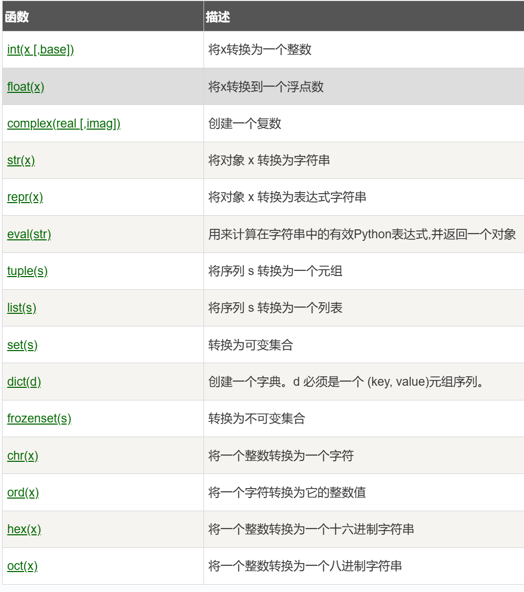
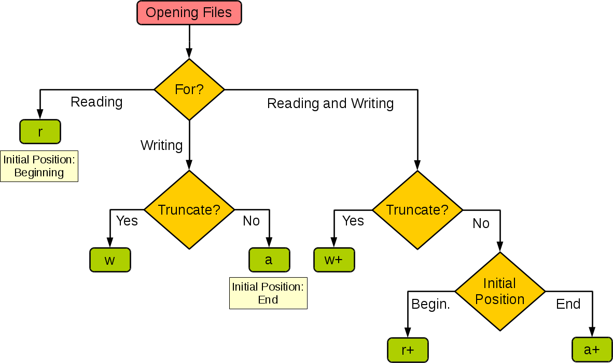
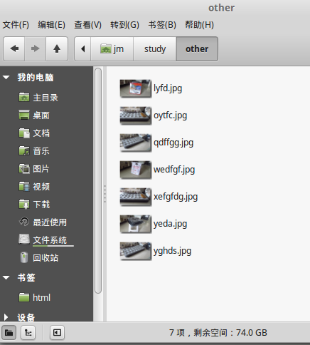
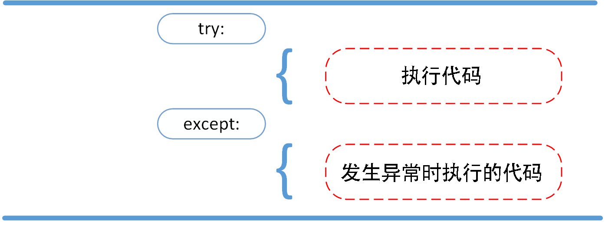
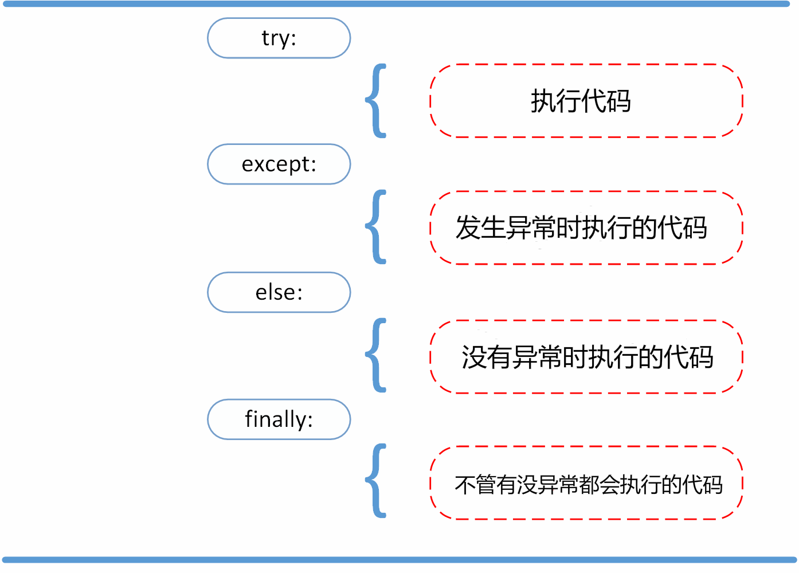
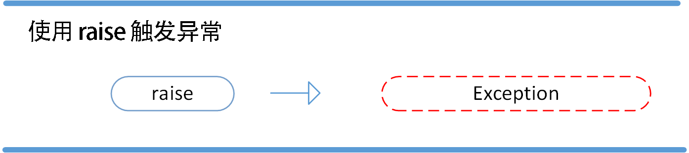

# python学习笔记

# 小知识点

- 字符串前面加上`r` 表示这是一个原始字符串,不发生转义,**先视为普通字符**
- `\.` 表示匹配一个实际的点号（`.`），因为在正则表达式里，点号 `.` 有特殊含义（匹配除换行符外的任意字符）

默认情况下，Python 3 源码文件以 **UTF-8** 编码，所有字符串都是 unicode 字符串。

在 Python 3 中，可以用中文作为变量名，非 ASCII 标识符也是允许的了。

## 行与缩进

python最具特色的就是使用缩进来表示代码块，不需要使用大括号 **{}** 。

缩进的空格数是可变的，但是同一个代码块的语句必须包含**相同的缩进空格数**。

## 多行语句

Python 通常是一行写完一条语句，但如果语句很长，我们可以使用反斜杠 **\** 来实现多行语句，例如：

```python
total = item_one + \
        item_two + \
        item_three
```

在 [], {}, 或 () 中的多行语句，不需要使用反斜杠 **\**，例如：

```python
total = ['item_one', 'item_two', 'item_three',
        'item_four', 'item_five']
```

## 字符串(String)

- Python 中单引号 **'** 和双引号 **"** 使用**完全相同**。
- 使用三引号(**'''** 或 **"""**)可以指定一个**多行**字符串。
- 转义符 \\。
- 反斜杠可以用来转义，使用 **r** 可以让反斜杠**不发生转义**。 如 **r"this is a line with \n"** 则 **\n** 会显示，并不是换行。
- 按字面意义级联字符串，如 **"this " "is " "string"** 会被自动转换为 **this is string**。
- 字符串可以用 **+** 运算符**连接**在一起，用 ***** 运算符**重复**。
- Python 中的字符串有两种索引方式，从左往右以 **0** 开始，从右往左以 **-1** **开始**。
- Python 中的字符串**不能改变**。
- Python **没有单独的字符类型**，一个字符就是长度为 1 的字符串。
- 字符串切片 **str[start:end]**，其中 start（包含）是切片开始的索引，end（不包含）是切片结束的索引。
- 字符串的切片可以加上步长参数 step，语法格式如下：**str[start:end:step]

## 空行

函数之间或类的方法之间用**空行分隔**，表示**一段新的代码的开始**。类和函数入口之间也用一行空行分隔，以突出函数入口的开始。

空行与代码缩进不同，空行并**不是** Python **语法**的**一部分**。书写时不插入空行，Python 解释器运行也不会出错。但是空行的作用在于分隔两段不同功能或含义的代码，便于日后代码的维护或重构。

**记住：**空行也是程序代码的一部分。

------

## 等待用户输入

执行下面的程序在按回车键后就会等待用户输入：

```python
 input("\n\n按下 enter 键后退出。")
```


以上代码中 ，**\n\n** 在结果输出前会**输出两个新的空行**。一旦用户按下 **enter** 键时，程序**将退出**。

## 同一行显示多条语句

Python 可以在**同一行**中使用多条语句，语句之间使用**分号 ; 分割**，以下是一个简单的实例：

使用**交互式**命令行执行，输出结果为：

```
>>> import sys; x = 'runoob'; sys.stdout.write(x + '\n')
runoob
7
```

此处的 7 表示字符数，**runoob** 有 6 个字符，**\n** 表示一个字符，加起来 **7** 个字符。

```
>>> import sys
>>> sys.stdout.write(" hi ")    # hi 前后各有 1 个空格
 hi 4
```

------

## 多个语句构成代码组

**缩进相同**的一组语句构成一个代码块，我们称之代码组。

像if、while、def和class这样的复合语句，首行以**关键字开始**，以**冒号( : )结束**，该行之后的一行或多行代码构成**代码组**。

我们将首行及后面的代码组称为一个**子句(clause)**。

如下实例：

```
if expression : 
   suite
elif expression : 
   suite 
else : 
   suite
```

------

## print 输出

**print** 默认输出是**换行**的，如果要实现不换行需要在**变量**末尾加上 **end=""**：

```python
#!/usr/bin/python3
 
x="a"
y="b"
# 换行输出
print( x )
print( y )
 
print('---------')
# 不换行输出
print( x, end=" " )
print( y, end=" " )
print()
```

以上实例执行结果为：

```
a
b
---------
a b
```

## import 与 from...import

在 python 用 **import** 或者 **from...import** 来导入相应的模块。

将**整个**模块(somemodule)导入，格式为： **import somemodule**

从某个模块中导入**某个函数**,格式为： **from somemodule import somefunction**

从某个模块中导入**多个函数**,格式为： **from somemodule import firstfunc, secondfunc, thirdfunc**

将某个模块中的全部**函数**导入，格式为： **from somemodule import \***

## 导入 sys 模块(需要前缀)

```python
import sys
print('================Python import mode==========================')
print ('命令行参数为:')
for i in sys.argv:
    print (i)
print ('\n python 路径为',sys.path)
```

## 导入 sys 模块的 argv,path 成员(不用前缀了)

```python
from sys import argv,path  #  导入特定的成员
 
print('================python from import===================================')
print('path:',path) # 因为已经导入path成员，所以此处引用时不需要加sys.path
```

## 命令行参数

很多程序可以执行一些操作来查看一些基本信息，Python可以使用-h参数查看各参数帮助信息：

```
$ python -h
usage: python [option] ... [-c cmd | -m mod | file | -] [arg] ...
Options and arguments (and corresponding environment variables):
-c cmd : program passed in as string (terminates option list)
-d     : debug output from parser (also PYTHONDEBUG=x)
-E     : ignore environment variables (such as PYTHONPATH)
-h     : print this help message and exit

[ etc. ]
```

我们在使用脚本形式执行 Python 时，可以接收命令行输入的参数，具体使用可以参照 [Python 3 命令行参数](https://www.runoob.com/python3/python3-command-line-arguments.html)。

# Python3 基本数据类型

Python 中的变量**不需要声明**。每个变量在**使用前**都必须**赋值**，变量赋值以后该变量**才会被创建**。

### 多个变量赋值

Python允许你同时为多个变量赋值。

以上实例，创建一个整型对象，值为 1，从后向前赋值，三个变量被赋予相同的数值。

您也可以为多个对象指定多个变量。例如：

```python
a, b, c = 1, 2, "runoob"
```

Python3 的六个标准数据类型中：

- **不可变数据（3 个）：**Number（数字）、String（字符串）、Tuple（元组）；
- **可变数据（3 个）：**List（列表）、Dictionary（字典）、Set（集合）。

此外还有一些**高级**的数据类型，如: 字节数组类型(bytes)。

在Python 3里，只有一种整数类型 **int**，表示为长整型，没有 python2 中的 Long。

内置的 type() 函数可以用来查询变量**所指的对象类型**。

```
>>> a, b, c, d = 20, 5.5, True, 4+3j
>>> print(type(a), type(b), type(c), type(d))
<class 'int'> <class 'float'> <class 'bool'> <class 'complex'>
```

此外还可以用 **isinstance** 来判断：

## 实例

\>>> a = 111
\>>> isinstance(a, int)
True
\>>>

isinstance 和 type 的区别在于：

- type()不会认为子类是一种父类类型。
- isinstance()会认为子类是一种父类类型。

```
>>> class A:
...     pass
... 
>>> class B(A):
...     pass
... 
>>> isinstance(A(), A)
True
>>> type(A()) == A 
True
>>> isinstance(B(), A)
True
>>> type(B()) == A
False
```

> **注意：**Python3 中，bool 是 int 的**子类**，True 和 False 可以和数字相加，True\==1,False==0 会返回 **True**，但可以通过 **is** 来判断类型。
>
> ```
> >>> issubclass(bool, int) 
> True
> >>> True==1
> True
> >>> False==0
> True
> >>> True+1
> 2
> >>> False+1
> 1
> >>> 1 is True
> False
> >>> 0 is False
> False
> ```
>
> 在 Python2 中是没有布尔型的，它用数字 0 表示 False，用 1 表示 True。

del语句的语法是：

```
del var1[,var2[,var3[....,varN]]]
```

您可以通过使用del语句删除单个**或多个**对象。例如：

```
del var
del var_a, var_b
```

数值的除法包含两个运算符：**/** 返回一个**浮点**数，**//** 返回一个**整**数。

Python 还支持复数，复数由实数部分和虚数部分构成，可以用 **a + bj**，或者 **complex(a,b)** 表示， 复数的实部 **a** 和虚部 **b** 都是浮点型。

可以使用 `bool()` 函数将其他类型的值转换为布尔值。以下值在转换为布尔值时为 `False`：`None`、`False`、零 (`0`、`0.0`、`0j`)、空序列（如 `''`、`()`、`[]`）和空映射（如 `{}`）。**其他所有**值转换为布尔值时均为 `True`。

列表**可以使用 +** 操作符进行拼接。步长为**隔n-1**选数,-1表示**逆着**来

虽然tuple的元素不可改变，但它可以**包含可变的对象**，比如list列表。

构造包含 0 个或 1 个元素的元组比较特殊，所以有一些额外的语法规则.

```python
tup1 = ()    # 空元组
tup2 = (20,) # 一个元素，需要在元素后添加逗号
```

元组也可以使用 **+** 操作符进行拼接。

可以使用 **set()** **函数**创建集合。

**注意：**创建一个空集合必须用 **set()** 而不是 **{ }**，因为 **{ }** 是用来创建一个**空字典**。

## bytes 类型

在 Python3 中，bytes 类型表示的是不可变的**二进制**序列（byte sequence）。

与字符串类型不同的是，bytes 类型中的元素是**整数值**（0 到 255 之间的整数），而不是 Unicode 字符。

bytes 类型通常用于**处理二进制**数据，比如**图像文件、音频文件、视频文件**等等。在网络编程中，也经常使用 bytes 类型来传输二进制数据。

创建 bytes 对象的方式有多种，最常见的方式是**使用 b 前缀**：

此外，也可以使用 **bytes() 函数**将其他类型的对象转换为 bytes 类型。bytes() 函数的第一个参数是要转换的对象，第二个参数是编码方式，如果省略第二个参数，则**默认使用 UTF-8** 编码：

```python
x = bytes("hello", encoding="utf-8")
```

与字符串类型类似，bytes 类型也支持许多操作和方法，如切片、拼接、查找、替换等等。同时，由于 bytes 类型是不可变的，因此在进行修改操作时需要创建一个新的 bytes 对象。例如：

```python
x = b"hello"
y = x[1:3]  # 切片操作，得到 b"el"
z = x + b"world"  # 拼接操作，得到 b"helloworld"
```

需要注意的是，bytes 类型中的元素是整数值，因此在进行比较操作时需要使用相应的整数值。 **ord()** 函数用于将字符转换为相应的整数值。



补充:

在 **Windows 下**可以不写第一行注释:

```
#!/usr/bin/python3
```

第一行注释标的是**指向 python 的路径**，告诉操作系统执行这个脚本的时候，调用 /usr/bin 下的 python 解释器。

此外还有以下形式（推荐写法）：

```
#!/usr/bin/env python3
```

这种用法**先在 env（环境变量）**设置里查找 python 的安装路径，再调用对应路径下的解释器程序完成操作。

关于注释，也可以使用 **''' '''** 的格式在三引号之间书写**较长**的注释；

**''' '''** 还可以用于在函数的**首部**对函数进行一个说明：

```
def example(anything):
    '''形参为任意类型的对象，
       这个示例函数会将其原样返回。
    '''
    return anything
```

在 print 打印的时候双引号与单引号都可以当做定界符使用，且可以**嵌套**。

被嵌套的会被**解释成为标点符号(不需转义)**，反之一样。

代码实例：

```
print("Hello'World!")
```

这句代码执行时，外侧的双引号为定界符，里面的那个单引号为标点符号。

“Windows 命令行窗口”下清屏，可用下面两种方法。

第一种方法，在命令行窗口输入：

```
>>> import os
>>> i=os.system("cls")
```

当字符串内容为浮点型要转换为整型时，无法直接用 int() 转换：

```
a='2.1'  # 这是一个字符串
print(int(a))
```

会报错 **"invalid literal for int() "**。

需要把字符串先转化成 float 型再转换成 int 型：

```
a='2.1'
print(int(float(a)))
```

类似于 C/C++ 的 **printf**，Python 的 **print** 也能实现**格式化**输出，方法是使用 **%** 操作符，它会将左边的字符串当做格式字符串，将右边的参数代入格式字符串：

```
print("100 + 200 = %d" % 300) #左边的%d被替换成右边的300
print("A的小写是%s" % "a") #左边的%s被替换成右边的a
```

得到的结果是：

```
100 + 200 = 300A的小写是a
```

如果要带入多个参数，则**需要用 () 包裹**代入的多个参数，参数与参数之间用逗号隔开，参数的**顺序**应该对应格式字符串中的顺序：

```
print("%d + %d = %d" % (100,200,300))
print("%s %s" % ("world","hello"))
```

得到的结果是：

```
100 + 200 = 300world hello
```

格式字符串中，不同占位符的含义：

-  **%s**： 作为字符串
-  **%d**： 作为**有**符号十进制整数
-  **%u**： 作为无符号十进制整数
-  **%o**： 作为无符号八进制整数
-  **%x**： 作为无符号十六进制整数，a～f采用小写形式
-  **%X**： 作为无符号十六进制整数，A～F采用大写形式
-  **%f**： 作为浮点数
-  **%e，%E**： 作为浮点数，使用科学计数法
-  **%g，%G**： 作为浮点数，使用最低有效数位

# py基本数据类型

## 元组（小拓展）

一般来说，函数的返回值一般为一个。

而函数返回**多个值**的时候，是以**元组**的方式返回的。

示例（命令行下）：

```
>>>def example(a,b):
...     return (a,b)
...
>>>type(example(3,4))
<class 'tuple'>
>>>
```

python中的函数还可以接收**可变长参数**，比如**以 "*" 开头的的参数名**，会将所有的参数收集到一个**元组**上。

例如：

```
def test(*args):
    print(args)
    return args

print(type(test(1,2,3,4)))    #可以看见其函数的返回值是一个元组
```

## 字典（小拓展）

python中的字典是使用了一个称为**散列表（hashtable）的算法**（不具体展开），

其特点就是：不管字典中有多少项，**in操作符花费的时间都差不多**。

如果把一个字典对象作为for的迭代对象，那么这个操作将会遍历字典的**键(无值)**：

```
def example(d):
    # d 是一个字典对象
    for c in d:
        print(c)
        #如果调用函数试试的话，会发现函数会将d的所有键打印出来;
        #也就是遍历的是d的键，而不是值.
```

针对楼上的 字典 拓展，做测试的时候，想要输出 kye:value的组合发现可以这样：

```
for c in dict:
    print(c,':',dict[c])
```

或者

```
for c in dict:
    print(c,end=':');
    print(dict[c])
```

于是发现 print()函数 其实可以 添加多个参数，用**逗号 隔开**。

本来想要用

```
for c in dict:
    print(c+':');
    print(dict[c])
```

这样的方式打印 key：value结果发现其实 **key不一定是 string类型**，所以 用+ 号会出问题。

在list的使用中，开始时很容易忽视的一点是：

```
list = [ 'abcd', 786 , 2.23, 'runoob', 70.2 ]
print (list[1:3])       # 从第二个开始输出到第三个元素
```

list[1:3] 其实输出的只有两个变量，即list中第二个元素到第三个元素，并不是第1 第2 第3三个元素，而且要注意的是

```
print (list[2])
print (list[2:3])
```

这两句话打印的**内容**其实是**一样**的，

```
2.23
[2.23]
```

但是**第二句话有中括号**

\-其实我觉得可以这样理解：

其实我们可以试验一下：

```
print (list[0:1])       # 没有输出的值
# 获得结果 ['abcd']
```

但注意是**不同的类型**，用变量接收一下：

```
a = list[2]
b = list[2:3]
type(a) -> <class 'float'>
type(b) -> <class 'list'>
```

**type 是用于求一个未知数据类型对象，而 isinstance 是用于判断一个对象是否是已知类型。**

type 不认为子类是父类的一种类型，而isinstance会认为子类是父类的一种类型。

可以用 isinstance 判断子类对象是否继承于父类，type 不行。

综合以上几点，type 与 isinstance 虽然都与数据类型相关，但两者其实用法不同，type 主要用于判断未知数据类型，isinstance 主要用于判断 A 类**是否继承**于 B 类：

```
# 判断子类对象是否继承于父类
class father(object):
    pass
class son(father):
    pass
if __name__ == '__main__':
    print (type(son())==father)
    print (isinstance(son(),father))
    print (type(son()))
    print (type(son))
```

运行结果：

```
False
True
<class '__main__.son'>
<type 'type'>
```

**字典（小拓展）**

输入 dict 的键值对，可直接用 **items()** 函数：

```
dict1 = {'abc':1,"cde":2,"d":4,"c":567,"d":"key1"}
for k,v in dict1.items():
    print(k,":",v)
```

**字典（小拓展）**

原文说 dict(d)创建一个字典。d 必须是一个序列 (key,value)元组。

其实d不一定必须为一个序列元组，如下：

```
>>> dict_1 = dict([('a',1),('b',2),('c',3)]) #元素为元组的列表
>>> dict_1
{'a': 1, 'b': 2, 'c': 3}
>>> dict_2 = dict({('a',1),('b',2),('c',3)})#元素为元组的集合
>>> dict_2
{'b': 2, 'c': 3, 'a': 1}
>>> dict_3 = dict([['a',1],['b',2],['c',3]])#元素为列表的列表
>>> dict_3
{'a': 1, 'b': 2, 'c': 3}
>>> dict_4 = dict((('a',1),('b',2),('c',3)))#元素为元组的元组
>>> dict_4
{'a': 1, 'b': 2, 'c': 3}
```

注意：列表、元组、集合有所区别(新人特别容易入坑)。

列表和元组不会把**相同的值**合并，但是集合会把相同的合并。

```
>>> clist = ['tom','tom','jerry']                #测试列表功能
>>> print (clist）
['tom','tom','jerry']

>>>ctuple = ('tom','tom','jerry')           #测试元组功能
>>>print(ctuple)
('tom','tom','jerry') 

>>>cset = {'tom','tom','jerry'}                #测试集合功能
>>>print(cset)
{'tom','jerry'}
```

关于列表的创建细节补充：

```
>>> o = {1, 2, 3}
>>> type(o)
<class 'set'>
>>> o = {}
>>> type(o)
<class 'dict'>
```

关于字典推导式的一些案例：

```
# 字典推导式
p = {i:str(i) for i in range(1,5)}
print("p:",p)
'''
p: {1: '1', 2: '2', 3: '3', 4: '4'}
'''

x = ['A','B','C','D']
y = ['a','b','c','d']
n = {i:j for i,j in zip(x,y)}
print("n:",n)
'''
n: {'A': 'a', 'B': 'b', 'C': 'c', 'D': 'd'}
'''

s = {x:x.strip() for x in ('he','she','I')}
print("s:",s)
'''
s: {'he': 'he', 'she': 'she', 'I': 'I'}
'''
```

**所有数据类型都是类。**

也就是说，int、str等数据类型**不是函数**，只是一个类罢了。

用int()、str()、list()等都是初始化相应的类，那么123456、"Runoob“、[1,2,3] 等都是相应数据类型的初始化结果。

有很多人和教学网站都认为int、str、list等数据类型都是函数，但这是错误的。type(int)的输出结果表明int是一个类。

此处延伸下变量和对象之间的关系：

- 赋值操作，本质是**创建引用**
- **变量是变量，对象是对象**，当将某个对象赋值给某个变量时，可以认为是**创建了变量对该对象的引用**
- **变量没有数据类型之说**，只有对象有，即变量不是直接代表对象或对象占用的内存空间
- Python中，变量**无需提前声明**，无需指定其数据类型，其**表现完全是动态**的，其所为的数据类型决定于当前该变量所引用的对象的数据类型
- 所谓变量对对象的引用，本质是创建了变量指向对象内存空间的**指针**
- 对象内存空间，一般最起码有类型和当前被引用次数这两个信息，类型记录了该对象的数据类型，被引用次数记录了该对象内存空间被变量引用的次数
- 当某对象的被引用次数为0时，Python便会**自动回收**该对象内存空间

比如下面的

```
a=10
a='122'
a=[1,2,3]
del a
```

此时，a在不同的赋值代码行中，引用的对象类型不同，相当于在**不断改变a引用的对象**，最后当把a变量删除时，其实**本质只是删除了a变量名**，但由于a引用的[1,2,3]对象，因为a被删除，其**被引用次数变为0**，也就**自动被Python回收**，**最终表现就是del a**时，[1,2,3]**也**被删除了。

另外一个小知识是，Python为提升代码执行和内存分配效率，会对一些**常用的对象提前创建好**，并**常驻内存**，比如下面：

```
id(4) #不管运行多少次该代码，其返回的值均不变，因为python会保持一些常用的数字常驻内存，不会每次都重新分配内存空间
id('hello world') #每次运行，返回的值均会发生变化，因为每次运行，相当于都在重新分配内存空间
```

type的意思可以理解为：检查这个变量**本身**的类型，而不用管他的父类的类型

isinstance的意思可以理解为：判断这个变量的类型**是不是属于某一个大类**，就好像找家谱一样，判断你是不是这个家族的人

is用来不仅会对比**数值**是否一样，还会对比**类型**是否相同，并且是不是对比父类类型

- **列表(有序集合)的偏移访问**依赖于元素在列表中的位置索引（从0开始的整数），因此访问**顺序**是固定的。
- **元组,**即**不可改变的列表**
- **字典(无序集合)的键访问**是通过键来获取值，键可以是任何不可变类型的对象（通常是字符串或数字），并且字典中的元素顺序是**无序**的，因为它们是根据哈希表实现的。

# Python3 数据类型转换

在Python中，数据类型的"高"和"低"主要根据它们的精度来判断。

这里的"较高"数据类型指的是能够**表示更多信息（或更精确信息）**的数据类型，而"较低"的数据类型则表示的信息较少。

**并非所有**类型的数据都可以被转换成其他任意类型。转换是否可行，主要取决于数据本身是否包含足够的信息来表示目标类型。

例如：

1. 你可以**轻松地将整数转换为字符串**，因为每一个整数都有一个明确的字符串表示（例如，整数123可以表示为字符串"123"）。
2. 类似地，一个**只包含数字**字符的字符串（如"123"）可以被转换为一个整数或浮点数，因为这个字符串中包含了足够的信息来表示一个数字。

然而：

1. 对于一个非数字字符串（如"Hello"），它无法被转换为一个整数或浮点数，因为这个字符串并不包含任何可以表示一个数字的信息。
2. 对于一个列表或元组，它可以被转换为一个集合（如果它的**元素是不可变的**），但不能被转换为一个整数，因为一个集合或列表中的元素无法合理地表示为一个**单独**的数字。

#  Python3 解释器

## 交互式编程

当键入一个多行结构时，**续行(是解释器自己给的)**是必须的。我们可以看下如下 if 语句：

```
>>> flag = True
>>> if flag :
...     print("flag 条件为 True!")
... 
flag 条件为 True!
```

## 脚本式编程

将如下代码拷贝至 **hello.py**文件中：

```
print ("Hello, Python!");
```

通过以下命令执行该脚本：

```
python3 hello.py
```

输出结果为：

```
Hello, Python!
```

Python 解释器可不止一种哦，有 CPython、IPython、Jython、PyPy 等。

顾名思义，**C**Python 就是用 **C 语言**开发的了，是官方标准实现，拥有良好的生态，所以应用也就**最为广泛**了。

而 **I**Python 是在 CPython 的基础之上在**交互式方面**得到增强的解释器（http://ipython.org/）。

Jython 是**专为 Java 平台设计**的 Python 解释器（http://www.jython.org/），它把 Python 代码编译成 Java 字节码执行。

PyPy 是 Python 语言（2.7.13和3.5.3）的一种**快速、兼容**的**替代实现**（http://pypy.org/），以**速度快**著称。

**$ python test.py 运行失败**

在 cmd 窗口输入 **$ python test.py**，得到运行错误的提示：

- Python 的**实际工作**场景往往是 **Unix 或者 Linux**。而代码开头的 `$` 表示 **UNIX 或 Mac OS** 操作系统命令提示符。`$`的意思就是 “**提示用户**输入命令行”，`$` **本身不在**输入的命令语句中。`$` 是不需要输入的。
- Python 的编程模式分为两种：**交互式**，**脚本式**。
- 脚本式编程，就是我们先把 python 语句写好，保存在后缀为 .py 的文件里，然后从**外部调用**这个文件。
- 如果我们要在cmd窗口调用test.py文件，只需要将**cmd路径目录转入test.py所在的文件夹，然后输入命令即可**

# py注释

在 Python 中，多行注释是由三个单引号 **'''** 或三个双引号 **"""** 来定义的，而且这种注释方式并不能嵌套使用。

当你开始一个多行注释块时，Python 会一直将后续的行都当作注释，直到遇到另一组三个单引号或三个双引号。

**嵌套多行注释会导致语法错误。**

例如，下面的示例是不合法的：

## 实例

```python
'''
这是外部的多行注释
可以包含一些描述性的内容

  '''
  这是尝试嵌套的多行注释
  会导致语法错误
  '''
'''
```

在这个例子中，内部的三个单引号并没有被正确识别为多行注释的结束，而是被解释为**普通的字符串**。

这将导致代码结构不正确，最终可能导致语法错误。

如果你需要在注释中包含**嵌套**结构，推荐使用**单行注释**（以#开头）而不是多行注释。

1. 三个双引号赋值给字符串变量时，表示一种字符串的特殊写法。

	```
	>>> str="""I
	... want
	... you"""
	>>> str
	'I\nwant\nyou'
	>>> print(str)
	I
	want
	you
	```

	单引号在这里的用法与双引号相同。

	当函数中有语句的时候，是无法**输出函数的注释**的:

	```
	def a():
	    a=1
	    '''这是文档字符串'''
	    pass
	print(a.__doc__)
	```

	输出结果为：**None**

	以下这种方式可以，所以注释应该放在函数的**第一行**：

	```
	def a():
	    '''这是文档字符串'''
	    a = 1
	    pass
	print(a.__doc__)
	```

	```
	这是文档字符串
	```

# Python3 运算符

| **   | 幂 - 返回x的y次幂                                            |
| ---- | ------------------------------------------------------------ |
| **=  | 幂赋值运算符                                                 |
| :=   | 海象运算符，这个运算符的主要目的是在表达式中**同时进行赋值和返回赋值**的值。**Python3.8 版本新增运算符**。 |

## Python逻辑运算符

Python语言支持逻辑运算符，以下假设变量 a 为 10, b为 20:

| 运算符 | 逻辑表达式 | 描述                                                         | 实例                    |
| :----- | :--------- | :----------------------------------------------------------- | :---------------------- |
| and    | x and y    | 布尔"与" - 如果 x 为 False，x and y 返回 **x 的值**，否则返回 **y 的计算值**。 | (a and b) 返回 20。     |
| or     | x or y     | 布尔"或" - 如果 x 是 True，它返回 x 的值，否则它返回 y 的计算值。 | (a or b) 返回 10。      |
| not    | not x      | 布尔"非" - 如果 x 为 True，返回 False 。如果 x 为 False，它返回 True。 | not(a and b) 返回 False |

## Python成员运算符

除了以上的一些运算符之外，Python还支持**成员**运算符，测试实例中包含了一系列的成员，包括字符串，列表或元组。

| 运算符 | 描述                                                    | 实例                                              |
| :----- | :------------------------------------------------------ | :------------------------------------------------ |
| in     | 如果在**指定的序列中找到值**返回 True，否则返回 False。 | x 在 y 序列中 , 如果 x 在 y 序列中返回 True。     |
| not in | 如果在指定的序列中没有找到值返回 True，否则返回 False。 | x 不在 y 序列中 , 如果 x 不在 y 序列中返回 True。 |

## Python身份运算符

身份运算符用于比较两个对象的存储单元

| 运算符 | 描述                                        | 实例                                                         |
| :----- | :------------------------------------------ | :----------------------------------------------------------- |
| is     | is 是判断两个标识符是不是**引用自一个对象** | **x is y**, 类似 **id(x) == id(y)** , 如果引用的是同一个对象则返回 True，否则返回 False |
| is not | is not 是判断两个标识符是不是引用自不同对象 | **x is not y** ， 类似 **id(x) != id(y)**。如果引用的不是同一个对象则返回结果 True，否则返回 False。 |

**注：** [id()](https://www.runoob.com/python/python-func-id.html) 函数用于获取**对象内存地址**。

即python 中的 and **从左到右**计算表达式，若所有值均为真，则返回最后一个值，若存在假，返回第一个假值；

or 也是从左到有计算表达式，返回第一个为真的值；

```
a = 00111100
```

这么个赋值语句被提示了错误，于是去搜了下相关的博客得知 python 中数字有以下的表示方式：

**2** 进制是以 **0b** 开头的: 例如: 0b11 则表示十进制的 3

**8** 进制是以 **0o** 开头的: 例如: 0o11 则表示十进制的 9

**16** 进制是以 **0x** 开头的: 例如: 0x11 则表示十进制的 17

但是在测试的时候又遇到了个问题，那就是输出来的**被自动转化**成了十进制：

```
>>> a=0b111100
>>> a
60
```

于是又去找了怎么输出二进制，得到了以下内容：

分别使**用 bin，oct，hex** 可输出数字的二进制，八进制，十六进制形式，例如：

```
>>> a=0b111100
>>> a=60
>>> bin(a)
'0b111100'
>>> oct(a)
'0o74'
>>> hex(a)
'0x3c'
```

 python 没有自增运算符

```
>>> b = 5  
>>> a = 5  
>>> id(a)  
162334512  
>>> id(b)  
162334512  
>>> a is b  
True  
```

可以看出， python 中，变量是**以内容为基准**而不是像 c 中以变量名为基准，所以只要你的数字内容是5，不管你起什么名字，这个变量的 **ID 是相同**的，同时也就说明了 python 中一个变量可以以多个名称访问。

这样的设计逻辑决定了 python 中数字类型的值是不可变的，因为如果如上例，a 和 b 都是 5，当你改变了 a 时，b 也会跟着变，这当然**不是我们希望**的。

因此，正确的自增操作应该 a = a + 1 或者 a += 1，当此 a 自增后，通过 id() 观察可知，**id 值变化**了，即 a 已经是新值的名称。

如果不用 a = b 赋值，int 型时，在数值为 **-5~256（64位系统）**时，两个变量引用的是同一个内存地址，其他的数值就不是同一个内存地址了。

**== 和 is 的区别**

**is** 判断两个对象是否为同一对象, 是通过 **id** 来判断的; 当两个**基本类型**数据(或**元组**)**内容**相同时, id 会相同, 但并不代表 a 会随 b 的改变而改变。

**==** 判断两个对象的**内容**是否相同, 是通过调用 **__eq__()** 来判断的

优先级：

```
() > not > and > or
```

# Python3 条件控制

**注意：**

- 1、每个条件后面要使用**冒号 :**，表示接下来是满足条件后要执行的语句块。
- 2、使用**缩进**来划分语句块，相同缩进数的语句在一起组成一个语句块。
- 3、在 Python 中没有 **switch...case** 语句，但在 Python3.10 版本添加了 **match...case**

## match...case

Python 3.10 增加了 **match...case** 的条件判断，不需要再使用一连串的 **if-else** 来判断了。

match 后的对象会依次与 case 后的内容进行**匹配**，如果匹配成功，则执行匹配到的表达式，否则直接跳过，**_** 可以匹配一切。

语法格式如下：(**无需break**)

```python
match subject:
    case <pattern_1>:
        <action_1>
    case <pattern_2>:
        <action_2>
    case <pattern_3>:
        <action_3>
    case _:
        <action_wildcard>
```

**case _:** 类似于 C 和 Java 中的 **default:**，当其他 case 都无法匹配时，匹配这条，保证永远会匹配成功。

## 实例

**def** http_error(status):
  **match** status:
    **case** 400:
      **return** "Bad request"
    case 404:
      **return** "Not found"
    case 418:
      **return** "I'm a teapot"
    case _: #\_是一个特殊的“占位符”模式，用于匹配任何值（类似于 else）
      return "Something's wrong with the internet"

mystatus=400
**print**(http_error(400))

一个 case 也可以设置**多个匹配条件**，条件使用 **｜ 隔开**，例如：

```python
...
    case 401|403|404:
        return "Not allowed"
```

如果 if 语句中的条件过长，可以用接续符 \来换行。

例如：

```python
if 2>1 and 3>2 and 4>3 and \
    5>4 and 6>5 and 7>6 and \
    8>7:
    print("OK")
```

**注意**: \后的一行要**缩进没有要求**，可无序缩进，但我们保持代码的可读性**一般设置同样**的缩进格式。

Python 中 while 语句的一般形式：(在 Python 中没有 do..while 循环)

```python
while 判断条件(condition)：
    执行语句(statements)……
```

可以使用 **CTRL+C** 来退出当前的无限循环。**无限循环**在服务器上客户端的**实时请求**非常有用。

### while 循环使用 else 语句

如果 while 后面的条件语句为 false 时，则执行 else 的语句块。

### 简单语句组

类似 if 语句的语法，如果你的 while 循环体中只有一条语句，你可以将该语句与 while 写在**同一行**中

Python for 循环可以遍历任何可迭代对象，如一个列表或者一个字符串。(variable可**创建**)

```python
for <variable> in <sequence>:
    <statements>
else:
    <statements>
```

## range() 函数

如果你需要遍历数字序列，可以使用**内置 range()** 函数。它会**生成数列**,还可以使用 range() 函数来**创建一个列表**

## pass 语句

Python pass是**空语句**，是为了保持程序结构的**完整**性。

pass 不做任何事情，一般用做**占位**语句，如下实例

**关于pass的作用：**

pass只是为了防止**语法错误。**

```
if a>1:
    pass #如果没有内容，可以先写pass，但是如果不写pass，就会语法错误
```

pass就是一条空语句。在代码段中或定义函数的时候，**如果暂时没有**内容，或者先不做任何处理，直接跳过，就可以使用pass。

## 实例

\>>>while True: ...     pass  # **等待键盘中断** (Ctrl+C)

以下实例在字母为 o 时 执行 pass 语句块:

```python
#!/usr/bin/python3
 
for letter in 'Runoob': 
   if letter == 'o':
      pass
      print ('执行 pass 块')
   print ('当前字母 :', letter)
 
print ("Good bye!")
```

使用内置 **enumerate 函数(一索一值)**进行遍历:

```
for index, item in enumerate(sequence):
    process(index, item)
```

## 实例

```
>>> sequence = [12, 34, 34, 23, 45, 76, 89]
>>> for i, j in enumerate(sequence):
...     print(i, j)
... 
0 12
1 34
2 34
3 23
4 45
5 76
6 89
```

### end 关键字

关键字end可以用于将结果输出到同一行，或者在输出的末尾添加不同的字符，实例如下：

```python
a, b = 0, 1
while b < 1000:
    print(b, end=',')//换结尾参数
    a, b = b, a+b
```

print() **sep 参数(输出间隔)**使用：

```
>>> a=10;b=388;c=98
>>> print(a,b,c,sep='@')
10@388@98
```

# Python 推导式

Python 推导式是一种独特的数据处理方式，可以从一个数据序列构建**另一个新**的数据序列的结构体。

## 列表推导式

列表推导式格式为：

```
[表达式 for 变量 in 列表] 
[out_exp_res for out_exp in input_list]

或者 

[表达式 for 变量 in 列表 if 条件]
[out_exp_res for out_exp in input_list if condition]
```

- out_exp_res：列表**生成**元素表达式，可以是有返回值的**函数**。
- for out_exp in input_list：迭代 input_list 将 **out_exp 传入到 out_exp_res** 表达式中。
- if condition：条件语句，可以**过滤列表**中不符合条件的值。

# 字典推导式

## 实例

```python
listdemo = ['Google','Runoob', 'Taobao']
# 将列表中各字符串值为键，各字符串的长度为值，组成键值对
>>> newdict = {key:len(key) for key in listdemo}
>>> newdict
{'Google': 6, 'Runoob': 6, 'Taobao': 6}
```

## 元组推导式（生成器表达式）

元组推导式可以利用 range 区间、元组、列表、字典和集合等数据类型，**快速生成**一个满足指定需求的元组。

元组推导式基本格式：

```
(expression for item in Sequence )
或
(expression for item in Sequence if conditional )
```

元组推导式和列表推导式的用法也完全相同，只是元组推导式是**用 () 圆括号**将各部分括起来，而列表推导式用的是中括号 **[]**，另外元组推导式返回的结果是一个**生成器对象**。

语法格式：

```
结果值1 if 判断条件 else 结果2  for 变量名 in 原列表
list1 = ['python', 'test1', 'test2']
list2 = [word.title() if word.startswith('p') else word.upper() for word in list1]
print(list2)
```

输出结果：

```
['Python', 'TEST1', 'TEST2']
```

# Python3 迭代器与生成器

## 迭代器

迭代是 Python 最强大的功能之一，是访问集合元素的一种方式。

迭代器是一个可以**记住遍历的位置**的对象。

迭代器对象从集合的**第一个元素开始(一整个)**访问，直到所有的元素被访问完结束。迭代器**只能往前**不会后退。

迭代器有两个基本的方法：**iter()** 和 **next()**。

字符串，列表或元组对象都可用于创建迭代器：

```py
>>> list=[1,2,3,4]
>>> it = iter(list)   # 创建迭代器对象
>>> print (next(it))  # it一开始指向的是一整个对象,用了next后才会开始一个个指向元素
1
>>> print (next(it))
2
>>>


```

迭代器对象可以使用常规for语句进行遍历

```py
#!/usr/bin/python3
import sys         # 引入 sys 模块
list=[1,2,3,4]
it = iter(list)    # 创建迭代器对象
while True:
    try:
        print (next(it))
    except StopIteration:
        sys.exit()
```

### 创建一个迭代器

把**一个类作为一个迭代器使用**需要在类中实现两个方法 \_\_iter\_\_() 与 \_\_next\_\_() 。

如果你已经了解的面向对象编程，就知道类都有一个构造函数，Python 的构造函数为 _\_init\_\_(), 它会在对象**初始化的时候**执行。

\_\_iter\_\_() 方法返回一个**特殊的迭代器对象**， 这个迭代器对象实现了 \_\_next\_\_() 方法并通过 **StopIteration 异常标识**迭代的**完成**。

\_\_next\_\_() 方法（Python 2 里是 next()）会返回**下一个迭代器对象**。

### StopIteration

StopIteration 异常用于标识迭代的完成，**防止出现无限循环**的情况，在 __next__() 方法中我们可以设置在完成指定循环次数后触发 StopIteration 异常来结束迭代。

在 20 次迭代后停止执行：

```py
class MyNumbers:
  def __iter__(self):
    self.a = 1
    return self
 
  def __next__(self):
    if self.a <= 20:
      x = self.a
      self.a += 1
      return x
    else:
      raise StopIteration
 
myclass = MyNumbers()
myiter = iter(myclass)
 
for x in myiter:
  print(x)
```

## 生成器

在 Python 中，使用了 **yield** 的函数被称为**生成器**（generator）。

**yield** 是一个关键字，用于**定义生成器函数**，生成器函数是一种特殊的函数，可以在迭代过程中**逐步产生值**，而不是一次性返回所有结果。

跟普通函数不同的是，生成器是一个**返回迭代器**的函数，**只能用于迭代**操作，更简单点理解生成器**就是一个迭代器**。

当在生成器**函数中**使用 **yield** 语句时，函数的**执行将会暂停**，并将 **yield以及后面**的表达式作为**当前迭代的值返回**。

然后，每次调用生成器的 **next()** 方法或使用 **for** 循环进行迭代时，函数会从上次**暂停的地方继续**执行，直到再次遇到 **yield** 语句。这样，生成器函数可以**逐步产生**值，而**不需要一次性计算**并返回所有结果。

调用一个生成器函数，返回的是一个**迭代器对象**。

下面是一个简单的示例，展示了生成器函数的使用：

```py
def countdown(n):
    while n > 0:
        yield n
        n -= 1
# 创建生成器对象
generator = countdown(5)
# 通过迭代生成器获取值
print(next(generator))  # 输出: 5
print(next(generator))  # 输出: 4
print(next(generator))  # 输出: 3
# 使用 for 循环迭代生成器
for value in generator:
    print(value)  # 输出: 2 1
```

以上实例中，**countdown** 函数是一个生成器函数。它使用 yield 语句**逐步**产生从 n 到 1 的倒数数字。在每次调用 yield 语句时，函数会**返回当前的倒数值**，并**在下一次**调用时**从上次暂停的地方继续**执行。

通过创建生成器对象并使用 next() 函数或 for 循环迭代生成器，我们可以**逐步获取**生成器函数产生的值。在这个例子中，我们首先使用 next() 函数获取前三个倒数值，然后通过 for 循环获取剩下的两个倒数值。

生成器函数的优势是它们可以**按需生成**值，**避免一次性(会调用到时才生成)**生成大量数据并占用大量内存。此外，生成器还可以与其他迭代工具（如for循环）无缝配合使用，提供简洁和**高效**的迭代方式。

实现fibonachi

```py
import sys
def fibonacci(n): # 生成器函数 - 斐波那契
    a, b, counter = 1, 1, 1
    while True:#下while了,继续执行也会返回到这
        if (counter > n): 
            return
        yield a
        a, b = b, a + b
        counter += 1
f = fibonacci(5) # f 是一个迭代器，由生成器返回生成
while True:
    try:
        print (next(f), end=" ")
    except StopIteration:
        sys.exit()
```

来看一下有yield和没有yield的情况会对生成器了解多点：

### 不使用 yield

```
import sys
def fibonacci(n,w=0): # 生成器函数 - 斐波那契
    a, b, counter = 0, 1, 0
    while True:
        if (counter > n): 
            return
        #yield a
        a, b = b, a + b
        print('%d,%d' % (a,b))
        counter += 1
f = fibonacci(10,0) # f 是一个迭代器，由生成器返回生成

while True:
    try:
        print (next(f), end=" ")
    except :
        sys.exit()
```

输出结果：

```
1,1
1,2
2,3
3,5
5,8
8,13
13,21
21,34
34,55
55,89
89,144
```

没有yield时，函数只是**简单执行**，**没有返回**迭代器f(因而**不再print**)。这里的迭代器可以用生成l列表来理解一下：

```
>>> l = [i for i in range(0,15)]
>>> print(l)
[0, 1, 2, 3, 4, 5, 6, 7, 8, 9, 10, 11, 12, 13, 14]
>>> m = (i for i in range(0,15))
>>> print(m)
<generator object <genexpr> at 0x104b6f258>
>>> for g in m:
...     print(g,end=', ')
... 
0, 1, 2, 3, 4, 5, 6, 7, 8, 9, 10, 11, 12, 13, 14,
```

这里的m就像上面的f一样，是**迭代器**。

**什么情况下需要使用 yield？**

一个函数 f，f 返回一个 list，这个 list 是**动态计算**出来的（不管是数学上的计算还是逻辑上的读取格式化），并且这个 list 会很大（无论是固定很大还是随着输入参数的增大而增大），这个时候，我们希望每次调用这个函数并使用迭代器进行循环的时候**一个一个的得到**每个 list 元素而不是直接得到一个完整的 list 来**节省内存**，这个时候 yield 就很有用。

以斐波那契函数为例，我们一般希望从 n 返回一个 n 个数的 list：

```
def fab(max): 
   n, a, b = 0, 0, 1 
   L = [] 
   while n < max: 
       L.append(b) 
       a, b = b, a + b 
       n = n + 1 
   return L
```

上面那个 fab 函数从参数 max 返回一个有 max 个元素的 list，当这个 max 很大的时候，会非常的占用内存。

一般我们使用的时候都是这个样子的，比如：

```
f = iter(fab(1000))
while True:
    try:
        print (next(f), end=" ")
    except StopIteration:
        sys.exit()
```

这样我们实际上是**先生成了**一个 1000 个元素的 list:f，然后我们**再去使用**这个 f。

现在，我们换一个方法：

因为我们实际使用的是 list 的遍历，也就是 list 的迭代器。那么我们可以让这个函数 fab 每次只返回一个迭代器——一个计算结果，而不是一个完整的 list：

```
def fab(max): 
    n, a, b = 0, 0, 1 
    while n < max: 
        yield b 
        # print b 
        a, b = b, a + b 
        n = n + 1 
```

这样，我们每次调用fab函数，比如这样：

```
for x in fab(1000):
    print(x)
```

或者 next 函数之类的，实际上的运行方式是每次的调用**都在 yield 处中断并返回一个结果**，然后再次调用的时候再恢复中断继续运行。

**对yield的测试结果：**

1. 打个比方的话，**yield**有点像**断点**。   加了**yield**的函数，每次执行到有**yield**的时候，会返回**yield**后面的值 并且函数会**暂停**，直到下次调用或迭代终止；
2. **yield**后面可以加多个数值（可以是任意类型），但**返回的值(看调用时具体是)是元组**类型的。

```
def get():
    m = 0
    n = 2
    l = ['s',1,3]
    k = {1:1,2:2}
    p = ('2','s','t')
    while True:
        m += 1
        yield m
        yield m ,n ,l ,k ,p
        
it = get()
print(next(it)) #1
print(next(it)) #(1, 2, ['s', 1, 3], {1: 1, 2: 2}, ('2', 's', 't'))

print(next(it)) #2
print(type(next(it))) #<class 'tuple'>
```

前文提到：字符串，列表或元组对象都可用于创建迭代器。

**列表（Lists）：**

这些可能是最明显的迭代。

```
for x in [None,3,4.5,"foo",lambda : "moo",object,object()]:
    print "{0}  ({1})".format(x,type(x))
```

输出结果为：

```
None  (<type 'NoneType'>)
3  (<type 'int'>)
4.5  (<type 'float'>)
foo  (<type 'str'>)
<function <lambda> at 0x7feec7fa7578>  (<type 'function'>)
<type 'object'>  (<type 'type'>)
<object object at 0x7feec7fcc090>  (<type 'object'>)
```

**元组（Tuples）：**

元组在某些基本方面与列表不同，注意到以下示例中的可迭代对象使用**圆括号**而不是方括号，但输出与上面列表示例的输出相同。

```
for x in (None,3,4.5,"foo",lambda : "moo",object,object()):
    print "{0}  ({1})".format(x,type(x))
```

输出结果为：

```
None  (<type 'NoneType'>)
3  (<type 'int'>)
4.5  (<type 'float'>)
foo  (<type 'str'>)
<function <lambda> at 0x7feec7fa7578>  (<type 'function'>)
<type 'object'>  (<type 'type'>)
<object object at 0x7feec7fcc090>  (<type 'object'>)
```

**字典（Dictionaries）：**

字典是键值对的无序列表。当您使用for循环遍历字典时，您的虚拟变量将使用**各种键**填充。

```
d = {
  'apples' : 'tasty',
  'bananas' : 'the best',
  'brussel sprouts' : 'evil',
  'cauliflower' : 'pretty good'
}

for sKey in d:
  print "{0} are {1}".format(sKey,d[sKey])
```

输出结果为：

```
brussel sprouts are evil
apples are tasty
cauliflower are pretty good
bananas are the best
```

**也许不是**这个顺序，字典是**无序**的！！！

平时我们经常使用的 **for in** 循环体，本质就是迭代器协议的一大应用。

同时 Python 内置的集合类型（字符、列表、元组、字典）都已经实现了迭代器协议，所以才能使用 for in 语句进行迭代遍历。for in 循环体在**遇到 StopIteration 异常**时，便终止迭代和遍历。

再说下可迭代、迭代器、生成器三个概念的联系和区别。

1、可迭代概念范围最大，生成器和迭代器肯定都可迭代，但可迭代不一定都是迭代器和生成器，比如上面说到的内置集合类数据类型。可以认为，在 Python 中，只要有集合特性的，都可迭代。

2、迭代器，迭代器特点是，均可以使用 for in 和 next 逐一遍历。

3、生成器，生成器一定是迭代器，也一定可迭代。

至于 Python 中为何要引入迭代器和生成器，除了节省内存空间外，也可以显著提升代码运行速度。

自定义迭代器类示例和说明如下：

```
class MyIter():
  def __init__(self):
    #为了示例，用一个简单的列表作为需迭代的数据集合，并且私有化可视情况变为其他类型集合
    self.__list1=[1,2,3,4]
    self.__index=0

  def __iter__(self):
    #该魔法方法，必须返回一个迭代器对象，如果self已经定义了__next__()魔法方法，则只需要返回self即可
    #因为如上面所述，生成器一定是迭代器
    return iter(self.list1)    

  def __next__(self):
    #此处的魔法函数，python会自动记忆每次迭代的位置，无需再使用yield来处理
    #在使用next(obj)时，会自动调用该魔法方法
    res=self.__list1[self.__index]
    self.__index+=1
    return res
```

以上为自定义迭代器类的机制。

下面再示例说明下，如何自定义**生成器函数**，因为大多数实战场景中，使用生成器函数可能会更多一些:

```
def my_gene_func():
  index=0
  li=[1,2,3,4,5]
  yield li[index]
  index+=1
```

调用以上函数时，会返回一个生成器对象，然后对该生成器对象，使用 next() 逐一返回:

```
gene=my_gene_func()
next(gene)
```

其实核心的概念还是记忆上次迭代的位置，类中直接使用 __next__ 魔法方法实现，函数中使用 yield 实现。且怀疑，类中的 __next__ 魔法方法**底层**也是使用 yield 来实现的。

迭代器和生成器具体应用场景，就凡是需要提升运行效率或节约内存资源，且遍历的数据是集合形式的，都可以考虑。

另外一个小众的使用场景，是**变相实现协程**的效果，即在同一个线程内，实现不同任务**交替**执行

```
def mytask1():
  print('task1 开始执行')
  '''
  task code
  '''
  yield

def mytask2():
  print('task2 开始执行')
  '''
  task code
  '''
  yield

gene1=mytask1()
gene2=mytask2()

for i in range(100):
  next(gene1)
  next(gene2)
```

Python 中 yield 的用法很像 return，都是提供一个返回值，但是 yield 和 return 的最大区别在于，return 一旦返回，则**代码段执行结束**，但是 yield 在**返回值以后**，会交出 CUP 的使用权，代码段**并没有直接结束**，而是在**此处中断**，当**调用 send() 或者 next()** 方法之后，yield 可以从**之前中断的地方继续执行**。(返回值并中断,)

在一个函数中，**使用 yield 关键字**，则当前的**函数**会**变成生成器**。

下面生成一个斐波那契数列。

```py
def fib(n):
    index = 0
    a = 0
    b = 1

    while index < n:
        yield b
        a,b = b, a+b
        index += 1
```

生成器对象：

```
fib = fib(100)
print(fib)
```

打印出来的结果是一个生成器对象，并没有直接把我们想要的值打印出来。

```
<generator object fib at 0x7fef20062ac0>
```

这两段代码是 Python 生成器函数中的重要部分，用于实现斐波那契数列的生成。以下是对这两段代码的详细解释：

1. `yield a`： `yield` 是 Python 中一个非常有用的关键字，它用于**定义生成器函数**并**返回生成器对象**。当生成器函数执行到 `yield` 关键字时，它将将当前函数状态**保存为暂停**状态，并向调用方**返回一个值 `a`**，之后程序流程将被挂起，直到下次通过 `next()` 函数**调用该生成器对象**时再恢复执行状态。在斐波那契数列生成器函数中，每次执行到 `yield a` 时，都会**生成**当前数列的**一个数字 `a`** 并返回给调用方。
2. `a, b = b, a + b`： 这是 Python 中的一种元组赋值语法，可以同时将多个变量赋值为多个值。在斐波那契数列生成器函数中，这行代码的作用是更新相邻两个数字 `a` 和 `b` 的值，以便生成下一个斐波那契数。首先，变量 `a` 被赋值为变量 `b` 的值，表示将上一个斐波那契数列中的第二个数字赋值为下一个数列的第一个数字；然后，变量 `b` 被赋值为表达式 `a + b` 的值，表示将上一个斐波那契数列中的前两个数字相加得到下一个数列中的第二个数字。这样，在每次执行 `yield a` 之前，都会先更新 `a` 和 `b` 的值，从而生成下一个斐波那契数。

# py3函数

- 函数代码块以 **def** 关键词开头，后接函数标识符名称和圆括号 **()**。
- 任何传入参数和自变量必须放在圆括号中间，圆括号之间可以用于**定义参数**。
- 函数的**第一行(必须)**语句可以选择性地使用**文档字符串**—用于存放函数说明。
- 函数内容以**冒号 : 起始**，并且**缩进。**
- **return [表达式]** 结束函数，选择性地返回一个值给调用方，不带表达式的 return 相当于返回 None。

## 参数传递

在 python 中，类型属于对象，对象有不同类型的区分，**变量是没有类型的**.**[1,2,3]** 是 List 类型，**"Runoob"** 是 String 类型，而变量 a 是没有类型，它**仅仅**是一个**对象的引用（一个指针）**，可以是指向 List 类型对象，也可以是指向 String 类型对象。

### 可更改(mutable)与不可更改(immutable)对象

在 python 中，strings, tuples, 和 numbers 是不可更改的对象，而 list,dict 等则是可以修改的对象。

- **不可变类型：**变量赋值 **a=5** 后再赋值 **a=10**，这里**实际是新生成一个 int 值对象 10**，**再让 a 指向**它，而 **5 被丢弃**，不是改变 a 的值，相当于新生成了 a。
- **可变类型：**变量赋值 **la=[1,2,3,4]** 后再赋值 **la[2]=5** 则是将 list la 的**第三个元素值更改**，本身la没有动，只是其内部的一部分值被修改了。

python 函数的参数传递：

- **不可变(实则为新生成,只是原来的没变)类型：**类似 C++ 的**值传递**，如**整数、字符串、元组**。如 fun(a)，传递的只是 a 的值，没有影响 a 对象本身。如果在 fun(a) 内部修改 a 的值，则是**新生成**一个 a 的对象。
- **可变类型：**类似 C++ 的**引用传递**，如 **列表，字典**。如 fun(la)，则是将 la 真正的传过去，修改后 fun 外部的 la 也会受影响

python 中一切**都是对象**，严格意义我们不能说值传递还是引用传递，我们应该说**传不可变**对象和**传可变**对象。

### python 传不可变对象实例

通过 **id()** 函数来查看内存地址变化：

## 实例(Python 3.0+)

def change(a):    print(id(a))   # 指向的是同一个对象    a=10    print(id(a))   # 一个新对象  a=1 print(id(a)) change(a)

以上实例输出结果为：

```
4379369136
4379369136
4379369424
```

可以看见在调用函数前后，形参和实参指向的是同一个对象（对象 id 相同），在函数内部修改形参后，形参指向的是不同的 id。

## 参数

以下是调用函数时可使用的正式参数类型：

- 必需参数
- 关键字参数
- 默认参数
- 不定长参数

### 必需参数

必需参数**须以正确的顺序**传入函数。调用时的**数量必须**和声明时的一样。

### 关键字参数

关键字参数和函数调用关系紧密，函数调用使用关键字参数来确定传入的参数值。

使用关键字参数允许函数调用时参数的顺序与声明时**不一致**，因为 Python 解释器能够**用参数名匹配**参数值。

```py
#可写函数说明
def printme( str ):
   "打印任何传入的字符串"
   print (str)
   return
#调用printme函数
printme( str = "菜鸟教程")
```

### 默认参数

调用函数时，如果没有传递参数，则会使用默认参数。以下实例中如果没有传入 age 参数，则使用默认值：

```py
#!/usr/bin/python3
 
#可写函数说明
def printinfo( name, age = 35 ):
   "打印任何传入的字符串"
   print ("名字: ", name)
   print ("年龄: ", age)
   return
 
#调用printinfo函数
printinfo( age=50, name="runoob" )
print ("------------------------")
printinfo( name="runoob" )
```

以上实例输出结果：

```
名字:  runoob
年龄:  50
------------------------
名字:  runoob
年龄:  35
```

### 不定长参数

你可能需要一个函数能处理**比当初声明时更多**的参数。这些参数叫做不定长参数，和上述 2 种参数不同，声明时**不会命名**。基本语法如下：

```
def functionname([formal_args,] *var_args_tuple ):
   "函数_文档字符串"
   function_suite
   return [expression]
```

加了**星号 *** 的参数会以**元组**(tuple)的形式导入，存放所有未命名的变量参数。

```py
# 可写函数说明
def printinfo( arg1, *vartuple ):
   "打印任何传入的参数"
   print ("输出: ")
   print (arg1)
   print (vartuple)
 
# 调用printinfo 函数
printinfo( 70, 60, 50 )
```

以上实例输出结果：

```
输出: 
70
(60, 50)
```

如果在函数调用时没有指定参数，它就是一个**空元组**。我们也可以不向函数传递**未命名(带*)**的变量。

```py
def printinfo( arg1, *vartuple ):
   "打印任何传入的参数"
   print ("输出: ")
   print (arg1)
   for var in vartuple:
      print (var)
   return
# 调用printinfo 函数
printinfo( 10 )
printinfo( 70, 60, 50 )
```

还有一种就是参数带两个星号 ***\***基本语法如下：

```
def functionname([formal_args,] **var_args_dict ):
   "函数_文档字符串"
   function_suite
   return [expression]
```

加了两个星号 ***\*** 的参数会以**字典的形式**导入。

```py
# 可写函数说明
def printinfo( arg1, **vardict ):
   "打印任何传入的参数"
   print ("输出: ")
   print (arg1)
   print (vardict)
# 调用printinfo 函数
printinfo(1, a=2,b=3)
```

以上实例输出结果：

```
输出: 
1
{'a': 2, 'b': 3}
```

声明函数时，参数中星号 ***** 可以单独出现，例如:

```
def f(a,b,*,c):
    return a+b+c
```

如果单独出现星号 *****，则星号 ***** **后**的参数**必须用关键字**传入：

```
>>> def f(a,b,*,c):
...     return a+b+c
... 
>>> f(1,2,3)   # 报错
Traceback (most recent call last):
  File "<stdin>", line 1, in <module>
TypeError: f() takes 2 positional arguments but 3 were given
>>> f(1,2,c=3) # 正常
6
>>>
```

## 匿名函数

Python 使用 **lambda** 来创建匿名函数。

所谓匿名，意即不再使用 **def** 语句这样标准的形式定义一个函数。

- **lambda** 只是一个表达式，函数体比 **def** 简单很多。
- lambda 的主体是一个**表达式**，而**不是一个代码块**。仅仅能在 lambda 表达式中**封装有限的逻辑**进去。
- lambda 函数拥有自己的命名空间，且不能访问自己参数列表之外或全局命名空间里的参数。
- 虽然 lambda 函数看起来只能写一行，却不等同于 C 或 C++ 的内联函数，内联函数的目的是调用小函数时不占用栈内存从而减少函数调用的开销，提高代码的执行速度。

我们可以将匿名函数封装在一个函数内，这样可以使用同样的代码来创建多个匿名函数。

以下实例将匿名函数封装在 myfunc 函数中，通过传入不同的参数来创建不同的匿名函数：

```py
def myfunc(n):
  return lambda a : a * n
mydoubler = myfunc(2)
mytripler = myfunc(3)
print(mydoubler(11))
print(mytripler(11))
```

## 强制位置参数

Python3.8 新增了一个**函数形参语法 /** 用来指明函数形参**必须使用指定位置**参数，不能使用关键字参数的形式。

在以下的例子中，形参 **a 和 b 必须使用指定位置**参数，c 或 d 可以是位置形参或关键字形参，而 e 和 f 要求为关键字形参:

```
def f(a, b, /, c, d, *, e, f):
    print(a, b, c, d, e, f)
```

以下使用方法是正确的:

```
f(10, 20, 30, d=40, e=50, f=60)
```

以下使用方法会发生错误:

```
f(10, b=20, c=30, d=40, e=50, f=60)   # b 不能使用关键字参数的形式
f(10, 20, 30, 40, 50, f=60)           # e 必须使用关键字参数的形式
```

# Python lambda（匿名函数）

lambda 函数通常用于编写简单的、单行的函数，通常在**需要函数作为参数传递**的情况下使用，例如在 map()、filter()、reduce() 等函数中。

**lambda 函数特点：**

- lambda 函数是匿名的，它们没有函数名称，只能通过赋值给变量或作为参数传递给其他函数来使用。

- lambda 函数通常只包含一行代码，这使得它们适用于编写简单的函数。

- **lambda 语法格式：**

	```
	lambda arguments: expression
	```

以下的 lambda 函数没有参数：

```py
f = lambda: "Hello, world!"
print(f())  # 输出: Hello, world!
```

lambda 函数通常与内置函数如 map()、filter() 和 reduce() 一起使用，以便在集合上执行操作。例如：

```py
numbers = [1, 2, 3, 4, 5]
squared = list(map(lambda x: x**2, numbers))
print(squared)  # 输出: [1, 4, 9, 16, 25]
```

使用 lambda 函数与 filter() 一起，筛选偶数：

```py
numbers = [1, 2, 3, 4, 5, 6, 7, 8]
even_numbers = list(filter(lambda x: x % 2 == 0, numbers))
print(even_numbers)  # 输出：[2, 4, 6, 8]
```

下面是一个使用 reduce() 和 lambda 表达式演示如何计算一个序列的累积乘积：

```py
from functools import reduce
numbers = [1, 2, 3, 4, 5]
# 使用 reduce() 和 lambda 函数计算乘积
product = reduce(lambda x, y: x * y, numbers)
print(product)  # 输出：120
```

在上面的实例中，reduce() 函数通过**遍历** numbers 列表，并使用 lambda 函数将**累积**的结果不断更新，最终得到了 **1 \* 2 \* 3 \* 4 \* 5 = 120** 的结果。

# Python 装饰器

装饰器（decorators）是 Python 中的一种高级功能，它允许你**动态**地**修改函数或类**的行为。

装饰器是一种**函数**，它**接受一个函数**作为参数，并**返回一个新**的函数或修改原来的函数。

装饰器的语法使用 **@decorator_name** 来应用在函数或方法上。

Python 还提供了一些内置的装饰器，比如 **@staticmethod** 和 **@classmethod**，用于**定义静态方法**和**类方法**。

**装饰器的应用场景：**

- **日志记录**: 装饰器可用于**记录函数的调用信息、参数和返回值**。
- **性能分析**: 可以使用装饰器来**测量函数的执行时间**。
- **权限控制**: 装饰器可用于**限制**对某些函数的**访问权限**。
- **缓存**: 装饰器可用于实现函数**结果的缓存**，以**提高性能**。

### 基本语法

Python 装饰允许在**不修改原有**函数代码的基础上，动态地增加或修改函数的功能，装饰器本质上是一个**接收**函数作为输入并返回一个新的包装过后的函数的对象。

```py
def decorator_function(original_function):
    def wrapper(*args, **kwargs):
        # 这里是在调用原始函数前添加的新功能
        before_call_code()
        
        result = original_function(*args, **kwargs)
        
        # 这里是在调用原始函数后添加的新功能
        after_call_code()
        
        #return result
    return wrapper
# 使用装饰器
@decorator_function
def target_function(arg1, arg2):
    pass  # 原始函数的实现
```

**解析：**decorator 是一个装饰器函数，它接受一个函数 func 作为参数，并**返回一个内部函数 wrapper**，在 wrapper 函数内部，你可以**执行一些额外的操作**，然后**调用原始函数 func**，并返回其结果。

- `decorator_function` 是装饰器，它接收一个函数 `original_function` 作为参数。
- `wrapper` 是内部函数，它是实际会被调用的新函数，它包裹了原始函数的调用，并在其前后增加了额外的行为。
- 当我们使用 `@decorator_function` 前缀在 `target_function` 定义前，**Python会自动将 `target_function` 作为参数传递**给 `decorator_function`，然后将**返回的 `wrapper` 函数替换掉原来**的 `target_function`。

### 使用装饰器

装饰器通过 **@** 符号应用在函数定义之前，例如：

```
@time_logger
def target_function():
    pass
```

等同于：

```
def target_function():
    pass
target_function = time_logger(target_function)
```

通过装饰器，开发者可以在保持代码整洁的同时，灵活且高效地扩展程序的功能。

### 带参数的装饰器

装饰器函数也可以接受参数，例如：

```py
def repeat(n):
    def decorator(func):
        def wrapper(*args, **kwargs):
            for _ in range(n):
                result = func(*args, **kwargs)
            return result
        return wrapper
    return decorator
@repeat(3)
def greet(name):
    print(f"Hello, {name}!")
greet("Alice")
```

以上代码中 repeat 函数是一个**带参数的装饰器**，它接受一个整数参数 n，然后**返回一个装饰器函数**。该装饰器函数**内部定义了 wrapper 函数**，在调用原始函数之前**重复执行 n 次**。因此，greet 函数在被 @repeat(3) 装饰后，会打印三次问候语。

### 类装饰器

除了函数装饰器，Python 还支持**类装饰器**。类装饰器是包含 **__call__** 方法的**类**，它**接受一个函数**作为参数，并返回一个新的函数。

```py
class DecoratorClass:
    def __init__(self, func):
        self.func = func
    def __call__(self, *args, **kwargs):
        # 在调用原始函数之前/之后执行的代码
        result = self.func(*args, **kwargs)
        # 在调用原始函数之后执行的代码
        return result
@DecoratorClass
def my_function():
    pass
```

# Python3 数据结构

本章节我们主要结合前面所学的知识点来介绍Python数据结构。

------

## 列表

Python中列表是**可变**的，这是它区别于字符串和元组的最重要的特点，一句话概括即：列表可以修改，而字符串和元组不能。

| 方法              | 描述                                                         |
| :---------------- | :----------------------------------------------------------- |
| list.append(x)    | 把**一个元素**添加到列表的**结尾**，相当于 a[len(a):] = [x]。 |
| list.extend(L)    | 通过添加**指定列表**的所有元素来**扩充**列表，相当于 a[len(a):] = L。 |
| list.insert(i, x) | 在**指定位置插入**一个元素。第一个参数是准备插入到其前面的那个元素的**索引**，例如 a.insert(0, x) 会插入到整个列表之前，而 a.insert(len(a), x) 相当于 a.append(x) 。 |
| list.remove(x)    | 删除列表中**值为 x 的第一个**元素。如果没有这样的元素，就会返回一个错误。 |
| list.pop([i])     | 从列表的**指定位置移除**元素，**并将其返回**。如果**没有指定**索引，a.pop()返回**最后一个**元素。元素随即从列表中被移除。（方法中 i 两边的方括号表示这个参数是可选的，而不是要求你输入一对方括号，你会经常在 Python 库参考手册中遇到这样的标记。） |
| list.clear()      | 移除列表中的所有项，等于del a[:]。                           |
| list.index(x)     | 返回列表中**第一个值为 x 的元素的索引**。如果没有匹配的元素就会返回一个错误。 |
| list.count(x)     | 返回 x 在列表中出现的**次数**。                              |
| list.sort()       | 对列表中的元素进行**排序**。                                 |
| list.reverse()    | **倒排**列表中的元素。                                       |
| list.copy()       | 返回列表的浅**复制**，等于a[:]。                             |

注意：类似 insert, remove 或 sort 等修改列表的方法**没有返回值**。

## 将列表当做栈使用

在 Python 中，可以使用列表（list）来**实现**栈的功能。栈是一种后进先出（LIFO, Last-In-First-Out）数据结构，意味着最后添加的元素最先被移除。列表提供了一些方法，使其非常适合用于栈操作，特别是 **append()** 和 **pop()** 方法。

用 append() 方法可以把一个元素添加到栈顶，用不指定索引的 pop() 方法可以把一个元素从栈顶释放出来。

### 栈操作

- **压入（Push）**: 将一个元素添加到栈的顶端。
- **弹出（Pop）**: 移除并返回栈顶元素。
- **查看栈顶元素（Peek/Top）**: 返回栈顶元素而不移除它。
- **检查是否为空（IsEmpty）**: 检查栈是否为空。
- **获取栈的大小（Size）**: 获取栈中元素的数量。

以下是如何在 Python 中使用列表实现这些操作的详细说明：

### 1、创建一个空栈

## 实例

stack = []

### 2、压入（Push）操作

使用 append() 方法将元素添加到栈的顶端：

stack.append(1)
stack.append(2)
stack.append(3)
**print**(stack) # 输出: [1, 2, 3]

### 3、弹出（Pop）操作

使用 pop() 方法移除并返回栈顶元素：

top_element **= stack.pop()**
**print**(top_element) # 输出: 3
**print**(stack)     # 输出: [1, 2]

### 4、查看栈顶元素（Peek/Top）

直接访问**列表的最后一个**元素（不移除）：

top_element = stack[-1]
**print**(top_element) # 输出: 2

### 5、检查是否为空（IsEmpty）

检查列表是否为空：

is_empty = **len(stack) == 0**
**print**(is_empty) # 输出: False

### 6、获取栈的大小（Size）

使用 len() 函数获取栈中元素的数量：

size = **len**(stack)
**print**(size) # 输出: 2

```py
class Stack:
    def __init__(self):
        self.stack = []
    def push(self, item):
        self.stack.append(item)
    def pop(self):
        if not self.is_empty():
            return self.stack.pop()
        else:
            raise IndexError("pop from empty stack")
    def peek(self):
        if not self.is_empty():
            return self.stack[-1]
        else:
            raise IndexError("peek from empty stack")
    def is_empty(self):
        return len(self.stack) == 0
    def size(self):
        return len(self.stack)
# 使用示例
stack = Stack()
stack.push(1)
stack.push(2)
stack.push(3)
print("栈顶元素:", stack.peek())  # 输出: 栈顶元素: 3
print("栈大小:", stack.size())    # 输出: 栈大小: 3
print("弹出元素:", stack.pop())  # 输出: 弹出元素: 3
print("栈是否为空:", stack.is_empty())  # 输出: 栈是否为空: False
print("栈大小:", stack.size())    # 输出: 栈大小: 2
```

## 将列表当作队列使用

在 Python 中，列表（list）可以用作队列（queue），但由于列表的特点，直接使用列表来实现队列**并不是最优**的选择。

队列是一种**先进先出**（FIFO, First-In-First-Out）的数据结构，意味着最早添加的元素最先被移除。

使用列表时，如果频繁地在列表的开头插入或删除元素，性能会受到影响，因为这些**操作的时间复杂度是 O(n)**。为了解决这个问题，Python 提供了 **collections.deque**，它是**双端队列**，可以在两端高效地添加和删除元素。

### 使用 collections.deque 实现队列

collections.deque 是 Python **标准库的一部分**，非常适合用于实现队列。

以下是使用 deque 实现队列的示例：

```py
from collections import deque
# 创建一个空队列
queue = deque()
# 向队尾添加元素
queue.append('a')
queue.append('b')
queue.append('c')
print("队列状态:", queue)  # 输出: 队列状态: deque(['a', 'b', 'c'])
# 从队首移除元素
first_element = queue.popleft()
print("移除的元素:", first_element)  # 输出: 移除的元素: a
print("队列状态:", queue)            # 输出: 队列状态: deque(['b', 'c'])
# 查看队首元素（不移除）
front_element = queue[0]
print("队首元素:", front_element)    # 输出: 队首元素: b
# 检查队列是否为空
is_empty = len(queue) == 0
print("队列是否为空:", is_empty)     # 输出: 队列是否为空: False
# 获取队列大小
size = len(queue)
print("队列大小:", size)            # 输出: 队列大小: 2
```

## 列表推导式

列表**推导式**提供了**从序列创建列表**的简单途径。通常应用程序将一些操作应用于某个序列的每个元素，用其获得的结果作为生成新列表的元素，或者**根据确定的判定条件**创建子序列。

每个列表推导式都在 **for 之后跟一个表达式**，**然后有零到多个 for 或 if 子句**。返回结果是一个**根据表达从其后的 for 和 if 上下文环境中生成**出来的列表。如果希望表达式推导出一个**元组**，就必须使用**括号**。

这里我们将列表中每个数值乘三，获得一个新的列表：

```py
>>> vec = [2, 4, 6]
>>> [3*x for x in vec]
[6, 12, 18]
```

现在我们玩一点小花样：

```py
>>> [[x, x**2] for x in vec]
[[2, 4], [4, 16], [6, 36]]
```

我们可以用 if 子句作为过滤器：

```py
>>> [3*x for x in vec if x > 3]
[12, 18]
>>> [3*x for x in vec if x < 2]
[]
```

## 嵌套列表解析

Python的列表还可以嵌套。

以下实例展示了3X4的矩阵列表：

```py
>>> matrix = [
...     [1, 2, 3, 4],
...     [5, 6, 7, 8],
...     [9, 10, 11, 12],
... ]
```

以下实例将3X4的矩阵列表转换为4X3列表：

```py
>>> [[row[i] for row in matrix] for i in range(4)]
[[1, 5, 9], [2, 6, 10], [3, 7, 11], [4, 8, 12]]
```

以上实例也可以使用以下方法来实现：

```py
>>> transposed = []
>>> for i in range(4):
...     transposed.append([row[i] for row in matrix])
...
>>> transposed
[[1, 5, 9], [2, 6, 10], [3, 7, 11], [4, 8, 12]]
```

## del 语句

使用 del 语句可以从一个列表中**根据索引**来删除一个元素，**而不是值**来删除元素。这与使用 pop() 返回一个值不同。可以用 del 语句从列表中**删除一个切割(如del a[2:4])**，或清空整个列表（我们以前介绍的方法是给该切割赋一个空列表）。

## 字典

字典以关键字为索引，关键字可以是任意不可变类型，通常用字符串或数值。

理解字典的最佳方式是把它看做无序的键=>值对集合。在同一个字典之内，**关键字必须是互不相同**。

构造函数 dict() 直接从键值对元组列表中构建字典。如果有固定的模式，列表推导式指定特定的键值对：

```py
>>> dict([('sape', 4139), ('guido', 4127), ('jack', 4098)])
{'sape': 4139, 'jack': 4098, 'guido': 4127}
```

如果关键字只是简单的字符串，使用关键字参数指定键值对有时候更方便：

```py
>>> dict(sape=4139, guido=4127, jack=4098)
{'sape': 4139, 'jack': 4098, 'guido': 4127}
```

## 遍历技巧

在字典中遍历时，关键字和对应的值可以**使用 items()** 方法**同时**解读出来：

```py
>>> knights = {'gallahad': 'the pure', 'robin': 'the brave'}
>>> for k, v in knights.items():
...     print(k, v)
...
gallahad the pure
robin the brave
```

在序列中遍历时，索引位置和对应值可以使用 enumerate() 函数同时得到：

```py
>>> for i, v in enumerate(['tic', 'tac', 'toe']):
...     print(i, v)
...
0 tic
1 tac
2 toe
```

**同时**遍历**两个或更多**的序列，可以使用 zip() 组合：

```py
>>> questions = ['name', 'quest', 'favorite color']
>>> answers = ['lancelot', 'the holy grail', 'blue']
>>> for q, a in zip(questions, answers):
...     print('What is your {0}?  It is {1}.'.format(q, a))
...
What is your name?  It is lancelot.
What is your quest?  It is the holy grail.
What is your favorite color?  It is blue.
```

元组不可变，若**元组的成员**可变类型，则**成员可**编辑。

```
a = [1,2,3,4]
b = [5,6,7,8]
c = [9,10,11,12]
t = a,b,c
print(t)
del b[1:4]
print(t)
```

输出：

```
([1, 2, 3, 4], [5, 6, 7, 8], [9, 10, 11, 12])
([1, 2, 3, 4], [5], [9, 10, 11, 12])
```

列表推导式（又称列表解析式）提供了一种简明扼要的方法来**创建列表**。

它的结构是在一个中括号里包含**一个表达式**，然后是**一个for语句**，**然后是 0 个或多个 for 或者 if 语句**。那个表达式可以是**任意的**，意思是你可以在列表中**放入任意类型的对象**。返回结果将是一个新的列表，在这个以 if 和 for 语句为上下文的表达式运行完成之后产生。

列表推导式的执行顺序：各语句之间是嵌套关系，**左边第二个**语句是**最外**层，**依次往右进**一层，**左边第一**条语句是**最后**一层。

```
[x*y for x in range(1,5) if x > 2 for y in range(1,4) if y < 3]
```

他的执行顺序是:

```
for x in range(1,5)
    if x > 2
        for y in range(1,4)
            if y < 3
                x*y
```

有多个列表需要遍历时，需要zip，除了用'{0}{1}'.format(q,a)的方法，还可以使用%s方法（两者效果**一样**一样的）：

```
questions=['name','quest','favorite color']
answers=['qinshihuang','the holy','blue']
for q,a in zip(questions,answers):
    print('what is your %s? it is %s' %(q,a))
    print('what is your {0}? it is {1}'.format(q,a))
```

教程中遍历 dict 使用的 .items() 方法配合 for 循环，非常简明易懂，但有一项需要注意的是，在 for 循环中，使用单个变量和双变量的区别，注意观察以下两个例子的区别：

```
>>> knights = {'gallahad': 'the pure', 'robin': 'the brave'}
>>> for k, v in knights.items():
...     print(k, v)
...
gallahad the pure
robin the brave
```

```
>>> knights = {'gallahad': 'the pure', 'robin': 'the brave'}
>>> for k in knights.items():
...     print(k)
...
('gallahad', 'the pure')
('robin', 'the brave')
```

使用 k 和 v 两个变量时，将**键与值分别赋予** k 和 v。使用 k 一个变量时，将对应的键与值作为一个**整体赋给** k。所以，最终 print 的显示内容是有区别的。不只是此例，程序设计过程中有很多地方都会体现个体与整体的差异，虽然显示出来的结果非常相似，但**逻辑上**却是完全不同的。

针对上述所讲的的**执行顺序**介绍，讲解一下正文中的一个例子：

```
>>> matrix = [
...     [1, 2, 3, 4],
...     [5, 6, 7, 8],
...     [9, 10, 11, 12],
... ]
```

以下实例将 3X4 的矩阵列表转换为 4X3 列表：

```
>>> [[row[i] for row in matrix] for i in range(4)](注意这里是有[]嵌套的)
[[1, 5, 9], [2, 6, 10], [3, 7, 11], [4, 8, 12]]
```

这个例子中的执行顺序应该为：

```
for i in range(4)
    for row in matrix
        row[i]
```

即将每一个 matrix 中的列表元素的第一个放在一起、第二个放在一起、第三个放在一起、第四个元素放在一起作为一个新的列表元素。

使用小括号包裹推导式会生成生成器对象，而**不是元组**。

```py
array = []
for i in range(30):
    if i%3==0 and i%5==0:
        array.append("能被3-5整除")
    elif i%5==0:
        array.append("能被5整除")
    elif i%3==0:
        array.append("能被3整除")
    else:
        array.append("不能能被3-5整除")
#等价于
array = ["能被3-5整除" if i%3==0 and i%5==0 else "能被5整除" if i%5==0 else "能被3整除" if i%3==0 else "不能被3-5整除" for i in range(30)]#注意倒装,只在推导式子中为了突显返回值可这样写
print(array)
```

**if 可以括号限定代码域，加强代码可读性。**

这种说法是**不正确**的，python 代码块**只有缩进**。

不妨把花括号里面多加一行，就发现会报错：

```
if (name == "pag"):{
  print(name == "pag")
  print("line 2 of if condition")
}
```

报错信息：

```
  File "test.py", line 4
    print("line 2 of if condition")
        ^
SyntaxError: invalid syntax
```

而 if 后花括号一条 print 语句之所以没报错，是因为花括号括起来的是一个集合，相当于条件为 True 的时候**定义一个集合**

针对上述所讲的的执行顺序介绍，讲解一下正文中的一个例子：

```
matrix = [ [7, 2, 9, 4], [5, 6, 9, 8], [9, 10, 11, 12],]


relist1 = [row[i] for i in range(4) for row in matrix]
relist2 = [[row[i] for row in matrix] for i in range(4)]

print(relist1)
print(relist2)
```

输出：

```
[7, 5, 9, 2, 6, 10, 9, 9, 11, 4, 8, 12]
[[7, 5, 9], [2, 6, 10], [9, 9, 11], [4, 8, 12]]
```

relist1 返回为一个单层列表。

relist2。内部循环**结果先生成一个列表**，并以**子列表**的形式添加到外层列表中。

另一个问题值得详细的说明：**元组的装包与拆包**

先看下面的代码：

```
a=1
b=2
a,b=b,a
print(a,b)
```

我们都知道这样可以很方便的对2个值进行互换，然而这个操作其实涉及到元组的装包与拆包

完全的写法应该是下面这样的：

```
(a,b)=(b,a)
```

将a和b**放入一个元组**中，然后**通过元组赋值**

但是python会自动进行元组的装包与拆包操作，因此下面2个式子与上面是等价的：

```
a,b=(b,a)
(a,b)=b,a
```

理解了元组的自动装包拆包，再回头看函数的返回值，就可以更深入的理解了

函数其实并不能返回多个值，只能返回一个值。

当有多个返回值时，其实是自动将他们放入一个元组中，然后返回这个元组

```
def f():
  return 1,2,3

print(f())
```

此时函数返回值其实是（1,2,3），**是个元组**

但是当我们用3个变量同时去接收这个返回值时

```
a,b,c=f()
```

相当于

```
a,b,c=(1,2,3)
```

由于元组**自动拆包**，造成a=1,b=2,c=3，看似返回了多个值一样

如果不理解这一点，就会搞不清为什么有时候就有括号，有时候就没括号

关键有括号和没括号**类型完全不一样**，搞混了可是不行的

# Python3 模块

在前面的几个章节中我们基本上是用 python 解释器来编程，如果你从 Python 解释器退出再进入，那么你定义的所有的方法和变量就都消失了。

为此 Python 提供了一个办法，把这些定义存放在**文件中**，为一些脚本或者交互式的解释器实例使用，这个文件被称为**模块**。

模块是一个包含所有你定义的函数和变量的文件，其后缀名是.py。模块可以被别的程序**引入**，以使用该模块中的函数等功能。这也是使用 python 标准库的方法。

2、sys.argv 是一个包含命令行参数的列表。

3、sys.path 包含了一个 Python 解释器自动查找所需模块的路径的列表。

## import 语句

当解释器遇到 import 语句，如果模块在当前的搜索路径就会被导入。

搜索路径时一个解释器会先进行搜索的所有目录的列表。一个模块只会被导入一次，不管你执行了多少次 **import**。这样可以防止导入模块被一遍又一遍地执行。

当我们使用 import 语句的时候，Python 解释器是怎样找到对应的文件的呢？

这就涉及到 Python 的**搜索路径**，搜索路径是由**一系列目录名**组成的，Python 解释器就**依次从这些目录**中去寻找所引入的模块。

这看起来**很像环境变量**，事实上，也可以通过定义环境变量的方式来确定搜索路径。搜索路径是在 Python 编译或安装的时候确定的，安装新的库应该也会修改。搜索路径被存储在 **sys 模块中的 path 变量**.

sys.path 输出是一个列表，其中**第一项是空串 ''**，代表**当前**目录（若是从一个**脚本**中打印出来的话，可以更清楚地看出是哪个目录），亦即我们执行python解释器的目录（对于脚本的话就是运行的脚本所在的目录）。

因此若在当前目录下存在与**要引入模块同名**的文件，就会**把要引入的模块屏蔽**掉。

了解了搜索路径的概念，就可以在脚本中**修改sys.path**来引入一些不在搜索路径中的模块。

如果你打算经常使用一个函数，你可以把它赋给一个**本地的名称**：

```
>>> fib = fibo.fib
>>> fib(500)
1 1 2 3 5 8 13 21 34 55 89 144 233 377
```

## from … import * 语句

把一个模块的所有内容全都导入到**当前的命名空间**也是可行的.

## 深入模块

模块除了方法定义，还可以包括**可执行的代码**。这些代码一般用来**初始化**这个模块。这些代码只有在**第一次被导入时**才会被执行。

每个模块有**各自独立的符号表**，在模块**内部**为所有的函数**当作全局符号表**来使用。

所以，模块的作者可以放心大胆的在模块内部使用这些全局变量，而不用担心把其他用户的全局变量搞混。

从另一个方面，当你确实知道你在做什么的话，你也可以通过 modname.itemname 这样的表示法来访问模块内的函数。

模块是**可以导入其他模块**的。在一个模块（或者脚本，或者其他地方）的最前面使用 import 来导入一个模块，当然这只是一个惯例，而不是强制的。被导入的模块的名称将被放入当前操作的模块的符号表中。

还有一种导入的方法，可以使用 import 直接把模块内（函数，变量的）名称导入到当前操作模块。比如:

```
>>> from fibo import fib, fib2
>>> fib(500)
1 1 2 3 5 8 13 21 34 55 89 144 233 377
```

这种导入的方法不会把被导入的模块的名称放在当前的字符表中（所以在这个例子里面，fibo 这个名称是没有定义的）。

这还有一种方法，可以一次性的把模块中的所有（函数，变量）名称都导入到当前模块的字符表:

```
>>> from fibo import *
>>> fib(500)
1 1 2 3 5 8 13 21 34 55 89 144 233 377
```

这将把所有的名字都导入进来，但是那些**由单一下划线（_）开头的名字不在此例**。大多数情况， Python程序员不使用这种方法，因为引入的**其它来源的命名**，很**可能覆盖**了**已有**的定义。

## __name__属性

一个模块被另一个程序第一次引入时，其主程序将运行。如果我们想在模块被引入时，模块中的某一程序块不执行，我们可以用__name__属性来使该程序块**仅在该模块自身运行时执行**。

```
#!/usr/bin/python3
# Filename: using_name.py
if __name__ == '__main__':
   print('程序自身在运行')
else:
   print('我来自另一模块')
```

运行输出如下：

```
$ python using_name.py
程序自身在运行
$ python
>>> import using_name
我来自另一模块
>>>
```

**说明：** 每个模块**都有一个\__name\_\_属性**，当其**值**是'\_\_main\_\_'时，表明该模块自身在运行，否则是被引入。

说明：**\__name__** 与 **\__main__** 底下是**双下划**线， **_ _** 是这样去掉中间的那个空格。

## dir() 函数

内置的函数 dir() 可以找到模块内定义的**所有名称**。以一个字符串列表的形式返回:

如果没有给定参数，那么 dir() 函数会罗列出**当前定义的所有**名称.

## 标准模块

Python 本身带着一些标准的模块库，在 Python 库参考文档中将会介绍到（就是后面的"库参考文档"）。

有些模块直接被构建在**解析器里**，这些虽然不是一些语言内置的功能，但是他却能很高效的使用，甚至是系统级调用也没问题。

这些组件会**根据不同的操作系统**进行不同形式的配置，比如 winreg 这个模块就只会提供给 Windows 系统。

应该注意到这有一个特别的模块 sys ，它内置在每一个 Python 解析器中。变量 sys.ps1 和 sys.ps2 定义了**主提示符**和**副提示符**所对应的字符串:

```python
>>> import sys
>>> sys.ps1
'>>> '
>>> sys.ps2
'... '
>>> sys.ps1 = 'C> '
C> print('Runoob!')
Runoob!
C> 
```

## 包

包是一种**管理** Python **模块命名空间**的**形式**，采用"点模块名称"。

比如一个**模块的名称**是 A.B， 那么他表示一个**包 A中的子模块 B** 。

就好像使用模块的时候，你不用担心不同模块之间的全局变量相互影响一样，采用**点模块名称**这种形式也**不用担心**不同库之间的模块重名的情况。

这样不同的作者**都可以提供 NumPy 模块**，或者是 Python 图形库。

不妨假设你想设计一套统一处理声音文件和数据的模块（或者称之为一个"包"）。

现存很多种不同的音频文件格式（基本上都是通过后缀名区分的，例如： .wav，:file:.aiff，:file:.au，），所以你需要有一组**不断增加的模块**，用来在不同的格式之间转换。

并且针对这些音频数据，还有很多不同的操作（比如混音，添加回声，增加均衡器功能，创建人造立体声效果），所以你还需要一组怎么也写不完的模块来**处理这些操作**。

这里给出了一种可能的包结构（在分层的**文件系统**中）:

```
sound/                          顶层包
      __init__.py               初始化 sound 包
      formats/                  文件格式转换子包
              __init__.py
              wavread.py
              wavwrite.py
              aiffread.py
              aiffwrite.py
              auread.py
              auwrite.py
              ...
      effects/                  声音效果子包
              __init__.py
              echo.py
              surround.py
              reverse.py
              ...
      filters/                  filters 子包
              __init__.py
              equalizer.py
              vocoder.py
              karaoke.py
              ...
```

在导入一个包的时候，Python 会根据 sys.path 中的目录来寻找这个包中包含的子目录。

目录只有**包含一个叫做 \_\_init__.py 的文件**才会被认作是一个包，主要是为了**避免一些滥俗**的名字（比如叫做 string）不小心的**影响**搜索路径中的**有效**模块。

最简单的情况，放一个空的 :file:\_\_init\_\_.py就可以了。当然这个文件中也可以包含一些初始化代码或者为（将在后面介绍的） \_\_all\_\_变量赋值。

用户可以每次只导入一个包里面的特定模块，比如:

```
import sound.effects.echo
```

这将会导入**子模块:sound.effects.echo**。 他必须使用**全名去访问**:

```
sound.effects.echo.echofilter(input, output, delay=0.7, atten=4)
```

还有一种导入子模块的方法是:

```
from sound.effects import echo
```

这同样会导入子模块: echo，并且他不需要那些冗长的前缀.

还有一种变化就是直接导入一个函数或者变量:

```
from sound.effects.echo import echofilter
```

注意当使用 **from package import item** 这种形式的时候，对应的 item 既可以是包里面的**子模块（子包）**，或者包里面定义的**其他名称**，比如函数，类或者变量。

import 语法会**首先**把 item 当作一个**包定义的名称**，如果没找到，再试图**按照一个模块**去导入。如果还没找到，抛出一个 **:exc:ImportError** 异常。

反之，如果使用形如 **import item.subitem.subsubitem** 这种导入形式，**除了最后一项，都必须是包**，而**最后一项**则**可以是模块或者是包**，但是**不可以是类，函数或者变量**的名字。

## 从一个包中导入*

如果我们使用 **from sound.effects import \*** 会发生什么呢？

Python 会**进入文件系统**，找到这个包里面**所有的子模块**，然后一个一个的把它们**都导入**进来。

但这个方法在 Windows 平台上工作的就不是非常好，因为 **Windows 是一个不区分大小写的**系统。

在 Windows 平台上，我们无法确定一个叫做 ECHO.py 的文件导入为模块是 echo 还是 Echo，或者是 ECHO。

为了解决这个问题，我们只需要提供一个**精确包的索引**。

导入语句遵循如下规则：如果包定义文件 **\_\_init\_\_.py** 存在一个叫做 **\_\_all\_\_** 的**列表变量**，那么在使用 **from package import \*** 的时候就把这个**列表中的所有名字**作为包内容导入。

作为包的作者，可别忘了在更新包之后保证 **\_\_all\_\_** 也更新了啊。

以下实例在 file:sounds/effects/\_\_init\_\_.py 中包含如下代码:


```
__all__ = ["echo", "surround", "reverse"]
```

这表示当你使用from sound.effects import *这种用法时，你**只**会导入包里面这三个子模块。

如果 **\_\_all\_\_** 真的没有定义，那么使用**from sound.effects import \***这种语法的时候，就**不会导入**包 sound.effects 里的任何**子模块**。他只是把包sound.effects和它里面**定义的所有内容**导入进来（可能运行\_\_init\_\_.py里定义的初始化代码）。

这会把 __init__.py 里面定义的所有名字导入进来。并且他**不会破坏**掉我们在这句话之前导入的所有明确指定的模块。看下这部分代码:

```
import sound.effects.echo
import sound.effects.surround
from sound.effects import *
```

这个例子中，在执行 from...import 前，包 sound.effects 中的 echo 和 surround 模块都被导入到当前的命名空间中了。（当然如果定义了 \_\_all\_\_ 就更没问题了）

通常我们并不主张使用 ***** 这种方法来导入模块，因为这种方法经常会导致代码的可读性降低。不过这样倒的确是可以省去不少敲键的功夫，而且一些模块都设计成了只能通过特定的方法导入。

记住，使用 **from Package import specific_submodule** 这种方法永远不会有错。事实上，这也是**推荐**的方法。除非是你要导入的子模块有可能和其他包的子模块重名。

如果在结构中包是一个子包（比如这个例子中对于包sound来说），而你又想导入兄弟包（**同级别**的包）你就得使用导入**绝对的路径**来导入。比如，如果模块sound.filters.vocoder 要使用包 sound.effects 中的模块 echo，你就要写成 **from sound.effects import echo**。

```
from . import echo
from .. import formats
from ..filters import equalizer
```

无论是隐式的还是显式的相对导入都是**从当前模块**开始的。**主**模块的名字永远是"\_\_main\_\_"，一个Python应用程序的**主模块**，应当**总是使用绝对**路径引用。

包还提供一个额外的属性\_\_path\_\_。这是一个**目录列表**，里面**每一个包含的目录**都有为这个包服务的\_\_init\_\_.py，你得在其他\_\_init\_\_.py被执行前定义哦。可以修改这个变量，用来**影响包含在包里面的**模块和子包。

这个功能并不常用，一般用来**扩展包**里面的模块。

```
from modname import *
```

这一句里的星号应该是沿用自**正则**中一样的意义，表示的是**全部**的意思

经测试，用：

```
from modname import *
```

这种方式进行导入，如果不同模块之间有相同的函数命名，**最后导入的会覆盖前面的**

关于导入模块，自己写的程序，自己也可以把它保存下来，以后需要的时候导入使用，例如下面所示。

我有个代码名称为 test1.py，它的所在路径为 **D:\test** 下面。那我只需要完成以下步骤就可以把它作为模块 **import** 到其他代码中了。

-  1.**import sys**
-  2.**sys.path.append("D:\\test")**

在 test2.py 中我们就可以直接 **import test1.py** 了。成功导入后，test1中 的方法也就可以在 test2 中进行使用。

```
import test1
```

```
from modname1 import *
from modname2 import *
from modname3 import *
```

当你这样写代码的时候，代码中的变量会变得非常混乱。不仅仅是后面导入的同名函数会覆盖前面的问题，而且导致你在写一个函数的时候**不能确定它到底来自哪里**，代码可读性会变得非常差。

其实就不要懒，调用函数的时候直接这样调用：

```
import modname1
import modname2
import modname3

modname1.def1()
modname2.def1()
modname3.def1()
```

这样不仅不会让你找不见同名函数，也可以非常**确切的看到这个函数来自哪里**

如果你的库一层套一层，是这样的结构：

```
import path1.path2.path3.modname1
```

那么你可以用**as关键字(宁用as缩短也不消去)**给它**重命名**，**以便于缩短**代码宽度，维持可读性

# Python3 输入和输出

在前面几个章节中，我们其实已经接触了 Python 的输入输出的功能。本章节我们将具体介绍 Python 的输入输出。

## 输出格式美化

Python两种输出值的方式: 表达式语句和 print() 函数。

第三种方式是使用文件对象的 write() 方法，标准输出文件可以用 sys.stdout 引用。

如果你希望输出的形式更加多样，可以使用 **str.format() 函数**来**格式化**输出值。

如果你希望将输出的值转成字符串，可以使用 repr() 或 str() 函数来实现。

- **str()：** 函数返回一个用户易读的表达形式。
- **repr()：** 产生一个解释器易读的表达形式。

```py
>>> s = 'Hello, Runoob'
>>> str(s)
'Hello, Runoob'
>>> repr(s)
"'Hello, Runoob'"
>>> str(1/7)
'0.14285714285714285'
>>> x = 10 * 3.25
>>> y = 200 * 200
>>> s = 'x 的值为： ' + repr(x) + ',  y 的值为：' + repr(y) + '...'
>>> print(s)
x 的值为： 32.5,  y 的值为：40000...
>>> #  repr() 函数可以转义字符串中的特殊字符
... hello = 'hello, runoob\n'
>>> hellos = repr(hello)
>>> print(hellos)
'hello, runoob\n'
>>> # repr() 的参数可以是 Python 的任何对象
... repr((x, y, ('Google', 'Runoob')))
"(32.5, 40000, ('Google', 'Runoob'))"
```

```py
>>> for x in range(1, 11):
...     print(repr(x).rjust(2), repr(x*x).rjust(3), end=' ')
...     # 注意前一行 'end' 的使用
...     print(repr(x*x*x).rjust(4))
...
 1   1    1
 2   4    8
 3   9   27
 4  16   64
 5  25  125
 6  36  216
 7  49  343
 8  64  512
 9  81  729
10 100 1000

>>> for x in range(1, 11):
...     print('{0:2d} {1:3d} {2:4d}'.format(x, x*x, x*x*x))
...
 1   1    1
 2   4    8
 3   9   27
 4  16   64
 5  25  125
 6  36  216
 7  49  343
 8  64  512
 9  81  729
10 100 1000
```

**注意：**在第一个例子中, 每列间的空格由 **print() 添加**。

这个例子展示了字符串对象的 rjust() 方法, 它可以将**字符串靠右**, 并**在左边填充**空格。

还有类似的方法, 如 ljust() 和 center()。 这些方法并不会写任何东西, 它们**仅仅返回新的字符串**。

另一个方法 zfill(), 它会在数字的左边填充 0，如下所示：

```py
>>> '12'.zfill(5)
'00012'
>>> '-3.14'.zfill(7)
'-003.14'
>>> '3.14159265359'.zfill(5)
'3.14159265359'
```

str.format() 的基本使用如下:

```
>>> **print**('{}网址： "{}!"'.format('菜鸟教程', 'www.runoob.com'))
菜鸟教程网址： "www.runoob.com!"
```

括号及其里面的字符 (称作格式化字段) 将会被 format() 中的参数替换。

在括号中的**数字**用于指向传入对象**在 format() 中的位置**，如下所示：

```py
>>> print('{1} 和 {0}'.format('Google', 'Runoob'))
Runoob 和 Google
```

```py
>>> print('站点列表 {0}, {1}, 和 {other}。'.format('Google', 'Runoob', other='Taobao'))
站点列表 Google, Runoob, 和 Taobao。
```

位置及关键字参数可以任意的结合.

**!a (使用 ascii()), !s (使用 str()) 和 !r (使用 repr())** 可以用于在格式化某个值之前**对其进行转化**:

```py
>>> import math
>>> print('常量 PI 的值近似为： {}。'.format(math.pi))
常量 PI 的值近似为： 3.141592653589793。
>>> print('常量 PI 的值近似为： {!r}。'.format(math.pi))
常量 PI 的值近似为： 3.141592653589793。
```

**可选项 :** 和格式标识符可以跟着字段名。 这就允许对值进行更好的格式化。 下面的例子将 Pi 保留到小数点后三位：

```
>>>  import  math
>>>  print ('常量 PI 的值近似为 {0:.3f}。'.format(math.pi))
常量 PI 的值近似为 3.142。
```

在 **:** 后传入一个**整数**, 可以保证该域**至少有这么多的宽度**。 用于美化表格时很有用。

```py
>>> table = {'Google': 1, 'Runoob': 2, 'Taobao': 3}
>>> for name, number in table.items():
...     print('{0:10} ==> {1:10d}'.format(name, number))
... 
Google     ==>          1
Runoob     ==>          2
Taobao     ==>          3
```

如果你有一个**很长**的格式化字符串, 而你不想将它们分开, 那么在格式化时**通过变量名**而非位置会是很好的事情。

最简单的就是传入一个字典, 然后使用方括号 **[]** 来访问**键值** :

```py
>>> table = {'Google': 1, 'Runoob': 2, 'Taobao': 3}
>>> print('Runoob: {0[Runoob]:d}; Google: {0[Google]:d}; Taobao: {0[Taobao]:d}'.format(table))
Runoob: 2; Google: 1; Taobao: 3
```

## 旧式字符串格式化

**%** 操作符也可以实现字符串格式化。 它将左边的参数作为类似 **sprintf()** 式的格式化字符串, 而将右边的代入, 然后返回格式化后的字符串. 

```py
>>> import math
>>> print('常量 PI 的值近似为：%5.3f。' % math.pi)
常量 PI 的值近似为：3.142。
```

因为 str.format() 是**比较新**的函数， 大多数的 Python 代码仍然使用 % 操作符。但是因为这种旧式的格式化最终会从该语言中移除, 应该更多的使用 str.format().

## 读取键盘输入

Python 提供了 [input() 内置函数](https://www.runoob.com/python3/python3-func-input.html)从标准输入读入一行文本，**默认**的标准输入是键盘。

## 读和写文件

open() 将会返回一个 file 对象，基本语法格式如下:

```
open(filename, mode)
```

- filename：包含了你要访问的**文件名称的字符串值**。
- mode：决定了打开文件的模式：只读，写入，追加等。所有可取值见如下的完全列表。这个参数是非强制的，默认文件访问模式为只读(r)。

不同模式打开文件的完全列表：

| 模式 | 描述                                                         |
| :--- | :----------------------------------------------------------- |
| r    | 以只读方式打开文件。文件的指针将会放在文件的开头。这是默认模式。 |
| rb   | 以二进制格式打开一个文件用于只读。文件指针将会放在文件的开头。 |
| r+   | 打开一个文件用于读写。文件指针将会放在文件的开头。           |
| rb+  | 以二进制格式打开一个文件用于读写。文件指针将会放在文件的开头。 |
| w    | 打开一个文件只用于写入。如果该文件已存在则打开文件，并从开头开始编辑，即原有内容会被删除。如果该文件不存在，创建新文件。 |
| wb   | 以二进制格式打开一个文件只用于写入。如果该文件已存在则打开文件，并从开头开始编辑，即原有内容会被删除。如果该文件不存在，创建新文件。 |
| w+   | 打开一个文件用于读写。如果该文件已存在则打开文件，并从开头开始编辑，即原有内容会被删除。如果该文件不存在，创建新文件。 |
| wb+  | 以二进制格式打开一个文件用于读写。如果该文件已存在则打开文件，并从开头开始编辑，即原有内容会被删除。如果该文件不存在，创建新文件。 |
| a    | 打开一个文件用于追加。如果该文件已存在，文件指针将会放在文件的结尾。也就是说，新的内容将会被写入到已有内容之后。如果该文件不存在，创建新文件进行写入。 |
| ab   | 以二进制格式打开一个文件用于追加。如果该文件已存在，文件指针将会放在文件的结尾。也就是说，新的内容将会被写入到已有内容之后。如果该文件不存在，创建新文件进行写入。 |
| a+   | 打开一个文件用于读写。如果该文件已存在，文件指针将会放在文件的结尾。文件打开时会是追加模式。如果该文件不存在，创建新文件用于读写。 |
| ab+  | 以二进制格式打开一个文件用于追加。如果该文件已存在，文件指针将会放在文件的结尾。如果该文件不存在，创建新文件用于读写。 |

下图很好的总结了这几种模式：



|    模式    |  r   |  r+  |  w   |  w+  |  a   |  a+  |
| :--------: | :--: | :--: | :--: | :--: | :--: | :--: |
|     读     |  +   |  +   |      |  +   |      |  +   |
|     写     |      |  +   |  +   |  +   |  +   |  +   |
|    创建    |      |      |  +   |  +   |  +   |  +   |
|    覆盖    |      |      |  +   |  +   |      |      |
| 指针在开始 |  +   |  +   |  +   |  +   |      |      |
| 指针在结尾 |      |      |      |      |  +   |  +   |

## 文件对象的方法

本节中剩下的例子假设已经创建了一个称为 f 的文件对象。

### f.read()

为了读取一个文件的内容，调用 f.read(size), 这将读取一定数目的数据, 然后作为字符串或字节对象返回。

size 是一个可选的数字类型的参数。 当 size 被忽略了**或者为负**, 那么该文件的所有内容都将被读取并且返回。

### f.readline()

f.readline() 会从文件中读取单独的一行。换行符为 '\n'。f.readline() 如果返回一个空字符串, 说明**已经读取到最后**一行。

### f.readlines()

f.readlines() 将返回该文件中包含的**所有行**。

如果设置可选参数 sizehint, 则读取指定长度的字节, 并且将这些字节**按行分割**。

迭代一个文件对象然后读取每行:

```py
#!/usr/bin/python3
# 打开一个文件
f = open("/tmp/foo.txt", "r")

for line in f:
    print(line, end='')
# 关闭打开的文件
f.close()
```

### f.write()

f.write(string) 将 string 写入到文件中, 然后返回**写入的字符数**。如果要写入一些不是字符串的东西, 那么将需要先进行**转换**

### f.tell()

f.tell() 用于返回文件当前的读/写位置（即文件指针的位置）。文件指针表示从文件开头开始的字节数偏移量。f.tell() 返回一个整数，表示文件指针的当前位置。

### f.seek()

如果要改变文件指针当前的位置, 可以使用 f.seek(offset, from_what) 函数。

f.seek(offset, whence) 用于移动文件指针到指定位置。

offset 表示相对于 whence 参数的偏移量，from_what 的值, 如果是 0 表示开头, 如果是 1 表示当前位置, 2 表示文件的结尾，例如：


- seek(x,0) ： 从起始位置即文件首行首字符开始**移动 x 个**字符
- seek(x,1) ： 表示从当前位置往后移动x个字符
- seek(-x,2)：表示从文件的结尾往前移动x个字符

### f.close()

在文本文件中 (那些打开文件的模式下没有 b 的), 只会相对于文件起始位置进行定位。

当你处理完一个文件后, 调用 f.close() 来关闭文件并释放系统的资源，如果尝试再调用该文件，则会抛出异常。

当处理一个文件对象时, 使用 with 关键字是非常好的方式。在**结束后**, 它会帮你**正确的关闭**文件。

## pickle 模块

python的pickle模块实现了基本的数据序列和反序列化。

通过pickle模块的序列化操作我们能够将程序中运行的**对象信息保存到文件**中去，永久存储。

通过pickle模块的反序列化操作，我们能够从文件中创建上一次程序保存的对象。

基本**接口**：

```
pickle.dump(obj, file, [,protocol])
```

有了 pickle 这个对象, 就能对 file 以读取的形式打开:

```
x = pickle.load(file)
```

**注解：**从 file 中**读取一个字符串**，并将它重构为原来的python对象。

**file:** 类文件对象，有read()和readline()接口。

```py
#!/usr/bin/python3
import pickle
# 使用pickle模块将数据对象保存到文件
data1 = {'a': [1, 2.0, 3, 4+6j],
         'b': ('string', u'Unicode string'),
         'c': None}
selfref_list = [1, 2, 3]
selfref_list.append(selfref_list)
output = open('data.pkl', 'wb')
# Pickle dictionary using protocol 0.
pickle.dump(data1, output)
# Pickle the list using the highest protocol available.
pickle.dump(selfref_list, output, -1)
output.close()
```

python文件写入也可以进行**网站爬虫**, python版本是3.6，以下代码是打开project.txt文件，并向里面写入http://www.baidu.com网站代码。

```
from urllib import request
response = request.urlopen("http://www.baidu.com/")  # 打开网站
fi = open("project.txt", 'w')                        # open一个txt文件
page = fi.write(str(response.read()))                # 网站代码写入
fi.close()                                           # 关闭txt文件
```

input() **默认**输入的为 **str** 格式，若用数学计算，则需要转换格式,如**int**(input('请输入数字:'))

## 格式化输出

**1、整数的输出**

语法说明

格式化符号格式说明备注 %o 八进制 oct%d 十进制 dec%x 十六进制 hex。

举个栗子

```
print('%o' % 20) # 八进制24
print('%d' % 20) # 十进制20
print('%x' % 24) # 十六进制18
```

**2、浮点数输出**

语法说明

格式化符号说明备注 %f 保留小数点后面六位有效数字 float%e 保留小数点后面六位有效数字 %g 在保证六位有效数字的前提下，使用小数方式，否则使用科学计数法。

举个栗子：

```
print('%f' % 1.11)         # 默认保留6位小数1.110000
print('%.1f' % 1.11)       # 取1位小数1.1
print('%e' % 1.11)         # 默认6位小数，用科学计数法1.110000e+00
print('%.3e' % 1.11)       # 取3位小数，用科学计数法1.110e+00
print('%g' % 1111.1111)    # 默认6位有效数字1111.11
print('%.7g' % 1111.1111)  # 取7位有效数字1111.111
print('%.2g' % 1111.1111)  # 取2位有效数字，自动转换为科学计数法1.1e+03
```

**3、字符串输出**

语法说明

格式化符号说明备注 %s 字符串输出 string%10s 右对齐，占位符 10位%-10s 左对齐，占位符 10 位 %.2s **截取 2 位**字符串 %10.2s10 位占位符，截取两位字符串。

```
print('%s' % 'hello world')       # 字符串输出hello world
print('%20s' % 'hello world')     # 右对齐，取20位，不够则补位         hello world
print('%-20s' % 'hello world')    # 左对齐，取20位，不够则补位hello world         
print('%.2s' % 'hello world')     # 取2位he
print('%10.2s' % 'hello world')   # 右对齐，取2位        he
print('%-10.2s' % 'hello world')  # 左对齐，取2位he
```

将 mode 设置为 w+ 或 a+ 时，发现直接进行读操作，得到的内容都是空，但原因不太相同：

如果 mode 设置为 w+，即使没有执行 write 操作，也会将文件内容清空，因此这个时候直接进行读草稿，读到的是空内容。

```
f = open("E:\\administrator\\Desktop\\test.txt", "w+")
```

如果 mode 设置为 a+，文件指针位置默认在最后面，因为读内容时，是按照指针的位置往后读，所以如果指针位置在最后，那读出来的是空，在读之前，一定要注意**确认好指针位置是对的**。

```
f = open("E:\\administrator\\Desktop\\test.txt", "a+")
f.write("append content")
print(f.tell())  #此时指针在文件字符末尾处
f.seek(0)
print(f.tell())  # 指针回到0的位置
str = f.read()
print(str)
f.close()f = open("E:\\administrator\\Desktop\\test.txt", "w+")
```

对齐方式的取值：

- `<`：左对齐
- `>`：右对齐
- `^`：居中
- `=`：在**正负号**（如果有的话）和数字之间填充，该对齐选项**仅对数字类型**有效。它可以输出类似 `+0000120` 这样的字符串。

```
>>> print("|",format("RUNOOB","*>30"),"|")    #左对齐
| ************************RUNOOB |
>>> print("|",format("RUNOOB","*^30"),"|")    #居中对齐
| ************RUNOOB************ |
>>> print("|",format("RUNOOB","*<30"),"|")    #右对齐
| RUNOOB************************ |
>>> 
```

### 关于 str() 和 repr() 的区别

str()和repr()输出的都是 **str** 类型

```
>>> a = 10
>>> type(str(a))
<class 'str'>
>>> type(repr(a))
<class 'str'>
```

但是 **str()** 更注重可读性，**repr()** 更注重数据本身的信息:

```
>>> from datetime import datetime
>>> now = datetime.now()
>>> print(str(now))
2017-04-22 15:41:33.012917
>>> print(repr(now))
datetime.datetime(2017, 4, 22, 15, 41, 33, 12917)
```

结论：

-  str() 的输出追求**可读性**，输出格式要便于理解，适合用于输出内容到用户终端。
-  repr() 的输出追求**明确性**，除了对象内容，还需要展示出对象的数据类型信息，适合开发和调试阶段使用。

# Python3 File(文件) 方法

### open() 方法

Python **open()** 方法用于打开一个文件，并返回文件对象。

在对文件进行处理过程都需要使用到这个函数，如果该文件无法被打开，会抛出 **OSError**。

**注意：**使用 **open()** 方法一定要保证关闭文件对象，即调用 **close()** 方法。

**open()** 函数**常用**形式是接收两个参数：文件名(file)和模式(mode)。

```
open(file, mode='r')
```

### file 对象

file 对象使用 open 函数来创建，下表列出了 file 对象常用的函数：

| 序号 | 方法及描述                                                   |
| :--- | :----------------------------------------------------------- |
| 1    | [file.close()](https://www.runoob.com/python3/python3-file-close.html)关闭文件。关闭后文件不能再进行读写操作。 |
| 2    | [file.flush()](https://www.runoob.com/python3/python3-file-flush.html)刷新文件内部缓冲，直接把**内部缓冲区的数据立刻写入**文件, 而不是被动的等待输出缓冲区写入。 |
| 3    | [file.fileno()](https://www.runoob.com/python3/python3-file-fileno.html)返回一个整型的**文件描述符**(file descriptor FD 整型), 可以用在如os模块的read方法等一些底层操作上。 |
| 4    | [file.isatty()](https://www.runoob.com/python3/python3-file-isatty.html)如果文件**连接到一个终端设备**返回 True，否则返回 False。 |
| 6    | file.read([[size\])](https://www.runoob.com/python3/python3-file-read.html)从文件读取指定的字节数，如果未给定或为负则读取所有。 |
| 7    | file.readline([[size\])](https://www.runoob.com/python3/python3-file-readline.html)读取整行，**包括 "\n"** 字符。 |
| 8    | file.readlines([[sizeint\])](https://www.runoob.com/python3/python3-file-readlines.html)读取所有行并**返回列表**，若给定sizeint>0，返回**总和**大约为sizeint字节的行, 实际读取值可能比 sizeint 较大, 因为需要**填充缓冲区**。 |
| 9    | file.seek(**offset**[[, whence\])](https://www.runoob.com/python3/python3-file-seek.html)移动文件读取指针到指定位置 |
| 10   | [file.tell()](https://www.runoob.com/python3/python3-file-tell.html)返回文件当前位置。 |
| 11   | [file.truncate([[size\])](https://www.runoob.com/python3/python3-file-truncate.html)从文件的首行首字符开始截断，截断文件为 **size 个**字符，无 size 表示从当前位置截断；截断之后后面的所有字符**被删除**，其中 windows 系统下的**换行代表2个字符大小**。 |
| 12   | [file.write(str)](https://www.runoob.com/python3/python3-file-write.html)将字符串写入文件，返回的是写入的字符长度。 |
| 13   | [file.writelines(sequence)](https://www.runoob.com/python3/python3-file-writelines.html)向文件写入一个序列字符串列表，如果需要换行则要**自己加入每行的换行符**。 |

检索指定路径下后缀是 **py** 的所有文件：

```PY
#!/usr/bin/python3

import os
import os.path

#path = 'D:/UC/'
ls = []

def getAppointFile(path,ls):
    fileList = os.listdir(path)
    try:
        for tmp in fileList:
            pathTmp = os.path.join(path,tmp)
            if True==os.path.isdir(pathTmp):
                getAppointFile(pathTmp,ls)
            elif pathTmp[pathTmp.rfind('.')+1:].upper()=='PY':
                ls.append(pathTmp)
    except PermissionError:
        pass

def main():

    while True:
        path = input('请输入路径:').strip()
        if os.path.isdir(path) == True:
            break

    getAppointFile(path,ls)
    #print(len(ls))
    print(ls)
    print(len(ls))

main()
```

获取文件后缀：

```PY
def getfile_fix(filename):
     return filename[filename.rfind('.')+1:]
print(getfile_fix('runoob.txt'))
```

一般来说推荐以下方法：

```
#写
with open('test.txt', 'w', encoding='utf-8') as f:
    f.write('test')
#读
with open('test.txt', 'r', encoding='utf-8') as f:
    f.readlines()
```

执行完**自动close**，避免忘记关闭文件导致资源的占用。

文本中**替换**字符串：

```py
import os
def Replace(file_name, rep_word, new_word):
    with open(file_name) as f:
        content = []
        count = 0
        for eachline in f:
            if rep_word in eachline:
                count += eachline.count(rep_word)
                eachline = eachline.replace(rep_word, new_word)
            content.append(eachline)#暂时把替换过的文档存入content
        decide = input('文件 {0} 中共有{1}个【{2}】\n您确定要把所有的【{3}】替换为【{4}】吗？\n【YES/NO】：'.format\
                (file_name, count, rep_word, rep_word, new_word))
        if decide in ['YES', 'Yes', 'yes']:
            with open(file_name, 'w') as f:
                f.writelines(content)
            print('Succeed!')
        else:
            print('Exit!')
if __name__ == '__main__':
    while True:
        file_name = input('请输入文件名：')

        if file_name in os.listdir():
            rep_word = input('请输入需要替换的单词或字符：')
            new_word = input('请输入新的单词或字符：')
            Replace(file_name, rep_word, new_word)
            break
        else:
            print('Do not find such a file {}'.format(file_name))
```

# Python3 OS 文件/目录方法

**os** 模块提供了非常丰富的方法用来**处理文件和dir目录(文件夹)**。常用的方法如下表所示：

| 序号 | 方法及描述                                                   |
| :--- | :----------------------------------------------------------- |
| 1    | [os.access(path, mode)](https://www.runoob.com/python3/python3-os-access.html) 检验权限模式 |
| 2    | [os.chdir(path)](https://www.runoob.com/python3/python3-os-chdir.html) **改变当前**工作**目录** |
| 3    | [os.chflags(path, flags)](https://www.runoob.com/python3/python3-os-chflags.html) 设置路径的标记为**数字标记**。 |
| 4    | [os.chmod(path, mode)](https://www.runoob.com/python3/python3-os-chmod.html) 更改**权限** |
| 5    | [os.chown(path, uid, gid)](https://www.runoob.com/python3/python3-os-chown.html) 更改文件**所有者** |
| 6    | [os.chroot(path)](https://www.runoob.com/python3/python3-os-chroot.html) 改变当前进程的**根目录** |
| 7    | [os.close(fd)](https://www.runoob.com/python3/python3-os-close.html) 关闭**文件描述符 fd(即对应文件)** |
| 8    | [os.closerange(fd_low, fd_high)](https://www.runoob.com/python3/python3-os-closerange.html) 关闭所有文件描述符，从 fd_low (包含) 到 fd_high (不包含), 错误会忽略 |
| 9    | [os.dup(fd)](https://www.runoob.com/python3/python3-os-dup.html) 复制文件描述符 fd |
| 10   | [os.dup2(fd, fd2)](https://www.runoob.com/python3/python3-os-dup2.html) 将一个文件描述符 fd 复制到另一个 fd2 |
| 11   | [os.fchdir(fd)](https://www.runoob.com/python3/python3-os-fchdir.html) **通过文件描述符改变**当前工作目录 |
| 12   | [os.fchmod(fd, mode)](https://www.runoob.com/python3/python3-os-fchmod.html) 改变一个文件的访问权限，该文件由参数fd指定，参数mode是Unix下的文件访问权限。 |
| 13   | [os.fchown(fd, uid, gid)](https://www.runoob.com/python3/python3-os-fchown.html) 修改一个文件的所有权，这个函数修改一个文件的用户ID和用户组ID，该文件由文件描述符fd指定。 |
| 14   | [os.fdatasync(fd)](https://www.runoob.com/python3/python3-os-fdatasync.html) 强制将文件写入磁盘，该文件由文件描述符fd指定，但是不强制更新文件的状态信息。 |
| 15   | [os.fdopen(fd[, mode[, bufsize\]])](https://www.runoob.com/python3/python3-os-fdopen.html) 通过文件描述符 fd 创建一个文件对象，并返回这个文件对象 |
| 16   | [os.fpathconf(fd, name)](https://www.runoob.com/python3/python3-os-fpathconf.html) 返回一个打开的文件的系统配置信息。name为检索的系统配置的值，它也许是一个定义系统值的字符串，这些名字在很多标准中指定（POSIX.1, Unix 95, Unix 98, 和其它）。 |
| 17   | [os.fstat(fd)](https://www.runoob.com/python3/python3-os-fstat.html) 返回文件描述符fd的状态，像stat()。 |
| 18   | [os.fstatvfs(fd)](https://www.runoob.com/python3/python3-os-fstatvfs.html) 返回包含文件描述符fd的文件的文件系统的信息，Python 3.3 相等于 statvfs()。 |
| 19   | [os.fsync(fd)](https://www.runoob.com/python3/python3-os-fsync.html) 强制将文件描述符为fd的文件写入硬盘。 |
| 20   | [os.ftruncate(fd, length)](https://www.runoob.com/python3/python3-os-ftruncate.html) 裁剪文件描述符fd对应的文件, 所以它最大不能超过文件大小。 |
| 21   | [os.getcwd()](https://www.runoob.com/python3/python3-os-getcwd.html) 返回当前工作目录 |
| 22   | [os.getcwdb()](https://www.runoob.com/python3/python3-os-getcwdb.html) 返回一个当前工作目录的Unicode对象 |
| 23   | [os.isatty(fd)](https://www.runoob.com/python3/python3-os-isatty.html) 如果文件描述符fd是打开的，同时与tty(-like)设备相连，则返回true, 否则False。 |
| 24   | [os.lchflags(path, flags)](https://www.runoob.com/python3/python3-os-lchflags.html) 设置路径的标记为数字标记，类似 chflags()，但是没有软链接 |
| 25   | [os.lchmod(path, mode)](https://www.runoob.com/python3/python3-os-lchmod.html) 修改连接文件权限 |
| 26   | [os.lchown(path, uid, gid)](https://www.runoob.com/python3/python3-os-lchown.html) 更改文件所有者，类似 chown，但是不追踪链接。 |
| 27   | [os.link(src, dst)](https://www.runoob.com/python3/python3-os-link.html) 创建硬链接，名为参数 dst，指向参数 src |
| 28   | [os.listdir(path)](https://www.runoob.com/python3/python3-os-listdir.html) 返回**path指定的文件夹**包含的文件或文件夹的**名字的列表(并非绝对路径)**。 |
| 29   | [os.lseek(fd, pos, how)](https://www.runoob.com/python3/python3-os-lseek.html) 设置文件描述符 fd当前位置为pos, how方式修改: SEEK_SET 或者 0 设置从文件开始的计算的pos; SEEK_CUR或者 1 则从当前位置计算; os.SEEK_END或者2则从文件尾部开始. 在unix，Windows中有效 |
| 30   | [os.lstat(path)](https://www.runoob.com/python3/python3-os-lstat.html) 像stat(),但是没有软链接 |
| 31   | [os.major(device)](https://www.runoob.com/python3/python3-os-major.html) 从原始的设备号中提取设备major号码 (使用stat中的st_dev或者st_rdev field)。 |
| 32   | [os.makedev(major, minor)](https://www.runoob.com/python3/python3-os-makedev.html) 以major和minor设备号组成一个原始设备号 |
| 33   | os.makedirs(path[[, mode\])](https://www.runoob.com/python3/python3-os-makedirs.html) **递归文件夹**创建函数。像mkdir(), 但创建的所有intermediate-level文件夹需要包含子文件夹。 |
| 34   | [os.minor(device)](https://www.runoob.com/python3/python3-os-minor.html) 从原始的设备号中提取设备minor号码 (使用stat中的st_dev或者st_rdev field )。 |
| 35   | os.mkdir(path[[, mode\])](https://www.runoob.com/python3/python3-os-mkdir.html) 以数字mode的mode创建一个名为path的文件夹.默认的 mode 是 0777 (八进制)。 |
| 36   | os.mkfifo(path[[, mode\])](https://www.runoob.com/python3/python3-os-mkfifo.html) 创建命名管道，mode 为数字，默认为 0666 (八进制) |
| 37   | os.mknod(filename[[, mode=0600, device\])](https://www.runoob.com/python3/python3-os-mknod.html) 创建一个名为filename文件系统节点（文件，设备特别文件或者命名pipe）。 |
| 38   | os.open(file, flags[[, mode\])](https://www.runoob.com/python3/python3-os-open.html) 打开一个文件，并且设置需要的打开选项，mode参数是可选的 |
| 39   | [os.openpty()](https://www.runoob.com/python3/python3-os-openpty.html) 打开一个新的伪终端对。返回 pty 和 tty的文件描述符。 |
| 40   | [os.pathconf(path, name)](https://www.runoob.com/python3/python3-os-pathconf.html) 返回相关文件的**系统配置**信息。 |
| 41   | [os.pipe()](https://www.runoob.com/python3/python3-os-pipe.html) 创建一个管道. 返回一对文件描述符(r, w) 分别为读和写 |
| 42   | [os.popen(command[, mode[, bufsize\]])](https://www.runoob.com/python3/python3-os-popen.html) 从一个 command 打开一个管道 |
| 43   | [os.read(fd, n)](https://www.runoob.com/python3/python3-os-read.html) 从文件描述符 fd 中读取最多 n 个字节，返回包含读取字节的字符串，文件描述符 fd对应文件已达到结尾, 返回一个空字符串。 |
| 44   | [os.readlink(path)](https://www.runoob.com/python3/python3-os-readlink.html) 返回软链接所指向的文件 |
| 45   | [os.remove(path)](https://www.runoob.com/python3/python3-os-remove.html) **删除**路径为path的**文件**。如果path 是一个文件夹，将抛出OSError; 查看下面的rmdir()删除一个 directory。 |
| 46   | [os.removedirs(path)](https://www.runoob.com/python3/python3-os-removedirs.html) 递归**删除目录**。 |
| 47   | [os.rename(src, dst)](https://www.runoob.com/python3/python3-os-rename.html) **重命名**文件或目录，**从 src 到 dst** |
| 48   | [os.renames(old, new)](https://www.runoob.com/python3/python3-os-renames.html) **递归地**对目录进行更名，也可以对文件进行更名。 |
| 49   | [os.rmdir(path)](https://www.runoob.com/python3/python3-os-rmdir.html) 删除path指定的空目录，如果目录非空，则抛出一个OSError异常。 |
| 50   | [os.stat(path)](https://www.runoob.com/python3/python3-os-stat.html) 获取path指定的路径的信息，功能等同于C API中的stat()系统调用。 |
| 51   | os.stat_float_times([[newvalue\])](https://www.runoob.com/python3/python3-os-stat_float_times.html) 决定stat_result是否以float对象显示时间戳 |
| 52   | [os.statvfs(path)](https://www.runoob.com/python3/python3-os-statvfs.html) 获取指定路径的文件系统统计信息 |
| 53   | [os.symlink(src, dst)](https://www.runoob.com/python3/python3-os-symlink.html) 创建一个软链接 |
| 54   | [os.tcgetpgrp(fd)](https://www.runoob.com/python3/python3-os-tcgetpgrp.html) 返回与终端fd（一个由os.open()返回的打开的文件描述符）关联的进程组 |
| 55   | [os.tcsetpgrp(fd, pg)](https://www.runoob.com/python3/python3-os-tcsetpgrp.html) 设置与终端fd（一个由os.open()返回的打开的文件描述符）关联的进程组为pg。 |
| 59   | [os.ttyname(fd)](https://www.runoob.com/python3/python3-os-ttyname.html) 返回一个字符串，它表示与文件描述符fd 关联的终端设备。如果fd 没有与终端设备关联，则引发一个异常。 |
| 60   | [os.unlink(path)](https://www.runoob.com/python3/python3-os-unlink.html) **删除文件路径** |
| 61   | [os.utime(path, times)](https://www.runoob.com/python3/python3-os-utime.html) 返回指定的path文件的访问和修改的时间。 |
| 62   | [os.walk(top[, topdown=True[, onerror=None[, followlinks=False\]]])](https://www.runoob.com/python3/python3-os-walk.html) 输出在文件夹中的文件名通过在树中游走，向上或者向下。 |
| 63   | [os.write(fd, str)](https://www.runoob.com/python3/python3-os-write.html) 写入字符串到**文件描述符 fd**中. **返回实际写入**的字符串长度 |
| 64   | [os.path 模块](https://www.runoob.com/python3/python3-os-path.html) 获取文件的属性信息。 |
| 65   | [os.pardir()](https://www.runoob.com/python3/python3-os-pardir.html) 获取当前目录的父目录，以字符串形式显示目录名。 |
| 66   | [os.replace()](https://www.runoob.com/python3/python3-os-replace.html) **重命名**文件或目录。 |
| 67   | [os.startfile()](https://www.runoob.com/python3/python3-os-startfile.html) 用于在 Windows 上打开一个**文件或文件夹**。 |

```py
import os
import os.path
"""获取指定目录及其子目录下的 py 文件路径说明：l 用于存储找到的 py 文件路径 get_py 函数，递归查找并存储 py 文件路径于 l"""
l = []
def get_py(path,l):
    fileList = os.listdir(path)   #获取path目录下所有文件
    for filename in fileList:
        pathTmp = os.path.join(path,filename)   #获取path与filename组合后的路径
        if os.path.isdir(pathTmp):   #如果是目录
            get_py(pathTmp,l)        #则递归查找
        elif filename[-3:].upper()=='.PY':   #不是目录,则比较后缀名
            l.append(pathTmp)
path = input('请输入路径:').strip()
get_py(path,l)
print('在%s目录及其子目录下找到%d个py文件\n分别为：\n'%(path,len(l)))
for filepath in l:
    print(filepath+'\n')
```

显示所有视频格式文件，mp4，avi，rmvb(**os.sep相当于一个\\**)

```py
import os
def search_file(start_dir, target) :
    os.chdir(start_dir)
    for each_file in os.listdir(os.curdir) :
        ext = os.path.splitext(each_file)[1]
        if ext in target :
            vedio_list.append(os.getcwd() + os.sep + each_file + os.linesep) 
        if os.path.isdir(each_file) :
            search_file(each_file, target) # 递归调用
            os.chdir(os.pardir) # 递归调用后切记返回上一层目录
start_dir = input('请输入待查找的初始目录：')
program_dir = os.getcwd()
target = ['.mp4', '.avi', '.rmvb']
vedio_list = []
search_file(start_dir, target)
f = open(program_dir + os.sep + 'vedioList.txt', 'w')
f.writelines(vedio_list)
f.close()
```

**批量修改文件名**

python 对文件进行**批量改名**用到的是 os 模块中的 listdir 方法和 **rename** 方法。

-  os.listdir(dir) : 获取指定目录下的所有子目录和文件名
-  os.rename(原文件名，新文件名） : 对文件或目录改名

把混乱的文件名改成有序的文件名:

```py
import os
path=input('请输入文件路径(结尾加上/)：')       
#获取该目录下所有文件，存入列表中
fileList=os.listdir(path)
n=0
for i in fileist:
    #设置旧文件名（就是路径+文件名）
    oldname=path+ os.sep + fileList[n]   # os.sep添加系统分隔符
    #设置新文件名
    newname=path + os.sep +'a'+str(n+1)+'.JPG'
    os.rename(oldname,newname)   #用os模块中的rename方法对文件改名
    print(oldname,'======>',newname)
    n+=1
```




**os.replace(old, new)** 将文件重命名。

首先创建两个**文件**：

-  1.txt 内容是1
-  2.txt 内容是2

```
import OS
os.replace('1.txt', '2.txt')
```

执行后发现只剩下一个：2.txt，但内容是 1。

所以 os.replace(file1,file2) 这个函数相当于**用 file2 给 file1 重命名，并删除 file2。**

# Python3 错误和异常

Python 有两种错误很容易辨认：**语法错误**和**异常**。

Python assert（断言）用于判断一个表达式，在表达式条件为 false 的时候触发异常。

## 语法错误

Python 的语法错误或者称之为**解析错**，是初学者经常碰到的，如下实例

```py
>>> while True print('Hello world')
  File "<stdin>", line 1, in ?
    while True print('Hello world')
                   ^
SyntaxError: invalid syntax
```

这个例子中，函数 print() 被检查到有错误，是它前面缺少了一个冒号 **:** 。

语法分析器指出了出错的一行，并且在**最先**找到的错误的位置(**左右上下**都有可能)**标记**了一个小小的箭头。

## 异常(Traceback (most recent call last)+ErrorType)

即便 Python 程序的**语法是正确**的，在**运行**它的时候，也有可能发生错误。运行期检测到的错误被称为异常。

大多数的异常都不会被程序处理，都以错误信息的形式展现在这里:

```py
>>> 10 * (1/0)             # 0 不能作为除数，触发异常
Traceback (most recent call last):
  File "<stdin>", line 1, in ?
ZeroDivisionError: division by zero
>>> 4 + spam*3             # spam 未定义，触发异常
Traceback (most recent call last):
  File "<stdin>", line 1, in ?
NameError: name 'spam' is not defined
>>> '2' + 2               # int 不能与 str 相加，触发异常
Traceback (most recent call last):
  File "<stdin>", line 1, in <module>
TypeError: can only concatenate str (not "int") to str
```

异常以不同的类型出现，这些类型都作为信息的一部分打印出来

错误信息的前面部分显示了**异常发生的上下文**，并**以调用栈的形式显示**具体信息。

## 异常处理

### try/except

异常捕捉可以使用 **try/except** 语句。



以下例子中，让用户输入一个合法的整数，但是**允许用户中断**这个程序（使用 Control-C 或者操作系统提供的方法）。用户中断的信息会引发一个 KeyboardInterrupt 异常。

```py
while True:
    try:
        x = int(input("请输入一个数字: "))
        break
    except ValueError:
        print("您输入的不是数字，请再次尝试输入！")
```

try 语句按照如下方式工作；

- 首先，执行 try 子句（在关键字 try 和关键字 except 之间的语句）。
- 如果**没有异常**发生，**忽略 except** 子句，try 子句执行后结束。
- 如果在执行 try 子句的过程中**发生了异常**，那么 try 子句余下的部分将被忽略。如果异常的类型和 except **之后的名称相符**，那么**对应**的 **except 子句将被执行**。
- 如果一个异常**没有与任何**的 except 匹配，那么这个异常将会**传递给上层的 try** 中。

一个 try 语句可能包含多个except子句，分别来处理不同的特定的异常。最多只有一个分支会被执行。

处理程序将只针对对应的 try 子句中的异常进行处理，而不是其他的 try 的处理程序中的异常。

**一个except子句可以同时处理多个异常**，这些异常将被放在一个**括号里成为一个元组**，例如:

```py
except (RuntimeError, TypeError, NameError):
    pass
```

**最后一个**except子句可以**忽略**异常的名称，它将被当作**通配符**使用。你可以使用这种方法打印一个错误信息，然后再次把异常抛出。

```py
import sys
try:
    f = open('myfile.txt')
    s = f.readline()
    i = int(s.strip())
except OSError as err:
    print("OS error: {0}".format(err))
except ValueError:
    print("Could not convert data to an integer.")
except:
    print("Unexpected error:", sys.exc_info()[0])
    raise
```

### try/except...else

**try/except** 语句还有一个可选的 **else** 子句，如果使用这个子句，那么必须放在所有的 except 子句之后。

else 子句将在 **try 子句没有发生任何异常**的时候执行。


以下实例在 try 语句中判断文件是否可以打开，如果打开文件时正常的没有发生异常则执行 else 部分的语句，读取文件内容：

```py
for arg in sys.argv[1:]:
    try:
        f = open(arg, 'r')
    except IOError:
        print('cannot open', arg)
    else:
        print(arg, 'has', len(f.readlines()), 'lines')
        f.close()
```

使用 else 子句比把所有的语句都放在 try 子句里面要好，这样可以**避免一些意想不到**，而 **except 又无法捕获**的异常。

异常处理并不仅仅处理那些直接发生在 try 子句中的异常，而且**还能处理子句中调用的函数**（甚至**间接调用**的函数）里抛出的异常。例如:

```py
>>> def this_fails():
        x = 1/0
>>> try:
        this_fails()
    except ZeroDivisionError as err:
        print('Handling run-time error:', err)
   
Handling run-time error: int division or modulo by zero
```

### try-finally 语句

try-finally 语句无论是否发生异常都将执行最后的代码。



以下实例中 finally 语句无论异常是否发生都会执行：

```py
try:
    runoob()
except AssertionError as error:
    print(error)
else:
    try:
        with open('file.log') as file:
            read_data = file.read()
    except FileNotFoundError as fnf_error:
        print(fnf_error)
finally:
    print('这句话，无论异常是否发生都会执行。')
```

## 抛出异常

Python 使用 raise 语句抛出一个指定的异常。

raise语法格式如下：

```
raise [Exception [, args [, traceback]]]
```



以下实例如果 x 大于 5 就触发异常:

```py
x = 10
if x > 5:
    raise Exception('x 不能大于 5。x 的值为: {}'.format(x))
```

执行以上代码会触发异常：

```py
Traceback (most recent call last):
  File "test.py", line 3, in <module>
    raise Exception('x 不能大于 5。x 的值为: {}'.format(x))
Exception: x 不能大于 5。x 的值为: 10
```

raise **唯一**的一个参数指定了**要被抛出的异常**。它必须是一个异常的**实例**或者是异常的**类**（也就是 Exception 的子类）。

如果你**只想知道这是否抛出**了一个异常，并不想去处理它，那么一个简单的 raise 语句就可以再次把它**抛出(有try...except不加不会抛出)**。

```py
>>> try:
        raise NameError('HiThere')  # 模拟一个异常。
    except NameError:
        print('An exception flew by!')
        raise
An exception flew by!
Traceback (most recent call last):
  File "<stdin>", line 2, in ?
NameError: HiThere
```

## 用户自定义异常

你可以通过创建一个新的**异常类**来拥有自己的异常。异常类**继承自 Exception 类**，可以直接继承，或者间接继承，例如:

```py
>>> class MyError(Exception):
        def __init__(self, value):
            self.value = value
        def __str__(self):
            return repr(self.value)
>>> try:
        raise MyError(2*2)
    except MyError as e:
        print('My exception occurred, value:', e.value)
My exception occurred, value: 4
>>> raise MyError('oops!')
Traceback (most recent call last):
  File "<stdin>", line 1, in ?
__main__.MyError: 'oops!'
```

在这个例子中，类 Exception **默认的 init() 被覆盖**。

当创建一个模块有可能抛出多种不同的异常时，一种通常的做法是**为这个包建立一个基础异常类**，然后基于这个基础类为**不同的错误情况创建不同的子类**:

```py
class Error(Exception):
    """Base class for exceptions in this module."""
    pass
class InputError(Error):
    """Exception raised for errors in the input.
    Attributes:
        expression -- input expression in which the error occurred
        message -- explanation of the error
    """
    def __init__(self, expression, message):
        self.expression = expression
        self.message = message
class TransitionError(Error):
    """Raised when an operation attempts a state transition that's not
    allowed.
    Attributes:
        previous -- state at beginning of transition
        next -- attempted new state
        message -- explanation of why the specific transition is not allowed
    """
    def __init__(self, previous, next, message):
        self.previous = previous
        self.next = next
        self.message = message
```

大多数的异常的名字都**以"Error"结尾**，就跟标准的异常命名一样。

## 定义清理行为

try 语句还有另外一个可选的子句，它定义了无论在任何情况下都会执行的**清理行为**。  

```py
>>> try:
...     raise KeyboardInterrupt
... finally:
...     print('Goodbye, world!')
... 
Goodbye, world!
Traceback (most recent call last):
  File "<stdin>", line 2, in <module>
KeyboardInterrupt
```

以上例子不管 try 子句里面有没有发生异常，**finally 子句都会**执行。

如果一个异常在 try 子句里（或者在 except 和 else 子句里）被抛出，而**又没有任何的 except 把它截住**，那么这个异常会**在 finally 子句执行后**被抛出。

下面是一个更加复杂的例子（在同一个 try 语句里包含 except 和 finally 子句）:

```py
>>> def divide(x, y):
        try:
            result = x / y
        except ZeroDivisionError:
            print("division by zero!")
        else:
            print("result is", result)
        finally:
            print("executing finally clause")   
>>> divide(2, 1)
result is 2.0
executing finally clause
>>> divide(2, 0)
division by zero!
executing finally clause
>>> divide("2", "1")
executing finally clause
Traceback (most recent call last):
  File "<stdin>", line 1, in ?
  File "<stdin>", line 3, in divide
TypeError: unsupported operand type(s) for /: 'str' and 'str'
```

## 预定义的清理行为

一些对象**定义了标准**的清理行为，无论系统是否成功的使用了它，**一旦不需要**它了，那么这个标准的清理行为就会执行。

下面这个例子展示了尝试打开一个文件，然后把内容打印到屏幕上:

```py
for line in open("myfile.txt"):
    print(line, end="")
```

以上这段代码的问题是，当执行完毕后，文件会**保持打开状态**，并没有被关闭。

关键词 with 语句就可以保证诸如文件之类的对象在使用完之后**一定会正确的执行他的清理**方法:

```py
with open("myfile.txt") as f:
    for line in f:
        print(line, end="")
```

以上这段代码执行完毕后，就算在处理过程中出问题了，文件 f **总是会关闭**。

在 python3 中，处理**带有参数的异常**的方法如下：

```py
# 定义函数
def temp_convert(var):
    try:
        return int(var)
    except (ValueError) as Argument:
        print ("参数没有包含数字\n", Argument)

# 调用函数
temp_convert("xyz");
```

异常是**可以向后推移**的，所以我们一般看到的报错的位置是**相对靠后**的，下例：

```
def test1():
    print('test1-1')
    print(num)
    print('test2-2')
def test2():
    print('test2-1')
    test1()
    print('test2-2')
def test3():
    try:
        print('test3-1')
        test1()
        print('test3-2')
    except Exception as result:
        print('检测出异常{}'.format(result))
    print('test3-2')
test3()
print('-------------')
test2()
```

```py
test3-1
test1-1
检测出异常name 'num' is not defined
test3-2
-------------
test2-1
test1-1
Traceback (most recent call last):
  File "E:\yuand\py learning\pythonProject1\main.py", line 19, in <module>
    test2()
    ~~~~~^^
  File "E:\yuand\py learning\pythonProject1\main.py", line 7, in test2
    test1()
    ~~~~~^^
  File "E:\yuand\py learning\pythonProject1\main.py", line 3, in test1
    print(num)
          ^^^
NameError: name 'num' is not defined. Did you mean: 'sum'?
```

使用一个**快捕捉**多个异常：

```py
def model_exception(x,y):
  try:
    b = name
    a =x/y
  except(ZeroDivisionError,NameError,TypeError):
    print('one of ZeroDivisionError or NameError or TypeError happend')
#调用函数结果
model_exception(2,0)
```

输出如下:

```py
one of ZeroDivisionError or NameError or TypeError happend
```

捕获**所有**异常：

```
try:
   ...
except Exception as e:
   ...
   log('Reason:', e)       # Important!
```

这个将会捕**获除了 SystemExit 、 KeyboardInterrupt 和 GeneratorExit 之外的所有异常**。 如果你还想捕获这三个异常，将 **Exception 改成 BaseException** 即可。

Python3 **内置异常类型**的结构:

```py
BaseException
 +-- SystemExit
 +-- KeyboardInterrupt
 +-- GeneratorExit
 +-- Exception
      +-- StopIteration
      +-- StopAsyncIteration
      +-- ArithmeticError
      |    +-- FloatingPointError
      |    +-- OverflowError
      |    +-- ZeroDivisionError
      +-- AssertionError
      +-- AttributeError
      +-- BufferError
      +-- EOFError
      +-- ImportError
      |    +-- ModuleNotFoundError
      +-- LookupError
      |    +-- IndexError
      |    +-- KeyError
      +-- MemoryError
      +-- NameError
      |    +-- UnboundLocalError
      +-- OSError
      |    +-- BlockingIOError
      |    +-- ChildProcessError
      |    +-- ConnectionError
      |    |    +-- BrokenPipeError
      |    |    +-- ConnectionAbortedError
      |    |    +-- ConnectionRefusedError
      |    |    +-- ConnectionResetError
      |    +-- FileExistsError
      |    +-- FileNotFoundError
      |    +-- InterruptedError
      |    +-- IsADirectoryError
      |    +-- NotADirectoryError
      |    +-- PermissionError
      |    +-- ProcessLookupError
      |    +-- TimeoutError
      +-- ReferenceError
      +-- RuntimeError
      |    +-- NotImplementedError
      |    +-- RecursionError
      +-- SyntaxError
      |    +-- IndentationError
      |         +-- TabError
      +-- SystemError
      +-- TypeError
      +-- ValueError
      |    +-- UnicodeError
      |         +-- UnicodeDecodeError
      |         +-- UnicodeEncodeError
      |         +-- UnicodeTranslateError
      +-- Warning
           +-- DeprecationWarning
           +-- PendingDeprecationWarning
           +-- RuntimeWarning
           +-- SyntaxWarning
           +-- UserWarning
           +-- FutureWarning
           +-- ImportWarning
           +-- UnicodeWarning
           +-- BytesWarning
           +-- ResourceWarning
```

# Python3 面向对象

Python从设计之初就已经是一门**面向对象**的语言，正因为如此，在Python中创建一个类和对象是**很容易**的。本章节我们将详细介绍Python的面向对象编程。

接下来我们先来简单的了解下面向对象的一些**基本特征**。

## 面向对象技术简介

- **类(Class):** 用来**描述**具有**相同的属性和方法的对象**的**集合**。它定义了**该集合中每个对象**所**共有的属性和方法**。对象是**类的实例**。
- **方法：**类中定义的**函数**。
- **类变量：**类变量在整个实例化的对象中是公用的。类变量定义在**类中**且在**函数体之外**。类变量通常不作为实例变量使用。
- **数据成员**:**类变量**或者**实例变量**用于处理类及其实例对象的相关的数据。
- **方法重写：**如果从父类继承的方法**不能满足子类的需求**，可以对其进行**改写**，这个过程叫方法的**覆盖**（override），也称为方法的**重写**。
- **局部变量：**定义**在方法中的**变量，只作用于**当前实例的类**。
- **实例变量：**在类的声明中，**属性**是用**变量来表示**的，这种变量就称为**实例变量**，实例变量就是一个**用 self 修饰的变量**。
- **继承：**即一个**派生类（derived class）继承基类（base class）**的**字段**和**方法**。继承也允许把一个派生类的对象作为一个基类对象对待。例如，有这样一个设计：一个Dog类型的对象派生自Animal类，这是模拟"是一个（is-a）"关系（例图，Dog是一个Animal）。
- **实例化：**创建一个**类的实例**，**类的具体对象**。
- **对象：**通过类定义的数据结构实例。对象包括两个数据成员（**类变量和实例变量**）和**方法**。

和其它编程语言相比，Python 在尽可能不增加新的语法和语义的情况下加入了**类机制**。

Python中的类提供了面向对象编程的所有基本功能：类的继承机制**允许多个基类**，派生类可以**覆盖基类中的任何方法**，方法中可以**调用基类中的同名**方法。

对象可以包含**任意数量和类型的数据**。

## 类定义

语法格式如下：

```py
class ClassName:    
    <statement-1>    
    .
    .    
    .   
    <statement-N>
```

类**实例化后**，可以**使用其属性**，实际上，创建一个类之后，**可以通过类名访问**其属性。

## 类对象

类对象支持两种操作：**属性引用**和**实例化**。

属性引用使用和 Python 中所有的属性引用一样的标准语法：**obj.name**。

类对象创建后，**类命名空间中**所有的命名都是有效属性名。所以如果类定义是这样:

```py
class MyClass:
    """一个简单的类实例"""
    i = 12345
    def f(self):
        return 'hello world'
# 实例化类
x = MyClass()
# 访问类的属性和方法
print("MyClass 类的属性 i 为：", x.i)
print("MyClass 类的方法 f 输出为：", x.f())
```

以上**创建**了一个新的**类实例**并将该对象**赋给局部变量 x(该变量指向类实例)**，x 为**空的对象**。

类有一个名为 __init__() 的特殊方法（**构造方法**），该方法在类实例化时会**自动调用**，像下面这样：

```py
def __init__(self):
    self.data = []
```

类定义了 __init__() 方法，类的实例化操作会自动调用 __init__() 方法。如下实例化类 MyClass，对应的 __init__() 方法就会被调用:

```py
x = MyClass()
```

当然， __init__() 方法可以有参数，参数通过 __init__() 传递到类的**实例化操作**上。例如:

```py
class Complex:
    def __init__(self, realpart, imagpart):
        self.r = realpart
        self.i = imagpart
x = Complex(3.0, -4.5)
print(x.r, x.i)   # 输出结果：3.0 -4.5
```

### self 代表类的实例，而非类

类的方法与普通的函数只有一个特别的区别——它们必须有一个额外的**第一个参数名称**, 按照惯例**它的名称是 self**。

```py
class Test:
    def prt(self):
        print(self)
        print(self.__class__)
t = Test()
t.prt()
```

以上实例执行结果为：

```py
<__main__.Test instance at 0x100771878>
__main__.Test
```

从执行结果可以很明显的看出，**self** 代表的是**类的实例**，代表**当前对象的地址**，而 **self.class** 则**指向类**。

self **不是 python 关键字**，我们把他**换成 runoob 也是可以**正常执行的.

在 Python中，self 是一个**惯用的名称**，用于表示类的实例（对象）自身。它是一个**指向实例的引用**，使得类的方法能够访问和操作实例的属性。

当你定义一个类，并在类中**定义方法**时，**第一个参数**通常被命名为 self，尽管你可以使用其他名称，但强烈建议使用 self，以保持代码的一致性和可读性。

```py
class MyClass:
    def __init__(self, value):
        self.value = value
    def display_value(self):
        print(self.value)
# 创建一个类的实例
obj = MyClass(42) 
# 调用实例的方法
obj.display_value() # 输出 42
```

在上面的例子中，self 是一个指向类实例的引用，它在 **__init__** 构造函数中用于初始化实例的属性，也在 **display_value** 方法中用于访问实例的属性。通过使用 self，你可以在类的方法中访问和操作实例的属性，从而实现类的行为。

## 类的方法

在类的内部，使用 **def** 关键字来定义一个方法，与一般函数定义不同，类方法**必须包含参数 self**, **且为第一个参数**，self 代表的是类的实例。

```py
#类定义
class people:
    #定义基本属性
    name = ''
    age = 0
    #定义私有属性,私有属性在类外部无法直接进行访问
    __weight = 0
    #定义构造方法
    def __init__(self,n,a,w):
        self.name = n
        self.age = a
        self.__weight = w
    def speak(self):
        print("%s 说: 我 %d 岁。" %(self.name,self.age))
# 实例化类
p = people('runoob',10,30)
p.speak()
```

执行以上程序输出结果为：

```
runoob 说: 我 10 岁。
```

## 继承

Python 同样支持类的继承，如果一种语言不支持继承，类就没有什么意义。派生类的定义如下所示:

```py
class DerivedClassName(BaseClassName):
    <statement-1>
    .
    .
    .
    <statement-N>
```

子类（派生类 DerivedClassName）会**继承父类（基类 BaseClassName）的属性和方法**。

BaseClassName（实例中的基类名）必须与派生类**定义同在一个作用域内**。除了类，还可以用**表达式**，基类定义**在另一个模块中时**这一点非常有用:

```
class DerivedClassName(modname.BaseClassName):
```

```py
class people:
    #定义基本属性
    name = ''
    age = 0
    #定义私有属性,私有属性在类外部无法直接进行访问
    __weight = 0
    #定义构造方法
    def __init__(self,n,a,w):
        self.name = n
        self.age = a
        self.__weight = w
    def speak(self):
        print("%s 说: 我 %d 岁。" %(self.name,self.age))
#单继承示例
class student(people):
    grade = ''
    def __init__(self,n,a,w,g):
        #调用父类的构函,但需要表明出调用并不能直接写或者不写
        people.__init__(self,n,a,w)
        self.grade = g
    #覆写父类的方法
    def speak(self):
        print("%s 说: 我 %d 岁了，我在读 %d 年级"%(self.name,self.age,self.grade))
s = student('ken',10,60,3)
s.speak()
```

## 多继承

Python同样有限的支持多继承形式。多继承的类定义形如下例:

```py
class DerivedClassName(Base1, Base2, Base3):
    <statement-1>
    .
    .
    .
    <statement-N>
```

需要注意圆括号中**父类的顺序**，若是父类中有相同的方法名，而在子类使用时未指定，python从左至右搜索 即方法在**子类中未找到**时，**从左到右查找父类**中是否包含方法。

```py
class people:
    #定义基本属性
    name = ''
    age = 0
    #定义私有属性,私有属性在类外部无法直接进行访问
    __weight = 0
    #定义构造方法
    def __init__(self,n,a,w):
        self.name = n
        self.age = a
        self.__weight = w
    def speak(self):
        print("%s 说: 我 %d 岁。" %(self.name,self.age))
#单继承示例
class student(people):
    grade = ''
    def __init__(self,n,a,w,g):
        #调用父类的构函
        people.__init__(self,n,a,w)
        self.grade = g
    #覆写父类的方法
    def speak(self):
        print("%s 说: 我 %d 岁了，我在读 %d 年级"%(self.name,self.age,self.grade))
#另一个类，多继承之前的准备
class speaker():
    topic = ''
    name = ''
    def __init__(self,n,t):
        self.name = n
        self.topic = t
    def speak(self):
        print("我叫 %s，我是一个演说家，我演讲的主题是 %s"%(self.name,self.topic))
#多继承
class sample(speaker,student):
    a =''
    def __init__(self,n,a,w,g,t):
        student.__init__(self,n,a,w,g)
        speaker.__init__(self,n,t)
test = sample("Tim",25,80,4,"Python")
test.speak()   #方法名同，默认调用的是在括号中参数位置排前父类的方法
```

执行以上程序输出结果为：

```py
我叫 Tim，我是一个演说家，我演讲的主题是 Python
```

## 方法重写

如果你的父类方法的功能不能满足你的需求，你可以在子类重写你父类的方法，

```py
#!/usr/bin/python3
class Parent:        # 定义父类
   def myMethod(self):
      print ('调用父类方法')
class Child(Parent): # 定义子类
   def myMethod(self):
      print ('调用子类方法')
c = Child()          # 子类实例
c.myMethod()         # 子类调用重写方法
super(Child,c).myMethod() #用子类对象调用父类已被覆盖的方法
```

[super() 函数](https://www.runoob.com/python/python-func-super.html)是用于**调用父类(超类)**的一个方法。

执行以上程序输出结果为：

```
调用子类方法
调用父类方法
```

## 类属性与方法

### 类的私有属性

**__private_attrs**：**两个下划线开头**，声明该属性为**私有**，不能在类的外部被使用或直接访问。在类**内部的方法中使用**时 **self.__private_attrs**。(即要**再加前缀**)

### 类的方法

在类的内部，使用 def 关键字来定义一个方法，与一般函数定义不同，类方法必须包含参数 **self**，且为第一个参数，**self** 代表的是类的实例。

**self** 的名字并不是规定死的，也可以使用 **this**，但是最好还是按照约定使用 **self**。

### 类的私有方法

**__private_method**：两个下划线开头，声明该方法为私有方法，**只能在类的内部**调用 ，**不能在类的外部调用**。**self.__private_methods**。

```py
class JustCounter:
    __secretCount = 0  # 私有变量
    publicCount = 0    # 公开变量
    def count(self):
        self.__secretCount += 1
        self.publicCount += 1
        print (self.__secretCount)
counter = JustCounter()
counter.count()
counter.count()
print (counter.publicCount)
print (counter.__secretCount)  # 报错，实例不能访问私有变量
```

```py
1
2
2
Traceback (most recent call last):
  File "test.py", line 16, in <module>
    print (counter.__secretCount)  # 报错，实例不能访问私有变量
AttributeError: 'JustCounter' object has no attribute '__secretCount'
```

### 类的专有方法(自带)：

- **\__init__ :** **构造**函数，在**生成**对象时调用
- **\__del__ :** **析构**函数，**释放**对象时使用
- **\__repr__ :** **打印**，转换
- **\__setitem__ :** 按照索引赋值
- **\__getitem__:** 按照索引获取值
- **\__len__:** 获得**长度**
- **\__cmp__:** **比较**运算
- **\__call__:** 函数调用
- **\__add__:** 加运算
- **\__sub__:** 减运算
- **\__mul__:** 乘运算
- **\__truediv__:** 除运算
- **\__mod__:** 求余运算
- **\__pow__:** 乘方

### 运算符重载

Python同样支持运算符重载，我们可以**对类的专有方法进行重载**，实例如下：

```py
class Vector:
   def __init__(self, a, b):
      self.a = a
      self.b = b 
   def __str__(self):
      return 'Vector (%d, %d)' % (self.a, self.b)   
   def __add__(self,other):
      return Vector(self.a + other.a, self.b + other.b) 
v1 = Vector(2,10)
v2 = Vector(5,-2)
print (v1 + v2)#打印时自动调用__str__
```

以上代码执行结果如下所示:

```
Vector(7,8)
```

针对 **\__str__** 方法给出一个比较直观的例子：

```py
class people:
    def __init__(self,name,age):
        self.name=name
        self.age=age
    def __str__(self):
        return '这个人的名字是%s,已经有%d岁了！'%(self.name,self.age)
a=people('孙悟空',999)
print(a)
```

输出：

```py
这个人的名字是孙悟空,已经有999岁了！
如果没有重载函数的话输出的就是一串看不懂的字符串：
<__main__.people object at 0x00000272A730D278>
```

最新的 Python3.7 中(2018.07.13)，对类的构造函数进行了精简。

3.7 版本：

```py
from dataclasses import dataclass
@dataclass
class A:
  x:int
  y:int
  def add(self):
    return self.x + self.y
```

相当于以前的：

```py
class A:
  def __init__(self,x,y):
    self.x = x
    self.y = y
  def add(self):
    return self.x + self.y
```

**Python3 中类的静态方法、普通方法、类方法**

**静态方法**: **用 @staticmethod** 装饰的**不带 self 参数**的方法叫做**静态**方法，类的静态方法**可以没有参数**，可以(**也可**通过对象)**直接使用类名**调用。

**普通方法**: 默认有个**self参数**，且只能被**对象**调用。

**类方法**: 默认有个 **cls 参数**，可以**被类和对象**调用，需要**加上 @classmethod** 装饰器。

```
class Classname:
    @staticmethod
    def fun():
        print('静态方法')
    @classmethod
    def a(cls):
        print('类方法')
    # 普通方法
    def b(self):
        print('普通方法')
Classname.fun()
Classname.a()
C = Classname()
C.fun()
C.a()
C.b()
```

**反向**运算符重载：

- \__radd__: 加运算
- \__rsub__: 减运算
- \__rmul__: 乘运算
- \__rdiv__: 除运算
- \__rmod__: 求余运算
- \__rpow__: 乘方

**复合(?=直接在原对象上进行操作)**重载运算符：

- \__iadd__: 加运算
- \__isub__: 减运算
- \__imul__: 乘运算
- \__idiv__: 除运算
- \__imod__: 求余运算
- \__ipow__: 乘方

运算符重载的时候：

```py
class Vector:
    def __init__(self, a, b):
        self.a = a
        self.b = b
    def __str__(self):
        return 'Vector (%d, %d)' % (self.a, self.b)
    def __repr__(self):
        return 'Vector (%d, %d)' % (self.a, self.b)
    def __add__(self,other):
        if other.__class__ is Vector:
            return Vector(self.a + other.a, self.b + other.b)
        elif other.__class__ is int:
            return Vector(self.a+other,self.b)
    def __radd__(self,other):
        """反向算术运算符的重载
        __add__运算符重载可以保证V+int的情况下不会报错，但是反过来int+V就会报错，通过反向运算符重载可以解决此问题
        """
        if other.__class__ is int or other.__class__ is float:
            return Vector(self.a+other,self.b)
        else:
            raise ValueError("值错误")
    def __iadd__(self,other):
        """复合赋值算数运算符的重载
        主要用于列表，例如L1+=L2,默认情况下调用__add__，会生成一个新的列表，
        当数据过大的时候会影响效率，而此函数可以重载+=，使L2直接增加到L1后面
        """
        if other.__class__ is Vector:
            return Vector(self.a + other.a, self.b + other.b)
        elif other.__class__ is int:
            return Vector(self.a+other,self.b)
v1 = Vector(2,10)
v2 = Vector(5,-2)
print (v1 + v2)
print (v1+5)
print (6+v2)
```

**关于\__name__**

首先需要了解\__name__ 是属于 python 中的**内置类**属性，就是它会**天生**就存在于一个 python 程序中，代表**对应程序名称**。

比如所示的一段代码里面（这个脚本命名为 pcRequests.py），我只设了一个函数，但是并没有地方运行它，所以当 run 了这一段代码之后我们有会发现这个函数并没有被调用。但是当我们在运行这个代码时这个代码的 \__name__ 的值为 \_\_main__ （一段程序**作为主线运行**程序时其**内置名称**就是 \_\_main__）。

```py
import requests
class requests(object):
    def __init__(self,url):
        self.url=url
        self.result=self.getHTMLText(self.url)
    def getHTMLText(url):
        try:
            r=requests.get(url,timeout=30)
            r.raise_for_status()
            r.encoding=r.apparent_encoding
            return r.text
        except:
            return "This is a error."
print(__name__)
```

结果：

```
__main__
Process finished with exit code 0
```

当这个 pcRequests.py **作为模块被调用**时，则它的 \_\_name__ 就是它自己的名字：

```
import pcRequestspcRequestsc=pcRequestsc.__name__
```

结果：

```
'pcRequests'
```

看到这里应该能明白，自己的 \_\_name__ 在**自己用时**就是 **main**，当自己**作为模块被调用时**就是**自己的名字**，就相当于：**我管自己叫我自己，但是在朋友眼里我就是小仙女一样**。

**Python3 类方法总结**

-  **普通**方法：**对象**访问
-  **私有**方法：两个下划线开头，只能在**类内部**访问
-  **静态**方法：**类和对象访问**，不能和其他方法重名，不然会相互**覆盖**，后面定义的会覆盖前面的
-  **类**方法：类和对象访问，不能和其他方法重名，不然会相互覆盖，后面定义的会覆盖前面的
-  **多继承**情况下：**从左到右查找**方法，找到为止，**不然就抛出异常**

```py
class People:
    # 定义基本属性
    name=''
    age=0
    # 定义私有属性外部无法直接访问
    __weight=0
    def __init__(self,n,a,w):
        self.name = n
        self.age = a
        self.__weight = w
    def speak(self):
        print("%s say : i am %d."%(self.name,self.age))
p = People('Python',10,20)
p.speak()
# __weight无法直接访问
print(p.name,'--',p.age)#,'--',p.__weight)
```

**继承**

单继承:

```py
class Student(People):
    grade=''
    def __init__(self,n,a,w,g):
        People.__init__(self,n,a,w)
        self.grade = g
    # 覆写父类方法
    def speak():
        print("%s 说: 我 %d 岁了，我在读 %d 年级"%(self.name,self.age,self.grade))
class Speak():
    topic=''
    name=''
    def __init__(self,n,t):
        self.name = n
        self.topic = t
    # 普通方法，对象调用
    def speak(self):
        print("我叫 %s，我是一个演说家，我演讲的主题是 %s"%(self.name,self.topic))
    # 私有方法，self调用
    def __song(self):
        print('唱一首歌自己听',self);
    # 静态方法，对象和类调用，不能和其他方法重名，不然会相互覆盖，后面定义的会覆盖前面的
    @staticmethod
    def song():
        print('唱一首歌给类听:静态方法');
    # 普通方法，对象调用
    def song(self):
        print('唱一首歌给你们听',self);        
    # 类方法，对象和类调用，不能和其他方法重名，不然会相互覆盖，后面定义的会覆盖前面的
    @classmethod
    def song(self):
        print('唱一首歌给类听:类方法',self)
```

多继承:

```py
class Sample(Speak,Student):
    a = ''
    def __init__(self,n,a,w,g,t):
        Student.__init__(self,n,a,w,g)
        Speak.__init__(self,n,t)
test = Sample('Song',24,56,7,'Python')
test.speak()
test.song()
Sample.song()
Sample.song()
test.song()
# test.__song() 无法访问私有方法
```

**所有专有**方法中，\__init\_\_()要求**无返回值**，或者返回 **None**。而其他方法，如\_\_str\_\_()、\_\_add__()等，一般都是**要返回值**的，如下所示：

```py
>>> class Complex:
...     def __init__(self, realpart, imagpart):
...         self.r = realpart
...         self.i = imagpart
...         return 'hello'
...
>>> x = Complex(3.0, -4.5)
Traceback (most recent call last):
  File "<stdin>", line 1, in <module>
TypeError: __init__() should return None, not 'str'
```

而对于 \_\_str\_\_()、\__add__() 等。

```py
def __str__(self):
        return 'Vector (%d, %d)' % (self.a, self.b)
def __repr__(self):
    return 'Vector (%d, %d)' % (self.a, self.b)
def __add__(self,other):
    if other.__class__ is Vector:
        return Vector(self.a + other.a, self.b + other.b)
    elif other.__class__ is int:
        return Vector(self.a+other,self.b)
```

类的专有方法中，也是存在**默认优先级**的，多个方法都有返回值，但一般**优先取 _\_str__()** 的返回值，如下面例子：

```
class Vector:
    def __init__(self, a, b):
        self.a = a
        self.b = b
    def __repr__(self):
        return 'Vector (%d, %d)' % (self.b, self.a)
    def __str__(self):
        return 'Vector (%d, %d)' % (self.a, self.b)
    def __add__(self,other):
        return Vector(self.a + other.a, self.b + other.b)
v1 = Vector(2,10)
print (v1)
```

结果是 Vector(2,10)，而不是 Vector(10,2)。这里优先使用 \_\_str\_\_() 的返回值。

```
v1.__repr__()
```

结果是：**Vector(10,2)**

笔记中有位同学如下这样写道，但我认为不准确：

**最新的 Python3.7 中(2018.07.13)，对类的构造函数进行了精简。**

3.7 版本：

```
from dataclasses import dataclass
@dataclass
class A:
  x:int
  y:int
  def add(self):
    return self.x + self.y
```

相当于以前的：

```
class B:
  def __init__(self,x,y):
    self.x = x
    self.y = y
  def add(self):
    return self.x + self.y
```

实际上，对于类 A， **实例化时不需要参数**；而对于类 B，**实例化时需要输入 (x, y) 参数**，这才是两者的**核心区别**。定义类时，若**需要输入参数**，则一般必须使用 __init__()方法；若**不需要输入参数**，是否使用 __init__() 方法都可以。

和版本是否对类的构造函数进行了精简，关系不大。

在 Python 中，方法分为三类**实例**方法、**类**方法、**静态**方法。三者区别看代码如下：

```
class Test(object):
    def InstanceFun(self):
        print("InstanceFun");
        print(self);
    @classmethod
    def ClassFun(cls):
        print("ClassFun");
        print(cls);
    @staticmethod
    def StaticFun():
        print("StaticFun");
t = Test();　　　　　
t.InstanceFun();　　　# 输出InstanceFun，打印对象内存地址“<__main__.Test object at 0x0293DCF0>”
Test.ClassFun();     # 输出ClassFun，打印类位置 <class '__main__.Test'>
Test.StaticFun();    # 输出StaticFun
t.StaticFun();       # 输出StaticFun
t.ClassFun();        # 输出ClassFun，打印类位置 <class '__main__.Test'>
Test.InstanceFun();     # 错误，TypeError: unbound method instanceFun() must be called with Test instance as first argument
Test.InstanceFun(t);    # 输出InstanceFun，打印对象内存地址“<__main__.Test object at 0x0293DCF0>”
t.ClassFun(Test);       # 错误   classFun() takes exactly 1 argument (2 given)   
```

可以看到，在 Python 中，两种方法的**主要区别在于参数**。**实例**方法隐含的参数为**类实例 self**，而**类**方法隐含的参数为**类本身 cls**。

**静态**方法**无隐含**参数，主要为了**类实例也可以直接调用静态方法**。

所以逻辑上类方法应当只被类调用，实例方法实例调用，**静态方法两者都能**调用。主要**区别在于参数传递**上的区别，实例方法悄悄传递的是self引用作为参数，而类方法悄悄传递的是 cls 引用作为参数。

Python 实现了一定的灵活性使得**类方法**和**静态**方法，**都能**够被实例和类二者调用。

类的二元方法运算符重载介绍的并不全面，文中介绍的全是正向方法，其实还有反向方法，就地方法。下面补充一些。

当解释器碰到 a+b 时，会做以下事情：

从 a 类中找 __add__ 若返回值不是 NotImplemented, 则调用 **a.__add__(b)**。

若 a 类中没有 __add__ 方法，则检查 b 有没有 __radd__ 。如果如果有，则调用 b.__radd__(a)，若没有，则返回 NotImplemented。

接上条，若 b 也没有 __radd__ 方法，则**抛出 TypeError**，在错误消息中知名操作数类型不支持。

比如：向量类 <Myvector> 应当有向量与整数的乘法:

```
>>>a = Myvector([1,2,3])
>>>print(a.value)
[1,2,3]
>>>b=3
>>>c = a*b   #此时调用Myvector.__mul__()
>>>print(c.value)
[3,6,9]
>>> d=b*a  #这句会出错。
```

期望得到 **b\*a** 也返回一个向量，b*a 应该等于 a*b。此时就需要在 Myvector 类中定义一个__rmul__方法。

```
def __rmul__(self, other):
    if isinstance(other, int):
        return Myvector([a*other for a in self.m])
```

每个运算符都有正向方法重载，**反向方法**重载。有一些有**就地**方法（即**不返回新**的对象，而是**修改原本**对象）。

**\__str__函数**

**\__str__** 是一个类的方法，在**打印类对象**，获取其**属性信息**时调用。打印一个**实例化对象**时，**默认**打印的其实时一个**对象的地址**，但是我们可以对其进行重载，**打印我们想要的**信息。例如上面的例子中进行的**重载**。

类的 self 参数**只在实例化时**传递！ **self 变量**的地址与**实例**地址并不相同！

 self 在Python里是约定而不是关键字，这么写能把 c 所引用的**内存地址赋值**给 self 。

比较的是**类内部的 self 变量**和**类实例**的地址，下面是我将你的代码修改后的代码，可见**二者是不同的**！

```
class C:
    def __init__(self, a):
        self.a = a
    def construct(self, a):
        c = C(a)
        self = c
        print("[construct]\n\tid(c): "+ str(id(c)))
        print("\tid(self): "+ str(id(self)))
    def getid(self):
        return id(self)
if __name__ == '__main__':
    c1 = C(2)
    c1.construct(3) # c1.a == 2
    print(id(c1)==c1.getid())
    print(id(c1))
    print(c1.getid())
```

上面给的 people 类定义混淆了**类属性(可看作初始化时固有的)**与**实例属性(可看作实例化后再赋予的)**，下面我给出自己改写的 People 定义予以证明:

```
# 类定义
class People:    
    name = 'nnnnnn'  #这个是类属性    
    age = 20         #这个也是类属性    
    __weight = 21    #这个也是类属性，且是私有的    
    # 定义构造方法    
    def __init__(self, name, age, weight):        
        self.name = name    #这里改写的是实例属性，与类属性没有关联        
        self.age = age     #这里改写的是实例属性，与类属性没有关联        
        self.__weight = weight  #实例属性, 这里改写的是实例属性，与类属性没有关联        
        #People.__weight = weight    
    def speak(self):        
        print("说: 我叫 {0}，{1} 岁，体重{2}斤（实例属性）" .format(self.name, self.age, self.__weight))    
    def speak2(self):        
        print("私有类属性__weight = {0}".format(People.__weight))
p1 = People('张三', 10, 60)
p1.speak()
p1.speak2()
print("类属性：name={0}, age={1}".format(People.name, People.age))
p2 = People('李四', 12, 69)
p2.speak()
p2.speak2()
print("类属性：name={0}, age={1}".format(People.name, People.age))
```

运行结果：

```
说: 我叫 张三，10 岁，体重60斤（实例属性）
私有类属性__weight = 21
类属性：name=nnnnnn, age=20
说: 我叫 李四，12 岁，体重69斤（实例属性）
私有类属性__weight = 21
类属性：name=nnnnnn, age=20
```

# Python3 命名空间和作用域

## 命名空间

先看看官方文档的一段话：

> A namespace is a mapping from names to objects.Most namespaces are currently implemented as Python dictionaries。

命名空间(Namespace)是从**名称到对象的映射**，大部分的命名空间都是通过 **Python 字典**来实现的。

命名空间提供了在项目中**避免名字冲突**的一种方法。各个命名空间是独立的，没有任何关系的，所以一个命名空间中不能有重名，但不同的命名空间是可以重名而没有任何影响。

我们举一个计算机系统中的例子，一个文件夹(目录)中可以包含多个文件夹，每个文件夹中不能有相同的文件名，但不同文件夹中的文件可以重名。


一般有三种命名空间：

- **内置名称（built-in names**）， Python 语言**内置**的名称，比如函数名 abs、char 和异常名称 BaseException、Exception 等等。
- **全局名称（global names）**，**模块**中定义的名称，记录了模块的变量，包括函数、类、其它导入的模块、模块级的变量和常量。
- **局部名称（local names）**，**函数**中定义的名称，记录了函数的变量，包括函数的参数和局部定义的变量。（类中定义的也是）


命名空间查找顺序:

假设我们要使用变量 runoob，则 Python 的查找顺序为：**局部的命名空间 -> 全局命名空间 -> 内置命名空间**。

如果找不到变量 runoob，它将放弃查找并**引发一个 NameError 异常**:

```
NameError: name 'runoob' is not defined。
```

命名空间的生命周期：

命名空间的生命周期取决于**对象的作用域**，如果对象执行完成，则该命名空间的生命周期就结束。

## 作用域

> A scope is a textual region of a Python program where a namespace is directly accessible. "Directly accessible" here means that an unqualified reference to a name attempts to find the name in the namespace.

作用域就是一个 Python 程序**可以直接访问命名空间**的正文区域。

在一个 python 程序中，直接访问一个变量，会**从内到外依次**访问所有的作用域直到找到，否则会报未定义的错误。

Python 中，程序的变量并不是在哪个位置都可以访问的，访问权限决定于这个变量是在哪里赋值的。

变量的作用域决定了在哪一部分程序可以访问哪个特定的变量名称。

Python 的作用域一共有 4 种，分别是：

有四种作用域：

- **L（Local）**：**最内**层，包含**局部**变量，比如一个函数/方法内部。
- **E（Enclosing）**：包含了**非局部(non-local)也非全局(non-global)**的变量。比如两个嵌套函数，一个函数（或类） A 里面又包含了一个函数 B ，那么对于 B 中的名称来说 A 中的作用域就为 nonlocal。
- **G（Global）**：当前脚本的**最外**层，比如当前模块的全局变量。
- **B（Built-in）**： 包含了**内建**的变量/关键字等，**最后**被搜索。

LEGB 规则（Local, Enclosing, Global, Built-in）：Python 查找变量时的顺序是： **L –> E –> G –> B**。

1. **Local**：当前函数的局部作用域。
2. **Enclosing**：包含当前函数的外部函数的作用域（如果有嵌套函数）。
3. **Global**：当前模块的全局作用域。
4. **Built-in**：Python 内置的作用域。


### 全局变量和局部变量

定义在函数**内部的变量拥有一个局部**作用域，定义在函数**外的拥有全局**作用域。

局部变量只能在其被声明的函数内部访问，而全局变量可以在整个程序范围内访问。

在函数内部声明的变量只在函数内部的作用域中有效，调用函数时，这些内部变量会被加入到函数内部的作用域中，并且**不会影响到函数外部**的**同名**变量.

### global 和 nonlocal关键字

当**内部**作用域想**修改外部**作用域的变量时，就要用到 **global 和 nonlocal** 关键字了。

以下实例修改全局变量 num：

```py
num = 1
def fun1():
    global num  # 需要使用 global 关键字声明
    print(num) 
    num = 123
    print(num)
fun1()
print(num)
```

以上实例输出结果：

```
1
123
123
```

如果要**修改嵌套**作用域（enclosing 作用域，**外层非全局**作用域）中的变量则需要 nonlocal 关键字了.

```py
def outer():
    num = 10
    def inner():
        nonlocal num   # nonlocal关键字声明
        num = 100
        print(num)
    inner()
    print(num)
outer()
```

以上实例输出结果：

```
100
100
```

另外有一种特殊情况，假设下面这段代码被运行：

```py
a = 10
def test():
    a = a + 1
    print(a)
test()
```

以上程序执行，报错信息如下：

```
Traceback (most recent call last):
  File "test.py", line 7, in <module>
    test()
  File "test.py", line 5, in test
    a = a + 1
UnboundLocalError: local variable 'a' referenced before assignment
```

错误信息为局部作用域**引用错误**，因为 test 函数中的 a **使用的是局部**，未定义，无法修改。

修改 a 为全局变量：(也可以**通过函数参数**传递)

```py
a = 10
def test():
    global a
    a = a + 1
    print(a)
test()
```

作为开发者，只需要关注全局作用域和局部作用域就好了，全局作用域就是说白了模块(单个 .py 文件中)直接声明的变量。

比如有个 demo.py 的文件，含有以下代码：

```
var_global='global_var'#这个var_global就是全局作用域
def globalFunc():
  var_local='local_var' #这个就是局部变量
class demo():
  class_demo_local_var='class member' #这里也是局部变量
  def localFunc(self):
    var_locals='local_func_var'#这里也是局部变量
```

以上只是说明了全局变量**仅仅是在 .py 文件中**直接声明的变量叫全局变量，还有在 .py 文件中直接写的**逻辑代码块中，也是全局**变量。也就是说在 if/elif/else/、try/except、for/while 等逻辑代码块中的变量。

这个教程中在介绍三种命令空间的时候，说查找变量的顺序为局部的命名空间去 -> 全局命名空间 -> 内置命名空间，但是我理解的变量查找顺序为：当前域 -> 外部域(如果有) -> 全局域 -> 内置域。

光说没有什么概念，我们来一段代码就清楚了。

我们以 demo1.py 为例子:

```
global_var='this  var  on  global space' 
'''
申明global_var这个位置就是全局域，也就是教程中所说的全局作用域，
同时它也是直接声明在文件中的，而不是声明在函数中或者类中的变量
'''
class demo():
  class_demo_local_var='class member' 
  '''
  虽然class_demo_local_var在这里是局部变量，这个局部变量的域相对于var_locals是外部域，
  所以可以直接被var_locals所在的更小的局部域访问
  '''
  def localFunc(self):
    var_locals='local_func_var'
    '''
    这里也是局部变量，但是相对于class_demo_local_var变量，却是更小的域，
    因此class_demo_local_var所在的哪个域无法访问到当前域来
    '''
    print(self.class_demo_local_var)#到这里会查找当前域中有没有class_demo_local_var这个变量，然后再到相对于当前域的外部域去查找变量
```

若没有使用 global 或 nonlocal 关键字对局部变量进行声明，在局部作用域中，**可以访问**全局命名空间中的变量，**不可对其进行赋值**(a**被解析成全局**变量a)。(但可以**再创建一个同名局部**变量).

关于多层嵌套函数中，用 nonlocal 关键字声明的变量只影响上一层的变量，**再外一层的不受**影响

# Python3 标准库概览

Python 标准库非常庞大，所提供的组件涉及范围十分广泛，使用标准库我们可以让您轻松地完成各种任务。

以下是一些 Python3 标准库中的模块：

- os 模块：os 模块提供了许多**与操作系统交互**的函数，例如创建、移动和删除文件和目录，以及访问环境变量等。
- sys 模块：sys 模块提供了与 **Python 解释器和系统相关**的功能，例如解释器的版本和路径，以及与 stdin、stdout 和 stderr 相关的信息。
- time 模块：time 模块提供了**处理时间**的函数，例如获取当前时间、格式化日期和时间、计时等。
- datetime 模块：datetime 模块提供了**更高级的日期和时间处理**函数，例如处理时区、计算时间差、计算日期差等。
- random 模块：random 模块提供了**生成随机数**的函数，例如生成随机整数、浮点数、序列等。
- math 模块：math 模块提供了**数学**函数，例如三角函数、对数函数、指数函数、常数等。
- **re** 模块：re 模块提供了**正则表达式**处理函数，可以用于文本搜索、替换、分割等。
- **json** 模块：json 模块提供了 **JSON 编码和解码**函数，可以将 Python 对象转换为 JSON 格式，并从 JSON 格式中解析出 Python 对象。
- **urllib** 模块：urllib 模块提供了**访问网页和处理 URL** 的功能，包括下载文件、发送 POST 请求、处理 cookies 等。

## 操作系统接口

os 模块提供了不少与操作系统相关联的函数，例如文件和目录的操作。

```py
import os
# 获取当前工作目录
current_dir = os.getcwd()
print("当前工作目录:", current_dir)
# 列出目录下的文件
files = os.listdir(current_dir)
print("目录下的文件:", files)
```

建议使用 **import os** 风格而非 **from os import \***，这样可以保证随操作系统不同而有所变化的 **os.open()** 不会覆盖内置函数 open()。

在使用 os 这样的大型模块时内置的 dir() 和 help() 函数非常有用:

```py
>>> import os
>>> dir(os)
<returns a list of all module functions>
>>> help(os)
<returns an extensive manual page created from the module's docstrings>
```

针对日常的文件和目录管理任务，:mod:shutil 模块提供了一个易于使用的高级接口:

```py
>>> import shutil
>>> shutil.copyfile('data.db', 'archive.db')
>>> shutil.move('/build/executables', 'installdir')
```

## 文件通配符

glob 模块提供了一个函数用于**从目录通配符搜索**中生成文件列表:

```py
>>> import glob
>>> glob.glob('*.py')
['primes.py', 'random.py', 'quote.py']
```

## 命令行参数

通用工具脚本经常调用命令行参数。这些**命令行参数**以链表形式存储于 **sys 模块的 argv 变量**。例如在命令行中执行 "python demo.py one two three" 后可以得到以下输出结果:

```py
>>> import sys
>>> print(sys.argv)
['demo.py', 'one', 'two', 'three']
```

## 错误输出重定向和程序终止

sys 还有 stdin，stdout 和 stderr 属性，即使在 stdout 被重定向时，后者也可以用于显示警告和错误信息。

```py
>>> sys.stderr.write('Warning, log file not found starting a new one\n')
Warning, log file not found starting a new one
```

大多脚本的定向终止都使用 **sys.exit()**。

## 字符串正则匹配

**re** 模块为**高级字符串处理**提供了**正则表达式工具**。对于复杂的匹配和处理，正则表达式提供了简洁、优化的解决方案:

```py
>>> import re
>>> re.findall(r'\bf[a-z]*', 'which foot or hand fell fastest')
['foot', 'fell', 'fastest']
>>> re.sub(r'(\b[a-z]+) \1', r'\1', 'cat in the the hat')
'cat in the hat'
```

如果只需要简单的功能，应该**首先考虑字符串方法**，因为它们非常简单，易于阅读和调试:

```py
>>> 'tea for too'.replace('too', 'two')
'tea for two'
```

## 数学

**math** 模块为浮点运算提供了对**底层 C 函数库**的访问.

**random** 提供了生成随机数的工具。

```py
>>> import random
>>> random.choice(['apple', 'pear', 'banana'])
'apple'
>>> random.sample(range(100), 10)   # sampling without replacement
[30, 83, 16, 4, 8, 81, 41, 50, 18, 33]
>>> random.random()    # random float
0.17970987693706186
>>> random.randrange(6)    # random integer chosen from range(6)
4
```

## 访问 互联网

有几个模块用于**访问互联网**以及**处理网络通信协议**。其中最简单的两个是用于处理**从 urls 接收的数据的 urllib.request** 以及用于**发送电子邮件的 smtplib**:

```py
>>> from urllib.request import urlopen
>>> for line in urlopen('http://tycho.usno.navy.mil/cgi-bin/timer.pl'):
...     line = line.decode('utf-8')  # Decoding the binary data to text.
...     if 'EST' in line or 'EDT' in line:  # look for Eastern Time
...         print(line)
<BR>Nov. 25, 09:43:32 PM EST
>>> import smtplib
>>> server = smtplib.SMTP('localhost')
>>> server.sendmail('soothsayer@example.org', 'jcaesar@example.org',
... """To: jcaesar@example.org
... From: soothsayer@example.org
...
... Beware the Ides of March.
... """)
>>> server.quit()
```

注意第二个例子需要本地有一个在运行的邮件服务器。

## 日期和时间

**datetime** 模块为日期和时间处理同时提供了简单和复杂的方法。

支持日期和时间算法的同时，实现的重点放在更有效的处理和格式化输出。

```py
import datetime
#获取当前日期和时间
current_datetime = datetime.datetime.now()
print(current_datetime)
# 获取当前日期
current_date = datetime.date.today()
print(current_date)
# 格式化日期
formatted_datetime = current_datetime.strftime("%Y-%m-%d %H:%M:%S")
print(formatted_datetime)  # 输出：2023-07-17 15:30:45
```

输出结果为：

```
2023-07-17 18:37:56.036914
2023-07-17
2023-07-17 18:37:56
```

该模块还支持时区处理:

```py
>>> # 导入了 datetime 模块中的 date 类
>>> from datetime import date
>>> now = date.today()    # 当前日期
>>> now
datetime.date(2023, 7, 17)
>>> now.strftime("%m-%d-%y. %d %b %Y is a %A on the %d day of %B.")
'07-17-23. 17 Jul 2023 is a Monday on the 17 day of July.'
>>> # 创建了一个表示生日的日期对象
>>> birthday = date(1964, 7, 31)
>>> age = now - birthday   # 计算两个日期之间的时间差
>>> age.days             # 变量age的days属性，表示时间差的天数
21535
```

## 数据压缩

以下模块直接支持通用的**数据打包和压缩**格式：zlib，gzip，bz2，zipfile，以及 tarfile。

```py
>>> import zlib
>>> s = b'witch which has which witches wrist watch'
>>> len(s)
41
>>> t = zlib.compress(s)
>>> len(t)
37
>>> zlib.decompress(t)
b'witch which has which witches wrist watch'
>>> zlib.crc32(s)
226805979
```

## 性能度量

有些用户对了解解决同一问题的不同方法之间的**性能差异**很感兴趣。Python 提供了一个度量工具，为这些问题提供了直接答案。

例如，使用元组封装和拆封来交换元素看起来要比使用传统的方法要诱人的多,timeit 证明了现代的方法更快一些。

```py
>>> from timeit import Timer
>>> Timer('t=a; a=b; b=t', 'a=1; b=2').timeit()
0.57535828626024577
>>> Timer('a,b = b,a', 'a=1; b=2').timeit()
0.54962537085770791
```

相对于 timeit 的细粒度，:mod:profile 和 pstats 模块提供了针对更大代码块的时间度量工具。

## 测试模块

开发高质量软件的方法之一是为每一个函数开发测试代码，并且在开发过程中经常进行测试

doctest模块提供了一个工具，扫描模块并**根据程序中内嵌的文档字符串**执行测试。

测试构造如同简单的将它的输出结果剪切并粘贴到文档字符串中。

通过用户提供的例子，它强化了文档，允许 doctest 模块确认代码的结果是否与文档一致:

```py
def average(values):
    """Computes the arithmetic mean of a list of numbers.

    >>> print(average([20, 30, 70]))
    40.0
    """
    return sum(values) / len(values)

import doctest
doctest.testmod()   # 自动验证嵌入测试
```

unittest模块不像 doctest模块那么容易使用，不过它可以在一个独立的文件里提供一个更全面的测试集:

```py
import unittest

class TestStatisticalFunctions(unittest.TestCase):

    def test_average(self):
        self.assertEqual(average([20, 30, 70]), 40.0)
        self.assertEqual(round(average([1, 5, 7]), 1), 4.3)
        self.assertRaises(ZeroDivisionError, average, [])
        self.assertRaises(TypeError, average, 20, 30, 70)

unittest.main() # Calling from the command line invokes all tests
```

**关于urlopen的补充**

```py
#处理get请求，不传data，则为get请求
import urllib
from urllib.request import urlopen
from urllib.parse import urlencode
url='http://www.xxx.com/login'
data={"username":"admin","password":123456}
req_data=urlencode(data)#将字典类型的请求数据转变为url编码
res=urlopen(url+'?'+req_data)#通过urlopen方法访问拼接好的url
res=res.read().decode()#read()方法是读取返回数据内容，decode是转换返回数据的bytes格式为str
print(res)
#处理post请求,如果传了data，则为post请求
import urllib
from urllib.request import Request
from urllib.parse import urlencode
url='http://www.xxx.com/login'
data={"username":"admin","password":123456}
data=urlencode(data)#将字典类型的请求数据转变为url编码
data=data.encode('ascii')#将url编码类型的请求数据转变为bytes类型
req_data=Request(url,data)#将url和请求数据处理为一个Request对象，供urlopen调用
with urlopen(req_data) as res:
    res=res.read().decode()#read()方法是读取返回数据内容，decode是转换返回数据的bytes格式为str
print(res)
```

时间和日期补充 ,版本python3.9.6

```py
import datetime
import time
# 今天 
today = datetime.date.today()
print(today)
# 昨天 
yesterday = today - datetime.timedelta(days=1)
print(yesterday)
# 上个月 
last_month = today.month - 1 if today.month - 1 else 12
print(last_month)
# 当前时间戳 
time_stamp = time.time()
print(time_stamp)
# 时间戳转 datetime
print(datetime.datetime.fromtimestamp(time.time()))
# datetime转时间戳 
print( int(time.mktime(datetime.date.today().timetuple())) )
# datetime转字符串 
today_str = datetime.date.today().strftime("%Y-%m-%d")
print(today_str)
# 字符串转datetime 
today =  datetime.datetime.strptime("2022-10-31", "%Y-%m-%d") 
print(today)
# 补时差 
print( datetime.date.today + datetime.timedelta(hours=8) )
```

# Python3 正则表达式

正则表达式是一个特殊的字符序列，它能帮助你方便的检查一个字符串是否与某种模式匹配。

在 Python 中，使用 **re** 模块来处理正则表达式。

re 模块提供了一组函数，允许你在字符串中进行模式匹配、搜索和替换操作。

**re** 模块使 Python 语言拥有完整的正则表达式功能。

## re.match函数

re.match 尝试从字符串的**起始位置匹配一个模式**，如果不是起始位置匹配成功的话，match() 就返回 None。

**函数语法**：

```
re.match(pattern, string, flags=0)
```

函数参数说明：

| 参数    | 描述                                                         |
| :------ | :----------------------------------------------------------- |
| pattern | 匹配的正则表达式                                             |
| string  | 要匹配的字符串。                                             |
| flags   | 标志位，用于控制正则表达式的匹配方式，如：是否区分大小写，多行匹配等等。参见：[正则表达式修饰符 - 可选标志](https://www.runoob.com/python3/python3-reg-expressions.html#flags) |

匹配成功 **re.match** 方法**返回一个匹配的对象**，否则返回 **None**。

我们可以使用 **group(num)** 或 **groups()** 匹配对象函数来**获取**匹配表达式。

| 匹配对象方法 | 描述                                                         |
| :----------- | :----------------------------------------------------------- |
| group(num=0) | 匹配的整个表达式的字符串，group() 可以一次输入多个组号，在这种情况下它将返回一个包含那些组所对应值的元组。 |
| groups()     | 返回一个包含所有小组字符串的元组，从 1 到 所含的小组号。     |

```cpp
import re
print(re.match('www', 'www.runoob.com').span())  # 在起始位置匹配
print(re.match('com', 'www.runoob.com'))         # 不在起始位置匹配
```

```py
(0, 3)
None
```

```py
import re
line = "Cats are smarter than dogs"
# .* 表示任意匹配除换行符（\n、\r）之外的任何单个或多个字符
# (.*?) 表示"非贪婪"模式，只保存第一个匹配到的子串
matchObj = re.match( r'(.*) are (.*?) .*', line, re.M|re.I)
if matchObj:
   print ("matchObj.group() : ", matchObj.group())
   print ("matchObj.group(1) : ", matchObj.group(1))
   print ("matchObj.group(2) : ", matchObj.group(2))
else:
   print ("No match!!")
```

```py
matchObj.group() :  Cats are smarter than dogs
matchObj.group(1) :  Cats
matchObj.group(2) :  smarter#不含are
```

## re.search方法

re.search 扫描整个字符串并**返回第一个成功**的匹配。

函数语法：

```
re.search(pattern, string, flags=0)
```

函数参数说明：

| 参数    | 描述                                                         |
| :------ | :----------------------------------------------------------- |
| pattern | 匹配的正则表达式                                             |
| string  | 要匹配的字符串。                                             |
| flags   | 标志位，用于控制正则表达式的匹配方式，如：是否区分大小写，多行匹配等等。参见：[正则表达式修饰符 - 可选标志](https://www.runoob.com/python3/python3-reg-expressions.html#flags) |

匹配成功re.search方法**返回一个匹配的对象**，否则返回None。

我们可以使用group(num) 或 groups() 匹配对象函数来**获取匹配表达式**。

| 匹配对象方法 | 描述                                                         |
| :----------- | :----------------------------------------------------------- |
| group(num=0) | 匹配的整个表达式的字符串，group() 可以一次输入多个组号，在这种情况下它将返回一个包含那些组所对应值的元组。 |
| groups()     | 返回一个包含所有小组字符串的元组，从 1 到 所含的小组号。     |

```py
import re
print(re.search('www', 'www.runoob.com').span())  # 在起始位置匹配
print(re.search('com', 'www.runoob.com').span())         # 不在起始位置匹配
```

```
(0, 3)
(11, 14)
```

```py
import re
line = "Cats are smarter than dogs"
searchObj = re.search( r'(.*) are (.*?) .*', line, re.M|re.I)
if searchObj:
   print ("searchObj.group() : ", searchObj.group())
   print ("searchObj.group(1) : ", searchObj.group(1))
   print ("searchObj.group(2) : ", searchObj.group(2))
else:
   print ("Nothing found!!")
```

```
searchObj.group() :  Cats are smarter than dogs
searchObj.group(1) :  Cats
searchObj.group(2) :  smarter
```

## re.match 与 re.search的区别

**re.match** 只匹配字符串的**开始**，如果字符串开始不符合正则表达式，则**匹配失败**，函数返回 None，而 **re.search** 匹配**整个**字符串，直到找到一个匹配。

## 检索和替换

Python 的re模块提供了re.sub用于**替换**字符串中的匹配项。

语法：

```
re.sub(pattern, repl, string, count=0, flags=0)
```

参数：

- pattern : 正则中的**模式**字符串。
- repl : **替换的**字符串，也**可为一个函数**。
- string : 要被查找替换的**原始**字符串。
- count : 模式匹配后**替换的最大次数**，**默认 0** 表示替换**所有**的匹配。
- flags : 编译时用的匹配模式，数字形式。

**前三个为必选**参数，后两个为可选参数。

```py
#!/usr/bin/python3
import re 
phone = "2004-959-559 # 这是一个电话号码" 
# 删除注释
num = re.sub(r'#.*$', "", phone)#用空字符串替换等价于删除
print ("电话号码 : ", num)
# 移除非数字的内容
num = re.sub(r'\D', "", phone)
print ("电话号码 : ", num)
```

以下实例中将字符串中的匹配的数字乘以 2：

```py
import re
# 将匹配的数字乘以 2
def double(matched):
    value = int(matched.group('value'))
    return str(value * 2)
s = 'A23G4HFD567'
print(re.sub('(?P<value>\d+)', double, s))
```

### compile 函数

compile 函数用于**编译正则表达式**，生成一个正则表达式（ Pattern ）对象，供 match() 和 search() 这两个函数使用。

语法格式为：

```
re.compile(pattern[, flags])
```

参数：

- pattern : 一个**字符串形式的正则表达式**

- flags 可选，表示匹配模式，比如忽略大小写，多行模式等，**具体参数**为：

- - re.IGNORECASE 或 re.**I**	- 使匹配对大小写不敏感
	- re.L 表示特殊字符集 \w, \W, \b, \B, \s, \S 依赖于当前环境
	- re.MULTILINE 或 re.M - 多行模式，改变 ^ 和 $ 的行为，使它们匹配字符串的每一行的开头和结尾。
	- re.DOTALL 或 re.S        - 使 **. 匹配包括换行符在内**的任意字符。
	- re.ASCII - 使 \w, \W, \b, \B, \d, \D, \s, \S 仅匹配 ASCII 字符。
	- re.VERBOSE 或 re.X      - **忽略空格和注释**，可以更清晰地组织复杂的正则表达式。

	这些标志可以单独使用，也可以**通过按位或（|）组合**使用。例如，re.IGNORECASE | re.MULTILINE 表示同时启用忽略大小写和多行模式。

```py
>>>import re
>>> pattern = re.compile(r'\d+')                    # 用于匹配至少一个数字
>>> m = pattern.match('one12twothree34four')        # 查找头部，没有匹配
>>> print( m )
None
>>> m = pattern.match('one12twothree34four', 2, 10) # 从'e'的位置开始匹配，没有匹配
>>> print( m )
None
>>> m = pattern.match('one12twothree34four', 3, 10) # 从'1'的位置开始匹配，正好匹配
>>> print( m )                                        # 返回一个 Match 对象
<_sre.SRE_Match object at 0x10a42aac0>
>>> m.group(0)   # 可省略 0
'12'
>>> m.start(0)   # 可省略 0
3
>>> m.end(0)     # 可省略 0
5
>>> m.span(0)    # 可省略 0
(3, 5)
```

在上面，当匹配成功时返回一个 Match 对象，其中：

- `group([group1, …])` 方法用于获得**一个或多个分组匹配的**字符串，当要获得**整个**匹配的子串时，可直接使用 `group()` 或 `group(0)`；
- `start([group])` 方法用于获取分组匹配的子串**在整个字符串中的起始位置**（子串第一个字符的索引），参数默认值为 0；
- `end([group])` 方法用于获取分组匹配的子串**在整个字符串中的结束位置**（子串最后一个字符的索引**+1**），参数默认值为 0；
- `span([group])` 方法返回 `(start(group), end(group))`。

```py
>>>import re
>>> pattern = re.compile(r'([a-z]+) ([a-z]+)', re.I)   # re.I 表示忽略大小写
>>> m = pattern.match('Hello World Wide Web')
>>> print( m )                            # 匹配成功，返回一个 Match 对象
<_sre.SRE_Match object at 0x10bea83e8>		#是个地址
>>> m.group(0)                            # 返回匹配成功的整个子串
'Hello World'
>>> m.span(0)                             # 返回匹配成功的整个子串的索引
(0, 11)
>>> m.group(1)                            # 返回第一个分组匹配成功的子串
'Hello'
>>> m.span(1)                             # 返回第一个分组匹配成功的子串的索引
(0, 5)
>>> m.group(2)                            # 返回第二个分组匹配成功的子串
'World'
>>> m.span(2)                             # 返回第二个分组匹配成功的子串索引
(6, 11)
>>> m.groups()                            # 等价于 (m.group(1), m.group(2), ...)
('Hello', 'World')
>>> m.group(3)                            # 不存在第三个分组
Traceback (most recent call last):
  File "<stdin>", line 1, in <module>
IndexError: no such group
```

### findall

在字符串中找到正则表达式**所匹配的所有子串**，并返回一个**列表**，如果有**多个匹配模式**，则返回**元组列表**，如果没有找到匹配的，则返回空列表。

**注意：** match 和 search 是匹配**一次** findall 匹配**所有**。

语法格式为：

```
re.findall(pattern, string, flags=0)
或
pattern.findall(string[, pos[, endpos]])
```

参数：

- **pattern** 匹配模式。
- **string** **待**匹配的字符串。
- **pos** 可选参数，指定字符串的起始位置，默认为 0。
- **endpos** 可选参数，指定字符串的结束位置，默认为字符串的长度。

```py
import re
result1 = re.findall(r'\d+','runoob 123 google 456')
pattern = re.compile(r'\d+')   # 查找数字
result2 = pattern.findall('runoob 123 google 456')
result3 = pattern.findall('run88oob123google456', 0, 10)
print(result1)
print(result2)
print(result3)
```

多个匹配模式，返回元组列表：

```py
import re
result = re.findall(r'(\w+)=(\d+)', 'set width=20 and height=10')
print(result)
```

```
[('width', '20'), ('height', '10')]
```

### re.finditer

和 findall 类似，在字符串中找到正则表达式所匹配的所有子串，并把它们re.finditer

和 findall 类似，在字符串中找到正则表达式所匹配的所有子串，并把它们作为一个迭代器返回。

```
re.finditer(pattern, string, flags=0)
```

参数：

| 参数    | 描述                                                         |
| :------ | :----------------------------------------------------------- |
| pattern | 匹配的正则表达式                                             |
| string  | 要匹配的字符串。                                             |
| flags   | 标志位，用于控制正则表达式的匹配方式，如：是否区分大小写，多行匹配等等。参见：[正则表达式修饰符 - 可选标志](https://www.runoob.com/python3/python3-reg-expressions.html#flags) |

```py
import re
it = re.finditer(r"\d+","12a32bc43jf3") 
for match in it: 
    print (match.group() )
```

```py
12 
32 
43 
3
```

### re.split

split 方法按照能够匹配的子串将字符串**分割后返回列表**，它的使用形式如下：

```
re.split(pattern, string[, maxsplit=0, flags=0])
```

参数：

| 参数     | 描述                                                         |
| :------- | :----------------------------------------------------------- |
| pattern  | 匹配的正则表达式                                             |
| string   | 要匹配的字符串。                                             |
| maxsplit | 分割次数，maxsplit=1 分割一次，**默认为 0，不限制次数**。    |
| flags    | 标志位，用于控制正则表达式的匹配方式，如：是否区分大小写，多行匹配等等。参见：[正则表达式修饰符 - 可选标志](https://www.runoob.com/python3/python3-reg-expressions.html#flags) |

```py
>>>import re
>>> re.split('\W+', 'runoob, runoob, runoob.')
['runoob', 'runoob', 'runoob', '']
>>> re.split('(\W+)', ' runoob, runoob, runoob.') 
['', ' ', 'runoob', ', ', 'runoob', ', ', 'runoob', '.', '']
>>> re.split('\W+', ' runoob, runoob, runoob.', 1) 
['', 'runoob, runoob, runoob.']
>>> re.split('a*', 'hello world')   # 对于一个找不到匹配的字符串而言，split 不会对其作出分割
['hello world']
```

## 正则表达式对象

### re.RegexObject

re.compile() 返回 RegexObject 对象。

### re.MatchObject

group() 返回被 RE 匹配的字符串。

- **start()** 返回匹配开始的位置
- **end()** 返回匹配结束的位置(+1)
- **span()** 返回一个元组包含匹配 (开始,结束) 的位置

------

## 正则表达式修饰符 - 可选标志

正则表达式可以包含一些可选标志修饰符来控制匹配的模式。

以下标志可以单独使用，也可以通过按位或（|）组合使用。例如，re.IGNORECASE | re.MULTILINE 表示同时启用忽略大小写和多行模式。

| 修饰符                | 描述                                                         | 实例                                                         |
| :-------------------- | :----------------------------------------------------------- | :----------------------------------------------------------- |
| re.IGNORECASE 或 re.I | 使匹配对大小写不敏感                                         | `import re pattern = re.compile(r'apple', flags=re.IGNORECASE) result = pattern.match('Apple') print(result.group())  # 输出: 'Apple'` |
| re.MULTILINE 或 re.M  | 多行匹配，影响 **^** 和 **$**，使它们匹配字符串的每一行的**开头**和**结尾。** | `import re pattern = re.compile(r'^\d+', flags=re.MULTILINE) text = '123\n456\n789' result = pattern.findall(text) print(result)  # 输出: ['123', '456', '789']` |
| re.DOTALL 或 re.S：   | **使 . 匹配包括换行符在内的任意字符**。                      | `import re pattern = re.compile(r'a.b', flags=re.DOTALL) result = pattern.match('a\nb') print(result.group())  # 输出: 'a\nb'` |
| re.ASCII              | 使 \w, \W, \b, \B, \d, \D, \s, \S 仅匹配 ASCII 字符。        | `import re pattern = re.compile(r'\w+', flags=re.ASCII) result = pattern.match('Hello123') print(result.group())  # 输出: 'Hello123'` |
| re.VERBOSE 或 re.X    | **忽略空格和注释**，可以更清晰地组织复杂的正则表达式。       | `import re pattern = re.compile(r'''    \d+  # 匹配数字    [a-z]+  # 匹配小写字母 ''', flags=re.VERBOSE) result = pattern.match('123abc') print(result.group())  # 输出: '123abc'` |

## 正则表达式模式

在正则表达式中，圆括号用于**创建捕获组**。捕获组可以将匹配到的部分内容提取出来，方便后续使用。

模式字符串使用**特殊的语法**来表示一个正则表达式。

字母和数字表示他们自身。一个正则表达式模式中的字母和数字匹配同样的字符串。

多数字母和数字前加一个反斜杠时会拥有不同的含义。

标点符号只有被转义时才匹配自身，否则它们表示特殊的含义。

反斜杠本身需要使用反斜杠转义。

由于正则表达式通常都包含反斜杠，所以你最好使用**原始**字符串来表示它们。模式元素(如 **r'\t'**，等价于 **\\t** )匹配相应的特殊字符。

下表列出了正则表达式模式语法中的特殊元素。如果你使用模式的同时提供了可选的标志参数，某些模式元素的含义会改变。

| 模式         | 描述                                                         |
| :----------- | :----------------------------------------------------------- |
| ^            | 匹配字符串的**开头**                                         |
| $            | 匹配字符串的**末尾**。                                       |
| .            | 匹配**任意字符，除了换行符**，当**re.DOTALL**标记被指定时，则可以匹配包括换行符的任意字符。 |
| [...]        | 用来**匹配所包含的任意一个**字符，例如 [amk] 匹配 'a'，'m'或'k' |
| [^...]       | 不在[]中的字符：[\^abc] 匹配**除了a,b,c之外**的字符。        |
| re*****      | 匹配**0个或多个**的表达式。                                  |
| re**+**      | 匹配**1个或多个**的表达式。                                  |
| re**?**      | 匹配**0个或1个**由**前面**的正则表达式定义的片段，非贪婪方式 |
| re{ **n**}   | 匹配**不少于n个**前面表达式。例如，"o{2}"不能匹配"Bob"中的"o"，但是能匹配"food"中的两个o。 |
| re{ **n,**}  | **精确**匹配n个前面表达式。例如，"o{2,}"不能匹配"Bob"中的"o"，但能匹配"foooood"中的**所有**o。"o{1,}"等价于"o+"。"o{0,}"则等价于"o*"。 |
| re{ n, m}    | 匹配 n 到 **m 次**由前面的正则表达式定义的片段，**贪婪**方式 |
| a\| b        | 匹配**a或b**                                                 |
| (re)         | 匹配括号内的表达式，也表示**一个组**                         |
| (?imx)       | 正则表达式**包含**三种可选标志：i, m, 或 x 。**只影响括号中**的区域。 |
| (?-imx)      | 正则表达式关闭 i, m, 或 x 可选标志。只影响括号中的区域。     |
| (?: re)      | 类似 (...), 但是不表示一个组                                 |
| (?imx: re)   | 在括号中使用i, m, 或 x 可选标志                              |
| (?-imx: re)  | 在括号中不使用i, m, 或 x 可选标志                            |
| (?#...)      | 注释.                                                        |
| (?= re)      | 前向肯定界定符。如果所含正则表达式，以 ... 表示，在当前位置成功匹配时成功，否则失败。但一旦所含表达式已经尝试，匹配引擎根本没有提高；模式的剩余部分还要尝试界定符的右边。 |
| (?! re)      | 前向否定界定符。与肯定界定符相反；当所含表达式不能在字符串当前位置匹配时成功。 |
| (?> re)      | 匹配的独立模式，省去回溯。                                   |
| \w           | 匹配**数字字母下划线**                                       |
| \W           | 匹配**非数字**字母下划线                                     |
| \s           | 匹配**任意空白**字符，等价于 [\t\n\r\f]。                    |
| \S           | 匹配**任意非空**字符                                         |
| \d           | 匹配**任意数字**，等价于 [0-9]。                             |
| \D           | 匹配**任意非数字**                                           |
| \A           | 匹配字符串**开始**                                           |
| \Z           | 匹配字符串**结束**，如果是存在换行，只匹配到**换行前**的结束字符串。 |
| \z           | 匹配字符串结束                                               |
| \G           | 匹配**最后匹配完成**的位置。                                 |
| \b           | 匹配一个**单词边界**，也就是指单词和空格间的位置。例如， 'er\b' 可以匹配"never" 中的 'er'，但不能匹配 "verb" 中的 'er'。 |
| \B           | 匹配**非单词边界**。'er\B' 能匹配 "verb" 中的 'er'，但不能匹配 "never" 中的 'er'。 |
| \n, \t, 等。 | 匹配一个换行符。匹配一个制表符, 等                           |
| \1...\9      | 匹配**第n个分组**的内容。                                    |
| \10          | 匹配第n个分组的内容，如果它经匹配。否则指的是八进制字符码的表达式。 |

## 正则表达式实例

#### 字符匹配

| 实例   | 描述           |
| :----- | :------------- |
| python | 匹配 "python". |

#### 字符类

| 实例        | 描述                              |
| :---------- | :-------------------------------- |
| [Pp]ython   | 匹配 "Python" 或 "python"         |
| rub[ye]     | 匹配 "ruby" 或 "rube"             |
| [aeiou]     | 匹配中括号内的任意一个字母        |
| [0-9]       | 匹配任何数字。类似于 [0123456789] |
| [a-z]       | 匹配任何小写字母                  |
| [A-Z]       | 匹配任何大写字母                  |
| [a-zA-Z0-9] | 匹配任何字母及数字                |
| [^aeiou]    | 除了aeiou字母以外的所有字符       |
| [^0-9]      | 匹配除了数字外的字符              |

#### 特殊字符类

| 实例 | 描述                                                         |
| :--- | :----------------------------------------------------------- |
| .    | 匹配**除 "\n" 之外**的任何**单个**字符。要匹配包括 '\n' 在内的任何字符，请使用象 '[.\n]' 的模式。 |
| \d   | 匹配一个数字字符。等价于 [0-9]。                             |
| \D   | 匹配一个**非数字**字符。等价于 [\^0-9]。                     |
| \s   | 匹配任何空白字符，包括空格、制表符、换页符等等。等价于 [ \f\n\r\t\v]。 |
| \S   | 匹配任何非空白字符。等价于 [\^ \f\n\r\t\v]。                 |
| \w   | 匹配**包括下划线**的任何**单词**字符。等价于'[A-Za-z0-9_]'。 |
| \W   | 匹配任何非单词字符。等价于 '[\^A-Za-z0-9_]'。                |

正则表达式符号使用小总结：

1、[ ]：方括号。**匹配需要**的字符集合，如[1-3]或[123]都是匹配1、2或者3。

2、\^：脱字符号。方括号中加入脱字符号，就是匹配未列出的所有其他字符，如[\^a]匹配除a以外的所有其他字符。

3、\：反斜杠。和python字符串使用规则一样，可以**匹配特殊字符本身**，如\d表示匹配0到9的任意一个数字字符，而\\\d则表示匹配\d本身。

4、\*：星号。匹配**前一个**字符**0到n次**，如pytho*n可以匹配pythn、pytoon、pythooooon等。还有其它匹配重复字符的如？、+或{m,n}，其中{n,m}可以灵活使用，它表示**匹配n次到m次**。

**re.sub** 使用实例：改变日期的格式，如中国格式 2017-11-27 改为美国格式 11/27/2017:

```
>>> s = '2017-11-27'
>>> import re
>>> print(re.sub('(\d{4})-(\d{2})-(\d{2})',r'\2/\3/\1', s))
11/27/2017
>>> 
```

用 () 来**划定原字符串的组**，{} 中表示数字的**个数**，r 即后面的字符串为**原始**字符串，**防止计算机将 \ 理解为转义字符**，2，3，1 为输入的字符串三段的**序号**。

关于正则表达式 \b 模式，还有一点需要说明，\b 是指匹配一个单词边界，也就是指单词和空格间的位置。但事实上，\b 可以匹配的边界包括**单词和特殊字符边界**，比如 $，#… 等。

```py
import re
ret = re.findall(r'o\b','hello nano$')
print(ret) #结果为['o', 'o']
```

**(?<name>exp)** 匹配 exp,并**捕获文本到名称为 name 的组**里，也可以写成 **(?'name'exp)**。

但是在Python中，为 **(?P<name>exp)**。 简单例子：

```py
import re
pattern = re.compile(r'(?P<here>[a-z]+) ([a-z]+)', re.I)
m = pattern.match('Hello World word helo')
print (m.group('here'))#也是group(1)
```

输出结果为：

```
Hello
```

**命名组**是便于使用的，可以**替代需要记住组的数字**，可以进行扩展使用。

**\b** 的用法也可以很灵活，在给定的字符串中，找到以小写字母开头的单词和单词数量。

```py
import re
s="i Am a gOod boy  baby!!"
result=re.findall(r'\b[a-z][a-zA-Z]*\b',s)
print(result)
print("小写字母开头的单词个数：",len(result))
```

结果：

```
['i', 'a', 'gOod', 'boy', 'baby']
小写字母开头的单词个数： 5
```

**Python3 匹配 IP 地址实例**

```py
import re
ip ='192.168.1.1'
trueIp =re.search(r'(([01]?\d?\d|2[0-4]\d|25[0-5])\.){3}(25[0-5]|2[0-4]\d|[01]?\d?\d)',ip)
print(trueIp)
```

输出结果：

```
192.168.1.1
```

re.sub 匹配标点符号、换行实例。

```py
import re
s = "you're asking me out.that's so cute.what's your name again?"
print(re.sub(r"([.!?])", r"\1\n", s))
```

输出结果：

```
you're asking me out.
that's so cute.
what's your name again?
```

**ython re 模块的 sub 方法：re.sub()。**

用法：

```
re.sub(pattern, repl, string, count=0, flags=0)
```

在这里会容易出现的问题是，错误的将 flags 参数传入 count，例：

```
>>> re.sub('123.*', '123*', '123ab\nc', re.S)
'123*\nc'
```

是不是没有替换掉换行符后的字符？

正确的写法应该是当使用 re.sub() 的可选参数时，要传入所有可选参数。**或者指定参数名**，如下：

```
>>> re.sub('123.*', '123*', '123ab\nc', 0, re.S)
'123*'
>>> re.sub('123.*', '123*', '123ab\nc', flags = re.S)
'123*'
```

**2）re.Pattern.sub()**

re.Pattern 对象是匹配模对象，由 re.compile() 生成。

用法：

```
re.Pattern.sub(repl, string, count=0)
```

接上例：

```
>>> regex = re.compile('123.*', re.S)
>>> regex.sub('123*', '123ab\nc')
'123*'
```

这里 re.Pattern.sub() **不接受 flags 参数**，因为 flags 是由 **re.compile() 指定**。

假如文本有个单纯重复了 2 次，利用正则保留一个输出:

```py
>>> import re
>>> x='this is is ok ok'
>>> y= re.sub(r'(\w+)\s\1',r'\1',x)
>>> print(y)
this is ok
>>> 
```

# Python3 XML 解析

## 什么是 XML？

XML 指可扩展标记语言（e**X**tensible **M**arkup **L**anguage），标准通用标记语言的子集，是一种用于标记电子文件使其具有结构性的标记语言。 你可以通过本站学习 [XML 教程](https://www.runoob.com/xml/xml-tutorial.html)

XML 被设计用来**传输和存储数据**。

XML 是一套定义语义标记的规则，这些**标记将文档分成许多部件**并对这些部件加以标识。

它也是元标记语言，即定义了用于定义其他与特定领域有关的、语义的、结构化的标记语言的句法语言。

## Python 对 XML 的解析

常见的 XML 编程接口有 DOM 和 SAX，这两种接口处理 XML 文件的方式不同，当然使用场合也不同。

Python 有三种方法解析 XML：ElementTree、SAX 以及 DOM。

### 1. ElementTree

xml.etree.ElementTree 是 Python **标准库中**用于处理 XML 的模块，它提供了简单而高效的 API，用于**解析和生成** XML 文档。

### 2.SAX (simple API for XML )

Python 标准库包含 SAX 解析器，SAX 用事件驱动模型，通过在解析 XML 的过程中**触发一个个的事件并调用用户定义的回调函数**来处理 XML 文件。

### 3.DOM(Document Object Model)

将 XML 数据在内存中**解析成一个树**，通过**对树的操作来操作 XML**。

本章节使用到的 XML 实例文件 **movies.xml** 内容如下：

```py
<collection shelf="New Arrivals">
<movie title="Enemy Behind">
   <type>War, Thriller</type>
   <format>DVD</format>
   <year>2003</year>
   <rating>PG</rating>
   <stars>10</stars>
   <description>Talk about a US-Japan war</description>
</movie>
<movie title="Transformers">
   <type>Anime, Science Fiction</type>
   <format>DVD</format>
   <year>1989</year>
   <rating>R</rating>
   <stars>8</stars>
   <description>A schientific fiction</description>
</movie>
   <movie title="Trigun">
   <type>Anime, Action</type>
   <format>DVD</format>
   <episodes>4</episodes>
   <rating>PG</rating>
   <stars>10</stars>
   <description>Vash the Stampede!</description>
</movie>
<movie title="Ishtar">
   <type>Comedy</type>
   <format>VHS</format>
   <rating>PG</rating>
   <stars>2</stars>
   <description>Viewable boredom</description>
</movie>
</collection>
```

## Python 使用 ElementTree 解析 xml

**xml.etree.ElementTree** 是 Python 标准库中用于处理 XML 的模块。

以下是 xml.etree.ElementTree 模块的一些关键概念和用法：

ElementTree 和 Element 对象:

- **ElementTree**： ElementTree 类是 XML 文档的**树形表示**。它包含一个或多个 Element 对象，代表**整个** XML 文档。
- **Element**： Element 对象是 XML 文档中**元素的表示**。每个元素都有一个标签、一组属性和零个或多个子元素。

### 解析 XML

**fromstring() 方法**： 使用 fromstring() 方法可以将**包含XML数据的字符串转换为 Element 对象**：

```py
import xml.etree.ElementTree as ET
xml_string = '<root><element>Some data</element></root>'
root = ET.fromstring(xml_string)
```

**parse() 方法**： 如果XML**数据存储在文件中**，可以使用 **parse() 方法来解析**整个 XML 文档：

```
tree = ET.parse('example.xml')
root = tree.getroot()
```

### 遍历 XML 树

**find() 方法**： 使用 find() 方法可以查找**具有指定标签的第一个子元素**：

```
title_element = root.find('title')
```

**findall() 方法**： 使用 findall() 方法可以查找具有指定标签的**所有**子元素：

```
book_elements = root.findall('book')
```

### 访问元素的属性和文本内容

**attrib** 属性： 通过 attrib 属性可以**访问元素的属性**：

```
price = book_element.attrib['price']
```

**text** 属性： 通过 text 属性可以**访问元素的文本内容**：

```
title_text = title_element.text
```

### 创建 XML

**Element() 构造函数**： 使用 Element() 构造函数可以**创建新的元素**：

```
new_element = ET.Element('new_element')
```

**SubElement() 函数**： 使用 SubElement() 函数可以**创建具有指定标签的子元素**：

```
new_sub_element = ET.SubElement(root, 'new_sub_element')
```

### 修改 XML

修改元素的属性和文本内容： 直接修改**元素的 attrib 和 text 属性**。

删除元素： 使用 remove() 方法可以删除元素：

```
root.remove(title_element)
```

简单读取 XML 内容：

```py
import xml.etree.ElementTree as ET
# 定义一个 XML 字符串
xml_string = '''
<bookstore>
    <book>
        <title>Introduction to Python</title>
        <author>John Doe</author>
        <price>29.99</price>
    </book>
    <book>
        <title>Data Science with Python</title>
        <author>Jane Smith</author>
        <price>39.95</price>
    </book>
</bookstore>
'''
# 使用 ElementTree 解析 XML 字符串
root = ET.fromstring(xml_string)
# 遍历 XML 树
for book in root.findall('book'):
    title = book.find('title').text
    author = book.find('author').text
    price = book.find('price').text
    print(f'Title: {title}, Author: {author}, Price: {price}')
```

以上代码执行输出结果为：

```
Title: Introduction to Python, Author: John Doe, Price: 29.99
Title: Data Science with Python, Author: Jane Smith, Price: 39.95
```

以下我们将创建一个包含书籍信息的XML文档，然后使用该模块进行解析和操作：

```py
import xml.etree.ElementTree as ET
# 创建一个XML文档
root = ET.Element('bookstore')
# 添加第一本书
book1 = ET.SubElement(root, 'book')
title1 = ET.SubElement(book1, 'title')
title1.text = 'Introduction to Python'
author1 = ET.SubElement(book1, 'author')
author1.text = 'John Doe'
price1 = ET.SubElement(book1, 'price')
price1.text = '29.99'
# 添加第二本书
book2 = ET.SubElement(root, 'book')
title2 = ET.SubElement(book2, 'title')
title2.text = 'Data Science with Python'
author2 = ET.SubElement(book2, 'author')
author2.text = 'Jane Smith'
price2 = ET.SubElement(book2, 'price')
price2.text = '39.95'
# 将XML文档保存到文件
tree = ET.ElementTree(root)
tree.write('books.xml')
# 从文件中解析XML文档
parsed_tree = ET.parse('books.xml')
parsed_root = parsed_tree.getroot()
# 遍历XML树并打印书籍信息
for book in parsed_root.findall('book'):
    title = book.find('title').text
    author = book.find('author').text
    price = book.find('price').text
    print(f'Title: {title}, Author: {author}, Price: {price}')
```

## Python 使用 SAX 解析 xml

SAX 是一种**基于事件驱动的API**。

利用 SAX 解析 XML 文档牵涉到两个部分: **解析器**和**事件处理器**。

解析器负责**读取 XML 文档**，并**向事件处理器发送事件**，如元素开始跟元素结束事件。

而事件处理器则负责**对事件作出响应**，对传递的 XML 数据进行处理。

- 1、对**大型文件进行处理**；
- 2、只需要文件的**部分内容**，或者只需从文件中得到**特定信息**。
- 3、想**建立自己的对象模型**的时候。

在 Python 中使用 sax 方式处理 xml 要先引入 xml.sax 中的 parse 函数，还有 xml.sax.handler 中的 ContentHandler。

### ContentHandler 类方法介绍

**characters(content) 方法**

调用时机：

从行开始，**遇到标签之前**，存在字符，content 的值为这些字符串。

从一个标签，遇到下一个标签之前， 存在字符，content 的值为这些字符串。

从一个标签，遇到行结束符之前，存在字符，content 的值为这些字符串。

标签可以是开始标签，也可以是结束标签。

**startDocument() 方法**

文档**启动的时候**调用。

**endDocument() 方法**

解析器到达文档**结尾时**调用。

**startElement(name, attrs) 方法**

遇到XML开始标签时调用，name 是标签的名字，attrs 是标签的属性值字典。

**endElement(name) 方法**

遇到XML结束标签时调用。

## make_parser 方法

以下方法创建一个**新的解析器对象**并返回。

```
xml.sax.make_parser( [parser_list] )
```

参数说明:

- **parser_list** - 可选参数，解析器列表

------

## parser 方法

以下方法**创建一个 SAX 解析器**并解析xml文档：

```
xml.sax.parse( xmlfile, contenthandler[, errorhandler])
```

参数说明:

- **xmlfile** - xml文件名
- **contenthandler** - 必须是一个 ContentHandler 的对象
- **errorhandler** - 如果指定该参数，errorhandler 必须是一个 SAX ErrorHandler 对象

------

## parseString 方法

parseString 方法创建一个 XML 解析器并解析 xml 字符串：

```
xml.sax.parseString(xmlstring, contenthandler[, errorhandler])
```

参数说明:

- **xmlstring** - xml字符串
- **contenthandler** - 必须是一个 ContentHandler 的对象
- **errorhandler** - 如果指定该参数，errorhandler 必须是一个 SAX ErrorHandler对象

------

## Python 解析XML实例

```py
import xml.sax
class MovieHandler( xml.sax.ContentHandler ):
   def __init__(self):
      self.CurrentData = ""
      self.type = ""
      self.format = ""
      self.year = ""
      self.rating = ""
      self.stars = ""
      self.description = ""
   # 元素开始调用
   def startElement(self, tag, attributes):
      self.CurrentData = tag
      if tag == "movie":
         print ("*****Movie*****")
         title = attributes["title"]
         print ("Title:", title)
   # 元素结束调用
   def endElement(self, tag):
      if self.CurrentData == "type":
         print ("Type:", self.type)
      elif self.CurrentData == "format":
         print ("Format:", self.format)
      elif self.CurrentData == "year":
         print ("Year:", self.year)
      elif self.CurrentData == "rating":
         print ("Rating:", self.rating)
      elif self.CurrentData == "stars":
         print ("Stars:", self.stars)
      elif self.CurrentData == "description":
         print ("Description:", self.description)
      self.CurrentData = ""
   # 读取字符时调用
   def characters(self, content):
      if self.CurrentData == "type":
         self.type = content
      elif self.CurrentData == "format":
         self.format = content
      elif self.CurrentData == "year":
         self.year = content
      elif self.CurrentData == "rating":
         self.rating = content
      elif self.CurrentData == "stars":
         self.stars = content
      elif self.CurrentData == "description":
         self.description = content
if ( __name__ == "__main__"):
   # 创建一个 XMLReader
   parser = xml.sax.make_parser()
   # 关闭命名空间
   parser.setFeature(xml.sax.handler.feature_namespaces, 0)
   # 重写 ContextHandler
   Handler = MovieHandler()
   parser.setContentHandler( Handler )
   parser.parse("movies.xml")
```

以上代码执行结果如下：

```
*****Movie*****
Title: Enemy Behind
Type: War, Thriller
Format: DVD
Year: 2003
Rating: PG
Stars: 10
Description: Talk about a US-Japan war
*****Movie*****
Title: Transformers
Type: Anime, Science Fiction
Format: DVD
Year: 1989
Rating: R
Stars: 8
Description: A schientific fiction
*****Movie*****
Title: Trigun
Type: Anime, Action
Format: DVD
Rating: PG
Stars: 10
Description: Vash the Stampede!
*****Movie*****
Title: Ishtar
Type: Comedy
Format: VHS
Rating: PG
Stars: 2
Description: Viewable boredom
```

## 使用xml.dom解析xml

文件对象模型（Document Object Model，简称DOM），是W3C组织推荐的处理可扩展置标语言的标准编程接口。

一个 DOM 的解析器在解析一个 XML 文档时，一次性读取整个文档，把文档中所有元素保存在内存中的一个树结构里，之后你可以利用DOM 提供的不同的函数来读取或修改文档的内容和结构，也可以把修改过的内容写入xml文件。

Python 中用 xml.dom.minidom 来解析 xml 文件，实例如下：

```py
#!/usr/bin/python3
from xml.dom.minidom import parse
import xml.dom.minidom
# 使用minidom解析器打开 XML 文档
DOMTree = xml.dom.minidom.parse("movies.xml")
collection = DOMTree.documentElement
if collection.hasAttribute("shelf"):
   print ("Root element : %s" % collection.getAttribute("shelf"))
# 在集合中获取所有电影
movies = collection.getElementsByTagName("movie")
# 打印每部电影的详细信息
for movie in movies:
   print ("*****Movie*****")
   if movie.hasAttribute("title"):
      print ("Title: %s" % movie.getAttribute("title"))
   type = movie.getElementsByTagName('type')[0]
   print ("Type: %s" % type.childNodes[0].data)
   format = movie.getElementsByTagName('format')[0]
   print ("Format: %s" % format.childNodes[0].data)
   rating = movie.getElementsByTagName('rating')[0]
   print ("Rating: %s" % rating.childNodes[0].data)
   description = movie.getElementsByTagName('description')[0]
   print ("Description: %s" % description.childNodes[0].data)
```

以上程序执行结果如下：

```
Root element : New Arrivals
*****Movie*****
Title: Enemy Behind
Type: War, Thriller
Format: DVD
Rating: PG
Description: Talk about a US-Japan war
*****Movie*****
Title: Transformers
Type: Anime, Science Fiction
Format: DVD
Rating: R
Description: A schientific fiction
*****Movie*****
Title: Trigun
Type: Anime, Action
Format: DVD
Rating: PG
Description: Vash the Stampede!
*****Movie*****
Title: Ishtar
Type: Comedy
Format: VHS
Rating: PG
Description: Viewable boredom
```

# Python3 JSON 数据解析

JSON (JavaScript Object Notation) 是一种轻量级的数据交换格式。

如果你还不了解 JSON，可以先阅读我们的 [JSON 教程](https://www.runoob.com/json/json-tutorial.html)。

Python3 中可以使用 json 模块来对 JSON 数据进行编解码，它包含了两个函数：

- **json.dumps():** 对数据进行**编**码。
- **json.loads():** 对数据进行**解**码。

在 json 的编解码过程中，Python 的原始类型与 json 类型会相互转换，具体的转化对照如下：

### Python 编码为 JSON 类型转换对应表：

| Python                                 | JSON   |
| :------------------------------------- | :----- |
| dict                                   | object |
| list, tuple                            | array  |
| str                                    | string |
| int, float, int- & float-derived Enums | number |
| True                                   | true   |
| False                                  | false  |
| None                                   | null   |

### JSON 解码为 Python 类型转换对应表：

| JSON          | Python |
| :------------ | :----- |
| object        | dict   |
| array         | list   |
| string        | str    |
| number (int)  | int    |
| number (real) | float  |
| true          | True   |
| false         | False  |
| null          | None   |

如果你要处理的是文件而不是字符串，你可以使用 **json.dump()** 和 **json.load()** 来编码和解码JSON数据。

# Python3 日期和时间

Python 程序能用很多方式处理日期和时间，转换日期格式是一个常见的功能。

Python 提供了一个 **time** 和 **calendar** 模块可以用于格式化日期和时间。

时间间隔是以**秒为单位的浮点小数**。

每个**时间戳**都以**自从 1970 年 1 月 1 日午夜（历元）经过了多长时间**来表示。

Python 的 time 模块下有很多函数可以转换常见日期格式。如**函数 time.time()** 用于获取当前时间戳, 如下实例:

```py
import time  # 引入time模块
ticks = time.time()
print ("当前时间戳为:", ticks)
```

以上实例输出结果：

```
当前时间戳为: 1459996086.7115328
```

时间戳单位最适于做日期运算。但是1970年之前的日期就无法以此表示了。太遥远的日期也不行，UNIX和Windows只支持到**2038年**。

## 什么是时间元组？

很多Python函数**用一个元组装起来的9组数字**处理时间:

| 序号 | 字段         | 值                                   |
| :--- | :----------- | :----------------------------------- |
| 0    | 4位数年      | 2008                                 |
| 1    | 月           | 1 到 12                              |
| 2    | 日           | 1到31                                |
| 3    | 小时         | 0到23                                |
| 4    | 分钟         | 0到59                                |
| 5    | 秒           | 0到61 (60或61 是闰秒)                |
| 6    | 一周的第几日 | 0到6 (0是周一)                       |
| 7    | 一年的第几日 | 1到366 (儒略历)                      |
| 8    | 夏令时       | -1, 0, 1, -1是决定是否为夏令时的标识 |

上述也就是 struct_time 元组。这种结构具有如下属性：

| 序号 | 属性     | 值                                                           |
| :--- | :------- | :----------------------------------------------------------- |
| 0    | tm_year  | 2008                                                         |
| 1    | tm_mon   | 1 到 12                                                      |
| 2    | tm_mday  | 1 到 31                                                      |
| 3    | tm_hour  | 0 到 23                                                      |
| 4    | tm_min   | 0 到 59                                                      |
| 5    | tm_sec   | 0 到 61 (60或61 是闰秒)                                      |
| 6    | tm_wday  | 0 到 6 (0是周一)                                             |
| 7    | tm_yday  | **一年中**的第几天，1 到 366                                 |
| 8    | tm_isdst | 是否为夏令时，值有：1(夏令时)、0(不是夏令时)、-1(未知)，默认 -1 |

## 获取当前时间

**从返回浮点数的时间戳方式向时间元组转换**，只要将浮点数传递给**如localtime之类**的函数。

```py
import time
localtime = time.localtime(time.time())
print ("本地时间为 :", localtime)
```

以上实例输出结果：

```
本地时间为 : time.struct_time(tm_year=2016, tm_mon=4, tm_mday=7, tm_hour=10, tm_min=28, tm_sec=49, tm_wday=3, tm_yday=98, tm_isdst=0)
```

------

## 获取格式化的时间

你可以根据需求选取各种格式，但是最简单的获取可读的时间模式的函数是**asctime()**:

```py
#!/usr/bin/python3
import time
localtime = time.asctime( time.localtime(time.time()) )
print ("本地时间为 :", localtime)
```

以上实例输出结果：

```
本地时间为 : Thu Apr  7 10:29:13 2016
```

## 格式化日期

我们可以使用 time 模块的 strftime 方法来格式化日期：

```
time.strftime(format[, t])
```

```py
#!/usr/bin/python3
import time
# 格式化成2016-03-20 11:45:39形式
print (time.strftime("%Y-%m-%d %H:%M:%S", time.localtime()))
# 格式化成Sat Mar 28 22:24:24 2016形式
print (time.strftime("%a %b %d %H:%M:%S %Y", time.localtime()))
# 将格式字符串转换为时间戳
a = "Sat Mar 28 22:24:24 2016"
print (time.mktime(time.strptime(a,"%a %b %d %H:%M:%S %Y")))
```

以上实例输出结果：

```
2016-04-07 10:29:46
Thu Apr 07 10:29:46 2016
1459175064.0
```

python中时间日期格式化符号(小写简化大写完整)：

- %y **两位**数的年份表示（00-99）
- %Y **四位**数的年份表示（000-9999）
- %m 月份（01-12）
- %d 月内中的一天（0-31）
- %H **24小时制**小时数（0-23）
- %I **12小时制**小时数（01-12）
- %M 分钟数（00=59）
- %S 秒（00-59）
- %a 本地**简化**星期名称
- %A 本地**完整**星期名称
- %b 本地简化的月份名称
- %B 本地完整的月份名称
- %c 本地相应的日期表示和时间表示
- %j 年内的一天（001-366）
- %p 本地A.M.或P.M.的等价符
- %U 一年中的星期数（00-53）星期天为星期的开始
- %w 星期（0-6），星期天为星期的开始
- %W 一年中的**星期数**（00-53）星期一为星期的开始
- %x 本地相应的日期表示
- %X 本地相应的时间表示
- %Z 当前**时区的名称**
- %% %号本身

## 获取某月日历

Calendar 模块有很广泛的方法用来处理年历和月历，例如打印某月的月历：

```py
import calendar
cal = calendar.month(2016, 1)
print ("以下输出2016年1月份的日历:")
print (cal)
```

```py
以下输出2016年1月份的日历:
    January 2016
Mo Tu We Th Fr Sa Su
             1  2  3
 4  5  6  7  8  9 10
11 12 13 14 15 16 17
18 19 20 21 22 23 24
25 26 27 28 29 30 31
```

## Time 模块

Time 模块包含了以下内置函数，既有时间处理的，也有转换时间格式的：

| 序号 | 函数及描述                                                   | 实例                                                         |
| :--- | :----------------------------------------------------------- | :----------------------------------------------------------- |
| 1    | **time.altzone** 返回格林威治西部的夏令时地区的偏移秒数。如果该地区在格林威治东部会返回负值（如西欧，包括英国）。对夏令时启用地区才能使用。 | 以下实例展示了 altzone()函数的使用方法：`>>> import time >>> print ("time.altzone %d " % time.altzone) time.altzone -28800 ` |
| 2    | **time.asctime([tupletime])** 接受时间元组并返回一个可读的形式为"Tue Dec 11 18:07:14 2008"（2008年12月11日 周二18时07分14秒）的24个字符的字符串。 | 以下实例展示了 asctime()函数的使用方法：`>>> import time >>> t = time.localtime() >>> print ("time.asctime(t): %s " % time.asctime(t)) time.asctime(t): Thu Apr  7 10:36:20 2016 ` |
| 3    | [time.clock()](https://www.runoob.com/python3/python3-att-time-clock.html) 用以浮点数计算的秒数返回当前的CPU时间。用来衡量不同程序的耗时，比time.time()更有用。 | [实例](https://www.runoob.com/python3/python3-att-time-clock.html)由于该方法依赖操作系统，在 Python 3.3 以后不被推荐，而在 3.8 版本中被移除，需使用下列两个函数替代。`time.perf_counter()  # 返回系统运行时间 time.process_time()  # 返回进程运行时间` |
| 4    | time.ctime([secs]) 作用相当于asctime(localtime(secs))，未给参数相当于asctime() | 以下实例展示了 ctime()函数的使用方法：`>>> import time >>> print ("time.ctime() : %s" % time.ctime()) time.ctime() : Thu Apr  7 10:51:58 2016` |
| 5    | time.gmtime([secs]) 接收时间戳（1970纪元后经过的浮点秒数）并返回格林威治天文时间下的时间元组t。注：t.tm_isdst始终为0 | 以下实例展示了 gmtime()函数的使用方法：`>>> import time >>> print ("gmtime :", time.gmtime(1455508609.34375)) gmtime : time.struct_time(tm_year=2016, tm_mon=2, tm_mday=15, tm_hour=3, tm_min=56, tm_sec=49, tm_wday=0, tm_yday=46, tm_isdst=0)` |
| 6    | time.localtime([secs] 接收时间戳（1970纪元后经过的浮点秒数）并返回当地时间下的时间元组t（t.tm_isdst可取0或1，取决于当地当时是不是夏令时）。 | 以下实例展示了 localtime()函数的使用方法：`>>> import time >>> print ("localtime(): ", time.localtime(1455508609.34375)) localtime():  time.struct_time(tm_year=2016, tm_mon=2, tm_mday=15, tm_hour=11, tm_min=56, tm_sec=49, tm_wday=0, tm_yday=46, tm_isdst=0)` |
| 7    | [time.mktime(tupletime)](https://www.runoob.com/python3/python3-att-time-mktime.html) 接受时间元组并返回时间戳（1970纪元后经过的浮点秒数）。 | [实例](https://www.runoob.com/python3/python3-att-time-mktime.html) |
| 8    | time.sleep(secs) 推迟调用线程的运行，secs指秒数。            | 以下实例展示了 sleep()函数的使用方法：`#!/usr/bin/python3 import time print ("Start : %s" % time.ctime()) time.sleep( 5 ) print ("End : %s" % time.ctime())` |
| 9    | time.strftime(fmt[,tupletime]) 接收以时间元组，并返回以可读字符串表示的当地时间，格式由fmt决定。 | 以下实例展示了 strftime()函数的使用方法：`>>> import time >>> print (time.strftime("%Y-%m-%d %H:%M:%S", time.localtime())) 2016-04-07 11:18:05` |
| 10   | time.strptime(str,fmt='%a %b %d %H:%M:%S %Y') 根据fmt的格式把一个时间字符串解析为时间元组。 | 以下实例展示了 strptime()函数的使用方法：`>>> import time >>> struct_time = time.strptime("30 Nov 00", "%d %b %y") >>> print ("返回元组: ", struct_time) 返回元组:  time.struct_time(tm_year=2000, tm_mon=11, tm_mday=30, tm_hour=0, tm_min=0, tm_sec=0, tm_wday=3, tm_yday=335, tm_isdst=-1)` |
| 11   | time.time( ) 返回当前时间的时间戳（1970纪元后经过的浮点秒数）。 | 以下实例展示了 time()函数的使用方法：`>>> import time >>> print(time.time()) 1459999336.1963577` |
| 12   | [time.tzset()](https://www.runoob.com/python3/python3-att-time-tzset.html) 根据环境变量TZ重新初始化时间相关设置。 | [实例](https://www.runoob.com/python3/python3-att-time-tzset.html) |
| 13   | **time.perf_counter()** 返回计时器的精准时间（系统的运行时间），包含整个系统的睡眠时间。由于返回值的基准点是未定义的，所以，只有连续调用的结果之间的差才是有效的。 | [实例](https://www.runoob.com/python3/python3-date-time.html#comment-35499) |
| 14   | **time.process_time()** 返回当前进程执行 CPU 的时间总和，不包含睡眠时间。由于返回值的基准点是未定义的，所以，只有连续调用的结果之间的差才是有效的。 |                                                              |

Time模块包含了以下2个非常重要的属性：

| 序号 | 属性及描述                                                   |
| :--- | :----------------------------------------------------------- |
| 1    | **time.timezone** 属性time.timezone是当地时区（未启动夏令时）距离格林威治的偏移秒数（>0，美洲;<=0大部分欧洲，亚洲，非洲）。 |
| 2    | **time.tzname** 属性time.tzname包含一对根据情况的不同而不同的字符串，分别是带夏令时的本地时区名称，和不带的。 |

------

## 日历（Calendar）模块

此模块的函数都是日历相关的，例如打印某月的字符月历。

星期一是默认的每周第一天，星期天是默认的最后一天。更改设置需调用calendar.setfirstweekday()函数。模块包含了以下内置函数：

| 序号 | 函数及描述                                                   |
| :--- | :----------------------------------------------------------- |
| 1    | **calendar.calendar(year,w=2,l=1,c=6)** 返回一个多行字符串格式的 year 年年历，3 个月一行，间隔距离为 c。 每日宽度间隔为w字符。每行长度为 **21\* W+18+2\* C**。**l** 是每星期行数。 |
| 2    | **calendar.firstweekday( )** 返回当前每周起始日期的设置。默认情况下，首次载入 calendar 模块时返回 0，即星期一。 |
| 3    | **calendar.isleap(year)** 是闰年返回 True，否则为 False。`>>> import calendar >>> print(calendar.isleap(2000)) True >>> print(calendar.isleap(1900)) False` |
| 4    | **calendar.leapdays(y1,y2)** 返回在Y1，Y2两年之间的闰年总数。 |
| 5    | **calendar.month(year,month,w=2,l=1)** 返回一个多行字符串格式的year年month月日历，两行标题，一周一行。每日宽度间隔为w字符。每行的长度为7* w+6。l是每星期的行数。 |
| 6    | **calendar.monthcalendar(year,month)** 返回一个整数的单层嵌套列表。每个子列表装载代表一个星期的整数。Year年month月外的日期都设为0;范围内的日子都由该月第几日表示，从1开始。 |
| 7    | **calendar.monthrange(year,month)** 返回两个整数。第一个是该月的星期几，第二个是该月有几天。星期几是从0（星期一）到 6（星期日）。`>>> import calendar >>> calendar.monthrange(2014, 11) (5, 30)`(5, 30)解释：5 表示 2014 年 11 月份的第一天是周六，30 表示 2014 年 11 月份总共有 30 天。 |
| 8    | **calendar.prcal(year, w=0, l=0, c=6, m=3)** 相当于 print (calendar.calendar(year, w=0, l=0, c=6, m=3))。 |
| 9    | **calendar.prmonth(theyear, themonth, w=0, l=0)** 相当于 **print(calendar.month(theyear, themonth, w=0, l=0))**。 |
| 10   | **calendar.setfirstweekday(weekday)** 设置每周的起始日期码。0（星期一）到6（星期日）。 |
| 11   | **calendar.timegm(tupletime)** 和time.gmtime相反：接受一个时间元组形式，返回该时刻的时间戳（1970纪元后经过的浮点秒数）。 |
| 12   | **calendar.weekday(year,month,day)** 返回给定日期的日期码。0（星期一）到6（星期日）。月份为 1（一月） 到 12（12月）。 |

perf_counter 进度条实例：

```PY
import time
scale = 50 
print("执行开始".center(scale//2,"-"))  # .center() 控制输出的样式，宽度为 25//2，即 22，汉字居中，两侧填充 -
start = time.perf_counter() # 调用一次 perf_counter()，从计算机系统里随机选一个时间点A，计算其距离当前时间点B1有多少秒。当第二次调用该函数时，默认从第一次调用的时间点A算起，距离当前时间点B2有多少秒。两个函数取差，即实现从时间点B1到B2的计时功能。
for i in range(scale+1):   
    a = '*' * i             # i 个长度的 * 符号
    b = '.' * (scale-i)  # scale-i） 个长度的 . 符号。符号 * 和 . 总长度为50 
    c = (i/scale)*100  # 显示当前进度，百分之多少
    dur = time.perf_counter() - start    # 计时，计算进度条走到某一百分比的用时
    print("\r{:^3.0f}%[{}->{}]{:.2f}s".format(c,a,b,dur),end='')  # \r用来在每次输出完成后，将光标移至行首，这样保证进度条始终在同一行输出，即在一行不断刷新的效果；{:^3.0f}，输出格式为居中，占3位，小数点后0位，浮点型数，对应输出的数为c；{}，对应输出的数为a；{}，对应输出的数为b；{:.2f}，输出有两位小数的浮点数，对应输出的数为dur；end=''，用来保证不换行，不加这句默认换行。
    time.sleep(0.1)     # 在输出下一个百分之几的进度前，停止0.1秒
print("\n"+"执行结果".center(scale//2,'-'))# 多输时不换行,最后换行
```

测试输出：

```
-----------执行开始----------
24 %[************->......................................]1.24s
```

```py
import time
import calendar
"""
    时间元组（年、月、日、时、分、秒、一周的第几日、一年的第几日、夏令时）
        一周的第几日: 0-6
        一年的第几日: 1-366
        夏令时: -1, 0, 1
"""

"""
    python中时间日期格式化符号：
    ------------------------------------
    %y 两位数的年份表示（00-99）
    %Y 四位数的年份表示（000-9999）
    %m 月份（01-12）
    %d 月内中的一天（0-31）
    %H 24小时制小时数（0-23）
    %I 12小时制小时数（01-12）
    %M 分钟数（00=59）
    %S 秒（00-59）
    %a 本地简化星期名称
    %A 本地完整星期名称
    %b 本地简化的月份名称
    %B 本地完整的月份名称
    %c 本地相应的日期表示和时间表示
    %j 年内的一天（001-366）
    %p 本地A.M.或P.M.的等价符
    %U 一年中的星期数（00-53）星期天为星期的开始
    %w 星期（0-6），星期天为星期的开始
    %W 一年中的星期数（00-53）星期一为星期的开始
    %x 本地相应的日期表示
    %X 本地相应的时间表示
    %Z 当前时区的名称  # 乱码
    %% %号本身
"""
# （1）当前时间戳
# 1538271871.226226
time.time()
# （2）时间戳 → 时间元组，默认为当前时间
# time.struct_time(tm_year=2018, tm_mon=9, tm_mday=3, tm_hour=9, tm_min=4, tm_sec=1, tm_wday=6, tm_yday=246, tm_isdst=0)
time.localtime()
time.localtime(1538271871.226226)
# （3）时间戳 → 可视化时间
# time.ctime(时间戳)，默认为当前时间
time.ctime(1538271871.226226)
# （4）时间元组 → 时间戳
# 1538271871
time.mktime((2018, 9, 30, 9, 44, 31, 6, 273, 0))
# （5）时间元组 → 可视化时间
# time.asctime(时间元组)，默认为当前时间
time.asctime()
time.asctime((2018, 9, 30, 9, 44, 31, 6, 273, 0))
time.asctime(time.localtime(1538271871.226226))
# （6）时间元组 → 可视化时间（定制）
# time.strftime(要转换成的格式，时间元组)
time.strftime("%Y-%m-%d %H:%M:%S", time.localtime())
# （7）可视化时间（定制） → 时间元祖
# time.strptime(时间字符串，时间格式)
print(time.strptime('2018-9-30 11:32:23', '%Y-%m-%d %H:%M:%S'))
# （8）浮点数秒数，用于衡量不同程序的耗时，前后两次调用的时间差
time.clock()
```

# Python format 格式化函数

Python2.6 开始，新增了一种格式化字符串的函数 **str.format()**，它增强了字符串格式化的功能。

基本语法是通过 **{}** 和 **:** 来代替以前的 **%** 。

format 函数可以接**受不限个参数**，位置**可以不按顺序**。

```py
>>>"{} {}".format("hello", "world")    # 不设置指定位置，按默认顺序
'hello world'
>>> "{0} {1}".format("hello", "world")  # 设置指定位置
'hello world'
>>> "{1} {0} {1}".format("hello", "world")  # 设置指定位置
'world hello world'
```

```py
print("网站名：{name}, 地址 {url}".format(name="菜鸟教程", url="www.runoob.com"))
# 通过字典设置参数
site = {"name": "菜鸟教程", "url": "www.runoob.com"}
print("网站名：{name}, 地址 {url}".format(**site))#从而不用再写成site[name]等
# 通过列表索引设置参数
my_list = ['菜鸟教程', 'www.runoob.com']
print("网站名：{0[0]}, 地址 {0[1]}".format(my_list))  # "0" 是必须的
```

也可以向 **str.format()** 传入对象：

```py
class AssignValue(object):
    def __init__(self, value):
        self.value = value
my_value = AssignValue(6)
print('value 为: {0.value}'.format(my_value))  # "0" 是可选的
```

输出结果为：

```
value 为: 6
```

### 数字格式化(带:控制)

下表展示了 str.format() 格式化数字的多种方法：

```py
>>> print("{:.2f}".format(3.1415926))
3.14
```

| 数字       | 格式                                                         | 输出                   | 描述                         |
| :--------- | :----------------------------------------------------------- | :--------------------- | :--------------------------- |
| 3.1415926  | {:.2f}                                                       | 3.14                   | 保留小数点后两位             |
| 3.1415926  | {:+.2f}                                                      | +3.14                  | 带符号保留小数点后两位       |
| -1         | {:-.2f}                                                      | -1.00                  | 带符号保留小数点后两位       |
| 2.71828    | {:.0f}                                                       | 3                      | 不带小数                     |
| 5          | {:0>2d}                                                      | 05                     | 数字补零 (填充左边, 宽度为2) |
| 5          | {:x<4d}                                                      | 5xxx                   | 数字补x (填充右边, 宽度为4)  |
| 10         | {:x<4d}                                                      | 10xx                   | 数字补x (填充右边, 宽度为4)  |
| 1000000    | {:,}                                                         | 1,000,000              | 以逗号分隔的数字格式         |
| 0.25       | {:.2%}                                                       | 25.00%                 | 百分比格式                   |
| 1000000000 | {:.2e}                                                       | 1.00e+09               | 指数记法                     |
| 13         | {:>10d}                                                      | 13                     | 右对齐 (默认, 宽度为10)      |
| 13         | {:<10d}                                                      | 13                     | 左对齐 (宽度为10)            |
| 13         | {:^10d}                                                      | 13                     | 中间对齐 (宽度为10)          |
| 11         | `'{:b}'.format(11) '{:d}'.format(11) '{:o}'.format(11) '{:x}'.format(11) '{:#x}'.format(11) '{:#X}'.format(11)` | `1011 11 13 b 0xb 0XB` | 进制                         |

**^**, **<**, **>** 分别是居中、左对齐、右对齐，后面带宽度， **:** 号后面带填充的字符，只能是一个字符，不指定则默认是用空格填充。

**+** 表示在正数前显示 **+**，负数前显示 **-**； （空格）表示在正数前加空格

b、d、o、x 分别是二进制、十进制、八进制、十六进制。

此外我们可以使用大括号 **{}** 来转义大括号，如下实例：

```py
print ("{} 对应的位置是 {{0}}".format("runoob"))
```

**% 操作符，格式如下：**

```
%[(name)][flags][width].[precision]typecode
```

-  **(name)** 为命名
-  **flags** 可以有 **+，-，' '或 0。+ 表示右对齐。- 表示左对齐**。' ' 为一个空格，表示在正数的左侧填充一个空格，从而与负数对齐。0 表示使用 0 填充。
-  **width** 表示显示宽度
-  **precision** 表示小数点后精度

以下是类型码：

```
%s    字符串 (采用str()的显示)
%r    字符串 (采用repr()的显示)
%c    单个字符
%b    二进制整数
%d    十进制整数
%i    十进制整数
%o    八进制整数
%x    十六进制整数
%e    指数 (基底写为e)
%E    指数 (基底写为E)
%f    浮点数
%F    浮点数，与上相同%g    指数(e)或浮点数 (根据显示长度)
%G    指数(E)或浮点数 (根据显示长度)
%%    字符"%"
```

**举例**

```
>>> print("%6.3f" % 2.3)
 2.300
```

-  第一个 % 后面的内容为显示的格式说明，6 为显示宽度，3 为小数点位数，f 为浮点数类型
-  第二个 % 后面为显示的**内容来源**，输出结果右对齐，2.300 长度为 5，故前面有一空格

```
>>> print("%+10x" % 10)
    +a
```

x 为表示 16 进制，显示宽度为 10，前面有 8 个空格。

```
>>>print("%-5x" % -10)
-a  
```

**%-5x** 负号为左对齐，显示宽度为 5，故 -a 后面有 3 个空格

```
>>>pi=3.1415
>>>print ("pi的值是%s"%pi)
pi的值是3.1415
>>>print ("pi的值是%.8f"%pi)
pi的值是3.14150000
```

上面的 width, precision 为两个整数。我们可以**利用 ***，来**动态代入**这两个量。比如：

```
>>> print("%10.*f" % (4, 1.2))
  1.2000
```

以下是补充

简单的说，这是一种将其他变量置入字符串特定位置以生成新字符串的操作，比如说:

```
>>> n = "Runoob"
>>> "My name is %s" % n
'My name is Runoob'
```

这段代码首先定义了一个名为 n 的变量，内容为 Runoob。然后下方的字符串中有一个 %s，他的含义是“这里将被替换成一个新的字符串”，用作替换的内容放在字符串后面的%后面，就是那个 n。所以最终这个字符串会变成 My name is Runoob。

如果在 **str.format()** 调用时使用关键字参数，可以通过参数名来引用值:

```py
>>> print('This {food} is {adjective}.'.format(
...       food='spam', adjective='absolutely horrible'))
This spam is absolutely horrible.
```

**位置参数和关键字参数**可以随意组合:

\>>> print('The story of {0}, {1}, and {other}.'.format('Bill', 'Manfred', other='Georg')) The story of Bill, Manfred, and Georg.

**!a** (应用 **ascii()**)， **!s** （应用 **str()** ）和 **!r** （应用 **repr()** ）可以在格式化之前转换值:

```
>>> import math
>>> print('The value of PI is approximately {}.'.format(math.pi))
The value of PI is approximately 3.14159265359.
>>> print('The value of PI is approximately {!r}.'.format(math.pi))
The value of PI is approximately 3.141592653589793.
```

字段名后允许可选的 **:** 和格式指令。这允许对值的格式化加以更深入的控制。下例将 Pi 转为三位精度。

```
>>> import math
>>> print('The value of PI is approximately {0:.3f}.'.format(math.pi))
The value of PI is approximately 3.142.
```

在字段后的 **:** 后面加一个整数会限定该字段的**最小宽度**，这在美化表格时很有用:

```
>>> table = {'Sjoerd': 4127, 'Jack': 4098, 'Dcab': 7678}
>>> for name, phone in table.items():
...     print('{0:10} ==> {1:10d}'.format(name, phone))
...
Jack       ==>       4098
Dcab       ==>       7678
Sjoerd     ==>       4127
```

如果你有个实在是很长的格式化字符串，不想分割它。如果你可以**用命名来引用**被格式化的变量而不是位置就好了。有个简单的方法，可以**传入一个字典**，用中括号( **[]** )访问它的键:

```
>>> table = {'Sjoerd': 4127, 'Jack': 4098, 'Dcab': 8637678}
>>> print('Jack: {0[Jack]:d}; Sjoerd: {0[Sjoerd]:d}; '
          'Dcab: {0[Dcab]:d}'.format(table))
Jack: 4098; Sjoerd: 4127; Dcab: 8637678
```

也可以用 ***\*** 标志将这个字典以**关键字参数的方式**传入:

```
>>> table = {'Sjoerd': 4127, 'Jack': 4098, 'Dcab': 8637678}
>>> print('Jack: {Jack:d}; Sjoerd: {Sjoerd:d}; Dcab: {Dcab:d}'.format(**table))
Jack: 4098; Sjoerd: 4127; Dcab: 8637678
```

元组的 format 用法：

```py
k=("name","mh")
v="名字：{0},name:{1}".format(*k)
print(v)
```

用 **''.format()** 和 **eval()** 来实现简单的进制转换:

```py
ii=input('input num:')    #取值
iid=eval(ii)              #变数字
bnum_str='{:b}'.format(iid)    #二进制化（字符串）
bnum=eval(bnum_str)            #字符串转数字（留用）
str_putOut='num in b is:{:b}'.format(iid)    #输出准备
print(iid,str_putOut)     #显示数字和准备的输出内容
```

还可以加入检测输入内容是否为数字或算式的功能、增加用户选择进制转换种类的功能。

如上文所述，`^`, `<`, `>` 分别是居中、左对齐、右对齐，后面带宽度，**默认使用的是右对齐**。 `:` 号和对齐符（`^ > <`）之间带填充的字符，**只能是一个字符，默认是用空格填充**。浮点数的输出也可以像整数一样对齐，规则也同上，实例

```
>>> from math import pi
>>> '{:a>+10.2f}'.format(pi)
'aaaaa+3.14'
```

上述格式中的顺序依次为：填充字符` a` 、右对齐符号` >` 、输出数字带符号` +` 、字符串的宽度 `10` 、保留2位小数 `.2f` 。
