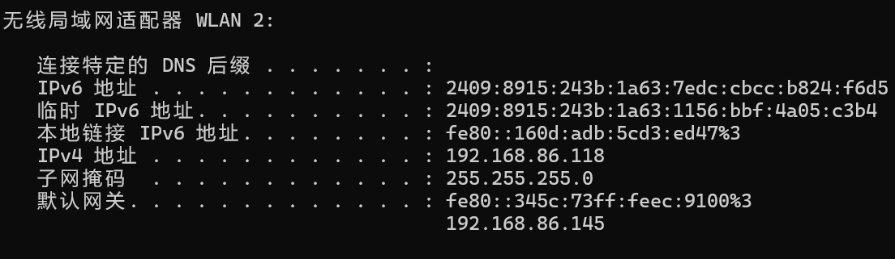
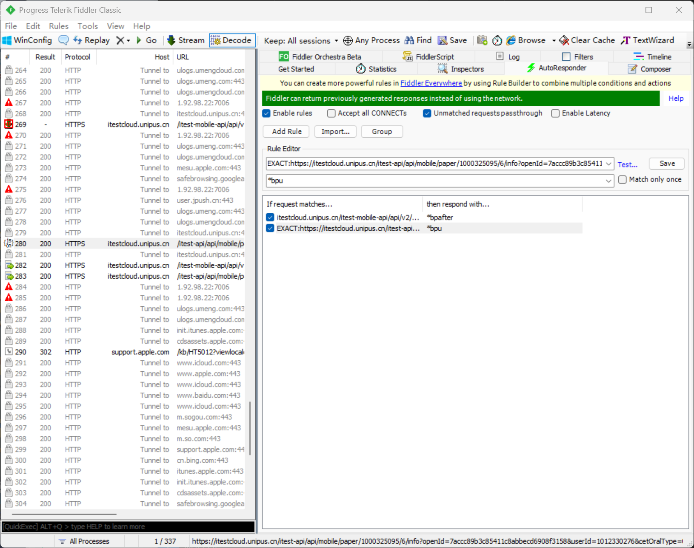
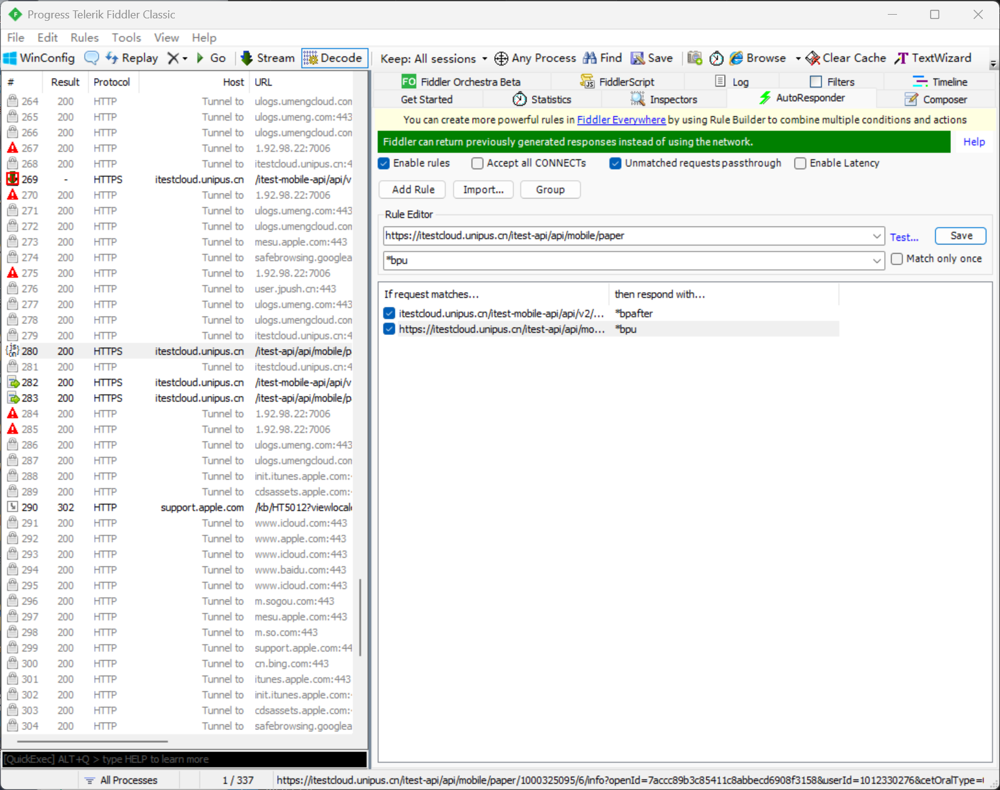
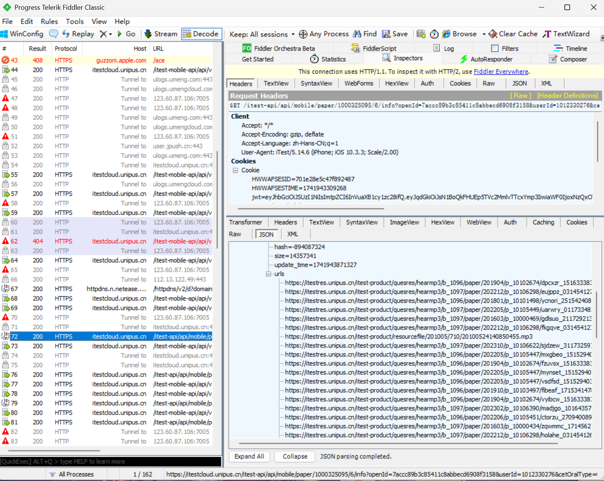

# Crypto

# 非对称加密

# RSA 介绍 [¶](https://ctf-wiki.org/crypto/asymmetric/rsa/rsa_theory/#rsa)

RSA 加密算法是一种非对称加密算法。在公开密钥加密和电子商业中 RSA 被广泛使用.RSA 算法的**可靠性由极大整数因数分解的难度决定**。换言之，对一极大整数做因数分解愈困难，RSA 算法愈可靠。

## 基本原理 [¶](https://ctf-wiki.org/crypto/asymmetric/rsa/rsa_theory/#_1)

### 公钥与私钥的产生 [¶](https://ctf-wiki.org/crypto/asymmetric/rsa/rsa_theory/#_2)

1. **随机选择两个不同大质数 p 和 q**，计算 N=p×q
2. 根据欧拉函数，**求得 φ(N)=φ(p)φ(q)=(p−1)(q−1)**
3. 选择一个**小于 φ(N) 的整数 e，使 e 和 φ(N) 互质**。并求得 **e 关于 φ(N) 的模反元素**，命名为 d，有 **ed≡1(modφ(N))**
4. 将 p 和 q 的**记录销毁**

此时，**(N,e) 是公钥**，**(N,d) 是私钥(得先质因分解出p,q才好求得φ(N))。**

### 消息加密 [¶](https://ctf-wiki.org/crypto/asymmetric/rsa/rsa_theory/#_3)

首先需要将消息 以一个双方约定好的格式转化为一个**小于 N，且与 N 互质**的**整数 m**。如果**消息太长，**可以将**消息分为几段**，这也就是我们所说的**块加密**，后对于**每一部分利用如下公式加密：**

$m^e≡c(modN)$

### 消息解密 [¶](https://ctf-wiki.org/crypto/asymmetric/rsa/rsa_theory/#_4)

利用**密钥 d** 进行**解密**。

$c^d≡m(modN)$

## **解密关键步骤如下：**

1. 计算 **n = p * q**
2. 计算 **φ(n) = (p-1)*(q-1)**
3. 计算 **d = e^{-1} mod φ(n)**
4. 计算**明文 m = c^d mod n**
5. 用 **long_to_bytes 转回 flag**

##  RSA 共模攻击（Common Modulus Attack）

已知 n、e1、e2、c1、c2，且 e1≠e2，可以用**扩展欧几里得算法求解明文** m。

步骤如下：

### 正确性证明 [¶](https://ctf-wiki.org/crypto/asymmetric/rsa/rsa_theory/#_5)

即我们要证med≡mmodN，已知ed≡1modϕ(N)，那么 ed=kϕ(N)+1，即需要证明

mkϕ(N)+1≡mmodN

这里我们分两种情况证明

第一种情况 gcd(m,N)=1，那么 mϕ(N)≡1modN，因此原式成立。

第二种情况 gcd(m,N)≠1，那么 m 必然是 p 或者 q 的倍数，并且 n=m 小于 N。我们假设

m=xp

那么 x 必然小于 q，又由于 q 是素数。那么

mϕ(q)≡1modq

进而

mkϕ(N)=mk(p−1)(q−1)=(mϕ(q))k(p−1)≡1modq

那么

mkϕ(N)+1=m+uqm

进而

mkϕ(N)+1=m+uqxp=m+uxN

所以原式成立。

# Pwn

## 抓包

#### itest

前置工作:一台root过的手机或者iphone

关掉左下角capture防止只捕捉电脑

在同一个网络下,用ipconfig找到相同ipv4地址,再到手机上用浏览器搜一下.

通用-关于本机-信任证书
在auto responder中打断点链接,右边add rule

删除paper后面再抓包

syntaxview里面**terminallist改为1，beingorover改成2**，tun to complete

抓取包,刷新,直到出现这种信息

