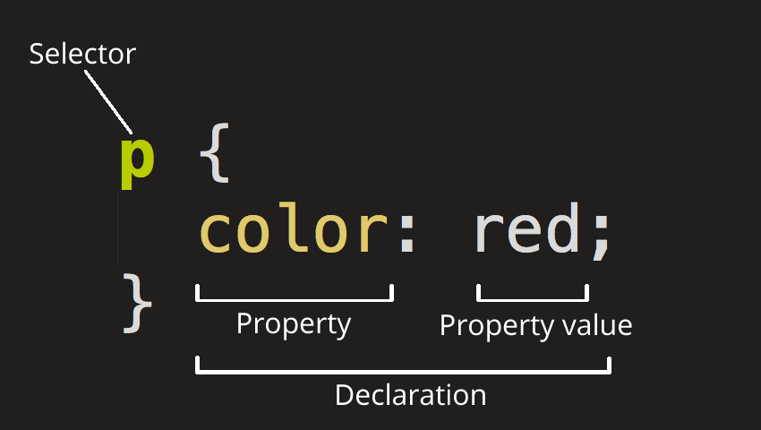
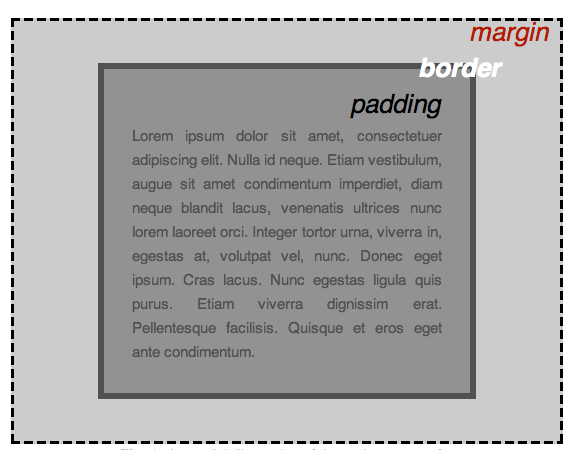

[TOC]


# CSS 基础

CSS（层叠样式表）是为 web 内容添加样式的代码。CSS 基础将介绍 CSS 入门知识。我们会解答像这样的问题：怎样将文本设置为红色？怎样将内容显示在屏幕的特定位置？怎样用背景图片或颜色来装饰网页？

## 什么是 CSS？
和 HTML 类似，CSS **不是编程语言**。它也**不是标记语言**，而是一门**样式表**语言。CSS 用于**选择性地为 HTML 元素添加样式**。例如，下列的 CSS 代码选择了所有的段落文本，并将它们设置为红色。

```css
p {
  color: red;
}
```

让我们来试一试！使用文本编辑器，在新文件中粘贴上面的三行 CSS 代码。在 styles 文件夹中将文件保存为 style.css。

为了使代码发挥作用，我们仍需要将上面的 CSS **应用到 HTML 文档**中。否则，这些样式不会改变 HTML 的外观。

1.打开 index.html 文件，在文档头部（也就是 <head> 和 </head> 标签之间）粘贴这行代码。

```html
<link href="styles/style.css" rel="stylesheet" />
```

2.保存 index.html 文件，并用浏览器打开。你应该看到类似的内容：

## CSS 规则集详解



整个结构称为**规则集**（规则集通常简称为规则），注意各个部分的名称：

- 选择器（Selector）
	**HTML 元素名**位于**规则集的开头**。它定义了需要添加样式的元素（本例中就是 <p> 元素）。要给不同的元素添加样式，只需要更改选择器。

- 声明（Declaration）
	它是一条**单独的规则**（如 color: red;）。用来指定为元素的**哪个属性添加样式**。

- 属性（Properties）
	它是为 HTML 元素**添加样式的方式**（本例中 color 就是 <p> 元素的属性）。在 CSS 中，你可以选择要在规则中影响的属性。

- 属性值（Property value）
	位于属性的右边，冒号后面即**属性值**。它从指定属性的可选值中选择一个值（例如，我们除了 red 之外还有很多属性值可以用于 color）。

注意其他重要的语法：

- 除了选择器部分，每个**规则集**都应该包含在成对的大括号里（{}）。
- 在每个声明里要用冒号（:）将**属性与属性值**分隔开。
- 在每个规则集里要用分号（;）将**各个声明**分隔开。

如果要在规则集中同时修改多个属性，只需要将它们用分号隔开，就像这样：

```css
p {
  color: red;
  width: 500px;
  border: 1px solid black;
}
```

选择多个元素
也可以选择多个元素并为它们添加单个规则集，多个选择器之间用逗号分隔。

```css
p,
li,
h1 {
  color: red;
}
```

### [不同类型的选择器](https://developer.mozilla.org/zh-CN/docs/Learn_web_development/Getting_started/Your_first_website/Styling_the_content#不同类型的选择器)

选择器有许多不同的类型。上面只介绍了**元素选择器**，用来选择所有指定类型的元素。但是选择操作可以更加具体。下面是一些更常用的选择器类型：

| 选择器名称                               | 选择的内容                                                   | 示例                                                         |
| :--------------------------------------- | :----------------------------------------------------------- | :----------------------------------------------------------- |
| **元素选择器**（也称作标签或类型选择器） | 所有指定类型的 HTML 元素                                     | `p` 选择 `<p>`                                               |
| **ID 选择器**                            | **具有特定 ID 的元素**。单一 HTML 页面中，**每个 ID 只对应一个元素，一个元素只对应一个 ID** | `#my-id` 选择 `<p id="my-id">` 或 `<a id="my-id">`           |
| **类选择器**                             | **具有特定类的元素**。单一页面中，一个类可以有多个实例       | `.my-class` 选择 `<p class="my-class">` 和 `<a class="my-class">` |
| **属性选择器**                           | **拥有特定属性的**元素                                       | `img[src]` 选择 `` 但不是 ``     |
| **伪类选择器**                           | **特定状态下**的特定元素（**比如鼠标指针悬停在链接上时**）   | `a:hover` **选择仅在鼠标指针悬停**在链接上时的 `<a>` 元素    |

## 字体和文本
在探索了一些 CSS 基础后，让我们在 style.css 中添加更多的规则和信息，从而让示例更美观。

第一步，找到之前在你的网站会是什么样子？中保存的 Google Fonts 输出的地址。在 index.html 文档头部（<head> 和 </head> 之间的任意位置）添加 <link> 元素。代码如下：

```html
<link
  href="https://fonts.googleapis.com/css?family=Open+Sans"
  rel="stylesheet" />
```

1.这段代码将你的页面**链接到一个样式表**，该样式表将 Open Sans 字体家族与你的网页一起加载。

2.接下来，删除 style.css 文件中已有的规则。虽然测试是成功的，但是红字看起来并不太舒服。

3.添加下列几行代码（如下文所示），用你在你的网站会是什么样子？中选择的 font-family 替换 font-family。font-family 属性是**指为文本设置的字体**。这个规则为**整个页面定义了全局的基础字体和基础字号**。由于 <html> 是整个页面的父元素，它里面的**所有元素都继承相同的 font-size 和 font-family**。

```css
html {
  font-size: 10px; /* px 表示“像素（pixel）”: 基础字号为 10 像素 */
  font-family:
    "Open Sans", sans-serif; /* 这应该是你从 Google Fonts 得到的其余输出。 */
}
```

 CSS 文档中所有位于 **`/*` 和 `*/` 之间**的内容都是 **CSS 注释**。浏览器在渲染代码时会忽略注释。CSS 注释是一种让你写下关于你的代码或逻辑的有用注解的方式。

4.接下来为 HTML **主体内的元素**（h1、<li> 和 <p>）**单独**设置字号。我们也将标题**居中显示**。最后，扩充下方的第二个规则集，为正文设置行高和字间距，从而提高页面的可读性。

```css
h1 {
  font-size: 60px;
  text-align: center;
}

p,
li {
  font-size: 16px;
  line-height: 2;
  letter-spacing: 1px;
}
```

可以随时**调整这些 `px` 值**来获得满意的结果

## CSS：一切皆盒子
编写 CSS 时你会发现，所有的一切都与盒子相关——设置尺寸、颜色、位置，等等。页面上大部分 HTML 元素都可以被看作若干堆叠的盒子。

CSS 布局主要是基于盒子模型。每个在页面上占用空间的盒子都有类似的属性：

1.**padding（内边距）**：是指**内容周围的空间**。在下面的例子中，它是段落文本周围的空间。
2.**border（边框）**：是**紧接着内边距的实线**。
3**.margin（外边距）**：是围绕**元素边框外侧**的空间。



这里还使用了：

- `width`：元素的**宽度**。
- `background-color`：元素**内容和内边距底下**的颜色。
- `color`：**元素内容**（通常是文本）的颜色。
- `text-shadow`：为元素内的**文本设置阴影**。
- `display`：设置元素的**显示模式**。

## 更改页面颜色

```css
html {
  background-color: #00539f;
}
```

## 文档体样式

```css
body {
  width: 600px;
  margin: 0 auto;
  background-color: #ff9500;
  padding: 0 20px 20px 20px;
  border: 5px solid black;
}
```

这里有几条 <body> 元素的声明，我们来逐条查看：

1.**width**: 600px; **强制文档体**永远保持 600 像素宽。
2.**margin**: 0 auto; 当你在 margin 或 padding 这样的属性上设置两个值时，第一个值影响元素的**上下方向**（在这个例子中设置为 0）；第二个值影响**左右**方向。（这里，auto 是一个特殊的值，它将可用的水平空间**平均分配**给左边和右边）。如 margin 语法中所记载的那样，你也可以使用一个、两个、三个或四个值。
3.**background-color**: #FF9500; 如前文所述，指定**元素的背景颜色**。我们给 body 用了一种略微偏红的橘色以与深蓝色的 <html> 元素形成反差，你也可以尝试其他颜色。
4.**padding**: 0 20px 20px 20px; 我们给**内边距**设置了四个值，目的是**给内容四周留出一点空间**。这一次我们不设置 body 上方的内边距，设置右边、下方、左边的内边距为 20 像素。**值以上、右、下、左的顺序排列**。与 margin 一样，你也可以像 padding 语法中所记载的那样，使用一个、两个、三个或四个值。
5.**border**: 5px solid black; 这是为**边框的宽度、样式和颜色**设置的值。在本例中，是 body 四周的一个 5 像素宽的纯黑色边框。

# 定位页面主标题并添加样式

```css
h1 {
  margin: 0;
  padding: 20px 0;
  color: #00539f;
  text-shadow: 3px 3px 1px black;
}
```

你可能已经注意到，在正文的顶部有一个难看的**间隙**。这是因为浏览器**对 [h1](https://developer.mozilla.org/zh-CN/docs/Web/HTML/Element/Heading_Elements) 元素（以及其他元素）**应用了**默认样式**。这可能看起来是个坏主意，但其目的是为没有样式的页面提供基本的可读性。为了消除这种间隙，我们**设置 `margin: 0;` 覆盖浏览器的默认样式**。

接下来，我们**将标题的上下内边距设置为 20 像素**。

之后，我们将标题文本的背景颜色设置为和 HTML 的背景颜色一样的颜色。

最后，`text-shadow` 对元素的文本内容施加阴影。它的四个值是：

- 第一个像素值设置阴影与文本的**水平偏移量**：阴影水平方向移动的距离（译者注：向右为正值）。
- 第二个像素值设置阴影与文本的**垂直偏移量**：阴影垂直方向移动的距离（译者注：向下为正值）。
- 第三个像素值设置阴影的**模糊半径**。值越大产生的阴影越模糊。
- 第四个值设置阴影的基色。

试着用不同的值进行试验，看看它是如何改变外观的。

# 图像居中

```css
img {
  display: block;
  margin: 0 auto;
}
```

最后，我们把图像居中让页面更美观一些。可以**复用 body 的 margin: 0 auto**，但有一些差异，需要额外的设置来使 CSS 发挥作用。

<body> 元素是块级元素，意味着它占据页面上的空间。页面上的其他元素会**尊重为块级元素设置的外边距**。而图片是行级元素，所以为了使图像有外边距，我们必须使用 display: block 给予其块级行为。

备注： 上面的做法假定所选图片**小于 body 的宽度（600 像素）**。超过 600 像素的图片会**溢出 body 并占据页面的其他位置**。要解决这个问题，可以：1）使用**图片编辑**器 减小图片宽度；2）用 **CSS 限制图片大小**，将 ** 元素 width 属性**的值设置为小于 600 像素的值。

备注： 如果你暂时不能理解 display: block、块级元素和行级元素之间的差别也没关系；随着你对 CSS 学习的深入，你将明白这个问题。在 display 参考页面能找到更多有关不同的 display 值的信息。

# [让我们开始 CSS 的学习之旅]([让我们开始 CSS 的学习之旅 - 学习 Web 开发 | MDN](https://developer.mozilla.org/zh-CN/docs/Learn_web_development/Core/Styling_basics/Getting_started))

## 添加 CSS 试试看？
我们最想做的就是让 HTML 文档能够**遵守我们给它的 CSS 规则**。其实有三种方式可以实现，而目前我们更倾向于利用最普遍且有用的方式——在文档的**开头链接 CSS**。

在与之前所说的 HTML 文档的相同目录创建一个文件，保存并命名为 styles.css 。（看后缀知道此文件就是 CSS 文件）

为了把 styles.css 和 index.html 连接起来，可以在 HTML 文档中，**<head> 语句模块**里面加上下面的代码：

```cpp
<link rel="stylesheet" href="styles.css" />
```

<link> 语句块里面，我们用属性 rel，让浏览器知道有 CSS 文档存在（所以需要遵守 CSS 样式的规定），并利用**属性 href 指定CSS 文件的位置**。你可以**做测试来验证 CSS 是否有效**：在 styles.css 里面**加上 CSS 样式并观察显示的结果。**

## 样式化 HTML 元素

通过**触发元素选择器**实现这一点——元素选择器，即直接匹配 HTML 元素的选择器.若要样式化一个文档中所有的段落，只需**使用选择器 `p`**。若要将所有段落变成绿色，你可以利用如下方式：

用逗号将不同选择器隔开，即可**一次使用多个选择器**。譬如，若要将所有段落与列表变成绿色，只需：

```css
p,
li {
  color: green;
}
```

你可以在下面的互动式文本编辑器上试试看，当然你也可以在本地的 CSS 文档上尝试。

## 改变元素的默认行为

只要一个 HTML 文档**标记正确**，即使像我们的例子那么简单，浏览器都会**尽全力将其渲染至可读状态**。**标题默认使用大号粗体**；**列表旁总有项目符号**。这是因为浏览器**自带一个包含默认样式的样式表，默认对任何页面有效**。没有了它们，所有文本会夹杂在一起变得一团糟，我们只得从头开始规定，好糟糕。话说回来，所有现代浏览器的默认样式都没什么差距。

不过你可能对浏览器的**默认样式不太满意**。没关系，只需选定那个元素，**加一条 CSS 规则**即可。就拿我们的无序列表 `<ul>`举个例子吧，它自带项目符号，不过要是你跟它有仇，你就可以这样移除它们：

```css
li {
  list-style-type: none;
}
```

你会发现你不仅能移除项目符号——你甚至能改变它们。赶快试试 `square`，它能把默认的小黑球变成方框框。

## 使用类名
目前为止，我们通过 HTML 元素名规定样式。如果你愿意所有元素都一个样，也不是不可以，但大多数情况下，我估计你都不愿意。我知道你想干啥，你想用这种方式样式化这**一片**元素，又想用那种方式样式化那一片元素，真贪心。不过没关系，你可以**给 HTML 元素加个类名（class）**，再**选中那个类名**，这样就可以了，大家基本上都这么用。

举个例子吧，咱们把 class 属性加到表里面第二个对象。你的列表看起来应该是这样的：

```css
<ul>
  <li>项目一</li>
  <li class="special">项目二</li>
  <li>项目 <em>三</em></li>
</ul>

```

在 CSS 中，要选中这个 `special` 类，只需在**选择器的开头加个西文句点（.）**。在你的 CSS 文档里加上如下代码：

```css
.special {
  color: orange;
  font-weight: bold;
}

```

保存再刷新，就可以看到变化。

这个 `special` 类型可不局限于列表，它可以应用到各种元素上。举个例子，你可能也想让段落里边的 `<span>` 一起又橙又粗起来。试试把`special` 类属性加上去，保存，刷新，哇，生活就是这么美好。

有时你会发现选择器中，HTML 元素选择器跟类一起出现：

```css
li.special {
  color: orange;
  font-weight: bold;
}
```

这个意思是说，“选中每个 **`special` 类的 `li` 元素**”。你真要这样，好了，它对 `<span>` 还有其他元素不起作用了。你可以把这个元素再添上去就是了：

```css
li.special,
span.special {
  color: orange;
  font-weight: bold;
}
```

你们都是懒人，肯定不想每加一个 special 类的元素就改一遍 CSS 表，你肯定想把**一个类的属性应用到多个元素**上。所以说，有时还是别管元素，**光看类就完事**了，除非你意志坚定，坚持对**这个类的**某一种元素创造规则，还**不让其他元素用**。

## 根据元素在文档中的位置确定样式
有时候，你希望某些内容根据它在文档中的位置而有所不同。这里有很多选择器可以为你提供帮助，但现在我们只介绍几个选择器。在我们的文档中有**两个 <em>元素——一个在段落内，另一个在列表项内**。仅选择**嵌套在<li> 元素内的<em>**我们可以使用一个称为**包含选择符的选择器**，它只是单纯地**在两个选择器之间加上一个空格**。

将以下规则添加到样式表。

```CSS
li em {
  color: rebeccapurple;
}
```

该选择器将选择<li>内部的任何<em>元素（<li>的后代）。因此在示例文档中，你应该发现第三个列表项内的<em>现在是紫色，但是在段落内的那个没发生变化。

另一些可能想尝试的事情是在 HTML 文档中设置**直接出现在标题后面**并且与标题具有**相同层级的段落样式**，为此**需在两个选择器之间添加一个 + 号 (成为 相邻选择符)**

也将这个规则添加到样式表中：

```CSS
h1 + p {
  font-size: 200%;
}

```

## 根据状态确定样式
在这篇教程中我们最后要看的一种修改样式的方法就是**根据标签的状态确定样式**。一个直观的例子就是当我们修改链接的样式时。当我们修改一个链接的样式时我们需要定位（针对） <a> （锚）标签。取决于**是否是未访问的、访问过的、被鼠标悬停的、被键盘定位的，亦或是正在被点击当中的状态**，这个标签有着不同的状态。你可以使用 CSS 去**定位或者说针对这些不同的状态进行修饰**——下面的 CSS 代码使得没有被访问的链接颜色变为粉色、访问过的链接变为绿色。

```CSS
a:link {
  color: pink;
}

a:visited {
  color: green;
}
```

你可以改变链接被鼠标**悬停**的时候的样式，例如**移除下划线**，下面的代码就实现了这个功能。

```CSS
a:hover {
  text-decoration: none;
}
```

为了让浏览者注意到一段文字中的某些部分是可点击的，最好**保留 link 状态下的下划线**。— 这是下划线的本来作用。

当你开始为它添加样式，记得**不要破坏这种无障碍**。

## 同时使用选择器和选择符
你可以同时使用选择器和选择符。来看一些例子：

```css
/* selects any <span> that is inside a <p>, which is inside an <article>  */
article p span { ... }

/* selects any <p> that comes directly after a <ul>, which comes directly after an <h1>  */
h1 + ul + p { ... }
```

你可以将多种类型组合在一起。试试将下面的代码添加到你的代码里：

```css
body h1 + p .special {
  color: yellow;
  background-color: black;
  padding: 5px;
}
```

上面的代码为以下元素建立样式：在 `<body>` 之内，紧接在 `<h1>` 后面的 `<p>` 元素的内部，**类名为 special。**

# 为传记页面添加样式

## font-family 

font-family CSS 属性允许你通过给定一个**有先后顺序**的，由**字体名或者字体族名组成的列表**来为选定的元素设置字体。

```css
font-family: Georgia, serif;
```

属性值用逗号隔开，表示它们是**备选值**。浏览器会选择列表中第一个该计算机上有安装的字体，或者是通过 @font-face At 规则指定的可以下载的字体。

使用**简写属性 font** 来设置 font-size 和其他与字体相关的属性通常很方便。

应当至少在使用的 font-family 列表中添加一个通用的字体族名，，因为无法保证任何指定字体都可用。这可以让浏览器在必要时选择可接受的备用字体。

font-family 属性指定的是一个优先级从高到低的字体列表。字体的选定不是在发现用户计算机上安装的列表中的第一个字体时停止。相反，对字体的选择是逐字进行的。也就是说即使某个字符周围都在某个字体中可以显示，但该字符在当前的字体文件中**没有适合的图形，那么会继续尝试列表中靠后的字体**。当一个字体只在某些特定的样式、变体或大小下有效时，这些属性的值也可能对字体族的选择造成影响。

# border-bottom

border-bottom 简写属性把下边框的**所有属性：border-bottom-color，border-bottom-style 与 border-bottom-width** 设置到了一个声明中。这些属性描述了元素的下边框样式。

与所有的简记属性相同， `border-bottom` 定义了它所有可以定义的属性，即使他们并没有被显式地定义。它把所有**未被显式定义的参数都设置为了默认值**，这意味着这些值将被定义为：

```css
border-bottom-style: dotted;
border-bottom: thick green;
```

它和以下的代码是等价的：

```css
border-bottom-style: dotted;
border-bottom: none thick green;
```

顺便一提，在 `border-bottom` 之前定义的 [`border-bottom-style`](https://developer.mozilla.org/zh-CN/docs/Web/CSS/border-bottom-style) 的值**因此被忽略了**。由于 [`border-bottom-style`](https://developer.mozilla.org/zh-CN/docs/Web/CSS/border-bottom-style) **并没有默认值**，未被定义的 `border-style` 参数的值将被设置为 `none`，也就是无底边框。

```css
border-bottom = 
  <line-width>  ||
  <line-style>  ||
  <color>       

<line-width> = 
  <length [0,∞]>  |
  thin            |
  medium          |
  thick           

<line-style> = 
  none    |
  hidden  |
  dotted  |
  dashed  |
  solid   |
  double  |
  groove  |
  ridge   |
  inset   |
  outset  
```

# text-decoration

它是 text-decoration-line、text-decoration-color、text-decoration-style 和较新的 text-decoration-thickness 属性的缩写。

```css
text-decoration: underline;
text-decoration: overline red;
text-decoration: none;

/* 全局值 */
text-decoration: inherit;
text-decoration: initial;
text-decoration: revert;
text-decoration: revert-layer;
text-decoration: unset;
text-decoration = 
  <'text-decoration-line'>   ||
  <'text-decoration-style'>  ||
  <'text-decoration-color'>  

<text-decoration-line> = 
  none                                                |
  [ underline || overline || line-through || blink ]  

<text-decoration-style> = 
  solid   |
  double  |
  dotted  |
  dashed  |
  wavy    

<text-decoration-color> = 
  <color>  
```

# CSS 选择器