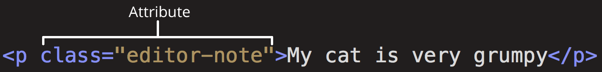
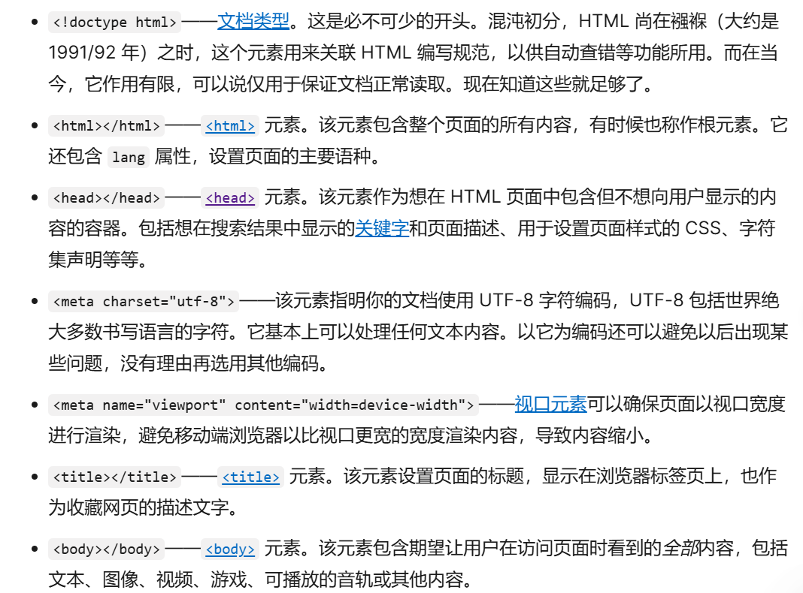

# 什么是浏览器开发者工具？

每一个现代网络浏览器都包含一套强大的开发工具套件。这些工具可以检查当前加载的 HTML、CSS 和 JavaScript，显示每个资源页面的请求以及载入所花费的时间。
## 检查器（Inspector）：DOM 浏览器和 CSS 编辑器
开发者工具在打开时默认为检查器页面，如下图所示。这个工具可以让你看到你的网页的 **HTML 运行时**的样子，以及**哪些 CSS 规则被应用到了页面上元素**。它还允许你立即**修改 HTML 和 CSS** 并在浏览器中**实时观察修改**的结果。

### 探索 DOM 检查器
首先在 DOM 检查器中右键单击（按 Ctrl 点击）一个 HTML 元素，看上下文菜单。菜单选项各不相同，但主要功能是相同的：

- **删除节点**（或*删除元素*）：删除当前元素。
- **编辑 HTML**（或*添加属性*/*编辑文本*）：让你**更改 HTML** 并即时查看结果。对于调试和测试非常有用。
- **:hover/:active/:focus**（悬停/激活/聚焦）：**强制切换元素状态**以查看显示外观。
- **复制/复制为 HTML**：复制当前选定的 HTML。
- 一些浏览器也有*复制 CSS 路径*和*复制 XPath*，允许你选择复制当前的 HTML 元素 CSS 选择器或 XPath 表达式。

### 探索 CSS 编辑器

默认情况下，CSS 编辑器显示当前所选元素应用的 CSS 规则：


这些功能特别有用：

- 应用于当前元素的规则以**相关度排序**。**越特定的规则显示的越靠前。**
- 点击每个声明旁边的复选框，看看如果删除声明会发生什么。
- 点击每个简写属性旁边的小箭头显示属性的普通等效项。
- 单击属性名称或值以显示一个文本框，你可以在其中键入新值以获取样式更改的实时预览。
- 每个规则旁边是规则定义的文件名和行号。单击该规则将使开发工具跳转到自己的视图中显示，通常可以编辑和保存。
- 你还可以单击任何规则的关闭大括号，以在新行上显示一个文本框，你可以在其中为页面写入一个全新的声明。

你会注意到 CSS 查看器顶部的一些可点击的选项卡：

- *计算值*：显示当前所选元素的**计算样式**（浏览器应用的**最终归一化值**）。

- 布局

	：在 Firefox 中，这包含两个部分：

	- *盒模型*：这可以直观地表示当前元素的盒模型，所以你可以一目了然地看到应用了**什么内边距、边框和外边距，以及它的内容有多大**。
	- *网格*：如果你正在检查的页面使用了 CSS 网格布局，这个部分允许你查看网格的详细信息。

- *字体*：在 Firefox 中，*字体*标签页显示应用于当前元素的字体。

# JavaScript 调试器

你可在 JavaScript 调试器中查看变量的值，或者设置断点。断点的作用是让程序在你指定的位置暂停，以便你来调试程序并确定问题所在。
### 探索调试器
Firefox 的 JavaScript 调试器有三个面板。

#### 文件列表

第一个面板位于左边，它包含你正在调试的网页的文件列表。从列表中选中你要操作的文件。单击以选择该文件，并在调试器的中间面板中查看其内容。


#### 源码

在你想要停止执行的位置设置断点。

#### 监视表达式和断点

右边的面板会显示你添加的监视表达式与断点。

在下图中，第一个区域，监视表达式，显示了变量 listItem 已经被添加，你可以展开列表查看里面的值。

接下来的部分，断点，列出了页面上设置的断点。在 example.js 中，一个断点被设置在语句 listItems.push(inputNewItem.value); 上。

最后两个部分，只在代码运行时才出现。

调用堆栈区向你显示**哪个代码执行后会达到当前行**。你能看到代码处理了一次鼠标点击后，停在了断点处。

最后一部分，作用域，显示了在代码执行过程中，可见变量值的变化。例如，在下面图片中，你可以看到对象在 addItemClick 函数中是如何变化的。


## JavaScript 控制台
JavaScript 控制台是一个非常有用的工具，用于调试没有按预期运行的 JavaScript。它允许你针对浏览器当前加载的页面运行 JavaScript 行，并报告浏览器尝试执行代码时遇到的错误。要在任何浏览器中访问控制台：

如果开发者工具已经打开，点击或按下控制台标签。

这将为你提供一个如下所示的窗口：


# HTML（超文本标记语言）

HTML（超文本标记语言——HyperText Markup Language）是构成 Web 世界的一砖一瓦。它定义了**网页内容的含义和结构**。除 HTML 以外的其他技术则通常用来描述一个网页的**表现**与**展示效果**（如 CSS），或**功能**与**行为**（如 JavaScript）。

“超文本”（hypertext）是指**连接**单个网站内或多个网站间的网页的**链接**。链接是网络的一个基本方面。只要将内容上传到互联网，并将其与他人创建的页面相链接，你就成为了万维网的积极参与者。

HTML **使用“标记”（markup）来注明文本、图片和其他内容**，以便于**在 Web 浏览器中显示**。HTML 标记包含一些特殊“元素”如 <head>、<title>、<body>、<header>、<footer>、<article>、<section>、<p>、<div>、<span>、、<aside>、<audio>、<canvas>、<datalist>、<details>、<embed>、<nav>、<output>、<progress>、<video>、<ul>、<ol>、<li> 等等。

HTML 元素**通过“标签”（tag）**将**文本**从文档中**引出**，标签由**在“<”和“>”中包裹的元素名**组成，HTML 标签里的元素名**不区分大小写**。也就是说，它们可以用大写，小写或混合形式书写。例如，<title> 标签可以写成 <Title>，<TITLE> 或以任何其他方式。然而，习惯上与实践上都**推荐将标签名全部小写**。

# HTML 到底是什么？

HTML 是一种用于**定义内容结构**的**标记**语言。HTML 由一系列的元素组成，这些元素可以用来**包围不同部分的内容**，使其以**某种方式呈现或者工作**。一**对**标签可以为一段文字或者一张图片**添加超链接**，将文字设置为**斜体**，改变字号，等等。例如，键入下面一行内容：

My cat is very grumpy
可以将这行文字封装成一个段落元素来使其**独立成行**：

```html
<p>My cat is very grumpy</p>
```

让我们深入探索一下这个段落元素。

这个元素的主要部分有：

1. **开始标签**（Opening tag）：包含**元素的名称（本例为 p）**，及一对包围名称的**尖括号**。这表示元素从这里开始或者**开始起作用**——在本例中即段落由此开始。
2. **结束标签**（Closing tag）：与开始标签相似，只是其在元素名之前**包含了一个*正斜杠***。这表示元素到这里结束——在本例中即段落在此**结束**。初学者常常会犯忘记添加结束标签的错误，这可能会产生一些奇怪的结果。
3. **内容**（Content）：**元素的内容**，本例中就是所输入的文本本身。
4. **元素**（Element）：开始标签、结束标签与内容相结合，便是一个**完整的元素**。

元素也可以有下图中那样的**属性（Attribute）**：



属性包含的是**不想在真正的内容中出现**的和元素有关的**额外信息**。本例中，`class` 是**属性**名，`editor-note` 是属性**值**。`class` 属性是可以用于**定位元素**（以及任何其他有**相同 `class` 值**的元素）的标识名称，以便进一步为元素指定样式或进行其他操作时使用。**一些属性没有值**，如 [`required`](https://developer.mozilla.org/zh-CN/docs/Web/HTML/Attributes/required)。

有值的属性应该包含：

1. 属性与**元素名称**（或上一个属性，如果元素有超过一个属性的话）之间的一个**空格**。
2. 属性名，后接一个等号。
3. **一对引号**包围的属性值。

**备注：** 不包含 [ASCII](https://developer.mozilla.org/zh-CN/docs/Glossary/ASCII) 空格（以及 `"` `'` ``` `=` `<` `>`）的简单属性值可以不使用引号，但是建议将所有属性值用引号括起来，这样的代码**一致性**更佳，更易于阅读。

#### 嵌套元素

也可以将一个元素置于其他元素之中——称作**嵌套**。要表明猫咪**非常**暴躁，可以将“very”用 <strong> 元素包围，“very”将突出显示：

```
<p>My cat is <strong>very</strong> grumpy.</p>
```

必须保证元素的嵌套次序正确：在上面的例子中，首先使用 <p> 标签，然后是 <strong> 标签，因此要先结束 <strong> 标签，最后再结束 <p> 标签。这样是不对的：

```
<p>My cat is <strong>very grumpy.</p></strong>
```

元素必须**正确地开始和结束**，才能清楚地显示出正确的嵌套层次。要是像上面那样交叠使用，浏览器就得自己猜测，虽然它会竭尽全力，但很大程度不会给你期望的结果。所以一定要避免！

#### 空元素

不包含任何内容的元素称为[**空元素**](https://developer.mozilla.org/zh-CN/docs/Glossary/Void_element)。我们以 HTML 页面中已有的 元素为例：

```

```

本元素包含**两个属性**，但是**并没有 `</img>` 结束标签**，元素里**也没有内容**。这是因为**图像元素不需要通过内容来产生效**果，它的作用是向其所在的位置**嵌入一张图片**。

# HTML文档详解

以上把 HTML 元素作为个体进行介绍，但孤木不成林。现在来看看单个元素如何彼此协同构成一个完整的 HTML 页面。回顾[处理文件](https://developer.mozilla.org/zh-CN/docs/Learn_web_development/Getting_started/Environment_setup/Dealing_with_files)文章中创建的 `index.html` 示例：

```
<!doctype html>
<html lang="en-US">
  <head>
    <meta charset="utf-8" />
    <meta name="viewport" content="width=device-width" />
    <title>My test page</title>
  </head>
  <body>
    
  </body>
</html>
```



#### 图像

重温一下 元素：

```

```

正如之前讲的那样，该元素通过在属性 `src` 中包含图像**文件路径的地址**，可在所在位置**嵌入图像**。

该元素还包括一个替换文字属性 `alt`。在 [`alt` 属性](https://developer.mozilla.org/zh-CN/docs/Web/HTML/Element/img#使用有实际意义的备用描述)中，是图像的**描述内容**，用于当图像**不能被用户看见**时显示，不可见的原因可能是：

1. 用户有**视觉障碍**。有严重视觉障碍的用户可以使用屏幕阅读器来朗读 alt 属性的内容。
2. 有些**错误**使**图像无法显示**。可以试着故意将 `src` 属性里的路径改错。保存并刷新页面就可以在图像位置看到：

alt 文本的关键字即“**描述文本**”。alt 文本应向用户完整地传递图像要表达的意思。用“测试图片”来描述 Firefox 标志并不合适，修改成“Firefox 标志：一只盘旋在地球上的火狐”就好多了。

可以试着为图像编写一些更好的 alt 文本。


本小节包含了一些最常用的文本标记 HTML 元素。

#### 标题（Heading）

标题元素可用于指定内容的标题和子标题。就像一本书的书名、每章的大标题、小标题，等。HTML 文档也是一样。HTML 包括六个级别的标题，<h1> - <h6>，一般最多用到 3-4 级标题。

```
<!-- 4 个级别的标题 -->
<h1>主标题</h1>
<h2>顶层标题</h2>
<h3>子标题</h3>
<h4>次子标题</h4>
```

**备注：** 在 HTML 中，**`<!--` 和 `-->` 之间**的任何内容都是 **HTML 注释**。浏览器在渲染代码时，会忽略掉注释。换句话说，注释在页面上不可见——**仅停留在代码中**。HTML 注释是一种让你写下关于你的代码或逻辑的有用注解的方式。

#### 段落（Paragraph）

如上文所讲，<p> 元素是用来指定段落的。通常用于指定常规的文本内容：

试着向一个或几个段落中添加一些文本，并把它们放在你的  元素下方。

#### 列表(List)

Web 上的许多内容都是列表，HTML 有一些特别的列表元素。标记列表通常**包括至少两个元素**。最常用的列表类型为：

1. **无序列表**（Unordered List）中项目的顺序并不重要，就像购物列表。用一个<ul>元素包围。
2. **有序列表**（Ordered List）中项目的顺序很重要，就像烹调指南。用一个<ol>元素包围。

列表的**每个项目**用一个列表项目（List Item）元素<li>包围。

比如，要将下面的段落片段改成一个列表：

```
<p>
  At Mozilla, we're a global community of technologists, thinkers, and builders
  working together…
</p>
```

可以这样更改标记：

```
<p>At Mozilla, we're a global community of</p>

<ul>
  <li>technologists</li>
  <li>thinkers</li>
  <li>builders</li>
</ul>

<p>working together…</p>
```

#### 链接

链接非常重要 — 它们赋予 Web 网络属性。要植入一个链接，我们需要使用一个简单的元素 — <a> — **“a”是“anchor”（锚）**的缩写。要将一些文本添加到链接中，只需如下几步：

1.选择一些文本。比如“Mozilla Manifesto”。

2.将文本包含在 <a> 元素内，就像这样：

```
<a>Mozilla Manifesto</a>
```

3.为此<a>元素添加一个 `href` 属性，就像这样：

```
<a href="">Mozilla Manifesto</a>
```

4.把属性的值设置为所需网址：

```
<a href="https://www.mozilla.org/zh-CN/about/manifesto/">
  Mozilla Manifesto
</a>
```

如果网址开始部分省略了 `https://` 或者 `http://`（称作*协议*），可能会得到错误的结果。在完成一个链接后，可以试着点击它来确保指向正确。

**备注：** `href` 这个名字可能一开始看起来有点令人费解。如果它很难记忆的话，记住它代表的是**超文本引用**（***h**ypertext **ref**erence*）。

如果你遇到困难，你可以将 Github 上的[完整示例代码](https://github.com/mdn/beginner-html-site/blob/main/index.html)与你的文件进行比较。

#### 元素

`<main>` 是 HTML5 引入的语义化标签，用于表示文档的主要内容。一个文档中应该只有一个 `<main>` 标签，它不应该包含任何在多个页面中重复出现的内容，如侧边栏、导航栏、页脚等。

- `<div>` 是一个**通用的块级容器元素**，用于将页面上的元素**分组**。
- `id="board"` 为该 `<div>` 元素指定了一个**唯一的标识符 `board`**，在 **JavaScript 中可以通过 `document.getElementById('board')`** 来获取这个元素，在 CSS 中可以使用 **`#board`** 来为其添加样式。
- `class="board"` 为该 `<div>` 元素指定了一个**类名 `board`**，在 **CSS 中可以使用 `.board` 来为其添加样式**。这里的 `<div>` 目前是空的，后续可能会**通过 JavaScript 动态添加内容**来展示游戏棋盘。

```html
<div class="row">
```

- 这是一个 `<div>` 元素，类名为 `row`，用于将键盘按键按行分组。在 CSS 中可以使用 `.row` 来为键盘的每一行添加样式，例如设置行内元素的布局方式等。

```html
<button data-key="Q">Q</button>
```

- `<button>` 是 HTML 中的按钮元素，用于创建一个可点击的按钮。
- `data-key="Q"` 是一个**自定义的 HTML5 数据属性**，用于**存储与按钮相关的额外数据**。在这里，`data-key` 属性存储了按钮对应的字母 `Q`，在 JavaScript 中可以通过 **`element.dataset.key` 来获取**这个值。
- `Q` 是按钮的**文本内容**，显示在按钮上，用户可以看到并点击。

后续的 `W`、`E`、`R` 等按钮与 `Q` 按钮的结构和功能类似，它们共同组成了虚拟键盘的第一行。

## 元数据：<meta> 元素
元数据就是**描述数据的数据**，而 HTML 有一个“官方的”方式来为一个文档**添加元数据——<meta> 元素**。当然，其他在这篇文章中提到的东西也可以被当作元数据。有很多不同种类的 <meta> 元素可以被包含进你的页面的 <head> 元素，但是现在我们还不会尝试去解释所有类型，这只会引起混乱。我们会解释一些你常会看到的类型，先让你有个概念。

指定文档中的字符编码
在上面的示例中，这行是被包含的：

```html
<meta charset="utf-8" />
```

这个元素简单的指定了文档的字符编码——在这个文档中被允许使用的字符集。`utf-8` 是一个**通用的字符集**，它包含了任何人类语言中的大部分的字符

假如你将字符集设置为 `ISO-8859-1`（拉丁字母表的字符集），那么页面将出现乱码：

**一些浏览器（比如 Chrome）会自动修正错误的编码**，所以根据你所使用的浏览器不同，你或许不会看到这个问题。无论如何，你仍然应该为你的页面手动设置编码为 `utf-8`，来避免在其他浏览器中可能出现的问题。

### 添加作者和描述

许多 `<meta>` 元素包含了 `name` 和 `content` 属性：

- `name` 指定了 meta 元素的类型；说明该元素包含了**什么类型的信息**。
- `content` 指定了**实际的元数据内容**。

这两个 meta 元素对于定义你的页面的作者和提供页面的简要描述是很有用的。让我们看一个例子：

```html
<meta name="author" content="Chris Mills" />
<meta
  name="description"
  content="The MDN Web Docs Learning Area aims to provide
complete beginners to the Web with all they need to know to get
started with developing web sites and applications." />
```

指定作者在某些情况下是很有用的：如果你需要联系页面的作者，问一些关于页面内容的问题。**一些内容管理系统**能够自动获取页面作者的信息，然后用于某些用途。**方便爬取**

指定一个包括与你的页面内容有关的关键词的描述是有用的，因为它有可能**使你的页面在搜索引擎进行的相关搜索中出现得更多**（这些行为在术语上被称为：搜索引擎优化 或 SEO）。

### 其他类型的元数据
当你在网站上查看源码时，你也会发现其他类型的元数据。你在网站上看到的许多功能都是专有创作，旨在向某些网站（如社交网站）提供可使用的特定信息。

例如，Facebook 编写的元数据协议 Open Graph Data 为网站提供了更丰富的元数据。在 MDN Web 文档源代码中，你会发现：

```html
<meta
  property="og:image"
  content="https://developer.mozilla.org/mdn-social-share.png" />
<meta
  property="og:description"
  content="The Mozilla Developer Network (MDN) provides
information about Open Web technologies including HTML, CSS, and APIs for both Web sites
and HTML Apps." />
<meta property="og:title" content="Mozilla Developer Network" />
```

上面代码展现的一个效果就是，当你在 Facebook 上链接到 MDN Web 文档时，该链接将显示一个图像和描述：这为用户提供更丰富的体验。

Twitter 还拥有自己的类型的专有元数据协议（称为 [Twitter Cards](https://developer.twitter.com/en/docs/twitter-for-websites/cards/overview/abouts-cards)），当网站的 URL 显示在 twitter.com 上时，它具有相似的效果。

### 在你的站点增加自定义图标

为了进一步丰富你的网站设计，你可以在元数据中添加对自定义图标的引用，它们会在某些场景下显示。最常见的用例为 **favicon**（为“favorites icon”的缩写，在浏览器的“收藏夹”及“书签”列表中显示）。

这个不起眼的图标已经存在很多年了，16 像素的方形图标是第一种类型。你可以看见（取决于浏览器）这些图标出现在浏览器**每一个打开的标签页中以及书签面板中的书签页面旁边**。

页面添加网页图标的方式有：

1. 将其保存在与网站的索引页面**相同的目录中**，以 `.ico` 格式保存（大多数浏览器支持更通用的格式，如 `.gif` 或 `.png`）
2. 将以下行添加到 HTML 的 <head>块中以引用它：

```html
<link rel="icon" href="favicon.ico" type="image/x-icon" />
```

你可能还需要在不同的场景使用不同的图标。例如，你可以在 MDN Web 文档的源代码中找到它：

```html
<link rel="icon" href="/favicon-48x48.[some hex hash].png" />
<link rel="apple-touch-icon" href="/apple-touch-icon.[some hex hash].png" />
```


这是一种使网站在保存到苹果设备主屏幕时显示图标的方法。你甚至可以为**不同的设备提供不同的图标**，以确保图标在所有设备上都看起来美观。例如：

```html
<link rel="icon" href="/favicon-48x48.[some hex hash].png" />
<link rel="apple-touch-icon" href="/apple-touch-icon.[some hex hash].png" />
```

备注：如果你的网站使用了**内容安全策略（Content Security Policy，CSP）**来增加安全性，这个策略会应用在 favicon 图标上。如果你遇到了图标没有被加载的问题，你需要确认 [`Content-Security-Policy`](https://developer.mozilla.org/zh-CN/docs/Web/HTTP/Reference/Headers/Content-Security-Policy) 响应头的 [`img-src` 指令](https://developer.mozilla.org/en-US/docs/Web/HTTP/Reference/Headers/Content-Security-Policy/img-src) 没有阻止访问图标。

## 在 HTML 中应用 CSS 和 JavaScript
如今，几乎你使用的所有网站都会使用 CSS 来让网页更加**炫酷**，并使用 JavaScript 来让网页有**交互**功能，比如视频播放器、地图、游戏以及更多功能。这些应用在网页中很常见，它们分别使用 <link> 元素以及 <script> 元素。

<link> 元素经常位于**文档的头部**，它有 **2 个属性**，**rel="stylesheet"** 表明这是**文档的样式表**，而 **href 包含了样式表文件的路径**：

```html
<link rel="stylesheet" href="my-css-file.css" />
```

`rel` 是 `<link>` 标签的一个重要属性，它的全称为 **relationship**（关系），用于描述当前文档与被链接资源之间的关系。通过设置 `rel` 属性，**浏览器能够了解链接的资源类型**，并据此**采取适当的处理方式**。

 <script>元素也应当放在文档的头部，并**包含 src 属性**来指向需要加载的 JavaScript 文件路径，同时**最好加上 defer 以告诉浏览器在解析完成 HTML 后再加载 JavaScript**。这样可以**确保在加载脚本之前浏览器已经解析了所有的 HTML 内容**。这样你就**不会因为 JavaScript 试图访问页面上不存在的 HTML 元素而产生错误**。实际上有很多方法来处理在你的页面上加载 JavaScript，但对于现代浏览器来说，这是最可靠的方法（对于其他方法，请阅读脚本加载策略）。

```html
<script src="my-js-file.js" defer></script>
```

**备注：** `<script>` 元素看起来像一个[空元素](https://developer.mozilla.org/zh-CN/docs/Glossary/Void_element)，但它并不是，因此**需要一个结束标记**。还**可以选择将脚本放入 `<script>` 元素中，而不是指向外部脚本文件**。

### 为文档设定主语言

最后，值得一提的是可以（而且有必要）为站点设定语言，这个可以通过添加 **lang 属性到 HTML 开始的标签**中来实现

你还可以将文档的分段设置为不同的语言。例如，我们可以把日语部分设置为日语，如下所示：

```html
<p>Japanese example: <span lang="ja">ご飯が熱い。</span>.</p>
```

# HTML 的标题和段落

HTML 的主要工作之一是**赋予文本结构**，使浏览器能够按照开发者的意图显示 HTML 文档。本文介绍了如何使用 [HTML](https://developer.mozilla.org/zh-CN/docs/Glossary/HTML) 通过定义标题和段落来提供基本的页面结构。

- 需要合理地使用标题级别，即不能跳过级别，也不能因为要达到某种字体大小而随意使用级别（这是 **CSS 的工作**）。

- 搜索引擎优化优势：例如，标题中的关键词会得到加强。
- 无障碍优势：屏幕阅读器等辅助技术（AT）使用标题（和其他地标）作为导航内容的路标。如果没有标题，**辅助技术用户(不止是残障人士)**很难使用 HTML 文档。

- **最好**只对每个页面使用**一次** `<h1>`——这是顶级标题，所有其他标题位于层次结构中的下方。

- 请确保在层次结构中以**正确的顺序使用标题**。不要使用 `<h3>` 来表示副标题，后面再跟 `<h2>` 来表示二级副标题——这是没有意义的，会导致奇怪的结果。应该争取每页使用**不超过三个**。

- 使用 [CSS](https://developer.mozilla.org/zh-CN/docs/Glossary/CSS) 样式化内容，或者使用 [JavaScript](https://developer.mozilla.org/zh-CN/docs/Glossary/JavaScript) 做一些有趣的事情，你需要包含相关内容的元素，使得 CSS / JavaScript 可以**有效地定位它**。

## 为什么我们需要语义？
在我们身边的任何地方都要依赖语义——我们依靠以前的经验来告诉我们一个日常物品的功能是什么；当我们看到某个东西时，我们知道它的功能是什么。举个例子，我们知道红色交通灯表示“停止”，绿色交通灯表示“通行”。如果运用了错误的语义，事情会迅速地变得非常棘手（难道有某个国家使用红色代表通行？我不希望如此）

同样的道理，我们需要**确保使用了正确的元素来给予内容正确的含义、作用以及外形**。在这里，h1 元素也是一个语义元素，它所包裹的文本具有“页面上的顶级标题”的作用（或意义）。

<h1>这是一个顶级标题</h1>
一般来说，浏览器会给它一个更大的字形来让它看上去像个标题（虽然也可以使用 CSS 让它变成任何你想要的样式）。更重要的是，它的**语义值将以多种方式被使用**，比如通过上文提到过的搜索引擎和屏幕阅读器。

可以让任一元素看起来像一个顶级标题，考虑如下：

```html
<span style="font-size: 32px; margin: 21px 0; display: block;"这是顶级标题吗？</span>
```

这是一个 <span> 元素，它没有语义。当想要对它用 CSS（或者 JavaScript）时，可以用它**包裹内容，且不附加任何额外的意义**（在未来的课程中你会发现更多这类元素）。我们已经对它使用了 CSS 来让它看起来像一个顶级标题。然而，由于它没有语义值，所以它不会有任何上文提到的帮助。最好的方法是**使用相关的 HTML 元素来标记这个项目**。

# 强调与重要性

在 HTML 中我们用 <em>（emphasis）元素来标记这样的情况。这样做既可以让文档读起来更有趣，也可以被屏幕阅读器识别，并以不同的语调发出。如果**仅仅为了获得斜体样式而不增加语义辅助**，你应该使用 <span> 元素和一些 CSS，或者是 <i> 元素.如果仅仅为了获得粗体样式而不增加语义辅助，你应该使用 <span> 元素和一些 CSS，或者是 <b> 元素

像这样仅仅影响表象而且没有语义的元素，被称为**表现元素**（presentational element）并且**不应该再被使用。**

语义对无障碍、搜索引擎优化（SEO）等非常重要。HTML5 重新定义了 `<b>`、`<i>` 和 `<u>`，赋予了它们新的但有点令人困惑的语义角色。

最好的经验法则是：只有在没有更合适的元素时，才适合使用 `<b>`、`<i>` 或 `<u>` 来表达传统上用粗体、斜体或下划线表达的意思；而通常情况下是有更合适的元素可供使用的。`<strong>`、`<em>`、`<mark>` 或 `<span>` 可能是更加合适的选择。**始终保持无障碍的开发理念。**

<i> 被用来传达传统上用斜体表达的意义：外国文字、分类名称、技术术语、思想……
<b> 被用来传达传统上用粗体表达的意义：关键字、产品名称、引导句……
<u> 被用来传达传统上用下划线表达的意义：专有名词、拼写错误……

 人们强烈地将**下划线与超链接联系起来**。因此，在网页中，最好只给链接加下划线。在语义上合适的时候使用 `<u>` 元素，但要考虑使用 CSS 将默认的下划线改为在网页中更合适的东西。

```html
<!-- 学名 -->
<p>
  红喉北蜂鸟（学名：<i>Archilocus colubris</i>）是北美东部最常见的蜂鸟品种。
</p>

<!-- 舶来词 -->
<p>
  菜单上有好多舶来词汇，比如 <i lang="uk-latn">vatrushka</i>（东欧乳酪面包）、<i
    lang="id"
    >nasi goreng</i
  >（印尼炒饭）以及 <i lang="fr">soupe à l'oignon</i>（法式洋葱汤）。
</p>

<!-- 已知的错误书写 -->
<p>总有一天我会改掉写<u class="spelling-error">措字</u>的毛病。</p>

<!-- 在定义中，被定义的术语 -->
<dl>
  <dt>语义化 HTML</dt>
  <dd>根据元素的<b>语义</b>意义而不是外观来使用它们。</dd>
</dl>
```

# 列表

HTML 有一套方便的元素，可以让我们定义不同类型的列表.在 Web 中，我们有三种类型的列表：无序列表、有序列表和描述列表。

在 Web 中，我们有三种类型的列表：无序列表、有序列表和描述列表。

## 无序列表

无序列表用于标记列表项目**顺序无关紧要**的列表——让我们以购物清单为例。

```
豆浆
油条
豆汁
焦圈
```

每份无序的清单从 <ul> 元素开始，需要包裹清单上所有被列出的项目：

```html
<ul>
  豆浆
  油条
  豆汁
  焦圈
</ul>
```

然后就是用 <li>（list item，**列表项**）元素把每个列出的项目单独包裹起来：

```html
<ul>
  <li>豆浆</li>
  <li>油条</li>
  <li>豆汁</li>
  <li>焦圈</li>
</ul>
```

## 有序列表
有序列表需要按照项目的顺序列出来——让我们以一组方向指示为例：

```
沿这条路走到头
右转
直行穿过第一个十字路口
在第三个十字路口处左转
继续走 300 米，学校就在你的右手边
```

这个标记的结构和无序列表一样，除了需要用 <ol> 元素而不是 <ul> 元素将**所有项目包裹**

## 描述列表
描述列表的目的是标记一组项目及其相关描述，如术语和定义或问题和答案。让我们来看一组术语和定义的示例：

```
内心独白
戏剧中，某个角色对自己的内心活动或感受进行念白表演，这些台词只面向观众，而其他角色不会听到。
语言独白
戏剧中，某个角色把自己的想法直接进行念白表演，观众和其他角色都可以听到。
旁白
戏剧中，为渲染幽默或戏剧性效果而进行的场景之外的补充注释念白，只面向观众，内容一般都是角色的感受、想法、以及一些背景信息等。
```

描述列表使用与其他列表类型不同的包裹标签——<dl>；此外，每一项都用 <dt>（description term，描述术语）元素包裹。每个描述都用 <dd>（description definition，描述定义）元素包裹。

```html
<dl>
  <dt>内心独白</dt>
  <dd>
    戏剧中，某个角色对自己的内心活动或感受进行念白表演，这些台词只面向观众，而其他角色不会听到。
  </dd>
  <dt>语言独白</dt>
  <dd>
    戏剧中，某个角色把自己的想法直接进行念白表演，观众和其他角色都可以听到。
  </dd>
  <dt>旁白</dt>
  <dd>
    戏剧中，为渲染幽默或戏剧性效果而进行的场景之外的补充注释念白，只面向观众，内容一般都是角色的感受、想法、以及一些背景信息等。
  </dd>
</dl>
```

浏览器的默认样式会**在描述列表的术语及其定义之间产生缩进**。

# 文档与网站架构

HTML 不仅能够定义网页的单独部分（例如“段落”或“图片”），还可以使用**块级元素**（例如“标题栏”、“导航菜单”、“主内容列”）来定义网站中的复合区域。本文将探讨如何规划基本的网站结构，并根据规划的结构来编写 HTML。

## 文档的基本组成部分
网页的外观多种多样，但是除了全屏视频或游戏，或艺术作品页面，或只是结构不当的页面以外，都倾向于使用类似的标准组件：

**页眉**
通常横跨于整个页面顶部有**一个大标题 和/或 一个标志**。这是网站的主要一般信息，通常存在于所有网页。

**导航栏**
**指向网站各个主要区段的超链接**。通常用**菜单按钮、链接或标签页**表示。类似于标题栏，导航栏通常应在所有网页之间保持一致，否则会让用户感到疑惑，甚至无所适从。许多 web 设计人员认为导航栏是标题栏的一部分，而不是独立的组件，但这并非绝对；还有人认为，两者独立可以提供更好的 无障碍访问特性，因为屏幕阅读器可以更清晰地分辨二者。

**主内容**
中心的大部分区域是当前网页大多数的独有内容，例如视频、文章、地图、新闻等。这些内容是网站的一部分，且会因页面而异。

**侧边栏**
一些**外围信息、链接、引用、广告**等。通常与主内容相关（例如一个新闻页面上，侧边栏可能包含作者信息或相关文章链接），还可能存在其他的重复元素，如辅助导航系统。

**页脚**
横跨页面底部的狭长区域。和标题一样，页脚是放置公共信息（比如版权声明或联系方式）的，一般使用较小字体，且通常为次要内容。还可以通过提供快速访问链接来进行 SEO。

一个“典型的网站”可能会这样布局：


## 用于构建内容的 HTML
以上简单示例不是很精美，但是足够说明网站的典型布局方式了。一些站点拥有更多列，其中一些远比这复杂，但一切在你掌握之中。通过合适的 CSS，你可以使用相当多种的任意页面元素来环绕在不同的页面区域来做成你想要的样子，但如前所述，我们要**敬畏语义，做到正确选用元素**。

这是因为**视觉效果并不是一切**。我们可以修改最重要内容（例如导航菜单和相关链接）的颜色、字体大小来吸引用户的注意，但是这对视障人士是无效的，“粉红色”和“大字体”对他们并不奏效。

HTML 代码中可**根据功能来为区段添加标记**。可使用元素来**无歧义**地表示上文所讲的内容区段，屏幕阅读器等辅助技术可以识别这些元素，并帮助执行“找到主导航“或”找到主内容“等任务。参见前文所讲的页面中元素结构和语义不佳所带来的后果。

为了实现语义化标记，HTML 提供了明确这些区段的专用标签.

上图的示例可用下面的代码表示（完整代码请参见 GitHub），请结合图片观察代码，并找出代码中可见的区段：

```html
<!doctype html>
<html>
  <head>
    <meta charset="utf-8" />
    <title>二次元俱乐部</title>
    <link
      href="https://fonts.googleapis.com/cssfamily=Open+Sans+Condensed:300|Sonsie+One"
      rel="stylesheet" />
    <link
      href="https://fonts.googleapis.com/css?family=ZCOOL+KuaiLe"
      rel="stylesheet" />
    <link href="style.css" rel="stylesheet" />
  </head>

  <body>
    <header>
      <!-- 本站所有网页的统一主标题 -->
      <h1>聆听电子天籁之音</h1>
    </header>

    <nav>
      <!-- 本站统一的导航栏 -->
      <ul>
        <li><a href="#">主页</a></li>
        <!-- 共 n 个导航栏项目，省略…… -->
      </ul>

      <form>
        <!-- 搜索栏是站点内导航的一个非线性的方式。 -->
        <input type="search" name="q" placeholder="要搜索的内容" />
        <input type="submit" value="搜索" />
      </form>
    </nav>

    <main>
      <!-- 网页主体内容 -->
      <article>
        <!-- 此处包含一个 article（一篇文章），内容略…… -->
      </article>

      <aside>
        <!-- 侧边栏在主内容右侧 -->
        <h2>相关链接</h2>
        <ul>
          <li><a href="#">这是一个超链接</a></li>
          <!-- 侧边栏有 n 个超链接，略略略…… -->
        </ul>
      </aside>
    </main>

    <footer>
      <!-- 本站所有网页的统一页脚 -->
      <p>© 2050 某某保留所有权利</p>
    </footer>
  </body>
</html>

```

编写一套**正确的 HTML 结构**是理解文档布局的前提，**布局工作就交给 CSS 吧**。

## HTML 布局元素细节
理解所有 HTML 区段元素具体含义是很有益处的，这一点将随着个人 web 开发经验的逐渐丰富日趋显现。更多细节请查阅 HTML 元素参考。现在，你只需要理解以下主要元素的意义：


### 无语义元素

有时你会发现，对于一些要组织的项目或要包装的内容，**现有的语义元素均不能很好对应**。有时候你可能只想将**一组元素作为一个单独的实体来修饰来响应单一的用 CSS 或 JavaScript**。为了应对这种情况，HTML 提供了 <div> 和 <span> 元素。应**配合使用 class 属性提供一些标签**，使这些元素能**易于查询**。

<span> 是一个**内联的（inline）无语义元素**，最好只用于**无法找到更好的语义元素来包含内容**时，或者**不想增加特定的含义**时。例如：

```html
<p>
  国王喝得酩酊大醉，在凌晨 1 点时才回到自己的房间，踉跄地走过门口。<span
    class="editor-note"
    >[编辑批注：此刻舞台灯光应变暗]</span
  >.
</p>
```

这里，“编辑批注”仅仅是对舞台剧导演提供额外指引；没有具体语义。对于视力正常的用户，CSS 应将批注内容与主内容稍微隔开一些。

< div >是一个**块级无语义**元素，应仅用于**找不到更好的块级元素**时，或者**不想增加特定的意义**时。例如，一个电子商务网站页面上有一个一直显示的购物车组件。

```html
<div class="shopping-cart">
  <h2>购物车</h2>
  <ul>
    <li>
      <p>
        <a href=""><strong>银耳环</strong></a
        >：$99.95.
      </p>
      
    </li>
    <li>...</li>
  </ul>
  <p>售价：$237.89</p>
</div>
```

这里不应使用 <aside>，因为它**和主内容并没有必要的联系**（你**想在任何地方都能看到**它）。甚至不能用 <section> ，因为它也**不是页面上主内容的一部分**。所以在这种情况下就应使用 <div>，为满足无障碍使用特征，还应为购物车的标题设置一个可读标签。

警告： div 元素非常便利但容易被滥用。由于它们没有语义值，会使 HTML 代码变得混乱。要小心使用，只有在**没有更好的语义方案时才选择它**，而且要**尽可能少用**，否则文档的**升级和维护工作会非常困难**。

## 换行与水平分割线

<br>：换行元素
<br> 可在段落中进行换行；<br> 是**唯一能够生成多个短行结构**（例如邮寄地址或诗歌）的元素。比如：

```html
<p>
  从前有个人叫小高<br />
  他说写 HTML 感觉最好<br />
  但他写的代码结构语义一团糟<br />
  他写的标签谁也懂不了。
</p>
```

#### <hr>：主题性中断元素

`<hr>` 元素在文档中生成一条**水平分割线，**表示文本中主题的变化（例如话题或场景的改变）。一般就是一条**水平的直线**。

## 规划一个简单的网站
在完成**页面内容的规划**后，一般应按部就班地规划**整个网站的内容**，要可能带给用户最好的体验，需要**哪些页面**、**如何排列组合**这些页面、**如何互相链接**等问题不可忽略。这些工作称为**信息架构**。在大型网站中，大多数规划工作都可以归结于此，而对于一个只有几个页面的简单网站，规划设计过程可以更简单，更有趣！

时刻记住，大多数（不是全部）页面会使用一些相同的元素，例如导航菜单以及页脚内容。若网站为商业站点，不妨在所有页面的页脚都加上联系方式。请记录这些对所有页面都**通用的内容**：所有页面共有的内容，包括：站点标题、Logo、联系方式、版权声明、语言等信息。
接下来，可为页面**结构绘制草图**（这里与前文那个站点页面的截图类似）。记录**每一块的作用**：简单的页面布局示意图，有页眉、页脚、主内容、侧边栏。
下面，对于期望添加进站点的所有其他（通用内容以外的）**内容展开头脑风暴**，**直接罗列**出来。把假日旅行站点的所有功能罗列到一个列表中
下一步，试着对这些**内容进行分组**，这样可以让你了解哪些内容**可以放在同一个页面**。这种做法和 卡片分类法 非常相似。假日网站的页面应分 5 类：搜索、特别提供、具体国家信息、搜索结果、购物。
接下来，试着绘制**一个站点地图的草图**，使用一个气泡代表网站的一个页面，并绘制连线来表示页面间的一般工作流。**主页面一般置于中心**，且**链接到其他大多数页面**；小型网站的大多数页面都可以从主页的导航栏中链接跳转。也可记录下内容的显示方式。

# HTML 调试

## 调试并不可怕
写代码通常都是按部就班的，但是一旦犯了错，可怕的代码问题就出现了：或彻底罢工，或得不到正确结果。调试其实没有那么可怕，写代码和调试的关键其实是：**熟悉语言本身和相关工具**。

## HTML 和调试

HTML 并不像 Rust 那么难以理解，浏览器并不会将 HTML 编译成其他形式，而是**直接解析并显示结果（称之为解释，而非编译）**。可以说 HTML 的 元素 语法比 Rust、JavaScript 或 Python 这样“真正的编程语言”更容易理解。浏览器解析 HTML 的过程比编程语言的编译运行的过程要宽松得多，但这是一把双刃剑。
### 宽松的代码
宽松是什么意思呢？通常写错代码会带来以下两种主要类型的错误：

语法错误：由于拼写错误导致程序无法运行，就像上面的 Rust 示例。通常熟悉语法并理解错误信息后很容易修复。
**逻辑**错误：不存在语法错误，但代码无法按预期运行。通常逻辑错误比语法错误更难修复，因为无法得到指向错误源头的信息。
HTML 本身**不容易出现语法错误**，因为浏览器是以**宽松模式运行的**，这意味着**即使出现语法错误浏览器依然会继续运行**。浏览器通常都有内建规则来解析书写错误的标记，所以即使与预期不符，页面仍可显示出来。当然，是存在隐患的。

**备注：** HTML 之所以以宽松的方式进行解析，是因为 Web 创建的初心就是：**人人可发布内容，不去纠结代码语法**。如果 Web 以严格的风格起步，也许就不会像今天这样流行了。

### HTML 验证
那么应该如何做呢？以上示例规模较小，查找错误还不难，但是一个非常庞大、复杂的 HTML 文档呢？

最好的方法就是让你的 HTML 页面通过 [Markup Validation Service](https://validator.w3.org/)。由 W3C（制定 HTML、CSS 和其他网络技术标准的组织）创立并维护的标记验证服务。把一个 HTML 文档加载至本网页并运行，网页会返回一个错误报告。


网页可以接受网址、上传一个 HTML 文档，或者直接输入一些 HTML 代码。

### 错误信息分析
错误信息一般都是有用的，也有没用的，有一些经验后你就能够分析并修复这些错误。下面来观察这些错误信息。可以看到每条信息都对应一个行号和一条信息，使得定位错误更方便。

End tag li implied, but there were open elements（需要 li 的结束标签，但又开始了新的元素）（共出现 2 次）：这条信息表明有开始标签必须有结束标签，必须出现结束标签的地方却没有找到它。行/列信息指出结束标签必须出现的位置的第一行，这一线索已经足够明显了。

Unclosed element strong（未闭合元素 strong ）：非常容易理解，<strong> 元素没有闭合，行/列信息表明了它的位置。

End tag strong violates nesting rules（结束标签 strong 违反了嵌套规则）：指出了错误嵌套的元素，行/列信息表明了它的位置。

End of file reached when inside an attribute value. Ignoring tag（在属性值内达到文件末尾。忽略标签）: 这个比较难懂，它说的是在某个地方有一个属性的值格式有误，估计是在文件末尾附近，因为文件的结尾出现在了一个属性值里。事实上浏览器没有渲染超链接已经是一个很明显的线索了。

End of file seen and there were open elements（文件结尾有未闭合的元素）：这个略有歧义，但基本上表明了有元素没有正确闭合。行号指向文件最后几行，且错误信息给出了一个这种错误的案例：：

```
来看一个示例：<a href="https://www.mozilla.org/>Mozilla 主页链接</a> ↩ </ul>↩ </body>↩</html>
```

**备注：** 属性缺少结束引号会导致**元素无法闭合**。因为文档所有剩余部分（**直到文档某处出现一个引号）都将被解析为属性的内容。**
Unclosed element ul（未闭合元素 ul）：这个意义不大，因为 <ul> 已经正确闭合了。出现这个错误是**因为 <a> 元素没有右引号而没有闭合**。

# 文本格式进阶

HTML 中有许多可以用于**定义文本语义**的其他元素

## 引用
HTML 也有用于标记引用的特性，至于使用哪个元素标记，取决于你引用的是一块还是一行。

### 块引用
如果其他地方引用一个块级内容（一个段落、多个段落、一个列表等），你应该把它用 <blockquote> 元素包裹起来表示，并且在 **cite 属性里用 URL 来指向引用的资源**。浏览器的默认样式会将其渲染为缩进的段落，以表明这是一个引用；

### 行内引用
除了使用 <q> 元素以外，行内元素用同样的方式工作。浏览器默认将其作为普通文本**放入引号内表示引用**.例如，下面的标记包含了从 MDN <q> 页面的引用：

```html
<p>
  引用元素 <code>&lt;q&gt;</code> 是<q cite="https://developer.mozilla.org/zh-CN/docs/Web/HTML/Element/q">用于不需要段落分隔的短引用。</q>
</p>
```

### 引文
cite 属性的内容听起来很有用，但不幸的是，浏览器、屏幕阅读器并没有充分利用它。**如果不使用 JavaScript 或 CSS 编写自己的解决方案，就没有办法让浏览器显示 cite 的内容**。如果你想在页面上提供**引文的来源**，你需要在文本中**通过链接或其他适当的方式**来提供它。

这里有 <cite> 元素，但它是为了包含所引用资源的标题（如书名）。然而，你没有理由不把 <cite> 内的文字以某种方式链接到引用源。引文默认的字体样式为**斜体**。

```html
<p>
  根据<a href="/zh-CN/docs/Web/HTML/Element/blockquote"><cite>MDN 块引用页</cite></a>：
</p>

<blockquote
  cite="https://developer.mozilla.org/zh-CN/docs/Web/HTML/Element/blockquote">
  <p>
    <strong>HTML <code>&lt;blockquote&gt;</code> 元素</strong>（或<em>HTML 块级引用元素</em>）表示所附文本为扩展引用。
  </p>
</blockquote>

<p>
  引用元素 <code>&lt;q&gt;</code> 是<q cite="https://developer.mozilla.org/zh-CN/docs/Web/HTML/Element/q">用于不需要段落分隔的短引用。</q>——<a href="/zh-CN/docs/Web/HTML/Element/q"> <cite>MDN q 页面</cite></a>
</p>
```

### 缩略语
另一个你在 Web 上看到的相当常见的元素是 <abbr>——它常被用来**包裹一个缩略语或缩写，并且提供缩写的解释**。当包括这两种情况时，在第一次使用时提供纯文本的完整扩展，同时用 <abbr> 来标记缩写。这**为用户代理提供了如何公布/显示内容的提示，同时告知所有用户该缩写的含义。**

如果为缩写提供扩展信息的意义不大，而且该缩写或首字母缩写是一个相当简短的术语，则应提供该术语的**完整扩展**，作为 title 属性的值：

### 缩略语示例
让我们一起看一个示例。

显示效果如下：

<p>我们使用 <abbr>HTML</abbr> 超文本标记语言来组织网页文档。</p>

<p>
  第 33 届<abbr title="夏季奥林匹克运动会">奥运会</abbr>已于 2024 年 7
  月在法国巴黎举行。
</p>

### 标记联系方式
HTML 有个用于**标记联系方式的元素**——<address>。它仅仅包含联系方式.

备注： <address> 元素只能用于提供最近的 <article> 或 <body> 元素所含文件的联系信息。在一个网站的页脚使用它来包括整个网站的联系信息，或者在一篇文章里面使用它来包括作者的联系信息，这都是正确的，但不能用来标记与该页面内容无关的地址列表。

<address>
  由 <a href="../authors/chris-mills/">Chris Mills</a> 编写的页面。
</address>

### 上标和下标
当你使用日期、化学方程式和数学方程式时会偶尔使用上标和下标，以确保它们的正确含义。<sup> 和 <sub> 元素可以解决这样的问题。例如：

<p>我的生日是在 2021 年 5 月 25 日（译者注：英文原文为 25<sup>th</sup>）</p>
<p>
  咖啡因的化学方程式是 C<sub>8</sub>H<sub>10</sub>N<sub>4</sub>O<sub>2</sub>。
</p>
<p>如果 x<sup>2</sup> 的值为 9，那么 x 的值必为 3 或 -3。</p>

### 展示计算机代码
有大量的 HTML 元素可以来标记计算机代码：

<code>：用于标记计算机通用代码。

<pre>：用于保留空白字符（通常用于代码块）——如果文本中使用了缩进或多余的空白，浏览器将忽略它，你将不会在渲染的页面上看到它。但是，如果你将文本包含在标签中，那么空白将会以与你在文本编辑器中看到的相同的方式渲染出来。
<var>：用于标记具体变量名。
<kbd>：用于标记输入电脑的键盘（或其他类型）输入。
<samp>：用于标记计算机程序的输出。

<pre><code>const para = document.querySelector('p');

para.onclick = function() {
  alert('噢，噢，噢，别点我了。');
}</code></pre>

<p>
  请不要使用 <code>&lt;font&gt;</code> 、
  <code>&lt;center&gt;</code> 等表现元素。
</p>

<p>在上述的 JavaScript 示例中，<var>para</var> 表示一个段落元素。</p>

<p>按 <kbd>Ctrl</kbd>/<kbd>Cmd</kbd> + <kbd>A</kbd> 选择全部内容。</p>

<pre>$ <kbd>ping mozilla.org</kbd>
<samp>PING mozilla.org (63.245.215.20): 56 data bytes
64 bytes from 63.245.215.20: icmp_seq=0 ttl=40 time=158.233 ms</samp></pre>

<pre><code>const para = document.querySelector('p');

para.onclick = function() {
  alert('噢，噢，噢，别点我了。');
}</code></pre>

<p>
  请不要使用 <code>&lt;font&gt;</code> 、
  <code>&lt;center&gt;</code> 等表现元素。
</p>

<p>在上述的 JavaScript 示例中，<var>para</var> 表示一个段落元素。</p>

<p>按 <kbd>Ctrl</kbd>/<kbd>Cmd</kbd> + <kbd>A</kbd> 选择全部内容。</p>

<pre>$ <kbd>ping mozilla.org</kbd>
<samp>PING mozilla.org (63.245.215.20): 56 data bytes
64 bytes from 63.245.215.20: icmp_seq=0 ttl=40 time=158.233 ms</samp></pre>

### 标记时间和日期
HTML 还支持将时间和日期标记为**可供机器识别(写成这样麻烦的最核心因素)**的格式的 <time> 元素，例如：

```
<time datetime="2016-01-20">2016 年 1 月 20 日</time>
```

为什么需要这样做？因为世界上有许多种书写日期的格式，上边的日期可能被写成：

20 January 2016
20th January 2016
Jan 20 2016
20/06/16
06/20/16
The 20th of next month
20e Janvier 2016
2016 年 1 月 20 日
等等
但是这些不同的格式**不容易被电脑识别**——假如你想**自动抓取**页面上所有事件的日期并将它们插入到日历中，<time> 元素允许你附上清晰的、可被机器识别的时间或日期来实现这种需求。

# 创建超链接

超链接使我们能够将我们的文档链接到任何其他文档（或其他资源），也可以链接到文档的指定部分，我们可以在一个简单的网址上提供应用程序。几乎任何网络内容都可以转换为链接，点击（或激活）超链接将使网络浏览器**转到另一个网址（URL）**。

URL 可以指向 **HTML 文件、文本文件、图像、文本文档、视频和音频文件以及可以在网络上保存的任何其他内容**。如果浏览器不知道如何显示或处理文件，它会询问你是否要打开文件（需要选择合适的本地应用来打开或处理文件）或下载文件（以后处理它）。

## 链接的解析
通过将文本或其他内容包裹在 <a> 元素内，并给它一个**包含网址的 href 属性**（也称为超文本引用或目标，它将包含一个网址）来创建一个基本链接。

<p>
  我创建了一个指向
  <a href="https://www.mozilla.org/zh-CN/">Mozilla 主页</a>的链接。
</p>

## 块级链接
就像之前提到的那样，**任何内容，甚至块级元素都可以作为链接出现**。如果想让标题元素变为链接，就把它包裹在**锚点元素**（<a>）内

### 图片链接
如果有需要作为链接的图片，**使用 <a> 元素来包裹**要引用图片的  元素。下面的示例使用相对路径来引用本地存储的 SVG 图像文件。

### 使用 title 属性添加支持信息
你可能要添加到你的链接的另一个属性是 title。这旨在包含关于链接的补充信息，例如页面包含什么样的信息或需要注意的事情。

<p>
  我创建了一个指向
  <a
    href="https://www.mozilla.org/zh-CN/"
    title="了解 Mozilla 使命以及如何参与贡献的最佳站点。">
    Mozilla 主页</a
  >的超链接。
</p>

结果如下（当**鼠标指针悬停在链接上时**，标题将作为**提示信息**出现）：

## 统一资源定位符（URL）与路径（path）快速入门
要全面地了解链接目标，你需要了解**统一资源定位符**和**文件路径**。本小节将介绍相关的信息。

统一资源定位符（**Uniform** Resource **Locator**，URL）是一个定义了在网络上的位置的一个**文本字符串**。例如，Mozilla 的简体中文主页位于 https://www.mozilla.org/zh-CN/。

URL **使用路径查找文件**。路径指定文件系统中你感兴趣的文件所在的位置。看一下一个简单的目录结构的例子（参见创建超链接目录）。


此目录结构的**根目录**称为 `creating-hyperlinks`。当在本地处理网站时，你会有一个包含整个网站的目录。在**根目录**，我们有 `index.html` 和 `contacts.html` 文件。在真实的网站上，`index.html` 将会成为我们的主页或着陆页（作为网站或网站特定部分的入口的网页）。

我们的根目录还有两个目录——`pdfs` 和 `projects`，它们分别包含一个 PDF（`project-brief.pdf`）文件和一个 `index.html` 文件。请注意你可以在同一项目中有两个 `index.html` 文件，前提是他们在不同的文件系统目录下。第二个 `index.html` 或许是项目相关信息的着陆页。

- **指向当前目录**：如果你想在 `index.html`（顶层 `index.html`）中包含一个指向 `contacts.html` 的超链接，你只需要指定想要链接到的文件名。因为**它与当前文件是在同一个目录**的，所以你应该使用的 URL 是 `contacts.html`：

<p>
  要联系某位工作人员，请访问我们的<a href="contacts.html">联系人页面</a>。
</p>

- **指向子目录**：如果你想在 `index.html` （顶层 `index.html`）中包含一个指向 `projects/index.html` 的超链接，你需要先进入 `projects` 项目目录，然后通过指定目录的名称，然后是正斜杠，然后是文件的名称指明要链接到的文件 `index.html`。因此你要使用的 URL 是 `projects/index.html`：

- **指向上级目录**：如果你想在 `projects/index.html` 中包含一个指向 `pdfs/project-brief.pdf` 的超链接，你必须先返回上级目录，然后再回到 `pdfs` 目录。**“返回上一个目录级”使用两个英文点号表示（`..`）(一个点表示一个当前目录)**，因此你应该使用的 URL 是 `../pdfs/project-brief.pdf`：

### 文档片段
超链接除了可以链接到文档外，也可以链接到 **HTML 文档的特定部分**（被称为**文档片段**）。要做到这一点，你必须首先给要链接到的元素分配一个 **id 属性**。通常情况下，链接到一个特定的标题是有意义的，这看起来就像下面这样：

```
<h2 id="Mailing_address">邮寄地址</h2>
```

为了链接到那个特定的 id，要将它放在 **URL 的末尾**，并在**前面包含井号**（#），例如：

```html
<p>
  要提供意见和建议，请将信件邮寄至<a href="contacts.html#Mailing_address"
    >我们的地址</a
  >。
</p>
```

你甚至可以在**同一份文档下，通过链接文档片段**，来链接到*当前文档的另一部分*：

```html
<p>本页面底部可以找到<a href="#Mailing_address">公司邮寄地址</a>。</p>
```

### 绝对 URL 和相对 URL
你可能会在网络上遇到两个术语，绝对 URL 和相对 URL（或者称为，绝对链接和相对链接）：

绝对 URL：指向由其在 Web 上的绝对位置定义的位置，包括**协议和域名**。像下面的例子，如果 index.html 页面上传到了 projects 这一个目录。并且 projects 目录位于 web 服务站点的根目录，web 站点的域名为 https://www.example.com，那么这个页面就可以通过 https://www.example.com/projects/index.html 访问（或者通过 https://www.example.com/projects/ 来访问，因为在**没有指定特定的 URL 的情况下，大多数 web 服务器会默认访问加载 index.html** 这类页面）

不管绝对 URL 在哪里使用，它总是指向确定的相同位置。

相对 URL：**指向与你链接的文件相关的位置，**更像我们在前面一节中所看到的位置。例如，如果我们想从示例文件链接 https://www.example.com/projects/index.html 转到相同目录下的一个 PDF 文件，URL 就是文件名（例如 project-brief.pdf），没有其他的信息要求。如果 PDF 文件能够在 projects 的子目录 pdfs 中访问到，相对路径就是 pdfs/project-brief.pdf（对应的绝对 URL 是 https://www.example.com/projects/pdfs/project-brief.pdf）

一个相对的 URL 将指向不同的位置，这取决于引用的文件的实际位置——例如，如果我们把 index.html 文件从 projects 目录移动到 Web 站点的根目录（最高级别，而不是任何目录中），里面的 pdfs/project-brief.pdf 相对 URL 将会指向 https://www.example.com/pdfs/project-brief.pdf，而不是 https://www.example.com/projects/pdfs/project-brief.pdf

当然，project-brief.pdf 文件和 pdfs 文件夹的位置**不会因为你移动了 index.html 文件而突然发生变化**——这将使你的链接指向错误的位置，因此如果单击它，它将无法工作。你得小心点！

## 链接最佳实践
下面是一些在编写链接时可以遵循的最佳实践。

### 使用清晰的链接措辞
把链接放在你的页面上很容易。这还不够。我们**需要让所有的读者都可以使用链接，**无论他们当前的环境和用于访问的工具（无障碍）。例如：

使用屏幕阅读器的用户喜欢从页面上的一个链接跳到另一个链接，并且**脱离上下文来阅读链接**。
搜索引擎使用链接文本来索引目标文件，所以在链接文本中包含关键词是一个很好的主意，以有效地描述与之相关的信息。
读者往往会浏览页面而不是阅读每一个字，他们的眼睛会被页面的特征所吸引，比如链接。他们会找到描述性的链接。

其他提示：

- 不要重复 URL 作为链接文本的一部分——URL 看起来很丑，当屏幕阅读器一个字母一个字母的读出来的时候听起来就更丑了。
- 不要在链接文本中说“链接”或“链接到”——它只是无用的内容。屏幕阅读器告诉人们有一个链接。可视化用户也会知道有一个链接，因为链接通常是用不同的颜色设计的，并且存在下划线（这个惯例一般不应该被打破，因为用户习惯了它）。
- 保持你的链接标签**尽可能短**——这非常重要，因为屏幕阅读器需要解释整个链接文本。
- 尽量减少相同文本的多个副本链接到不同地方的情况。如果存在标记为“单击此处”、“单击此处”、“单击此处”这样**脱离上下文的链接文本**，容易对使用屏幕阅读器的用户带来问题。

### 链接到非 HTML 资源——留下清晰的指示
当链接到一个需要下载的资源（如 PDF 或 Word 文档）或流媒体（如视频或音频）或有另一个潜在的意想不到的效果（打开一个弹出窗口），你应该添加明确的措辞，以减少混乱。

如下的例子会让人反感：

- 你在使用低带宽连接的情况下，点击一个链接，意外地突然开始下载大文件。
	让我们看看一些例子，看看在这里可以使用什么样的文本：

<p>
  <a href="https://www.example.com/large-report.pdf">
    下载销售报告（PDF，大小为 10 MB）
  </a>
</p>

<p>
  <a href="https://www.example.com/video-stream/" target="_blank">
    观看视频（将在新标签页中播放，HD 画质）
  </a>
</p>

### 在下载链接时使用 download 属性
当你链接到要下载的资源而不是在浏览器中打开时，你可以使用 download 属性来**提供一个默认的保存文件名**。下面是一个 Firefox 的 Windows 最新版本下载链接的示例：

```html
<a
  href="https://download.mozilla.org/?product=firefox-latest-ssl&os=win64&lang=zh-CN"
  download="firefox-latest-64bit-installer.exe">
  下载最新的 Firefox 中文版 - Windows（64 位）
</a>
```

## 电子邮件链接
当点击一个链接或按钮时，可能会开启新的邮件的发送而不是连接到一个资源或页面。这种场景可以使用 <a> 元素和 mailto: URL 协议实现。

其最基本和最常用的使用形式为一个**指明收件人电子邮件地址的 mailto: 链接**。例如：

```html
<a href="mailto:nowhere@mozilla.org">向 nowhere 发邮件</a>
```

实际上，电子邮件地址是可选的。如果你省略了它（也就是说，你的 [`href`](https://developer.mozilla.org/zh-CN/docs/Web/HTML/Reference/Elements/a#href) 属性仅仅只是简单的“mailto:”），发送新的电子邮件的窗口也会被用户的邮件客户端打开，只是没有收件人的地址信息，这通常在**“分享”链接**是很有用的，用户可以给他们选择的地址发送邮件。

### 指定详细信息
除了电子邮件地址，你还可以提供其他信息。事实上，任何标准的邮件头字段可以被添加到你提供的 mailto URL 中。其中最常用的是**主题（subject）、抄送（cc）和主体（body）**（这不是一个真正的标头字段，但允许你为新邮件指定一个简短的内容消息）。每个字段及其值被指定为查询项。

下面是一个包含 cc、bcc、主题和主体的示例：

```html
<a
  href="mailto:nowhere@mozilla.org?cc=name2@rapidtables.com&bcc=name3@rapidtables.com&subject=The%20subject%20of%20the%20email&body=The%20body%20of%20the%20email">
  发送含有 cc、bcc、主题和主体的邮件
</a>
```

**备注：**每个字段的值必须使用 URL 编码，即使用[百分号转义](https://developer.mozilla.org/zh-CN/docs/Glossary/Percent-encoding)的非打印字符（不可见字符如制表符、换行符、分页符）和空格。同时注意使用**问号（`?`）来分隔主 URL 与参数值**，以及使用 **& 符来分隔 `mailto:` URL 中的各个参数**。这是标准的 URL 查询标记方法。阅读 [GET 方法](https://developer.mozilla.org/zh-CN/docs/Learn_web_development/Extensions/Forms/Sending_and_retrieving_form_data#get_方法)以了解哪种 URL 查询标记方法是更常用的。

# HTML 中的图片

最初，web 仅有文字，非常乏味。幸运的是，不久之后，我们就能在网页中嵌入图片和其他更有趣的内容类型了。尽管有多种多媒体类型需要考虑，但是从在网页中嵌入简单图片的  元素开始更加合理。

 ## 怎样将图片放到网页上？
要想在网页上放置简单的图像，我们需要使用  元素。这个元素是空元素（即**无法包含任何子内容和结束标签**），它**需要两个属性才能起作用：src 和 alt**。src 属性包含一个 **URL**，该 URL **指向要嵌入页面的图像**。src 属性可以是相对 URL 或绝对 URL，这与 <a> 元素的 href 属性类似。如果没有 src 属性，img 元素就没有图像可加载。

如果图像在名为 `images` 的子目录中，该子目录位于**与 HTML 页面相同的目录**中，你可以这样嵌入它：

不建议使用绝对 URL 进行链接。你需要托管你想要在网站上使用的图像，在比较简单的情况下，通常我们会把网站的图像保存在与 HTML 相同的服务器上。从维护的角度来说，使用相对 URL 比绝对 URL 更有效率（当你将网站**迁移**到不同的域名时，你**不需要更新所有 URL**，使其包含新域名）

如果这些图像并非由你创建，你应该查看它们**发布的许可证条款**

**警告：** *未经许可*，*绝不要*将 `src` 属性指向其他网站上的图像。这被称为“热链接（hotlinking）”。

备注： 像  和 <video> 这样的元素有时被称为可替换元素（replaced elements）。这是因为元素的内容和大小由外部资源（如图像或视频文件）定义，而不是由元素本身的内容定义。

### 备选文本
我们接下来要看的属性是 alt。它的值应该是图片的文本描述，用于在**图片无法显示或者因为网速慢而加载缓慢**的情况下使用。例如，我们可以把上面的代码修改成这样：

```html

```

为什么我们需要备选文本呢？它可以派上用场的地方有很多：

- 用户有视力障碍，需要通过[屏幕阅读器](https://zh.wikipedia.org/wiki/螢幕閱讀器)来浏览网页。事实上，图片备选描述文本对大多数用户都很有用。
- 就像上面所说的，你也许会把图片的路径或文件名拼错。
- 浏览器不支持该图片类型。某些用户仍在使用**纯文本的浏览器**，例如 [Lynx](https://zh.wikipedia.org/wiki/Lynx)，这些浏览器会把图片替换为备选文本。
- 这些文字描述可以**提供给搜索引擎使用**，例如搜索引擎可能会将图片的文字描述和查询条件进行匹配。
- 用户可能会**关闭图片显示以减少数据的传输**，这在手机上是十分普遍的，因为在一些国家带宽有限且昂贵。

到底应该在 alt 里写点什么呢？这首先**取决于为什么这张图片会在这儿**，换句话说，如果这张图片**没显示出来，会少了什么**：

装饰：如果图片仅用于装饰，你应该使用 CSS 背景图片，但如果必须使用 HTML，请添加空的 alt=""。如果图片不是内容的一部分，那么屏幕阅读器不应该浪费时间读取它。
内容：如果你的图片提供了重要的信息，就要在 alt 文本中简要的提供相同的信息，甚至更近一步，把这些信息写在主要的文本内容里，这样所有人都能看见。不要写冗余的备选文本（如果在主要文本中将所有的段落都重复两遍，对于没有失明的用户来说多烦啊！），如果在主要文本中已经对图片进行了充分的描述，写 alt="" 就好。
链接：如果你把图片嵌套在 <a> 标签里，来把**图片变成链接，那你还必须提供无障碍的链接文本。**在这种情况下，你可以写在同一个 <a> 元素里，或者写在图片的 alt 属性里，随你喜欢。
文本：你不应该将文本放到图像里。例如，如果你的主标题需要有阴影，你可以用 CSS 来达到这个目的，而不是把文本放到图片里。如果真的必须这么做，那就把文本也放到 alt 里。

本质上，关键在于即使图片无法被看见，也能提供可用的体验，这确保了所有人都不会错失某部分内容。

### 宽度和高度
你可以用 **width 和 height 属性**来指定你的图片的宽度和高度。它们的值是不带单位的整数，以像素为单位表示图像的宽度和高度。

你可以用多种方式了解你的图片的宽度和高度，例如在 Mac 上，你可以用 Cmd + I 来得到显示的图片文件的信息。回到我们的例子，你可以这样做：

```html

```

这样做有一个好处。你页面的 HTML 和图片是分开的资源，由**浏览器用相互独立的 HTTP(S) 请求来获取**。一旦浏览器接收到 HTML，它就会开始将其显示给用户。如果图片尚未接收到（通常会是这种情况，因为图片文件的大小通常比 HTML 文件大得多），那么浏览器将**只渲染 HTML**，并在图片接收到后立即更新页面。

如果你在 HTML 中使用 `width` 和 `height` 属性来指定图片的实际大小，那么在下载图片之前，浏览器就知道需要为其留出多少空间。

这样的话，当图片下载完成时，浏览器**不需要移动周围的内容**。

虽然如我们所说，使用 HTML 属性来指定图片的*实际*大小是一个好的实践，但你**不应该使用它们来*调整*图片的大小**。如果确实需要更改图片的大小，应该使用 CSS 来实现。

### 图像标题
类似于超链接，你可以通过给图片增加 title 属性来提供更多的信息。这会给我们一个**鼠标悬停提示**

然而，我们并不推荐它——`title` 有很多无障碍问题，这些问题主要是基于这样一个事实，即屏幕阅读器的支持并不完善，除此之外大多数浏览器都不会显示它，除非你将鼠标悬停在上面（例如：无法使用键盘的用户）更好的做法是将这样的支持信息**包含在主要文章文本中**，而不是附加在图片上。

## 媒体资源和许可
你在网络上找到的图像（以及其他媒体资源类型）都**以不同的许可类型发布**。在你构建的网站上使用图像之前，请确保你拥有该图像的所有权、获得使用许可或遵守所有者的许可条件。

### 了解许可类型
#### 版权所有
原创作品（例如歌曲、书籍或软件），其所有者通常以封闭的版权保护方式发布他们的作品。这意味着，默认情况下，他们（或他们的出版商）拥有独家使用（例如展示或分发）其作品的权利。如果你想使用带有版权所有许可的受版权保护的图像，你需要执行以下操作之一：

从版权持有人获得**明确的书面许可。**
**支付许可费用**以使用它们。这可以是一次性费用，用于无限制使用（“免版税”），或者可能是“按照时间段、地理区域、行业或媒体类型等特定费用”的“权利管理”方式。
仅将使用限制在你所在司法辖区中被视为合理使用或**合理交易的用途。**

因此，如果你在网上找到一张图像，没有版权声明或许可条款，最安全的做法是**假定它受到版权保护**，所有权保留。

#### 自由许可
如果图像是根据自由许可发布的，例如 **MIT、BSD 或适当的知识共享（CC）许可**，你无需支付许可费用或寻求许可即可使用它。但是，你仍需履行各种许可条件，这些条件因许可而异。

例如，你可能需要：

提供指向图像原始来源的链接，并**标明创作者。**
指示**是否对其进行了任何更改。**
使用**相同许可证**分享使用该图像创建的任何派生作品。
不分享任何派生作品。
不将该图像用于任何商业作品。
在使用该图像的任何发布中包含许可证的副本。
你应该查阅适用的许可证以了解你需要遵循的具体条款。

备注： 你可能会在自由许可的上下文中遇到**“copyleft”**一词。Copyleft 许可（例如 GNU 通用公共许可证（GPL） 或“相同方式共享”创作共用许可证）规定派生作品需要按照原始许可证发布。

Copyleft 许可在软件界中很常见。其基本思想是使用 copyleft 许可的代码构建的新项目（这被称为原始软件的“分支”）也需要根据相同的 copyleft 许可进行许可。这确保新项目的源代码也可供他人学习和修改。请注意，一般来说，**为软件起草的许可证（例如 GPL）并不适合非软件作品**，因为它们并不考虑非软件作品。

#### 公共领域/CC0
进入公共领域的作品有时被称为“无版权保留”——它们不受版权保护，可以在未经许可且无需履行任何许可条件的情况下使用。作品可以因为版权到期或特定放弃权利等方式进入公共领域。

将作品置于公共领域的最有效方法之一是将**其许可为 CC0**，这是一种特定的创作共用许可，为此目的提供了清晰明确的法律工具。

在使用公共领域图像时，请**获取证明该图像属于公共领域的证据**，并将该证据保存记录。例如，使用截图记录原始来源（该来源需要清晰显示许可状态），并考虑在你的网站上添加一个页面，列出所获得的图像及其许可要求。

### 搜索适用于自由许可的图像
你可以使用图像搜索引擎或直接从图像存储库中找到适用于你的项目的自由许可图像。

使用图像描述以及相关的许可条款搜索图像。例如，当搜索“黄色恐龙”时**，可以添加“公共领域图像”、“公共领域图像库”、“开放许可图像”或类似的词语**到搜索查询中。

某些搜索引擎会提供工具，帮助你查找具有自由许可的图像。例如，使用 Google 时，转到“图片”选项卡搜索图像，然后单击“工具”。在结果工具栏中有一个“使用权限”下拉菜单，你可以**选择专门搜索根据创作共用许可授权**的图像。

图像存储库网站，例如 Flickr、ShutterStock 和 Pixabay，具有搜索选项，允许你仅搜索具有自由许可的图像。一些网站专门分发具有自由许可的图像和图标，例如 Picryl 和 The Noun Project。

要想遵守图像发布的许可条件，你需要找到许可详细信息，阅读来源提供的许可证或指示页面，然后按照这些说明操作。值得信赖的图像存储库会清楚地列出其许可条件，并且易于查找。

## 通过为图片搭配说明文字的方式来解说图片

使用 HTML 的 <figure> 和 <figcaption> 元素，它正是为此而被创造出来的：为图片提供一个**语义容器**，在说明文字和图片之间**建立清晰的关联**。我们之前的例子可以重写为：

```html
<figure>
  

  <figcaption>
    A T-Rex on display in the Manchester University Museum.
  </figcaption>
</figure>
```

 **备注：**从无障碍的角度来说，说明文字和 [`alt`](https://developer.mozilla.org/zh-CN/docs/Web/HTML/Reference/Elements/img#alt) 文本扮演着不同的角色。看得见图片的人们同样可以受益于说明文字，而 [`alt`](https://developer.mozilla.org/zh-CN/docs/Web/HTML/Reference/Elements/img#alt) 文字只有在图片无法显示时才会发挥作用。所以，说明文字和 `alt` 的内容**不应该一样**，因为当图片无法显示时，它们会同时出现。

figure 里不一定要是图片，只要是这样的独立内容单元即可：

- 用简洁、易懂的方式表达意图。
- 可以置于页面线性流的某处。
- 为主要内容提供重要的补充说明。

figure 可以是**几张图片、一段代码、音视频、方程、表格或类似的东西**。

## CSS 背景图片
你也可以使用 CSS 把图片嵌入网站中（JavaScript 也行，不过那是另外一回事了）。CSS 属性 **background-image 和其他的 background-* 属性**是用来控制背景图片的。比如，要想为页面中的**每个段落设置一个背景图片**，你可以这样做：

```css
p {
  background-image: url("images/dinosaur.jpg");
}
```

按理说，这种做法相对于 HTML 中插入图片的做法，可以**更好地控制**图片和设置图片的位置，那么为什么我们还要使用 HTML 图片呢？如上所述，CSS 背景图片**只是为了装饰**——如果你只是想要在你的页面上**添加一些漂亮的东西，来提升视觉效果**，那 CSS 的做法是可以的。但是这样插入的图片**完全没有语义上的意义**，它们**不能有任何备选文本，也不能被屏幕阅读器识别**，等等。这就是 HTML 图片有用的地方了。

总而言之，如果**图像对你的内容有意义**，则应使用 **HTML 图像**。如果**图像纯粹是装饰**，则应使用 **CSS 背景图片**。

## 网页上的其他图形
我们已经了解到可以使用  元素显示静态图像，或者通过使用 background-image 属性来设置 HTML 元素的背景。你还可以**动态生成图形，或在生成后对图像进行操作**。浏览器提供了使用代码创建 2D 和 3D 图形的方法，以及包含来自上传文件或用户摄像头**实时流**的视频。以下是有关这些更高级图像主题的文章链接：

Canvas
<canvas> 元素提供了使用 JavaScript 绘制 2D 图形的 API。
SVG
你可以借助可缩放矢量图形（SVG）来使用线条、曲线和其他几何形状来渲染 2D 图形。借助矢量图形，你可以创建能够以**任意尺寸清晰缩放**的图像。

WebGL
WebGL API 指南将帮助你入门 WebGL，这是用于 **Web 的 3D 图形 API**，可让你在 Web 内容中使用标准的 OpenGL ES。

使用 HTML 音频和视频
与  类似，你可以使用 HTML 将 <video> 和 <audio> 嵌入到网页中，并控制其播放。

WebRTC
WebRTC 中的 RTC 代表**实时通信**（Real-Time Communications），这是一种可以在浏览器客户端（对等方）之间进行音频/视频流和数据共享的技术。

# 视频和音频内容

## web 中的音频和视频
最早的在线视频和音频的流行得益于专有的基于插件的技术，如 Flash 和 Silverlight。这两种技术存在安全性和无障碍问题，现已过时，取而代之的是原生的 HTML 解决方案，该解决方案**包括 <video> 和 <audio> 元素以及用于控制它们的 JavaScript API**。在这里，我们不讨论有关 JavaScript 的问题，仅仅讲解有关 HTML 的基础。

可以借助 <video> 元素来轻松地嵌入视频:

```html
<video src="rabbit320.webm" controls>
  <p>
    你的浏览器不支持 HTML 视频。可点击<a href="rabbit320.mp4">此链接</a>观看。
  </p>
</video>
```

值得注意的特性有：

controls
用户应当能够控制视频和音频的播放（这对于患有癫痫的人来说尤为重要）。你必须使用 controls 属性来让视频或音频**包含浏览器自带的控制界面**，或者使用适当的 JavaScript API 构建自己的界面。至少，界面必须包括启动和停止媒体以及调整音量的方法。

元素内的<p>


这个叫做后备内容，当浏览器不支持 <video> 元素的时候，就会显示这段内容，借此我们能够对旧的浏览器提供回退。你可以添加任何后备内容，在这个例子中我们提供了一个指向这个视频文件的链接，从而使用户至少可以访问到这个文件，而不会局限于浏览器的支持。


已嵌入视频文件的网页样式如下：


### 使用多个播放源以提高兼容性
以上的例子中有一个问题，那就是不同浏览器对视频/音频格式的**支持程度不一样**，导致你可能无法播放某些视频/音频。幸运的是，你有办法防止这个问题发生。

#### 媒体文件的内容
我们先来快速的了解一下相关术语。像 MP3、MP4 还有 WebM 这些格式叫做**容器格式**。他们定义了构成媒体文件的**音频轨道**和视频轨道的**储存结构**，其中还包含**描述这个媒体文件的元数**据，以及**使用什么编解码器**对其通道进行编码等等。

一个包含电影的 WebM 文件，其主要包括一个主视频轨道和一个备用视角轨道，以及相应的英语和西班牙语音轨，还有英语解说音轨，如下图所示。文件还包括用于电影的闭路字幕文本轨道、西班牙语字幕以及解说的英文字幕。


容器中的音频和视频轨道**存储着按照相应编解码器格式编码的数据**。音频轨道使用不同于视频轨道的格式进行编码。每条音频轨道都采用音频编解码器编码，而视频轨道则使用（你可能已经猜到了）视频编解码器编码。我们之前提到过，不同浏览器支持不同的视频和音频格式，以及不同的容器格式，如 MP3、MP4 和 WebM，这些容器可以包含不同类型的视频和音频。

例如：

- WebM 容器通常包括了 Vorbis 或 Opus 音频和 VP8/VP9 视频。这在所有的现代浏览器中都支持，除了某些老版本浏览器。
- MP4 容器通常包括 AAC 或 MP3 音频和 H.264 视频。这在所有的现代浏览器中都支持。
- Ogg 容器倾向于使用 Vorbis 音频和 Theora 视频。其在 Firefox 和 Chrome 当中受到完美的支持，不过这个容器已经被更强大的 WebM 格式所取代。

有一些特殊情况。例如，对于某些类型的音频，**通常编解码器的数据存储没有容器或简化容器**。其中一个例子就是 FLAC 编解码器，它通常存储在 FLAC 文件中，FLAC 文件只是 FLAC 的原始轨迹。

另一种情况是一直流行的 MP3 文件。“MP3 文件”实际上是**存储在 MPEG 或 MPEG-2 容器中的 MPEG-1 音频层 III（MPEG-1 Audio Layer III，MP3）音频轨道**。这一点特别有趣，因为尽管大多数浏览器不支持在 <video> 和 <audio> 元素中使用 MPEG 媒体，但由于 MP3 的流行，它们可能仍然支持 MP3。

音频播放器倾向于**直接播放音轨**，例如 MP3 和 Ogg 文件。它们**不需要容器**。
