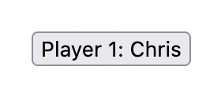
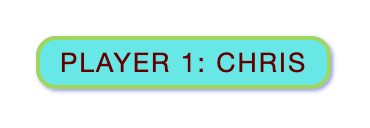
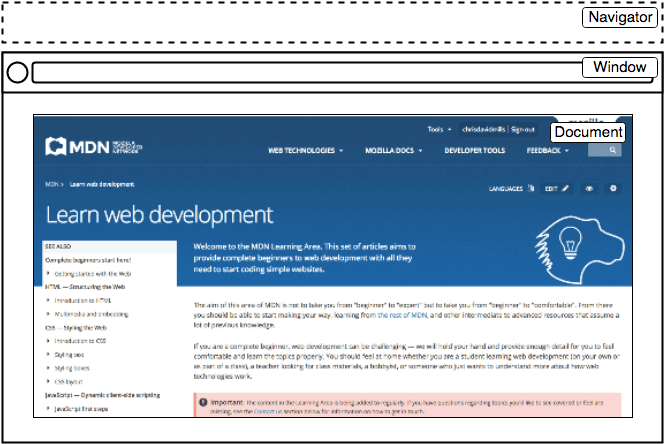
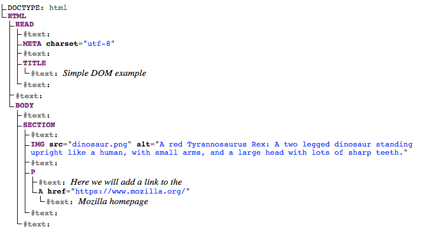
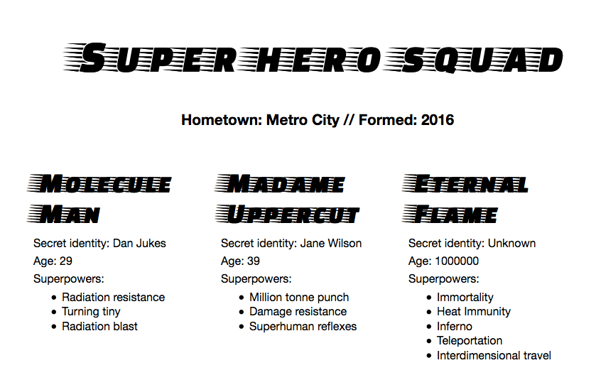

[toc]


# JavaScript 基础

JavaScript 是一门**为网站添加交互性**的编程语言。交互性体现在**游戏、点击按钮或输入表单时**的响应行为；**动态**的样式；**动画**，等等。

## JavaScript 到底是什么？
JavaScript 是一门多功能的、新手友好的编程语言。随着经验的积累，你将能够创建游戏、2D 和 3D 图形动画、全面的数据库驱动应用程序，等等。

JavaScript 本身相对简洁，但非常灵活。开发者在核心 JavaScript 语言的基础上编写了各种工具，让你能以最小的努力解锁大量的功能。这些工具包括：

Web 浏览器**内置的应用程序编程接口（API）**，提供了丰富的功能，例如：**动态创建 HTML 和设置 CSS 样式；从用户的摄像头采集和处理视频流、生成 3D 图形和音频样本**。
允许开发者将来自其他内容提供商（如 Disqus、Facebook）的功能整合到自己的网站中的第三方 API。
能够应用于 HTML 加速网站和应用程序开发的第三方框架和库。

接下来将介绍核心语言的一些方面，并提供体验一些浏览器 API 特性的机会。

## “Hello World!”示例
JavaScript 是最流行的现代 Web 技术之一。

然而，熟练掌握 JavaScript 比熟练掌握 HTML 和 CSS 要更有挑战。你必须从简单的开始，然后逐步前进。

1. 打开测试站点的目录，创建一个名为 `scripts` 的新目录。然后在 scripts 目录中创建一个名为 `main.js` 的新文件，并保存。

2. 打开 `index.html` 文件，在**结束标签 `</body>` 前**添加下列代码：

	```HTML
	<script src="scripts/main.js"></script>
	```

3. 与 CSS 的 <link>元素的功能类似，它将 JavaScript **引入以作用于 HTML**（以及 CSS 和页面上的任何其他内容）。

4. 将下列代码添加到 `scripts/main.js` 文件：

	```js
	const myHeading = document.querySelector("h1");
	myHeading.textContent = "Hello world!";
	```

5. 确认保存了 HTML 和 JavaScript 文件。然后在浏览器中打开 `index.html`。你应该看到类似的内容：

备注： 上面将 <script> 元素放在 HTML 文件的**底部附近**(不能在开头)的原因是浏览器会**按照代码在文件中的顺序进行读取**。

如果 JavaScript 先加载，并期望操纵还未加载的 HTML，可能会出现问题。将 JavaScript 放在 HTML 页面的底部附近是一种解决方案。想要了解更多的替代方案，参见脚本加载策略。

## 发生了什么？
使用 JavaScript 把标题文本改成了 Hello world!。用 **querySelector() 函数**获取标题的引用，然后把它储存在 myHeading 变量中。这与 CSS 选择器的用法非常相像。若要对某个元素进行操作，首先得选择它。

接着，把 myHeading 变量的 **textContent 属性（表示标题内容）**的值设置为 Hello world!。

# JavaScript 速成课程
## 变量
变量是存储值的容器。要**声明变量**，先**输入 let 关键字**，然后输入变量名：

``` js
let myVariable;
```

行尾的分号表示语句结束。仅当你需要在**单行内分隔多条语句时，分号才是必须的**。然而，一些人认为每条语句末尾加分号是最佳实践。对于何时应该使用、何时不应该使用分号有其他的规则。在你的 JavaScript 分号指南中了解更多细节。

变量名几乎可以任意取，但有一些限制（参见命名规则小节）。如果你不确定，还可以验证变量名是否有效。

JavaScript 对大小写敏感。这意味着 myVariable 和 myvariable 是不同的。如果代码中有问题，检查一下大小写！

声明变量后，你可以给它赋值：

```js
myVariable = "鲍勃";
```

你也可以在同一行执行声明和赋值操作：

```js
let myVariable = "鲍勃";
```

给变量赋值后，你可以**修改变量的值**：

```js
let myVariable = "鲍勃";
myVariable = "斯蒂夫";
```

注意变量可以存储不同[数据类型](https://developer.mozilla.org/zh-CN/docs/Web/JavaScript/Data_structures)的值：

| 变量                                                         | 解释                                                         | 示例                                                         |
| :----------------------------------------------------------- | :----------------------------------------------------------- | :----------------------------------------------------------- |
| [字符串](https://developer.mozilla.org/zh-CN/docs/Glossary/String) | 字符串就是文本序列。用**单引号或双引号括起来**的值就是字符串。 | `let myVariable = '鲍勃';` 或者 `let myVariable = "鲍勃";`   |
| [数字](https://developer.mozilla.org/zh-CN/docs/Glossary/Number) | 数字周围没有引号。                                           | `let myVariable = 10;`                                       |
| [布尔](https://developer.mozilla.org/zh-CN/docs/Glossary/Boolean) | 真/假值。单词 `true`/`false` 是不需要引号的特殊关键字。      | `let myVariable = true;`                                     |
| [数组](https://developer.mozilla.org/zh-CN/docs/Glossary/Array) | 让你在**单一引用**中存储多个值的结构。                       | `let myVariable = [1,'鲍勃','斯蒂夫',10];` 像这样引用数组成员：`myVariable[0]`、`myVariable[1]`，等等。 |
| [对象](https://developer.mozilla.org/zh-CN/docs/Glossary/Object) | 可以是**任何内容**。JavaScript 里的**一切都是对象**，对象能在变量中存储。这一点要牢记于心。 | `let myVariable = document.querySelector('h1');` 上面的示例都是。 |

那么变量有什么用呢？编程时变量无处不在。如果值不能修改，那么就无法做任何动态的工作，比如个性化的问候，或是改变图片库中展示的图片。

## 注释
注释是和代码一起的文本片段。浏览器会忽略注释。类似于 CSS，JavaScript 中可以添加注释。

```js
/*
这里的所有内容都是注释。
*/
```

如果注释只有一行，将注释放在**两个斜杠之后**也是个选择，就像这样：

## 运算符

| 运算符     | 解释                                                         | 符号                                                         | 示例                                                         |
| :--------- | :----------------------------------------------------------- | :----------------------------------------------------------- | :----------------------------------------------------------- |
| 加         | 将两个数字相加或拼接两个字符串。                             | `+`                                                          | `6 + 9;'Hello ' + 'world!';`                                 |
| 减、乘、除 | 这些运算符的作用与基础算术一致。                             | `-`、`*`、`/`                                                | `9 - 3;8 * 2; //乘法在 JS 中是一个星号9 / 3;`                |
| 赋值       | 你已经见过了：为变量赋值。                                   | `=`                                                          | `let myVariable = '鲍勃';`                                   |
| 严格相等   | 测试两个值是否相等以及是否是相同的数据类型，并返回一个 `true`/`false`（布尔）结果。 | [`===`](https://developer.mozilla.org/zh-CN/docs/Web/JavaScript/Reference/Operators/Strict_equality) | `let myVariable = 3;myVariable === 4;`                       |
| 非、不等于 | 返回和先前逻辑上相反的值。非将 `true` 变为 `false`，等等。当它和相等运算符一起使用时，否定运算符测试两个值是否*不*相等。 | `!`、`!==`                                                   | 对于“非”，基本表达式是 `true`，但结果返回的是 `false`，因为我们否定了这个值：`let myVariable = 3;!(myVariable === 3);`“不等于”用不同的语法得出了基本上一样的结果。这里测试“`myVariable` 不等于 3”。返回 `false`，因为 `myVariable` 等于 3：`let myVariable = 3;myVariable !== 3;` |

备注： 执行计算时，混用数据类型可能出现一些奇怪的结果。注意要正确地引用变量，然后得到预期的结果。比如在控制台输入 "35" + "25"，为什么没有得到预期的结果？因为引号将数字转换成了字符串，所以结果是**拼接两个字符串**而不是把两个数字相加。如果输入 35 + 25，你就会得到两个数字的和。

## 条件语句
条件语句是用来测试表达式的真假的代码结构。一个常用的条件语句是 if...else 语句。例如：

```js
let iceCream = "chocolate";
if (iceCream === "chocolate") {
  alert("我最喜欢巧克力冰淇淋了！");
} else {
  alert("但是巧克力才是我的最爱呀……");
}
```

`if ()` 中的表达式是一个测试。用（上文所提到的）严格相等运算符来比较 `iceCream` 变量与 `chocolate` 字符串是否相等。如果返回 `true`，则运行第一个代码块；如果返回 `false`，则运行 `else` 关键字之后的第二个代码块。

## 函数
函数是一种将你**希望重复使用的功能封装起来**的方式。你可以将一段代码定义为一个函数，当你在代码中调用该函数名时，它会执行。这是一种避免重复编写相同代码的好方式。你已经看到了一些函数的使用示例了。比如：

```js
let myVariable = document.querySelector("h1");
```

```js
alert("你好！");
```

比如， `alert()` 函数在浏览器窗口内弹出一个警告框，但还应为其提供一个字符串参数，告诉它警告框里要显示的内容。

你也可以定义你自己的函数。在下面的例子中，我们创建了一个接收两个数字参数的函数，并对这两个参数做乘法：

```js
function multiply(num1, num2) {
  let result = num1 * num2;
  return result;
}
```

备注： return 语句告诉浏览器**将 result 变量返回到函数外面**。这一点很有必要，因为函数内定义的变量只能在函数内使用。这叫做变量的作用域。（阅读更多有关变量的作用域的内容。）

## 事件
**事件处理器**能为网页添加**真正的交互**。它们是**监听浏览器活动**的代码块，并**在响应中运行**代码。最明显的例子就是**处理点击事件**，当你**用鼠标点击**时，浏览器会**触发该事件**。作为演示，在控制台中输入下面的代码，然后点击网页的任意位置：

```js
document.querySelector("html").addEventListener("click", function () {
  alert("别戳我，我怕疼！");
});
```

**将事件处理器与元素绑定**有许多方法。这里我们**选择了 <html> 元素**，然后**调用了它的 addEventListener() 函数**，并**传递要监听的事件名（'click'）**和**事件发生时要运行的函数**。

刚刚我们传递给 addEventListener() 的函数被称为**匿名函数**，因为**它没有名字**。匿名函数还有另一种书写方式，我们称之为箭头函数。**箭头函数使用 () => 而不是 function ()**：

```js
document.querySelector("html").addEventListener("click", () => {
  alert("别戳我，我怕疼！");
});
```

## 添加一个图像切换器

在本小节，你将会学习如何**使用 JavaScript 和 DOM API 特性交替显示两张图片**。当用户点击图片时进行切换。

1. 选择一张你想在页面上展示的图片。理想情况下，这张图片的尺寸与之前添加的图片的**尺寸尽可能相同**。
2. 将这张图片**保存在 `images`** 目录中。
3. 将这张图片重命名为 *firefox2.png*。
4. 将下列的 JavaScript 代码添加到 `main.js` 文件：

```js
const myImage = document.querySelector("img");

myImage.onclick = () => {
  const mySrc = myImage.getAttribute("src");
  if (mySrc === "images/firefox-icon.png") {
    myImage.setAttribute("src", "images/firefox2.png");
  } else {
    myImage.setAttribute("src", "images/firefox-icon.png");
  }
};
```

5. 保存所有文件并用浏览器打开 index.html。现在，当你点击图片时，会切换成另一张。

发生的事情是这样的。把  元素的**引用存储在 myImage 变量**中。接下来，让它的 onclick 事件处理器属性等于一个无名函数（“匿名”函数）。这样每次点击图片时：

1. 获取这张图片的 **`src` 属性值**。
2. 用一个条件句来判断 `src` 的值**是否等于原始图片的路径**：
	1. 如果是，则将 `src` 的值改为第二张图片的路径，在内强制加载第二张图片。
	2. 如果不是（意味着它已经修改过）, 则把 `src` 的值重新设置为原始图片的路径，即原始状态。

## 添加个性化欢迎信息

​	接下来，让我们在用户第一次访问站点时将页面标题修改为个性化欢迎信息。这个欢迎消息会一直存在。名字信息会**由 Web 存储 API 保存下来**，即使用户关闭页面之后再重新打开。还会添加一个选项，**改变用户名字以更新**欢迎信息。

打开 index.html，在 **<script> 元素前**添加下列代码：

```html
<button>Change user</button>
```

打开 `main.js`，将下列代码原封不动地添加到文件的底部。将**获取新按钮和标题的引用**，并存储到变量中：

```js
let myButton = document.querySelector("button");
let myHeading = document.querySelector("h1");
```

添加下列设置个性化欢迎信息的函数。现在什么都还没发生，但一会就会发生了。

```js
function setUserName() {
  const myName = prompt("Please enter your name.");
  localStorage.setItem("name", myName);
  myHeading.textContent = `Mozilla is cool, ${myName}`;
}
```

setUserName() 函数**包含一个 prompt() 函数**，与 alert() 类似会**弹出一个对话框**。prompt() 函数的功能更多，**需要用户输入数据**，并在用户点击确定后将数据**存储在一个变量中**。在这个例子里，我们要求用户输入一个名字。接下来，代码**调用 localStorage API**，它**允许我们将数据存储在浏览器中并供后续获取**。我们使用 **localStorage 的 setItem() 函数创建并存储一个'name' 的数据项**，并**将它的值设置为包含用户名的 myName 变量**。最后将**标题的 textContent 属性设置**为带有用户新设置的名字的字符串。

在函数声明的后面添加下列条件语句块。我们称之为**初始化代码**，因为它在**初次加载时**开始工作。

```js
if (!localStorage.getItem("name")) {
  setUserName();
} else {
  const storedName = localStorage.getItem("name");
  myHeading.textContent = `Mozilla is cool, ${storedName}`;
}
```

1. 这里的第一行使用取非运算符（逻辑非，用 `!` 表示）**检测 `name` 数据是否存在**。若不存在，调用 `setUserName()` 创建 `name` 数据。若存在（即用户上次访问时设置了用户名），调用 `getItem()` 获取保存的名字，然后像 `setUserName()` 中那样**设置标题的 `textContent`**。
2. 设置**按钮的 `onclick` 事件处理器**。按钮**点击时，运行 `setUserName()` 函数**。这样用户就可以通过点击按钮设置新名字了。

```js
myButton.onclick = function () {
  setUserName();
};
```

## 用户名为 null？
运行示例代码，弹出输入用户名的对话框，试着**点击取消**按钮。此时标题会**显示为 Mozilla is cool, null**。这是因为**取消提示对话框后值将设置为 null**。null 是 JavaScript 中的一个特殊值，**表示引用的值不存在**。

也**可以不输入**任何名字直接点击确认，你的标题会显示为 Mozilla is cool,，原因么显而易见。

要避免这些问题，应该**检查用户没有输入空名字**。**更新 setUserName()** 为：

```js
function setUserName() {
  const myName = prompt("Please enter your name.");
  if (!myName) {
    setUserName();
  } else {
    localStorage.setItem("name", myName);
    myHeading.textContent = `Mozilla is cool, ${myName}`;
  }
}

```

翻译一下就是：如果 `myName` 没有值，就再次**从头运行**`setUserName()`。如果有值（如果上面的表达式不为真），就把值存储到 `localStorage` 并设置为标题文本。

# 再探JavaScript

- [HTML](https://developer.mozilla.org/zh-CN/docs/Glossary/HTML) 是一种标记语言，用来结构化我们的网页内容并赋予内容含义，例如定义段落、标题和数据表，或在页面中嵌入图片和视频。
- [CSS](https://developer.mozilla.org/zh-CN/docs/Glossary/CSS) 是一种样式规则语言，可将样式应用于 HTML 内容，例如设置背景颜色和字体，在多个列中布局内容。
- [JavaScript](https://developer.mozilla.org/zh-CN/docs/Glossary/JavaScript) 是一种脚本语言，可以用来创建动态更新的内容，控制多媒体，制作图像动画，还有很多。（好吧，虽然它不是万能的，但可以通过简短的代码来实现神奇的功能。）

这三层依次建立，秩序井然。以简单文本标签作为示例。首先用 HTML 将文本标记起来，从而赋予它结构和目的：

```html
<button type="button">Player 1: Chris</button>
```



然后我们可以为它加一点 CSS 让它更好看：

```css
button {
  font-family: "helvetica neue", helvetica, sans-serif;
  letter-spacing: 1px;
  text-transform: uppercase;
  border: 2px solid rgb(200 200 0 / 60%);
  background-color: rgb(0 217 217 / 60%);
  color: rgb(100 0 0 / 100%);
  box-shadow: 1px 1px 2px rgb(0 0 200 / 40%);
  border-radius: 10px;
  padding: 3px 10px;
  cursor: pointer;
}
```



最后，我们可以再加上一些 JavaScript 来实现动态行为：

```js
const button = document.querySelector("button");

button.addEventListener("click", updateName);

function updateName() {
  const name = prompt("请输入新的名字");
  button.textContent = `Player 1: ${name}`;
}
```

客户端 JavaScript 语言的核心包含一些普遍的编程特性，以让你可以做到如下的事情：

- 在变量中储存有用的值。比如上文的示例中，我们请求客户输入一个新名字，然后将其储存到 `name` 变量中。
- 操作一段文本（在编程中称为“字符串”（string））。上文的示例中，我们取字符串“玩家 1：”，然后把它和 `name` 变量拼接起来，创造出完整的文本标签，比如“玩家 1：小明”。
- 运行代码以响应网页中发生的特定事件。上文的示例中，我们用一个 [`click`](https://developer.mozilla.org/zh-CN/docs/Web/API/Element/click_event) 事件来检测按钮什么时候被点击，然后运行代码更新文本标签。

JavaScript 语言核心之上所构建的功能更令人兴奋。**应用程序接口**（**Application Programming Interface，API**）将为你的代码提供额外的超能力。

API 是**已经建立好的一套代码组件**，可以让开发者实现原本很难甚至无法实现的程序。

**浏览器 API** 内建于 web 浏览器中，它们可以将数据从周边计算机环境中筛选出来，还可以做实用的复杂工作。例如：

- [文档对象模型 API](https://developer.mozilla.org/zh-CN/docs/Web/API/Document_Object_Model) 能通过**创建、移除和修改 HTML**，为页面动态应用新样式等手段来操作 HTML 和 CSS。比如当某个页面出现了一个弹窗，或者显示了一些新内容（像上文小演示中看到那样），这就是 DOM 在运行。
- [地理位置 API](https://developer.mozilla.org/zh-CN/docs/Web/API/Geolocation) 获取地理信息。这就是为什么[谷歌地图](https://www.google.com/maps)可以找到你的位置，而且标示在地图上。
- [画布（Canvas）](https://developer.mozilla.org/zh-CN/docs/Web/API/Canvas_API) 和 [WebGL](https://developer.mozilla.org/zh-CN/docs/Web/API/WebGL_API) API 可以创建生动的 2D 和 3D 图像。人们正运用这些 web 技术制作令人惊叹的作品。参见 [Chrome Experiments](https://experiments.withgoogle.com/collection/chrome) 以及 [webglsamples](https://webglsamples.org/)。
- 诸如 [`HTMLMediaElement`](https://developer.mozilla.org/zh-CN/docs/Web/API/HTMLMediaElement) 和 [WebRTC](https://developer.mozilla.org/zh-CN/docs/Web/API/WebRTC_API) 等[影音类 API](https://developer.mozilla.org/en-US/docs/Web/Media/Guides/Audio_and_video_delivery) 让你可以利用多媒体做一些非常有趣的事，比如在网页中直接播放音乐和影片，或用自己的网络摄像头获取录像，然后在其他人的电脑上展示（试用简易版[截图演示](http://chrisdavidmills.github.io/snapshot/)以理解这个概念）。

**第三方 API** 并没有默认嵌入浏览器中，一般要从网上取得它们的代码和信息。

浏览器在读取一个网页时，代码（HTML、CSS 和 JavaScript）将在一个运行环境（浏览器标签页）中得到执行。就像一间工厂，将原材料（代码）加工为一件产品（网页）。

首先使用 `document.querySelector` 选定一个按钮，然后使用 `addEventListener` 给它**附上一个事件监听器**（第 3 行），使得在它被点击时，**`updateName()` 代码块（5 – 8 行）便会运行**。`updateName()` 代码块（这类可以重复使用的代码块称为“函数”）向用户请求一个新名字，然后把这个名字**插入到段落中**以**更新显示**。

如果互换了代码里最初两行的顺序，会导致问题。[浏览器开发者控制台](https://developer.mozilla.org/zh-CN/docs/Learn_web_development/Howto/Tools_and_setup/What_are_browser_developer_tools)将返回一个错误：`Uncaught ReferenceError: Cannot access 'button' before initialization`。这意味着 **`button` 对象还未初始化**，所以我们不能为它增添事件监听器。

## 怎样向页面添加 JavaScript？

可以像添加 CSS 那样将 JavaScript 添加到 HTML 页面中。CSS 使用 <link> 元素**链接外部样式表**，使用 <style> 元素向 HTML 嵌入内部样式表，而 JavaScript 这里只需一个元素——<script>。我们来看看它是怎么工作的。

## 外部 JavaScript

1. 首先，在刚才的 HTML 文件所在的目录下创建一个名为 `script.js` 的新文件。请确保扩展名为 `.js`，只有这样才能被识别为 JavaScript 代码。

2. 移除当前位于 </body> 底部的 <script> 元素，并且在**结束标签 </head> 之前**添加以下内容（这样浏览器就能**比在底部时更快开始加载文件**）：

	```html
	<script type="module" src="script.js"></script>
	```

	在 `script.js` 文件中，添加下面的脚本：

```js
function createParagraph() {
  const para = document.createElement("p");
  para.textContent = "你点击了按钮！";
  document.body.appendChild(para);
}
const buttons = document.querySelectorAll("button");
for (const button of buttons) {
  button.addEventListener("click", createParagraph);
}

```

## 请使用 addEventListener

与其在 HTML 中包含 JavaScript，不如使用纯 JavaScript 构造。**通过 querySelectorAll() 函数，可以选择页面上的所有按钮。**然后可以循环遍历这些按钮，**使用 addEventListener() 为每个按钮分配一个处理器**。代码如下所示：

```js
const buttons = document.querySelectorAll("button");
for (let i = 0; i < buttons.length; i++) {
  buttons[i].addEventListener("click", createParagraph);
}
```

## 脚本加载策略

页面上的所有 HTML 代码都按其出现的顺序加载。如果使用 JavaScript 去操作页面上的元素（更准确的说，是文档对象模型），那么**如果 JavaScript 在 HTML 之前就被加载和解析了，代码将无法运行。**

有几种不同的策略来确保 JavaScript 只在 HTML 解析之后运行：

在上面的**内部** JavaScript 示例中，脚本元素放在文档正文的**底部**，因此只能在 HTML 正文的其他部分被解析以后运行。

在上面的**外部** JavaScript 实例中，脚本元素放在文档的**头部**，在解析 HTML 正文之前解析。但是由于我们使用了 <script type="module">，代码**被视为一个模块**，并且浏览器在执行 JavaScript 模块之前会等待所有的 HTML 代码都处理完毕（也可以把外部脚本放在正文的底部，但是如果 HTML 内容较多且网络较慢，在浏览器开始获取并**加载脚本**之前可能需要大量的时间，因此**将外部脚本放在头部通常会更好一些**）。

如果仍然想在文档头部使用**非模块脚本**，可能阻塞整个页面的显示，并且可能出现错误，因为脚本在文档解析之前执行：

对于**外部脚本**，应该在 <script> 元素上**添加 defer**（或者如果不需要 HTML 解析完成，则可以使用 async）属性。
对于内部脚本，应该将代码封装在 DOMContextLoaded 事件监听器中。
这超出了本教程的范围，除非你需要支持非常老的浏览器，否则不要这样做，使用 <script type="module"> 代替即可。

# JavaScript 初体验

**尽可能从程序员的思维去思考：**

1. 随机生成一个 1 到 100 之间的自然数。
2. 记录玩家当前的轮数。从 1 开始。
3. 为玩家提供一种猜测数字的方法。
4. 一旦有结果提交，先将其记录下来，以便用户**可以看到他们先前的猜测**。
5. 然后检查它是否正确。
6. 如果正确：
	1. 显示祝贺消息。
	2. **阻止玩家继续猜测（这会使游戏混乱）。**
	3. **显示控件允许玩家重新开始**游戏。
7. 如果出错，并且玩家有剩余轮次：
	1. 告诉玩家他们错了。
	2. 允许他们输入另一个猜测。
	3. 轮数加 1。
8. 如果出错，并且玩家没有剩余轮次：
	1. 告诉玩家游戏结束。
	2. **阻止玩家继续猜测（这会使游戏混乱）。**
	3. 显示控件允许玩家重新开始游戏。
9. 一旦游戏重启，确保游戏的逻辑和 UI **完全重置**，然后返回步骤 1。

```js
let randomNumber = Math.floor(Math.random() * 100) + 1;

const guesses = document.querySelector(".guesses");
const lastResult = document.querySelector(".lastResult");
const lowOrHi = document.querySelector(".lowOrHi");

const guessSubmit = document.querySelector(".guessSubmit");
const guessField = document.querySelector(".guessField");

let guessCount = 1;
let resetButton;
```

这段代码设置了存储数据的变量和常量以供程序使用。

变量本质上是值（例如数字或字符串）的名称。你可以使用**关键字 `let`** 和一个名字来创建变量。

常量也用于对值进行命名，但其不像变量，在创建后将无法修改这个值。本例中用常量来保存对用户界面元素的引用。界面元素的文字可能会改变，但引用是不变的。你可以使用**关键字 `const`** 和一个名字来创建常量。

在我们的示例中：

- 我们用数学算法得出一个 1 到 100 之间的随机数，并赋值给第一个变量（`randomNumber`）。
- 接下来的三个常量均存储着**一个引用**，分别**指向 HTML 结果段落**中某个元素（注意它们是如何放置在 `<div>` 元素内的），**用于在代码后面段落中插入值**：

```html
<div class="resultParas">
  <p class="guesses"></p>
  <p class="lastResult"></p>
  <p class="lowOrHi"></p>
</div>
```

- 接下来的两个常量存储对表单文本输入和提交按钮的引用，并用于控制以后提交猜测：

	```html
	<label for="guessField">Enter a guess: </label>
	<input type="number" id="guessField" class="guessField" />
	<input type="submit" value="Submit guess" class="guessSubmit" />
	```

- 倒数第二个变量**存储一个计数器**并初始化为 1（用于跟踪玩家猜测的次数），最后一个变量**存储对重置按钮的引用**，这个按钮尚不存在（但稍后就有了）。

下面，在之前的代码中添加以下内容：

```js
function checkGuess() {
  alert("I am a placeholder");
}
```

函数是可复用的代码块，可以一次编写，反复运行，从而节省了大量的重复代码。它们真的很有用。定义函数的方法很多，但现在我们先集中考虑当前这个简单的方式。这里我们使用关键字 `function` 、一个函数名、一对小括号定义了一个函数。随后是一对花括号（`{ }`）。花括号内部是调用函数时要运行的所有代码。

要运行一个函数代码时，可以输入函数名加一对小括号。

你也可以使用 `+` 运算符将文本字符串连接在一起（术语“串联”（*concatenation*））

回到我们的 `checkGuess()` 函数，我们希望它不仅能够给出一个占位符消息，同时还能检查玩家是否猜对，并做出适当的反应。

现在，将当前的 `checkGuess()` 函数替换为此版本：

```js
function checkGuess() {
  const userGuess = Number(guessField.value);
  if (guessCount === 1) {
    guesses.textContent = "Previous guesses: ";
  }
  guesses.textContent += `${userGuess} `;
  if (userGuess === randomNumber) {
    lastResult.textContent = "Congratulations! You got it right!";
    lastResult.style.backgroundColor = "green";
    lowOrHi.textContent = "";
    setGameOver();
  } else if (guessCount === 10) {
    lastResult.textContent = "!!!GAME OVER!!!";
    lowOrHi.textContent = "";
    setGameOver();
  } else {
    lastResult.textContent = "Wrong!";
    lastResult.style.backgroundColor = "red";
    if (userGuess < randomNumber) {
      lowOrHi.textContent = "Last guess was too low!";
    } else if (userGuess > randomNumber) {
      lowOrHi.textContent = "Last guess was too high!";
    }
  }
  guessCount++;
  guessField.value = "";
  guessField.focus();
}
```

呀——好多的代码！让我们来逐段探究。

- 第一行声明了一个名为 `userGuess` 的变量，并将其**设置为在文本字段中输入的值**。我们还对这个值应用了**内置的 `Number()` 方法**，只是为了**确保该值是一个数字**。由于我们没有更改此变量，因此我们使用 `const` 声明。
- 接下来，我们遇到我们的第一个条件代码块。条件代码块让你能够根据某个条件的真假来选择性地运行代码。虽然看起来有点像一个函数，但它不是。条件块的最简单形式是从关键字 `if` 开始，然后是一些括号，然后是一些花括号。括号内包含一个比较。如果比较结果为 `true`，就会执行花括号内的代码。反之，花括号中的代码就会被跳过，从而执行下面的代码。本文的示例中，比较测试的是 `guessCount` 变量是否等于 `1`，即玩家是**不是第一次猜数字**：如果是，我们让 `guesses` 段落的文本内容等于 `Previous guesses:`。如果不是就不用了。

- 第 6 行将当前 `userGuess` 值附加到 `guesses` 段落的末尾，并加上一个空格，以使每两个猜测值之间有一个空格。
- 下一个代码块中做了几个检查：
	- 第一个 `if(){ }` 检查用户的猜测是否等于在代码顶端设置的 `randomNumber` 值。如果是，则玩家猜对了，游戏胜利，我们将向玩家显示一个漂亮的绿色的祝贺信息，并**清除“高了 / 低了”信息框的内容**，**调用 `setGameOver()` 方法**。
	- 紧接着是一个 `else if(){ }` 结构。它会检查这个回合是否是玩家的最后一个回合。如果是，程序将做与前一个程序块相同的事情，只是这次它显示的是 Game Over 而不是祝贺消息。
	- 最后的一个块是 `else { }`，前两个比较都不返回 `true` 时（也就是玩家尚未猜对，但是还有机会）才会执行这里的代码。在这个情况下，我们会告诉玩家他们猜错了，并执行另一个条件测试，判断并告诉玩家猜测的数字是高了还是低了。
- 函数最后三行（26 - 28 行）是**为下次猜测值提交做准备**的。我们把 `guessCount` 变量的值加 1，以使玩家消耗一次机会（`++` 是自增操作符，为自身加 1），然后我们把表单中文本域的值清空，重新聚焦于此，准备下一轮游戏

## 事件（Event）

现在，我们有一个实现比较不错的 checkGuess() 函数了，但它现在什么事情也做不了，因为我们还没有调用它。理想中，我们希望在点击“Submit guess”按钮时调用它，为此，我们需要使用事件。**事件就是浏览器中发生的事儿**，比如点击按钮、加载页面、播放视频，等等，我们可以通过调用代码来响应事件。**侦听事件发生的结构称为事件监听器（Event Listener）**，**响应事件触发而运行的代码块被称为事件处理器（Event Handler）**。

在 checkGuess() 函数后添加以下代码：

```js
guessSubmit.addEventListener("click", checkGuess);
```

这里为 `guessSubmit` 按钮添加了一个事件监听器。`addEventListener()` 方法包含两个可输入值（称为“*参数*”（argument）），监听事件的类型（本例中为 `click`），和当事件发生时我们想要执行的代码（本例中为 `checkGuess()` 函数）。注意，`addEventListener()` 中作为参数的函数名不加括号。

现在，保存代码并刷新页面，示例应该能够工作了，但还不够完善。现在唯一的问题是，如果玩家猜对或游戏次数用完，游戏将出错，因为我们尚未定义游戏结束时应运行的 `setGameOver()` 函数。现在，让我们补全所缺代码，并完善示例功能。

### 补全游戏功能
在代码最后添加一个 setGameOver() 函数，然后我们一起来看看它：

```js
function setGameOver() {
  guessField.disabled = true;
  guessSubmit.disabled = true;
  resetButton = document.createElement("button");
  resetButton.textContent = "Start new game";
  document.body.append(resetButton);
  resetButton.addEventListener("click", resetGame);
}
```

- 前两行通过将 **`disable` 属性**设置为 `true` 来**禁用**表单文本输入和按钮。这样做是必须的，否则用户就可以在游戏结束后提交更多的猜测，游戏的规则将遭到破坏。
- 接下来的三行创建一个新的<button>元素，设置它的文本为“Start new game”，并把它添加到当前 HTML 的底部。
- 最后一行在新按钮上设置了一个事件监听器，当它被点击时，一个名为 `resetGame()` 的函数被将被调用。

现在我们需要定义 `resetGame()` 这个函数，依然放到代码底部：

```js
function resetGame() {
  guessCount = 1;
  const resetParas = document.querySelectorAll(".resultParas p");
  for (const resetPara of resetParas) {
    resetPara.textContent = "";
  }
  resetButton.parentNode.removeChild(resetButton);
  guessField.disabled = false;
  guessSubmit.disabled = false;
  guessField.value = "";
  guessField.focus();
  lastResult.style.backgroundColor = "white";
  randomNumber = Math.floor(Math.random() * 100) + 1;
}

```

这段较长的代码将游戏中的一切重置为初始状态，然后玩家就可以开始新一轮的游戏了。此段代码：

- 将 `guessCount` 重置为 1。
- 清除所有信息段落。这里，我们**选择 `<div class="resultParas"></div>` 内的所有段落**，然后通过循环迭代，将它们的 `textContent` 设置为 `''`（一个空字符串）。
- 删除重置按钮。
- 启用表单元素，清空文本域并**聚焦于此**，准备接受新猜测的数字。
- **删除 `lastResult` 段落的背景颜色**。
- 生成一个新的随机数，这样就可以猜测新的数字了！

## 循环（Loop）
上面代码中有一部分需要我们仔细研读，那就是 for...of 循环。循环是一个非常重要的编程概念，它让你能够重复运行一段代码，直到满足某个条件为止。

```js
const fruits = ["apples", "bananas", "cherries"];
for (const fruit of fruits) {
  console.log(fruit);
}
```

发生了什么？控制台中打印出了字符串 `'apples'、'bananas'、'cherries'`。

这正是循环所为。`const fruits = ['apples', 'bananas', 'cherries'];` 这一行创建了一个数组。我们在本章稍后的[完整的数组指南](https://developer.mozilla.org/zh-CN/docs/Learn_web_development/Core/Scripting/Arrays)中会作深入探究。就目前而言，数组是元素（本例中为字符串）的集合。

`for...of` 循环为你提供了一种获取数组中的每一个元素的方法，并在元素的基础上运行 JavaScript 代码。`for (const fruit of fruits)` 这一行的意思是：

1. 获取 `fruits` 中的第一个元素。
2. 将 `fruit` 变量设置为这个元素，然后运行花括号 `{}` 间的代码。
3. 获取 `fruits` 中的下一个元素，然后重复步骤 2，直至到达 `fruits` 的末尾。

现在让我们来看一下猜数字游戏中的循环——`resetGame()` 函数中可以找到以下内容：

```js
const resetParas = document.querySelectorAll(".resultParas p");
for (const resetPara of resetParas) {
  resetPara.textContent = "";
}
```

这段代码通过 [`querySelectorAll()`](https://developer.mozilla.org/zh-CN/docs/Web/API/Document/querySelectorAll) 方法创建了一个包含 `<div class="resultParas">` 内所有段落的变量，然后通过循环迭代，删除每个段落的文本内容。

请注意，即使 `resetParas` 是一个常量，我们也可以**更改其内部**属性，例如 `textContent`。

## 浅谈对象（Object）
在讨论前最后再改进一波。在 let resetButton;（脚本顶端部分）下方添加下面一行内容，然后保存文件：

```js
guessField.focus();
```

这一行通过 [`focus()`](https://developer.mozilla.org/en-US/docs/Web/API/HTMLElement/focus) 方法让**光标在页面加载完毕时自动放置**于<input>输入框内，这意味着玩家可以马上开始第一次猜测，而**无需点击输入框**。这只是一个小的改进，却提高了可用性——为使用户能投入游戏提供一个良好的视觉线索。

深入分析一下。**JavaScript 中一切都是对象**。对象是存储在单个分组中的相关功能的集合。可以创建自己的对象，但这是较高阶的知识，我们今后才会谈及。现在，仅需简要讨论浏览器内置的对象，它们已经能够做许多有用的事情。

在本示例的特定情况下，我们**首先创建一个 `guessField` 常量来存储对 HTML 中的文本输入表单域的引用**，在文档**顶部**的声明区域中可以找到以下行：

```js
const guessField = document.querySelector(".guessField");
```

使用 [`document`](https://developer.mozilla.org/zh-CN/docs/Web/API/Document) 对象的 [`querySelector()`](https://developer.mozilla.org/zh-CN/docs/Web/API/Document/querySelector) 方法可以获得这个引用。`querySelector()` 需要一个信息——用一个 [CSS 选择器](https://developer.mozilla.org/zh-CN/docs/Learn_web_development/Core/Styling_basics/Basic_selectors) 可以选中需要引用的元素。

因为 `guessField` 现在包含一个指向<input>元素的引用，它现在就能够访问一系列的属性（存储于对象内部的基础变量，其中一些的值无法改变）和方法（存储在对象内部的基础函数）。`focus()` 是 `input` 元素可用方法之一，因此我们可以使用这行代码将光标聚焦于此文本框上.

**不包含对表单元素引用的变量不提供 focus() 方法**。例如，引用 <p> 元素的 guesses 常量，包含一个数字的 guessCount 变量。

## 变量是什么？
一个变量，就是一个用于存放数值的容器。这个数值可能是一个用于累加计算的数字，或者是一个句子中的字符串。变量的独特之处在于它存放的数值是可以改变的。让我们看一个简单的例子：

```html
<button>Press me</button>
```

```js
const button = document.querySelector("button");

button.onclick = function () {
  let name = prompt("What is your name?");
  alert("Hello " + name + ", nice to see you!");
};
```

在上面的例子中，点击按钮之后，第一行代码会在屏幕上弹出一个对话框，让你输入名字，然后存储输入的名字到一个变量。第二行代码将会显示包含你名字的欢迎信息，你的名字就是从之前的变量里面读取的。

## var 与 let 的区别
此时，你可能会想：“为什么我们需要两个关键字来定义变量？”，“为什么有 var 和 let 呢？"。

原因是有些历史性的。回到最初创建 JavaScript 时，是只有 var 的。在大多数情况下，这种方法可以接受，但有时在工作方式上会有一些问题——它的设计会令人困惑或令人讨厌。因此，let 是在现代版本中的 JavaScript 创建的一个新的关键字，用于创建与 var 工作方式有些不同的变量，解决了过程中的问题。

首先，如果你编写一个声明并初始化变量的多行 JavaScript 程序，你可以在初始化一个变量之后用 var 声明它，它仍然可以工作。其次，当你使用 `var` 时，可以根据需要**多次声明**相同名称的变量，但是 **`let` 不能**。

这是一个明智的语言决定。没有理由重新声明变量——这只会让事情变得更加混乱。

出于这些以及其他原因，我们建议你在代码中尽可能多地使用 `let`，而不是 `var`。因为没有理由使用 `var`，除非你需要用代码支持旧版本的 Internet Explorer 

### Array

数组是一个单个对象，其中包含很多值，**方括号括**起来，并用逗号分隔。

### Object
在编程中，对象是现实生活中的模型的一种代码结构。你可以有一个简单的对象，代表一个停车场，并包含有关其宽度和长度的信息，或者你可以有一个代表一个人的对象，并包含有关他们的名字，身高，体重，他们说什么语言，如何说 你好，他们，等等。

尝试在你的控制台输入以下行：

```js
let dog = { name: "Spot", breed: "Dalmatian" };
```

我们来看看我们的原始变量是否是相同的**数据类型**。在 JavaScript 中有一个称为`typeof` 的运算符。

| `**` | 幂   | 取底数的指数次方，即指数所指定的底数相乘。它在 EcmaScript 2016 中首次引入。 | `5 ** 5` (返回 3125，相当于 `5 * 5 * 5 * 5 * 5` 。) |
| ---- | ---- | ------------------------------------------------------------ | --------------------------------------------------- |

你以后有时候会看到参与算术计算的数字被称为 操作数 ([operands](https://developer.mozilla.org/zh-CN/docs/Glossary/Operand))。

当我们在以后的文章中查看条件语句时，我们将介绍如何编写这样的逻辑。现在，我们来看一个简单的例子：

```html
<button>Start machine</button>
<p>The machine is stopped.</p>
```

```js
const btn = document.querySelector("button");
const txt = document.querySelector("p");

btn.addEventListener("click", updateBtn);

function updateBtn() {
  if (btn.textContent === "Start machine") {//相应更新
    btn.textContent = "Stop machine";
    txt.textContent = "The machine has started!";
  } else {
    btn.textContent = "Start machine";
    txt.textContent = "The machine is stopped.";
  }
}
```

这种在两个状态之间来回交换的行为通常被称为**切换**。

##  字符串

```js
const string = "这场革命将不会被电视转播。";
console.log(string);
```

### 单引号、双引号和反引号
在 JavaScript 中，你可以选择单引号（'）、双引号（"）或反引号（`）来包裹字符串。

使用反引号声明的字符串是一种特殊字符串，被称为[*模板字面量*](https://developer.mozilla.org/zh-CN/docs/Web/JavaScript/Reference/Template_literals)。在大多数情况下，模板字面量与普通字符串类似，但它具有一些特殊的属性：

- 你可以在其中[嵌入 JavaScript](https://developer.mozilla.org/zh-CN/docs/Learn_web_development/Core/Scripting/Strings#嵌入_javascript)
- 你可以声明[多行](https://developer.mozilla.org/zh-CN/docs/Learn_web_development/Core/Scripting/Strings#多行字符串)的模板字面量

## 嵌入 JavaScript
在模板字面量中，你可以**在 ${ } 中包装** JavaScript **变量或表达式**，其结果将被包含在字符串中：

```js
const name = "克里斯";
const greeting = `你好，${name}`;
console.log(greeting); // "你好，克里斯"
```

### 上下文中的串联
让我们看一下实际使用的串联：

```html
<button>按这里</button>
<div id="greeting"></div>
```

```js
const button = document.querySelector("button");
function greet() {
  const name = prompt("你叫什么名字？");
  const greeting = document.querySelector("#greeting");
  greeting.textContent = `你好呀，${name}！很高兴见到你！`;
}
button.addEventListener("click", greet);

```

这里我们使用了第 4 行中的 [`window.prompt()`](https://developer.mozilla.org/zh-CN/docs/Web/API/Window/prompt) 函数，它要求用户**在弹出的对话框中回答一个问题**然后将他们输入的文本存储在一个给定的变量中——在这个示例中是 `name` 变量。然后，我们将名称插入通用的问候消息中，并显示该字符串。

### 使用“+”连接字符串
你只能将 **${} 与模板字面量**一起使用，而**不能与不同字符串一起使**用。你可以使用 + 运算符来连接普通字符串。

### 多行字符串
**模板字符串**会**保留源代码中的换行符**，因此你可以编写跨越多行的字符串，**要使用普通字符串**获得等效的输出，你必须在字符串中包含换行字符（`\n`）：

```js
const newline = "终于有一天，\n你知道了必须做的事情，而且开始……";
console.log(newline);

/*
终于有一天，
你知道了必须做的事情，而且开始……
*/

```

一旦你的变量成为字符串对象实例，你就可以有大量的原型和方法编辑它。如果你进入String对象页并观察页面旁边的列表你就会明白这一点。

### 获得字符串的长度
这很简单 — 你可以很轻松的使用 length 属性。

### [在字符串中查找子字符串并提取它](https://developer.mozilla.org/zh-CN/docs/Learn_web_development/Core/Scripting/Useful_string_methods#在字符串中查找子字符串并提取它)

1. 有时候你会想要找出一个较小的字符串是否存在于一个较大的字符串中（我们通常会说一个字符串中存在一个子字符串）。这可以使用[`indexOf()`](https://developer.mozilla.org/zh-CN/docs/Web/JavaScript/Reference/Global_Objects/String/indexOf)方法来完成，该方法需要一个[parameter](https://developer.mozilla.org/zh-CN/docs/Glossary/Parameter) — 你想要搜索的子字符串。尝试以下：

```js
browserType.indexOf("zilla");
```

**结果是 2**，因为子字符串“zilla”从“mozilla”内的位置 2（0、1、2——所以从第 3 个字符）开始。这样的代码可以用来过滤字符串。例如，假设我们有一个 Web 地址列表，但我们只想打印出包含“mozilla”的那些地址。

这可以用另一种可能更有效的方式来实现。尝试以下：

```JS
browserType.indexOf("vanilla");
```

这应该会得到 `-1` 的结果——当在主字符串中找不到子字符串（在本例中为“vanilla”）时将返回 `-1`。

当你知道字符串中的子字符串开始的位置，以及想要结束的字符时，[`slice()`](https://developer.mozilla.org/zh-CN/docs/Web/JavaScript/Reference/Global_Objects/String/slice)可以用来提取 它。(左开右闭)

```JS
browserType.slice(0, 3);
```

此外，如果你知道要在某个字符之后提取字符串中的**所有剩余**字符，则**不必包含第二个参数**，而只需要包含要从中提取的字符位置 字符串中的其余字符。

## 转换大小写

字符串方法**toLowerCase()**和**toUpperCase()**字符串并将所有字符分别转换为小写或大写。例如，如果要在将数据存储在数据库中之前对所有用户输入的数据进行规范化，这可能非常有用。

```js
let radData = "My NaMe Is MuD";
radData.toLowerCase();
radData.toUpperCase();
```

### [替换字符串的某部分](https://developer.mozilla.org/zh-CN/docs/Learn_web_development/Core/Scripting/Useful_string_methods#替换字符串的某部分)

你可以使用[`replace()`](https://developer.mozilla.org/zh-CN/docs/Web/JavaScript/Reference/Global_Objects/String/replace)方法将字符串中的一个子字符串替换为另一个子字符串。

它需要两个参数 - 要被替换下的字符串和要被替换上的字符串。

```js
browserType.replace("moz", "van");
```

注意，在实际程序中，想要真正更新 `browserType` 变量的值，你需要**设置变量的值等于刚才的操作结果**；它**不会自动更新子串的值**。所以事实上你需要这样写：`browserType = browserType.replace('moz','van');`。

## 数组

你可以将任何类型的元素存储在数组中 .

```js
shopping;
// shopping will now return [ "tahini", "milk", "cheese", "hummus", "noodles" ]
```

### 获取数组长度
你可以通过使用 length 属性获取数组的长度（数组中有多少项元素）

1. 对于每个元素，使用 [console.log()](https://developer.mozilla.org/zh-CN/docs/Web/API/console/log_static) 将其打印到**浏览器控制台**。

### 字符串和数组之间的转换
通常，你会看到一个包含在一个长长的字符串中的原始数据，你可能希望将有用的项目分成更有用的表单，然后对它们进行处理，例如将它们显示在数据表中。为此，我们可以使用 **split() 方法**。在其最简单的形式中，这需要一个参数，你要将字符串分隔的字符，并返回分隔符之间的子串，作为数组中的项。

你也可以使用 **[`join()`](https://developer.mozilla.org/zh-CN/docs/Web/JavaScript/Reference/Global_Objects/Array/join) 方法**进行相反的操作。

将数组转换为字符串的另一种方法是使用 [`toString()`](https://developer.mozilla.org/zh-CN/docs/Web/JavaScript/Reference/Global_Objects/Array/toString) 方法。它不需要一个参数.

## 添加和删除数组项
我们还没有涵盖添加和删除数组元素，现在让我们来看看。我们将使用在上一节中最后提到的 myArray 数组。

首先，要在数组末尾添加或删除一个项目，我们可以使用 **push() 和 pop()**。

**unshift()(注入) 和 shift()(弹出)** 从功能上与 push() 和 pop() 完全相同，只是它们分别作用于数组的开始，而不是结尾。

## 循环

假设我们想在<canvas>元素上绘制 100 个随机圆（按更新按钮一次又一次地运行示例以查看不同的随机集）

```js
for (var i = 0; i < 100; i++) {
  ctx.beginPath();
  ctx.fillStyle = "rgba(255,0,0,0.5)";
  ctx.arc(random(WIDTH), random(HEIGHT), random(50), 0, 2 * Math.PI);
  ctx.fill();
}
```

- `random()`,在前面的代码中定义过了，返回一个 `0` 到 x-1 间的整数。
- `WIDTH` 和`HEIGHT` 浏览器**内部窗口**的宽度和高度。

你应该有一个基本的想法 - 我们使用一个循环来运行这个代码的 100 次迭代，其中每一个在页面上的**随机位置**绘制一个圆。无论我们绘制 100 个圆，1000 还是 10,000，所需的代码量将是相同的。只有一个数字必须改变。

一个文本<input>，允许我们输入一个名称来搜索，一个<button>元素来提交搜索，以及一个<p>元素显示结果：

```js
<label for="search">Search by contact name: </label>
<input id="search" type="text" />
<button>Search</button>
<p></p>
```

```js
const contacts = [
  "Chris:2232322",
  "Sarah:3453456",
  "Bill:7654322",
  "Mary:9998769",
  "Dianne:9384975",
];
const para = document.querySelector("p");
const input = document.querySelector("input");
const btn = document.querySelector("button");

btn.addEventListener("click", function () {
  let searchName = input.value.toLowerCase();
  input.value = "";
  input.focus();
  for (let i = 0; i < contacts.length; i++) {
    let splitContact = contacts[i].split(":");
    if (splitContact[0].toLowerCase() === searchName) {
      para.textContent =
        splitContact[0] + "'s number is " + splitContact[1] + ".";
      break;
    } else if (i === contacts.length - 1) {
      para.textContent = "Contact not found.";
    }
  }
});

```

1. 首先我们有一些变量定义 - 我们有一个联系信息数组，每个项目是一个字符串，包含一个以冒号分隔的名称和电话号码。
2. 接下来，我们将一个**事件监听器**附加到按钮（`btn`）上，这样当按下它时，运行一些代码来执行搜索并返回结果。
3. 我们将输入的值输入到一个名为`searchName`的变量中，然后**清空文本输入并重新对准**它，准备进行下一个搜索。
4. 现在有趣的部分，for 循环：
	1. 我们的计数器开始时为在 0，直到计数器不再小于`contacts.length`，并在循环的每次迭代之后将`i`递增 1。
	2. 在循环中，我们首先将当前联系人（`contacts [i]`）拆分为冒号字符，并将生成的两个值存储在名为`splitContact`的数组中。
	3. 然后，我们使用条件语句来测试`splitContact [0]`（联系人姓名）是否等于输入的`searchName`。如果是，我们在段落中输入一个字符串来报告联系人的号码，并使用 break 来结束循环。
5. 在`(contacts.length-1)` 迭代后，如果联系人姓名与输入的搜索不符，则段落文本设置为“未找到联系人”，循环继续迭代。

## 浏览器内置函数

例如，当我们操作一个字符串的时候：
```js
const myText = "我是一个字符串";
const newString = myText.replace("字符串", "香肠");
console.log(newString);
// replace() 字符串函数接受源字符串和目标字符串，
// 将源字符串替换为目标字符串，并返回新形成的字符串
```

或者当我们操作一个数组的时候：

```js
const myArray = ["我", "爱", "巧克力", "青蛙"];
const madeAString = myArray.join(" ");
console.log(madeAString);
// join() 函数接受一个数组，
// 将所有数组元素连接成一个单一的字符串，并返回这个新字符串
```

或者当我们生成一个随机数时：

```js
const myNumber = Math.random();
// random() 函数生成一个随机
// 数字在 0 和 1 之间，并返回该数字
```

**对象的**成员**函数**被称为**方法**。

# 提升

JavaScript **提升**是指解释器在执行代码之前，似乎**将函数、变量、类或导入的*声明*自动**移动到其[作用域](https://developer.mozilla.org/zh-CN/docs/Glossary/Scope)的顶部的过程。

**参数（parameter）**有时称为**参数（argument）**、**属性（property）**或甚至**特性（attribute）**。

## 默认参数
如果你正在编写一个函数，并希望支持可选参数，你可以在参数名称后添加 =，然后再**添加默认值**来指定默认值：

```js
function hello(name = "克里斯") {
  console.log(`你好，${name}！`);
}
hello("阿里"); // 你好，阿里！
hello(); // 你好，克里斯！
```

## 匿名函数和箭头函数

```js
(function () {
  alert("你好");
});

```

这就是所谓的**匿名函数**，因为它没有名字。当一个函数希望接收另一个**函数作为参数**时，你经常会看到匿名函数。在这种情况下，函数参数通常作为匿名函数传递。

### [匿名函数示例](https://developer.mozilla.org/zh-CN/docs/Learn_web_development/Core/Scripting/Functions#匿名函数示例)

例如，你想在用户输入文本框时运行一些代码。为此，你可以调用文本框的 [`addEventListener()`](https://developer.mozilla.org/zh-CN/docs/Web/API/EventTarget/addEventListener) 函数。该函数希望你（至少）传给它两个参数：

- 要监听的事件名称，本例中为 [`keydown`](https://developer.mozilla.org/zh-CN/docs/Web/API/Element/keydown_event)
- 事件发生时要运行的函数。

当用户按下某个按键时，浏览器将调用你提供的函数，并传递给它一个包含该事件信息的参数，其中包括用户按下的特定按键：

```js
function logKey(event) {
  console.log(`You pressed "${event.key}".`);
}
textBox.addEventListener("keydown", logKey);
```

你可以将一个匿名函数传入 `addEventListener()`，而不是定义一个单独的 `logKey()` 函数：
```js
textBox.addEventListener("keydown", function (event) {
  console.log(`You pressed "${event.key}".`);
});
```

### [箭头函数](https://developer.mozilla.org/zh-CN/docs/Learn_web_development/Core/Scripting/Functions#箭头函数)

如果你传递这样一个匿名函数，你可以使用另一种形式，即**箭头函数**。你可以用 `(event) =>` 来代替 `function(event)`：
```JS
textBox.addEventListener("keydown", (event) => {
  console.log(`You pressed "${event.key}".`);
});
```

如果函数只接受一个参数，可以省略参数周围的括号.

最后，如果函数**只包含一行** `return` 语句，也可以**省略圆括号**和 `return` 关键字，隐式地返回表达式。在下面的示例中，我们使用 **`Array` 的 [`map()`](https://developer.mozilla.org/zh-CN/docs/Web/JavaScript/Reference/Global_Objects/Array/map)** 方法将原始数组中的每个值加倍：

```js
const originals = [1, 2, 3];
const doubled = originals.map(item => item * 2);
console.log(doubled); // [2, 4, 6]
```

`map()` 方法依次获取数组中的每一项，并将其**传递**给给定函数。然后，它将该函数返回的值添加到一个新数组中。

你可以使用同样简洁的语法重写 `addEventListener` 示例。

```js
textBox.addEventListener("keydown", (event) =>
  console.log(`You pressed "${event.key}".`),
);
```

## 箭头函数实时示例
下面是我们上面讨论的“keydown”示例的完整工作示例,将**展示每次输入按下的键值**：

```html
<input id="textBox" type="text" />
<div id="output"></div>
```

```js
const textBox = document.querySelector("#textBox");
const output = document.querySelector("#output");

textBox.addEventListener("keydown", (event) => {
  output.textContent = `You pressed "${event.key}".`;
});
```

我们将构建的传统函数将被命名为 `displayMessage()`，它向用户展示一个传统的消息盒子于 **web 页面的顶部**。它充当浏览器内建的 [alert()](https://developer.mozilla.org/zh-CN/docs/Web/API/Window/alert) 函数**更有用的替代品**。你已经看过了这个，但是我们回复一下我们的记忆——在你的浏览器的 JavaScript 控制台中，在任意一个页面里尝试以下代码

```js
alert("This is a message");
```

这个函数只带有一个参数——在 alert box 中展示的字符串。你可以尝试改变字符串来改变消息。

这个`alert()`函数不是很好的：你可以`alert()`出这条信息，但是你**不能很容易的表达其他内容**，例如颜色，图标或者是其他东西。接下来我们将会构建一个更有趣的函数。

```js
function displayMessage() {
    const html = document.querySelector("html");

const panel = document.createElement("div");
panel.setAttribute("class", "msgBox");
html.appendChild(panel);

const msg = document.createElement("p");
msg.textContent = "This is a message box";
panel.appendChild(msg);

const closeBtn = document.createElement("button");
closeBtn.textContent = "x";
panel.appendChild(closeBtn);

closeBtn.onclick = function () {
  panel.parentNode.removeChild(panel);
};
}
```

第一行代码使用了一个 **DOM（文档对象模型）的内置方法 [`document.querySelector()`](https://developer.mozilla.org/zh-CN/docs/Web/API/Document/querySelector)** 来**选择<html> 元素**并且把它存放在一个叫 `html`的常量中，这样**方便我们接下来使用**这个元素：

```js
const html = document.querySelector("html");
```

下段代码使用了另一个名字叫做 **Document.createElement() 的 DOM 方法**，用来**创建 <div> 元素**并且把该新建元素的引用（实际上是新建对象的地址）放在一个叫做 panel的常量中。这个元素将成为我们的**消息框的外部容器**。

然后我们又使用了一个叫做 **Element.setAttribute() 的 DOM 方法**给 panel 元素**添加了一个值为msgBox 的class 类属性**。这样做**方便我们来给这个元素添加样式** — 查看 CSS 代码你就知道我们使用**.msgBox 类选择器**来给消息框和消息内容设置样式。

最后，我们还使用了一个叫做 **Node.appendChild() 的 DOM 方法**，给 html 常量（我们之前定义好的）**追加了我们设置好样式的 panel 元素**。该方法追加了元素的同时也把 panel<div>元素**指定为<html>的子元素**。这样做是因为我们创建了一个元素之后这个元素**并不会莫名其妙的出现**在我们的页面上（浏览器只知道我们创建了一个元素，但是不知道把这个元素怎么呈现出来） — 因此，我们给这个元素了一个定位，就是显示在 html 里面！

```js
const panel = document.createElement("div");
panel.setAttribute("class", "msgBox");
html.appendChild(panel);
```

下面这两段使用了我们之前使用过的方法 createElement() 和 appendChild()——创建了一个 <p> 元素和一个<button>元素——并且把它们追加到了 panel <div> 之下。我们使用元素的 **Node.textContent**（**Node 泛指一个元素**并不是说是某个元素是叫 Node）属性——表示一个**元素的文本属性**——给一个 p 元素赋值，同样按钮也有这个属性，该属性就是按钮显示的“X”。这个按钮的**功能就是关闭消息提示框**.

```js
const msg = document.createElement("p");
msg.textContent = "This is a message box";
panel.appendChild(msg);
const closeBtn = document.createElement("button");
closeBtn.textContent = "x";
panel.appendChild(closeBtn);
```

最后我们使用一个叫做 [`GlobalEventHandlers.onclick`](https://developer.mozilla.org/zh-CN/docs/Web/API/Element/click_event) 的事件句柄给按钮添加了一个点击事件，点击事件后定义了一个匿名函数，功能是**将消息提示框从父容器中删除** — 达到了关闭的效果。

简单来说，这个 `onclick` 句柄是一个**按钮的属性** (事实上，页面上的任何元素) 当按钮被点击的时候能够执行一些代码。你可以在之后的介绍事件的章节了解详情。我们给 `onclick` 句柄绑定了一个匿名函数，函数中代码在元素被点击的时候运行。函数里面的这行代码使用了 **[`Node.removeChild()`](https://developer.mozilla.org/zh-CN/docs/Web/API/Node/removeChild) DOM 方法**指定了我们想要移除的 HTML 的子元素 — 在这里指 panel`<div>`.

panel 是消息框，panel.parentNode 就是指 **panel 的上一级，就是整个 DOM**，然后再来**用这个父亲来干掉这个儿子**，儿子不能自己干掉自己，所以要这么做。

## 调用函数
相信你已经迫不及待的在你的<script> 标签中写好了一个函数，但仅仅是定义而已，这玩意不会做任何事情。

把下面这行代码加在写好的函数下面来调用函数（当然，不一定要放在函数下面来调用，在 C 语言中确实是还要先定义后使用，但是我们现在用的是 JavaScript，这玩意很强大，**不管你是先定义后调用还是先调用后定义都行，但是别忘了定义**）.这行代码调用了你写的函数，当浏览器解析到这行代码时会立即执行函数内的代码。当你保存好你的代码以后在浏览器中刷新，你会马上看到一个小小的提示框弹出来，但是只弹出了一次。毕竟我们只调用了一次函数是不？

1. 现在打开浏览器开发工具，找到 JavaScript 控制台把上面这一句再输入一遍然后回车，你会看到又弹出了一次！有点意思... — 现在我们有了一个能够重复调用的函数，只要你高兴可以随时调用它。

	但是，这玩意有什么用呢？在真实的应用当中这样的消息提示框一般用来提示一些什么新的东西，或者是出现了一个什么错误，或者当用户删除配置文件的时候 ("你确定要这样做？"), 或者用户添加一个新的联系人之后提示操作成功..等等。在这个例子里面，当用户点击这个按钮的时候这个提示框会出现。

2. 删掉你之前加的那一行代码。

3. 下一步我们**用选择器找到这个按钮**并**赋值**给一个常量。在你的函数定义之前把这行代码加上去：

```js
const btn = document.querySelector("button");
```

最后，把这行代码加在上面这行的下面：

```js
btn.onclick = displayMessage;
```

跟关闭按钮类似 `closeBtn.onclick...` , **当按钮被点击的时候我们运行了点代码**。但不同的是，之前等号的右边是一个匿名函数，看起来是这样的：`btn.onclick = function(){...}`, 我们现在是**直接使用函数名称来调用**。

你会想“怎么**函数名后面没有括号**呢？”. 这是因为我们不想直接调用这个函数 — 而是只有当按钮被点击的时候才调用这个函数。试试把代码改成这样:

```js
btn.onclick = displayMessage();
```

保存刷新，你会发现按钮都**还没点击提示框就出来了**！在函数名后面的这个括号叫做“函数调用运算符”（function invocation operator）。你只有在想直接调用函数的地方才这么写。同样要重视的是，匿名函数里面的代码也不是直接运行的，只要代码在函数作用域内。

## 使用参数列表改进函数

就现在看来，我们的函数还不是特别有用 — 我们想要的不仅仅是每点击一次展示一个默认的消息。我们来改造下我们的函数，给它添加几个参数，允许我们以不同的方式调用这个函数。

```js
function displayMessage(msgText, msgType) 
{
    msg.textContent = msgText;
}
btn.onclick = function () {
  displayMessage("Woo, this is a different message!");
};

```

1. 当我们调用函数的时候，我们可以在括号里添加两个变量，来指定显示在**消息框里面的消息**，和**消息的类型**。

如果我们要在**点击事件里面绑定**这个新函数，我们不能直接使用（`btn.onclick = displayMessage('Woo, this is a different message!');`）前面已经讲过— 我们要把它放在一个匿名函数里面，不然函数会直接调用，而不是按钮点击之后才会调用，这不是我们想要的结果。

## 一个更加复杂的参数
刚才我们只使用了我们定义的第一个参数msgText，对于第二个参数msgType，这个就涉及了稍微多一点的东西— 我们要设置一些**依赖于这个 msgType 参数**的东西，我们的函数将会**显示不同的图标**和**不同的背景颜色**。

找到页面的 **CSS 文件**。我们要修改下以便我们使用图标。首先，修改 `.msgBox` 的宽度,下一步，在 `.msgBox p { ... }` 里面添加几条新规则：

```css
padding-left: 82px;
background-position: 25px center;
background-repeat: no-repeat;
```

CSS 改完了以后我们就要来修改函数 `displayMessage()` 让它能够显示图标。在你的函数结束符之前`}`添加下面这几行代码：

```js
if (msgType === "warning") {
  msg.style.backgroundImage = "url(icons/warning.png)";
  panel.style.backgroundColor = "red";
} else if (msgType === "chat") {
  msg.style.backgroundImage = "url(icons/chat.png)";
  panel.style.backgroundColor = "aqua";
} else {
  msg.style.paddingLeft = "20px";
}
```

来解释下，如果第二个参数 `msgType` 的值为 `'warning'`, 我们的消息框将**显示一个警告图标**和一个**红色的背景**。如果这个参数的值是 `'chat'`, 将显示**聊天图标**和**水蓝色的背景**。如果 `msgType` 没有指定任何值 (或者不是`'warning'`和`'chat'`), 然后这个 `else { ... }` 代码块将会被执行，代码的意思是给消息段落设置了一个**简单的左内边距并且没有图标**，也没有背景颜色。这么做是为了当没有提供 `msgType` 参数的时候给函数一个默认行为，意思是这是一个**可选参数**（你没发现？其实我们已经用过了！就在这里`btn.onclick = function() { displayMessage('Woo, this is a different message!'); };`只是当时我们没有写这个`else`段，也就是啥操作也没做）！

# 函数返回值

返回值意如其名，是指函数执行完毕后返回的值。你已经多次遇见过返回值，尽管你可能没有明确的考虑过他们。让我们一起回看一些熟悉的代码：

```js
var myText = "I am a string";
var newString = myText.replace("string", "sausage");
console.log(newString);
// the replace() string function takes a string,
// replaces one substring with another, and returns
// a new string with the replacement made
```

在第一篇函数文章中，我们确切地看到了这一块代码。我们对 myText 字符串调用 replace() 功能，并通过这两个参数的字符串查找，和子串替换它。当这个函数完成（完成运行）后，它返回一个值，这个值是一个新的字符串，它具有替换的功能。在上面的代码中，我们保存这个返回值，以作为newString变量的内容。

如果你看看替换功能 MDN 参考页面，你会看到一个返回值。知道和理解函数返回的值是非常有用的，因此我们尽可能地包含这些信息。

一些函数没有返回值就像 (在我们的参考页中，返回值在这种情况下**被列出为空值 void 或未定义值 undefined** 。).例如，我们在前面文章中创建的 displayMessage() function , 由于调用的函数的结果，**没有返回特定的值**。它只是让一个提示框出现在屏幕的某个地方——就是这样！

通常，返回值是用在函数在计算某种中间步骤。你想得到最终结果，其中包含一些值。那些值需要通过一个函数计算得到，然后返回结果可用于计算的下一个阶段。

# 事件介绍

事件是你**正在编程的系统中发生的事情**，系统会告诉你有关这些事件的信息，以便你的代码能够对它们做出反应。例如：如果用户在网页上单击一个按钮，你可能想通过显示一个信息框来响应这个动作。

### 什么是事件？
事件是发生在你正在编程的系统中的事情——当事件发生时，系统产生（或“触发”）某种信号，并提供一种机制，当事件发生时，可以自动采取某种行动（即运行一些代码）。事件**是在浏览器窗口内触发的**，并倾向于附加到驻留在其中的特定项目。这可能是一个单一的元素，一组元素，当前标签中加载的 HTML 文档，或整个浏览器窗口。有许多不同类型的事件可以发生。

例如：

- 用户**选择、点击或将光标悬停**在某一元素上。
- 用户在**键盘中按下**某个按键。
- 用户**调整浏览器窗口的大小**或者**关闭**浏览器窗口。
- 网页**结束加载**。
- **表单提交**。
- **视频播放、暂停或结束**。
- **发生错误**。

你可以从这里（以及从 MDN [事件参考](https://developer.mozilla.org/zh-CN/docs/Web/Events)文档）中看出，有**相当多**的事件可以被触发。

为了对一个事件做出反应，你要给它附加一个**事件处理器**。这是一个代码块（通常是你作为程序员创建的一个 JavaScript 函数），在事件发生时运行。当这样一个代码块被定义为响应一个事件而运行时，我们说我们在**注册一个事件处理器**。注意，事件处理器有时候被叫做**事件监听器**——从我们的用意来看这两个名字是相同的，尽管严格地来说这块代码既监听也处理事件。监听器留意事件是否发生，处理器对事件发生做出回应。

```html
<button>改变颜色</button>
```

然后我们有一些 JavaScript。我们将在下一节中更详细地讨论这个问题，但现在我们可以说：它为按钮的 `"click"` 事件添加了一个事件处理器，该处理器对该事件的反应是将页面背景设置为随机颜色：

```js
const btn = document.querySelector("button");
function random(number) {
  return Math.floor(Math.random() * (number + 1));
}
btn.addEventListener("click", () => {
  const rndCol = `rgb(${random(255)}, ${random(255)}, ${random(255)})`;
  document.body.style.backgroundColor = rndCol;
});

```

## 使用 addEventListener()
正如我们在上一个示例中所看到的，能够触发事件的对象有一个 addEventListener() 方法，这就是推荐的添加事件处理器的机制。

HTML <button> 元素将在用户点击按钮时触发一个事件。所以它定义了一个 addEventListener() 函数，我们在这里调用它。我们要传入两个参数：

字符串 "click"，表示我们要监听点击事件。按钮可以触发很多其他的事件，比如**当用户将鼠标移到按钮上时（"mouseover" 事件）**，或者当**用户按下一个键并且按钮被聚焦时（"keydown" 事件）**。
当事件发生时所调用的函数。在我们的例子中，该函数生成一个**随机的 RGB 颜色**，并将页面 **<body> 的 background-color** 设置为该颜色。
把处理函数作为一个单独的**具名函数**也是可以的，像这样：

```js
const btn = document.querySelector("button");
function random(number) {
  return Math.floor(Math.random() * (number + 1));
}

function changeBackground() {
  const rndCol = `rgb(${random(255)}, ${random(255)}, ${random(255)})`;
  document.body.style.backgroundColor = rndCol;
}
btn.addEventListener("click", changeBackground);
```

## 监听其他事件
有许多不同的事件可以由一个按钮元素来触发。让我们来做个实验。

首先，在本地创建 random-color-addeventlistener.html 的副本，并在浏览器中打开。这只是我们已经玩过的简单的随机颜色示例的一个副本。现在试着依次将 click 改为以下不同的值，并观察示例中的结果：

- **focus** 和 **blur**：当按钮被**聚焦**或**失焦**时，颜色会改变；尝试按下 tab 键来聚焦于按钮，再次按下该键来使按钮失去焦点。这些事件通常用于在聚焦时显示填入表单字段的信息，或者在表单字段填入不正确的值时显示错误信息。
- **dblclick**：颜色只在按钮被**双击**时改变。
- **mouseover** 和 **mouseout**：当**鼠标指针在按钮上悬停**，或**指针移出按钮**时，颜色分别会改变。
	一些事件，如 click（点击事件），几乎对任何元素都可用。其他事件则更具体，只在某些情况下有用：例如，play 事件只对某些元素有效，如 <video> 元素。

## 移除监听器
如果你使用 addEventListener() 添加了一个事件处理器，你可以使用 **removeEventListener()** 方法再次删除它。例如，这将删除 changeBackground() 事件处理器：

```js
btn.removeEventListener("click", changeBackground);
```

事件处理器也可以通过传递 AbortSignal 到 addEventListener()，然后在拥有 AbortSignal 的控制器上调用abort()，从而删除事件处理器。例如，要添加一个可以使用 AbortSignal 来删除的事件处理器，可以这样做：

```js
const controller = new AbortController();
btn.addEventListener("click",
  () => {
    const rndCol = `rgb(${random(255)}, ${random(255)}, ${random(255)})`;
    document.body.style.backgroundColor = rndCol;
  },
  { signal: controller.signal } // 向该处理器传递 AbortSignal
);
```

## 在单个事件上添加多个监听器
通过**对 addEventListener() 的多次调用**，**每次提供不同**的处理器，你可以为**一个事件设置多个**处理器：

```js
myElement.addEventListener("click", functionA);
myElement.addEventListener("click", functionB);
```

当点击按钮时，所有处理器函数都会运行。

**备注：** web 事件不是 JavaScript 语言的核心——它们被定义成**内置于浏览器的 API**。

## 事件对象
有时候在事件处理函数内部，你可能会看到一个**固定指定名称的参数**，例如 event、evt 或 e。这被称为事件对象，它被**自动传递给事件处理函数**，以提供额外的功能和信息。例如，让我们稍稍重写一遍我们的随机颜色示例：

```js
const btn = document.querySelector("button");
function random(number) {
  return Math.floor(Math.random() * (number + 1));
}
function bgChange(e) {
  const rndCol = `rgb(${random(255)}, ${random(255)}, ${random(255)})`;
  e.target.style.backgroundColor = rndCol;
  console.log(e);
}
btn.addEventListener("click", bgChange);

```

在这里，可以看到我们在函数中包括一个事件对象 `e`，并在函数中设置背景颜色样式在 `e.target` 上——它指的是按钮本身。事件对象 `e` 的 `target` 属性始终是事件刚刚发生的元素的引用。所以在这个例子中，我们在按钮上设置一个随机的背景颜色，而不是页面。

## 事件对象的额外属性
大多数事件对象都有一套标准的属性和方法，请参阅 Event 对象参考，以获得完整的列表。

一些事件对象添加了与该特定类型的事件相关的额外属性。例如，keydown 事件在用户**按下一个键时**发生。它的**事件对象是 KeyboardEvent**，它是一个**专门的 Event 对象，有一个 key 属性**，告诉你哪个键被按下：

```js
<input id="textBox" type="text" />
<div id="output"></div>
```

```js
const textBox = document.querySelector("#textBox");
const output = document.querySelector("#output");
textBox.addEventListener("keydown", (event) => {
  output.textContent = `You pressed "${event.key}".`;
});
```

## 阻止默认行为

有时，你会遇到一些情况，你希望事件不执行它的默认行为。最常见的例子是 Web 表单，例如自定义注册表单。当你填写详细信息并按提交按钮时，自然行为是将数据提交到服务器上的指定页面进行处理，并将浏览器重定向到某种“成功消息”页面（或相同的页面，如果另一个没有指定）。

当用户**没有正确提交数据**时，麻烦就来了——作为开发人员，你**希望停止**提交信息给服务器，并给他们一个**错误提示**，告诉他们什么做错了，以及需要做些什么来修正错误。一些浏览器支持自动的表单数据验证功能，但由于许多浏览器不支持，因此建议你不要依赖这些功能，并实现自己的验证检查。我们来看一个简单的例子。

首先，这里有一个简单的 HTML 表单，需要你填入名（first name）和姓（last name）:

```js
<form>
  <div>
    <label for="fname">First name: </label>
    <input id="fname" type="text" />
  </div>
  <div>
    <label for="lname">Last name: </label>
    <input id="lname" type="text" />
  </div>
  <div>
    <input id="submit" type="submit" />
  </div>
</form>
<p></p>

```

接下来是 JavaScript 代码——这里我们在 **submit 事件（表单提交时触发提交事件）**的处理程序中实现一个非常简单的检查，测试文本字段是否为空。如果是这样，我们就在事件对象上调用 preventDefault() 函数，停止表单提交，然后在我们的表单下面的段落中显示错误信息，告诉用户出了什么问题：

```js
const form = document.querySelector("form");
const fname = document.getElementById("fname");
const lname = document.getElementById("lname");
const para = document.querySelector("p");
form.addEventListener("submit", (e) => {
  if (fname.value === "" || lname.value === "") {
    e.preventDefault();
    para.textContent = "You need to fill in both names!";
  }
});
```

## 并不只是网页
事件不是 JavaScript 独有的——大多数编程语言都有某种事件模型，而模型的工作方式往往与 JavaScript 的方式不同。事实上，网页的 JavaScript 的事件模型与其他环境中使用的 JavaScript 的事件模型也是不同的。

例如，Node.js 是一个非常流行的 JavaScript 运行时，使开发人员能够使用 JavaScript 来构建网络和服务器端应用程序。Node.js 事件模型依靠监听器来监听事件，依靠发射器来定期发射事件。听起来没有什么不同，但代码却很不同，利用 on() 等函数来注册一个事件监听器，而 once() 则是注册一个一次性事件监听器，在运行一次后取消注册。HTTP 连接事件文档提供了一个很好的例子。

你也可以使用一种叫做 WebExtensions 的技术编写 JavaScript，建立跨浏览器的附加组件（浏览器功能增强）。其中的事件模型类似于 Web 事件模型，但有点不同——事件监听器的属性是驼峰式的（如 onMessage 而不是 onmessage），需要与 addListener 函数相结合。参见 runtime.onMessage 页面的示例。

## 事件冒泡
事件冒泡描述了浏览器如何处理针对嵌套元素的事件。

## 在父元素上设置监听器

```html
<div id="container">
  <button>点我！</button>
</div>
<pre id="output"></pre>
```

这里有一个在其他元素**（<div>）内部的按钮**，可以说这里的 <div> 元素是其中包含元素的父元素。当我们**在父元素附加单击事件处理器，并点击按钮时**，会发生什么？

```js
const output = document.querySelector("#output");
function handleClick(e) {
  output.textContent += `你在 ${e.currentTarget.tagName} 元素上进行了点击\n`;
}
const container = document.querySelector("#container");
container.addEventListener("click", handleClick);
```

你会发现在用户单击按钮时，父元素上触发了单击事件：

```
你在 DIV 元素上进行了点击
```

这是有道理的：按钮在 `<div>` 里面，所以当你点击按钮的时候，你**也隐含地点击了它所在的元素**。

如果在按钮*及*其父元素上同时添加事件处理器，会发生什么？

```html
<body>
  <div id="container">
    <button>点我！</button>
  </div>
  <pre id="output"></pre>
</body>
```

### 实例

如果在按钮*及*其父元素上同时添加事件处理器，会发生什么？

让我们试着给按钮、它的父元素（`<div>`）以及包含它们的<body>元素添加点击事件处理器：

```js
const output = document.querySelector("#output");
function handleClick(e) {
  output.textContent += `你在 ${e.currentTarget.tagName} 元素上进行了点击\n`;
}
const container = document.querySelector("#container");
const button = document.querySelector("button");
document.body.addEventListener("click", handleClick);
container.addEventListener("click", handleClick);
button.addEventListener("click", handleClick);
```

你会发现在用户单击按钮时，所有三个元素都触发了单击事件：

```
你在 BUTTON 元素上进行了点击
你在 DIV 元素上进行了点击
你在 BODY 元素上进行了点击
```

在这种情况下：

- 最先触发按钮上的单击事件
- 然后是按钮的父元素（`<div>` 元素）
- 然后是 `<div>` 的父元素（`<body>` 元素）

我们可以这样描述：事件从被点击的最里面的元素**冒泡**而出。

这种行为可能是有用的，也可能引起意想不到的问题。

## 视频播放器示例
在这个示例中，我们的页面包含一个视频，最初它为隐藏状态；还有一个标记为“显示视频”的按钮。我们希望有如下交互：

当用户单击“显示视频”按钮时，**显示包含视频的盒子，但不要开始播放视频**。
当用户在视频上单击时，开始播放视频。
当用户**单击盒子内视频以外的任何区域时**，**隐藏盒子**。

```HTML
<button>显示视频</button>
<div class="hidden">
  <video>
    <source
      src="https://interactive-examples.mdn.mozilla.net/media/cc0-videos/flower.webm"
      type="video/webm" />
    <p>
      你的浏览器不支持 HTML 视频，这里有视频的<a href="rabbit320.mp4"
        >替代链接</a
      >。
    </p>
  </video>
</div>
```

它包含：

- 一个 `<button>` 元素
- 一个 `<div>` 元素，最初其包含 `class="hidden"` 属性
- 一个嵌套在 `<div>` 元素中的 `<video>` 元素

我们使用 CSS 来隐藏具有 `"hidden"` 类的元素。

JavaScript 代码看起来像这样：

```JS
const btn = document.querySelector("button");
const box = document.querySelector("div");
const video = document.querySelector("video");
btn.addEventListener("click", () => box.classList.remove("hidden"));
video.addEventListener("click", () => video.play());
box.addEventListener("click", () => box.classList.add("hidden"));
```

它添加了三个 `'click'` 事件处理器：

- 一个在 `<button>` 上，它**显示了包含 `<video>` 的 `<div>`**
- 一个在 `<video>` 上，用于开始播放视频
- 一个在 `<div>` 上，用于隐藏视频

你应该看到，当你点击按钮时，盒子和它所包含的视频都显示出来。但当你点击视频时，视频开始播放，但盒子又被隐藏起来了！

视频在 `<div>` 内（是它的一部分），所以点击视频会***同时*运行两个事件处理器**，导致这种行为。

## 使用 stopPropagation() 修复问题
正如我们在上一节所看到的，事件冒泡有时会产生问题，但有一种方法可以防止这些问题。Event 对象有一个可用的函数，叫做 stopPropagation()，当**在一个事件处理器中调用**时，可以**防止事件向任何其他元素传递**。

我们可以通过修改 JavaScript 代码来修复当前的问题：

```JS
const btn = document.querySelector("button");
const box = document.querySelector("div");
const video = document.querySelector("video");
btn.addEventListener("click", () => box.classList.remove("hidden"));
video.addEventListener("click", (event) => {
  event.stopPropagation();
  video.play();
});
box.addEventListener("click", () => box.classList.add("hidden"));
```

我们在这里所做的是在 `<video>` 元素的 `'click'` 事件的处理器中对事件对象调用 `stopPropagation()`。这将**阻止该事件向盒子内传递**。现在试着点击按钮，然后再点击视频：

## 事件捕获
事件传播的另一种形式是事件捕获。这就像事件冒泡，但**顺序是相反**的：事件不是先在最内层的目标元素上发生，然后在连续较少的嵌套元素上发生，而是**先在最小嵌套元素上**发生，然后**在连续更多的嵌套元素上**发生，直到达到目标。

事件捕获默认是禁用的，你需要在 addEventListener() 的 **capture 选项**中启用它。

以下示例类似于之前看到的冒泡示例，除了使用了 capture 选项以外：

```HTML
<body>
  <div id="container">
    <button>点我！</button>
  </div>
  <pre id="output"></pre>
</body>
```

```JS
const output = document.querySelector("#output");
function handleClick(e) {
  output.textContent += `你在 ${e.currentTarget.tagName} 元素上进行了点击\n`;
}
const container = document.querySelector("#container");
const button = document.querySelector("button");
document.body.addEventListener("click", handleClick, { capture: true });
container.addEventListener("click", handleClick, { capture: true });
button.addEventListener("click", handleClick);
```

在这种情况下，消息出现的顺序发生了颠倒：`<body>` 事件处理器首先触发，然后是 `<div>` 的，最后是 `<button>` 的：

```
你在 BODY 元素上进行了点击
你在 DIV 元素上进行了点击
你在 BUTTON 元素上进行了点击
```

为什么要同时使用捕获和冒泡功能？在过去的坏日子里，当浏览器的交叉兼容性远不如现在时，Netscape 只使用事件捕捉，而 Internet Explorer 只使用事件冒泡。当 W3C 决定尝试将行为标准化并达成共识时，他们最终确定了这个包括这两种行为的系统，这也是现代浏览器所实现的。

默认情况下，几乎所有的事件处理程序都是在冒泡阶段注册的，这在大多数情况下更有意义。

## 事件委托
在上一节中，我们看了一个由事件冒泡引起的问题以及如何解决它。不过，事件冒泡并不只是令人讨厌：它可以非常有用。特别是，它**可以实现事件委托**。在这种做法中，当我们想在用户**与大量的子元素中的任何一个互动时运行一些代码**时，我们在它们的**父元素上设置事件监听器**，让发生**在它们身上的事件冒泡到它们的父元素上**，而**不必在每个子元素上单独设置**事件监听器。

让我们回到第一个例子，当用户点击一个按钮时，我们设置整个页面的背景颜色。假设取而代之的是，页面被分为 16 个区域，我们想在用户点击每个区域时将其设置为随机颜色。

```JS
<div id="container">
  <div class="tile"></div>
  <div class="tile"></div>
  <div class="tile"></div>
  <div class="tile"></div>
  <div class="tile"></div>
  <div class="tile"></div>
  <div class="tile"></div>
  <div class="tile"></div>
  <div class="tile"></div>
  <div class="tile"></div>
  <div class="tile"></div>
  <div class="tile"></div>
  <div class="tile"></div>
  <div class="tile"></div>
  <div class="tile"></div>
  <div class="tile"></div>
</div>
```

我们有一些 CSS 代码，来设置每一个区域的尺寸和位置：

```CSS
.tile {
  height: 100px;
  width: 25%;
  float: left;
}
```

在 JavaScript 代码中，我们向每一个区域中添加单击事件处理器。但是，一个更简单、更有效的选择是在父节点上设置点击事件处理器，并依靠**事件冒泡**来确保用户点击每个区域时处理程序被执行：

```JS
function random(number) {
  return Math.floor(Math.random() * number);
}
function bgChange() {
  const rndCol = `rgb(${random(255)}, ${random(255)}, ${random(255)})`;
  return rndCol;
}
const container = document.querySelector("#container");
container.addEventListener("click", (event) => {
  event.target.style.backgroundColor = bgChange();
});

```

我们使用 `event.target` 来获取**事件的目标元素**（也就是最里面的元素）。如果我们想访问**处理这个事件的元素（在这个例子中是容器）**，我们可以使用 `event.currentTarget`。

# JavaScript 对象基础

### 对象基础

对象是一个**包含相关数据和方法**的集合（通常由一些变量和函数组成，我们称之为对象里面的属性和方法），让我们通过一个例子来了解它们。

```JS
const person = {
  name: ["Bob", "Smith"],
  age: 32,
  bio: function () {
    console.log(`${this.name[0]} ${this.name[1]} 现在 ${this.age} 岁了。`);
  },
  introduceSelf: function () {
    console.log(`你好！我是 ${this.name[0]}。`);
  },
};
```

对象成员的值可以是任意的，person 对象里包含了：一个数字、一个数组，以及两个函数。前两项是数据项，被称为对象的**属性**，后两项是允许对象对该数据进行某些操作的函数，称为对象的**方法**。

当对象的成员是函数时，语法会更简单。我们可以写 `bio()` 来代替 `bio: function()`。

```JS
const person = {
  name: ["Bob", "Smith"],
  age: 32,
  bio() {
    console.log(`${this.name[0]} ${this.name[1]} 现在 ${this.age} 岁了。`);
  },
  introduceSelf() {
    console.log(`你好！我是 ${this.name[0]}。`);
  },
};
```

从现在开始，我们将使用这种更短的语法。

一个如上所示的对象被称之为对象字面量（object literal）——手动的写出对象的内容来创建一个对象。不同于从类实例化一个对象，我们会在后面学习这种方式。

当你想要传输一系列结构化的相关的数据项（例如，服务器发起请求以存储一些数据到数据库）时，常见的方式是使用字面量来创建一个对象。发送一个对象要比分别发送这些数据更有效率，当你使用名字标识这些数据时，它比数组更容易使用。

### 点表示法

在上面的例子中，你使用了**点表示法**（dot notation）来访问对象的属性和方法。对象的名字表现为一个**命名空间**（namespace）。当你想访问对象内部的属性或方法时，**命名空间**必须写在第一位。然后输入一个点，紧接着是你想要访问的目标——可以是简单属性的名字，或者是数组属性的一个子元素，又或者是对象的方法调用。

```js
person.age;
person.bio();
```

### 括号表示法
另外一种访问对象属性的方式是使用括号表示法（bracket notation）

```js
person["age"];
person["name"]["first"];
```

这看起来很像访问一个数组的元素，并且基本上是相同的——使用关联了值的名称，而不是索引来选择元素。因此对象有时被称为**关联数组**——对象将字符串**映射**到值，而数组将数字映射到值。

点表示法通常优于括号表示法，因为它更简洁且更易于阅读。然而，**在某些情况下你必须使用括号**。例如，如果**对象属性名称保存在变量中**，则不能使用点表示法访问该值，但**可以使用括号表示法访问**该值。

```js
const person = {
  name: ["Bob", "Smith"],
  age: 32,
};
function logProperty(propertyName) {
  console.log(person[propertyName]);
}
logProperty("name");
// ["Bob", "Smith"]
logProperty("age");
// 32
```

你也可以通过声明**设置**（更新）对象成员的值（使用点表示法或括号表示法）设置成员并不意味着你只能更新已经存在的属性的值和方法，你也可以创建新的成员。

### “this”的含义

你也许想知道“this”是什么，关键字 this 指向了**当前代码运行时的对象**——这里指 person 对象，为什么不直接写 person 呢？

当你只需要创建一个对象字面量时，this 就不是那么有用。但是如果你**创建多个对象**时，this 可以让你对每一个创建的对象都使用相同的方法定义。

### 构造函数介绍
使用对象字面量在只需要创建一个对象时是可以的，但如果你需要创建多个对象，如前面章节所示，它们就不够用了。我们必须为每个创建的对象编写相同的代码，如果我们想要更改对象的某些属性，比如添加一个 height 属性，那么我们必须手动更新每个对象。

我们希望有一种方法来**定义对象的“特征”**，即**方法集**和**属性集**，然后可以创建任意多个对象，只需更新不同属性的值。

更好的方法是使用**构造函数**。构造函数只是使用 **[`new`](https://developer.mozilla.org/zh-CN/docs/Web/JavaScript/Reference/Operators/new) 关键字调用**的函数。当你调用构造函数时，它将：

- 创建一个新对象
- 将 `this` 绑定到新对象，以便你可以在构造函数代码中引用 `this`
- 运行构造函数中的代码
- 返回新对象

按照惯例，构造函数以大写字母开头，并且以它们创建的对象类型命名

```js
const salva = new Person("Salva");
salva.name;
salva.introduceSelf();
// "你好！我是 Salva。"
const frankie = new Person("Frankie");
frankie.name;
frankie.introduceSelf();
// "你好！我是 Frankie。"
```

### 你一直在使用对象
当你使用过这些例子之后，你可能会发现你对点表示法并不陌生，这是因为我们在这个课程里一直在使用它！每次我们学习的示例使用浏览器内建的 API 和 JavaScript 的一些对象时，我们就在使用对象，因为，这些功能是由跟我们所看到的对象同样的结构来构建的，尽管比我们自己定义的示例要复杂许多。

当你这样访问 document 对象时：

```js
const myDiv = document.createElement("div");
const myVideo = document.querySelector("video");
```

你正在使用 Document 对象上的方法。每个**页面在加载完毕**后，会有一个 **Document 的实例被创建**，叫做 **document**，它代表了**整个页面的结构**，内容和一些功能，比如页面的 URL。同样的，这意味 document 有一些可用的方法和属性。

### 子命名空间

可以用一个对象来做另一个对象成员的值。例如将 name 成员.

```js
const person = {
  name: {
    first: "Bob",
    last: "Smith",
  },
  // …
};
```

# DOM 脚本简介

在编写网页和应用程序时，你最想做的事情之一是以某种方式操纵文档结构。这通常是**通过使用文档对象模型（DOM）来实现**的。这是**一套大量使用了 Document 对象**，用于控制 HTML 和样式信息的 API。

## Web 浏览器的重要部分

Web 浏览器是非常复杂的软件，有许多活动部件，其中许多部件不能由 Web 开发者用 JavaScript 控制或操纵。你可能认为这种限制是件坏事，但浏览器作出这些限制是有原因的，主要是**围绕安全问题**。想象一下，如果网站可以访问你存储的密码或其他敏感信息，且像你本人一样登录那些网站，会发生什么？

尽管有这些限制，Web API 仍然给我们提供了大量的功能，使我们能够用网页做很多事情。在你的代码中，有几个非常明显的部分你会经常参考。考虑下图，它代表了浏览器中直接参与浏览网页的主要部分：



- 窗口（window）是**载入网页的浏览器标签**；在 JavaScript 中，它由 [`Window`](https://developer.mozilla.org/zh-CN/docs/Web/API/Window) 对象表示。使用这个对象上的方法，你可以做一些事情，比如**返回窗口的大小（见 [`Window.innerWidth`](https://developer.mozilla.org/zh-CN/docs/Web/API/Window/innerWidth) 和 [`Window.innerHeight`](https://developer.mozilla.org/zh-CN/docs/Web/API/Window/innerHeight)）**，操作加载到窗口的文档，在客户端存储该文档的特定数据（例如使用本地数据库或其他存储机制），为当前窗口**附加一个[事件处理器](https://developer.mozilla.org/zh-CN/docs/Learn_web_development/Core/Scripting/Events#一系列事件)**等。
- 导航器（navigator）在网络上出现时，代表浏览器的状态和身份（即用户代理）。在 JavaScript 中，它由 [`Navigator`](https://developer.mozilla.org/zh-CN/docs/Web/API/Navigator) 对象表示。你可以用这个对象来检索用户的首选语言、用户网络摄像头的媒体流等信息。
- 文档（document，在浏览器中用 **DOM 表示**）是加载到窗口的实际页面，在 JavaScript 中，它由 [`Document`](https://developer.mozilla.org/zh-CN/docs/Web/API/Document) 对象表示。你可以**使用这个对象来返回和操作构成文档的 HTML 和 CSS 的信息**，例如，在 DOM 中获得一个元素的引用，**改变其文本内容**，对其**应用新的样式**，**创建新的元素并将其作为子元素添加到当前元素中，甚至完全删除它**。

## 文档对象模型

目前在你的每一个浏览器标签中加载的文档是由一个文档对象模型表示的。这是一个由浏览器创建的“树状结构”表示法，使 HTML 结构能够被编程语言轻松访问。例如，浏览器本身在渲染页面时使用它将样式和其他信息应用于正确的元素，而开发者可以在页面渲染后用 JavaScript 来操作 DOM。

```html
<!doctype html>
<html lang="en-US">
  <head>
    <meta charset="utf-8" />
    <title>Simple DOM example</title>
  </head>
  <body>
    <section>
      
      <p>
        Here we will add a link to the
        <a href="https://www.mozilla.org/">Mozilla homepage</a>
      </p>
    </section>
  </body>
</html>

```

其 DOM 树如下所示：


树上的每个条目都被称为**节点**。你可以在上图中看到，一些节点代表元素（标识为 `HTML`、`HEAD`、`META` 等），另一些代表**文本（标识为 `#text`）**。还有[其他类型的节点](https://developer.mozilla.org/zh-CN/docs/Web/API/Node/nodeType)，但这些是你会遇到的主要类型。

节点也通过它们在树中相对于其他节点的位置来指代：

- **根节点**: 树中顶层节点，在 HTML 的情况下，**总是一个 `HTML` 节点**（其他标记词汇，如 SVG 和定制 XML 将有不同的根元素）。
- **子节点**: *直接*位于另一个节点内的节点。例如上面例子中，`IMG` 是 `SECTION` 的子节点。
- **后代节点**: 位于另一个节点内*任意位置*的节点。例如 上面例子中，`IMG` 是 `SECTION` 的子节点，也是一个后代节点。`IMG` **不是 `BODY` 的子**节点，因为它在树中比 `BODY` 低了两级，但它是 `BODY` 的**后代之一**。
- **父节点**: 里面有另一个节点的节点。例如上面的例子中 `BODY` 是 `SECTION` 的父节点。
- **兄弟节点**: DOM 树中位于同一父节点下同一等级的节点。例如上面例子中，`IMG` 和 `P` 是兄弟。

在使用 DOM 之前，熟悉这些术语是很有用的，因为你会遇到的一些代码术语都会用到它们。如果你学习过 CSS，你可能也会遇到它们（例如，子孙选择器、子选择器）。

## 动手练习：基本的 DOM 操作

1. 将 [dom-example.html 页面](https://github.com/mdn/learning-area/blob/main/javascript/apis/document-manipulation/dom-example.html)和与之配套的[图片](https://github.com/mdn/learning-area/blob/main/javascript/apis/document-manipulation/dinosaur.png)拷贝到本地。
2. 在闭合的 `</body>` 标签上面加入 `<script></script>` 元素。
3. 要操作 DOM 内的元素，**首先需要选择**它，并将它的引用存储在一个变量中。在 script 元素中，添加下列代码行：

```js
const link = document.querySelector("a");
```

现在我们已经将元素引用存储在一个变量中，我们可以开始使用可用的属性和方法来操作它（它们定义在 <a> 元素的 HTMLAnchorElement 接口上，它继承于更一般的父接口 HTMLElement，以及 Node——它代表 DOM 中所有节点）。首先，让我们通过**更新 Node.textContent 属性的值来改变链接中的文本**。在前一行下面添加以下内容：

```js
link.textContent = "Mozilla Developer Network";
```

我们也能修改链接指向的 URL，使得它被点击时不会走向错误的位置。在底部再次加入下列代码：

```js
link.href = "https://developer.mozilla.org";
```

请注意，就像 JavaScript 中所做的那样，有许多方法可以选择一个元素并将其引用存储在一个变量中。**Document.querySelector() 是推荐的现代方法**。它很方便，因为**它允许你使用 CSS 选择器来选择**元素。上面的 querySelector() 调用将匹配文档中出现的**第一个 <a> 元素**。如果你想对多个元素进行匹配和操作，你可以使用 Document.querySelector**All**()，它可以匹配文档中与选择器相匹配的每个元素，并将它们的引用存储在一个叫做 NodeList 的**类数组对象**中。

对于获取元素引用，还有一些更旧的方法，如：

- [`Document.getElementById()`](https://developer.mozilla.org/zh-CN/docs/Web/API/Document/getElementById)，选择一个 **`id` 属性值已知**的元素，例如 `<p id="myId">My paragraph</p>`。**ID 作为参数传递**给函数，即 `const elementRef = document.getElementById('myId')`。
- [`Document.getElementsByTagName()`](https://developer.mozilla.org/zh-CN/docs/Web/API/Document/getElementsByTagName)，返回页面中包含的所有已知类型元素的数组。如 `<p>`、`<a>` 等。元素类型作为参数传递给函数，即 `const elementRefArray = document.getElementsByTagName('p')`。

回到当前的例子，我们先获取到 <section> 元素的引用。在已有 script 中添加下列代码（其他代码也同样处理）：

```js
const sect = document.querySelector("section");
```

现在用 Document.createElement() 创建一个新的段落，用与之前相同的方法赋予相同的文本：

```js
const para = document.createElement("p");
para.textContent = "We hope you enjoyed the ride.";
```

现在可以用 [`Node.appendChild()`](https://developer.mozilla.org/zh-CN/docs/Web/API/Node/appendChild) 方法在**后面追加**新的段落：

```js
sect.appendChild(para);
```

最后，在**内部链接**的段落中添加文本节点，完美的结束句子。首先我们要**使用 [`Document.createTextNode()`](https://developer.mozilla.org/zh-CN/docs/Web/API/Document/createTextNode) 创建一个文本节点**：

```js
const text = document.createTextNode(
  " — the premier source for web development knowledge.",
);
```

现在获取内部连接的段落的引用，并把文本节点附加到这个节点上：

```js
const linkPara = document.querySelector("p");
linkPara.appendChild(text);
```

这是给 DOM 添加节点要做的大部分工作——在构建动态界面时，你将做大量使用这些方法

## 移动和删除元素

也许有时候你想移动或从 DOM 中删除节点，这是完全可能的。

如果你想把具有内部链接的段落移到 **section 的底部**，简单的做法是：

```js
sect.appendChild(linkPara);
```

这样可以把段落下移到 section 的底部。你可能认为它会产生第二个副本，但事实并非如此——`linkPara` 是对该段落**唯一副本的引用**。如果你想复制并添加它，你需要使用 [`Node.cloneNode()`](https://developer.mozilla.org/zh-CN/docs/Web/API/Node/cloneNode) 来代替。

删除节点也非常的简单，至少，你拥有要删除的节点和其父节点的引用。在当前情况下，我们只要使用 [`Node.removeChild()`](https://developer.mozilla.org/zh-CN/docs/Web/API/Node/removeChild) 即可.

要删除一个**仅基于自身引用的节点**可能稍微有点复杂，这也是很常见的。

```js
linkPara.remove();
```

此方法在较旧的浏览器中不受支持，它们没有方法告诉一个节点删除自己，所以你必须这样做：
```js
linkPara.parentNode.removeChild(linkPara);
```

## 操作样式
通过 JavaScript **以不同的方式来操作 CSS 样式**是可能的。

首先，你可以使用 **Document.stylesheets** 来**获得一个附加在文档上的所有样式表的列表**，它返回一个包含 CSSStyleSheet 对象的类数组。然后你就可以根据需要添加/删除样式了。然而，我们不打算对这些功能进行扩展，因为它们是一种有点过时的、难以操作样式的方式。还有更多更简单的方法。

第一种方法是直接将内联样式添加到你想动态样式的元素上。这是通过 **HTMLElement.style 属性**实现的，它包含了文档中每个元素的内联样式信息。你可以**设置这个对象的属性来直接更新元素样式**。

```js
para.style.color = "white";
para.style.backgroundColor = "black";
para.style.padding = "10px";
para.style.width = "250px";
para.style.textAlign = "center";
```

重新载入页面，你将看到样式已经应用到段落中。如果在浏览器的 [Page Inspector/DOM inspector](https://firefox-source-docs.mozilla.org/devtools-user/page_inspector/index.html) 中查看段落，你会看到这些代码的确为文档添加了内联样式：

```js
<p
  style="color: white; background-color: black; padding: 10px; width: 250px; text-align: center;">
  We hope you enjoyed the ride.
</p>
```

 请注意，CSS 样式的 **JavaScript 属性版本是用小驼峰命名法**书写的，而 **CSS 版本采用连字符（烤串命名**法）（例如，backgroundColor 对 background-color）。确保你不要把这些混为一谈，否则将无法工作。

HTML 操作的常用方法——[`Element.setAttribute()`](https://developer.mozilla.org/zh-CN/docs/Web/API/Element/setAttribute)——它接受两个参数：**想在元素上设置的属性、要为它设置的值**。在这种情况下，我们在段落中设置类名为 highlight：

```js
para.setAttribute("class", "highlight");
```

# 从服务器获取数据

网页由 HTML 页面和（通常也有）各种其他文件组成，例如样式表、脚本和图像。Web 加载页面的基本模型为：你的浏览器向服务器发起一个或多个 HTTP 请求以获取显示网页所需的文件，然后服务器响应请求的文件。如果你访问另一个页面，浏览器会请求新的文件，服务器则会响应这些请求。


这个模型适用于许多站点。但请考虑一个几乎是以数据驱动的网站，例如[温哥华图书馆](https://www.vpl.ca/)这样的图书馆网站。你可以将此类网站视作数据库的用户界面。它可能会允许你搜索特定类型的书籍，或者根据你之前借过的书籍向你推荐你可能喜欢的书籍。在你这样操作时，它需要使用新的书集来更新用于显示的页面。但请注意，大部分的页面内容（包括页眉、侧边栏和页脚等元素）将保持不变。

传统模型的问题在于我们必须获取并加载整个页面，即使我们只需要更新页面的一部分也是如此。这是低效的，而且会带来糟糕的用户体验。

因此，与传统模型不同，许多网站使用 JavaScript API 从服务器请求数据，并在不重新加载页面的情况下更新页面。因此，当用户搜索新产品时，浏览器**仅请求更新页面所需的数据**——例如要显示的新书集。


这里主要的 API 是 [Fetch API](https://developer.mozilla.org/zh-CN/docs/Web/API/Fetch_API)。它允许页面中运行的 JavaScript 向服务器发起 [HTTP](https://developer.mozilla.org/zh-CN/docs/Web/HTTP) 请求来获取特定的资源。当服务器提供了这些资源时，JavaScript 可以**使用这些数据更新**页面（通常是通过使用 [DOM 操作 API](https://developer.mozilla.org/zh-CN/docs/Learn_web_development/Core/Scripting/DOM_scripting)）。请求的数据通常是 [JSON](https://developer.mozilla.org/zh-CN/docs/Learn_web_development/Core/Scripting/JSON)，这是一种很好的**传输结构化的格式**，但也可以是 HTML 或纯文本。

## Fetch API

## 获取文本内容
对于此示例，我们将从几个不同的文本文件中请求数据，并使用它们来填充内容区域。

这一系列文件将假定为我们的数据库；在实际的应用程序中，我们更有可能使用服务端语言（如 PHP、Python 或 Node）从数据库中获取数据。但在这里，我们希望保持简单并专注于客户端部分。

在 <script> 元素中，添加以下代码。这会存储对 <select> 和 <pre> 元素的引用，并对 <select> 元素添加一个事件监听器，以便在用户选择一个新的值时，新值将作为参数传递给名为 updateDisplay() 的函数。

```js
const verseChoose = document.querySelector("select");
const poemDisplay = document.querySelector("pre");
verseChoose.addEventListener("change", () => {
  const verse = verseChoose.value;
  updateDisplay(verse);
});
```

下面让我们定义 `updateDisplay()` 函数。

让我们将通过构造一个**指向我们要加载的文本文件的相对 URL** 来开始编写函数，因为我们稍后需要它。任何时候 <select> 元素的值都与所选的 <option> 内的文本相同（除非在值属性中指定了不同的值）——例如“Verse 1”。相应的诗歌文本文件是“verse1.txt”，并与 HTML 文件位于同一目录中，因此只需要文件名即可。

但是，web 服务器往往是区分大小写的，且文件名没有空格。要将“Verse 1”转换为“verse1.txt”，我们需要将 V 转换为小写、删除空格，并在末尾添加“.txt”。这可以通过 replace()、toLowerCase() 和模板字符串来完成。在 updateDisplay() 函数中添加以下代码：

```js
function updateDisplay(verse) {
verse = verse.replace(" ", "").toLowerCase();
const url = `${verse}.txt`;
}

```

```js
// 调用 `fetch()`，传入 URL。
fetch(url)
  // fetch() 返回一个 promise。当我们从服务器收到响应时，
  // 会使用该响应调用 promise 的 `then()` 处理器。
  .then((response) => {
    // 如果请求没有成功，我们的处理器会抛出错误。
    if (!response.ok) {
      throw new Error(`HTTP 错误：${response.status}`);
    }
    // 否则（如果请求成功），我们的处理器通过调用
    // response.text() 以获取文本形式的响应，
    // 并立即返回 `response.text()` 返回的 promise。
    return response.text();
  })
  // 若成功调用 response.text()，会使用返回的文本来调用 `then()` 处理器，
  // 然后我们将其拷贝到 `poemDisplay` 框中。
  .then((text) => (poemDisplay.textContent = text))
  // 捕获可能出现的任何错误，
  // 并在 `poemDisplay` 框中显示一条消息。
  .catch((error) => (poemDisplay.textContent = `获取诗歌失败：${error}`));
```

这里有很多内容需要展开。

首先，Fetch API 的入口点是一个名为 [`fetch()`](https://developer.mozilla.org/zh-CN/docs/Web/API/Window/fetch) 的全局函数，它以 URL 为参数（其使用另一个可选参数来进行自定义设置，但我们在这里不使用它）。

接下来，`fetch()` 是一个异步 API，会返回一个 [`Promise`](https://developer.mozilla.org/zh-CN/docs/Web/JavaScript/Reference/Global_Objects/Promise)。如果你不知道什么是 Promise，请参阅[异步 JavaScript](https://developer.mozilla.org/zh-CN/docs/Learn_web_development/Extensions/Async_JS) 章节，然后再回到这里。你会发现那篇文章也介绍了 `fetch()` API！

因为 `fetch()` 返回一个 Promise，所以我们将一个函数传递给它返回的 Promise 的 [`then()`](https://developer.mozilla.org/zh-CN/docs/Web/JavaScript/Reference/Global_Objects/Promise/then) 方法。此方法会在 HTTP 请求收到服务器的响应时被调用。在它的处理器中，我们检查请求是否成功，并在请求失败时抛出一个错误。否则，我们调用 [`response.text()`](https://developer.mozilla.org/zh-CN/docs/Web/API/Response/text) 以获取文本形式的响应正文。

`response.text()` *也*是异步的，所以我们返回它返回的 Promise，并向新的 Promise 的 `then()` 方法传递一个函数。这个函数会在响应文本可用时被调用，在这个函数中，我们会使用该文本更新 `<pre>` 块。

最后，我们在最后链式调用 [`catch()`](https://developer.mozilla.org/zh-CN/docs/Web/JavaScript/Reference/Global_Objects/Promise/catch) 处理器，以捕获我们调用的异步函数或其他处理器中抛出的任何错误。

此示例的一个问题是，它在第一次加载时不会显示任何诗歌。要解决此问题，请在代码的最后（`</script>` 结束标签之前）添加以下两行代码，以默认加载第一首诗歌，并确保<select>元素始终显示正确的值：

```js
updateDisplay("Verse 1");
verseChoose.value = "Verse 1";
```

# 使用 JSON

JavaScript 对象表示法（JSON）是用于**将结构化数据表示为 JavaScript 对象**的标准格式，通常用于在网站上表示和传输数据（例如从服务器向客户端发送一些数据，因此可以将其显示在网页上）。你会经常遇到它，所以在本文中，我们向你提供使用 JavaScript 处理 JSON 的所有工作，包括访问 JSON 对象中的数据项并编写自己的 JSON。

## 什么是 JSON？
JSON 是一种**按照 JavaScript 对象语法**的数据格式，这是道格拉斯·克罗克福特推广的。虽然它是基于 JavaScript 语法，但它**独立于 JavaScript**，这也是为什么许多程序环境能够读取（解读）和生成 JSON。

JSON 可以**作为一个对象或者字符串**存在，前者用于解读 JSON 中的数据，后者用于通过网络传输 JSON 数据。这不是一个大事件——JavaScript 提供一个全局的 可访问的 JSON 对象来对这两种数据进行转换。

 将字符串转换为原生对象称为*反序列化*（deserialization），而将原生对象转换为可以通过网络传输的字符串称为*序列化*（serialization）。

## JSON 结构
如上所述，JSON 是一个字符串，其格式非常类似于 JavaScript 对象字面量的格式。你可以在 JSON 中包含与标准 JavaScript 对象相同的基本数据类型——字符串、数字、数组、布尔值和其他对象字面量。这使你可以构建一个数据层次结构，如下所示：

```json
{
  "squadName": "Super hero squad",
  "homeTown": "Metro City",
  "formed": 2016,
  "secretBase": "Super tower",
  "active": true,
  "members": [
    {
      "name": "Molecule Man",
      "age": 29,
      "secretIdentity": "Dan Jukes",
      "powers": ["Radiation resistance", "Turning tiny", "Radiation blast"]
    },
    {
      "name": "Madame Uppercut",
      "age": 39,
      "secretIdentity": "Jane Wilson",
      "powers": [
        "Million tonne punch",
        "Damage resistance",
        "Superhuman reflexes"
      ]
    },
    {
      "name": "Eternal Flame",
      "age": 1000000,
      "secretIdentity": "Unknown",
      "powers": [
        "Immortality",
        "Heat Immunity",
        "Inferno",
        "Teleportation",
        "Interdimensional travel"
      ]
    }
  ]
}
```

如果我们把字符串加载到 JavaScript 程序中，并将其**解析到一个名为 superHeroes 的变量**，那么我们就可以使用在 JavaScript 对象基础文章中相同的点/括号表示法来访问其中的数据。

```js
superHeroes.hometown;
superHeroes["active"];
```

为了访问层次结构中**更深层次**的数据，必须将所需的**属性名和数组索引链接**在一起。例如，访问 members 数组第二个英雄的第三个超能力，可以这样做：

```js
superHeroes["members"][1]["powers"][2];
```

1. 首先我们有变量名 `superHeroes`，储存对象。
2. 在对象中我们想访问 `members` 属性，所以我们使用 `["members"]`。
3. `members` 包含有对象数组，我们想要访问第二个元素，所以我们使用 `[1]`。
4. 在对象内，我们想访问 `powers` 属性，所以我们使用 `["powers"]`。
5. `powers` 属性是一个包含英雄技能的数组。我们想要第三个，所以我们使用 `[2]`。

### [其他注意事项](https://developer.mozilla.org/zh-CN/docs/Learn_web_development/Core/Scripting/JSON#其他注意事项)

- JSON 是一种纯数据格式，它**只包含属性**，没有方法。
- JSON 要求在字符串和属性名称周围使用**双引号**。单引号无效。
- 甚至一个错位的逗号或分号就可以导致 JSON 文件出错。你应该小心的检查你想使用的数据（虽然计算机生成的 JSON 很少出错，只要生成程序正常工作）。你可以通过像 [JSONLint](https://jsonlint.com/) 这样的应用程序来验证 JSON。
- JSON 实际上可以是任何可以有效包含在 JSON 中的数据类型的形式。比如，单个字符串或者数字就是有效的 JSON 对象。
- 与 JavaScript 代码中对象属性可以不加引号不同，JSON 中只有带引号的字符串可以用作属性。

## 动手练习：一个 JSON 示例
好了，让我们通过运行这个示例来展示我们如何利用 JSON 数据。
首先，拷贝我们的 heroes.html 和 style.css 文件。后者包含了用于页面的简单的 CSS，前者包含了简单的 HTML body，以及一个 <script> 元素，其中包含我们将在练习中编写的 JavaScript 代码.



```json
{
    "squadName" : "Super Hero Squad",
    "homeTown" : "Metro City",
    "formed" : 2016,
    "secretBase" : "Super tower",
    "active" : true,
    "members" : [
      {
        "name" : "Molecule Man",
        "age" : 29,
        "secretIdentity" : "Dan Jukes",
        "powers" : [
          "Radiation resistance",
          "Turning tiny",
          "Radiation blast"
        ]
      },
      {
        "name" : "Madame Uppercut",
        "age" : 39,
        "secretIdentity" : "Jane Wilson",
        "powers" : [
          "Million tonne punch",
          "Damage resistance",
          "Superhuman reflexes"
        ]
      },
      {
        "name" : "Eternal Flame",
        "age" : 1000000,
        "secretIdentity" : "Unknown",
        "powers" : [
          "Immortality",
          "Heat Immunity",
          "Inferno",
          "Teleportation",
          "Interdimensional travel"
        ]
      }
    ]
  }
```


## 顶层函数

```js
async function populate() {
  const requestURL =
    "https://mdn.github.io/learning-area/javascript/oojs/json/superheroes.json";
  const request = new Request(requestURL);

  const response = await fetch(request);
  const superHeroes = await response.json();

  populateHeader(superHeroes);
  populateHeroes(superHeroes);
}

```

为了获取 JSON 数据，我们使用了名为 [Fetch](https://developer.mozilla.org/zh-CN/docs/Web/API/Fetch_API) 的 API。 该 API 允许我们通过 JavaScript 进行网络请求，**从服务器检索资源**（如图像、文本、JSON，甚至 HTML 片段），这意味着我们可以**仅更新页面的小部分内容**而无需重新加载整个页面。

在我们的函数中，前四行使用 Fetch API **从服务器获取 JSON 数据**：

- 我们声明了 `requestURL` 变量以**存储 GitHub 的 URL**
- 我们使用该 URL 初始化一个新的 [`Request`](https://developer.mozilla.org/zh-CN/docs/Web/API/Request) 对象。
- 我们使用 [`fetch()`](https://developer.mozilla.org/zh-CN/docs/Web/API/Window/fetch) 函数进行网络请求，它返回一个 [`Response`](https://developer.mozilla.org/zh-CN/docs/Web/API/Response) 对象
- 我们使用 `Response` 对象的 [`json()`](https://developer.mozilla.org/zh-CN/docs/Web/API/Response/json) 函数**将响应作为 JSON 获取**。

**备注：**`fetch()` API 是**异步**的。我们将在[下一个模块](https://developer.mozilla.org/zh-CN/docs/Learn_web_development/Extensions/Async_JS)中详细了解有关异步函数的知识，但现在我们只需知道需要在使用 fetch API 的函数名称之前添加 [`async`](https://developer.mozilla.org/zh-CN/docs/Web/JavaScript/Reference/Statements/async_function) 关键字，并在任何异步函数的调用之前添加 [`await`](https://developer.mozilla.org/zh-CN/docs/Web/JavaScript/Reference/Operators/await) 关键字。

在这一切之后，`superHeroes` 变量将包含基于 JSON 的 JavaScript 对象。然后，我们将该对象传递给两个函数调用——第一个函数用正确的数据填充 `<header>`，而第二个函数为团队中的每个英雄创建一个信息卡，并将其插入到 `<section>` 中。

## 填充 header
现在我们已经获得我们的 JSON 数据，让我们利用它来写两个我们使用的函数。

```js
function populateHeader(obj) {
  const header = document.querySelector("header");
  const myH1 = document.createElement("h1");
  myH1.textContent = obj.squadName;
  header.appendChild(myH1);
  const myPara = document.createElement("p");
  myPara.textContent = `Hometown: ${obj.homeTown} // Formed: ${obj.formed}`;
  header.appendChild(myPara);
}
```

这里我们首先使用 **createElement() 创建**一个 h1 元素，然后将其 **textContent 设置为对象的 squadName 属性**，接着使用 **appendChild() 将其添加到页眉**中。然后，我们使用类似的操作来创建一个段落：创建并设置其文本内容，再将其附加到页眉。唯一的区别在于，它的**文本设置为一个包含对象的 homeTown 和 formed 属性的模板字面量**。

## 创建英雄信息卡片

```js
function populateHeroes(obj) {
  const section = document.querySelector("section");
  const heroes = obj.members;
  for (const hero of heroes) {
    const myArticle = document.createElement("article");
    const myH2 = document.createElement("h2");
    const myPara1 = document.createElement("p");
    const myPara2 = document.createElement("p");
    const myPara3 = document.createElement("p");
    const myList = document.createElement("ul");
    myH2.textContent = hero.name;
    myPara1.textContent = `Secret identity: ${hero.secretIdentity}`;
    myPara2.textContent = `Age: ${hero.age}`;
    myPara3.textContent = "Superpowers:";
    const superPowers = hero.powers;
    for (const power of superPowers) {
      const listItem = document.createElement("li");
      listItem.textContent = power;
      myList.appendChild(listItem);
    }
    myArticle.appendChild(myH2);
    myArticle.appendChild(myPara1);
    myArticle.appendChild(myPara2);
    myArticle.appendChild(myPara3);
    myArticle.appendChild(myList);
    section.appendChild(myArticle);
  }
}

```

首先，我们保存了 **JSON 的 `members` 属性**作为一个变量。这个数组含有**多个带有英雄信息的对象**。

接下来，我们使用一个循环来，**遍历每个元素**。对于每一个元素，我们：

1. **创建几个元素**：一个 `<article>`、一个 `<h2>`、三个 `<p>` 和一个 `<ul>`。
2. 设置 `<h2>` 为当前英雄的 `name`。
3. 使用他们的 `secretIdentity`、`age`，以及“Superpowers:”介绍信息列表来填充三个段落。
4. 保存 `powers` 属性于另一个变量 `superPowers`——包含英雄的超能力的列表。
5. 使用另一个循环来遍历当前的英雄的超能力，对于每一个元素我们创建 `<li>` 元素，并放入超能力，然后使用 `appendChild()` 把 `listItem` **放入**`<ul>` 元素（`myList`）中。
6. 最后一件事情是将 `<h2>`、`<p>` 和 `<ul>` **追加**到 `<article>`（`myArticle`）中。然后将 `<article>` 追加到 `<section>`。追加的顺序很重要，因为它们将被展示在 HTML 中。


## 示例

`addEventListener` 是 JavaScript 中用于为 HTML 元素**绑定事件处理程序**的方法。它允许你**为指定的事件（如点击、鼠标移动、键盘按键按下等）注册一个函数**，当该事件在指定元素上触发时，注册的函数就会被执行

```js
target.addEventListener(type, listener[, options]);
```

#### 参数解释

- **`type`**：一个**表示事件类型**的字符串，例如 `"click"`（鼠标点击事件）、`"keydown"`（键盘按键按下事件）、`"mousemove"`（鼠标移动事件）等。

- **`listener`**：一个**回调函数**，当指定的事件在目标元素上触发时，该函数将被调用。这个回调函数通常会接收一个事件对象作为参数，通过这个事件对象可以获取有关事件的详细信息，如事件发生的元素、鼠标位置、按下的按键等。

- `options`

	（可选）：一个可选的对象，用于**配置事件监听器的行为**。常见的选项有：

	- `**capture**`：一个布尔值，默认为 `false`。如果设置为 `true`，则事件将在**捕获阶段**触发监听器；如果为 `false`，则在**冒泡阶段**触发。
	- `**once**`：一个布尔值，默认为 `false`。如果设置为 `true`，则监听器在**第一次触发后会自动移除**。
	- `**passive**`：一个布尔值，默认为 `false`。如果设置为 `true`，则表示监听器**不会调用** `preventDefault()` 方法，用于提高滚动等事件的性能。

#### 示例 1：为按钮添加点击事件监听器

```html
<!DOCTYPE html>
<html lang="en">
<head>
    <meta charset="UTF-8">
    <meta name="viewport" content="width=device-width, initial-scale=1.0">
    <title>addEventListener Example</title>
</head>
<body>
    <button id="myButton">点击我</button>
    <script>
        // 获取按钮元素
        const button = document.getElementById('myButton');
        // 为按钮添加点击事件监听器
        button.addEventListener('click', function (event) {
            // 事件对象 event 包含了事件的详细信息
            console.log('按钮被点击了！', event);
            alert('你点击了按钮！');
        });
    </script>
</body>
</html>
```

在这个示例中，我们首先通过 `document.getElementById` 方法获取了一个按钮元素，然后使用 `addEventListener` 方法为该按钮添加了一个点击事件监听器。当按钮被点击时，回调函数会被执行，在控制台输出一条消息并弹出一个警告框。

- **可添加多个监听器**：一个元素可以添加多个相同类型或不同类型的事件监听器，它们会按照添加的顺序依次执行。
- **动态管理**：可以在运行时动态地添加和移除事件监听器，方便控制事件的响应。
- **符合标准**：是 W3C 标准的事件绑定方式，具有良好的跨浏览器兼容性。

```html
<label for="weather">选择今天的天气：</label
><select id="weather">
  <option value="">--作出选择--</option>
  <option value="sunny">晴天</option>
  <option value="rainy">雨天</option>
  <option value="snowing">雪天</option>
  <option value="overcast">阴天</option>
</select>
<p></p>
```

```js
const select = document.querySelector("select");
const para = document.querySelector("p");
select.addEventListener("change", setWeather);
function setWeather() {
  const choice = select.value;
  if (choice === "sunny") {
    para.textContent = "阳光明媚。穿上短裤吧！去海滩，或公园，吃个冰淇淋。";
  } else if (choice === "rainy") {
    para.textContent = "外面下着雨；带上雨衣和雨伞，不要在外面呆太久。";
  } else if (choice === "snowing") {
    para.textContent =
      "大雪纷飞，天寒地冻！最好呆在家里喝杯热巧克力，或者去堆个雪人。";
  } else if (choice === "overcast") {
    para.textContent =
      "虽然没有下雨，但天空灰蒙蒙的，随时都可能变天，所以要带一件雨衣以防万一。";
  } else {
    para.textContent = "";
  }
}
```

1.这里我们有 HTML <select> 元素让我们选择不同的天气，以及一个简单的段落。
2.在 JavaScript 中，我们同时存储了对 <select> 和 <p> 元素的引用，并对 <select> 添加了一个事件监听器，因此，当它的**值改变时**，setWeather() 函数被执行。
当函数运行时，我们首先新建了一个 choice 变量去存储 <select> 目前被选中的值。接着我们用条件判断语句根据 choice 的值在段落中展示不同的文本。注意 else if () { } 块中的条件是怎么被判断的，除了第一个，它是在 if () { } 中被判断的。
最后一个 else { } 中的选择通常被叫做“最后招数”——在所有的条件都不为 true 时其中的代码会被执行。在这个示例中，如果用户没有选择任何一个选项，它会将段落中的文本清空，例如当用户决定重新选择最开始出现的“--作出选择--”选项时，就会有这样的效果。

- `===` 和 `!==`——判断一个值是否严格等于，或不等于另一个。

```js
element.removeEventListener(eventType, callback, useCapture);
```

# JavaScript 客户端和函数库

**JavaScript 框架**是现代前端 web 开发的重要部分，开发者可以借助这个经过实践检验的工具，构建可扩展、可交互的 web 应用。如今的许多公司将框架作为其开发工具的一部分，多数前端开发职位也因此需要框架使用经验。在本系列文章中，我们旨在为你提供一个舒适的起点，帮助你开始学习框架。

作为一个有抱负的前端开发者，学习框架可能难以下手——可供选择的框架太多，新的框架还层出不穷，它们大多效果类似但一些工作的机制有所差异。同时，使用框架时还应注意一些特定事项。

## 客户端框架介绍

### Vue
在学习了 AngularJS 的源码之后，Evan You（尤雨溪）在 2014 年第一次发布 Vue 。Vue 是“四大框架”中最年轻的，但在最近，它的人气迅速上升。

Vue，就像 AngularJS，用它自己的代码拓展了 HTML。除此之外，它还主要依赖于现代的、标准化的 JavaScript。


### React

Facebook 在 2013 年发布了 React。在当时 React 已经被用于 Facebook 内部用来解决许多问题。严格来说 React 本身并不是框架，而是一个用来**渲染用户界面组件的库**。React 被用来组合其他用来构建应用的库——React 和 React Native 让开发者能够用 JavaScript 构建移动应用；React 和 ReactDOM 使他们能够被用来制作 web 应用程序等。

因为 **React 和 ReactDOM 被经常放在一起使用**，通俗地讲，React 可以被理解为是一个 JavaScript 框架。当你通读了这个模块时，我们将使用这种口语化的理解进行描述。

React **用类似 HTML 的语法**的 JSX 拓展了 JavaScript。

## 框架为何会存在？
我们已经讨论了因为什么契机而创造了框架，但我们仍不知道为什么开发者认为有必要创造它。要知道这个问题的答案，我们首先需要来看一看软件开发中的各种挑战。

设想一个很常见的软件：一个待办事项清单创建器，在接下来的章节中我们会使用各种框架来实现它。这个应用应让用户可以完成诸如呈现任务列表、添加和删除任务等操作，且在完成这些操作的同时能可靠地跟踪和更新应用程序的底层数据。在软件开发中，这种底层数据被称为状态（state）。

上述每个目标理论上都很简单。我们可以遍历数据来列出清单，添加一个对象来创建新任务，使用标识符来查找、编辑和删除任务。需要注意的是，用户都是在浏览器中使用应用的这些功能，然而这就引出了一些问题： **每当我们修改**应用的数据时，我们**都需要更新用户界面**以使其匹配。

我们可以通过待办事项清单应用的一个功能来展现这个问题的难点：呈现任务清单。

## 冗长的 DOM 操作
构建 HTML 元素并适时在浏览器中呈现它们需要大量的 JavaScript 代码。假设我们的状态——底层数据，是一个结构如下的对象数组：
```js
const state = [
  {
    id: "todo-0",
    name: "Learn some frameworks!",
  },
];
```

如何向用户展示其中一个任务？我们想将每个任务表示为一个列表项——无序列表元素（<ul>）中的一个 HTML <li> 元素。我们该如何实现？可以像下面这样：

```js
function buildTodoItemEl(id, name) {
  const item = document.createElement("li");
  const span = document.createElement("span");
  const textContent = document.createTextNode(name);

  span.appendChild(textContent);

  item.id = id;
  item.appendChild(span);
  item.appendChild(buildDeleteButtonEl(id));

  return item;
}
```

在这里，我们使用 [`document.createElement()`](https://developer.mozilla.org/zh-CN/docs/Web/API/Document/createElement) 方法来创建我们的 `<li>` 元素，以及另外几行代码来创建它需要的属性和子元素。

该代码片段的第十行引用了另一个构建函数：`buildDeleteButtonEl()`。它遵循与我们用来构建列表项元素时类似的模式：

```js
function buildDeleteButtonEl(id) {
  const button = document.createElement("button");
  const textContent = document.createTextNode("Delete");

  button.setAttribute("type", "button");
  button.appendChild(textContent);

  return button;
}
```

这个按钮只有当我们决定实现删除功能时，才会生效。要在页面上渲染我们的列表项，代码看起来可能是这样的：

```js
function renderTodoList() {
  const frag = document.createDocumentFragment();
  state.tasks.forEach((task) => {
    const item = buildTodoItemEl(task.id, task.name);
    frag.appendChild(item);
  });

  while (todoListEl.firstChild) {
    todoListEl.removeChild(todoListEl.firstChild);
  }
  todoListEl.appendChild(frag);
}
```

我们现在已经有超过 30 行仅服务于用户界面的代码——**只作用于在 DOM 中渲染某些内容的步骤**——并且我们还没有为列表添加样式呢！

如本例所示，直接使用 DOM，我们需要了解有关 DOM 工作原理的许多内容：如何创建元素；如何改变它们的属性；如何将元素放在一起；如何让它们出现在页面上。这些代码实际上都**没有处理用户交互，或添加删除之类任务**。如果我们添加这些功能，我们必须记得在正确的时间以正确的方式更新我们的用户界面。

JavaScript 框架的出现是为了**使这些工作变得更容易**——它们的存在是为了提供更好的开发体验。它们没有给 JavaScript 带来新的功能；但它们使你可以更轻松地使用 JavaScript 来构建现代的 web。

### Document：createTextNode() 方法:创建新的**文本节点**。该方法可用于转义 HTML 字符。

### Document.createDocumentFragment():创建一个**新的空白的文档片段** ( DocumentFragment)。

#### 语法

```js
let fragment = document.createDocumentFragment();
```

fragment 是一个**指向空DocumentFragment对象的引用**。

#### 描述
DocumentFragments 是 DOM **节点**。它们不是主 DOM 树的一部分。通常的用例是**创建文档片段**，将**元素附加到文档片段**，然后将**文档片段附加到 DOM 树**。在 DOM 树中，文档片段被其所有的子元素所代替。

因为文档片段存在于**内存中**，并不在 DOM 树中，所以将子元素插入到文档片段时不会引起页面回流（对元素位置和几何上的计算）。因此，使用文档片段通常会带来更好的性能。

## 另一种打造用户界面的方式
JavaScript 框架都提供了一种**更具以声明性**的方式地编写用户界面的方法。也就是说，它们允许你编写描述用户界面的代码，然后框架将你编写的描述用户界面的代码通过在幕后的 DOM 显现出来。

**原生 JavaScript 使用循环来构建新 DOM 元素**的方法乍一看很难理解。相对地，让我们看一看使用 Vue 来呈现任务清单的方式：

```html
<ul>
  <li v-for="task in tasks" v-bind:key="task.id">
    <span>{{task.name}}</span>
    <button type="button">Delete</button>
  </li>
</ul>

```

你没看错。以上用了 JavaScript 框架的代码用了 6 行就实现了刚刚需要 32 行代码才能实现的功能。如果你对这里的**大括号和 v- 属性不熟悉**，没关系；你会在后面的模块中学习到 Vue 特有的语法。这里要指出的是，这段 Vue 代码看起来很像它所代表的用户界面，而原生 JavaScript 代码则不然。

幸亏有了 Vue，让我们**不必编写自己的函数来构建用户界面**；我们**仅仅需要向 Vue 描述每个项目应该是什么样子**，然后 Vue 会以很好的、高效的方式帮我们处理好。因此熟悉 Vue 的开发者可以轻松的加入我们的项目，快速地搞清楚项目是如何运作的。不仅仅是 Vue：使用其他框架也可以提高团队和个人的效率。

其实在原生 JavaScript 中也可以做与此类似的事情。模板字符串使得编写表示最终元素外观的 HTML 字符串变得容易起来。对于像创建上文示例的待办事项清单那样简单的应用来说，这可能是一种有用的方法，但它对于管理数千条数据记录，且可以在用户界面上渲染许多独特元素的**大型**应用程序来说，是难以维护的。

## 框架提供给我们的其他功能
让我们看看使用框架还有哪些好处。正如我们之前提到的，虽然框架的优秀特性在原生 JavaScript 中也可以类似地实现，但是使用框架可以**消除必须自己解决这些问题的认知负担**。

### 工具
由于此模块中的每个框架都有一个庞大而活跃的社区，因此每个框架的体系都提供了工具来改善开发体验。这些工具让诸如添加测试（确保你的应用表现应有的行为）和 linting（确保你的代码没有错误且排版统一）变得更加容易。

备注： 如果你想了解有关 Web 工具概念的更多详细信息，请阅读客户端工具概述。

### 组件化
大多数框架都鼓励开发者将其用户界面的**不同部分抽象为组件**（components）——可维护、可重用且可以相互通信的代码块。与给定组件相关的所有代码都可以存在于一个文件（或几个特定文件）中，因此身为开发者的你就可以轻松地知道去哪里修改目标组件。在原生 JavaScript 中，你就必须**花时间创建自己的**一套高效、可扩展的编码约定来实现这一点。如果让许多 JavaScript 开发者使用他们自己的设备，最终可能会导致与用户界面某个部分相关的所有代码分布在一个文件中——或者完全分布在另一个文件中。

### 路由
Web 最重要的特点是它允许用户从一个页面导航到另一个页面——毕竟，它是一个相互链接的文档网络。当你点击网站上的链接时，你的浏览器会与目标服务器通信，获取新内容后将其显示给你。当浏览器这样做时，地址栏中的 URL 会发生变化。你可以记下来这个新 URL 并稍后返回该页面——或者把这个 URL 分享给其他人，以便他们轻松找到相同的页面。你的浏览器会记住你的导航历史记录，并允许你来回导航（译者注：其实就是浏览器的前进后退功能）。这被称作服务端路由。

现代 Web 应用程序通常不会获取和渲染新的 HTML 文件——它们**加载单个 HTML shell**，并不断更新其中的 DOM 而无需将用户导航到 Web 上的新地址。(这被称为**单页应用程序（single page app） 或 SPA**)。每个新的伪网页通常称为一个 view，且在默认情况下，不会做任何路由。

当 SPA 足够复杂并呈现足够多的独特视图时，将路由功能引入你的应用程序非常重要。人们习惯于能够链接到应用程序中的特定页面，在他们的浏览器中前进和后退等等，当这些标准的 Web 功能被破坏时，他们的体验会受到影响。当客户端应用程序以这种方式处理路由时，它被恰当地称为客户端路由。

可以使用 JavaScript 和浏览器的原生功能来实现路由功能，但是流行的、活跃开发的框架具有**配套库**，使路由功能在开发过程中更直观。

## 使用框架的注意事项
作为一名高效的 web 开发者，意味着使用最合适的工具来完成工作。JavaScript 框架使前端应用开发变得容易，但它们并不是解决所有问题的灵丹妙药。本节讨论在使用框架时你应该考虑的一些事项。请记住，你也许根本不需要框架——要注意不要为了使用框架而使用框架。

### 熟悉工具
就像原生 JavaScript 一样，框架需要时间来学习，也有它们自己的特性。在你决定为项目使用框架之前，确保你有足够的时间学习它的特性，使它**发挥功效**，而不是阻碍你，并确保你的团队成员也对它满意。

### 过度工程化
如果你的 web 开发项目是一个只有几个页面的个人作品集，并且这些页面几乎没有交互功能，那么可能根本不需要框架（及其所有的 JavaScript）。也就是说，框架并不是完全统一的，其中一些框架比其他框架更适合于小型项目。Sarah Drasner 在 Smashing 杂志的一篇文章中写道：作为一种使网页的一小部分具有交互性的工具 Vue 是如何取代 jQuery 的 。

### 大型代码库与抽象
通过在幕后处理 DOM 交互，框架允许你编写更多的**声明式代码**，有时总体上可以编写更少的代码。这种抽象对于你作为开发者的体验非常好，但它也是有代价的。为了将你编写的内容转换为 DOM 的变更，框架必须运行自己的代码，这反过来又会使你最终的软件变得更大，并且花费更高的运行成本。

一些额外的代码是必不可少的，且一个**支持 tree-shaking 的框架（在构建过程中删除应用程序实际未使用的代码）**将使你保持应用程序的小型化；但这些额外的代码仍然是你在考虑应用程序性能时需要记住的一个因素，尤其是在网络或存储限制更严格的设备上，比如手机。

框架的抽象不仅影响 JavaScript，还影响你与 web 的关系。无论你如何构建 web，最终，**用户都是与 HTML 交互**。用 JavaScript 编写整个应用可能会使你忽略 HTML 及其各种标签的用途，并导致产出一个无语义且难以使用的 HTML 文档。实际上，完全依赖 JavaScript 有可能写出脆弱的应用，且没有 JavaScript 就无法运行。

框架不是问题的根源。错误的优先级可能使得任何应用变得脆弱、臃肿和难以使用。框架对开发者很友好，如果你的首要任务是制作一个**复杂的 web 应用程序**，那么很容易做到。然而，如果你没有**考虑性能和无障碍**，那么框架将放大这种脆弱、臃肿和难以使用。现代开发者的这种重心放在了框架上，已经在许多地方颠倒了 web 的结构。现代 web 通常把 JavaScript 放在首位，用户体验放在最后，而不是一个健壮的、内容优先的文档网络。

## 如何选择一个框架

本模块中讨论的每个框架都采用不同的 Web 应用程序开发方法。每一个都在定期改进或变化，各有利弊。选择合适的框架是一个依赖于团队和项目的过程，你应该自己做研究，发现什么适合你的需求。尽管如此，我们确定了你可能需要考虑的几个问题，以便更有效地研究你的选择：

1. 框架支持哪些浏览器？
2. 框架使用哪些领域特定语言？
3. 该框架是否有强大的社区和良好的文档（和其他支持）可用？

本节中的表提供了每个框架提供的浏览器支持以及它的 **DSL 语言** 的简要描述。 广义上**，领域专用语言（DSL）**是与软件开发的特定领域相关的编程语言。在框架的环境中，**DSL 是 JavaScript 或 HTML 的变体**，使让使用该框架开发变得更容易。至关重要的是，没有一个框架要求开发者使用特定的 DSL，但它们几乎都是在设计时考虑特定的 DSL。选择不使用框架首选的 DSL 将意味着你错过了改善开发者体验的功能。

在为任何新项目做出选择时，你应该认真考虑框架的模型和 DSL。不匹配的浏览器支持可能会成为用户的障碍；不匹配的 DSL 支持可能会成为你和你的团队成员的障碍。

# 框架的主要特性

## 领域特定语言
本模块中讨论的所有框架都基于 JavaScript，并且都允许你使用领域特定语言（DSL）来构建应用程序。特别地，React 已经普及了使用 JSX 来编写其组件，而 Ember 则使用 Handlebars。与 HTML 不同，这些语言知道如何读取数据变量，并且此数据可用于**简化编写 UI** 的过程。

基于 Angular 框架的应用程序会大量地使用 TypeScript。TypeScript 不关心用户界面的编写，但它仍然是一种领域特定语言（DSL），而且与原生 JavaScript 有着很大的不同。

**DSL 不能直接由浏览器解析；它们首先要被转换成 JavaScript 或 HTML。**虽然转换在开发流程中是一个额外的步骤，但是框架通常会包含处理此步骤所需的工具，或者与该步骤相适应。虽然你可以不使用这些领域特定语言构建框架应用程序，但使用它们会简化你的开发过程，还能更容易地从这些框架的周边社区中找到帮助。

### JSX
JSX 代表 JavaScript 和 XML，是 JavaScript 的扩展，为 JavaScript 环境带来了类似 HTML 的语法。它由 React 团队发明，用于 React 应用程序，但也可用于开发其他应用程序——例如 Vue 应用程序。

这是一个简单的 JSX 示例：

```jsx
const subject = "World";
const header = (
  <header>
    <h1>Hello, {subject}!</h1>
  </header>
);
```

小括号内的表达式**表示一个 HTML <header> 元素**，里面还有一个 <h1> 元素。第 4 行 subject 周围的花括号告诉应用程序**要读取常量 subject 的值并将其插入到我们的 <h1> 元素当中**。

当与 React 一起使用时，上一个片段中的 JSX 将被编译成这样：

```js
const subject = "World";
const header = React.createElement(
  "header",
  null,
  React.createElement("h1", null, "Hello, ", subject, "!"),
);

```

### TypeScript
TypeScript 是 JavaScript 的**超集**，这意味着它扩展了 JavaScript——所有 JavaScript 代码都是有效的 TypeScript 代码，但反之则不然。TypeScript 可以让开发者们“严格地”执行他们的代码。例如，要写一个函数 add()，它接受整数 a 和 b 并返回它们的总和。

在 JavaScript 中，可以这样编写：

```js
function add(a, b) {
  return a + b;
}
```

对于习惯 JavaScript 的人来说，这段代码非常简单明确，但它仍然可以更加清晰明确。JavaScript 允许我们使用 `+` 运算符将字符串连接在一起，所以，**如果传入 `add()` 函数的 `a` 和 `b` 是字符串，这个函数在技术上仍然可以工作**——但是它可能不会给你期望的结果。如果我们**只想允许将数字传递**给这个函数怎么办？可以使用 TypeScript：

```js
function add(a: number, b: number) {
  return a + b;
}
```

在 `a` 和 `b` 后面的 `: number` 代码告诉 TypeScript `a` 和 `b` 都必须是数字。这样的话，当我们再次将字符串（例如 `'2'`）传入这个函数的时候，TypeScript 就会**在编译期间报告错误**，而我们将被迫修复这个错误。虽然可以编写自己的 JavaScript 来做到与 TypeScript 一样的效果，但是这会使我们的写的代码更加繁杂。让 TypeScript 为我们处理此类检查或许更有意义。

## 编写组件
如前一章所述，大多数框架都有某种组件模型。React 组件可以使用 JSX 编写，Ember 组件可以使用 Handlebars 编写，Angular 和 Vue 组件可以使用模板语法轻松地扩展 HTML。

不管框架的作者们对于如何编写组件的看法有多么不同，每个框架的组件都提供了一种方法来描述组件可能需要的外部属性、组件应该管理的内部状态以及用户在组件上可以触发的事件。

本节其余部分的代码片段将使用 React 作为示例，并使用 JSX 编写其组件。

### 属性
属性（props）是渲染组件所需要的外部数据。假设你正在为一个在线杂志建立网站，你需要确保每一个撰稿人都能得到他们工作的荣誉。你可能会创建一个 **AuthorCredit 组件**，与每篇文章一起使用。这个组件需要显示**作者的头像和关于他们的简短的介绍**。为了知道渲染什么样的图片，打印什么样的介绍，AuthorCredit 需要接受一些属性。

这个 AuthorCredit 组件的 React 写法可能看起来像这样：

```js
function AuthorCredit(props) {
  return (
    <figure>
      
      <figcaption>{props.byline}</figcaption>
    </figure>
  );
}
```

`{props.src}`、`{props.alt}` 和 `{props.byline}` 代表我们将插入组件中属性的位置。为了渲染这个组件，我们会在我们想要渲染它的地方（可能是在另一个组件里面）写下这样的代码：

```js
<AuthorCredit
  src="./assets/zelda.png"
  alt="Portrait of Zelda Schiff"
  byline="Zelda Schiff is editor-in-chief of the Library Times."
/>
```

这将最终在浏览器中呈现以下 <figure> 元素，其结构由 AuthorCredit 组件定义，其内容由 AuthorCredit 组件调用中的 props 定义：

```html
<figure>
  
  <figcaption>Zelda Schiff is editor-in-chief of the Library Times.</figcaption>
</figure>
```

### 状态
我们在上一章谈到了状态的概念，强大的状态处理机制是高效框架的关键，每个组件都可能有需要控制其状态的数据。只要组件还在使用，这种状态就会以某种方式持续存在。像属性一样，状态可以用来影响组件的渲染方式。

作为一个示例，考虑一个计算它被点击了多少次的按钮。这个组件应该**负责跟踪自己的 count 状态**，可以这样写：

```js
function CounterButton() {
  const [count] = useState(0);
  return <button>Clicked {count} times</button>;
}
```

[`useState()`](https://reactjs.org/docs/hooks-reference.html#usestate) 是一种 **[React 钩子](https://reactjs.org/docs/hooks-intro.html)**，根据给定初始值，**跟踪其更新时的变化**。代码最初在浏览器会渲染成下面这样：

```html
<button>Clicked 0 times</button>
```

### 事件
为了实现交互性，组件需要对浏览器事件做出响应，这样我们的应用程序才能对用户做出响应。每个框架都为监听浏览器事件提供了自己的语法，这些语法参考了相应的浏览器原生事件的名称。

在 React 中，监听 click 事件需要一个特殊的**属性 onClick**。让我们更新上述 CounterButton 代码，允许它为每次点击计数：

```js
function CounterButton() {
  const [count, setCount] = useState(0);
  return (
    <button onClick={() => setCount(count + 1)}>Clicked {count} times</button>
  );
}
```

在这个版本中，我们使用额外的 useState() 功能来创建一个特殊的 setCount() 函数，我们可以调用它来更新 count 的值。我们在第 4 行调用这个函数，并将 count 设置为其当前值加 1。

## 为组件添加样式
每个框架都提供了一种为你的组件或整个应用程序定义样式的方法。尽管每个框架定义组件样式的方法略有不同，但它们都给了你多种方式。通过添加一些辅助模块，你可以用 Sass 或 Less 来为你的框架应用程序设计样式，或者用 PostCSS 来转译你的 CSS 样式表。

## 处理依赖
所有主要的框架都提供了处理依赖关系的机制——在其他组件内使用组件，有时还会涉及到多层次。与其他功能一样，不同框架的确切机制会有所不同，但最终结果是一样的。组件倾向于使用标准的 JavaScript 模块语法将组件导入其他组件，或者至少是类似的东西。

### 组件嵌套
基于组件的用户界面架构的一个关键好处是，组件可以被**组合在一起**。就像你可以把 HTML 标签写在彼此里面来建立一个网站一样，你可以在其他组件里面使用组件来建立一个网络应用。每个框架都允许你编写**利用（并因此依赖）其他组件**的组件。

例如，我们的 AuthorCredit React 组件可能被用于 Article 组件中。这意味着 Article 需要导入 AuthorCredit。

### 依赖注入
现实世界的应用往往涉及到**多层次嵌套的组件结构**。一个 AuthorCredit 组件**嵌套了很多层**，可能由于某些原因，需要来自我们应用程序根层的数据。

比方说，我们正在建立这样的杂志网站：

```js
<App>
  <Home>
    <Article>
      <AuthorCredit {/* props */} />
    </Article>
  </Home>
</App>
```

我们的 App 组件有 AuthorCredit 组件需要的数据。我们可以重写 Home 和 Article，让它们向下传递属性，但如果我们的数据的来源和目的地之间有很多层，这就会变得很繁琐。这也是不合理的：Home 和 Article 实际上没有使用作者的肖像或署名，但如果我们想把这些信息放到 AuthorCredit 中，我们需要改变 Home 和 Article 来适应它。

**通过许多层组件传递数据的问题**被称为**“属性穿透”**，它对大型应用来说并不理想。

为了**规避属性穿透**，框架提供了**依赖注入的功能**，这是一种将某些数据**直接传递给需要它的组件**的方法，而**不需要通过中间的层次**。每个框架都以不同的名称和方式来实现依赖注入，但效果最终是一样的。

Vue 有 provide() 和 inject() 组件方法；React 有一个 Context API；

## 生命周期
在框架上下文中，一个组件的生命周期是一个组件从被追加到 DOM 然后被浏览器渲染（通常称为挂载）到从 DOM 中移除（通常称为卸载）所经历的一系列阶段的集合。每个框架对这些生命周期阶段的命名都不同，而且不是所有的框架都能让开发者访问相同的阶段。所有的框架都遵循相同的一般模型：它们允许开发者在组件挂载、渲染和卸载以及这之间的许多阶段执行某些动作。

渲染阶段是最需要了解的，因为它在用户与应用程序交互时重**复的次数最多**。**每当浏览器需要渲染一些新的东西时，它就会运行**，无论这些新的信息是对浏览器中的内容进行补充、删除，还是对现有内容进行编辑。

这个 React 组件的生命周期图提供了对这个概念的总体概述。

## 渲染元素
就像生命周期一样，框架对如何渲染应用程序采取了不同但相似的方法。所有的框架都会跟踪浏览器 DOM 的当前渲染版本，并且每个框架都会对 DOM 在应用程序中的组件重新渲染时应该如何变化做出略有不同的决定。因为**框架为你做出了这些决定，所以你通常不会自己与 DOM 交互**。这种远离 DOM 的抽象比自己更新 DOM 更复杂、更耗费内存，但如果没有它，框架就不能让你以它们所熟知的**声明性方式**编程。

**虚拟 DOM** 是一种方法，此时关于浏览器的 DOM 信息被存储在 JavaScript 内存中。你的应用程序**更新这个 DOM 副本**，然后**将其与“真正的”DOM（为你的用户实际渲染的 DOM）进行比较，以决定要渲染什么**。应用程序建立一个“diff“来比较更新的虚拟 DOM 和当前渲染的 DOM 之间的差异，并使用该差异将更新应用到真实 DOM。React 和 Vue 都利用虚拟 DOM 模型，但它们建立“diff”或渲染应用的逻辑并不完全相同。

你可以在 React 文档阅读到更多有关虚拟 DOM 的信息。

**增量式 DOM** 与虚拟 DOM 类似，它建立一个 DOM“diff”来决定渲染什么，但不同的是，它不在 JavaScript 内存中创建一个完整的 DOM 副本。它**忽略了 DOM 中不需要被改变的部分**。Angular 是本模块到目前为止讨论的唯一一个使用增量 DOM 的框架。

## 路由
正如前一章中提到的，路由是网络体验的一个重要部分。为了避免在具有大量视图的足够复杂的应用程序中出现破碎的体验，本模块中涉及的每个框架都提供了一个库（或多个库），帮助开发人员在其应用程序中实现客户端路由。

## 测试
所有的应用程序都受益于覆盖测试，以确保你的软件继续以你期望的方式运行，Web 应用程序也不例外。每个框架的生态系统都提供工具，以促进测试的编写。测试工具并没有内置于框架本身，但用于生成框架应用程序的命令行界面工具使你能够访问适当的测试工具。

每个框架在其生态系统中都有广泛的工具，具有单元和集成测试的能力。

**Testing Library** 是为许多 JavaScript 环境准备的一套测试工具，包括 React、Vue 和 Angular。

这是在 React 测试库的帮助下为我们的 CounterButton 写的一个快速测试。它测试了一些东西，比如按钮的存在，以及按钮在被点击 0 次、1 次和 2 次后是否显示了正确的文本：

```js
import React from "react";
import { render, fireEvent } from "@testing-library/react";
import "@testing-library/jest-dom/extend-expect";

import CounterButton from "./CounterButton";

it("Renders a semantic button with an initial state of 0", () => {
  const { getByRole } = render(<CounterButton />);
  const btn = getByRole("button");
  expect(btn).toBeInTheDocument();
  expect(btn).toHaveTextContent("Clicked 0 times");
});

it("Increments the count when clicked", () => {
  const { getByRole } = render(<CounterButton />);
  const btn = getByRole("button");
  fireEvent.click(btn);
  expect(btn).toHaveTextContent("Clicked 1 times");
  fireEvent.click(btn);
  expect(btn).toHaveTextContent("Clicked 2 times");
});
```

