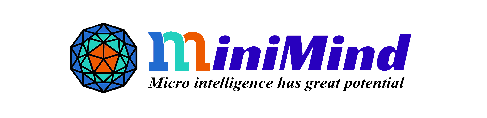

# 欢迎使用 MiniMind!

<figure markdown>
  
  <figcaption><strong>"大道至简——复杂是终极的精湛(Simplicity is the ultimate sophistication)"</strong></figcaption>
</figure>

## 📌 简介

**MiniMind** 是一个完整的开源项目,用于以极低成本从零训练超小型语言模型。只需 **2 小时**和 **$3**,就能在单张 3090 GPU 上训练出一个 **26M** 参数的聊天机器人!

- **MiniMind** 系列极其轻量,最小版本仅相当于 GPT-3 的 **1/7000**
- 完整实现,涵盖:
  - **Tokenizer 训练**(自定义词表)
  - **预训练(Pretraining)**(知识学习)
  - **监督微调(SFT)**(对话模式)
  - **LoRA 微调**(参数高效适配)
  - **直接偏好优化(DPO)**(人类偏好对齐)
  - **RLAIF 算法**(PPO/GRPO/SPO——强化学习)
  - **知识蒸馏**(压缩大模型知识)
  - **模型推理蒸馏**(DeepSeek-R1 风格)
  - **YaRN 算法**(上下文长度外推)
- **纯 PyTorch 实现**:所有核心算法均使用原生 PyTorch 从零实现,不依赖第三方抽象接口
- **教育价值**:这不仅是大语言模型全流程的开源复现,更是一份全面的 LLM 入门教程
- **扩展能力**:MiniMind 现已支持 [MiniMind-V](https://github.com/jingyaogong/minimind-v) 视觉多模态任务

!!! note "训练成本与时间"
    "2 小时"基于 **NVIDIA 3090** 硬件(单卡)测试
    
    "$3"指 GPU 服务器租赁费用
    
    使用 8× RTX 4090 GPU 时,训练时间可压缩到 **10 分钟以内**

## ✨ 核心亮点

- **超低成本**:单张 3090、2 小时、$3,即可从零训练一个功能完整的聊天机器人
- **完整流程**:Tokenizer → 预训练 → SFT → LoRA → DPO/RLAIF → 蒸馏 → 推理
- **最新算法**:实现了 GRPO、SPO、YaRN 等前沿技术
- **对学习友好**:代码清晰、文档完善,适合学习 LLM 原理
- **生态兼容**:无缝支持 `transformers`、`trl`、`peft`、`llama.cpp`、`vllm`、`ollama` 和 `Llama-Factory`
- **功能全面**:支持多 GPU 训练(DDP/DeepSpeed)、模型可视化(Wandb/SwanLab)与动态检查点管理
- **生产可用**:支持 OpenAI API 协议,便于集成第三方 UI(FastGPT、Open-WebUI 等)
- **多模态扩展**:已扩展至 [MiniMind-V](https://github.com/jingyaogong/minimind-v) 视觉领域

## 📊 模型系列

### MiniMind2 系列(最新 - 2025.04.26)

| 模型 | 参数量 | 词表 | 层数 | 隐藏维度 | 上下文 | 推理显存 |
|-------|-----------|------------|--------|-----------|---------|-----------------|
| MiniMind2-small | 26M | 6,400 | 8 | 512 | 2K | ~0.5 GB |
| MiniMind2-MoE | 145M | 6,400 | 8 | 640 | 2K | ~1.0 GB |
| MiniMind2 | 104M | 6,400 | 16 | 768 | 2K | ~1.0 GB |

### MiniMind-V1 系列(旧版 - 2024.09.01)

| 模型 | 参数量 | 词表 | 层数 | 隐藏维度 | 上下文 |
|-------|-----------|------------|--------|-----------|---------|
| minimind-v1-small | 26M | 6,400 | 8 | 512 | 2K |
| minimind-v1-moe | 104M | 6,400 | 8 | 512 | 2K |
| minimind-v1 | 108M | 6,400 | 16 | 768 | 2K |

## 📅 最新更新(2025-10-24)

🔥 **RLAIF 训练算法**:原生实现了 PPO、GRPO 和 SPO

- **YaRN 算法**:RoPE 长度外推,提升长序列处理能力
- **自适应思考**:推理模型支持可选的思考链
- **完整模板支持**:工具调用与推理标签(`<tool_call>`、`<thinking>` 等)
- **可视化**:由 WandB 切换到 [SwanLab](https://swanlab.cn/)(对中国用户友好)
- **推理模型**:基于 DeepSeek-R1 蒸馏的完整 MiniMind-Reason 系列

## 🎯 项目内容

- 完整的 MiniMind-LLM 架构代码(Dense 稠密 + MoE 混合专家模型)
- 详细的 Tokenizer 训练代码
- 完整训练流程:预训练 → SFT → LoRA → RLHF/RLAIF → 蒸馏
- 各阶段高质量、精心筛选去重的数据集
- 关键算法原生 PyTorch 实现,第三方依赖极少
- 多 GPU 训练支持(单机多卡 DDP、DeepSpeed、分布式集群)
- Wandb/SwanLab 可视化
- 第三方基准模型评测(C-Eval、C-MMLU、OpenBookQA)
- YaRN 算法,实现 RoPE 上下文长度外推
- OpenAI API 协议服务器,便于集成
- Streamlit 网页 UI 聊天
- 与社区工具完全兼容:llama.cpp、vllm、ollama、Llama-Factory
- MiniMind-Reason 模型:推理蒸馏的完整开源数据 + 权重

## 🚀 快速导航

- **[快速开始](quickstart.md)** - 环境搭建、模型下载、快速测试
- **[模型训练](training.md)** - 预训练、SFT、LoRA、RLHF、RLAIF 与推理训练

## 🔗 链接与资源

**项目仓库**:
- **GitHub**: [https://github.com/jingyaogong/minimind](https://github.com/jingyaogong/minimind)
- **HuggingFace**: [MiniMind 合集](https://huggingface.co/collections/jingyaogong/minimind-66caf8d999f5c7fa64f399e5)
- **ModelScope**: [MiniMind 主页](https://www.modelscope.cn/profile/gongjy)

**在线 Demo**:
- [ModelScope Studio - 标准聊天](https://www.modelscope.cn/studios/gongjy/MiniMind)
- [ModelScope Studio - 推理模型](https://www.modelscope.cn/studios/gongjy/MiniMind-Reasoning)
- [B 站视频介绍](https://www.bilibili.com/video/BV12dHPeqE72/)

**视觉扩展**:
- [MiniMind-V](https://github.com/jingyaogong/minimind-v) - 多模态视觉语言模型

## 💡 为什么选择 MiniMind?

AI 社区充斥着高成本、复杂抽象、把基本原理隐藏起来的框架。MiniMind 旨在让 LLM 学习大众化:

1. **降低门槛**:无需昂贵 GPU 或云服务
2. **理解而非仅使用**:从 tokenization 到推理,学习每个细节
3. **端到端学习**:从零训练,而非仅仅微调现有模型
4. **代码清晰**:纯 PyTorch 实现,你可以读懂并理解
5. **实用成果**:用最少资源获得可用的聊天机器人

正如我们所说:**"搭一架乐高飞机,远比乘头等舱飞行更令人兴奋!"**

---

下一步:[开始使用 →](quickstart.md)
