# 一个一个计算机网络的笔记

[TOC]

## TCP/IP 网络模型有哪几层？
问大家，为什么要有 TCP/IP 网络模型？

对于同一台设备上的进程间通信，有很多种方式，比如有管道、消息队列、共享内存、信号等方式，而对于不同设备上的进程间通信，就需要网络通信，而设备是多样性的，所以**要兼容多种多样的设备**，就协商出了一套通用的网络协议。

这个网络协议是**分层**的，每一层都有各自的作用和职责，接下来就根据「 TCP/IP 网络模型」分别对每一层进行介绍。

## 应用层
最上层的，也是我们能**直接接触到的**就是应用层（Application Layer），我们电脑或手机使用的应用软件都是在应用层实现。那么，当两个不同设备的应用需要通信的时候，应用就把应用数据传给下一层，也就是**传输层**。

所以，应用层只需要**专注于为用户提供应用功能**，比如 HTTP、FTP、Telnet、DNS、SMTP等。

应用层是不用去关心数据是如何传输的，就类似于，我们寄快递的时候，只需要把包裹交给快递员，由他负责运输快递，我们不需要关心快递是如何被运输的。

而且应用层是工作在操作系统中的**用户态**，传输层及以下则工作在**内核态**。

## 传输层
应用层的数据包会传给传输层，传输层（Transport Layer）是为应用层提供网络支持的。

在传输层会有两个传输协议，分别是 TCP 和 UDP。

TCP 的全称叫**传输控制协议（Transmission Control Protocol）**，大部分应用使用的正是 TCP **传输层**协议，比如 **HTTP 应用层协议**。TCP 相比 UDP 多了很多特性，比如流量控制、超时重传、拥塞控制等，这些都是为了保证数据包能可靠地传输给对方。

UDP 相对来说就很简单，简单到只负责发送数据包，不保证数据包是否能抵达对方，但它实时性相对更好，传输效率也高。当然，UDP 也可以实现可靠传输，把 TCP 的特性在应用层上实现就可以，不过要实现一个商用的可靠 UDP 传输协议，也不是一件简单的事情。

应用需要传输的数据可能会非常大，如果直接传输就不好控制，因此当传输层的数据包大小**超过 MSS（TCP 最大报文段长度）** ，就要将**数据包分块**，这样即使中途有一个分块丢失或损坏了，只需要重新发送这一个分块，而不用重新发送整个数据包。在 TCP 协议中，我们把每个分块称为一个 **TCP 段（TCP Segment）**。

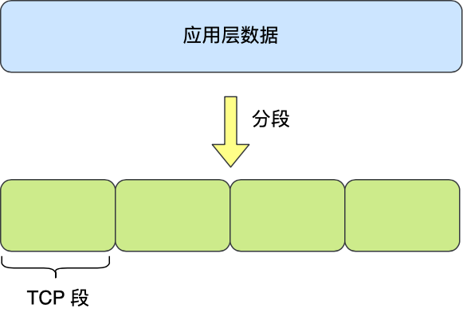

当设备作为接收方时，传输层则要负责**把数据包传给应用**，但是一台设备上可能会有**很多应用在接收或者传输**数据，因此需要**用一个编号将应用区分**开来，这个编号就是**端口**。

比如 **80 端口通常是 Web 服务器**用的，**22 端口通常是远程登录服务器**用的。而对于浏览器（客户端）中的**每个标签栏都是一个独立的进程**，操作系统会为这些进程**分配临时的端口号**。

由于传输层的**报文**中会**携带端口号**，因此接收方可以识别出该报文是发送给哪个应用。

## 网络层
传输层可能大家刚接触的时候，会认为它负责将数据从一个设备传输到另一个设备，事实上它**并不负责**。

实际场景中的网络环节是错综复杂的，中间有各种各样的线路和分叉路口，如果一个设备的数据要传输给另一个设备，就需要在**各种各样的路径和节点进行选择**，而传输层的设计理念是简单、高效、专注，如果传输层还负责这一块功能就有点违背设计原则了。

也就是说，我们不希望传输层协议处理太多的事情，只需要**服务好应用**即可，让其作为应用间数据传输的媒介，帮助实现**应用到应用的通信**，而**实际的传输功能**就交给**下一**层，也就是**网络层**（Internet Layer）。

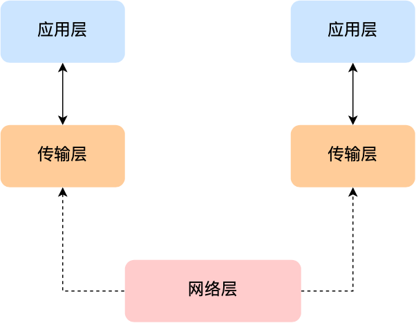

**网络层**最常使用的是 **IP 协议（Internet Protocol）**，IP 协议会**将传输层的报文作为数据部分**，再**加上 IP 包头组装成 IP 报文**，如果 **IP 报文大小超过 MTU（以太网中一般为 1500 字节）**就会再次进行**分片**，得到一个即将发送到网络的 IP 报文。

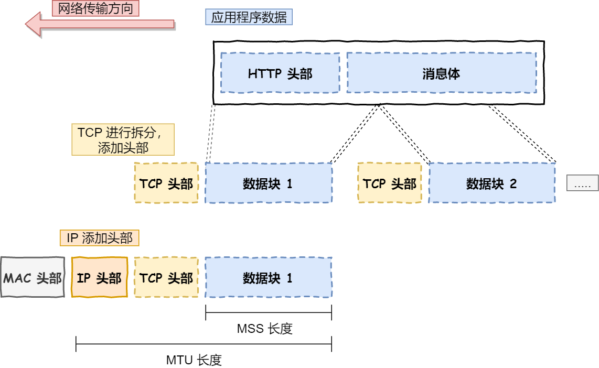

网络层负责将数据从一个设备**传输到另一个**设备，世界上那么多设备，又该如何找到对方呢？因此，网络层需要有**区分设备的编号**。

我们一般用 IP 地址给设备进行编号，对于 IP**v4** 协议， IP 地址共 **32 位**，**分成了四段**（比如，192.168.100.1），**每段是 8 位**。只有一个单纯的 IP 地址虽然做到了区分设备，但是寻址起来就特别麻烦，全世界那么多台设备，难道一个一个去匹配？这显然不科学。

因此，需要将 IP 地址分成两种意义：

一个是**网络号**，负责标识该 IP 地址是属于**哪个「子网」**的；
一个是**主机号**，负责标识**同一「子网」下的不同主机**；
怎么分的呢？这需要**配合子网掩码**才能算出 IP 地址 的网络号和主机号。

举个例子，比如 10.100.122.0/24，后面的**/24表示就是 255.255.255.0 子网掩码**，**255.255.255.0 二进制是「11111111-11111111-11111111-00000000」**，大家数数一共多少个1？不用数了，是 24 个1，为了**简化子网掩码的表示，用/24代替255.255.255.0**。

知道了子网掩码，该怎么计算出网络地址和主机地址呢？

将 10.100.122.2 和 255.255.255.0 进行**按位与**运算，就可以**得到网络号**，如下图：

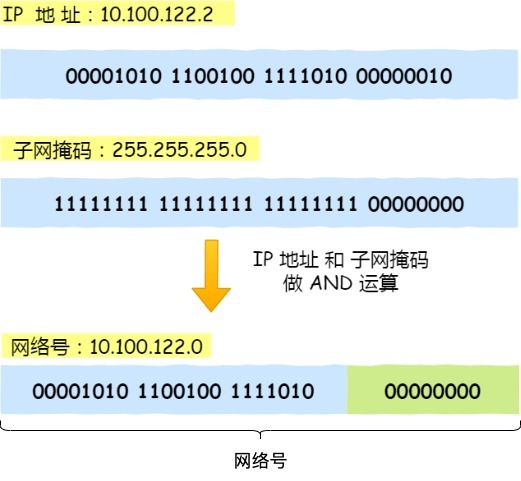

将 255.255.255.0 **取反后**与IP地址进行进行**按位与运算**，就可以得到**主机号**。

 那么在寻址的过程中，先匹配到**相同的网络号**（表示要找到**同一个子网**），才会去找对应的主机。

除了**寻址能力**， IP 协议还有另一个重要的能力就是**路由**。实际场景中，两台设备并不是用一条网线连接起来的，而是**通过很多网关、路由器、交换机等众多网络设备连接**起来的，那么就会形成很多条网络的路径，因此当数据包到达一个网络节点，就需要**通过路由算法**决定下一步走哪条路径。

路由器寻址工作中，就是要**找到目标地址的子网**，找到后**进而把数据包转发**给对应的网络内。

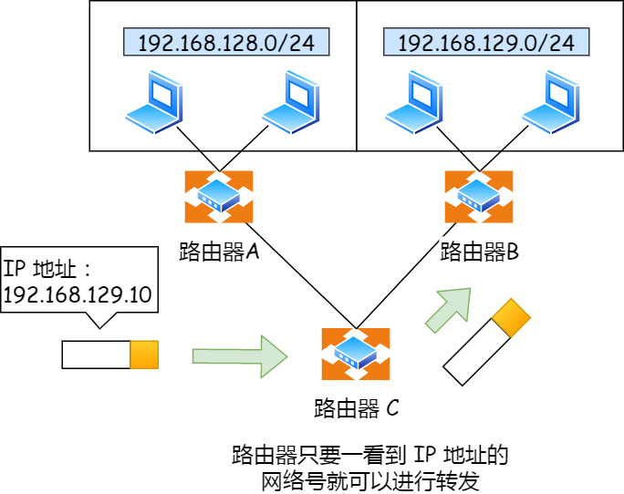

所以，IP 协议的寻址作用是告诉我们**去往下一个目的地该朝哪个方向**走，路由则是**根据「下一个目的地」选择路径**。寻址更像在导航，路由更像在操作方向盘。

## 网络接口层
生成了 **IP 头部**之后，接下来要交给**网络接口层（Link Layer）**在 IP 头部的前面**加上 MAC 头部**，并**封装成数据帧（Data frame）发送到网络上**。

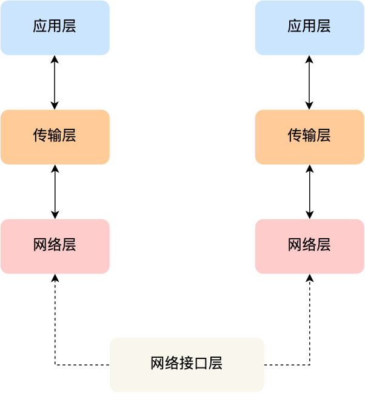

IP 头部中的接收方 IP 地址表示**网络包的目的地**，通过这个地址我们就可以判断要将包发到哪里，但在以太网的世界中，这个思路是行不通的。

什么是以太网呢？**电脑上的以太网接口，Wi-Fi接口，以太网交换机、路由器上的千兆，万兆以太网口，还有网线，它们都是以太网的组成部分。**以太网就是一种**在「局域网」内**，把附近的设备连接起来，使它们之间可以进行通讯的技术。

以太网在判断网络包目的地时和 IP 的方式不同，因此**必须采用相匹配的方式**才能在以太网中将包发往目的地，而 MAC 头部就是干这个用的，所以，**在以太网进行通讯要用到 MAC 地址**。

MAC 头部是以太网使用的头部，它**包含了接收方和发送方的 MAC 地址**等信息，我们可以**通过 ARP 协议获取对方**的 MAC 地址。

所以说，网络接口层主要**为网络层提供「链路级别」传输的服务**，负责在以太网、WiFi 这样的**底层网络上发送**原始数据包，**工作在网卡这个层次**，使用 MAC 地址来标识网络上的设备。

## 总结
综上所述，TCP/IP 网络通常是由上到下分成 4 层，分别是应用层，传输层，网络层和网络接口层。

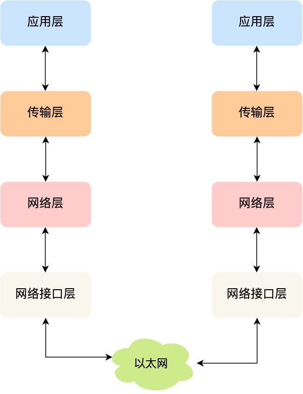

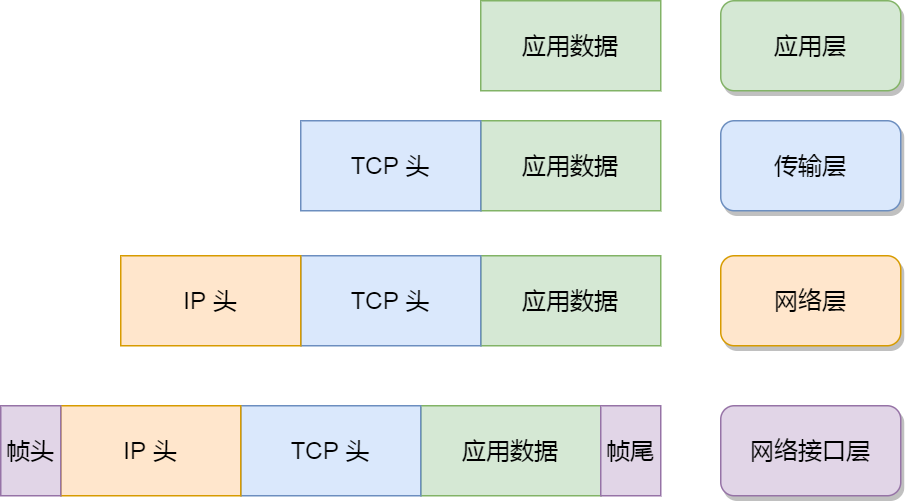

网络接口层的传输单位是**帧（frame）**，IP 层的传输单位是**包（packet）**，TCP 层的传输单位是**段（segment）**，HTTP 的传输单位则是**消息或报文（message）**。但这些名词并没有什么本质的区分，可以**统称为数据包**。

## 2.2 键入网址到网页显示，期间发生了什么？

以下图较简单的**网络拓扑模型**作为例子，探究探究其间发生了什么

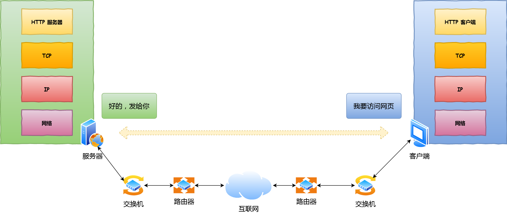

## 孤单小弟 —— HTTP

> 浏览器做的第一步工作是解析 URL

首先浏览器做的第一步工作就是要**对 URL 进行解析**，从而**生成发送给 Web 服务器的请求信息**。

让我们看看一条长长的 URL 里的各个元素的代表什么，见下图：

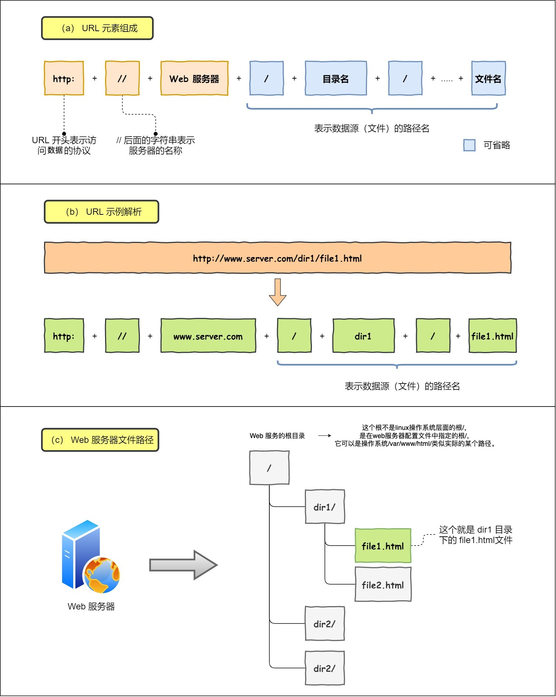

所以图中的长长的 URL 实际上是**请求服务器**里的文件资源。

#### 要是上图中的蓝色部分 URL 元素都省略了，那应该是请求哪个文件呢？

当**没有路径名时**，就代表**访问根目录下**事先设置的默认文件，也就是 /index.html 或者 /default.html 这些文件，这样就不会发生混乱了。

#### 生产 HTTP 请求信息

对 URL 进行解析之后，浏览器**确定了 Web 服务器和文件名**，接下来就是根**据这些信息来生成 HTTP 请求**消息了。

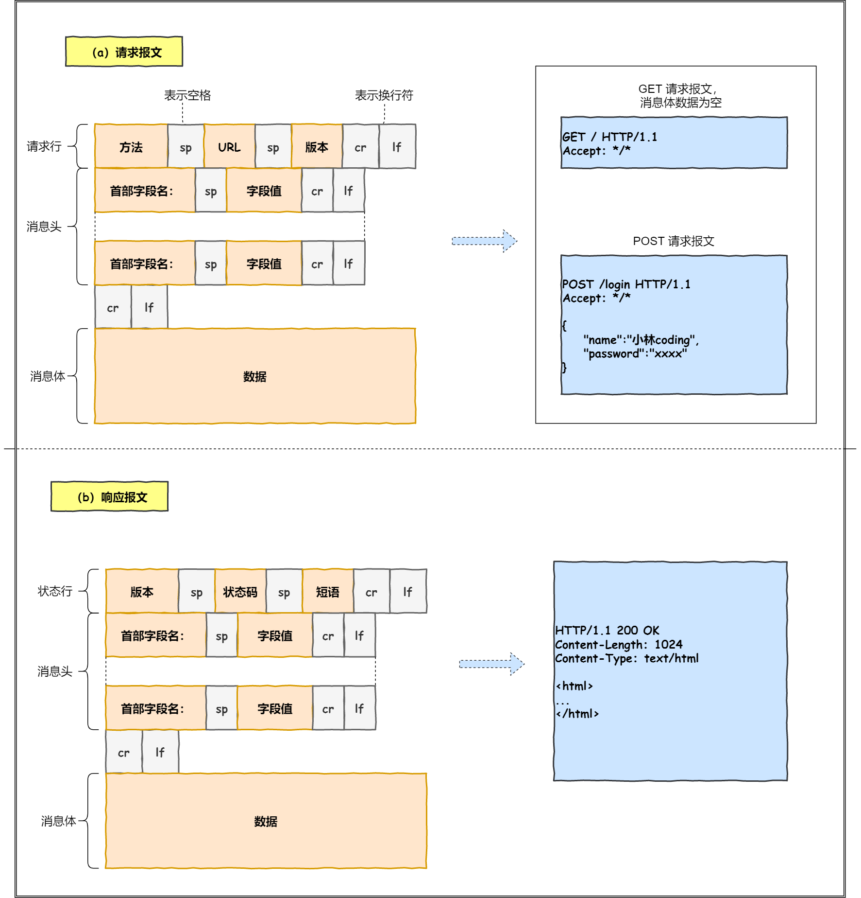

一个孤单 HTTP 数据包表示：“我这么一个小小的数据包，没亲没友，直接发到浩瀚的网络，谁会知道我呢？谁能载我一程呢？谁能保护我呢？我的目的地在哪呢？”。充满各种疑问的它，没有停滞不前，依然踏上了征途！

## 真实地址查询 —— DNS
通过浏览器解析 URL 并生成 HTTP 消息后，需要**委托操作系统将消息发送给 Web 服务器**。

但在发送之前，还有一项工作需要完成，那就是**查询服务器域名对应的 IP 地址**，因为委托操作系统发送消息时，必须提供通信对象的 IP 地址。

比如我们打电话的时候，必须要知道对方的电话号码，但由于电话号码难以记忆，所以通常我们会将对方电话号 + 姓名保存在通讯录里。

所以，**有一种服务器就专门保存了 Web 服务器域名与 IP 的对应关系**，它就是 **DNS 服务器**。

#### 域名的层级关系

DNS 中的域名都是用句点来分隔的，比如 www.server.com，这里的句点代表了**不同层次之间的界限**。

在域名中，**越靠右的位置表示其层级越高**。

毕竟域名是外国人发明，所以思维和中国人相反，比如说一个城市地点的时候，**外国喜欢从小到大的方式**顺序说起（如 XX 街道 XX 区 XX 市 XX 省），而中国则喜欢从大到小的顺序（如 XX 省 XX 市 XX 区 XX 街道）。

实际上域名最后还有一个点，比如 www.server.com.，这个最后的一个点代表**根域名**。

也就是，. 根域是在最顶层，它的下一层就是 .com 顶级域，再下面是 server.com。

所以域名的层级关系类似一个**树状结构**：

**根 DNS 服务器**（.）
**顶级域 DNS 服务器**（.com）
**权威 DNS 服务器**（server.com）

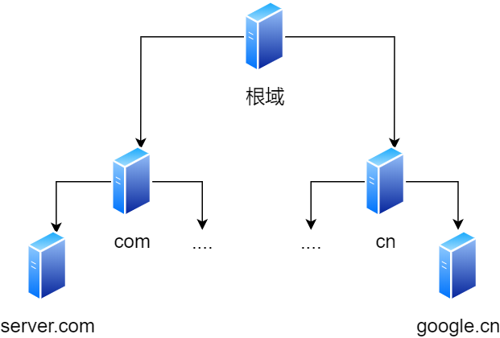

**根域**的 DNS 服务器信息保存在**互联网中所有的 DNS 服务器中**。

这样一来，任何 DNS 服务器就都可以**找到并访问根域 DNS 服务器**了。

因此，客户端只要能够找到**任意一台 DNS 服务器**，就可以通过它找到根域 DNS 服务器，然后再一路顺藤摸瓜找到位于下层的某台目标 DNS 服务器。

#### 域名解析的工作流程

客户端首先会发出一个 **DNS 请求**，问 www.server.com 的 **IP 是啥**，并发给**本地 DNS 服务器**（也就是客户端的 **TCP/IP 设置中填写的 DNS 服务器地址**）。
本地域名服务器收到客户端的请求后，如果**缓存里**的表格能找到 www.server.com，则它**直接返回** IP 地址。如果没有，本地 DNS 会去问它的根域名服务器：“老大， 能告诉我 www.server.com 的 IP 地址吗？” 根域名服务器是**最高层次**的，它不直接用于域名解析，但能指明一条道路。
根 DNS 收到来自本地 DNS 的请求后，发现后置是 .com，说：“www.server.com 这个域名归 .com 区域管理”，我给你 .com 顶级域名服务器地址给你，你去问问它吧。”
本地 DNS 收到顶级域名服务器的地址后，发起请求问“老二， 你能告诉我 www.server.com 的 IP 地址吗？”
顶级域名服务器说：“我给你负责 www.server.com 区域的权威 DNS 服务器的地址，你去问它应该能问到”。
本地 DNS 于是转向问权威 DNS 服务器：“老三，www.server.com对应的IP是啥呀？” server.com 的权威 DNS 服务器，它是**域名解析结果的原出处**。为啥叫权威呢？就是我的域名我做主。
权威 DNS 服务器**查询后将对应的 IP 地址 X.X.X.X 告诉本地 DNS**。
本地 DNS **再将 IP 地址返回客户端**，客户端和目标建立连接。
至此，我们完成了 DNS 的解析过程。现在总结一下，整个过程我画成了一个图。

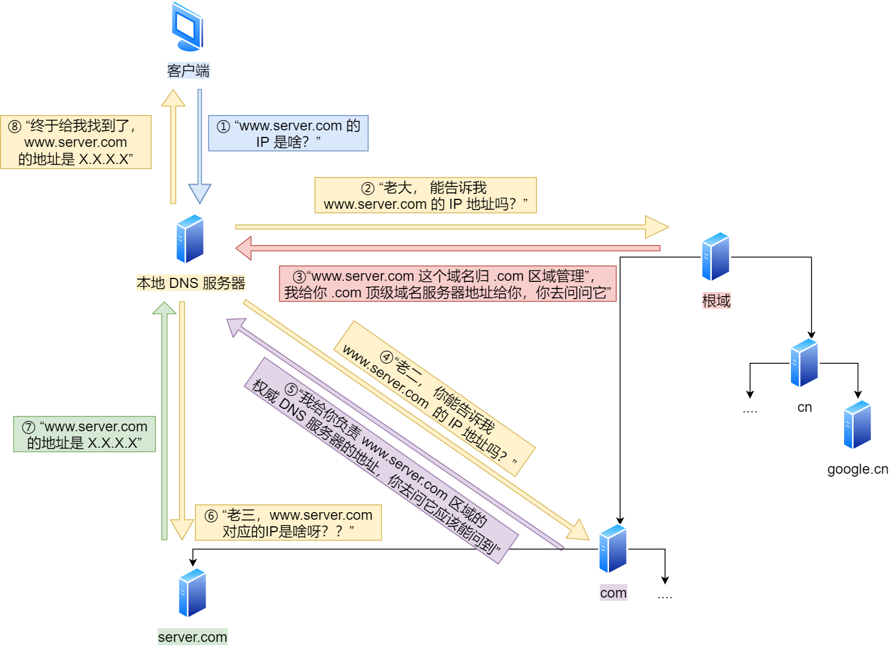

DNS 域名解析的过程蛮有意思的，整个过程就和我们日常生活中找人问路的过程类似，**只指路不带路**。

那是不是每次解析域名都要经过那么多的步骤呢？

当然不是了，还有缓存这个东西的嘛。

浏览器会先看自身有没有对这个域名的缓存，如果有，就直接返回，如果没有，就去问**操作系统**，操作系统也会去看自己的缓存，如果有，就直接返回，如果没有，再去 **hosts 文件**看，也没有，**才会去问「本地 DNS 服务器」**。

数据包表示：“DNS 老大哥厉害呀，找到了目的地了！我还是很迷茫呀，我要发出去，接下来我需要谁的帮助呢?”

## 指南好帮手 —— 协议栈
通过 DNS 获取到 IP 后，就可以把 HTTP 的**传输**工作交给操作系统中的**协议栈**。

协议栈的内部分为几个部分，分别承担不同的工作。上下关系是有一定的规则的，上面的部分会向下面的部分委托工作，下面的部分收到委托的工作并执行。

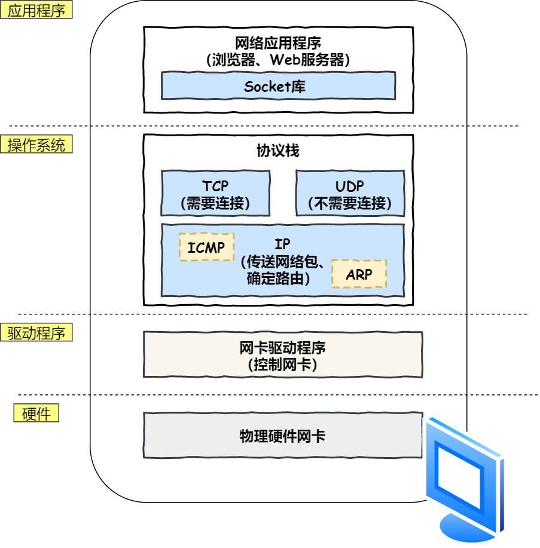

应用程序（浏览器）通过**调用 Socket 库**，来委托协议栈工作。协议栈的上半部分有两块，分别是**负责收发数据的 TCP 和 UDP 协议**，这两个传输协议会接受应用层的**委托执行收发数据**的操作。

协议栈的下面一半是用 **IP 协议控制网络包收发操作**，在互联网上传数据时，数据会被切分成一块块的网络包，而将网络包**发送给对方**的操作就是由 **IP 负责**的。

此外 IP 中还包括 ICMP 协议和 ARP 协议。

ICMP 用于告知网络包传送过程中产生的**错误以及各种控制信息**。
ARP 用于**根据 IP 地址查询相应的以太网 MAC 地址**。

IP 下面的网卡驱动程序负责控制网卡硬件，而最下面的网卡则负责完成**实际的收发操作**，也就是对网线中的信号执行发送和接收操作。

数据包看了这份指南表示：“原来我需要那么多大佬的协助啊，那我先去找找 TCP 大佬！”

## 可靠传输 —— TCP
**HTTP** 是**基于 TCP 协议传输**的，所以在这我们先了解下 TCP 协议。

#### TCP 包头格式

TCP **报文头部**的格式

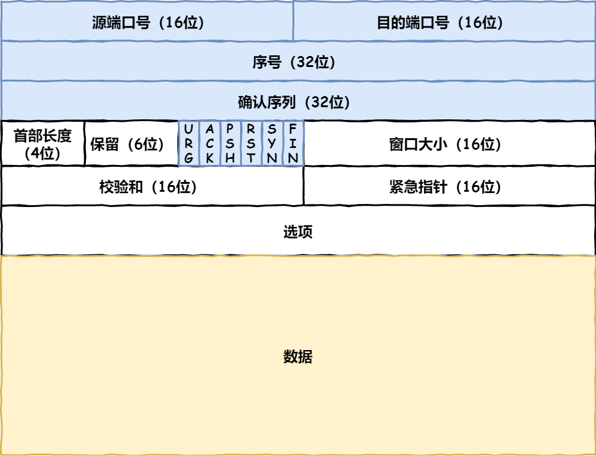

首先，**源端口号**和**目标端口号**是不可少的，如果没有这两个端口号，数据就不知道应该发给哪个应用。

接下来有**包的序号**，这个是为了解决包乱序的问题。

还有应该有的是**确认号**，目的是确认发出去对方是否有收到。如果**没有收到就应该重新发送，直到送达**，这个是为了**解决丢包的问题**。

接下来还有一些**状态位**。例如 **SYN 是发起一个连接**，**ACK 是回复**，**RST 是重新连接**，**FIN 是结束连接**等。TCP 是面向连接的，因而双方要维护连接的状态，这些带状态位的包的发送，会引起双方的状态变更。

还有一个重要的就是**窗口大小**。TCP 要做流量控制，通信双方**各声明一个窗口（缓存大小）**，标识自己**当前能够的处理能力**，别发送的太快，撑死我，也别发的太慢，饿死我。

除了做流量控制以外，TCP还会做**拥塞控制**，对于真正的通路堵车不堵车，它无能为力，唯一能做的就是控制自己，也即**控制发送的速度**。不能改变世界，就改变自己嘛。

#### TCP 传输数据之前，要先三次握手建立连接

在 **HTTP 传输数据**之前，首先需要 **TCP 建立连接**，TCP 连接的建立，通常称为**三次握手**。

这个所谓的「连接」，只是双方计算机里维护一个状态机，在连接建立的过程中，双方的状态变化时序图就像这样。

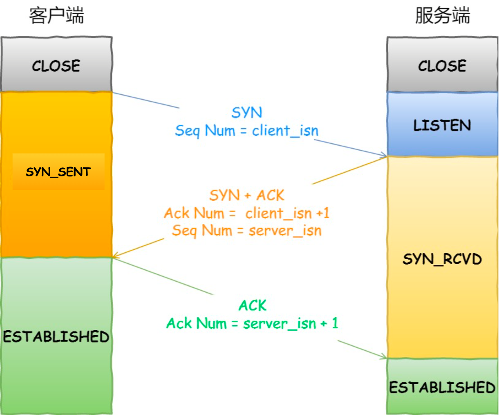

一开始，客户端和服务端**都处于 CLOSED 状态**。**先是服务端主动监听某个端口**，处于 **LISTEN 状态**。

然后**客户端主动发起连接 SYN**，之后**处于 SYN-SENT 状态**。

服务端收到发起的连接，**返回 SYN**，并且 **ACK 客户端的 SYN**，之后处于 **SYN-RCVD 状态**。

客户端收到**服务端发送的 SYN 和 ACK** 之后，**发送对 SYN 确认的 ACK**，之后**处于 ESTABLISHED 状态**，因为它**一发一收成功**了。

服务端收到 **ACK 的 ACK** 之后，**处于 ESTABLISHED 状态**，因为它也**一发一收**了。

所以三次握手目的是**保证双方都有发送和接收**的能力。

#### 如何查看 TCP 的连接状态？

TCP 的连接状态查看，在 Linux 可以通过 **netstat -napt 命令**查看。

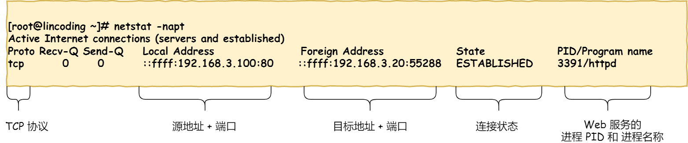

#### TCP 分割数据

如果 HTTP 请求消息比较长，超过了 MSS 的长度，这时 TCP 就需要把 HTTP 的数据拆解成一块块的数据发送，而不是一次性发送所有数据。

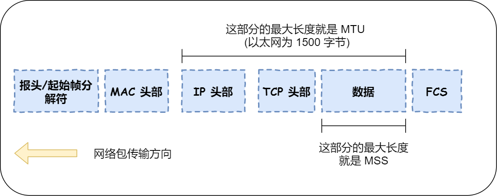

MTU：一个**网络包的最大长度**，以太网中一般为 1500 字节。
MSS：**除去 IP 和 TCP 头部之后**，一个网络包所能容纳的 TCP 数据的最大长度。
数据会被以 MSS 的长度为单位进行拆分，拆分出来的每一块数据都会被放进**单独的网络包中**。也就是在每个被拆分的数据加上 TCP 头信息，然后交给 IP 模块来发送数据。


#### TCP 报文生成

TCP 协议里面会有两个端口，一个是**浏览器监听的端口**（通常是**随机生成**的），一个是 **Web 服务器监听的端口**（**HTTP** 默认端口号是 **80**， **HTTPS** 默认端口号是 **443**）。

在双方建立了连接后，**TCP 报文**中的**数据部分**就是存放 **HTTP 头部 + 数据**，组装好 TCP 报文之后，就需交给下面的网络层处理。

至此，网络包的报文如下图。

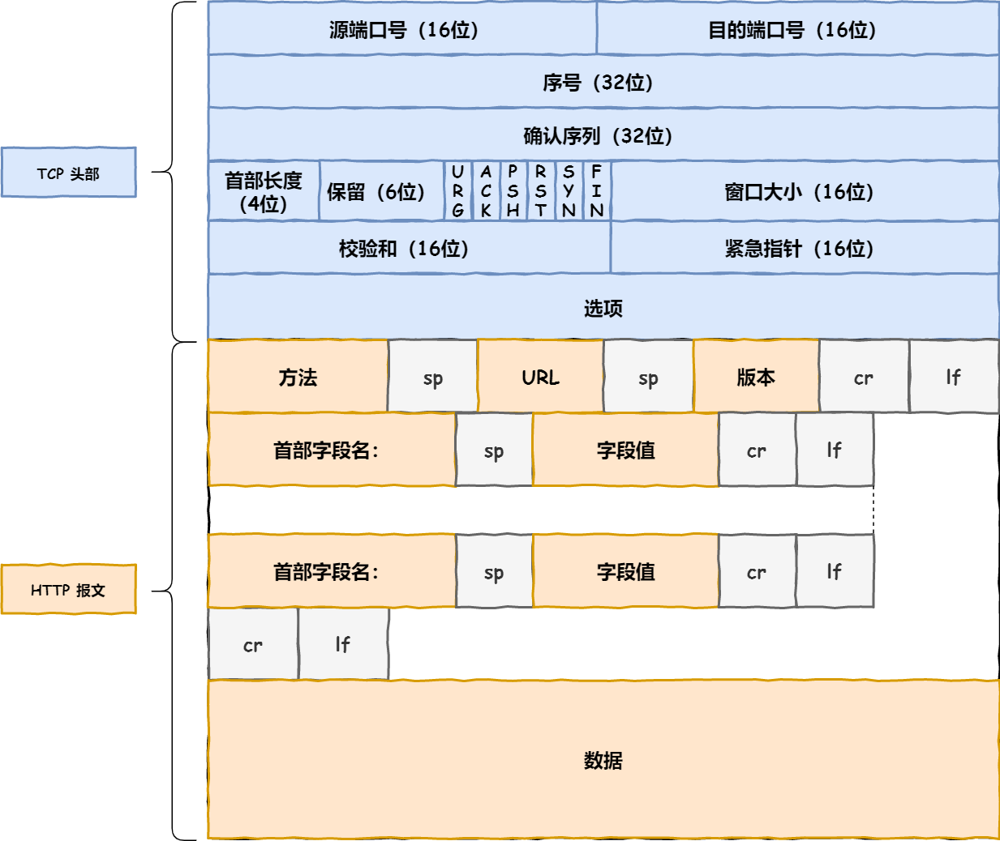

此时，遇上了 TCP 的 数据包激动表示：“太好了，碰到了可靠传输的 TCP 传输，它给我加上 TCP 头部，我不再孤单了，安全感十足啊！有大佬可以保护我的可靠送达！但我应该往哪走呢？”

## 远程定位 —— IP

TCP 模块在执行**连接、收发、断开**等各阶段操作时，**都需要委托 IP 模块**将数据封装成网络包发送给通信对象。

#### IP 包头格式

IP 报文头部的格式：

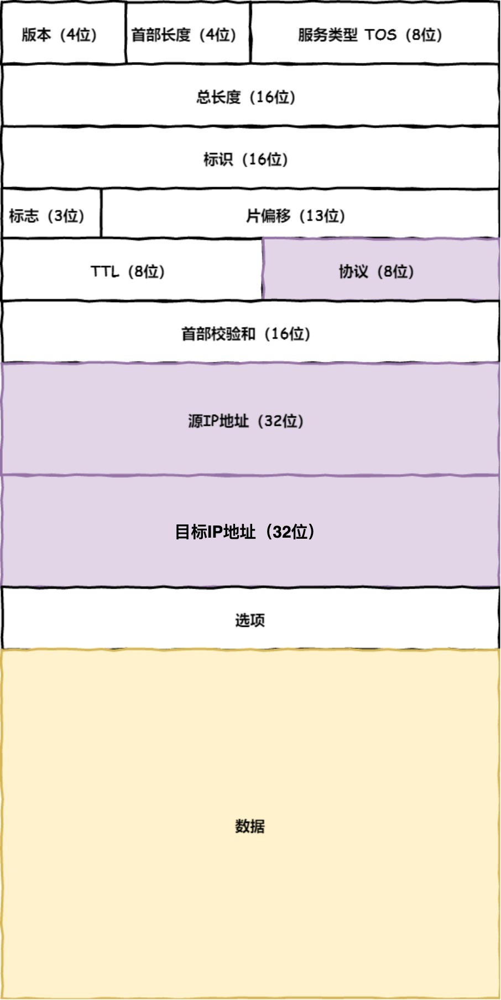

在 IP 协议里面需要有**源地址 IP** 和 **目标地址 IP**：

源地址IP，即是**客户端输出**的 IP 地址；
目标地址，即通过 DNS 域名解析得到的 **Web 服务器 IP**。
因为 HTTP 是经过 TCP 传输的，所以在 **IP 包头的协议号**，要填**写为 06（十六进制）**，**表示协议为 TCP**。

假设客户端有**多个网卡**，就会有**多个 IP 地址**，那 IP 头部的**源地址**应该选择哪个 IP 呢？

当存在多个网卡时，在填写源地址 IP 时，就需要判断到底应该填写哪个地址。这个判断相当于在多块网卡中判断**应该使用哪个一块网卡**来发送包。

这个时候就需要**根据路由表规则**，来判断哪一个网卡作为源地址 IP。

在 Linux 操作系统，我们可以使用 route -n 命令查看当前系统的路由表。

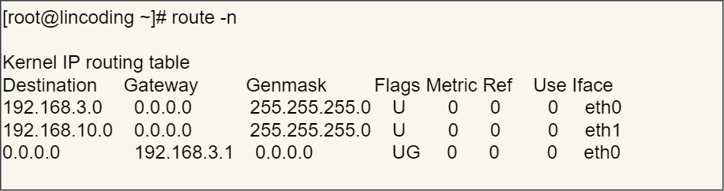

举个例子，根据上面的路由表，我们假设 Web 服务器的目标地址是 192.168.10.200。

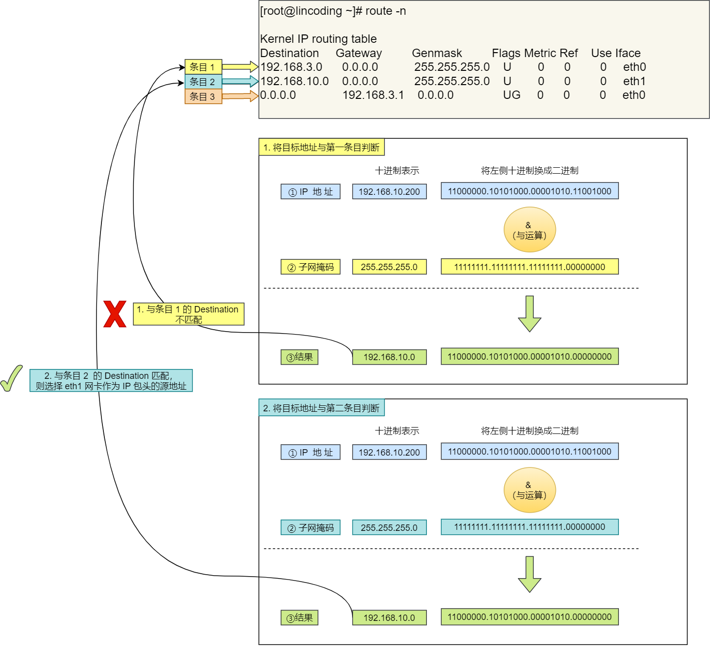

1.首先先和**第一条目的子网掩码（Genmask）**进行 **与运算**，得到结果为 192.168.10.0，但是第一个条目的 Destination 是 192.168.3.0，两者不一致所以匹配失败。
2.再与第二条目的子网掩码进行 与运算，得到的结果为 192.168.10.0，与第二条目的 Destination 192.168.10.0 匹配成功，所以将使用 eth1 网卡的 IP 地址作为 **IP 包头的源地址**。
那么假设 Web 服务器的目标地址是 10.100.20.100，那么依然**依照上面的路由表规则判断**，判断后的结果是和第三条目匹配。

第三条目比较特殊，它**目标地址和子网掩码都是 0.0.0.0**，这表示**默认网关**，如果其他所有条目都无法匹配，就会**自动匹配这一行**。并且后续就把包发给路由器，**Gateway 即是路由器的 IP 地址**。

至此，网络包的报文如下图。

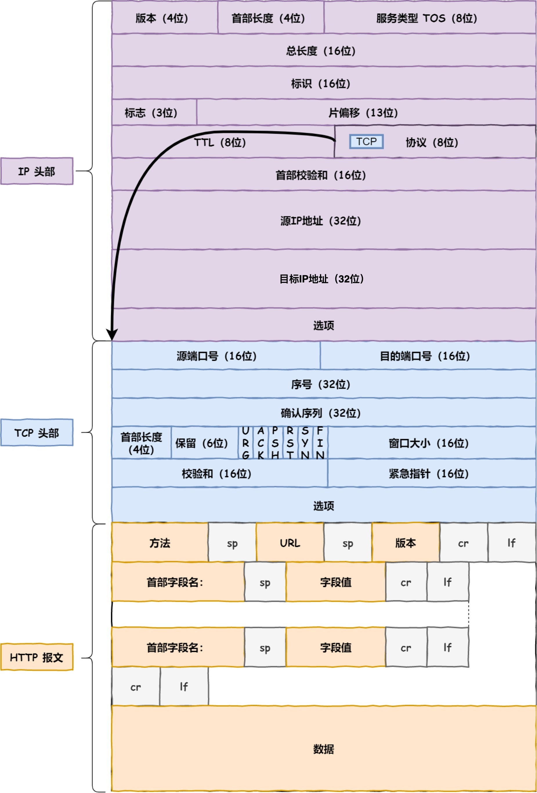

此时，加上了 IP 头部的数据包表示 ：“有 IP 大佬给我指路了，感谢 IP 层给我加上了 IP 包头，让我有了**远程定位的能力**！不会害怕在浩瀚的互联网迷茫了！可是目的地好远啊，我下一站应该去哪呢？”

## 两点传输 —— MAC

生成了 IP 头部之后，接下来网络包还需要**在 IP 头部的前面加上 MAC 头部**

#### MAC 包头格式

MAC 头部**是以太网使用的头部**，它包含了**接收方和发送方的 MAC 地址**等信息。

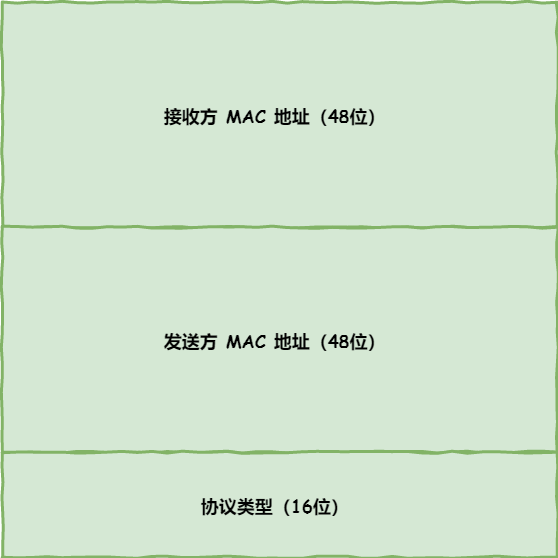

在 MAC 包头里需要发送方 MAC 地址和接收方目标 MAC 地址，用于两点之间的传输。

一般在 TCP/IP 通信里，**MAC 包头的协议类型**只使用：

**0800 ： IP 协议**
**0806 ： ARP 协议**
#### MAC 发送方和接收方如何确认?

**发送方**的 MAC 地址获取就比较简单了，MAC 地址是**在网卡生产时写入到 ROM 里**的，只要将这个值读取出来写入到 MAC 头部就可以了。

**接收方**的 MAC 地址就有点复杂了，只要告诉以太网对方的 MAC 的地址，以太网就会帮我们把包发送过去，那么很显然这里应该填写对方的 MAC 地址。

所以先得搞清楚应该把包发给谁，这个只要查一下路由表就知道了。在路由表中找到相匹配的条目，然后把包发给 Gateway 列中的 IP 地址就可以了。

#### 既然知道要发给谁，该如何获取对方的 MAC 地址呢？

不知道对方 MAC 地址？不知道就喊呗。

此时就需要 ARP 协议帮我们找到路由器的 MAC 地址。

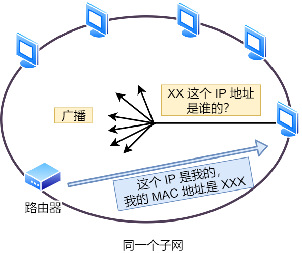

ARP 协议会在以太网中以广播的形式，对以太网所有的设备喊出：“**这个 IP 地址是谁的**？请把你的 **MAC 地址告诉我”**。

然后就会有人回答：“这个 IP 地址是我的，我的 MAC 地址是 XXXX”。

如果对方和自己**处于同一个子网中**，那么通过上面的操作就可以得到对方的 MAC 地址。然后，我们将这个 MAC 地址写入 MAC 头部，MAC 头部就完成了。

#### 好像每次都要广播获取，这不是很麻烦吗？

放心，在后续操作系统会把本次查询结果放到一块叫做 **ARP 缓存的内存空间**留着以后用，不过**缓存的时间就几分钟**。

也就是说，在发包时：

**先查询 ARP 缓存**，如果其中已经保存了对方的 MAC 地址，就不需要发送 ARP 查询，直接使用 ARP 缓存中的地址。
而当 ARP 缓存中不存在对方 MAC 地址时，则**发送 ARP 广播**查询。

#### 查看 ARP 缓存内容

在 Linux 系统中，我们可以使用 arp -a 命令来查看 ARP 缓存的内容。

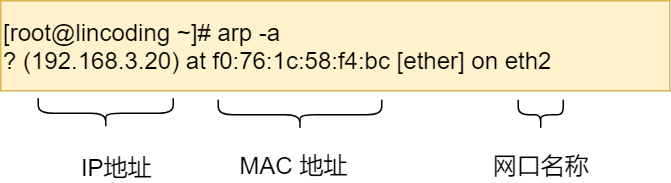

#### MAC 报文生成

至此，网络包的报文如下图。

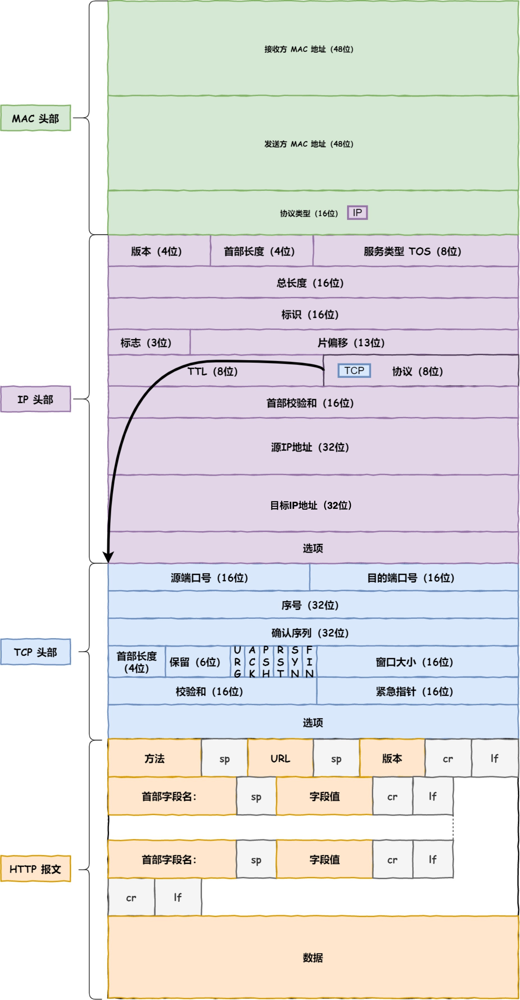

此时，加上了 MAC 头部的数据包万分感谢，说道 ：“感谢 MAC 大佬，我知道我下一步要去哪了！我现在有很多头部兄弟，相信我可以到达最终的目的地！”。 带着众多头部兄弟的数据包，终于准备要出门了。

## 出口 —— 网卡
网络包只是**存放在内存中的一串二进制数字**信息，没有办法直接发送给对方。因此，我们需要将**数字信息转换为电信号**，才能**在网线上传输**，也就是说，这才是真正的数据发送过程。

**负责执行这一操作的是网卡**，要控制网卡还需要靠网卡驱动程序。

网卡驱动获取网络包之后，会将其**复制到网卡内的缓存区中**，接着会在其**开头加上报头和起始帧分界符**，在**末尾加上用于检测错误的帧校验序列**。

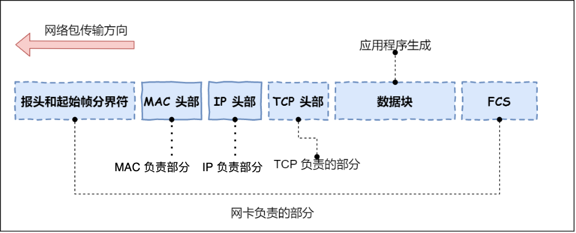

- 起始帧分界符是一个用来表示包起始位置的标记
- 末尾的 FCS（帧校验序列）用来检查包传输过程是否有损坏

最后**网卡会将包转为电信号**，通过网线发送出去。

唉，真是不容易，发一个包，真是历经千辛万苦。致此，一个带有许多头部的数据终于踏上寻找目的地的征途了！

## 送别者 —— 交换机
下面来看一下包是如何通过交换机的。交换机的设计是**将网络包原样转发到目的地**。**交换机工作在 MAC 层**，也称为二层网络设备。

#### 交换机的包接收操作

首先，电信号到达网线接口，交换机里的模块进行接收，接下来**交换机里的模块将电信号转换为数字信号**。

然后**通过包末尾的 FCS 校验错误**，如果没问题则放到缓冲区。这部分操作基本和计算机的网卡相同，但交换机的工作方式和网卡不同。

计算机的网卡本身具有 MAC 地址，并通过核对收到的包的接收方 MAC 地址判断**是不是发给自己的**，如果不是发给自己的则丢弃；相对地，**交换机的端口不核对接收方 MAC 地址**，而是**直接接收所有的包并存放到缓冲区中**。因此，和网卡不同，交换机的**端口**不具有 MAC 地址。

将包存入缓冲区后，接下来需要查询一下**这个包的接收方 MAC 地址是否已经在 MAC 地址表中有记录**了。

**交换机的 MAC 地址**表主要包含两个信息：

- 一个是**设备的 MAC 地址**，
- 另一个是该设备**连接在交换机的哪个端口**上。

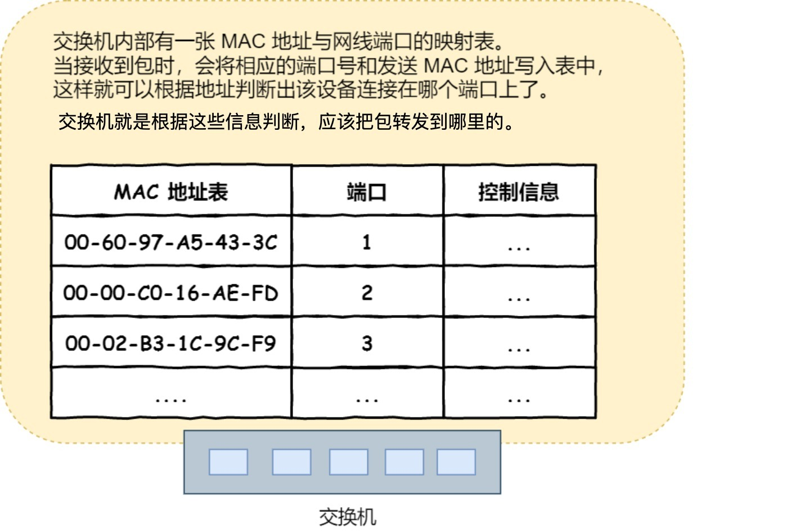

举个例子，如果**收到的包的接收方 MAC 地址**为 00-02-B3-1C-9C-F9，则**与图中表中的第 3 行匹配，根据端口列的信息**，可知这个地址位于 3 号端口上，然后就可以**通过交换电路将包发送到相应的端口**了。

所以，**交换机根据 MAC 地址表查找 MAC 地址，然后将信号发送到相应的端口**。

#### 当 MAC 地址表找不到指定的 MAC 地址会怎么样？

地址表中找不到指定的 MAC 地址。这可能是因为具有该地址的设备还没有向交换机发送过包，或者这个设备一段时间没有工作导致地址被从地址表中删除了。

这种情况下，交换机无法判断应该把包转发到哪个端口，只能将包转**发到除了源端口之外的所有端口上**，**无论该设备连接在哪个端口上都能收到这个包**。

这样做不会产生什么问题，因为以太网的设计本来就是将包发送到整个网络的，然后**只有相应的接收者才接收包，而其他设备则会忽略这个包**。

有人会说：“这样做会发送多余的包，会不会造成网络拥塞呢？”

其实完全不用过于担心，因为发送了包之后目标设备会作出响应，只要返回了响应包，交换机就可以将它的地址写入 MAC 地址表，下次也就不需要把包发到所有端口了。

局域网中**每秒可以传输上千个包，多出一两个包并无大碍**。

此外，如果接收方 MAC 地址是一个**广播地址**，那么交换机会将包发送到除源端口之外的所有端口。

**以下两个属于广播地址：**

**MAC 地址中的 FF:FF:FF:FF:FF:FF**
**IP 地址中的 255.255.255.255**
数据包通过交换机转发抵达了路由器，准备要**离开土生土长的子网**了。此时，数据包和交换机离别时说道：“感谢交换机兄弟，帮我转发到出境的大门，我要出远门啦！”

#### 出境大门 —— 路由器
路由器与交换机的区别

网络包经过交换机之后，现在**到达了路由器，并在此被转发到下一个路由器或目标设备**。

这一步转发的工作原理和交换机类似，也是通过**查表判断包转发的目标**。

不过在具体的操作过程上，路由器和交换机是有区别的。

因为**路由器是基于 IP 设计**的，俗称三层网络设备，**路由器的各个端口都具有 MAC 地址和 IP 地址**；
而**交换机是基于以太网设计**的，俗称二层网络设备，交换机的**端口不具有 MAC 地址**。
#### 路由器基本原理

路由器的**端口具有 MAC 地址**，因此它**就能够成为以太网的发送方和接收方**；同时**还具有 IP 地址**，从这个意义上来说，它和计算机的网卡是一样的。

当转发包时，首先路由器端口会接收发给自己的以太网包，然后路由表查询转发目标，再由相应的端口作为发送方将**以太网包**发送出去。

#### 路由器的包接收操作

首先，**电信号到达网线接口**部分，路由器中的模块会**将电信号转成数字信号**，然后通过**包末尾的 FCS 进行错误校验**。

如果**没问题则检查 MAC 头部中的接收方 MAC 地址**，看看**是不是发给自己的包**，如果是就放到接收缓冲区中，否则就丢弃这个包。

总的来说，路由器的端口都具有 MAC 地址，只接收与自身地址匹配的包，遇到不匹配的包则直接丢弃。

#### 查询路由表确定输出端口

完成包接收操作之后，路由器就会**去掉包开头的 MAC 头部**。

**MAC 头部的作用就是将包送达路由器**，其中的**接收方 MAC 地址就是路由器端口的 MAC 地址**。因此，当包到达路由器之后，MAC 头部的任务就完成了，于是 MAC 头部就会被丢弃。

接下来，路由器会根据 MAC 头部后方的 **IP 头部中的内容进行包的转发操作**。

转发操作分为几个阶段，**首先是查询路由表**判断转发目标。

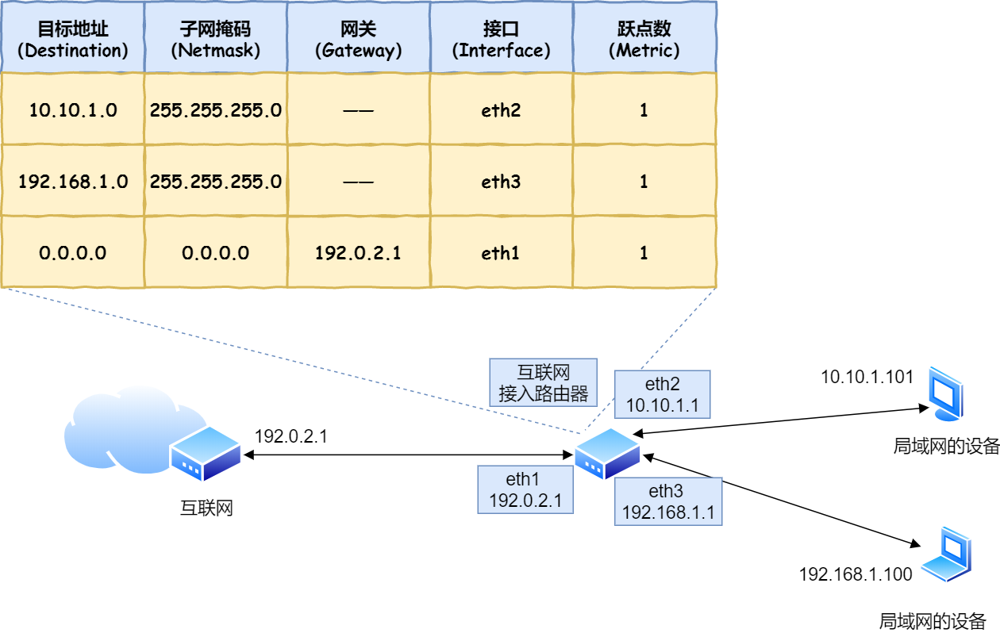

具体的工作流程根据上图，举个例子。

假设地址为 10.10.1.101 的计算机要向地址为 192.168.1.100 的服务器发送一个包，这个包先到达图中的路由器。

判断转发目标的第一步，就是**根据包的接收方 IP 地址查询路由表中的目标地址栏**，以找到相匹配的记录。

路由匹配和前面讲的一样，**每个条目的子网掩码和 192.168.1.100 IP 做 & 与运算后**，得到的结果与**对应条目的目标地址**进行**匹配**，如果匹配就会**作为候选转发目标**，如果不匹配就继续与下个条目进行路由匹配。

如第二条目的子网掩码 255.255.255.0 与 192.168.1.100 IP 做 & 与运算后，得到结果是 192.168.1.0 ，这与第二条目的目标地址 192.168.1.0 匹配，该第二条目记录就会被作为转发目标。

实在找不到匹配路由时，就会**选择默认路由**，路由表中**子网掩码为 0.0.0.0 的记录表示「默认路由」**。

##### 路由器的发送操作

接下来就会进入包的发送操作。

首先，我们需要**根据路由表的网关列判断对方的地址**。

如果网关是一个 IP 地址，则**这个IP 地址就是我们要转发到的目标地址**，还未抵达终点，还需继续需要路由器转发。
如果网关为空，则 **IP 头部中的接收方 IP 地址**就是要转发到的目标地址，也是就终于找到 IP 包头里的目标地址了，说明**已抵达终点**。
知道对方的 IP 地址之后，接下来需要**通过 ARP 协议根据 IP 地址查询 MAC 地址**，并将**查询的结果作为接收方 MAC 地址**。

**路由器也有 ARP 缓存**，因此首先会在 ARP 缓存中查询，如果找不到则发送 ARP 查询请求。

接下来是**发送方 MAC 地址字段**，这里**填写输出端口的 MAC 地址**。还有一个**以太类型字段，填写 0800 （十六进制）表示 IP 协议**。

网络包完成后，接下来会将其转换成电信号并通过端口发送出去。这一步的工作过程和计算机也是相同的。

发送出去的网络包会**通过交换机到达下一个路由器**。由于**接收方 MAC 地址**就是下一个路由器的地址，所以**交换机会根据这一地址将包传输到下一个路由器**。

接下来，下一个路由器会将包转发给再下一个路由器，经过层层转发之后，网络包就到达了最终的目的地。

不知你发现了没有，在网络包传输的过程中**，源 IP 和目标 IP 始终是不会变**的，**一直变化的是 MAC 地址**，因为**需要 MAC 地址在以太网内进行两个设备之间的包传输**。

数据包通过多个路由器道友的帮助，在网络世界途经了很多路程，最终抵达了目的地的城门！城门值守的路由器，发现了这个小兄弟数据包原来是找城内的人，于是它就将数据包送进了城内，再经由城内的交换机帮助下，最终转发到了目的地了。数据包感慨万千的说道：“多谢这一路上，各路大侠的相助！”

## 互相扒皮 —— 服务器 与 客户端
数据包抵达了服务器，服务器肯定高兴呀，正所谓有朋自远方来，不亦乐乎？

服务器高兴的不得了，于是开始扒数据包的皮！就好像你收到快递，能不兴奋吗？

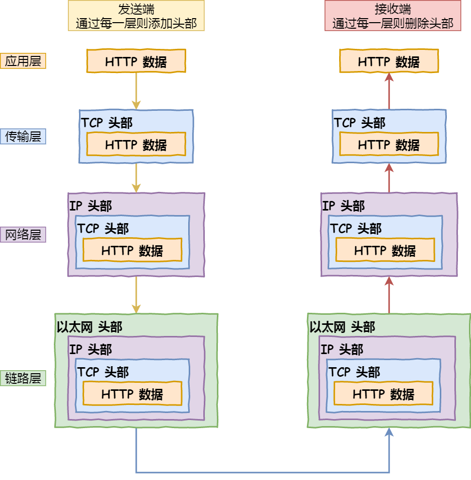

数据包抵达服务器后，服务器会先扒开数据包的 MAC 头部，查看**是否和服务器自己的 MAC 地址符合**，符合就将包收起来。

接着继续扒开数据包的 IP 头，发现 IP 地址符合，根据 IP 头中协议项，知道自己上层是 TCP 协议。

于是**，扒开 TCP 的头，里面有序列号**，需要看一看这个**序列包是不是我想要的，如果是就放入缓存中然后返回一个 ACK，如果不是就丢弃**。**TCP头部里面还有端口号， HTTP 的服务器正在监听这个端口号**。

于是，**服务器**自然就**知道是 HTTP 进程想要这个包，于是就将包发给 HTTP 进程**。

服务器的 HTTP 进程看到，原来这个请求是要访问一个页面，于是就把这个网页封装在 HTTP 响应报文里。

HTTP 响应报文也需要穿上 TCP、IP、MAC 头部，不过这次是**源地址是服务器 IP 地址，目的地址是客户端 IP 地址**。

穿好头部衣服后，从网卡出去，交由交换机转发到出城的路由器，路由器就把**响应数据包**发到了下一个路由器，就这样跳啊跳。

最后跳到了客户端的城门把守的路由器，路由器扒开 IP 头部发现是要找城内的人，于是又把包发给了城内的交换机，再由交换机转发到客户端。

客户端收到了服务器的响应数据包后，同样也非常的高兴，客户能拆快递了！

于是，客户端开始扒皮，把收到的数据包的**皮扒剩 HTTP 响应报文后，交给浏览器去渲染页面**，一份特别的数据包快递，就这样显示出来了！

最后，**客户端要离开了，向服务器发起了 TCP 四次挥手**，至此双方的连接就断开了。

## 读者问答
读者问：“笔记本的是自带交换机的吗？交换机现在我还不知道是什么”

笔记本不是交换机，**交换机通常是2个网口以上**。

现在家里的路由器其实有了交换机的功能了。交换机可以简单理解成**一个设备**，三台电脑网线接到这个设备，这三台电脑就可以互相通信了，交换机嘛，交换数据这么理解就可以。

读者问：“如果知道你电脑的mac地址，我可以直接给你发消息吗？”

Mac地址**只能是两个设备之间传递时使用**的，如果你要从大老远给我发消息，是**离不开 IP** 的。

读者问：“请问公网服务器的 Mac 地址是在什么时机通过什么方式获取到的？我看 arp 获取Mac地址只能获取到内网机器的 Mac 地址吧？”

在发送数据包时，如果**目标主机不是本地局域网，填入的MAC地址是路由器**，也就是把数据包转发给路由器，路由器一直转发下一个路由器，**直到转发到目标主机的路由器**，发现 IP 地址是**自己局域网内的主机**，就会 arp 请求**获取目标主机的 MAC 地址，从而转发到这个服务器主机**。

转发的过程中，**源IP地址和目标IP地址是不会变的（前提：没有使用 NAT 网络的）**，**源 MAC 地址和目标 MAC 地址是会变化的**。

# 2.3 Linux 系统是如何收发网络包的？

国际标准化组织制定了开放式系统互联通信参考模型（Open System Interconnection Reference Model），也就是 OSI 网络模型，该模型主要有 7 层，分别是**应用层、表示层、会话层、传输层、网络层、数据链路层以及物理层。**

每一层负责的职能都不同，如下：

- 应用层，负责给应用程序提供**统一的接口**； 
- 表示层，负责把数据转换成**兼容另一个系统能识别的格式**； 
- 会话层，负责**建立、管理和终止**表示层实体之间的通信会话； 
- 传输层，负责**端到端**的数据传输； 
- 网络层，负责**数据的路由、转发、分片**； 
- 数据链路层，负责**数据的封帧和差错**检测，以及 **MAC 寻址**； 
- 物理层，负责在**物理网络中传输数据帧**； 

由于 OSI 模型实在太复杂，提出的也只是**概念理论上的分层**，并没有提供具体的实现方案。

事实上，我们**比较常见，也比较实用的是四层模型**，即 **TCP/IP 网络模型**，Linux 系统正是按照这套网络模型来实现网络协议栈的。

TCP/IP 网络模型共有 4 层，分别是**应用层、传输层、网络层和网络接口层**，每一层负责的职能如下：

- 应用层，负责向用户**提供一组应用程序**，比如 HTTP、DNS、FTP 等; 

- 传输层，负责**端到端的通信**，比如 TCP、UDP 等； 

- 网络层，负责**网络包的封装、分片、路由、转发**，比如 IP、ICMP 等； 

- 网络接口层，负责**网络包在物理网络中的传输**，比如网络包的封帧、 MAC 寻址、差错检测，以及通过网卡传输网络帧等； 

	TCP/IP 网络模型相比 OSI 网络模型简化了不少，也更加易记，它们之间的关系如下图：

## Linux 网络协议栈

 我们可以把自己的身体比作应用层中的数据，打底衣服比作传输层中的 TCP 头，外套比作网络层中 IP 头，帽子和鞋子分别比作网络接口层的**帧头和帧尾**。

在冬天这个季节，当我们要从家里出去玩的时候，自然要先穿个打底衣服，再套上保暖外套，最后穿上帽子和鞋子才出门，这个过程就好像我们**把 TCP 协议通信的网络包发出去**的时候，会**把应用层的数据按照网络协议栈层层封装和处理**。

你从下面这张图可以看到，应用层数据在每一层的封装格式。


其中：

- 传输层，给**应用数据前面增加了 TCP 头**； 
- 网络层，给 TCP 数据包前面**增加了 IP 头**； 
- 网络接口层，给 IP 数据包前后分别增加了**帧头和帧尾**； 这些新增的头部和尾部，都有各自的作用，也都是按照特定的协议格式填充，这每一层都增加了各自的协议头，那自然网络包的大小就增大了，但物理链路**并不能传输任意大小的数据包**，所以在以太网中，规定了**最大传输单元（MTU）是 1500 字**节，也就是规定了**单次传输的最大 IP 包大小**。

当网络包**超过** MTU 的大小，就会在网络层**分片**，以确保分片后的 IP 包不会超过 MTU 大小，如果 MTU 越小，需要的**分包就越多**，那么**网络吞吐能力就越差**，相反的，如果 MTU 越大，需要的分包就越少，那么网络吞吐能力就越好。

知道了 TCP/IP 网络模型，以及网络包的封装原理后，那么 Linux 网络协议栈的样子，你想必猜到了大概，它其实就类似于 TCP/IP 的四层结构：


从上图的的网络协议栈，你可以看到：

- **应用程序**需要通过系统调用，来跟 **Socket 层进行数据交互**； 
- Socket 层的下面就是传输层、网络层和网络接口层； 
- 最下面的一层，则是网卡驱动程序和硬件网卡设备；

# Linux 接收网络包的流程 

网卡是计算机里的一个硬件，专门负责接收和发送网络包，当网卡接收到一个网络包后，会**通过 DMA 技术**，将网络包**写入到指定的内存地址**，也就是写入到 **Ring Buffer** ，这个是一个**环形缓冲区**，接着就会告诉操作系统这个网络包已经到达。

**那应该怎么告诉操作系统这个网络包已经到达了呢？**

最简单的一种方式就是**触发中断**，也就是每当网卡收到一个网络包，就**触发一个中断告诉操作系统**。

但是，这存在一个问题，在高性能网络场景下，网络包的数量会非常多，那么就会触发非常多的中断，要知道当 CPU 收到了中断，就会停下手里的事情，而去处理这些网络包，处理完毕后，才会回去继续其他事情，那么频繁地触发中断，则会导致 CPU 一直没完没了的处理中断，而导致其他任务可能无法继续前进，从而影响系统的整体效率。

所以为了解决频繁中断带来的性能开销，Linux 内核在 2.6 版本中引入了 **NAPI 机制**，它是**混合「中断和轮询」**的方式来接收网络包，它的核心概念就是**不采用中断的方式读取数据**，而是**首先采用中断唤醒数据接收的服务程序，然后 poll 的方法来轮询数据。**

因此，当有网络包到达时，会通过 DMA 技术，将网络包写入到指定的内存地址，接着网卡**向 CPU 发起硬件中断**，当 CPU 收到硬件中断请求后，**根据中断表，调用已经注册的中断处理函数**。

硬件中断处理函数会做如下的事情：

需要先「**暂时屏蔽中断**」，表示已经知道内存中有数据了，告诉网卡下次再收到数据包**直接写内存就可以了**，不要再通知 CPU 了，这样可以提高效率，避免 CPU 不停的被中断。 **接着，发起「软中断」**，然后**恢复刚才屏蔽的中断**。 至此，硬件中断处理函数的工作就已经完成。

硬件中断处理函数做的事情很少，主要**耗时的工作都交给软中断**处理函数了。

**软中断的处理**

内核中的 **ksoftirqd 线程专门负责软中断的处理**，当 ksoftirqd 内核线程收到软中断后，就会来**轮询处理数据**。

ksoftirqd 线程会从 Ring Buffer 中**获取一个数据帧**，用 sk_buff 表示，从而可以作为一个网络包交给网络协议栈进行逐层处理。

**网络协议栈**

首先，会先进入到网络接口层，在这一层会检查报文的**合法性**，如果不合法则丢弃，合法则会找出该网络包的**上层协议的类型**，比如是 **IPv4，还是 IPv6**，接着再**去掉帧头和帧尾**，然后交给网络层。

到了网络层，则取出 IP 包，判断网络包下一步的走向，比如是交给上层处理还是转发出去。当确认这个网络包要发送给本机后，就会**从 IP 头里看看上一层协议的类型是 TCP 还是 UDP，接着去掉 IP 头**，然后交给传输层。

传输层**取出 TCP 头或 UDP 头**，根据**四元组「源 IP、源端口、目的 IP、目的端口」** 作为标识，找出**对应的 Socket**，并把数据放到 Socket 的**接收缓冲区**。

最后，应用层程序**调用 Socket 接口**，将内核的 Socket 接收缓冲区的数据**「拷贝」到应用层的缓冲区**，然后唤醒用户进程。


# Linux 发送网络包的流程 

如上图的右半部分，发送网络包的流程正好和接收流程相反。

首先，应用程序会**调用 Socket 发送数据包的接口**，由于这个是**系统调用**，所以会从用户态陷入到内核态中的 Socket 层，内核会申请一个内核态的 sk_buff 内存，将用户待发送的数据拷贝到 sk_buff 内存，并将其加入到发送缓冲区。

接下来，网络协议栈从 Socket 发送缓冲区中取出 sk_buff，并按照 TCP/IP 协议栈从上到下逐层处理。

如果使用的是 TCP 传输协议发送数据，那么先拷贝一个新的 sk_buff 副本 ，这是因为 sk_buff 后续在调用网络层，最后到达网卡发送完成的时候，这个 sk_buff 会被释放掉。而 TCP 协议是支持丢失重传的，在**收到对方的 ACK 之前，这个 sk_buff 不能被删除**。所以内核的做法就是每次调用网卡发送的时候，实际上传递出去的是 **sk_buff 的一个拷贝，等收到 ACK 再真正删除**。

接着，对 sk_buff 填充 TCP 头。这里提一下，sk_buff 可以表示各个层的数据包，在**应用层数据包叫 data**，在 **TCP 层我们称为 segment**，在 **IP 层我们叫 packet**，在**数据链路层称为 frame**。

你可能会好奇，为什么全部数据包只用一个结构体来描述呢？协议栈采用的是分层结构，**上层向下层传递数据时需要增加包头，下层向上层数据时又需要去掉包头**，如果每一层都用一个结构体，那在层之间传递数据的时候，就要发生多**次拷贝**，这将大大降低 CPU 效率。

于是，为了在层级之间传递数据时，**不发生拷贝，只用 sk_buff 一个结构体来描述所有的网络包**，那它是如何做到的呢？是通过调整 sk_buff 中 data 的指针，比如：

当接收报文时，从网卡驱动开始，通过协议栈层层往上传送数据报，通过增加 skb->data 的值，来逐步剥离协议首部。 当要发送报文时，创建 sk_buff 结构体，数据缓存区的**头部预留足够的空间**，用来填充各层首部，在经过各下层协议时，通过减少 skb->data 的值来增加协议首部。 你可以从下面这张图看到，当发送报文时，data 指针的移动过程。

至此，传输层的工作也就都完成了。

然后交给网络层，在网络层里会做这些工作：**选取路由**（确认下一跳的 IP）、填充 IP 头、netfilter 过滤、对超过 MTU 大小的数据包进行**分片**。处理完这些工作后会交给网络接口层处理。

网络接口层会**通过 ARP 协议获得下一跳的 MAC 地址**，然后对 sk_buff 填充帧头和帧尾，接着**将 sk_buff** 放到网卡的发送队列中。

这一些工作准备好后，会触发「软中断」告诉网卡驱动程序，这里有新的网络包需要发送，驱动程序会从发送队列中读取 sk_buff，将这个 sk_buff **挂到 RingBuffer** 中，接着将 sk_buff 数据**映射到网卡可访问的内存 DMA 区域**，最后触发真实的发送。

当数据发送完成以后，其实工作并没有结束，因为内存还没有清理。当发送完成的时候，网卡设备会**触发一个硬中断来释放内存**，主要是释放 sk_buff 内存和清理 RingBuffer 内存。

最后，当**收到这个 TCP 报文的 ACK 应答时**，传输层就会**释放**原始的 sk_buff 。

**发送网络数据的时候，涉及几次内存拷贝操作？**

第一次，**调用发送数据的系统调用**的时候，**内核会申请**一个**内核态的 sk_buff 内存**，将用户待发送的数据拷贝到 sk_buff 内存，并将其加入到发送缓冲区。

第二次，在**使用 TCP 传输协议的情况下**，从传**输层进入网络层的时候**，每一个 sk_buff **都会被克隆**一个新的副本出来。副本 sk_buff 会被送往网络层，等它**发送完的时候就会释放掉**，然后**原始的 sk_buff 还保留在传输层**，目的是为了实现 TCP 的可靠传输，等收到这个数据包的 ACK 时，才会释放原始的 sk_buff 。

第三次，当 **IP 层发现 sk_buff 大于 MTU** 时才需要进行。会再**申请额外的 sk_buff**，并将**原来的 sk_buff 拷贝为多个小的 sk_buff**。

## 总结 

电脑与电脑之间通常都是通过**网卡、交换机、路由器**等网络设备连接到一起，那由于网络设备的异构性，国际标准化组织定义了一个七层的 OSI 网络模型，但是这个模型由于比较复杂，实际应用中并没有采用，而是采用了更为简化的 TCP/IP 模型，Linux 网络协议栈就是按照了该模型来实现的。

TCP/IP 模型主要分为应用层、传输层、网络层、网络接口层四层，每一层负责的职责都不同，这也是 Linux 网络协议栈主要构成部分。

当应用程序通过 Socket 接口发送数据包，数据包会被网络协议栈从上到下进行逐层处理后，才会被送到网卡队列中，随后由网卡将网络包发送出去。

而在**接收**网络包时，同样也要**先经过网络协议栈从下到上的逐层处理**，最后才会被送到应用程序。

# 5.1 IP 基础知识全家桶


## 前菜 —— IP 基本认识

IP 在 TCP/IP 参考模型中处于**第三层**，也就是**网络层**。

网络层的主要作用是：实现**主机与主机**之间的通信，也叫**点对点**（end to end）通信。

**网络层与数据链路层有什么关系呢？**

有的小伙伴分不清 IP（网络层） 和 **MAC （数据链路层）**之间的区别和关系。

其实很容易区分，在上面我们知道 IP 的作用是主机之间通信用的，而 MAC 的作用则是**实现「直连」的两个设备之间**通信，而 IP 则负责在**「没有直连」**的两个网络之间进行通信传输。

举个生活的栗子，小林要去一个很远的地方旅行，制定了一个行程表，其间需先后乘坐飞机、地铁、公交车才能抵达目的地，为此小林需要买飞机票，地铁票等。

飞机票和地铁票都是去往特定的地点的，每张票只能够在**某一限定区间内**移动，此处的「区间内」就如同通信网络中数据链路。

在区间内移动相当于数据链路层，充当区间内两个节点传输的功能，区间内的出发点好比**源** MAC 地址，目标地点好比**目的** MAC 地址。

**整个**旅游行程表就相当于**网络层**，充当远程定位的功能，行程的开始好比源 IP，行程的终点好比目的 IP 

因此，**只有两者兼备，既有某个区间的车票又有整个旅行的行程表，才能保证到达目的地**。与此类似，计算机网络中也需要「数据链路层」和「网络层」这个分层才能实现向最终目标地址的通信。

还有重要一点，旅行途中我们虽然不断变化了交通工具，但是旅行行程的起始地址和目的地址始终都没变。

其实，在网络中数据包传输中也是如此，**源IP地址和目标IP地址在传输过程中是不会变化**的（前提：**没有使用 NAT** 网络），**只有源 MAC 地址和目标 MAC 一直在变化**。

## 主菜 —— IP 地址的基础知识 

在 TCP/IP 网络通信时，为了保证能正常通信，每个设备都需要配置正确的 IP 地址，否则无法实现正常的通信。

IP 地址（IPv4 地址）由 32 位正整数来表示，IP 地址在计算机是以二进制的方式处理的。

而人类为了方便记忆采用了**点分十进制的标记方式**，也就是将 32 位 IP 地址以每 8 位为组，共分为 4 组，每组以「.」隔开，再将每组转换成十进制。


最大允许 43 亿台计算机连接到网络。

实际上，IP 地址并不是根据主机台数来配置的，而是以**网卡**。像服务器、路由器等设备都是有 2 个以上的网卡，也就是它们会有 2 个以上的 IP 地址。

因此，让 43 亿台计算机全部连网其实是不可能的，更何况 IP 地址是由**「网络标识」**和**「主机标识」**这两个部分组成的，所以实际能够连接到网络的计算机个数更是少了很多。

**可能有的小伙伴提出了疑问，现在不仅电脑配了 IP 地址， 手机、IPad 等电子设备都配了 IP 呀，照理来说肯定会超过 43 亿啦，那是怎么能够支持这么多 IP 的呢？**

因为会根据一种**可以更换 IP 地址的技术 NAT**，使得可连接计算机数超过 43 亿台。

## IP 地址的分类

 互联网诞生之初，IP 地址显得很充裕，于是计算机科学家们设计了分类地址。

IP 地址分类成了 5 种类型，分别是 A 类、B 类、C 类、D 类、E 类。


上图中**黄色部分为分类号**，用以区分 IP 地址类别。

**什么是 A、B、C 类地址？**

其中对于 A、B、C 类主要分为两个部分，分别是网络号和主机号。这很好理解，好比小林是 A 小区 1 栋 101 号，你是 B 小区 1 栋 101 号。

我们可以用下面这个表格， 就能很清楚的知道 A、B、C 分类对应的地址范围、最大主机个数。

A、B、C 分类地址最大主机个数是如何计算的呢？

最大主机个数，就是要看**主机号的位数**，如 C 类地址的主机号占 8 位，那么 C 类地址的最大主机个数：

为什么要减 2 呢？

因为在 IP 地址中，有两个 IP 是特殊的，分别是主机号全为 1 和 全为 0 地址。

- 主机号全为 1 **指定某个网络下的所有主机**，用于**广播**
- 主机号全为 0 **指定某个网络**

因此，在分配过程中，应该去掉这两种情况。

**广播地址用于什么？**

广播地址用于在**同一个链路中相互连接的主机之间发送数据包**。

学校班级中就有广播的例子，在准备上课的时候，通常班长会喊：“上课， 全体起立！”，班里的同学听到这句话是不是全部都站起来了？这个句话就有广播的含义。

当主机号全为 1 时，就表示**该网络的广播地址**。例如把 172.20.0.0/16 用二进制表示如下：

10101100.00010100.00000000.00000000

将这个地址的**主机部分全部改为 1**，**则形成广播地址**：

10101100.00010100.11111111.11111111

再将这个地址用十进制表示，则为 172.20.255.255。

广播地址可以分为**本地**广播和**直接**广播两种。

在**本网络内**广播的叫做本地广播。例如网络地址为 192.168.0.0/24 的情况下，广播地址是 192.168.0.255 。因为这个广播地址的 IP 包会**被路由器屏蔽**，所以**不会到达 192.168.0.0/24 以外的其他链路上**。 

在不同网络之间的广播叫做直接广播。例如网络地址为 192.168.0.0/24 的主机向 192.168**.1.255/24** 的目标地址发送 IP 包。收到这个包的路由器，将数据转发给 192.168.1.0/24，从而使得所有 192.168.1.**1**~192.168.1**.254** 的主机都能收到这个包（由于直接广播有一定的安全问题，多数情况下会在路由器上设置为不转发） 。

**什么是 D、E 类地址？**

而 D 类和 E 类地址是**没有主机号的**，所以**不可用于主机 IP**，D 类常被用于多播，E 类是预留的分类，暂时未使用。

**多播地址用于什么？**

多播用于将包发送给**特定组内的所有主机**。

还是举班级的栗子，老师说：“最后一排的同学，上来做这道数学题。”，老师指定的是最后一排的同学，也就是多播的含义了。

由于**广播无法穿透路由**，若想给其他网段发送同样的包，就可以使用可以穿透路由的多播。

多播使用的 D 类地址，其**前四位是 1110** 就**表示是多播地址**，而剩下的 28 位是多播的组编号。

从 224.0.0.0 ~ 239.255.255.255 都是多播的可用范围，其划分为以下三类：

224.0.0.0 ~ **224**.0.0.255 为预留的组播地址，只能在**局域网中**，路由器是不会进行转发的。 224.0.1.0 ~ **238**.255.255.255 为**用户可用**的组播地址，可以用于 Internet 上。 **239**.0.0.0 ~ 239.255.255.255 为**本地管理**组播地址，可供内部网在内部使用，仅在**特定的本地范围内**有效。

**IP 分类的优点**

不管是路由器还是主机解析到一个 IP 地址时候，我们判断其 IP 地址的**首位是否为 0**，为 0 则为 A 类地址，那么就能很快的找出网络地址和主机地址。

其余分类判断方式参考如下图：


所以，这种分类地址的优点就是简单明了、选路（基于网络地址）简单。

**IP 分类的缺点**

缺点一

同一网络下没有**地址层次**，比如一个公司里用了 B 类地址，但是可能需要根据生产环境、测试环境、开发环境来划分地址层次，而这种 IP 分类是没有地址层次划分的功能，所以这就缺少地址的灵活性。

缺点二

A、B、C类有个尴尬处境，就是不能很好的与**现实网络匹配**。

**C 类**地址能包含的最大主机数量实在太少了，只有 254 个，估计一个网吧都**不够用**。 而 **B 类**地址能包含的最大主机数量又太多了，6 万多台机器放在一个网络下面，一般的企业基本达不到这个规模，闲着的地址就是**浪费**。 这两个缺点，都可以在 CIDR 无分类地址解决。

## 无分类地址 CIDR 

正因为 IP 分类存在许多缺点，所以后面提出了无分类地址的方案，即 CIDR。

这种方式**不再有分类地址**的概念，32 比特的 IP 地址被划分为**两部分**，前面是**网络号**，后面是**主机号**。

怎么划分网络号和主机号的呢？

表示形式 a.b.c.d/x，其中 /x 表示前 x 位属于网络号， x 的范围是 0 ~ 32，这就使得 IP 地址更加具有灵活性。

比如 10.100.122.2**/24**，这种地址表示形式就是 CIDR，/24 表示前 24 位是网络号，剩余的 8 位是主机号。

还有另一种**划分网络号与主机号**形式，那就是**子网掩码**，掩码的意思就是**掩盖掉主机号**，剩余的就是网络号。

将**子网掩码和 IP 地址按位计算 AND**，就可得到**网络号**。

**为什么要分离网络号和主机号？**

因为两台计算机要通讯，首先要判断**是否处于同一个广播域内**，即**网络地址是否相同。**如果网络地址相同，表明接受方在本网络上，那么可以把数据包直接发送到目标主机。

路由器寻址工作中，也就是通过这样的方式来找到**对应的网络号**的，进而把数据包转发给对应的网络内。

**怎么进行子网划分？**

在上面我们知道可以通过子网掩码划分出网络号和主机号，那实际上子网掩码还有一个作用，那就是**划分子网**。

子网划分实际上是将**主机地址分为两个部分**：**子网网络地址**和**子网主机地址**。形式如下：


未做子网划分的 ip 地址：网络地址＋主机地址 

做子网划分后的 ip 地址：网络地址＋（子网网络地址＋子网主机地址） 

假设对 C 类地址进行子网划分，网络地址 192.168.1.0，使用**子网掩码 255.255.255.192 对其进行子网划分**。

C 类地址中前 24 位是网络号，最后 8 位是主机号，根据子网掩码可知**从 8 位主机号中借用 2 位作为子网号**。


由于子网网络地址被划分成 2 位，那么子网地址就有 4 个，分别是 00、01、10、11，具体划分如下图：

划分后的 4 个子网如下表格：

## 公有 IP 地址与私有 IP 地址

 在 A、B、C 分类地址，实际上有分公有 IP 地址和私有 IP 地址。


平时我们办公室、家里、学校用的 IP 地址，一般都是私有 IP 地址。因为这些地址允许**组织内部**的 IT 人员自己管理、自己分配，而且**可以重复**。因此，你学校的某个私有 IP 地址和我学校的可以是一样的。

就像每个小区都有自己的楼编号和门牌号，你小区家可以叫 1 栋 101 号，我小区家也可以叫 1 栋 101，没有任何问题。但**一旦出了小区，就需要带上中山路 666 号（公网 IP 地址）**，是**国家统一分配**的，不能两个小区都叫中山路 666。

所以，公有 IP 地址是有个组织统一分配的，假设你要开一个博客网站，那么你就需要去**申请购买一个公有 IP**，这样全世界的人才能访问。并且公有 IP 地址基本上要在整个互联网范围内保持唯一。

**公有 IP 地址由谁管理呢？**

私有 IP 地址通常是内部的 IT 人员管理，公有 IP 地址是由 ICANN 组织管理，中文叫「互联网名称与数字地址分配机构」。

IANA 是 ICANN 的其中一个机构，它负责分配互联网 IP 地址，是按州的方式层层分配。

## IP 地址与路由控制 

IP地址的网络地址这一部分是用于进行**路由控制**。

路由控制表中记录着网络地址与**下一步应该发送至路由器的地址**。在主机和路由器上都会有各自的路由器控制表。

在发送 IP 包时，首先要确定 IP 包首部中的目标地址，再从路由控制表中找到与该地址具有相同网络地址的记录，根据该记录将 IP 包转发给相应的下一个路由器。如果路由控制表中**存在多条**相同网络地址的记录，就选择**相同位数最多的**网络地址，也就是最长匹配。

下面以下图的网络链路作为例子说明：

主机 A 要发送一个 IP 包，其源地址是 10.1.1.30 和目标地址是 10.1.2.10，由于**没有在主机 A 的路由表找到**与目标地址 10.1.2.10 相同的网络地址，于是包被转发到**默认路由（路由器 1 ）**

 路由器 1 收到 IP 包后，也在路由器 1 的路由表匹配与目标地址相同的网络地址记录，发现匹配到了，于是就把 IP 数据包转发到了 **10.1.0.2 这台路由器 2** 

路由器 2 收到后，同样对比自身的路由表，发现匹配到了，于是把 IP 包从路由器 2 的 10.1.2.1 这个接口出去，最终**经过交换机**把 IP 数据包转发到了目标主机

**环回地址是不会流向网络**

环回地址是在同一台计算机上的**程序之间进行网络通信**时所使用的一个**默认地址**。

计算机使用一个特殊的 IP 地址 **127.0.0.1** 作为环回地址。与该地址具有相同意义的是一个叫做 **localhost 的主机名**。使用这个 IP 或主机名时，数据包**不会流向网络**。

## IP 分片与重组

每种数据链路的**最大传输单元 MTU** 都是不相同的，如 FDDI 数据链路 MTU 4352、以太网的 MTU 是 1500 字节等。

每种数据链路的 MTU 之所以不同，是因为每个不同类型的数据链路的使用目的不同。使用目的不同，可承载的 MTU 也就不同。

其中，我们最常见数据链路是**以太网**，它的 MTU 是 **1500 字节**。

那么当 IP 数据包大小大于 MTU 时， IP 数据包就会被分片。

经过分片之后的 IP 数据报在被**重组**的时候，**只能由目标主机进**行，路由器是不会进行重组的。

假设发送方发送一个 4000 字节的大数据报，若要传输在以太网链路，则需要把数据报分片成 3 个小数据报进行传输，再交由接收方重组成大数据报。

在分片传输中，一旦**某个分片丢失**，则会造成**整个 IP 数据报作废**，所以 TCP 引入了 MSS 也就是在 TCP 层进行分片不由 IP 层分片，那么对于 UDP 我们尽量不要发送一个大于 MTU 的数据报文。

## IPv6 基本认识

IPv4 的地址是 32 位的，大约可以提供 42 亿个地址，但是早在 2011 年 IPv4 地址就已经**被分配完**了。

但是 IPv6 的地址是 128 位的，这可分配的地址数量是大的惊人，说个段子 IPv6 可以保证地球上的每粒沙子都能被分配到一个 IP 地址。

但 IPv6 除了有更多的地址之外，还有更好的安全性和扩展性，说简单点就是 IPv6 相比于 IPv4 能带来更好的网络体验。

但是因为 IPv4 和 IPv6 不能相互兼容，所以不但要我们电脑、手机之类的设备支持，还需要网络运营商对现有的设备进行升级，所以这可能是 IPv6 普及率比较慢的一个原因。

**IPv6 的亮点**

IPv6 不仅仅只是可分配的地址变多了，它还有非常多的亮点。

IPv6 可自动配置，即使没有 DHCP 服务器也可以实现**自动分配IP地址**，真是便捷到即插即用啊。

 IPv6 **包头**包首部长度采用固定的值 **40 字节**，去掉了包头校验和，简化了首部结构，减轻了路由器负荷，大大提高了传输的性能。

IPv6 有应对伪造 IP 地址的网络安全功能以及防止线路窃听的功能，大大提升了安全性。

IPv6 地址的标识方法

IPv4 地址长度共 32 位，是以每 8 位作为一组，并用**点分十进制**的表示方式。

IPv6 地址长度是 128 位，是以每 16 位作为一组，每组用**冒号 「:」** 隔开。

如果出现**连续的 0 时**还可以将这些 0 省略，并用两个冒号 「::」隔开。但是，一个 IP 地址中只允许出现**一次两个连续的冒号**。

**IPv6 地址的结构**

IPv6 类似 IPv4，也是通过 IP 地址的前几位标识 IP 地址的种类。

IPv6 的地址主要有以下类型地址：

单播地址，用于**一对一**的通信

组播地址，用于**一对多**的通信

任播地址，用于**通信最近**的节点，最近的节点是由**路由协议**决定

没有广播地址

**IPv6 单播地址类型**

对于一对一通信的 IPv6 地址，主要划分了三类单播地址，每类地址的有效范围都不同。

在**同一链路**单播通信，**不经过路由器**，可以使用链路本地单播地址，IPv4 没有此类型

在**内网**里单播通信，可以使用**唯一本地地址**，相当于 IPv4 的**私有** IP

在**互联网**通信，可以使用**全局单播**地址，相当于 IPv4 的**公有** IP

## IPv4 首部与 IPv6 首部

 IPv4 首部与 IPv6 首部的差异如下图：


IPv6 相比 IPv4 的首部改进：

取消了首部校验和字段。 因为在数据链路层和传输层都会校验，因此 IPv6 直接取消了 IP 的校验。 

取消了分片/重新组装相关字段。 分片与重组是**耗时**的过程，IPv6 不允许在中间路由器进行分片与重组，这种操作只能在源与目标主机，这将大大提高了路由器转发的速度。 

取消选项字段。 选项字段不再是标准 IP 首部的一部分了，但它并没有消失，而是可能出现在 IPv6 首部中的「下一个首部」指出的位置上。删除该选项字段使的 IPv6 的首部成为**固定长度的 40 字节**。

 # 点心 —— IP 协议相关技术

跟 IP 协议相关的技术也不少，接下来说说与 IP 协议相关的重要且常见的技术。

DNS 域名解析 

ARP 与 RARP 协议 

DHCP 动态获取 IP 地址

 NAT 网络地址转换

 ICMP 互联网控制报文协议 

IGMP 因特网组管理协议 

## DNS

我们在上网的时候，通常使用的方式是**域名，而不是 IP 地址**，因为域名方便人类记忆。

那么实现这一技术的就是 **DNS 域名解析**，DNS 可以**将域名网址自动转换为具体的 IP 地址**。

**域名的层级关系**

DNS 中的域名都是用**句点来分隔**的，比如 [www.server.com，这里的句点代表了不同层次之间的界限。](http://www.server.xn--com,-jb5fymvnxyr47ailaw48ejz4bzgpv8opjeja7698eu81a5zhluvjxb./)

在域名中，**越靠右的位置表示其层级越高**。

毕竟域名是外国人发明，所以思维和中国人相反，比如说一个城市地点的时候，**外国喜欢从小到大的方式顺序**说起（如 XX 街道 XX 区 XX 市 XX 省），而中国则喜欢从大到小的顺序（如 XX 省 XX 市 XX 区 XX 街道）。

根域是在最顶层，它的下一层就是 com 顶级域，再下面是 server.com。

所以域名的层级关系类似一个树状结构：

根 DNS 服务器 顶级域 DNS 服务器（com） 权威 DNS 服务器（server.com）

根域的 DNS 服务器信息保存在互联网中**所有的 DNS 服务器中**。这样一来，任何 DNS 服务器就都可以找到并访问根域 DNS 服务器了。

因此，客户端只要能够找到任意一台 DNS 服务器，就可以通过它找到根域 DNS 服务器，然后再一路顺藤摸瓜找到位于下层的某台目标 DNS 服务器。

**域名解析的工作流程**

浏览器首先看一下自己的**缓存**里有没有，如果没有就向操作系统的缓存要，还没有就检查**本机域名解析文件 hosts**，如果还是没有，就会 DNS 服务器进行查询，查询的过程如下：

客户端首先会发出一个 DNS 请求，问 [www.server.com](http://www.server.com/) 的 IP 是啥，并发给本地 DNS 服务器（也就是客户端的 TCP/IP 设置中填写的 DNS 服务器地址）。

 本地域名服务器收到客户端的请求后，如果缓存里的表格能找到 [www.server.com，则它直接返回](http://www.server.xn--com,-jj9fs6w1vi51qb54bq81c/) IP 地址。如果没有，本地 DNS 会去问**它的根域名服务器**：“老大， 能告诉我 [www.server.com](http://www.server.com/) 的 IP 地址吗？” 根域名服务器是最高层次的，它不直接用于域名解析，但能指明一条道路。

 根 DNS 收到来自本地 DNS 的请求后，发现后置是 .com，说：“www.server.com 这个域名归 .com 区域管理”，我给你 .com 顶级域名服务器地址给你，你去问问它吧。”

 本地 DNS 收到顶级域名服务器的地址后，发起请求问“老二， 你能告诉我 [www.server.com](http://www.server.com/) 的 IP 地址吗？

” 顶级域名服务器说：“我给你负责 [www.server.com](http://www.server.com/) 区域的权威 DNS 服务器的地址，你去问它应该能问到”。 本地 DNS 于是转向问权威 DNS 服务器：“老三，www.server.com对应的IP是啥呀？” server.com 的权威 DNS 服务器，它是域名解析结果的**原出处**。为啥叫权威呢？就是我的域名我做主。

 权威 DNS 服务器查询后将对应的 IP 地址 X.X.X.X 告诉本地 DNS。

 本地 DNS 再将 IP 地址返回客户端，客户端和目标建立连接。

DNS 域名解析的过程蛮有意思的，整个过程就和我们日常生活中找人问路的过程类似，**只指路不带路。**

## ARP 

在传输一个 IP 数据报的时候，确定了源 IP 地址和目标 IP 地址后，就会通过**主机「路由表」**确定 IP 数据包下一跳。然而，网络层的下一层是**数据链路层**，所以我们还要知道**「下一跳」的 MAC 地址**。

由于主机的路由表中可以找到下一跳的 IP 地址，所以可以通过 ARP 协议，求得下一跳的 MAC 地址。

**那么 ARP 又是如何知道对方 MAC 地址的呢？**

简单地说，ARP 是借助 ARP 请求与 ARP 响应两种类型的包确定 MAC 地址的。


主机会通过广播发送 ARP 请求，这个包中包含了想要知道的 MAC 地址的主机 IP 地址。 

当同个链路中的所有设备收到 ARP 请求时，会去拆开 ARP 请求包里的内容，如果 ARP 请求包中的目标 IP 地址与自己的 IP 地址一致，那么这个设备就将自己的 MAC 地址塞入 ARP 响应包返回给主机。 操作系统通常会把第一次通过 ARP 获取的 MAC 地址缓存起来，以便下次直接从缓存中找到对应 IP 地址的 MAC 地址。

不过，MAC 地址的缓存是有**一定期限**的，超过这个期限，缓存的内容将被清除。

**RARP 协议你知道是什么吗？**

ARP 协议是已知 IP 地址求 MAC 地址，那 **R**ARP 协议正好相反，它是**已知 MAC 地址求 IP 地址**。例如将打印机服务器等小型嵌入式设备接入到网络时就经常会用得到。

通常这需要架设一台 RARP 服务器，在这个服务器上注册设备的 MAC 地址及其 IP 地址。然后再将这个设备接入到网络，接着：

该设备会发送一条「我的 MAC 地址是XXXX，请告诉我，我的IP地址应该是什么」的请求信息。 RARP 服务器接到这个消息后返回「MAC地址为 XXXX 的设备，IP地址为 XXXX」的信息给这个设备。 最后，设备就根据从 RARP 服务器所收到的应答信息设置自己的 IP 地址。

# DHCP 

DHCP 在生活中我们是很常见的了，我们的电脑通常都是**通过 DHCP 动态获取 IP 地址**，大大省去了配 IP 信息繁琐的过程。

接下来，我们来看看我们的电脑是如何通过 4 个步骤的过程，获取到 IP 的。

先说明一点，DHCP **客户端**进程监听的是 68 端口号，DHCP **服务端**进程监听的是 67 端口号。

这 4 个步骤：

客户端首先发起 DHCP 发现报文（DHCP DISCOVER） 的 IP 数据报，由于客户端没有 IP 地址，也不知道 DHCP 服务器的地址，所以使用的是 **UDP 广播通信**，其使用的广播目的地址是 255.255.255.255（端口 67） 并且使用 0.0.0.0（端口 68） 作为源 IP 地址。DHCP 客户端将该 IP 数据报传递给链路层，链路层然后将帧广播到所有的网络中设备。

 DHCP 服务器收到 DHCP 发现报文时，用 DHCP 提供报文（DHCP OFFER） 向客户端做出响应。该报文仍然使用 IP 广播地址 255.255.255.255，该报文信息携带服务器提供可租约的 IP 地址、子网掩码、默认网关、DNS 服务器以及 IP 地址租用期。

 客户端收到一个或多个服务器的 DHCP 提供报文后，从中选择一个服务器，并向选中的服务器发送 DHCP 请求报文（DHCP REQUEST进行响应，回显配置的参数。

 最后，服务端用 DHCP ACK 报文对 DHCP 请求报文进行响应，应答所要求的参数。 一旦客户端收到 DHCP ACK 后，交互便完成了，并且客户端能够在租用期内使用 DHCP 服务器分配的 IP 地址。

如果租约的 DHCP IP 地址快期后，客户端会向服务器发送 DHCP 请求报文：

服务器如果同意继续租用，则用 DHCP ACK 报文进行应答，客户端就会延长租期。

 服务器如果不同意继续租用，则用 DHCP NACK 报文，客户端就要停止使用租约的 IP 地址。 

可以发现，DHCP 交互中，**全程都是使用 UDP 广播通信**。

**咦，用的是广播，那如果 DHCP 服务器和客户端不是在同一个局域网内，路由器又不会转发广播包，那不是每个网络都要配一个 DHCP 服务器？**

所以，为了解决这一问题，就出现了 DHCP **中继代理**。有了 DHCP 中继代理以后，对不同网段的 IP 地址分配也可以由一个 DHCP 服务器统一进行管理。

DHCP 客户端会向 DHCP 中继代理发送 DHCP 请求包，而 DHCP 中继代理在收到这个广播包以后，再以单播的形式发给 DHCP 服务器。

服务器端收到该包以后再向 DHCP 中继代理返回应答，并由 DHCP 中继代理将此包广播给 DHCP 客户端 。

因此，DHCP 服务器**即使不在同一个链路上**也可以实现统一分配和管理IP地址。

## NAT

IPv4 的地址是非常紧缺的，在前面我们也提到可以通过**无分类地址**来减缓 IPv4 地址耗尽的速度，但是互联网的用户增速是非常惊人的，所以 IPv4 地址依然有被耗尽的危险。

于是，提出了一种网络地址转换 NAT 的方法，再次缓解了 IPv4 地址耗尽的问题。

简单的来说 NAT 就是同个公司、家庭、教室内的主机对外部通信时，把私有 IP 地址转换成公有 IP 地址。


**那不是 N 个私有 IP 地址，你就要 N 个公有 IP 地址？这怎么就缓解了 IPv4 地址耗尽的问题？这不瞎扯吗？**

确实是，普通的 NAT 转换没什么意义。

由于绝大多数的网络应用都是使用传输层协议 TCP 或 UDP 来传输数据的。

因此，可以把 **IP 地址 + 端口号**一起进行转换。

这样，就用一个全球 IP 地址就可以了，这种转换技术就叫网络地址与端口转换 **NAPT**。

很抽象？来，看下面的图解就能瞬间明白了。


图中有两个客户端 192.168.1.10 和 192.168.1.11 同时与服务器 183.232.231.172 进行通信，并且这两个客户端的**本地端口都是 1025**。

此时，两个私有 IP 地址都转换 IP 地址为**公有地址 120.229.175.121**，但是**以不同的端口号作为区分**。

于是，生成一个 NAPT 路由器的**转换表**，就可以**正确地转换地址跟端口的组合**，令客户端 A、B 能同时与服务器之间进行通信。

这种转换表在 NAT 路由器上自动生成。例如，在 TCP 的情况下，建立 TCP 连接首次握手时的 SYN 包一经发出，就会生成这个表。而后又随着收到关闭连接时**发出 FIN 包的确认应答从表中被删除**。

**NAT 那么牛逼，难道就没缺点了吗？**

当然有缺陷，肯定没有十全十美的方案。

由于 NAT/NAPT 都依赖于**自己的转换表**，因此会有以下的问题：

**外部无法主动**与 NAT 内部服务器建立连接，因为 NAPT 转换表没有转换记录。 转换表的生成与转换操作都会产生性能开销。 通信过程中，如果 NAT 路由器重启了，所有的 TCP 连接都将被重置。

 **如何解决 NAT 潜在的问题呢？**

解决的方法主要有两种方法。

第一种就是**改用 IPv6**

IPv6 可用范围非常大，以至于每台设备都可以配置一个公有 IP 地址，就不搞那么多花里胡哨的地址转换了，但是 IPv6 普及速度还需要一些时间。

第二种 **NAT 穿透技术**

NAT 穿越技术拥有这样的功能，它能够让网络应用程序主动发现自己位于 NAT 设备之后，并且会主动获得 NAT 设备的公有 IP，并为自己建立端口映射条目，注意这些都是 **NAT设备后的应用程序**自动完成的。

也就是说，在 NAT 穿透技术中，NAT设备后的应用程序处于**主动地位**，它已经明确地知道 NAT 设备要修改它外发的数据包，于是它主动配合 NAT 设备的操作，主动地建立好映射，这样就不像以前由 NAT 设备来建立映射了。

说人话，就是客户端主动从 NAT 设备获取公有 IP 地址，然后**自己建立端口映射条目**，然后用这个条目对外通信，就不需要 NAT 设备来进行转换了。

## ICMP

**ICMP 全称是 Internet Control Message Protocol**，也就是**互联网控制报文协议**。

里面有个关键词 —— 控制，如何控制的呢？

网络包在复杂的网络传输环境里，常常会遇到各种问题。

当遇到问题的时候，总不能死个不明不白，没头没脑的作风不是计算机网络的风格。所以需要传出消息，报告遇到了什么问题，这样才可以调整传输策略，以此来控制整个局面。

**ICMP 功能都有啥？**

ICMP 主要的功能包括：**确认 IP 包是否成功送达目标地址**、**报告发送过程中 IP 包被废弃的原因和改善网络设置等**。

在 IP 通信中如果某个 IP 包因为某种原因未能达到目标地址，那么这个具体的原因将**由 ICMP 负责通知**。


如上图例子，主机 A 向主机 B 发送了数据包，由于某种原因，途中的路由器 2 未能发现主机 B 的存在，这时，路由器 2 就会向主机 A 发送一个 **ICMP 目标不可达数据包**，说明发往主机 B 的包未能成功。

ICMP 的这种通知消息会使用 **IP 进行发送** 。

因此，从路由器 2 返回的 ICMP 包会**按照往常的路由**控制先经过路由器 1 再转发给主机 A 。收到该 ICMP 包的主机 A 则分解 ICMP 的首部和数据域以后得知具体发生问题的原因。

**ICMP 类型**

ICMP 大致可以分为两大类：

一类是用于诊断的查询消息，也就是**「查询报文类型」**

另一类是通知出错原因的错误消息，也就是**「差错报文类型」**


## IGMP

ICMP 跟 IGMP 是**一点关系都没有的**，就好像周杰与周杰伦的区别，大家不要混淆了。

在前面我们知道了组播地址，也就是 D 类地址，既然是组播，那就说明是**只有一组的主机**能收到数据包，不在一组的主机不能收到数组包，**怎么管理是否是在一组**呢？那么，就需要 IGMP 协议了。


**IGMP 是因特网组管理协议，工作在主机（组播成员）和最后一跳路由之间**，如上图中的蓝色部分。

IGMP 报文向路由器申请加入和退出组播组，默认情况下路由器是不会转发组播包到连接中的主机，除非主机通过 IGMP 加入到组播组，主机申请加入到组播组时，路由器就会记录 IGMP 路由器表，路由器后续就会转发组播包到对应的主机了。 

IGMP 报文采用 **IP 封装**，IP **头部的协议号为 2**，而且 TTL 字段值通常为 1，因为 IGMP 是工作在主机与连接的路由器之间。 

**IGMP 工作机制**

IGMP 分为了三个版本分别是，**IGMPv1、IGMPv2、IGMPv3**

接下来，以 IGMPv2 作为例子，说说**常规查询与响应**和**离开组播组**这两个工作机制。


路由器会周期性发送目的地址为 224.0.0.1（表示同一网段内所有主机和路由器） **IGMP 常规查询报文**。

主机1 和 主机 3 收到这个查询，随后会启动「报告延迟计时器」，计时器的时间是随机的，通常是 0~10 秒，计时器超时后主机就会发送 **IGMP 成员关系报告报文**（源 IP 地址为自己主机的 IP 地址，目的 IP 地址为组播地址）。如果在定时器超时之前，收到同一个组内的其他主机发送的成员关系报告报文，则自己不再发送，这样可以**减少网络中多余的 IGMP 报文数量**.

路由器收到主机的成员关系报文后，就会**在 IGMP 路由表中加入该组播组**，后续网络中一旦该组播地址的数据到达路由器，它会把数据包转发出去。

离开组播组工作机制

离开组播组的情况一，网段中仍有该组播组：


主机 1 要**离开组 224.1.1.1**，发送 IGMPv2 离组报文，报文的目的地址是 224.0.0.2（表示**发向网段内的所有路由器**）

 路由器 收到该报文后，以 1 秒为间隔连续发送 IGMP 特定组查询报文（共计发送 2 个），以便确认该网络是否还有 224.1.1.1 组的其他成员。 

主机 3 仍然是组 224.1.1.1 的成员，因此它立即响应这个特定组查询。路由器知道该网络中仍然存在该组播组的成员，于是继续向该网络转发 224.1.1.1 的组播数据包。

离开组播组的情况二，网段中没有该组播组：


主机 1 要离开组播组 224.1.1.1，发送 IGMP 离组报文。

路由器收到该报文后，以 1 秒为间隔连续发送 IGMP 特定组查询报文（共计发送 2 个）。此时在该网段内，组 224.1.1.1 **已经没有其他成员了，因此没有主机响应这个查询**。

 一定时间后，路由器认为该网段中**已经没有 224.1.1.1 组播组成员了，将不会再向这个网段转发该组播地址的数据包**。

**“组播不太懂。。。假设一台机器加入组播地址，需要把IP改成组播地址吗？如果离开某个组播地址，需要dhcp重新请求个IP吗？”**

组播地址**不是用于机器ip地址的，因为组播地址没有网络号和主机号**，所以跟dhcp没关系。组播地址一般是用于**udp协议**，机器发送UDP组播数据时，目标地址填的是组播地址，那么在组播组内的机器都能收到数据包。

是否加入组播组和离开组播组，是由**socket一个接口实现**的，**主机ip是不用改变**的。

# 3.1 HTTP

## HTTP 基本概念

### HTTP 是什么？

 HTTP 是超文本传输协议，也就是HyperText Transfer Protocol。

能否详细解释「超文本传输协议」？

HTTP 的名字「超文本协议传输」，它可以拆成三个部分：

**超文本 传输 协议**


针对 HTTP 协议，我们可以这么理解。

HTTP 是一个用在计算机世界里的协议。它使用计算机能够理解的语言确立了一种**计算机之间交流通信的规范**（两个以上的参与者），以及相关的各种控制和错误处理方式（行为约定和规范）。

HTTP 协议是一个**双向协议**。

我们在上网冲浪时，浏览器是请求方 A，百度网站就是应答方 B。双方约定用 HTTP 协议来通信，于是浏览器把请求数据发送给网站，网站再把一些数据返回给浏览器，最后由浏览器渲染在屏幕，就可以看到图片、视频了。

数据虽然是在 A 和 B 之间传输，但允许**中间有中转或接力**。

「超文本」最关键有超链接，能从一个超文本跳转到另外一个超文本。HTML 就是最常见的超文本了，它本身只是纯文字文件，但**内部用很多标签**定义了图片、视频等的链接

**那「HTTP 是用于从互联网服务器传输超文本到本地浏览器的协议」，这种说法正确吗？**

这种说法是不正确的。因为也可以是「**服务器< -- >服务器**」，所以采用两点之间的描述会更准确。

### HTTP 常见的状态码有哪些？


1xx 类状态码属于**提示信息**，是协议处理中的一种**中间状态**，实际用到的比较少。

2xx 类状态码表示服务器**成功**处理了客户端的请求，也是我们最愿意看到的状态。

「200 OK」是最常见的成功状态码，表示一切正常。如果是非 HEAD 请求，服务器**返回的响应头都会有 body 数据**。

「204 No Content」也是常见的成功状态码，与 200 OK 基本相同，但**响应头没有 body 数据**。

「206 Partial Content」是应用于 HTTP 分块下载或断点续传，表示响应返回的 body 数据并不是资源的全部，而是**其中的一部分**，也是服务器处理成功的状态。

3xx 类状态码表示客户端请求的资源发生了变动，**需要客户端用新的 URL 重新发送**请求获取资源，也就是重定向。

「301 Moved Permanently」表示**永久重定向**，说明请求的资源**已经不存在了，需改用新的 URL 再次访问**。

「302 Found」表示**临时**重定向，说明请求的资源还在，但**暂时需要用另一个 URL 来访问**。

301 和 302 都会在响应头里使用**字段 Location**，指明**后续要跳转的 URL**，**浏览器会自动重定向**新的 URL。

「304 Not Modified」不具有跳转的含义，表示资源未修改，重定向已存在的缓冲文件，也称缓存重定向，也就是告诉客户端**可以继续使用缓存资源，用于缓存控制**。

4xx 类状态码表示客户端发送的报文有误，服务器无法处理，也就是错误码的含义。

「400 Bad Request」表示客户端**请求的报文有错误**，但只是个笼统的错误。

「403 Forbidden」表示**服务器禁止访问资源**，并不是客户端的请求出错。

「404 Not Found」表示请求的资源**在服务器上不存在或未找到**，所以无法提供给客户端。

5xx 类状态码表示**客户端请求报文正确**，但是**服务器处理时内部发生了错误**，属于服务器端的错误码。

「500 Internal Server Error」与 400 类型，是个笼统通用的错误码，服务器发生了什么错误，**我们并不知道**。

「501 Not Implemented」表示客户端请求的**功能还不支持**，类似“即将开业，敬请期待”的意思。

「502 Bad Gateway」通常是服务器作为网关或代理时返回的错误码，表示**服务器自身工作正常，访问后端服务器发生了错误**。

「503 Service Unavailable」表示服务器当前**很忙，暂时无法响应客户端**，类似“网络服务正忙，请稍后重试”的意思。

### HTTP 常见字段有哪些？

#### Host 字段

客户端发送请求时，用来**指定服务器的域名**。


有了 `Host` 字段，就可以将请求发往**「同一台」服务器上的不同网站**。

#### Content-Length 字段

服务器在返回数据时，会有 **Content-Length 字段**，表明**本次回应的数据长度**。


如上面则是告诉浏览器，本次服务器回应的数据长度是 1000 个字节，后面的字节就**属于下一个回应了**。

HTTP 是基于 **TCP 传输协议**进行通信的，而使用了 TCP 传输协议，就会存在一个**“粘包**”的问题，HTTP 协议通过设置回车符、**换行符作为 HTTP header 的边界**，通过 Content-Length 字段作为 HTTP body 的边界，这两个方式都是为了解决“粘包”的问题。

#### Connection 字段

Connection 字段最常用于客户端要求服务器使用**「HTTP 长连接」机制**，以便其他请求**复用**。


HTTP 长连接的特点是，**只要任意一端没有明确提出断开连接**，则保持 TCP 连接状态。


HTTP/1.1 版本的默认连接都是长连接，但为了**兼容老版本的 HTTP**，需要指定 Connection 首部字段的值为 **Keep-Alive**。

开启了 **HTTP Keep-Alive 机制**后， **连接就不会中断**，而是保持连接。当客户端发送另一个请求时，它会使用同一个连接，一直持续到客户端或服务器端提出断开连接。

PS：大家不要把 HTTP Keep-Alive 和 TCP Keepalive 搞混了，这两个虽然长的像，但是不是一个东西

#### Content-Type 字段

Content-Type 字段用于服务器回应时，告诉客户端，本次数据是**什么格式**。


上面的类型表明，发送的是网页，而且编码是UTF-8。

客户端请求的时候，可以使用 Accept 字段声明自己可以接受哪些数据格式。

#### Content-Encoding 字段

Content-Encoding 字段说明数据的**压缩方法**。表示服务器返回的数据**使用了什么压缩格式**


上面表示服务器返回的数据采用了 **gzip 方式压缩**，告知客户端需要用此方式解压。

客户端在请求时，用 Accept-Encoding 字段说明自己可以接受哪些压缩方法。

### GET 与 POST

#### GET 和 POST 有什么区别？

 根据 RFC 规范，**GET 的语义是从服务器获取指定的资源**，这个资源可以是静态的文本、页面、图片视频等。GET 请求的**参数位置一般是写在 URL 中**，URL 规定**只能支持 ASCII**，所以 GET 请求的参数只允许 ASCII 字符 ，而且浏览器会对 URL 的**长度有限制**（HTTP协议本身对 URL长度并没有做任何规定）。

比如，你打开我的文章，浏览器就会发送 GET 请求给服务器，服务器就会返回文章的所有文字及资源。


根据 RFC 规范，POST 的语义是**根据请求负荷（报文body）对指定的资源做出处理**，具体的处理方式视资源类型而不同。POST 请求携带数据的位置一般是写在报文 body 中，body 中的数据可以是任意格式的数据，只要客户端与服务端协商好即可，而且浏览器**不会对 body 大小做限制**。

比如，你在我文章底部，敲入了留言后点击**「提交」**（暗示你们留言），浏览器就会执行一次 POST 请求，把你的留言文字放进了报文 body 里，然后**拼接好 POST 请求头**，通过 TCP 协议发送给服务器。


#### GET 和 POST 方法都是安全和幂等的吗？

先说明下安全和幂等的概念：

在 HTTP 协议里，所谓的**「安全」是指请求方法不会「破坏」服务器上的资源**。

 所谓的「幂等」，意思是**多次执行相同的操作，结果都是「相同」的**。

如果从 RFC 规范定义的语义来看：

**GET 方法就是安全且幂等的**，因为它是**「只读」**操作，无论操作多少次，服务器上的数据都是安全的，且每次的结果都是相同的。所以，可以对 GET 请求的数据**做缓存**，这个缓存可以做到浏览器本身上（彻底避免浏览器发请求），也可以做到代理上（如nginx），而且在浏览器中 GET 请求可以保存为书签。

POST 因为是「新增或提交数据」的操作，会**修改服务器上的资源**，所以是不安全的，且多次提交数据就会创建多个资源，所以不是幂等的。所以，浏览器一般**不会缓存 POST 请求**，也不能把 POST 请求保存为书签。

注意， 上面是从 **RFC 规范定义**的语义来分析的。

但是实际过程中，开发者不一定会按照 RFC 规范定义的语义来实现 GET 和 POST 方法。比如：

可以用 GET 方法实现新增或删除数据的请求，这样实现的 GET 方法自然就不是安全和幂等。

可以用 POST 方法实现查询数据的请求，这样实现的 POST 方法自然就是安全和幂等。

曾经有个笑话，有人写了个博客，删除博客用的是 GET 请求，他觉得没人访问就连鉴权都没做。然后 Google 服务器爬虫爬了一遍，他所有博文就没了。。。

如果「安全」放入概念是指信息是否会被泄漏的话，虽然 **POST 用 body 传输**数据，而 **GET 用 URL 传输**，这样数据会在浏览器地址拦容易看到，但是并不能说 GET 不如 POST 安全的。

因为 HTTP 传输的**内容都是明文的**，虽然在浏览器地址拦看不到 POST 提交的 body 数据，但是只要**抓个包就都能看到了**。

所以，要避免传输过程中数据被窃取，就要使用 HTTP**S** 协议，这样所有 HTTP 的数据都会被**加密传输**。

**GET 请求可以带 body 吗？**

RFC 规范并没有规定 GET 请求不能带 body 的。理论上，任何请求都可以带 body 的。只是因为 RFC 规范定义的 GET 请求是**获取资源**，所以根据这个语义不需要用到 body。

另外，URL 中的查询参数也不是 GET 所独有的，POST 请求的 URL 中也可以有参数的。

### HTTP 缓存技术

#### HTTP 缓存有哪些实现方式？

 对于一些具有重复性的 HTTP 请求，比如每次请求得到的数据都**一样**的，我们可以把这对「请求-响应」的数据都**缓存在本地**，那么下次就直接读取本地的数据，不必在通过网络获取服务器的响应了，这样的话 HTTP/1.1 的性能肯定肉眼可见的提升。

所以，避免发送 HTTP 请求的方法就是通过缓存技术，HTTP 设计者早在之前就考虑到了这点，因此 HTTP 协议的头部有不少是**针对缓存的字段**。

HTTP 缓存有两种实现方式，分别是强制缓存和协商缓存。

#### 什么是强制缓存？

强缓存指的是**只要**浏览器判断缓存**没有过期**，则**直接使用**浏览器的本地缓存，决定是否使用缓存的**主动性在于浏览器这边**。

如下图中，返回的是 200 状态码，但在 size 项中标识的是 from disk cache，就是使用了强制缓存。


强缓存是利用下面这两个 **HTTP 响应头部（Response Header）**字段实现的，它们都用来表示资源在客户端缓存的有效期：

**Cache-Control**， 是一个**相对时间**； 

**Expires**，是一个**绝对时间**； 

如果 HTTP 响应头部同时有 Cache-Control 和 Expires 字段的话，**Cache-Control 的优先级高于 Expires** 。

Cache-control 选项更多一些，设置更加精细，所以建议使用 Cache-Control 来实现强缓存。具体的实现流程如下：

当浏览器第一次请求访问服务器资源时，服务器会在返回这个资源的同时，在 Response 头部加上 Cache-Control，Cache-Control 中设置了**过期时间大小**；

浏览器再次请求访问服务器中的该资源时，会**先通过请求资源的时间与 Cache-Control 中设置的过期时间大小，来计算出该资源是否过期**，如果没有，则使用该缓存，否则重新请求服务器； 

服务器再次收到请求后，会再次**更新 Response 头部的 Cache-Control**。

#### 什么是协商缓存？

当我们在浏览器使用开发者工具的时候，你可能会看到过某些请求的响应码是 304，这个是告诉浏览器**可以使用本地缓存的资源**，通常这种**通过服务端告知客户端是否可以使用缓存**的方式被称为协商缓存。


上图就是一个协商缓存的过程，所以协商缓存就是与服务端协商之后，**通过协商结果来判断是否使用本地缓存**。

协商缓存可以基于**两种头部**来实现。

第一种：**请求头部中的 If-Modified-Since** 字段与**响应头部中的 Last-Modified** 字段实现，这两个字段的意思是：

响应头部中的 Last-Modified：标示这个响应资源的**最后修改时间**； 

请求头部中的 If-Modified-Since：当资源过期了，发现响应头中具有 **Last-Modified 声明**，则再次发起请求的时候**带上 Last-Modified 的时间**，服务器收到请求后发现有 If-Modified-Since 则与被请求资源的**最后修改时间进行对比（Last-Modified）**，如果最后修改时间较新（大），说明资源**又被改过，则返回最新资源**，**HTTP 200 OK**；如果最后修改时间较旧（小），说明资源无新修改，**响应 HTTP 304 走缓存**。

第二种：**请求头部中的 If-None-Match 字段**与**响应头部中的 ETag 字段**，这两个字段的意思是：

**响应头部**中 **Etag：唯一标识响应资源**； **请求头部中的 If-None-Match：当资源过期时，浏览器发现响应头里有 Etag，则再次向服务器发起请求时，会将请求头 If-None-Match 值设置为 Etag 的值。**服务器收到请求后进行比对，如果**资源没有变化返回 304，如果资源变化了返回 200。** 

第一种实现方式是**基于时间**实现的，第二种实现方式是基于一个**唯一标识**实现的，相对来说**后者可以更加准确地**判断文件内容是否被修改，避免由于时间篡改导致的不可靠问题。

如果在第一次请求资源的时候，服务端返回的 HTTP 响应头部同时有 Etag 和 Last-Modified 字段，那么客户端再下一次请求的时候，如果带上了 ETag 和 Last-Modified 字段信息给服务端，这时 Etag 的优先级更高，也就是服务端先会判断 Etag 是否变化了，如果 Etag 有变化就不用在判断 Last-Modified 了，如果 Etag 没有变化，然后再看 Last-Modified。

**为什么 ETag 的优先级更高？**这是因为 ETag 主要能解决 Last-Modified 几个比较难以解决的问题：

在没有修改文件内容情况下文件的最后修改时间可能也会改变，这会导致客户端认为这文件被改动了，从而重新请求； 可能有些文件是在秒级以内修改的，If-Modified-Since 能检查到的粒度是秒级的，使用 Etag就能够保证这种需求下客户端在 1 秒内能刷新多次； 有些服务器不能精确获取文件的最后修改时间。 注意，协商缓存这两个字段都需要配合强制缓存中 Cache-Control 字段来使用，只有在未能命中强制缓存的时候，才能发起带有协商缓存字段的请求。

下图是强制缓存和协商缓存的工作流程：


当使用 ETag 字段实现的协商缓存的过程：

当浏览器第一次请求访问服务器资源时，服务器会在返回这个资源的同时，在 Response 头部加上 **ETag 唯一标识**，这个唯一标识的值是**根据当前请求的资源生成的**；

当浏览器再次请求访问服务器中的该资源时，首先会先检查强制缓存是否过期：

如果没有过期，则直接使用本地缓存；

如果缓存过期了，会在 Request 头部加上 **If-None-Match 字段**，该字段的**值就是 ETag 唯一标识**；

服务器再次收到请求后，会根据请求中的 If-None-Match 值与当前请求的资源生成的唯一标识进行比较：

如果值相等，则返回 **304 Not Modified**，不会返回资源；

如果不相等，则返回 200 状态码和返回资源，并在 Response 头部加上新的 ETag 唯一标识;

如果浏览器收到 304 的请求响应状态码，则会从本地缓存中加载资源，否则更新资源。

### HTTP 特性 

到目前为止，HTTP 常见到版本有 HTTP/1.1，HTTP/2.0，HTTP/3.0，不同版本的 HTTP 特性是不一样的。

#### HTTP/1.1 的优点有哪些？

 HTTP 最突出的优点是**「简单、灵活和易于扩展、应用广泛和跨平台」**。

1.简单

HTTP 基本的报文格式就是 header + body，头部信息也是 key-value 简单文本的形式，**易于理解**，降低了学习和使用的门槛。

2.灵活和易于扩展

HTTP 协议里的各类请求方法、URI/URL、状态码、头字段等每个**组成要求都没有被固定死**，都允许开发人员**自定义和扩充**。

同时 HTTP 由于是工作在应用层（ OSI 第七层），则它**下层可以随意变化**，比如：

HTTPS 就是在 HTTP 与 TCP 层之间增加了 **SSL/TLS 安全传输层**； HTTP/1.1 和 HTTP/2.0 传输协议使用的是 **TCP 协议**，而到了 HTTP/3.0 传输协议改用了 **UDP 协议**。 

3. 应用广泛和跨平台

互联网发展至今，HTTP 的应用范围非常的广泛，从台式机的浏览器到手机上的各种 APP，从看新闻、刷贴吧到购物、理财、吃鸡，HTTP 的应用遍地开花，同时天然具有跨平台的优越性。

#### HTTP/1.1 的缺点有哪些？

HTTP 协议里有优缺点一体的双刃剑，分别是**「无状态、明文传输」**，同时还有一大缺点「不安全」。

1.无状态双刃剑

无状态的好处，因为服务器**不会去记忆 HTTP 的状态**，所以不需要额外的资源来记录状态信息，这能减轻服务器的负担，能够把更多的 CPU 和内存用来对外提供服务。

无状态的坏处，既然服务器没有记忆能力，它在完成有关联性的操作时会非常麻烦。

例如登录->添加购物车->下单->结算->支付，这系列操作都要知道用户的身份才行。但服务器不知道这些请求是有关联的，每次都要问一遍身份信息。

这样每操作一次，都要验证信息，这样的购物体验还能愉快吗？别问，问就是酸爽！

对于无状态的问题，解法方案有很多种，其中比较简单的方式用 **Cookie 技术。**

Cookie 通过在**请求和响应报文中写入 Cookie 信息**来控制客户端的状态。

相当于，在客户端第一次请求后，服务器会下发一个装有客户信息的「小贴纸」，后续客户端请求服务器的时候，带上「小贴纸」，服务器就能认得了了，


2.明文传输双刃剑

明文意味着在传输过程中的信息，是可方便阅读的，比如 Wireshark 抓包都可以直接肉眼查看，为我们调试工作带了极大的便利性。

但是这正是这样，HTTP 的所有信息都暴露在了光天化日下，相当于信息裸奔。在传输的漫长的过程中，信息的内容都毫无隐私可言，很容易就能被窃取，如果里面有你的账号密码信息，那你号没了。

3.不安全

HTTP 比较严重的缺点就是不安全：

通信**使用明文（不加密）**，内容可能会被窃听。比如，账号信息容易泄漏，那你号没了。

**不验证通信方的身份**，因此有可能遭遇伪装。比如，访问假的淘宝、拼多多，那你钱没了。 

**无法证明报文的完整性**，所以有可能已遭篡改。比如，网页上植入垃圾广告，视觉污染，眼没了。 

HTTP 的安全问题，可以用 HTTP**S** 的方式解决，也就是通过**引入 SSL/TLS 层**，使得在安全上达到了极致。

### HTTP/1.1 的性能如何？

HTTP 协议是基于 TCP/IP，并且使用了「请求 - 应答」的通信模式，所以性能的关键就在这两点里。

1.长连接

早期 HTTP/1.0 性能上的一个很大的问题，那就是每发起一个请求，都要新建一次 TCP 连接（三次握手），而且是**串行请求**，做了**无谓的 TCP 连接建立和断开**，增加了通信开销。

为了解决上述 TCP 连接问题，HTTP/1.1 提出了长连接的通信方式，也叫持久连接。这种方式的好处在于减少了 TCP 连接的重复建立和断开所造成的额外开销，减轻了服务器端的负载。

持久连接的特点是，**只要任意一端没有明确提出断开连接，则保持 TCP 连接状态**。

当然，如果某个 HTTP **长连接超过一定时间没有任何数据交互**，服务端就会主动断开这个连接。

2.管道网络传输

HTTP/1.1 采用了长连接的方式，这使得**管道（pipeline）网络传输**成为了可能。

即可在**同一个** TCP 连接里面，客户端可以**发起多个请求**，只要第一个请求发出去了，**不必等其回来，就可以发第二个请求出去**，可以减少整体的响应时间。

举例来说，客户端需要请求两个资源。以前的做法是，在同一个 TCP 连接里面，先发送 A 请求，然后等待服务器做出回应，收到后再发出 B 请求。那么，管道机制则是允许浏览器同时发出 A 请求和 B 请求，如下图：


但是服务器必须按照接收请求的顺序发送对这些管道化请求的响应。

如果服务端在处理 A 请求时耗时比较长，那么后续的请求的处理都会被阻塞住，这称为「队头堵塞」。

所以，HTTP/1.1 管道**解决了请求的队头阻塞**，但是**没有解决响应的队头阻塞**。

TIP

注意!!!

实际上 HTTP/1.1 管道化技术不是默认开启，而且**浏览器基本都没有支持**，所以后面所有文章讨论 HTTP/1.1 都是建立在没有使用管道化的前提。大家知道有这个功能，但是**没有被使用**就行了。

3.队头阻塞

「请求 - 应答」的模式会造成 HTTP 的性能问题。为什么呢？

因为当顺序发送的请求序列中的一个请求因为某种原因被阻塞时，在后面排队的所有请求也一同被阻塞了，会招致客户端一直请求不到数据，这也就是「队头阻塞」，好比上班的路上塞车。

## HTTP 与 HTTPS

### HTTP 与 HTTPS 有哪些区别？

HTTP 是超文本传输协议，信息是明文传输，存在安全风险的问题。HTTPS 则解决 HTTP 不安全的缺陷，在 TCP 和 HTTP 网络层之间加入了 SSL/TLS 安全协议，使得报文能够加密传输。

HTTP 连接建立相对简单， TCP 三次握手之后便可进行 HTTP 的报文传输。而 HTTPS 在 TCP 三次握手之后，**还需进行 SSL/TLS 的握手过程**，才可进入**加密报文传输**。

两者的默认端口不一样，HTTP 默认端口号是 **80**，HTTPS 默认端口号是 **443**。

HTTPS 协议需要**向 CA（证书权威机构）申请数字证书**，来保证服务器的身份是可信的。

### HTTPS 解决了 HTTP 的哪些问题？

HTTP 由于是明文传输，所以安全上存在三个风险

HTTPS 在 HTTP 与 TCP 层之间加入了 SSL/TLS 协议，可以很好的解决了上述的风险：

信息加密：交互信息无法被窃取，但你的号会因为「自身忘记」账号而没。

校验机制：**无法篡改通信内容，篡改了就不能正常显示**，但百度「竞价排名」依然可以搜索垃圾广告。

身份证书：**证明**淘宝**是真**的淘宝网，但你的钱还是会因为「剁手」而没。

可见，只要自身不做「恶」，SSL/TLS 协议是能保证通信是安全的。

**HTTPS 是如何解决上面的三个风险的？**

**混合加密**的方式实现信息的机密性，解决了窃听的风险。

**摘要算法**的方式来实现**完整性**，它能够为数据生成独一无二的「指纹」，指纹用于校验数据的完整性，解决了篡改的风险。

将服务器公钥放入到数字证书中，解决了冒充的风险。

1.混合加密

通过混合加密的方式可以保证信息的机密性，解决了窃听的风险。


HTTPS 采用的是**对称**加密和**非对称**加密结合的「混合加密」方式：

在通信建立前采用**非对称加密**的方式**交换「会话秘钥」**，**后续就不再使用非对称加密**。

在通信过程中全部使用**对称加密的「会话秘钥」的方式加密明文数据**。

采用「混合加密」的方式的原因：

对称加密**只使用一个密钥**，运算速度快，密钥必须保密，无法做到安全的密钥交换。

非对称加密使用两个密钥：公钥和私钥，**公钥可以任意分发而私钥保密**，解决了密钥交换问题但速度慢。

2.摘要算法 + 数字签名

为了保证传输的内容不被篡改，我们需要对内容计算出一个「指纹」，然后同内容一起传输给对方。

对方收到后，先是对内容也计算出一个「指纹」，然后跟发送方发送的「指纹」做一个比较，如果**「指纹」相同**，说明内容没有被篡改，否则就可以判断出内容被篡改了。

那么，在计算机里会用摘要算法**（哈希函数）来计算出内容的哈希值**，也就是内容的「指纹」，这个哈希值是**唯一**的，且**无法通过哈希值推导出内容**。

*2. 摘要算法 + 数字签名*

为了保证传输的内容不被篡改，我们需要对内容计算出一个「指纹」，然后同内容一起传输给对方。

对方收到后，先是对内容也计算出一个「指纹」，然后跟发送方发送的「指纹」做一个比较，如果「指纹」相同，说明内容没有被篡改，否则就可以判断出内容被篡改了。

那么，在计算机里会**用摘要算法（哈希函数）来计算出内容的哈希值**，也就是内容的「指纹」，这个**哈希值是唯一的，且无法通过哈希值推导出内容**。


通过哈希算法可以确保内容不会被篡改，但是**并不能保证「内容 + 哈希值」不会被中间人替换**，因为这里缺少对客户端收到的消息是否来源于服务端的证明。

举个例子，你想向老师请假，一般来说是要求由家长写一份请假理由并签名，老师才能允许你请假。

但是你有模仿你爸爸字迹的能力，你用你爸爸的字迹写了一份请假理由然后签上你爸爸的名字，老师一看到这个请假条，查看字迹和签名，就误以为是你爸爸写的，就会允许你请假。

那作为老师，要如何避免这种情况发生呢？现实生活中的，可以通过电话或视频来确认是否是由父母发出的请假，但是计算机里可没有这种操作。

那为了避免这种情况，计算机里会用**非对称加密算法来解决**，共有两个密钥：

一个是公钥，这个是可以**公开给所有人的**；

一个是私钥，这个必须由**本人管理**，不可泄露。

这两个密钥可以**双向加解密**的，比如可以用**公钥加密内容，然后用私钥解密，也可以用私钥加密内容，公钥解密内容。**

流程的不同，意味着目的也不相同：

公钥加密，私钥解密。这个目的是为了保证**内容传输的安全**，因为被公钥加密的内容，**其他人是无法解密**的，只有持有私钥的人，才能解密出实际的内容；

私钥加密，公钥解密。这个目的是为了保证**消息不会被冒充**，因为私钥是不可泄露的，如果公钥能正常解密出私钥加密的内容，就能证明这个消息是**来源于持有私钥身份的人发送的**。 一般我们不会用非对称加密来加密实际的传输内容，因为非对称加密的计算比较耗费性能的。

所以非对称加密的用途主要在于**通过「私钥加密，公钥解密」**的方式，来**确认消息的身份**，我们常说的数字签名算法，就是用的是这种方式，不过私钥加密内容不是内容本身，而是对**内容的哈希值加密**。


**私钥是由服务端保管**，然后服务端会**向客户端颁发对应的公钥**。如果客户端收到的信息，**能被公钥解密，就说明该消息是由服务器发送的**。

引入了数字签名算法后，你就无法模仿你爸爸的字迹来请假了，你爸爸手上持有着私钥，你老师持有着公钥。

这样只有用你爸爸手上的私钥才对请假条进行「签名」，老师通过公钥看能不能解出这个「签名」，如果能解出并且确认内容的完整性，就能证明是由你爸爸发起的请假条，这样老师才允许你请假，否则老师就不认。

3.数字证书

前面我们知道：

可以通过哈希算法来保证消息的完整性；

可以通过数字签名来保证消息的来源可靠性（能确认消息是由持有私钥的一方发送的）；

但是这还远远不够，还**缺少身份验证的环节**，万一公钥是被伪造的呢？

还是拿请假的例子，虽然你爸爸持有私钥，老师通过是否能用公钥解密来确认这个请假条是不是来源你父亲的。

但是我们还可以自己伪造出一对公私钥啊！

你找了个夜晚，偷偷把老师桌面上和你爸爸配对的公钥，换成了你的公钥，那么下次你在请假的时候，你继续模仿你爸爸的字迹写了个请假条，然后用你的私钥做个了「数字签名」。

但是老师并不知道自己的公钥被你替换过了，所以他还是按照往常一样用公钥解密，由于这个公钥和你的私钥是配对的，老师当然能用这个被替换的公钥解密出来，并且确认了内容的完整性，于是老师就会以为是你父亲写的请假条，又允许你请假了。

好家伙，为了一个请假，真的是斗智斗勇。

后面你的老师和父亲发现了你伪造公私钥的事情后，决定重新商量一个对策来应对你这个臭家伙。

正所谓魔高一丈，道高一尺。

既然伪造公私钥那么随意，所以你爸把他的**公钥注册到警察局**，警察局**用他们自己的私钥对你父亲的公钥做了个数字签名**，然后把你爸爸的**「个人信息 + 公钥 + 数字签名」打包成一个数字证书**，也就是说这个数字证书包含你爸爸的公钥。

这样，你爸爸如果因为家里确实有事要向老师帮你请假的时候，不仅会用自己的私钥对内容进行签名，还会把数字证书给到老师。

老师拿到了数字证书后，**首先会去警察局验证这个数字证书是否合法**，因为数字证书里有警察局的数字签名，警察局要验证证书合法性的时候，用自己的公钥解密，如果能解密成功，就说明这个数字证书是在警察局注册过的，就认为该数字证书是合法的，然后就会**把数字证书里头的公钥（你爸爸的）给到老师。**

由于通过警察局验证了数字证书是合法的，那么就能证明**这个公钥就是你父亲的，于是老师就可以安心的用这个公钥解密出请假条**，如果能解密出，就证明是你爸爸写的请假条。

正是通过了**一个权威的机构**来证明你爸爸的身份，所以你的伪造公私钥这个小伎俩就没用了。

在计算机里，这个权威的机构就是 **CA （数字证书认证机构）**，将**服务器公钥放在数字证书（由数字证书认证机构颁发）中**，只要证书是可信的，公钥就是可信的。

数字证书的工作流程，我也画了一张图，方便大家理解：


### HTTPS 是如何建立连接的？其间交互了什么？

SSL/TLS 协议基本流程：

客户端向服务器索要并验证服务器的公钥。

双方协商生产「会话秘钥」。

双方采用「会话秘钥」进行加密通信。

前两步也就是 SSL/TLS 的建立过程，也就是 TLS 握手阶段。

TLS 的「握手阶段」涉及**四次通信**，使用不同的密钥交换算法，TLS 握手流程也会不一样的，现在常用的密钥交换算法有两种：**RSA 算法**和 **ECDHE 算法**。

基于 **RSA 算法**的 TLS 握手过程比较容易理解，所以这里先用这个给大家展示 TLS 握手过程，如下图：


TLS 协议建立的详细流程：

1.ClientHello

首先，由客户端向服务器发起**加密通信请求**，也就是 **ClientHello 请求**。

在这一步，客户端主要向服务器发送以下信息：

（1）客户端**支持的 TLS 协议版本**，如 TLS 1.2 版本。

（2）客户端生产的**随机数（Client Random）**，后面用于生成「会话秘钥」条件之一。

（3）客户端**支持的密码套件列表**，如 RSA 加密算法。

2.SeverHello

服务器收到客户端请求后，向客户端发出响应，也就是 SeverHello。服务器回应的内容有如下内容：

（1）**确认 TLS 协议版本**，如果**浏览器不支持，则关闭加密通信**。

（2）**服务器生产的随机数（Server Random）**，也是后面用于生产「会话秘钥」条件之一。

（3）**确认的密码套件列表**，如 RSA 加密算法。

（4）服务器的**数字证书**。

3.客户端回应

客户端收到服务器的回应之后，首先**通过浏览器或者操作系统中的 CA 公钥，确认服务器的数字证书的真实性**。

如果证书没有问题，客户端会从数字证书中**取出服务器的公钥**，然后使用它**加密报文**，**向服务器发送**如下信息：

（1）一个**随机数（pre-master key）**。该随机数会被**服务器公钥加密**。

（2）加密通信算法**改变通知**，表示随后的信息都将用「会话秘钥」加密通信。

（3）客户端**握手结束通知**，表示客户端的握手阶段已经结束。这一项同时把之前所有内容的发生的数据做个摘要，用来供服务端校验。

上面第一项的随机数是整个握手阶段的**第三个随机数，会发给服务端**，所以这个随机数**客户端和服务端都是一样的**。

服务器和客户端有了这三个随机数（**Client Random**、**Server Random**、**pre-master key**），接着就**用双方协商的加密算法，各自生成本次通信的「会话秘钥」**。

4.服务器的最后回应

服务器收到客户端的第三个随机数（pre-master key）之后，通过协商的加密算法，**计算出本次通信的「会话秘钥」**。

然后，**向客户端发送**最后的信息：

（1）加密通信算法改变通知，表示随后的信息都将用「会话秘钥」加密通信。

（2）服务器握手结束通知，表示服务器的握手阶段已经结束。这一项同时把之前所有内容的发生的数据做个摘要，用来供客户端校验。

至此，整个 TLS 的握手阶段全部结束。接下来，客户端与服务器进入加密通信，就完全是使用普通的 HTTP 协议，**只不过用「会话秘钥」加密内容**。

基于 RSA 算法的 HTTPS 存在「前向安全」的问题：如果**服务端的私钥泄漏了**，过去被第三方截获的所有 TLS 通讯密文都会被破解。

为了解决这个问题，后面就出现了 **ECDHE 密钥协商算法**，我们现在大多数网站使用的正是 ECDHE 密钥协商算法

**客户端校验数字证书的流程是怎样的？**

如下图图所示，为数字证书**签发**和**验证**流程：


CA 签发证书的过程，如上图左边部分：

首先 CA 会把持有者的公钥、用途、颁发者、有效时间等信息**打成一个包**，然后对这些信息进行 Hash 计算，**得到一个 Hash 值**； 

然后 CA 会使用自己的**私钥将该 Hash 值加密**，生成 Certificate Signature，也就是 CA 对证书做了签名； 

最后将 Certificate Signature 添加在文件证书上，形成数字证书； 

客户端校验服务端的数字证书的过程，如上图右边部分：

首先客户端会使用**同样的 Hash 算法获取该证书的 Hash 值 H1**； 

通常浏览器和操作系统中**集成了 CA 的公钥信息**，浏览器收到证书后可以使用 CA 的**公钥解密 Certificate Signature 内容**，得到一个 Hash 值 H2 ； 最后比较 H1 和 H2，如果值相同，则为可信赖的证书，否则则认为证书不可信。 但事实上，证书的验证过程中还存在一个**证书信任链的问题**，因为我们向 CA 申请的证书**一般不是根证书签发的，而是由中间证书签发的**，比如百度的证书，从下图你可以看到，证书的层级有三级：


对于这种三级层级关系的证书的验证过程如下：

客户端收到 baidu.com 的证书后，发现这个证书的签发者不是根证书，就无法根据本地已有的根证书中的公钥去验证 baidu.com 证书是否可信。于是，客户端根据 baidu.com 证书中的**签发者**，找到该证书的颁发机构是 “GlobalSign Organization Validation CA - SHA256 - G2”，然后**向 CA 请求该中间证书**。 

请求到证书后发现 “GlobalSign Organization Validation CA - SHA256 - G2” 证书**是由 “GlobalSign Root CA” 签发的**，由于 “GlobalSign Root CA” **没有再上级签发机构，说明它是根证书**，也就是自签证书。应用软件会检查此证书**有否已预载于根证书清单上**，如果有，则可以利用根证书中的公钥去**验证 “GlobalSign Organization Validation CA - SHA256 - G2” 证书**，如果发现验证通过，就认为该**中间证书是可信的**。 

“GlobalSign Organization Validation CA - SHA256 - G2” 证书被信任后，可以**使用 “GlobalSign Organization Validation CA - SHA256 - G2” 证书中的公钥去验证 baidu.com 证书的可信性**，如果验证通过，就可以信任 baidu.com 证书。 

在这四个步骤中，**最开始客户端只信任根证书 GlobalSign Root CA 证书的**，然后 “GlobalSign Root CA” **证书信任 “GlobalSign Organization Validation CA - SHA256 - G2” 证书**，而 “GlobalSign Organization Validation CA - SHA256 - G2” 证书**又信任 baidu.com 证书**，于是客户端也信任 baidu.com 证书。

总括来说，**由于用户信任 GlobalSign，所以由 GlobalSign 所担保的 baidu.com 可以被信任，另外由于用户信任操作系统或浏览器的软件商，所以由软件商预载了根证书的 GlobalSign 都可被信任。**


操作系统里一般都会**内置一些根证书**


**最后一个问题，为什么需要证书链这么麻烦的流程？Root CA 为什么不直接颁发证书，而是要搞那么多中间层级呢？**

这是为了确保**根证书的绝对安全性**，将根证书**隔离地越严格越好**，不然根证书**如果失守了，那么整个信任链都会有问题**。

### HTTPS 的应用数据是如何保证完整性的？

TLS 在实现上分为**握手协议**和**记录协议**两层：

TLS 握手协议就是我们前面说的 TLS 四次握手的过程，负责**协商加密算法**和**生成对称密钥**，后续**用此密钥来保护应用程序数据（即 HTTP 数据）**；

TLS 记录协议负责保护应用程序数据并验证其完整性和来源，所以对 HTTP 数据加密是使用记录协议；

TLS 记录协议主要负责消息（HTTP 数据）的**压缩，加密及数据的认证**，过程如下图：

具体过程如下：

首先，消息被分割成**多个较短的片段**,然后分别对每个片段进行压缩。

接下来，经过压缩的片段会被加上**消息认证码（MAC 值，这个是通过哈希算法生成的）**，这是为了保证完整性，并进行数据的认证。通过附加消息认证码的 MAC 值，可以识别出篡改。与此同时，为了防止重放攻击，在计算消息认证码时，还加上了片段的编码。

再接下来，经过压缩的片段再加上消息认证码会**一起通过对称密码进行加密**。

最后，上述经过加密的数据再加上由数据类型、版本号、压缩后的长度组成的报头就是最终的报文数据。

记录协议完成后，最终的报文数据将传递**到传输控制协议 (TCP) 层**进行传输。

### HTTPS 一定安全可靠吗？

这个问题的场景是这样的：客户端通过浏览器向服务端发起 HTTPS 请求时，被「假基站」转发到了一个「中间人服务器」，于是客户端是和「中间人服务器」完成了 TLS 握手，然后这个「中间人服务器」再与真正的服务端完成 TLS 握手。


具体过程如下：

客户端向服务端发起 HTTPS 建立连接请求时，然后被「假基站」转发到了一个「中间人服务器」，接着中间人向服务端发起 HTTPS 建立连接请求，此时客户端与中间人进行 TLS 握手，中间人与服务端进行 TLS 握手；

在客户端与中间人进行 TLS 握手过程中，中间人会发送自己的公钥证书给客户端，客户端验证证书的真伪，然后从证书拿到公钥，并生成一个随机数，用公钥加密随机数发送给中间人，中间人使用私钥解密，得到随机数，此时双方都有随机数，然后通过算法生成对称加密密钥（A），后续客户端与中间人通信就用这个对称加密密钥来加密数据了。

在中间人与服务端进行 TLS 握手过程中，服务端会发送从 CA 机构签发的公钥证书给中间人，从证书拿到公钥，并生成一个随机数，用公钥加密随机数发送给服务端，服务端使用私钥解密，得到随机数，此时双方都有随机数，然后通过算法生成对称加密密钥（B），后续中间人与服务端通信就用这个对称加密密钥来加密数据了。 

后续的通信过程中，中间人用对称加密密钥（A）解密客户端的 HTTPS 请求的数据，然后用对称加密密钥（B）加密 HTTPS 请求后，转发给服务端，接着服务端发送 HTTPS 响应数据给中间人，中间人用对称加密密钥（B）解密 HTTPS 响应数据，然后再用对称加密密钥（A）加密后，转发给客户端。

从客户端的角度看，其实并不知道网络中存在中间人服务器这个角色。那么中间人就可以解开浏览器发起的 HTTPS 请求里的数据，也可以解开服务端响应给浏览器的 HTTPS 响应数据。相当于，**中间人能够 “偷看”** 浏览器与服务端之间的 HTTPS 请求和响应的数据。

但是要发生这种场景是有前提的，前提是**用户点击接受了中间人服务器的证书**。

中间人服务器与客户端在 TLS 握手过程中，实际上发送了自己伪造的证书给浏览器，而这个伪造的证书是能被浏览器（客户端）识别出是非法的，于是就会提醒用户该证书存在问题。


后续整个 HTTPS 通信都能被中间人监听了。

所以，这其实并不能说 HTTPS 不够安全，毕竟浏览器都已经提示证书有问题了，如果用户坚决要访问，那不能怪 HTTPS ，得怪自己手贱。

另外，如果你的电脑中毒了，被恶意导入了中间人的根证书，那么在验证中间人的证书的时候，由于你操作系统信任了中间人的根证书，那么等同于中间人的证书是合法的，这种情况下，浏览器是不会弹出证书存在问题的风险提醒的。

这其实也不关 HTTPS 的事情，是你电脑中毒了才导致 HTTPS 数据被中间人劫持的。

所以，HTTPS 协议本身到目前为止还是没有任何漏洞的，即使你成功进行中间人攻击，**本质上是利用了客户端的漏洞（用户点击继续访问或者被恶意导入伪造的根证书）**，并不是 HTTPS 不够安全。

**为什么抓包工具能截取 HTTPS 数据？**

很多抓包工具 之所以可以明文看到 HTTPS 数据，工作原理与中间人一致的。

对于 HTTPS 连接来说，中间人要满足以下两点，才能实现真正的**明文代理**:

中间人，作为客户端与真实服务端建立连接这一步不会有问题，因为服务端不会校验客户端的身份；

中间人，作为服务端与真实客户端建立连接，这里会有**客户端信任服务端的问题**，也就是服务端必须有对应域名的私钥； 中间人**要拿到私钥**只能通过如下方式：

去网站服务端拿到私钥；

去CA处拿域名签发私钥；

自己签发证书，切要被浏览器信任；

不用解释，抓包工具只能使用**第三种方式取得中间人的身份**。

使用抓包工具进行 HTTPS 抓包的时候，需要在客户端安装 Fiddler 的根证书，这里实际上**起认证中心（CA）的作用**。

抓包工具能够抓包的关键是客户端会**往系统受信任的根证书列表中导入抓包工具生成的证书**，而这个证书会被浏览器信任，也就是抓包工具给自己创建了一个认证中心 CA，客户端拿着中间人签发的证书去中间人自己的 CA 去认证，当然认为这个证书是有效的。

**如何避免被中间人抓取数据？**

我们要保证自己电脑的安全，不要被病毒乘虚而入，而且也**不要点击任何证书非法的网站**，这样 HTTPS 数据就不会被中间人截取到了。

当然，我们还可以通过 HTTPS **双向认证**来避免这种问题。

一般我们的 HTTPS 是单向认证，客户端只会验证了服务端的身份，但是服务端并不会验证客户端的身份。


如果用了双向认证方式，不仅客户端会验证服务端的身份，而且**服务端也会验证客户端的身份**。服务端一旦验证到请求自己的客户端为不可信任的，服务端就**拒绝继续通信**，客户端如果发现服务端为不可信任的，那么也中止通信。

## HTTP/1.1、HTTP/2、HTTP/3 演变

### HTTP/1.1 相比 HTTP/1.0 提高了什么性能？

HTTP/1.1 相比 HTTP/1.0 性能上的改进：

使用长连接的方式改善了 HTTP/1.0 短连接造成的性能开销。

支持管道（pipeline）网络传输，只要第一个请求发出去了，不必等其回来，就可以发第二个请求出去，可以减少整体的响应时间。

但 HTTP/1.1 还是有性能瓶颈：

请求 / 响应头部（Header）**未经压缩就发送**，首部信息越多**延迟越大**。**只能压缩 Body** 的部分；

发送冗长的首部。每次互相发送相同的**首部造成的浪费较多**；

服务器是按请求的顺序响应的，如果服务器响应慢，会招致客户端一直**请求不到数据**，也就是队头阻塞；

**没有请求优先级控制**；

请求**只能从客户端开始**，**服务器只能被动响应**。

### HTTP/2 做了什么优化？ 

HTTP/2 协议是**基于 HTTPS 的**，所以 HTTP/2 的安全性也是有保障的。


那 HTTP/2 相比 HTTP/1.1 性能上的改进：

**头部压缩 二进制格式 并发传输 服务器主动推送资源**

1. 头部压缩

HTTP/2 会压缩头（Header）如果你**同时发出多个**请求，他们的头是一样的或是相似的，那么，协议会帮你**消除重复的部分**。

这就是所谓的 HPACK 算法：在客户端和服务器同时维护一张头信息表，所有字段都会存入这个**表**，生成**一个索引号**，以后就**不发送同样字段了，只发送索引号**，这样就提高速度了。

1. 二进制格式

HTTP/2 不再像 HTTP/1.1 里的纯文本形式的报文，而是**全面采用了二进制格式**，头信息和数据体都是二进制，并且**统称为帧（frame）**：头信息帧（Headers Frame）和数据帧（Data Frame）。


这样虽然对人不友好，但是对计算机非常友好，因为计算机只懂二进制，那么收到报文后，**无需再将明文的报文转成二进制，而是直接解析二进制报文**，这增加了数据传输的效率。

比如状态码 200 ，在 HTTP/1.1 是用 '2''0''0' 三个字符来表示（二进制：00110010 00110000 00110000），共用了 3 个字节，如下图


在 HTTP/2 对于状态码 200 的二进制编码是 10001000，只用了 1 字节就能表示，相比于 HTTP/1.1 节省了 2 个字节，如下图：


Header: :status: 200 OK 的编码内容为：1000 1000，那么表达的含义是什么呢？


最前面的 1 标识该 Header 是**静态表中已经存在的 KV**。

 在静态表里，**“:status: 200 ok” 静态表编码是 8，二进制即是 1000**。 因此，整体加起来就是 1000 1000。

1. 并发传输

我们都知道 HTTP/1.1 的实现是基于请求-响应模型的。同一个连接中，HTTP **完成一个事务（请求与响应），才能处理下一个事务**，也就是说在发出请求等待响应的过程中，是没办法做其他事情的，如果响应迟迟不来，那么后续的请求是无法发送的，也造成了队头阻塞的问题。

而 HTTP/2 就很牛逼了，引出了 Stream 概念，多个 Stream 复用在一条 TCP 连接。


从上图可以看到，1 个 TCP 连接包含多个 Stream，Stream 里可以包含 1 个或多个 Message，Message 对应 HTTP/1 中的请求或响应，由 HTTP 头部和包体构成。Message 里包含一条或者多个 Frame，**Frame 是 HTTP/2 最小单位**，以二进制压缩格式存放 HTTP/1 中的内容（头部和包体）。

针对不同的 HTTP 请求用**独一无二的 Stream ID 来区分**，接收端可以通过 Stream ID 有序组装成 HTTP 消息，**不同 Stream 的帧是可以乱序发送的**，因此**可以并发不同的 Stream** ，也就是 HTTP/2 可以**并行交错地发送请求和响应**。

比如下图，服务端并行交错地发送了两个响应： Stream 1 和 Stream 3，这两个 Stream 都是**跑在一个 TCP 连接上**，客户端收到后，会根据相同的 Stream ID 有序组装成 HTTP 消息。


4、服务器推送

HTTP/2 还在一定程度上改善了传统的「请求 - 应答」工作模式，服务端不再是被动地响应，可以主动向客户端发送消息。

客户端和服务器**双方都可以建立 Stream**， Stream ID 也是有区别的，**客户端**建立的 Stream 必须是**奇数**号，而**服务器**建立的 Stream 必须是偶数号。

比如下图，Stream 1 是客户端向服务端请求的资源，属于客户端建立的 Stream，所以该 Stream 的 ID 是奇数（数字 1）；Stream 2 和 4 都是服务端**主动**向客户端推送的资源，属于服务端建立的 Stream，所以这两个 Stream 的 ID 是偶数（数字 2 和 4）。


再比如，客户端通过 HTTP/1.1 请求从服务器那获取到了 HTML 文件，而 HTML 可能还需要**依赖 CSS 来渲染页面**，这时客户端还要再发起获取 CSS 文件的请求，需要两次消息往返，如下图左边部分：


如上图右边部分，在 HTTP/2 中，客户端在访问 HTML 时，服务器可以**直接主动推送 CSS 文件**，减少了消息传递的次数。

**HTTP/2 有什么缺陷？**

HTTP/2 通过 Stream 的并发能力，解决了 HTTP/1 队头阻塞的问题，看似很完美了，但是 HTTP/2 还是存在“队头阻塞”的问题，只不过问题不是在 HTTP 这一层面，而是在 **TCP 这一层**。

HTTP/2 是基于 TCP 协议来传输数据的，TCP 是字节流协议，TCP 层必须保证收到的字节数据是**完整且连续**的，这样内核才会将缓冲区里的数据返回给 HTTP 应用，那么**当「前 1 个字节数据」没有到达时，后收到的字节数据只能存放在内核缓冲区里，**只有等到这 1 个字节数据到达时，HTTP/2 **应用层才能从内核中拿到数据**，这就是 HTTP/2 队头阻塞问题。


举个例子，如下图：


图中发送方发送了很多个 packet，每个 **packet 都有自己的序号**，你可以认为是 **TCP 的序列号**，其中 packet 3 在网络中丢失了，即使 packet 4-6 被接收方收到后，由于内核中的 TCP 数据不是连续的，于是接收方的应用层就无法从内核中读取到，**只有等到 packet 3 重传后，接收方的应用层才可以从内核中读取到数据**，这就是 HTTP/2 的队头阻塞问题，是在 TCP 层面发生的。

所以，**一旦发生了丢包现象，就会触发 TCP 的重传机制**，这样在**一个 TCP 连接中的所有的 HTTP 请求都必须等待这个丢了的包被重传回来。**

### HTTP/3 做了哪些优化？

前面我们知道了 HTTP/1.1 和 HTTP/2 都有队头阻塞的问题：

HTTP/1.1 中的管道（ pipeline）虽然解决了请求的队头阻塞，但是没有解决响应的队头阻塞，因为服务端需要**按顺序响应**收到的请求，如果服务端处理某个请求消耗的时间比较长，那么只能等响应完这个请求后， 才能处理下一个请求，这属于 **HTTP 层队头阻塞**。 HTTP/2 虽然通过**多个请求复用一个 TCP 连接**解决了 HTTP 的队头阻塞 ，但是**一旦发生丢包，就会阻塞住所有的 HTTP 请求**，这属于 TCP 层队头阻塞。 HTTP/2 队头阻塞的问题是因为 TCP，所以 HTTP/3 把 HTTP 下层的 TCP 协议改成了 UDP！


UDP 发送是**不管顺序，也不管丢包**的，所以不会出现像 HTTP/2 队头阻塞的问题。大家都知道 UDP 是不可靠传输的，但**基于 UDP 的 QUIC 协议** 可以实现类似 TCP 的可靠性传输。

QUIC 有以下 3 个特点。

无队头阻塞 更快的连接建立 连接迁移 

1、无队头阻塞

QUIC 协议也有类似 HTTP/2 Stream 与**多路复用**的概念，也是可以在同一条连接上并发传输多个 Stream，Stream 可以认为就是一条 HTTP 请求。

QUIC 有自己的一套机制可以保证传输的可靠性的。当某个流发生丢包时，**只会阻塞这个流**，**其他流不会受到影响**，因此不存在队头阻塞问题。这与 HTTP/2 不同，HTTP/2 只要某个流中的数据包丢失了，其他流也会因此受影响。

所以，QUIC 连接上的**多个 Stream 之间并没有依赖**，都是独立的，某个流发生丢包了，只会影响该流，其他流不受影响。


2、更快的连接建立

对于 HTTP/1 和 HTTP/2 协议，**TCP 和 TLS 是分层的**，分别属于**内核**实现的传输层、**openssl** 库实现的表示层，因此它们难以合并在一起，需要分批次来握手，先 TCP 握手，再 TLS 握手。

HTTP/3 在传输数据前虽然**需要 QUIC 协议握手**，但是这个握手过程**只需要 1 RTT，握手的目的是为确认双方的「连接 ID」**，连接迁移就是基于连接 ID 实现的。

但是 HTTP/3 的 QUIC 协议并不是与 TLS 分层，而是 QUIC 内部**包含了 TLS**，它在自己的帧会携带 TLS 里的“记录”，再加上 QUIC 使用的是 TLS/1.3，因此仅需 1 个 RTT 就可以「同时」完成建立连接与密钥协商，如下图：


甚至，在**第二次连接**的时候，应用数据包可以**和 QUIC 握手信息（连接信息 + TLS 信息）一起发送**，达到 0-RTT 的效果。

如下图右边部分，HTTP/3 当会话恢复时，有效负载数据与第一个数据包一起发送，可以做到 0-RTT（下图的右下角）：


3、连接迁移

基于 TCP 传输协议的 HTTP 协议，由于是通过四元组（**源 IP、源端口、目的 IP、目的端口**）确定一条 TCP 连接


那么当移动设备的网络从 4G 切换到 WIFI 时，意味着 IP 地址变化了，那么就**必须要断开连接，然后重新建立连接**。而建立连接的过程包含 TCP 三次握手和 TLS 四次握手的时延，以及 TCP 慢启动的减速过程，给用户的感觉就是网络突然卡顿了一下，因此连接的迁移成本是很高的。

而 QUIC 协议**没有用四元组的方式来“绑定”连接**，而是**通过连接 ID 来标记通信的两个端点**，客户端和服务器可以各自选择一组 ID 来标记自己，因此即使移动设备的网络变化后，导致 IP 地址变化了，**只要仍保有上下文信息（比如连接 ID、TLS 密钥等）**，就可以**“无缝”地复用原连接，消除重连的成本**，没有丝毫卡顿感，达到了连接迁移的功能。

所以， QUIC 是一个在 UDP 之上的**伪 TCP** + **TLS** + **HTTP/2** 的多路复用的协议。

QUIC 是新协议，对于很多网络设备，根本不知道什么是 QUIC，只会当做 UDP，这样会出现新的问题，因为有的网络设备是会丢掉 UDP 包的，而 QUIC 是基于 UDP 实现的，那么如果网络设备无法识别这个是 QUIC 包，那么就会当作 UDP包，然后被丢弃。

HTTP/3 现在普及的进度非常的缓慢，不知道未来 UDP 是否能够逆袭 TCP。

**读者问：“https 和 http 相比，就是传输的内容多了对称加密，可以这么理解吗？”**

**建立连接**时候：https 比 http**多了 TLS 的握手过程**；

**传输内容**的时候：https 会把数据进行加密，通常是对称加密数据；

读者问：“ 我看文中 TLS 和 SSL 没有做区分，这两个需要区分吗？”

这两**实际上是一个东西**。

SSL 是洋文 “**Secure Sockets** Layer” 的缩写，中文叫做「安全套接层」。它是在上世纪 90 年代中期，由网景公司设计的。

到了1999年，SSL 因为应用广泛，已经成为互联网上的事实标准。IETF 就在那年把 SSL 标准化。**标准化之后的名称改为 TLS（是 “Transport Layer Security”** 的缩写），中文叫做 「传输层安全协议」。

很多相关的文章都把这两者并列称呼（SSL/TLS），因为这两者可以视作同一个东西的不同阶段。

读者问：“为啥 SSL 的握手是 4 次？”

SSL/TLS 1.2 需要 4 握手，需要 **2 个 RTT 的时**延，我文中的图是把每个交互分开画了，实际上把他们合在一起发送，就是 4 次握手：


另外， SSL/TLS 1.3 优化了过程，**只需要 1 个 RTT 往返时延，也就是只需要 3 次握手**：


# 4.1 TCP 三次握手与四次挥手

## TCP 基本认识

### TCP 头格式有哪些？


序列号：在建立连接时**由计算机生成的随机数作为其初始值**，通过 SYN 包传给接收端主机，**每发送一次数据，就「累加」一次该「数据字节数」的大小**。用来解决网络包乱序问题。

确认应答号：指下一次**「期望」收到的数据的序列号**，发送端收到这个确认应答以后可以认为**在这个序号以前的数据都已经被正常接收**。用来解决丢包的问题。

控制位：

ACK：该位为 1 时，「确认应答」的字段变为有效，TCP 规定除了最初建立连接时的 SYN 包之外该位必须设置为 1 。

RST：该位为 1 时，表示 TCP 连接中**出现异常必须强制断开连接**。

SYN：该位为 1 时，表示**希望建立连接**，并在其「序列号」的字段进行序列号初始值的设定。

FIN：该位为 1 时，表示**今后不会再有数据发送，希望断开连接**。当通信结束希望断开连接时，通信双方的主机之间就可以相互交换 **FIN 位为 1 的 TCP 段**。

### 为什么需要 TCP 协议？ TCP 工作在哪一层？

IP 层是**「不可靠」的**，它不保证网络包的交付、不保证网络包的按序交付、也**不保证网络包中的数据的完整性**。


如果需要保障网络数据包的可靠性，那么就需要由**上层（传输层）的 TCP 协议**来负责。

因为 TCP 是一个工作在传输层的可靠数据传输的服务，它能确保接收端接收的网络包是**无损坏、无间隔、非冗余和按序的。**

### 什么是 TCP ？ 

TCP 是面向**连接的、可靠的、基于字节流**的传输层通信协议


面向连接：**一定是「一对一」才能连接**，**不能像 UDP 协议可以一个主机同时向多个主机发送消息**，也就是一对多是无法做到的；

可靠的：无论的网络链路中出现了怎样的链路变化，TCP 都**可以保证一个报文一定能够到达**接收端；

字节流：用户消息通过 TCP 协议传输时，消息可能会被操作系统「分组」成多个的 TCP 报文，如果接收方的程序如果**不知道「消息的边界」，是无法读出一个有效的用户消息的**。并且 TCP 报文是「有序的」，当「前一个」TCP 报文没有收到的时候，**即使它先收到了后面**的 TCP 报文，那么**也不能扔给应用层去处理**，同时对**「重复」的 TCP 报文会自动丢弃**。

### 什么是 TCP 连接？

用于保证可靠性和流量控制维护的某些状态信息，这些信息的组合，包括 **Socket、序列号和窗口大小**称为连接。


所以我们可以知道，建立一个 TCP 连接是需要客户端与服务端达成上述三个信息的共识。

Socket：由 **IP 地址**和**端口号**组成 序列号：用来**解决乱序**问题等 窗口大小：用来做**流量控制**

### 如何唯一确定一个 TCP 连接呢？

TCP 四元组可以唯一的确定一个连接，四元组包括如下：

源地址 源端口 目的地址 目的端口

源地址和目的**地址**的字段**（32 位）是在 IP 头部中**，作用是**通过 IP 协议发送报文给对方主机**。

源端口和目的**端口**的字段**（16 位）是在 TCP 头部中**，作用是**告诉 TCP 协议应该把报文发给哪个进程**。

有一个 IP 的服务端**监听了一个端口**，它的 TCP 的**最大连接数是多少**？

**服务端通常固定在某个本地端口上监听**，等待客户端的连接请求。

因此，客户端 IP 和端口是**可变的**，其理论值计算公式如下:


对 IPv4，客户端的 IP 数最多为 2 的 32 次方，客户端的端口数最多为 2 的 16 次方，也就是服务端单机最大 TCP 连接数，约为 **2 的 48 次方**。

当然，服务端最大并发 TCP 连接数远不能达到理论上限，会受以下因素影响：

文件描述符限制，**每个 TCP 连接都是一个文件**，如果文件描述符被**占满了**，会发生 **Too many open files**。Linux 对可打开的文件描述符的数量分别作了三个方面的限制：

系统级：当**前系统可打开**的最大数量，通过 cat /proc/sys/fs/file-max 查看；

用户级：指定**用户可打开**的最大数量，通过 cat /etc/security/limits.conf 查看；

进程级：**单个进程可打开**的最大数量，通过 cat /proc/sys/fs/nr_open 查看； 内存限制，每个 TCP 连接都要占用一定内存，操作系统的内存是有限的，如果内存资源被占满后，会发生 OOM。

### UDP 和 TCP 有什么区别呢？分别的应用场景是？

UDP 不提供复杂的控制机制，利用 IP 提供**面向「无连接」的通信服务**。

UDP 协议真的非常简，头部只有 8 个字节（64 位），UDP 的头部格式如下：


目标和源端口：主要是告诉 UDP 协议应该把报文发给哪个进程。 包长度：该字段保存了 UDP 首部的长度跟数据的长度之和。 校验和：校验和是为了提供可靠的 UDP 首部和数据而设计，**防止**收到在网络传输中**受损**的 UDP 包。

TCP 和 UDP 区别：

1. 连接

TCP 是面向连接的传输层协议，传输数据前**先要建立连接**。

UDP 是**不需要连接，即刻传输**数据。

2. 服务对象

TCP 是一对一的两点服务，即**一条连接只有两个端点**。

UDP 支持**一对一、一对多、多对多**的交互通信

3. 可靠性

TCP 是**可靠交付**数据的，数据可以无差错、不丢失、不重复、按序到达。 UDP 是**尽最大努力交**付，**不保证可靠**交付数据。但是我们可以**基于** UDP 传输协议**实现**一个可靠的传输协议，比如 **QUIC 协议**，

4. 拥塞控制、流量控制

TCP 有拥塞控制和流量控制机制，保证数据传输的**安全性**。 UDP 则没有，即使网络非常拥堵了，也不会影响 UDP 的发送速率。

5. 首部开销

TCP 首部长度较长，会有一定的开销，首部在没有使用「选项」字段时是 20 个字节，如果使用了「选项」字段则会变长的。

UDP **首部只有 8 个字节**，并且是**固定不变**的，开销较小。

6. 传输方式

TCP 是**流式传输**，没有边界，但保证顺序和可靠。

UDP 是一个包一个包的发送，是有边界的，但**可能会丢包和乱序**。 

7. 分片不同

TCP 的数据大小如果大于 MSS 大小，则会在**传输层进行分片**，目标主机收到后，也**同样在传输层组装 TCP 数据包**，如果中途丢失了一个分片，只需要传输丢失的这个分片。 UDP 的数据大小如果大于 MTU 大小，则会在 **IP 层进行分片**，目标主机收到后，在 **IP 层组装完数据**，**接着再传给传输层**。

### TCP 和 UDP 应用场景：

由于 TCP 是**面向连接**，能保证数据的**可靠性交付**，因此经常用于：

FTP 文件传输；

**HTTP / HTTPS；**

由于 UDP **面向无连接**，它可以**随时**发送数据，再加上 UDP 本身的处理既简单又高效，因此经常用于：

**包总量较少**的通信，如 **DNS** 、SNMP 等；

视频、音频等多媒体通信；

广播通信；

**为什么 UDP 头部没有「首部长度」字段，而 TCP 头部有「首部长度」字段呢？**

原因是 TCP 有可变长的「选项」字段，而 UDP 头部长度则是不会变化的，无需多一个字段去记录 UDP 的首部长度。

**为什么 UDP 头部有「包长度」字段，而 TCP 头部则没有「包长度」字段呢？**

先说说 TCP 是如何计算**负载数据长度**：


其中 **IP 总长度** 和 **IP 首部长度**，在 **IP 首部格式**是**已知**的。TCP 首部长度，则是**在 TCP 首部格式已知**的，所以就可以求得 TCP 数据的长度。

**大家这时就奇怪了问：“UDP 也是基于 IP 层的呀，那 UDP 的数据长度也可以通过这个公式计算呀？ 为何还要有「包长度」呢？”**

这么一问，确实感觉 **UDP 的「包长度」是冗余**的。

我查阅了很多资料，我觉得有两个比较靠谱的说法：

第一种说法：因为为了网络设备硬件设计和处理方便，首部长度需要是 4 字节的整数倍。如果去掉 UDP 的「包长度」字段，那 UDP 首部长度就**不是 4 字节的整数倍了**，所以我觉得这可能是为了补全 UDP 首部长度是 4 字节的整数倍，才补充了「包长度」字段。

第二种说法：如今的 UDP 协议是基于 IP 协议发展的，而当年可能并非如此，依赖的可能是别的不提供自身报文长度或首部长度的网络层协议，因此 UDP 报文首部需要有长度字段以供计算。

### TCP 和 UDP 可以使用同一个端口吗？

答案：可以的。

在**数据链路层**中，通过 **MAC 地址来寻找局域网中的主机。**在**网际层**中，通过 IP 地址来寻找网络中**互连的主机或路由器**。在**传输层**中，需要**通过端口进行寻址**，来**识别同一计算机中同时通信的不同应用程序**。

所以，**传输层的「端口号」的作用，**是为了**区分同一个主机上不同应用程序的数据包**。

传输层有两个传输协议分别是 TCP 和 UDP，在内核中是两个**完全独立的软件模块**。

当主机收到数据包后，可以在 IP 包头的**「协议号」字段**知道该数据包是 TCP/UDP，所以可以根据这个信息确定送给哪个模块（TCP/UDP）处理，送给 TCP/UDP 模块的**报文根据「端口号」确定送给哪个应用程序**处理。


因此，TCP/UDP 各自的端口号也**相互独立**，如 TCP 有一个 80 号端口，UDP 也可以有一个 80 号端口，二者**并不冲突**。

关于端口的知识点，还是挺多可以讲的，比如还可以牵扯到这几个问题：

多个 TCP 服务进程可以同时绑定同一个端口吗？

重启 TCP 服务进程时，为什么会出现“Address in use”的报错信息？又该怎么避免？

客户端的端口可以重复使用吗？

客户端 TCP 连接 TIME_WAIT 状态过多，会导致端口资源耗尽而无法建立新的连接吗？

## TCP 连接建立

### TCP 三次握手过程是怎样的？

TCP 是面向连接的协议，所以使用 TCP 前必须先建立连接，而建立连接是通过三次握手来进行的。三次握手的过程如下图：


一开始，客户端和服务端**都处于 CLOSE 状态**。先是**服务端主动监听某个端口**，处于 LISTEN 状态


客户端会**随机初始化序号（client_isn）**，将此序号置于 TCP 首部的「序号」字段中，同时把 **SYN 标志位置为 1，表示 SYN 报文**。接着把第一个 SYN 报文发送给服务端，表示向服务端发起连接，该报文**不包含应用层数据**，之后**客户端处于 SYN-SENT 状态**。


服务端收到客户端的 SYN 报文后，首先服务端也随机初始化自己的序号（server_isn），将此序号填入 TCP 首部的「序号」字段中，其次把 TCP 首部的**「确认应答号」字段填入 client_isn + 1**, 接着把 SYN 和 ACK 标志位置为 1。最后把该报文发给客户端，该报文也不包含应用层数据，之后服务端处于 **SYN-RCVD 状态**。


客户端收到服务端报文后，还要向服务端回应最后一个应答报文，首先该应答报文 TCP 首部 ACK 标志位置为 1 ，其次「确认应答号」字段填入 server_isn + 1 ，最后把报文发送给服务端，**这次报文可以携带客户到服务端的数据**，之后**客户端处于 ESTABLISHED 状态**。

服务端收到客户端的应答报文后，**也进入 ESTABLISHED 状态。**

从上面的过程可以发现**第三次握手是可以携带数据的，前两次握手是不可以携带数据的**，这也是面试常问的题。

一旦完成三次握手，双方都处于 ESTABLISHED 状态，此时连接就已建立完成，客户端和服务端就可以相互发送数据了。

### 如何在 Linux 系统中查看 TCP 状态？

TCP 的连接状态查看


### 为什么是三次握手？不是两次、四次？

相信大家比较常回答的是：“因为三次握手才能保证双方具有接收和发送的能力。”

这回答是没问题，但这回答是片面的，并没有说出主要的原因。

在前面我们知道了什么是 TCP 连接：

用于保证可靠性和流量控制维护的某些状态信息，这些信息的**组合**，包括 **Socket、序列号和窗口大小称为连接**。 所以，重要的是**为什么三次握手才可以初始化 Socket、序列号和窗口大小并建立 TCP 连接**。

接下来，以三个方面分析三次握手的原因：

三次握手才可以**阻止重复历史连接的初始化（主要原因）**

三次握手**才可以同步**双方的初始序列号

三次握手才可以**避免资源浪费**

原因一：避免历史连接

我们来看看 RFC 793 指出的 TCP 连接使用三次握手的首要原因：

The principle reason for the three-way handshake is to prevent old duplicate connection initiations from causing confusion.

简单来说，三次握手的首要原因是为了**防止旧的重复连接初始化造成混乱**。

我们考虑一个场景，客户端先发送了 SYN（seq = 90）报文，然后客户端宕机了，而且这个 SYN 报文还被网络阻塞了，服务端并没有收到，接着客户端重启后，又重新向服务端建立连接，发送了 SYN（seq = 100）报文（注意！不**是重传 SYN，重传的 SYN 的序列号是一样的**）。

看看三次握手是如何阻止历史连接的：


客户端连续发送多次 SYN（都是同一个四元组）建立连接的报文，在网络拥堵情况下：

一个「旧 SYN 报文」比「最新的 SYN」 报文早到达了服务端，那么此时服务端就会回一个 SYN + ACK 报文给客户端，此报文中的**确认号是 91（90+1）**。 客户端收到后，发现自己期望收到的确认号**应该是** 100 + 1，而不是 90 + 1，于是就会**回 RST 报文**。 服务端收到 RST 报文后，就会释放连接。 后续最新的 SYN 抵达了服务端后，客户端与服务端就可以正常的完成三次握手了。 上述中的**「旧 SYN 报文」称为历史连接**，TCP 使用三次握手建立连接的最主要原因就是**防止「历史连接」初始化了连接**

**有很多人问，如果服务端在收到 RST 报文之前，先收到了「新 SYN 报文」，也就是服务端收到客户端报文的顺序是：「旧 SYN 报文」->「新 SYN 报文」，此时会发生什么?**

当服务端第一次收到 SYN 报文，也就是收到 「旧 SYN 报文」时，就会回复 SYN + ACK 报文给客户端，此报文中的**确认号是 91（90+1）**。

然后这时**再收到「新 SYN 报文」时，就会回 Challenge Ack报文给客户端**，这个 ack 报文并**不是确认收到「新 SYN 报文」的，而是上一次的 ack 确认号，也就是91（90+1）**。所以客户端收到此 ACK 报文时，发现自己期望收到的确认号应该是 101，而不是 91，于是就会**回 RST 报文**。

如果是两次握手连接，就**无法阻止历史连接**，那为什么 TCP 两次握手为什么无法阻止历史连接呢？

我先直接说结论，主要是因为在两次握手的情况下，服务端**没有中间状态给客户端来阻止历史连接**，导致服务端可能建立一个历史连接，造成资源浪费。

你想想，在两次握手的情况下，服务端在收到 SYN 报文后，就进入 ESTABLISHED 状态，意味着这时可以给对方发送数据，但是客户端此时还没有进入 ESTABLISHED 状态，假设这次是历史连接，客户端判断到此次连接为历史连接，那么就会回 RST 报文来断开连接，而服务端在第一次握手的时候就进入 ESTABLISHED 状态，所以它可以发送数据的，但是它并不知道这个是历史连接，它只有在收到 RST 报文后，才会断开连接。


可以看到，如果采用两次握手建立 TCP 连接的场景下，服务端在向客户端发送数据前，并没有阻止掉历史连接，导致服务端建立了一个历史连接，又白白发送了数据，妥妥地浪费了服务端的资源。

因此，要解决这种现象，最好就是在服务端发送数据前，也就是建立连接之前，要阻止掉历史连接，这样就不会造成资源浪费，而要实现这个功能，就需要三次握手。

所以，TCP 使用三次握手建立连接的最主要原因是防止「历史连接」初始化了连接。

有人问：客户端发送三次握手（ack 报文）后就可以发送数据了，而被动方此时还是 syn_received 状态，**如果 ack 丢了**，那客户端发的数据是不是也白白浪费了？

不是的，即使服务端还是在 syn_received 状态，收到了客户端发送的数据，还是可以建立连接的，并且还可以**正常收到这个数据包**。这是**因为数据报文中是有 ack 标识位，也有确认号**，这个确认号就是确认收到了第二次握手。如下图：


原因二：同步双方初始序列号

TCP 协议的通信双方， 都**必须维护一个「序列号」**， 序列号是可靠传输的一个关键因素，它的作用：

接收方可以**去除重复**的数据；

接收方可以根据数据包的序列号**按序接收**；

可以标识发送出去的数据包中， **哪些是已经被对方收到**的（通过 **ACK 报文中的序列号**知道）；

可见，序列号在 TCP 连接中占据着非常重要的作用，所以当客户端发送携带「初始序列号」的 SYN 报文的时候，需要服务端回一个 ACK 应答报文，表示客户端的 SYN 报文已被服务端成功接收，那当服务端发送「初始序列号」给客户端的时候，依然也要得到客户端的应答回应，这样一来一回，才能确保双方的**初始序列号能被可靠的同步**。

*原因二：同步双方初始序列号*

TCP 协议的通信双方， 都必须维护一个「序列号」， 序列号是可靠传输的一个关键因素，它的作用：

- 接收方可以去除重复的数据；
- 接收方可以根据数据包的序列号按序接收；
- 可以标识发送出去的数据包中， 哪些是已经被对方收到的（通过 ACK 报文中的序列号知道）；

可见，序列号在 TCP 连接中占据着非常重要的作用，所以当客户端发送携带「初始序列号」的 `SYN` 报文的时候，需要服务端回一个 `ACK` 应答报文，表示客户端的 SYN 报文已被服务端成功接收，那当服务端发送「初始序列号」给客户端的时候，依然也要得到客户端的应答回应，**这样一来一回，才能确保双方的初始序列号能被可靠的同步。**


四次握手其实也能够可靠的同步双方的初始化序号，但**由于第二步和第三步可以优化成一步**，所以就成了「三次握手」。

而两次握手只保证了一方的初始序列号能被对方成功接收，没办法保证双方的初始序列号都能被确认接收。

原因三：避免资源浪费

如果只有「两次握手」，当客户端发生的 **SYN 报文在网络中阻塞**，客户端没有接收到 ACK 报文，就会**重新发送 SYN** ，由于没有第三次握手，服务端**不清楚客户端是否收到了自己回复的 ACK 报文**，所以服务端每收到一个 SYN 就只能**先主动建立一个连接**，这会造成什么情况呢？

如果客户端发送的 SYN 报文在网络中阻塞了，重复发送多次 SYN 报文，那么服务端在收到请求后就会建立**多个冗余的无效链接**，造成不必要的资源浪费。

四次握手其实也能够可靠的同步双方的初始化序号，但由于**第二步和第三步可以优化成一步**，所以就成了「三次握手」。

而两次握手只保证了一方的初始序列号能被对方成功接收，没办法保证双方的初始序列号都能被确认接收。

*原因三：避免资源浪费*

如果只有「两次握手」，当客户端发生的 `SYN` 报文在网络中阻塞，客户端没有接收到 `ACK` 报文，就会重新发送 `SYN` ，**由于没有第三次握手，服务端不清楚客户端是否收到了自己回复的 `ACK` 报文，所以服务端每收到一个 `SYN` 就只能先主动建立一个连接**，这会造成什么情况呢？

如果客户端发送的 `SYN` 报文在网络中阻塞了，重复发送多次 `SYN` 报文，那么服务端在收到请求后就会**建立多个冗余的无效链接，造成不必要的资源浪费。**


**很多人问，两次握手不是也可以根据上下文信息丢弃 syn 历史报文吗？**

我这里两次握手是假设「由于没有第三次握手，服务端不清楚客户端是否收到了自己发送的建立连接的 ACK 确认报文，所以每收到一个 SYN 就只能先主动建立一个连接」这个场景。

当然你要实现成类似三次握手那样，根据上下文丢弃 syn 历史报文也是可以的，两次握手没有具体的实现，怎么假设都行。

**为什么每次建立 TCP 连接时，初始化的序列号都要求不一样呢？ 主要原因有两个方面：**

为了**防止历史报文被下一个相同四元组的连接接收**（主要方面）； 为了安全性，**防止黑客伪造的相同序列号的 TCP 报文被对方接收**； 接下来，详细说说第一点。

**假设**每次建立连接，客户端和服务端的**初始化序列号都是从 0 开始**：


过程如下：

客户端和服务端建立一个 TCP 连接，在客户端发送数据包被网络阻塞了，然后超时重传了这个数据包，而此时服务端设备断电重启了，之前与客户端建立的连接就消失了，于是在收到客户端的数据包的时候就会发送 RST 报文。

紧接着，客户端又与服务端**建立了与上一个连接相同四元组的连接**；

在新连接建立完成后，上一个连接中被网络阻塞的数据包正好抵达了服务端，刚好该数据包的**序列号正好是在服务端的接收窗口内**，所以该数据包会被服务端**正常接收**，就会造成数据错乱。 可以看到，如果每次建立连接，客户端和服务端的初始化序列号都是**一样的话，很容易出现历史报文被下一个相同四元组的连接接收**的问题。

如果每次建立连接客户端和服务端的初始化序列号都「不一样」，就有大概率因为历史报文的序列号「不在」对方接收窗口，从而**很大程度上避免了历史报文**，比如下图：


相反，如果每次建立连接客户端和服务端的初始化序列号都「一样」，就有大概率遇到历史报文的序列号刚「好在」对方的接收窗口内，从而导致历史报文被新连接成功接收。

所以，每次初始化序列号不一样很大程度上能够避免历史报文被下一个相同四元组的连接接收，注意是**很大程度上，并不是完全避免了（因为序列号会有回绕的问题**，所以需要用时间戳的机制来判断历史报文）。


初始序列号 ISN 是如何随机产生的？ 起始 ISN 是基于时钟的，每 4 微秒 + 1，转一圈要 4.55 个小时。

RFC793 提到初始化序列号 ISN **随机生成算法：ISN = M + F(localhost, localport, remotehost, remoteport)。**

M 是一个计时器，这个计时器**每隔 4 微秒加 1**。

F 是一个 Hash 算法，根据源 IP、目的 IP、源端口、目的端口生成一个随机数值。要保证 Hash 算法不能被外部轻易推算得出，用 MD5 算法是一个比较好的选择。

可以看到，随机数是**会基于时钟计时器递增的**，基本不可能会随机成一样的初始化序列号。

### 既然 IP 层会分片，为什么 TCP 层还需要 MSS 呢？

我们先来认识下 MTU 和 MSS


MTU：一个网络包的最大长度，以太网中一般为 1500 字节；

MSS：**除去 IP 和 TCP 头部之后**，一个网络包所能容纳的 TCP 数据的最大长度；

如果在 TCP 的整个报文（头部 + 数据）交给 IP 层进行分片，会有什么异常呢？

当 IP 层有一个超过 MTU 大小的数据（TCP 头部 + TCP 数据）要发送，那么 IP 层就要进行分片，把数据分片成若干片，保证每一个分片都小于 MTU。把一份 IP 数据报进行分片以后，由目标主机的 IP 层来进行重新组装后，再交给上一层 TCP 传输层。

这看起来井然有序，但这存在隐患的，那么当**如果一个 IP 分片丢失，整个 IP 报文的所有分片都得重传**。

因为 **IP 层本身没有超时重传机制**，它**由传输层的 TCP 来负责**超时和重传。

当某一个 IP 分片丢失后，接收方的 IP 层就无法组装成一个完整的 TCP 报文（头部 + 数据），也就**无法将数据报文送到 TCP 层**，所以接收方不会响应 ACK 给发送方，因为发送方迟迟收不到 ACK 确认报文，所以会触发超时重传，就会**重发「整个 TCP 报文（头部 + 数据）」**。

因此，可以得知由 IP 层进行分片传输，是非常没有效率的。

所以，为了达到最佳的传输效能 TCP 协议在建立连接的时候通常要协商双方的 MSS 值，当 **TCP 层发现数据超过 MSS 时，则就先会进行分片**，当然由它形成的 IP 包的长度也就不会大于 MTU ，自然也就**不用 IP 分片了**。


**经过 TCP 层分片**后，如果一个 TCP 分片丢失后，进行**重发时也是以 MSS 为单位**，而不用重传所有的分片，大大增加了重传的效率。

### 第一次握手丢失了，会发生什么？

当客户端想和服务端建立 TCP 连接的时候，首先第一个发的就是 SYN 报文，然后进入到 SYN_SENT 状态。

在这之后，如果客户端迟迟收不到服务端的 SYN-ACK 报文（第二次握手），就会触发「超时重传」机制，重传 SYN 报文，而且重传的 SYN 报文的**序列号都是一样**的。

不同版本的操作系统可能超时时间不同，有的 1 秒的，也有 3 秒的，这个超时时间是**写死在内核**里的，如果想要更改则需要重新编译内核，比较麻烦。

当客户端在 1 秒后没收到服务端的 SYN-ACK 报文后，客户端就会重发 SYN 报文，那到底重发几次呢？

在 Linux 里，客户端的 SYN 报文最大重传次数由 tcp_syn_retries内核参数控制，这个参数是可以自定义的，**默认值一般是 5**。

通常，第一次超时重传是在 1 秒后，第二次超时重传是在 2 秒，第三次超时重传是在 4 秒后，第四次超时重传是在 8 秒后，第五次是在超时重传 16 秒后。没错，每次超时的时间是上一次的 2 倍。

当第五次超时重传后，会**继续等待 32 秒**，如果服务端仍然没有回应 ACK，客户端就不再发送 SYN 包，然后**断开 TCP 连接**。

所以，总耗时是 1+2+4+8+16+32=63 秒，大约 1 分钟左右。

举个例子，假设 tcp_syn_retries 参数值为 3，那么当客户端的 SYN 报文一直在网络中丢失时，会发生下图的过程：


### 第二次握手丢失了，会发生什么？

当服务端收到客户端的第一次握手后，就会回 SYN-ACK 报文给客户端，这个就是第二次握手，此时服务端会进入 SYN_RCVD 状态。

第二次握手的 SYN-ACK 报文其实有两个目的 ：

第二次握手里的 ACK， 是对第一次握手的确认报文；

第二次握手里的 SYN，是服务端发起建立 TCP 连接的报文；

所以，如果第二次握手丢了，就会发生比较有意思的事情，具体会怎么样呢？

因为第二次握手报文里是包含对客户端的第一次握手的 ACK 确认报文，所以，如果客户端迟迟没有收到第二次握手，那么客户端就觉得可能自己的 SYN 报文（第一次握手）丢失了，于是**客户端就会触发超时重传机制，重传 SYN 报文**。

然后，因为第二次握手中包含服务端的 SYN 报文，所以当客户端收到后，需要给服务端发送 ACK 确认报文（第三次握手），服务端才会认为该 SYN 报文被客户端收到了。

那么，如果第二次握手丢失了，**服务端就收不到第三次握手，于是服务端这边会触发超时重传机制，重传 SYN-ACK 报文**。

在 Linux 下，**SYN-ACK 报文**的最大重传次数由 tcp_synack_retries内核参数决定，默认值是 5。

因此，当第二次握手丢失了，客户端和服务端都会重传：

客户端会重传 SYN 报文，也就是第一次握手，最大重传次数由 tcp_syn_retries内核参数决定；

服务端会重传 SYN-ACK 报文，也就是第二次握手，最大重传次数由 tcp_synack_retries 内核参数决定。

举个例子，假设 tcp_syn_retries 参数值为 1，tcp_synack_retries 参数值为 2，那么当第二次握手一直丢失时，发生的过程如下图：


具体过程：

当客户端超时重传 1 次 SYN 报文后，由于 tcp_syn_retries 为 1，已达到最大重传次数，于是再等待一段时间（时间为上一次超时时间的 2 倍），如果还是没能收到服务端的第二次握手（SYN-ACK 报文），那么客户端就会断开连接。

当服务端超时重传 2 次 SYN-ACK 报文后，由于 tcp_synack_retries 为 2，已达到最大重传次数，于是再等待一段时间（时间为上一次超时时间的 2 倍），如果还是没能收到客户端的第三次握手（ACK 报文），那么服务端就会断开连接。

### 第三次握手丢失了，会发生什么？

客户端收到服务端的 SYN-ACK 报文后，就会给服务端回一个 ACK 报文，也就是第三次握手，此时客户端状态进入到 ESTABLISH 状态。

因为这个第三次握手的 ACK 是对第二次握手的 SYN 的确认报文，所以当第三次握手丢失了，如果**服务端那一方迟迟收不到这个确认报文**，就会触发超时重传机制，重传 SYN-ACK 报文，直到收到第三次握手，或者达到最大重传次数。

注意，**ACK 报文是不会有重传**的，当 ACK 丢失了，就**由对方重传对应的报文**。

举个例子，假设 tcp_synack_retries 参数值为 2，那么当第三次握手一直丢失时，发生的过程如下图：


### 什么是 SYN 攻击？如何避免 SYN 攻击？

我们都知道 TCP 连接建立是需要三次握手，假设攻击者短时间伪造不同 IP 地址的 SYN 报文，服务端每接收到一个 SYN 报文，就进入SYN_RCVD 状态，但服务端发送出去的 ACK + SYN 报文，**无法得到未知 IP 主机的 ACK 应答**，久而久之就会**占满服务端的半连接队列**，使得服务端**不能为正常用户服务**。


先跟大家说一下，什么是 TCP 半连接和全连接队列。

在 TCP 三次握手的时候，Linux 内核会维护两个队列，分别是：

半连接队列，也称 SYN 队列；

全连接队列，也称 accept 队列；

我们先来看下 Linux 内核的 SYN 队列（半连接队列）与 Accpet 队列（全连接队列）是如何工作的？


正常流程：

当服务端接收到客户端的 SYN 报文时，会创建一个半连接的对象，然后将其加入到内核的「 SYN 队列」；

接着发送 SYN + ACK 给客户端，等待客户端回应 ACK 报文；

服务端接收到 ACK 报文后，从「 SYN 队列」取出一个半连接对象，然后创建一个新的连接对象放入到「 Accept 队列」；

应用通过**调用 accpet() socket 接口**，从「 Accept 队列」取出连接对象。 不管是半连接队列还是全连接队列，都有最大长度限制，**超过限制时，默认情况都会丢弃报文**。

SYN 攻击方式最直接的表现就会**把 TCP 半连接队列打满**，这样当 TCP 半连接队列满了，后续再在收到 SYN 报文就会丢弃，导致客户端无法和服务端建立连接。

避免 SYN 攻击方式，可以有以下四种方法：

调大 netdev_max_backlog；

增大 TCP 半连接队列；

开启 tcp_syncookies；

减少 SYN+ACK 重传次数

## TCP 连接断开

### TCP 四次挥手过程是怎样的？

天下没有不散的宴席，对于 TCP 连接也是这样， TCP 断开连接是通过四次挥手方式。

双方都可以主动断开连接，断开连接后主机中的「资源」将被释放，四次挥手的过程如下图：


客户端打算关闭连接，此时会发送一个 **TCP 首部 FIN 标志位被置为 1 的报文**，也即 **FIN 报文**，之后**客户端进入 FIN_WAIT_1 状态**。

服务端收到该报文后，就向客户端发送 ACK 应答报文，接着**服务端进入 CLOSE_WAIT** 状态。

客户端收到服务端的 ACK 应答报文后，之后进入 **FIN_WAIT_2 状态**。 等待服务端处理完数据后，也向客户端发送 FIN 报文，之后服务端进入 **LAST_ACK 状态。**

客户端收到服务端的 FIN 报文后，回一个 ACK 应答报文，之后进入 **TIME_WAIT 状态**

服务端收到了 ACK 应答报文后，就****进入了 CLOSE 状态****，至此服务端已经完成连接的关闭。 客户端在经过 2MSL 一段时间后，自动进入 CLOSE 状态，至此客户端也完成连接的关闭。 你可以看到，**每个方向都需要一个 FIN 和一个 ACK**，因此通常被称为四次挥手。

这里一点需要注意是：**主动关闭连接的，才有 TIME_WAIT 状态**

### 为什么 TIME_WAIT 等待的时间是 2MSL？

**MSL 是 Maximum Segment Lifetime，报文最大生存时间**，它是任何报文在**网络上存在的最长时间**，超过这个时间报文将被丢弃。因为 TCP 报文基于是 IP 协议的，而 IP 头中有一个 **TTL 字段**，是 IP 数据报可以经过的最大路由数，**每经过一个处理他的路由器此值就减 1，当此值为 0 则数据报将被丢弃**，同时发送 **ICMP 报文通知源主机**。

MSL 与 TTL 的区别： MSL 的单位是时间，而 TTL 是经过路由跳数。所以 **MSL 应该要大于等于 TTL 消耗为 0 的时间**，以**确保报文已被自然消亡**。

TTL 的值一般是 64，Linux 将 MSL 设置为 30 秒，意味着 Linux 认为数据报文经过 64 个路由器的时间不会超过 30 秒，如果超过了，就认为报文已经消失在网络中了。

TIME_WAIT 等待 2 倍的 MSL，比较合理的解释是： 网络中可能存在来自发送方的数据包，当这些发送方的数据包被接收方处理后又会向对方发送响应，所以**一来一回需要等待 2 倍**的时间。

比如，如果被动关闭方没有收到断开连接的最后的 ACK 报文，就会触发超时重发 FIN 报文，另一方接收到 FIN 后，会重发 ACK 给被动关闭方， 一来一去正好 2 个 MSL。

可以看到 2MSL时长 这其实是**相当于至少允许报文丢失一次**。比如，若 ACK 在一个 MSL 内丢失，这样被动方重发的 FIN 会在**第 2 个 MSL 内到达，TIME_WAIT 状态的连接可以应对**。

为什么不是 4 或者 8 MSL 的时长呢？你可以想象一个丢包率达到百分之一的糟糕网络，**连续两次丢包的概率只有万分之一**，这个概率实在是**太小了**，忽略它比解决它更具性价比。

2MSL 的时间是从客户端接收到 FIN 后发送 ACK 开始计时的。如果在 TIME-WAIT 时间内，因为客户端的 ACK 没有传输到服务端，客户端又接收到了服务端重发的 FIN 报文，那么 2MSL 时间将重新计时。

在 Linux 系统里 2MSL 默认是 60 秒，那么一个 MSL 也就是 30 秒。Linux 系统停留在 TIME_WAIT 的时间为固定的 60 秒。

其定义在 Linux 内核代码里的名称为 TCP_TIMEWAIT_LEN

### 如果已经建立了连接，但是客户端突然出现故障了怎么办？

客户端出现故障指的是客户端的主机发生了宕机，或者断电的场景。发生这种情况的时候，如果服务端一直不会发送数据给客户端，那么服务端是永远无法感知到客户端宕机这个事件的，也就是服务端的 TCP 连接将一直处于 ESTABLISH 状态，占用着系统资源。

为了避免这种情况，TCP 搞了个保活机制。这个机制的原理是这样的：

定义一个时间段，在这个时间段内，**如果没有任何连接相关的活动，TCP 保活机制会开始作用**，每隔一个时间间隔，**发送一个探测报文**，该探测报文包含的数据非常少，如果连续几个探测报文都没有得到响应，则认为当前的 TCP 连接已经死亡，**系统内核将错误信息通知给上层应用程序**。

在 Linux 内核可以有对应的参数可以设置保活时间、保活探测的次数、保活探测的时间间隔，以下都为默认值：

tcp_keepalive_time=7200：表示保活时间是 **7200 秒（2小时）**，也就 2 小时内如果没有任何连接相关的活动，则会启动保活机制

tcp_keepalive_intvl=75：表示每次检测间隔 75 秒；

tcp_keepalive_probes=9：表示检测 9 次无响应，认为对方是不可达的，从而中断本次的连接。

## Socket 编程 

### 针对 TCP 应该如何 Socket 编程？


服务端和客户端初始化 socket，得到文件描述符；

服务端调用 bind，将 socket **绑定在指定的 IP 地址和端口**;

服务端调用 listen，进行监听；

服务端调用 accept，等待客户端连接；

客户端调用 connect，向服务端的地址和端口发起连接请求；

服务端 accept 返回**用于传输的** socket 的文件描述符；

客户端调用 write 写入数据；服务端调用 read 读取数据；

客户端断开连接时，会调用 close，那么服务端 read 读取数据的时候，就会读取到了 EOF，待处理完数据后，服务端调用 close，表示连接关闭。

这里需要注意的是，服务端调用 accept 时，连接成功了会返回一个已完成连接的 socket，后续用来传输数据。

所以，监听的 socket 和真正用来传送数据的 socket，是**「两个」 socket**，一个叫作监听 socket，一个叫作已完成连接 socket。

成功连接建立之后，双方开始通过 read 和 write 函数来读写数据，就像往一个文件流里面写东西一样。

# 4.3 TCP 实战抓包分析


# 5.2 ping 的工作原理

在日常生活或工作中，我们在判断与对方网络是否畅通，使用的最多的莫过于 ping 命令了。

# 5.3 断网了，还能 ping 通 127.0.0.1 吗？

如果把 **127.0.0.1 换成 0.0.0.0 或 localhost** 会怎么样呢？你知道这几个IP有什么区别吗？

在控制台输入ping 127.0.0.1,拔了网线，ping 127.0.0.1 是能ping通的。

## 什么是127.0.0.1

首先，这是个 IPV4 地址。

IPV4 地址有 32 位，一个字节有 8 位，共 4 个字节。

其中127 开头的都属于**回环地址**，也是 IPV4 的特殊地址，没什么道理，就是**人为规定**的。

而127.0.0.1是众多回环地址中的一个。之所以不是 127.0.0.2 ，而是 127.0.0.1，是因为源码里就是这么定义的，也没什么道理。

```C
/* Address to loopback in software to local host.  */
#define    INADDR_LOOPBACK     0x7f000001  /* 127.0.0.1   */
```


IPv4 的地址是 32 位的，2的32次方，大概是40+亿。地球光人口就76亿了，40亿IP这点量，塞牙缝都不够，实际上IP也确实用完了。

所以就有了IPV6， IPv6 的地址是 128 位的，大概是2的128次方≈10的38次方。据说地球的沙子数量大概是 10的23次方，所以IPV6的IP可以认为用不完。

IPV4以8位一组，每组之间用 . 号隔开。

IPV6就以16位为一组，每组之间用 : 号隔开。如果全是0，那么可以省略不写。

在IPV4下的回环地址是 127.0.0.1，在IPV6下，表达为 ::1 。中间把连续的0给省略了，之所以不是7个 冒号，而是2个冒号: ， 是因为一个 IPV6 地址中只允许出现⼀次两个连续的冒号。

多说一句：在IPV4下用的是 ping 127.0.0.1 命令。在IPV6下用的是 **ping6 ::1** 命令。

## 什么是 ping

ping 是**应用层命令**，可以理解为它跟游戏或者聊天软件属于**同一层**。只不过聊天软件可以收发消息，还能点个赞什么的，有很多复杂的功能。而 ping 作为一个小软件，它的功能比较简单，就是**尝试发送一个小小的消息到目标机器上，判断目的机器是否可达**，其实也就是判断目标机器网络是否能连通。

ping应用的底层，用的是网络层的ICMP协议。

IP和ICMP和Ping所在分层

虽然ICMP协议和IP协议都属于网络层协议，但其实ICMP也是利用了IP协议进行消息的传输。

所以，大家在这里完全可以简单的理解为 ping 某个IP 就是往某个IP地址发个消息。

\# TCP发数据和ping的区别

一般情况下，我们会使用 TCP 进行网络数据传输，那么我们可以看下它和 ping 的区别。

PS：下图中有一处画错了，右边是 tcp 数据，而不是 ping 数据，我偷懒就不重画了。

ping和其他应用层软件都属于应用层。

那么我们横向对比一下，比方说聊天软件，如果用的是TCP的方式去发送消息。

为了发送消息，那就得先知道往哪发。linux里万物皆文件，那你要发消息的目的地，也是个文件，这里就引出了socket 的概念。

要使用 socket , 那么首先需要创建它。

在 TCP 传输中创建的方式是 socket(AF_INET, SOCK_STREAM, 0);，其中 AF_INET 表示将使用 IPV4 里 host:port 的方式去解析待会你输入的网络地址。SOCK_STREAM 是指使用面向字节流的 TCP 协议，工作在传输层。

创建好了 socket 之后，就可以愉快的把要传输的数据写到这个文件里。调用 socket 的sendto接口的过程中进程会从用户态进入到内核态，最后会调用到 sock_sendmsg 方法。

然后进入传输层，带上TCP头。网络层带上IP头，数据链路层带上 MAC头等一系列操作后。进入网卡的发送队列 ring buffer ，顺着网卡就发出去了。

回到 ping ， 整个过程也基本跟 TCP 发数据类似，差异的地方主要在于，创建 socket 的时候用的是 socket(AF_INET,SOCK_RAW,IPPROTO_ICMP)，SOCK_RAW 是原始套接字 ，工作在网络层， 所以构建ICMP（网络层协议）的数据，是再合适不过了。ping 在进入内核态后最后也是调用的 sock_sendmsg 方法，进入到网络层后加上ICMP和IP头后，数据链路层加上MAC头，也是顺着网卡发出。因此 本质上ping 跟 普通应用发消息 在程序流程上没太大差别。

这也解释了**为什么当你发现怀疑网络有问题的时候，别人第一时间是问你能ping通吗？**因为可以简单理解为ping就是自己组了个数据包，**让系统按着其他软件发送数据的路径往外发一遍**，能通的话说明其他软件发的数据也能通。

# 为什么断网了还能 ping 通 127.0.0.1 

前面提到，有网的情况下，ping 最后是**通过网卡**将数据发送出去的。

那么断网的情况下，网卡已经不工作了，ping 回环地址却一切正常，我们可以看下这种情况下的工作原理。

从应用层到传输层再到网络层。这段路径跟ping外网的时候是几乎是一样的。到了网络层，系统会根据**目的IP**，在路由表中获取对应的路由信息，而这其中就包含选择哪个网卡把消息发出。

当发现目标IP是**外网IP**时，会从**"真网卡"**发出。

当发现目标IP是**回环地址**时，就会选择**本地网卡**。

本地网卡，其实就是个**"假网卡"，它不像"真网卡"那样有个ring buffer什么的，"假网卡"会把数据推到一个叫 input_pkt_queue 的 链表 中。这个链表，其实是所有网卡共享的，上面挂着发给本机的各种消息。消息被发送到这个链表后，会再触发一个软中断**。

专门处理软中断的工具人**"ksoftirqd"** （这是个内核线程），它在收到软中断后就会立马去链表里把消息取出，然后顺着数据链路层、网络层等层层往上传递最后给到应用程序。

ping 回环地址和通过TCP等各种协议发送数据到回环地址都是走这条路径。整条路径从发到收，都没有经过"真网卡"。**之所以127.0.0.1叫本地回环地址，可以理解为，消息发出到这个地址上的话，就不会出网络，在本机打个转就又回来了。**所以断网，依然能 ping 通 127.0.0.1。

## ping回环地址和ping本机地址有什么区别

ping 本机IP 跟 ping 回环地址一样，相关的网络数据，都是走的 **lo0，本地回环接口**，也就是前面提到的**"假网卡"**。

只要走了本地回环接口，那数据都不会发送到网络中，在本机网络协议栈中兜一圈，就发回来了。因此 ping回环地址和ping本机地址**没有区别**。

## 127.0.0.1 和 localhost 以及 0.0.0.0 有区别吗

本质上还是有些区别的。

首先 localhost 就不叫 IP，它是一个**域名**，就跟 "baidu.com",是一个形式的东西，只不过**默认会把它解析为 127.0.0.1** ，当然这**可以在 /etc/hosts 文件下进行修改**。

所以默认情况下，使用 localhost 跟使用 127.0.0.1 确实是没区别的。

其次就是 0.0.0.0，执行 ping 0.0.0.0 ，是会失败的，因为它在**IPV4中**表示的是**无效的目标地址**。

但它还是很有用处的，回想下，我们启动服务器的时候，一般会 **listen 一个 IP 和端口，等待客户端的连接**。

如果此时 listen 的是本机的 0.0.0.0 , 那么它**表示本机上的所有IPV4地址**。

```c
/* Address to accept any incoming messages. */
#define    INADDR_ANY      ((unsigned long int) 0x00000000) /* 0.0.0.0   */
```

举个例子。刚刚提到的 127.0.0.1 和 192.168.31.6 ，都是本机的IPV4地址，如果监听 0.0.0.0 ，那么用上面两个地址，**都能访问到这个服务器。**

当然， 客户端 connect 时，不能使用 0.0.0.0 。必须**指明要连接哪个服务器IP**。

# 总结 

127.0.0.1 是回环地址。localhost是域名，但默认等于 127.0.0.1。 ping 回环地址和 ping 本机地址，是一样的，走的是lo0 "假网卡"，都会**经过网络层和数据链路层等逻辑**，最后在快要出网卡前**狠狠拐了个弯**， 将数据插入到一个链表后就软中断通知 ksoftirqd 来进行收数据的逻辑，压根就不出网络。所以断网了也能 ping 通回环地址。 如果服务器 **listen 的是 0.0.0.0**，那么此时用127.0.0.1和本机地址都可以访问到服务。
