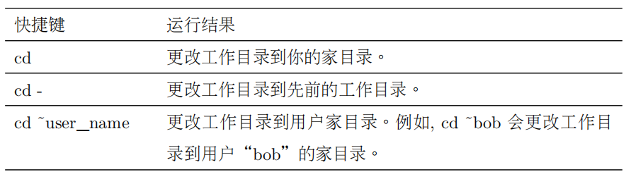

# 使用随记


**Ubuntu apt** **常用命令**

列出所有可更新的软件清单命令：**sudo apt update**

升级软件包：**sudo apt upgrade**

列出可更新的软件包及版本信息：**apt list --upgradeable**

升级软件包，升级前先删除需要更新软件包：**sudo apt full-upgrade**

安装指定的软件命令：**sudo apt install <package_name>**

安装多个软件包：**sudo apt install <package1> <package2> <package_3>**

更新指定的软件命令：**sudo apt update <package_name>**

显示软件包具体信息, 例如：版本号，安装大小，依赖关系等等：**sudo apt**

**show <package_name>**

删除软件包命令：**sudo apt remove <package_name>**

清理不再使用的依赖和库文件: **sudo apt autoremove**

移除软件包及配置文件: **sudo apt purge <package_name>**

查找软件包命令：**sudo apt search**

列出所有已安装的包：**apt list --installed**

列出所有已安装的包的版本信息：**apt list --all-versions**

# **1** **|** 引言

## **1.1** 为什么使用命令行

现在，大多数的计算机用户只是熟悉图形用户界面（GUI），命令行界面（CLI）是过去使用的一种很恐怖的东西。

这本书共分为五部分，每一部分讲述了不同方面的命令行知识。除了第一部分，也就是你正在阅读的这一部分，这本书还包括：

• 第二部分—学习 shell 开始探究命令行基本语言，包括命令组成结构，文件系统浏览，编写命令行，查找命令帮助文档。

• 第三部分—配置文件及环境讲述了如何编写配置文件，通过配置文件，用命令行来操控计算机。

• 第四部分—常见任务及主要工具探究了许多命令行经常执行的普通任务。类似于 Unix 的操作系统，例如 Linux, 包括许多经典的命令行程序，这些程序可以用来对数据进行强大的操作。

• 第五部分—编写 Shell 脚本介绍了 shell 编程，一个无可否认的基本技能，能够自动化许多常见的计算任务，很容易学。通过学习 shell 编程，你会逐渐熟悉一些关于编程语言方面的概念，这些概念也适用于其他的编程语言。

从技术层面讲，Linux 只是操作系统的内核名字，没别的含义。当然内核非常重要，因为有它，操作系统才能运行起来，但它并不能构成一个完备的操作系统。

# **2** **|** 什么是 **shell**

一说到命令行，我们真正指的是 shell。**shell 就是一个程序**，它**接受从键盘输入的命令**，然后把命令传递给操作系统去执行。几乎所有的 Linux 发行版都提供一个**名为 bash 的来自 GNU项目的 shell 程序**。**“bash”是“Bourne Again SHell”的首字母缩写**，所指的是这样一个事实，bash 是最初 Unix 上由 Steve Bourne 写成 shell 程序 **sh 的增强版**。

## **2.1** 终端仿真器

当**使用图形用户界面时**，我们需要另一个**和 shell 交互的叫做终端仿真器的程序**。如果我们浏览一下桌面菜单，可能会找到一个。虽然在菜单里它可能都被简单地称为**“terminal”**，但是 KDE用的是 konsole , 而 GNOME 则使用 gnome-terminal。还有其他一些终端仿真器可供 Linux 使用，但基本上，它们都完成同样的事情，让我们能访问 shell。也许，你可能会因为附加的一系列花俏功能而喜欢上某个终端。

## **2.2** 第一次按键

好，开始吧。启动终端仿真器！一旦它运行起来，我们应该看到一行像这样的文字：

```bash
[me@linuxbox ~]$
```

这叫做 **shell 提示符**，无论何时当 shell 准备好了去接受输入时，它就会出现。然而，它可能会以各种各样的面孔显示，这则取决于不同的 Linux 发行版，它通常**包括你的用户名 @ 主机名**，**紧接着当前工作目录（稍后会有更多介绍）和一个美元符号**。如果提示符的最后一个字符**是“#”, 而不是“$”**, 那么这个终端会话就有**超级用户权限**。

这意味着，我们或者是**以 root 用户的身份登录**，或者是我们选择的终端仿真器提供超级用户（管理员）权限。

## **2.3** 命令历史

如果按下上箭头按键，我们会看到刚才输入的命令“kaekfjaeifj”重新出现在提示符之后。这就

叫做命令历史。许多 Linux 发行版默认保存最后输入的 500 个命令。

## **2.4** 移动光标

可借助**上箭头按键**，来获得**上次输入**的命令。现在试着使用左右箭头按键。看一下怎样把光标定位到命令行的任意位置？通过使用箭头按键，使编辑命令变得轻松些。

## **2.5** 关于鼠标和光标

虽然，shell 是和键盘打交道的，但你也**可以在终端仿真器里使用鼠标**。X 窗口系统（使 GUI工作的底层引擎）内建了一种机制，支持**快速拷贝和粘贴**技巧。

**注意：不要在一个终端窗口里使用 Ctrl-c 和 Ctrl-v 快捷键**来执行拷贝和粘贴操作。它们不起作用。对于 shell 来说，这两个控**制代码有着不同的含义**，它们在早于 Microsoft Windows（定义复制粘贴的含义）许多年之前就赋予了不同的意义。

你的图形桌面环境（像 KDE 或 GNOME），努力想和 Windows 一样，可能会把它的聚焦策略设置成“单击聚焦”。这意味着，为了**让窗口聚焦（变成活动窗口）你需要单击**它。这与“**聚焦跟随着鼠标**”的**传统 X 行为**不同，传统 X 行为是指只要把鼠标移动到一个窗口的上方。它能接受输入，但是直到你单击窗口之前它都**不会成为前端窗口**。设置聚焦策略为**“聚焦跟随着**

**鼠标”，可以使拷贝和粘贴更方便易用**。尝试一下。我想如果你试了一下你会喜欢上它的。你能在窗口管理器的配置程序中找到这个设置。

## 试试运行一些简单命令

现在，我们学习了怎样输入命令，那我们执行一些简单的命令吧。第一个命令是 date。这个命令显示系统当前时间和日期。

```bash
[me@linuxbox ~]$ date
Thu Oct 25 13:51:54 EDT 2007
```

一个相关联的命令，cal，它默认显示当前月份的日历

```bash
[me@linuxbox ~]$ cal
October 2007
Su Mo Tu We Th Fr Sa
1 2 3 4 5 6
7 8 9 10 11 12 13
14 15 16 17 18 19 20
21 22 23 24 25 26 27
28 29 30 31
```

查看磁盘剩余空间的数量，输入 df:

```bash
[me@linuxbox ~]$ df
Filesystem 1K-blocks Used Available Use% Mounted on
/dev/sda2 15115452 5012392 9949716 34% /
/dev/sda5 59631908 26545424 30008432 47% /home
/dev/sda1 147764 17370 122765 13% /boot
tmpfs 256856 0 256856 0% /dev/shm
```

同样地，显示空闲内存的数量，输入命令 free。

```bash
[me@linuxbox ~]$ free
total used free shared buffers cached
Mem: 2059676 846456 1213220 0
44028 360568
-/+ buffers/cache: 441860 1617816
Swap: 1042428 0 1042428
```

## 结束终端会话

我们可以通过关闭终端仿真器窗口，或者是在 shell 提示符下输入 exit 命令来终止一个终端会话:

```bash
[me@linuxbox ~]$ exit
```

# **3** **|** 文件系统中跳转

• pwd —打印出当前工作目录名

• cd —更改目录

• ls —列出目录内容

## 理解文件系统树

 Linux总是只有一个**单一的文件系统树**，**不管有多少个磁盘**或者存储设备连接

到计算机上。根据负责维护系统安全的系统管理员的兴致，**存储设备连接**到（或着更精确些，是挂载到）**目录树的各个节点**上。

我们所在的目录则称为当前工作目录。我们使用 **pwd（print working directory(的缩写)）**命令，来显示当前工作目录。

```bash
[me@linuxbox ~]$ pwd
/home/me
```

当我们首次登录系统（或者启动终端仿真器会话）后，当前工作目录是我们的家目录。每个用户都有他自己的家目录，当用户以普通用户的身份操控系统时，家目录是唯一允许用户写入文件的地方。

## 列出目录内容

列出一个目录包含的文件及子目录，使用 ls 命令。

## 更改当前工作目录

要更改工作目录（此刻，我们站在树形迷宫里面），我们用 cd 命令。输入 cd, 然后输入你想要

去的工作目录的路径名。路径名就是沿着目录树的分支到达想要的目录期间所经过的路线。路

径名可通过两种方式来指定，一种是绝对路径，另一种是相对路径。

## 绝对路径

系统中有一个目录，大多数系统程序都安装在这个目录下。这个目录的路径名是 /usr/bin。它意味着**从根目录（用开头的“/“表示）开始**，有一个叫”usr” 的目录包含了目录 “bin”。

## 相对路径

在**文件系统树中用一对特殊符号来表示相对位置**。这对特殊符号是 “.” (点)和 “..” (点点)。符号 **“.” 指的是工作目录**，**”..” 指的是工作目录的父目录**。

更改工作目录到 /usr/bin 的父目录 /usr,使用相对路径:

```bash
[me@linuxbox bin]$ cd ..
[me@linuxbox usr]$ pwd
/usr
```

在几乎所有的情况下，可以**省略 “./”。它是隐含的。**

## 有用的快捷键



## 关于文件名的重要规则

1. 以 “.” 字符开头的文件名是**隐藏文件**。这仅表示，ls 命令不能列出它们，用 **ls-a** 命令就可以了。当你创建帐号后，几个配置帐号的隐藏文件被放置在你的家目录下。稍后，我们会仔细研究一些隐藏文件，来定制你的系统环境。另外，一些应用程序也会把它们的配置文件以隐藏文件的形式放在你的家目录下面。

2. 文件名和命令名是**大小写敏感**的。文件名“File1”和“file1”是指两个不同的

文件名。

   3.Linux 没有“文件扩展名”的概念，不像其它一些系统。可以用你**喜欢的任何**

**名字**来给文件起名。文件内容或用途由其它方法来决定。虽然类 Unix 的操作

系统，不用文件扩展名来决定文件的内容或用途，但是有些应用程序会。

4. 虽然 Linux 支持长文件名，文件名可能包含空格，标点符号，但标点符号仅限使用“.”，“－”，下划线。最重要的是，**不要在文件名中使用空格**。如果你想表示词与词间的空格，**用下划线**字符来代替。过些时候，你会感激自己这样做。
