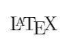
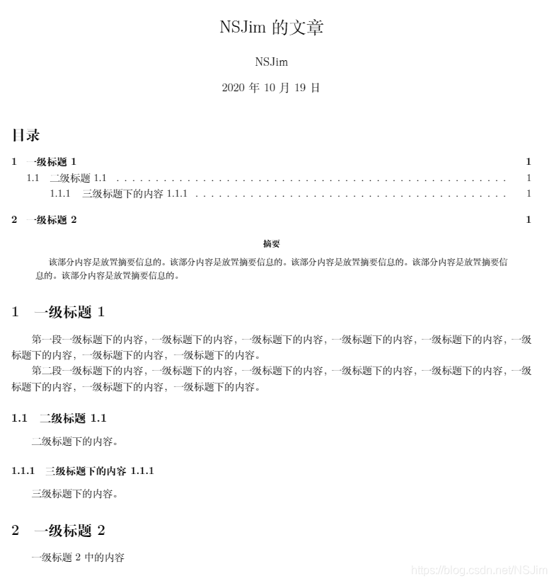
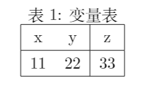
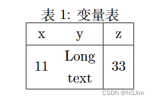

# LATEX

## 常用latex公式

-  $\frac{\partial y}{\partial x}$:\frac{\partial y}{\partial x} **偏导**

- $f(x) = \sum_{k=0}^{\infty} a_k x^k$ : f(x) = \sum_{k=0}^{\infty} a_k x^k **求和**

- $\operatorname{vec}(A) = [a_{11}, a_{21}, ..., a_{n1}, a_{12}, ..., a_{nn}]^T$:\operatorname{vec}(A) = [a_{11}, a_{21}, ..., a_{n1}, a_{12}, ..., a_{nn}]^T 行向量转置

- $$
	\begin{bmatrix}
	\frac{\partial f}{\partial x_1} \\
	\frac{\partial f}{\partial x_2} \\
	\vdots \\
	\frac{\partial f}{\partial x_n}
	\end{bmatrix}
	$$

- 

## 在vscode中的使用

## ps:

- **点击下图 1 处打开 json 文件，进入代码设置页面**


-  **新建latex文件,需新建.tex格式文件,Alt+B编译,涉及参考文献的引用（.bib的编译）时选择`xelatex -> bibtex -> xelatex*2`编译链,Ctrl+Alt+V展示,Ctrl+Alt+J定位所选代码在pdf显示处,双击pdf定位对应代码**

## LaTeX配置代码解读

```json
"latex-workshop.latex.autoBuild.run": "never"
```

设置何时使用默认的(第一个)编译链自动构建 LaTeX 项目，即什么时候自动进行代码的编译。有三个选项：

1. **onFileChange**：在检测任何依赖项中的文件更改(甚至被其他应用程序修改)时构建项目，即当检测到代码被更改时就自动编译tex文件；
2. **onSave** : 当代码被保存时自动编译文件；
3. **never**: 从不自动编译，即需编写者手动编译文档

此项笔者设置为**never**。

```json
"latex-workshop.showContextMenu": true
```

启用上下文LaTeX菜单。此菜单默认状态下停用，即变量设置为**false**，因为它可以通过新的 LaTeX 标记使用（新的 LaTeX 标记能够编译文档，将在下文提及）。只需将此变量设置为**true**即可恢复菜单。即此命令设置是否将编译文档的选项出现在鼠标右键的菜单中。

下两图展示两者区别，第一幅图为设置**false**情况，第二幅图为设置**true**情况。可以看到的是，设置为**true**时，菜单中多了两个选项，其中多出来的第一个选项为进行tex文件的编译，而第二个选项为进行正向同步，即从代码定位到编译出来的 pdf 文件相应位置，下文会进行提及。


笔者觉得菜单多了此选项较方便，故此项笔者设置为**true**

```json
"latex-workshop.intellisense.package.enabled": true
```

设置为**true**，则该拓展能够从使用的宏包中自动提取命令和环境，从而补全正在编写的代码。

```json
"latex-workshop.message.error.show"  : false,
"latex-workshop.message.warning.show": false
```

这两个命令是设置当文档编译错误时是否弹出显示出错和警告的弹窗。因为这些错误和警告信息能够从终端中获取，且弹窗弹出比较烦人，故而笔者设置均设置为**false**。

```json
"latex-workshop.latex.tools": [
        {
            "name": "xelatex",
            "command": "xelatex",
            "args": [
                "-synctex=1",
                "-interaction=nonstopmode",
                "-file-line-error",
                "%DOCFILE%"
            ]
        },
        {
            "name": "pdflatex",
            "command": "pdflatex",
            "args": [
                "-synctex=1",
                "-interaction=nonstopmode",
                "-file-line-error",
                "%DOCFILE%"
            ]
        },
        {
            "name": "latexmk",
            "command": "latexmk",
            "args": [
                "-synctex=1",
                "-interaction=nonstopmode",
                "-file-line-error",
                "-pdf",
                "-outdir=%OUTDIR%",
                "%DOCFILE%"
            ]
        },
        {!
            "name": "bibtex",
            "command": "bibtex",
            "args": [
                "%DOCFILE%"
            ]
        }
    ]
```

这些代码是定义在下文 recipes 编译链中被使用的编译命令，此处为默认配置，不需要进行更改。其中的`name`为这些命令的标签，用作下文 recipes 的引用；而`command`为在该拓展中的编译方式。

可以更改的代码为，将编译方式: pdflatex 、 xelatex 和 latexmk 中的`%DOCFILE`更改为`%DOC`。`%DOCFILE`表明编译器访问没有扩展名的根文件名，而`%DOC`表明编译器访问的是没有扩展名的根文件完整路径。这就意味着，使用`%DOCFILE`可以将文件所在路径设置为中文，但笔者不建议这么做，因为毕竟涉及到代码，当其余编译器引用时该 tex 文件仍需要根文件完整路径，且需要为英文路径。笔者此处设置为`%DOCFILE`仅是因为之前使用 TeXstudio，导致路径已经是中文了。

```json
"latex-workshop.latex.recipes": [
        {
            "name": "XeLaTeX",
            "tools": [
                "xelatex"
            ]
        },
        {
            "name": "PDFLaTeX",
            "tools": [
                "pdflatex"
            ]
        },
        {
            "name": "BibTeX",
            "tools": [
                "bibtex"
            ]
        },
        {
            "name": "LaTeXmk",
            "tools": [
                "latexmk"
            ]
        },
        {
            "name": "xelatex -> bibtex -> xelatex*2",
            "tools": [
                "xelatex",
                "bibtex",
                "xelatex",
                "xelatex"
            ]
        },
        {
            "name": "pdflatex -> bibtex -> pdflatex*2",
            "tools": [
                "pdflatex",
                "bibtex",
                "pdflatex",
                "pdflatex"
            ]
        }
    ]
```

此串代码是对编译链进行定义，其中`name`是标签，也就是出现在工具栏中的链名称；`tool`是`name`标签所对应的编译顺序，其内部编译命令来自上文`latex-workshop.latex.recipes`中内容。

定义完成后，能够在 vscode 编译器中能够看到的编译顺序，具体看下图：


可以看到的是，在编译链中定义的命令出现在了vscode右侧的工具栏中。

**注 8 ：PDFLaTeX** 编译模式与 **XeLaTeX** 区别如下：

> 1. PDFLaTeX 使用的是TeX的标准字体，所以生成PDF时，会将所有的非 TeX 标准字体进行替换，其生成的 PDF 文件默认嵌入所有字体；而使用 XeLaTeX 编译，如果说论文中有很多图片或者其他元素没有嵌入字体的话，生成的 PDF 文件也会有些字体没有嵌入。
>
> 
>
> 2. XeLaTeX 对应的 XeTeX 对字体的支持更好，允许用户使用操作系统字体来代替 TeX 的标准字体，而且对非拉丁字体的支持更好。
>
> 
>
> 3. PDFLaTeX 进行编译的速度比 XeLaTeX 速度快。

**注 9 ：** 编译链的存在是为了更方便编译，因为如果涉及到**.bib**文件，就需要进行多次不同命令的转换编译，比较麻烦，而编译链就解决了这个问题。

```json
"latex-workshop.latex.clean.fileTypes": [
        "*.aux",
        "*.bbl",
        "*.blg",
        "*.idx",
        "*.ind",
        "*.lof",
        "*.lot",
        "*.out",
        "*.toc",
        "*.acn",
        "*.acr",
        "*.alg",
        "*.glg",
        "*.glo",
        "*.gls",
        "*.ist",
        "*.fls",
        "*.log",
        "*.fdb_latexmk"
    ]
```

这串命令则是设置编译完成后要清除掉的辅助文件类型，若无特殊需求，无需进行更改。

```json
"latex-workshop.latex.autoClean.run": "onFailed"
```

这条命令是设置什么时候对上文设置的辅助文件进行清除。其变量有

1. **onBuilt** : 无论是否编译成功，都选择清除辅助文件；
2. **onFailed** : 当编译失败时，清除辅助文件；
3. **never** : 无论何时，都不清除辅助文件。

由于 tex 文档编译有时需要用到辅助文件，比如编译目录和编译参考文献时，如果使用`onBuilt`命令，则会导致编译不出完整结果甚至编译失败；

而有时候将 tex 文件修改后进行编译时，可能会导致 pdf 文件没有正常更新的情况，这个时候可能就是由于辅助文件没有进行及时更新的缘故，需要清除辅助文件了，而`never`命令做不到这一点；

故而笔者使用了`onFailed`，同时解决了上述两个问题。

```json
"latex-workshop.latex.recipe.default": "lastUsed"
```

该命令的作用为设置 vscode 编译 tex 文档时的默认编译链。有两个变量： 1. **first** : 使用`latex-workshop.latex.recipes`中的第一条编译链，故而您可以根据自己的需要更改编译链顺序； 2. **lastUsed** : 使用最近一次编译所用的编译链。

笔者选择使用**lastUsed**。

```json
"latex-workshop.view.pdf.internal.synctex.keybinding": "double-click"
```

用于反向同步（即从编译出的 pdf 文件指定位置跳转到 tex 文件中相应代码所在位置）的内部查看器的快捷键绑定。变量有两种：

1. **ctrl-click** ： 为默认选项，使用Ctrl/cmd+鼠标左键单击
2. **double-click** : 使用鼠标左键双击

此处笔者使用的为**double-click**。

## 7 tex文件编译

## 7.1 tex测试文件下载([Ali-loner/Ali-loner.github.io: Ali-loner的个人主页](https://github.com/Ali-loner/Ali-loner.github.io))

为了测试 vscode 功能是否比较完整，笔者编写了一份简单的 tex 文件，以此测试其是否支持中英文，能否编译目录，能否插入图片，能否进行引用，能否编译参考文献（编译bixtex文件）等功能。

**下载步骤**如图：


**注 10 ：** 若因网络原因无法连接到github导致无法下载，可以使用自己的tex文件进行测试，或者复制以下代码进行文档的简单编译测试，但其只能测试一部分功能：

```tex
\documentclass[a4paper]{article}
\usepackage[margin=1in]{geometry} % 设置边距，符合Word设定
\usepackage{ctex}
\usepackage{lipsum}
\title{\heiti\zihao{2} This is a test for vscode}
\author{\songti Ali-loner}
\date{2020.08.02}
\begin{document}
    \maketitle
\begin{abstract}
    \lipsum[2]
\end{abstract}
\tableofcontents
\section{This is a section}
Hello world! 你好，世界 ！
\end{document}
```

## 7.2 tex 测试文件编译

**① 打开测试文件所在文件夹**


**② 点击选中 tex 文件**，进行文件内容查看


**③ 开始编译文件。** 由于进行测试的文件中涉及参考文献的引用（**.bib**的编译），故而选择`xelatex -> bibtex -> xelatex*2`编译链。


**注 11 ：**为了更方便进行编译，可对其设置快捷键，设置快捷键步骤如下：


笔者将快捷键设置为**Alt+B**。

**选中tex文件的代码页面**（若未选中，则无法进行编译），然后按下该快捷键，在编辑器页面上端进行编译链选择，如下图：


**④ 编译成功**

当发现页面下方出现 **√** 符号时，说明编译成功，相反，如果出现 **×** 符号，说明编译失败，就要找失败原因了。

**a.** 左侧工具栏

当编译成功后，选中 tex 文件中任意的代码，以此来选中 tex 文件，然后进行图示操作。其中侧边栏所展现的就是上文提及的新的 LaTeX 标记。


**b.** 快捷键

选中 tex 文件中任意的代码，然后按**Ctrl+Alt+V**，出现编译好的 pdf 页面。该快捷键为默认设置。若您想要更改，可以根据上文进行配置。


注意到，现在编译的结果为内部查看器查看。

**⑤ 正向同步测试**，即从代码定位到 pdf 页面相应位置。有以下三种方法：

**a.** 使用侧边工具栏


**b.** 使用右键菜单


**c.** 使用快捷键

选中需要跳转的代码所在行，按Ctrl+Alt+J，右侧就会跳转到相应行。这里的快捷键为默认设置，可自行通过上文方式设置为您想要的快捷键。

**⑥ 反向同步测试**,即从 pdf 页面定位到代码相应位置

在编译生成的 pdf 上，选中想要跳转行，鼠标**左键双击**或**ctrl+鼠标左键单击**，跳转到对应代码。此处快捷键的选择为上文设置，若使用笔者的代码，则为**鼠标左键双击**。


## 8.2 使用SumatraPDF查看的代码配置

### 8.2.1 代码展示

```json
{
    "latex-workshop.view.pdf.viewer": "external",
    "latex-workshop.view.pdf.ref.viewer":"auto",
    "latex-workshop.view.pdf.external.viewer.command": "F:/SumatraPDF/SumatraPDF.exe", // 注意修改路径
    "latex-workshop.view.pdf.external.viewer.args": [
        "%PDF%"
    ],
    "latex-workshop.view.pdf.external.synctex.command": "F:/SumatraPDF/SumatraPDF.exe", // 注意修改路径
    "latex-workshop.view.pdf.external.synctex.args": [
        "-forward-search",
        "%TEX%",
        "%LINE%",
        "-reuse-instance",
        "-inverse-search",
        "\"F:/Microsoft VS Code/Code.exe\" \"F:/Microsoft VS Code/resources/app/out/cli.js\" -r -g \"%f:%l\"", // 注意修改路径
        "%PDF%"
    ]
}
```

此代码仅为展示所用，让您进行查看，为下文解读之用。如需写入到 json 文件内，可直接完整复制文末笔者的个人配置到自己的编译器内。

### 8.2.2 代码解读

```json
"latex-workshop.view.pdf.viewer": "external"
```

设置默认的pdf查看器，有三种变量参数：

1. **tab** : 使用 vscode 内置 pdf 查看器；
2. **browser** : 使用电脑默认浏览器进行 pdf 查看；
3. **external** : 使用外部 pdf 查看器查看。

此处选择 **external** 参数，使用外部查看器。

**注 12 ：** 此参数为下文进行pdf内部查看和外部查看进行切换的关键参数。

```json
"latex-workshop.view.pdf.ref.viewer":"auto"
```

设置PDF查看器用于在 **\ref** 命令上的[View on PDF]链接，此命令作用于 **\ref** 引用查看。有三个参数变量：

1. **auto** : 由编辑器根据情况自动设置；
2. **tabOrBrowser** : 使用vscode内置pdf查看器或使用电脑默认浏览器进行pdf查看；
3. **external** : 使用外部pdf查看器查看。

此处设置为**auto**。

```json
"latex-workshop.view.pdf.external.viewer.command": "F:/SumatraPDF/SumatraPDF.exe"// 注意修改路径
```

使用外部查看器时要执行的命令，设置外部查看器启动文件**SumatraPDF.exe**文件所在位置，此处需要您根据自身情况进行路径更改，正常情况下只需更改磁盘盘符即可。

**请注意**中间为 **" / "** 而不是**" \ "** ，不然会报错。

```json
"latex-workshop.view.pdf.external.viewer.args": [
        "%PDF%"
    ]
```

此代码是设置使用外部查看器时，`latex-workshop.view.pdf.external.view .command`的参数。`%PDF%`是用于生成PDF文件的绝对路径的占位符。

```json
"latex-workshop.view.pdf.external.synctex.command": "F:/SumatraPDF/SumatraPDF.exe" // 注意修改路径
```

此命令是将生成的辅助文件 **.synctex.gz** 转发到外部查看器时要执行的命令,设置其位置参数，您注意更改路径，此路径为 **SumatraPDF.exe** 文件路径。与上文相同。

```json
"latex-workshop.view.pdf.external.synctex.args": [
        "-forward-search",
        "%TEX%",
        "%LINE%",
        "-reuse-instance",
        "-inverse-search",
        "\"F:/Microsoft VS Code/Code.exe\" \"F:/Microsoft VS Code/resources/app/out/cli.js\" -r -g \"%f:%l\"", // 注意修改路径
        "%PDF%"
    ]
```

当 **.synctex.gz** 文件同步到外部查看器时`latex-workshop.view.pdf.external.synctex`的参数设置。`%LINE%`是行号，`%PDF%`是生成PDF文件的绝对路径的占位符，`%TEX%`是当触发syncTeX被触发时，扩展名为 **.tex** 的 LaTeX 文件路径。

上面代码串中记得进行 **Microsoft VS Code** 路径修改，修改如下图:


## 9 SumatraPDF 的使用

将完整代码复制到自己的 json 文件内后，即可使用 SumatraPDF作为自己的 pdf 外部查看器了。以下为具体操作：

① 点击编辑页面任意位置来选中 tex 文件；

② 按Ctrl+Alt+V，打开编译出的 pdf 文件；

③ 出现如下图页面。可以看到的是，原本内嵌输出的 pdf 变为了在 SumatraPDF 上查看，且侧面带有书签：


④ 为了出现和内嵌输出具有相同的效果，可以将 vscode 和 SumatraPDF 进行**分屏**，且根据需要关闭标签，如下图：


⑤ 且同样支持双向同步（正向同步和反向同步），其操作步骤与内嵌输出 pdf 时操作步骤相同，此处就不再赘述。查看效果图：


## 10 pdf 内部查看与外部查看的切换

以下展示由外部查看转为内部查看的操作，由内转外操作相同。

共有两种操作方式：**UI界面设置** 或 **Json界面设置** 。具体见下图：


## LaTeX技巧

### LaTeX

LaTeX编辑器中，内置了一个语句，用来展现LaTeX的Logo，代码和效果如下：

代码：

```latex
\LaTex
```

显示：


**中文支持**
无论是在线工具还是本地工具，LaTeX**默认都是不支持中文**的，因此需要在源代码和配置上稍作修改才可以让LaTeX支持中文，步骤如下：
tex文件编码：utf-8，一般**默认为utf-8编码**，无需修改。
代码开头添加：
方式1（推荐）：添加宏包

```latex
\usepackage[UTF8]{ctex}
```

方式2：设置文档类型

```latex
\documentclass[UTF8]{ctexart}
```

### 首行缩进

#### 进行缩进

若LaTeX默认没有段首缩进，因此要首行缩进需要进行修改。在导言区加入如下代码（距离单位一般为`pt`或`em`，**`pt`是绝对单位；`em`是相对单位**，表示**1个中文字符宽度**；本人比较喜欢`em`）：

```latex
% 使用indentfirst宏包
\usepackage{indentfirst}
% 设置首行缩进距离
\setlength{\parindent}{2em}
```

#### 不进行缩进

若LaTeX已经是段首缩进的，因此要段首不进行缩进需要进行修改。

**方式1（推荐）：** 单段取消缩进，放在段首即可。

```latex
\noindent
```

### 显示下划线

**方法1**
使用转义字符：`\_`

## LaTeX基础

### 导言区与正文区

在**begin{document}和end{document}之间**的就是正文区，而在这**之前的就是导言区**。

### 文档类型

\documentclass{article}是**确定了文档类型为article**，一般LaTeX提供三种基本文档，此外两种是report和book。三者分别用来写小篇幅的文章、中篇幅的报告和长篇幅的书籍。

### 宏包

LaTeX导言区可以**导入各种宏包**，以使用相应宏包的功能，一条语句中可以导入多个宏包，语法如下：

```latex
\usepackage{宏包1, 宏包2}
```

常用的宏包：
**ctex：中文支持**
**amsmath：latex数学公式支持**
**graphicx：插入图片**
**algorithm和algorithmic：算法排版**
**listings：插入代码块**
等等

### 编译器

LaTeX的编译器有pdfLaTeX，LaTeX，XeLaTeX，LuaLaTeX，在设置中可以进行更改。Overleaf默认的编译器为pdfLaTeX，因此要使**其支持中文需要改为XeLaTeX。**

#### 多行注释

方式1（推荐）：

```latex
\iffalse%必要的
注释内容
\fi%必要的
```

要想正确输入英文引号，把左侧的引号用 ` 代替即可，如下：

代码：

```latex
`English'
``English''
```

### 空格

#### LaTeX支持

空格方式	源代码	显示	宽度
quad空格	a \quad b	a b a \quad bab	**1个中文字符**的宽度
qquad空格	a \qquad b	a b a \qquad bab	**2个中文字符**的宽度
大空格	a\ b	a   b a\ ba b	1/3字符宽度

#### LaTeX数学公式支持

除上述空格以外，还支持如下空格：

空格方式	源代码	显示	宽度
中等空格	$a\;b$	a    b a\;bab	2/7字符宽度
小空格	$a\,b$	a   b a\,bab	1/6字符宽度
紧贴	$a\!b$	a  ⁣ b a\!bab	缩进1/6字符宽度
换行
\\\：换行，一般在一行的最后写。
\\\[offset]：换行，并且与下一行的行间距为**原来行间距+offset**，offset**单位一般是em或pt**。

注意：
若要在**表格单元格内换行**，无法使用\\进行换行，需要在**导言区导入\usepackage{makecell}宏包进行换行**，详情见表格章节。

#### 换段

源代码**空一行即可进行换段（推荐）**。
也可以使用**代码\par进行换段**，一般在**一段的最后写。**

#### 新页

使用**\newpage**进行**换页**，一般在**一页的最后写**。

#### 转义字符

写法：\\+字符

用途：当某些特殊字符**与LaTeX语法冲突时**，使用转义字符可以使字符强制显示。

示例：\%，可以显示出百分号，而不是注释的含义；\\_，显示下划线，而不是下标；\\^显示符号本身，而不是上标。

### 可选参数[htbp]

LaTeX插入图片、表格等元素时，第一行后面有一个可选参数[htbp]，例如，\begin{figure}[htbp]。

[htbp]是个可选参数项，允许用户指定图片、表格等元素**被放置的位置**。这一可选参数项可以是下列字母的任意组合。

h(here): 当前位置；将图形放置在 正文文本中给出该图形环境的地方。**如果本页所剩的页面不够， 这一参数将不起作用。**
t(top): 顶部；将图形放置在**页面的顶部。**
b(bottom): 底部；将图形放置在**页面的底部。**
p(page): 浮动页；将图形放置在一只允许有浮动对象的页面上。

注意：在使用这些参数时：

如果在图形环境中没有给出上述任一参数，则缺省为 [tbp]。
给出参数的顺序不会影响到最后的结果。因为在考虑这些参数时LaTeX**总是尝试以 h-t-b-p 的顺序来确定图形的位置**。所以 [hb] 和 [bh] 都以h-b 的顺序来排版。
**给出的参数越多，LaTeX的排版结果就会越好**。[htbp], [tbp], [htp], [tp] 这些组合得到的效果不错，[h]也是常用的选择。文章架构

### 纸张布局

```
% 设置页面的环境,a4纸张大小，左右上下边距信息
\usepackage[a4paper,left=10mm,right=10mm,top=15mm,bottom=15mm]{geometry}
```

### 标题级别

```
\section{一级标题}
\subsection{二级标题} 
\subsubsection{二级标题} 
```

### 标题、作者、时间

注意：`\maketitle`这一行一定要在`\begin{document}`的后面，否则LaTeX会判定为语法错误。

```latex
\documentclass{article} % article 文档
\usepackage[UTF8]{ctex}  % 使用宏包(为了能够显示汉字)
% 设置页面的环境,a4纸张大小，左右上下边距信息
\usepackage[a4paper,left=10mm,right=10mm,top=15mm,bottom=15mm]{geometry}

\title{NSJim的文章}  % 文章标题
\author{NSJim}   % 作者的名称
\date{\today}       % 当天日期

% 正文开始
\begin{document}

\maketitle          % 添加这一句才能够显示标题等信息

% 正文结束
\end{document}
```

### 摘要

在`\maketitle`下添加内容，如下：

```latex
\maketitle          %添加这一句才能够显示标题等信息
%摘要开始部分
\begin{abstract}
该部分内容是放置摘要信息的。该部分内容是放置摘要信息的。该部分内容是放置摘要信息的。该部分内容是放置摘要信息的。该部分内容是放置摘要信息的。
\end{abstract}
```

### 引用、脚注

引用：写在`\begin{quote}`和`\end{quote}`之间。
脚注：在需要添加脚注的文字后添加`\footnote{脚注内容}`即可。

```latex
西游记\footnote{中国古典四大名著之一}小说开头写道：
\begin{quote}
{\kaishu 东胜神洲有一花果山，山顶一石，受日月精华，生出一石猴。之后因为成功闯入水帘洞，被花果山诸猴拜为“美猴王”。}
\end{quote}
```


## 架构

标题设置：**一级标题\section{}**，二级标题\subsection{}，三级标题\subsubsection{}；
段落设置：在一段的**最后添加\par代表一段的结束**；
**目录**设置：在\begin{document}内容中添加：**\tableofcontents**

以下为一个示例：
```latex
\documentclass{article} % article 文档
\usepackage[UTF8]{ctex}  % 使用宏包(为了能够显示汉字)
% 设置页面的环境,a4纸张大小，左右上下边距信息
\usepackage[a4paper,left=10mm,right=10mm,top=15mm,bottom=15mm]{geometry}

\title{NSJim的文章}  % 文章标题
\author{NSJim}   % 作者的名称
\date{\today}       % 当天日期

% 正文开始
\begin{document}

\maketitle          % 添加这一句才能够显示标题等信息

% 生成目录设置
\renewcommand{\contentsname}{目录} %将content转为目录
\tableofcontents

% 摘要开始部分
\begin{abstract}
该部分内容是放置摘要信息的。该部分内容是放置摘要信息的。该部分内容是放置摘要信息的。该部分内容是放置摘要信息的。该部分内容是放置摘要信息的。
\end{abstract}

% 标题开始
\section{一级标题1}
第一段一级标题下的内容，一级标题下的内容，一级标题下的内容，一级标题下的内容，一级标题下的内容，一级标题下的内容，一级标题下的内容，一级标题下的内容。\par
第二段一级标题下的内容，一级标题下的内容，一级标题下的内容，一级标题下的内容，一级标题下的内容，一级标题下的内容，一级标题下的内容，一级标题下的内容。

\subsection{二级标题1.1}
二级标题下的内容。

\subsubsection{三级标题下的内容1.1.1}
三级标题下的内容。

\section{一级标题2}
一级标题2中的内容

% 正文结束
\end{document}

```



## 字体，大小，颜色

### **字体**

使用代码：`{\字体 内容}`（推荐），有时可使用`\字体{内容}`（不推荐，容易出问题）。

```latex
{\songti 宋体}
{\heiti 黑体}
{\fangsong 仿宋}
{\kaishu 楷书}

{\bf 粗体}
{\it 斜体}
{\sl 斜体}

\textbf{粗体}
\textit{斜体}
\textsl{斜体}
```

### **颜色**

需要导入**宏包`\usepackage{xcolor}`**

```latex
\documentclass{article}
\usepackage[UTF8]{ctex}
\usepackage{color,xcolor}

\setlength{\parindent}{0pt}

% 预先定义好的颜色： red, green, blue, white, black, yellow, gray, darkgray, lightgray, brown, cyan, lime, magenta, olive, orange, pink, purple, teal, violet.

% 定义颜色的5种方式
\definecolor{light-gray}{gray}{0.95}    % 1.灰度
\definecolor{orange}{rgb}{1,0.5,0}      % 2.rgb
\definecolor{orange}{RGB}{255,127,0}    % 3.RGB
\definecolor{orange}{HTML}{FF7F00}      % 4.HTML
\definecolor{orange}{cmyk}{0,0.5,1,0}   % 5.cmyk

\begin{document}

% \pagecolor{yellow}          %设置背景色为黄色

% 使用颜色的常用方式
\textcolor{green}{绿色} % textcolor+颜色
\color{orange}{橙色} % color+颜色
\textcolor[rgb]{0,1,0}{绿色} % textcolor+rgb
\color[rgb]{1,0,0}{红色} % color+rgb

% 使用底色
\colorbox{red}{\color{black}红底黑字}
\fcolorbox{red}{green}{红框绿底} % 框色+背景色

\end{document} 

```

## 链接

导入宏包：`\usepackage{url}`
插入超链接：`\url{www.baidu.com}`

## 图片

### 可选参数[htbp]

LaTeX插入图片、表格等元素时，第一行后面有一个可选参数[htbp]，例如，\begin{figure}[htbp]。

[htbp]是个可选参数项，允许用户指定图片、表格等元素被放置的**位置**。

### 单张图片

需要导入**宏包：\usepackage{graphicx}**

例子：
```latex
%开始插入图片
\begin{figure}[htbp] % htbp代表图片插入位置的设置
\centering %图片居中
%添加图片；[]中为可选参数，可以设置图片的宽高；{}中为图片的相对位置
\includegraphics[width=6cm]{image.jpg}
\caption{达尔文游戏} % 图片标题
\label{pic1} % 图片标签
\end{figure}
```

### 多张图片

**并排插入两张图片**
方式1：图片编号增加1
两张图片公用一个大的图题，图片的编号只增加一个。

```latex
\begin{figure}[ht]
\centering
\subfigure[11-1]{               %小图题的名称
\includegraphics[width=4cm]{11-1}}
\hspace{10pt}  %2张图片的水平距离
\subfigure[11-2]{
\includegraphics[width=4cm]{11-2}}
\caption{两张图片公用的图题}
\end{figure}
```

方式2：图片编号增加2
每张图片有自己的图题，这种方法会使LaTeX中图片的编号顺序向后增加。

```latex
\begin{figure}[h]
\begin{minipage}[t]{0.45\linewidth}
\centering
\includegraphics[width=5.5cm,height=3.5cm]{10}
\caption{第一张图片的图题.}
\end{minipage}
\begin{minipage}[t]{0.45\linewidth}        %图片占用一行宽度的45%
\hspace{10pt}
\includegraphics[width=5.5cm,height=3.5cm]{11}
\caption{第二章图片的图题.}
\end{minipage}
\end{figure}
```

**并排插入多张图片**

```latex
\begin{figure}
\centering
{
\includegraphics[width=2.5cm]{10-1}}
\hspace{10pt}    %每张图片水平距离
{
\includegraphics[width=2.5cm]{10-2}}
\hspace{10pt}
{
\includegraphics[width=2.5cm]{10-3}}
\hspace{10pt}
{
\includegraphics[width=2.5cm]{10-4}}
\hspace{10pt}
\caption{并排插入4张图片}
\end{figure}

```

**竖排插入多张图片**

```latex
\begin{figure}[h]
\centering
\subfigure[场景1]{
\begin{minipage}[t]{0.45\textwidth}
\centering
\includegraphics[width=0.8\textwidth]{wolf2} \\
\vspace{10pt} %2张图片的垂直距离
\includegraphics[width=0.8\textwidth]{wolf3}
\end{minipage}
\end{figure}
}
```

表格
技巧：若不想手动输入LaTeX语法生成表格，可以使用**在线生成LaTeX表格的网站**。可以**从Excel里面粘贴或导入**，可以**实现单元格合并**，而且会在合并行或合并列的时候提醒要引入对应的宏包。
网址：https://www.tablesgenerator.com/

当然，也可以使用LaTeX语法生成表格，示例如下：

```latex
\begin{table}[htbp] % htbp代表表格浮动位置
% 表格居中
\centering
% 添加表头
\caption{变量表}
% 创建table环境
\begin{tabular}{|cc|c|} % 3个c代表3列都居中，也可以设置l或r，|代表竖线位置
% 表格的输入
\hline  % 一条水平线
x & y & z \\ % \\为换行符
\hline
11 & 22 & 33 \\
\hline
\end{tabular}
\end{table}

```

显示：


**表格单元格内换行**
需要**使用`\usepackage{makecell}`宏包**。将单元格的内容替换为`\makecell{XX\\XXXX}`，`\makecell{}`中**的`\\`可以在单元格内换行。**

```latex
\begin{table}[htbp] % htbp代表表格浮动位置
\centering
\caption{变量表}
\begin{tabular}{|cc|c|}
\hline
x & y & z \\
\hline
11 & \makecell{Long\\text} & 33 \\
\hline
\end{tabular}
\end{table}
```



## 数学公式

### 公式支持

LaTeX要输入数学公式需要导入宏包`\usepackage{amsmath}`；若要对公式的字体进行修改，还需要引入宏包`\usepackage{amsfonts}`。

### 公式编号

#### 自动编号

使用`\begin{equation}`和`\end{equation}`进行公式输入，要同时使用，且编号不能够修改。
$$
\begin{equation}
a^2+b^2=c^2
\end{equation}
$$

#### 手动编号

在公式末尾使用`\tag{编号}`来实现公式手动编号，大括号内的内容可以自定义。需要使用`\usepackage{amsmath}`宏包，不能写在`$`或`$$`中，会报错。
$$
\begin{equation}
a^2+b^2=c^2
\tag{2}
\end{equation}
$$

## 算法（伪代码）

需要使用`\usepackage{algorithm}`和`\usepackage{algorithmic}`宏包，`if`、`for`等关键字要按照规范书写，如`\IF \ENDIF`。

## 代码块

### 基础用法

使用\usepackage{listings}宏包，并使用\lstset{}进行基础设置，然后使用\begin{lstlisting}[language=xxx]和\end{lstlisting}插入代码块。

基础设置包括行号，不显示字符串空格，代码块边框，不包含颜色等设置，要设置颜色和字体请见下文的高级用法。论文写作

### 模板

论文写作可以使用合适的模板，例如`IEEE`的模板，只需在**文档类型处修改即可**，代码如下：

```latex
\documentclass[conference]{IEEEtran}
```

### 双栏

更改文档的单双栏模式，只需更改文档类型处的选项即可，代码如下：

**单栏**

```latex
\documentclass[onecolumn]{article}
```

### 跨栏图表

在双栏编辑模式下，图片只能在一栏中显示，而且如果图片的宽度超过单栏文本宽度，则只能显示其中一部分，剩下的部分会溢出。

若想在双栏模式下插入跨栏图表可将环境替换为带`*`的`figure`或`table`环境，代码如下：

```latex
\begin{figure*}
……
\end{figure*}
或
\begin{talbe*}
……
\end{table*}
```

### 引用

LaTeX中的公式，图表，参考文献都是自动编号的，添加`\label`语句后可以进行引用，还可以设置引用格式，使用方法如下：

#### 公式引用

需导入`amsmath`宏包，代码为`\usepackage{amsmath}`。

**公式**

```latex
\begin{equation}
z=x+y
\label{eq1}
\end{equation}
```

**引用**

```latex
Eq. (\ref{eq1})
或导入amsmath宏包，使用如下代码（推荐）：
Eq. \eqref{eq1}
```

# bib参考文献引用

## 流程

在论文投稿官方网站上**获取论文LaTeX模板，**其中**包含bib文件**，可对bib文件重命名。
在tex文件中找到bib文件**声明位置**，进行修改，若没有bib文件声明，则添加声明。
在谷歌学术等文献检索网站上检索参考文献，在引用中**复制BibTeX格式的代码**，**粘贴到bib文件的末尾。**
在tex文件中需要引用参考文献的位置使用\cite{BibTexName}语法进行引用，其中BibTeXName为BibTeX代码中的第一行的名称。
