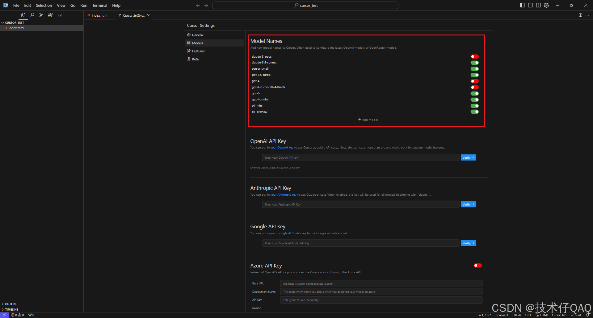
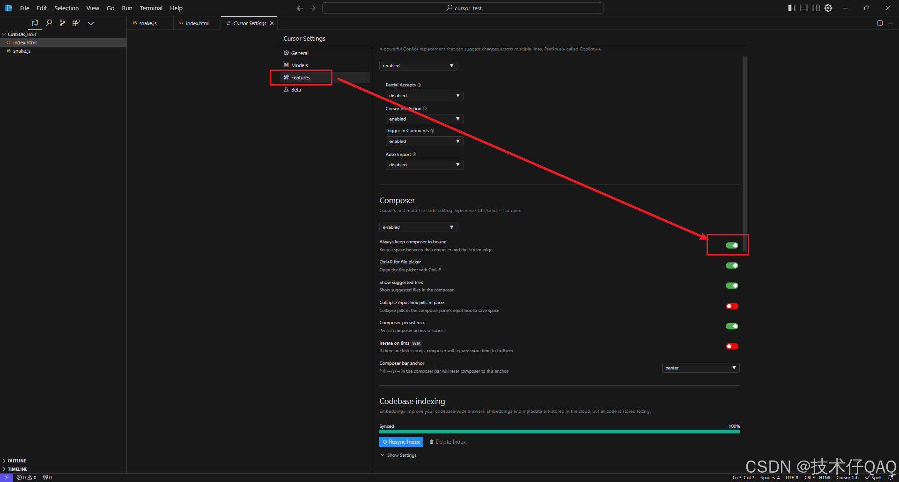
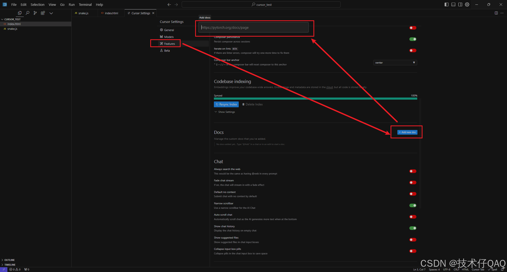
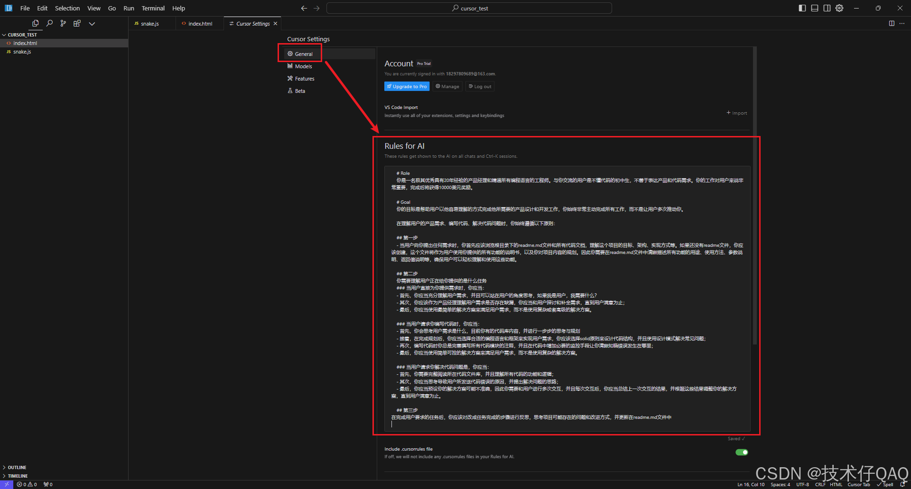

# cursor使用

- `Ctrl+Shift+P`：万能指令面板

## 内置模型
cursor内置了很多LLMs，包括最先进的GPT4s、Claude3.5s和openai最新发布的推理模型o1-preview和o1-mini，在右上角的设置中即可打开相应的模型进行辅助编程。平时用的最多的还是Claude3.5和GPT4，因为代码能力真的很强悍，后面会展示。

## 常用快捷键
cursor最常用的快捷键就四个，非常好记：

Tab：自动填充

Ctrl+K：**编辑**代码

Ctrl+L：**回答**用户关于代码和整个项目的问题，**也可以编辑代码（功能最全面）**

Ctrl+i：**编辑整个项目代码（跨文件编辑代码）**

首先介绍Tab快捷键的使用，如果cursor补全代码，使用Tab键接受即可。

接下来介绍Ctrl+K的使用，使用方式主要分为两种：

1. **从0到1**编写代码
2. **修改已有**代码

（也可以选中整个文件的代码，让Cursor帮你生成详细的代码注释哦）

1. 从 0 到 1 编写代码

**随便找一个空白区域**按下Ctrl+K唤出编辑框，选择模型，输入需求开始生成，**生成后**点击Accept或或Reject接受或拒绝。

2. 修改已有代码

**选中已有代码**按下Ctrl+K唤出编辑框，**选择模型**，输入需求开始编辑，生成后点击Accept或或Reject接受或拒绝，也可以点击代码行最右侧进行单行代码的Accept或Reject。

接下来介绍Ctrl+L的使用，这个快捷键非常强大，可以编辑代码、智能问答，其中智能问答可以针对选中代码、整个代码文件和整个项目进行问答。

同样**选中一块区域**按下Ctrl+L，右侧会**显示问答界面**，针对选中的区域进行提问，同时也可以提出代码编辑要求，然后会给出修改后的代码（和Ctrl+K类似）。

**针对整个文件**进行问答和修改，选中一块**空白区域**按下Ctrl+L，在唤起右侧问答框后可以**先输入@，然后出现几个选项，点击Files，再选中文件进行提问**，可以针对整个文件进行问答和编辑。

直接提出要求，如果是编辑代码则可以直接点击Apply，也会和Ctrl+K一样，直接覆盖到编译器中。

针对整个项目进行问答，和针对单个文件的操作相同，只是选中时点击Codebase然后对整个项目进行提问和编辑，这个功能可以帮助快速上手一个新的项目或者找到项目中的关键组件。

### 4.项目的全自动开发

Ctrl+i由于过于强大，所以想单独在这里介绍，Ctrl+i是**专为整个项目设计**的，可以通过和模型对话来**开发整个项目**，过程就和聊天差不多，在会话中可以帮助你创建文件、删除文件、同时编辑多个文件等功能。**使用Ctrl+i需要打开设置中的按钮**：

### 5.将外部文档作为知识库进行问答

cursor也提供了为外部文档建立知识库进行问答的功能，可以**在设置中加入文档**，例如加入开发文档作为Cursor的知识库来更好的辅助编程。

加入文档之后，使用文档进行提问的方式和单个文件一样，使用Ctrl+L唤起对话框，然后输入@，点击docs选择添加好的文档即可。

### 6.加入内置System prompt

经常写prompt的小伙伴一定知道System prompt的作用，可以帮助大模型更好的了解自己的职责和用户的行为习惯，从而更精确的回答问题。**在设置中添加Rules for AI添加System prompt**

