# Fidder的使用

**一，Fiddler简介**

　　Fiddler是最常用的web调试工具之一，位于客户端和服务器端的**HTTP代理**。因为它能够记录客户端和服务器之间的**所有 HTTP请求**，可以针对特定的HTTP请求，**分析请求数据、设置断点、调试web应用、篡改请求的数据**，甚至可以**修改服务器返回的数据**

注意：

Fiddler 是以**代理web服务器**的形式工作的，它使用**默认代理地址:127.0.0.1，端口:8888**，也就是说**默认监听在安装本机的127.0.0.1::8888**，如果需要抓**局域网内其他机器的包**，需要勾选上 **“Allow remote computersto connect” ，允许远程设备连接，会设置监听为0.0.0.0:8888**

当Fiddler退出的时候它会自动注销，这样就不会影响别的 程序。不过如果Fiddler非正常退出，这时候因为Fiddler没有自动注销，会造成网页无法访问，解决的办法是重新启动下Fiddler。

## 三、fiddler设置

**1.设置HTTPS**

Tools --> Options-->HTTPS

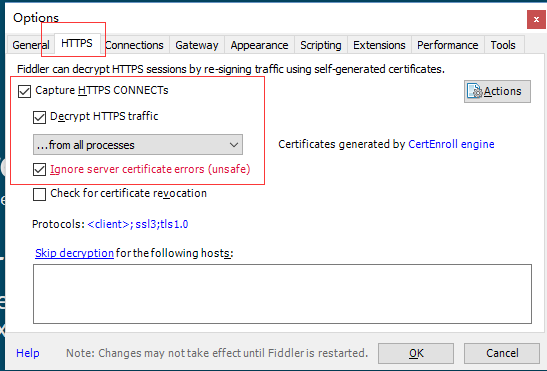

选中"Decrpt HTTPS traffic",    Fiddler就可以**截获HTTPS请求**，第一次会弹出证书安装提示，若没有弹出提示，勾选Actions-> Trust Root Certificate

另外，如果你要监听的程序访问的 HTTPS 站点**使用的是不可信的证书**，则请接着把下面的 “Ignore servercertificate errors” 勾选上。
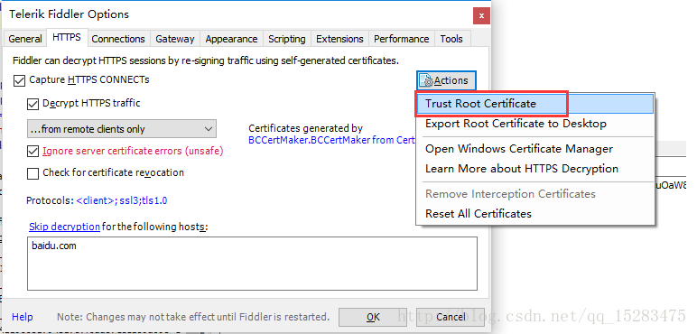

手机上设置代理后，这时候fiddler上抓到的是pc和app所有的请求，如果pc上打开网址，会很多，这时候就需要开启过滤功能了

设置过滤：我们本次是抓取局域网内android的http包，为减少干扰，设置  from remote clients only

from all processes   抓所有的请求 

from browsers only  只抓浏览器的请求 

from non-browsers only  只抓非浏览器的请求 

from remote clients only  只抓远程客户端请求
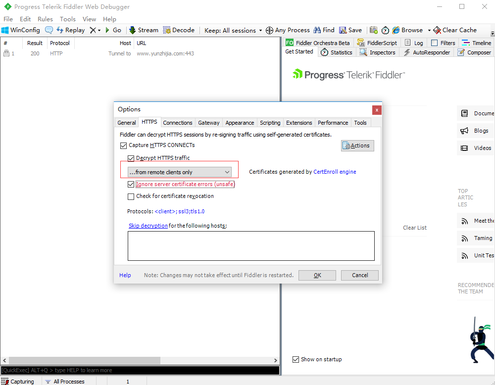

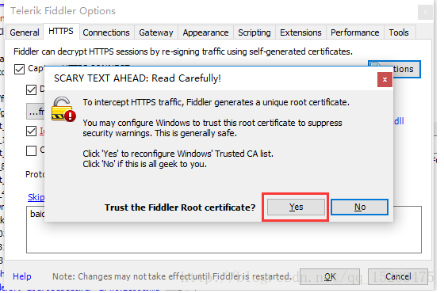

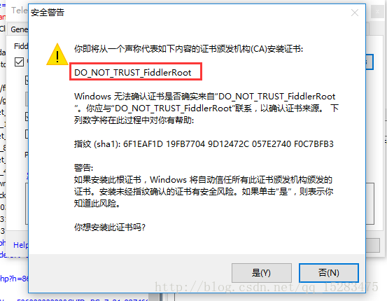

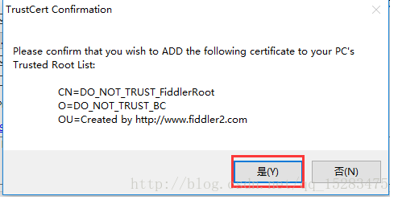

点击确定，这样Fiddler证书就已经添加成功了

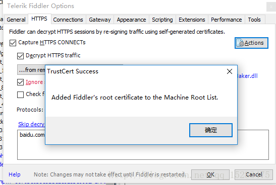

**查看证书，Actions—>open windows certificate Manager**

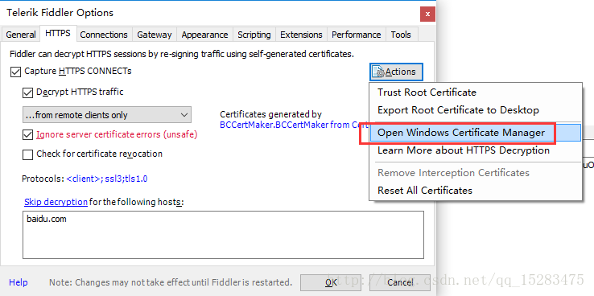

**证书名称就是之前提醒大家留意的 DO_NOT_TRUST_FiddlerRoot**

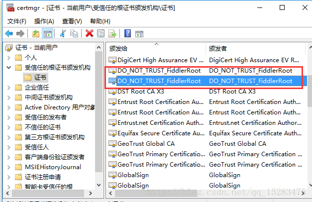

我们本次是抓取局域网内android端的http包，为减少干扰，设置 from remote clients only


**2.设置允许远程连接**

Tools --> Options-->Connections

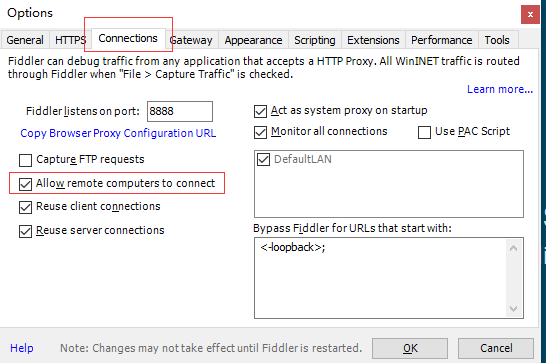

**3. 重启fillder，使得配置生效**

**4. 查看端口监听**

**netstat -ano | findstr "8888"**

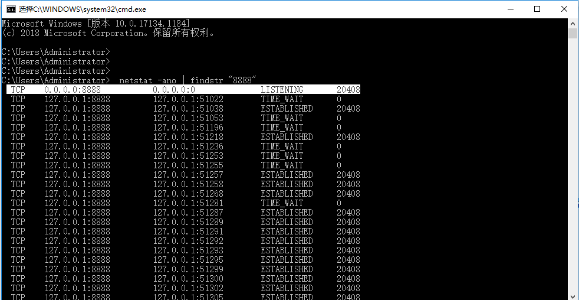

## 四、android端设置

首先查看电脑的 IP 地址，确保手机和电脑在同一个局域网内

win+R，调出cmd窗口

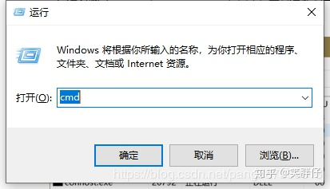

输入ipconfig，IPv4地址即为本机ip

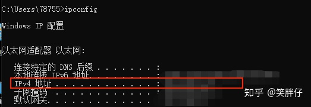

或者可以直接在fiddler上 将鼠标放置于 Online 菜单上，会显示本机IP

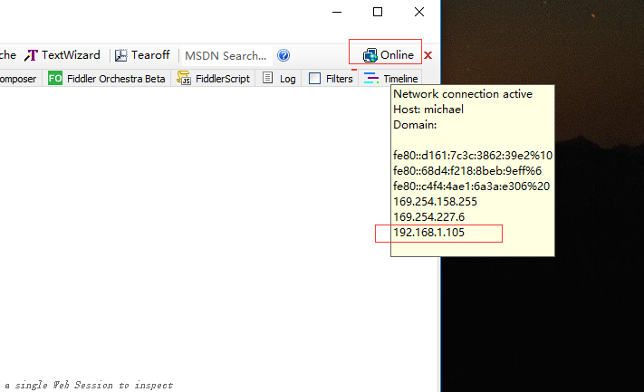

**设置代理**

关闭 4G、5G网络，使用WIFI，使得手机和fiddler在同一局域网

 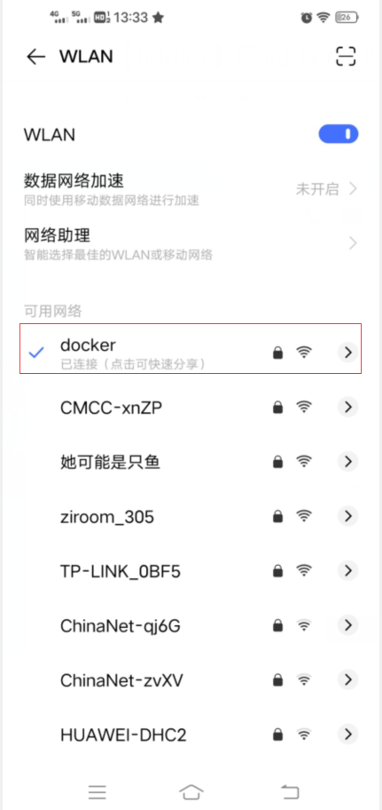

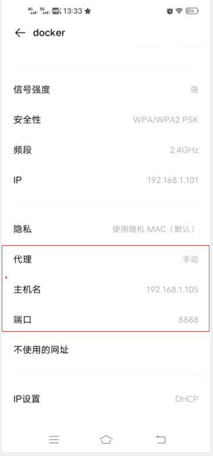

打开手机浏览器，输入ip:端口下载证书，如：192.168.1.105:8888

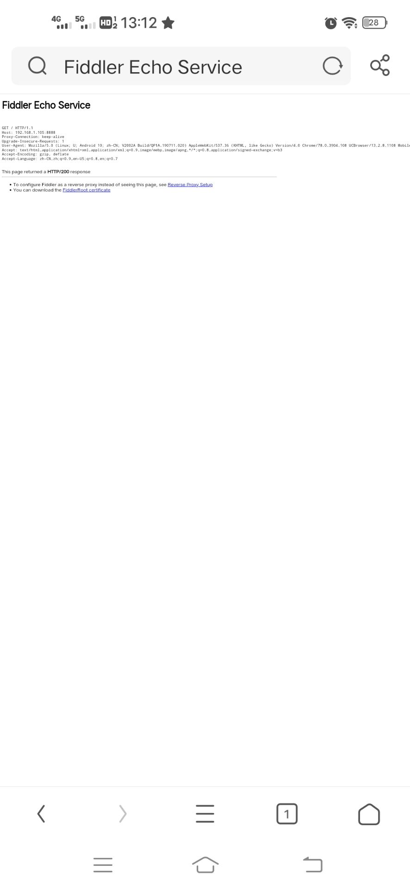

安装证书查看：打开手机设置，搜索“信任”，可以看到“信任的凭据”

 

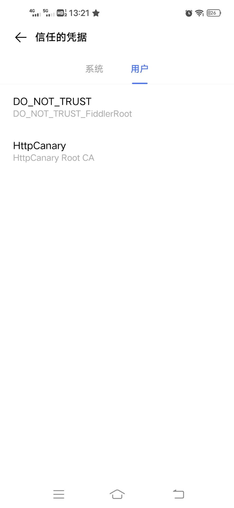

注：每连一台fiddler，fiddler提供的证书都是不一样的，测试完一个场景，记得在证书管理里删除，因为这个证书只对应这台fiddler，没法用于连其他的fiddler。

通过上面基本，**配置就全部结束了**，可以**抓包测试**了，有好几个链接有session_id，选其中一个，**直接点右侧的json**可以很方便的看到自己的session_id了，=号后面的那一长串字母就是。

session_id是自己账户的重要标识，为了安全请注意不要随意外传，自己用用就行了.

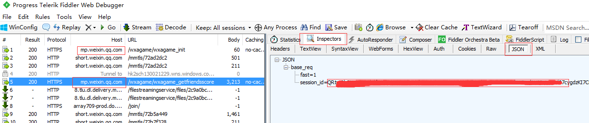

## 五、抓包测试

设置好fiddler

设置好android网络代理

打开android手机被抓包APP

使用fiddler抓包，查看抓包内容

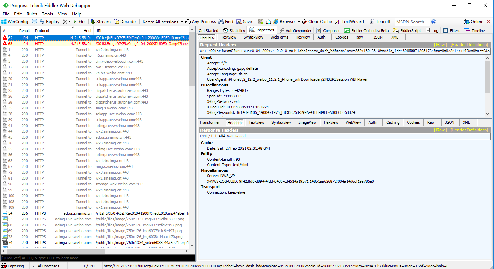

现在我们捋一下：

1. 电脑端安装fiddler，设置端口监听(xx.xx.xx.xx:8888)，设置系统信任fiddler软件证书

2 手机和电脑在同一局域网，手机**关闭4G/5G流量**

3. 手机设置网络代理，指向局域网中fiddler的地址（IP+PORT）

4. 在手机端用浏览器通过 fiddler的地址（xx.xx.xx.xx:8888）下载fiddler证书并安装，注意此证书**仅对此fiddler有效**

5. 抓包测试完毕，记得关闭手机中的代理，**删除手机端安装的fiddler证书**，不然换一个网络环境，手机上网会受影响

 **六，使用fiddler打断点，进行篡改数据**

　　打断点意思是用户在网站上发送一个请求，我们在请求发送过程中进行截取，而这个请求不会发送到服务端，需要我们经过**确认后，才会发送到服务端**

　　在软件右上角选择**规则->自动断点->之前的请求**

　　 开启断点后底部显示一个红色T标识，证明设置断点成功了,此时就会拦截发出去的请求

 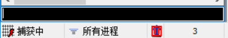

 

 　我们还是用之前登陆来进行测试

　　 我们可以看见网页发送的请求，

　　**双击value里面的数据**我们就可以进行修改。修改完成后我们点击红框中的内容运行到完成。

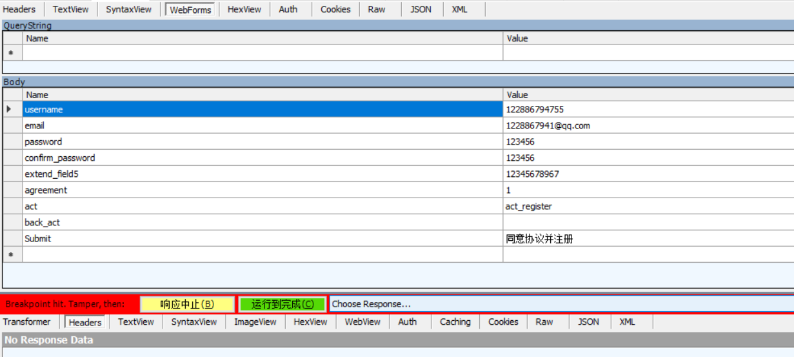

修改request或response的某些数据,有两种方法：

**方法一：临时修改**

fiddler菜单栏->Rules->automatic Breakpoints->选择断点方式，这种方式下设定的断点会对之后的所有HTTP请求有效。有两个断点位置：
(1)before requests：也就是**浏览器发送请求之后**，但是Fiddler代理中转之前，这时可以修改请求的数据。快捷键F11。
(2)after responses：也就是**服务器响应之后**，但是在Fiddler将响应中转给浏览器之前。这时可以修改响应的结果。快捷键ALT+F11。
(3)Disabled：取消断点。快捷键Shift+F11。

或是通过快捷工具按钮，左下角第3个按钮，点击第一次向上的箭头是before requests，再点一次是向下的箭头after responses，再点一次是取消断点。

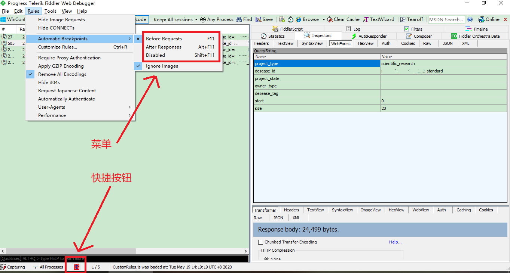

同理，我们也**可以修改返回的数据**。设置好后(after responses)，触发请求，选中，在右侧Inspector下方修改返回数据，这次是在TextView栏，其实下面哪栏都行，只要是显示数据的栏就行，只是显示格式不一致罢了。比如我们可以把count改成10，然后**点击Run to Completion**。

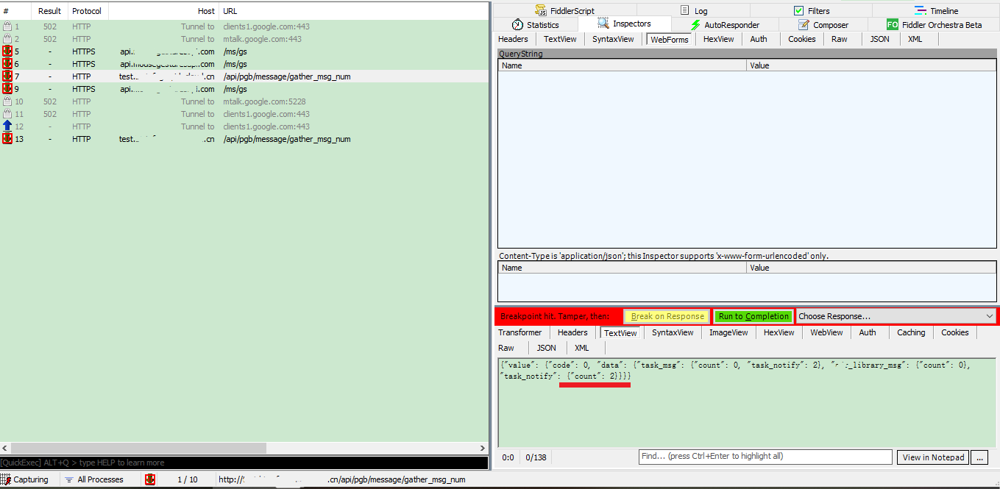

**方法二：永久修改**
fiddler菜单栏->Rules->Customize Rules，打开Fiddler ScriptEditor，搜索OnBeforeRequest
比如上面第一个例子，我要把size从5改成20，代码如下：

if (oSession.fullUrl.Contains("/api/pg/project/list?project_type=scientific")){
oSession.url = oSession.url.Replace("size=5","size=20");
}

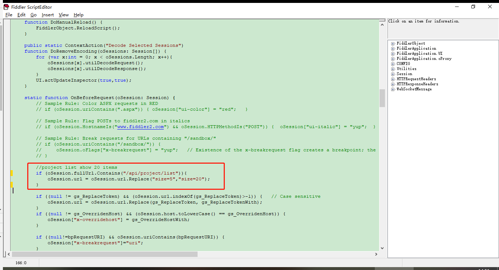

## 二、下断点，拦截并修改请求报文

**全局断点**：单击菜单栏中的 Rules -- Automatic Breakpoint -- Before Requests，会拦截全部请求报文

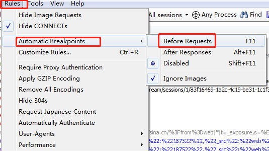

**特定网址断点**：左下角QuickExec 命令行中输入命令“bpu www.baidu com ”后回车，就只会拦截百度页面。（要取消断点，在命令行输入“bpu”后回车即可）

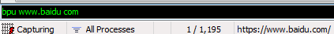

在浏览器地址栏中访问百度网址，浏览器转圈等待响应

fiddler会闪烁提示


对应的session会显示红色的T图标


转到Inspectors页如下所示

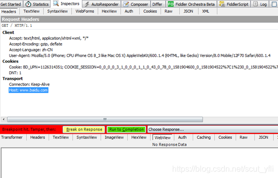

双击Host进行修改，修改成www.qq.com

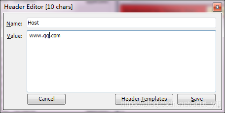

点击Run to Completion放行

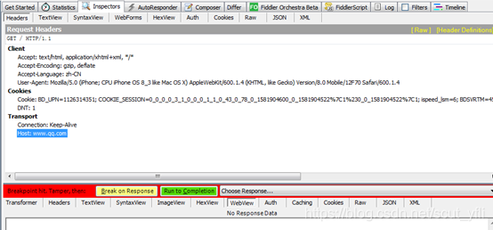

浏览器实际显示了腾讯主页，但地址栏是baidu.com

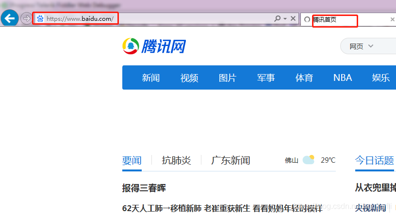

## 三、下断点，拦截并修改响应报文

**全局断点**：单击菜单栏中的 Rules -> Automatic Breakpoint -> After Responses，会拦截全部响应报文

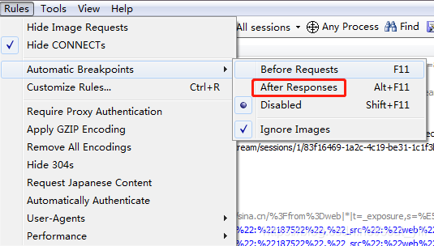

**特定网址断点**：左下角QuickExec 命令行中输入命令“bpafter www.baidu com ”后回车，就只会拦截百度页面。（要取消断点，在命令行输入“bpafter”后回车即可）

在浏览器地址栏中访问百度网址，浏览器转圈等待响应


在响应的TextView中找到<title>标记并修改一下，然后点击Run to Completion放行

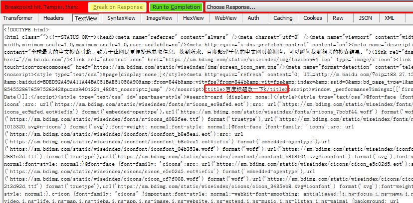

浏览器显示了修改后的标题

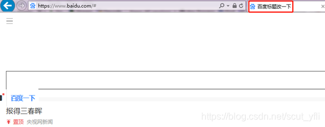

## 四、使用AutoResonder，自动替换网页资源

原百度主页gif图标如下：

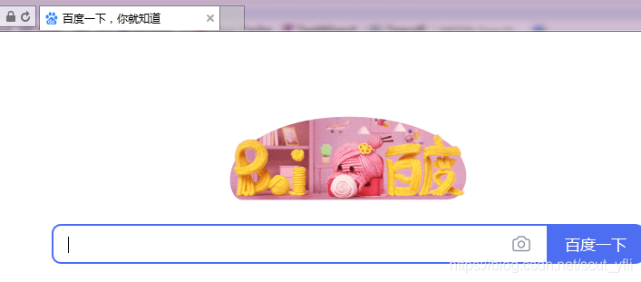

找到gif图标对应的资源文件

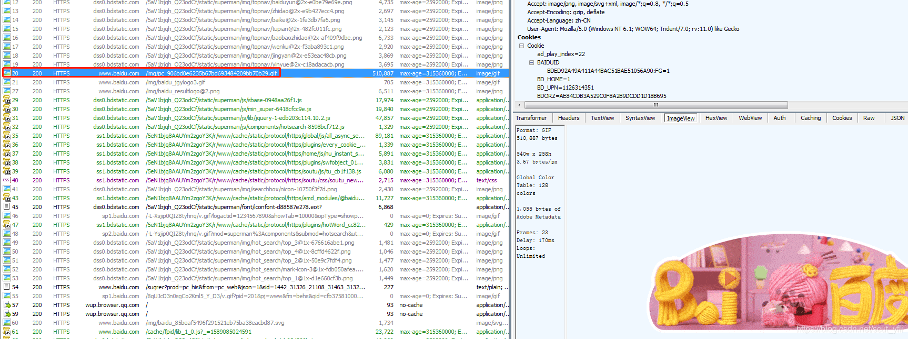

将资源文件拖动到AutoResonder中

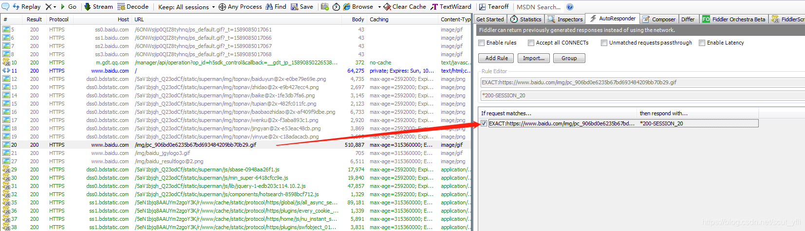

在Rule Editor中通过Find a file替换为一个本地的gif图


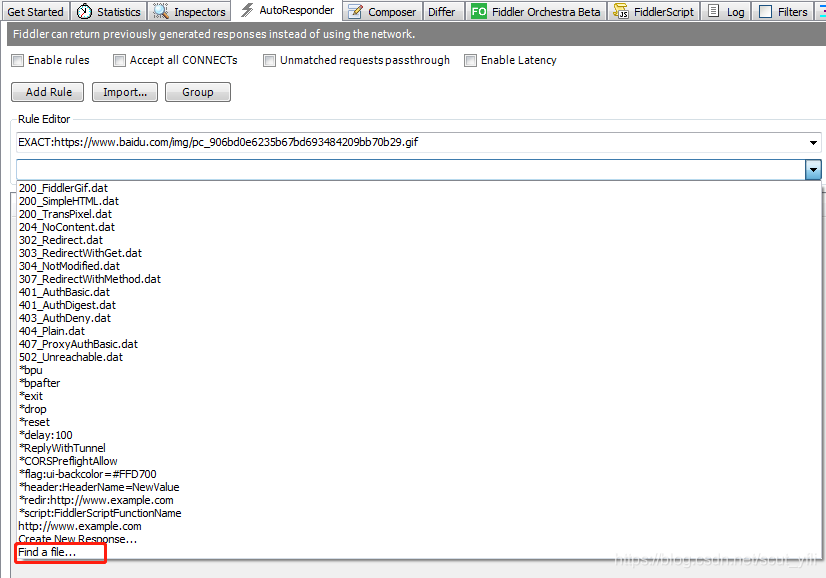

勾选Enable rules生效规则，勾选Unmatched requests passthrough放行不匹配的请求


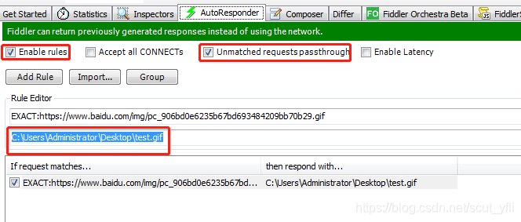

刷新页面，百度主页gif图表已被替换

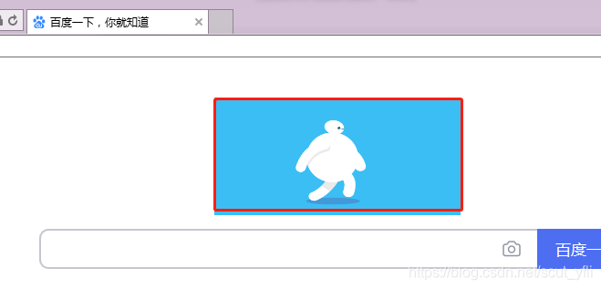

五、使用FiddlerScript，实现自定义修改
Fiddler Script的本质是用JScript.NET编写的一个脚本文件CustomRules.js

通过修改CustomRules.js可以**灵活修改请求报文和响应报文**，也**无需中断**程序。同时也可以利用它针对不同的URL做各种特殊处理。

Fiddler安装时已经自带了Fiddler ScriptEditor，可查看包含的各类变量和方法，十分方便。

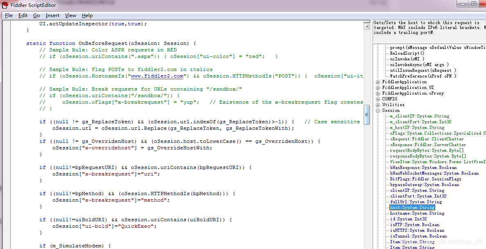

CustomRules.js中的OnBeforeRequest 函数在每次请求之前调用

示例：在OnBeforeRequest 函数中修改Cookie

```js
if (oSession.uriContains("baidu.com"))
 
{
 
         //删除原有cookie
 
         oSession.oRequest.headers.Remove("Cookie");
 
 
         //新建cookie
 
         oSession.oRequest.headers.Add("Cookie","username=testname;testpassword=P@sswordl");
 
 
         //修改Cookie ．不能删除或者编辑单独的 Cookie 需要替换 Cookie 字符串
 
         var oldCookie = oSession.oRequest["Cookie"];
 
         oldCookie = oldCookie.Replace("cookieName=","gnoreme");
 
         oSession.oRequest[" Cookie"] = oldCookie ;
 
 
         //替换新Cookie
 
         var newCookie = "your cookie String";
 
         oSession.oRequest["Cookie"] = newCookie;
 
}
```

CustomRules.js中的OnBeforeResponse 函数在每次响应之前调用

示例：在OnBeforeResponse 函数中修改响应的数据

```js
if (oSession.uriContains（"cnblogs.com"))
 
{
 
        oSession utilReplaceinResponse("csdn"，"csdn 灰哥"）;
 
}
```

# [Fiddler改包的三种方式](https://www.cnblogs.com/diwangguilai/p/13280879.html)

　　fiddler作为一个抓包道理工具，接收从客户端/H5发出的请求，再发给服务器，接收从服务器得到的响应，再发给客户端/H5，过程如下图


　　在工作中，我们经常会碰到这样的问题：客户端限制输入100个字，超过100个就不让输入，但是后台有没有限制这个字段的字数呢？当然我们也可以利用jmeter/postman来模拟请求，但是比较复杂，用fiddler抓包**后直接改包，就**可以，十分便捷。

## 改包的三种方式
1.全局断点，Rules->Automatic Breakpoints->Before requests/After responses 可以打开全局断点，点击Disable可以关闭断点

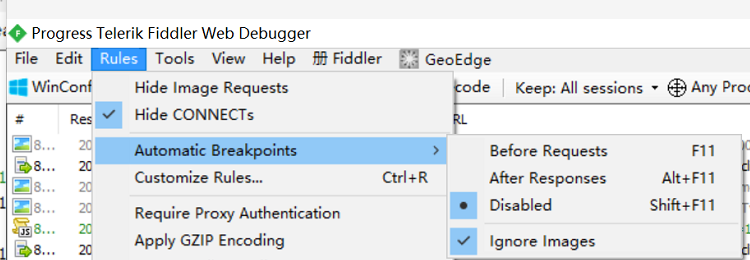

 比如点击Before requests，然后页面打开www.baidu.com

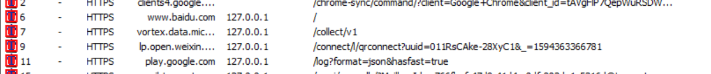

查看该请求的Raw选项卡，修改请求，比如说添加参数a=1

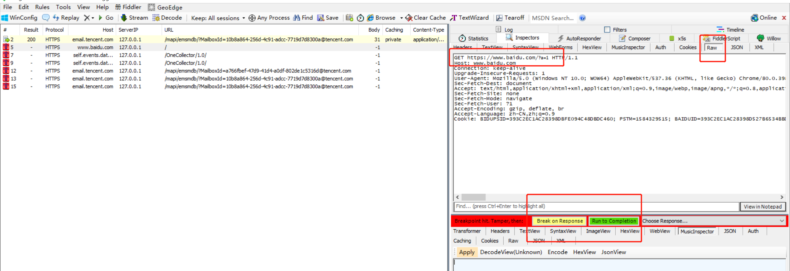

  修改完后可以点击两个按钮 

Break on Response ，相当于在服务器返回后继续拦截，此时可以继续改Raw下的内容，然后点击 Run to completion，把内容返回给客户端，该请求结束

 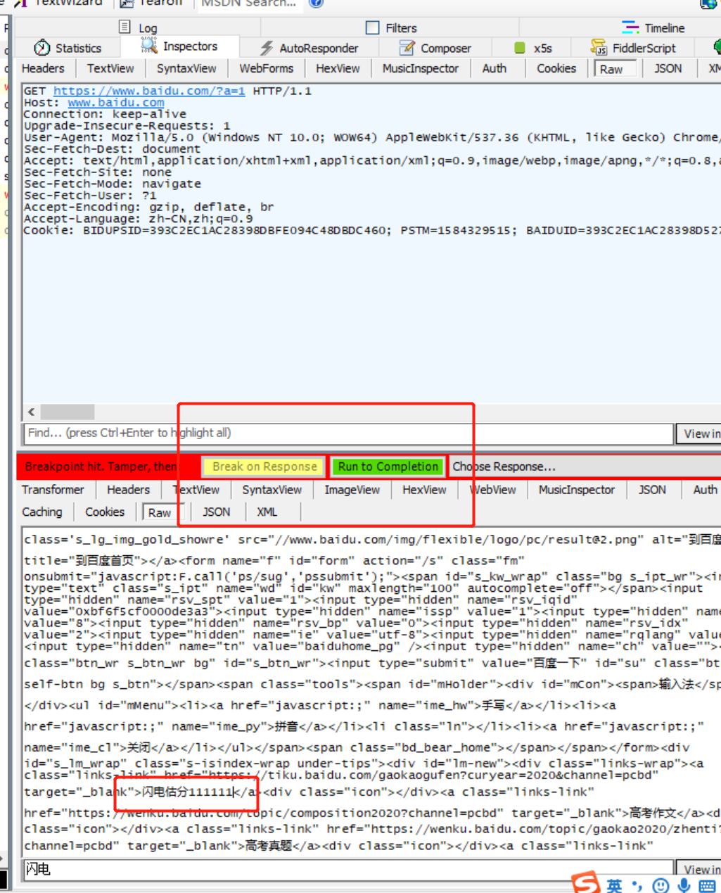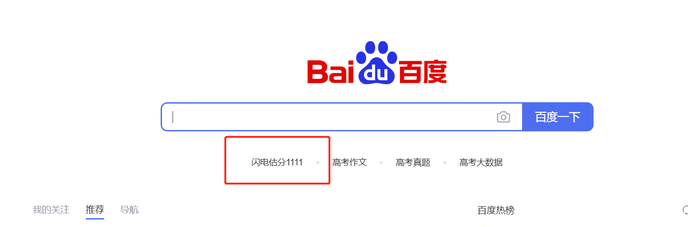

 Run to completion：不拦截服务器返回，直接返回给客户端，该请求结束

 

2.bpu单个断点 

在命令区输入 bpu www.baidu.com ,其实只要输入请求的子字符串，匹配该字符串的请求就会被拦截，不支持正则表达式，因此这样写也可以 bpu baidu

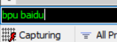

之后的操作就和上面的一样了

关闭拦截：上面选择Disable就可以了，这里关闭在命令行输入bpu就可以取消拦截

3.AutoResponder

这是fiddler的一个选项卡，可以**提前设置响应的内容**，**不需要在请求过程中**去修改

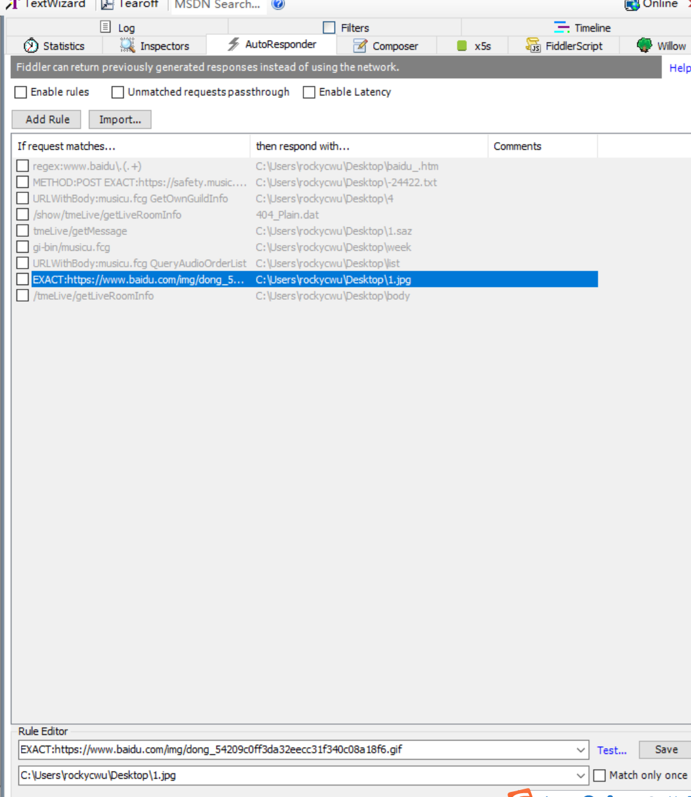

Enable Rule：打开该规则

Unmatched request passthrough:**不匹配规则的请求就放行**，不理他

请求一个百度首页，然后把它拖到这个选项卡中

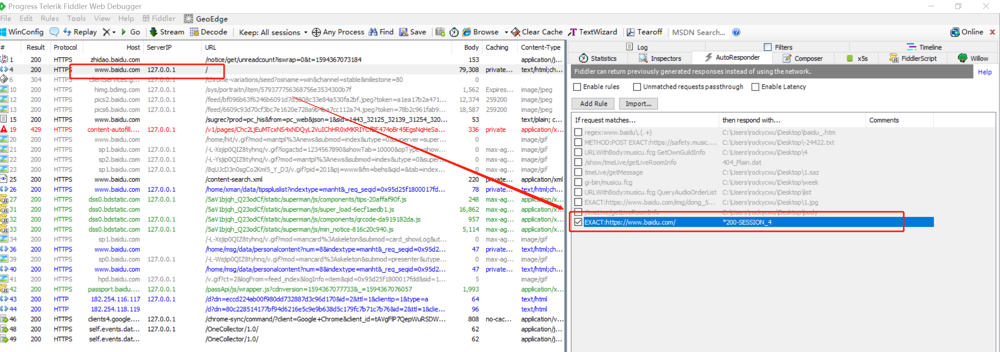

设置匹配规则，其中常用的有如下几种:

**1.匹配链接**，我们拖进去会显示为EXACT：xxx，我们可以改为要匹配的链接的子字符串，如baidu，当有链接包含baidu就会自动返回设定的值

**2.URLWithBody 这里要匹配两个url和body**，所以一般都是用例匹配POST请求，比如 URLWithBody:baidu name,当遇到url中包含baidu，且body中有name的，就会自动返回设定的值

**3.Header:Accept=htm**l 当请求的Header中包含Accept=html，就会自动返回设定的值

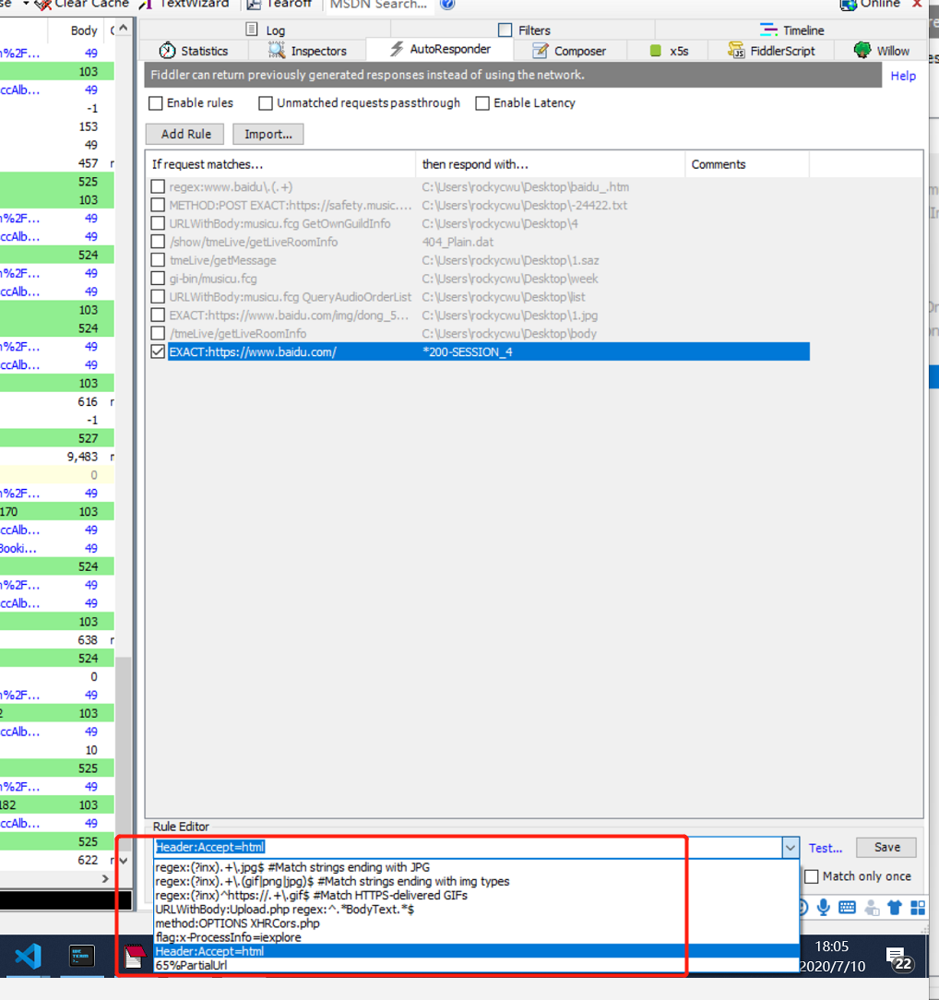

返回值设置：可以把响应的值设置为404,503等，但是常用的是选择一个本地文件

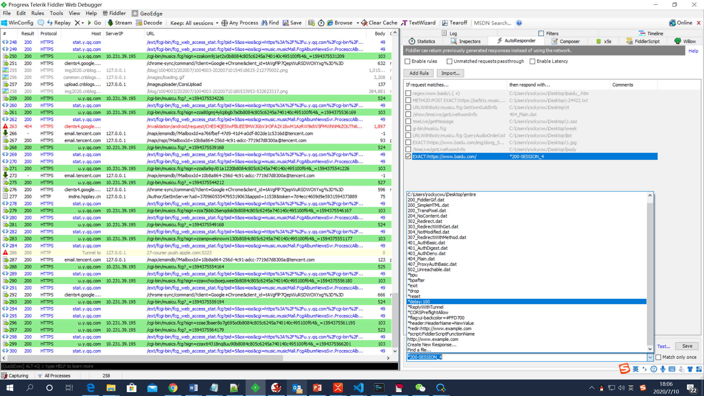

打开百度首页，在请求中，我们会发现其中的logo图片请求

 

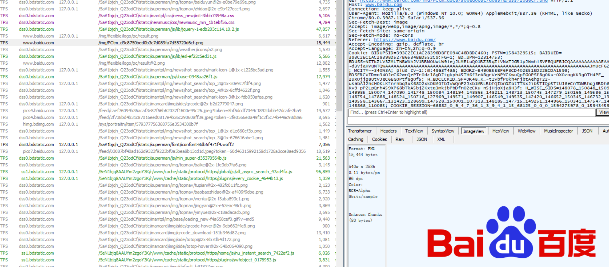

把这个请求拖到AutoResponsder，在选择一个本地图片find a file，把上面的enable和unmatched都勾选上，点击save

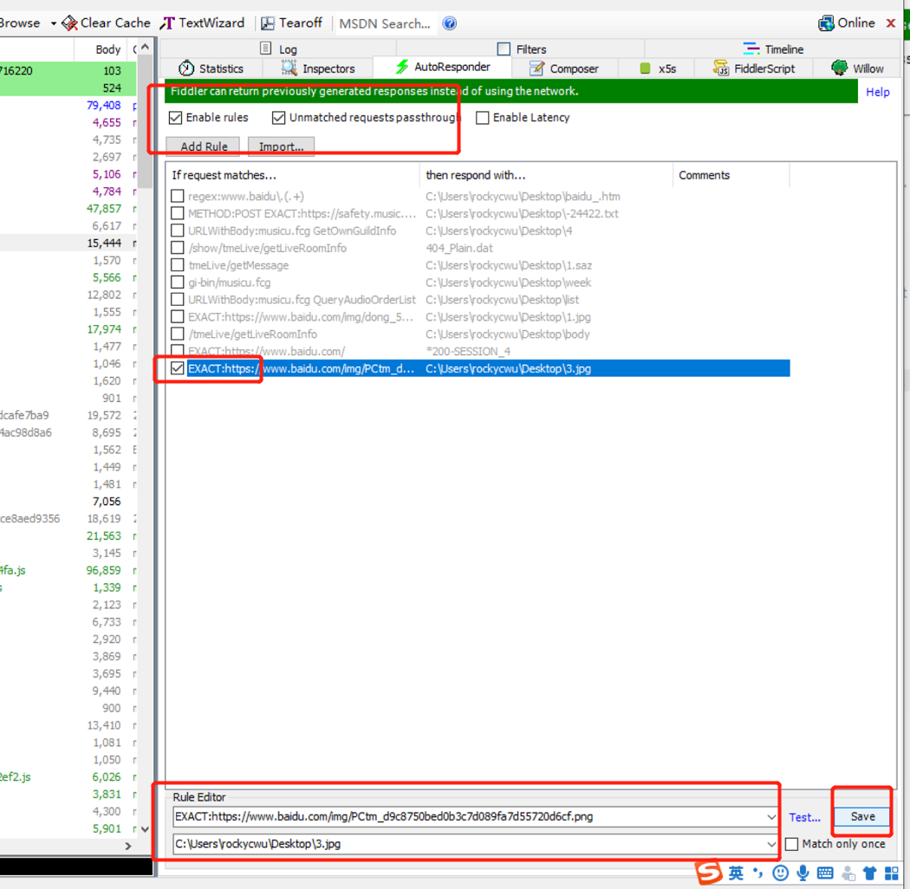

 此时ctrl+F5刷新百度，注意不能用缓存，然后就变成这样

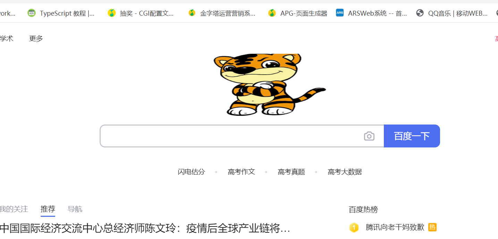

如果是要在已存在的返回中修改呢？首先必须**获得一个返回，在raw中修改，保存**，再把这个作为自动返回。

打开百度首页，抓包，修改raw

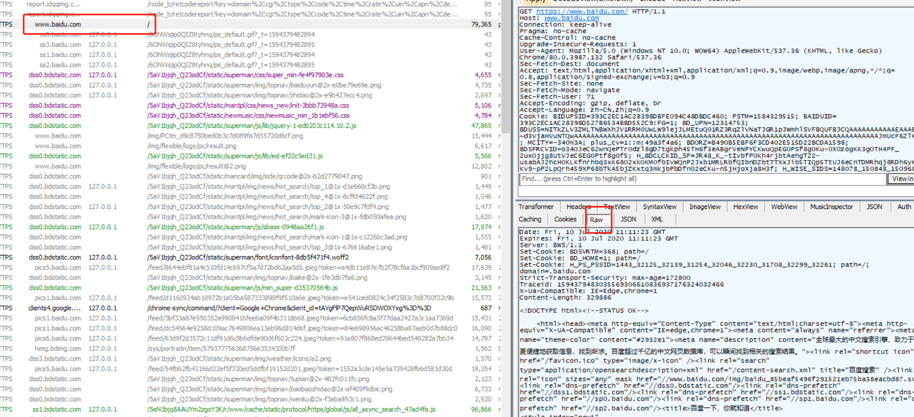

 改成闪电1111

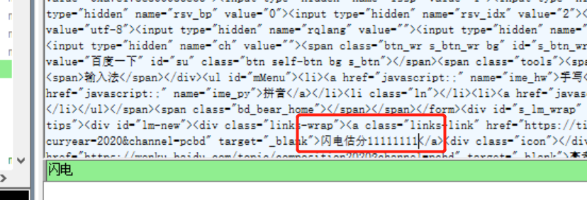

 

 将该请求保存save->response->entire response，保存名为entire

 按照上面的步骤，把这个请求拖到AutoResponder，选择find a file，选择刚才的entire，


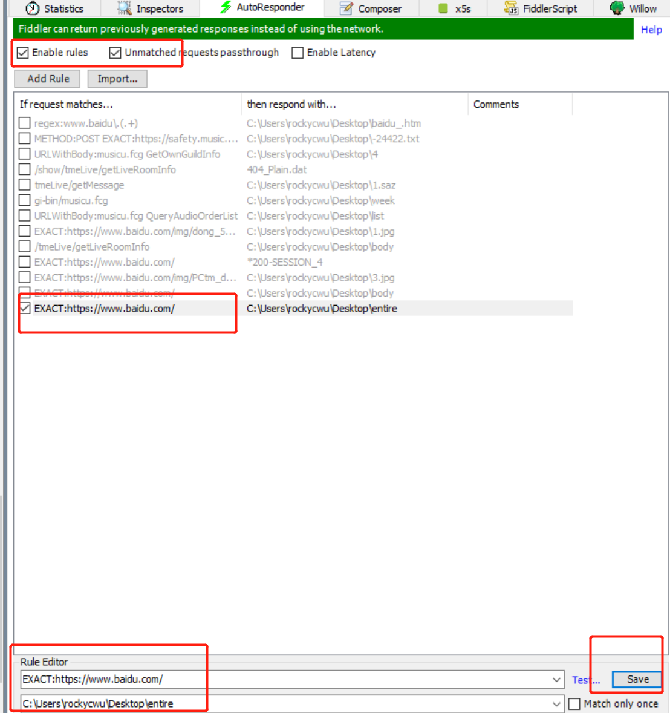

再次ctrl+F5刷新页面。变成了闪电估分1111

 

　　总结：Before requests/After responses会对所有的请求都阻断，bpu可以对指定的某一些阻断，然后再自己去改，AutoResponder可以提前设置返回的值