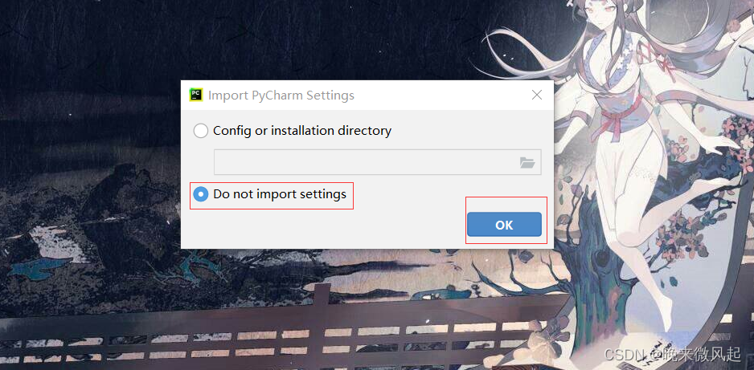
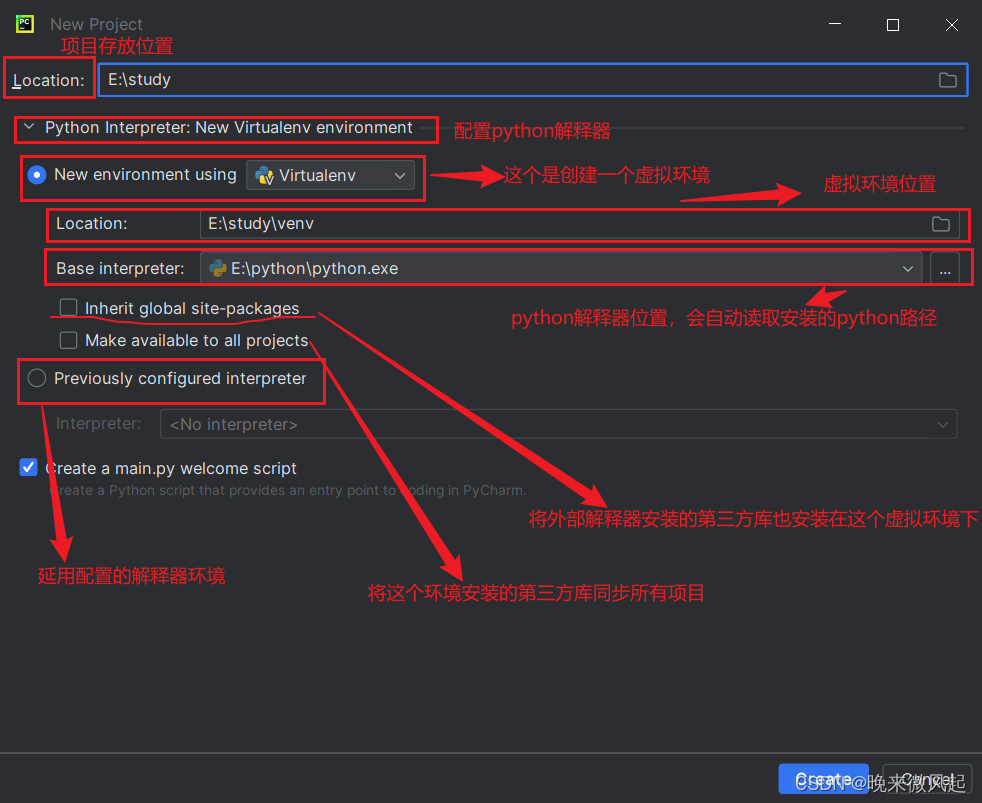
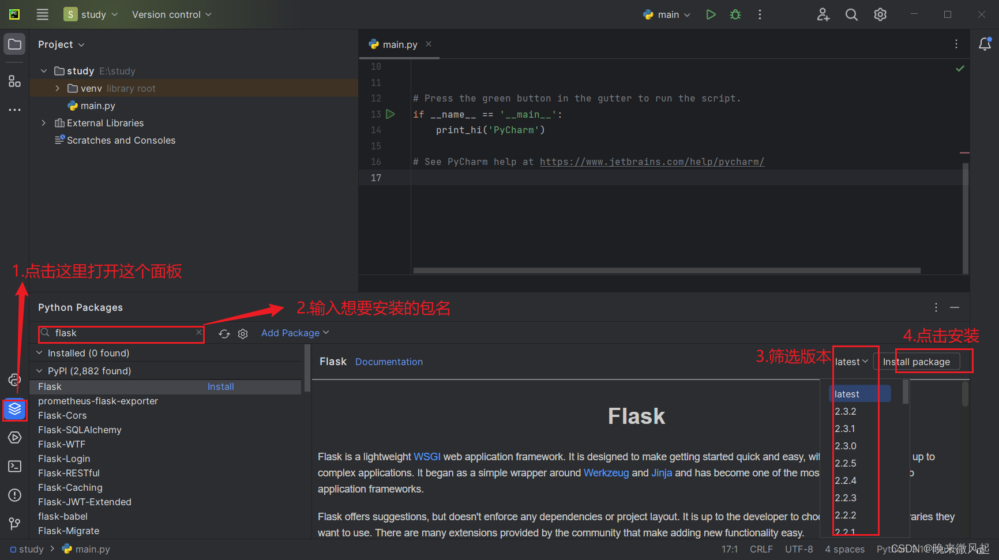
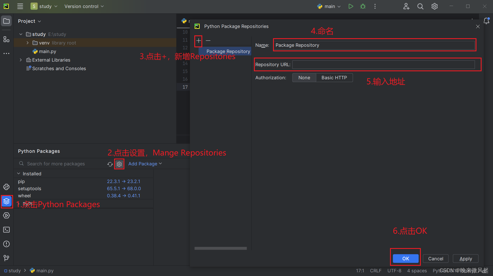
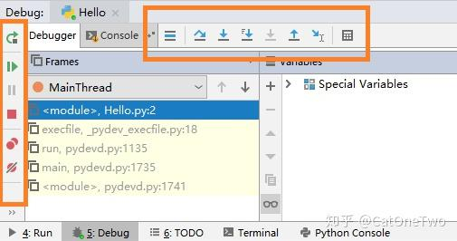

[TOC] 

# pycharm使用

如果出现`Import Pycharm Settings`页面，勾选`Do not import settings`，点击OK（没有这个弹框则看后续步骤）

一般只需要改一下项目存放位置（注意项目名一般不推荐使用中文，且不要跟一些库的名称一致），然后点击`create`

# 安装第三方库

**直接在主界面安装**
点击主界面左侧一栏的第二个图标`Python Packages`，输入想要安装的包名，右侧选择版本，点击`Install package`

**配置镜像源**
1.点击Python Packages，并点击设置图标，点击+按钮，输入名称及地址，点击Apply，最后点击OK 常用镜像源地址：

中国科学技术大学 : https://pypi.mirrors.ustc.edu.cn/simple
豆瓣：http://pypi.douban.com/simple/
阿里云：http://mirrors.aliyun.com/pypi/simple/
清华大学：https://pypi.tuna.tsinghua.edu.cn/simple

**在终端命令窗口中输入命令安装：**
pip install [packages] -i [镜像源地址] --trusted-host [镜像源地址中域名部分]
其中packages为安装包名，【-i】后面的一串为镜像源地址，后面的【–trusted-host】为添加访问信任

例如：pip install packages -i http://mirrors.aliyun.com/pypi/simple/ --trusted-host mirrors.aliyun.com

**进入设置界面还可以安装插件**

还不行就学会用 **[pip](https://zhida.zhihu.com/search?content_id=118938516&content_type=Article&match_order=2&q=pip&zhida_source=entity) 安装**，或到**官网下载** Package。

## 官网下载安装方法

将.whl文件放在C:\Users\rxccccc\AppData\Local\Programs\Python\Python313\Lib\site-packages下,cmd输入pip install C:\Users\rxccccc\AppData\Local\Programs\Python\Python313\Lib\site-packages\\<filename>.whl	即可.

## 快捷键

> 复制一行：Ctrl + D
> 删除一行：Ctrl + X

> 查找替换：Ctrl +H
> 快速**运行**(直接当前)：Ctrl + Enter
>
> 切换至当前文件运行: ctrl+shift+F10
>
> 批量注释 / 取消：ctrl + /

> 向后缩进：Tab
> **向前**缩进：shift + Tab
>
> 

# DEBUG

**左侧自上而下：**

Rerun（**ctrl** + F5）：**重新**调试，回到**第一个断点**所在的行。

Resume Program（F9）：跳到**下一**断点处。

Pause Program：暂停运行。

View Breakpoints：点击查看在哪儿打了断点，有很多文件的话，在这儿看清楚些，还可以取消打的断点。

Mute Breakpoints：你正在调试，点击这个按钮，所有断点变成灰色，就像不存在一样，程序直接运行完。当你打了很多断点，但中途想全部跳过直接结束看结果时可以使用。

**上面从左往右：**

show execution point（F10）：显示当前项目的所有断点。

Step Over（F8）:[单步调试](https://zhida.zhihu.com/search?content_id=118939244&content_type=Article&match_order=1&q=单步调试&zhida_source=entity)，走到下一行而不是下一个断点，遇到函数不进入，想跳过函数用这个。

Step Into（F7）:单步调试，走到下一行而不是下一个断点，遇到函数进入，当然函数内也是单步调试，想看函数内部的运行情况用这个。

Step Into My Code（Alt + Shift +F7）：执行下一行但忽略libraries（导入库的语句），不怎么用。

Force Step Into（Alt + Shift +F7）：执行下一行忽略[lib](https://zhida.zhihu.com/search?content_id=118939244&content_type=Article&match_order=2&q=lib&zhida_source=entity)和构造对象等，不怎么用。

Step Out（Shift+F8）：当目前执行在子函数a中时，选择该调试操作可以直接跳出子函数a，而不用继续执行子函数a中的剩余代码，并返回上一层函数。用了 Step Into 就可能需要用到 Step Out。

run to cursor（Alt +F9）： 直接跳到下一个断点，还没发现和 F9 的区别。

一般用不了这么多，我常用的是：从断点跳到断点**F9**；从断点跳到下一行**F8**；调试期间不想走后面的断点了**Mute Breakpoints**。调试时，执行过的行后面会有一些提示，如变量的值。