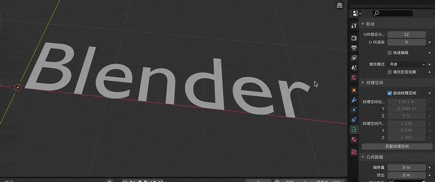
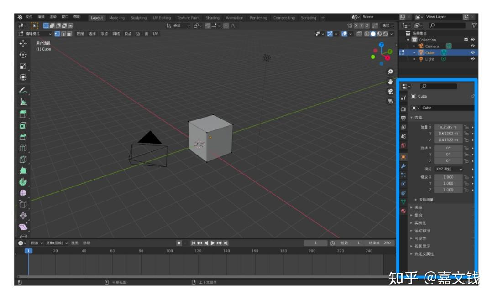
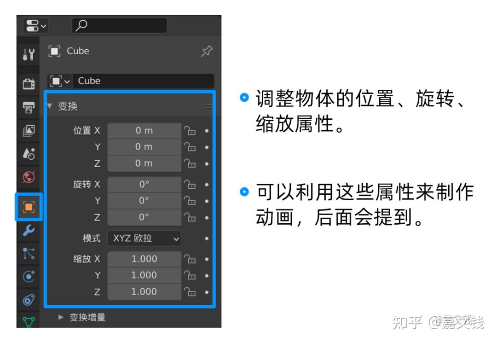
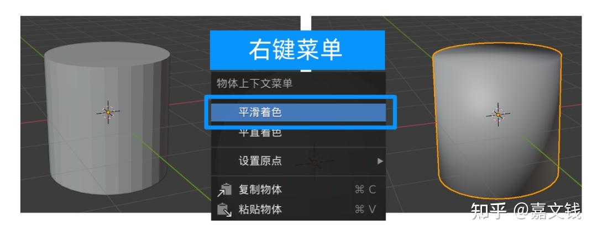
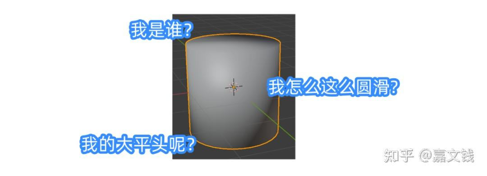
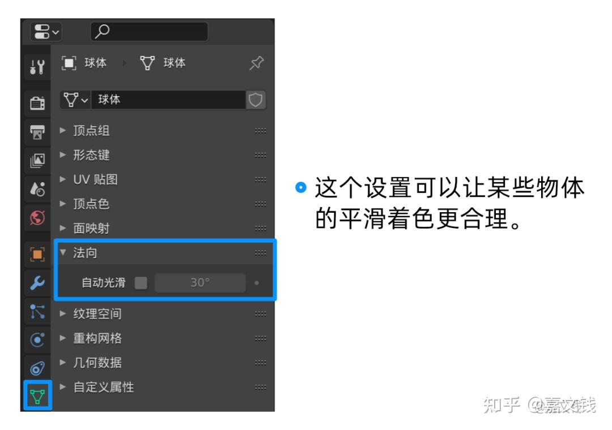
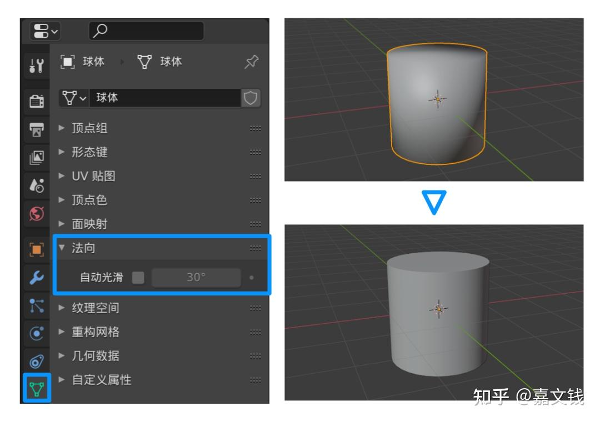
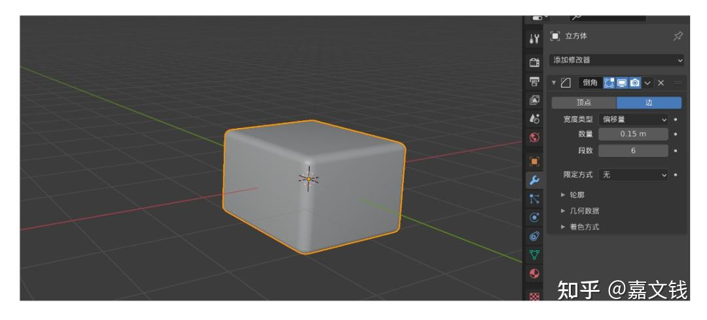

进行一个一个blender的学习哦哦哦

# 基本操作

旋转视角:鼠标中键按住拖动

平移视角:shift+鼠标中键按住拖动

快速切换各个正交视角:alt+鼠标中键按住拖动

用这个快捷键组合的话，每切换一次，需要按住放开鼠标中键一次，即**按住alt — 按住中键拖动 — 放开中键，完成一次切换**，要再切换的话，需要重复上述操作，觉得麻烦的话，可以用**神键~**替代。(**按住「\~」之后不松开，把鼠标指向想切换的视角按钮上，然后松开「~」**，即可完成切换，这样可以少了一次鼠标点击)

新建物体:shift+A

(新建物体之后，左下角会有**一个物体的详细设置**，如果需要调整的话需要在这个时候调整，不然后期需要修改的话，就只能重新新建了。)

#### Blender界「三大操作」

x/y/z 

**滚(G)、绕(R)、缩(S)**

G +

可以看到，滚绕缩三大操作，都**可以配合XYZ来规定变换方向**，一定要谨记，因为会对规范物体制作有很大的帮助~

**在按下G、R、S之后，直接按数字**

物体就会根据数字来严格变换,也可以配合XYZ来使用哦
例如你按了S，再按2

物体的长宽高就都放大成2倍

A 全选所有物体

X 删除物体

shitf+d 快速复制物体

Tab 编辑模式

**文本物体的物体数据属性面板上**有很多可以玩的参数设置

编辑模式下，可以编辑各种物体的形状

一个非常常用的功能—— **细分**

细分可以按照两个顶点中间生成新顶点的方式，让物体有更多的顶点，这样物体会有更多操作的可能性。

属性编辑器，就是打开Blender后

右下角的这一块面版

**物体属性**

这里主要是设置物体的基本变换属性

**物体数据属性**

我们在新建一个球体之后

可以通过**右键—平滑着色**来让它看上去变圆滑

这个时候「物体数据属性」可以登场了

在勾选这个**法向下的「自动光滑」**之后

柱体的平滑着色就会变得合理~

修改器属性

修改器也是一个**庞大的可玩性极高的功能**

而且绝大部分修改器
都是**保证不改变原物体形状的前提下来产生效果**

非常实用

**倒角修改器**

可以给物体生成圆润的边缘：

