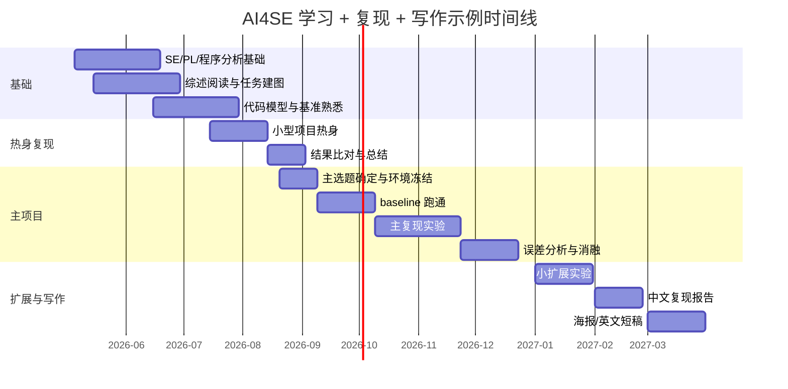

# 面向软件工程本科二年级学生的 AI4SE 深度学习与复现研究计划

## 执行摘要

AI4SE（AI for Software Engineering）的主线已经非常清晰：早期以任务定制模型为主，例如代码表示学习、缺陷预测、漏洞检测、测试生成与程序修复；随后进入预训练代码模型阶段；近两年又迅速扩展到仓库级代码建模、真实 issue 修复和 agent 化软件工程。近年的领域综述与路线论文都强调了两个事实：第一，AI4SE 的任务谱系已经覆盖开发、测试、维护、协作等软件生命周期多个环节；第二，越“看起来先进”的 LLM/agent 任务，往往越依赖复杂的工程环境、基准协议和评测设计，因此并不天然更适合本科生作为第一个深度项目。citeturn30search4turn28search2turn27search0turn30search1turn28search0

对“有基础深度学习知识、但仍处于本科二年级”的你，我的建议不是一开始就冲向 SWE-bench 式的端到端 issue 修复，而是采用**三级递进**：先做“代码表示/代码搜索/代码摘要/代码评审”这类工件成熟、指标稳定、公开仓库完整的任务；再过渡到“测试 oracle 生成 / 断言生成 / 程序修复”；最后才尝试“仓库级代码编辑 / 真实 issue 解决 / agent 系统”。从官方工件成熟度看，UniXcoder、CodeReviewer、TOGA、TFix 这类论文更适合作为本科复现主项目，而 CodePlan、SWE-bench 更适合作为后续扩展方向。citeturn17view5turn36view0turn35search1turn17view0turn17view7turn7search3

如果只给一个最稳妥的建议：**优先走“UniXcoder/CodeReviewer/TOGA 三选一”的 12 个月路线**。其中，UniXcoder 最适合入门“代码表示 + 检索/摘要 + Transformer 复现”；CodeReviewer 最适合进入“真实 SE 数据 + 多任务建模”；TOGA 最适合进入“软件测试 + 生成式模型 + Java 工具链”。如果你追求更“像研究”的问题，可在第 2 阶段转向 TFix 或 CURE；如果你追求更“像前沿”的问题，可把 CodePlan、SWE-bench 作为后续扩展。citeturn29view3turn36view0turn35search4turn22view0turn17view1turn15search4turn7search11

## 领域判断与优先级

下文把“**CCF A**”按 entity["organization","中国计算机学会","academic society"] 第七版推荐目录标注：软件工程方向的 ICSE、FSE、ASE、TOSEM、TSE、POPL 属于 A 类；人工智能方向的 AAAI、ICML、NeurIPS 属于 A 类；自然语言处理方向的 ACL 属于 A 类。citeturn2view0turn3view0turn3view1

我建议你的学习优先级按下面顺序排：

| 优先级 | 子方向 | 为什么先学 | 适合的首个项目 |
|---|---|---|---|
| 高 | 代码表示、代码搜索、代码摘要、代码评审 | 基准公开、脚本完整、指标清晰、对 SE 背景要求相对可控 | UniXcoder、CodeReviewer |
| 中高 | 测试 oracle / 断言生成 / 测试生成 | 与软件工程课程衔接强，容易写出“方法 + 实验 + 案例分析” | TOGA、Assertion Generation、CodaMOSA |
| 中 | 程序修复 | 研究味道强，但环境与评测更复杂 | TFix、CURE |
| 中低 | 漏洞检测 / 图模型 | 工程管线重，前处理和图构建容易踩坑 | Devign |
| 后续扩展 | 仓库级编辑 / 真实 issue 修复 / 软件 agent | 很前沿，但 benchmark、环境、评测协议更重 | CodePlan、SWE-bench |

周期上建议你这样理解：

| 路线 | 适合场景 | 里程碑 | 最终交付 |
|---|---|---|---|
| 6 个月压缩版 | 想尽快完成一次像样复现 | 选 1 个成熟任务，跑通官方结果，做 1 个小扩展 | 中文复现报告 + 仓库 + 结果表 |
| 12 个月标准版 | 最推荐 | 1 次热身复现 + 1 次主复现 + 1 次扩展 + 1 次书面写作 | 复现仓库、技术报告、海报/课程展示、潜在 workshop short paper |
| 18 个月研究版 | 有导师或长期投入 | 2 个子方向、跨基准对比、系统误差分析、可投稿扩展 | 论文初稿 + 开源工件 + 更完整 benchmark 复现实验 |

建议固定一个**每周循环**，不依赖具体工时：  
每周至少完成一篇经典论文精读、一篇近年论文快读、一个 reproduction ticket、一次实验日志整理、一次结果复盘。若时间多，再追加一个 baseline 或 ablation。这样做的好处是：你不会把“学习论文”和“写代码”割裂开，而会逐步形成研究节律。

## 分阶段路线图

下面给一个**推荐的 12 个月标准执行表**；6 个月版就是删除“热身复现”和“扩展写作”的部分，18 个月版则在后半程增加一个新子方向。

| 阶段 | 月份 | 月目标 | 每周任务 | 月度交付 |
|---|---|---|---|---|
| 基础打底 | M1–M2 | 补 SE 与程序分析基础；建立 AI4SE 总体地图 | 读 2 篇 survey/roadmap；写 2 份 structured notes；完成 1 个 benchmark 的数据浏览；搭建统一实验模板 | 一份 5–8 页领域综述笔记；统一仓库骨架；环境模板 |
| 任务入门 | M3–M4 | 聚焦代码表示/搜索/摘要/评审之一 | 精读 4–6 篇代表论文；跑 1 个官方 checkpoint；复现 1 个基础结果表 | 论文矩阵表；baseline 结果；差异记录 |
| 热身复现 | M5–M6 | 做一次“低风险、小规模”复现 | 跑通官方脚本；修复环境问题；做 1 次小数据子集实验；补 1 个 baseline | 热身复现报告；可复现实验脚本 |
| 主项目选题 | M7 | 确定主论文与主 benchmark | 比较 3–5 个候选题；列前置知识缺口；确定评价指标；冻结选题 | 选题说明书（1–2 页） |
| 主复现实验 | M8–M9 | 跑通论文主结果 | 逐项对齐数据、模型、超参、指标；至少保留 3 轮可追溯日志；画误差分布 | 主结果表；reproduce/not reproduce 判定 |
| 扩展与消融 | M10 | 做一个“像研究”的扩展 | 做 1 个结构化 ablation；1 个 error analysis；1 个跨数据/跨模型尝试 | 扩展结果表；案例库 |
| 写作固化 | M11 | 完成中文复现报告与 README | 补实验细节、威胁分析、局限性、失败案例；统一图表格式 | 正式技术报告 v1 |
| 展示与投递准备 | M12 | 完成海报/汇报或短文初稿 | 口头汇报 1 次；修正文稿；整理 release artifact | 海报、演讲稿、release 包、短稿雏形 |

如果你更偏“研究型”推进，可以把月度重点改成下面三个硬里程碑：  
**第一个里程碑**：跑通一个官方结果；  
**第二个里程碑**：解释为什么你的结果和论文不同；  
**第三个里程碑**：提出并验证一个有理有据的小扩展。  
本科阶段最容易缺的不是模型，而是“对实验差异进行因果解释”的能力。

## 代表性论文清单

说明：下表优先选**经典 + 近年 + 公开工件较完整**的代表作；“CCF A”按前文说明标注。并不是所有有影响力的代码模型论文都在 CCF A venue，例如 CodeBERT、CodeT5、GraphCodeBERT 也非常值得读，只是不统一标 A。citeturn2view0turn3view0turn3view1

| 子主题 | 论文 | 会议/期刊 | 定位 | 为什么值得读 | 来源 |
|---|---|---|---|---|---|
| 代码表示 | code2vec | POPL 2019（**CCF A**） | 经典 AST 路径上下文模型 | 理解“代码表示”最经典的神经方法之一；也适合做热身项目 | citeturn25view0turn17view3turn38view0 |
| 代码表示 | CodeBERT | Findings of EMNLP 2020 | 代码-自然语言双模态预训练基线 | 后续大量代码检索/摘要/生成工作都把它当强基线 | citeturn19search2turn17view4 |
| 代码表示 | GraphCodeBERT | ICLR 2021 | 结构增强代码预训练 | 把 data flow 显式引入预训练，适合学习“结构信息如何进入 Transformer” | citeturn6search2turn12search16turn17view4 |
| 代码表示 | UniXcoder | ACL 2022（**CCF A**） | 统一理解与生成的跨模态预训练模型 | 官方脚本和下游任务完整，最适合作为本科复现主入口之一 | citeturn29view3turn17view5turn18view0turn14search10 |
| 程序修复 | Neural Program Repair by Jointly Learning to Localize and Repair | ICLR 2019 | 早期神经程序修复代表 | 很适合理解“定位 + 修复”的联合建模思路 | citeturn7search19turn7search4 |
| 程序修复 | TFix | ICML 2021（**CCF A**） | 真实静态分析错误修复 | 52 类 ESLint 错误、约 10 万对修复样本，真实感强 | citeturn22view0turn17view0turn20view5 |
| 程序修复 | CURE | ICSE 2021（**CCF A**） | 代码感知 NMT 式 APR | 同时覆盖补丁生成与 benchmark 验证，是很好的“完整 APR”教材 | citeturn17view1turn20view0turn20view1 |
| 程序修复 | GAMMA | ASE 2023（**CCF A**） | 基于 mask prediction 的模板修复 | 展示了“模板修复 + 预训练模型”的现代化结合 | citeturn33search1turn33search0 |
| 缺陷/漏洞检测 | Devign | NeurIPS 2019（**CCF A**） | 图神经网络漏洞检测代表作 | 人工标注真实 C 项目、联合 AST/CFG/DFG，是漏洞检测必读入门 | citeturn21view0turn14search15 |
| 测试生成 | TOGA | ICSE 2022（**CCF A**） | 测试 oracle 生成 | 相比“生成测试输入”，它更强调“生成断言/异常 oracle”，研究味道更强 | citeturn35search4turn35search1turn35search13 |
| 测试生成 | CodaMOSA | ICSE 2023（**CCF A**） | LLM + 搜索式测试生成 | 代表了“LLM 作为 hint，传统 SBST 负责搜索”的混合范式 | citeturn24view0turn17view2 |
| 测试生成 | Exploring Automated Assertion Generation via Large Language Models | TOSEM 2025（**CCF A**） | LLM 断言生成 | 适合了解近年测试生成从“oracle 生成”走向“LLM 断言生成”的路径 | citeturn34search1turn34search7 |
| 代码搜索 | CodeSearchNet Challenge | 2019 benchmark paper | 代码检索基准 | 代码搜索/摘要/预训练代码模型最常见的数据入口之一 | citeturn9search2turn8search3 |
| 代码摘要 | CodeT5 | EMNLP 2021 | 统一编码器-解码器代码模型 | 在代码摘要、代码生成、缺陷检测等多任务上都很常见 | citeturn19search1turn19search5turn10search12 |
| 软件分析 | DeepTriage | 2018 | bug triage 代表作 | 说明“SE 文本 + 深度学习”并不限于代码任务 | citeturn9search16turn8search5 |
| 软件分析 | DeepJIT | MSR 2019 | JIT 缺陷预测代表作 | 数据与模型都较轻量，适合做 warm-up baseline | citeturn8search16turn17view6 |
| 软件分析 | CodeReviewer | ESEC/FSE 2022（**CCF A**） | 代码评审自动化 | 真实 PR 数据、三任务设置、官方公开数据与脚本，很适合本科复现 | citeturn32search5turn36view0turn32search3 |
| 程序综合 | Codex / HumanEval | 2021 | 代码生成基准与评测范式 | HumanEval 几乎成为代码生成评测的事实标准之一 | citeturn13search0turn13search4turn13search8 |
| 程序综合 | AlphaCode | Science 2022 | 竞赛级程序生成代表作 | 理解“采样 + 过滤 + 聚类 + 执行评测”的高性能范式 | citeturn10search5turn10search1 |
| 仓库级建模 | RepoCoder | 2023 | repository-level code completion | 体现“检索 + 生成”的仓库级代码补全思路 | citeturn10search14turn10search6 |
| 仓库级建模 | CodePlan | FSE 2024（**CCF A**） | repository-level coding with planning | 很适合作为“从单文件走向仓库级”的过渡读物 | citeturn15search4turn17view7 |
| 真实 issue 修复 | SWE-bench | 2023 benchmark | 真实 GitHub issue 修复基准 | 现在很多 software agents 的主战场，但对本科生作为首项目偏重 | citeturn7search11turn7search18turn7search3 |

如果你想把阅读顺序再进一步压缩，我建议按下面的“必读 10 篇”走：  
**code2vec → CodeBERT → UniXcoder → CodeSearchNet → CodeReviewer → TOGA → TFix → CURE → CodePlan → SWE-bench**。这条线可以把你从“代码表示”平滑带到“真实软件工程问题”。

## 复现选题排序

我的排序标准只有四条：**官方工件是否齐全、评价指标是否透明、是否依赖会漂移的 API/闭源模型、工程环境是否适合本科生独立维护**。按这个标准，最推荐的 5 个 CCF A 复现候选如下。

| 排名 | 论文 | 推荐复现任务 | 为什么适合本科生 | 前置知识 | 预计时间 | 数据集/评测 | 主要风险 | 来源 |
|---|---|---|---|---|---|---|---|---|
| 第一 | UniXcoder | code search 或 code summarization | checkpoint、下游脚本、数据下载路径都比较清晰；MRR/BLEU 这类指标成熟；不依赖复杂外部分析器 | PyTorch、Transformers、检索/生成基础 | 6–10 周 | CodeSearchNet / CodeXGLUE；MRR、BLEU-4 | 负样本构造和 tokenizer 细节若不对齐，结果会偏 | citeturn17view5turn18view0turn14search10turn9search2 |
| 第二 | CodeReviewer | quality estimation 或 comment generation | 真实 code review 数据、公开 Zenodo 数据集、任务定义清楚；分类/生成都能做 | PyTorch、Transformer、多任务学习基础 | 6–10 周 | Diff Quality Estimation / Comment Generation / Code Refinement；分类指标与 BLEU | 数据预处理容易不一致；评论生成任务容易出现“看起来合理但指标不高” | citeturn36view0turn32search5turn32search3 |
| 第三 | TOGA | assertion / exception oracle generation | ICSE artifact 完整；研究问题明确；比“整套测试生成”更聚焦，适合写出清楚实验结论 | Java、单元测试、基础 NLP/Seq2Seq | 8–12 周 | 官方 artifact；oracle inference accuracy、bug-finding 效果 | Java 工具链、EvoSuite/测试工程会占掉不少时间 | citeturn35search4turn35search1turn35search13 |
| 第四 | TFix | JavaScript 静态分析错误修复 | 真实 GitHub 修复数据、52 类错误、训练/测试脚本清楚、研究价值强 | Transformer、程序修复、JavaScript 基础 | 8–12 周 | ESLint 错误修复；exact match、error removal accuracy | ESLint 版本、clean/random test、GPU/内存管理容易出问题 | citeturn22view0turn17view0turn20view5 |
| 第五 | CURE | automatic program repair | APR benchmark 语义强、验证链条完整、适合做“研究味最浓”的本科项目 | Python、NMT/Transformer、APR benchmark、Java 工具链 | 10–16 周 | QuixBugs、Defects4J；修复 bug 数、plausible/correct patch | 数据准备、patch 验证、rerank、benchmark 环境都偏重 | citeturn17view1turn20view0turn20view1 |

如果你只做**一个**主项目，我建议：

- **最优先**：UniXcoder 的 **code search** 子任务。它的门槛与“研究产出密度”的比值最高。  
- **第二选择**：CodeReviewer 的 **quality estimation** 或 **comment generation**。更“软件工程”，也更容易写清楚任务背景。  
- **第三选择**：TOGA。适合你如果更偏测试。  

另一个很好的策略是：把 **code2vec 或 DeepJIT** 当作 2–3 周的热身复现，再进入 UniXcoder / CodeReviewer / TOGA 主项目。这样前期不会卡在大工程上。citeturn25view0turn17view3turn17view6

## 复现实施手册与工具栈

### 逐步复现检查清单

一套严谨的 AI4SE 复现，不是“把代码跑起来”，而是把**论文—代码—数据—环境—指标—结论**六件事全部对齐。建议按如下顺序执行：

1. **冻结目标**：确定论文版本、官方仓库、要复现的具体表或图。  
2. **冻结任务**：只选一个子任务，不要一开始试图复现整篇论文。  
3. **冻结数据**：确认 benchmark 版本、数据切分、下载脚本、是否含过滤规则。  
4. **冻结环境**：记录 OS、Python/Java 版本、CUDA、cuDNN、pip/conda lock、随机种子。  
5. **先跑官方 checkpoint**：用作者提供的预训练权重或 demo 先验证 pipeline 正常。  
6. **再跑最小训练**：先用 1%–10% 子集检查 loss 曲线和指标管线。  
7. **再跑全量训练**：此时才正式复现实验。  
8. **做差异分析**：如果结果偏差 > 论文表格中的常见波动，不要立刻调参，先查数据、tokenizer、script 默认值。  
9. **做至少一个 ablation 或 error analysis**：没有误差分析的复现报告一般不够研究化。  
10. **固化 artifact**：整理 README、run.sh、env.yml、日志、结果表、图脚本、checkpoint 信息。

### 实验、代码、环境、报告模板

下面这个模板你可以直接照搬到仓库根目录的 `reproduction_record.md`：

```text
Paper:
Task:
Target table/figure:
Official repo:
Official commit/tag:
Dataset:
Split/version:
Metric:
Hardware:
OS / Python / CUDA:
Seed(s):
Checkpoint used:
Main hyperparameters:
What I reproduced:
What I could not reproduce:
Gap to paper:
Suspected causes:
Sanity checks passed:
Ablation done:
Error cases:
Threats to validity:
Next extension:
```

建议每一次实验都满足“一实验一目录”：

```text
runs/
  exp_001/
    config.yaml
    env.txt
    git_commit.txt
    train.log
    eval.json
    plot.py
    notes.md
```

### 工具、框架、数据与算力建议

下表是把官方复现仓库的依赖要求做了“本科可执行化”之后得到的最小工具栈。UniXcoder/CodeReviewer 基本围绕 PyTorch + Transformers；TFix 需要 JS 静态分析上下文；CURE/TOGA 则分别牵涉 APR benchmark 与 Java 测试工具链。citeturn17view5turn36view0turn17view0turn17view1turn35search1

| 层 | 建议选择 | 适用任务 | 备注 |
|---|---|---|---|
| 操作系统 | Ubuntu 22.04 LTS | 全部 | AI4SE 复现通常比 Windows 更省心 |
| 环境管理 | conda/mamba + `env.yml`；有余力再加 Docker | 全部 | 先可跑，再容器化 |
| 深度学习框架 | PyTorch + Transformers | UniXcoder、CodeReviewer、TFix | 当前代码模型复现默认组合 |
| 图学习 | DGL 或 PyG | Devign | 若做图任务再安装，不要一开始装全家桶 |
| 代码解析/SE 工具 | tree-sitter、Java JDK、Maven/Gradle、EvoSuite、Defects4J | TOGA、CURE、Devign | 只按项目需要安装 |
| 指标与日志 | evaluate、sacrebleu、rouge-score、TensorBoard/W&B | 检索、摘要、生成 | 统一记录，便于写报告 |
| 工件管理 | Releases + checkpoints + result CSV | 全部 | 结果表、图脚本、日志必须一并保留 |

一个实用的**算力梯度**是：

| 任务层级 | 代表任务 | 推荐算力 | 说明 |
|---|---|---|---|
| 轻量热身 | DeepJIT、code2vec 小规模 | CPU 或单卡消费级 GPU | 适合先熟悉流程 |
| 中等标准 | UniXcoder、CodeReviewer 单任务 | 单卡 GPU 最优 | 本科主项目的甜蜜点 |
| 中等偏重 | TOGA、Devign | 单卡 GPU + 更重的 CPU 前处理 | 图构建/Java 工具链更花时间 |
| 偏重 | TFix、CURE | 单卡或多轮长实验 + 混合工具链 | 主要难点通常不是模型，而是环境与评测 |

### Git 与 entity["company","GitHub","code hosting platform"] 工作流

建议不要把 AI4SE 项目当成“一个 notebook”。请按工程方式管理：

- `main` 分支只保留可复现状态。  
- 每个实验一个分支：`exp/unixcoder-csn-seed2233`。  
- 每次 commit 都带**实验意图**，不要写 `fix bug`，要写 `align tokenizer with paper script`。  
- 用 issue 管理待验证假设，例如“MRR 偏低是否由 codebase.jsonl 构造导致”。  
- 每个里程碑打 tag：`v0-baseline`、`v1-reproduced`、`v2-ablation`。  
- Release 中至少放：`README`、`env.yml`、`run.sh`、`result.csv`、`report.pdf`。  
- 若文件很大再引入 Git LFS；像 CodaMOSA 的 replication 目录就明确需要 `git-lfs`。citeturn17view2

## 阅读安排与时间线

### 建议阅读顺序

把阅读分成“建图—定点—复现—前沿”四层最有效。近年的综述已经表明，LLM4SE 文献量非常大，盲目横扫论文并不划算，应该先建立任务地图，再围绕一个主任务纵向深挖。citeturn28search2turn27search0turn4search11

| 周次 | 重点 | 读什么 | 产出 |
|---|---|---|---|
| W1 | 建立 AI4SE 地图 | 1 篇 AI4SE roadmap + 1 篇 LLM4SE SLR + 1 篇中文综述 | 一页任务树 |
| W2 | 代码模型基础 | code2vec、CodeBERT、UniXcoder | 一张模型谱系图 |
| W3 | benchmark 熟悉 | CodeSearchNet、CodeXGLUE、HumanEval | 一份数据说明 |
| W4 | 软件工程型任务 | CodeReviewer、DeepJIT、DeepTriage | 一张“SE 任务—输入输出”表 |
| W5 | 测试方向 | TOGA、CodaMOSA、Assertion Generation | 一个测试子方向选题 memo |
| W6 | 修复方向 | TFix、CURE、GAMMA | 一个修复子方向选题 memo |
| W7 | 仓库级/真实 issue | RepoCoder、CodePlan、SWE-bench | 一张前沿 benchmark 对照表 |
| W8 | 收束选题 | 重读主论文、作者 repo、相关 issue | 选题说明书 |

### 中文资源优先清单

你明确说希望优先中文资源；这里我建议只用**官方/高质量**中文资源，而不是大量二手博客。

| 资源 | 用法 | 为什么值得优先 | 来源 |
|---|---|---|---|
| CCF 推荐目录 | 判断 venue 水平与选题定位 | 选题时先辨别论文层级，避免读太杂 | citeturn2view0turn3view0turn3view1 |
| 《A Survey on Large Language Models for Software Engineering》中文团队论文 | 建立 LLM4SE 任务图谱 | 2026 年 SCIENCE CHINA 综述，覆盖面广、更新较新 | citeturn27search0turn27search4 |
| 《Deep learning-based software engineering》 | 看 AI4SE 的“非 LLM”全景 | 能防止你把 AI4SE 误解成“只有代码大模型” | citeturn30search2turn30search4 |
| 《软件学报》大语言模型专题 | 跟踪中文软件工程/代码智能新作 | 能系统看到中文学术圈与国内问题设定 | citeturn26view3 |
| CNCC / CCF 论坛中的“大模型使能软件工程”内容 | 作为中文入门讲座 | 适合你在前两周快速建立术语与任务感 | citeturn5search1turn5search3turn5search16 |

### 做笔记的模板

建议每篇论文都用同一个模板，强迫自己回答下面 10 个问题：

1. 这篇论文解决的**具体软件工程任务**是什么？  
2. 输入和输出各是什么？  
3. 它的 baseline 是谁，为什么这些 baseline 合理？  
4. 真正的新意在“表示、训练、检索、生成、验证”哪一层？  
5. 数据集是否会泄漏、过时、偏任务特定？  
6. 指标是否能真实反映工程价值？  
7. 论文最脆弱的实验假设是什么？  
8. 如果我复现，最先会失败在哪一步？  
9. 如果我扩展，最自然的变量是什么？  
10. 这篇论文和我当前主线的关系是什么：背景、基线、对手还是扩展点？

### 十二个月示例甘特图



## 常见坑、调试与可发表扩展

AI4SE 现在最大的现实问题，不是“模型太弱”，而是**benchmark 碎片化、评测协议不统一、数据污染/时效性问题突出、真实工程成本被低估**。相关综述与 benchmark 论文已经明确指出这一点：一方面，AI-driven benchmarking 版图非常分散；另一方面，较新的 benchmark（如 RepoBench、GHRB、SWE-bench）都在尝试降低数据污染、过时数据和不真实任务设定的影响。citeturn4search11turn15search13turn14search21turn7search18

### 最常见的复现坑

| 坑 | 常见症状 | 先查什么 |
|---|---|---|
| 数据切分不一致 | 结果整体偏低但 loss 正常 | 下载脚本、过滤规则、负样本构造 |
| tokenizer / parser 不一致 | 训练能跑但指标差很多 | 词表、最大长度、代码解析版本 |
| 指标实现不一致 | 表面上“复现失败” | MRR/BLEU/exact match/pass@k 的官方脚本 |
| checkpoint 混用 | 官方 checkpoint 很强，自己训练很差 | 是否真用了同一预训练权重 |
| benchmark 泄漏或过时 | 结果“异常高”或跨论文不可比 | 数据时间戳、训练语料污染风险 |
| Java/测试工具链版本不对 | 测试跑不通、验证失败 | JDK、Maven、EvoSuite、Defects4J 版本 |
| LLM/API 漂移 | 重跑结果与论文完全不同 | 模型版本、日期、温度、采样参数 |
| 只看均值不看案例 | 报告写不深 | 错误案例、失败类别、人工检查 |

### 调试时的优先顺序

建议你始终按这个顺序 debug：

**数据 > 指标 > 输入构造 > checkpoint > 超参数 > 模型结构**

原因很简单：本科生最容易把时间浪费在“继续调参”上，但 AI4SE 复现里最常见的问题其实是**数据处理与评测协议不一致**。  
例如：

- code search 的 MRR 很容易因为 codebase 文件或负样本构造不同而偏。citeturn6search9turn18view0  
- TFix 这类任务不只看 exact match，还牵涉错误真正是否被移除，因此测试/分析器版本很关键。citeturn22view0turn20view5  
- CURE 的关键不只在 patch 生成，还在 rerank 与 benchmark 验证。citeturn20view0turn20view1  
- TOGA 与测试生成类任务往往卡在工程工具链，而不是模型本身。citeturn35search4turn35search1

### 从复现走向“可发表”的扩展思路

如果你的目标不是“完成课程作业”，而是尽量逼近 paper 级工作，我建议扩展时遵循“**小而硬**”原则。下面这些方向比“大改模型”通常更容易做出可信结果：

1. **更严格的数据切分或更新测试集**：借鉴 RepoBench、GHRB 这类避免数据污染的思路，做时间切分或 recent-bugs 测试。citeturn15search13turn14search21  
2. **结构信息与检索信息的结合**：例如把 GraphCodeBERT/Devign 的结构视角，与 RepoCoder/CodePlan 的检索或规划视角结合。citeturn12search16turn21view0turn10search14turn15search4  
3. **错误类型分层评测**：不要只报总分，按 bug category / oracle type / review scenario 分层。这样论文更像 SE 研究而不是纯模型竞赛。citeturn35search4turn36view0turn22view0  
4. **做 failure analysis 而非只做 SOTA 对比**：AI4SE 综述和 roadmap 都强调可信与协同，解释模型何时失败本身就是贡献。citeturn30search1turn28search0  
5. **更贴近中文或双语工程场景**：例如中文注释、双语 issue、中文测试说明，这在现有公开 benchmark 中仍然稀缺。  
6. **做“轻量可复用”工具而不是只做模型**：比如把你的复现封装成 benchmark runner、error analyzer、dataset sanitizer。对本科生尤其加分。

最后给一个最务实的判断标准：  
如果一个扩展不能回答下面三个问题，就先不要做——  
**它解决了哪个明确痛点？它能用已有 benchmark 严格验证吗？它能在你的算力和时间内稳定复现三次吗？**  
能同时答“是”，这就已经是很不错的本科研究选题了。