# 单词

#### A

- arithmetic 算术
- asynchronous 异步
- **Accumulator (AC)**: 累加器
- **Arithmetic and Logic Unit (ALU)**: 算术逻辑单元 
- **Autoincrement / Autodecrement**: 自增 / 自减（寻址模式）

#### B

- Base-Register Addressing: 基址寻址
- **Bias / Biased Representation**: 偏置值 / 移码表示法
- **Bit-Pair Recoding**: 位元对重编码（Booth算法优化）
- **Branch Penalty**: 分支代价 
- **Branch Delay Slot**: 分支延迟槽 
- 

#### C

- constitute 构成
- constituent 不可缺少的成分
- customary 习惯的
- commence 开始
- consecutive 连续的
- **Carry-lookahead Adder (CLA)**: 先行进位加法器 
- **Cycle Stealing**: 周期窃取（DMA方式） 

#### D

- **Daisy Chain**: 菊花链（中断仲裁）
- densities 密度
- **Data Dependency / Hazard**: 数据依赖 / 冒险
- **Dirty Bit**: 脏位（修改位） 
- **Displacement Addressing**: 偏移寻址
- 

#### E

- entry 条目
- **Effective Address (EA)**: 有效地址 
- **Embedded Computer**: 嵌入式计算机
- **Expanding Opcode**: 扩展操作码 

#### F

- flip-flop 正反器；双稳态多谐振荡器
- **Forwarding / Bypassing**: 旁路 / 转发（解决数据冒险）

#### G

- **General-Purpose Register**: 通用寄存器
- **Generate (Gi) / Propagate (Pi)**: 进位产生 / 进位传递

#### H

- hierarchy 层次结构
- **Hardwired Control**: 硬布线控制

#### I

- illusion 幻觉
- **Index Mode**: 变址寻址
- **Interrupt Acknowledge**: 中断响应
- **Interrupt Latency**: 中断延迟 
- **Interrupt Vector**: 中断向量
- **Isolated I/O**: 独立编址 I/O 

#### K

- Kernel **内核**

#### L

- locality 局部性
- latch 逻辑门
- **Locality of Reference**: 访问局部性

#### M

- magnitude 大小
- microroutine 微例程
- multiplexer 多路复用器
- Motivation 动机
- multiplicand 被乘数
- **mantissa** 尾数
- **Memory-Mapped I/O**: 存储器映射 I/O
- **Mnemonic**: 助记符
- **Multiplexer (MUX)**: 多路复用器

#### N

- nanosecond 纳秒
- **Normalization**: 规格化

#### O

- operand 运算**对象**
- **Operand**: 操作数

#### P

- portion 部分
- prone 倾向
- **Program Counter (PC)**: 程序计数器
- **Pipeline Stage / Depth**: 流水线段 / 深度
- 

#### R

- slot 时段,狭缝
- **Register Indirect**: 寄存器间接寻址
- **Relative Addressing**: 相对寻址
- 

#### S

- successive 连续的
- Scheme 计划,设计
- **Spatial / Temporal Locality**: 空间 / 时间局部性 
- **Stall / Bubble**: 停顿 / 气泡（流水线）
- **Status Register**: 状态寄存器
- **Structural Hazard**: 结构冒险
- **Subroutine Call**: 子程序调用

#### T

- terminology 术语
- **Throughput**: 吞吐量
- **TLB (Translation Lookaside Buffer)**: 转址旁路缓存（快表）

#### U

- unify 统一

#### V

- volatile 不稳定的
- vicinity 附近
- **Vectored Interrupt**: 向量中断

#### W

- within 在...内
- **Write-Back / Write-Through**: 写回法 / 全写法（Cache 写策略）

### 词组

- memory hierarchy 内存层次结构
- Signed-Magnitude representation 原码
- Signed One’s Complement representation 反码
- Signed Two’s Complement representation 补码

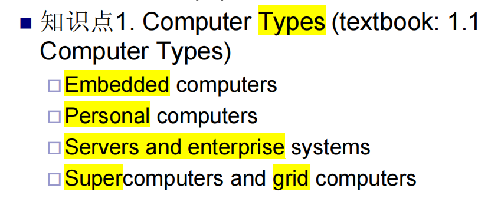

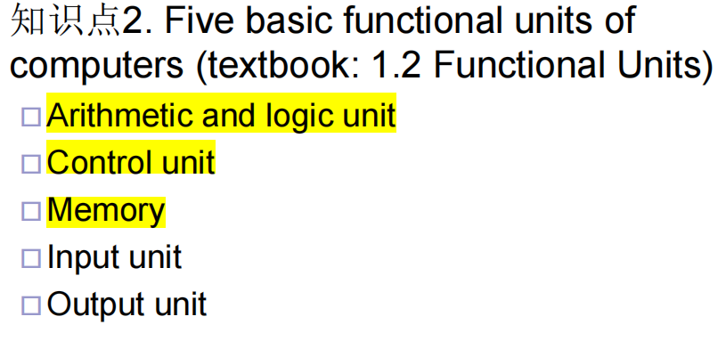

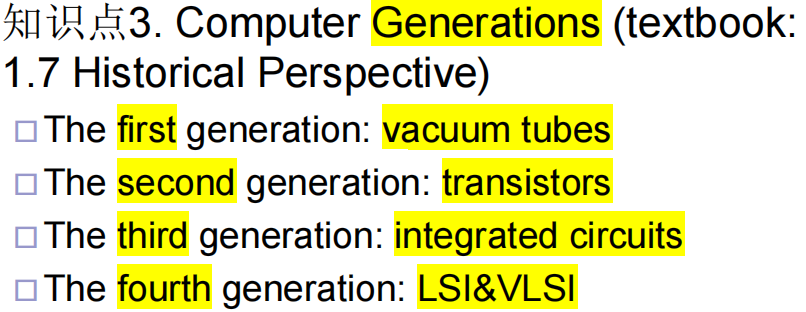

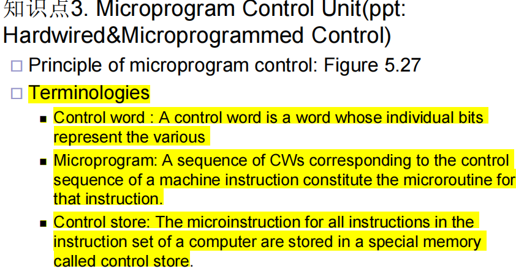

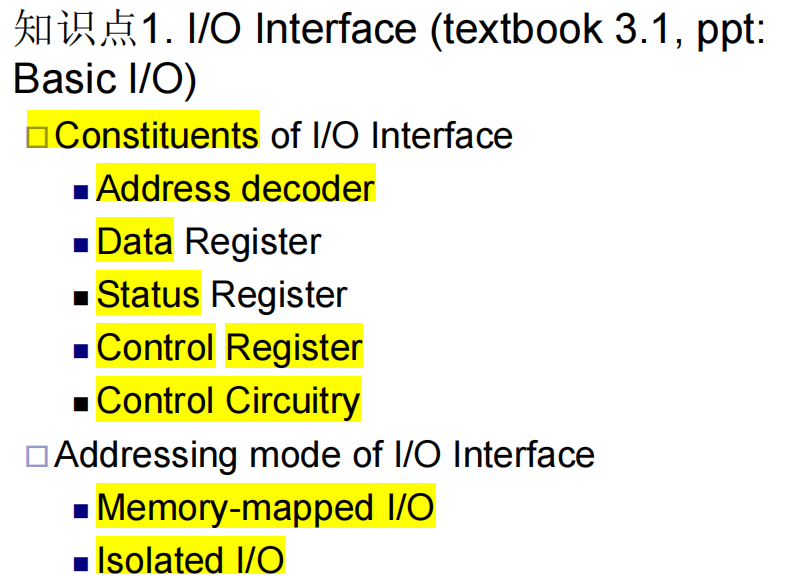


# chapter 9

## 小知识点

- Signed 2's Complement：通过对绝对值取反再加1来表示负数，**避免了双零问题，并且可以统一处理有符号和无符号整数的运算**，因此更为常见和广泛采用。
- 

## 大知识点

## 补码整数范围怎么列

相当于**最高位符号位一直加个负的**

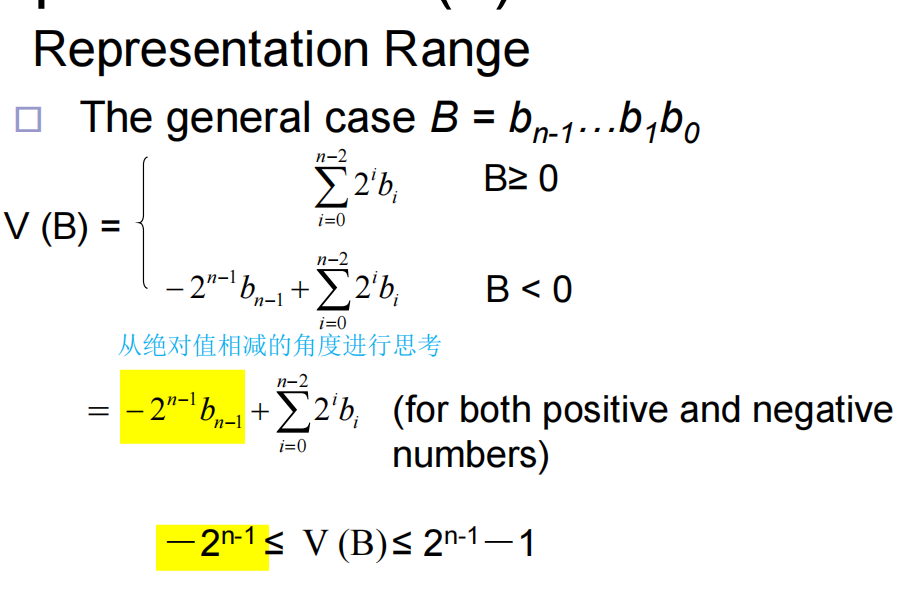

## 怎样判别溢出

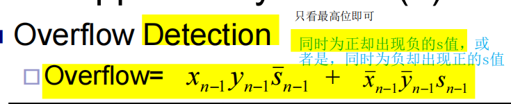

## 半加器

半加器（Half Adder）是数字逻辑电路中最基础的构建模块，也是理解计算机如何进行“加法”运算的第一步。

你可以把它想象成**计算机算术界的“幼儿园小朋友”**：它只会算最简单的 **1位 + 1位**，而且它记性不太好，**不知道之前有没有进位**传给它。

下面我从**功能、真值表、逻辑表达式、电路图**以及**“为什么叫半加器”**这几个方面为你详细拆解。

------

### 1. 它的功能是什么？

半加器的任务非常单一：**将两个 1 位的二进制数相加**。

- **输入 (Inputs)**：两个 1 位的数，通常记为 **$A$** 和 **$B$**。
- **输出 (Outputs)**：
	1. **本位和 ($S$, Sum)**：当前位的加法结果（如果**不考虑进位的话**）。
	2. **进位输出 ($C$, Carry / $C_{out}$)**：是否**产生了进位**（也就是结果是否超过了1）。

------

### 2. 真值表 (Truth Table) —— 它的“运算口诀”

二进制只有 0 和 1，所以两个数相加只有 4 种情况。我们来看看半加器是怎么处理的：

| **输入 A** | **输入 B** | **进位 C (Carry)** | **和 S (Sum)** | **十进制理解**       |
| ---------- | ---------- | ------------------ | -------------- | -------------------- |
| 0          | 0          | **0**              | **0**          | $0+0=0$              |
| 0          | 1          | **0**              | **1**          | $0+1=1$              |
| 1          | 0          | **0**              | **1**          | $1+0=1$              |
| 1          | 1          | **1**              | **0**          | $1+1=2$ (二进制是10) |

**重点看最后一行 ($1+1$)：**

- 在二进制里，$1+1=10$。
- 那个“0”留在了本位，所以 **$S=0$**。
- 那个“1”进到了高位，所以 **$C=1$**。

------

### 3. 逻辑表达式与电路实现

通过上面的真值表，我们可以反推出它内部是用什么逻辑门（Gate）做出来的。

#### A. 看“和” ($S$)

- 观察真值表：当 A 和 B **不一样**时（一个0一个1），$S$ 是 1。当 A 和 B **一样**时（都是0或都是1），$S$ 是 0。

- 这正是 **异或门 (XOR Gate)** 的逻辑！

- **公式**：

	$$S = A \oplus B$$

#### B. 看“进位” ($C$)

- 观察真值表：只有当 A 和 B **同时为 1** 时，$C$ 才是 1。

- 这正是 **与门 (AND Gate)** 的逻辑！

- **公式**：

	$$C = A \cdot B$$

	 (即 A AND B)

- 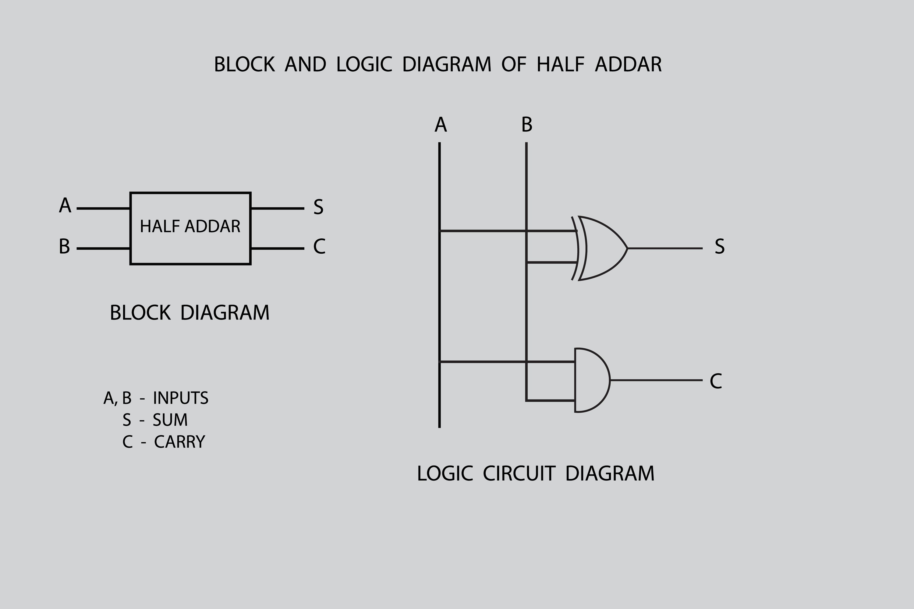

------

### 4. 核心问题：为什么叫“半”加器 (Half Adder)？

这是考试最常考的概念题。既然它能算加法，为啥叫“半”个？

**因为它“不接纳”来自低位的进位。**

想象你在做多位数的加法（比如 $11 + 01$）：

- **最低位 (第0位)**：$1+1$。可以用半加器算，结果是 0，进位 1。
- **次低位 (第1位)**：$1+0$。但是！你必须要把第0位传上来的那个“进位 1”也加进去，实际上你要算的是 **$1 + 0 + 1$**。

半加器的缺陷：

**它只有两个输入口 ($A, B$)，没有第三个输入口来接收低位的进位信号 ($C_{in}$)。**

因为它只能处理“一半”的任务（只管自己加，不管进位输入），所以叫半加器。

对比全加器 (Full Adder)：

全加器有 3个输入 ($A, B, C_{in}$)，能处理低位进位，那才是一个完整的加法单元。

------

### 总结

1. **是什么**：算 $A+B$ 的简单电路。
2. **结果**：输出 $S$ (Sum) 和 $C$ (Carry)。
3. **公式**：$S = A \oplus B$ (异或)，$C = A \cdot B$ (与)。
4. **缺点**：**没有进位输入端 ($C_{in}$)**，所以只能用于二进制加法的最低位，或者作为全加器的组成零件。

### 组成全加器

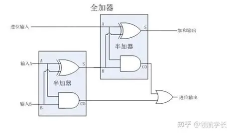

**全加器 = 2 个半加器 + 1 个 OR 门 (或门)**。

它的核心逻辑其实就是小学数学里连加法的思想：**先把前两个数加起来，再把结果和第三个数相加。**

下面我用最直观的三步法带你像“搭积木”一样把全加器拼出来：

### 🧱 准备材料

- **半加器 1号 (HA1)**：负责处理 $A$ 和 $B$。
- **半加器 2号 (HA2)**：负责处理“中间结果”和 $C_{in}$。
- **或门 (OR Gate)**：负责收集进位。

------

### 🛠️ 拼装步骤 (Step-by-Step)

#### 第一步：先加 A 和 B (半加器 1)

首先，我们忽略进位输入，先只管 $A$ 和 $B$ 相加。

- **输入**：$A, B$
- **输出**：
	- **半和 (Half Sum)**：记为 $S_1$。这是 $A$ 和 $B$ 加完后的临时结果。
	- **半进位 (Half Carry)**：记为 $C_1$。这是 $A$ 和 $B$ 是否产生了进位。

#### 第二步：加上进位 $C_{in}$ (半加器 2)

现在我们手里**有了临时结果 $S_1$，**我们要**把它和低位传上来的进位 $C_{in}$ 加在一起。**

- **输入**：$S_1$ (来自半加器1的输出), $C_{in}$ (外部输入的进位)
- **输出**：
	- **最终和 (Final Sum)**：这是**全加器最终的 $S$ 输出**。
	- **第二半进位 (Carry 2)**：记为 $C_2$。这是**这一步加法是否产生了进位。**

#### 第三步：谁进位了？ (或门)

想一想，什么情况下全加器需要向更高位进位？

1. 要么是第一步 $A+B$ 就溢出了 (即 $C_1=1$)。
2. 要么是第二步 $S_1 + C_{in}$ 溢出了 (即 $C_2=1$)。
3. **注意**：这两种情况**不可能同时发生**（因为 $A+B+C_{in}$ 最大等于 3，即二进制 `11`，**进位最多是 1**）。

既然只要有一个进位就算进位，我们就用一个 **或门 (OR Gate)** 把 $C_1$ 和 $C_2$ 连接起来。

- **最终进位输出 ($C_{out}$)** = $C_1 \text{ OR } C_2$。

------

### 📝 逻辑公式验证

我们可以通过公式来看它们是怎么“套娃”的：

1. **最终的和 ($Sum$)**：
	- 半加器1：$A \oplus B$
	- 半加器2：$(A \oplus B) \oplus C_{in}$
	- **结果**：$S = A \oplus B \oplus C_{in}$ （这就实现了三个数相加的异或逻辑）
2. **最终的进位 ($C_{out}$)**：
	- 半加器1产生进位：$A \cdot B$
	- 半加器2产生进位：$(A \oplus B) \cdot C_{in}$
	- **结果**：$C_{out} = (A \cdot B) + ((A \oplus B) \cdot C_{in})$

### 💡 总结

用半加器组全加器，本质上就是把 **"A + B + C"** 拆成了 **"(A + B) + C"**。

- **第一个半加器**：算括号里的。
- **第二个半加器**：算括号外面的。
- **或门**：只要任何一步产生了进位，最后都要进位。

## 1位全加器中和与进位输出的逻辑表达式和逻辑图

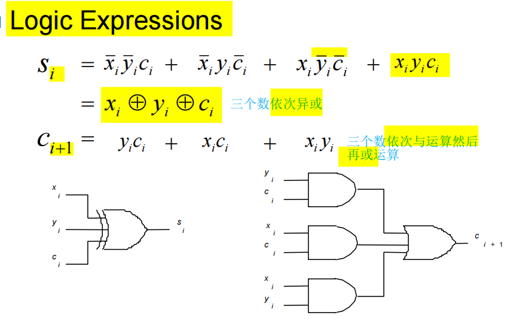

## 行波进位加法器

### 分析各位和以及进位的时间延迟

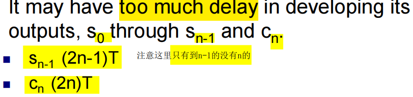

### Gi和Pi的逻辑表达式

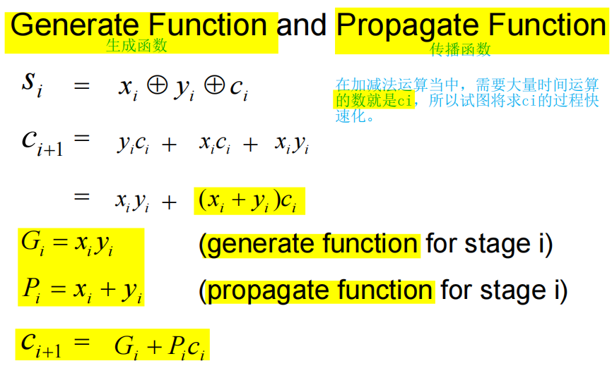

### 画出bit-stage cell的逻辑框图


## 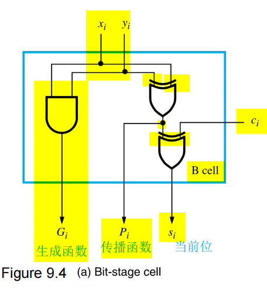

### 4位先行进位加法器中各进位的表达式

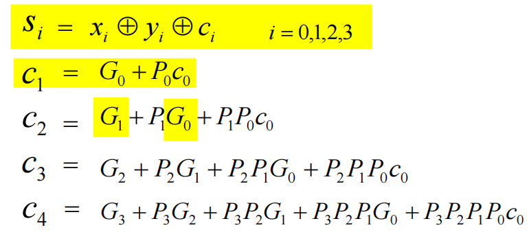

### 4位先行进位加法器的逻辑框图

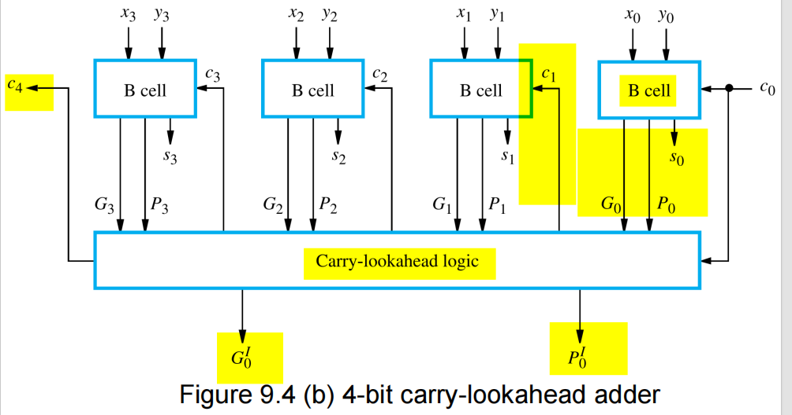

### 理论上n位先行进位加法器中和与进位的时间延迟(与位数 $n$ **无关**。)

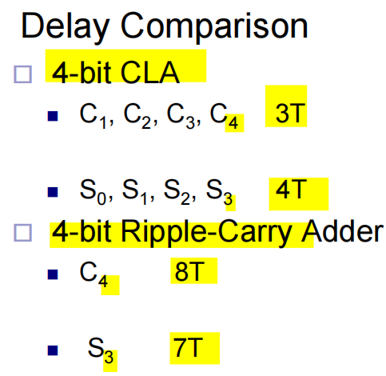


**你的 PPT 采用了一个简化的模型：**

- **非门（NOT）延迟：** 通常忽略不计，或者认为包含在输入信号准备中。
- **无限扇入（Infinite Fan-in）：** 这是“理论上”最大的前提。理想的 CLA 假设我们可以构建具有任意多输入端的 AND 门和 OR 门，并且它们的延迟仍然保持为 $1\tau$。
- 所有基本逻辑门（AND, OR, XOR）的延迟都被视为**相等的 1 个时间单位**（记为 1T）。

------

### 按照 PPT 模型重新推导 CLA 延迟

让我们基于“所有门延迟均为 1T”这个假设，结合 CLA 的结构图（`image_3.png`）和延迟对比图（`image_11.png`）来重新计算。

我们**设定输入 xi,yi,c0 在 t=0 时刻准备好。**

#### 1. 第一阶段：生成 Pi 和 Gi 信号

- 在图 `image_3.png` 的 "**B cell**" 中**并行计算**：
	- Gi=xi⋅yi （经过**一个 AND 门**）
	- Pi=xi⊕yi （经过**一个 XOR 门**）
- **根据 PPT 假设**：这两个操作都耗时 **1T**。
- **状态**：在 **t=1T 时，P 和 G 信号准备就绪。**

#### 2. 第二阶段：生成所有进位信号 (C1∼C4)

- 这些信号在图 `image_3.png` 底部的 "Carry-lookahead logic" 大方框中生成。
- 这个逻辑块内部是一个**两级逻辑结构（先 AND 后 OR）**，输入是刚才算好的 P 和 G 信号。
	- 第一级（AND 阵列）：耗时 1T。
	- 第二级（OR 汇总）：耗时 1T。
- **总时间**：P/G 准备时间 (1T) + AND 层时间 (1T) + OR 层时间 (1T) = **3T**。
- **结论**：所有进位 C1,C2,C3,C4 在 **3T** 时刻同时产生。
- **验证**：这与你的 PPT `image_11.png` 中显示的 "**4-bit CLA ... C1,C2,C3,C4 3T**" 完全一致。

#### 3. 第三阶段：生成和信号 (S0∼S3)

- 和信号的**计算公式是 Si=Pi⊕Ci−1。**这个操作发生在图 `image_3.png` 的 "B cell" 内部，需要等待进位信号传回来。
- **依赖信号**：
	- Pi：在 t=1T 时已准备好。
	- Ci−1：前一位的进位，在 t=3T 时才准备好（除了 S0 用的是 c0，其他都要等）。
- **计算延迟**：必须等待最慢的信号（即 Ci−1），**然后再进行一次 XOR 运算。**
- **总时间**：Ci−1 准备时间 (3T) + 最后的 XOR 运算时间 (1T) = **4T**。
- **结论**：所有和信号 Si 在 **4T** 时刻产生。
- **验证**：这与你的 PPT `image_11.png` 中显示的 "**4-bit CLA ... S0,S1,S2,S3 4T**" 完全一致。

------

### 总结

你指出的差异是非常关键的。在你的课程体系中，请务必记住这个特定的延迟模型结论：

对于 **4位 CLA**（基于 PPT 的简化门延迟假设）：

- **产生所有进位 (C) 的时间是：3T**。
- **产生所有和 (S) 的时间是：4T**。

### 用较少位数的先行进位加法器构造更多位数的加法器并分析出各位和与进位的时间延迟

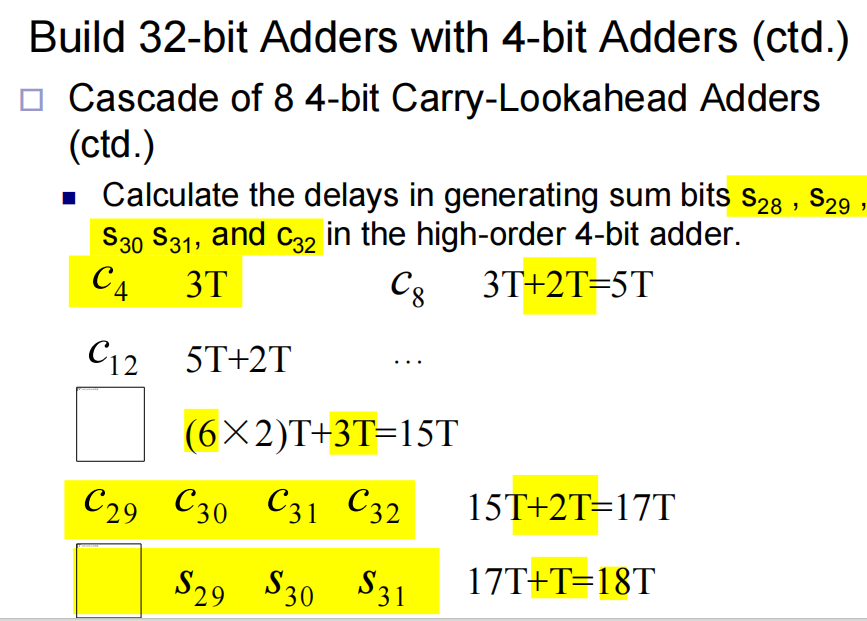

## Sequential Multiplier

**乘数 (Multiplier) 的位宽 $n$**。**,这里右移是** **算术**右移,不需要符号扩展

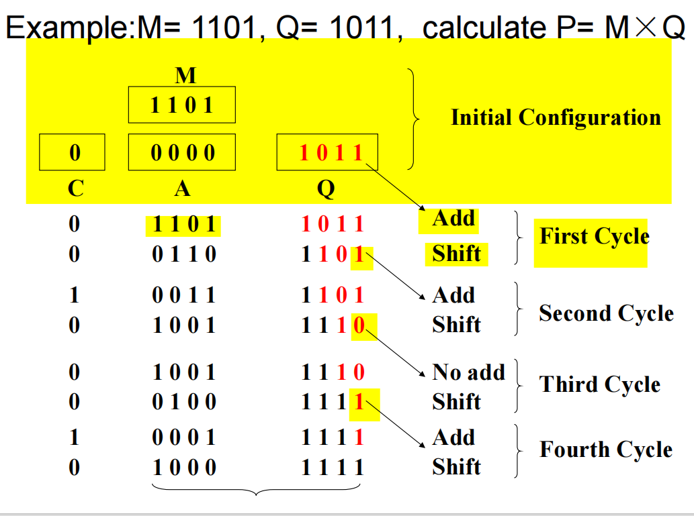

## 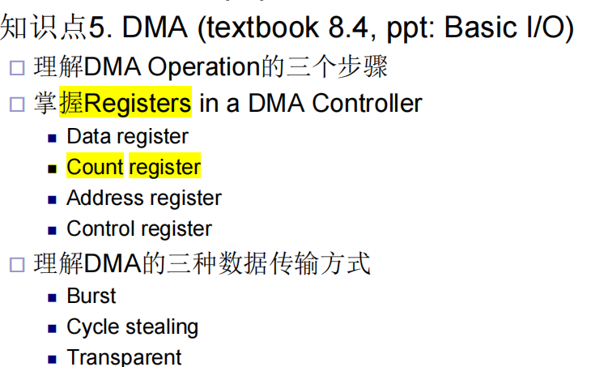

这里右移是**逻辑右移,需要符号扩展**,取决于 **乘数 (Multiplier) 的位宽 $n$**。

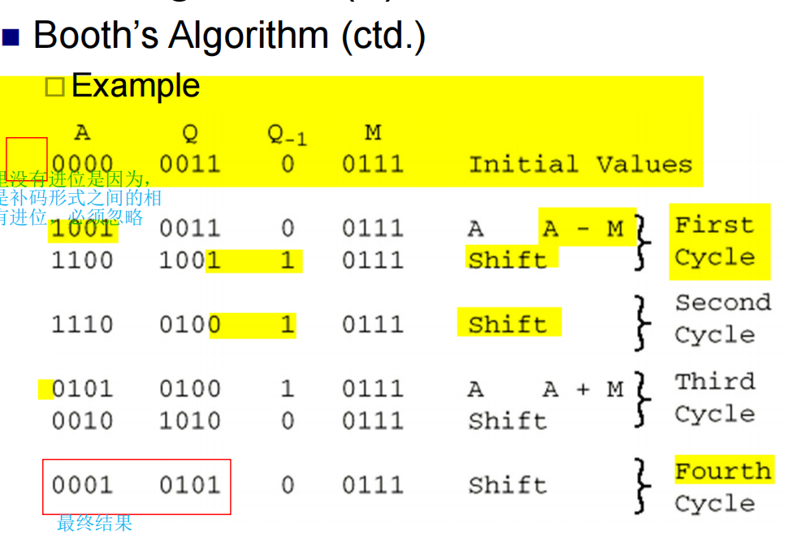

### Recoding

需要补$x_{-1}$位=0

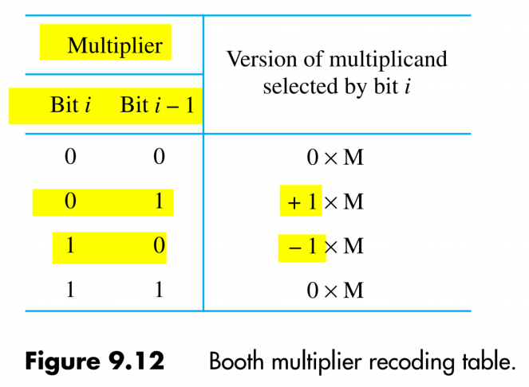

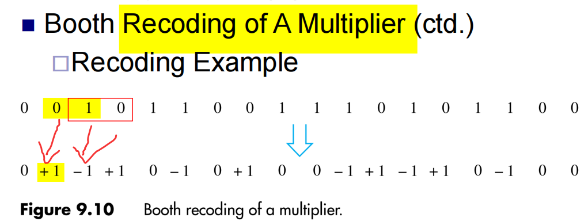

###  手工算法将转换后的乘数与被乘数相乘

**为0可只写1个,最后至少还会有1个扩展符号,共2*n位,溢出位也是丢弃**

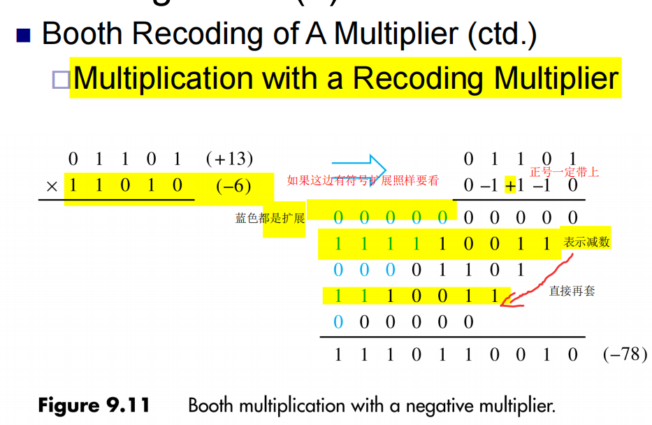

## Nonrestoring division

这边**先移**

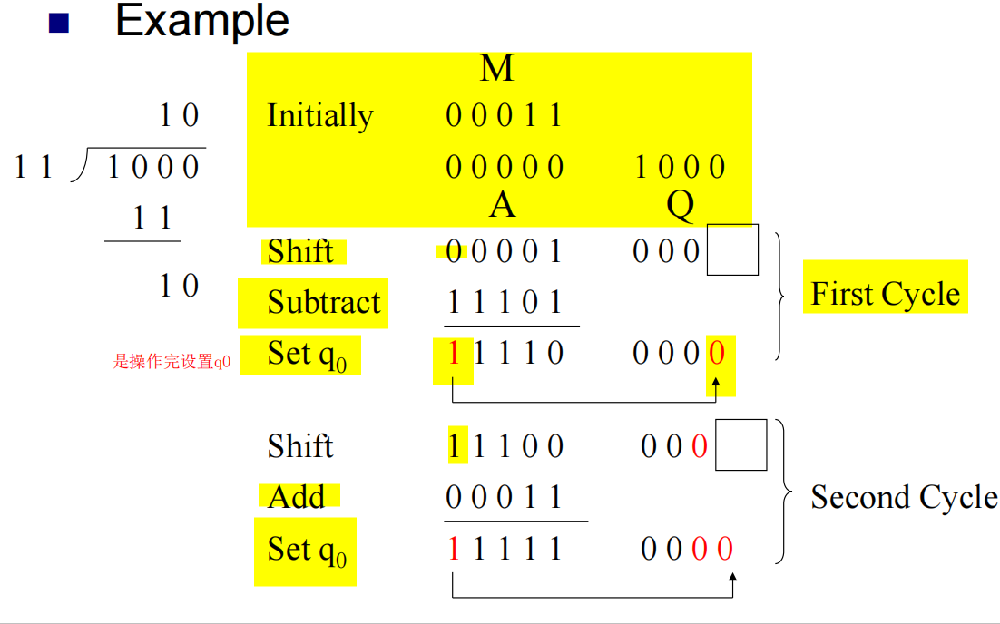


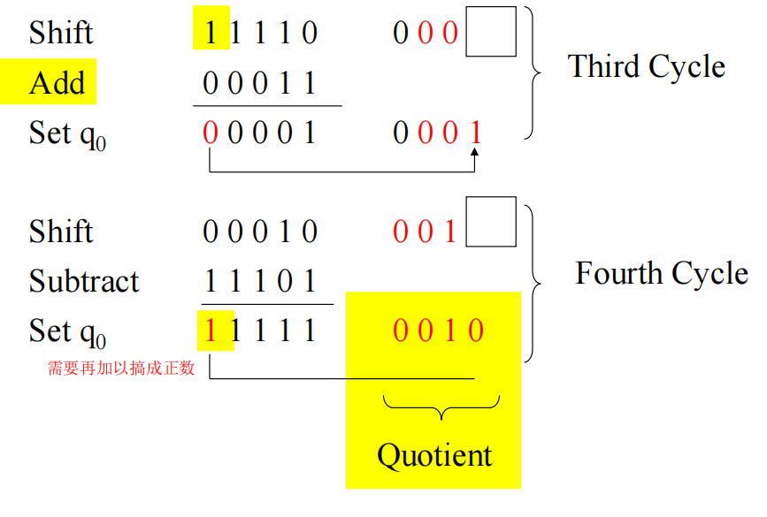


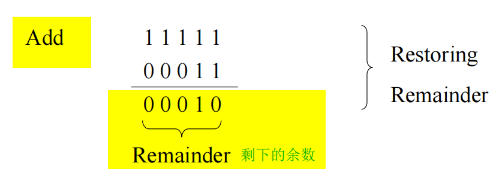


这是考试时最容易混淆的地方，请务必记这张表：

| **特性**         | **乘法 (Multiplication)**            | **除法 (Division)**                |
| ---------------- | ------------------------------------ | ---------------------------------- |
| **移位方向**     | **右移 (Right Shift)** $\rightarrow$ | **左移 (Left Shift)** $\leftarrow$ |
| **M 存什么**     | **被**乘数 (**Multiplicand**)        | **除数 (Divisor)**                 |
| **Q 最终存什么** | 乘积的低位 (Product Low)             | **被**除数 ,**商 (Quotient)**      |
| **A 最终存什么** | 乘积的高位 (Product High)            | **余数 (Remainder)**               |
| **初始化 A**     | 0                                    | 0 (或被除数高位)                   |

## Single Precision

先记格式和公式和最精准范围,看好是不是**问尾数范围!!!**

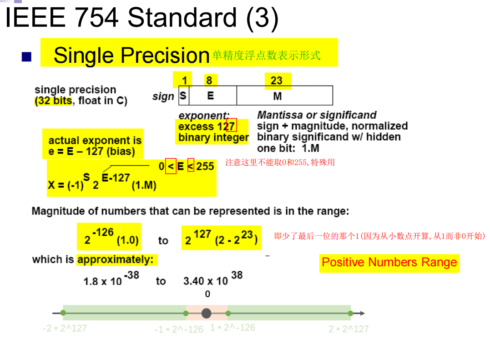

**IEEE 754 标准下的单精度浮点数 (Single Precision Floating Point)** 的格式。这是计算机系统（以及 C 语言中的 `float` 类型）存储小数的最标准方式。

我把它拆解为三个核心部分来为你解释：**结构组成**、**计算公式**、以及两个**关键设计概念**。

------

### 1. 结构组成 (32 Bits 总长)

计算机用 **32位 (32 bits)** 的二进制串来表示一个浮点数，这 32 位被切分成了三段：

- **S (Sign, 符号位) - 1位**
	- 位于最高位（第 31 位）。
	- **0** 代表正数 (+)。
	- **1** 代表负数 (-)。
	- 公式里的 $(-1)^S$ 就是由这一位控制的。
- **E (Exponent, 阶码/指数位) - 8位**
	- 位于**中间（第 30-23 位）。**
	- 用来存储指数部分，决定了**数的大小范围（Magnitude）。**
	- **关键点**：这里存的是 **移码 (Biased Representation)**，**不是直接的补码**。
- **M (Mantissa / Significand, 尾数位) - 23位**
	- 位于最后（第 22-0 位）。
	- 用来**存储有效数字**，决定了**数的精度（Precision）**。

------

### 2. 核心计算公式

图中最显眼的公式是**理解这一页的钥匙：**

$$X = (-1)^S \times 2^{E-127} \times (1.M)$$

- **$(-1)^S$**：决定正负。
- **$2^{E-127}$**：
	- 这里的 **$E$ 是这就是你存储在 8 位阶码里的无符号整数（0~255）**。
	- **实际的指数 (Actual Exponent) $e = E - 127$**。
	- 为什么要**减 127？是为了能表示负指数**（比如 $2^{-5}$ 代表很小的数）。
- **$(1.M)$**：
	- 这是**实际的有效数字**。
	- 注意公式里有个 **"1."**，这叫 **隐含位 (Hidden Bit)**。

------

### 3. 两个必须掌握的“坑” (考试必考)

#### A. 为什么要用 Bias (偏置值) 127？ (Excess-127)

- 阶码 $E$ 是 8 位，**能表示 0 到 255。**
- 但我们需要表示 $2^{-10}$ 这种很小的数，也需要 $2^{10}$ 这种很大的数。
- 为了不使用符号位（让比较大小更容易），IEEE 754 规定：**存进去的时候加 127，取出来计算的时候减 127。**
	- 如果你想表示指数 **0**，存进去就是 **127** (`01111111`)。
	- 如果你想表示指数 **-1**，存进去就是 **126**。
	- 如果你想表示指数 **+1**，存进去就是 **128**。

#### B. 什么是 Hidden Bit (隐藏位)？

- 在二进制的科学计数法（规格化数）中，**数字总是写成 $1.xxxx \times 2^{yy}$ 的形式。**
- 既然**整数部分永远是 1**，那我们在存储时就**没必要浪费一位去存这个 1**。
- **做法**：只在 M (23位) 中存储小数点**后面**的部分。
- **读取时**：硬件会自动在 M 前面补上一个 "1."。
	- *例如*：如果 M 存的是全 0，代表的数值其实是 $1.000...$

------

### 4. 表示范围 (Range)

图片下半部分展示了这种格式能表示的数值范围：

- **最小值 (绝对值)**：大约是 $1.0 \times 2^{-126}$ (约为 $1.18 \times 10^{-38}$)。
- **最大值**：大约是 $2 \times 2^{127}$ (约为 $3.4 \times 10^{38}$)。

总结一句话：

这张图告诉你，要把一个小数存进电脑，先把它变成 $(-1)^S \times 1.M \times 2^{e}$ 的形式，然后把 $S$ 存高位，把 $e+127$ 存中间，把 $M$ (去掉整数1) 存低位。

## Double Precision

这里**不涉及补码,不是整数**,都是用**原码表示的,加减时也是**,注意**进制是2而不是10**

## 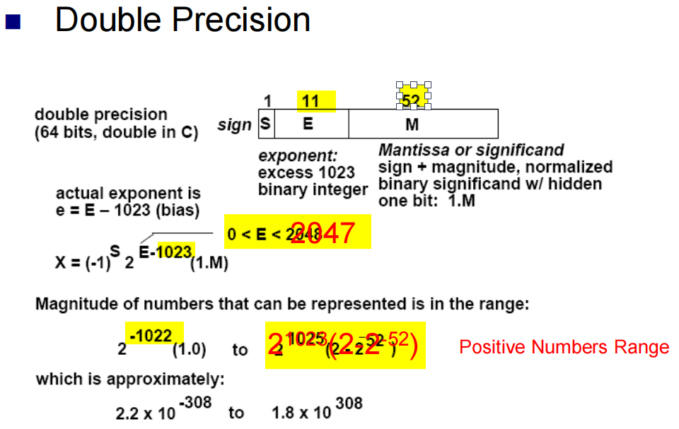

## Four Special Values

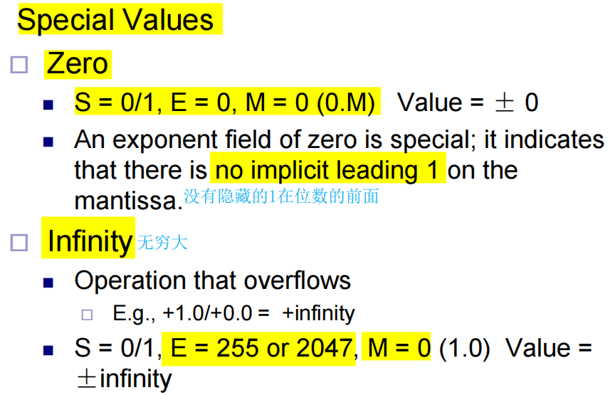

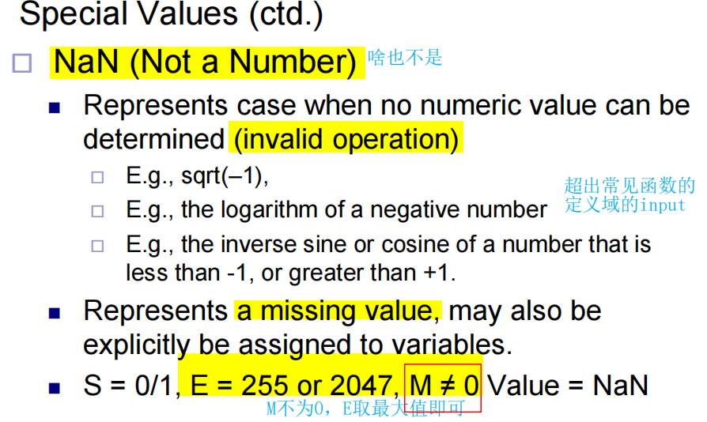

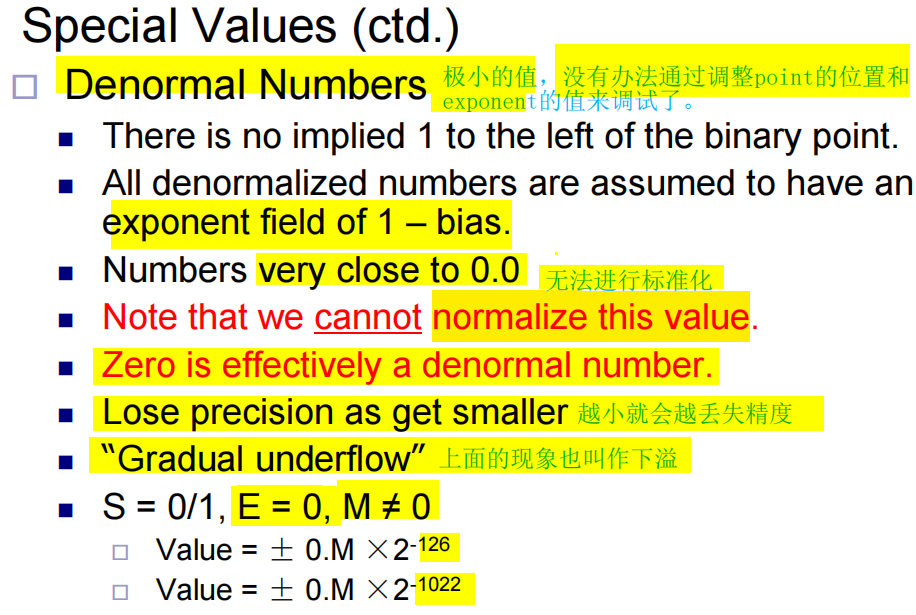

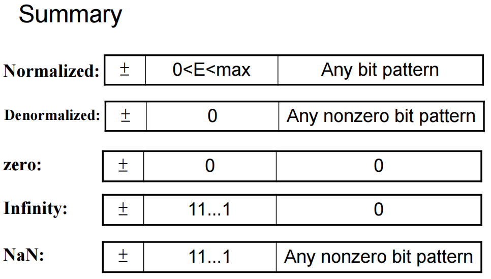

## 浮点数加减法

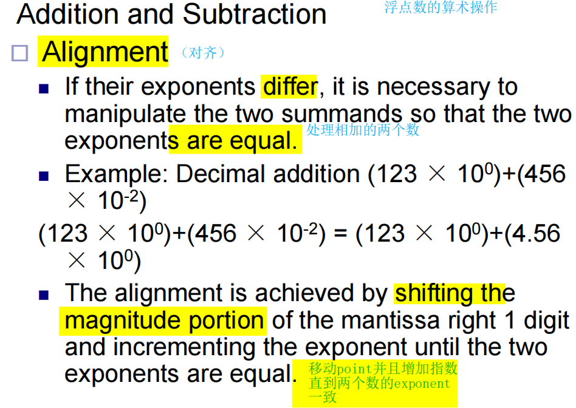

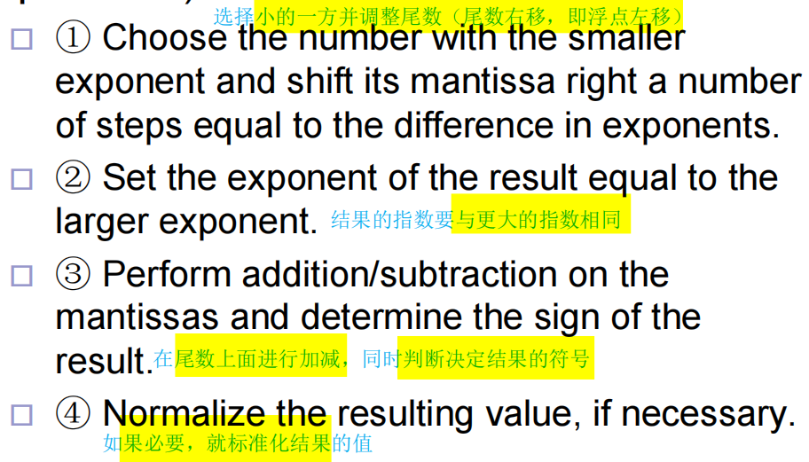

**4 个标准步骤**（这也是你做大题时的标准解题步骤），并重点标注了**容易丢分**的细节。

------

### ⚠️ 预备知识：操作数的形态

在开始运算前，你必须把机器里的二进制串（32位）还原成数学形式：


$$Val = (-1)^S \times (1.M) \times 2^{E - 127}$$

- **隐含位 (Hidden Bit)**：一定要记得尾数前面有一个隐含的 **“1.”**。
- **真阶码**：拿到 $E$ 之后，**记得减去 Bias (127) 得到真实的指数 $e$。**

------

### 🚀 步骤一：对阶 (Alignment) —— “小阶看齐大阶”

这是浮点运算的第一步，也是最容易出错的一步。

1. 求阶差 ($\Delta E$)：

	计算两个数**指数的差值**：$\Delta E = E_x - E_y$。

2. **对齐原则**：**小阶看齐大阶**。

	- 为什么？因为把小阶数的尾数**右移**（缩小），**丢失的是最低位的精度（误差小）**；如果**把大阶数的尾数左移（扩大），最高位会被移丢**，数值会发生剧烈变化甚至错误。

3. **操作**：

	- 阶码小的那个数，其尾数（包括隐含的 `1.`）向**右移** $\Delta E$ 位。
	- 阶码随之增加，直到等于大阶码。
	- **重点**：移出去的位**不要直接丢掉**，要保留在 **Guard Bits (保护位)** 里（就像你刚才问的那张PPT讲的），用于后续的舍入。

> **口诀**：阶码求差，小阶动，尾右移。

------

### 🚀 步骤二：尾数求和 (Significand Addition/Subtraction)

现在两个数的阶码相同了（都等于大阶），可以把它们的**尾数当作普通定点小数进行加减。**

- **公式**：$M_{sum} = M_x \pm M_y$
- **注意**：这里的 $M$ 是包含了 **“1.”** 的完整尾数。
- **符号处理**：如果是减法，或者**异号相加，使用补码加法规则（减一个数等于加它的补码）。**

------

### 🚀 步骤三：规格化 (Normalization) —— “左归与右归”

加减完的结果可能不是标准的 $1.xxxx$ 形式，需要调整。这一步分为两种情况：

#### 1. 右归 (Right Shift / Post-normalization)

- **触发条件**：尾数运算结果**溢出**了（比如 $1.1 + 1.1 = 11.0$）。
	- 此时尾数变成 $1x.xxxx$（整数部分变成了 2 位）。
- **操作**：
	- 尾数 **右移 1 位**。
	- 阶码 **+1**。
- **风险**：**阶码 +1 后可能会超过 127（254）**，导致 **上溢 (Overflow)**。

#### 2. 左归 (Left Shift)

- **触发条件**：尾数运算结果**太小**了（比如 $1.001 - 1.000 = 0.001$）。
	- 此时整数部分是 0，甚至小数点后好几位都是 0。
- **操作**：
	- 尾数不断 **左移**，直到最高位出现有效的 `1`（恢复成 $1.xxxx$）。
	- 左移了几次，阶码就 **减几**。
- **风险**：**阶码减太多可能会小于 -126（0）**，导致 **下溢 (Underflow)**。

------

### 🚀 步骤四：舍入 (Rounding)

在对阶或右归的过程中，可能会有数据被移出寄存器（在保护位里）。根据 IEEE 754 标准，需要对结果进行舍入，以**适应 23 位的尾数限制**。

常见的舍入模式（Review 课上可能不会考太细，但要直到有这一步）：

1. **就近舍入 (Round to Nearest Even)**：这是**默认**模式。**看保护位**，如果**大于 0.5 就进位**；如果**等于 0.5，则向LSB偶数舍入**。
2. **0舍1入 (Round toward Zero)**：**直接截断（Truncation）**。

------

### 🚀 步骤五：溢出判断 (Check Exception)

最后检查调整后的阶码 $E$：

- **Overflow (上溢)**：阶码 $E > 254$（即真值指数 $> 127$）。表示数值太大，无穷大。**这是报错。**
- **Underflow (下溢)**：阶码 $E < 1$（即真值指数 $< -126$）。表示数值太小，接近 0（非规格化数）。

------

### 📝 考试大题解题模板 (Example Walkthrough)

假设题目：计算 $X + Y$，其中 $X = 1.010 \times 2^2$, $Y = 1.100 \times 2^1$。

1. **对阶**：
	- $E_x = 2, E_y = 1$。差值为 1。
	- $Y$ 阶码小，对 $Y$ 操作：尾数右移 1 位，阶码变为 2。
	- $Y' = 0.110 \times 2^2$ (注意：原来的 $1.100$ 变成了 $0.110$，最右边的 0 移入保护位)。
2. **尾数求和**：
	- $M_x = 1.010$
	- $M_{y'} = 0.110$
	- $Sum = 1.010 + 0.110 = 10.000$ (注意这是二进制，$1+1=10$)。
	- 暂时结果：$10.000 \times 2^2$。
3. **规格化**：
	- 当前尾数 $10.000$ 不符合 $1.xxxx$ 格式（整数位有两位）。
	- **右归**：尾数右移 1 位 $\rightarrow 1.000$。
	- 阶码 +1 $\rightarrow 2 + 1 = 3$。
	- 结果：$1.000 \times 2^3$。
4. **检查溢出**：
	- 阶码 3 在正常范围内。
	- **最终结果**：$1.000 \times 2^3$。

### 总结一张表

| **步骤**      | **关键动作**                 | **易错点**                                   |
| ------------- | ---------------------------- | -------------------------------------------- |
| **1. 对阶**   | **小阶变大阶**，尾数右移     | 别忘了尾数里隐含的那个 "1" 也要一起移。      |
| **2. 求和**   | 带符号加减                   | 减法变补码加法；注意符号位处理。             |
| **3. 规格化** | 大了右移(阶+)，小了左移(阶-) | **右归**可能导致上溢；**左归**可能导致下溢。 |
| **4. 舍入**   | 处理保护位                   | 只有在对阶或右归时才会产生多余位。           |


## 疑问

## carry-out signal是什么意思啊

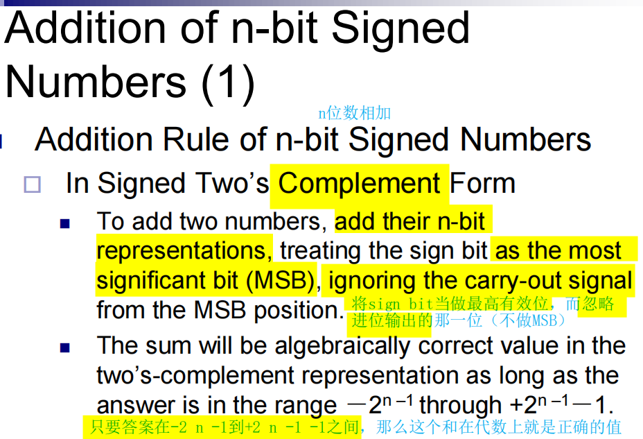

这里的 **"carry-out signal"** 指的是 **“最高位进位信号”**（也叫 **进位输出**）。

在 **$n$ 位二进制补码加法**中，它的具体含义和处理方式如下：

### 1. 通俗解释

想象你的计算器只能显示 4 位数字。当你计算加法时，如果最高位（最左边的那一位，符号位）相加后产生了一个进位，这个进位会“溢出”到第 5 位。

**这个第 5 位的 1，就是 carry-out signal。**

PPT 的规则是：**“Ignoring the carry-out signal”** —— 也就是说，**直接把这个进位丢掉，不要管它**。

------

### 2. 举个例子（4位补码）

假设我们要计算 **(-1) + (-2)**。

- **(-1)** 的 4 位补码是 `1111`
- **(-2)** 的 4 位补码是 `1110`

我们来进行二进制加法：

Plaintext

```
    1 1 1 1   (-1)
+   1 1 1 0   (-2)
-----------
  1 1 1 0 1
  ↑
这一位就是 carry-out signal (进位输出)
```

**根据规则：**

1. 我们算出来的结果是 5 位数 `11101`。
2. PPT 说 **Ignoring (忽略)** 最高位的进位。
3. 所以我们丢掉最左边的 `1`，只保留剩下的 4 位：`1101`。
4. **验证结果**：`1101` 在 4 位补码中代表 **-3**。
5. $(-1) + (-2) = -3$，**结果正确！**

------

### 3. 为什么要忽略它？

在 **补码（Two's Complement）** 系统中，运算是**基于 模 $2^n$ 进行的。**

- 产生的**这个 Carry-out 代表数值 $2^n$（比如 4 位系统中，它代表 16）**。
- 在模运算中，**加减一个 $2^n$ 相当于原地转了一圈，不会改变这个数在系统里的“真值”**。
- 因此，**直接扔掉这个进位**，剩下的 $n$ 位就是数学上正确的结果。

### 4. 易混淆点：Carry-out ≠ Overflow

请特别注意，**有 Carry-out（进位输出）并不代表发生了 Overflow（算术溢出）**。

- **Carry-out**：**只是最高位产生了一个进位，在补码运算中经常发生（如负数加负数）**，通常直接丢弃即可。
- **Overflow**：是指结果超出了 $n$ 位数能表示的范围（**比如符号位在运算后发生了改变**）。

**总结：** 在这句话里，它的意思就是**“加法运算中，如果符号位（最高位）相加产生了一个进位，直接把它丢掉，剩下的 n 位就是结果。”**

## 详细解释一下这里的减法实现是什么意思,我感觉图片中说的好别扭

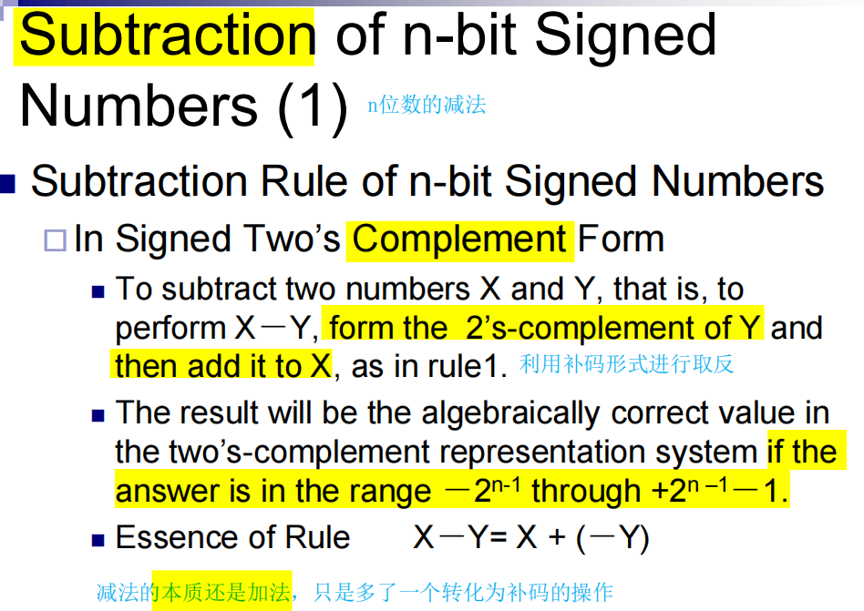

### 1. 为什么觉得别扭？

你感到别扭的原因可能在于对 **“Two's Complement” (补码)** 这个词的理解有歧义。它在计算机里有两个含义：

1. **名词**：一种表示负数的数据格式（比如：-3 的补码形式是 `1101`）。
2. **动词（操作）**：一个数学动作，即**“求补操作”**。意思是“**对一个数取反加1**”。

**PPT 里这句话的意思是动作：**

> "Form the 2's-complement of Y"
>
> 人话翻译：对 Y 进行“**求补操作(而不是直接用Y补码)**”（即**按位取反**，末位加 1）。
>
> 数学含义：这个操作**等同于求 $-Y$(直接表示-Y后相加即可)。**

------

### 2. 详细解释：减法是如何变加法的？

PPT 里的公式是本质：

$$X - Y = X + (-Y)$$

在计算机硬件设计中，造一个“加法器”很容易，但再造一个“减法器”既浪费钱又占地方。既然减去一个数 $Y$ 等于加上它的相反数 $-Y$，那么我们只需要：

1. 把 $Y$ 变成 $-Y$。
2. 然后把它扔进加法器和 $X$ 相加。

**在二进制补码系统中，“求 $-Y$”的方法就是“求补”：**

1. **按位取反 (Invert bits)**：把 0 变 1，1 变 0。
2. **末位加 1 (Add 1)**。

------

### 3. 举个栗子 (4位二进制)

假设我们要算：**$5 - 2 = ?$**

- **$X$ (被减数)** = 5，二进制是 `0101`
- **$Y$ (减数)** = 2，二进制是 `0010`

按照 PPT 的步骤来操作：

#### 第一步：Form the 2's-complement of Y (把减数变负数)

我们要把 $2$ (`0010`) 变成 $-2$：

1. **取反**：`0010` $\rightarrow$ `1101`
2. **加 1**：`1101 + 1` = `1110`
3. 现在我们得到了 **`1110`** (这就是 **-2 的补码表示**)。

#### 第二步：Add it to X (把它加到 X 上)

现在执行 $5 + (-2)$：

$$\begin{array}{r@{\quad}l}  0101 & (5) \\ +\; 1110 & (-2) \\ \hline 10011 &  \end{array}$$

#### 第三步：忽略进位 (Recall previous slide)

根据上一张关于加法的规则，我们需要 Ignoring the carry-out signal (忽略最高位的进位)。

丢掉最前面的 1，结果是：0011。

0011 是多少？是 3。

$5 - 2 = 3$。计算正确！

------

### 4. 总结 PPT 的逻辑

PPT 那段话翻译过来就是：

为了计算 $X - Y$：

1. **"Form the 2's-complement of Y"**：算出- $Y$ 的补码。
2. **"and then add it to X"**：然后把它和 $X$ 相加。
3. **"as in rule 1"**：按照之前讲过的加法规则（忽略最高位进位）处理结果。

一句话总结：

减法 = 被减数 + (减数的全部位取反 + 1)。

## 在求Y的原码到补码表示时,符号位是不取反的,但是对Y进行求补操作求-Y时,符号位也要取反

### 1. 场景一：数值的定义（原码 → 补码）

**场景**：**已知**一个负数的**原码**（比如 `-5`），我要**写出它的补码形式**存储在计算机里。

- **规则**：符号位**不变**（保持为 1），数值位取反，末位加 1。
- **为什么符号位不变？** 因为我们**只是在换一种格式“书写”**这个负数。**它原来是负的，转换成补码后还得是负的，所以符号位必须由 1 保持为 1**。

> **例子（4位）：**
>
> - −5 的原码：`1 1 0 1` (最高位 1 是符号)
> - 转补码过程：
> 	1. 保留符号位 `1`。
> 	2. 数值位 `101` 取反 → `010`。
> 	3. 加 1 → `011`。
> - 结果：`1 0 1 1` (符号位依然是 1)

------

### 2. 场景二：数学运算（求 −Y 的值 / 求补操作）

**场景**：PPT 里的减法运算 X−Y=X+(−Y)。我们需要把 Y 变成 −Y。

- **规则**：**全部位（包括符号位）** 按位取反，末位加 1。
- **为什么符号位要变？** 因为这是在做**变号**操作。
	- 如果 Y 是正数，−Y 就是负数（**符号位** 0→1）。
	- 如果 Y 是负数，−Y 就是正数（符号位 1→0）。
- **PPT 的语境**：PPT 说 "Form the 2's-complement of Y"，这里的 Y 是作为一个整体（寄存器里的所有位）。**ALU 在执行减法指令时，它不知道（也不在乎）Y 原来是正还是负，它只执行机械的“按位取反 + 1”。**这一步操作在电路级就是把**所有位**都翻转一遍。

> **例子（4位）：** **假设 1：Y=2 (正数)**
>
> - Y 的补码：`0 0 1 0`
> - 求 −Y (即 -2)：
> 	1. **全部位**取反：`1 1 0 1` (你看，符号位从 0 变 1 了)
> 	2. 加 1：`1 1 1 0`
> - 结果：`1 1 1 0` (这是 -2 的补码，正确！)
>
> **假设 2：Y=−5 (负数)**
>
> - Y 的补码：`1 0 1 1`
> - 求 −Y (即 -(-5) = +5)：
> 	1. **全部位**取反：`0 1 0 0` (符号位从 1 变 0 了)
> 	2. 加 1：`0 1 0 1`
> - 结果：`0 1 0 1` (这是 +5 的补码，正确！)

### 总结

- **定义转换时**（人脑手动转）：是为了“保持”负号，所以符号位不动。
- **求相反数时**（**ALU 硬件执行**）：是**为了“改变”正负性**，所以连同符号位一起翻转。

PPT 中讲的是**ALU 硬件执行减法**的逻辑，所以属于**场景二**：它不管 Y 是什么，直接对其所有位取反加 1，从而**得到 −Y**。

## $c_0$的作用是什么

在加法器（Adder）电路中，$c_0$（有时也写为 $C_{in}$）指的是**最低位进位输入 (Initial Carry-in / Least Significant Carry Input)**。

它的作用主要取决于**当前加法器**是在执行**加法**运算还是**减法**运算。这是一个非常精妙的硬件设计技巧，使得**同一个加法器电路既能做加法也能做减法**。

以下是它的具体作用详解：

### 1. 做普通加法时 ($X + Y$)

- **作用**：表示没有来自更低位的进位。
- **设置**：**$c_0 = 0$**。
- **原理**：直接计算 $X + Y + 0$，结果就是 $X + Y$。

------

### 2. 做减法时 ($X - Y$) —— **这是考试最常考的用法**

结合你刚才问的“减法实现”，我们知道计算机计算 $X - Y$ 实际是计算 $X + (\text{Y的补码})$。

而求 $Y$ 的补码 = (对 $Y$ 按位取反) + 1。

- **作用**：它负责提供那个“**+1**”。
- **设置**：**$c_0 = 1$**。
- **原理**：
	1. 硬件把 $Y$ 的**所有位通过非门（Inverter）取反**，得到 $\bar{Y}$（反码）。
	2. 加法器计算 $X + \bar{Y} + c_0$。
	3. 当 $c_0 = 1$ 时，这就变成了 $X + \bar{Y} + 1$。
	4. 这正是 $X - Y$ 的补码运算公式。

**结论**：利用 $c_0$ 设置为 1，我们就不需要专门为了“加 1”这个动作再设计一个独立的加法步骤，从而在一次运算周期内完成减法。

------

### 3. 级联扩展时 (Cascading)

如果你用两个 4-bit 的加法器拼成一个 8-bit 的加法器：

- **低 4 位加法器**：$c_0$ 通常为 0（或是上一级的进位）。
- **高 4 位加法器**：它的 $c_0$ 接收来自**低 4 位加法器的进位输出 ($C_{out}$)**。
- **作用**：**传递进位信号**，将多个小加法器连接成大加法器。

## 最下面的$G0^I$ 和$P0^I$分别是什么意思

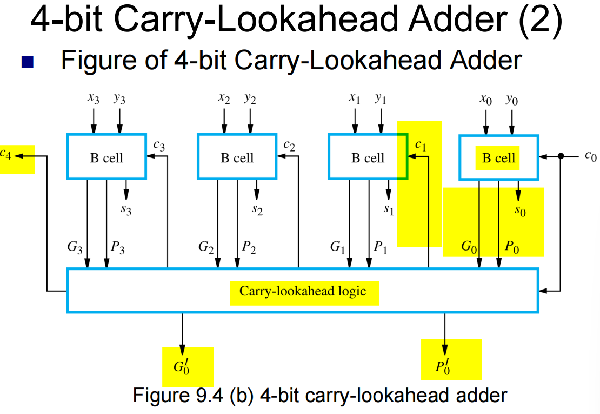

它们是 **块（Block）** 级别的生成与传播信号，用于构建**多级**或**成组**的超前进位加法器（例如**把 4 个 4-bit CLA 连成一个 16-bit 加法器**）。

### 1. 符号含义

- **$P_0^I$ (Block Propagate / 块传播信号)**
	- **含义**：表示 **“第 0 块”**（通常**指第 0-3 位这 4 位**）**是否允许来自最低位的进位信号（$C_0$）直接穿透整个块传输出去**。
	- **通俗理解**：就像一条畅通无阻的管道。如果这个信号为 1，说明如果有一个进位进来了，它肯定会从另一头跑出去。
	- **逻辑**：只有**当这块里每一位都能传播进位时，整个块才能传播。**
	- **公式**：$P_0^I = P_3 P_2 P_1 P_0$ （**4位均为传播状态**）。
- **$G_0^I$ (Block Generate / 块生成信号)**
	- **含义**：表示 **“第 0 块”** 是否能 **自己产生** 一个**进位信号输出到下一块**，而**不管**是否有进位输入。
	- **通俗理解**：就像这块内部自己“造”了一个进位扔出去。
	- **逻辑**：**要么最高位（第3位）自己产生进位；要么第2位产生进位并传过第3位；以此类推**。
	- **公式**：$G_0^I = G_3 + P_3 G_2 + P_3 P_2 G_1 + P_3 P_2 P_1 G_0$。(**没有c1,c0**那部分)

------

### 2. 它们是干什么用的？

它们的目的是为了**加速进位计算**。

如果没有这两个信号，计算第 16 位的进位（$C_{16}$）需要等待 $C_{15}, C_{14} ...$ 一级级传上来（行波进位），速度太慢。

有了这两个“打包好”的信号，高层的逻辑电路可以直接用类似计算单位的公式，**一步算出块与块之间的进位**：

$$C_4 = G_0^I + P_0^I C_0$$

- **$C_4$** 是**第 0 块（0-3位）输出给第 1 块（4-7位）的进位。**
- **只要第 0 块自己生成了进位（$G_0^I=1$），或者有进位进来且被打通了（$P_0^I C_0 = 1$），$C_4$ 就为 1。**

### 总结

- **$P_0^I$**：**“如果有人给我进位，我就传下去。”** (全通)
- **$G_0^I$**：**“不管有没有人给我进位，我自己能造一个送下去。”** (自产)

## 图中转换后的蓝框中最后一位又该怎么recode出来?是恒为0还是保留原来的值?

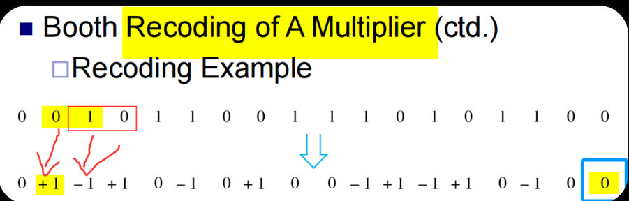

在 **Booth 算法**（以及 **Bit-Pair Recoding / 基4 Booth 算法**）中，你看到的那个位于最低位（LSB）右边的“额外一位”（通常画在框里用来凑数的），是**恒为 0** 的。

这一位在数学上被称为 **$x_{-1}$ (Implied Zero)**。

### 1. 直接答案

是恒为 0。

它不是保留原来的值，也不是复制上一位。无论你的乘数是什么，这一位永远默认为 0。

------

### 2. 为什么要加这个 0？

Booth 算法的核心逻辑是“**看当前位 ($x_i$) 和右边一位 ($x_{i-1}$) 的变化**”来决定是加、减还是不操作。

- **对于中间的位**：比如看第 2 位时，我们可以看第 1 位（右边一位）。
- **对于最低位 ($x_0$)**：它的右边没有“真实”的位了。
	- 为了让算法的规则（比如 $x_i x_{i-1}$ 的判断逻辑）对最低位也能通用，我们需要**假想**有一个**第 -1 位存在**。
	- 这个第 -1 位被定义为 **0**。
	- **物理意义**：表示运算开始前，我们处于“无进位/无借位”的初始平衡状态。

### 3. 举例说明 (Bit-Pair Recoding / 基4)

假设我们要对乘数 **$0011010$** 进行 Bit-Pair Recoding（三位一组 recoding）：

我们从最右边开始分组：

1. **第一组（最低位）**：需要看 $(x_1, x_0, x_{-1})$。
	- $x_1, x_0$ 是真值。
	- **$x_{-1}$ 必须补 0**。
	- 所以第一组蓝框里看到的是：`1 0 (0)`（括号里就是那个恒为0的位）。
2. **第二组**：看 $(x_3, x_2, x_1)$。
	- 这里每一位都是真值。

### 总结

在图中转换时，**最右侧（最低位）** 那个用来辅助判断的“幽灵位” **$x_{-1}$ 永远是 0**。记住这个规则，做 Booth 算法的题目就不会出错了！

## 这一页的biased representation 是怎么得来的

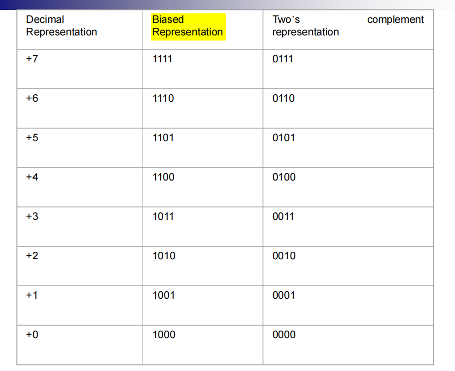

**移码表示法 (Biased Representation)**，也常被称为 **Excess-K** 表示法。

在这张特定的表中，使用的 **Bias (偏置值)** 是 **8**。

它是通过以下步骤得来的：

### 1. 计算公式

移码的核心思想是将**一个有符号的数（这就包括负数、0、正数）**加上一个**正的常数（Bias）**，从而把它的范围平移到非负数区间，**变成一个无符号数来存储**。

公式为：

$$\text{Biased Representation (无符号形式)} = \text{Decimal Value (真值)} + \text{Bias (偏置值)}$$

### 2. 怎么推算出这张表的 Bias 是 8？

我们可以直接看表中最简单的一行来反推：

- 看 **Decimal +0** 这一行。
- 对应的 **Biased Representation** 是 `1000`。
- 二进制 `1000` 对应的十进制数是 **8**。
- 根据公式：$0 + \text{Bias} = 8$。
- 所以，**Bias = 8**。

### 3. 验证其他数值

让我们用 **Bias = 8** 来验证表里的其他数据：

- **对于 +7：**
	- 计算：$7 + 8 = 15$
	- 15 的 4 位二进制是 `1111`。
	- **表中数据：** `1111` (一致)
- **对于 +3：**
	- 计算：$3 + 8 = 11$
	- 11 的 4 位二进制是 `1011` (8+2+1)。
	- **表中数据：** `1011` (一致)

### 4. 为什么要用这种表示法？

这种表示法最常见的用途是在 **IEEE 754 浮点数标准** 的 **阶码 (Exponent)** 部分。

- **优点**：它把**所有的数都变成了无符号的正整数**。
- **好处**：这样在**比较两个浮点数大小时，不需要处理符号位，直接像比较无符号整数一样比较阶码的大小**即可（`1111` 肯定比 `1000` 大，代表指数更高）。

总结：

这一页的 Biased Representation 是通过 真值 + 8，然后转换成 4位二进制 得来的。

## 详细讲解这页什么意思

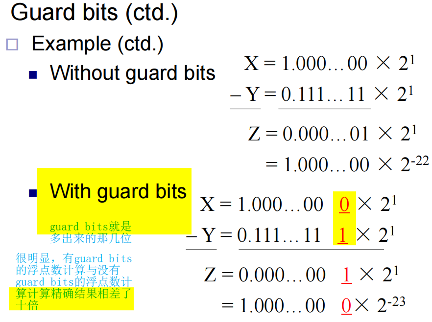

这张 PPT 确实讲得非常抽象，全是省略号和公式。但它所讨论的 **"Guard Bits" (保护位)** 是浮点数运算（特别是减法）中**防止精度通过“崩塌式”丢失**的一个极重要的硬件设计细节。

我用大白话配合一个**极简的例子**来为你拆解这一页的内容。

------

### 1. 核心问题：为什么要用 Guard Bits？

在做浮点数加减法时，有一个必须的步骤叫 **“对阶” (Alignment)**。

- 规则是：**小阶看齐大阶**。
- 操作是：阶数小的那个数，其尾数要**向右移**，直到阶数和大的那个一样。

问题来了：

当你**把尾数向右移的时候，最右边的数字会被移出去（掉进“悬崖”里消失了）。**

如果你直接把移出去的位扔掉（截断），然后再做减法，结果可能会产生巨大的误差。

Guard Bits 的作用：

在运算器（ALU）内部，**临时多给你几个“格位”（通常是右边多加几位），专门用来接住那些因为移位而本来要掉下去的数字。**等算完了，再**根据这些保留下来的位进行修约（Rounding）。**

------

### 2. 详细解读 PPT 里的算式

这张 PPT 对比了 **“没有保护位”** 和 **“有保护位”** 两种情况下的计算结果。

#### 场景设定（假设）

我们要计算 $X - Y$。

- $X = 1.000...00 \times 2^1$ （大数）
- $Y$ 原本是 $1.111...11 \times 2^0$ （小数，比 X 小一点点）

为了计算，先把 $Y$ 的阶码从 $2^0$ 变成 $2^1$，尾数必须**右移一位**。

------

#### 情况 A：Without guard bits (没有保护位) —— 悲剧发生

当我们把 $Y$ 右移一位时：

- **移位前**：$Y = 1.11...11$
- **移位后**：$Y$ 变成了 $0.11...11$。
- **丢失**：最末尾原本那个 **1**，因为寄存器位宽不够，直接**被扔掉了**（Truncated）。

**减法运算**：

$$\begin{array}{r}  1.000...00 \\ - 0.111...11 \\ \hline  0.000...01 \end{array}$$

- **结果**：算出来是 $0.000...01 \times 2^1$。
- **规格化**：为了变成标准格式 $1.xxxx$，我们需要向左移很多位。假设最后变成了 **$1.0 \times 2^{-22}$**。

------

#### 情况 B：With guard bits (有保护位) —— 拯救精度

PPT 中黄色的框 **"With guard bits"** 也就是在寄存器右边**多加了一位**（标红的那个位置）。

当我们把 $Y$ 右移一位时：

- **移位前**：$Y = 1.11...11$
- **移位后**：$Y$ 变成了 $0.11...11\mathbf{\color{red}{1}}$。
- **保留**：最末尾那个 **1** 没有丢，而是掉进了 **Guard Bit** 里存着。

减法运算（注意看借位）：

$X$ 的保护位默认补 0。

$$\begin{array}{r}  1.000...00\mathbf{\color{red}{0}} \\ - 0.111...11\mathbf{\color{red}{1}} \\ \hline  0.000...00\mathbf{\color{red}{1}} \end{array}$$

- **计算细节**：因为 $0$ 减 $1$ 不够减，要向前面借位。这一借，前面的 $0$ 全变成了 $1$，最后一直借到最高位。
- **结果**：算出来是 $0.000...001 \times 2^1$。
- **规格化**：注意！这个结果里的 `1` 比情况 A 里的 `1` **更靠右了一位**。
- **最终结果**：规格化后变成了 **$1.0 \times 2^{-23}$**。

------

### 3. 结论：为什么 PPT 说“相差十倍”？

PPT 里的中文注释写着“相差了十倍”。这其实是个口语化的表达，或者指的是**数量级**上的差异。

- 没有保护位：结果是 $2^{-22}$。
- 有保护位：结果是 $2^{-23}$。
- **差异**：两者相差了 **2 倍**（**二进制的一个数量级**）。

这说明了什么？

如果不使用 Guard Bit，在这个特定的减法例子中，计算结果的误差高达 100%（算出的数比真实值大了整整一倍）。这在科学计算中是不可接受的灾难。

### 总结一句话

**Guard Bits 就是运算时的“安全气囊”，专门在移位对阶的时候，接住那些差点被丢掉的有效数字，从而保证减法运算的精度。**


# chapter 8 

## 小知识点

- big-endian 一种数据存储方式，指的是**在内存中将高位字节存储在低地址中，而低位字节存储在高地址中**。这种存储方式使得数据的**高位字节先出现，类似于字符串的顺序处理**。
- SDRAM **同步动态随机存取内存**（**Synchronous** Dynamic Random Access Memory）的缩写.DDR是“双倍数据速率同步动态随机存取内存”（Double Data Rate SDRAM）的缩写。
- address line数量是**二次方对应的(选址信号组出数)**,data line是**逐个bit对应的(具体数据由各bit位组成数)**
- 对于**按字节编址**,容量值大小代表memory**可存储多少个字节byte,而非bit**
- 对**大容量存储器(非单芯片)**,地址范围跟总共地址线数量**不一定2次幂对应**,但跟**芯片数量**是对应的

## 大知识点

## Byte ordering: big-endian, little-endian

**Byte Ordering (字节序)** 解决的核心问题是：**当一个数据（如 32 位整数）跨越多个内存地址时，它的哪一部分放在低地址，哪一部分放在高地址？**

我们以十六进制数 **`0x12345678`** 为例（这是一个 4 字节的整数）。

- **MSB (Most Significant Byte, 最高有效字节)**: `0x12` (**数值最大的那头**)
- **LSB (Least Significant Byte, 最低有效字节)**: `0x78` (**数值最小的那头**)

------

### 1. Big-Endian (大端模式)

**定义**：**最高有效字节 (MSB)** 存放在 **最低的内存地址**。

- **口诀**：**“高位在低址” (Big end first)**。
- **直观理解**：这**符合人类的阅读习惯（从左到右）**。网络协议（如 TCP/IP）通常采用这种标准，所以也叫 **Network Byte Order**。

**内存布局 (假设起始地址为 100)**： | 地址 (Address) | 数据 (Value) | | :--- | :--- | | **100 (低)** | **12 (MSB)** | | 101 | 34 | | 102 | 56 | | **103 (高)** | **78 (LSB)** |

------

### 2. Little-Endian (小端模式)

**定义**：**最低有效字节 (LSB)** 存放在 **最低的内存地址**。

- **口诀**：**“低位在低址” (Little end first)。**
- **直观理解**：看起来是“反着”的。**x86 架构 (Intel/AMD)** 使用这种模式。

**内存布局 (假设起始地址为 100)**： | 地址 (Address) | 数据 (Value) | | :--- | :--- | | **100 (低)** | **78 (LSB)** | | 101 | 56 | | 102 | 34 | | **103 (高)** | **12 (MSB)** |

------

### ⚠️ 考试做题“防坑”指南

1. **单位是字节 (Byte)，不是位 (Bit)**：
	- 题目给的数通常是 Hex (十六进制)。**两个 Hex 数字组成一个字节**。
	- 例如 `0x1A2B`，`1A` 是一个整体，`2B` 是一个整体。
	- **错误示范**：把 `1` 放在地址 100，`A` 放在地址 101。这是错的！
	- **正确做法**：`1A` 放在地址 100（如果是 Big-endian）。
2. **字 (Word) vs 字节 (Byte)**：
	- 如果题目说“Memory is byte-addressed”（按字节编址），那就是上面的画法。
	- 如果题目让你画出寄存器里的值，寄存器内部通常不分大小端，大小端只涉及**数据在内存 (Memory)** 和 **寄存器 (Register)** 之间传输时的顺序。
3. **字符串不受影响**：
	- 如果是 **ASCII 字符串 "ABC"，无论是大端还是小端**，内存里永远是 `'A'(41)` 在低地址，`'B'(42)` 在高地址。只有**多字节数值（int, float, pointers）才涉及字节序。**

### 🚀 快速自测题

假设内存地址从 0x200 开始，写入 32 位整数 `0xABCD1234`。 请写出地址 **0x200** 和 **0x203** 里的内容。

- **Big-Endian**:
	- 0x200: **AB** (最高位)
	- 0x203: **34** (最低位)
- **Little-Endian**:
	- 0x200: **34** (最低位)
	- 0x203: **AB** (最高位)

## 半导体存储器读写操作原理

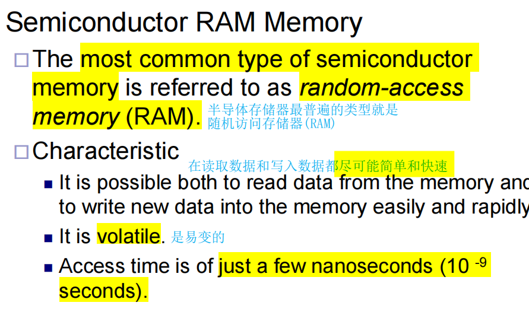

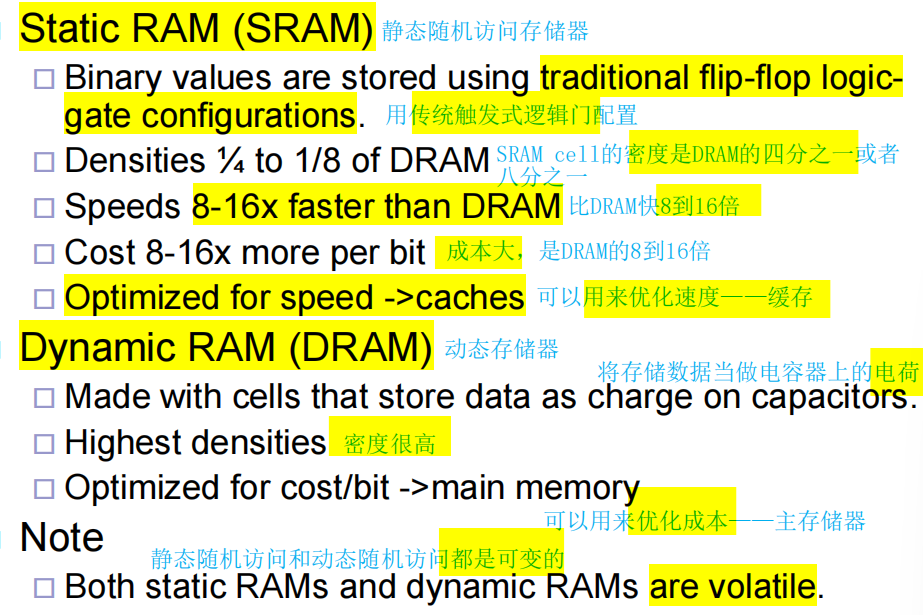

## SRAM芯片的外部引脚

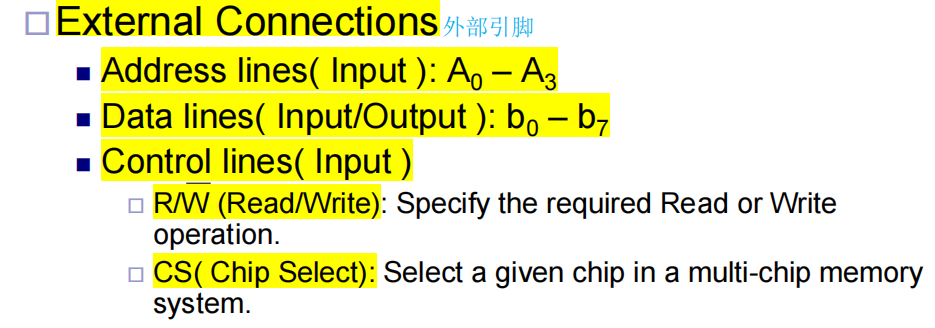

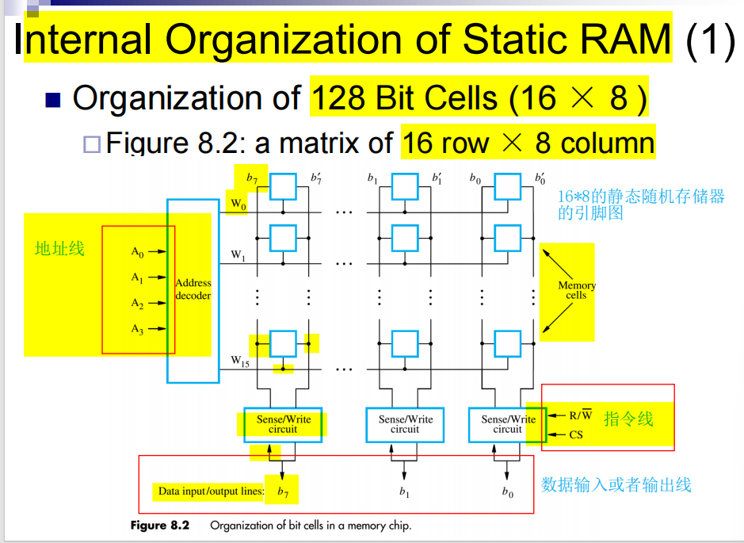

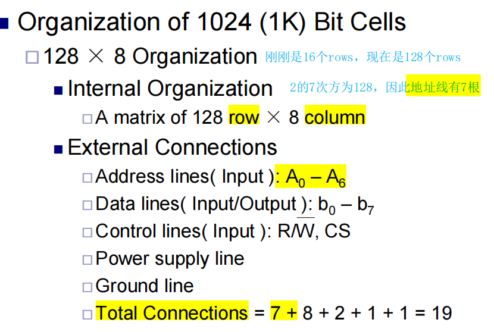

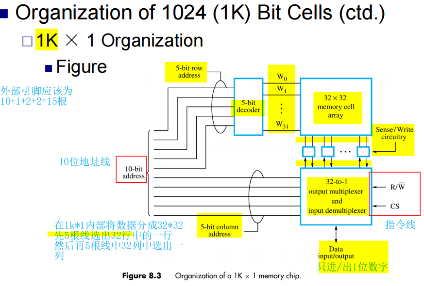

## DRAM芯片为什么需要refresh

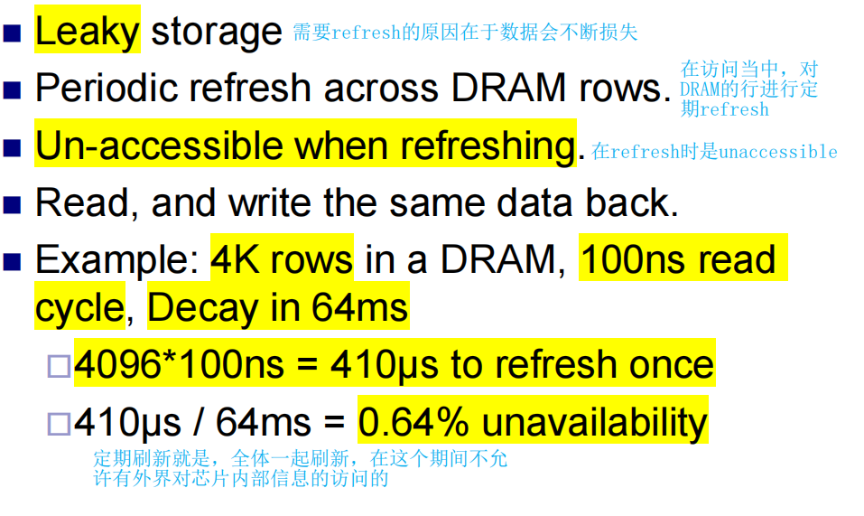

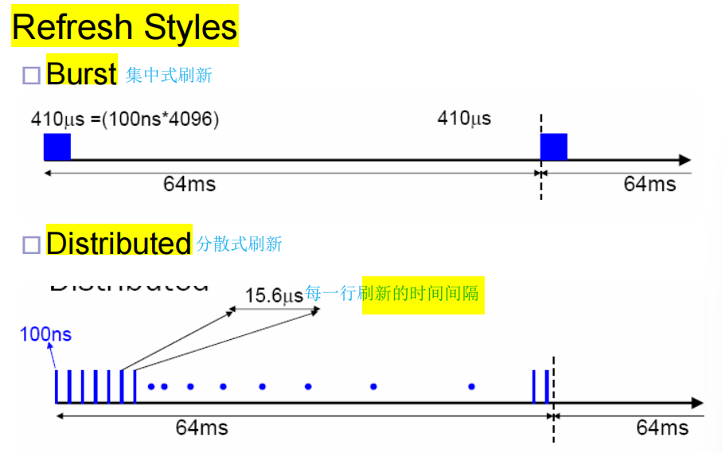

## DRAM芯片的外部引脚

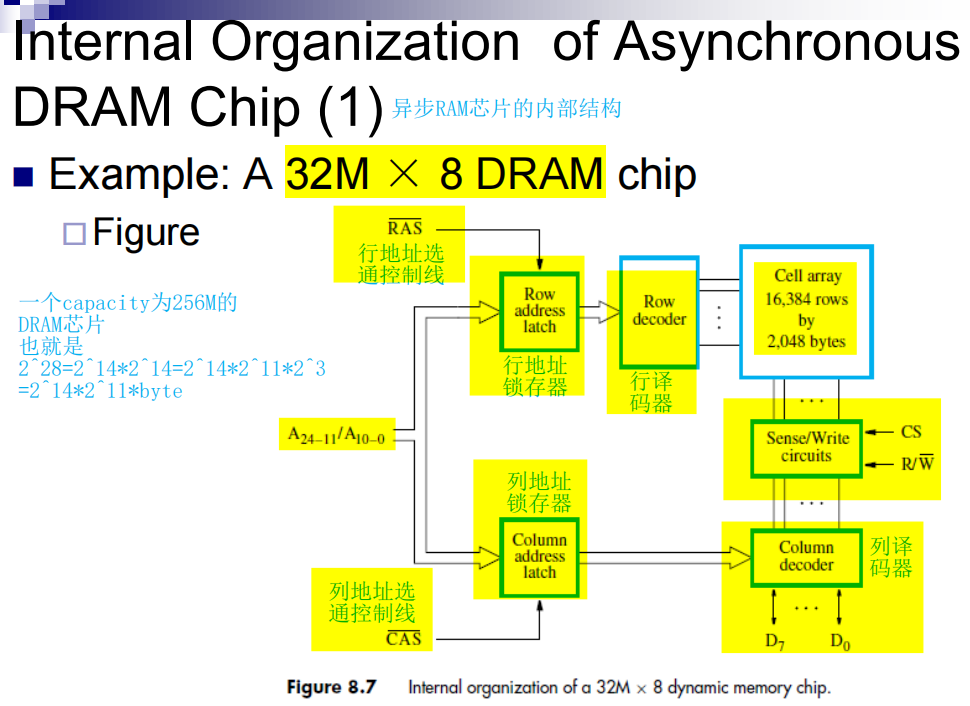

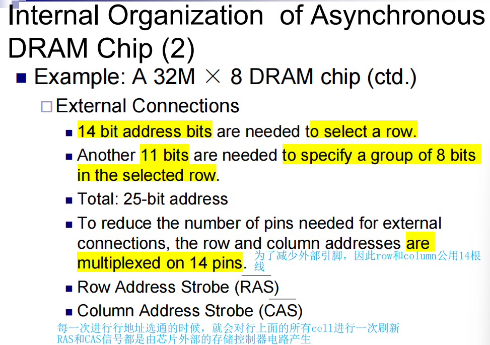

## Burst操作


## SDRM的Latency


## Bandwidth


DDR 的全称其实是 **DDR SDRAM**。也就是说，**DDR 是 SDRAM 的一种进化版本**。

我为你把它们拆解开来总结：

------

### 1. SDRAM (Synchronous DRAM) —— “听口令的内存”

在 SDRAM 出现之前，内存（DRAM）是**异步 (Asynchronous)** 的。CPU 发出请求后，不知道内存什么时候能准备好数据，只能干等。

**SDRAM 的核心特征：**

- **同步 (Synchronous)**：内存拥有一个**时钟信号 (Clock Signal)**，它的**所有操作都与系统总线（System Bus）的时钟频率完全同步**。
- **听指挥**：CPU 知道内存将在哪个时钟周期完成任务，因此可以更**高效地安排流水线**。
- **单边沿传输 (Single Data Rate, SDR)**：这是考试重点！传统的 SDRAM 只在时钟周期的**上升沿 (Rising Edge)** 传输一次数据。
	- *如果时钟频率是 100MHz，传输速率就是 100MT/s。*

------

### 2. DDR (Double Data Rate SDRAM) —— “效率翻倍的内存”

DDR 依然是 SDRAM，但它通过改良信号触发方式，实现了带宽翻倍。

**DDR 的核心特征：**

- **双边沿传输 (Double Edge Triggering)**：这是考试必考点！DDR 不仅在时钟的**上升沿 (Rising Edge)** 传输数据，**还在下降沿 (Falling Edge) 传输数据。**
- **结果**：在时钟频率不变的情况下，数据传输速率翻倍。
	- *如果时钟频率是 100MHz，传输速率就是 200MT/s。*
- **预取技术 (Prefetching)**：为了配合这种高速传输，DDR 内部的数据通道比外部宽。
	- DDR (DDR1) 采用 **2n-prefetch**（一次预取 2 位宽的数据，分两次传出去）。

------

### 🚀 考试必背：图解区别

想象你在对着一个人点头（一个时钟周期 = 一次抬头 + 一次低头）。

- **SDRAM (SDR)**：只有在**抬头**的时候（上升沿）才能说一个字。
	- 动作：抬头 -> "A" -> 低头 -> (沉默) -> 抬头 -> "B"...
- **DDR**：在**抬头**和**低头**的时候都能说一个字。
	- 动作：抬头 -> "A" -> 低头 -> "B" -> 抬头 -> "C"...
- 

### 📝 核心对比表 (Review Cheat Sheet)

| **特性**     | **SDRAM (SDR)**                 | **DDR SDRAM**                          | **考试考点**             |
| ------------ | ------------------------------- | -------------------------------------- | ------------------------ |
| **全称**     | Synchronous DRAM                | Double Data Rate SDRAM                 | DDR 本质还是 SDRAM       |
| **触发方式** | **仅上升沿** (Rising edge only) | **上升沿 + 下降沿** (Rising & Falling) | **最核心区别**           |
| **传输效率** | 1 个数据 / 时钟周期             | 2 个数据 / 时钟周期                    | 频率不变，带宽 x2        |
| **技术基础** | 同步时钟                        | 2-bit Prefetch (预取)                  | 了解预取是实现双倍的基础 |

## Static Memory Systems

使用指定的芯片构造大容量存储器，能够分析出使用**多少片芯片**，**画出芯片排列情况，译码器、数据线、地址线、片选线连接正确。**

### 位扩展法(给到不同D线)


### 字扩展法(到同D线)


### 字位同时扩展法


## What is memory hierarchy?


## Cache Mapping Schemes

**主存（Main Memory）那么大，缓存（Cache）那么小，主存里的块（Block）搬进缓存时，应该放在哪个位置？**

一共有三种策略，我用**“停车位”**的类比帮你彻底总结：

------

### 1. 直接映射 (Direct Mapping) —— “对号入座”

这是最简单、成本最低的方案。

- **规则**：主存中的每一块只能映射到 Cache 中的**唯一一个特定位置**。
- **计算公式**：$i = j \mod m$
	- ($i$ = Cache行号, $j$ = 主存块号, $m$ = Cache总行数)
- **类比**：**固定停车位**。你的工号尾数是 5，你就只能停在 5 号车位。如果另一个尾数是 5 的人来了，你俩必须争这一个位置（这就叫冲突）。

地址结构 (Exam Pattern)：

**| Tag (标记) | Line/Index (行号) | Word/Offset (字偏移) |**

| :--- | :--- | :--- |

| 剩下都是它 | 决定去哪一行 | 决定块内哪个字 |

- **优点**：硬件简单，查找速度最快（不用到处找，直接去那个位置看 Tag 对不对）。
- **缺点**：**冲突率最高**。容易发生**抖动 (Thrashing)**，即两个**映射到同一位置的块频繁互相踢出。**

------

### 2. 全相联映射 (Fully Associative Mapping) —— “随便坐”

这是最灵活、成本最高的方案。

- **规则**：主存中的块可以放在 Cache 中的**任意一个空闲位置**。
- **类比**：**完全自由停车**。哪里有空位就停哪里。
- **查找**：因为不知道在哪里，CPU 必须同时搜索 Cache 里的**所有行**来对比 Tag（需要昂贵的并行比较电路）。

地址结构 (Exam Pattern)：

**| Tag (标记) | Word/Offset (字偏移) |**

| :--- | :--- |

| 这一段特别长 | 决定块内哪个字 |

(注意：没有 Index 字段，因为不需要定位行)

- **优点**：冲突率最低（只有 Cache 满了才会踢人），**空间利用率最高**。
- **缺点**：**硬件最贵，速度较慢**（因为要遍历比较）。通常只用于很小的 Cache（如 TLB）。

------

### 3. 组相联映射 (Set Associative Mapping) —— “分区停车”

这是前两者的折中方案，也是**现代 CPU 最常用**的方案。

- **规则**：将 Cache 分成若干个**组 (Set)**，**每个组包含 $K$ 行**（称为 **$K$-way**）。
	1. 主存块先通过取模，映射到**唯一的组**（像直接映射）。
	2. 进入这个组后，可以放在组内的**任意一行**（像全相联）。
- **类比**：**分区停车**。你的车必须停在 **A 区**（Direct），但 A 区里的 4 个车位你**随便停**（Fully Associative）。

地址结构 (Exam Pattern)：

**| Tag (标记) | Set (组号) | Word/Offset (字偏移) |**

| :--- | :--- | :--- |

| 剩下都是它 | 决定去哪一组 | 决定块内哪个字 |

- **优点**：结合了直接映射的简单（先定位组）和全相联的灵活（组内减少冲突）。
- **常见规格**：2-way (两路), 4-way, 8-way 等。

------

### 🚀 考试必胜计算技巧 (Calculation Cheat Sheet)

做大题时，第一步通常是求**Tag, Index/Set, Offset**各占多少位。假设地址总长 **$N$ 位**。

#### 1. 先算 Offset (Word/Byte Offset)

看**块大小 (Block Size)**。

- 如果块大小是 $B$ **字节（或字）**，则 **Offset位数 = $\log_2 B$**。
- *三者都一样，先把它定下来。*

#### 2. 再算 Index 或 Set

这是区别所在：

- **对于 Direct Mapping**:
	- **Index位数 = $\log_2(\text{Cache总行数})$**
- **对于 Fully Associative**:
	- **没有 Index/Set** (位数 = 0)。
- **对于 $K$-way Set Associative**:
	- 先算**组数**：**$\text{Sets} = \frac{\text{Cache总行数}}{K}$**
	- **Set位数 = $\log_2(\text{Sets})$**

#### 3. 最后算 Tag

- **Tag = 总地址位数 - (Index/Set位数) - Offset位数**

------

### 🌰 快速练手例子

**条件**：32位地址，Cache 大小 64KB，**块大小 16B**。

1. **Offset**: 16B = $2^4$，所以 **Offset = 4 bits**。
2. **Cache 总行数**: $\frac{64\text{KB}}{16\text{B}} = 4\text{K} = 4096 = 2^{12}$ 行。

**如果是 Direct Mapping**:

- **Index = 12 bits。**
- Tag = $32 - 12 - 4 = 16$ bits。

**如果是 4-way Set Associative**:

- 组数 Sets = $\frac{4096}{4} = 1024 = 2^{10}$ 组。

- **Set Index = 10 bits。**

- Tag = $32 - 10 - 4 = 18$ bits。

	(注意：组相联的 Tag 通常比直接映射长一点点)

**如果是 Fully Associative**:

- **Index = 0。**
- Tag = $32 - 4 = 28$ bits。

## 计算HIt Rate and Miss Penalty


## Virtual Memory

### What is VM

**它是硬件和操作系统联手编织的一个“谎言”，让程序以为自己独占了一个超大、连续的内存空间，而实际上数据是散落在物理内存（RAM）和硬盘（Disk）上的。**

我将其总结为 **核心概念、硬件实现、关键术语** 和 **缺页机制** 四个部分。

------

### 1. 核心思想：逻辑 vs 物理

VM 将内存地址分为两类：

- **虚拟地址 (Virtual/Logical Address)**：CPU 看到的地址。**程序员写代码时用的地址。**
- **物理地址 (Physical Address)**：内存条（DRAM）上**真正干活的地址。**

**目的**：

1. **扩容 (Illusion of size)**：让只有 8GB RAM 的电脑能运行需要 16GB 内存的游戏（多出来的放硬盘 Swap 区）。
2. **隔离与保护 (Protection)**：程序 A 只能看到自己的虚拟空间，绝对碰不到程序 B 的数据。

------

### 2. 怎么实现？—— 分页 (Paging)

为了管理方便，我们将内存切成固定大小的小块（通常是 4KB）。

- **Page (页)**：**虚拟**内存中的块。
- **Frame (页框)**：**物理**内存中的块。
- **核心规则**：**Page Size = Frame Size** (大小必须一样，比如都是 4KB)。

------

### 3. 硬件翻译官：MMU 和页表

CPU 发出的是虚拟地址，内存要的是物理地址，中间必须翻译。

- **MMU (Memory Management Unit)**：CPU 里的一个硬件单元，专门负责把 **Virtual Address $\rightarrow$ Physical Address**。
- **Page Table (页表)**：存放在**主存中的一张“地图”。**
	- 它记录了：*“第 X 号虚拟页 (Page) 现在放在第 Y 号物理页框 (Frame) 里，还是在硬盘上？”*
- **TLB (Translation Lookaside Buffer)**：**考试必考！**
	- 它是**页表的 Cache（快表）。**
	- 因为页表在内存里，查一次页表太慢了，所以把最常访问的**页表项放到 CPU 内部的 TLB 里**。

------

### 4. 地址转换过程 (Address Translation) —— 计算题考点

假设虚拟地址是 32 位：

$$\text{Virtual Address} = \text{Virtual Page Number (VPN)} + \text{Offset (页内偏移)}$$

**转换流程**：

1. **切分**：把虚拟地址**切成 VPN (高位) 和 Offset (低位)**。
2. **查表**：拿着 **VPN 去查 TLB 或 页表**。
3. **替换**：找到对应的 **物理页框号 (PPN / PFN)**。
4. **拼接**：**Offset 永远不变**（因为在页内的位置没动）。
	- $\text{Physical Address} = \text{PPN} + \text{Offset}$

------

### 5. 缺页 (Page Fault) —— “东西不在内存里”

当 CPU 想要访问一个数据，查页表发现 **Valid Bit = 0**（表示该页**不在主存，而在硬盘上**）时：

1. 触发 **Page Fault (缺页异常)**。
2. 操作系统接管，**去硬盘（Disk）把这一页数据读出来。**
3. 搬运到主存的**某个空闲 Frame** 里（如果满了，就得踢走一个老家伙，涉及 LRU 等替换算法）。
4. **更新页表**，CPU 重新执行刚才那条指令。

------

### 📝 考试必背总结表

| **术语**             | **含义**               | **备注**                              |
| -------------------- | ---------------------- | ------------------------------------- |
| **Virtual Address**  | CPU 生成的地址         | 范围通常比物理地址大                  |
| **Physical Address** | 发送到主存的地址       | 受限于内存条容量                      |
| **Page Table**       | 虚拟页到物理页的映射表 | 存在 **主存 (Main Memory)** 中        |
| **TLB**              | Page Table 的缓存      | 存在 **CPU** 中，速度极快             |
| **Page Fault**       | 数据不在内存中         | 代价极高（访问硬盘），需 OS 处理      |
| **Offset**           | **页内偏移量**         | **转换前后保持不变** (最重要计算技巧) |

复习提示：

**如果在题目中看到 TLB Hit/Miss 和 Cache Hit/Miss 混合在一起，顺序永远是：**

**CPU $\rightarrow$ TLB (找物理地址) $\rightarrow$ Cache (找数据) $\rightarrow$ Main Memory。**

### Address Translation

**Address Translation (地址转换)** 是虚拟内存系统的核心机制，也是考试中计算题的重灾区。

它的核心任务是：**将 CPU 生成的“虚拟地址 (VA)” 翻译成 内存硬件能听懂的“物理地址 (PA)”。**

为了帮你应对考试，我把这个过程拆解为**结构公式**、**转换流程**和**必考计算点**三个部分。

------

### 1. 核心公式与结构 (The Anatomy)

这是做计算题的基础。哪怕你忘了流程，记住这个结构也能拿分。

- **虚拟地址 (Virtual Address, VA)** = **虚拟页号 (VPN)** + **页内偏移 (Offset)**
- **物理地址 (Physical Address, PA)** = **物理页框号 (PPN)** + **页内偏移 (Offset)**

**⚠️ 考试铁律 (Golden Rule)：**

> Offset (页内偏移量) 永远不变！
>
> 无论是虚拟地址还是物理地址，Offset 的位数和数值都是一模一样的。转换只发生在页号部分 (VPN $\rightarrow$ PPN)。

------

### 2. 硬件转换流程 (The Hardware Flow)

考试常考**TLB**和**页表**的交互顺序。请记住这个“闯关游戏”的流程：

**第一关：查 TLB (快表)**

- CPU 拿着 **VPN** 先去查 CPU 内部的 **TLB**。
- **TLB Hit (命中)**：太好了！直接拿到 PPN。$\rightarrow$ **拼出 PA**。
- **TLB Miss (未命中)**：没办法，只能去查慢速的页表。

**第二关：查 Page Table (页表)**

- 拿着 VPN 去主存里查 **Page Table**。
- **Page Table Hit (Valid=1)**：找到了！读取 PPN，**更新 TLB** (以便下次快点)，$\rightarrow$ **拼出 PA**。
- **Page Fault (缺页, Valid=0)**：坏了，这一页不在内存里。$\rightarrow$ **触发操作系统中断**，去硬盘捞数据。

**第三关：合成 PA**

- 拿到 **PPN** 后，直接把原来的 **Offset** 拼在后面。
- **PA = PPN :: Offset**。

------

### 3. 考试常考计算题型 (Calculation Cheat Sheet)

遇到这种题，按这三步走：

**题目示例**：

- 虚拟地址 32 位 (32-bit VA)
- 物理地址 24 位 (24-bit PA)
- 页大小 4KB (Page Size = 4KB)

**Step 1: 确定 Offset 的位数**

- 看页大小。$4\text{KB} = 2^{12}$ Bytes。
- 所以 **Offset = 12 bits**。

**Step 2: 确定 VPN 和 PPN 的位数**

- **VPN** = 虚拟地址总长 - Offset = $32 - 12 = \mathbf{20}$ **bits**。
- **PPN** = 物理地址总长 - Offset = $24 - 12 = \mathbf{12}$ **bits**。

**Step 3: 进行十六进制转换 (最容易错的地方)**

- 假设虚拟地址是 `0x00002A5C`。
- **拆分**：
	- Offset 是最后 12 位（即最后 3 个 16 进制数）：`A5C`。
	- VPN 是前面的部分：`00002`。
- **翻译**：假设查表得知 VPN `2` 对应的 PPN 是 `0x3F`。
- **拼接**：
	- PA = `3F` (PPN) + `A5C` (Offset) = **`0x3FA5C`**。

------

### 📝 复习总结表 (Review Summary)

| **组件**       | **作用**                                  | **速度** | **位置**             |
| -------------- | ----------------------------------------- | -------- | -------------------- |
| **TLB**        | 缓存刚才翻译过的 VPN$\rightarrow$PPN 映射 | **极快** | CPU 内部             |
| **Page Table** | 存储所有的映射关系                        | **慢**   | 主存 (Main Memory)   |
| **Offset**     | 决定数据在页内的具体位置                  | N/A      | **直接复制，不转换** |

一句话口诀：

**切尾巴 (Offset)，查页号 (VPN)，换页号 (PPN)，接尾巴。**

### Page table and page table entry

**Page Table (页表)** 和 **Page Table Entry (PTE, 页表项)** 是虚拟内存系统的“账本”和“账目”。

在考试中，你不仅要理解它们是干什么的，还要能写出 PTE 里具体有哪些 Control Bits（控制位），以及计算页表的大小。

------

### 1. Page Table (页表) —— “内存地图”

- **定义**：它是一个存储在 **主存 (Main Memory)** 中的数据结构（通常是**一个数组**）。
- **作用**：记录了 **虚拟页号 (VPN)** 到 **物理页框号 (PPN)** 的映射关系。
- **索引方式**：你可以把它想象成一个巨大的数组。
	- 数组的**索引 (Index)** 就是 **VPN**。
	- 数组里的**内容 (Value)** 就是 **PTE**。
- **硬件支持**：CPU 中有一个专门的寄存器叫 **Page Table Base Register (PTBR)**，它指向页表在内存中的起始地址。

------

### 2. Page Table Entry (PTE) —— “地图上的坐标点”

PTE 是**页表里的每一行数据**。它不仅仅包含物理地址，还包含了一堆**关键的控制位 (Control Bits)**，这是考试的填空/简答热点。

一个标准的 PTE 结构如下：

| **Valid Bit** | **Dirty Bit** | **Ref Bit** | **Protection Bits** | **Physical Page Number (PPN)** |
| ------------- | ------------- | ----------- | ------------------- | ------------------------------ |
| 1 bit         | 1 bit         | 1 bit       | R/W/X               | **最重要的翻译结果**           |

#### 🛠️ 关键字段详解 (Exam Must-Haves)

1. **Valid Bit (有效位 / 驻留位)**
	- **1**：表示该页当前就在 **主存 (DRAM)** 中。$\rightarrow$ 正常访问。
	- **0**：表示该页不在主存，而在 **硬盘 (Disk)** 上。$\rightarrow$ 触发 **Page Fault (缺页异常)**。
	- *考点：这是判断是否缺页的唯一标准。*
2. **Dirty Bit (脏位 / 修改位)**
	- **1**：表示这一页被 **写 (Write)** 过，跟硬盘里的版本不一样了。
	- **0**：表示是干净的（和硬盘一致）。
	- *考点：当这一页要被踢出内存时，如果是 Dirty 的，必须先写回硬盘；如果是 Clean 的，直接丢弃即可（省事）。*
3. **Reference Bit / Use Bit (引用位 / 使用位)**
	- 每次这一页**被访问（读或写）**，硬件自动把它置为 **1**。
	- *考点：操作系统利用它来实现 **LRU (Least Recently Used)** 替换算法（定期清零，谁还是1说明刚才用了，谁是0说明很久没用，踢它）。*
4. **Protection / Access Control Bits (保护位)**
	- 控制读写权限：**Read (R), Write (W), Execute (X)**。
	- *例子：代码段通常是 Read-Only，如果程序试图去写它，就会报 Segfault。*
5. **Physical Page Number (PPN / PFN)**
	- 这就是我们要找的物理页框号，用来和 Offset 拼接成最终的物理地址。

------

### 📊 考试必考计算：页表大小 (Page Table Size)

这是最容易丢分的地方，公式一定要背下来：

$$\text{Page Table Size} = \text{Number of Entries} \times \text{Size of Each Entry}$$

- **Number of Entries (页表项总数)**：
	- 等于虚拟地址空间中页的数量。
	- **公式**：$2^{\text{VPN位数}}$。
	- *(注意：不是 $2^{\text{虚拟地址总位数}}$，要**减去 Offset**)*。
- **举个例子**：
	- 虚拟地址 32 位，页大小 4KB ($2^{12}$ Bytes)。
	- PTE 大小 4 Bytes。
	- **计算**：
		1. Offset = 12 bits。
		2. VPN = $32 - 12 = 20$ bits。
		3. Entries = $2^{20}$ (1 Mega entries)。
		4. Total Size = $2^{20} \times 4$ Bytes = **4 MB**。

------

### 📝 复习总结 (Summary)

| **概念**       | **核心考点**                                     |
| -------------- | ------------------------------------------------ |
| **Page Table** | 存在 **Memory** 中，由 OS 管理，通过 PTBR 查找。 |
| **PTE**        | 包含 PPN + 控制位 (Valid, Dirty, Ref)。          |
| **Valid Bit**  | 0 = Page Fault (去硬盘找)。                      |
| **Dirty Bit**  | 1 = Write Back (替换时需写回硬盘)。              |
| **Ref Bit**    | 用于 LRU 算法选择牺牲者。                        |

一句话记住：

页表是内存里的查字典游戏，PTE 是字典里的解释，Valid Bit 告诉你这个解释是否存在，Dirty Bit 告诉你这个解释有没有被涂改过。

### Internal fragmentation

**Internal Fragmentation (内部碎片)** 是内存管理（尤其是**分页 Paging**系统）中常见的一种空间浪费现象。

在考试中，你通常需要对比 **Internal (内部)** 和 **External (外部)** 碎片。

为了帮你复习，我把它总结为 **核心定义、发生原因、计算例子** 和 **对比记忆**。

------

### 1. 核心定义 (What is it?)

**内部碎片**是指：**已经被分配给某个进程 (Process) 的内存块中，未被利用的那部分空间。**

- **关键词**：**Inside (在内部)**, **Allocated (已分配)**, **Wasted (浪费)**。
- **直观理解**：你只买了一支笔，但快递给你用了一个鞋盒打包。这个鞋盒是你“独占”的，但里面**填不满的空气就是“内部碎片”。**

### 2. 为什么会发生？ (The Cause)

主要原因是系统采用 **固定大小分配 (Fixed Partitioning)**，最典型的就是 **分页机制 (Paging)**。

- **规则**：内存被切分成固定大小的 **页框 (Frame)**（比如 4KB）。
- **问题**：进程的大小不可能刚好是 4KB 的整数倍。
- **结果**：进程的**最后一页**通常装不满，剩下的空间虽然归这个进程所有，但它用不到，别的进程也进不来。

------

### 3. 计算题举例 (Exam Example)

**题目**：

- 页大小 (Page Size) = **4KB (4096 Bytes)**
- 进程大小 (Process Size) = **5KB (5120 Bytes)**
- 问：产生了多少内部碎片？

**解题步骤**：

1. **计算需要多少页**：
	- $5120 / 4096 = 1$ 余 $1024$。
	- 也就是说，需要 **2 个页框**。
2. **分析填充情况**：
	- 第 1 页：填满 (4096 Bytes)。
	- 第 2 页：只用了 1024 Bytes。
3. **计算浪费空间**：
	- 第 2 页总容量 - 已用容量 = $4096 - 1024 = \mathbf{3072 \ Bytes}$。
	- 这就是内部碎片。

------

### 4. 内部 vs 外部碎片 (终极对比表)

这是简答题最爱考的区别，死记硬背也要拿下：

| **比较维度** | **Internal Fragmentation (内部碎片)**         | **External Fragmentation (外部碎片)**                        |
| ------------ | --------------------------------------------- | ------------------------------------------------------------ |
| **位置**     | 在**已分配**的块**内部**                      | 在**未分配**的空闲区间**之间**                               |
| **原因**     | **固定大小**分配 (Fixed partitioning, Paging) | **动态大小**分配 (Dynamic partitioning, Segmentation)        |
| **比喻**     | 鞋盒太大，笔太小，盒子里有空隙                | 停车场里有**很多窄缝**，加起来够停一辆车，但分散在各地停不进去 |
| **典型场景** | **Paging (分页)**                             | **Segmentation (分段)**                                      |
| **解决方法** | 无法完全根除 (只能优化页大小)                 | **Compaction (紧凑/碎片整理)**                               |

------

### 5. 考试重点总结

1. **它发生在哪？** —— **分页系统 (Paging)** 的最后一页。
2. **它是谁的错？** —— 是**固定大小 (Fixed Size)** 机制带来的必然代价。
3. **最坏情况 (Worst Case)** —— 如果一个进程只需要 1 个字节，却分配了整个 4KB 的页，浪费 4095 字节。
4. **平均情况 (Average Case)** —— 理论上，平均每个进程会浪费 **半个页 (0.5 Page Frame)** 的空间。

### Page size(Smaller vs. bigger page size，各自的advantages and disadvantages)


非常经典的**Trade-off (权衡)** 考点。在考试中，通常要求你写出“如果把页变大/变小，会发生什么后果”。

核心矛盾在于：**空间利用率 (碎片)** vs **管理开销 (页表大小/IO)**。

我为你总结了**Smaller Page Size** 和 **Larger Page Size** 的详细对比，请重点记忆加粗的关键词。

------

### 1. Smaller Page Size (较小的页，如 512B - 4KB)

这是早期系统的典型选择，**注重“抠门”，不浪费内存。**

#### ✅ Advantages (优点)

1. **更少的内部碎片 (Less Internal Fragmentation)**：
	- **核心考点**：这是小页最大的优势。
	- *解释*：如果一个程序只需要 1KB，给它分配 4KB 的页只浪费 3KB；但如果页是 64KB，就会浪费 63KB。页越小，浪费在最后一页的空间越少。
2. **更精细的内存分配 (Better Locality match)**：
	- 可以只加载程序真正需要的那一小部分代码，不加载无关的。

#### ❌ Disadvantages (缺点)

1. **页表变得巨大 (Large Page Table Size)**：
	- **核心考点**：内存总大小一定，**页越小 → 页的数量越多 → 页表项 (PTE) 越多 → 页表占用大量内存。**
2. **磁盘 I/O 效率低 (Inefficient Disk I/O)**：
	- *解释*：从硬盘读数据，最慢的是“寻道时间” (Seek time)。一旦找到了，读 1KB 和读 4KB 时间差不多。页太小会导致频繁地去硬盘寻道，吞吐量低。
3. **TLB 覆盖范围小 (Small TLB Reach)**：
	- TLB 的行数是有限的（比如 64 行）。如果页很小，这 64 行能覆盖的总内存就很小，导致 **TLB Miss** 频繁发生。

------

### 2. Larger Page Size (较大的页，如 4KB - 2MB/4MB)

这是现代大内存系统的趋势（甚至支持 Huge Pages）。

#### ✅ Advantages (优点)

1. **页表更小 (Smaller Page Table Size)**：
	- 页大了，需要的**页表项就少了**，节省了存放页表的内存。
2. **TLB 覆盖范围大 (Better TLB Reach)**：
	- **加分考点**：同样的 TLB 行数，如果每页很大，TLB 就能映射更大的内存范围，大大减少 **TLB Miss**，提高 CPU 性能。
3. **磁盘 I/O 效率高 (More Efficient Disk I/O)**：
	- 一次寻道能搬运更多数据，利用了磁盘的高顺序读写速度。

#### ❌ Disadvantages (缺点)

1. **更多的内部碎片 (More Internal Fragmentation)**：
	- **核心考点**：每个进程的最后一页都会浪费更多空间。如果页大小是 4MB，一个只写了 "Hello World" 的程序也要占用 4MB 物理内存。
2. **启动慢 (Page Fault Latency)**：
	- 发生缺页时，从硬盘加载一个巨大的页到内存需要更长的时间。

------

### 🚀 考试必背：终极对比表

| 维度                                  | Smaller Page Size | Larger Page Size |
| ------------------------------------- | ----------------- | ---------------- |
| **内部碎片** (Internal Fragmentation) | **少 (好)**       | **多 (坏)**      |
| **页表大小** (Page Table Size)        | **大 (坏)**       | **小 (好)**      |
| **TLB 覆盖范围** (TLB Reach)          | **小 (坏)**       | **大 (好)**      |
| **磁盘 I/O 效率** (Disk Throughput)   | **低 (坏)**       | **高 (好)**      |

### 💡 结论 (Conclusion)

现代操作系统通常采用折中方案（如 **4KB**），并提供 **Huge Pages (如 2MB)** 选项供数据库等对 TLB 敏感的应用使用。

**答题技巧**： 如果题目问“为什么要用大页？”，一定要答 **TLB Reach** 和 **Page Table Size**。 如果题目问“为什么要用小页？”，一定要答 **Internal Fragmentation**。

## Magnetic Hard Disk

### 计算Capacity


### Access Time


这里**rotation肯定需要**


## 疑问

## 要解读主存地址 `804001AH`，可以从**数制表示**和**计算机存储含义**两方面分析：

### 1. 数制：十六进制地址的组成

`804001AH` 是**十六进制数**（以 `H` 结尾表示十六进制，也可写作 `0x804001A`），每一位对应 4 位二进制，用于紧凑表示内存地址。

- 十六进制数字范围：`0-9`、`A-F`（其中 `A=10`、`B=11`…`F=15`）。
- 转二进制示例：`8→1000`、`0→0000`、`4→0100`、`0→0000`、`0→0000`、`1→0001`、`A→1010`，**完整二进制为 `1000000001000000000000011010`（共 28 位，可按 4 位一组拆分理解）。(可看最低两位)**

### 2. 计算机存储：地址的含义

主存（内存）是**按字节（Byte）寻址**的（每个字节对应一个唯一地址），地址 `804001AH` 是 `double` 型变量 `x` 的**起始地址**：

- **`double` 类型的存储长度**：大多数系统中，`double` 占 **8 个字节**（64 位）。因此，**`x` 会从地址 `804001AH` 开始，连续占用 8 个字节的存储空间**（地址范围：`804001AH` ~ `8040021H`，十六进制计算：`1A` + `7` = `21`，即从起始地址向后延伸 7 个字节）。
- **地址的 “唯一性”**：该**地址唯一标识了 `x` 在主存中的位置**，CPU 通过这个地址来读取或修改 `x` 的值。

### 总结

`804001AH` 是十六进制表示的**内存起始地址**，标识 `double` 变量 `x` 在主存中 “连续 8 字节存储空间” 的起始位置，用于 CPU 定位和访问该变量。

## 存储器地址范围

计算通常指确定存储器（如RAM、ROM、Flash等）可访问的**起始地址**和**结束地址**，用来表示该存储器可以覆盖的地址空间。

### 1. 按字节容量计算地址范围

假设某存储器容量为 ***N* 字节**，起始地址为 *A<sub>start</sub>*（**一般为0**或由系统配置决定）：

- 结束地址 = 起始地址 **+ 容量 - 1**

#### 例子

- **2M⨉32(位宽为32位的总线)**的存储器**按“字”的寻址**以32位为一个地址单位,**存储单元数量**：**2M（2 × 1024 × 1024 = 2,097,152）**,地址线数量：20根,地址范围：**0 ~ 2,097,151（即0x0~0x1FFFFF）**

------

### 2. 按地址线数量计算

如果已知存储器有 **n根地址线**，则总容量为 *2ⁿ* 字节，地址有效范围如下：

- **起始地址 = 0x00000000**
- **结束地址 = 2ⁿ - 1**（以16进制表示）

#### 例子3

有 20根地址线：

- 最大容量：**2²⁰ = 1048576 = 1MB**
- 地址范围：**0x00000 ~ 0xFFFFF**

#### 推导方式

1. 每根地址线可以表示两种状态（0和1）。
2. n根地址线可组合出2ⁿ种不同地址。
3. 每个地址对应1字节（8位存储器），则容量就是2ⁿ字节。

------

### 总结

- 按**容量与起始地址**：结束地址 = 起始地址 + 容量 - 1
- 按**地址线数**：总容量 = 2ⁿ，地址范围 0 ~ (2ⁿ-1)

## **MAR** 和 **MDR** 

是计算机体系结构/微型计算机原理中常见的**寄存器**：

------

### 1. MAR（Memory Address Register，存储器地址寄存器）

- **作用**：用于**存放即将访问的内存单元地址**（读写操作时的地址）。
- **通俗理解**：你要访问某块内存时，先把地址写到 MAR，CPU 才能知道去哪里读/写数据。
- **位置**：CPU 内部，和**总线连接**。
- **功能流程**：当 CPU 需要从内存**读写**数据时，先把**地址写入 MAR**，随后 CPU 控制器根据 MAR 的内容访问对应内存。

------

### 2. MDR（Memory Data Register，存储器数据寄存器）

- **作用**：用于**存放即将从内存读出或写入内存的数据**（和数据总线配合）。
- **通俗理解**：读操作时，内存里的**数据先送到 MDR**，再传给 CPU 其他部件；写操作时，数据先进入 MDR，再由 MDR 送入内存。
- **位置**：CPU 内部，连接数据总线和内存。
- **功能流程**：CPU 和内存间数据交换时，都通过 MDR 寄存器。

**总结**：

- **MAR**：管理访问内存的“地址”
- **MDR**：管理访问内存的“数据”

这两个寄存器配合，实现 CPU 对内存的读/写操作。

## R/W线

是指在存储器或某些外设与处理器之间的**数据传输控制信号线**。它主要用于指示当前总线操作**是“读”还是“写”**。以下是详细介绍：

### 1. 定义与作用

R/W线是一根控制信号线，通常有两种状态：

- **R（Read，读）状态**：表示**当前CPU或主控设备需要从存储器或外设**读取数据。在该状态下，被访问的存储单元将数据送到数据总线上，供主控设备读取。
- **W（Write，写）状态**：表示当前CPU或主控设备需要向存储器或外设写入数据。在该状态下，主控设备会将数据通过数据总线写入目标存储单元。

### 2. 原理说明

- 在内存读操作时，R/W线为高电平（有些系统标准为**1**，表示读），控制逻辑让存储单元的数据输出到总线上。
- 在内存写操作时，R/W线为低电平（有些系统标准为**0**，表示写），控制逻辑允许CPU或总线上的数据被写入到指定存储位置。

### 3. 应用场景

- **存储器访问**：CPU在**访问RAM或ROM**时通过**R/W线决定操作类型**。例如，读指令或数据需要R/W线处于读状态，写数据到内存时R/W线需要处于写状态。
- **外设通信**：很多外部设备也采用R/W线作为控制信号，用于判断是输出还是接收数据。

## Access Time

## 1. 定义

**访问时间（Access Time）**是指CPU或其他主控设备向存储器**发出读/写请求后，到数据真正被存取（读取或写入）完成**所需要的时间。通常单位是纳秒（ns）或微秒（μs）。

### 分类：

- **存储器访问时间**：访问**内存中**的某个数据所需的总时间。
- **磁盘访问时间**：访问**磁盘上**某个数据所需的总时间。

------

## 2. 构成

内存和磁盘的访问时间的组成部分略有不同：

### **内存访问时间**（比如RAM）

通常包括：

- **地址传送时间（Address Transmission Time）**：CPU将地址信号送入存储器所需时间。
- **存储器响应时间（Memory Response Time）**：存储器根据地址信号定位数据所需时间。
- **数据传送时间（Data Transmission Time）**：数据经过总线发送到CPU所用时间。

综合来看，访问时间就是**从CPU发起请求，到数据传回或写入成功的全部时间。**

### **磁盘访问时间**（比如机械硬盘）

磁盘的访问时间通常包括：

- **寻道时间（Seek Time）**：磁头移动到目标磁道的时间。
- **旋转延迟（Rotational Latency）**：磁盘旋转使目标扇区到达磁头下方的时间。
- **数据传输时间（Data Transfer Time）**：数据实际被读出或写入的时间。

**磁盘访问时间 = 寻道时间 + 旋转延迟 + 数据传输时间**

------

## 3. 影响因素

- **存储类型**：不同类型的存储器（如Cache、RAM、磁盘、SSD）有不同的访问时间，Cache最快，机械硬盘最慢。
- **总线速度**：总线越宽、越快，数据传送时间越短。
- **硬件结构**：如高速缓存的使用会大幅度降低平均访问时间。
- **访问方式**：顺序访问和随机访问的**时间开销不同。**

------

## 4. 与其它性能参数的关系

- **Cycle Time（周期时间）**：指**两次连续访问之间的最短时间间隔**，周期时间**通常比访问时间略长**。
- **带宽（Bandwidth）**：指**单位时间内可以传送的数据量**，访问时间越短，带宽越高。

------

## 5. 课程中的应用与考查

- 判断不同存储设备的性能差异。
- 计算系统的平均访问时间（如“存储器层次结构”相关考题）。
- 设计体系结构时优化访问时间，提高整体系统性能。

------

### 总结

Access Time是在存储系统中衡量访问速度的关键参数，直接影响到计算机的响应速度和性能。理解访问时间的构成和影响因素，有助于理解存储层次结构设计、总线结构优化，以及缓存和主存的协同工作原理，是计算机组成原理中的基础知识点。

## 16 进制数的存储

**每两个字符表示一个字节。按字节寻址（byte-addressable）的设计，决定了每两个十六进制字符就是一个存储单元（一个字节），对应一个内存地址。**

------

## 1. 十六进制与字节的关系

- 一个字节(Byte)有 8 位 (bit)。
- 一个十六进制字符可以表示 **4 位二进制数据**。
	- 例如：十六进制的 F = 二进制的 1111
- 所以**两个十六进制字符** = 4 位 + 4 位 = 8 位 = **1 个字节**。

### 举例：

十六进制数 98

- '9' = 1001（二进制，4 位）
- '8' = 1000（二进制，4 位）
- 拼在一起，98 = 10011000**（二进制，8 位）**

------

## 2. 存储时的表示

- 原题“98765432”其实是 8 个十六进制字符，**一共 32 位（二进制），需要 4 个字节存储**。
- 每**两个字符放一起**就是一个字节。
- 内存存储时，按**字节为单位组织，每次存/取都是 8 位**（即 2 个十六进制字符）。

------

## 3. 为什么不是一个或多个？

### 一个字符一放：

- 每个字符只是 4 位。存到内存的话，无法对齐完整字节，存储和取数都不方便。
- 计算机存储单位最小是“字节”（8 位）。

### 多于两个字符：

- 超过两个字符（如 3、4 个）就超过 8 位，对齐一个字节后有多余的位，难以管理，浪费空间和效率。
- 正常以 8 位为单位，对齐，方便读写。

------

## 4. 总结

- 每两个十六进制字符一放，是因为**两个十六进制字符等于一个字节（8 位）**，正好**对应计算机的基本存储单位**。
- 这样存储和读取都简洁高效，对齐与硬件结构高度一致。

如果你还想了解内存对齐或具体存储细节，可以继续追问！

## “地址位（bit address）是如何分配的”

我们需要拆解这几个关键数字：**32M**、**14**、**11** 和 **25**。

### 1. 为什么总共需要 25 位地址？ (The "Why" for 25-bit)

首先看芯片的容量规格：**$32M \times 8$**。

- **$32M$** 表示这个芯片有 **32M 个存储单元**（Locations/Words）。
- **$\times 8$** 表示每个存储单元里存放了 **8 位数据**（8 bits，通常称为 1 字节）。

寻址就是给这 $32M$ 个房间编门牌号。要算出需要多少位二进制数才能表示 $32M$ 个不同的房间，我们需要做对数运算：

- $1M = 2^{20}$
- $32 = 2^5$
- $32M = 32 \times 1M = 2^5 \times 2^{20} = 2^{25}$

**结论：** 为了区分 $32M$ 个不同的位置，我们需要 **25 位（bits）** 的地址线。

### 2. 行与列是如何分配的？ (Row vs. Column Split)

DRAM 的内部结构像一个巨大的 Excel 表格（矩阵），由**行（Row）**和**列（Column）**组成。我们要**定位一个单元，需要先选“行”，再选“列”。**

幻灯片中给出了具体的分配方案：

- **行地址 (Row Address)：** **14 bits**。这意味着内部有 $2^{14}$ 行。
- **列地址 (Column Address)：** **11 bits**。这意味着每一行内部有 $2^{11}$ 个列组（每个列组包含 8 bits 数据）。

验证一下：

$$Total\ Address = Row\ Bits + Column\ Bits$$

$$25 = 14 + 11$$

这就是为什么是 14 和 11——因为它们加起来必须等于总寻址空间所需的 25 位。

> **注意：** 为什么是 14 和 11，而不是 13 和 12？这取决于芯片厂商的内部设计（通常尽量接近正方形以减少延迟，但会有调整）。在这里，题目作为一个**例子直接给定了是** 14 和 11。

### 3. 为什么提到“Group of 8 bits”？

幻灯片中提到 "specify a group of 8 bits in the selected row"。

这是因为芯片规格是 $\times 8$。

当你输入完行地址和列地址后，你选中的不是“1个bit”，而是“1组8个bits”。这 8 个 bits 会同时通过数据引脚（Data Pins）被读出或写入。

### 4. 为什么引脚只有 14 根？ (Multiplexing)

这就是 DRAM 最巧妙的设计：**地址复用（Address Multiplexing）**。

- 如果我们同时传输行和列地址，我们需要 $14 + 11 = 25$ 根地址引脚。这会让芯片引脚太多，体积变大，成本变高。
- **解决方案：** 把地址分两次传。
	- **第一次：** 传输 14 位行地址（配合 RAS 信号）。
	- **第二次：** 传输 11 位列地址（配合 CAS 信号）。

为了能通过同一组引脚分别传输 14 位和 11 位数据，物理引脚的数量必须能容纳**较大**的那一组。

- $\text{Max}(14, 11) = 14$

所以，外部只需要 **14 根地址引脚** 就足够了。

### 总结

- **25 位总地址** 来自于 $32M = 2^{25}$ 的容量需求。
- **14 + 11 = 25** 是**行和列的内部划分。**
- **14 根物理引脚** 是因为采用了复用技术，取了行和列中较大的那个数值（14 > 11）。

## 为什么地址线是20条?


我们需要关注那个核心数字：1M。

简单来说，地址线的数量取决于有多少个**“房间”（存储单元）**需要编号，而不是每个房间里**住着**多少人（数据位数）。以下是详细的推导步骤：

1. 什么是 "1M"？在计算机存储中，"1M" (1 Mega) 代表的数量并不是 $1,000,000$（一百万），而是 $2$ 的**整次幂**。$1K = 2^{10} = 1,024$$1M = 1K \times 1K = 2^{10} \times 2^{10} = 2^{20}$所以，$1M$ 个存储单元实际上**就是 $2^{20}$ 个存储单元**。

2. 地址线的作用地址线就像是给这些存储单元送“门牌号”的电线。如果有 1 根线，可以表示 2 个状态（0, 1），可以给 2 个房间编号。如果有 **2 根线**，可以表示 4 个状态（00, 01, 10, 11），可以给 4 个房间编号。...如果有 $N$ 根线，可以表示 $2^N$ 个不同的地址。

3. 逆向推导我们要给 $1M$（即 $2^{20}$）个存储单元分别编号，就需要找到一个 $N$，使得 $2^N = 2^{20}$。很显然，$N = 20$。所以，我们需要 20 条地址线（通常标记为 $A_0$ 到 $A_{19}$）。

	**进阶理解：**关于“位扩展” (Bit Extension)你可能会困惑：“这里不是用了 8 个芯片吗？**为什么地址线不增加**？”这就涉及到了这张 PPT 的核心主题——**位扩展法**。场景：我们现在的目标是组成一个 $1M \times 8$ 位 的存储器。做法：我们拿了 8 片 $1M \times 1$ 位 的小芯片排成一排。连接方式：地址线是并联的：**那 20 根地址线会同时连接到这 8 个芯片上**。工作原理：当你通过 20 根线发送地址 "00...01" 时，这 **8 个芯片会同时收到这个地址，然后每个芯片吐出 1 个 bit**。**结果：8 个芯片 $\times$ 1 bit = 8 bits**。总结：无论你并联多少个芯片来增加数据的“宽度”（位数）(字扩展也一般**正好**满足**存储器字长**)，**存储器的“深度”（也就是有多少行/有多少个地址）依然是 1M**。**只要深度保持 1M 不变，地址线就永远只需要 20 条**。图片中蓝色的手写字 “**一个byte一个地址**，一共$2^{20}$个byte，所以地址线有20条” 说的也是完全正确的道理！

## 这里为什么A15恒为0也要加上这根线呢


**$A_{15}$ 的作用不是用来在 RAM 内部“选房间”，而是用来保证 CPU “没走错楼”**。

这涉及到计算机系统总线设计的两个核心概念：**地址空间唯一性**和**防止地址重叠（Aliasing）**。

这里是详细的解释：


### 1. 系统视角的完整性（区分“这里”和“那里”）


在这个系统中，地址总线是 **16位** 的（$A_{0} \sim A_{15}$），这意味着 CPU 能看到的总空间是 $64K$ ($0000H \sim FFFFH$)。

- **这块 RAM 占用的地盘**：$0000H \sim 5FFFH$ (即 $0 \sim 24K$)。在这个范围内，$A_{15}$ 确实必须是 0。
- **系统的其他地盘**：$8000H \sim FFFFH$ (即 $32K \sim 64K$)。在这个范围内，$A_{15}$ 是 1。系统可能会在这里安装 **ROM** 或者 **I/O 接口**。

如果不连接 $A_{15}$ 会发生什么？

如果你在设计电路时忽略了 $A_{15}$（即译码器不检查 $A_{15}$ 是否为 0），那么电路就会变成“色盲”，分不清 $0$ 和 $1$。

- 当你访问 **$0000H$** (RAM地址) 时，RAM 会响应（正常）。
- 当你访问 **$8000H$** (本来应该是 ROM 或空的) 时，因为低 15 位和 $0000H$ 一模一样，RAM **也会响应**！

这就叫**地址重叠 (Aliasing)** 或“镜像”。这会导致严重的**总线冲突**：CPU 试图读 ROM 的数据，结果 RAM 也跳出来说话，两边的数据在总线上打架，可能会烧坏芯片。


### 2. 译码器 (Decoder) 的工作原理


为了让这块 RAM 正常工作，我们需要一个**片选信号 (Chip Select, CS)**。只有当地址严格符合这块 RAM 的范围时，CS 才会有效。

在这个例子中，**RAM 的有效条件**是：

1. **$A_{14}, A_{13}$** 的组合必须是 $00, 01, 10$ 之一（选中具体的 8K 块）。
2. **$A_{15}$ 必须严格等于 0**。

所以，硬件电路（译码器）的逻辑大概是这样的：


$$CS_{有效} = (\dots) \text{ AND } (\text{NOT } A_{15})$$

如果没有这根 $A_{15}$ **连入“非门”参与判断**，就无法锁定这块 RAM 的**唯一**合法地址范围。


### 总结


- **$A_{0} \sim A_{12}$**：在芯片**内部**选房间（行/列）。
- **$A_{13}, A_{14}$**：在 3 个芯片**之间**选芯片。
- **$A_{15}$**：在整个**系统**中划清界限，告诉 CPU：“嘿！只有 $A_{15}=0$ 的时候才是我的地盘，$A_{15}=1$ 的时候别来找我！”

## Mapping Scheme是什么意思

**Mapping Scheme（映射规则/映射方式）** 简单来说，就是解决 **“怎么把主存（RAM）里的大量数据，搬进容量很小的 Cache 里去”** 的一套规则。

你可以把它理解为 **“入座规则”**。

### 1. 为什么要有个“Scheme”（规则）？

因为主存（Main Memory）很大，Cache 很小。 假设主存有 10,000 个数据块，但 Cache 只有 100 个位置。 如果不制定规则，数据随便放，到时候 CPU 想找某个数据，就**得把 Cache 翻个底朝天，太慢了**。

### 2. Mapping Scheme 具体在管什么？

它主要规定了两件事:

1. **放置策略 (Placement)：** 主存里的某一块数据，**进到** Cache 时，**只能坐哪把椅子？**
2. **查找策略 (Replacement/Finding)：** CPU 想**要找**数据时，**该去哪里找？**

### 3. 三种常见的 Mapping Scheme（复习一下）：

这就好比在一个只有 100 个车位的**公司停车场**（Cache），应对 10,000 辆**员工的车**（Main Memory）：

1. **Direct Mapping（直接映射）：**
	- **规则：** 你的车牌尾号是 `05`，你就**只能**停在 `05` 号车位。
	- *特点：死板，但找车极快（直接去05号看一眼）。*
2. **Fully Associative Mapping（全相联映射）：**
	- **规则：** 随便停！只要有空位，你爱停哪停哪。
	- *特点：极其灵活，但找车很慢（得把整个停车场遍历一遍，或者需要昂贵的并行搜索设备）。*
3. **Set Associative Mapping（组相联映射）：**
	- **规则：** 你的车牌尾号是 `05`，你可以停在 `第5区`。`第5区` 里有 4 个车位，这 4 个你随便挑一个停。
	- *特点：折中方案，既不像第一种那么容易冲突，也不像第二种那么难找。*

------

**总结：** **Mapping Scheme** 就是计算机硬件设计者为了在 **查找速度**（找得快不快）和 **硬件成本**（电路贵不贵）**之间做平衡**，而选定的一套“数据入座”的策略。

## associative Mapping是如何实现的

在全相联映射中，**CPU 发出的内存地址**不再被切分成“组号”或“行号”，只剩下两部分：

- **Tag (标记)**：用于**比对身份**。
- **Offset (偏移量/Word)**：用于**在块内找数据。**
- (注意：这里**没有 Set Index 或 Line Index**，因为**哪一行都有可能**！)

**在查找之前，根本无法确定它在哪一行。**

在另外两种映射（Direct/Set Associative）中，地址里有一部分叫 `Index`，它像“门牌号”一样直接告诉你：“去第 5 行找”。

但在全相联映射中，地址里**没有** `Index`（没有门牌号）。

那么，硬件到底是怎么锁定目标行的呢？我们分“存”和“取”两个过程来看：

### 1. 取数据时（读）：谁答应，就在哪

还记得刚才说的“广播寻人”吗？

- CPU 喊出一声：**“谁有 Tag A？”（广播）。**

- Cache 里所有的行同时检查自己的口袋。

- 关键点来了：

	假设第 5 行的比较器发现自己口袋里有 Tag A，它的比较器就会**输出一个 高电平（1）**，也就是 “命中信号 (Match Signal)”。

	而其他所有行的比较器都会输出 低电平（0）。

结论： 是 比较器的输出结果 告诉了后续电路：“数据在第 5 行！”

硬件电路（编码器或多路选择器）会**检测到第 5 条线路是“亮”的，于是自动把第 5 行的数据通道打开**，送给 CPU。

### 2. 存数据时（写）：谁有空，就放哪

如果 CPU 要把一个新的数据块写进 Cache，它该放哪一行呢？

- **如果有空位：** 硬件会**扫描哪一行那是空的（Valid bit = 0），直接填进去。**
- **如果全满了：** 这时候就需要 **替换算法（Replacement Algorithm）** 出场了。硬件逻辑会根据策略（比如 LRU，最近最少使用）挑出一个“倒霉蛋”行，把它踢走，然后把新数据放进这一行。

------

### 总结区别

| **特性**       | **直接映射 (Direct)**                         | **全相联映射 (Fully Associative)**        |
| -------------- | --------------------------------------------- | ----------------------------------------- |
| **怎么找行？** | **靠算：** 地址**中间几位直接算出是第几行**。 | **靠比：** 所有行一起比，谁匹配了就是谁。 |
| **地址成分**   | Tag + **Index** + Offset                      | **Tag** + (无Index) + Offset              |
| **确定性**     | 还没找就知道它**只能**在哪。                  | 不找一下根本不知道它在哪。                |

## associative Mapping中的associative是指什么,体现在哪

在计算机科学中，**"Associative"（相联/关联）** 的核心含义是：**基于内容（Content）来查找，而不是基于位置（Address）来查找。**

它体现在 Cache 的两个关键方面：**存放的自由度** 和 **查找的方式**。

### 1. "Associative" 指的是什么？（自由度）

它的意思是：**内存块和 Cache 行之间的映射关系不是“死板”的一对一，而是灵活的。**

- **非相联（Direct Mapping / 直接映射）：** 就像**对号入座**。内存里的第 10 号块，*只能* 放到 Cache 的第 2 行。如果第 2 行被占了，哪怕其他行全是空的，第 10 号块也进不来，**必须把原来的踢走**。
	- *这里没有“Associative”：**位置是写死的**。*
- **全相联（Fully Associative）：** 就像**自由入座**。内存里的第 10 号块，可以放到 Cache 的 **任何一行**。
	- *这里是完全的“Associative”：内存块**可以与任意 Cache 行“关联”**。*
- **组相联（Set Associative）：** 这是两者的折中。内存块必须去特定的 **组（Set）**，但在那个组内部，它可以放到 **任何一个路（Way/Slot）** 里。
	- *这里的“Associative”体现在：**组内的空间是灵活的**。*

### 2. 它具体体现在哪里？（硬件查找）

当你理解了上面的“自由度”，就会发现硬件必须为此付出代价。**"Associative" 最直观的体现就是硬件电路中的“并行比较器”**。

想象你在找书：

- **Direct Mapping（无相联）：** 你拿着书号，算出它应该在第 5 排。你直接走到第 5 排，看**一眼**：“是这本书吗？”
	- *不需要搜索，看一眼就行。*
- **Set Associative（组相联）：** 你拿着书号，算出它应该在第 5 区（Set）。但是第 5 区里有 4 个书架（4-way）。**书可能在其中任何一个书架上**。
	- **体现点：** 你（CPU）必须 **同时睁开 4 只眼睛**（**并行**比较器），**同时** 检查这 4 个书架上的**标签（Tag）**，看**有没有你要的书**。

### 总结

所以，**Associative Mapping** 中的 **Associative** 是指：

1. **位置上：** 数据的**存放位置不固定**，它是根据 **Tag（标签/内容）** 来**动态关联**的。
2. **操作上：** CPU 需要进行 **并行比较（Parallel Search）** 来找到数据。

## 为什么这里word长为16bits,但word field只要4bits,word field是什么意思


这切中了 Cache 地址映射中最容易混淆的一个概念：**“数量”与“位数”的区别**。

简单来说，这里的“16”和“4”分别代表了不同的含义。

### 1.这里的 16 是什么？

在公式 `Word Field = log2(16) = 4 bits` 中，这个 **16** 指的是 **块大小 (Block Size)**，也就是**一个 Cache 行（Line）里包含多少个 Word（字）。**

- 这意味着：每一个 Cache 块里搬运了 **16 个 Word**。
- 它**不**是指**每个 Word 有 16 位长（那是数据宽度）**，也**不**是指**总地址长度（虽然题目说总地址正好是 16-bit，但这只是巧合）**。

### 2. 这里的 4 是什么？

这个 **4 bits** 是 **Word Field**（也叫 **Block Offset** / **块内偏移量**）。

- **含义**：既然一个块里有 16 个 Word（房间），CPU 需要知道它想要的数据**具体是这 16 个里面的哪一个。**
- **计算**：为了给 16 个不同的位置编号（从 0 到 15），我们需要多少个二进制位？
	- $2^x = 16$
	- $x = 4$
	- 所以需要 **4 bits** 来作为“房间号”。

### 3. Word Field 是什么意思？

想象一栋名为“Cache”的大楼：

- **Set (组)**：是**大楼**的 **楼层**。
- **Block (块)**：是**这一层里**的 **公寓套间**。
- **Word (字)**：是**套间里**的 **具体房间**（比如卧室、厨房、客厅）。

Word Field (块内偏移) 就是那个 房间号。

当你找到了**正确的楼层（Set）**，找到了**正确的套间（通过 Tag 匹配）**，最后你需要 **Word Field 来告诉你：“数据在这个套间的第几个房间？**”

------

**总结一下图中的逻辑：**

1. **总地址**：16 bits（这是给出的条件）。
2. **块大小**：隐含有 16 个 Word（这是公式里 $log_2(16)$ 的来源）。所以我们需要 **4 bits** 来定位块内的具体 Word。
3. **组数量**：隐含有 64 个 Set（这是公式里 $log_2(64)$ 的来源）。所以我们需要 **6 bits** 来定位是哪一个 Set。
4. **Tag**：剩下的位数。$16 - 4 (\text{Word}) - 6 (\text{Set}) = 6 \text{ bits}$。

## 为什么是24-6-4而不是24-6-2


这道题里有几个“坑”（比如 Valid bit 和 Word size），让我们像剥洋葱一样把它们剥开，只留下计算地址需要的核心数据。

### 核心公式

$$\text{Tag} = \text{总地址长度} - \text{Index (行索引)} - \text{Offset (块内偏移)}$$

### 第一步：计算 Offset (块内偏移)

这决定了我们要用多少位来定位块里的某一个具体字节。

1. **看块大小 (Block Size)**：题目说 **"Block size is 4 words"。**

2. **看字大小 (Word Size)**：题目说 **"Word size is 4 bytes"。**

3. 算**总字节数**：

	

	$$\text{每块大小} = 4 \text{ Words} \times 4 \text{ Bytes/Word} = 16 \text{ Bytes}$$

	

	(注意：**除非题目特别说明是“按字编址”，否则默认计算机都是“按字节编址”的，所以我们要把单位统一到 Byte**)。

4. 计算位数：

	

	$$\log_2(16) = 4 \text{ bits}$$

	

	所以，**Offset = 4。(不是2!!!)**

### 第二步：计算 Index (行索引)

这决定了我们要用多少位来定位 Cache 里的某一行。

1. **看映射方式**：题目说是 "Direct-mapped"（直接映射）。这意味着 Cache 里有多少行 (Entries)，就有多少个“坑”。

2. **看行数**：题目给的是 **64 entries**。

3. 计算位数：

	$$\log_2(64) = 6 \text{ bits}$$

	所以，Index = 6。

### 第三步：计算 Tag (标记)

剩下的位全给 Tag。

1. **总地址**：题目给的是 **24-bit physical address**。

2. 计算：

	$$\text{Tag} = 24 - 6 (\text{Index}) - 4 (\text{Offset}) = 14 \text{ bits}$$

### 关于题目里的“干扰项”

题目里还提到了 *"Each cache entry has a 'valid bit', a 'tag field', and space for data"*。

- 很多同学会纠结：要不要把 Valid bit 的 1 位也算进地址里？
- **不用！** Valid bit 是**存在 Cache 硬件里用来标记状态的**，它不在 CPU 发出的 **内存地址** 里。内存地址**只负责告诉 Cache “我要找谁”**，而不负责记录“它有没有效”。图中手写的笔记写得非常对：“不需要在address上面考虑valid bit”。

------

**总结：**

- 总长：24
- 切掉 Index：6 (因为 64 行)
- 切掉 Offset：4 (因为 16 Bytes)
- 剩下 Tag：14

为什么这里求的是没用上cache的时间公式里却有红框里面的内容?


这里的 **$10\tau$** 并不是代表“用到了 Cache”，而是代表 **主存（Main Memory）的读取速度**。

让我们拆解一下为什么它会写成这样：

### 1. $\tau$ 是什么？

在这个题目中，$\tau$ 是一个 **基本的时间单位**。

- 题目设定：**Cache 的访问时间 = $1\tau$**。
- 这就好比我们把“1秒”定义为标准单位。

### 2. 为什么“无 Cache”的时间里也有 $\tau$？

因为题目通常会将 **主存速度** 定义为 **Cache 速度的倍数**。

- 虽然题目截图里没有显示完整的题干，但根据公式推断，题目一定隐含或直接给出了这样一个条件：

	> "Main memory access time is 10 times slower than cache."
	>
	> (主存访问时间是 Cache 的 10 倍)

- 所以，**主存访问一次的时间 = $10\tau$**。

### 3. 分析分子（Numerator）：Time **without** cache

当没有 Cache 的时候，CPU 每一次拿数据，都必须直接去慢吞吞的主存拿。

- **10**：循环了 10 次（10 passes）。
- **68**：每次循环要拿 68 个块。
- **$10\tau$**：**这是每一次去主存拿数据所花的时间**。

$$\text{总时间} = (\text{总次数}) \times (\text{单次主存耗时}) = (10 \times 68) \times 10\tau$$

------

### 对比分母（Time **with** cache）看区别

你看分母里（用了 Cache 的情况）：

- **命中 (Hit) 时**：**耗时是 $1\tau$（只花 Cache 的时间）。**
- **未命中 (Miss) 时**：耗时是 **$11\tau$**。
	- 为什么是 11？因为它通常等于 **访问主存 ($10\tau$) + 访问 Cache ($1\tau$)**，或者是把数据从主存搬到 Cache 的**总开销**。

### 总结

那个红框里的 $10\tau$ 仅仅是**把主存的速度用 $\tau$ 换算出来了而已**，**并不代表它经过了 Cache。**

## 为什么存在another delay of τ to transfer the word to the processor after the block is loaded into the cache (assuming no load-through).


**Load-Through（直通加载） vs. No Load-Through（非直通加载）**。

简单来说，那额外的 $1\tau$ 是 **“CPU 从 Cache 把数据取走”** 的时间。

### 1. 为什么需要这个时间？

让我们还原一下数据流动的全过程**（假设没有 Load-Through）**：

1. **Miss 发生**：CPU 想要数据，Cache 说“我没有”。
2. **搬运 (Memory $\rightarrow$ Cache)**：Cache 转身去主存搬运整个 Block。这花了 $10\tau + 7\tau$ 的时间。
	- *注意：此时，数据只是被搬到了 Cache 的肚子里（SRAM 中），**还没有给到 CPU 的寄存器里**。*
3. **最后一步 (Cache $\rightarrow$ CPU)**：
	- 现在 Block 终于在 Cache 里安家了。
	- CPU 需要像往常一样，发起一次 **标准的 Cache 读取操作**，把那个特定的 Word 从 Cache 读进自己的寄存器。
	- 题目最开始设定了：**“Access time to the cache is $\tau$”**。
	- 所以，这最后的一步**“交货”动作，必须再花 $1\tau$。**

### 2. 什么是 "No Load-Through"？

题目专门加了这个括号，就是为了解释为什么要加最后这 $1\tau$。

- **No Load-Through (非直通/非旁路)**：
	- **规则**：Cache 很死板。它坚持 **“必须先把整个包裹（Block）都收货、入库、上架之后，我才能给你发货。”**
	- **流程**：主存 $\rightarrow$ 填满 Cache Line $\rightarrow$ **CPU 再从 Cache 读**。
	- **结果**：你必须等整个搬运过程结束，再多花 $1\tau$ 去读。
- **Load-Through (直通/旁路)**（题目说**不**是这种情况）：
	- **规则**：Cache 很灵活。它会说 **“虽然整个包裹还没搬完，但我看到了你要的那个苹果已经到了，我先直接扔给你！”**
	- **流程**：主存**一边搬运 Block 到 Cache**，一边**同时**把 CPU **急需的那个 Word 直接送到 CPU 数据总线上**。
	- **结果**：如果采用这种设计，最后的 $1\tau$ 就可以省掉或者被掩盖掉。

### 3. 生活中的类比

想象你在**图书馆 (Cache)** 借书，书不在架子上，需要从**总库 (Main Memory)** 调货。

- **No Load-Through (题目的情况)**：
	1. 管理员去总库把一整箱书搬回来（搬运时间）。
	2. 管理员把书一册一册上架，录入系统（写入 Cache 时间）。
	3. **最后**，管理员通知你：“书上架了，你现在可以去架子上拿了。”
	4. 你走到架子前把书拿走（这就是最后的 **$1\tau$**）。
- **Load-Through**：
	1. 管理员把书箱搬回来。
	2. 他还没来得及上架，直接从箱子里抽出你要的那本递给你：“给，你要的书！剩下的我慢慢上架。”
	3. 你就不用再等上架后再去取了。

------

总结：

因为题目假设了 No Load-Through，所以 CPU 必须傻傻地等到数据完全进入 Cache 后，再发起一次标准的 Cache 读取 ($1\tau$) 才能真正拿到数据。

## virtual address是不是跟disk对应的,physical address是不是跟memory address对应的

我们可以这样简单的区分：

1. **Physical Address（物理地址）** → **是**跟 **Memory (RAM/内存)** 对应的。
2. **Virtual Address（虚拟地址）** → **不直接**跟 Disk 对应，它是跟 **CPU 和 进程（Process）** 对应的，它是软件层面的“假地址”。

为了让你彻底搞懂，我把这两个概念拆解开来讲：

------

### 1. Physical Address (物理地址) ≈ 内存条上的门牌号

**你的理解是正确的：物理地址直接对应物理内存（RAM）。**

- **这是什么？** 它是真实的硬件地址。当你把一条内存条插在主板上，每一个存储单元（Byte）都有一个独一无二的编号，这就是物理地址。
- **谁用它？** 只有硬件（内存控制器）通过总线去读写数据时，才真正使用物理地址。

### 2. Virtual Address (虚拟地址) ≈ 给软件看的“幻象”

**你的理解需要修正：虚拟地址不是直接对应 Disk，而是对应“虚拟内存空间”。**

- **这是什么？** 它是一个**抽象层**。操作系统为了让每个软件（比如浏览器、游戏）都觉得自己拥有连续的、巨大的内存空间，给每个进程发了一套“假地址”。
- **它指向哪里？** 这是一个动态的过程，虚拟地址通过 **MMU（内存管理单元）** 翻译后，会有三种去向：
	- **情况 A（最常见）：映射到 Physical Address (RAM)**
		- 数据正在使用中，虚拟地址会被**翻译成物理内存地址。**
		- *结论：虚拟地址大部分时候还是对应内存的。*
	- **情况 B（你提到的情况）：映射到 Disk (Swap/Page File)**
		- 当**物理内存（RAM）不够用了**，操作系统会**把暂时不用的数据“踢”到硬盘上（这个过程叫 Swap/Paging）**。
		- 此时，这个虚拟地址确实对应了硬盘上的数据。当程序**再次访问这个地址时**，操作系统会触发**缺页中断（Page Fault）**，把**数据从硬盘读回内存**。
		- *结论：只有在内存不足发生交换时，虚拟地址背后的数据才在硬盘上。*
	- **情况 C：无效地址**
		- 如果程序**访问了一个没分配的虚拟地址**，就会报错（比如著名的 `Segmentation Fault`）。

------

### 3. 图解关系

你可以把这个过程想象成**图书馆查书**：

- **Virtual Address (虚拟地址)** = **图书检索系统里的“索书号”**。
	- 这是**给读者（CPU/程序）看的**。如果你查到索书号是 `A-101`，你以为书就在那里。
- **Page Table (页表)** = **图书管理员**。
	- 你要找书，必须问**管理员**。
- **Physical Address (物理内存)** = **图书馆一楼阅览室的书架**。
	- 管理员告诉你：“`A-101` 这本书现在就在一楼阅览室第3排（物理地址）。” → **命中内存**。
- **Disk (硬盘)** = **地下仓库**。
	- 管理员告诉你：“一楼放不下了，`A-101` 被我们要搬到地下仓库（硬盘）去了。” → **缺页（Page Fault），需要去硬盘取**。

### 总结

- **Physical Address**：就是**实打实的 RAM 地址**。
- **Virtual Address**：是**CPU 和程序使用的逻辑地址**。它是一张“空头支票”，大多时候由 RAM 兑现，内存不够时才由 Disk 兑现。

## 发生缺页时是直接从硬盘取数据还是从硬盘取数据到主存后再修改page table再取数据

发生缺页（Page Fault）时，流程是：**从硬盘取数据 $\rightarrow$ 放入主存（RAM） $\rightarrow$ 修改页表（Page Table） $\rightarrow$ CPU 重新执行指令从主存取数据**。

CPU **绝对不会**（也**不能）直接跨过内存**去硬盘里“拿”数据来计算，必须先把数据搬到内存这个“工作台”上。

为了让你彻底看清这个过程，我们将这个步骤拆解为 6 个关键动作：

### 1. 触发缺页（The Trap）

CPU 执行一条指令，试图访问某个虚拟地址。它去**查页表，发现该页面的状态位**（Valid bit）是 **0**（**无效/不在内存中**）。

- **结果：** 触发硬件中断（Trap），CPU 暂停当前进程，把控制权交给操作系统（OS）。

### 2. 操作系统接管（OS Handling）

操作系统的“缺页处理程序”开始运行。它检查这个地址是否合法。如果合法，它会根据内部的映射表找到该页面在 **硬盘（Disk / Swap Space）** 上的具体位置。

### 3. 物理读盘（Disk I/O）

这是最慢的一步。操作系统发起 I/O 请求，命令硬盘控制器把那一页数据读出来。

- **动作：** 数据被通过总线传输，**写入到主存（Physical Memory）** 中一个**空闲的物理页框（Frame）**里。
- *注意：如果内存满了，还得先**踢出一个旧页面（Page Replacement）**，腾出地方来。*

### 4. 修改页表（Update Page Table）

当硬盘读写完成后，操作系统会**修改页表**：

- 把刚才那个**虚拟页号映射到新的物理页框号**。
- 把状态位（Valid bit）从 **0 改成 1**（表示“现在在内存里了”）。

### 5. 重启指令（Restart Instruction）

这是关键的一步。操作系统处理完一切后，会**告诉 CPU**：“刚才卡住的那条指令，你**再执行一遍**。”

### 6. 成功获取（Success）

CPU 重新执行刚才那条指令，再次访问同一个虚拟地址。

- 这次查页表，发现 Valid bit = 1。
- **MMU 顺利将其翻译为物理地址。**
- **CPU 从主存（RAM）中读取数据。**

# chapter 2 

## 知识点

## 详细讲解一下Elements of An Instruction是什么

**“指令的要素” (Elements of a Machine Instruction)** 是计算机组成原理中非常基础的概念。它定义了**一条机器指令必须包含哪些信息**，才能让 CPU 听懂并执行任务。

简单来说，一条指令就是 CPU 的“行动指南”。为了让 CPU 动起来，指令必须回答四个核心问题：**做什么？对谁做？结果放哪？做完这个下一步做什么？**

我们把这四个问题对应到指令的 **4 个核心要素**：

------

### 1. 操作码 (Operation Code / Opcode) —— “做什么？”

这是指令中最关键的部分，它指定了**要执行的具体操作。**

- **作用**：告诉 CPU 进行什么动作。
- **例子**：
	- **算术运算**：`ADD` (加), `SUB` (减), `MUL` (乘), `DIV` (除)
	- **逻辑运算**：`AND` (与), `OR` (或), `NOT` (非)
	- **数据传输**：`LOAD` (读取), `STORE` (存储), `MOVE` (移动)
	- **控制流**：`JUMP` (跳转), `BRANCH` (分支)
- **本质**：在机器内部，这只是一个二进制代码（比如 `0010` 代表 `ADD`）。

### 2. 源操作数引用 (Source Operand Reference) —— “对谁做？”

操作通常需要输入数据，这些输入数据就是**源操作数。**

- **作用**：指定参与操作的一个或多个输入数据来源。
- **数量**：
	- 有的指令需要 2 个输入（比如 `A + B`）。
	- 有的指令需要 1 个输入（比如 `NOT A`）。
	- 有的指令不需要输入（比如 `HALT` 停机）。

### 3. 结果操作数引用 (Result Operand Reference) —— “结果放哪？”

操作产生的结果**必须存储在某个地方**，以便后续使用。

- **作用**：指定操作产生的输出数据应该存放的位置。
- **注意**：在很多指令集中，结果操作数往往和其中一个源操作数是**共用**的。
	- *例子*：`ADD R1, R2` 通常意味着 `R1 = R1 + R2`。这里 `R1` 既是源（输入），也是结果（输出）。

### 4. 下一条指令引用 (Next Instruction Reference) —— “下一步去哪？”

CPU 需要知道当前这条指令执行完后，**该去哪里取下一条指令。**

- **作用**：告诉 CPU 下一条指令在内存中的地址。
- **隐式 vs 显式**：
	- **绝大多数情况（隐式）**：这是**不**写在指令里的。CPU 里的 **PC (Program Counter)** 寄存器会自动 +1（或加上指令长度），按顺序执行。
	- **特殊情况（显式）**：只有在 `JUMP`（跳转）或 `BRANCH`（分支）指令中，指令才会显式地包含“下一条指令的地址”，从而改变程序的执行流。

------

### 补充：操作数 (Operand) 可以在哪里？

当指令说“把 A 和 B 相加”时，A 和 B 到底存在哪里？指令中的“引用”通常指向以下四个地方之一：

1. **主存 (Main Memory or Virtual Memory)**：数据在内存条里，指令里给的是内存地址。
2. **寄存器 (CPU Register)**：数据在 CPU 内部的小口袋里（速度最快），指令里给的是寄存器编号（如 R0, R1）。
3. **I/O 设备 (I/O Device)**：直接从输入输出设备读写数据（较少见，通常映射为内存地址）。
4. **立即数 (Immediate)**：数据直接包含在指令本身里。
	- *例子*：`ADD R1, 5`。这里的 `5` 就是立即数，它不需要去别处找，就在指令里。

------

### 举个栗子 (Example)

假设有一条汇编指令：

ADD R1, R2  (含义：将寄存器 R2 的值加到 R1 上)

我们来看看它的要素分解：

1. **Opcode (操作码)**：`ADD` —— 告诉 CPU 做加法。
2. **Source Operand (源操作数)**：
	- **源 1：`R1` 中的值。**
	- **源 2：`R2` 中的值。**
3. **Result Operand (结果操作数)**：`R1` —— 计算结果写回 R1。
4. **Next Instruction (下一条指令)**：**隐式包含**。执行完这条后，**CPU 自动去内存的下一个**位置取指令。

### 总结图

你可以把一条指令想象成这样的一串二进制位：

| **Opcode (操作码)** | **Operand 1 (操作数1)** | **Operand 2 (操作数2)** | **...** |
| ------------------- | ----------------------- | ----------------------- | ------- |
| **做什么**          | **对谁做**              | **结果存哪**            |         |
| (Verb)              | (Input)                 | (Output)                |         |

## Address Field Format


## 寻址方式 (Addressing Modes)中的相关专业名词概念

### 1. 核心符号与名词 (The "Alphabet")

在教科书和公式中，你经常会看到下面这几个符号，必须先定义清楚：

- **$A$ (Address Field)**:
	- **定义**：指令里**直接写着的那个数字（形式地址）**。
	- *例子*：指令 `LOAD 100`，这里的 **100** 就是 $A$。
- **$R$ (Register)**:
	- **定义**：指令里指定的**寄存器编号。**
	- *例子*：指令 `ADD R1, ...`，这里的 **R1** 就是 $R$。
- **$(X)$ (Content of X)**:
	- **定义**：这是一个非常关键的数学表达，表示 **"去 X 那个地方，看里面存了什么"**。
	- *例子*：如果寄存器 R1 里存的值是 500。那么 $R1 = \text{"R1" (名字)}$, 但 $(R1) = 500 \text{ (内容)}$。
- **$EA$ (Effective Address)**:
	- **定义**：**有效地址**。也就是通过各种计算后，**数据真实所在的物理内存地址**。
	- *作用*：CPU 最终是拿着 EA 去访问主存的。

------

### 2. 常见寻址方式详解

为了方便理解，我把它们分为三类：**最快的**、**查表的**、**算术的**。

#### 第一类：最简单、最快的 (无需访存或少访存)

**1. 立即寻址 (Immediate Addressing)**

- **概念**：数据**直接包含在指令里**。
- **公式**：$\text{Operand} = A$
- **特点**：**不需要算 EA**，不需要访问内存，**速度最快**。
- *例子*：`LOAD #5` （直接把**数字 5 加载进来**）。

**2. 寄存器寻址 (Register Addressing)** —— *你刚才图片里的那个模式*

- **概念**：数据存在 CPU 的通用寄存器里。
- **公式**：$EA = R$
- **特点**：数据在 CPU 肚子里，不需要访问主存，**速度极快**。
- *例子*：`ADD R1, R2`。

#### 第二类：查指针的 (间接寻址)

**3. 直接寻址 (Direct / Absolute Addressing)**

- **概念**：指令里的 $A$ 就是数据的真实**地址**。
- **公式**：$EA = A$
- **特点**：简单直接，但只能访问**固定的内存位置**。
- *例子*：`LOAD [1000]` （去**内存地址 1000** 拿数据）。

**4. 间接寻址 (Indirect Addressing)**

- **概念**：**套娃**。**指令给出**的**地址 $A$ 里存的不是数据，而是数据的地址（指针）**。
- **公式**：$EA = (A)$
- **特点**：灵活性高，但要访问两次内存（一次拿指针，一次拿数据），**速度慢**。
- *例子*：`LOAD (1000)` （去内存 1000 看到写着 "2000"，再去内存 2000 拿数据）。

**5. 寄存器间接寻址 (Register Indirect Addressing)**

- **概念**：**寄存器里存的是内存地址。**
- **公式**：$EA = (R)$
- **特点**：非常常用！比普通间接寻址快，因为指针在寄存器里。
- *例子*：`LOAD (R1)` （R1 里存了 500，CPU 就去内存 500 拿数据）。

#### 第三类：带计算的 (偏移寻址 Displacement Addressing)

这类寻址方式最强大，公式通常是：$EA = (R) + A$。

它是 基准 (Base) + 偏移 (Offset) 的思想。根据 $R$ 的不同，分为三种：

**6. 相对寻址 (Relative Addressing)**

- **$R$ 是谁**：$PC$ (程序计数器)。
- **公式**：$EA = (PC) + A$
- **用途**：**`if-else` 分支跳转**、循环。比如“向下跳 5 行代码”。

**7. 基址寻址 (Base-Register Addressing)**

- **$R$ 是谁**：基址寄存器 (Base Register)。
- **公式**：$EA = (Base) + A$
- **用途**：**程序重定位**。整个程序在内存里搬家时，只要改 Base 寄存器，程序里的 $A$ 不用变。

**8. 变址寻址 (Indexed Addressing)**

- **$R$ 是谁**：变址寄存器 (Index Register, IX)。
- **公式**：$EA = A + (IX)$
- **用途**：**数组访问**。$A$ 是数组的开头地址，$(IX)$ 是数组下标（第几个元素）。

------

### 总结对照表

| **英文名称**      | **中文名称** | **EA 计算公式** | **访问内存次数** | **典型用途**       |
| ----------------- | ------------ | --------------- | ---------------- | ------------------ |
| **Immediate**     | 立即寻址     | 无              | 0                | 给变量赋初值 (i=0) |
| **Register**      | 寄存器寻址   | $EA=R$          | 0                | 临时变量运算       |
| **Direct**        | 直接寻址     | $EA=A$          | 1                | 访问全局变量       |
| **Indirect**      | 间接寻址     | $EA=(A)$        | 2                | 指针变量           |
| **Reg. Indirect** | 寄存器间接   | $EA=(R)$        | 1                | 指针、数组遍历     |
| **Displacement**  | 偏移寻址     | $EA=(R)+A$      | 1                | 数组、循环、跳转   |

## Address Field Format

**Address Field Format (地址字段格式)** 是指令集设计中最能体现**“权衡 (Trade-off)”艺术**的地方。

它的核心问题是：**一条指令中，我应该显式地写出几个操作数的地址？**

这直接决定了指令的**长度**、程序的**总行数**以及 CPU 硬件的**复杂度**。通常我们将指令按照地址的数量分为四类：**三地址、二地址、一地址**和**零地址**指令。

我用一个通用的计算任务来贯穿讲解：计算 **$Y = (A - B) / (C + D \times E)$**

------

### 1. 三地址指令 (Three-Address Instructions)

这是最“豪华”的配置。一条指令里能容纳 3 个操作数。

- **格式：`Opcode + Destination + Source1 + Source2`**

- **含义**：$Op(Src1, Src2) \rightarrow Dest$

- **例子**：`ADD Y, A, B`  (表示 $Y = A + B$)

- **优点**：

	- 单条指令功能极强，完成一个算术操作只需要写一行代码。
	- 程序非常短（指令条数少）。

- **缺点**：

	- **指令太长了**：如果每个地址是 32 位，光地址就占了 96 位，非常浪费空间。
	- CPU 解码复杂。

- **模拟计算任务**：

	```
	SUB  Y, A, B      ; Y = A - B
	MUL  T, D, E      ; T = D * E
	ADD  T, T, C      ; T = T + C
	DIV  Y, Y, T      ; Y = Y / T
	```

	*(仅需 4 条指令)*

------

### 2. 二地址指令 (Two-Address Instructions)

这是目前最常见的格式（如 x86 架构多用这种）。

- **格式**：`Opcode + Destination + Source`

- **含义**：$Dest = Dest \ Op \ Source$

- **核心特点**：**Destination 既是结果存放地，也是其中一个源操作数。**

- **例子**：`ADD A, B` (表示 $A = A + B$)

- **优点**：

	- 指令长度比三地址**短了很多**。

- **缺点**：

	- **破坏性操作**：其中一个源数据会被覆盖（例如 A 的原始值没了）。如果还需要用 A，必须先把它 `MOVE` (复制) 到别的地方。

- **模拟计算任务**：

	```
	MOVE Y, A        ; Y = A (先把A移过来，保护A)
	SUB  Y, B        ; Y = Y - B
	MOVE T, D        ; T = D
	MUL  T, E        ; T = T * E
	ADD  T, C        ; T = T + C
	DIV  Y, T        ; Y = Y / T
	```

	*(需要 6 条指令，因为多了数据搬运)*

------

### 3. 一地址指令 (One-Address Instructions)

这是早期计算机或简单的嵌入式控制器的最爱。

- **格式**：`Opcode + Source`

- **核心特点**：**隐含了一个操作数**，这个**操作数总是放在一个特殊的寄存器里**，叫 **累加器 (Accumulator, AC)**。

- **含义**：$AC = AC \ Op \ Source$

- **例子**：`ADD B` (表示 $AC = AC + B$)

- **优点**：

	- 指令非常短（只需要存一个地址）。

- **缺点**：

	- **CPU 只有一只手（AC）**，做所有事都要先把数据拿手里，做完放回内存，非常繁琐。

- **模拟计算任务**：

	```
	LOAD D           ; AC = D
	MUL  E           ; AC = AC * E (即 D*E)
	ADD  C           ; AC = AC + C
	STORE T          ; T = AC (把分母存起来)
	LOAD A           ; AC = A
	SUB  B           ; AC = AC - B
	DIV  T           ; AC = AC / T
	STORE Y          ; Y = AC
	```

	*(需要 8 条指令，大量的 LOAD/STORE)*

------

### 4. 零地址指令 (Zero-Address Instructions)

这是基于 **栈 (Stack)** 结构的计算机使用的格式（比如 Java 虚拟机 JVM 的字节码）。

- **格式**：`Opcode` (**只有动词**，没有名词)

- **核心特点**：**所有操作数都隐含在“栈顶” (Top of Stack, TOS)。**

- **含义**：弹出栈顶两个数 $\rightarrow$ 运算 $\rightarrow$ 结果压回栈顶。

- **例子**：`ADD` (弹出 A, 弹出 B, 计算 A+B, 把结果压栈)

- **优点**：

	- 指令极短（可能只需要 8 bits）。
	- 不需要了解具体的寄存器。

- **缺点**：

	- 程序行数最多。
	- 频繁访问内存（**栈通常在内存里**），速度可能慢。

- **模拟计算任务**：

	```
	PUSH A
	PUSH B
	SUB          ; 栈顶变成 (A-B)
	PUSH C
	PUSH D
	PUSH E
	MUL          ; 栈顶变成 (D*E)
	ADD          ; 栈顶变成 (C + D*E)
	DIV          ; 栈顶变成 (A-B) / (...)
	POP Y        ; 把结果存入 Y
	```

------

### 总结一张表 (重点复习用)

| **格式**      | **指令长度** | **程序总代码行数** | **硬件/解码复杂度** | **典型例子**               |
| ------------- | ------------ | ------------------ | ------------------- | -------------------------- |
| **3-Address** | 最长         | 最短               | 复杂                | MIPS, ARM (部分)           |
| **2-Address** | 中等         | 中等               | 中等                | x86 (Intel/AMD)            |
| **1-Address** | 短           | 长                 | 简单                | 老式计算器, 简单的微控制器 |
| **0-Address** | 最短         | 最长               | **简单 (依赖栈)**   | Java JVM, 某些手持计算器   |

考试技巧：

如果题目问“为什么不用 3 地址指令？”，答案是“**太占空间（内存带宽压力大）**”。

如果题目问“为什么不用 0 地址指令？”，答案是“虽然单条指令短，但完成同样任务需要的**指令太多，且频繁访问内存效率低**”。

现在的 CPU 通常是 **寄存器-寄存器 (Register-Register) 架构，本质上是 3 地址或 2 地址的变种**，但因为寄存器地址很短（几 bit），所以结合了 3 地址的灵活性和短指令的优点。

## CISC Addressing Modes


### Autoincrement Mode


### Autodecrement Mode


### Relative Mode


## Condition Code


## RISC Characteristics


## CISC Characteristics


### RISC vs CISC 核心考点对比表

| **特征维度**      | **RISC (Reduced Instruction Set Computer)**  | **CISC (Complex Instruction Set Computer)**       | **记忆口诀 (Key takeaway)**    |
| ----------------- | -------------------------------------------- | ------------------------------------------------- | ------------------------------ |
| **1. 指令复杂度** | **简单**，单周期执行                         | **复杂**，可能需多周期                            | RISC 求快，CISC 求强           |
| **2. 指令长度**   | **固定长度 (Fixed length)**                  | **可变长度 (Variable length)**                    | 固定长度利于流水线             |
| **3. 寻址方式**   | **简单且少** (Simple addressing)             | **复杂且多** (Complex addressing)                 | CISC 指令像“瑞士军刀”          |
| **4. 访存模式**   | **Load/Store 架构** (仅这两条指令能**访存**) | **Memory-to-Memory** (算术指令可**直接操作内存**) | RISC: 只有搬运工能进仓库       |
| **5. 寄存器数量** | **多 (Large Register File)**                 | **少** (**依赖内存**)                             | RISC **用空间换时间**          |
| **6. 控制单元**   | **硬布线 (Hardwired Control)**               | **微程序 (Microprogrammed Control)**              | 硬布线快但难改，微程序慢但灵活 |
| **7. 编译器负担** | **重** (High, 需优化指令顺序)                | **轻** (Low, 硬件干了大部分活)                    | RISC 软硬结合                  |
| **8. 流水线优化** | **极易实现** (Highly Pipelined)              | **难实现**                                        | 规整才好流水线                 |

## 疑问

## 这里的(15 – 12 bit)是什么意思


这是一个关于 **指令格式（Instruction Format）** 中位号标记的问题。

这里的 **(15 – 12 bit)** 指的是 **“从第 15 位到第 12 位”** 这一段比特位的位置范围。

### 1. 怎么数这个位数？

在计算机组成原理中，我们通常把一个二进制数的最低位（最右边）记为 **第 0 位**，把最高位（最左边）记为 **第 N 位**。

- 这张图里的指令总长度是 **16 bits**。
- 所以，这 16 个格子的编号是从 **0 到 15**。
	- **Bit 0**：最右边的那个。
	- **Bit 15**：最左边的那个（最高位）。

### 2. 这行字的完整含义

**"4-bit opcode 0000 – 1110 (15 – 12 bit)"** 这句话是在说：

- **谁？** **操作码 (Opcode)。**
- **在哪？** 放在了这条指令最**开头的 4 个位置**，也就是 **第 15、14、13、12 位**。
- **值是多少？** 在这 4 个位置里，可以填入从 `0000` 到 `1110` 的数值。

### 3. 为什么要特意标出位置？

这是为了告诉硬件设计者（或者看图的人）：当你拿到这串 16 位的 0101 代码时，**请只看最左边的这 4 位（15-12）** 来判断要做什么操作（是加法？减法？还是乘法？）。**后面的位（11-0）是用来放地址的，不要搞混了。**

------

**顺带提一个图里的关键点：** 你有没有发现它特意写了范围是 `0000 - 1110`，而不是写满到 `1111`？ 图上还有行红字写着 `1111位用来做指使位`（即**转义/扩展标志**）。

这意味着：

- 如果 CPU 读到第 15-12 位是 `0000` 到 `1110` 中的任意一个，它就认为这是一个 **三地址指令**。
- 如果 CPU 读到第 15-12 位全是 `1` (**1111**) 呢？
	- 它就会想：“哦！**这不是普通指令，这代表后面还有戏（扩展操作码）！**”然后它会**接着去看后面的位（11-8位）来确定具体指令**。这就是 **扩展操作码 (Expanding Opcode)** 的精髓。

## 那这里11位到8位的1101是不是没有用处呢


恰恰相反，**`1101` 是非常有用的！** 它是这个层级里**最后一个有效的指令代码**。

并没有“浪费”，这里的逻辑其实非常严密。让我为你拆解一下：

### 1. `1101` 是什么？

在 11-8 位这一段里，二进制的 `1101` 等于十进制的 **13**。 这意味着，二地址指令的编号是从 **0 (`0000`)** 一直排到 **13 (`1101`)**。

- 0 到 13，总共正好是 **14 条指令**。
- 这也正好对应了图中写的文字：**"14 2-address instructions"**。
- 所以，`1101` 本身就是一个合法的、有用的操作码（Opcode），它可能代表着“乘法”、“移动数据”或者其他某个具体的操作。

### 2. 真正“留一手”的是谁？

你可能会问：“4 bits 不是能表示 16 种状态吗（0000-1111）？既然这里只用到了 `1101` (13)，那剩下的 **`1110` (14)** 和 **`1111` (15)** 去哪了？”

**这两个才是真正的“伏笔”！**

这就是 **扩展操作码 (Expanding Opcode)** 的核心魔法：

- **牺牲当前层级的空间，换取下一层级的扩展。**
- 系统**故意把 `1110` 和 `1111` 留着不用做“二地址指令”。**
- 当 CPU **读到 11-8 位是 `1110` 或 `1111` 时**，它就会明白：“哦！这也不是二地址指令，我要**接着往下读**（看 7-4 位），这肯定是一地址指令！”

------

**总结：**

- **`1101`**：是二地址指令中的**“压轴”指令**，是实实在在被使用了的。
- **`1110` 和 `1111`**：才是那个“看似没用，实则作为**通向下一关的钥匙”的保留位。**


## EA是什么


### 1. 什么是 EA (Effective Address)？

简单来说，**EA** 就是 **“操作数（数据）真正存放的地方”**。

- CPU 拿到一条指令后，需要知道去哪里找数据来计算。
- **EA** 告诉 CPU：“别乱找了，数据就在这儿。”
- 通常 EA 指的是一个 **内存地址**（比如 `0x004A`），但在**不同的寻址模式下，它的含义会变。**

### 2. 在这张图（Register Mode）里，EA = Ri 是什么意思？

这张图讲的是 **寄存器寻址 (Register Addressing)**。

- **含义**：数据并不在慢吞吞的内存（RAM）里，而是直接放在了 CPU 肚子里的 **通用寄存器 (Register)** 里。

- 公式解读：

	$$EA = Ri$$

	- **EA (数据在哪)**：数据的**有效位置...**
- **= Ri (就在寄存器Ri里)**：...就是**编号为 `Ri` 的那个寄存器。**

### 3. 举个形象的例子

假设你要拿一个快递（操作数 Operand）：

- **直接寻址 (Direct Addressing)**：
	- 指令说：“EA = 北京市海淀区XX路XX号”。
	- 你需要跑去那个地址（访问内存）才能拿到快递。
- **寄存器寻址 (Register Mode - 即本图)**：
	- 指令说：“EA = 你的左口袋 (Ri)”。
	- 你根本不用出门（不用访问内存），伸手进 **口袋 (寄存器)** 就能直接拿到快递。

### 总结

在这里，**EA** 就是告诉你 **“去哪个寄存器里拿数据”**。因为不需要访问主存（Memory），所以这种寻址方式的速度是 **最快** 的之一。

# Chapter 5 

## 大知识点

## 图5.8的数据通路

## RISC五步执行


## ADD


## Load


## Store唯一写法向右的,具体实现中要A,Z为地址B,M为写入memory data


## Branch


## Subroutine Call


## 指令格式


## 硬布线控制器的优缺点


## 微程序控制概念


## 微程序控制器的优缺点


通常考试会让你对比 **微程序控制器 (Microprogrammed Control)** 和 **硬布线控制器 (Hardwired Control)**。

为了帮你拿分，我将微程序控制器的优缺点总结如下，并附带了核心考点对比表。

------

### 1. 核心概念 (一句话理解)

**微程序控制器** 把 **CPU 的控制逻辑看作是一个“小型的程序执行过程”**。

- 它不使用乱糟糟的逻辑门电路（硬布线）来生成控制信号。
- 它使用 **存储器 (Control Store / Control Memory)** 来存放 **微指令 (Micro-instructions)**。
- 每当 CPU 执行一条机器指令，其实就是**在后台运行一段预先写好的“微代码子程序”。**

------

### 2. 优点 (Advantages) —— “灵活、有序、便宜”

1. **设计灵活性高 (High Flexibility / Malleability)** **[最重要考点]**
	- **解释**：如果你想修改指令的功能，或者增加一条新指令，你**不需要重新设计电路板**或焊接线，只需要修改控制存储器里的 **微代码 (Microcode)** 即可。
	- *考点词汇：Flexible, Easy to modify.*
2. **结构规整 (Regular Structure)**
	- **解释**：它的硬件主要是存储器（ROM/RAM），结构非常整齐划一，不像硬布线那样充满了复杂的随机逻辑电路。这使得设计、调试和维护都变得很简单。
	- *考点词汇：Structured design, Easy to implement.*
3. **适合复杂指令集 (Good for CISC)**
	- **解释**：对于非常复杂的指令（比如矩阵乘法、字符串处理），如果用硬布线实现，电路会庞大到无法接受。但用微程序实现，只是多写几行代码的事。
	- *考点词汇：Supports complex instructions.*
4. **兼容性 (Compatibility)**
	- **解释**：可以通过加载不同的微程序，在一台机器上**模拟另一台机器的指令集**（系列机常用）。

------

### 3. 缺点 (Disadvantages) —— “慢”

1. **速度较慢 (Slower Speed)** **[最重要考点]**
	- **解释**：这是致命伤。硬布线是电流直接流过逻辑门，几乎是光速。微程序需要**访问存储器 (Control Store)** 来读取微指令。**访存 (Memory Access)** 的速度永远比逻辑门延迟要大得多。
	- *考点词汇：Slower execution, Memory access latency.*
2. **硬件成本（对于简单指令而言）**
	- **解释**：**对于非常简单的 RISC 指令集，用微程序反而显得笨重**，因为需要额外的快速存储器（Control Store）硬件开销。

------

### ⚡ 考试必背：硬布线 vs 微程序 对比表

考试如果让你选一个，或者问区别，直接把这张表画在脑子里：

| **特性**                 | **硬布线控制器 (Hardwired)** | **微程序控制器 (Microprogrammed)**   |
| ------------------------ | ---------------------------- | ------------------------------------ |
| **速度 (Speed)**         | **最快** (Fastest)           | **较慢** (Slower)                    |
| **设计方式**             | **组合逻辑电路 (门电路)**    | **存储逻辑 (微程序)**                |
| **灵活性 (Flexibility)** | **差** (一旦制成，难以修改)  | **好** (改代码即可)                  |
| **指令集复杂度**         | **适合简单指令 (RISC)**      | **适合复杂指令 (CISC)**              |
| **设计难度**             | 随着指令变多，**急剧变难**   | 无论指令多复杂，**设计难度基本不变** |
| **应用场景**             | 高性能 CPU, RISC (MIPS)      | 复杂功能 CPU, CISC (x86 早期)        |

### 🚀 答题模板 (Model Answer)

如果题目问：*"Discuss the advantages and disadvantages of Microprogrammed Control."*

**Answer:**

- **Advantages:**
	1. **Flexibility:** It allows easy modification of the instruction set by simply changing the microcode in the control memory.
	2. **Simplicity:** The design is regular and structured, making it easier to implement complex instructions (CISC).
	3. **Cost:** It is generally cheaper to implement complex logic using memory than using random logic gates.
- **Disadvantages:**
	1. **Speed:** It is slower than hardwired control because accessing the Control Store (memory) takes more time than propagation through logic gates.
	2. **Overhead:** Requires fast control memory hardware.

一句话总结：

微程序控制器是用时间换空间（牺牲速度换取灵活性和设计的简洁性），它是 CISC 架构的灵魂伴侣。

## 疑问

## 这个里面的PC指的是什么


 **PC** 指的是 **程序计数器 (Program Counter)**。

它是 CPU 内部最重要、最忙碌的**寄存器 (Register)** 之一。你可以把它理解为 CPU 读书时的 **“手指”** 或 **“书签”**。

### 1. PC 的核心作用

它的任务非常单一但关键：**存放下一条需要 CPU 去执行的指令在内存中的地址。**

- **默认情况 (顺序执行)**： **CPU 每执行完一条指令，PC 里的数字通常会自动加 1（或者加指令长度，比如 +4**），**指向下一行代码**。
	- *就像你读书，读完第一行，手指自动移到第二行。*

### 2. 图中为什么要提到 "Load a new address into the PC"?

这张图讲的是 **分支 (Branching)** 和 **循环 (Loop)**。

- **问题**：如果程序**想要“跳”回前面的某一行重新执行（比如 `Loop`），或者跳过几行代码（比如 `if-else`）**，该怎么办？
- **解决办法**：**直接修改 PC 里的值！**
	- 这就叫 **"Load a new address"**。
	- **Branch Instruction (分支指令)** 的本质就是：**把 PC 里的那个“自动加1”的地址擦掉，强行填入一个新的地址（Branch Target）**。
	- 这样，当 CPU 下一次抬头看 PC 时，就会发现：“咦？地址变了？”然后**乖乖地去新地址取指令**。

## 为我详细解释一下这个图中带[]的寄存器和不带[]的寄存器分别是什么意思,<-这个左箭头又是什么意思


图中使用的是 **寄存器传输记号 (Register Transfer Notation, RTN)**。这是计算机组成原理中用来**描述数据如何在寄存器之间流动的“通用语言”。**

根据课件 `1-Chapter2-Instructions&InstructionSequencing.pdf` 第 3 页的定义，它们的具体含义如下：

### 1. `<-` (左箭头)：数据传送/赋值

- **含义**：**传送 (Transfer)** 或 **赋值 (Assign)**。
- **方向**：从**右向左。**
- **逻辑**：将箭头**右边**计算出来的**数值(数值)**，复制并写入到箭头**左边**指定的**存储位置(地址)**中。
- **类比**：就像 C 语言或 Python 中的等号 `=`。
	- `A <- B` 等同于代码 `A = B`（把 B 的值给 A）。

------

### 2. 不带括号 (例如 `PC`, `MAR`, `R1`)

- **含义**：表示**存储单元本身**（Location / Container）。
- **位置**：通常出现在箭头的 **左边**。
- **作用**：它代表**“目的地”**。指的是这个物理寄存器或者内存地址的**名字**。
- **通俗解释**：**“请把数据放到【这个盒子】里。”**

------

### 3. 带方括号 (例如 `[PC]`, `[R1]`)

- **含义**：表示**该存储单元里的内容**（**Content** of...）。
- **位置**：通常出现在箭头的 **右边**。
- **作用**：它代表“源数据”。指的是此刻存储在这个寄存器里的具体**数值**。
- **通俗解释**：**“请把【这个盒子里装的东西】拿出来用。”**

------

### 举个经典例子说明

在 Chapter 5 中，取指阶段的第一步通常写作：

MAR←[PC]

这句话的完整翻译是：

1. **`[PC]`**：查看 **PC 寄存器里面** 存的数值（比如是 `2000`）。
2. **`<-`**：把这个数值（`2000`）通过**总线传送过去**。
3. **`MAR`**：写入到 **MAR 寄存器** 这个硬件设备里。

**如果写成 `MAR <- PC` (右边没括号) 会怎样？** 虽然在某些简略写法中也能看懂，但严格来说这是**不规范的 RTN**。因为 `PC` **代表寄存器实体**，而你不能把“一个硬件实体”塞进“另一个硬件实体”里，你只能把“里面的数据”复制过去。

### 进阶例子：`PC <- [PC] + 4`

这是 PC 自增的操作：

1. **右边 `[PC]`**：取出 PC 当前的值（比如 `2000`）。
2. **运算**：加上 `4`，得到 `2004`。
3. **左边 `PC`**：把结果 `2004` 写回到 **PC 寄存器** 中，覆盖掉旧值。

**总结：**

- **左边（没括号）** = **地址/容器**（去哪里）。
- **右边（有括号）** = **数据/数值**（拿什么）。

# Chapter 6 

## Principle of pipeline


## Pipeline terminology


## 三种hazard的定义和原因


## Data Dependencies定义


## 解决方法Operand Forwarding


## Software: NOP instruction”（软件插入空操作指令）

35

## Control Instruction Hazards

### branch penalty

47

### branch delay slot

52

## Structural Hazards

**结构冲突（Structural Hazard）**，在计算机体系结构（特别是流水线设计）中，是指**因硬件资源不够用**而导致的冲突。

简单来说：**就是“撞车”了。** 当流水线中的两条（或多条）指令，在**同一个时钟周期**试图使用**同一个硬件部件**时，硬件无法同时满足它们，就产生了结构冲突。

以下是详细的深度解析：

------

### 1. 核心原因：硬件资源有限

流水线（Pipeline）技术的理想情况是：每个时钟周期都启动一条新指令。但是，如果硬件设计不够“豪华”，某些部件（如内存接口、算术单元）只有一个，那么当多条指令同时抢占这个部件时，就会发生冲突。

**形象类比：**

> 想象一个家庭只有**一个卫生间**。
>
> - 爸爸想在早上 8:00 洗澡（占用卫生间）。
> - 儿子想在早上 8:00 上厕所（也要占用卫生间）。
> - **结果**：卫生间（硬件资源）只有一个，无法同时满足两个人的需求，这就是“结构冲突”。

------

### 2. 最经典的案例：冯·诺依曼瓶颈 (Memory Access)

这是教科书中最常见的结构冲突，发生在**取指（IF）**和**访存（MEM）**阶段。

#### **场景设定**

假设我们有一个标准的 5 级流水线：

1. **IF** (Instruction Fetch): 取指令
2. **ID** (Instruction Decode): 译码
3. **EX** (Execute): 执行
4. **MEM** (Memory Access): 读写内存
5. **WB** (Write Back): 写回寄存器

#### **冲突发生**

假设内存（RAM）只有一个接口（Single Port），既用来存代码，也用来存数据（典型的冯·诺依曼架构）。

- **指令 1 (Load)**：在第 4 个时钟周期进入 **MEM** 阶段，需要**读数据**。
- **指令 4 (Add)**：在第 4 个时钟周期进入 **IF** 阶段，需要**读指令**。

**撞车点**：在第 4 个周期，指令 1 和 指令 4 **同时**试图访问内存。因为内存只有一个口，不可能同时读两个地址，结构冲突爆发。

------

### 3. 其他常见案例

#### **A. 寄存器文件冲突 (Register File Conflict)**

- **场景**：指令 A 处于 **WB** 阶段（写寄存器），指令 B 处于 **ID** 阶段（读寄存器）。
- **冲突**：如果寄存器文件只有一个读写口，没法同时读和写。
- **解决**：现代 CPU 寄存器通常非常快，或者设计为“上半个周期写，下半个周期读”，从而避开冲突。

#### **B. 运算单元冲突 (Functional Unit Conflict)**

- **场景**：如果 CPU 只有一个乘法器，而乘法操作需要多个周期（比如 4 个周期）才能完成。
- **冲突**：当第一条乘法指令还在占用乘法器时，后续的一条乘法指令也想进入 EX 阶段使用乘法器，就会发生冲突。

------

### 4. 解决方案

面对结构冲突，主要有两种解法：一种是“认怂”（软件/控制逻辑解决），一种是“加钱”（硬件解决）。

#### **方案一：流水线停顿 (Stall / Bubble)** —— “排队等待”

- **做法**：一旦检测到冲突，硬件（控制逻辑）强制让其中一条指令暂停一个或多个周期（插入气泡 Bubble）。
- **后果**：流水线效率降低，CPI（每指令周期数）增加。
- **类比**：儿子在卫生间门口等爸爸洗完澡再进去。

#### **方案二：资源复制 (Resource Duplication)** —— “增加硬件”

这是现代高性能 CPU 的主流做法，通过增加硬件资源来彻底消除冲突。

1. **分离指令和数据 (哈佛架构)**：
	- 虽然主内存（RAM）可能是统一的，但在 CPU 内部的 **L1 Cache（一级缓存）** 分为 **I-Cache (指令缓存)** 和 **D-Cache (数据缓存)**。
	- **效果**：取指（IF）去查 I-Cache，访存（MEM）去查 D-Cache。两条路各走各的，**完美解决**上述经典的内存冲突。
2. **多端口寄存器 (Multi-ported Register File)**：
	- 硬件上设计支持同时读写的寄存器堆。
3. **多功能单元**：
	- 设计多个 ALU（算术逻辑单元）或多个乘法器，让多条算术指令能并行执行。

### 总结

- **结构冲突** = **同一个时刻**，多条指令抢**同一个硬件**。
- **最常见原因** = 内存只有一个接口（冯·诺依曼瓶颈）。
- **最有效解决** = **哈佛架构**（CPU 内部把指令缓存和数据缓存分开）。

你现在能理解为什么 L1 Cache 几乎总是被分成 Instruction Cache 和 Data Cache 了吗？就是为了消灭结构冲突。

## 解决方法

68

## 疑问

## 详细解释一下Control Instruction Hazards中的branch penalty和branch delay slot

这部分内容确实是 **Chapter 6 (Pipeline)** 中非常抽象且难理解的概念，通常也是综合题里的高频考点。

根据你的课件 `Chapter6-Pipeline.pdf` 以及通用的 RISC 流水线原理，我为你详细拆解这两个概念。

------

### 1. 背景：为什么会有 Control Hazard (控制冒险)?

在流水线中，CPU **希望每个时钟周期都取指 (Fetch) 一条**新指令。

但是，当 CPU **遇到 分支指令 (Branch Instruction)（**例如 BEQ R1, R2, Loop）时，问题来了：

- **问题**：CPU 在 **取指 (Fetch)** 阶段只看到了这是一条指令，但**不知道它是不是分支，也不知道要不要跳转**，更不知道跳到哪里。
- **决策延迟**：真正的跳转决定（Branch Outcome）和跳转目标地址（Target Address）通常要等到 **译码 (Decode)** 甚至 **执行 (Execute)** 阶段结束**才能算出来**。
- **后果**：在算出结果之前，**流水线已经“自作主张”地把后面几条指令取进来了**。如果**最后发现要跳转**，那后面这几条取进来的指令就是**错的**。

------

### 2. Branch Penalty (分支代价)

定义：

由于分支指令导致**流水线预测错误或无法确定下一条指令地址**，而**必须丢弃 (Flush) 已经取入流水线的错误指令，**从而浪费掉的时钟周期数。

**场景模拟（假设标准 5 级流水线）：**

1. **Cycle 1 (Fetch)**: CPU 读取指令 $I_1$ (是条 Branch 指令)。
2. **Cycle 2 (Decode)**: $I_1$ 在译码。
	- 此时，CPU 默认 $PC = PC + 4$，所以它去 **Fetch** 了 $I_2$（紧跟在 Branch 后面的指令）。
	- **关键时刻**：假设在这个阶段末尾，硬件终于算出了“哦！我们要跳转到别的地方！”
3. **Cycle 3**:
	- 因为决定跳转，之前取进来的 $I_2$ 是错误的。CPU 必须**清除 (Flush)** $I_2$（**把它变成气泡 Bubble**）。
	- CPU 开始从正确的**目标地址 (Target Address)** 取新的指令 $I_{target}$。

**计算 Penalty：**

- 在这个例子中，因为我们**在 Cycle 2 结束时才发现要跳**，导致 Cycle 2 取的那条指令废了。
- 我们浪费了 **1 个时钟周期**。
- **结论**：Branch Penalty = 1 Cycle。
	- *注：如果硬件设计比较慢，**要在第 3 阶段 (Execute) 才能决定跳转，那么 Penalty 就是 2 Cycles。***

------

### 3. Branch Delay Slot (分支延迟槽)

为了减少上面提到的 **Branch Penalty**，计算机架构师想出了一个**“软硬结合”**的办法，这就是 **延迟分支 (Delayed Branch)** 技术，从而产生了 **分支延迟槽**。

#### **核心思想：**

既然流水线总是**会“惯性”地把分支指令后面的那条指令取进来**，与其把它作废（Flush）浪费掉，不如**强行执行它**。

#### **定义：**

- **Branch Delay Slot**：指的是**紧跟在分支指令之后**的那一个**指令位置**。
- **规则**：**无论**分支指令的结果**是“跳”还是“不跳”**，位于 **Delay Slot 中的指令永远会被执行**。

#### **谁来填坑？（编译器 Compiler 的工作）**

硬件只负责执行，**填满这个槽**的任务交给了编译器。编译器会尝试把一条**“无害”且“有用”**的指令搬到在这个位置。

**填槽的三种策略：**

1. **从前调度 (From Before) —— 最常用、最安全**

	- **做法**：把分支指令**前面**的一条独立指令移到分支指令**后面**（即**放入 Delay Slot**）。

	- **例子**：

		- *原代码*：

			```
			Add R1, R2, R3   ; (有用指令)
			Branch Loop      ; (分支)
			```

		- *优化后*：

			```
			Branch Loop      ; (分支)
			Add R1, R2, R3   ; (放入 Delay Slot，总是执行)
			```

	- **效果**：`Add` 指令**无论如何都要执行(不会被flush丢弃掉)**，放在这里刚好**填补了流水线的空缺**，**Branch Penalty 变为 0**！

2. **从目标处调度 (From Target)**

	- **做法**：把跳转**目标处**（Target）的第一条指令复制到 Delay Slot。
	- **适用**：主要用于大概率会发生跳转（Taken）的情况。

3. **从落选处调度 (From Fall-through)**

	- **做法**：把分支**后面**（**原本顺序执行**）的第一条指令放到 **Delay Slot。**
	- **适用**：主要用于大概率**不**跳转（Not Taken）的情况。

------

### 总结对比

| **概念**           | **解释**                                                     | **对性能的影响**                               |
| ------------------ | ------------------------------------------------------------ | ---------------------------------------------- |
| **Control Hazard** | 因为无法确定下一条指令地址而导致的流水线冲突。               | 可能导致流水线停顿。                           |
| **Branch Penalty** | 为了纠正错误的指令流而浪费的时钟周期（通常是 Flush 掉指令）。 | 浪费 1-2 个周期，降低吞吐率。                  |
| **Delay Slot**     | 紧跟分支指令后的位置，该位置的指令总是被执行。               | 如果编译器能填入有效指令，则**消除 Penalty**。 |

### 做题技巧 (针对你的考试)

在做 **流水线画图题** 时：

1. **如果题目说 "Assume Branch Delay Slot" 或 "Delayed Branch"**：
	- 画图时，分支指令后面的那条指令（Delay Slot 里的指令）**不需要停顿，也不需要被 Flush**，它正常执行。
	- **真正的跳转（PC改变）**发生在这条 **Delay Slot 指令执行之后。**
2. **如果题目说 "No Branch Prediction" 或 "Stall on Branch"**：
	- 画图时，分支指令后面通常要画 1 个或 2 个 **Stall (气泡)**，直到新的目标指令被 Fetch 进来。

## 把取进来的指令杀掉（变成气泡）。是指变成NOP还是Stall啊,怎么变的,不是已经取地址取进来了吗

这是一个非常棒的深入问题！这说明你已经开始思考硬件实现的细节了。

简单直接的回答是：**Flush（冲刷）的操作，本质上就是把已经取进来的指令在“半路”截杀，把它变成一个 NOP（空指令），从而产生一个气泡（Bubble）。**

这**和 Stall（停顿/阻塞）在实现机制和目的上是有区别的**。我结合你的 `Chapter6-Pipeline.pdf` 和通用的流水线原理来详细拆解这个过程。

------

### 1. 核心区别：Flush vs. Stall

虽然它们的结果都是让**流水线里多出一个“什么都不做”的空档（Bubble）**，但**动词**的含义完全不同：

- **Stall (阻塞/暂停)**：
	- **场景**：通常用于**数据冒险 (Data Hazard)**（比如 Load-Use）。
	- **动作**：**“大家都不许动！”**
		- **PC**：保持不变（不取新指令）。
		- **IF/ID 寄存器**：保持不变（留住当前指令，下一拍继续译码）。
		- **ID/EX 寄存器**：插入一个 NOP（因为 Execute 阶段没事可做了，原来的指令还在 Decode 阶段卡着）。
	- **比喻**：排队时，前面的人没走，你只能**原地等待**。
- **Flush (冲刷/清除)**：
	- **场景**：用于**控制冒险 (Control Hazard)**（分支预测失败，Branch Taken）。
	- **动作**：**“你是个冒牌货，消失吧！”**
		- **PC**：**更新**为跳转目标地址（Target Address）。
		- **IF/ID 寄存器**：**被清空**（或控制信号置0），把刚取进来的那条指令（即错误路径的指令）抹掉。
	- **比喻**：排队时，检票员发现你排错队了，直接把你**踢出队伍**，队伍里这里就**空了一个位置（气泡）**。

------

### 2. “变成 NOP” 是怎么在硬件上实现的？

你问得好：“不是已经取地址取进来了吗？”

是的，二进制代码（比如 `Add R1, R2, R3` 的 010101...）确实已经从 Memory 读出来，并且存到了 **流水线寄存器 (Inter-stage Buffer, 如 IF/ID)** 里了。物理上你没法让电流“倒流”回去。

**但是，我们可以“去势”——让它失去作用。**

在硬件上，每一条指令在 ID（译码）阶段都会生成一堆**控制信号 (Control Signals)**，比如：

- `RegWrite`（是否写寄存器？）
- `MemWrite`（是否写内存？）
- `Branch`（是否跳转？）

**Flush 的具体操作**（也叫 **Synchronous Reset**）： 当控制单元发现分支要跳转时，它会向 **IF/ID 寄存器** 发送一个 `Flush` 信号。

- 在下一个时钟上升沿，不管 IF/ID 里的指令代码是什么，**所有随之传递下去的“控制信号”都被强制置为 0**。
- **效果**：
	- `RegWrite = 0` （不写寄存器）
	- `MemWrite = 0` （不写内存）
	- `ALUOp = ...` （不做有效运算）
- **这不就是 NOP 吗？** 对！全 0 的控制信号就等同于一条 `NOP` 指令。这条指令的“尸体”（二进制码）虽然还在流水线里往下流，但它已经变成了“行尸走肉”，不会对计算机的状态产生任何影响。

------

### 3. 图解：Branch Penalty 中的 Flush 过程

假设指令序列：

1. `BEQ R1, R2, Target` (Branch)
2. `Add R3, R4, R5`     (紧跟其后，本来不该执行的)

**时序分析：**

- **Cycle 1 (Fetch)**:
	- CPU 取回 `BEQ`。
- **Cycle 2 (Decode)**:
	- `BEQ` 在译码。
	- 同时，CPU 自动根据 PC+4 取回了 `Add` 指令，存入 **IF/ID 寄存器**。
	- **关键点**：在 Cycle 2 末尾，`BEQ` 的逻辑判断出“条件成立，要跳转！”
- **Cycle 3**:
	- **硬件动作 1 (PC)**: PC 被强行修改为 Target 地址。
	- **硬件动作 2 (Flush)**: 针对 **IF/ID 寄存器** 里的 `Add` 指令，硬件发出 Flush 信号。
	- **结果**：**进入 ID 阶段的不再是 `Add` 的有效控制信号，而是一个 NOP（气泡）。**
	- 这个 **NOP** 会**在 Cycle 3, 4, 5 继续往后流（Execute, Memory, WriteBack）**，但啥也不干。
	- 同时，**正确的 Target 指令开始 Fetch**。

------

### 总结

- **取进来了吗？** 取进来了，在寄存器里暂存着。
- **怎么杀掉？** 通过**硬件信号（Flush/Reset）**，把还没来得及生效的**写使能信号（Write Enable）全部置 0。**
- **变成什么？** 变成了 **NOP**（空操作），**也就是流水线图里画的 Bubble (气泡)。**
- **Stall 还是 Flush？** **分支预测失败**用 **Flush**（**丢弃错的**）；**数据依赖**用 **Stall**（**等待对的**）。

# Chapter3 

### I/O 编址方式 (Accessing I/O Devices)

**复习范围**：`Chapter3-BasicIO.pdf` Page 5, 11-13

#### 1. 核心概念：怎么找到 I/O 设备？

计算机通过 **地址 (Address)** 来识别 I/O 设备中的**寄存器（如数据寄存器、状态寄存器）**。主要有两种编址方式：

#### A. 存储器映射 I/O (Memory-mapped I/O) —— *RISC 常用（如 MIPS）*

- **定义**：I/O 设备和主存 **共享同一个地址空间** (Share the same address space) 。
- **机制**：I/O 设备的**寄存器**被**当作内存单元来看待**。
- **指令**：使用 **标准的内存访问指令**（如 `Load`, `Store`）来控制 I/O 。
	- *例子*：`Load R2, DATAIN` (DATAIN 是**键盘缓冲区的地址**) 。
- **优点 (Advantage)**：
	- 指令集**更丰富**，任何能访问内存的指令都能用于 I/O 操作 。
	- 编程**更灵活**。
- **缺点 (Disadvantage)**：
	- **占用内存地址空间** (Valuable memory address space is used up) 5。

#### B. 独立编址 I/O (Isolated I/O) —— *CISC 常用（如 Pentium）*

- **定义**：I/O 设备拥有 **独立的地址空间** (Separate I/O address space) 6。
- **机制**：内存地址和 I/O 地址是分开的。
- **指令**：必须使用 **专门的 I/O 指令**（如 `In`, `Out`）来传输数据 7。
- **优点 (Advantage)**：
	- I/O 设备只需要处理较少的地址线 (Deal with fewer address lines) 8。
	- 不占用主存的地址空间。

------

### 🆚 考前速记对比表 (必背)

| **特性**       | **Memory-mapped I/O (存储器映射)** | **Isolated I/O (独立编址)** |
| -------------- | ---------------------------------- | --------------------------- |
| **地址空间**   | 与内存共享 (Shared)                | 独立于内存 (Separate)       |
| **指令类型**   | **通用内存指令 (`Load`/`Store`)**  | 专用 I/O 指令 (`In`/`Out`)  |
| **地址线利用** | **占用内存地址资源**               | **不占用内存地址**          |
| **典型架构**   | RISC (MIPS, ARM)                   | CISC (x86/Pentium)          |

## 程序查询方式 (Program Controlled I/O)

#### 1. 核心原理 (Principle)

- **别名**：**轮询 (Polling)。**
- **机制**：CPU 执行一段程序（循环），不断地**查询 I/O 设备的 状态寄存器 (Status Register)。**
	- 如果**状态位显示**“未就绪”（Not Ready），CPU 就**原地等待**，继续查询。
	- 只有当状态位变为“就绪”（Ready）时，CPU 才会执行数据传输指令（读/写数据寄存器）。
- **关键流程**：
	1. CPU **发送 I/O 命令。**
	2. CPU 进入 **Wait Loop (等待循环)**。
	3. I/O 设备准备数据，**置位状态标志**。
	4. CPU 检测到标志，读/写数据。

#### 2. 优缺点 (Advantage & Disadvantage) —— **⭐ 必背考点**

- **优点 (Advantage)**：
	- **硬件简单** (Simple hardware)：**不需要复杂**的中断控制器或 DMA 逻辑。
	- **软件易控**：完全由程序流程控制，逻辑清晰。
- **缺点 (Disadvantage)**：
	- **浪费 CPU 时间** (Wastes CPU time)：这是最大的槽点。CPU 把大量时间花在“查询-等待”的死循环上（称为 **Busy-waiting**），无法处理其他任务。
	- **串行工作**：CPU 和 I/O 设备只能串行工作，无法并行。

#### 3. 典型代码逻辑 (看懂即可)

PPT Page 20 给出了一个典型的“读等待”循环：

```
READWAIT:
    LoadByte R4, KBD_STATUS   ; 1. 读状态
    And R4, R4, #2            ; 2. 检查特定位 (KIN)
    Branch_if_[R4]=0 READWAIT ; 3. 没准备好？跳回去继续等 (Busy-waiting)
    LoadByte R5, KBD_DATA     ; 4. 准备好了，读数据
```

*(这段代码完美诠释了什么是 Busy-waiting)*

------

### 🆚 考前速记卡

| **维度**     | **程序查询方式 (Programmed I/O)**        |
| ------------ | ---------------------------------------- |
| **主动方**   | **CPU 主动** 询问设备                    |
| **效率**     | **极低** (Busy-waiting, Wastes CPU time) |
| **并行性**   | 无 (CPU 必须停下来等 I/O)                |
| **适用场景** | 极低速设备，或对实时性要求不高的简单系统 |

## 中断机制 (Interrupts)

#### 1. 核心概念与优势 (Concepts & Advantages)

- **定义 (What is Interrupt?)**：中断是一个事件，它导致处理器停止当前程序的执行，转而**去执行中断服务程序 (ISR)。**
- **优势 (Advantages)**：
	- **消除等待**：**CPU 不需要反复检查设备状态** (No repeated CPU checking)，**避免了 Busy-waiting。**
	- **并行工作**：**CPU 和 I/O 设备可以并行工作**，提高了系统效率。
- **关键术语 (Key Terms)**：
	- **Interrupt Request (中断请求)**：I/O 设备发出的信号。
	- **Interrupt Acknowledge (中断响应)**：CPU 发出的确认信号。
	- **Interrupt Latency (中断延迟)**：从**收到请求**到**开始执行 ISR 第一条指令之间的时间差**。

------

#### 2. 中断服务程序 vs 子程序 (ISR vs. Subroutine) —— **⭐ 必考简答题**

这是 PPT Page 37 专门列出的对比表，请务必背诵以下区别关键词：

| **比较维度**     | **中断服务程序 (ISR)**                                       | **子程序 (Subroutine)**                          |
| ---------------- | ------------------------------------------------------------ | ------------------------------------------------ |
| **触发方式**     | **外部事件/硬件** (Hardware/External events) 触发，**异步**发生。 | **软件指令** (`CALL`) 触发，**同步**发生。       |
| **与主程序关系** | **无关 (Unrelated)**。ISR 与正在执行的程序没有逻辑上的联系。 | **相关 (Related)**。子程序是主程序逻辑的一部分。 |
| **可预测性**     | **不可预测 (Unanticipated)**。随时可能发生。                 | **可预测 (Anticipated)**。程序员安排好的。       |
| **状态保存**     | 必须保存 **PC 和 PSW (Flags)**，**以及所有可能用到的寄存器 (Save PC, PSW, Registers)。** | 通常只保存 **PC**，寄存器保存视约定而定。        |

------

#### 3. 中断处理流程 (Interrupt Processing) —— **⭐ 必考流程描述**

你需要能够描述（或在脑海中画出）PPT Page 39 的流程图。

**硬件自动完成的步骤 (Hardware Steps)**：

1. **设备发出中断请求**** (Issue Interrupt)。
2. 处理器**执行完当前指令** (Finish current instruction)。
3. 处理器**发送响应信号 (Acknowledgement)。**
4. **保护现场**：将 **PC** (程序计数器) 和 **PSW** (程序状态字) **压入堆栈 (Push PC, PSW)。**
5. **跳转**：加载 **ISR 的入口地址到 PC (Load new PC)。**

**软件 (ISR) 完成的步骤 (Software Steps)**：

1. **保存其他寄存器** (Save Registers)：**保存通用寄存器内容。**
2. **服务** (Process Interrupt)：**执行具体的 I/O** 操作。
3. **恢复寄存器** (Restore Registers)。
4. **中断返回** (Return from Interrupt)：**执行返回指令 (如 `IRET`)，自动从堆栈恢复 PC 和 PSW。**

------

#### 4. 中断的使能与禁止 (Enabling and Disabling)

**考纲要求**：区分“在处理器端”和“在设备端”的控制。

- **在处理器端 (At Processor End)**：
	- **全局开关**：通过 **PS (Processor Status)** 寄存器中的 **IE (Interrupt Enable)** 位来控制。
	- *作用*：决定 **CPU 是否接受任何中断**请求。
	- *机制*：**进入 ISR 时自动置 0 (Disable)，退出时自动置 1 (Enable)。**
- **在设备端 (At Device End)**：
	- **局部开关**：通过设备接口 **Control Register** 中的 **IE (Interrupt Enable)** 位来控制。
	- *作用*：决定**该特定设备**是否**允许发出**中断请求。
	- *例子*：`KBD_CONT` 寄存器里的 `KIE` 位。

## 多设备中断与 DMA

这一站主要解决三个问题：

1. **谁在叫？** (Identify Source)
2. **谁先来？** (Simultaneous Interrupts / Priority)
3. **能不能插队？** (**Nesting**)

#### 1. 识别中断源 (Identify Interrupt Source)

当 CPU 收到中断请求时，它**怎么知道是哪个设备**发的？

- **软件查询 (Polling / Non-vectored)**：
	- **机制**：CPU 跳到**一个通用的 ISR**，然后**轮询**每个设备的状态寄存器 。
	- **优点**：**硬件简单。**
	- **缺点**：**慢**，设备越多越慢。
- **向量中断 (Vectored Interrupt)** —— **⭐ 重点**
	- **机制**：设备自己发送一个 **中断向量 (Interrupt Vector)** 给 CPU 。
	- **向量表 (Vector Table)**：内存中的一个**表**，存着**各个 ISR 的入口地址**。向量通常是这个表的**索引**或**地址** 。
	- **优点**：速度快，**直接跳转到对应的 ISR**。

#### 2. 同时中断的处理 (Simultaneous Interrupts)

如果有两个设备**同时发中断**，谁先被响应？需要**仲裁 (Arbitration)**。

- **菊花链 (Daisy Chain) / 硬件轮询** —— **⭐ 必考图/概念**
	- **原理**：所有设备**共享一条中断请求线 ($\overline{INTR}$)。**但在**响应线 (INTA)** 上，信号像穿糖葫芦一样串联传输 。
	- **优先级规则**：**物理位置**决定优先级。离 CPU **电气距离最近** (Electrically closest) 的设备拥有最高优先级 。
	- **缺点**：如果**前面的设备坏了，后面的设备就收不到响应**信号了。

#### 3. 中断嵌套 (Interrupt Nesting)

- **机制**：允许**高优先级**的中断打断**低优先级**的 ISR。
- **实现**：CPU 也有优先级。只有当 **Device Priority > CPU Priority** 时，中断才会被接受 。

### 直接存储器访问 (DMA)

#### 1. 核心原理 (Principle)

- **定义**：在**没有 CPU 干预**的情况下，**实现内存和 I/O 设备**之间的**高速块传输** (High-speed block transfers) 。
- **流程 (Three Steps)** —— **⭐ 必背**：
	1. **初始化 (Initialization)**：**CPU 设置 DMA 控制器的寄存器**（告诉它**传什么、传多少、传哪去**）。
	2. **传输 (Transfer)**：DMA 控制器**接管总线，进行数据传输**，**CPU 可以做别的**事（或者挂起）。
	3. **结束 (Termination)**：传输完成后，DMA **发送中断通知** CPU 。

#### 2. DMA 控制器内的寄存器 (Registers)

- **Address Register：存内存地址 。**
- **Count Register**：**存要传多少个**字/字节。
- **Control Register**：**存命**令（读/写等）。

#### 3. 三种传输模式 (Transfer Modes) —— **⭐ 混淆点/选择题高频**

| **模式**                        | **描述**                                                     | **对 CPU 的影响**                                            |
| ------------------------------- | ------------------------------------------------------------ | ------------------------------------------------------------ |
| **突发模式 (Burst Mode)**       | DMA 拿到总线后，**一口气传完所有数据**才释放总线 。          | **最快**，但 CPU 在此期间**完全无法使用总线** (Inactive for long periods) 。 |
| **周期窃取 (Cycle Stealing)**   | 传**一个字，就释放一次**总线。DMA 和 CPU **交替使用**总线 。 | 传输**较慢**，但 CPU **不会闲置太久**，**适合实时监控** 。   |
| **透明模式 (Transparent Mode)** | DMA 只在 CPU **不使用总线的间隙**偷偷传数据 。               | **最高效**，CPU 感觉不到 DMA 的存在 (Never stops)，但**硬件最复杂** 。 |

## 理解以输入为例，分别使用三种方式进行输入的流程图


这三种方式在考试中经常进行**优缺点对比**和**效率分析**（例如 23级回忆版真题中问到的 DMA vs Interrupt-driven 的区别）。

下面我严格按照讲义逻辑，从左到右详细解释这三个流程图：

------

### 1. Program-Controlled I/O (程序控制 I/O / 轮询)

**对应图片最左侧的流程**

- **核心流程**：
	1. CPU 发出读命令。
	2. **读状态 (Read Status)**：CPU 读取 I/O 接口的状态寄存器。
	3. **检查状态 (Check Status)**：CPU 检查设备是否准备好（Ready?）。
		- 如果 **未准备好 (No)**：CPU **必须**跳回到第2步，继续**死循环查询（Busy Waiting）。**
		- 如果 **准备好了 (Yes)**：进入下一步。
	4. **读取数据 (Read Word)**：CPU **从 I/O 数据寄存器读取**一个字的数据。
	5. **写入内存 (Write Word into Memory)**：CPU 将数据**写入主存**。
	6. **检查是否完成 (Done?)**：
		- 如果未完成整个数据块：重复上述步骤。
		- 如果完成：结束。
- **讲义重点/考点**：
	- **CPU 参与度**：**100%**。CPU 必须一直通过软件循环（Wait Loop）来检查状态，无法做其他事情。
	- **缺点**：极度浪费 CPU 时间（Wastes CPU time）。
	- **数据通路**：数据必须经过 CPU（I/O $\rightarrow$ CPU $\rightarrow$ Memory）。

------

### 2. Interrupt-Driven I/O (中断驱动 I/O)

**对应图片中间的流程**

- **核心流程**：
	1. CPU 发出读命令。
	2. **做其他事情 (Do other processing)**：在设备准备数据期间，**CPU 不需要死等，而是去执行其他程序。**
	3. **中断请求 (Interrupt)**：当 I/O 设备准备好**一个字 (Word)** 的数据时，向 CPU **发送中断信号**。
	4. **CPU 处理中断**：CPU **暂停当前工作，保存**上下文。
	5. **读取数据并写入内存**：CPU 在中断服务程序（ISR）中，读取**这一个字**的数据并写入内存。
	6. **检查是否完成 (Done?)**：
		- 如果未完成：恢复上下文，CPU 继续回去做其他事情（Do other processing），等待下一次中断。
		- 如果完成：结束。
- **讲义重点/考点**：
	- **进步之处**：消除了“忙等待”（Busy Waiting），CPU 在设备准备期间可以并行工作。
	- **缺点 (针对 Block 传输)**：对于**大量数据（Block of Data）**传输效率依然低。因为**每一个字（Word）**传输都要触发一次中断，CPU **都要经历“保存现场-恢复现场”的开销（Overhead）**，这会消耗大量 CPU 周期。
	- **数据通路**：数据依然必须经过 CPU（I/O $\rightarrow$ CPU $\rightarrow$ Memory）。

------

### 3. Direct Memory Access (DMA, 直接存储器访问)

**对应图片最右侧的流程**

- **核心流程**：
	1. **CPU 初始化 DMA**：CPU **向 DMA 控制器发出读块命令**（告诉它地址、数据量等），然后 CPU 彻底放手。
	2. **做其他事情 (Do other processing)**：CPU 去做其他工作。
	3. **DMA 接管传输**：**DMA 控制器**（而非 CPU）负责将**整个数据块从 I/O 设备直接搬运到内存。**
		- *注意：这里没有循环打断 CPU。*
	4. **中断 (Interrupt)**：只有当**整个数据块（Block）\**全部传输完成后，DMA 控制器才发送\**一次**中断给 CPU。
	5. **结束处理**：CPU 处理这**唯一的一次中断，确认传输完成**。
- **讲义重点/考点 (Review2025 & 真题必考)**：
	- **CPU 参与度**：极低。CPU 只在**开始**（初始化）和**结束**（处理完成中断）时参与。
	- **优势**：
		1. **Bypasses CPU**：数据直接在 I/O 和内存之间传输，**不经过 CPU**。
		2. **减少中断次数**：传输 1KB 数据，Interrupt-driven 可能中断 1024 次，DMA 只中断 1 次。
	- **真题答案关键词**：适合 **Block transfer**（块传输），**CPU is suspended** only to grant bus control（CPU 仅在总线仲裁时被挂起，不参与数据移动）。

------

### 总结与复习建议

这张图是回答以下**真题**的完美素材：

1. **[简答题] DMA 和 Interrupt-driven I/O 的区别是什么？**
	- *答题思路*：看图说话。
	- **Interrupt-driven**: CPU 参与数据搬运，每传输一个字（Word）都要中断一次。
	- **DMA**: **CPU 不参与数据搬运（Bypasses CPU）**，**传输整个块（Block）**只中断一次。
2. **[选择题] 哪种方式可以 Bypass CPU / 哪种方式适合 Block transfer？**
	- 答案：**DMA**。
3. **[选择题] Program-controlled I/O 为什么要轮询？**
	- 因为没有中断通知机制，CPU 必须不断检查 Status Register（对应图中最左侧的循环）。

# 例题

## 9.3(看好fanin fanout取最值)


## 9.4(一定要好好看清楚问什么)


**注意文字游戏**,不是一直都是这样的


注意这里是**问表达式而非实际实现**

## 9.6


## 8.2


## 8.3


这道题是一道非常经典的“陷阱题”！很多同学会被题目中关于 Cache 的信息（64 blocks, 4-block sets）给绕进去，但其实解题的关键完全不在那里。

图中已经高亮了正确答案 **C. 19**，我来为你详细拆解一下这个 **19** 是怎么算出来的。

### 1. 识别“红鲱鱼”（干扰项）

题目问的是：“**Main Memory Address**（主存地址）有多少位？”

- **主存地址的长度**只取决于**主存（Main Memory）\**自己有多大，跟 Cache 长什么样、分多少组\**完全没有关系**。
- 所以，题目第一句 *“A set-associative cache consists of...”* 是专门用来迷惑你的，计算总位数时请直接忽略它。

### 2. 核心公式

**主存地址的作用是给主存里(而非cache里)的每一个字（Word）编号**。所以：

$$\text{地址总位数} = \text{定位块所需的位数 (Block ID)} + \text{定位字所需的位数 (Word Offset)}$$

### 3. 计算步骤

我们只需要关注主存的数据：

- **主存共有多少块？** 4096 Blocks
- **每块有多少字？** 128 Words

第一步：计算定位“块”需要多少位？

我们要**给 4096 个块编号，需要多少个二进制位**？

$$4096 = 2^{12}$$

所以，需要 **12 bits** 来区分是哪一个块。

第二步：计算**定位“字”**需要多少位？

在一个块内部，有 128 个不同的字，需要多少个二进制位来**区分它们**？

$$128 = 2^7$$

所以，需要 **7 bits 来作为块内偏移（Word Field）**。

第三步：相加

$$\text{总位数} = 12 \text{ (Block ID)} + 7 \text{ (Word Offset)} = 19 \text{ bits}$$

------

总结：

这就好比你要给一个小区编门牌号。

- 小区有 4096 栋楼（需要 12 位编号）。

- 每栋楼有 128 个房间（需要 7 位编号）。

- 那么完整的门牌号就需要 $12+7=19$ 位。

	至于你们小区旁边建了一个多大的快递柜（Cache），并不会影响你们小区门牌号的长度。

## 利用主存地址来为cache分割Block ID(Word Offset是雷打不动的)

### 切出 Set Field（组索引）

这是最容易出错的一步！很多同学会直接拿 64 去算，那就掉进陷阱了。

Set Field 用来定位是哪一个“组”，而不是哪一个“块”。

- **题目条件**：Cache 总共有 **64 blocks**。

- **题目条件**：它是 **4-block sets**（4路组相联），也就是 **4 个块合成一组。**

- 计算组的数量：

	

	$$\text{Set 数量} = \frac{\text{总块数}}{\text{每组块数}} = \frac{64}{4} = 16 \text{ Sets}$$

- 计算位数：为了**给这 16 个组编号，需要多少位？**

	

	$$\log_2(16) = 4 \text{ bits}$$

- **结论**：**SET = 4**。

### 剩下的全是 Tag（标记）

**Tag** 是身份证，用来核对身份的。它**占用了剩下的所有位数**。

- **总位数**：19 bits（上一题算的）。

- 计算：

	

	$$\text{TAG} = \text{总位数} - \text{SET} - \text{WORD}$$

	$$\text{TAG} = 19 - 4 - 7 = 8 \text{ bits}$$

- **结论**：**TAG = 8**。

在标准的映射设计中，Tag 是没有冗余的，每一位都是必不可少的。

### 1. 为什么我们需要 Tag？（为了解决冲突）

想象一下，主存（Memory）很大，Cache 很小。这是一个典型的 **“多对一”** 关系。

- 很多个不同的内存块（Block），经过映射计算后，都会被分配到 **同一个 Set（组）** 里去。
- 当我们在 Cache 的**某个 Set 里看到一个数据块时，如果不看 Tag**，我们根本不知道它是**那“很多个”里面的哪一个。**

### 2. 用数据说话（证明每一位都有用）

让我们回到刚才那道题的数据：

- **主存共有**：4096 个块。
- **Cache 共有**：16 个组（Sets）。

如果不看 Tag，只看 Set 编号，会发生什么？

- 平均下来，每一个 Set 都要负责接待：

	$$4096 \div 16 = 256 \text{ 个不同的内存块}$$

- 也就是说，内存里的**第 0 块、第 16 块、第 32 块……第 4080 块**，它们都会被映射到 **Set 0**。

关键点来了：

当 CPU 在 Set 0 里拿到一个数据时，它怎么知道这到底是你内存里的第 0 块，还是第 4080 块？

它必须**区分这 256 种可能性**。

要区分 256 个不同的对象，你需要多少个二进制位？

$$2^x = 256$$

$$x = 8 \text{ bits}$$

看！这正好等于我们刚才算出来的 **Tag = 8 bits**。

### 3. 如果少一位会怎样？

假设你说 Tag 有冗余，我们把 Tag 砍掉 1 位，变成 7 位。

- 7 位只能表示 $2^7 = 128$ 种可能性。
- 但是，**映射到这个 Set 的内存块有** 256 个。
- **后果**：会有**两个完全不同的内存块拥有相同的 Tag****。CPU 就会把“张三”当成“李四”，导致严重的计算错误（数据读错）。

------

### 唯一可能的“冗余”情况

只有一种情况 Tag 会显得“冗余”：

那就是**实际安装的物理内存 (RAM) 远小于 CPU 地址总线能支持的最大范围**。

比如，你的 CPU 是 64 位的（地址空间极大），但你只装了 8GB 的内存条。**这时候，高位的很多 Tag 确实一直是 0，看起来像废话。**

但在计算机组成原理的理论设计中，我们必须保证地址空间的每一个角落都能被正确索引，所以**从架构设计的角度看，Tag 是刚刚好，不多不少的。**

之所以说 **“剩下的全是 Tag”**，而不是给它规定一个固定的长度，是因为 **Tag 的本质任务就是“兜底”**。

我们可以从 **“必须做的事”** 和 **“剩下的事”** 这两个角度来理解：

### 1. 必须切掉的：物理定位 (Physical Location)

当 CPU 扔过来一个地址时，Cache 硬件必须立刻做两件极其具体的事，这就**消耗了固定的比特位**：

- **这件事必须用这么多位（Offset）：** 我得知道你**要的是块里的第几个字**？
	- 如果块大小是 16 个字，我就**必须且只能**切出 4 位来做 Offset。切少了找不到，切多了浪费。
- **这件事必须用这么多位（Index/Set）：** 我得知道要**把这个块放到第几组**？
	- 如果 Cache 有 16 个组，我就**必须且只能**切出 4 位来做 Index。

这两部分是由 **Cache 的物理结构**（柜子有多大、有多少个抽屉）决定的，是**硬性指标**，没得商量。

### 2. 剩下的：身份核对 (Identity Check)

做完上面两步，我们只是**找到了“某个组”里的“某个位置”**。但最关键的问题是：**这个位置里的数据，真的是你要的吗？**

由于内存比 Cache 大得多，内存里可能有**成千上万个块都会被映射到同一个组（Index）里**。

- 比如：内存地址 `0000...001` 和 `1111...001` 可能都会根据最后几位走进同一个 Cache 组。

**Tag 的作用就是：** 既然低位（Index 和 Offset）已经被用来找位置了，那么**地址里所有剩下的高位信息**，都必须**作为“身份证”保留下来**。

- 如果我们不把“剩下的全是 Tag”，而是丢弃了哪怕 1 位，那么就**会有两个原本不同的内存地址，因为 Tag 相同、Index 相同、Offset 相同，被 Cache 误认为是完全一样的数据**。这叫做 **“地址别名 (Aliasing)”** 冲突，是绝对不允许的。

## cache中每个block的大小与main memory

### 1. 单个 Block 的大小 (Size)：**完全相等**

- **Main Memory Block Size** = **Cache Block (Data) Size**
- **原因**：因为“Block”是内存和 Cache 之间数据搬运的**最小单位**。
- **比喻**：想象你要搬家。
	- 内存里的数据就像一大堆书。
	- **Block** 就是一个**标准尺寸的纸箱**。
	- 无论这个箱子是在旧家（Main Memory）里，还是被搬到了新家（Cache）里，**这个箱子的大小（能装几本书）是不会变的**。
	- 如果内存里规定一个 Block 是 16 Words，那么 Cache 里用来存放它的格子（Cache Line 中的数据区）也必须正好能放下 16 Words。

### 2. Block 的总数量 (Quantity)：**天差地别**

- 虽然单个箱子一样大，但是：
	- **主存**可能有 4096 个这样的箱子。
	- **Cache** 可能只有 64 个放箱子的位置。

------

### 需要注意的一个细节：Cache Line vs. Cache Block

虽然它们的数据部分一样大，但在物理硬件上，Cache 里的那一行（Cache Line）其实比内存里的那一块要**宽一点点**。

为什么？因为 Cache Line 除了要存**数据（Data Block）**，还得存**“身份证”**：

1. **Tag (标记)**：记录这个箱子原来是**从内存的哪条街搬来的**。
2. **Valid Bit (有效位)**：记录这个**位置是不是空的**。
3. **Dirty Bit (脏位)**：记录这里面的**数据有没有被修改过**。

公式：


$$\text{Cache Line 总宽度} = \text{Block Size (数据)} + \text{Tag} + \text{Control Bits (1~2 bits)}$$

所以：

- **数据容量**：Cache Block = Memory Block （绝对相等）
- **物理存储宽度**：Cache Line > Memory Block （Cache 多了标签位）

# 8.5

## 为什么不先算virtual page number


**结论是：不能直接因为表格里列出了 16 行，就认为 VPN（虚拟页号）只有 4 bits。**

原因在于题目中的一句话以及虚拟地址的计算逻辑。

以下是详细的推导和解释：

### 1. 为什么“16个条目”是个误导？

请仔细看你提供的图片 **image_879dd4.png** 中的文字描述：

> "The **first 16 entries** in the page table are as follows..."

这句话的意思是：题目为了节省版面，**只列出了页表的前 16 项**给你看，而不是说页表**总共**只有 16 项。

- **如果 VPN 只有 4 bits**，那么页表确实只有 $2^4 = 16$ 项。
- 但如果 VPN 是 8 bits（这道题的**真实情况**），那么页表总共有 $2^8 = 256$ 项。题目只是把 `00` 到 `0F` 展示出来了，`10` 到 `FF` 的部分被省略了。

### 2. 正确的计算逻辑（必须基于物理参数）

计算 VPN 位数必须依据**地址总长度**和**页面大小**，这是硬性指标，不能通过“看了多少行表格”来反推。

根据 **image_879dd4.png** 给出的条件：

1. **Virtual addresses are 14 bits**（虚拟地址总长 14 位）
2. **The page size is 64 bytes**（页面大小 64 字节）

**计算步骤：**

- 第一步：算 Offset（页内偏移量）

	**页面大小是 64 Bytes，即 $2^6$ Bytes。**这意味着我们需要 6 bits 来表示页内的每一个字节的位置。

	

	$$Offset = 6 \text{ bits}$$

- 第二步：算 VPN（虚拟页号）

	虚拟地址由 VPN 和 Offset 组成。

	

	$$VPN \text{长度} = \text{虚拟地址总长度} - Offset \text{长度}$$

	$$VPN = 14 - 6 = \mathbf{8 \text{ bits}}$$

### 3. 反证法：如果你认为是 4 bits 会发生什么？

假设你的直觉是对的，VPN 是 4 bits（对应 16 个条目）：

- VPN = 4 bits
- Offset = 6 bits (由 64 Bytes 决定，不可变)
- **总虚拟地址长度** = $4 + 6 = 10 \text{ bits}$

**矛盾点：** 题目明确规定虚拟地址是 **14 bits**。$10 \neq 14$，所以“VPN是4位”这个假设是错误的。

### 总结

表格里展示的 VPN 00 到 0F 只是前 16 个例子。

计算 VPN 位数**永远要用公式：$Total Bits - \log_2(Page Size)$。**

答案写成 `0x078D`，通常有以下两个原因：

### 1. 数值上的等价性

在数学和计算机科学中，数字前导的 `0` 不改变数值的大小。

- `0x78D` (16进制) = `1933` (10进制)
- `0x078D` (16进制) = `1933` (10进制) 就像我们在写十进制时，"05" 和 "5" 是一样的。

### 2. 计算机的字节对齐习惯（最主要原因）

虽然题目中说物理地址是 **12 bits**，但在实际的计算机系统显示或存储中，数据通常是以 **8 bits (1 byte)**、**16 bits (2 bytes)** 或 **32 bits (4 bytes)** 为单位来处理的。

- **12 bits** 尴尬地卡在 1 byte 和 2 bytes 之间。
- 为了存储这 12 bits，计算机通常会分配 **2 bytes (16 bits)** 的空间，并**将高位补零。**
- **16 bits** 对应 **4 个十六进制位**（因为 1 hex digit = 4 bits）。

**推演过程：**

- **你的计算结果：** `0111 1000 1101`
- **按4位一组（Hex转换）：** `0111` (7) | `1000` (8) | `1101` (D) → **0x78D**
- **按16位补齐（标准格式）：** `0000 0111 1000 1101` → **0x078D**

### 结论

答案写成 `0x078D` 只是为了**格式整齐**（凑足 4 位 Hex，即 16 位整数），这是一种**常见的书写习惯。**

如果你在考试中写 **0x78D**，**绝对是正确的**，因为它完美对应了题目要求的 12 bits 物理地址长度。

## 计算流程


首先，我们需要根据 Homework (1) 中的系统参数计算出地址的各个部分：

1. **虚拟地址空间 (Virtual Address Space):** 4G Bytes = 232 Bytes → **虚拟地址 (VA) = 32 位**
2. **物理内存大小 (Main memory size):** 16M Bytes = 224 Bytes → **物理地址 (PA) = 24 位**
3. **页面大小 (Page size):** 64K Bytes = 216 Bytes → **页内偏移 (Page Offset) = 16 位**
	- 因此，**虚拟页号 (VPN)** = 32−16=16 位
	- **物理页号 (PPN)** = 24−16=8 位
4. **Cache 大小:** 512K Bytes = 219 Bytes
5. **块大小 (Block size):** 32 Bytes = 25 Bytes → **块内偏移 (Block Offset) = 5 位**
6. **Cache 映射策略:** 8路组相联 (8-way set associative)

------

### **Homework (2) 问题解答**

#### **(1) How many sets are there in the cache memory? (Cache 中有多少个组？)**

- **计算公式：** 组数(Sets)=块大小×路数Cache 总大小

- **计算过程：**

	Sets=32 Bytes×8512 KB=256512×1024=2048

- **答案：** **2048 个组 (Sets)**

------

#### **(2) How long is the tag field of the cache? (Cache 的 Tag 字段有多长？)**

- 题目指出先转换物理地址，再用物理地址访问 Cache。因此我们需要分解 **24 位** 的物理地址。

- **物理地址结构：** [Tag][Set Index][Block Offset]

- **各部分长度：**

	- **Block Offset:** 由块大小决定，25=32，所以是 **5 位**。
	- **Set Index:** 由组数决定，211=2048，所以是 **11 位**。
	- **Tag:** 剩余的位数。

- **计算过程：**

	Tag=物理地址长度−Index 长度−Offset 长度

	Tag=24−11−5=8

- **答案：** **8 位 (bits)**

------

#### **(3) 给定虚拟地址 `0547AF33` (十六进制)，其对应的虚拟页存储在物理页 `3B` (十六进制) 中。**

**前置分析：**

- 虚拟地址 `0547AF33` 的二进制展开（32位）：`0000 0101 0100 0111 1010 1111 0011 0011`
- **Page Offset (低16位):** `AF33`
- **VPN (高16位):** `0547`
- **题目已知 VPN 映射到 PPN = `3B`。**

**① What is its physical address under such mapping? (映射后的物理地址是什么？)**

- **方法：** 物理地址 = PPN (高位) + Page Offset (低位)
- **拼接：** `3B` (PPN) + `AF33` (Offset)
- **答案：** **0x3BAF33** (或 3BAF33H)

**② Which set can this address be possibly found in the cache? (该地址在 Cache 的哪个组中？)**

- **方法：** 我们需要从物理地址中提取 **Set Index (组索引)**。
- **物理地址 (Hex):** `3BAF33`
- **转换为二进制 (24位):** `0011 1011 1010 1111 0011 0011`
- **地址切分 (Tag - Index - Offset):**
	- **Block Offset (最低 5 位):** `10011`
	- **Set Index (中间 11 位):** 我们需要取 **Block Offset 之前的 11 位。**
	- 二进制序列：`... 1010 1111 001 | 10011`
	- Index 部分是：`101 0111 1001`
- **计算 Index 值：**
	- 二进制 `101 0111 1001`
	- 转换十六进制：`0x579`
	- 转换十进制：1024+256+112+8+1=1401
- **答案：** **Set 0x579** (或者十进制的 **Set 1401**)

**③ Which byte does this address point to out of the 32 bytes in a block? (该地址指向块内 32 字节中的哪一个？)**

- **方法：** 查看物理地址的 **Block Offset (最低 5 位)**。
- **二进制：** 上一步已分离出**最低 5 位**为 `10011`。
- **计算值：** 16+2+1=19。
- **答案：** **第 19 个字节** (Byte 19)


# 8.6


# 2.2


这道题目（图片 5）考察的是 **指令格式的长度计算** 以及 **字节对齐 (Byte Alignment)** 的概念。

解题的核心在于**先算出一条指令“实际上”需要多少个比特位，然后根据“字节对齐”的要求给它补齐。**

### 第一步：计算各字段所需的位数

我们需要把题目描述的每一个部分都转换成二进制位 (Bits)。

1. **Opcode (操作码)**:
	- 题目说：*Instruction set of size 15*（指令集**大小为 15）**。
	- 计算：要表示 15 种不同的指令，至少需要多少位？
	- $2^3 = 8$ (不够), $2^4 = 16$ (够了)。
	- 所以，Opcode 需要 **4 bits**。
2. **Registers (寄存器)**:
	- 题目说：*Processor with 64 registers*（64个寄存器）。
	- 计算：要**区分 64 个寄存器，需要多少位？**
	- $\log_2(64) = 6$ bits。
	- 题目中有 **3 个 寄存器字段**（**2个源寄存器 source + 1个目标寄存器 destination**）。
	- 所以，寄存器总共占用：$3 \times 6 = 18 \text{ bits}$。
3. **Immediate Value (立即数)**:
	- 题目直接给出：**12 bits**。

### 第二步：计算一条指令的总长度

把上面算出来的加起来：


$$\text{Total Bits} = 4 (\text{Opcode}) + 18 (\text{Registers}) + 12 (\text{Immediate}) = 34 \text{ bits}$$

### 第三步：处理“字节对齐” (Byte Alignment)

这是最关键的一步！题目要求 *"Each instruction must be stored in memory in a byte-aligned fashion"*。

- 这意味着每条指令占用的空间必须是 **完整的字节 (8 bits)**。

- 计算：

	

	$$34 \div 8 = 4.25 \text{ bytes}$$

- 你不能存 4.25 个字节，必须向上取整，凑成整数个字节。

- 所以，每条指令实际占用 **5 bytes** (也就是 40 bits，其中最后 6 bits 是填充的废气)。

### 第四步：计算总内存大小

- 程序共有 **100 条指令**。

- **每条指令占用 5 bytes。**

	

	$$100 \times 5 = 500 \text{ bytes}$$

------

最终答案：

这个程序消耗的内存大小是 500 bytes。

这道题的陷阱通常在最后一步，很多同学会算成 $34 \times 100 = 3400 \text{ bits}$ 然后除以 8 得到 425 bytes，这就忽略了“每条指令单独对齐”的要求。


在一个 **16位** 的总长度限制下，通过**牺牲前面指令的操作码空间，一步步为后面的指令“挤”出空间。**

解题的关键在于 **“计算剩余空间”**。我们**需要层层递进**，像剥洋葱一样设计。

### 准备工作：计算地址码长度

首先，我们需要知道每个“地址（寄存器）”占几位。

- 题目条件：**16 registers**（16个寄存器）。
- 计算：$\log_2(16) = 4$ bits。
- 所以，**每一个地址码（操作数）**都需要占用 **4位**。

------

### 第一步：设计三地址指令 (3-Address)

- **格式**：**Opcode + R1 + R2 + R3**
- **地址码占用**：$3 \times 4 = 12$ bits。
- **留给 Opcode 的空间**：$16 - 12 = 4$ bits。
- **空间容量**：4位 Opcode 最多能表示 $2^4 = 16$ 条指令。
- **题目需求**：需要 **14** 条。
- **设计结果**：
	- 使用 `0000` **到 `1101` (0~13)** 代表这 14 条指令。
	- **剩余空间 (Leftover)**：$16 - 14 = 2$ 个前缀（`1110` 和 `1111`）。这两个前缀将被用作下一级指令的“入口”。

### 第二步：设计二地址指令 (2-Address)

- **格式**：**Opcode + R1 + R2**
- **地址码占用**：$2 \times 4 = 8$ bits。
- **Opcode 总长度**：$16 - 8 = 8$ bits。
	- 其中**前 4 位必须是我们上一级留下的“剩余前缀”（`1110` 或 `1111`）。**
	- 后 4 位是新腾出来的空间。
- **空间容量**：
	- 我们有 **2** 个可用的前缀。
	- 每个前缀后面接 4 位新空间，能扩展出 $2^4 = 16$ 种变化。
	- 总共能容纳：$2 \times 16 = 32$ 条指令。
- **题目需求**：需要 **30** 条。
- **设计结果**：
	- 够用！(32 > 30)。
	- 我们**消耗掉 30 个编码。**
	- **剩余空间**：$32 - 30 = 2$ 个前缀。
	- 这**两个剩余的 8位前缀（例如 `1111 1110` 和 `1111 1111`）将留给下一级。**

### 第三步：设计一地址指令 (1-Address)

- **格式**：Opcode + R1
- **地址码占用**：$1 \times 4 = 4$ bits。
- **Opcode 总长度**：$16 - 4 = 12$ bits。
- **空间容量**：
	- 我们有 **2** 个可用的前缀（来自上一级）。
	- 每个前缀后面再接 4 位新空间。
	- 总共能容纳：$2 \times 16 = 32$ 条指令。
- **题目需求**：需要 **30** 条。
- **设计结果**：
	- 够用！(32 > 30)。
	- 我们消耗掉 30 个编码。
	- **剩余空间**：$32 - 30 = 2$ 个前缀。
	- 这两个剩余的 12位前缀将留给下一级。

### 第四步：设计零地址指令 (0-Address)

- **格式**：Opcode Only
- **地址码占用**：0 bits。
- **Opcode 总长度**：16 bits。
- **空间容量**：
	- 我们有 **2** 个可用的前缀（来自上一级）。
	- 每个前缀后面再接 4 位新空间。
	- 总共能容纳：$2 \times 16 = 32$ 条指令。
- **题目需求**：需要 **32** 条。
- **设计结果**：
	- **完美匹配！** 刚好能放下 32 条指令，没有浪费，也没有不够。

------

### 总结验证

这道题的设计非常巧妙，每一步都刚好剩下 2 个前缀给下一级扩展，最后刚好填满。

**最终答案的核心数据：**

1. **三地址指令**：Opcode 4位，范围 `0000` ~ `1101`。
2. **二地址指令**：Opcode 8位，利用 `1110` 和 `1111` 开头。
3. **一地址指令**：Opcode 12位。
4. **零地址指令**：Opcode 16位。

这个层层递进的逻辑（计算：**剩余前缀 × $2^{\text{新位数}}$**）你掌握了吗？这种题只要一步算错后面就全错了，所以每一步的“剩余数”是关键。

