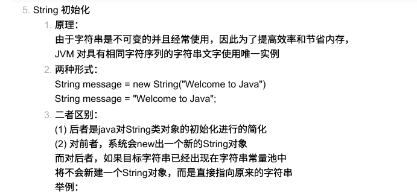
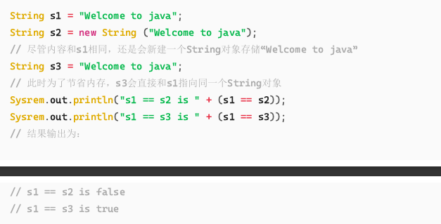
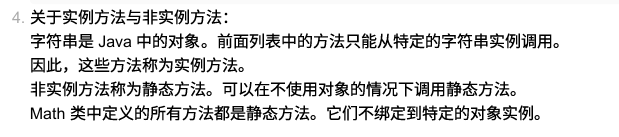

这份讲义是基于你提供的 PDF 课件（Chapter 4: Mathematical Functions, Characters, and Strings）为你整理的期末复习指南。

针对软件工程专业的背景，我会特别强调 **底层原理**、**与 C++ 的差异** 以及 **考试中常见的“坑”**。

---

# Java 期末复习讲义：数学函数、字符与字符串 (Chapter 4)

## 1. 数学函数 (The `Math` Class)

Java 的 `Math` 类包含了一系列用于执行基本数学运算的方法。

### 1.1 核心特性
*   **全是静态方法 (Static Methods)**：`Math` 类中的所有方法和常量都是 `static` 的。
    *   **语法**：`Math.methodName(arguments)`
    *   **C++ 差异**：C++ 中通常直接包含 `<cmath>` 调用函数（如 `sin(x)`），Java 必须带类名 `Math.`（除非静态导入，但考试通常要求标准写法）。
*   **常量**：
    *   `Math.PI` ($\pi$)
    *   `Math.E` ($e$)

### 1.2 常用方法与考点

| 分类            | 方法                            | 说明与 **易错点**                                            |
| :-------------- | :------------------------------ | :----------------------------------------------------------- |
| **三角函数**    | `sin`, `cos`, `tan`, `acos`...  | **坑点**：参数必须是 **弧度 (Radians)**，不是角度。 <br> `Math.sin(Math.PI / 2)` 返回 1.0。 <br> 转换：`Math.toRadians(90)`。 |
| **指数函数**    | `exp(x)`, `log(x)`, `pow(a, b)` | `log(x)` 是自然对数 ($ln$)，`log10(x)` 才是以10为底。 <br> `pow(a, b)` 返回 `double` 类型。 |
| **取整函数**    | `ceil(x)`                       | **向上**取整，返回 `double` (e.g., `2.1` -> `3.0`, `-2.1` -> `-2.0`)。 |
|                 | `floor(x)`                      | **向下**取整，返回 `double` (e.g., `2.1` -> `2.0`, `-2.1` -> `-3.0`)。 |
|                 | `rint(x)`                       | 取最近整数。如果距离相等（如 `2.5`），取 **偶数** 那一边。返回 `double`。 |
|                 | `round(x)`                      | 四舍五入。本质是 `(long)Math.floor(x + 0.5)`。**返回 `int` 或 `long`**。 |
| **最值/绝对值** | `min`, `max`, `abs`             | 支持 `int`, `long`, `float`, `double`。                      |

### 1.3 随机数 (Random)
*   **方法**：`Math.random()`
*   **范围**：返回 `[0.0, 1.0)` 之间的 `double`（包含0.0，不包含1.0）。
*   **通用公式**（生成 `[a, a+b)` 之间的随机数）：
    ```java
    a + Math.random() * b
    ```
    *如果要生成 [min, max] 之间的整数：*
    ```java
    int randomNum = min + (int)(Math.random() * (max - min + 1));
    ```

---

## 2. 字符类型 (Character Data Type)

### 2.1 编码与存储 (Unicode)
*   **Java vs C++**：
    
    *   **C++ (`char`)**：通常是 8-bit (ASCII)，1个字节。
    *   **Java (`char`)**：**16-bit Unicode (UTF-16)**，2个字节。
*   **范围**：`\u0000` 到 `\uFFFF` ($0$ 到 $65535$)。
*   **赋值方式**：
    
    ```java
    char c1 = 'A';          // 字符字面量
    char c2 = 65;           // 十进制 ASCII 码
    char c3 = '\u0041';     // 十六进制 Unicode
    // 以上三者等价
    ```

### 2.2 转义字符 (Escape Sequences)
*   `\t` (Tab), `\n` (换行), `\"` (双引号), `\\` (反斜杠)。
*   **注意**：`\u` 开头的转义是在编译早期处理的。

### 2.3 字符与数值的转换 (Casting)
*   `char` 可以自动转换为 `int`（隐式转换）。
*   `int` 转换为 `char` 必须 **强制类型转换 (Explicit Casting)**，因为可能丢失精度。

```java
char ch = 'a';
System.out.println(++ch); // 输出 'b'。char 可以进行算术运算。

int i = 'a';     // OK, i 变成 97
char c = 97;     // 错误！编译器会报错（必需显式转换）
char c = (char)97; // OK
```

### 2.4 `Character` 包装类方法
Java 是面向对象的，但 `char` 是基本类型。使用 `Character` 类的静态方法进行判断：

*   `Character.isDigit(ch)`: 是否是数字
*   `Character.isLetter(ch)`: 是否是字母
*   `Character.isLowerCase(ch)` / `isUpperCase(ch)`
*   `Character.toLowerCase(ch)` / `toUpperCase(ch)`

---

## 3. 字符串类型 (The `String` Class)

这是本章的重中之重。

### 3.1 核心概念
*   **引用类型 (Reference Type)**：`String` 不是基本类型（primitive type），它是一个类。
*   **不可变性 (Immutability)**：虽然课件未深入展开，但必须记住：**String 对象一旦创建，内容不可更改。**
    *   `s.toUpperCase()` **不会** 修改 `s` 本身，而是返回一个新的 String 对象。

### 3.2 字符串构造与连接
*   **字面量**：`String s = "Hello";`
*   **连接**：
    *   使用 `+` 操作符：`"Chapter" + 2` 结果是 `"Chapter2"`。
    *   **规则**：只要有一方是 String，另一方会自动通过 `toString()` 转换为 String 连接。
    *   **C++ 差异**：C++ 中无法直接 `"A" + "B"`（除非用 `std::string`），Java 原生支持。

### 3.3 常用方法 (String Methods)

| 方法                    | 说明             | **⚠️ 易错点/考试坑点**                                        |
| :---------------------- | :--------------- | :----------------------------------------------------------- |
| `length()`              | 返回长度         | **注意**：是方法调用 `length()`，而数组是属性 `.length`。    |
| `charAt(index)`         | 获取指定位置字符 | 索引从 0 开始。越界会抛 `StringIndexOutOfBoundsException`。  |
| `concat(s1)`            | 连接字符串       | 等同于 `+`，但在链式调用中常见。                             |
| `trim()`                | 去除**两端**空白 | 中间的空格不会被去掉。                                       |
| `substring(begin, end)` | 截取子串         | **左闭右开** `[begin, end)`。包含 begin，**不包含** end。 <br> `length = end - begin`。 |

### 3.4 字符串比较 (非常重要！)

**这是 Java 和 C++ 最大的区别之一，也是考试必考点。**

*   **`==` 操作符**：
    *   比较的是 **内存地址 (Reference)**。
    *   只有当两个变量指向同一个对象时才为 true。
*   **`.equals()` 方法**：
    *   比较的是 **字符串内容 (Content)**。（返回True or False）
*   **`.compareTo()` 方法**：
    *   返回 `int` (0, >0, <0)。用于字典序排序。
    *   `s1.compareTo(s2)`:
        *   `0`: 相等
        *   `>0`: s1 大于 s2
        *   `<0`: s1 小于 s2

**代码示例：**
```java
String s1 = new String("Welcome");
String s2 = new String("Welcome");

if (s1 == s2) { ... }       // False! 地址不同
if (s1.equals(s2)) { ... }  // True! 内容相同
```







### 3.5 字符串搜索 (indexOf)

*   `indexOf(char/String)`: 返回第一次出现的索引，找不到返回 -1。
*   `lastIndexOf(...)`: 从后往前找。

### 3.6 字符串与数字转换
*   **String 转 int/double**:
    *   `Integer.parseInt("123")`
    *   `Double.parseDouble("12.34")`
*   **数字 转 String**:
    *   `String s = 123 + "";` (最简单)
    *   `String.valueOf(123)`

---

## 4. 控制台输入与输出

### 4.1 读取字符
`Scanner` 没有直接读取单个字符的方法（如 `nextChar`）。
*   **技巧**：先读取字符串，再取第一个字符。
    ```java
    Scanner input = new Scanner(System.in);
    String s = input.next(); 
    char ch = s.charAt(0);
    ```

### 4.2 格式化输出 (printf)
类似 C 语言的 `printf`。
*   **语法**：`System.out.printf(format, items...);`
*   **常用符**：
    *   `%d`: 整数 (decimal)
    *   `%f`: 浮点数 (float/double) -> 默认6位小数
    *   `%s`: 字符串
    *   `%c`: 字符
    *   `%b`: 布尔值
*   **精度控制**：`%5.2f` (总宽5位，小数点后2位)。

---

## 5. ⚠️ 考前复习总结：Java vs C++ 与避坑指南

### 5.1 关键差异表

| 特性            | Java                     | C++                            |
| :-------------- | :----------------------- | :----------------------------- |
| **String 类型** | 引用类型，不可变         | `std::string` 是可变的         |
| **String 比较** | `s1.equals(s2)` 比内容   | `s1 == s2` 比内容              |
| **char 大小**   | 2 bytes (Unicode)        | 通常 1 byte (ASCII)            |
| **布尔值打印**  | `%b` 输出 "true"/"false" | `%d` 输出 1/0                  |
| **取长度**      | `str.length()` (带括号)  | `str.length()` 或 `str.size()` |
| **数学函数**    | 必须加 `Math.` 前缀      | 可直接调用 (如果 include 了)   |

### 5.2 考试常见陷阱 (Pitfalls)

1.  **整数除法陷阱**：
    *   在 `Math` 计算中，不要在参数里写整数除法。
    *   错误：`Math.pow(1/2, 2)` -> `1/2` 是整数除法，结果为 0，最终结果 0.0。
    *   正确：`Math.pow(1.0/2, 2)`。

2.  **`substring` 的结束索引**：
    *   `"012345".substring(1, 4)` 结果是 `"123"` (索引 1, 2, 3)，不是 4 个字符，也不包含索引 4。

3.  **`next()` vs `nextLine()`**：
    *   `next()`: 读取到空格/换行符停止。
    *   `nextLine()`: 读取整行，直到回车。
    *   **混用坑点**：如果先用 `nextInt()`，然后立刻用 `nextLine()`，`nextLine` 会读取 `nextInt` 剩下的那个换行符，导致读入空串。

4.  **字符比较**：
    *   判断字符是否为数字，既可以用 `Character.isDigit(ch)`，也可以用 `ch >= '0' && ch <= '9'`。考试时两者皆可，但 API 更优雅。

### 5.3 重点代码片段 (背诵)

**生成 [10, 50] 的随机整数：**
```java
int num = 10 + (int)(Math.random() * 41); // 41 = 50 - 10 + 1
```

**判断并转换字符大小写：**
```java
if (Character.isLowerCase(ch)) {
    ch = Character.toUpperCase(ch);
}
```

**格式化输出表格数据：**
```java
System.out.printf("%-10s %-10s\n", "Name", "Score"); // 左对齐
System.out.printf("%-10s %-10.2f\n", "Alice", 95.5);
```

希望这份讲义能帮到你的期末复习！祝考试顺利！