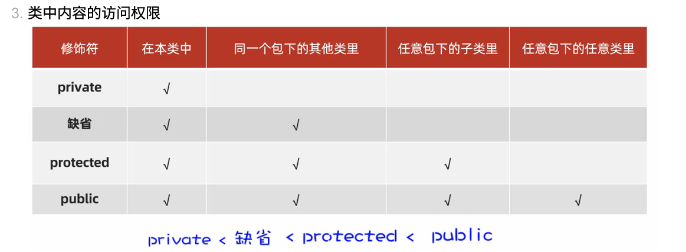
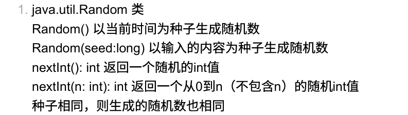

这份讲义是基于你提供的《Java语言程序设计》第9章（Objects and Classes）课件生成的。针对软件工程专业的背景，我特别强化了**内存模型**、**C++对比**以及**考试中的常见坑点**。

---

# Java 期末复习讲义：第9章 对象与类 (Objects and Classes)

## 1. 核心概念与定义 (Basic Concepts)

Java 是纯面向对象语言（Pure OOP），理解“类”与“对象”的关系是基础。

*   **对象 (Object)**: 现实世界实体的映射。
    *   **唯一标识 (Identity)**: 在内存中的地址（引用）。
    *   **状态 (State)**: 由**数据域 (Data Fields)** 表示（即成员变量）。
    *   **行为 (Behavior)**: 由**方法 (Methods)** 定义。
*   **类 (Class)**: 对象的模板或蓝图。定义了同一类型对象共同的数据结构和行为。

### 语法结构
```java
class Circle {
    // Data field (一般设为private)
    double radius = 1.0; 

    // Constructor (构造方法)
    Circle() { 
    }

    // Method (行为)
    double getArea() {
        return radius * radius * 3.14159;
    }
}
```

---

## 2. 构造方法 (Constructors) —— **考试高频考点**

构造方法用于初始化对象。

### 特性与规则
1.  **名称**: 必须与类名完全一致。
2.  **返回值**: **绝对没有返回值**，甚至不能写 `void`。
    *   *坑点*: `public void Circle() { ... }` 这是一个普通方法，不是构造方法！
3.  **调用**: 只能配合 `new` 关键字使用。

### 默认构造方法 (Default Constructor)
这是考试中最容易出错的地方：
*   如果类中**没有显式定义**任何构造方法，Java 编译器会赠送一个**无参的默认构造方法**（空函数体）。
*   **一旦你显式定义了**任何一个构造方法（哪怕是有参的），编译器**不再**赠送默认构造方法。
*   *C++ 对比*: 在 C++ 中，如果你定义了有参构造函数，通常也需要手动补一个无参构造函数以防万一，Java 也是同理，否则 `new ClassName()` 会报错。

---

## 3. 对象创建与内存模型 (Creation & Memory)

### 声明与创建两步走
```java
Circle myCircle; // 1. 声明引用变量
myCircle = new Circle(); // 2. 创建对象并赋值
// 合并写法：
Circle myCircle = new Circle();
```

### 内存引用 (Reference)
*   **变量 `myCircle`**: 存储在 **Stack (栈)** 中。它存的不是对象本身，而是对象在堆中的**地址**。
*   **对象实体**: 存储在 **Heap (堆)** 中。
*   **访问成员**: 使用点运算符 `.` (例如 `myCircle.radius`)。

### 引用赋值 vs 拷贝 (Copying)
*   **基本类型 (int, double)**: `i = j` 是值的拷贝。
*   **引用类型 (Object)**: `c1 = c2` 是**地址的拷贝**。
    *   执行后，`c1` 和 `c2` 指向堆中的**同一个对象**。
    *   原本 `c1` 指向的对象如果没人引用了，就会变成**垃圾 (Garbage)**。

### 垃圾回收 (Garbage Collection)
*   **C++ 对比**: C++ 需要手动 `delete` 释放内存。
*   **Java**: JVM 自动回收不再被引用的对象。
*   *技巧*: 你可以显式将变量置为 `null` (`c1 = null;`) 来切断引用，提示 JVM 回收该对象。

---

## 4. 变量的作用域与默认值 (Variables & Scope)

这是选择题常考点。

### 1. 数据域 (Data Fields / Instance Variables)
*   **位置**: 类内部，方法外部。
*   **默认值**: 如果不手动赋值，有默认值。
    *   引用类型 (String, Object): `null`
    *   数值类型 (int, double): `0` 或 `0.0`
    *   布尔类型: `false`
    *   Char: `\u0000`

### 2. 局部变量 (Local Variables)
*   **位置**: 方法内部。
*   **默认值**: **无默认值！**
*   *坑点*: 如果局部变量未初始化就直接使用（如打印），会报**编译错误 (Compile Error)**。

```java
public void test() {
    int x; 
    // System.out.println(x); // 编译错误！x未初始化
    String y;
    // System.out.println(y); // 编译错误！y未初始化（不会默认为null）
}
```

---

## 5. 静态 vs 实例 (Static vs Instance)

### 区别
| 特性         | 实例变量/方法 (Instance)   | 静态变量/方法 (Static)                        |
| :----------- | :------------------------- | :-------------------------------------------- |
| **关键字**   | 无                         | `static`                                      |
| **归属**     | 属于特定的对象 (Object)    | 属于整个类 (Class)                            |
| **存储**     | 每个对象有一份独立的拷贝   | 所有对象**共享**同一份内存                    |
| **调用**     | `objectReference.method()` | `ClassName.method()` (推荐) 或 `obj.method()` |
| **访问权限** | 可以访问静态成员           | **不能直接访问实例成员** (考点)               |

### 内存图解
当创建多个对象时，实例变量在堆中每个对象里都有一份；而静态变量在内存中只有一份，被所有对象修改和读取。


---

## 6. 封装与可见性 (Encapsulation & Visibility)

### 修饰符 (Modifiers)
1.  **`private`**: 仅在本类中可见（最严）。**建议所有数据域都设为 private**。
2.  **Default (无修饰符)**: 仅在**同一个包 (package)** 内可见。
3.  **`public`**: 在任何地方都可见。

### 封装原则
*   将数据域设为 `private`。
*   提供 `public` 的 **Getter (Accessor)** 和 **Setter (Mutator)** 方法来访问数据。
*   *好处*: 保护数据不被非法修改，易于维护。



---

## 7. 常用类与技巧

### `java.util.Date`
*   `new Date()`: 创建代表当前时间的对象。
*   `toString()`: 返回日期字符串。
*   `getTime()`: 返回自 1970.1.1 以来的毫秒数 (long)。

### `java.util.Random`
*   相比 `Math.random()` 更强大。
*   **种子 (Seed)**: `new Random(seed)`。
    *   *考点*: 如果两个 Random 对象使用**相同的种子**，它们生成的随机数序列是**完全一样**的。



### `this` 关键字
1.  **引用隐藏数据域**: 当方法参数名和成员变量名冲突时。
    ```java
    public void setRadius(double radius) {
        this.radius = radius; // this.radius 是成员变量，radius 是局部参数
    }
    ```
2.  **构造方法互调**:
    ```java
    public Circle() {
        this(1.0); // 调用 Circle(double) 构造方法
    }
    ```
    *   *注意*: `this()` 调用必须是构造方法中的**第一条语句**。

---

## 8. 对象数组与传参

### 对象数组
```java
Circle[] circleArray = new Circle[10];
```
*   **重要**: 这行代码仅仅创建了一个能存10个引用的**数组**，数组里的每个元素初始化为 `null`。
*   **必须**遍历数组，再次调用 `new Circle()` 初始化每个元素，否则报 `NullPointerException`。

### 对象传参 (Passing Objects)
*   Java 只有 **Pass-by-value (值传递)**。
*   当传递对象给方法时，传递的是**引用的值**（即地址）。
*   **结果**: 方法内部可以通过引用修改对象的**内容**（如 `c.radius = 10`），但不能让调用者的引用指向新的对象（如 `c = new Circle()` 在方法结束失效）。

---

## 9. 不可变对象 (Immutable Objects)

一个类要成为不可变类（如 Java 的 `String` 类），必须满足：
1.  所有数据域都是 `private`。
2.  **没有** Setter 方法 (Mutators)。
3.  没有返回**可变数据域引用**的 Getter 方法。
    *   *坑点*: 如果类里有一个成员是 `Date` 类型（可变的），且 Getter 直接返回了这个 `Date` 对象的引用，外部就能修改它，导致类不再 Immutable。

---

## 10. C++ 程序员易错点 (C++ vs Java)

1.  **No Pointers**: Java 没有 `*` 和 `->`。访问成员永远用 `.`。
2.  **No Destructors**: Java 没有 `~Circle()`，全靠垃圾回收。
3.  **No Stack Objects**: 在 Java 中，`Circle c;` 只是声明引用（类似 C++ 的 `Circle* c;` 但不需解引用），必须 `new` 才能用。C++ 中 `Circle c;` 会在栈上直接创建对象。
4.  **Header Files**: Java 没有 `.h` 和 `.cpp` 分离，类声明和实现写在一起。

---

## 11. 经典代码题解析 (课件 Quiz 详解)

请看课件第 63 页的代码（Page 55 in Screenshot）：

```java
class A {
    int i = 1;      // 实例变量
    static int j = 1; // 静态变量（全局共享）

    A() {
        i++; 
        j++; 
    }
}

public class Test {
    public static void main(String[] args) {
        A a1 = new A(); 
        // a1创建：i变为2，j（共享）从1变为2
        
        System.out.print(a1.j); 
        // 打印 a1.j (虽然不推荐通过实例访问静态，但在Java是合法的)，此时j是2。
        // 输出: 2

        A a2 = new A();
        // a2创建：a2的i从1变为2。j（共享，当前是2）再次自增，变为3。

        System.out.print(" " + a2.j);
        // 打印 a2.j，此时j是3。
        // 输出: 3
    }
}
```
**最终输出**: `2 3`
*   **解析**: 关键在于区分 `i` 是每个对象一份，而 `j` 是所有对象一份。

---

## 备考建议
1.  **手写代码**: 练习写一个包含 private 属性、构造方法、Getter/Setter 的标准类。
2.  **内存追踪**: 遇到代码题，画出 Stack 和 Heap，标出引用指向，特别是静态变量的修改。
3.  **理解 Null**: 任何未初始化的对象引用调用方法都会导致 `NullPointerException`，这是 Java 最常见的运行时错误。

***

结合你提供的课件（特别是第 38、39、45 页关于可见性的内容）以及 Java 的通用知识，以下是关于 **Java 包 (Package)** 的详细复习讲义。

在 Java 中，**包 (Package)** 本质上就是**文件夹**，用于对类进行分类管理。

---

### 1. 核心定义与作用
**包** 是一组相关类（Class）和接口（Interface）的集合。

*   **比喻**: 就像你电脑里的文件夹。
    *   你可以在 `C:/Photos` 里放一个 `me.jpg`。
    *   也可以在 `C:/Documents` 里放一个 `me.jpg`。
    *   虽然文件名相同，但因为**路径（包名）**不同，所以互不冲突。

**三大作用（考点）：**
1.  **防止命名冲突 (Namespace Management)**: 不同的包里可以有同名的类（例如 `java.util.Date` 和 `java.sql.Date`）。
2.  **访问控制 (Access Protection)**: **这是第9章的重点**。包是访问权限的一个边界（详见下文“可见性”）。
3.  **代码组织**: 模块化管理代码，易于维护。

---

### 2. 语法与目录结构 (Syntax & Structure)

#### A. 声明包
如果你的类属于某个包，**必须**在源文件的**第一行**使用 `package` 关键字。

```java
package com.myuniversity.project; // 必须是第一行非注释代码

public class Student {
    // ...
}
```

#### B. 目录结构（易错点）
Java 强制要求**包名与文件目录结构完全一致**。
*   如果包名是 `package com.myuniversity.project;`
*   那么 `.java` 文件必须存放在 `.../com/myuniversity/project/` 目录下。
*   *编译结果*: 编译后的 `.class` 文件也会按这个目录结构生成。

#### C. 导入包 (Import)
如果要使用其他包中的类，需要使用 `import`。
```java
import java.util.Scanner; // 导入特定类
import java.util.*;       // 导入 java.util 包下的所有类
// 注意：import java.util.* 不会导入子包（如 java.util.zip 里的类不会被导入）
```
*   **特例**: `java.lang` 包下的类（如 `String`, `Math`, `System`）是 Java 自动导入的，不需要手动写 import。

---

### 3. 包与访问修饰符 (Package & Visibility) —— **第9章必考**

根据课件 **第 38、39、45 页**，Java 有四种访问权限，其中**默认权限**直接依赖于“包”的概念。

| 修饰符 (Modifier) | 关键字      | 可见范围           | 说明                                                         |
| :---------------- | :---------- | :----------------- | :----------------------------------------------------------- |
| **Private**       | `private`   | **仅本类**         | 最严格，如果不希望外界乱改，全用这个（封装）。               |
| **Default**       | (无关键字)  | **本包 (Package)** | **重要**：如果你不写 `public` 也不写 `private`，类或成员变量就只能被**同一个包**里的其他类访问。 |
| **Protected**     | `protected` | **本包 + 子类**    | (本章暂未深究，后续继承章节会讲)                             |
| **Public**        | `public`    | **所有地方**       | 跨包也能访问。                                               |

**考试场景举例 (参考课件 P39):**
*   **场景**: 你有两个类 `ClassA` 和 `ClassB`。
*   如果它们在**同一个包**下：`ClassB` 可以访问 `ClassA` 中**没有修饰符**（Default）的变量。
*   如果它们在**不同包**下：`ClassB` **不能**访问 `ClassA` 中**没有修饰符**的变量，只能访问 `public` 的。

---

### 4. Java 包 vs C++ 命名空间 (Comparison)

如果你学过 C++，这里有个关键对比：

*   **C++ (Namespace)**:
    *   使用 `namespace my_space { ... }`。
    *   逻辑上的分组，不强制要求物理文件目录结构对应。
    *   主要为了解决命名冲突。

*   **Java (Package)**:
    *   使用 `package my.pkg;`。
    *   **强制**物理目录结构与包名一致。
    *   不仅解决命名冲突，还直接决定了**默认访问权限 (Package-Private)** 的范围。

---

### 5. 考试中的常见坑点

1.  **忘记 `package` 语句的位置**:
    *   `import` 语句写在 `package` 语句之前会**编译错误**。`package` 必须永远在第一行。
2.  **默认导入**:
    *   问：为什么用 `String` 不用导包？
    *   答：因为 `String` 在 `java.lang` 包中，JVM 默认导入。
3.  **同名类冲突**:
    *   如果同时需要用 `java.util.Date` 和 `java.sql.Date`，你不能同时 `import` 两个具体的类。
    *   **解决方法**: 这是一个使用全限定名（Full Qualified Name）。
    ```java
    import java.util.Date;
    
    // 使用 java.util.Date
    Date d1 = new Date(); 
    
    // 使用 java.sql.Date (必须写全名)
    java.sql.Date d2 = new java.sql.Date(System.currentTimeMillis());
    ```
4.  **访问默认权限成员**:
    *   如果题目问：“类 A 中的变量 `int x;` 能被不同包的类 B 访问吗？”
    *   答案是 **NO**。因为 `int x` 没有修饰符，是包级私有（Package-Private），出了包就看不见了。