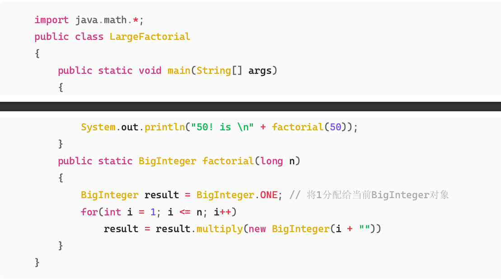
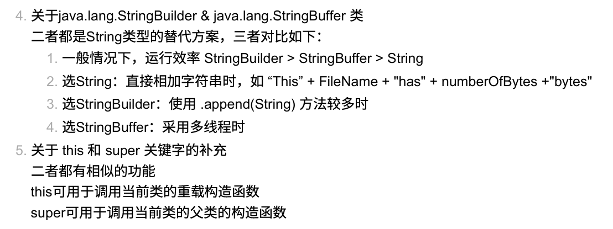

你好！作为软工专业的同学，复习 Java 时不仅要掌握语法，更要理解**面向对象（OOP）的设计思想**以及**Java 特有的内存管理机制**（这也是它和 C++ 最大的区别之一）。

这份讲义基于你提供的第10章课件《Thinking in Objects》，结合期末考试常见的考点、代码陷阱以及与 C++ 的对比进行了深度总结。

---

# Java 第10章复习讲义：面向对象思维 (Thinking in Objects)

## 核心导航
1.  **类的抽象与封装** (基础但必考)
2.  **对象间的关系** (聚合 vs 组合)
3.  **设计原则** (软件工程核心)
4.  **包装类 (Wrapper Classes)** (自动装箱/拆箱)
5.  **大数处理 (BigInteger/BigDecimal)** (高精度计算)
6.  **字符串处理 (String/StringBuilder/StringBuffer)** (重中之重，考点最密集)

---

## 1. 类的抽象与封装 (Class Abstraction & Encapsulation)

### 概念
*   **抽象 (Abstraction)**: 将类的实现（Implementation）与使用（Contract/Use）分离。用户只需要知道“怎么用”（查看 Public API），不需要知道“怎么实现”。
*   **封装 (Encapsulation)**: 隐藏对象的属性和实现细节，仅对外公开接口。

### 关键代码模式
*   **私有属性 (private fields)**: 防止外部直接修改数据。
*   **公有方法 (public accessors/mutators)**: Getter/Setter，用于控制数据的访问权限和合法性检查。

```java
public class Loan {
    private double annualInterestRate; // 私有属性，封装

    // 构造方法
    public Loan() {
        this(2.5, 1, 1000); // 调用另一个构造器
    }

    public double getAnnualInterestRate() {
        return annualInterestRate;
    }

    // 在 Setter 中可以加入逻辑判断
    public void setAnnualInterestRate(double annualInterestRate) {
        if (annualInterestRate > 0)
            this.annualInterestRate = annualInterestRate;
    }
}
```

---

## 2. 类与类之间的关系 (Relationships)

考试中常考 UML 类图关系识别，重点区分**聚合**和**组合**。

| 关系类型 | 英文        | 描述                                                 | 强弱程度 | 举例                              |
| :------- | :---------- | :--------------------------------------------------- | :------- | :-------------------------------- |
| **关联** | Association | 一般的联系                                           | 弱       | 学生和课程                        |
| **聚合** | Aggregation | **Has-a** 关系。整体与部分可以分离，生命周期不同步。 | 中       | 班级与学生 (班级解散了，学生还在) |
| **组合** | Composition | **Has-a** 关系。**强拥有**，整体与部分生命周期一致。 | 强       | 人与大脑 (人死了，大脑也亡了)     |

### 代码实现的细微区别
虽然在 Java 代码中，聚合和组合通常都表现为“类中包含另一个类的对象引用”，但在逻辑上有区别：

```java
// 聚合 (Aggregation) - 外部传入，生命周期独立
public class Course {
    private Student[] students; // 只是引用
    public void addStudent(Student s) { ... } 
}

// 组合 (Composition) - 内部创建，生命周期绑定
public class Person {
    private Name name;
    public Person() {
        this.name = new Name(); // 随 Person 创建而创建
    }
}
```

> **⚠️ C++ 对比**: 在 C++ 中，组合通常直接由成员对象表示（栈上分配），聚合通常由指针表示。Java 中全都是引用（Reference），所以只能从逻辑和业务上区分。

---

## 3. 软件设计原则 (Design Principles)

这是软工专业的特色考点，通常出现在选择题或简答题中。

1.  **高内聚 (High Cohesion)**: 一个类只做一件事，功能单一且聚焦。
2.  **低耦合 (Low Coupling)**: 模块间依赖越少越好，易于修改和替换。
3.  **SOLID 原则** (课件中提到的):
    *   **SRP (单一职责)**: 一个类只有一个引起它变化的原因。
    *   **OCP (开闭原则)**: 对扩展开放，对修改关闭。
    *   **LSP (里氏替换)**: 子类能无缝替换父类。
    *   **ISP (接口隔离)**: 接口要小而精，不要大而全。
    *   **DIP (依赖倒置)**: 依赖抽象，不依赖具体实现。
4.  **迪米特法则 (LoD / 最少知识原则)**: 一个对象应该对其他对象保持最少的了解（只和朋友说话，不和陌生人说话）。

---

## 4. 包装类 (Wrapper Classes)

Java 的基本数据类型（`int`, `double` 等）不是对象，为了让它们能像对象一样操作（比如放入 `ArrayList`），Java 提供了包装类。

### 核心特性 (必考)
1.  **不可变 (Immutable)**: 一旦创建，内部值无法修改。
2.  **无无参构造**: 必须在创建时赋值（如 `new Integer(5)` 或 `Integer.valueOf(5)`）。
3.  **自动装箱/拆箱 (Autoboxing/Unboxing)** (JDK 1.5+):

```java
// 自动装箱：编译器将 int 转换为 Integer
Integer i = 10; // 等价于 Integer.valueOf(10);

// 自动拆箱：编译器将 Integer 转换为 int
int val = i;    // 等价于 i.intValue();

// 混合运算时的拆箱
Integer[] list = {1, 2, 3};
System.out.println(list[0] + list[1]); // 自动拆箱计算
```

### ⚠️ 易错坑点：整型缓存 (Integer Cache)
这是一个非常经典的面试题和考试坑点。

```java
Integer a = 100;
Integer b = 100;
System.out.println(a == b); // true (因为 -128 到 127 之间的数被缓存了)

Integer c = 200;
Integer d = 200;
System.out.println(c == d); // false (超出缓存范围，创建了不同的对象)
System.out.println(c.equals(d)); // true (应该永远用 equals 比较对象值！)
```

### 解析字符串
*   `Integer.parseInt("123")` -> 返回 `int` (基本类型)
*   `Integer.valueOf("123")` -> 返回 `Integer` (对象)

---

## 5. BigInteger 和 BigDecimal

用于处理超出 `long` 范围的整数或需要**高精度**的小数（如金融计算）。

*   **包**: `java.math`
*   **特性**: 不可变 (Immutable)。
*   **操作**: 不能使用 `+`, `-`, `*`, `/` 运算符，必须使用方法调用 `.add()`, `.multiply()` 等。



### ⚠️ 考点：BigDecimal 的精度陷阱
```java
// 错误写法：直接传 double，会丢失精度
BigDecimal bad = new BigDecimal(0.1); 
System.out.println(bad); // 输出 0.10000000000000000555...

// 正确写法：传 String
BigDecimal good = new BigDecimal("0.1");
System.out.println(good); // 输出 0.1
```

---

## 6. String 类 (复习重点)

Java 中 `String` 是不可变的，这与 C++ 的 `std::string` 完全不同。

### 6.1 字符串常量池 (String Pool / Interned Strings)
Java 为了节省内存，对字符串字面量（Literal）进行了特殊处理。

```java
String s1 = "Welcome";           // 放入常量池
String s2 = "Welcome";           // 直接引用常量池中的同一个对象
String s3 = new String("Welcome"); // 强制在堆内存中创建新对象，不复用池

System.out.println(s1 == s2); // true (引用地址相同)
System.out.println(s1 == s3); // false (地址不同)
System.out.println(s1.equals(s3)); // true (内容相同，推荐写法)
```

> **考试口诀**: 比较字符串内容，**永远使用 `equals()`**，不要用 `==`。

### 6.2 字符串不可变性 (Immutability)
任何“修改”字符串的操作（`replace`, `concat`, `substring`），实际上都是**创建并返回了一个新的 String 对象**，原字符串不受影响。

```java
String s = "Java";
s.concat(" HTML"); // 返回了新字符串 "Java HTML"，但 s 没变
System.out.println(s); // 依然输出 "Java"

s = s.concat(" HTML"); // 让 s 指向了新对象
System.out.println(s); // 输出 "Java HTML"
```

```java
public class Main {
    public static void main(String args[]) {
        String Str = new String("Runoob");

        System.out.print("返回值 :" );
        System.out.println(Str.replace('o', 'T'));//全部替换

        System.out.print("返回值 :" );
        System.out.println(Str.replace('u', 'D'));
    }
}
//返回值 :RunTTb
//返回值 :RDnoob
```


### 6.3 常用方法与 Regex

*   `split(String regex)`: 必须注意转义字符。
    *   例如：`split(".")` 是错的（`.`在正则代表任意字符），必须写 `split("\\.")`。
*   `matches(String regex)`: 全匹配判断。
*   `replaceAll(String regex, String replacement)`: 基于正则替换。

---

## 7. StringBuilder 与 StringBuffer

为了解决 String 不可变导致的性能问题（频繁拼接会产生大量垃圾对象），Java 提供了可变字符序列。

### 三者对比 (必考简答题/选择题)

| 特性         | String                      | StringBuilder                  | StringBuffer            |
| :----------- | :-------------------------- | :----------------------------- | :---------------------- |
| **可变性**   | 不可变 (Immutable)          | **可变 (Mutable)**             | **可变 (Mutable)**      |
| **线程安全** | 安全 (因为不可变)           | **不安全 (Not Synchronized)**  | **安全 (Synchronized)** |
| **性能**     | 差 (频繁拼接时)             | **最快**                       | 较慢 (有锁开销)         |
| **适用场景** | 少量字符串操作，作为 Map 键 | **单线程大量拼接** (90%的情况) | 多线程并发拼接          |



### 性能陷阱

```java
// 写法 A (编译器会自动优化，其实还好，但在循环中绝对禁止)
String s = "a" + "b" + "c"; 

// 写法 B (循环中拼接，性能灾难)
String s = "";
for(int i=0; i<10000; i++) {
    s += i; // 每次循环都会创建新的 String 和 StringBuilder 对象
}

// 写法 C (正确做法)
StringBuilder sb = new StringBuilder();
for(int i=0; i<10000; i++) {
    sb.append(i); // 只操作同一个对象内部数组
}
```

---

## 8. C++ vs Java (常见考点总结)

在软工的 Java 考试中，老师很喜欢问这两种语言的区别：

1.  **字符串**:
    *   C++: `std::string` 是可变的。
    *   Java: `String` 不可变，要可变需用 `StringBuilder`。
2.  **对象销毁**:
    *   C++: 需要手动 `delete` 或者使用智能指针，有析构函数 (`~ClassName`)。
    *   Java: 全自动垃圾回收 (GC)，没有析构函数（虽然有 `finalize` 但已废弃）。
3.  **指针**:
    *   C++: 显式指针 (`*`, `&`)，可以进行指针运算。
    *   Java: 只有“引用”，本质是受限的指针，**没有指针运算**，更安全。
4.  **头文件**:
    *   C++: `.h` / `.cpp` 分离。
    *   Java: 只有 `.java`，类声明和实现写在一起。
5.  **全局变量**:
    *   C++: 允许全局变量。
    *   Java: 所有东西必须在类（Class）里面，没有真正的全局变量（只有 `static` 属性）。

---

## 9. 考前速记 & 避坑指南

1.  **比较对象**: 基本类型用 `==`，引用类型（对象）用 `.equals()`。`String` 是对象！
2.  **数组长度**: 数组用 `.length` (属性)，字符串用 `.length()` (方法)。
3.  **Main 方法**: 必须是 `public static void main(String[] args)`。
4.  **BigInteger**: 只要涉及天文数字或高精度金额，不要用 `long/double`，用 `BigInteger/BigDecimal`。
5.  **NullPointerException**: 调用了 `null` 对象的任何方法都会报 NPE。
    *   *防御性编程技巧*: `"constant".equals(variable)` 比 `variable.equals("constant")` 安全，因为前者永不报空指针。

祝复习顺利，期末高分！如果有具体的习题不懂，欢迎随时把题目发给我。