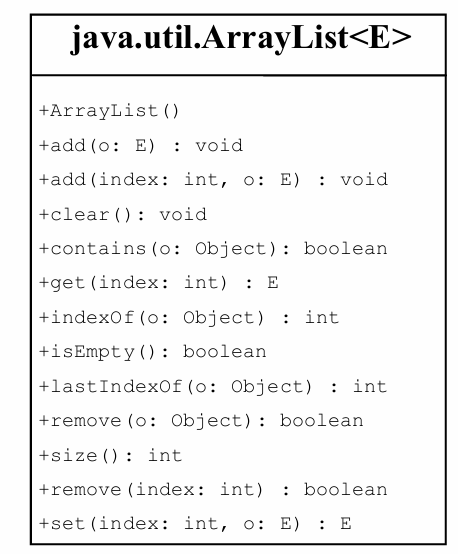
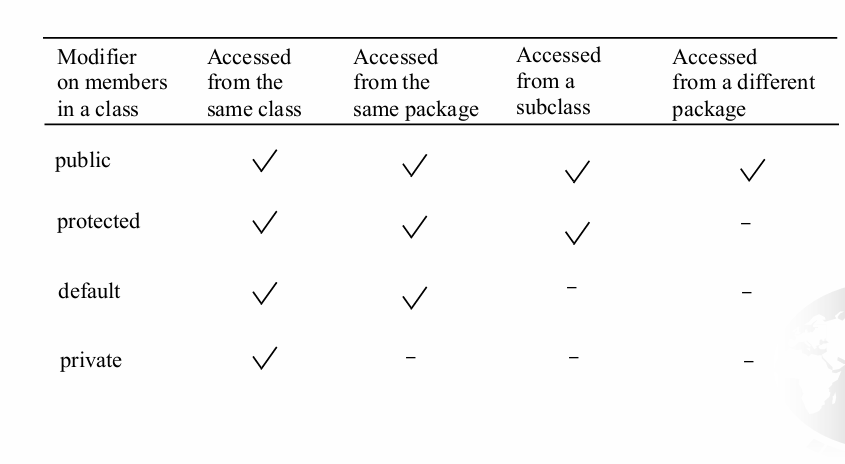
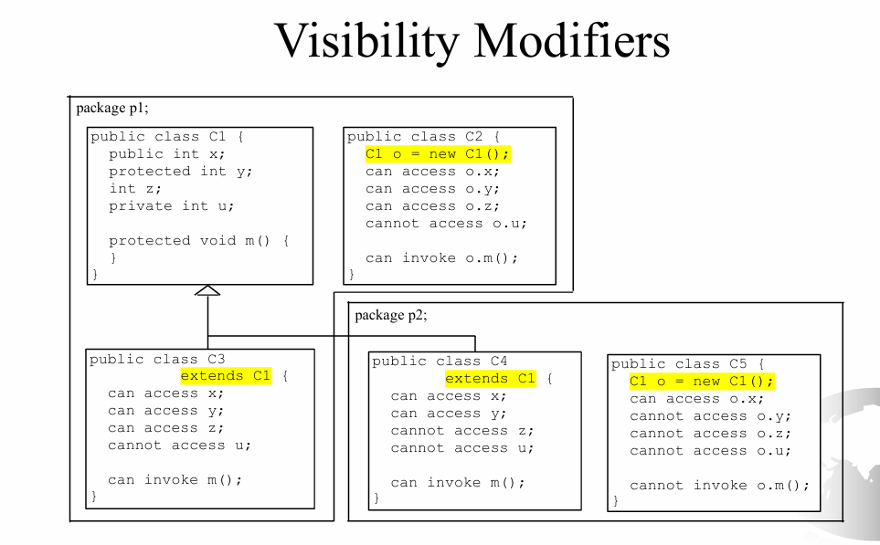

这份复习讲义是基于你提供的《Introduction to Java Programming》第11章课件（Inheritance and Polymorphism）生成的。针对软件工程专业的期末复习，我整理了核心概念、代码示例、考试常考坑点以及与C++的对比。

---

# Java 第11章：继承与多态 (Inheritance and Polymorphism) 期末复习讲义

## 1. 继承基础 (Inheritance Basics)

### 核心概念
*   **定义**：基于已有的类（Superclass/Parent class）定义新的类（Subclass/Child class）。
*   **目的**：代码复用（Avoid redundancy），建立类之间的层次关系。
*   **关键字**：`extends`
*   **关系**：Is-a 关系（例如：Circle **is a** GeometricObject）。

### 语法示例
```java
// 父类
public class GeometricObject {
    private String color = "white";
    // ...
}

// 子类
public class Circle extends GeometricObject {
    private double radius;
    // Circle 继承了 color 属性和相关的 public/protected 方法
}
```

### ⚠️ 考试坑点：构造方法不被继承
*   **核心规则**：子类**不会**继承父类的构造方法。
*   子类只能通过关键字 `super` 显式或隐式地**调用**父类的构造方法。

---

## 2. 构造方法链 (Constructor Chaining) —— 重点难点

### 规则详解
1.  **自动调用**：如果子类构造方法中没有显式调用 `super(...)` 或 `this(...)`，编译器会自动在第一行插入 `super()` (即父类的无参构造)。
2.  **强制顺序**：`super(...)` 必须是子类构造方法中的**第一条语句**。
3.  **链式反应**：实例化子类对象时，会沿着继承链向上追溯，直到 `Object` 类。先执行父类构造，再执行子类构造。

### 经典报错案例 (对应课件 Page 18-19)
如果父类没有无参构造方法，且子类没有显式调用父类的带参构造，编译会报错。

```java
// 父类
class Fruit {
    // 定义了带参构造，编译器将不再自动生成默认无参构造
    public Fruit(String name) {
        System.out.println("Fruit ctor");
    }
}

// 子类
class Apple extends Fruit {
    // 错误！Compilation Error!
    // 原因：编译器默认插入 super()，但在 Fruit 中找不到无参构造。
}

// 修正版
class Apple extends Fruit {
    public Apple() {
        super("Apple"); // 必须显式调用父类存在的构造方法
    }
}
```

---

## 3. 方法重写 vs 方法重载 (Overriding vs. Overloading)

这是期末考试必考的对比题。

| 特性         | 重写 (Overriding)              | 重载 (Overloading)                |
| :----------- | :----------------------------- | :-------------------------------- |
| **发生位置** | 子类与父类之间                 | 同一个类中 (或者子类重载父类方法) |
| **方法签名** | 必须**完全一致** (名、参、返*) | 方法名相同，**参数列表必须不同**  |
| **注解**     | `@Override` (推荐使用)         | 无                                |
| **多态性**   | 运行时多态 (Dynamic Binding)   | 编译时多态 (Static Binding)       |

*\*注：返回类型可以是原类型的子类型 (Covariant Return Type)。*

### 代码陷阱 (对应课件 Page 22)
**陷阱**：本想重写，结果变成了重载。

```java
class B {
    public void p(double i) { ... }
}

class A extends B {
    // 这是一个重载！因为参数类型 int 和 double 不同
    public void p(int i) { ... } 
    
    // 这才是重写
    @Override // 使用此注解，如果签名不对编译器会报错，防止手误
    public void p(double i) { ... }
}
```

---

## 4. 多态与动态绑定 (Polymorphism & Dynamic Binding)

### 核心定义
*   **多态**：父类类型的变量可以引用子类的对象。
    *   `GeometricObject o = new Circle();`
*   **动态绑定**：调用的方法由**运行时**对象的实际类型决定，而不是声明类型。

### JVM 查找方法顺序 (课件 Page 27)
假设对象 `o` 是类 $C_1$ 的实例 ($C_1$ 是 $C_2$ 的子类... $C_n$ 是 `Object`)。调用 `o.p()` 时：
1.  JVM 先在 $C_1$ 中找方法 `p`。
2.  找不到则去 $C_2$ 找。
3.  依次向上直到找到为止。

### ⚠️ 考试坑点：属性没有多态
**重点**：多态只适用于**实例方法**。**静态方法**和**成员变量（属性）**不具有多态性，它们看引用的声明类型（左边）。

```java
class Parent { int x = 10; }
class Child extends Parent { int x = 20; }

Parent p = new Child();
System.out.println(p.x); // 输出 10 (看左边 Parent)
// 如果调用方法 p.getX()，且 Child 重写了 getX，则输出 Child 的逻辑。
```

---

## 5. 对象转换 (Casting) 与 instanceof

### 类型转换规则
1.  **向上转型 (Upcasting)**：隐式，总是安全的。
    *   `Object o = new Student();`
2.  **向下转型 (Downcasting)**：显式，有风险。
    *   `Student s = (Student) o;`

### ClassCastException 与 instanceof
如果引用的实际对象不是目标类型，向下转型会抛出运行时异常 `ClassCastException`。

**解决方案**：先检查，后转换。
```java
Object myObject = new Circle();

if (myObject instanceof Circle) {
    // 安全转换
    System.out.println("Diameter: " + ((Circle)myObject).getDiameter());
}
```
**注意优先级**：点操作符 `.` 优先级高于 类型转换 `(Type)`。

*   错误：`(Circle)myObject.getDiameter()` (先试图调用 Object 的 getDiameter，报错)
*   正确：`((Circle)myObject).getDiameter()`

---

## 6. Object 类与其常用方法

所有类默认继承 `java.lang.Object`。

### `toString()`
*   **默认行为**：返回 `类名@哈希码` (e.g., `Loan@15037e5`)，通常没用。
*   **最佳实践**：必须重写，返回有意义的对象信息字符串。

### `equals(Object obj)`
*   **默认行为**：比较引用地址 (相当于 `==`)。
*   **重写模板** (课件 Page 39)：
    ```java
    public boolean equals(Object o) {
        if (o instanceof Circle) {
            return this.radius == ((Circle)o).radius;
        }
        return false;
    }
    ```
*   **坑点**：参数类型必须是 `Object`。如果写成 `public boolean equals(Circle c)`，那是重载，不是重写！

---

## 7. ArrayList 类 (泛型容器)

相比数组，`ArrayList` 大小可变。

### 常用操作对照表
| 操作 | 数组 (Array)      | ArrayList            |
| :--- | :---------------- | :------------------- |
| 创建 | `new String[10]`  | `new ArrayList<>()`  |
| 访问 | `a[i]`            | `list.get(i)`        |
| 修改 | `a[i] = "Val"`    | `list.set(i, "Val")` |
| 大小 | `a.length` (属性) | `list.size()` (方法) |
| 添加 | 无法直接扩容      | `list.add("Val")`    |
| 删除 | 需手动移位        | `list.remove(i)`     |



### 实用工具方法 (java.util.Collections)

*   `Collections.max(list)`
*   `Collections.min(list)`
*   `Collections.shuffle(list)` (课件 Page 46，打乱顺序)

### 数组与List互转
*   Array 转 List: `new ArrayList<>(Arrays.asList(array))`
*   List 转 Array: `list.toArray(new String[list.size()])`

---

## 8. 访问修饰符 (Access Modifiers) - 重点看 protected

权限范围从小到大：`private` -> `default` (无修饰符) -> `protected` -> `public`



### protected 详解
*   **可见性**：
    1.  同一个包内的任何类。
    2.  不同包中的**子类**。
*   **UML表示**：`#` (哈希号)。



### ⚠️ 考试坑点：子类不能降低访问权限
如果父类方法是 `public`，子类重写时**必须**是 `public`。不能改为 `protected` 或 `private`。

---

## 9. final 关键字

*   **final Class**: 终态类，**不能被继承** (例如 `java.lang.String`, `Math`)。
*   **final Method**: 终态方法，**不能被子类重写**。
*   **final Variable**: 常量，一旦赋值**不能改变**。

---

## 10. Java 与 C++ 的重要区别 (Comparison)

这是软件工程专业考试中可能出现的加分题或概念题：

1.  **继承机制**：
    *   **Java**: 单继承 (Single Inheritance)，一个类只能 extends 一个父类。但可以实现多个接口。
    *   **C++**: 多重继承 (Multiple Inheritance)，一个类可以继承多个父类 (容易导致菱形继承问题)。

2.  **根类**：
    *   **Java**: 所有类都隐式继承自 `Object`。
    *   **C++**: 没有统一的根类。

3.  **多态与虚方法**：
    *   **Java**: 所有非 static/final/private 的方法默认都是“虚方法”(Virtual)，自动支持动态绑定。
    *   **C++**: 必须显式加上 `virtual` 关键字才能实现多态，否则是静态绑定。

4.  **关键字 super**:
    *   **Java**: 使用 `super.method()` 或 `super()`。
    *   **C++**: 使用 `BaseClassName::method()`。

5.  **访问控制 protected**:
    *   **Java**: 子类 + 同包。
    *   **C++**: 主要是子类 (友元机制另算)。

6.  **泛型 (Generics)**:
    *   **Java**: 类型擦除 (Type Erasure)，`ArrayList<String>` 在运行时其实是 `ArrayList<Object>` (配合强制转换)。
    *   **C++**: 模板 (Templates)，为每个类型生成具体的代码副本。

---

## 📝 课件中的练习题重点 (Ex. 11.2, 11.8)
课件最后展示了类图 (Pages 49-50)，这暗示了考试可能会考：
1.  **看图写代码**：给定 UML 类图，写出对应的 Java 类定义（注意 `extends` 关系，`#` 代表 `protected`，`-` 代表 `private`，`+` 代表 `public`）。
2.  **Person/Student/Employee 体系**：注意 `Employee` 中包含 `MyDate` 这种组合关系，以及 `Student` 中的常量定义。
3.  **Account/Transaction 体系**：注意在 `Account` 类中使用 `ArrayList<Transaction>` 来保存交易记录，这考察了组合与泛型的使用。

---

## ✅ 复习总结清单 (Cheat Sheet)

1.  **构造器**：第一行默认有 `super()`，若父类无空参构造器，子类必须手动调有参。
2.  **重写**：三要素（名、参、返）一致，别忘了 `@Override`。
3.  **多态**：`父类引用 = new 子类()`。编译看左边，运行看右边。
4.  **Casting**：向下转型前必用 `instanceof`。
5.  **Protected**：包内可见 + 子类可见。
6.  **Object**：它是万物之祖，记得怎么重写 `equals` 和 `toString`。
7.  **ArrayList**：熟练掌握 `add`, `get`, `size` 以及泛型 `<E>` 的写法。

祝你期末考试顺利！

***

这在 Java 中是有直接对应的，但因为 Java 只有“引用（Reference）”而没有显式的“指针（Pointer）”，且 Java 的内存安全机制更严格，所以表现形式和报错时机与 C++ 有所不同。

结合你的课件内容，我为你详细拆解这两种情况：

### 情况 1：基类指针指向派生类对象 (Upcasting / 向上转型)

在 C++ 中是 `Base* b = new Derived();`。
**在 Java 中完全对应，且这是多态的核心。**

*   **Java 语法**：
    ```java
    // 假设 Student extends Person
    Person p = new Student(); 
    ```
*   **术语**：**向上转型 (Upcasting)** / **多态 (Polymorphism)**。
*   **对应课件**：**Page 28-30 (Polymorphism & Dynamic Binding)**。
*   **特性**：
    1.  **自动转换**：不需要显式强制转换（Implicit casting），因为学生本来就是人 (is-a 关系)。
    2.  **动态绑定 (Dynamic Binding)**：这是重点！
        *   如果调用 `p.toString()`，Java 会在**运行时**检查 `p` 指向的真实对象是 `Student`，所以会执行 `Student` 类中重写的 `toString()` 方法。
        *   **C++ 区别**：C++ 只有在基类方法加了 `virtual` 关键字时才会发生动态绑定，否则执行基类方法。Java 默认所有非静态方法都是“虚函数”，自动动态绑定。
    3.  **访问限制**：你只能调用 `Person` 类中定义的方法。如果 `Student` 有一个特有的方法 `getGrade()`，你不能通过 `p.getGrade()` 调用，除非先强转回去。

---

### 情况 2：派生类指针指向基类对象 (Downcasting / 向下转型)

在 C++ 中是 `Derived* d = new Base();`（这通常是不安全的）。
**在 Java 中有对应语法，但在逻辑上分为“死路”和“活路”两种场景。**

*   **Java 语法**：
    ```java
    // 假设 Student extends Person
    Student s = new Person(); // ❌ 编译直接报错 (Incompatible types)
    ```
    Java 不允许直接将父类对象赋值给子类引用，必须进行**强制类型转换 (Explicit Casting)**。

#### 场景 A：真正的基类对象（死路）
如果你试图把一个**真正的**父类对象强制转为子类：
```java
Person p = new Person();   // 内存里真的是一个 Person
Student s = (Student) p;   // 语法上需要强转，编译能过
```
*   **结果**：**运行时报错 (Runtime Error)**。
*   **异常**：`java.lang.ClassCastException`。
*   **原理**：`Person` 对象在内存中没有 `Student` 特有的字段（比如 `grade`），Java 为了内存安全，运行时检测到欺诈行为，直接抛出异常终止程序。这对应你课件 **Page 34 (Why Casting Is Necessary)** 中的解释。

#### 场景 B：披着基类外衣的派生类对象（活路）
这是向下转型的唯一合法用途。即这个对象**本质上**是子类，只是之前被当做父类引用了。
```java
Person p = new Student();  // 向上转型 (Case 1)
// ... 经过一些代码逻辑 ...
Student s = (Student) p;   // 向下转型 (显式强转)
```
*   **结果**：**成功**。
*   **对应课件**：**Page 35 (Casting from Superclass to Subclass)** 和 **Page 36 (instanceof)**。
*   **安全做法**：
    在 C++ 中你可能会用 `dynamic_cast` 来判断转换是否安全。
    在 Java 中，必须使用 `instanceof` 关键字进行判断，防止报错：
    ```java
    if (p instanceof Student) {
        Student s = (Student) p;
        // 现在可以安全使用 s.getGrade() 了
    }
    ```

---

### 总结与 C++ 的核心区别 (考试加分点)

| 特性         | 情况 1: Base = new Derived()                                 | 情况 2: Derived = new Base()                                 |
| :----------- | :----------------------------------------------------------- | :----------------------------------------------------------- |
| **C++**      | `Base* b = new Derived();`<br>需要 `virtual` 实现多态。      | `Derived* d = new Base();`<br>直接写报错，强转(`static_cast`)可能导致未定义行为(野指针/内存越界)，或者用 `dynamic_cast` 返回 nullptr。 |
| **Java**     | `Base b = new Derived();`<br>**默认支持多态** (不需要 virtual)。 | `Derived d = (Derived) new Base();`<br>编译通过，**运行时抛出 `ClassCastException` 异常**。Java 绝不允许你访问不存在的内存区域。 |
| **课件考点** | **Page 30** (Implicit casting)                               | **Page 34** (Compile error without cast), **Page 35** (Runtime logic) |

**一句话总结给考生：**
Java 中，**向上转型**（子给父）是自动且安全的（多态的基础）；**向下转型**（父给子）必须强转，且只有当该对象**本质上确实是子类实例**时才能成功，否则运行时炸机（`ClassCastException`）。

***

好的，我们来详细聊聊Java中不同包（package）的内容如何相互访问，这在软件工程实践和考试中都是非常重要的知识点。

在Java中，`package` 是一种组织类和接口的方式，它提供命名空间（namespace），防止命名冲突，并控制访问权限。

**核心原则：**

1.  **可见性**：访问权限修饰符（`public`, `protected`, `default`/`package-private`, `private`）决定了类、成员（字段和方法）在不同包中的可见性。
2.  **导入**：要在一个包中使用另一个包中的公共（`public`）类，通常需要使用 `import` 语句。

---

### 访问权限修饰符与跨包访问

这是理解跨包访问的关键：

*   **`public` (公共)**
    *   **类/接口**：`public` 类可以在任何包中被访问和使用。
    *   **成员 (字段/方法)**：`public` 成员可以在任何地方被访问（只要其所在的类也是 `public` 的）。
    *   **跨包访问策略**：
        1.  确保要访问的类本身是 `public` 的。
        2.  确保要访问的成员是 `public` 的。
        3.  使用 `import` 语句导入该类，或者使用其完全限定名。

*   **`protected` (受保护)** (对应课件 Page 41-43)
    *   **类/接口**：`protected` **不能**修饰顶级类或接口（只能修饰嵌套类）。它主要用于成员。
    *   **成员 (字段/方法)**：`protected` 成员可以在以下地方被访问：
        1.  同一个包中的所有类。
        2.  **不同包中的子类**。即使子类在不同的包中，它也可以通过继承关系访问父类的 `protected` 成员。
    *   **跨包访问策略**：
        1.  要访问 `protected` 成员，你需要：
            *   要么与该成员在同一个包中。
            *   **要么你是一个子类，并且通过子类实例（或 `super` 关键字）访问。**
        2.  对于不同包的非子类，无法直接访问 `protected` 成员。
    *   **考试提醒 (课件 Page 43)**：
        *   `package p1; class C1 { protected int y; protected void m() {}}`
        *   `package p2; class C4 extends C1 { /* C4 可以访问 C1 的 y 和 m() */}`
        *   `package p2; class C5 { /* C5 不能访问 C1 的 y 或 m() */}`
        *   注意 `C5` 是 `p2` 包下的，它不是 `C1` 的子类，所以不能访问 `C1` 的 `protected` 成员。

*   **`default` / `package-private` (包私有)**
    *   **类/接口**：没有显式修饰符的类或接口。
    *   **成员 (字段/方法)**：没有显式修饰符的成员。
    *   **可见性**：**只能在同一个包中被访问**。
    *   **跨包访问策略**：无法直接跨包访问。
    *   **C++ 对比**：C++ 中没有直接对应的“包私有”概念，通常是依靠 `friend` 关键字或者将类成员设为 `private` 来模拟包内部访问。Java 的 `default` 访问级别是一种更简洁的包级封装。

*   **`private` (私有)**
    *   **类/接口**：`private` **不能**修饰顶级类或接口（只能修饰嵌套类）。它主要用于成员。
    *   **成员 (字段/方法)**：`private` 成员**只能在其声明的类内部被访问**。
    *   **跨包访问策略**：无法跨包访问，甚至子类也无法直接访问父类的 `private` 成员。

---

### `import` 语句

`import` 语句告诉编译器你在哪个包中查找特定的类。

**语法：**

1.  **导入单个类**：
    `import package.name.ClassName;`
    **示例**：
    ```java
    // File: mypackage/MyClass.java
    package mypackage;
    import anotherpackage.AnotherClass; // 导入另一个包中的 AnotherClass
    
    public class MyClass {
        public void doSomething() {
            AnotherClass obj = new AnotherClass(); // 可以直接使用 AnotherClass
            obj.callMethod();
        }
    }
    ```

2.  **导入包中所有公共类** (不推荐在生产代码中大量使用，因为可能导致命名冲突和可读性差)：
    `import package.name.*;`
    **示例**：
    ```java
    // File: mypackage/MyClass.java
    package mypackage;
    import anotherpackage.*; // 导入 anotherpackage 中所有公共类
    
    public class MyClass {
        public void doSomething() {
            AnotherClass obj = new AnotherClass();
            YetAnotherClass anotherObj = new YetAnotherClass();
        }
    }
    ```

3.  **使用完全限定名 (Fully Qualified Name)**：
    如果你不想使用 `import` 语句，可以使用类的完全限定名，即 `package.name.ClassName`。
    **示例**：
    ```java
    // File: mypackage/MyClass.java
    package mypackage;
    
    public class MyClass {
        public void doSomething() {
            // 不导入，直接使用完全限定名
            anotherpackage.AnotherClass obj = new anotherpackage.AnotherClass();
            obj.callMethod();
        }
    }
    ```
    这种方式在代码中会显得冗长，通常只在避免特定类名的导入冲突时使用。

### 示例代码

让我们创建一个简单的跨包访问场景：

**项目结构:**

```
src/
├── com/
│   └── mycompany/
│       ├── util/
│       │   └── Helper.java
│       └── app/
│           └── MainApp.java
```

**1. `Helper.java` (在 `com.mycompany.util` 包中)**

```java
// File: src/com/mycompany/util/Helper.java
package com.mycompany.util;

public class Helper { // public 类，可以在任何地方访问

    public String publicMessage = "Hello from Helper (public)!"; // public 字段
    protected String protectedMessage = "This is a protected message."; // protected 字段
    String defaultMessage = "This is a default/package-private message."; // default 字段
    private String privateMessage = "This is a private message."; // private 字段

    public void sayPublicHello() { // public 方法
        System.out.println("Helper says: " + publicMessage);
    }

    protected void sayProtectedHello() { // protected 方法
        System.out.println("Helper says: " + protectedMessage);
    }

    void sayDefaultHello() { // default 方法
        System.out.println("Helper says: " + defaultMessage);
    }

    private void sayPrivateHello() { // private 方法
        System.out.println("Helper says: " + privateMessage);
    }

    // 内部方法可以访问自己的 private 成员
    public void demonstratePrivate() {
        sayPrivateHello();
    }
}
```

**2. `MainApp.java` (在 `com.mycompany.app` 包中)**

```java
// File: src/com/mycompany/app/MainApp.java
package com.mycompany.app;

import com.mycompany.util.Helper; // 导入 Helper 类

public class MainApp {
    public static void main(String[] args) {
        Helper helper = new Helper(); // 访问 public Helper 类

        // 访问 public 成员 (OK)
        System.out.println(helper.publicMessage);
        helper.sayPublicHello();

        // 访问 protected 成员 (COMPILE ERROR - MainApp不是Helper的子类，也不在同一个包)
        // System.out.println(helper.protectedMessage);
        // helper.sayProtectedHello();

        // 访问 default 成员 (COMPILE ERROR - 不在同一个包)
        // System.out.println(helper.defaultMessage);
        // helper.sayDefaultHello();

        // 访问 private 成员 (COMPILE ERROR - 只能在 Helper 类内部访问)
        // System.out.println(helper.privateMessage);
        // helper.sayPrivateHello();

        // 间接访问 private 成员 (OK - 通过 Helper 自己的 public 方法)
        helper.demonstratePrivate();
    }
}
```

**3. `SubHelperApp.java` (在 `com.mycompany.app` 包中，作为 `Helper` 的子类)**

```java
// File: src/com/mycompany/app/SubHelperApp.java
package com.mycompany.app;

import com.mycompany.util.Helper; // 导入父类

public class SubHelperApp extends Helper { // SubHelperApp 是 Helper 的子类

    public void testProtectedAccess() {
        // 作为子类，可以访问父类的 protected 成员
        System.out.println("SubHelperApp accesses protected: " + protectedMessage); // 直接访问字段
        sayProtectedHello(); // 直接调用方法
    }

    public static void main(String[] args) {
        SubHelperApp subApp = new SubHelperApp();
        subApp.testProtectedAccess();

        // 依然无法访问 default 或 private 成员
        // System.out.println(subApp.defaultMessage); // 编译错误
        // System.out.println(subApp.privateMessage); // 编译错误
    }
}
```

---

### 考试可能涉及的知识点

*   **选择题/填空题**：
    *   哪个修饰符允许跨包访问？（`public`, `protected` 在特定条件下）
    *   哪个修饰符只允许在同一个包内访问？（`default`）
    *   `protected` 成员可以在不同包的什么类中访问？（子类）
    *   `import *` 的作用是什么？它有什么潜在问题？
*   **代码分析题**：
    *   给一段代码，里面有不同包的类和不同访问修饰符的成员，判断哪些行会编译错误，并解释原因。
    *   写出正确的 `import` 语句来访问某个特定类。
*   **简答题**：
    *   解释 `package` 在 Java 中的作用。
    *   对比 `public`, `protected`, `default`, `private` 的访问范围。

掌握这些概念，你就能清晰地理解和运用Java中的包和访问控制机制了。