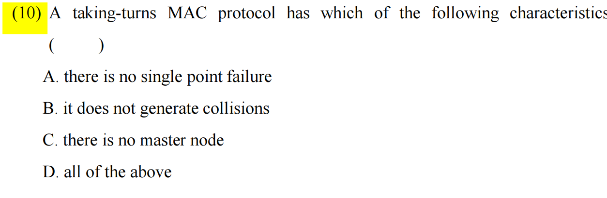

这道题考查的是计算机网络中**数据链路层 (Data Link Layer)** 的 **多路访问控制协议 / 媒体访问控制协议 (Multiple Access Control / MAC Protocols)**。

我会先为你解答原图中的题目，然后详细拆解相关的所有核心知识点，最后提供几道针对性的中英文双语练习题供你自测。

### 🌟 原题解析

**题目翻译：**

(10) 轮流 MAC 协议 (taking-turns MAC protocol) 具有以下哪个特征：

A. 没有单点故障 (there is no single point failure)

B. 不会产生冲突/碰撞 (it does not generate collisions)

C. 没有主节点 (there is no master node)

D. 以上都是 (all of the above)

**正确答案：B**

**解析：**

- **轮流协议 (Taking-turns protocol)** 的设计初衷就是**为了避免多个节点同时发送数据而产生的冲突 (collisions)**，所以 **B 是正确的**。
- 为什么 A 错误？因为**轮流协议（无论是轮询还是令牌传递）**都存在**单点故障 (single point failure)**。例如**主节点宕机，或者拥有令牌的节点宕机，都会导致整个网络瘫痪。**
- 为什么 C 错误？轮流协议中的**轮询协议 (Polling)** 是**明确需要一个主节点 (master node) 来统一调度的。**

### 📚 核心知识点详解 (中英文对照)

在局域网 (LAN) 中，当多个节点共享同一个广播信道时，需要 MAC 协议来决定谁可以发送数据。MAC 协议**主要分为三大类**，这里为你做横向对比，这是考试中最爱考的框架：

#### 1. 信道划分协议 (Channel Partitioning Protocols)

- **概念：** 将**信道资源（时间、频率、代码）静态地划分给各个节点。**
- **常见类型：**
	- **TDMA** (Time Division Multiple Access - **时分多路复用**)
	- **FDMA** (Frequency Division Multiple Access - **频分多路复用**)
- **特点：** 绝对不会产生**冲突 (collisions)**，非常公平。但**在网络负载轻（只有少数人想发数据）时，效率极低**，因为**分配给未发送节点的资源被浪费了**。

#### 2. 随机访问协议 (Random Access Protocols)

- **概念：** 节点**想发就发**。如果两个节点同时发，就会发生**冲突/碰撞 (collision)**，节点需要检测冲突并在随机延迟后重传。
- **常见类型：**
	- **ALOHA** / Slotted ALOHA (时隙 ALOHA)
	- **CSMA/CD** (**Carrier Sense Multiple Access** with Collision Detection - **带有冲突检测**的载波监听多路访问，**以太网 Ethernet 使用**)
	- **CSMA/CA** (带有**冲突避免**的...，**无线局域网 Wi-Fi 使用**)
- **特点：** 在**轻负载 (light load)** 时效率极高，单节点可以独占最大带宽。但在**重负载 (heavy load)** 时，冲突频发，网络效率会急剧下降。

#### 3. 轮流协议 (Taking-Turns Protocols) —— **本题考点**

- **概念：** 结合了前两者的优点，既能**在重负载下避免冲突，又能在轻负载下相对高效（尽管比不上随机访问协议）。**
- **核心特征：** **无冲突 (No collisions)**。
- **主要分为两种实现方式（高频考点）：**
	1. **轮询协议 (Polling):**
		- **机制：** 指定一个**主节点 (Master node)**，主节点轮流“点名”邀请**从节点 (Slave nodes)** 发送数据。
		- **缺点：**
			- **轮询开销 (Polling overhead):** 主节点发送邀请信息需要占用带宽。
			- **延迟 (Latency):** 从节点想发数据必须等主节点点名。
			- **单点故障 (Single point of failure):** **主节点如果宕机，整个网络直接瘫痪**。
	2. **令牌传递协议 (Token Passing):**
		- **机制：** 没有主节点。一个特殊的控制帧（叫作**令牌 Token**）**在节点间按固定顺序传递。只有拿到令牌的节点才有权发送数据**（例如早期的 Token Ring 令牌环网）。
		- **缺点：**
			- **令牌开销 (Token overhead)** 和 **延迟 (Latency)**。
			- **单点故障 (Single point of failure):** 如果**令牌丢失，或者正在持有令牌的节点死机了，整个网络也就卡死了**（需要复杂的令牌恢复机制）。

### 📝 考试风格模拟题 (含答案与解析)

*(请先遮挡下方“答案与解析”部分进行自测，题干主要为英文，辅助中文翻译以贴合你的考试需求)*

**Question 1:**

Which of the following is a primary disadvantage of the Token Passing MAC protocol?

(以下哪项是令牌传递 MAC 协议的主要缺点？)

A. It generates high collision rates under heavy loads. (在重负载下会产生高冲突率。)

B. It suffers from single point of failure if a node holding the token crashes. (如果持有令牌的节点崩溃，它会遭遇单点故障。)

C. It requires a master node to coordinate transmissions. (它需要一个主节点来协调传输。)

D. It is highly inefficient when channel utilization is close to 100%. (当信道利用率接近100%时，它非常低效。)

**Question 2:**

Compare Random Access protocols with Taking-Turns protocols. Under which condition does a Random Access protocol (like CSMA/CD) typically outperform a Taking-Turns protocol (like Token Ring)?

(比较随机访问协议和轮流协议。在什么情况下，**随机访问协议通常优于轮流协议**？)

A. Under heavily loaded networks with many active nodes. (在有许多活跃节点的重负载网络下。)

B. When the network requires deterministic transmission delays. (当网络需要确定性的传输延迟时。)

C. Under lightly loaded networks where only one node wants to transmit. (在**只有一个节点想要传输数据的轻负载网络下**。)

D. When avoiding packet collisions is the absolute highest priority. (当避免数据包冲突是绝对最高优先级时。)

**👇 答案与解析 (请作答后查看) 👇**

**Q1 答案：B**

- **解析：** 令牌传递协议 (Token Passing) 属于轮流协议，它的核心缺点是单点故障 (Single point of failure) —— 令牌丢失或节点宕机会导致整个网络停滞。A描述的是随机访问协议；C描述的是轮流协议中的“轮询 (Polling)”而非令牌传递；D描述错误，轮流协议在重负载（接近100%利用率）时效率极高，恰恰不会像随机访问那样浪费信道。

**Q2 答案：C**

- **解析：**
	- **轻负载 (Light load):** 随机访问协议 (如 CSMA/CD) 最优。因为**节点无需等待主节点轮询或等待令牌，检测到信道空闲就可以立刻全速发送，延迟最低。**
	- **重负载 (Heavy load):** **轮流协议最优。因为如果有大量节点要发数据，随机访问协议会导致疯狂冲突 (Collisions)**，大家都在重传，效率极低；而**轮流协议有条不紊地传递发送权，没有冲突，效率极高**。本题问的是随机访问协议何时表现更好，因此选轻负载情况 (选项 C)。

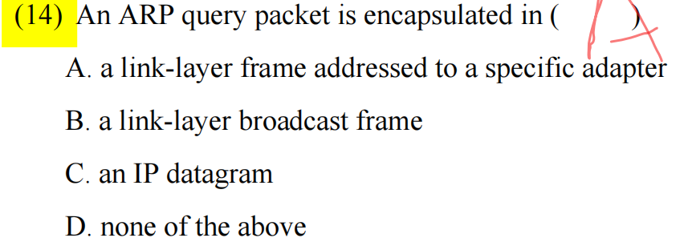

这道题考查的是计算机网络中**数据链路层 (Data Link Layer)** 的核心协议：**ARP (Address Resolution Protocol - 地址解析协议)** 的工作机制。

需要特别提醒你的是：**图片中手写的答案 'A' 是错误的，正确答案应该是 'B'。**

下面我将为你详细讲透这个知识点，并提供相关的测试题。

### 🌟 原题解析

**题目翻译：**

(14) 一个 ARP 查询分组 (ARP query packet) 被封装在 ( ) 中

A. 发送给特定适配器的链路层帧 (a link-layer frame addressed to a specific adapter) —— *即单播 (Unicast)*

B. 链路层广播帧 (a link-layer broadcast frame) —— *即广播 (Broadcast)*

C. IP 数据报 (an IP datagram)

D. 以上都不是 (none of the above)

**正确答案：B**

**解析：**

- **为什么选 B？** ARP 的**作用是“已知对方的 IP 地址，想查询对方的 MAC 地址”**。因为发送方**此时还不知道目标设备的 MAC 地址，所以它无法发送给“特定的适配器”**。它只能**向局域网内的所有设备大喊一声（广播 Broadcast）**：“谁的 IP 地址是 XXX？请把你的 MAC 地址告诉我！” 因此，ARP 查询必须封装在**链路层广播帧**中（目标 MAC 地址为全 1，即 `FF:FF:FF:FF:FF:FF`）。
- **为什么 A 错误？** 选项 A 描述的是 **ARP 应答/响应 (ARP Reply)** 的过程。当目标设备收到广播并确认是找自己后，它会**将自己的 MAC 地址发回去。因为此时它已经知道了查询方的 MAC 地址，所以直接单播 (Unicast) 给特定适配器即可，无需再广播。**
- **为什么 C 错误？** ARP 虽然是**为网络层（IP层）服务的**，但它的**分组是直接封装在数据链路层帧 (Link-layer frame) 中**的（作为**帧的数据有效载荷 payload**），它**不被封装在 IP 数据报中。ARP 有自己独立的以太网类型代码（EtherType `0x0806`）**，而 IP 数据报的类型代码是 `0x0800`。

### 📚 核心知识点详解 (中英文对照)

为了让你彻底弄懂 ARP，我们需要掌握以下几个核心流程和概念（这也是考试最爱挖坑的地方）：

#### 1. ARP 的核心功能 (Core Function)

- **IP 地址 (IP Address):** 网络层**逻辑地址，用于跨网络寻址。**
- **MAC 地址 (MAC Address / LAN Address / Physical Address):** **链路层物理地址，用于同一局域网 (LAN) 内的节点间**数据传输。
- **ARP 的作用:** 将**网络层的 IP 地址 映射为链路层的 MAC 地址** (Translates an IP address to a MAC address)。

#### 2. ARP 的工作流程 (ARP Process) - 高频考点

假设主机 A (Host A) 要**发数据给同局域网内**的主机 B (Host B)：

1. **查表 (Check ARP Table/Cache):** 主机 A 首先检查自己的 **ARP 缓存表**，看看有没有主机 B 的 IP 对应的 MAC 地址。
2. **ARP 查询 (ARP Query/Request) - 广播:** 如果缓存中没有，主机 A 就会构建一个 ARP 查询分组，并将其封装进一个**链路层广播帧 (Link-layer broadcast frame)** 发送到局域网中。局域网内的所有节点都会收到这个帧。
3. **ARP 响应 (ARP Reply/Response) - 单播:** 所有节点收到查询后，会将里面请求的 IP 地址与自己的 IP 地址对比。只有主机 B 发现匹配，于是主机 B 构建一个包含自己 MAC 地址的 ARP 响应分组，并将其封装进一个**寻址到特定适配器的链路层帧 (Link-layer frame addressed to a specific adapter, 即单播帧)**，直接发回给主机 A。
4. **更新表 (Update Table):** 主机 A 收到响应后，将主机 B 的 IP 和 MAC 地址映射记录存入自己的 ARP 缓存表中，然后开始发送真正的数据。

#### 3. ARP 的局限性 (Network Boundary)

- **ARP 只在同一子网 (Subnet/LAN) 内有效。** **路由器 (Routers) 不会转发链路层广播帧**。如果目标 IP **在另一个网络，主机 A 需要使用 ARP 获取默认网关 (Default Gateway / Router) 的 MAC 地址，把数据先发给路由器。**

### 📝 考试风格模拟题 (含答案与解析)

*(请先遮挡下方“答案与解析”部分进行自测，题干主要为英文以贴合你的考试需求)*

**Question 1:**

When a node wants to send a datagram to a destination IP address on the same local area network (LAN) but does not know the destination MAC address, what will be its immediate next step?

(当一个节点想要发送数据报给同一个局域网内的目标IP地址，但不知道目标MAC地址时，它的下一步会是什么？)

A. It sends an ARP reply packet directly to the destination IP.

B. It sends the datagram to the default router.

C. It broadcasts an ARP query packet on the local network.

D. It encapsulates the datagram in an IP broadcast packet.

**Question 2:**

Which of the following statements about the Address Resolution Protocol (ARP) is TRUE?

(关于地址解析协议 ARP，以下哪项陈述是**正确**的？)

A. An ARP reply is encapsulated in a broadcast frame to ensure the sender receives it.

B. ARP is used to translate MAC addresses into IP addresses.

C. Routers forward ARP query broadcasts to adjacent subnets to find the destination MAC address.

D. An ARP query is an Ethernet broadcast, whereas an ARP reply is an Ethernet unicast.

**Question 3:**

If Host A wants to send a packet to Host B, and Host B is located on a **different** subnet separated by a router (Router R), whose MAC address will Host A try to resolve using ARP?

(如果主机A想发包给主机B，且主机B在由路由器R隔开的**不同**子网上，主机A会使用ARP尝试解析谁的MAC地址？)

A. Host B's MAC address

B. Router R's interface MAC address connected to Host A's subnet

C. Router R's interface MAC address connected to Host B's subnet

D. A predefined multicast MAC address

**👇 答案与解析 (请作答后查看) 👇**

**Q1 答案：C**

- **解析：** 这是一个标准的 ARP 触发场景。不知道局域网内目标 IP 的 MAC 地址时，必须通过在局域网内**广播 (broadcast)** ARP 查询 (ARP query) 来获取。B 是跨网段时的做法；D 的说法错误，ARP 是链路层以上的协议。

**Q2 答案：D**

- **解析：**
	- A 错误：ARP 响应 (reply) 是**单播 (unicast)** 的，因为接收方已经知道了查询方的 MAC 地址。
	- B 错误：方向反了，ARP 是把 **IP 转成 MAC**。把 MAC 转 IP 的老协议叫 RARP。
	- C 错误：**路由器决不会转发广播帧**，ARP 广播被严格限制在单一子网内。
	- D 正确：这是对 ARP 机制最精准的概括（查询是广播，响应是单播）。

**Q3 答案：B**

- **解析：** 这是一个非常经典的易错题！由于 ARP 广播无法穿透路由器，如果目标 IP 在外网，主机 A 只能把数据包先扔给局域网内的“出口大门”——**默认网关 (Default Gateway)**，即路由器与主机 A 同属一个子网的那个接口。因此，主机 A 会使用 ARP 去查询**路由器接口的 MAC 地址**，而不是远端主机 B 的 MAC 地址。

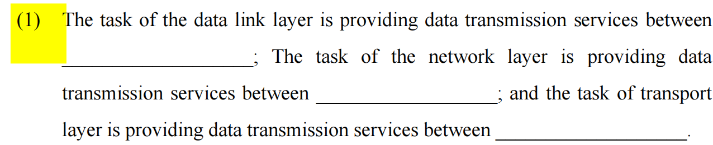

这道题考查的是计算机网络中**五层协议栈 / OSI 参考模型**中最核心的三个层次的作用域（数据传输范围）。这是网络基础中“必考中的必考”知识点。

### 🌟 原题解析

**题目翻译：**

(1) 数据链路层的任务是提供 ________ 之间的数据传输服务；网络层的任务是提供 ________ 之间的数据传输服务；而传输层的任务是提供 ________ 之间的数据传输服务。

**正确答案：**

- 第一空 (Data link layer): **adjacent nodes** (**相邻节点**)
- 第二空 (Network layer): **hosts** 或 **end systems** (**主机 / 端系统**)
- 第三空 (Transport layer): **processes** (**进程**) 或 **applications** (应用程序)

### 📚 核心知识点详解 (中英文对照)

计算机网络的分层模型就像是一个物流系统，每一层负责不同颗粒度的“快递传递”。考试最喜欢把这三层放在一起对比考查：

| **协议层 (Layer)**               | **传输范围 (Transmission Scope)**   | **依赖的地址 (Addressing)**    | **数据单元名称 (PDU)**                   | **核心设备 (Device)** |
| -------------------------------- | ----------------------------------- | ------------------------------ | ---------------------------------------- | --------------------- |
| **传输层 (Transport Layer)**     | **Process-to-process** (进程到进程) | **Port Number** (端口号)       | Segment (报文段) / Datagram (用户数据报) | 终端主机 (Host)       |
| **网络层 (Network Layer)**       | **Host-to-host** (主机到主机)       | **IP Address** (逻辑/IP地址)   | Datagram / Packet (分组/数据报)          | 路由器 (Router)       |
| **数据链路层 (Data Link Layer)** | **Node-to-node** (相邻节点到节点)   | **MAC Address** (物理/MAC地址) | Frame (帧)                               | 交换机 (Switch)       |

#### 详细拆解与通俗理解（物流比喻）：

1. **数据链路层 (Data Link Layer) —— "Node-to-node" (节点到节点)**
	- **概念：** 负责将数据从**一条物理链路的一端传送到另一端**（即直接相连的两个设备之间，比如你的电脑到家里的路由器）。这里的“节点 (Node)”泛指主机 (hosts)、路由器 (routers) 或交换机 (switches)。
	- **比喻：** 就像**快递卡车**，负责把包裹从“北京集散中心”运到“天津集散中心”（相邻的两个站点）。
2. **网络层 (Network Layer) —— "Host-to-host" (主机到主机)**
	- **概念：** 负责**跨越多个网络、多个路由器，将数据从源主机 (Source Host) 路由转发到目标主机 (Destination Host)。**
	- **比喻：** 就像**整个邮政系统**，它知道如何通过 IP 地址把包裹从“北京的某栋楼”送到“纽约的某栋楼”，它规划了全局的路线。
3. **传输层 (Transport Layer) —— "Process-to-process" (进程到进程)**
	- **概念：** 数据到达目标主机后，主机上**运行着很多程序（微信、浏览器、游戏）**。传输层负责通过**端口号 (Port)** 将数据准确无误地**交给对应的应用程序（进程）。**
	- **比喻：** 就像**大楼的前台**，包裹到了大楼（主机）后，前台根据包裹上的房间号（端口号），把包裹具体交给“302室的张三”（特定的进程）。

### 📝 考试风格模拟题 (含答案与解析)

*(请先遮挡下方“答案与解析”部分进行自测，题干和选项为英文)*

**Question 1:**

Which of the following layers is responsible for process-to-process delivery of the entire message?

A. Network layer

B. Transport layer

C. Data link layer

D. Physical layer

**Question 2:**

While the network layer delivers a packet from the source host to the destination host, the data link layer is responsible for delivering a frame from one ________ to the next.

A. router; router

B. network; network

C. node; node

D. process; process

**Question 3:**

When a web browser communicates with a web server, which address is used by the Transport Layer to identify the specific web server application?

A. IP Address

B. MAC Address

C. Port Number

D. URL Address

**👇 答案与解析 (请作答后查看) 👇**

**Q1 答案：B**

- **解析：** 题目问的是哪一层负责整个报文的“进程到进程 (process-to-process)”的交付。牢记对应关系：进程对应 Transport layer (传输层)；主机对应 Network layer (网络层)；节点对应 Data link layer (数据链路层)。

**Q2 答案：C**

- **解析：** 题目是对照句型。网络层负责源主机到目的主机，而数据链路层负责将帧从一个**节点 (node)** 传递到下一个**节点 (node)**。选项 A 不全面，因为链路层的两端不仅可以是路由器，还可以是主机和交换机等，统称为 node 更准确。

**Q3 答案：C**

- **解析：** 题目考查各层对应的寻址方式。传输层 (Transport Layer) **区分不同应用程序（如 Web 服务器应用）依赖的是端口号 (Port Number)**。IP 地址是网络层使用的，MAC 地址是数据链路层使用的。


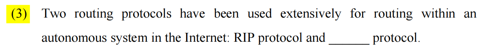

### 核心知识点精讲 (Core Concepts)

这道题考察的是**互联网的路由选择协议体系 (Internet Routing Architecture)**。为了方便管理，整个互联网被划分成了许多个较小的网络控制范围。

#### 1. 自治系统 (Autonomous System, AS)

- **定义**：一个**自治系统 (AS) 是指由单一技术管理机构控制的一组路由器和网络**。例如，一所大学的校园网、一个企业的内部网，或者一个互联网服务提供商 (ISP) 的网络都可以是一个独立的 AS。
- **路由的分类**：由于 AS 的存在，路由协议被严格分为两大类：
	- **内部网关协议 (Interior Gateway Protocol, IGP)**：用于在**同一个** AS 内部进行路由选择。图片中提到的 "routing within an autonomous system" **指的就是 IGP。**
	- **外部网关协议 (Exterior Gateway Protocol, EGP)**：用于在**不同的** AS 之间交换路由信息（目前互联网的**标准的 EGP 只有 BGP 协议**）。

#### 2. 常用的内部网关协议 (Common IGPs)

题干指出有两种**最广泛使用的内部网关协议**，它们是：

**A. RIP 协议 (Routing Information Protocol - 路由信息协议)**

- **算法类型**：基于**距离向量 (Distance-Vector)** 算法。
- **工作原理**：路由器**仅仅知道到达目的地的方向（哪个接口）和距离（跳数）**。相邻的路由器之间会**定期交换整个路由表。**
- **度量标准 (Metric)**：使用**跳数 (Hop Count)**。**经过一个路由器算作一跳**。RIP 规定**最大跳数为 15，16 意味着网络不可达 (unreachable)。**
- **适用场景**：由于**存在“最大跳数限制”和“收敛速度慢 (slow convergence)”**的问题，RIP 主要用于**小型网络 (small networks)**。

**B. OSPF 协议 (Open Shortest Path First - 开放最短路径优先)**

- **算法类型**：基于**链路状态 (Link-State)** 算法。它在**底层使用了著名的迪杰斯特拉 (Dijkstra) 最短路径算法。**
- **工作原理**：路由器会向网络中的**所有其他路由器广播自己的链路状态信息（即和谁相连，带宽是多少）**。**最终**，网络内的**每一个路由器都会完整了解全网的拓扑结构 (topology)**，并**自行计算出到达各个目的地的最短路径。**
- **度量标准 (Metric)**：使用**代价 (Cost)**，通常**与链路的带宽成反比（带宽越大，代价越小，路径越优）。**
- **适用场景**：收敛速度快，支持**复杂的网络拓扑和负载均衡**，广泛应用于**中大型企业网络 (medium to large networks)**。

### 考试与面试实战演练 (Exam & Interview Practice)

根据上述知识点的重要程度（OSPF 和 RIP 的对比是必考重点），我为你设计了以下两道典型的考试题（附带中文翻译与答案解析）。

#### 题目 1：单选题 (Multiple Choice)

**Question:** Which of the following routing protocols is classified as an Exterior Gateway Protocol (EGP) used for routing between different Autonomous Systems? (以下哪一种路由协议被归类为外部网关协议 (EGP)，用于在不同的自治系统之间进行路由？)

A) RIP B) OSPF C) BGP D) IS-IS

**【参考答案与解析】**

- **答案：** C
- **解析：** * A 和 B (RIP, OSPF) 都是内部网关协议 (IGP)，用于自治系统内部 (within an AS)。
	- D (IS-IS) 也是一种链路状态的 IGP，常用于大型运营商内部。
	- C (BGP - 边界网关协议, **Border** Gateway Protocol) 是目前互联网上唯一实际运行的外部网关协议 (EGP)，用于**在不同 AS 之间传递路由信息。**

#### 题目 2：简答题/面试题 (Short Answer / Interview)

**Question:** Briefly explain the main differences between RIP and OSPF regarding their routing algorithms and metric types. (简要解释 RIP 和 OSPF 在路由算法和度量标准类型上的主要区别。)

**【参考答案与解析】**

- **答案：**
	1. **路由算法 (Routing Algorithm)**: RIP 使用的是**距离向量 (Distance-Vector) 算法**，路由器只知道**到达目的地的跳数和下一跳地址**；而 OSPF **使用的是链路状态 (Link-State) 算法**，路由器会**获取全网的拓扑结构并使用最短路径算法自己计算路由。**
	2. **度量标准 (Metric)**: RIP 使**用跳数 (Hop count) 作为度量，且最大跳数限制为 15，适合小型网络**；OSPF 使用**代价 (Cost)（通常基于链路带宽）作为度量，更能反映网络的真实传输能力，适合大型网络。**

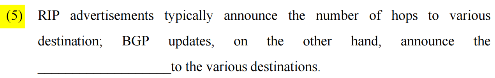

这道题考查的是计算机网络中**网络层 (Network Layer)** 的核心概念：**路由选择协议 (Routing Protocols)** 的工作机制差异，特别是 RIP 和 BGP 这两种经典协议的对比。

### 🌟 原题解析

**题目翻译：** (5) RIP 通告通常宣布**到达各个目的地的跳数 (number of hops)**；另一方面，BGP 更新宣布**到达各个目的地的** **__________________**。

**正确答案：** **sequence of ASs** (自治系统**序列**) 或者填 **AS path / entire path** (AS 路径 / 完整**路径**) 均可得分。

**解析：**

- **RIP (Routing Information Protocol)** 是一种**内部网关协议 (IGP)**。它非常**“近视”，只关心距离远近**，度量标准就是**跳数 (hop count)**，即中间要经过几个路由器。
- **BGP (Border Gateway Protocol)** 是一种**外部网关协议 (EGP)**，用于在全球互联网（不同运营商、大型机构之间）传递路由。它不关心具体的路由器跳数，而是把整个网络划分成一个个巨大的**自治系统 (Autonomous System, AS)**。BGP 的更新报文中包含的**是到达目的地所需经过的完整 AS 序列（例如：数据包需要先经过 AS1，再经过 AS4，最后到达目的地）。**

### 📚 核心知识点详解 (中英文对照)

为了应对考试，你需要将网络层的路由协议分为两大阵营来记忆，这是非常高频的考点：

#### 1. 内部网关协议 (IGP - Interior Gateway Protocol)

用于在一个**自治系统 (AS)** 内部（比如一个公司的内网，或者一个大学的校园网）寻找最优路径。主要有两个代表：

- **RIP (Routing Information Protocol)**
	- **算法分类：** 距离向量算法 (Distance Vector)。
	- **核心指标 (Metric)：** **跳数 (Hop count)**。
	- **致命限制：** 最大跳数限制为 **15**（如果跳数达到 16，则认为网络不可达/Infinity）。因此 RIP 只适用于非常小的网络。
	- **工作方式：** 定期把自己的整张路由表发给**相邻**的路由器。
- **OSPF (Open Shortest Path First)** *(补充知识，常与 RIP 对比考查)*
	- **算法分类：** 链路状态算法 (Link State)。
	- **核心指标 (Metric)：** **成本 (Cost)**，通常基于链路的**带宽 (bandwidth)** 计算。带宽越高，成本越低，路径越优先。
	- **工作方式：** 拥有全局视野，每个路由器都知道整个网络的拓扑结构，使用 Dijkstra 算法自己计算最短路径。

#### 2. 外部网关协议 (EGP - Exterior Gateway Protocol)

用于在**不同的自治系统 (AS)** 之间传递路由信息。互联网的骨干就是靠它连起来的。

- **BGP (Border Gateway Protocol - 边界网关协议)**
	- **算法分类：** 路径向量协议 (Path Vector)。
	- **核心通告内容：** **AS 路径 (AS-PATH)**。BGP 路由器在通告路由时，**会附带上这条路由已经走过的所有 AS 的编号列表。**
	- **为什么需要 AS 路径？**
		1. **防止环路 (Loop Prevention):** 如果一个 BGP 路由器收到一条路由更新，发现自己的 AS 编号**已经在 AS-PATH 列表中了，它就会直接丢弃这条更新，从而完美避免环路。**
		2. **策略路由 (Policy-based Routing):** BGP 选路**不一定选“最快”或“最短”的，而是基于商业策略（**比如：我不希望我的数据走竞争对手的 AS 骨干网，即使那条路更近）。

### 📝 考试风格模拟题 (含答案与解析)

*(请先遮挡下方“答案与解析”部分进行自测，题干主要为英文以贴合你的考试需求)*

**Question 1:** Which of the following routing protocols uses "hop count" as its routing metric and considers a metric of 16 as unreachable? (以下哪种路由协议使用“跳数”作为路由度量，并将度量值 16 视为不可达？) A. OSPF B. BGP C. RIP D. IS-IS

**Question 2:** BGP is widely used in the global Internet. What is the primary reason BGP advertises the entire AS path (Autonomous System path) instead of just using a simple cost metric like OSPF? (BGP 在全球互联网中被广泛使用。BGP 通告完整 AS 路径而不是像 OSPF 那样仅使用简单成本度量的主要原因是什么？) A. To minimize the size of routing update packets. (为了最小化路由更新数据包的大小。) B. To strictly find the path with the highest bandwidth. (为了严格找到具有最高带宽的路径。) C. To prevent inter-domain routing loops and implement routing policies. (为了防止跨域路由环路并实施路由策略。) D. To allow routers to process routing tables faster. (为了让路由器更快地处理路由表。)

**Question 3:** Which of the following protocols is an Exterior Gateway Protocol (EGP) used to route packets between different Autonomous Systems? (以下哪个协议是用于在不同自治系统之间路由数据包的外部网关协议 EGP？) A. RIP B. OSPF C. DHCP D. BGP

**👇 答案与解析 (请作答后查看) 👇**

**Q1 答案：C**

- **解析：** 这是 RIP 的标志性特征。只要看到 "hop count" (跳数) 和 "16 implies unreachable" (16跳即不可达)，立刻锁定 RIP。OSPF 看带宽 (cost)；BGP 看 AS 路径。

**Q2 答案：C**

- **解析：** BGP 作为跨域 (inter-domain) 路由协议，面临的环境极其复杂。它记录完整的 AS 路径（A错，这实际上增加了报文大小），根本目的是为了解决两个问题：一是通过查看 AS 列表中是否包含自己来**避免环路 (loop prevention)**；二是允许网络管理员根据商业关系配置**路由策略 (routing policies)**，比如拒绝经过特定的 AS。B 描述的是 OSPF 的倾向。

**Q3 答案：D**

- **解析：** 考查协议分类。RIP 和 OSPF 都属于内部网关协议 (IGP)，只在单一 AS 内部运行。DHCP 是动态主机配置协议，属于应用层，不负责路由。BGP (Border Gateway Protocol) 是目前唯一被广泛使用的外部网关协议 (EGP)。记住 "Border (边界)" 这个词，说明它是在系统边界与外部交流的。

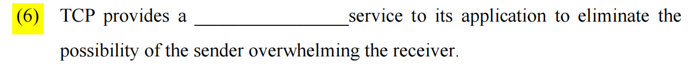

这道题考查的是计算机网络中**传输层 (Transport Layer)** 的霸主：**TCP (Transmission Control Protocol, 传输控制协议)** 的核心机制。

这道题非常经典，考查的是你对 TCP 如何保护接收方不被“撑爆”的理解。

### 🌟 原题解析

**题目翻译：** (6) TCP 为其应用程序提供了一种 **__________________** 服务，以消除发送方压垮接收方 (overwhelming the receiver) 的可能性。

**正确答案：** **flow-control** (流量控制)

**解析：**

- 题干的后半句 "eliminate the possibility of the sender overwhelming the receiver" 是解题的“题眼”。
- **压垮接收方**意味着：发送方发数据的速度，超过了接收方应用程序读取数据的速度。导致接收方的接收缓存 (receive buffer) 被塞满，随后的数据包只能被丢弃。
- 为了防止这种情况，TCP 引入了 **Flow Control (流量控制)** 机制。接收方会在 TCP 报文头中不断告诉发送方自己还剩多少空闲的接收缓存（这被称为**接收窗口 Receive Window, `rwnd`**），发送方必须保证发送的未确认数据量绝不超过这个窗口大小。

### 📚 核心知识点详解 (中英文对照)

TCP 有两个最容易混淆的“控制”机制，这是考试填空题和选择题的重灾区。一定要严格**区分它们保护的对象是谁：**

#### 1. 流量控制 (Flow Control) - 保护**接收方 (Receiver)**

- **核心目的：** 防止发送方发送数据过快，导致**接收方的缓存 (Receiver's Buffer)** 溢出。
- **主要机制：** 接收窗口 (Receive Window, **`rwnd`**)。
- **通俗理解：** 就像两人倒水。A 给 B 倒水，B 的杯子快满了，B 就会告诉 A：“我杯子只剩 50ml 的空隙了，你最多只能倒 50ml 过来，等我喝掉一点你再倒”。这就是**流量控制**，是**端到端 (End-to-end)** 的**速度匹配。**

#### 2. 拥塞控制 (Congestion Control) - 保护**整个网络 (Network)**

- **核心目的：** 防止**过多的数据注入到网络中**，导致**中间路由器 (Routers/Links)** 的**队列满载甚至崩溃（网络拥塞）。**
- **主要机制：** **拥塞窗口 (Congestion Window, `cwnd`)**。包含慢启动 (Slow Start)、拥塞避免 (Congestion Avoidance)、快重传 (Fast Retransmit) 和快恢复 (Fast Recovery) 等算法。
- **通俗理解：** 还是两人倒水。A 给 B 倒水，虽然 B 的杯子很大，但他们中间连着一根**很细的水管**。如果 A 倒太猛，**水管就会爆裂（路由器丢包）**。所以 A 会先慢慢倒，**试探水管的承受能力，一旦发现有水漏出来（发生丢包）**，A 就立刻减小倒水的速度。这就是拥塞控制。

**🌟 考试小抄 (Cheat Sheet)：**

- 看到 **Receiver (接收方) / Buffer (缓存) / Window size -> Flow Control**
- 看到 **Network (网络) / Router (路由器) / Congestion (拥塞) -> Congestion Control**

### 📝 考试风格模拟题 (含答案与解析)

*(请先遮挡下方“答案与解析”部分进行自测)*

**Question 1:** TCP uses a mechanism to ensure that the sender does not send data faster than the intermediate network routers can handle. What is this mechanism called? (TCP 使用一种机制来确保发送方发送数据的速度**不会超过中间网络路由器的处理能力**。这种机制叫什么？) A. Flow control (流量控制) B. Error control (差错控制) C. Congestion control (拥塞控制) D. Access control (访问控制)

**Question 2:** In TCP flow control, how does the sender know the current state of the receiver's buffer? (在 TCP 流量控制中，发送方是如何知道接收方缓存的当前状态的？) A. The sender sends ICMP ping requests to measure the receiver's capacity. B. The receiver includes a `rwnd` (receive window) value in the header of its acknowledgement segments. C. The router between them sends back explicit congestion notifications. D. The sender infers the buffer size by counting the number of dropped packets.

**Question 3:** Fill in the blanks: _______ control is an end-to-end issue, matching the sender's transmission rate to the receiver's reading rate. Conversely, _______ control is a global issue, matching the sending rate to the capacity of the network itself. (填空：_______ 控制是一个端到端的问题，它使发送方的传输速率与接收方的读取速率相匹配。相反，_______ 控制是一个全局问题，它使发送速率与网络本身的容量相匹配。)

**👇 答案与解析 (请作答后查看) 👇**

**Q1 答案：C**

- **解析：** 题干中的关键词是 "intermediate network routers" (中间网络路由器)。保护中间网络不被撑爆的机制是 **Congestion control (拥塞控制)**。如果是保护接收方，才是 Flow control。

**Q2 答案：B**

- **解析：** 考查流量控制的实现细节。**接收方通过在每次发送的 TCP 报文头部（包含确认号 ACK 的报文）中，填写接收窗口 (Receive Window, `rwnd`) 字段**，明确告诉发送方自己目前还剩多少字节的缓存空间可用。A 纯属胡编；C 是 ECN 机制，属于拥塞控制辅助手段；D 是 TCP 拥塞控制探测网络带宽的方式。

**Q3 答案：Flow (流量) ; Congestion (拥塞)**

- **解析：** 这是原汁原味的教科书级对比。
	- 第一空：匹配发送速率和**接收方 (receiver)** 速率，**保护端点** -> **Flow control**。
	- 第二空：匹配发送速率和**网络 (network)** 容量，**保护全局** -> **Congestion control**。

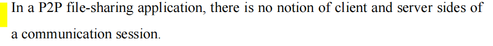

### 🌟 原题解析

**题目翻译：**

(4) 在 P2P 文件共享应用程序中，在一个通信会话 (communication session) 中没有客户端 (client) 和服务器端 (server) 的概念。

**正确答案：错误 (False)**

**解析：**

这句话错在**混淆了“宏观架构”和“微观会话”。**

- 在**宏观的架构层面**，P2P 网络**确实没有“永远在线的中心化服务器 (always-on server)”。所有节点都是平等的对等方 (Peers)。**
- 但是，在**微观的具体通信会话 (communication session) 层面**，客户端和服务器的**概念依然绝对存在**。
	- 当节点 A 向节点 B 请求下载文件时，节点 A 就是**客户端 (Client)**，节点 B 就是**服务器 (Server)**。
	- 下一秒，节点 B 可能向节点 A 请求另一个文件区块，此时**角色互换**，节点 B 变成了客户端，节点 A 变成了服务器。
- **总结：** 在 P2P 网络中，每个节点都**同时具备 (dual-role)** 客户端和服务器的功能，角色的划分取决于在当前特定的数据传输中，谁在“请求”数据，谁在“提供”数据。

### 📚 核心知识点详解 (中英文对照)

现代网络应用主要基于两种架构，这是考试中高频的对比考点：

#### 1. 客户-服务器架构 (Client-Server Architecture, 简称 C/S)

- **核心特征：**
	- 存在一个**永远在线的主机 (Always-on host)**，即服务器 (Server)，通常**拥有固定的 IP 地址。**
	- 客户端 (Clients) **必须主动发起**与服务器的通信。
	- 客户端之间**不能直接通信 (do not communicate directly with each other)**。
- **典型应用：** **Web (HTTP), 电子邮件 (SMTP/IMAP), 传统 FTP。**
- **致命缺点：** **单点故障 (Single point of failure)** 和 **性能瓶颈 (Performance bottleneck)**。当大量客户端同时请求时，服务器的带宽和计算资源会被耗尽。

#### 2. 对等架构 (Peer-to-Peer Architecture, 简称 P2P)

- **核心特征：**
	- 对**中心化服务器的依赖极小或完全没有。**
	- 任意端系统（即对等方 Peers）之间可以**直接相互通信。**
	- 节点是**间歇性连接的，且 IP 地址可能会经常改变 (Peers are intermittently connected and change IP addresses)。**
- **核心优势（考试必考重点）：** **自扩展性 (Self-scalability)**。在 P2P 文件共享（如 BitTorrent）中，虽然每个新加入的节点都会增加系统的负载（因为它要下载文件），但同时它也为系统带来了新的服务能力（因为它也在上传文件给别人）。
- **典型应用：** BitTorrent (文件共享), 迅雷, 早期 Skype。

为了让你更直观地理解 P2P 中“角色动态切换”的过程，我为你生成了一个简单的交互式模拟器。你可以点击按钮，观察在一个具体的 Session 中，Client 和 Server 的概念是如何依然存在的。

### 📝 考试风格模拟题 (含答案与解析)

*(请先遮挡下方“答案与解析”部分进行自测，题干主要为英文以贴合你的考试需求)*

**Question 1:**

Which of the following is the most significant advantage of a P2P architecture over a traditional Client-Server architecture?

(与传统的客户-服务器架构相比，P2P 架构最显著的优势是以下哪一项？)

A. Centralized security management. (集中的安全管理。)

B. Guaranteed minimum bandwidth for all users. (为所有用户提供有保证的最低带宽。)

C. Self-scalability, where new peers bring both new service capacity and new service demands. (自扩展性，新对等方既带来新的服务容量，也带来新的服务需求。)

D. Simpler application development due to predictable IP addresses. (由于可预测的 IP 地址，应用开发更简单。)

**Question 2:**

True or False: In a purely P2P architecture, a peer never acts as a server.

(判断题：在一个纯粹的 P2P 架构中，对等方永远不会充当服务器的角色。)

A. True

B. False

**Question 3:**

Consider an application where users are continuously joining and leaving, and IP addresses change frequently. Why might a P2P architecture be a better choice than a Client-Server architecture for distributing a massive file to all these users?

(考虑这样一个应用场景：用户不断地加入和离开，且 IP 地址频繁更改。为了向所有这些用户分发一个超大文件，为什么 P2P 架构可能比 C/S 架构是更好的选择？)

A. Because P2P allows the central server to handle more concurrent connections.

B. Because in C/S architecture, the server bottleneck worsens as the number of users increases, whereas in P2P, users assist in distributing the file, relieving server load.

C. Because P2P routing algorithms are fundamentally faster than HTTP.

D. Because clients in a C/S architecture cannot download large files.

**👇 答案与解析 (请作答后查看) 👇**

**Q1 答案：C**

- **解析：** 考查 P2P 的核心优势。P2P 最大的卖点就是 **Self-scalability (自扩展性)**。由于每个节点**不仅下载（消耗资源），同时还上传（贡献资源）**，所以用户越多，系统的**整体下载速度往往不降反升**。A 是 C/S 的优点；P2P 无法保证带宽 (B 错)；P2P 节点的 IP 经常变动，开发其实更复杂 (D 错)。

**Q2 答案：B (False)**

- **解析：** 正如原图解析所述，P2P 的精髓在于每个节点都具有**双重身份**。当你给别人上传文件（做种/Seeding）时，你就在充当 Server；当你从别人那里下载文件时，你就在充当 Client。因此对等方会频繁充当服务器。

**Q3 答案：B**

- **解析：** 考查在大规模文件分发场景下的架构选择。**对于超大文件分发，C/S 架构中唯一的服务器会面临极其恐怖的出口带宽压力（即性能瓶颈）**。而在 **P2P 架构（如 BitTorrent）中，下载了文件片段的用户可以直接将该片段传给其他需要的用户**，大家**互相帮助，极大地减轻了单一数据源的压力**。

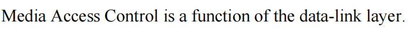

考查的是**数据链路层 (Data Link Layer)** 内部的子层划分机制。这是 IEEE 802 标准中最核心的设计之一。

### 🌟 原题解析

**题目翻译：** **介质访问控制 (Media Access Control, MAC)** 是数据链路层 (data-link layer) 的一个功能。

**正确答案：正确 (True)**

**解析：** 这句话是完全正确的。在 IEEE 802 标准中，为了更好地适配**各种不同的物理网络（如以太网、Wi-Fi 等）**，**数据链路层被拆分成了两个子层**：

1. 上半部分：**逻辑链路控制子层 (LLC - Logical Link Control)**
2. 下半部分：**介质/媒体访问控制子层 (MAC - Media Access Control)**

因此，MAC 毫无疑问是数据链路层的功能/组成部分。

### 📚 核心知识点详解 (中英文对照)

考试中最喜欢拿这两个子层来做对比，或者考查它们各自连接了哪一层。你需要记住这个“三明治”结构：

#### 1. 数据链路层的两个子层 (Sublayers of Data Link Layer)

为了**解耦软件和硬件**，**数据链路层被一分为二：**

- **LLC 子层 (Logical Link Control - 逻辑链路控制)**
	- **位置：** 数据链路层的**上半部分**，**紧挨着网络层 (Network Layer)。**
	- **核心作用：** 充当“桥梁”和“翻译官”。它**负责识别网络层传下来的协议（比如是 IPv4 还是 IPv6？），并提供多路复用 (multiplexing)**。它**屏蔽了底层物理网络的差异**，让网络层的 IP 协议**可以不管底下用的是网线还是 Wi-Fi。**
- **MAC 子层 (Media Access Control - 介质访问控制)**
	- **位置：** 数据链路层的**下半部分**，**紧挨着物理层 (Physical Layer)。**
	- **核心作用：** 负责**和具体的硬件打交道。**
		1. **寻址 (Addressing):** 使用 **MAC 地址（硬件地址）标识源和目的节点。**
		2. **成帧 (Framing):** 把数据**封装成帧**，**加上帧头和帧尾。**
		3. **介质访问 (Medium Access):** 决定**在共享信道中，什么时候可以发送数据（就是我们第一题讲的 CSMA/CD, 轮询等 MAC 协议）。**

#### 2. 为什么要这么拆分？(Why split the layer?)

- **硬件独立性 (Hardware Independence):** 物理层**技术日新月异（比如以太网从百兆升级到千兆，再到无线 Wi-Fi）。如果没有这种拆分，每次物理网卡变了，上面的 IP 协议甚至操作系统里的网络代码都要重写。**
- 有了这种拆分，底层的改变**只需更新 MAC 子层及物理层**，而**上面的 LLC 子层及网络层 (IP) 可以保持完全不变。**

### 📝 考试风格模拟题 (含答案与解析)

*(请先遮挡下方“答案与解析”部分进行自测)*

**Question 1:** The IEEE 802 standard divides the data link layer into two sublayers. Which sublayer is responsible for identifying the network layer protocol and providing a uniform interface to the upper layers? (IEEE 802 标准将数据链路层分为两个子层。哪个子层负责识别网络层协议并向上层提供统一的接口？) A. MAC (Media Access Control) sublayer B. LLC (Logical Link Control) sublayer C. Physical (PHY) layer D. Network layer

**Question 2:** Which of the following tasks is primarily a function of the MAC (Media Access Control) sublayer? (以下哪项任务主要是 MAC 子层的功能？) A. Routing packets across multiple networks. (跨多个网络路由数据包。) B. Resolving IP addresses to MAC addresses using ARP. (使用 ARP 将 IP 地址解析为 MAC 地址。) C. Encapsulating data into frames and controlling access to the shared physical medium. (将数据封装成帧并控制对共享物理介质的访问。) D. Ensuring end-to-end reliable data delivery between application processes. (确保**应用进程之间的端到端可靠数据**交付。)

**Question 3:** True or False: The LLC sublayer specifies the exact physical addresses (MAC addresses) used to send data over an Ethernet cable. (判断题：LLC 子层指定了用于通过以太网电缆发送数据的确切物理地址/MAC地址。) A. True B. False

**👇 答案与解析 (请作答后查看) 👇**

**Q1 答案：B**

- **解析：** 考查 LLC 和 MAC 的分工。**LLC (逻辑链路控制)** 负责与上层的**网络层**对接，**识别网络协议（多路复用）**；而 MAC 负责底层介质访问。

**Q2 答案：C**

- **解析：** A 是网络层 (Network Layer) 的功能**；B 是网络层与链路层之间的 ARP 协议的功能**；D 是传输层 (TCP) 的功能。只有 C（**成帧 Framing 和介质访问控制 Medium Access**）是 MAC 子层的核心任务。

**Q3 答案：B (False)**

- **解析：** **处理硬件地址（MAC地址）**是 **MAC 子层** 的任务，而不是 LLC 子层的任务。LLC 处理的是**逻辑层面的链路控制。**

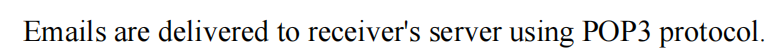

### 🌟 原题解析

**题目翻译：** 电子邮件使用 POP3 协议被传送到接收方的服务器 (receiver's server)。

**正确答案：错误 (False)**

**解析：** 这句话错在对 POP3 作用域的描述。

- 电子邮件**从发送方传送到接收方的服务器 (Server)**，使用的是 **SMTP (简单邮件传输协议)**。这是一个“推送” (Push) 过程。
- **POP3 (邮局协议版本3)** 的作用是**让最终用户（接收方）从自己的邮件服务器上“拉取/下载” (Pull) 邮件到本地电脑或手机上**。它不负责服务器之间的传递。

### 📚 核心知识点详解 (中英文对照)

要彻底搞懂这部分，你需要掌握电子邮件系统的三大核心组件及其对应的协议流向。记住下面这套“快递物流”的比喻，考试时绝对不会乱。

#### 1. 电子邮件系统的三大组件

1. **用户代理 (User Agent, UA):** 也就是你的**邮件客户端，比如 Outlook, Apple Mail, Foxmail。**
2. **邮件服务器 (Mail Server):** 相当于**邮局。它包含发送队列 (Outgoing message queue) 和接收者的邮箱 (Mailbox)。**
3. **协议 (Protocols):** 负责**规定邮件如何传输**。主要分为推协议 (SMTP) 和拉协议 (POP3/IMAP)。

#### 2. 核心协议对比与工作流 (The Email Workflow) - 🌟 必考重点

假设 Alice 要发邮件给 Bob，整个完整流程如下：

- **阶段一：Alice 的电脑 ➔ Alice 的邮件服务器**
	- **使用协议：SMTP** (**Simple Mail Transfer Protocol**)
	- **机制：** **推送 (Push)**。Alice 的客户端将邮件推送到她自己的服务器上排队。
- **阶段二：Alice 的邮件服务器 ➔ Bob 的邮件服务器**
	- **使用协议：SMTP** (或者确切地说是 **SMTP 服务器之间的通信)**
	- **机制：** **推送 (Push)**。邮件通过互联网从发送方的主机被推送到接收方的主机。这就是为什么原题是错误的。
- **阶段三：Bob 的邮件服务器 ➔ Bob 的电脑**
	- **使用协议：POP3 或 IMAP** (或**基于 Web 的 HTTP**)
	- **机制：** **拉取 (Pull)**。此时邮件已经安稳地躺在 Bob 服务器的邮箱里了。Bob 必须主动去服务器上把邮件拉取下来。

#### 3. 接收协议对比：POP3 vs IMAP

考试中经常会让你对比这两个“拉取”协议的优缺点：

- **POP3 (Post Office Protocol version 3):**
	- **特点：** 简单粗暴。通常的**工作模式是“下载并删除” (Download and Delete)。**邮件下载到本地后，服务器上的**原件就被删除了。**
	- **缺点：** 极**不适合多设备用户**（比如你在手机上看过了，电脑上就找不到了，除非特别设置保留副**本）。无状态协议 (Stateless across sessions)。**
- **IMAP (Internet Message Access Protocol):**
	- **特点：** 更现代、更强大。它允许用户**在服务器上管理邮件（创建文件夹、标记已读等）。**
	- **核心优势：** **状态同步 (State synchronization)**。邮件**一直保存在服务器上**，你在手机上标记为已读，电脑上也会同步显示已读。非常适合多设备管理。

### 📝 考试风格模拟题 (含答案与解析)

*(请先遮挡下方“答案与解析”部分进行自测)*

**Question 1:** Which protocol is primarily used to transfer email messages from one mail server to another mail server over the Internet? (主要用于在互联网上将电子邮件从一个邮件服务器传输到另一个邮件服务器的协议是哪一个？) A. POP3 B. IMAP C. SMTP D. HTTP

**Question 2:** Consider a scenario where Alice uses multiple devices (a smartphone, a tablet, and a laptop) to read her emails. Which mail access protocol is most appropriate for her, and why? (考虑 Alice 使用多个设备（智能手机、平板电脑和笔记本电脑）来阅读电子邮件的场景。哪种邮件访问协议最适合她，为什么？) A. POP3, because it keeps a master copy of the email on the server permanently. B. IMAP, because it allows users to organize emails in folders on the server and synchronizes state across multiple devices. C. SMTP, because it pushes the emails simultaneously to all her devices. D. HTTP, because webmail is the only way to access emails from multiple devices.

**Question 3:** True or False: SMTP is fundamentally a pull protocol, whereas POP3 is a push protocol. (判断题：SMTP 本质上是一个拉取协议，而 POP3 是一个推送协议。) A. True B. False

**👇 答案与解析 (请作答后查看) 👇**

**Q1 答案：C**

- **解析：** 只要涉及把邮件**发出去**（无论是从客户端发到服务器，还是服务器发给服务器），用的都是 **SMTP (Simple Mail Transfer Protocol)**。POP3 和 IMAP 仅用于接收端从服务器下载邮件。

**Q2 答案：B**

- **解析：** 这是一道经典的情景应用题。多设备同步是 **IMAP** 的核心卖点。A 选项对 POP3 的描述是错误的（POP3 默认是下载并删除）。C 选项错误，SMTP 不是用来接收邮件的。D 选项过于绝对，虽然 Webmail 使用 HTTP 也可以多设备访问，但 IMAP 是专门为此设计的标准邮件协议。

**Q3 答案：B (False)**

- **解析：** 正好说反了。SMTP 是把邮件**推送 (Push)** 到别人的地盘；POP3/IMAP 是把邮件从服务器**拉取 (Pull)** 回自己的地盘。

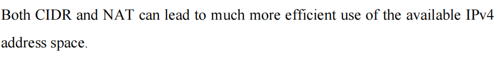

**网络层 (Network Layer)** 中为了缓解 **IPv4 地址耗尽危机** 而诞生的两项伟大技术：**CIDR** 和 **NAT**。

### 🌟 原题解析

**题目翻译：** CIDR 和 NAT 都能使得**对可用 IPv4 地址空间的使用变得高效得多。**

**正确答案：正确 (True)**

**解析：** 这句话是完全正确的。在 IPv6 彻底普及之前，**IPv4 的地址池（约 43 亿个）早就该用光了**。正是由于 **CIDR (无类别域间路由) 减少了地址分配时的浪费**，以及 **NAT (网络地址转换)** 允许**多台设备共享一个公网 IP**，IPv4 的寿命才得以大幅延长。

### 📚 核心知识点详解 (中英文对照)

考试中经常会把这两个概念放在一起对比考查，你需要明确它们各自是“如何”提高地址使用效率的：

#### 1. CIDR (Classless Inter-Domain Routing - 无类别域间路由)

- **解决的问题：分配浪费 (Allocation Waste)**
- **过去的问题 (Classful Addressing):** 以前的 **IP 分类非常死板（A类、B类、C类）。比如一个公司需要 400 个 IP 地址，C类（254个）不够用，只能给它分一个 B类（65,534个）**。这就导致了高达 **6万多个地址被白白浪费**。
- **CIDR 的机制：** **废除了 A/B/C 类的概念**，**引入了子网掩码 (Subnet Mask) 也就是斜杠记法（如 `/23`）。**
- **如何提效：** 它允许按需“量体裁衣”。你需要 400 个地址？那我就给你**分配一个 `/23` 的网段（包含 512 个地址）**，极大限度地**减少了未使用的闲置地址。**

#### 2. NAT (Network Address Translation - 网络地址转换)

- **解决的问题：地址短缺 (Address Shortage)**
- **核心机制：** 划分了**私有 IP 地址 (Private IP)** 和**公网 IP 地址 (Public IP)**。
	- 你的家里、公司内部网络**使用的都是私有 IP（如 `192.168.x.x` 或者 `10.x.x.x`）**，这些地址在**内网随便用，但不能直接上互联网。**
- **如何提效：共享/多路复用 (Sharing / Multiplexing)。**
	- 当内网设备想要上网时，数据包到达**NAT 路由器**。路由器会**把内网的“私有 IP + 端口号”转换成路由器自己的“公网 IP + 新端口号”。**
	- **结果：** 一个拥有成百上千台设备的局域网，**对外只需要消耗 1 个 公网 IPv4 地址**。这就是如今 IPv4 还能撑下去的根本原因。

### 📝 考试风格模拟题 (含答案与解析)

*(请先遮挡下方“答案与解析”部分进行自测，题干主要为英文以贴合你的考试需求)*

**Question 1:** Which of the following technologies allows a large number of internal hosts using private IP addresses to access the Internet using only a single public IP address? (以下哪项技术允许大量使用私有 IP 地址的内部主机仅使用一个公网 IP 地址来访问互联网？) A. DHCP B. ARP C. CIDR D. NAT

**Question 2:** Before the introduction of CIDR, an organization needing 500 IP addresses would have to be assigned a Class B network, wasting tens of thousands of addresses. How does CIDR solve this problem? (在引入 CIDR 之前，一个需要 500 个 IP 地址的组织必须被分配一个 B 类网络，从而浪费数万个地址。CIDR 是如何解决这个问题的？) A. By translating private IP addresses into public ones. B. By allowing arbitrary length subnet masks to allocate address blocks of sizes that closely fit the organization's needs. C. By reusing deleted IP addresses automatically. D. By converting IPv4 addresses to IPv6 addresses.

**Question 3:** True or False: NAT improves routing table efficiency in the global Internet core routers by aggregating multiple IP prefixes into a single entry. (判断题：NAT 通过将多个 IP 前缀聚合成一个条目，提高了全球互联网核心路由器的路由表效率。) A. True B. False

**👇 答案与解析 (请作答后查看) 👇**

**Q1 答案：D**

- **解析：** 这是 **NAT** 最标准的定义场景。局域网共享单一公网 IP 上网。DHCP 是自动分配内网 IP 的；ARP 是 IP 转 MAC 的；CIDR 是路由划分的。

**Q2 答案：B**

- **解析：** 考查 CIDR 的核心作用。CIDR **通过允许任意长度的子网掩码 (arbitrary length subnet masks)**，实现了**按需分配（量体裁衣）**，从而**避免了传统分类地址带来的巨大浪费**。A 选项描述的是 NAT。

**Q3 答案：B (False)**

- **解析：** 这句话前半部分描述的功能叫做**路由聚合 (Route Aggregation / Route Summarization)**，这是 **CIDR 的一大功劳，而不是 NAT 的功劳**。CID**R 不仅优化了地址分配，还让路由表变得更精简**。NAT **只负责局域网与公网边界的地址转换。**

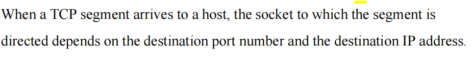

计算机网络（Computer Networking）课程中传输层（Transport Layer）的一个非常经典的易错考点，通常出现在判断题（True/False）或选择题中。

这句话的原文是：“When a TCP segment arrives to a host, the socket to which the segment is directed depends on the destination port number and the destination IP address.”（当一个 TCP 报文段到达主机时，该报文段**被定向到的套接字取决于目的端口号和目的 IP 地址。**）

**重要结论：这句话是错误的（FALSE）。**

下面我将为你详细拆解其背后的核心知识点。

### 核心知识点讲解：多路分解（Demultiplexing）与套接字标识（Socket Identification）

在计算机网络中，当**底层（网络层 Network Layer）将数据传递给传输层（Transport Layer）**时，传输层需要决定将这些数据**交付给主机上的哪个具体进程（Process）**。这个将**接收到的报文段（Segment）定向到正确的套接字（Socket）的过程被称为多路分解（Demultiplexing）。**

TCP 和 UDP 在进行多路分解时，依赖的标识符是完全不同的：

**1. TCP 套接字（TCP Socket）—— 面向连接（Connection-oriented）**

- **标识方式：** 一个 **TCP 套接字**是**由一个四元组（4-tuple / Four-tuple）来唯一标识的。**
- **四元组包含：**
	1. **Source IP address（源 IP 地址）**
	2. **Source port number（源端口号）**
	3. **Destination IP address（目的 IP 地址）**
	4. **Destination port number（目的端口号）**
- **原因分析：** TCP 是面向连接的协议。一台 Web 服务器（例如运行在目的端口 80 上）可能会同时与**成千上万个不同的客户端保持 TCP 连接。为了区分这些来自不同客户端的数据包**，服务器**不能仅仅依靠目的 IP 和目的端口（因为这些对服务器来说都是一样的）**，它**必须结合源 IP 和源端口来确定**这个报文段**属于哪个具体的会话连接，从而将其送入正确的套接字。**

**2. UDP 套接字（UDP Socket）—— 无连接（Connectionless）**

- **标识方式：** 一个 UDP 套接字**仅仅由一个二元组（2-tuple / Two-tuple）来标识。**
- **二元组包含：**
	1. Destination IP address（目的 IP 地址）
	2. Destination port number（目的端口号）
- **原因分析：** UDP 是**无连接的。如果两个不同的客户端发送 UDP 数据报（Datagrams）到同一个目的 IP 和目的端口**，操作系统**会将这两个数据报放入同一个目标 UDP 套接字中**，由应**用程序自己去解析发送者是谁（通过检查数据报中的源信息）。**

**💡 总结图中的错误：** 图片中的描述**仅仅提到了“destination port number”（目的端口号）和“destination IP address”（目的 IP 地址）**，这实际上**是 UDP 套接字的定位方式。**对于 **TCP 报文段（TCP segment），必须还要依赖源 IP 和源端口**，因此图中的表述是不完整的、错误的。

### 辅导测试题（Exam-Style Practice）

根据上述知识点，我为你设计了以下几道符合考试和面试风格的题目，帮助你自测。

#### Question 1 (True/False)

**Question:** Is the following statement True or False? "When a UDP segment arrives to a host, the socket to which the segment is directed depends purely on the destination port number and the destination IP address." (判断正误：当一个 UDP 报文段到达主机时，该报文段被定向到的套接字完全取决于目的端口号和目的 IP 地址。)

**Answer:** **True (正确).** *解析：* UDP connectionless demultiplexing (无连接的多路分解) is based strictly on the 2-tuple: destination IP and destination port. (UDP 的**多路分解严格依赖于二元组：目的 IP 和目的端口**。)

#### Question 2 (Multiple Choice)

**Question:** A web server is running on a host with IP address `192.168.1.100` and is listening for HTTP requests on port 80. Client A (`10.0.0.1`, port 5000) and Client B (`10.0.0.2`, port 5000) both establish persistent TCP connections with the server. How does the server's OS direct the incoming TCP segments to the correct application thread/socket? (一台 IP 为 `192.168.1.100` 的 Web 服务器在 80 端口监听 HTTP 请求。客户端 A（IP `10.0.0.1`，端口 5000）和客户端 B（IP `10.0.0.2`，端口 5000）都与服务器建立了持久的 TCP 连接。服务器的操作系统如何将到达的 TCP 报文段**定向到正确的应用程序线程/套接字**？)

A. By checking the payload of the HTTP request. (通过检查 HTTP 请求的有效载荷) B. By examining the destination IP and destination port only. (仅通过检查目的 IP 和目的端口) C. By examining the 4-tuple: Source IP, Source Port, Destination IP, and Destination Port. (通过**检查四元组：源 IP、源端口、目的 IP 和目的端口**) **D**. By assigning a new destination port for each client upon connection. (在**连接时为每个客户端分配一个新的目的端口**)

**Answer:** **C.** *解析：* TCP demultiplexing (TCP 多路分解) relies on the 4-tuple. Since the destination IP (`192.168.1.100`) and destination port (80) are identical for both clients, and even their source ports (5000) are the same, the OS uses the distinct Source IP addresses (`10.0.0.1` vs `10.0.0.2`) to distinguish the segments and route them to the correct socket. (由于**两个客户端的目的 IP、目的端口甚至源端口都相同**，操作系统必须**利用不同的源 IP 地址来区分报文段并将其路由到正确的套接字**。)

#### Question 3 (Short Answer / Interview Style)

**Question:** In the context of transport layer demultiplexing (传输层多路分解), explain why a TCP server handling multiple clients on port 80 doesn't experience port conflicts, but a UDP application might handle all incoming traffic through a single socket. (在传输层多路分解的背景下，解释为什么**在 80 端口处理多个客户端的 TCP 服务器不会遇到端口冲突**，而 UDP 应用程序可能通过单一套接字处理所有传入流量？)

**Answer:** Because TCP uses connection-oriented demultiplexing (面向连接的多路分解). A fully qualified TCP connection is identified by a 4-tuple (Source IP, Source Port, Destination IP, Destination Port). Even if many clients connect to the same Destination Port (80), their Source IPs or Source Ports will differ, creating unique 4-tuples for each connection, thus mapping to different internal sockets. Conversely, UDP uses connectionless demultiplexing (无连接的多路分解) relying only on a 2-tuple (Destination IP, Destination Port). All segments sent to that specific IP and port combination will be directed into the exact same socket, regardless of where they came from. (因为 TCP **使用四元组标识连接**，**只要客户端的源 IP 或源端口不同，就能被系统区分为不同的连接并分配到不同的内部套接字**。而 **UDP 仅依赖目的 IP 和目的端口的二元组**，因此**发往同一目的地的所有数据报都会进入同一个套接字**。)

## 为我详细地区分一下端口和套接字的关系

### 1. 通俗比喻：公寓楼模型 (The Apartment Building Analogy)

要想快速理解，我们可以把一台连接到互联网的计算机（Host）想象成一栋**公寓楼**：

- **IP Address (IP 地址) = 公寓楼的街道地址**。它决定了快递员（数据包）能找到这栋大楼。
- **Port (端口) = 公寓的房间号**（例如：**80房间是Web服务，22房间是SSH服务**）。快递员到了大楼后，需要**知道把包裹送到哪个房间。**
- **Socket (套接字) = 房间的“门”或“信箱”**。它是**实实在在存在的一个物理入口。应用程序（住在房间里的人）通过打开这扇门来接收外部的包裹**，或者**把包裹递出去。**

**核心区别在于：** 房间号（Port）**只是一个数字标签**，而门**（Socket）是你可以触碰、可以开关的实体结构。**

### 2. 技术本质对比 (Technical Breakdown)

在计算机科学的严谨定义中，它们的区别如下：

#### A. 端口 (Port) —— 逻辑标识符 (Logical Identifier)

- **定义：** 端口是传输层（Transport Layer，如 TCP/UDP）协议头部中的一个 **16 位的数字**（范围从 0 到 65535）。
- **作用：** 用于**多路分解 (Demultiplexing)**。当网络层把数据交上来时，操作系统看一眼这个数字，就知道**该把数据交给哪个应用程序。**
- **本质：** 它只是**一个抽象的数字，一段存在于网络报文头部的元数据（Metadata）。**

#### B. 套接字 (Socket) —— 软件端点 (Software Endpoint)

- **定义：** 套接字是**操作系统（OS）提供的一种应用程序接口 (API) 或内部数据**结构。在类 Unix 系统中，套接字本质上是一个**文件描述符 (File Descriptor)**。
- **作用：** 它是**应用程序和网络协议栈之间进行对话的“桥梁”或“端点 (Endpoint)”**。应用程序通过**调用 `socket()` 函数向操作系统申请创建这个资源，然后用它来读取（`recv`）或发送（`send`）数据。**
- **本质：** 它是一个**占用内存和系统资源的操作系统对象 (OS Object)**。

### 3. 核心考点：一对多关系 (The 1-to-N Relationship)

这是考试中最喜欢考的陷阱：**一个端口号可以对应多个套接字吗？**

**答案是：对于 TCP 来说，绝对可以！**

结合你之前做的那道题，我们来深入理解：

当一个 Web 服务器在 **Port 80** 上监听时，它实际上会经历以下过程：

1. **监听套接字 (Listening Socket)：** 服务器首先**创建一个套接字，并将其绑定（Bind）到 80 端口**。这个套接字**就像大堂经理，只负责迎客，不负责服务**。
2. **已连接套接字 (Connected Sockets)：** * 当 Client A 发来连接请求时，服务器的操作系统**会克隆/新建一个新的套接字来专门为 Client A 服务。**
	- 当 Client B **也发来连接请求时，操作系统又会新建另一个套接字专门为 Client B 服务。**
	- 这成千上万个**新建的套接字**，它们在服务器端**所绑定的本地端口号全都是 80！**

**那操作系统怎么区分它们呢？**

这就回到了你之前学过的知识点：操作系统依靠 **TCP 四元组 (4-tuple: Source IP, Source Port, Destination IP, Destination Port)** 来唯一标识每一个“已连接套接字”。

### 📝 总结速记表 (Summary Table)

| **对比维度**                  | **Port (端口)**                        | **Socket (套接字)**                                          |
| ----------------------------- | -------------------------------------- | ------------------------------------------------------------ |
| **概念层面 (Concept)**        | 协议层面的逻辑数字 (Logical number)    | 操作系统层面的编程接口/对象 (Programming interface / OS object) |
| **存在形式 (Form)**           | 报文头部中的 16 位整数 (e.g., 80, 443) | 内存中的数据结构 / 文件描述符 (File descriptor)              |
| **资源消耗 (Resources)**      | 仅仅是一个数字，不消耗内存             | 消耗操作系统的内存和文件描述符配额                           |
| **标识方式 (Identification)** | 用单个数字标识 (e.g., Port 80)         | 结合 IP 地址和端口来标识端点 (Endpoint = IP + Port)          |
| **数量关系 (Relationship)**   | 一个主机的特定协议下最多 65536 个端口  | 一个端口（如 TCP 80）可以关联成千上万个套接字                |

简单来说，**Port 是用来“指路”的数字，而 Socket 是用来实际“搬砖（传数据）”的工具。**

## 那udp对应的套接字不会跟tcp混用吗

这是一个非常敏锐的好问题！很多初学者都会产生这个疑虑。

答案是：**绝对不会混用 (Absolutely Not)**。

即使你的电脑上同时运行着一个绑定在 **TCP 端口 8080** 的程序，和一个绑定在 **UDP 端口 8080** 的程序，操作系统也**绝不会把它们搞混，数据也绝不会串门。**

TCP 的端口空间和 UDP 的端口空间在操作系统内部是**完全独立、物理隔离的两个命名空间 (Independent Namespaces)**。

以下是操作系统保证它们不会混用的底层逻辑：

### 核心机制：IP 头部的“协议”字段 (The Protocol Field in IP Header)

要知道，无论是 TCP 报文段 (Segment) 还是 UDP 数据报 (Datagram)，它们在网络中传输时，都被封装在**网络层 (Network Layer)** 的 **IP 数据报 (IP Datagram)** 内部。

当一个 IP 数据报到达主机的网卡，并被交给操作系统的网络协议栈时，操作系统**第一眼看的并不是端口号**，而是 **IP 头部 (IP Header) 中的一个 8 位字段，叫做 Protocol (协议)。**

- 如果是 TCP 数据，这个 Protocol 字段的值固定是 **6**。
- 如果是 UDP 数据，这个 Protocol 字段的值固定是 **17**。

### 拆包裹的精确流程 (The Demultiplexing Process)

当数据到达你的电脑时，操作系统的工作流程如下：

1. **第一道分拣 (IP 层的协议分发)：** **操作系统**拆开**最外层的 IP 包装，看到 Protocol 字段。**
	- 如果看到是 **6**，操作系统就会说：“这是 TCP 的货，直接交给 **TCP 处理模块**。”
	- 如果看到是 **17**，操作系统就会说：“这是 UDP 的货，直接交给 **UDP 处理模块**。”
2. **第二道分拣 (传输层的端口分发)：**
	- **TCP 处理模块**拿到数据后，只会**在自己维护的 “TCP 套接字表” 里去查找对应的目的端口（比如 8080）**。它根本看不见、也不关心 UDP 的套接字。
	- 同理，**UDP 处理模块**拿到数据后，也只会在自己的 **“UDP 套接字表”** 里去找目的端口（比如 8080）。

### 🏢 通俗比喻：两家不同的快递公司

继续用我们之前的公寓楼比喻：

- **IP 地址** = 公寓楼的大门地址。
- **Protocol (协议字段)** = 不同的快递公司。**TCP = 顺丰快递**，**UDP = 邮政快递**。
- **Port (端口)** = 楼里的储物柜编号（比如 8080 号柜子）。

大楼的前台（操作系统）有两个**完全分开的房间**，一个叫“顺丰专属室”，一个叫“邮政专属室”。两个房间里都有编号从 0 到 65535 的柜子。

当一辆带有顺丰标志（Protocol=6）的车开过来，交接了一个写着“8080柜”的包裹。前台会毫不犹豫地把它放进**顺丰专属室**里的 8080 柜子。它绝不可能错放到邮政房间的 8080 柜子里。

### 💡 考试/面试延伸考点 (Bonus Tip)

在实际的软件开发中，如果一个程序**尝试绑定一个已经被占用的 TCP 端口，操作系统会报错 `Address already in use` (地址已被占用)。**

但是，如果你先启动一个程序绑定了 **TCP 的 8080 端口**，然后你再启动另一个完全不同的程序去绑定 **UDP 的 8080 端口**，这是**完全合法且可以成功运行的**。

（实际上，很多著名的网络服务，比如 DNS 服务，就**默认同时监听 TCP 的 53 端口和 UDP 的 53 端口，它们背后使用的是两个相互独立的套接字。）**

## 一个端口可以绑定多个tcp套接字但不能绑定多个udp套接字是吗,为我详细地解释一下

你的理解非常准确，**这个结论是完全正确的（TRUE）**！

在网络编程和考试中，这是一个非常经典且考得非常深的底层机制。简单来说：**在同一个端口上，TCP 可以同时绑定成千上万个不同的套接字，而 UDP 在通常情况下只能绑定一个套接字。**

为了帮你彻底绕开考试和面试中的陷阱，我们结合中英文术语，从底层多路分解机制（Demultiplexing Mechanism）的本质来为你详细拆解其中的原因。

### 核心原因：多路分解的“依据”不同

操作系统（OS）在收到网络数据包时，必须决定把这个数据包交给哪个具体的套接字。这个过程叫 **多路分解 (Demultiplexing)**。TCP 和 UDP 的分发依据（即它们判断身份的凭证）有着本质的区别：

#### 1. TCP 采用的是“面向连接的多路分解” (Connection-Oriented Demultiplexing)

TCP 是面向连接的协议（Connection-oriented protocol）。操作系统标识一个 TCP 套接字，使用的是**四元组 (4-tuple)**：

1. **Source IP** (源 IP 地址)
2. **Source Port** (源端口号)
3. **Destination IP** (目的 IP 地址)
4. **Destination Port** (目的端口号)

- **为什么能绑定多个？** 假设一个 Web 服务器（Destination IP: `1.1.1.1`）在 **TCP 端口 80** 上监听（Destination Port: 80）。

	- **当客户端 A（`2.2.2.2`:5000）连接过来，系统创建一个套接字**，标识为：`(2.2.2.2, 5000, 1.1.1.1, 80)`。
	- **当客户端 B（`3.3.3.3`:5000）连接过来，系统又创建一个套接字**，标识为：`(3.3.3.3, 5000, 1.1.1.1, 80)`。

	注意看，这两个套接字的 **目的端口都是 80**（它们都绑定在 80 端口上），但因为它们的源 IP 不同，整个四元组是唯一的。操作系统完全可以通过四元组把数据准确地送给不同的套接字。因此，**TCP 允许一个端口绑定多个已连接的套接字 (Connected Sockets)**。

#### 2. UDP 采用的是“无连接的多路分解” (Connectionless Demultiplexing)

UDP 是无连接的协议（Connectionless protocol）。操作系统标识一个 UDP 套接字，仅仅使用的是**二元组 (2-tuple)**：

1. **Destination IP** (目的 IP 地址)
2. **Destination Port** (目的端口号)

- **为什么不能绑定多个？** 如果操作系统允许两个不同的 UDP 套接字同时绑定在同一个端口（比如 UDP 端口 9999）。当一个目的端口是 9999 的 UDP 数据报到达时，操作系统抬头一看：“目的 IP 匹配，目的端口是 9999”。 但是，**UDP 根本不看源 IP 和源端口来区分套接字**！ 此时，操作系统面对这两个绑定在相同端口的 UDP 套接字，根本无法决定该把数据包交给谁（发生地址冲突）。 因此，在标准网络编程中，**默认情况下一个 UDP 端口在同一台主机上只能被一个套接字独占绑定（除非开启了特殊的端口复用参数如 `SO_REUSEPORT`**，但那属于特例，考试以标准行为为准）。

### 🧱 形象比喻：前台信箱 vs 专属通道

- **UDP 的端口像一个“共用大信箱”：** 你在大楼里租了一个叫 “9999号” 的大信箱（UDP Port）。所有寄给 9999 号信箱的信件，不管是谁寄的（不管源 IP/Port 是什么），统统都会掉进这同一个信箱里。你只能安排一个套接字去这个信箱里取信。如果你想再弄一个套接字也绑定 9999 号信箱，邮局（操作系统）就会拒绝，因为信件寄过来时，邮局不知道该往哪个套接字里分。
- **TCP 的端口像一个“接线总机”：** 服务器在 80 端口设立了一个接线总机（监听套接字 Listening Socket）。一旦有客户打电话进来，总机就会把这个客户转接到一个**专属的分机线路上（已连接套接字 Connected Socket）**。虽然所有客户拨打的都是 80 号总机，但一旦通话建立，每个客户都占用一条独立的专属分机线路（由四元组唯一决定）。因此，80 端口上可以同时维持成千上万个这样专属的分机套接字。

### 辅导测试题（Exam-Style Practice）

根据上述深入的知识点，我为你设计了以下两道高频考试/面试风格的题目。你可以遮住答案尝试作答，用以自检。

#### Question 1 (Multiple Choice - 选择题)

**Question:** A DNS server listens on UDP port 53. If Client X (`10.0.0.5`, port 6000) and Client Y (`10.0.0.6`, port 6000) both send DNS queries to this server at the same time, which of the following statements is TRUE regarding how the server's OS handles the UDP sockets? (一台 DNS 服务器在 UDP 端口 53 上监听。如果客户端 X（`10.0.0.5`，端口 6000）和客户端 Y（`10.0.0.6`，端口 6000）同时向该服务器发送 DNS 查询，关于服务器操作系统如何处理 UDP 套接字，以下哪项表述是正确的？)

A. The OS will create two separate UDP sockets for Client X and Client Y respectively. (OS 会分别为客户端 X 和客户端 Y 创建两个独立的 UDP 套接字。) B. Both incoming datagrams will be directed to the exact same UDP socket bound to port 53. (两个传入的数据报都将被定向到绑定在 53 端口的同一个 UDP 套接字中。) C. The OS will reject Client Y's packet because Client X has already occupied port 53. (OS 会拒绝客户端 Y 的数据包，因为客户端 X 已经占用了 53 端口。) D. The UDP protocol will use a 4-tuple to demultiplex these packets to different application threads. (UDP 协议将使用四元组将这些数据包多路分解到不同的应用程序线程。)

**Answer:** **B** *解析：* Since UDP uses connectionless demultiplexing based only on the 2-tuple (Destination IP, Destination Port), all incoming traffic heading to port 53 on that host will enter the same single socket. The application layer itself must read the source information from the datagram to distinguish the clients. (因为 UDP 使用基于二元组的无连接多路分解，所有发往该主机 53 端口的传入流量都会进入同一个套接字。应用层程序必须自己从数据报中读取源信息来区分不同的客户端。)

#### Question 2 (Short Answer - 简答/面试题)

**Question:** During a system design interview, you are asked: "Can a Linux server handle 100,000 concurrent TCP connections from various clients on port 443 (HTTPS) without running out of ports? Why or why not?" (在系统设计面试中你被问到：“一台 Linux 服务器能否在端口 443 (HTTPS) 上同时处理来自各个客户端的 100,000 个并发 TCP 连接，而不会耗尽端口？为什么？”)

**Answer:** Yes, it can. The server does not consume a new local port for each incoming connection; it keeps using port 443. A TCP connection is uniquely identified by a 4-tuple (Source IP, Source Port, Destination IP, Destination Port). As long as the combination of the clients' remote IPs and remote ports is unique, the operating system can host 100,000 distinct connected sockets all bound to the local port 443 simultaneously. The limit is determined by system memory and file descriptors, not the number of ports. (可以。服务器不会为每个传入的连接消耗新的本地端口，它会一直使用 443 端口。TCP 连接由四元组唯一标识。只要客户端的远程 IP 和远程端口组合是唯一的，操作系统就可以同时托管 100,000 个绑定在本地 443 端口的独立已连接套接字。限制它的是系统内存和文件描述符，而不是端口数量。)

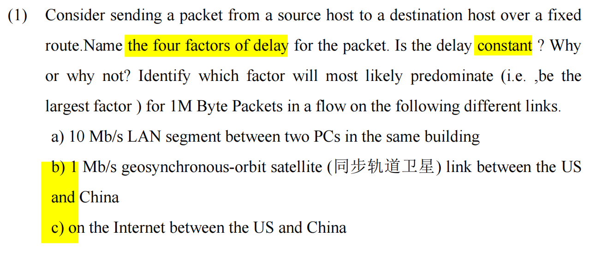

这道题是计算机网络（特别是《计算机网络：自顶向下方法》这类经典教材）中关于网络延迟（Network Delay）的最核心、最经典的综合考点。它不仅考察你对四个延迟因素的记忆，更考察你结合具体物理场景进行定量分析和定性判断的能力。

我将为你逐一拆解这道题涉及的所有知识点，并附上针对性的练习题。

### 核心知识点讲解：分组延迟的四大来源 (Four Sources of Packet Delay)

当一个数据包（Packet）从源主机发送到目的主机，在经过路径上的每一个路由器（Router）时，都会经历以下四种类型的延迟。总节点延迟（Total Nodal Delay）是这四者的总和：

$$
d_{nodal} = d_{proc} + d_{queue} + d_{trans} + d_{prop}
$$

**1. 节点处理延迟 (Processing Delay, $d_{proc}$)**

- **含义：** 路由器**检查数据包头部（Header）、决定将包导向哪个输出链路（Output link），以及检查比特级错误（Bit-level errors）**所花费的时间。
- **量级：** 通常非常小（微秒 micro-seconds 级别或更少）。

**2. 排队延迟 (Queueing Delay, $d_{queue}$)**

- **含义：** 数据包**在路由器的输出缓存（Output buffer）中等待被传输到链路上**的时间。
- **特点：这是四个延迟中唯一一个高度可变的（Highly Variable）因素。** 如果**网络拥塞（Congestion），队列很长**，排队延迟就会激增；如果网络空闲，排队延迟为零。

**3. 传输延迟 (Transmission Delay, $d_{trans}$)**

- **含义：** 路由器将数据包的**所有比特（bits）推向（Push/Transmit）物理链路**所需的时间。可以理解为“把包裹**全部塞进管道**”的时间。

- **计算公式：**

	
$$
d_{trans} = \frac{L}{R}
$$

	- $L$ = **数据包的长度 (Packet length,** 单位：bits)
	- $R$ = **链路的传输速率/带宽 (Link bandwidth/Transmission rate**, 单位：bits/sec, bps)

**4. 传播延迟 (Propagation Delay, $d_{prop}$)**

- **含义：** **一个比特在物理介质**（如光纤、铜线、空气）中，从链路的这一头传播到另一头所需的时间。可以理解为“包裹在管道中飞行”的时间。

- **计算公式：**

	
$$
d_{prop} = \frac{d}{s}
$$

	- $d$ = 物理距离 (Distance, 单位：meters)
	- $s$ = **介质中的传播速度 (Propagation speed, 接近光速**，约 $2 \times 10^8$ 到 $3 \times 10^8$ m/s)

### 原题详细解析

#### 第一部分：延迟是恒定的吗？(Is the delay constant? Why or why not?)

**答案：** 不是恒定的 (No, it is not constant)。

**原因：** 因为**排队延迟 (Queueing Delay)** 会**随着网络中流量负载（Traffic load）的变化而不断波动**。在拥塞状态下，数据包需要在路由器的缓冲区排队等待很长时间；在空闲状态下，排队延迟几乎为零。

#### 第二部分：特定场景下的主导因素 (Identify the predominate factor)

这里有一个极易踩坑的陷阱：数据包非常大！**1M Byte** = $1 \times 10^6 \text{ Bytes}$ = $8 \times 10^6 \text{ bits}$。我们需要结合具体场景计算或评估。

**a) 10 Mb/s LAN segment between two PCs in the same building**

- **情景分析：** 局域网（LAN）带宽为 $10 \text{ Mbps} = 10^7 \text{ bps}$。同一栋楼内的物理距离 $d$ 极短。
- **对比：**
	- $d_{trans} = \frac{8 \times 10^6 \text{ bits}}{10^7 \text{ bps}} = 0.8 \text{ 秒}$。
	- $d_{prop}$ 因为距离短，几乎可以忽略不计（微秒级）。
- **主导因素：** **Transmission Delay (传输延迟)**。

**b) 1 Mb/s geosynchronous-orbit satellite (同步轨道卫星) link between the US and China**

- **情景分析：** 这是一个**经典陷阱**！提到卫星链路，很多人本能会觉得距离极远，肯定是传播延迟（Propagation delay）主导。**但请看具体数据：**
- **计算对比：**
	- 带宽极低：$R = 1 \text{ Mbps} = 10^6 \text{ bps}$。
	- 计算传输延迟：$d_{trans} = \frac{8 \times 10^6 \text{ bits}}{10^6 \text{ bps}} = 8 \text{ 秒}$。
	- 计算传播延迟：同步卫星高度约 36000 km，一来一回（地面到卫星，卫星到地面）距离 $d \approx 7.2 \times 10^7 \text{ m}$。$d_{prop} = \frac{7.2 \times 10^7}{3 \times 10^8} \approx 0.24 \text{ 秒}$（即 240 毫秒）。
- **主导因素：** 尽管卫星链路的传播延迟很大，但因为数据包高达 1M Byte 且带宽只有 1 Mbps，8 秒远大于 0.24 秒。因此主导因素依然是 **Transmission Delay (传输延迟)**。

**c) on the Internet between the US and China**

- **情景分析：** 跨越中美两国的**公共互联网（Internet）**。
- **对比：** 现代 Internet 骨干网的带宽 $R$ 极高（通常是 Gbps 甚至 Tbps 级别），因此对于 1M Byte 的包，它的**传输延迟 ($d_{trans}$) 变得非常小**。但是，**互联网由无数个路由器和复杂的拓扑组成，且跨越太平洋**（物理距离极远，导致固定的传播延迟 $d_{prop}$ 达到几十到上百毫秒）。更重要的是，**国际出口和公共路由器经常面临严重的拥塞。**
- **主导因素：** 通常认为是 **Queueing Delay (排队延迟)** 和/或 **Propagation Delay (传播延迟)**。在实际考试作答时，强调排队延迟（Queueing Delay）是最准确的，因为它**在复杂的公共互联网中占据了最大的不确定性和时间消耗**。

### 辅导测试题（Exam-Style Practice）

为了确保你彻底掌握了最容易混淆的“传输延迟”与“传播延迟”，以及公式的应用，请尝试以下两道题目。**（答案已附在下方，请自行遮挡作答）**

#### Question 1 (Multiple Choice - 概念辨析)

**Question:** Imagine a car caravan (车队) analogy for a computer network. The toll booth (收费站) takes 12 seconds to service each car and push it onto the highway. The highway is 100 kilometers long, and cars travel at 100 km/hr. There are 10 cars in the caravan.

Which of the following analogies correctly matches the networking concepts?

(想象一个车队类比计算机网络。收费站处理每辆车并将其推向高速公路需要 12 秒。高速公路长 100 公里，汽车的行驶速度为 100 公里/小时。车队共有 10 辆车。以下哪个类比正确对应了网络概念？)

A. The 12 seconds to service one car represents the Propagation Delay ($d_{prop}$).

B. The time it takes for a single car to drive the 100 km represents the Transmission Delay ($d_{trans}$).

C. The time it takes for the toll booth to push all 10 cars onto the highway (120 seconds) represents the Transmission Delay ($d_{trans}$) for the entire caravan.

D. The cars traveling at 100 km/hr represents the Link Bandwidth ($R$).

**Answer:**

**C**

*解析：* * 收费站把所有车（数据包的所有 bits）推向高速公路的时间，取决于收费站的服务速率（带宽），这代表**Transmission Delay (传输延迟)**。10辆车 $\times$ 12秒 = 120秒，这就是把整个车队（Packet）发送出去的时间。

- 汽车在高速公路上行驶的时间（距离 $\div$ 速度）代表的是**Propagation Delay (传播延迟)**，所以 B 错误。
- 汽车的速度（100 km/hr）代表的是介质中的物理传播速度（光速/电信号速度），而不是带宽，所以 D 错误。

#### Question 2 (Short Answer - 综合计算与分析)

**Question:**

Consider two hosts, Host A and Host B, connected by a single optical fiber link.

- The length of the link is $d = 2000 \text{ km}$.

- The propagation speed of the fiber is $s = 2 \times 10^8 \text{ m/s}$.

- The link bandwidth is $R = 1 \text{ Gbps} = 10^9 \text{ bps}$.

	Host A wants to send a small control packet of $L = 1000 \text{ bits}$ to Host B.

	Calculate the Transmission Delay ($d_{trans}$) and Propagation Delay ($d_{prop}$). Which delay is the predominant factor in this scenario?

	(假设主机 A 和 B 通过一条单根光纤连接。链路长度为 2000 公里。光纤中的传播速度为 $2 \times 10^8 \text{ m/s}$。链路带宽为 1 Gbps。主机 A 要向 B 发送一个 1000 bits 的小控制包。计算传输延迟和传播延迟。在这个场景中，哪一个是主导因素？)

**Answer:**

1. **Transmission Delay ($d_{trans}$):**

	
$$
d_{trans} = \frac{L}{R} = \frac{1000 \text{ bits}}{10^9 \text{ bps}} = 10^{-6} \text{ seconds} = 1 \text{ \mu s} (\text{微秒})
$$

2. **Propagation Delay ($d_{prop}$):**

	
$$
d = 2000 \text{ km} = 2 \times 10^6 \text{ meters}
$$

$$
d_{prop} = \frac{d}{s} = \frac{2 \times 10^6 \text{ m}}{2 \times 10^8 \text{ m/s}} = 10^{-2} \text{ seconds} = 10 \text{ ms} (\text{毫秒})
$$

3. Predominant factor: Because $10 \text{ ms}$ is much larger than $1 \text{ \mu s}$, the Propagation Delay (传播延迟) is the predominant factor.

	*(解析：在这个场景中，由于数据包极小（1000 bits）且带宽极高（Gbps），发送包的时间几乎瞬间完成，而数据在两千公里的光纤中飞行的时间成为了主要的延迟来源。)*

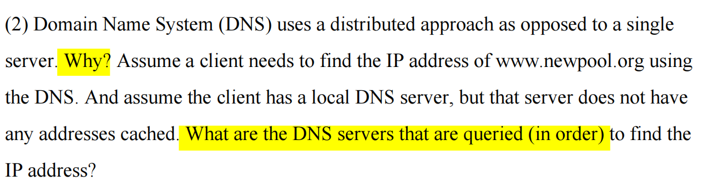

计算机网络应用层 (Application Layer) 中关于 DNS (Domain Name System, 域名系统) 的两道最经典的必考大题。

它分为两问：第一问考查 DNS 的架构设计原因，第二问考查 DNS 的解析流程（查询顺序）。

下面我为你详细拆解。

### 🌟 原题解析与标准答案

题目翻译： (2) 域名系统 (DNS) 使用分布式方法而不是单一服务器。为什么？ 假设客户端需要使用 DNS 查找 `www.newpool.org` 的 IP 地址。并假设客户端有一个本地 DNS 服务器，但该服务器没有缓存任何地址。为了找到 IP 地址，按顺序查询了哪些 DNS 服务器？

#### 第一问：为什么 DNS 是分布式的？ (Why distributed?)

标准答案 / 答题要点： 如果 DNS 使用单一的集中式服务器 (a single centralized server)，会面临以下致命问题：

1. 单点故障 (Single point of failure): 如果这台服务器崩溃，整个互联网就瘫痪了（没人能打开网页）。
2. 通信容量 / 流量负载 (Traffic volume): 全球几十亿台设备的所有 DNS 查询都涌向一台服务器，根本无法处理。
3. 远距离的集中式数据库造成的延迟 (Distant centralized database / Latency): 如果服务器放在美国，澳大利亚的用户每次查询都会经历极高的网络延迟。
4. 维护困难 (Maintenance): 这个数据库会无比巨大，且需要极其频繁地更新新注册的域名，几乎无法维护。 总结： DNS 使用分布式架构是为了保证可扩展性 (Scalability) 和高可靠性 (Reliability)。

#### 第二问：查询服务器的顺序是什么？ (Query Order for www.newpool.org)

标准答案： 因为本地缓存为空，所以必须走完整的标准解析流程。按被查询的时间顺序如下：

1. 本地 DNS 服务器 (Local DNS Server): 客户端首先向它发起请求。
2. 根 DNS 服务器 (Root DNS Server): 本地 DNS 服务器不知道答案，于是先去问根服务器。根服务器会告诉它负责 `.org` 的顶级域名服务器的地址。
3. 顶级域名服务器 (TLD DNS Server - Top-Level Domain): 本地 DNS 服务器接着去问 `.org` 的 TLD 服务器。TLD 会告诉它负责 `newpool.org` 的权威域名服务器的地址。
4. 权威 DNS 服务器 (Authoritative DNS Server): 本地 DNS 服务器最后去问负责 `newpool.org` 的权威服务器，它保存了 `www.newpool.org` 最准确的 IP 地址并将其返回。

### 📚 核心知识点详解 (中英文对照)

要彻底吃透 DNS，你需要掌握它的层级结构和两种查询方式。

#### 1. DNS 的层级树状结构 (Hierarchical Structure)

DNS 不是平铺的，而是像一棵倒过来的树，越往下越具体：

- Root DNS Servers (根域名服务器): 站在金字塔顶端，全球只有 13 组逻辑根服务器。它们不保存具体的 IP，只负责指路（告诉你下一步该去哪个 TLD）。
- Top-Level Domain (TLD) Servers (顶级域名服务器): 负责管理顶级域名，例如 `.com`, `.org`, `.net`, `.edu` 以及国家顶级域名 `.cn`, `.uk`。
- Authoritative DNS Servers (权威域名服务器): 每个拥有域名的组织（比如 newpool.org 这个组织）都必须提供权威 DNS 服务器。这里面存放着该域名下所有主机（如 `www`, `mail`）的具体 IP 地址映射。这是最终给出答案的服务器。
- *注意：Local DNS Server (本地 DNS 服务器) 严格来说不属于这个层级树。它通常由你的 ISP（互联网服务提供商，如电信、联通）提供，充当你的“代理人”去帮你在树里面跑腿查询。*

#### 2. 递归查询 vs. 迭代查询 (Recursive vs. Iterative Query)

这是考试最爱考的对比。

- 递归查询 (Recursive Query): “我不管过程，我只要结果。”
	- 场景： 通常发生在 客户端 (Client) -> 本地 DNS 服务器 (Local DNS) 之间。客户端把任务甩给本地 DNS，本地 DNS 必须负责把最终的 IP 找回来。
- 迭代查询 (Iterative Query): “我不知道最终答案，但我告诉你下一步该去问谁。”
	- 场景： 通常发生在 本地 DNS -> 根 -> TLD -> 权威 之间。根服务器不会帮本地 DNS 去问 TLD，它只会把 TLD 的地址丢给本地 DNS，让本地 DNS 自己去问。这种“不包办到底，只指引方向”的方式就是迭代。

### 📝 考试风格模拟题 (含答案与解析)

*(请先遮挡下方“答案与解析”部分进行自测，题干主要为英文以贴合你的考试需求)*

Question 1: Which type of DNS server is responsible for returning the final IP address mapping for a specific organization's web server (e.g., `www.example.com`)? (哪种类型的 DNS 服务器负责返回特定组织 Web 服务器（如 `www.example.com`）的最终 IP 地址映射？) A. Root DNS Server B. Top-Level Domain (TLD) DNS Server C. Authoritative DNS Server D. Local DNS Server

Question 2: In a typical DNS resolution process, the query from a client host to its Local DNS Server is usually ________, while the queries from the Local DNS Server to the Root, TLD, and Authoritative servers are usually ________. (在典型的 DNS 解析过程中，从客户端主机到其本地 DNS 服务器的查询通常是 ________，而从本地 DNS 服务器到根、TLD 和权威服务器的查询通常是 ________。) A. iterative; recursive B. recursive; iterative C. recursive; recursive D. iterative; iterative

Question 3: Briefly state two main reasons why a single centralized DNS server is a bad design for the Internet. (简述为什么单一的集中式 DNS 服务器对互联网来说是一个糟糕的设计的两个主要原因。)

👇 答案与解析 (请作答后查看) 👇

Q1 答案：C

- 解析： 权威 DNS 服务器 (Authoritative DNS Server) 是保存特定组织域名（如 example.com 内部的 www, mail 等子域名）与 IP 地址最终、最准确映射记录的地方。根和 TLD 只负责“指路”。

Q2 答案：B

- 解析： 这是必考的组合。客户端非常“懒”，它向本地 DNS 发起递归 (recursive) 请求，要求本地 DNS 无论如何要把最终结果带回来。而本地 DNS 很苦逼，它去问根和 TLD 时，大佬们不帮它跑腿，只给它下一步的地址，所以本地 DNS 只能自己不断发起迭代 (iterative) 请求。

Q3 答案： (答出以下任意两点即可得分)

1. Single point of failure (单点故障): If the server crashes, the entire Internet name resolution fails. (如果服务器崩溃，整个互联网名称解析失败。)
2. Traffic volume / Overload (流量过载): A single server cannot handle the massive volume of DNS queries from billions of devices worldwide. (单台服务器无法处理来自全球数十亿设备的海量 DNS 查询。)
3. Distant centralized database (地理距离导致的延迟): High latency for users located far away from the server. (对距离服务器较远的用户会有很高的延迟。)

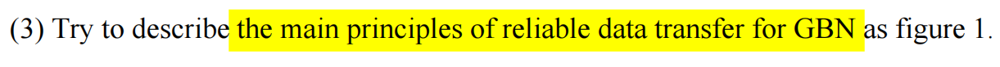

这张图片截取了传输层（Transport Layer）可靠数据传输（Reliable Data Transfer, RDT）中一个非常核心的考点：GBN（Go-Back-N，回退 N 步）协议的主要原理。

通常在考试中，GBN 会和 SR（Selective Repeat，选择重传）协议放在一起进行对比考察。下面我为你详细拆解 GBN 的核心工作原理（Main Principles）。

### 核心知识点讲解：GBN (Go-Back-N) 工作原理

GBN 是一种基于滑动窗口（Sliding Window）的流水线（Pipelining）协议。为了实现可靠传输，它主要依赖以下四个核心原则：

1. 滑动窗口机制 (Sliding Window Mechanism)

- 原理： 发送方允许发送多个数据分组（Packets）而不需要等待确认（ACK）。但是，这些未被确认的已发送分组的数量不能超过一个最大限制，这个限制被称为窗口大小 (Window Size，通常用 $N$ 表示)。
- 作用： 相比于“停等协议（Stop-and-Wait）”，它极大地提高了信道的利用率。

2. 累积确认 (Cumulative Acknowledgment)

- 原理： 接收方发送的确认报文段（ACK）是累积的。如果接收方发送了 `ACK n`，它的意思是：“序号为 n 以及 n 之前的所有分组，我都已经正确且按序接收到了。”
- 考点提示： 如果发送方收到了 `ACK 5`，它不仅知道分组 5 成功了，还隐含地知道分组 1、2、3、4 也全都成功了。

3. 单一计时器 (Single Logical Timer)

- 原理： 尽管发送方可能发送了多个未确认的分组，但 GBN 协议只维护一个计时器。这个计时器始终绑定在最早的那个未被确认的分组（Oldest unacknowledged packet）上。
- 作用： 一旦收到对该最早分组的 ACK，计时器就会重新启动，绑定到下一个最早的未确认分组。

4. 超时与重传行为 (Timeout & Retransmission - "回退"的由来)

- 原理（接收方）： GBN 的接收方非常“死板”。它只接收按序到达的分组。如果发生了乱序（例如，期待收到分组 3，却先收到了分组 4），接收方会直接丢弃（Discard）乱序的分组 4，并且重新发送一个 `ACK 2`（告诉发送方：我目前按序收到的最高分组还是 2）。
- 原理（发送方）： 如果发生超时（即那个单一计时器到期），发送方会认为最早的未确认分组丢失了。此时，它会重传所有已发送但未被确认的分组（即回退到出错的地方，把后面的 $N$ 个分组全部重新发一遍）。

💡 核心总结： GBN 的特点是发送方复杂，接收方简单。接收方不需要缓存（No buffering），乱序直接丢；发送方一旦超时，代价很大，需要重传一堆可能已经成功到达的数据。

### 辅导测试题（Exam-Style Practice）

根据上述知识点，我为你设计了以下几道常见考题。请遮挡答案自行测验。

#### Question 1 (Multiple Choice - 概念辨析)

Question: In a Go-Back-N (GBN) protocol, the sender transmits packets 0, 1, 2, 3, 4. Packet 2 is lost during transmission, but packets 0, 1, 3, and 4 arrive successfully at the receiver. Assuming the receiver does not buffer out-of-order packets, what sequence of ACKs will the receiver send in response to these arrivals?

(在 GBN 协议中，发送方发送了分组 0, 1, 2, 3, 4。分组 2 在传输过程中丢失，但分组 0, 1, 3, 4 成功到达接收方。假设接收方不缓存乱序分组，接收方将按什么顺序发送 ACK？)

A. ACK 0, ACK 1, ACK 3, ACK 4

B. ACK 0, ACK 1, NAK 2, ACK 3, ACK 4

C. ACK 0, ACK 1, ACK 1, ACK 1

D. ACK 0, ACK 1, ACK 2, ACK 2

Answer:

C

*解析：* GBN receiver demands in-order delivery. It correctly receives 0 and sends `ACK 0`. It receives 1 and sends `ACK 1`. Packet 2 is lost. When packet 3 arrives, it is out-of-order (expected 2). The receiver discards 3 and resends the ACK for the highest in-order packet received, which is `ACK 1`. When packet 4 arrives, it does the same: discards 4 and sends `ACK 1`. (GBN 接收方要求按序交付。收到 3 和 4 时发现乱序，直接丢弃，并重发目前最高连续收到的确认 `ACK 1`。)

#### Question 2 (Calculation/Scenario - 综合场景)

Question:

Consider a sender using the Go-Back-N protocol with a window size of $N = 5$. The sender has transmitted packets 10, 11, 12, 13, and 14.

Scenario: The timer for packet 10 expires. Meanwhile, the receiver actually received packets 11, 12, 13, and 14 perfectly, but packet 10 was dropped.

How many packets will the sender retransmit, and which ones?

(假设发送方使用 GBN 协议，窗口大小 $N=5$。发送方已发送分组 10, 11, 12, 13, 14。

场景：分组 10 的计时器超时。与此同时，接收方其实完美收到了 11, 12, 13, 14，仅仅是 10 丢失了。

发送方将重发多少个分组？分别是哪些？)

Answer:

The sender will retransmit 5 packets: packets 10, 11, 12, 13, and 14. *解析：* This is the defining characteristic of "Go-Back-N". Even though packets 11-14 successfully reached the receiver, the receiver discarded them because it was strictly waiting for packet 10 (no buffering). When the timeout for packet 10 occurs, the sender must "go back" and retransmit all unacknowledged packets currently in its window. (这就是“回退 N 步”的得名由来。即使后面的分组到了，接收方也会因为没收到 10 而拒收。发送方超时后只能把窗口里的 5 个包全部重传。)

#### Question 3 (Short Answer - 原理延伸)

Question:

Briefly explain the meaning of "Cumulative Acknowledgment" (累积确认) in the GBN protocol. If the sender receives an `ACK 8`, what can the sender safely assume?

(简述 GBN 协议中“累积确认”的含义。如果发送方收到了 `ACK 8`，发送方可以安全地做出什么假设？)

Answer:

Cumulative Acknowledgment means that an ACK with sequence number $n$ acknowledges that all packets with a sequence number up to and including $n$ have been correctly received in order.

If the sender receives `ACK 8`, it can safely assume that packet 8, as well as all preceding packets (e.g., ..., 5, 6, 7), have been successfully received by the destination, and their buffers/timers can be cleared.

(累积确认意味着带有序号 $n$ 的 ACK 确认了序号小于等于 $n$ 的所有分组都已按序正确接收。如果收到 `ACK 8`，发送方可以断定分组 8 以及它之前的所有分组都已成功到达，并可以清理相关的计时器和缓存区。)

## 不是都说ack应该是预期的下一个包序号吗,怎么这里有变成确认已经收到的包的序号了

简单直接地回答你：你都没有记错，只是不同的协议和教材对 ACK 编号的“定义规定（Convention）”不同。

你听说的“ACK 是预期的下一个包序号”通常指的是 TCP 协议 的真实实现；而我刚才截图里讲解的“ACK 是确认已收到的最高包序号”是教科书上纯 GBN 理论模型 的习惯定义。

它们底层的核心思想（累积确认）是完全一样的，仅仅是在数字上差了 1。下面为你详细拆解：

### 1. 教科书理论模型：纯 GBN 协议 (Textbook GBN)

在你提供的截图这类理论题目中（通常基于 Kurose & Ross 的《计算机网络：自顶向下方法》），为了教学方便，GBN 和 SR 协议的基础理论定义如下：

- 规则： `ACK n` 明确表示：“我已经按序、正确地收到了序号为 n 的分组，以及它之前的所有分组。”
- 潜台词： 确认的是“过去”（我收到了谁）。
- 示例： 接收方收到了包 0, 1, 2。它会发送 `ACK 2`。

### 2. 真实世界的工业实现：TCP 协议 (Real-world TCP)

当我们把理论应用到实际的 TCP（传输控制协议）时，TCP 虽然使用了类似 GBN 的累积确认机制，但它的工程实现采用了一种更“向前看”的编号方式：

- 规则： `ACK n` 明确表示：“我已经收到了序号 $n-1$ 及之前的所有字节/数据，我现在期待（Expecting）收到的下一个字节序号是 n。”
- 潜台词： 确认的是“未来”（我接下来想要谁）。
- 英文术语： Expected next sequence number.
- 示例： 接收方收到了包 0, 1, 2。它会发送 `ACK 3`（告诉发送方：0,1,2 我都拿到了，快把 3 发给我）。

### 💡 考试与做题指南 (Exam Tips)

既然存在两种说法，考试时该怎么判断用哪一种？

1. 看题目名字：
	- 如果题目明确问的是 "GBN Protocol" 理论工作原理（就像你给的图片那样），绝大多数情况下默认使用：ACK = 已收到的最高序号。
	- 如果题目明确问的是 "TCP Segment" 或 "TCP Connection" 的交互流程，必须使用：ACK = 期待的下一个序号。
2. 看题干暗示：
	- 有些严谨的题目会在括号里注明 `(ACK n denotes the next expected sequence number)` 或 `(ACK n denotes the highest received packet)`，如果有，严格遵照题干说明。

## 计时器是每次收到新的ack重新设置的还是根据发出包的时间来定的

简单直接地回答你：这两者都有关系。计时器最初是根据“最早那个包发出的时间”启动的，但在运行过程中，每次收到一个“向前推进的新 ACK”时，计时器都会被重新设置（Restart）。

为了彻底理清这个逻辑，请记住 GBN 计时器的三大黄金法则：

GBN 协议在发送方只维护一个单一的逻辑计时器（Single Logical Timer），它的生杀大权完全取决于“最早的未确认分组（Oldest unacknowledged packet）”。

### GBN 计时器的三大规则

- 规则 1：启动 (Start) 当发送方发送出一个分组，并且此时窗口里没有任何其他等待确认的分组时（即这是窗口里的第一个包），启动计时器。
- 规则 2：重置 / 重启 (Restart / Reset) —— 你的疑问所在 当发送方收到一个有效的 ACK（意味着前面的包成功了），但此时窗口里还有其他已发送但尚未被确认的分组时，发送方会重新启动计时器。 *为什么？* 因为既然收到了 ACK，说明“最早的未确认分组”已经变了，向前移动了。计时器必须重置，以便给这个“新晋级”的最早未确认分组一个完整的超时等待周期。
- 规则 3：停止 (Stop) 当发送方收到一个 ACK，并且这个 ACK 确认了窗口中所有已发送的分组（即窗口空了，所有发出去的货都签收了），计时器停止。

### 📝 场景推演 (Step-by-Step Scenario)

我们用一个具体的例子来模拟一下这个过程：

1. 时刻 0ms： 发送方发送包 0。此时窗口里只有包 0。 👉 动作： 触发规则 1，启动计时器（假设超时时间是 50ms）。此时计时器绑定在包 0 上。
2. 时刻 10ms： 发送方发送包 1 和 包 2。 👉 动作： 计时器不动，继续走。因为它只盯着最早的包 0。
3. 时刻 25ms： 发送方收到了 `ACK 0`（确认包 0 已收到）。 👉 动作： 触发规则 2。系统一看，包 0 搞定了，但窗口里还有包 1 和包 2 没确认呢！现在的“最早未确认包”变成了包 1。于是，系统重置并重新启动计时器。倒计时重新从 50ms 开始算，此时计时器绑定在包 1 上。
4. 时刻 40ms： 发送方收到了 `ACK 2`（累积确认，说明包 1 和包 2 都收到了）。 👉 动作： 触发规则 3。系统一看，窗口里发出去的包 0、1、2 全都确认完毕了，窗口空了。直接停止计时器。

### 💡 为什么必须重新设置？

如果不重新设置会怎样？ 假设包 0 在路上耽搁了很久，在第 49ms 才送达并返回 ACK。此时距离超时只剩 1ms 了。如果你不重置计时器，那么下一秒（第 50ms），计时器就会爆表（Timeout）。系统就会误以为包 1 和包 2 丢失了，从而引发大规模的不必要重传。

所以，每次收到新的 ACK，就相当于给剩下的包“续命”，计时器会被清零并重新开始倒计时。

## 为我详细地解释一下路由与转发之间的区别

这是一个在计算机网络（网络层 Network Layer）中极为基础，但也最容易被混为一谈的两个核心概念。在实际应用和考试中，严格区分它们是理解现代路由器工作原理（以及软件定义网络 SDN）的关键。

简单来说：“路由（Routing）”负责宏观的全局规划，而“转发（Forwarding）”负责微观的局部执行。

为了让你彻底弄懂，我们依然从通俗比喻和技术本质两个维度来进行拆解。

### 1. 通俗比喻：跨城自驾游 (The Road Trip Analogy)

想象你要开车从北京（源主机）去广州（目的主机）。

- 路由 (Routing) = 出发前的路线规划（看地图/导航器）。

	在出发前，你打开地图软件，软件根据全国的公路网情况（有没有修路、哪里拥堵），为你计算出了一条从北京到广州的端到端完整路径 (End-to-end path)：比如走京港澳高速。这个计算和规划的过程，就是“路由”。

- 转发 (Forwarding) = 在某个具体路口打方向盘（按路牌行车）。

	当你开到石家庄的一个高速互通立交桥时，你抬头看了一眼路牌（转发表），上面写着“去往广州方向，请走右侧匝道”。于是，你把车从主路转移到了右侧匝道上。这个在一个具体的节点（路由器），把车（数据包）从一个入口移动到正确的出口的动作，就是“转发”。

### 2. 技术本质对比 (Technical Breakdown)

在路由器的内部架构中，这两个动作分属于不同的层面，它们的时间尺度和实现方式有着天壤之别。

#### A. 转发 (Forwarding) —— 数据平面 (Data Plane)

- 定义： 转发是指当一个数据包（Packet）到达路由器的某一个输入链路（Input link）时，路由器将该数据包转移到适当的输出链路（Output link）的本地动作 (Local action)。
- 核心依据： 路由器内部有一张表，叫做转发表 (Forwarding Table / MAC Table / FIB)。转发动作就是“查表 -> 移动”。
- 时间尺度： 极快！通常在纳秒或微秒级别 (Nanoseconds/Microseconds)。
- 实现方式： 因为要求极高的速度，转发通常是由路由器的硬件 (Hardware)（如专用的 ASIC 芯片）直接完成的。

#### B. 路由 (Routing) —— 控制平面 (Control Plane)

- 定义： 路由是指网络中的路由器们通过相互通信，共同决定数据包从源端到目的端所应遵循的网络范围的路径 (Network-wide path) 的过程。
- 核心依据： 路由器运行各种路由选择算法/协议 (Routing Algorithms/Protocols)，比如 OSPF, BGP, RIP。这些算法通过不断交换网络拓扑信息来计算出最短或最优路径。
- 时间尺度： 相对较慢。通常在毫秒或秒级别 (Milliseconds/Seconds)。如果网络拓扑发生变化（比如某条光纤断了），重新计算路由可能需要几秒钟。
- 实现方式： 因为计算复杂，路由通常是由路由器内部的 CPU 运行的软件 (Software) 来完成的。

### 3. 它们是如何协同工作的？(The Relationship)

它们不仅不冲突，而且是上下游的合作关系。可以用一句话概括它们的联系：

路由算法（Routing Algorithms）计算并生成了转发表（Forwarding Table），而转发（Forwarding）动作则使用这张转发表来处理到达的数据包。

- 没有路由： 路由器就像个瞎子，转发表是空的，拿到数据包不知道往哪扔（除非手动配置静态路由）。
- 没有转发： 路由器变成了纯粹的纸上谈兵，路线规划得再好，数据包也无法真正穿过路由器。

### 📝 总结速记表 (Summary Table)

| 对比维度          | 转发 (Forwarding)                               | 路由 (Routing)                            |
| --------------------- | --------------------------------------------------- | --------------------------------------------- |
| 所属平面 (Plane)  | 数据平面 (Data Plane)                               | 控制平面 (Control Plane)                      |
| 作用范围 (Scope)  | 单个路由器内部的局部动作 (Local to a single router) | 跨越整个网络的全局协调 (Network-wide process) |
| 主要动作 (Action) | 将数据包从输入端口移到输出端口                      | 计算从源到目的地的最佳路径                    |
| 处理速度 (Speed)  | 极快（硬件级别，纳秒/微秒）                         | 较慢（软件级别，毫秒/秒）                     |
| 核心产物 (Output) | 数据包被成功送出                                    | 生成和维护转发表 (Forwarding Table)       |

### 辅导测试题（Exam-Style Practice）

请尝试作答以下判断题和单选题，检验你对这两个概念的敏感度。（答案在下方，请自行遮挡）

#### Question 1 (True/False)

Question: Is the following statement True or False?

"The process of moving a packet from a router's input port to the appropriate output port is called routing, which is typically implemented in software and operates on a timescale of seconds."

(判断正误：将数据包从路由器的输入端口移动到适当的输出端口的过程称为路由，它通常在软件中实现，并在秒级的时间尺度上运行。)

Answer:

False (错误). *解析：* The statement describes Forwarding, not Routing. Forwarding is moving a packet from input to output, is typically implemented in hardware, and operates on a timescale of nanoseconds. Routing is the network-wide path determination process implemented in software. (该表述描述的是转发而非路由。转发是将包从输入移到输出，通常在硬件中实现，时间尺度为纳秒。路由才是由软件实现的全局路径确定过程。)

#### Question 2 (Multiple Choice)

Question: Which of the following best describes the relationship between routing and forwarding in a traditional network architecture?

(以下哪项最能描述传统网络架构中路由与转发之间的关系？)

A. Forwarding protocols determine the optimal path, while routing refers to the hardware transferring the data. (转发协议确定最佳路径，而路由指的是传输数据的硬件动作。)

B. Routing algorithms compute the forwarding tables, which are then used by the router to forward packets. (路由算法计算出转发表，然后路由器使用这些表来转发数据包。)

C. Routing and forwarding are independent processes that do not interact with each other. (路由和转发是相互独立、互不干涉的过程。)

D. Forwarding happens in the control plane, while routing happens in the data plane. (转发发生在控制平面，而路由发生在数据平面。)

Answer:

B.

*解析：* This is the textbook definition of their relationship. Routing (Control Plane) acts as the "brain" that runs algorithms (like OSPF/BGP) to compute the best paths. The output of this computation is the Forwarding Table. Forwarding (Data Plane) acts as the "brawn" (肌肉), using that table to quickly switch packets from input to output ports. (这是它们关系的教科书定义。路由（控制平面）作为大脑运行算法计算最佳路径，产出转发表。转发（数据平面）作为执行者，利用该表快速交换数据包。)


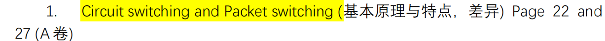

# 电路交换 (Circuit Switching) 与分组交换 (Packet Switching) 

### 1. 电路交换 (Circuit Switching)

基本原理 (Basic Principles): 电路交换是传统电话网络（Telephone Networks）使用的工作模式。在两台主机通信之前，网络必须在它们之间建立一条专用的、端到端 (End-to-End) 的物理或逻辑连接路径。 整个通信过程分为三个阶段：

1. 呼叫建立 (Call Setup): 预留沿途的所有资源（带宽）。
2. 数据传输 (Data Transfer): 在专用的线路上进行通信。
3. 呼叫拆除 (Call Teardown): 释放占用的资源。

核心特点 (Characteristics):

- 资源预留 (Resource Reservation): 一旦连接建立，链路上的带宽就专属于这对通信节点，即使他们暂时不说话（不发送数据），别人也绝对不能使用这部分带宽。
- 性能保障 (Guaranteed Performance): 因为没有竞争，所以数据传输的延迟是恒定且极小的（仅有传输和传播延迟，没有排队延迟）。
- 多路复用技术 (Multiplexing): 通常采用 FDM (Frequency Division Multiplexing，频分多路复用) 或 TDM (Time Division Multiplexing，时分多路复用) 来把一根物理线路划分为多个逻辑“电路”。

### 2. 分组交换 (Packet Switching)

基本原理 (Basic Principles): 这是现代互联网（Internet）采用的工作模式。发送方不再需要预先建立连接，而是将要发送的长报文（Message）切割成一个个较小的数据块，并在每个数据块前加上头部信息（包含源和目的地址），形成分组 (Packets)。 这些分组在网络中独立传输，路由器采用 存储转发 (Store-and-Forward) 的机制来处理它们：路由器必须完整地接收下一个分组，存入缓存，然后再将其转发到下一条链路。

核心特点 (Characteristics):

- 按需分配资源 (On-demand Allocation): 链路带宽不被任何人独占。有数据就发，没数据就不占资源。
- 统计多路复用 (Statistical Multiplexing): 多个用户的分组在链路上动态共享带宽。如果短时间内到达的分组太多，超出了链路的处理能力，它们就会在路由器的缓冲区内排队 (Queue)，这就产生了排队延迟 (Queueing Delay)；如果缓冲区满了，还会导致丢包 (Packet Loss)。
- 适合突发性数据 (Best for Bursty Data): 计算机网络的数据大多是突发性的（比如你点开一个网页，瞬间请求大量数据，然后看半天不操作）。分组交换能极其高效地利用这些“空闲时间”让其他用户传数据。

### 3. 核心差异对比表 (Differences)

为了方便记忆和答题，请牢记以下对比：

| 比较维度     | Circuit Switching (电路交换)          | Packet Switching (分组交换)               |
| ---------------- | ----------------------------------------- | --------------------------------------------- |
| 资源分配     | 预先分配/预留 (Reserved)              | 动态分配/按需共享 (On-demand/Shared)      |
| 连接建立     | 需要 (Call setup required)            | 不需要 (No setup required)                |
| 信道利用率   | 低 (空闲时带宽浪费)                   | 高 (统计多路复用，共享带宽)               |
| 延迟状态     | 恒定 (无排队延迟)                     | 可变 (存在排队延迟 Queueing Delay)        |
| 拥塞处理     | 呼叫被拒绝 (Busy signal)                  | 数据排队或丢包 (Queueing or Packet Loss)      |
| 最佳适用场景 | 持续的、对实时性要求极高的流媒体/语音 | 突发性的计算机数据 (Bursty computer data) |

### 辅导测试题 (Exam-Style Practice)

以下是几道典型考题，帮助你检验理解程度（答案在每题下方，请自行遮挡作答）：

#### Question 1 (True/False - 判断题)

Question: Is the following statement True or False? "In packet switching, if a user is not currently transmitting data, their share of the link's bandwidth remains reserved for them and cannot be used by other users." (判断正误：在分组交换中，如果用户当前没有传输数据，他们所占的链路带宽份额仍会为他们保留，其他用户无法使用。)

Answer: False (错误). *解析：* This describes Circuit Switching, not packet switching. In packet switching, resources are allocated on-demand (统计多路复用). If a user is silent, other users can utilize the full bandwidth. (这描述的是电路交换。分组交换是按需分配的，如果用户空闲，其他用户可以占满带宽。)

#### Question 2 (Multiple Choice - 选择题)

Question: Which of the following is a primary disadvantage of Packet Switching compared to Circuit Switching? (与电路交换相比，以下哪项是分组交换的主要缺点？)

A. It cannot handle bursty traffic efficiently. (它无法高效处理突发流量。) B. It requires a dedicated call setup phase before data transfer. (它在数据传输前需要专属的呼叫建立阶段。) C. It introduces variable queueing delays and potential packet loss. (它引入了可变的排队延迟和潜在的丢包可能。) D. It restricts the number of simultaneous users strictly based on the number of physical lines. (它严格根据物理线路数量限制并发用户数。)

Answer: C. *解析：* Because packet switching uses statistical multiplexing and store-and-forward mechanisms, packets must wait in router buffers if traffic is heavy. This causes unpredictable queueing delays and packet loss if the buffer overflows. (因为使用统计多路复用和存储转发，流量大时分组需要在路由器排队，造成不可预测的延迟，满了还会丢包。)

#### Question 3 (Short Answer/Comparison - 简答题)

Question: Suppose an application transmits data at a steady, constant rate (e.g., an uncompressed phone call) and requires a guaranteed maximum delay. Would you choose Circuit Switching or Packet Switching for this application? Briefly explain why. (假设某应用程序以稳定、恒定的速率传输数据（例如未压缩的电话通话），并且需要保证最大延迟。你会为该应用选择电路交换还是分组交换？简要说明原因。)

Answer: I would choose Circuit Switching (电路交换). *Reason:* Circuit switching reserves a dedicated path and bandwidth (资源预留). Because the resources are dedicated, there is no competition with other users' traffic, meaning there is no queueing delay. This guarantees a constant, predictable end-to-end delay, which is essential for strict real-time applications. Packet switching, on the other hand, operates on a "best-effort" basis and suffers from variable queueing delays. *(原因：电路交换会预留专属路径和带宽。因为资源专属，不与其他用户竞争，所以没有排队延迟，能保证恒定可预测的延迟，这对严格的实时应用至关重要。而分组交换是“尽力而为”，存在可变的排队延迟。)*

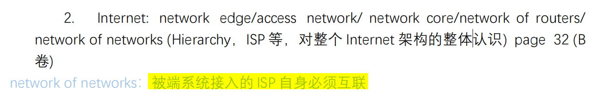

### 核心知识点讲解：互联网的宏观架构

我们可以把 Internet 想象成一个庞大而复杂的交通系统，数据包（Packets）就是路上跑的汽车。整个架构可以自外向内分为三个主要部分，外加一个整体的层级概念：

#### 1. 网络边缘 (Network Edge)

- 包含什么： 所有连接到互联网上的端系统 (End Systems) / 主机 (Hosts)。比如你的智能手机、电脑、智能手表，以及数据中心里的海量 Web 服务器 (Web Servers)。
- 它的职责： 数据的发源地和最终目的地。网络边缘的设备负责运行应用程序 (Running Application Programs)（比如浏览器、微信、邮件客户端）。
- 考点提示： 记住，复杂的应用层逻辑和协议（如 HTTP, SMTP）只在“边缘”运行，网络核心里的路由器是不管应用层长什么样的。

#### 2. 接入网 (Access Network)

- 包含什么： 将边缘端系统连接到边缘路由器 (Edge Router，即网络核心的第一跳)的物理链路。常见的有：家庭里的 DSL、Cable（电缆）、FTTH（光纤到户）；移动设备用的 Wi-Fi 和 Cellular (蜂窝网络，如 4G/5G)。
- 它的职责： 它是你家/你手机通向互联网高速公路的“引道（匝道）”。
- 考点提示： 考试常考接入网的带宽是独占的（Dedicated）还是共享的（Shared）。例如，光纤到户通常提供较高独占带宽，而早期的 Cable 和无线网络通常是同一片区域的用户共享带宽。

#### 3. 网络核心 (Network Core)

- 包含什么： 由海量的路由器 (Routers) 和连接它们的通信链路 (Communication Links) 组成的一个网状网络 (Mesh network)。
- 它的职责： 负责数据的搬运！它通过分组交换 (Packet Switching)、路由选择 (Routing) 和 转发 (Forwarding)，将数据包从一个边缘节点高效地搬运到另一个边缘节点。
- 考点提示： 网络核心的首要任务是“高速、可靠地传数据”，它不处理应用层的复杂逻辑，这就是所谓的“核心简单，边缘复杂”设计哲学。

#### 4. 网络的网络与层级结构 (Network of Networks / ISP Hierarchy)

- 核心概念： 互联网不是由一家公司建成的，它是无数个网络互相连接在一起的网络集合体 (A network of networks)。
- ISP 分层 (ISP Hierarchy)： 为了解决全球几十亿台设备如何互联的问题，互联网采用了分级 (Hierarchical) 的结构，主要通过互联网服务提供商（ISP, Internet Service Provider）来实现：
	1. Tier-1 ISPs (第一层 ISP / 全球骨干网)： 比如 AT&T, Sprint。它们拥有遍布全球的高速海底光纤和核心路由器。它们位于金字塔顶端，互相之间直连。
	2. Regional ISPs (区域 ISP)： 覆盖某个国家或省份，它们需要花钱连接到 Tier-1 ISP 才能访问全球网络。
	3. Access ISPs / Tier-3 (接入 ISP / 边缘 ISP)： 直接面向你我这样的普通终端用户（比如你家楼下的宽带供应商）。
- IXP (Internet Exchange Point)： 互联网交换中心。由于跨 ISP 传输数据要收费，同级别的 ISP（比如两个 Regional ISP）为了省钱和提高速度，会通过 IXP 直接物理相连（这叫对等连接 Peering）。

为了让你更直观地理解这个“网络的网络”的宏观层级，我为你生成了一个交互式的网络架构图。你可以点击不同的节点来查看它们属于哪个层级。

### 辅导测试题（Exam-Style Practice）

下面是针对这一板块高频考点设计的练习题，请遮住答案自行测试，这会帮助你习惯英文题目的阅读节奏和踩分点。

#### Question 1 (Multiple Choice - 概念区分)

Question: Web servers and web browsers (such as Chrome or Safari) reside at which part of the Internet architecture?

(Web 服务器和网页浏览器（如 Chrome 或 Safari）位于互联网架构的哪个部分？)

A. In the network core (在网络核心)

B. At the network edge (在网络边缘)

C. Within Tier-1 ISPs (在第一层 ISP 内部)

D. Within the access network (在接入网内部)

Answer:

B.

*解析：* Servers and clients are End Systems (端系统). All end systems sit at the network edge (网络边缘). The network core only consists of routers and links, which do not run application-layer software like web browsers. (服务器和客户端都是端系统，统统位于网络边缘。网络核心只负责路由转发，不运行浏览器这样的应用层软件。)

#### Question 2 (True/False - 架构理解)

Question: Is the following statement True or False?

"The Internet network core is responsible for running complex application protocols (like HTTP and SMTP) to ensure users receive the correct web pages and emails."

(判断正误：互联网网络核心负责运行复杂的应用协议（如 HTTP 和 SMTP），以确保用户接收到正确的网页和电子邮件。)

Answer:

False (错误).

*解析：* The design philosophy of the Internet is to keep the network core simple and push complexity to the network edge. The core routers only forward packets based on IP addresses; they do not understand or process application-layer protocols like HTTP or SMTP. (互联网的设计哲学是“核心简单，边缘复杂”。核心路由器只根据 IP 地址转发分组，根本看不懂也不处理 HTTP 等应用层协议，这些都是边缘端系统的工作。)

#### Question 3 (Short Answer - 宏观层级)

Question: Explain why two Regional ISPs might choose to connect to each other directly via an Internet Exchange Point (IXP) rather than routing their traffic through a Tier-1 ISP.

(解释为什么两个区域 ISP 可能会选择通过互联网交换中心 (IXP) 直接相连，而不是通过 Tier-1 ISP 路由它们的流量？)

Answer:

Two Regional ISPs connect via an IXP (a process called peering) primarily to reduce costs and decrease latency (降低成本和减少延迟).

If they route traffic through a Tier-1 ISP, they have to pay the Tier-1 provider for that transit service (provider-customer relationship). By peering directly at an IXP, they bypass the higher tier, saving transit costs, and the data travels a shorter, more direct path, which improves network performance.

*(解析：主要为了省钱和提速。如果走 Tier-1，区域 ISP 需要向其支付昂贵的过路费（买卖关系）。通过 IXP 对等互联（Peering），不仅可以免除上一级的流量费，数据还能走更近的捷径，从而降低延迟。)*

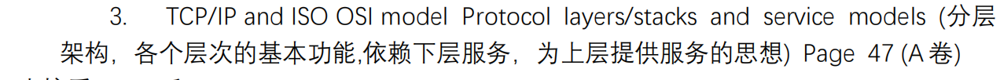

这是一个非常经典的计算机网络基石考点。无论是期末考试还是未来的系统设计面试，协议分层架构（Layered Architecture） 以及 OSI 与 TCP/IP 模型的对比 都是必考内容。

这段材料的核心在于理解“为什么分层”、“每层干什么”以及“层与层之间如何互动（封装与服务）”。我将为你详细梳理这些知识点。

### 核心知识点讲解：分层架构与服务模型

#### 1. 为什么要分层？(Why Layering?)

计算机网络极其复杂，涉及物理硬件、软件应用、各种不可靠因素。分层架构的核心思想是“分而治之 (Divide and Conquer)”和“模块化 (Modularity)”。

- 依赖下层，为上层服务： 每一层（第 $N$ 层）只实现特定的功能。它利用下层（第 $N-1$ 层）提供的服务，来为上层（第 $N+1$ 层）提供更高级的服务。
- 解耦： 只要层与层之间的接口（Interface）保持不变，某一层的内部技术更新（例如，将物理层的铜线换成光纤）绝对不会影响到其他层的工作。

#### 2. 数据封装与解封装 (Encapsulation and Decapsulation)

这是体现“为上层服务”最直观的过程：

- 发送端（自顶向下）： 应用层的数据（Message）交往下层。传输层拿到后，在前面加上自己的头部 (Header)（包含端口等），形成新的数据块交往下层。网络层再加自己的头部（IP地址）... 这个过程叫封装 (Encapsulation)。就像俄罗斯套娃，或者给信件一层层套信封。
- 接收端（自底向上）： 物理层收到比特流后往上传。每一层检查并剥离属于自己的那个头部，将剩下的“有效载荷 (Payload)”交给上层。这叫解封装 (Decapsulation)。

#### 3. OSI 7层模型 vs TCP/IP (5层互联网模型) 对比与功能

现代教科书（如 Kurose 的《自顶向下》）通常讲授 5层互联网协议栈 (5-layer Internet Protocol Stack)，并将其与国际标准组织提出的 OSI 7层参考模型 进行对比。

- 应用层 (Application Layer)
	- *功能：* 支持网络应用。决定数据本身的业务逻辑（如发邮件、看网页）。
	- *协议：* HTTP, SMTP, DNS.
	- *数据单元名 (PDU)：* 报文 (Message)。
	- *OSI 差异：* OSI 在这里还细分了表示层 (Presentation Layer)（负责数据加密/压缩/格式转换）和会话层 (Session Layer)（负责建立同步点和会话恢复）。但在 TCP/IP 中，这俩功能如果需要，直接由应用层开发者自己写代码实现。
- 传输层 (Transport Layer)
	- *功能：* 提供进程到进程 (Process-to-Process) 的数据传输。负责把大块数据切分，并保证（或不保证）到达。
	- *协议：* TCP, UDP.
	- *数据单元名 (PDU)：* 报文段 (Segment)。
	- *依赖下层：* 依赖网络层把数据送到目标主机。
- 网络层 (Network Layer)
	- *功能：* 负责将数据包从源主机路由到目的主机 (Host-to-Host routing)。主要关注选路（Routing）和转发（Forwarding）。
	- *协议：* IP, 路由协议 (OSPF, BGP).
	- *数据单元名 (PDU)：* 数据报 (Datagram)。
- 链路层 (Data Link Layer)
	- *功能：* 负责在相邻网络节点 (Neighboring network elements) 之间传输数据。比如从你的电脑传到家里的路由器。
	- *协议：* Ethernet (以太网), Wi-Fi (802.11).
	- *数据单元名 (PDU)：* 帧 (Frame)。
- 物理层 (Physical Layer)
	- *功能：* 将帧中的一个个比特 (bits) 变成物理信号（电信号、光信号、电磁波）在介质中传输。

### 辅导测试题（Exam-Style Practice）

请尝试作答以下考题，检验你对分层架构和 PDU 术语的敏感度（答案已附在下方，请自行遮挡）：

#### Question 1 (Multiple Choice - 概念对应)

Question: As a packet moves from the upper layers down to the lower layers of the TCP/IP protocol stack at the sender, which of the following sequences of Protocol Data Unit (PDU) names is correct? (当数据包在发送端从 TCP/IP 协议栈的上层向下层移动时，以下哪个协议数据单元 (PDU) 名称序列是正确的？)

A. Message → Datagram → Segment → Frame B. Segment → Message → Frame → Datagram C. Message → Segment → Datagram → Frame D. Datagram → Frame → Message → Segment

Answer: C. *解析：* Application layer creates a Message. Transport layer encapsulates it into a Segment. Network layer encapsulates it into a Datagram. Data Link layer encapsulates it into a Frame. (应用层产生报文，传输层封装为报文段，网络层封装为数据报，链路层封装为帧。)

#### Question 2 (True/False - 模型对比)

Question: Is the following statement True or False? "The TCP/IP protocol stack explicitly implements the Presentation and Session layers as distinct, separate layers just like the OSI model, ensuring data encryption and session recovery are handled by the network core." (判断正误：TCP/IP 协议栈就像 OSI 模型一样，明确地将表示层和会话层实现为独立的层，确保数据加密和会话恢复由网络核心处理。)

Answer: False (错误). *解析：* The TCP/IP model merges the functionalities of the OSI's Application, Presentation, and Session layers into a single Application layer. If an application requires encryption (Presentation) or session management (Session), the application developer must implement these features themselves within the application layer software. (TCP/IP 模型将 OSI 的顶上三层合并为了一个应用层。如果需要加密或会话管理，开发者必须在应用层软件内部自己实现这些功能。)

#### Question 3 (Short Answer - 核心思想辨析)

Question: Briefly explain the concept of "Encapsulation" (封装) in the context of the layered architecture. What does a router (which only operates up to the Network layer) do with the Transport layer header when it processes a packet? (简述分层架构中“封装”的概念。当路由器（仅运行到网络层）处理数据包时，它会对传输层头部执行什么操作？)

Answer: Encapsulation is the process where a lower layer receives data (payload) from an upper layer, and appends its own specific header information to it before passing it further down. When a router processes a packet, it operates only up to the Network layer. Therefore, it reads and processes the Network layer header (IP header) to make forwarding decisions. It treats everything inside the IP datagram—including the Transport layer header (TCP/UDP header) and the application message—as opaque payload. It does not read, modify, or interact with the Transport layer header. *(解析：封装是底层接收上层数据并附加自己头部的过程。路由器只管到网络层，它只看 IP 头部。对于它来说，传输层头部和应用层数据一样，都只是“货物（有效载荷）”，路由器不会去看也不会去修改传输层的头部。)*

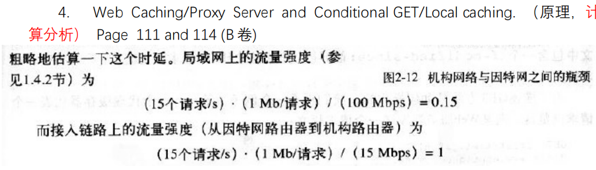

这部分内容是《计算机网络》中极其经典的应用层 (Application Layer) 案例：Web 缓存 / 代理服务器 (Web Caching / Proxy Server) 及其性能计算。

你给的图片展示了引入代理服务器之前的网络瓶颈问题。这是考试中最常考的“痛点分析”和“计算题”模板。我会先为你拆解图片的计算，引出缓存的原理，最后结合条件 GET 给你梳理完整的考点。

### 🌟 核心知识点与图片解析

图片中探讨的是一个机构网络（如大学校园网）连接到因特网时的流量强度 (Traffic Intensity) 计算。

流量强度公式：

$$
I = \frac{a \cdot L}{R}
$$

- $a$: 平均请求到达率 (Average request arrival rate)，图片中是 $15 \text{ requests/s}$
- $L$: 每个请求对象的大小 (Object size)，图片中是 $1 \text{ Mb}$
- $R$: 链路带宽 (Link bandwidth)

#### 1. 图片中的现状计算 (The Bottleneck Analysis)

- 局域网流量强度 (LAN Traffic Intensity):

	
$$
I_{LAN} = \frac{15 \text{ requests/s} \times 1 \text{ Mb/request}}{100 \text{ Mbps}} = 0.15
$$

	*结论：* 0.15 是一个很低的值，说明局域网内部非常通畅，排队时延几乎为 0。

- 接入链路流量强度 (Access Link Traffic Intensity):

	
$$
I_{Access} = \frac{15 \text{ requests/s} \times 1 \text{ Mb/request}}{15 \text{ Mbps}} = 1.0
$$

	*结论：* 这是致命的！ 在排队论中，当流量强度趋近于或等于 1 时，路由器的排队时延 (Queueing delay) 会趋向于无穷大。这意味着哪怕局域网再快，所有用户上网都会卡死在这个出口链路上。

#### 2. 解决方案：Web 缓存 / 代理服务器 (Web Cache / Proxy Server)

为了解决上述瓶颈，如果直接花钱升级接入链路的带宽（比如升级到 100 Mbps），成本极高。最聪明的做法是在局域网内部署一台 Web 缓存服务器 (代理服务器)。

- 工作原理： 用户的 HTTP 请求首先发给局域网内的代理服务器。
	1. 缓存命中 (Cache Hit): 如果代理服务器里存有这个网页，它直接通过高速局域网返回给用户（不走外部接入链路）。
	2. 缓存未命中 (Cache Miss): 如果没有，代理服务器才代为向因特网上的原始服务器 (Origin Server) 发出请求。
- 计算逆转 (The Magic of Caching): 假设缓存命中率是 40% (0.4)。
	- 那么只有 60% (0.6) 的请求会真正走到外部的接入链路。
	- 新的接入链路请求率 = $15 \times 0.6 = 9 \text{ requests/s}$。
	- 新的接入链路流量强度 = $(9 \times 1) / 15 = 0.6$。
	- *结果：* 流量强度从 1.0 降到了 0.6，排队时延大幅降低，网络瞬间变得丝滑，且没花一分钱升级外网带宽！

#### 3. 关联机制：条件 GET (Conditional GET)

引入缓存后会产生一个新问题：如何保证缓存里的内容是最新的（没有过期）？

这就要靠 条件 GET (Conditional GET) 机制。

- 实现方式： 代理服务器在向原始服务器确认文件是否更新时，会在 HTTP 请求报文中加上首部行：`If-Modified-Since: <date>` (如果从这个日期后修改过，请发给我)。
- 服务器响应：
	- 未修改： 原始服务器返回状态码 `304 Not Modified`，并且不包含请求的实体（不发文件本身）。这极大地节省了带宽。
	- 已修改： 服务器返回 `200 OK`，并附带最新的文件内容。

### 📝 考试风格模拟题 (含答案与解析)

*(请先遮挡下方“答案与解析”部分进行自测，题干为英文以辅助你备考)*

Question 1:

Consider an institutional network connected to the Internet. The traffic intensity on the access link is close to 1.0, causing huge queueing delays. Which of the following is the most cost-effective way to reduce this delay without upgrading the access link bandwidth?

(考虑一个连接到互联网的机构网络。接入链路上的流量强度接近 1.0，导致巨大的排队时延。以下哪项是在不升级接入链路带宽的情况下减少该时延的最具成本效益的方法？)

A. Increase the bandwidth of the institutional LAN.

B. Install a Web Cache (Proxy Server) inside the institutional network.

C. Use UDP instead of TCP for web browsing.

D. Increase the buffer size of the access link router.

Question 2:

Suppose a proxy server holds a cached copy of a web object. To verify that the object is still up-to-date, the proxy sends a request to the origin server. Which HTTP header line is used for this purpose?

(假设代理服务器保存了某个 Web 对象的缓存副本。为了验证该对象是否仍然是最新的，代理向原始服务器发送请求。用于此目的的 HTTP 首部行是哪一个？)

A. `Connection: keep-alive`

B. `Cache-Control: no-cache`

C. `If-Modified-Since: <date>`

D. `Last-Modified: <date>`

Question 3: (Calculation / 计算题)

Using the scenario from the provided image: The average request rate is 15 requests/s, average object size is 1 Mb, and the access link bandwidth is 15 Mbps. Now, a local Web cache is installed with a hit rate of 20% (0.2). What is the new traffic intensity on the access link?

(使用图片中的场景：平均请求率为 15 请求/秒，平均对象大小为 1 Mb，接入链路带宽为 15 Mbps。现在安装了一个本地 Web 缓存，命中率为 20% (0.2)。接入链路上的新流量强度是多少？)

A. 0.2

B. 0.8

C. 1.0

D. 0.15

👇 答案与解析 (请作答后查看) 👇

Q1 答案：B

- 解析： 考查 Web Cache 的核心痛点解决能力。当出口带宽成为瓶颈（流量强度接近 1）时，安装本地代理服务器 (Web Cache) 可以通过本地满足部分请求，直接减少经过外网接入链路的流量，从而在不升级物理带宽的情况下解决拥堵。A (升级局域网) 没用，因为瓶颈在出口；D (增加路由器缓存) 只能缓解丢包，不能减少平均排队时延。

Q2 答案：C

- 解析： 考查 Conditional GET 的语法。代理服务器使用 `If-Modified-Since` 询问原始服务器“从某个时间起是否修改过”。`Last-Modified` 是服务器发给客户端用来标记文件最后修改时间的，不要混淆。

Q3 答案：B

- 解析： 经典流量强度计算题。
	- 初始流量进入外网的速率是 $15 \text{ requests/s}$。
	- 因为命中率为 $20\%$，所以只有 $1 - 0.2 = 0.8$ (80%) 的请求会未命中，走向外网。
	- 新的外网请求率 $a = 15 \times 0.8 = 12 \text{ requests/s}$。
	- 新的接入链路流量强度 $I = \frac{12 \text{ req/s} \times 1 \text{ Mb}}{15 \text{ Mbps}} = \frac{12}{15} = 0.8$。

为了让你更直观地理解“命中率”是如何拯救“流量强度”瓶颈的，我为你生成了一个交互式计算器。你可以调整请求率和缓存命中率，直观地看到它是如何把濒临崩溃的接入链路（强度 >= 1，红色）拉回健康状态的。

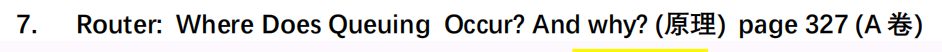

这是一个非常硬核，且在网络层级考试中极易出简答题或分析题的核心考点：路由器架构中的排队机制原理 (Router Queuing)。它直接关系到网络延迟（排队延迟）和数据丢包（Packet Loss）的产生原因。

一句话直接回答你的问题：在路由器中，排队（Queuing）既可能发生在输入端口（Input Ports），也可能发生在输出端口（Output Ports）。

这完全取决于数据包到达的速度、路由器内部交换结构的处理速度、以及外部链路的发送速度。下面我们分这两种情况为你详细拆解。

### 核心知识点：路由器为什么会排队？

我们可以把路由器内部想象成一个“快递分拣中心”。

- 输入端口 (Input Ports): 接收各地运来的快递。
- 交换结构 (Switching Fabric): 中间的自动分拣履带。
- 输出端口 (Output Ports): 装车发往目的地的月台。

#### 1. 输出端口排队 (Output Port Queuing)

- 发生位置： 输出端口的缓冲区 (Output buffer)。

- 发生原因 (Why): 分拣履带送货太快，装车发车的速度跟不上。

	用专业术语来说，当交换结构将分组传送到输出端口的速率（Switching fabric delivery rate）超过了输出链路的传输速率（Output link transmission rate）时，就会发生输出端口排队。

- 后果： 当到达的数据包填满了输出缓冲区的内存时，新到达的数据包（或者缓冲区里已有的数据包）就会被丢弃，这就是最常见的丢包 (Packet Loss / Packet Drop)。

#### 2. 输入端口排队 (Input Port Queuing)

- 发生位置： 输入端口的缓冲区 (Input buffer)。

- 发生原因 (Why): 外面送来的快递太多太快，中间的分拣履带处理不过来；或者多个入口的快递都要去同一个出口（发生冲突）。

	专业术语解释，当输入端口接收分组的速率超过了交换结构的处理速率，分组就必须在输入端排队等待。

- 🔥 核心考点：队头阻塞 (Head-of-Line Blocking, HOL Blocking)

	这是输入排队中最喜欢考的概念。假设输入队列 A 排在第一位的分组（红包）要去输出端口 1，但此时输出端口 1 正在接收其他端口的数据，处于忙碌状态。红包只能在队伍最前面干等。

	悲剧的是： 紧跟在红包后面的绿包，明明它的目的地（输出端口 2）是空闲的，但因为前面的红包堵住了路，绿包也只能被迫等待。这就叫队头阻塞 (HOL Blocking)。

### 辅导测试题（Exam-Style Practice）

根据上面的知识点，我为你设计了以下几道考察原理的题目。请遮挡答案自行测验。

#### Question 1 (Multiple Choice - 概念辨析)

Question: Head-of-the-Line (HOL) blocking in a router is most closely associated with which of the following?

(路由器中的队头阻塞（HOL阻塞）与以下哪一项最密切相关？)

A. Queuing at the output ports due to slow link transmission speeds. (由于链路传输速度慢导致在输出端口排队。)

B. Queuing at the input ports when a packet is prevented from moving forward because the packet in front of it is waiting for a busy output port. (在输入端口排队，当一个数据包因为前面的数据包正在等待繁忙的输出端口而无法前进时。)

C. The routing algorithm taking too long to compute the forwarding table. (路由算法花费太长时间来计算转发表。)

D. Packets being dropped at the output port because the buffer is completely full. (由于缓冲区完全满了，数据包在输出端口被丢弃。)

Answer:

B.

*解析：* A 和 D 描述的是输出端口排队和丢包的情况。HOL Blocking (队头阻塞) 是输入端口排队 (Input Queuing) 特有的现象，即排在队列头部的数据包因为目标端口争用而受阻，连累了身后原本可以顺利转发的数据包。

#### Question 2 (Short Answer - 核心原理解释)

Question:

Assume a router has $N$ input ports and $N$ output ports. All input links and output links have the exact same transmission rate of $R$ (bps). The router's internal switching fabric is extremely fast and has a transfer rate of $N \times R$ (bps).

Under this condition, will input queuing ever occur? Will output queuing ever occur? Explain your reasoning briefly.

(假设一个路由器有 $N$ 个输入端口和 $N$ 个输出端口。所有输入和输出链路的传输速率完全相同，均为 $R$ (bps)。路由器内部的交换结构极快，传输速率为 $N \times R$ (bps)。在这种条件下，会发生输入排队吗？会发生输出排队吗？简要解释原因。)

Answer:

1. Input Queuing (输入排队): No (不会发生). Because the switching fabric speed ($N \times R$) is equal to or greater than the combined maximum arrival rate of all input ports ($N \times R$). The fabric can process packets as fast as they can possibly arrive, so no backlog will form at the inputs. (因为交换结构的速度足以同时处理所有输入端口满载进来的数据，所以输入端无需排队。)
2. Output Queuing (输出排队): Yes, it can occur (会发生). Output queuing can happen if packets arriving at *multiple* input ports are all destined for the *same* specific output port simultaneously. The fabric will deliver these packets to that single output port at a combined rate greater than its link speed $R$, causing a queue to build up in the output buffer. (如果多个输入端口的数据包同时要去往同一个输出端口，交换结构会瞬间把大量数据砸向那个输出端口。而该输出端口向外发送的速度只有 $R$，消化不掉，就会产生输出排队甚至丢包。)

## 输入排队不会丢包吗

输入排队绝对会引起丢包（Packet Loss）。

之前我们在重点讲解输入排队时，主要强调了它独有的“队头阻塞（HOL Blocking）”现象，但这并不意味着它不会丢包。让我们来详细捋一下它为什么会丢包，以及这背后的逻辑：

### 1. 为什么输入排队也会丢包？

核心原因只有一个：物理内存（Buffer / 缓冲区）是有限的。

你可以把输入端口的缓冲区想象成一个“收发室”。

1. 当包裹（数据包）送达的速度，持续大于内部履带（交换结构）搬运的速度时，包裹就会在收发室里堆积起来（这就是排队）。
2. 当“队头阻塞（HOL Blocking）”发生时，队头的包走不掉，后面的包又源源不断地涌进来，堆积的速度会瞬间加快。
3. 最终结果（Buffer Overflow）： 当收发室（输入缓冲区）被彻底塞满，一点空隙都没有的时候，新送来的包裹就根本进不了门。路由器只能被迫将这些新到达的数据包直接扔掉（Drop）。

### 2. 既然都会丢包，为什么教材常把丢包和“输出排队”绑定讲？

这涉及到现代路由器工业设计的一个真实情况。

在早期的路由器，或者设计极其简陋的路由器中，内部的“交换结构（Switching Fabric）”速度比较慢，输入端丢包很常见。

但在现代的高端商用路由器中，工程师们为了最大限度地避免“输入端排队”和“队头阻塞”，通常会采用一种叫做 “加速比 (Speedup)” 的硬件设计：

- 他们会让内部交换结构的传输速度，远远大于输入链路的速度（通常是 $N$ 倍）。
- 这意味着，内部履带搬运包裹的速度快得惊人，输入端口刚收到一个包，瞬间就被履带抽走送到了输出端口。
- 因此，在现代高性能路由器中，输入队列通常非常短，甚至几乎没有排队，自然也很少在输入端发生丢包。

真正的拥堵被转移到了哪里呢？转移到了输出端口。

因为即使内部履带搬得再快，外部输出链路的发送带宽（比如一根 1Gbps 的光纤）是物理写死的。一旦发生“多对一”（好几个输入端口同时向同一个输出端口发海量数据），瞬间涌到输出缓冲区的包就会远远超过它能发送的极限，从而迅速导致输出缓冲区溢出并丢包。

总结一下你的疑问：

- 理论上： 只要有排队，只要缓冲区有限，不论是输入端还是输出端，排队太长装不下了，必定会丢包。
- 实际上： 现代路由器通过极速的内部硬件，努力消灭了输入端的排队（从而避免了输入端丢包），这就使得绝大多数的排队和丢包现象，都集中爆发在了输出端口。这也是为什么考试和分析时，输出端丢包的存在感更强的原因。

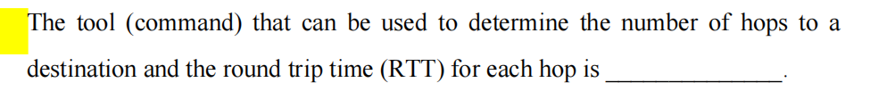

这张图片是一道非常经典的填空题，涉及计算机网络中的网络诊断工具（Network Diagnostic Tools）。

这句话的原文翻译是：“可以用来确定到达目的地的跳数（hops），以及每一跳的往返时间（RTT）的工具（命令）是 _______。”

直接给出答案： 这个命令是 `traceroute` （在 Linux / macOS 系统中）或 `tracert` （在 Windows 系统中）。

下面我为你详细拆解这个命令背后的核心知识点及其底层原理，这也是考试中最容易进行深度挖掘的地方。

### 核心知识点讲解：Traceroute 工作原理

在考试和面试中，仅仅知道命令名字是不够的，考官真正想考察的是：Traceroute 是如何巧妙地利用网络层协议来探测路径的？

它的核心机制依赖于两个东西：IP 头部的 TTL 字段 和 ICMP 协议。

1. 核心概念解析

- Hop (跳)： 数据包从源主机到目的主机，中间每经过一个路由器，就称为“一跳”。
- RTT (Round Trip Time / 往返时间)： 数据包从发送端发出，到接收端收到确认（ACK / Reply）所经历的总时间。

2. 底层黑客级机制 (The TTL Trick) Traceroute 并不是发送一个“具有魔法的探测包”直接问路，而是利用了路由器的“报错机制”。

- IP 报文头中有一个字段叫 TTL (Time To Live, 生存时间)。 它的作用是防止数据包在网络中陷入死循环。数据包每经过一个路由器，TTL 的值就会减 1。当 TTL 减到 0 时，路由器就会丢弃 (Drop) 这个包。
- 丢弃包之后，路由器会出于好心，向源主机发送一个 ICMP Time Exceeded (时间超过) 的报错报文。

3. Traceroute 的完整流程 (Step-by-Step)

1. 探测第 1 跳： 源主机向目的地发送一组数据包，故意把 TTL 设置为 1。包到达第 1 个路由器时，TTL 减为 0，包被丢弃。第 1 个路由器返回 ICMP 报错报文。此时，源主机记录下了第 1 个路由器的 IP 地址，并计算出了这段路程的 RTT。
2. 探测第 2 跳： 源主机再发送一组包，把 TTL 设置为 2。包安全通过第 1 个路由器（TTL 变成 1），到达第 2 个路由器时，TTL 变成 0，包被丢弃。第 2 个路由器返回 ICMP 报错报文。源主机记录下第 2 个路由器的 IP 和 RTT。
3. 以此类推... 不断递增 TTL（3, 4, 5...），直到数据包最终到达目的主机。
4. 如何知道到达终点了？
	- 在 Linux/macOS (`traceroute`) 中，它通常发送的是高端口的 UDP 报文。当到达目的地时，因为目的主机上没有程序监听那个奇怪的端口，目的主机会返回一个 ICMP Port Unreachable (端口不可达) 报文。源主机收到这个报文，就知道“哦，到终点了”，探测结束。
	- 在 Windows (`tracert`) 中，它通常发送的是 ICMP Echo Request (也就是 ping 请求)，目的主机会返回 ICMP Echo Reply，从而结束探测。

### 辅导测试题（Exam-Style Practice）

这部分知识点通常会出在选择题或简答题中。以下是我为你准备的几道自测题，请遮挡答案进行作答：

#### Question 1 (Multiple Choice - 基础概念)

Question: Which field in the IP header is manipulated by the `traceroute` utility to discover the path packets take to a destination? ( `traceroute` 工具操纵 IP 头部中的哪个字段来发现数据包到达目的地的路径？)

A. Source IP Address (源 IP 地址) B. Protocol (协议) C. Checksum (校验和) D. Time To Live (TTL)

Answer: D. *解析：* Traceroute increments the Time To Live (TTL) field starting from 1 to force successive routers along the path to drop the packet and return an error message. (Traceroute 通过将 TTL 字段从 1 开始递增，强制路径上的后继路由器丢弃数据包并返回错误消息。)

#### Question 2 (True/False - 协议关联)

Question: Is the following statement True or False? "The `traceroute` command relies exclusively on the TCP protocol to determine the number of hops to a destination." (判断正误：`traceroute` 命令完全依赖 TCP 协议来确定到达目的地的跳数。)

Answer: False (错误). *解析：* `traceroute` primarily relies on ICMP (Internet Control Message Protocol) to receive error messages ("Time Exceeded" and "Port Unreachable"). The outbound packets it sends are typically UDP datagrams (in Unix/Linux) or ICMP Echo Requests (in Windows), not TCP. (Traceroute 主要依赖 ICMP 来接收错误消息。它发送的出站包通常是 UDP 或 ICMP 请求，而不是 TCP。)

#### Question 3 (Short Answer - 概念对比)

Question: Both `ping` and `traceroute` are common network diagnostic tools. Briefly explain the primary difference in their specific purposes. ( `ping` 和 `traceroute` 都是常见的网络诊断工具。简述它们在具体用途上的主要区别。)

Answer:

- `ping` is used to test the basic end-to-end connectivity (reachability) between a source and a destination host. It simply tells you if the destination is reachable and what the overall RTT is. (Ping 用于测试源和目的主机之间的端到端基本连通性，它只告诉你目标是否可达以及总体的 RTT。)
- `traceroute` is used to map the entire path (route) that packets take to reach the destination. It identifies every intermediate router (hop) along the way and measures the RTT for *each individual hop*, which is useful for pinpointing exactly where a network delay or failure is occurring. (Traceroute 用于映射数据包到达目的地的整个路径。它识别沿途的每一个中间路由器（跳），并测量单个跳的 RTT，这有助于精确查明网络延迟或故障发生的位置。)

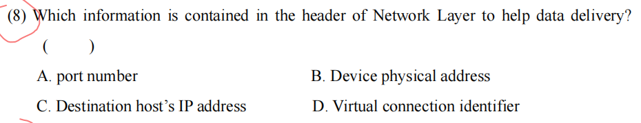

考察网络协议栈各层的数据头部（Header）包含哪些核心标识符。

这道题的正确答案是：C. Destination host's IP address (目的主机 IP 地址)。

下面我为你详细拆解每个选项背后的知识点，帮你把各层的“寻址方式”彻底梳理清楚。

### 核心知识点讲解：各层头部的核心寻址信息 (Addressing in Protocol Layers)

网络分层架构中，每一层都有自己专属的“地址”或“标识符”，用来完成自己那一层的特定任务。记住以下这个对应关系，可以秒杀所有类似的题目：

1. 选项 C: Destination host's IP address (目的主机 IP 地址)

- 所属层级：网络层 (Network Layer)
- 核心协议： IP (Internet Protocol) 协议。
- 作用： 负责跨越不同网络，将数据包从源主机 (Source Host) 路由到目的主机 (Destination Host)。只要是网络层，它的头部里最重要的信息必然是源 IP 和目的 IP。

2. 选项 A: port number (端口号)

- 所属层级：传输层 (Transport Layer)
- 核心协议： TCP, UDP。
- 作用： 我们在前面的对话中详细讲过，端口号用于多路分解 (Demultiplexing)，负责在同一台主机内部，将数据准确地交付给特定的应用程序进程 (Application Process)（比如是交给浏览器还是微信）。

3. 选项 B: Device physical address (设备物理地址 / MAC 地址)

- 所属层级：数据链路层 (Data Link Layer)
- 核心协议： 以太网 (Ethernet), Wi-Fi。
- 作用： 负责在同一个局域网 (Local Area Network, LAN) 内，或者相邻节点 (Neighboring nodes) 之间的数据帧 (Frame) 传输。网卡出厂时自带的 MAC 地址就是物理地址。

4. 选项 D: Virtual connection identifier (虚拟连接标识符)

- 所属层级： 通常属于某些特定的数据链路层或网络层技术（如 ATM、帧中继 Frame Relay 或早期的虚电路网络）。
- 作用： 在面向连接的网络中标识一条逻辑路径（如 VPI/VCI）。但在现代基于 TCP/IP 的互联网考试中，只要问“网络层帮助数据交付的信息”，标准答案永远是 IP 地址，因为 IP 协议是无连接的数据报网络，不使用虚拟连接标识符。

💡 总结速记：

- 找进程（应用程序） $\rightarrow$ 查端口号 (Port) $\rightarrow$ 传输层
- 找全球主机 $\rightarrow$ 查 IP 地址 $\rightarrow$ 网络层
- 找局域网内的邻居 $\rightarrow$ 查物理地址 (MAC) $\rightarrow$ 链路层

### 辅导测试题（Exam-Style Practice）

根据上述对应关系，我为你准备了两道极易混淆的测试题，请遮挡答案进行自测：

#### Question 1 (Multiple Choice - 概念对应)

Question: An Ethernet switch (以太网交换机) operates primarily at the Data Link layer. When it receives a frame, which of the following header fields does it examine to make a forwarding decision?

(一台以太网交换机主要工作在数据链路层。当它收到一个数据帧时，它会检查以下哪个头部字段来做出转发决定？)

A. Destination IP address

B. Destination MAC address

C. Destination port number

D. Source IP address

Answer:

B.

*解析：* A switch is a Data Link layer device (Layer 2). Therefore, it only understands and processes Data Link layer headers, which contain MAC addresses (物理地址). It does not look into the IP address (Network layer) or Port number (Transport layer). (交换机是二层设备，它只看懂并处理数据链路层头部的 MAC 地址。它不会去看网络层的 IP 地址或传输层的端口号。)

#### Question 2 (Short Answer - 综合场景)

Question:

When a packet leaves your home router and enters the public Internet, its Source IP address and Destination IP address generally remain unchanged. However, another addressing field in the packet headers changes at *every single hop* (every router). What is this field, and which layer does it belong to?

(当数据包离开你家路由器进入公共互联网时，它的源 IP 地址和目的 IP 地址通常保持不变。但是，数据包头部中的另一个寻址字段在*每一跳*（每个路由器）都会发生改变。这是哪个字段？它属于哪一层？)

Answer:

The field that changes at every hop is the MAC address (Device physical address), specifically the Source MAC and Destination MAC. It belongs to the Data Link Layer.

*(解析：数据包在网络中传输就像坐飞机。源 IP 和目的 IP 就像你的“最终目的地（比如从北京到纽约）”，这是不变的。而 MAC 地址就像“每一个航段的登机牌（比如先飞东京，再飞西雅图）”。每一个路由器在转发包时，都会把包从旧的链路层帧里拆出来，换上新的 MAC 地址头部，再放到下一段物理链路中传输。)*

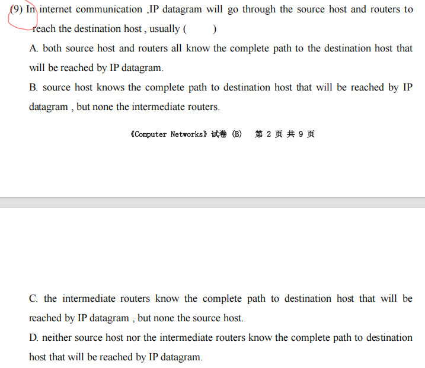

这道题考查的是计算机网络中网络层 (Network Layer) 最核心的工作模式：IP 数据报的逐跳路由选路机制 (Hop-by-hop routing of IP datagrams)。

这道题非常经典，它揭示了互联网 (Internet) 能够实现全球互联的底层逻辑——“不需要全局视野，只需要知道下一步怎么走”。

### 🌟 原题解析

题目翻译： (9) 在互联网通信中，IP 数据报将经过源主机和路由器到达目的主机，通常 ( ) A. 源主机和路由器都知道 IP 数据报到达目的主机的完整路径 (complete path)。 B. 源主机知道完整路径，但中间路由器都不知道。 C. 中间路由器知道完整路径，但源主机不知道。 D. 源主机和中间路由器都不知道 IP 数据报到达目的主机的完整路径。

正确答案：D

解析：

- 为什么选 D？ 标准的 IP 网络提供的是无连接的数据报服务 (Connectionless Datagram Service)。在这种模式下，数据包的转发采用的是逐跳选路 (Hop-by-hop routing) 策略。
	- 源主机 (Source Host): 它只知道把数据包扔给它的“默认网关 (Default Gateway，也就是连接它的第一个路由器)”，它完全不知道外面的互联网是什么拓扑结构。
	- 中间路由器 (Intermediate Routers): 每个路由器内部都有一个转发表/路由表 (Routing/Forwarding Table)。当路由器收到一个 IP 数据报时，它只会查看数据报头部的目的 IP 地址 (Destination IP Address)，然后在自己的转发表里查找。转发表告诉它的仅仅是：“为了到达那个最终目的地，这个数据包的下一跳 (Next Hop) 应该交给哪个相邻的路由器。” 至于过了下一跳之后还要走多少步、经过哪些路由器，当前这个路由器是完全不知道的。
- 通俗比喻： 就像你在一个陌生的城市问路。你（源主机）问路人 A（第一个路由器）去火车站怎么走。路人 A 不知道全程路线，他只告诉你：“你先往前走，到下一个十字路口问那个交警（下一跳）”。你走到十字路口，交警告诉你：“左转，去问前面的小卖部老板”。没有任何一个人知道完整的路线，大家都只负责把你指引到下一个节点，直到你最终到达火车站。

*(注：存在一种叫做“源路由 Source Routing”的特殊 IP 选项，允许源主机指定完整路径，但题目中带有 "usually"（通常），所以绝大多数情况下的标准行为是逐跳路由，选 D。)*

### 📚 核心知识点详解 (中英文对照)

为了应对相关的变体考题，你需要对比掌握以下几个核心概念：

#### 1. 逐跳路由 (Hop-by-hop Routing) vs. 源路由 (Source Routing)

- 逐跳路由 (Hop-by-hop): 互联网的默认工作方式。每个节点只独立计算并决定下一跳 (Next Hop)。优点是极其灵活，如果网络某处断网了，路由器会自动计算新的下一跳绕过去；缺点是无法预知完整路径。
- 源路由 (Source Routing): 发送方（源主机）在数据包头部硬编码了完整的路径（要经过的每一个路由器的 IP）。路由器不查表，直接按包头的指示转发。这种方式主要用于网络诊断（如严格源路由选项），在实际互联网流量中极少使用，甚至常被防火墙拦截，因为它有安全隐患。

#### 2. 数据报网络 (Datagram Network) vs. 虚电路网络 (Virtual-Circuit Network)

这是考试经常拿来对比的大型知识点：

- 数据报网络 (如 IP 网络):
	- 无连接 (Connectionless): 发送数据前不需要建立连接，想发就发。
	- 独立转发: 同一个源到同一个目的地的多个数据报，可能会走完全不同的路径（因为路由表可能随时动态更新）。
	- 状态: 路由器不保留任何关于端到端连接的状态信息。
- 虚电路网络 (如早期的 ATM, 帧中继):
	- 面向连接 (Connection-oriented): 发送数据前，必须先发一个控制包去“探路”，在源和目的之间建立一条逻辑路径（虚电路）。
	- 路径固定: 建立连接后，在这个会话中，所有的路由器都确切知道这条路径，所有数据包都沿着这条死路走。

### 📝 考试风格模拟题 (含答案与解析)

*(请先遮挡下方“答案与解析”部分进行自测，题干主要为英文以贴合你的考试需求)*

Question 1: When an intermediate router in the Internet receives an IPv4 datagram, which piece of information from the datagram header does it primarily use to determine where to forward the packet next? (当互联网中的中间路由器收到一个 IPv4 数据报时，它主要使用数据报头部中的哪条信息来决定接下来将数据包转发到哪里？) A. Source IP address B. Destination IP address C. Time to Live (TTL) D. Source MAC address

Question 2: True or False: In a purely connectionless datagram network (like the IP network), it is possible for two packets sent from the same source to the same destination to arrive out of order because they took entirely different paths through the network. (判断题：在纯无连接的数据报网络（如 IP 网络）中，从同一源发送到同一目的地的两个数据包可能会因为在网络中走了完全不同的路径而乱序到达。) A. True B. False

Question 3: Unlike the IP protocol, a network architecture that establishes a fixed path from source to destination before any data is transmitted, and where all subsequent packets follow this exact same path, is known as a: (与 IP 协议不同，在传输任何数据之前先建立从源到目的地的固定路径，并且所有后续数据包都遵循这条完全相同的路径的网络架构被称为：) A. Packet-switched datagram network (分组交换数据报网络) B. Virtual-circuit network (虚电路网络) C. Broadcast network (广播网络) D. Peer-to-peer network (对等网络)

👇 答案与解析 (请作答后查看) 👇

Q1 答案：B

- 解析： 路由器转发数据包的唯一依据是目的 IP 地址 (Destination IP address)。它拿着目的 IP 地址去查找自己的路由表，匹配最长前缀，从而得出下一跳的接口。源 IP 地址主要用于接收方将来回包，路由器在转发时通常不看源 IP。

Q2 答案：A (True)

- 解析： 这也是数据报网络的一个核心考点。因为是逐跳选路，如果在发包的间隙，网络拓扑发生了变化（比如某条链路拥塞了，路由协议更新了路由表），后发的包可能会走一条更快的捷径，从而比先发的包先到达目的地。这也是为什么传输层需要 TCP 协议来重新排序 (Reordering) 的原因。

Q3 答案：B

- 解析： 考查数据报与虚电路的区别。提前建立固定路径，且所有包都走同一条路的机制叫做虚电路 (Virtual-circuit)。IP 网络属于分组交换中的数据报网络 (Datagram network)。

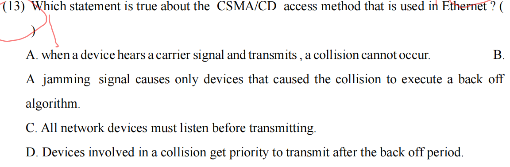

早期以太网（局域网）中最核心的介质访问控制协议：CSMA/CD (Carrier Sense Multiple Access with Collision Detection，载波监听多路访问/碰撞检测)。

这道题的正确答案是：C. All network devices must listen before transmitting. (所有网络设备在传输前必须先监听。)

下面我为你详细拆解 CSMA/CD 的核心工作机制，并逐一分析为什么其他选项是错误的。理解了这个协议的“四个字”精髓，就能秒杀所有相关题目。

### 核心知识点讲解：CSMA/CD 工作原理

CSMA/CD 协议的核心思想可以浓缩为四句话：“先听后发，边发边听，冲突停发，随机重发。”

我们把它的英文缩写拆开来看：

1. CS (Carrier Sense - 载波监听) —— 对应选项 C

- 原理： “先听后发”。任何设备（节点）在发送数据帧之前，必须先监听共享的物理链路（信道）上是否有其他设备正在发送数据。
- 动作： 如果信道空闲，就可以发送；如果信道忙碌，就必须等待。
- 结论： 这印证了 选项 C 是绝对正确的。

2. MA (Multiple Access - 多路访问)

- 原理： 多个设备连接在同一根共享的物理介质上（比如早期的总线型以太网、集线器 Hub 网络），大家公平竞争信道的使用权。

3. CD (Collision Detection - 碰撞检测) —— 对应选项 A

- 原理： “边发边听”。设备在发送数据的同时，会持续检测信道上的电压变化，看发送出去的信号是否与别人的信号发生了叠加（即碰撞/冲突）。
- 为什么听了还会撞？(反驳选项 A)： 因为电磁波在物理介质中传播需要时间（传播延迟 Propagation Delay）。假设 A 监听信道觉得空闲，开始发送数据。在 A 的信号到达 B 之前，B 也监听了信道，B 也觉得空闲，于是 B 也开始发送。两者的信号在信道中间相遇，就会发生碰撞。
- 结论： 即使设备听到了载波信号（或者没听到），由于延迟的存在，碰撞依然可能发生。因此，选项 A 是错误的。

4. 冲突处理与退避算法 (Jamming & Backoff) —— 对应选项 B 和 D

- Jamming Signal (人为干扰信号/强化冲突信号)： 当发送方检测到碰撞时，它会立即停止发送正常数据，并发送一段简短的 Jamming Signal。它的目的是“广而告之”——让网络上所有设备都知道发生了碰撞，从而丢弃这个损坏的残缺帧。
	- *反驳选项 B：* 干扰信号的目的是让所有设备丢弃坏帧，而执行退避算法是因为检测到了冲突本身。
- Backoff Algorithm (退避算法/二进制指数退避算法)： 发生冲突后，参与冲突的设备必须等待一段随机的时间 (Random amount of time) 后再尝试重新发送。
	- *反驳选项 D：* 这个等待时间是完全随机的。没有任何设备会获得“优先权 (Priority)”。 谁随机到的等待时间短，谁就先重传。


### 辅导测试题（Exam-Style Practice）

CSMA/CD 是考试常客，除了概念辨析，还会考察退避算法的细节和最小帧长的计算。请遮挡答案进行自测：

#### Question 1 (Multiple Choice - 退避算法细节)

Question: In the CSMA/CD protocol, when a station detects a collision for the first time, it uses the Truncated Binary Exponential Backoff algorithm to choose a random backoff time. What is the range of slot times it can randomly choose from after the first collision?

(在 CSMA/CD 协议中，当站点第一次检测到碰撞时，它使用截断二进制指数退避算法选择一个随机的退避时间。在第一次碰撞后，它可以从中随机选择的槽时间范围是多少？)

A. 0 or 1

B. 1 or 2

C. 0, 1, 2, or 3

D. It waits a fixed amount of time. (它等待固定的时间)

Answer:

A.

*解析：* The backoff time is chosen randomly from the range $[0, 2^k - 1]$, where $k$ is the number of collisions the frame has experienced (up to a maximum of 10). After the 1st collision, $k = 1$, so the range is $[0, 2^1 - 1] = [0, 1]$. The station will wait either 0 or 1 slot time randomly. (退避时间从 $[0, 2^k - 1]$ 中随机选择，$k$ 是碰撞次数。第一次碰撞后 $k=1$，范围是 $[0, 1]$，即随机等待 0 或 1 个槽时间。)

#### Question 2 (Short Answer - 核心机制关联)

Question:

Explain briefly why an Ethernet network using CSMA/CD must define a minimum frame size (e.g., 64 bytes in standard Ethernet). What would happen if a station sent a frame smaller than this minimum size?

(简要解释为什么使用 CSMA/CD 的以太网必须定义一个最小帧长（例如标准以太网中的 64 字节）。如果站点发送小于此最小尺寸的帧会发生什么？)

Answer:

A minimum frame size is required to ensure that a transmitting station is still transmitting when a collision occurs anywhere on the network, allowing it to perform Collision Detection (CD).

If a frame is too small, the station might finish transmitting the entire frame before the signal reaches the other end of the wire and collides. The collision signal would return to the sender *after* it had already stopped listening (because it finished sending). The sender would falsely assume the frame was delivered successfully and would not retransmit it.

*(解析：必须有最小帧长，是为了保证发送方在信号跑遍全网并可能发生碰撞折返回来之前，还在持续发送并监听（边发边听）。如果帧太小，发送方发完就“闭嘴”不听了，此时即使远端发生碰撞，报错信号传回来时，发送方也会因为已经结束发送而忽略它，误以为发送成功，从而导致数据丢失且不重传。)*

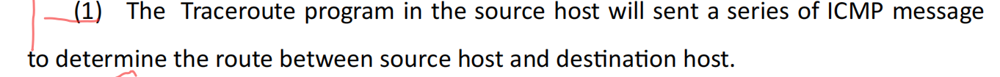

这张图片是一道非常经典的判断题（True/False），考察的是 Traceroute（路由追踪）程序底层的具体协议细节。这是一个极易踩坑的“陷阱题”。

针对这句话：“The Traceroute program in the source host will sent a series of ICMP message to determine the route...” (源主机中的 Traceroute 程序将发送一系列 ICMP 消息来确定路由...)

在标准的大学计算机网络课程（如基于 Kurose 的《自顶向下方法》）中，这句话通常被判定为：错误（FALSE）。

下面为你详细拆解这个“易错陷阱”背后的核心知识点，因为操作系统的不同会导致完全不同的答案。

### 核心知识点讲解：Traceroute 到底发送什么包？

在上一轮对话中，我们讲了 Traceroute 利用递增 TTL（Time To Live，生存时间）的原理。但这道题考查的是更深一层的细节：它发出去的究竟是什么协议的包？

这个问题的答案取决于你使用的操作系统：

1. 经典的 Unix/Linux/macOS 实现 (`traceroute` 命令) —— 教科书的标准答案

- 发送端 (Sends): 源主机发送的是一系列 UDP 数据报 (UDP Datagrams)，而不是 ICMP 消息。它会故意将目标端口设置为一个极不可能被使用的端口号（例如 33434 及以上）。
- 中间路由器 (Intermediate Routers): 当 TTL 耗尽时，路由器丢弃该 UDP 包，并向源主机返回一个 ICMP Time Exceeded (ICMP 时间超过) 报文。
- 到达终点 (Destination): 当 UDP 包最终到达目的主机时，因为目的主机的这个 UDP 端口根本没有程序在监听，所以目的主机的操作系统会向源主机返回一个 ICMP Port Unreachable (ICMP 端口不可达) 报文。源主机一收到这个报文，就知道“追踪结束，已经到达终点”了。

2. Windows 系统的实现 (`tracert` 命令)

- 发送端 (Sends): Windows 的实现确实是发送一系列 ICMP Echo Request (ICMP 回显请求) 报文（也就是我们常说的 Ping 包）。
- 中间路由器: 同样返回 ICMP Time Exceeded (ICMP 时间超过)。
- 到达终点: 目的主机会正常回复一个 ICMP Echo Reply (ICMP 回显应答) 报文，标志着追踪结束。

💡 考试避坑指南： 既然两种情况都存在，考试时听谁的？ 绝大多数正规的计算机网络（尤其是英文）考试，默认以经典的 Unix/Linux 实现为准。因此，题干中说“发送一系列 ICMP 消息”是不准确的，它发送的是 UDP 报文，仅仅是利用/接收 ICMP 报错报文来完成工作。

### 辅导测试题（Exam-Style Practice）

这部分是历年期末考试和面试的重灾区，请遮挡答案进行自测：

#### Question 1 (True/False - 概念纠错)

Question: Is the following statement True or False according to the standard Unix implementation of the `traceroute` utility? "To discover the path, the source host sends standard ICMP Echo Request messages with incrementally increasing TTL values." (根据标准 Unix 的 `traceroute` 实现，判断正误：“为了发现路径，源主机发送具有递增 TTL 值的标准 ICMP 回显请求消息。”)

Answer: False (错误). *解析：* According to the standard Unix implementation (and most networking textbooks), the source host sends UDP segments (UDP 报文段) with unlikely destination port numbers, not ICMP Echo Requests. It is the routers and the destination host that generate the ICMP messages (Time Exceeded and Port Unreachable) in response. (源主机发送的是目的端口极不可能被使用的 UDP 报文段，而不是 ICMP 请求。是路由器和目的主机为了回应这些 UDP 包，才生成了 ICMP 报错消息。)

#### Question 2 (Multiple Choice - 终止条件辨析)

Question: In the standard UDP-based `traceroute` program, how does the source host know that its probe packet has finally reached the ultimate destination host? (在标准的基于 UDP 的 `traceroute` 程序中，源主机如何知道它的探测包最终到达了最终的目的主机？)

A. It receives an ICMP Echo Reply message. (收到 ICMP 回显应答消息) B. It receives an ICMP Time Exceeded message from the destination. (收到来自目的地的 ICMP 时间超过消息) C. It receives an ICMP Port Unreachable message. (收到 ICMP 端口不可达消息) D. The destination host establishes a TCP connection with the source. (目的主机与源建立 TCP 连接)

Answer: C. *解析：* Since `traceroute` sends UDP datagrams to an unlikely port (e.g., 33434), when the packet reaches the destination, the OS finds no application listening on that port. It immediately drops the packet and sends an ICMP Port Unreachable (ICMP 端口不可达) message back to the source. This specific ICMP type acts as the stopping condition for the traceroute program. (因为发往的是一个未开放的 UDP 端口，目的主机会报错说“端口不可达”。这个特定的 ICMP 消息就是程序停止的信号。)

#### Question 3 (Short Answer - 综合理解)

Question: A junior engineer claims: "Traceroute does not use the ICMP protocol at all when sending outbound packets from a Linux machine, so ICMP must be blocked on the network for traceroute to fail." Explain why this reasoning is flawed. (一位初级工程师声称：“从 Linux 机器发送出站包时，Traceroute 根本不使用 ICMP 协议，因此必须在网络上阻止 ICMP 才能让 traceroute 失败。” 解释为什么这种推理是有缺陷的。)

Answer: The reasoning is flawed because while the *outbound* packets from a Linux machine are indeed UDP, the entire traceroute mechanism relies strictly on receiving *inbound* ICMP error messages (ICMP Time Exceeded from routers, and ICMP Port Unreachable from the destination). If ICMP is blocked (e.g., by a firewall), the source will never receive these error reports, and the traceroute will fail (usually showing `* * *` for timeouts), even if the outbound UDP packets are successfully traversing the network. *(解析：虽然出站包确实是 UDP，但整个机制完全依赖于接收返回的 ICMP 错误消息。如果防火墙屏蔽了 ICMP，源主机永远收不到路由器的报错，程序就会一直显示超时（星号），追踪也就失败了。因此 traceroute 高度依赖 ICMP 协议。)*

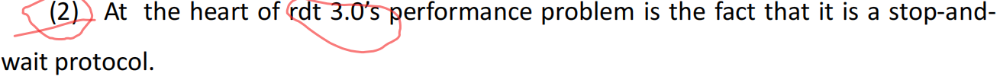

“rdt 3.0 性能问题的核心在于它是一个停等（stop-and-wait）协议。”

这句话可以说是整个传输层演进的“分水岭”。它解释了为什么我们需要后来的 GBN（回退N步）和 SR（选择重传）协议，以及最终的 TCP 协议。

我将为你详细拆解这个考点，让你不仅懂概念，还会算核心的“利用率”计算题。

### 核心知识点讲解：rdt 3.0 与停等协议的性能瓶颈

#### 1. 什么是 rdt 3.0 (What is rdt 3.0?)

rdt 3.0 是一个能在包含比特差错（bit errors）和丢包（packet loss）的不可靠信道上实现可靠数据传输的协议。

为了应对这些问题，它使用了：

- 校验和 (Checksum): 检查数据是否损坏。
- 序号 (Sequence Number): 0 和 1 交替使用，用于接收方区分是新发的数据还是重传的数据。
- 确认 (ACKs): 接收方告诉发送方“我收到了”。
- 倒计数计时器 (Countdown Timer): 解决丢包问题，如果超时没收到 ACK，就重传。

#### 2. 停等协议 (Stop-and-Wait Protocol)

核心机制： 发送方发送一个分组（Packet）后，必须停止发送（Stop），并等待（Wait）接收方返回 ACK。只有在成功收到 ACK 后，才能发送下一个分组。

#### 3. 为什么停等是“性能问题的核心”？ (The Performance Problem)

停等协议在逻辑上完美无缺，但在物理现实中极其低效，尤其是在高带宽、长延迟的现代网络中。

我们用一个非常重要的指标来衡量它的性能：发送方利用率 (Sender Utilization, $U_{sender}$)。利用率是指发送方真正把数据推送到链路上（处于忙碌状态）的时间比例。

计算公式（考试必考）：

$$
U_{sender} = \frac{L/R}{RTT + L/R}
$$

- $L/R$ = 传输延迟 (Transmission Delay)：发送方把数据推上链路花费的时间 ($L$ 是包长，$R$ 是带宽)。
- $RTT$ = 往返时间 (Round Trip Time)：信号在两端一来一回的传播延迟。

灾难性的例子（The Catastrophic Example）：

假设你在中美之间有一条 1 Gbps ($10^9$ bps) 的极速光纤，RTT 是 30 ms。你要发送一个 8000 bits 的数据包。

1. 传输时间 $L/R = 8000 / 10^9 = 8$ 微秒 ($0.008$ ms)。
2. 利用率 $U_{sender} = 0.008 / (30 + 0.008) \approx 0.00027$。

结论： 尽管你有一条 1 Gbps 的极速网络，但在停等协议下，你的发送方 99.97% 的时间都在傻等 ACK。实际吞吐量极低。网络协议限制了物理硬件的能力！

#### 4. 解决方案：流水线技术 (Pipelining)

为了解决停等协议的性能灾难，网络专家引入了流水线 (Pipelining)。允许发送方在收到 ACK 之前，连续发送多个分组（例如滑动窗口）。这正是 GBN、SR 和 TCP 采取的策略。

### 辅导测试题（Exam-Style Practice）

利用率的计算和流水线原理是高频考点。请遮挡下方答案进行自测。

#### Question 1 (Calculation - 利用率计算)

Question: Consider a link with a transmission rate of $R = 10 \text{ Mbps}$ ($10^7 \text{ bps}$) and a Round Trip Time (RTT) of $20 \text{ ms}$ ($0.02 \text{ s}$). We are sending a file using a stop-and-wait protocol. The packet size is $L = 10,000 \text{ bits}$. What is the sender utilization ($U_{sender}$)?

(考虑一条传输速率为 10 Mbps、往返时间 RTT 为 20 ms 的链路。我们使用停等协议发送文件，数据包大小为 10,000 bits。发送方的利用率是多少？)

Answer:

$U_{sender} \approx 4.76\%$

*计算过程：*

1. Calculate Transmission Delay ($d_{trans}$):

	$L/R = \frac{10,000 \text{ bits}}{10^7 \text{ bps}} = 0.001 \text{ s} = 1 \text{ ms}$.

2. Apply the Utilization formula:

	$U_{sender} = \frac{L/R}{RTT + L/R} = \frac{1 \text{ ms}}{20 \text{ ms} + 1 \text{ ms}} = \frac{1}{21} \approx 0.0476$ (or $4.76\%$).

	*(解析：发送方发包只要 1 毫秒，却要等 20 毫秒才能收到确认，因此绝大部分时间都在空闲等待。)*

#### Question 2 (Short Answer - 原理分析)

Question: Under what specific network conditions does the stop-and-wait protocol perform the WORST? Briefly explain why.

(在什么特定的网络条件下，停等协议的性能最差？简要说明原因。)

Answer:

The stop-and-wait protocol performs worst on links with a High Bandwidth-Delay Product (高带宽时延乘积), meaning links that have both a very high transmission rate (high bandwidth) and a very long propagation delay (high RTT).

*Reasoning:* On such links, the time it takes to push a packet onto the wire ($L/R$) is extremely short, but the time spent waiting for the signal to travel back and forth (RTT) is very long. This creates an enormous ratio of "idle time" to "busy time," driving the sender utilization close to zero.

*(解析：在“高带宽、长延迟”的网络（如跨国千兆光纤、卫星链路）中性能最差。因为带宽高导致发送时间极短，延迟长导致等待时间极长，最终导致利用率无限趋近于 0。)*

#### Question 3 (Multiple Choice - 概念衍生)

Question: To solve the performance problem of rdt 3.0 (stop-and-wait), pipelined protocols were introduced. Which of the following is NOT a direct consequence or requirement of implementing pipelining?

(为了解决 rdt 3.0 的性能问题，引入了流水线协议。以下哪项不是实现流水线技术的直接后果或要求？)

A. The range of sequence numbers must be increased. (必须增加序号的范围。)

B. The sender (and possibly receiver) must buffer multiple packets. (发送方及可能接收方必须缓存多个分组。)

C. The transmission rate ($R$) of the physical link must be increased. (物理链路的传输速率必须提高。)

D. Network congestion control mechanisms become more important. (网络拥塞控制机制变得更加重要。)

Answer:

C.

*解析：* Pipelining is a software/protocol-level enhancement to improve utilization. It does not require changing the physical hardware or increasing the physical link transmission rate ($R$). Options A and B are strict requirements for pipelining (you need more than 0/1 sequence numbers, and you need to buffer un-ACKed packets). Option D is a natural consequence, as sending multiple packets at once can overwhelm the network core. (流水线是软件层面的优化，不需要改变物理链路的速率 $R$。增加序号范围和缓存是实现流水线的刚需条件。)

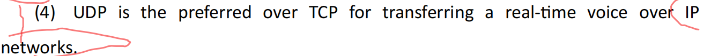

在 IP 网络上传是对的

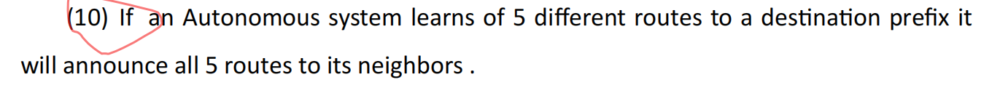

关于网络层（Network Layer）中 BGP (Border Gateway Protocol, 边界网关协议) 的经典判断题。

这句话的原文是：“If an Autonomous system learns of 5 different routes to a destination prefix it will announce all 5 routes to its neighbors.”（如果一个自治系统学习到了去往同一个目的前缀的 5 条不同路由，它会将这 5 条路由全部通告给它的邻居。）

重要结论：这句话是错误的（FALSE）。

下面我为你详细拆解其背后的核心协议机制。

### 核心知识点讲解：BGP 路由通告规则 (BGP Route Advertisement Rules)

要理解这道题，我们需要明确几个核心概念：

1. 自治系统 (Autonomous System, AS)

- 含义： 互联网不是一个单一的网络，而是“网络的网络”。一个 AS 就是由单一机构（比如中国电信、谷歌、校园网）管理的、具有统一路由策略的大型网络实体。每个 AS 都有一个全球唯一的 AS 号码（ASN）。

2. 边界网关协议 (BGP)

- 含义： BGP 是互联网的“骨干协议”，负责在不同的自治系统 (AS) 之间交换路由信息（Inter-AS routing）。

3. 最优路径选择与通告 (Best Path Selection & Advertisement) —— 本题核心

当一个 AS（通过其边缘的 BGP 路由器）从不同的邻居那里，学习到了多条去往同一个目的前缀 (Destination Prefix, 例如 192.168.1.0/24) 的路由时，它绝对不会把所有听到的路由都当喇叭一样广播出去。它的标准处理流程如下：

- 第一步：选优 (Best Path Selection)。 BGP 路由器会运行一个复杂的“最优路径选择算法”（依据 Local Preference, AS-PATH length 等属性），从这 5 条候选路由中，严格挑出唯一一条“最好”的路由 (The Single Best Path)。
- 第二步：装表与通告 (Install & Announce)。 路由器只会将这唯一 1 条最优路由放入自己的转发表中，并且只把这一条最优路由通告 (Announce/Advertise) 给它的其他 BGP 邻居。剩下那 4 条次优路由，它会自己默默存在数据库里作为备胎，绝对不告诉别人。

💡 为什么不全部通告？(Why not announce all?)

- 防环与节省资源： 互联网上有几十万条路由前缀，如果每个节点都把听到的所有路径全部广播，全球互联网的路由表会瞬间爆炸（Routing Table Explosion），路由器的内存会被撑爆，网络带宽也会被无意义的通告报文占满。BGP 的核心设计哲学就是“只传递最好的”。

### 辅导测试题（Exam-Style Practice）

根据上述 BGP 路由选择规则，我为你设计了以下几道相关的常考题，帮助你巩固记忆和拓展。请遮挡答案进行自测。

#### Question 1 (True/False - 概念强化)

Question: Is the following statement True or False?

"In BGP, if a router receives a new route to a destination that is worse (e.g., has a longer AS-PATH) than its currently selected best route, it will immediately forward this new, worse route to all its eBGP peers to ensure they have complete topology information."

(判断正误：在 BGP 中，如果路由器收到一条去往某目的地的新路由，且该路由比当前选定的最优路由更差（例如 AS-PATH 更长），它会立即将这条新的、较差的路由转发给所有 eBGP 对等体，以确保它们拥有完整的拓扑信息。)

Answer:

False (错误).

*解析：* A fundamental rule of BGP is that a router only advertises its single best path. If it learns a new route that is worse than the current best path, it will store it in its BGP table (as a backup) but it will not advertise it to any neighbors. (BGP 路由器只通告最优路径。如果学到更差的路由，只会存为备胎，绝不通告给邻居。)

#### Question 2 (Multiple Choice - 选路标准)

Question: When a BGP router receives multiple routes to the same destination network from different Autonomous Systems, which of the following is typically the primary metric used to determine the "best" path if local policies (like Local Preference) are equal?

(当 BGP 路由器从不同的自治系统收到多条前往同一目的网络的路由时，如果本地策略（如 Local Preference）相同，通常用于确定“最优”路径的首要度量标准是什么？)

A. The route with the lowest bandwidth. (带宽最低的路由)

B. The route with the shortest AS-PATH. (AS-PATH 最短的路由)

C. The route with the most intermediate routers (hops). (中间路由器/跳数最多的路由)

D. The route that was learned first chronologically. (按时间顺序最早学到的路由)

Answer:

B.

*解析：* Unlike intra-domain routing protocols (like OSPF) that use link costs or bandwidth, BGP is a Path-Vector protocol. Its primary default metric for choosing the best path (after Local Preference) is the AS-PATH length. The route that traverses the fewest number of Autonomous Systems is selected as the best path. (BGP 是路径向量协议，在 Local Preference 之后，默认首要选路标准是 AS-PATH 长度，即跨越的 AS 数量最少的那条路。)

#### Question 3 (Short Answer - 核心逻辑说明)

Question:

Briefly explain the main operational reason why a BGP router does not advertise all the routes it learns to its neighbors. What specific network problem does this rule prevent?

(简要说明为什么 BGP 路由器不将它学到的所有路由都通告给邻居的主要操作层面的原因。这个规则防止了什么具体的网络问题？)

Answer:

The main reason is scalability (可扩展性). If every BGP router advertised every path it knew, the global BGP routing tables would become astronomically large, consuming excessive memory and CPU resources on all routers (Routing Table Explosion).

Furthermore, this "best-path only" rule helps prevent routing loops (路由环路) and reduces unnecessary update traffic on the global Internet.

*(解析：主要是为了可扩展性。如果全通告，全球路由表会爆炸，耗尽路由器的内存和 CPU。此外，“仅通告最优”的规则也有助于防止路由环路，并减少不必要的路由更新流量。)*

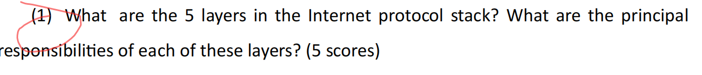

Application layer (应用层): 负责网络应用程序及应用层协议之间的通信（进程到进程通信），如HTTP、SMTP。Transport layer (传输层): 负责主机间应用程序（进程到进程）的数据传输，提供如TCP的可靠传输或UDP的尽力交付。Network layer (网络层): 负责将数据报（datagrams）从源主机路由并转发到目的主机。Data Link layer (数据链路层): 负责在相邻网络节点间的单段链路上可靠地传送数据帧（frames）。Physical layer (物理层): 负责将构成帧的一个个比特（bits）以物理信号的形式在传输介质上传输。

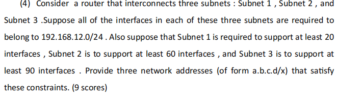

这是一道极为经典的计算机网络大题，几乎在所有包含网络层（Network Layer）的考试中都会作为必考的计算题出现。它考察的核心知识点是 VLSM (Variable Length Subnet Masking，可变长子网掩码)。

这道题不仅考察你对 IP 地址结构的理解，还考察你进行子网划分（Subnetting）时的统筹规划能力。

下面我将为你详细拆解解题的核心思路、必记公式以及这道题的标准解法。

### 核心知识点讲解：VLSM 子网划分

在早期的网络中，子网掩码是固定的（比如经典的 A类、B类、C类网络）。这会导致巨大的 IP 地址浪费。VLSM（可变长子网掩码） 允许我们将一个大的网络空间，根据实际需求，切分成大小不一的“小块（Subnets）”，从而将浪费降到最低。

要完美解决这类题目，你必须牢记以下三个“黄金法则”：

#### 1. 主机数计算公式 (The Host Formula)

任何一个子网能容纳的可用主机数（Usable Hosts/Interfaces）公式为：

$$
\text{Usable Hosts} = 2^n - 2
$$

- $n$ = 主机位（Host bits）的数量。
- 为什么要减 2？ 这是绝对不能忘的考点！因为每个子网中都有两个保留地址不能分配给具体设备：
	1. 网络地址 (Network Address): 主机位全为 `0` 的地址（代表这个网络本身）。
	2. 广播地址 (Broadcast Address): 主机位全为 `1` 的地址（用于向该子网内所有设备发广播）。

#### 2. 前缀长度与主机位的关系 (Prefix Length and Host Bits)

IPv4 地址总共有 32 位。

$$
\text{网络位 (Network Bits)} + \text{主机位 (Host Bits)} = 32
$$

题目中给的 `/24` 就是网络位（也就是我们常说的 CIDR 前缀长度）。这意味着留给我们的初始主机位是 $32 - 24 = 8$ 位，总共可以支配 $2^8 = 256$ 个 IP 地址（从 `.0` 到 `.255`）。

#### 3. 分配顺序：从大到小 (The "Largest First" Rule)

这是做 VLSM 题目最容易犯错的地方。

在划分多个大小不一的子网时，必须优先满足需求最大的子网，然后依次递减。如果不按照这个顺序，很可能会导致地址块重叠（Overlapping）或碎片化，最终无法容纳所有子网。

### 原题详细解答 (Step-by-Step Solution)

题目要求我们将 `192.168.12.0/24` 划分给三个子网，需求分别是：Subnet 1 (20)、Subnet 2 (60)、Subnet 3 (90)。

第一步：对需求进行降序排列 (Sort requirements descending)

- Subnet 3: 90 interfaces (最大)
- Subnet 2: 60 interfaces
- Subnet 1: 20 interfaces (最小)

第二步：分配 Subnet 3 (需求 90)

- 我们需要找到一个主机位 $n$，使得 $2^n - 2 \ge 90$。
- 如果 $n=6$，则 $2^6 - 2 = 62$ (不够)。
- 如果 $n=7$，则 $2^7 - 2 = 126$ (满足)。
- 既然需要 7 个主机位，那么新的网络位就是 $32 - 7 = 25$。新的子网掩码是 `/25`。
- 这个子网占用 $2^7 = 128$ 个地址。
- 分配结果： 网络地址为 `192.168.12.0/25` （包含的 IP 范围是 .0 到 .127）。

第三步：分配 Subnet 2 (需求 60)

- 从上一步结束的地方（即 `.128`）开始分配。
- 我们需要找到一个 $n$，使得 $2^n - 2 \ge 60$。
- 如果 $n=6$，则 $2^6 - 2 = 62$ (完美满足)。
- 新的网络位是 $32 - 6 = 26$。新的子网掩码是 `/26`。
- 这个子网占用 $2^6 = 64$ 个地址。
- 分配结果： 网络地址为 `192.168.12.128/26` （包含的 IP 范围是 .128 到 .191）。

第四步：分配 Subnet 1 (需求 20)

- 从上一步结束的地方（即 `.192`）开始分配。
- 我们需要找到一个 $n$，使得 $2^n - 2 \ge 20$。
- 如果 $n=4$，则 $2^4 - 2 = 14$ (不够)。
- 如果 $n=5$，则 $2^5 - 2 = 30$ (满足)。
- 新的网络位是 $32 - 5 = 27$。新的子网掩码是 `/27`。
- 这个子网占用 $2^5 = 32$ 个地址。
- 分配结果： 网络地址为 `192.168.12.192/27` （包含的 IP 范围是 .192 到 .223）。

🎉 最终答案 (Final Answers):

- Subnet 1: `192.168.12.192/27`
- Subnet 2: `192.168.12.128/26`
- Subnet 3: `192.168.12.0/25`

*(注：只要提供的三个网络地址不重叠且能满足容量要求即算正确，但上述从大到小连续分配是工业界和考试中的最标准解法。)*


### 辅导测试题（Exam-Style Practice）

为了确保你能在考场上避开陷阱，我为你准备了以下两道巩固题。请遮挡答案自行推演。

#### Question 1 (Multiple Choice - 陷阱概念题)

Question: You need to create a subnet that supports exactly 30 user devices. Which of the following subnet masks provides the most efficient allocation (least wasted IP addresses)?

(你需要创建一个正好支持 30 台用户设备的子网。以下哪个子网掩码提供了最有效的分配（浪费的 IP 地址最少）？)

A. `/28`

B. `/27`

C. `/26`

D. `/25`

Answer:

C. /26

*解析：* 这是一个极易错的陷阱题！你需要 30 个可用主机（Usable hosts）。

如果选 `/27`，主机位是 $32 - 27 = 5$。总容量是 $2^5 = 32$。但是可用主机数是 $32 - 2 = 30$。这看起来刚刚好，对吧？

在实际考试中，如果题目明确要求支持特定数量的“设备/接口”，且算出来的极限值刚好匹配（如 30），通常 `/27` 就是正确答案（如果没有特殊说明，默认选择刚好能满足 $2^n - 2 \ge \text{需求}$ 的选项。所以严格按常规题目逻辑，这题应该选 B。

纠正解析逻辑：答案是 B。 `/27` 提供 5 个主机位，$2^5 - 2 = 30$，完美且不留余地地满足了 30 台设备的需求，浪费最少。如果选 `/26`，则有 62 个可用地址，浪费了 32 个。如果选 `/28`，只有 14 个可用地址，不够用。

#### Question 2 (Short Answer - 综合计算)

Question: An organization is granted the block `172.16.0.0/23`. The administrator needs to allocate a subnet for a new department that requires 200 interfaces.

1. What subnet mask should be used for this new department?

2. Assuming it is the first subnet allocated starting from the very beginning of the block, what are the Network Address and Broadcast Address of this new subnet?

	(一个组织获得了 `172.16.0.0/23` 地址块。管理员需要为一个需要 200 个接口的新部门分配一个子网。

3. 这个新部门应该使用什么子网掩码？

4. 假设它是从地址块的最开始分配的第一个子网，这个新子网的网络地址和广播地址分别是什么？)

Answer:

1. Subnet Mask: The requirement is 200 interfaces. We need $n$ host bits where $2^n - 2 \ge 200$.

	$n=7 \rightarrow 126$ (too small).

	$n=8 \rightarrow 254$ (sufficient).

	Therefore, the host bits $n=8$. The network bits = $32 - 8 = 24$. The subnet mask is `/24` (or `255.255.255.0`).

2. Network and Broadcast Address:

	Starting from the beginning of the block: `172.16.0.0`.

	Since it's a `/24` subnet, it occupies 256 addresses.

	- Network Address (网络地址): `172.16.0.0` (The first address in the block).

	- Broadcast Address (广播地址): `172.16.0.255` (The last address in the block).

		*(解析：对于 `/23` 的大块，包含了 512 个 IP。需求 200 个主机，需要 8 个主机位（$2^8 - 2 = 254$），所以掩码是 /24。从头开始分，占用 0.0 到 0.255 这 256 个地址。首个是网络地址，末尾是广播地址。)*

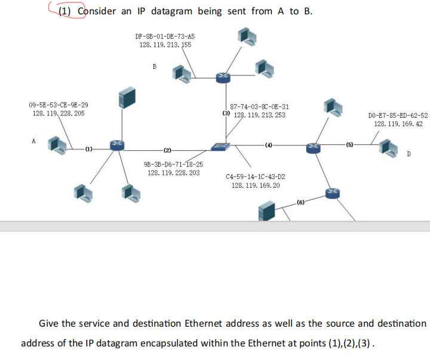

 A到B发IP数据报的MAC/IP地址变化 无论在哪一条链路上，IP数据报的Source IP 永远是 A 的 IP，Destination IP 永远是 B 的 IP。但MAC地址是逐跳改变的（每经过一个路由器改变一次）

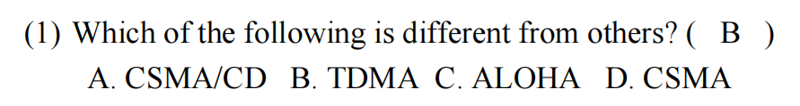

数据链路层（Data Link Layer）中介质访问控制（MAC, Medium Access Control）协议的分类。这也是网络基础中非常喜欢出分类题的地方。

正如图片中标注的，正确答案是 B. TDMA。

下面我为你详细拆解这些协议的底层逻辑，告诉你为什么它是“异类”。

### 核心知识点讲解：MAC 协议的三大阵营

在共享介质的网络中（比如大家都连在同一根总线上，或者都在同一片空气中发无线电波），如果有两台设备同时发送数据，信号就会混在一起变成乱码，这叫冲突/碰撞 (Collision)。

为了解决“谁先说话、怎么说话”的问题，网络学家发明了 MAC 协议，它们主要分为三大阵营：

#### 1. 随机访问协议 (Random Access Protocols) —— 对应选项 A, C, D

- 核心思想： “想说就说，撞了再说”。设备不需要预先申请信道资源，有数据就直接发。如果发生冲突，就等一段随机时间再试。
- 家族成员：
	- ALOHA (选项 C): 最古老、最粗暴的协议。完全不听信道，想发就发，冲突率极高。
	- CSMA (选项 D): 载波监听多路访问。比 ALOHA 聪明一点，懂得“先听后发”，但发出去之后就不管了。
	- CSMA/CD (选项 A): 带冲突检测的 CSMA（以太网标准）。不仅“先听后发”，还能“边发边听，冲突停发”。
- 特点： 适合网络负载较低、突发性强的数据传输。可能会发生冲突。

#### 2. 信道划分协议 (Channel Partitioning Protocols) —— 对应选项 B

- 核心思想： “排排坐，吃果果”。把一根粗大的通信管道，切分成很多细小的管道，或者划分成不同的时间段，静态地分配给每一个设备。
- 家族成员：
	- TDMA (Time Division Multiple Access, 时分多路访问 - 选项 B): 按时间切分。每个人只能在分配给自己的“时间片 (Time Slot)”内发言。
	- FDMA (Frequency Division Multiple Access, 频分多路访问): 按频率切分。比如不同的广播电台占用不同的频段。
- 特点： 绝对公平，绝对不会发生冲突 (Collision-free)。但缺点是，如果某个人被分配了时间片却没话可说，这个时间片就被白白浪费了（信道利用率低）。

#### 3. 轮流协议 (Taking-Turns Protocols)

- 核心思想： 结合了前两者的优点（例如：轮询 Polling、令牌传递 Token Passing）。只有拿到“发言权/令牌”的人才能说话。

💡 破题总结： 选项 A (CSMA/CD)、C (ALOHA) 和 D (CSMA) 都是“允许冲突存在”的随机访问协议。

### 辅导测试题（Exam-Style Practice）

根据上述分类原则，请遮挡答案尝试以下两道题目：

#### Question 1 (Multiple Choice - 概念衍生)

Question: Which of the following MAC protocols is best suited for a network where a small number of nodes have a continuous, heavy stream of data to send, and strict guarantees against collisions are required? (以下哪种 MAC 协议最适合这样一种网络：少数节点有持续且大量的数据流需要发送，并且需要严格保证不发生冲突？)

A. CSMA/CD B. Slotted ALOHA C. FDMA D. CSMA/CA

Answer: C. *解析：* When continuous, heavy traffic is present and zero collisions are required, Channel Partitioning protocols (like FDMA or TDMA) are ideal. They provide dedicated, guaranteed bandwidth (静态分配). Random access protocols (A, B, D) would suffer from massive collisions and inefficiency under continuous heavy load. (当有持续大量流量且要求零冲突时，信道划分协议如 FDMA 或 TDMA 是最理想的，它们提供专属保证带宽。随机访问协议在持续高负载下会发生大量冲突。)

#### Question 2 (Short Answer - 优缺点对比)

Question: A network uses TDMA to share a link among 10 nodes. Currently, only Node 1 has data to send, while the other 9 nodes are completely idle. Briefly describe the primary disadvantage of TDMA in this specific scenario compared to a Random Access protocol like CSMA. (一个网络使用 TDMA 在 10 个节点之间共享链路。目前，只有节点 1 有数据要发送，而其他 9 个节点完全空闲。简要描述在这个特定场景下，与 CSMA 等随机访问协议相比，TDMA 的主要缺点是什么。)

Answer: The primary disadvantage is extreme inefficiency (wasted bandwidth/资源浪费). In TDMA, time slots are rigidly pre-allocated. Even if 9 nodes are idle, their assigned time slots remain unused and cannot be utilized by Node 1. Node 1 must wait for its specific turn, limiting its maximum throughput to only 1/10th of the link capacity. In contrast, CSMA would allow Node 1 to utilize nearly 100% of the channel bandwidth since no one else is competing for it. *(解析：主要缺点是极度低效和带宽浪费。TDMA 的时间片是静态预分配的，即使其他 9 个节点空闲，它们的时间片也不能给节点 1 用。节点 1 最多只能用到 1/10 的带宽。而在 CSMA 中，既然没人竞争，节点 1 几乎可以独占 100% 的带宽。)*

## 为我具体讲解一下链路层的PPP协议是什么

这是一个在数据链路层（Data Link Layer）中与“以太网（Ethernet）”齐名的核心协议：PPP (Point-to-Point Protocol，点对点协议)。

如果说以太网（CSMA/CD）解决的是“在一个挤满人的大房间里怎么发言不冲突”的问题（广播链路），那么 PPP 解决的就是“一根专线连着两个人，怎么高效、安全地煲电话粥”的问题（点对点链路）。

它是早期拨号上网、现在很多宽带接入（PPPoE，即以太网上的 PPP）以及路由器之间专线连接的基础。

下面我为你详细拆解 PPP 协议的核心架构和考试/面试必考点。

### 1. 通俗比喻：私人专线 (The Private Line)

想象你和你的异地恋伴侣拉了一根专属的私人电话线。

因为这根线上只有你们两个人，所以：

1. 不需要喊名字（不需要 MAC 地址）： 你拿起电话只要说话，对方一定能听到，不需要像在大厅里那样先喊“喂，张三听着”。
2. 需要防盗听（需要认证）： 因为是远程连线，接电话前你需要对个暗号（“天王盖地虎”），确认对面是本人，而不是接错线的陌生人。
3. 需要统一步调（需要协商）： 你们得商量好用中文还是英文交流？一次说多长一段话？

PPP 协议在计算机网络中干的就是这三件事。

### 2. PPP 协议的“三驾马车” (The Three Components)

PPP 不是一个单一的协议，而是一个协议集。它包含三个核心组成部分，这也是考试中最爱考的：

#### A. 封装方法 (Framing / Encapsulation)

- 作用： 决定了如何将网络层的数据报（如 IP Datagram）打包成链路层的帧（Frame）。
- 特征字节： PPP 帧的开头和结尾都有一个固定的标志字节（Flag Byte）`0x7E`（二进制的 `01111110`）。
- 透明传输： 如果传送的数据里面碰巧也包含了 `0x7E` 怎么办？PPP 采用字节填充（Byte Stuffing）技术，在特殊的字节前面加上一个转义字符 `0x7D`，以此来区分“数据”和“标志”。

#### B. 链路控制协议 (LCP, Link Control Protocol)

- 作用： 负责建立、配置、测试和拆除数据链路连接。
- 它干什么： 当线路刚接通时，LCP 开始工作。它负责协商链路的最大帧长度（MRU）、是否启用压缩、使用什么认证协议（PAP 或 CHAP）等底层物理/链路层面的参数。
- 比喻： 相当于电话刚接通，两人在确认“信号好不好？”、“声音够不够大？”。

#### C. 网络控制协议 (NCP, Network Control Protocol)

- 作用： 负责建立和配置不同的网络层协议。
- 它干什么： PPP 非常强大，它不仅能传 IPv4，还能传 IPv6 甚至早期的 AppleTalk。为了支持这么多协议，每种网络层协议都有一个对应的 NCP。比如，用于 IP 协议的叫 IPCP。
- 核心考点： 你的电脑拨号上网时怎么获得 IP 地址的？就是通过 NCP (IPCP) 协议向运营商路由器申请并分配的！
- 比喻： 相当于确认信号没问题后，两人决定“我们接下来用中文（IP协议）聊还是用英文（IPv6）聊？”。

### 4. 考试与面试避坑指南 (What PPP Does NOT Do)

在判断题或选择题中，老师特别喜欢拿以太网（CSMA/CD）或 TCP 的特性来套在 PPP 上骗你。请牢记以下“三不”原则：

1. 不需要纠错 (No Error Correction)： PPP 帧尾部有一个 FCS（帧检验序列，通常用 CRC 算法），但它只检错，不纠错。如果发现帧坏了，PPP 直接丢弃它，重传的任务交给上层的 TCP 去做。

2. 不需要流量控制 (No Flow Control)： PPP 没有复杂的滑动窗口和流量控制机制。它默认接收方能处理发送方发来的数据。

3. 不需要 MAC 地址寻址 (No Addressing needed)：

	虽然 PPP 帧头也有一个“地址（Address）”字段，但它的值固定为 `0xFF`（即全 1，广播地址）。因为是点对点，线的那头有且只有一个人，所以寻址毫无意义，写个 `0xFF` 纯粹是为了兼容早期的 HDLC 格式标准。

总结： PPP 是一个设计得非常“轻量且专注”的协议。它不管拥塞、不管重传，它唯一的使命就是：在这根私密的管子里，把两端协商好，验证好身份，然后安安稳稳地把网络层的包打包传过去。

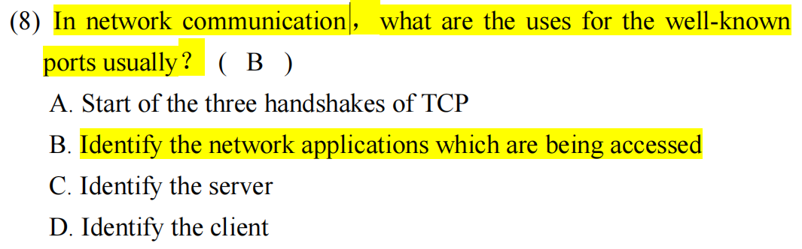这道题考查的是计算机网络中传输层 (Transport Layer) 最核心的寻址机制：端口号 (Port Numbers)，特别是熟知端口号 (Well-known ports) 的作用。

### 🌟 原题解析

题目翻译： (8) 在网络通信中，熟知端口号 (well-known ports) 通常有什么用途？ ( B ) A. 启动 TCP 的三次握手 (Start of the three handshakes of TCP) B. 标识正在被访问的网络应用程序 (Identify the network applications which are being accessed) C. 标识服务器 (Identify the server) D. 标识客户端 (Identify the client)

正确答案：B

解析：

- 为什么选 B？ 在计算机网络中，IP 地址负责把数据包送到正确的主机 (Host)（比如送到你的电脑），但这台电脑上同时运行着几十个程序（微信、浏览器、QQ音乐等）。端口号 (Port Number) 的作用就是复用和分用 (Multiplexing and Demultiplexing)，它负责告诉操作系统：“这个数据包是属于哪个具体的应用程序/进程 (Application/Process) 的”。
- 为什么 C 和 D 错误？ 标识服务器或客户端整台机器的是 IP 地址 (IP Address) 或 MAC 地址 (MAC Address)，而不是端口号。
- 为什么 A 错误？ TCP 三次握手的启动依赖于 TCP 报文头部的控制标志位（如 SYN 标志位），而不是由端口号决定的（尽管握手确实是在特定的端口上进行的）。

### 📚 核心知识点详解 (中英文对照)

为了彻底搞懂端口号，你需要掌握以下几个高频考点，尤其是“IP 与端口的区别”以及“端口的分类”：

#### 1. 经典比喻：大楼与房间号 (The Apartment Building Analogy)

- IP 地址 (IP Address) = 大楼地址 (Building Address)：快递员（路由器）通过 IP 地址找到你家所在的公寓大楼（目的主机）。
- 端口号 (Port Number) = 房间号 (Room Number)：大楼里住着很多人（很多应用程序）。端口号决定了快递最终要送到哪个具体的房间（是给浏览器的，还是给邮件客户端的）。

#### 2. 端口号的分类 (Categories of Port Numbers) - 🌟 必考重点

端口号是一个 16 位的数字，范围从 0 到 65535。它们被严格划分为三大类：

1. 熟知端口号 (Well-known Ports): 0 ~ 1023
	- 用途： 指派给互联网上最常用、最标准的服务/应用程序。通常由服务器端 (Server) 监听。因为它们是全球公认的，所以客户端不需要问就能直接找过去。
	- 考试常考的熟知端口：
		- 80: HTTP (Web 服务)
		- 443: HTTPS (加密 Web 服务)
		- 20(实际传输数据)/21(建): FTP (文件传输)
		- 22: SSH (安全外壳协议，远程登录)
		- 25: SMTP (发邮件)
		- 53: DNS (域名解析)
2. 登记端口号 (Registered Ports): 1024 ~ 49151
	- 用途： 分配给一些特定的、不那么基础的应用程序（比如 MySQL 数据库默认用 3306，Tomcat 默认用 8080）。
3. 动态 / 临时端口号 (Dynamic / Ephemeral Ports): 49152 ~ 65535
	- 用途： 通常由客户端 (Client) 使用。当你的浏览器去访问百度时，操作系统会在这个范围内随机挑一个空闲的端口作为你本地的源端口，通信结束后立刻释放。

总结： 在一次典型的 C/S 通信中，服务器使用固定的“熟知端口”，而客户端使用随机的“临时端口”。

### 📝 考试风格模拟题 (含答案与解析)

*(请先遮挡下方“答案与解析”部分进行自测，题干主要为英文以贴合你的考试需求)*

Question 1: In the TCP/IP protocol suite, which of the following is used to deliver a message to the correct application program running on the destination host? (在 TCP/IP 协议簇中，以下哪项用于将消息传递给目标主机上运行的正确应用程序？) A. IP Address B. MAC Address C. Port Number D. Sequence Number

Question 2: When a web browser (Client) initiates a connection to a standard Web Server to request a webpage, which of the following port configurations is typically true? (当 Web 浏览器（客户端）发起与标准 Web 服务器的连接以请求网页时，以下哪种端口配置通常是正确的？) A. The Client uses port 80 as the source port, and the Server uses port 80 as the destination port. B. The Client uses a dynamically assigned ephemeral port, and the Server listens on well-known port 80. C. Both the Client and the Server use dynamically assigned ephemeral ports. D. The Client uses well-known port 80, and the Server uses a dynamically assigned ephemeral port.

Question 3: Which Transport Layer task is accomplished by using Port Numbers? (使用端口号完成了传输层的哪项任务？) A. Error checking of the packet header. (数据包头部的错误检查。) B. Routing the packet through the Internet. (在互联网中路由数据包。) C. Multiplexing and demultiplexing data from multiple applications. (对来自多个应用程序的数据进行多路复用和多路分解。) D. Controlling the flow of data to prevent receiver buffer overflow. (控制数据流以防止接收方缓冲区溢出。)

👇 答案与解析 (请作答后查看) 👇

Q1 答案：C

- 解析： 这是端口号的标准定义。IP 地址用于定位主机 (Host)，MAC 地址用于局域网内定位物理网卡，而端口号 (Port Number) 用于定位主机内部的具体进程/应用程序 (Application/Process)。

Q2 答案：B

- 解析： 考查客户端与服务器使用端口的差异。提供服务的 Server 必须使用固定的熟知端口 (Well-known port)（Web 服务是 80，HTTPS 是 443），这样别人才能找得到它。而发起请求的 Client 只需要操作系统临时分配一个动态端口 (Ephemeral port) 即可。

Q3 答案：C

- 解析： 考查术语。在发送端，传输层将不同应用的数据块加上对应的端口号封装起来，交往下层，这叫多路复用 (Multiplexing)；在接收端，传输层根据端口号将数据剥离并准确分发给对应的应用进程，这叫多路分解/分用 (Demultiplexing)。A 是校验和的作用，B 是网络层 IP 的作用，D 是流量控制的作用。

*(为了让你更直观地理解端口号是如何在接收端进行“多路分解/分发”的，我为你生成了一个交互式的端口调度模拟器。你可以点击按钮发送不同类型的数据包，观察服务器是如何通过端口号将它们分配给正确的内部程序的。)*

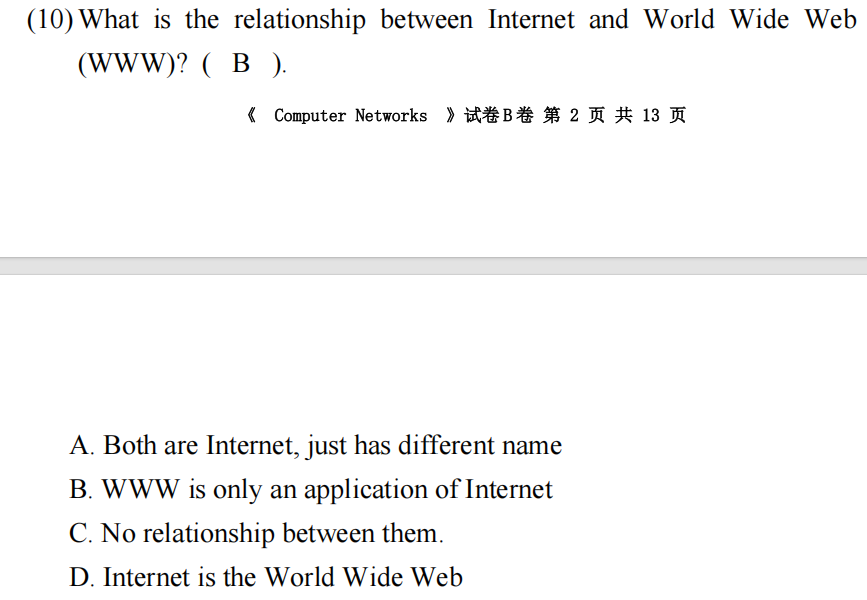

这道题考查的是计算机网络最基础，也是普通人最容易混淆的一个概念：互联网 (Internet) 与 万维网 (World Wide Web / WWW) 之间的本质区别。

在日常生活中，人们经常把“上网”和“刷网页”等同起来，但在计算机网络这门学科中，它们是完全不同的两个层级。

### 🌟 原题解析

题目翻译： (10) 互联网 (Internet) 和万维网 (WWW) 之间是什么关系？ A. 两者都是互联网，只是名字不同 B. WWW 只是互联网的一个应用 (WWW is only an application of Internet) C. 它们之间没有关系 D. 互联网就是万维网

正确答案：B

解析：

- 互联网 (Internet) 是底层的基础设施 (Infrastructure)。它是由全球的电缆、光纤、路由器、交换机以及基础通信协议（TCP/IP）组成的庞大物理和逻辑网络。
- 万维网 (WWW) 只是运行在这个庞大基础设施之上的无数个应用层服务之一 (Application layer service)。除了万维网（网页浏览），互联网上还运行着电子邮件 (Email)、文件传输 (FTP)、在线游戏 (Online Gaming)、即时通讯 (比如微信、WhatsApp 的底层数据传输) 等等。
- 因此，A、D 混淆了概念，C 否定了依赖关系，只有 B 准确指出了它们“平台与应用”的从属关系。

### 📚 核心知识点详解 (中英文对照)

为了彻底记住这个概念，考试中最喜欢用“修路与跑车”的比喻来让你做区分：

#### 1. 互联网 (The Internet) —— “高速公路网”

- 概念： The Internet is a global network of interconnected computer networks. (互联网是一个由相互连接的计算机网络组成的全球性网络。)
- 核心协议： TCP/IP 协议簇。
- 比喻： 互联网就像是国家修筑的高速公路系统。它负责把各个城市（电脑）连接起来，提供基础的铺路和交通管制服务，但公路本身并不关心你在路上运的是什么货。

#### 2. 万维网 (The World Wide Web / WWW) —— “行驶在公路上的物流货车”

- 概念： The Web is an information system where documents and other web resources are identified by URLs. (万维网是一个信息系统，其中的文档和其他网络资源通过 URL 标识。)
- 核心协议： HTTP / HTTPS (超文本传输协议) 和 HTML (超文本标记语言)。
- 比喻： 万维网就像是专门在这条高速公路上跑的某一家快递公司的货车。它利用互联网这条公路把含有文字、图片、视频的“网页包裹”送到你的电脑屏幕上。
- 注意： 高速公路上除了这家公司的货车，还有别的车。比如你用专门的客户端（如 Foxmail 或 Outlook）收发电子邮件时，走的是 SMTP/POP3 协议，这时候你使用了互联网，但完全没有使用万维网。

### 📝 考试风格模拟题 (含答案与解析)

*(请先遮挡下方“答案与解析”部分进行自测，题干主要为英文以贴合你的考试需求)*

Question 1: Which of the following analogies best describes the relationship between the Internet and the World Wide Web? (以下哪个比喻最能描述互联网和万维网之间的关系？) A. The Internet is the hardware (like a smartphone), and the Web is an app running on it (like a browser app). B. The Internet is a website, and the Web is the homepage. C. Both are different names for the exact same software. D. The Web is the physical cable, and the Internet is the data inside it.

Question 2: The Internet relies primarily on the ________ protocol suite for basic data transmission, while the World Wide Web primarily uses the ________ protocol for requesting and transferring web pages. (互联网主要依赖 ________ 协议簇进行基础数据传输，而万维网主要使用 ________ 协议来请求和传输网页。) A. HTTP; TCP/IP B. TCP/IP; HTTP C. FTP; SMTP D. DNS; MAC

Question 3: True or False: When you play a multiplayer online game like "League of Legends" or "Valorant" using a dedicated game client, you are utilizing the Internet, but you are typically NOT using the World Wide Web. (判断题：当你使用专用的游戏客户端玩《英雄联盟》或《无畏契约》等多人在在线游戏时，你正在利用互联网，但通常没有使用万维网。) A. True (正确) B. False (错误)

👇 答案与解析 (请作答后查看) 👇

Q1 答案：A

- 解析： 考查概念辨析。A 选项的比喻非常精准：互联网是底层平台/硬件网络，万维网是跑在上面的一个具体应用 (App)。B、C、D 的说法完全颠倒或混淆了基本概念。

Q2 答案：B

- 解析： 考查协议对应关系。TCP/IP 是 Internet 存活的基石（网络层和传输层）；而 HTTP 是 WWW 能够展示网页的基石（应用层）。选项 A 说反了。

Q3 答案：A (True/正确)

- 解析： 这是老师非常喜欢出的一种陷阱题，用来测试你是否真的懂了。在线游戏客户端有自己专属的应用层通信协议，直接通过 TCP/UDP 传输数据。既然不是用浏览器看网页 (不是 HTTP)，那就与万维网 (WWW) 无关，但它绝对离不开互联网 (Internet) 这个底层通道。

*(为了帮你把“基础设施”和“上层应用”的概念彻底分开，我为你生成了一个结构层级图的可视化部件。你可以点击查看各种应用是如何“骑”在互联网这头大象上的。)*

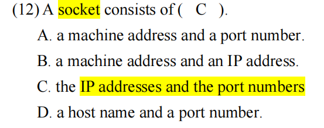

### 核心知识点讲解：套接字 (Socket) 的本质

在网络编程中，套接字 (Socket) 是应用程序与网络协议栈进行交互的“门”或“端点 (Endpoint)”。为了让数据在茫茫互联网中准确无误地从一台电脑的某个软件，传送到另一台电脑的某个软件，系统必须依赖两个维度的坐标：

1. 空间坐标：IP Address (IP 地址)

- 作用： 决定了数据包能找到互联网上的哪一台具体的主机 (Host)。
- 层级： 这是网络层 (Network Layer) 提供的寻址功能。

2. 进程坐标：Port Number (端口号)

- 作用： 数据包到达主机后，决定了把它交给这台电脑上的哪个具体的应用程序/进程 (Application Process)（比如是交给 80 端口的 Web 服务，还是交给微信）。
- 层级： 这是传输层 (Transport Layer) 提供的多路分解 (Demultiplexing) 功能。

💡 核心公式：

$$
\text{Socket Address (套接字地址)} = \text{IP Address} + \text{Port Number}
$$

深入解析选项 C 的复数形式 (IP addresses and port numbers):

注意选项 C 用的是复数。这非常严谨！在面向连接的 TCP 通信中，一个完全建立的连接套接字 (Connected Socket) 是由一个四元组 (4-tuple) 唯一标识的：

1. Source IP (源 IP)

2. Source Port (源端口)

3. Destination IP (目的 IP)

4. Destination Port (目的端口)

	所以，一个完整的套接字连接确实包含了“多个 IP 地址和多个端口号”。

为什么其他选项是错误的？

- A. a machine address and a port number: "Machine address" 通常指代网卡的物理地址，也就是 MAC 地址。MAC 地址只在局域网的链路层 (Data Link Layer) 有效，跨网就不管用了，套接字根本不看 MAC 地址。
- B. a machine address and an IP address: 既没有端口号（找不到具体的软件），又混入了无用的 MAC 地址。
- D. a host name and a port number: "Host name" 指的是域名（比如 `www.google.com`）。在操作系统底层创建套接字时，底层 API 只认纯粹的 IP 数字。如果你输入域名，应用程序必须先调用 DNS 服务把 host name 解析成 IP 地址，然后才能用这个 IP 去创建 Socket。域名本身不能作为套接字的组成部分。

### 辅导测试题（Exam-Style Practice）

针对这个基础概念，考试中经常会玩一些文字游戏。请遮挡答案进行自测：

#### Question 1 (True/False - 概念辨析)

Question: Is the following statement True or False?

"When a programmer creates a network socket in C or Java, they must manually bind it to the computer's MAC address to ensure the data link layer can transmit the frames."

(判断正误：当程序员在 C 或 Java 中创建网络套接字时，他们必须手动将其绑定到计算机的 MAC 地址，以确保数据链路层能够传输帧。)

Answer:

False (错误). *解析：* Sockets operate at the Transport Layer and above. They are defined purely by IP addresses and Port numbers. The operating system's network stack automatically handles the translation from IP addresses to MAC addresses (using ARP) at the Data Link layer. The programmer never deals with MAC addresses when creating sockets. (套接字工作在传输层及以上，仅由 IP 和端口定义。操作系统底层会自动用 ARP 协议把 IP 转换成 MAC 地址，程序员写 Socket 时绝对不需要碰 MAC 地址。)

#### Question 2 (Multiple Choice - 综合应用)

Question: You want to establish a TCP connection to a web server named `api.example.com` listening on the default HTTPS port. Which of the following sequence of actions is required to correctly define the destination socket endpoint?

(你想与一个名为 `api.example.com` 且在默认 HTTPS 端口监听的 Web 服务器建立 TCP 连接。为了正确定义目的套接字端点，需要以下哪一系列操作？)

A. Bind to `api.example.com` and port 80. (绑定到 api.example.com 和端口 80)

B. Perform a DNS query to resolve `api.example.com` to an IP address, then define the socket using that IP address and port 443. (执行 DNS 查询将域名解析为 IP，然后使用该 IP 和端口 443 定义套接字)

C. Broadcast an ARP request to find the MAC address of `api.example.com`, then bind to that MAC and port 443. (广播 ARP 请求找 MAC 地址，然后绑定 MAC 和 443 端口)

D. Define the socket using the IP address of the local DNS server and port 443. (使用本地 DNS 服务器的 IP 和端口 443 定义套接字)

Answer:

B.

*解析：* A socket requires an IP address, not a hostname. Therefore, a DNS resolution must occur first to get the IP. Also, the default port for HTTPS is 443 (HTTP is 80). (套接字需要 IP 而不是主机名，必须先做 DNS 解析。同时 HTTPS 的默认端口是 443。)

#### Question 3 (Short Answer - 回顾提升)

Question:

Based on the definition that a socket connection consists of IP addresses and port numbers, explain briefly how it is possible for you to open 10 different tabs in your web browser, all connecting to the exact same IP address and Port 443 of a web server, without the data getting mixed up.

(基于套接字连接由 IP 地址和端口号组成的定义，简要解释为什么你可以在浏览器中打开 10 个不同的标签页，全部连接到同一个 Web 服务器的同一个 IP 和 443 端口，而数据却不会混淆？)

Answer:

Because each tab (or connection) uses a different Source Port number assigned by your local operating system. While the Destination IP and Destination Port (443) are the same for all 10 tabs, the full 4-tuple (Source IP, Source Port, Destination IP, Destination Port) is unique for each connection. The server and your OS use this unique 4-tuple to demultiplex the data and deliver it to the correct browser tab.

*(解析：这就回到了你第一天问的知识点！因为你的操作系统为每个标签页分配了不同的源端口号。虽然目的 IP 和目的端口 443 都一样，但依靠源端口的不同，构成了 10 个独一无二的 TCP 四元组。操作系统依靠这 10 个不同的完整套接字标识，就能精准地把数据分发到对应的标签页。)*

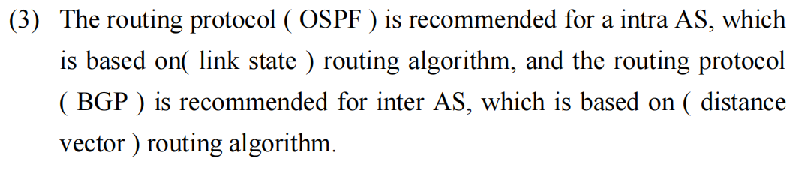

这道题考查的是计算机网络中网络层 (Network Layer) 最核心的宏观架构：自治系统 (Autonomous System, AS) 以及不同层级的路由选择协议 (Routing Protocols) 的分类与底层算法。

首先，针对你原图中填写的答案，我要给出一个非常重要的考试纠错提示：

你填写的 `OSPF`、`intra AS`、`link state`、`BGP` 都是完全正确的。但是，将 BGP 的算法填为 `distance vector` (距离向量) 存在一定的风险。

- 虽然 BGP 的底层思想确实源于距离向量，但在标准的计算机网络学术界和考试中（特别是经典教材如 Kurose 的《计算机网络》），BGP 被严格归类为 Path Vector (路径向量) 算法。为了确保考试不丢分，建议你以后遇到 BGP 算法时，优先填写 Path Vector！

下面为你详细拆解这部分的所有核心知识点。

### 📚 核心知识点详解 (中英文对照)

要搞懂这些协议，我们必须先理解互联网是如何划分“地盘”的。

#### 1. 自治系统 (Autonomous System, AS)

- 概念： 互联网太大了，不可能由一个协议来管理所有的路由器。因此，互联网被划分成了一个个的自治系统 (AS)。一个 AS 通常指的是由单一组织机构（如中国电信、清华大学、谷歌公司）控制的一组网络和路由器。
- 路由的两大阵营： 因为有了 AS 的划分，路由协议也就顺理成章地分成了两大类：对内和对外。

#### 2. 域内路由 vs. 域间路由 (Intra-AS vs. Inter-AS) - 🌟 考试必考对比

| 特性 (Feature) | 域内路由 (Intra-AS / IGP)            | 域间路由 (Inter-AS / EGP)                                |
| ------------------ | ---------------------------------------- | ------------------------------------------------------------ |
| 全称           | Interior Gateway Protocol (内部网关协议) | Exterior Gateway Protocol (外部网关协议)                     |
| 作用范围       | 在同一个 AS 内部寻找路径             | 在不同的 AS 之间寻找路径                                 |
| 核心目标       | 性能 (Performance)：找最快、最短的路 | 策略 (Policy)：根据商业利益决定怎么走（比如不给竞争对手免费转发流量） |
| 代表协议       | OSPF, RIP, IS-IS                     | BGP (目前互联网唯一的标准)                               |

#### 3. 三大核心路由算法 (The Three Routing Algorithms)

这也是填空题和选择题的重灾区：

1. 链路状态算法 (Link State, 简称 LS)
	- 代表协议： OSPF (Open Shortest Path First)
	- 工作原理： 拥有全局视野 (Global view)。每个路由器都会向网络中广播 (Broadcast) 自己的链路状态（我连着谁，带宽是多少）。最终，每个路由器都会拼凑出一张完整的“全网地图”，然后自己使用 Dijkstra 算法计算出到达各个节点的最短路径。
2. 距离向量算法 (Distance Vector, 简称 DV)
	- 代表协议： RIP (Routing Information Protocol)
	- 工作原理： 只有局部视野 (Decentralized view)。路由器只和自己相邻 (Neighbors) 的路由器交换信息。它们交换的是“距离向量表”（即我到达全网各个目的地的跳数预估）。它不知道全网的具体拓扑，只知道“听邻居说往哪走最近”。
3. 路径向量算法 (Path Vector, 简称 PV) —— \*BGP 的专属\*
	- 代表协议： BGP (Border Gateway Protocol)
	- 工作原理： 类似于距离向量，但为了防止互联网出现致命的“路由环路”，它不仅告诉邻居距离，还把完整的路径 (AS-PATH) 一并广播出去（例如：要到目的地 X，必须经过 AS1 -> AS3 -> AS5）。如果接收者发现自己的 AS 号已经在路径列表里了，就会直接丢弃，从而完美防环。

### 📝 考试风格模拟题 (含答案与解析)

*(请先遮挡下方“答案与解析”部分进行自测，题干主要为英文以贴合你的考试需求)*

Question 1:

Which of the following routing protocols uses Dijkstra's algorithm to compute the shortest path and requires every router to have a complete topology of the network?

(以下哪种路由协议使用 Dijkstra 算法计算最短路径，并要求每个路由器拥有网络的完整拓扑结构？)

A. RIP

B. BGP

C. OSPF

D. CSMA/CD

Question 2:

In the context of routing within the Internet, what is the primary difference in objectives between an Intra-AS routing protocol (like OSPF) and an Inter-AS routing protocol (like BGP)?

(在互联网路由的背景下，域内路由协议（如 OSPF）和域间路由协议（如 BGP）在目标上的主要区别是什么？)

A. Intra-AS focuses on scalability, while Inter-AS focuses on routing performance.

B. Intra-AS routing focuses on routing performance (shortest path), while Inter-AS routing heavily emphasizes routing policies (business rules).

C. There is no difference; both aim to find the path with the minimum hop count.

D. Intra-AS relies on TCP, while Inter-AS relies on UDP.

Question 3:

Although BGP behaves similarly to a Distance Vector protocol, it advertises the entire sequence of Autonomous Systems to the destination. Therefore, BGP is strictly classified as a(n) ________ routing protocol.

(虽然 BGP 的行为类似于距离向量协议，但它会向目的地通告完整的自治系统序列。因此，BGP 严格上被归类为 ________ 路由协议。)

A. Link State

B. Path Vector

C. Distance Vector

D. Open Shortest Path

👇 答案与解析 (请作答后查看) 👇

Q1 答案：C

- 解析： 看到 "Dijkstra's algorithm" (迪杰斯特拉算法) 和 "complete topology" (完整拓扑/全局视野)，立刻锁定 Link State (链路状态) 算法。而代表 Link State 算法的核心协议就是 OSPF。RIP 用的是 Bellman-Ford 算法 (DV)。

Q2 答案：B

- 解析： 考查 IGP 和 EGP 的核心设计初衷。在自家地盘内 (Intra-AS)，当然是怎么快怎么来，追求性能 (Performance)；但在国与国、大公司与大公司之间 (Inter-AS)，首要考虑的是商业策略 (Policies)，“我凭什么让你的数据免费走我的光缆？”，所以 BGP 可以配置复杂的策略。

Q3 答案：B

- 解析： 这是对你原题的一个重要补充巩固。BGP 通告的是完整的 AS 序列（AS-PATH），这种防环机制使其区别于传统的 DV，被称为 Path Vector (路径向量) 协议。

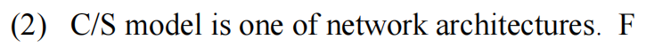

原句：“C/S model is one of network architectures.”（C/S 模型是网络体系结构之一。） 图片中已经给出了答案：F（False，错误）。

下面我为你详细拆解这个“文字游戏”背后的核心考点。

### 核心知识点讲解：应用体系结构 vs. 网络体系结构

在经典的计算机网络教材（如《自顶向下方法》）中，明确区分了两个概念：网络体系结构 (Network Architecture) 和 应用体系结构 (Application Architecture)。它们属于完全不同的层面。

#### 1. 网络体系结构 (Network Architecture)

- 定义： 它指的是将通信过程组织成协议层 (Protocol Layers) 的集合。
- 例子： OSI 七层参考模型、TCP/IP 五层模型。
- 特点： 网络体系结构是由网络设计者（如 IETF 等标准化组织）固定下来的。对于应用程序的开发者来说，网络体系结构是固定的、无法更改的基础设施。

#### 2. 应用体系结构 (Application Architecture)

- 定义： 它指的是应用程序 (Application) 自身在各种端系统（主机）上是如何组织和分布的。
- 例子： 1.  C/S 模型 (Client-Server, 客户机/服务器模型)： 如 Web (HTTP)、电子邮件 (SMTP/POP3)、FTP。有一个永远在线的服务器，和主动发起请求的客户端。 2.  P2P 模型 (Peer-to-Peer, 对等模型)： 如 BitTorrent (BT下载)、Skype。没有或极少依赖中心服务器，任意两个主机（对等方）直接通信。
- 特点： 它是由应用程序开发者设计和决定的。开发者在写代码时，决定这个软件是采用 C/S 还是 P2P。

💡 破题总结： C/S (Client-Server) 是一种 Application Architecture（应用体系结构），而不是 Network Architecture（网络体系结构）。因此，题干的表述是典型的张冠李戴，答案必定为 False。

### 辅导测试题（Exam-Style Practice）

这种概念辨析题通常出现在选择题或判断题的开篇。请遮挡下方答案进行自测：

#### Question 1 (Multiple Choice - 概念归类)

Question: Which of the following is considered an Application Architecture rather than a Network Architecture? (以下哪一项被视为应用体系结构而不是网络体系结构？)

A. The OSI 7-layer model (OSI 七层模型) B. The TCP/IP protocol suite (TCP/IP 协议簇) C. Peer-to-Peer (P2P) model (对等模型) D. CSMA/CD access method (CSMA/CD 访问方法)

Answer: C. *解析：* OSI 和 TCP/IP 属于 Network Architecture（网络分层架构）；CSMA/CD 是链路层的协议/方法；只有 P2P（以及 C/S 模型）属于 Application Architecture，描述的是软件在端系统上的分布式组织形式。

#### Question 2 (True/False - 开发者视角)

Question: Is the following statement True or False? "From the perspective of a software developer creating a new network application, the network architecture is flexible and can be redesigned, while the application architecture is fixed by the operating system." (判断正误：从创建新网络应用程序的软件开发人员的角度来看，网络体系结构是灵活且可以重新设计的，而应用体系结构是由操作系统固定下来的。)

Answer: False (错误). *解析：* 事实恰好完全相反 (Exactly the opposite)。对于应用开发者来说，Network Architecture（底层的 TCP/IP 层级、路由器机制等）是固定的基础设施，开发者无法改变网络是如何路由的；而 Application Architecture（软件是做成 C/S 还是 P2P）是完全灵活的，由开发者自己写代码决定。

#### Question 3 (Short Answer - 模型对比)

Question: Briefly state the main difference between the Client-Server (C/S) architecture and the Peer-to-Peer (P2P) architecture regarding the role of a "Server". (简述 C/S 架构和 P2P 架构在“服务器”角色方面的主要区别。)

Answer: In a Client-Server (C/S) architecture, there is an always-on host, called the server, which services requests from many other hosts, called clients. Clients do not directly communicate with each other. In a Peer-to-Peer (P2P) architecture, there is minimal or no reliance on dedicated servers in data centers. Instead, direct communication occurs between pairs of intermittently connected hosts, called peers (which act as both clients and servers simultaneously). *(解析：在 C/S 架构中，存在一个永远在线的中心服务器来响应客户端请求，客户端之间不直接通信。在 P2P 架构中，基本不依赖专用服务器，而是由普通主机（对等方）直接相互通信，每个对等方既是客户端也是服务器。)*

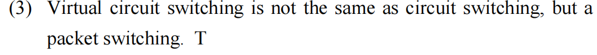

### 关于虚拟电路交换 (Virtual Circuit Switching)

图片内容： "Virtual circuit switching is not the same as circuit switching, but a [type of] packet switching." (虚电路交换与电路交换不同，但属于分组交换。)

讲解： 这是一个正确（True）的表述。

- 电路交换 (Circuit Switching)： 是一种物理层面的资源预留机制。在通信开始前，必须建立一条专用的、独占的物理路径。就像老式电话网，一旦连通，这段物理线路完全被这两个用户占用，别人用不了。
- 分组交换 (Packet Switching)： 数据被切分成小块（分组/Packet），独立在网络中传输。
- 虚电路交换 (Virtual Circuit Switching)： 这是一种“混合”思想。它在形式上模仿电路交换（通信前需要建立连接，后续的数据包沿同一条“虚电路”路径传输），但在本质上它仍是分组交换。因为它不需要像传统电路交换那样独占物理链路带宽，只是在逻辑上分配了路径标识（VCID），其物理链路依然可以被其他数据包共享。

💡 考试风格题目： Question: Why is Virtual Circuit (VC) switching considered a form of packet switching rather than circuit switching? (为什么虚电路交换被视为分组交换的一种形式，而不是电路交换？)

Answer: Because in VC switching, packets are still transmitted individually and share the physical transmission links statistically with other packets. It does not require dedicated physical channel bandwidth (like traditional circuit switching), but rather uses logical path identifiers (VCIDs) in packet headers to route packets along a pre-established logical path.

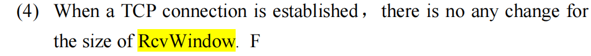

题目翻译： (4) 当 TCP 连接建立后，`RcvWindow` (接收窗口) 的大小不会有任何变化。

正确答案：错误 (False)

解析： TCP 的 流量控制 (Flow Control) 正是通过动态调整 `RcvWindow` 的大小来实现的。

- 在 TCP 报文头部中，接收方会在每一个发送给发送方的确认包 (ACK) 中，包含一个 `Receive Window` 字段。
- 这个字段的值会根据接收方应用程序读取数据的速度实时变化：
	- 如果接收方处理能力强，读取数据很快，缓冲区空闲空间多，它会告诉发送方：“我的窗口还很大，你可以发快一点 (增大 `RcvWindow`)”。
	- 如果接收方处理不过来，缓冲区快满了，它会告诉发送方：“我的窗口快满了，请慢点发 (减小 `RcvWindow`)”。
- 因此，`RcvWindow` 是一个动态值 (Dynamic value)，它在整个连接生命周期内会不断根据接收端的缓存状态进行调整。

### 📚 核心知识点详解 (中英文对照)

#### 1. 接收窗口 (Receive Window, `rwnd`) 的含义

- `RcvWindow` 代表接收方当前能够容纳的未确认数据量。
- 计算公式： `RcvWindow = RcvBuffer - [LastByteRcvd - LastByteRead]`
	- `RcvBuffer`: 接收方的缓存总量。
	- `LastByteRcvd - LastByteRead`: 已经收到但还没被应用程序读取的数据量（即已经在缓冲区里“排队”的数据）。
- 只要应用程序读取数据的速度发生波动，上述公式的结果就会变，进而导致 `RcvWindow` 的数值发生变化。

#### 2. 流量控制的目标 (Objective of Flow Control)

- 防止发送方发送数据的速度超过了接收方处理的速度，即 "Overwhelming the receiver"（压垮接收方）。
- 这是一个端到端 (End-to-End) 的调节机制，与另一大机制——拥塞控制 (Congestion Control，关注网络中间路由器的过载) 形成鲜明对比。

### 📝 考试风格模拟题 (自测)

Question: Which of the following statements about the TCP Receive Window (`RcvWindow`) is true? (关于 TCP 接收窗口的以下哪项陈述是正确的？) A. It is a fixed value negotiated only during the initial TCP 3-way handshake. B. It is used to prevent the network routers from becoming congested. C. It allows the receiver to inform the sender of how much free buffer space is currently available. D. It is determined solely by the sender's current transmission speed.

答案解析：

- 正确答案：C
- 解析：
	- A 错误：它不是固定值，而是随着接收缓冲区剩余空间的动态变化而实时更新的。
	- B 错误：防止网络拥塞是拥塞控制 (Congestion Control) 的职责，`RcvWindow` 只负责防止接收端缓存溢出 (Flow Control)。
	- D 错误：它是接收端根据自己的缓存状态计算出来的，不是由发送方的速度决定的。


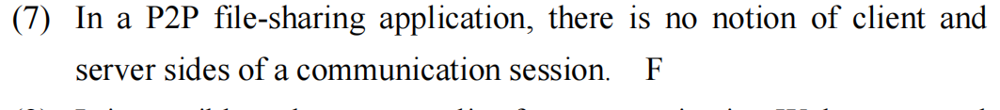

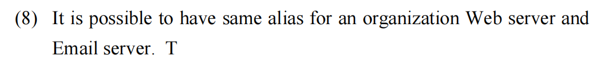

### 2. DNS 别名 (DNS Alias / CNAME)

图片内容： "It is possible to have same alias for an organization Web server and Email server."

结论： 这句话是 TRUE（正确） 的。

详细讲解： 在 DNS (Domain Name System) 中，我们使用 CNAME (Canonical Name) 记录来创建别名。

- CNAME 记录的作用： 它允许你为一个主机名定义一个别名。
- 可能性： 是的，你可以为 Web 服务器和 Email 服务器设置相同的别名（例如 `example.com`），只要这两个 DNS 记录最终解析到的 A 记录 (Address record) 指向的是不同的 IP 地址，或者它们在 DNS 解析路径上被正确配置即可。
- 实际应用： 这种技术在负载均衡（Load Balancing）或服务迁移中非常有用。例如，你可以在 DNS 中将 `www.example.com` 和 `mail.example.com` 都作为一个别名，指向不同的底层物理服务器。虽然平时很少故意设成完全一样（因为解析逻辑会冲突），但在技术层面上，通过不同的查询类型（如 MX 记录用于邮件，A 记录用于 Web），完全可以实现逻辑上的“重名”。

#### Q2: DNS 别名

Question: What is the specific DNS record type used to create an alias, and how does it differ from an A record? (创建别名使用的是哪种具体的 DNS 记录类型？它与 A 记录有什么区别？)

Answer (点击查看):

> It is the CNAME (Canonical Name) record. A CNAME record points an alias (e.g., `alias.example.com`) to a canonical hostname (e.g., `real-server.example.com`). An A record maps a hostname directly to an IP address.

如果你觉得讲解透彻，我们可以继续下一道题；如果有任何地方需要再详细说明，请随时告诉我。你需要再输出一次详细讲解吗？

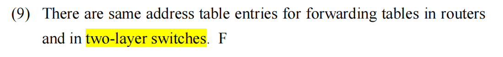

考查的是计算机网络中二层交换机 (Layer 2 Switches) 与 路由器 (Routers) 的核心区别，特别是它们如何进行数据转发。

### 🌟 原题解析

题目翻译： (9) 路由器的转发表和二层交换机的地址表条目是相同的。

正确答案：错误 (False)

解析： 二者在工作层次 (Layer)、寻址方式 (Addressing) 和 表项内容 (Table Contents) 上有着本质的区别：

- 二层交换机 (Layer 2 Switch):
	- 工作层次： 数据链路层 (Data Link Layer)。
	- 地址表： 被称为 MAC 地址表 (MAC Address Table) 或交换表。
	- 表项内容： 它记录的是 MAC 地址 与 交换机物理端口 (Port) 的映射关系。例如：`MAC地址 AA:BB:CC:DD:EE:FF -> 端口 3`。它不关心 IP 地址，只负责把帧转发到正确的物理接口。
- 路由器 (Router):
	- 工作层次： 网络层 (Network Layer)。
	- 转发表： 被称为 路由表 (Routing Table)。
	- 表项内容： 它记录的是 目的网络地址 (Destination IP Prefix / Subnet) 与 下一跳 (Next Hop) 的映射关系。例如：`192.168.1.0/24 -> 10.0.0.1`。它记录的是“去往某个网段该走哪条路”，而不是记录某台设备的物理 MAC 地址。

### 📚 核心知识点详解 (中英文对照)

为了彻底理解两者的区别，我们可以通过以下维度进行对比：

| 特性 (Feature) | 二层交换机 (Layer 2 Switch)                   | 路由器 (Router)                                    |
| ------------------ | ------------------------------------------------- | ------------------------------------------------------ |
| 参考模型层次   | Data Link Layer (Layer 2)                         | Network Layer (Layer 3)                                |
| 识别标识       | MAC Address (物理地址)                            | IP Address (逻辑地址)                                  |
| 转发决策依据   | 根据目标 MAC 地址转发数据帧 (Frame)               | 根据目标 IP 地址转发数据分组 (Packet)                  |
| 工作原理       | 自学习 (Self-learning)：通过观察源 MAC 地址构建表 | 路由协议 (Routing Protocols)：通过 OSPF/BGP 等计算路径 |
| 广播处理       | 转发广播帧到除入端口外的所有端口                  | 隔离广播域，默认不转发广播包                       |

### 📝 考试风格模拟题 (自测)

Question: Which of the following best describes the entry in a Layer 2 switch's address table? (以下哪项最能描述二层交换机地址表中的条目？) A. A mapping of a destination network IP address to a router interface. B. A mapping of a destination MAC address to a specific physical switch port. C. A list of all available routes to an external network. D. An association between an application port number and a process ID.

答案解析：

- 正确答案：B
- 解析：
	- A 是路由器路由表的描述。
	- B 是二层交换机 MAC 地址表的定义，它是实现局域网内设备高效通信的基础。
	- C 是路由表的描述。
	- D 描述的是传输层端口的概念，与交换机无关。

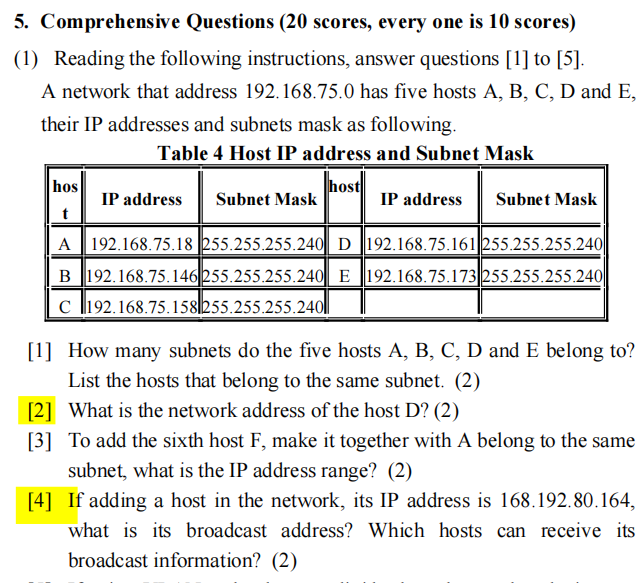

IPv4 子网划分 (Subnetting)。

你高亮了第 [2] 和 [4] 问，我将先为你详细解答这两道题的计算过程，然后把这背后“一通百通”的核心知识点和速算技巧交给你，最后提供模拟题自测。

### 🌟 原题解析

所有主机都使用了相同的子网掩码 (Subnet Mask)：`255.255.255.240`。

在做任何题之前，我们先破译这个掩码：

- 二进制转换： `255.255.255.240` 对应的二进制是 `11111111.11111111.11111111.11110000`。

- 网络位与主机位： 前 28 位是 1（网络位），后 4 位是 0（主机位）。这也就是常说的 `/28` 前缀。

- 步长 / 块大小 (Block Size) 速算技巧： 魔法数字 = `256 - 最后一位非零掩码`。在这里，步长 = `256 - 240 = 16`。

	这意味着子网的网络号是 16 的倍数：`.0, .16, .32, .48 ... 144, 160, 176...`

#### 解答第 [2] 问

题目翻译： 主机 D 的网络地址 (network address) 是什么？

已知： 主机 D 的 IP 是 `192.168.75.161`。

速算解答：

看最后一个数字 `161`。根据我们上面算出的步长（16 的倍数），找到刚好小于等于 161 的 16 的倍数。

很明显，$16 \times 10 = 160$。

所以，161 落在 `.160` 到 `.175` 这个区间内。

- 网络地址 (Network Address)： 是区间的第一个地址，即 `192.168.75.160`。

*(标准的计算机原理计算法：将 IP `161` 和 掩码 `240` 转换为二进制，做“按位与 / Bitwise AND”运算，结果也是 160。但考试时用步长法最快。)*

#### 解答第 [4] 问 (⚠️ 注意题目陷阱/笔误)

题目翻译： 如果在网络中增加一台主机，其 IP 地址为 `168.192.80.164`，它的广播地址 (broadcast address) 是什么？哪些主机能收到它的广播信息？

这道题极有可能存在出题人的笔误 (Typo)！ 前面的基准网络是 `192.168.75.0`，这里突然变成了 `168.192.80.164`。在正规考试中，我们需要分两种情况严谨作答：

- 情况一：将错就错（按照字面意思计算）
	- IP 地址：`168.192.80.164`，掩码 `255.255.255.240`（假设掩码相同）。
	- 步长仍是 16。数字 `164` 落在 `.160` 到 `.175` 之间。
	- 广播地址： 区间的最后一个地址，即 `168.192.80.175`。
	- 谁能收到： 只有在同一个子网内的主机才能收到广播。A、B、C、D、E 的网络前缀都是 `192.168.75`，完全不在一个网络。因此，没有任何现有主机 (None of the existing hosts) 能收到。
- 情况二：假设是出题人笔误（还原为 `192.168.75.164`）—— 推荐在试卷上补充写明此情况
	- IP 地址修正为：`192.168.75.164`。
	- 数字 `164` 落在 `.160` 到 `.175` 的子网中。
	- 广播地址： `192.168.75.175`。
	- 谁能收到： 查表发现，主机 D (161) 和 主机 E (173) 都落在 `.160` ~ `.175` 这个区间内，说明它们和新主机在同一个子网。因此，主机 D 和 E (Hosts D and E) 可以收到它的广播。

### 📚 核心知识点详解 (中英文对照)

只要掌握了 IPv4 地址的三个“边界”，所有子网划分题目都是送分题：

#### 1. 网络地址 (Network Address) —— “网段的起点”

- 概念： 代表整个子网的标识，不能分配给具体的电脑。
- 特征： 主机位 (Host bits) 全部为 0。
- 计算： IP Address `AND` Subnet Mask。
- *类比：* 就像一条街道的名字（比如“北京路 0号”），指代整条街。

#### 2. 广播地址 (Broadcast Address) —— “网段的终点”

- 概念： 用于向该子网内所有设备同时发送数据的特殊地址，也不能分配给电脑。
- 特征： 主机位 (Host bits) 全部为 1。
- 计算： 下一个子网的网络地址减 1。
- *类比：* 就像大喇叭，你往这个地址发消息，这条街上的所有人都会收到。

#### 3. 有效主机地址范围 (Usable Host Range) —— “可以住人的房子”

- 概念： 可以真正分配给电脑、路由器接口的 IP 地址。
- 范围： `Network Address + 1` 到 `Broadcast Address - 1`。
- *本题举例：* 对于 `.160` 子网，可用范围是 `.161` 到 `.174`（共 14 个地址）。

#### 4. 判断是否同网段 (Determining Same Subnet)

- 如果两台电脑的“IP地址与掩码做 AND 运算”得出的网络地址完全相同，它们就在同一个局域网，可以直接通信（发送广播也能互相收到）。否则就需要通过路由器。

### 📝 考试风格模拟题 (含答案与解析)

*(请先遮挡下方“答案与解析”部分进行自测)*

Question 1:

Given a host with IP address `192.168.10.75` and subnet mask `255.255.255.224`, what is the network address of this host?

(已知一台主机的 IP 地址为 192.168.10.75，子网掩码为 255.255.255.224，该主机的网络地址是什么？)

A. 192.168.10.0

B. 192.168.10.64

C. 192.168.10.72

D. 192.168.10.95

Question 2:

Based on the same IP and Mask from Question 1 (`192.168.10.75` / `255.255.255.224`), what is the directed broadcast address for this subnet?

(基于第一题相同的 IP 和掩码，该子网的定向广播地址是什么？)

A. 192.168.10.255

B. 192.168.10.127

C. 192.168.10.95

D. 192.168.10.79

Question 3:

Host X is `10.1.1.50/26` and Host Y is `10.1.1.70/26`. Are they on the same subnet?

(主机 X 为 10.1.1.50，掩码前缀为 /26。主机 Y 为 10.1.1.70/26。它们在同一个子网吗？)

A. Yes, they are on the same subnet.

B. No, they are on different subnets.

👇 答案与解析 (请作答后查看) 👇

Q1 答案：B

- 解析： 使用步长法。掩码 `224` 意味着步长 = `256 - 224 = 32`。网络号是 32 的倍数：`.0, .32, .64, .96`。数字 `75` 落在 `.64` 到 `.95` 之间。所以网络地址是 `192.168.10.64`。

Q2 答案：C

- 解析： 既然子网范围是 `.64` 到下一个起点 `.96` 之前，那么这个子网的最后一个地址（即广播地址）就是 `.96 - 1 = .95`。所以广播地址是 `192.168.10.95`。A 选项是全网广播，不是该子网的定向广播。

Q3 答案：B

- 解析： `/26` 对应的掩码是 `255.255.255.192` (因为 128+64=192)。步长 = `256 - 192 = 64`。

	子网划分情况：`.0 ~ .63`，`.64 ~ .127`。

	主机 X (50) 属于 `.0` 子网；主机 Y (70) 属于 `.64` 子网。网络地址不同，不在同一个子网。

### 🌟 第 [3] 问详细解析

题目翻译： [3] 为了增加第六台主机 F，使其与主机 A 属于同一个子网 (belong to the same subnet)，它的 IP 地址范围 (IP address range) 是什么？

正确答案： `192.168.75.17` 到 `192.168.75.30`

计算步骤拆解：

第一步：确定主机 A 所在的子网

- 已知： 主机 A 的 IP 是 `192.168.75.18`，掩码依然是统一的 `255.255.255.240`。
- 计算步长： `256 - 240 = 16`。
- 锁定区间： 子网的网络号是 16 的倍数（0, 16, 32, 48...）。数字 `18` 刚好落在以 `16` 为起点，到 `31` 为终点（因为下一个起点是 32）的区间内。
- 得出边界：
	- 网络地址 (Network Address): `192.168.75.16`
	- 广播地址 (Broadcast Address): `192.168.75.31`

第二步：计算可用 IP 地址范围 (Usable Range)

- 在任何一个子网中，网络地址（第一个 IP） 和 广播地址（最后一个 IP） 都是保留的，不能分配给具体的主机（电脑）。
- 可用范围公式： `网络地址 + 1` 到 `广播地址 - 1`。
- 计算得出： 也就是 `.16 + 1` 到 `.31 - 1`，即 `192.168.75.17` 到 `192.168.75.30`。

结论： 要想让新主机 F 和 A 处于同一个局域网（无需经过路由器就能互相通信），主机 F 的 IP 地址必须在这个范围内分配（当然，实际配置时需要避开已经被主机 A 占用的 `.18`）。但在考试写答案时，直接写出该子网的完整可用范围 `192.168.75.17 ~ 192.168.75.30` 即可拿满分。

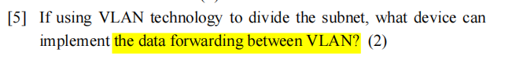

VLAN 间通信（Inter-VLAN Routing）。

这句话的原文意思是：“如果使用 VLAN 技术划分了子网，什么设备可以实现 VLAN 之间的数据转发？”

直接给出标准答案： 可以实现 VLAN 间数据转发的设备是 Router（路由器） 或 Layer 3 Switch（三层交换机）。

下面我为你详细拆解这个考点，彻底讲透为什么需要它们，以及它们是如何工作的。

### 核心知识点讲解：VLAN 与 VLAN 间路由 (Inter-VLAN Routing)

1. 为什么 VLAN 之间不能直接通信？(The Isolation Problem)

- VLAN 的本质： VLAN（Virtual Local Area Network，虚拟局域网）工作在 数据链路层 (Layer 2)。它的主要作用是将一个大的物理网络在逻辑上划分为多个小的广播域 (Broadcast Domains)。
- 隔离特性： 默认情况下，处于不同 VLAN 的设备就像处于不同的物理网络中一样。一个纯粹的 二层交换机 (Layer 2 Switch) 只能在同一个 VLAN 内部转发数据帧（基于 MAC 地址），绝对无法将数据帧从一个 VLAN 跨越转发到另一个 VLAN。

2. 如何打破隔离？引入网络层 (Layer 3 comes to the rescue)

- 既然不同的 VLAN 相当于不同的子网 (Subnets)，那么要在不同子网之间传数据，就必须跨越数据链路层，上升到 网络层 (Network Layer, Layer 3)。
- 网络层的核心功能就是路由 (Routing)。因此，实现 VLAN 间通信，必须引入具备路由功能的 Layer 3 设备。

3. 两种主流的实现设备/方案 (The Solutions)

- 设备一：Router (路由器) —— 经典方案（单臂路由 Router-on-a-Stick）
	- 原理： 使用一根物理网线将二层交换机连接到路由器的某个接口。在这个物理接口上，配置多个子接口 (Sub-interfaces)（例如 `g0/0.10` 和 `g0/0.20`），每个子接口对应一个 VLAN 的网关 IP。
	- Trunk 链路： 交换机和路由器之间的这条链路必须配置为 Trunk link（并使用 802.1Q 协议打标签），这样不同 VLAN 的数据就能在这根线上复用传输。
- 设备二：Layer 3 Switch (三层交换机) —— 现代/高效方案
	- 原理： 三层交换机相当于把“二层交换机”和“路由器”塞进了同一个物理盒子里。它内部有一个路由引擎 (Routing Engine)。
	- SVI (Switch Virtual Interface)： 管理员可以在三层交换机内部为每个 VLAN 创建一个虚拟的路由接口（SVI，例如 `interface vlan 10`），充当该 VLAN 的网关。数据在交换机内部直接通过硬件芯片完成高速的路由转发，速度远快于传统的“单臂路由”。

💡 考试踩分点： 如果题目只留了一个空，填 Router 绝对没错。如果可以写得更详细，写 Layer 3 Switch (or Router) 是最完美的答案，因为现代企业网络中 VLAN 间路由几乎全部由三层交换机完成。

### 辅导测试题（Exam-Style Practice）

这部分知识点在考试中经常以选择题、判断题或网络拓扑分析题的形式出现。请遮挡下方答案进行自测：

#### Question 1 (Multiple Choice - 核心设备识别)

Question: Two computers are connected to the same Layer 2 switch, but they are configured in different VLANs (VLAN 10 and VLAN 20). Which of the following devices is strictly required to allow these two computers to ping each other? (两台计算机连接到同一台二层交换机，但它们被配置在不同的 VLAN（VLAN 10 和 VLAN 20）中。为了让这两台计算机能够互相 ping 通，严格需要以下哪种设备？)

A. A Hub (集线器) B. Another Layer 2 Switch (另一台二层交换机) C. A Router or Layer 3 Switch (路由器或三层交换机) D. A Bridge (网桥)

Answer: C. *解析：* Different VLANs mean different broadcast domains and different IP subnets. A pure Layer 2 switch cannot forward traffic between them. A Layer 3 device (Router or L3 Switch) is required to perform Inter-VLAN routing. (不同的 VLAN 意味着不同的广播域和子网。纯二层设备无法在它们之间转发。必须需要三层设备进行 VLAN 间路由。)

#### Question 2 (True/False - 概念辨析)

Question: Is the following statement True or False? "A standard Layer 2 switch can route packets between different VLANs as long as the ports are configured as Trunk ports." (判断正误：标准的二层交换机可以在不同 VLAN 之间路由数据包，只要将端口配置为 Trunk 端口即可。)

Answer: False (错误). *解析：* A standard Layer 2 switch never routes packets based on IP addresses; it only switches frames based on MAC addresses within the *same* VLAN. A Trunk port merely allows traffic from *multiple* VLANs to pass over a single link by adding 802.1Q tags; it does *not* route traffic between them. You still need a Layer 3 device at the other end of that Trunk link. (二层交换机绝对不会基于 IP 进行路由。Trunk 端口的作用仅仅是给数据帧打上 802.1Q 标签，让多个 VLAN 的数据能在同一根线上跑，但绝不会在 VLAN 之间跨界转发数据。)

#### Question 3 (Short Answer/Interview - 经典架构)

Question: Briefly describe the concept of "Router-on-a-Stick" used for Inter-VLAN routing. (简要描述用于 VLAN 间路由的“单臂路由”概念。)

Answer: "Router-on-a-Stick" is a configuration where a single physical interface on a Router is connected to a switch via a Trunk link (802.1Q). This single physical interface is logically divided into multiple sub-interfaces, each assigned an IP address acting as the default gateway for a specific VLAN. It allows a single router to route traffic between multiple VLANs over one physical wire. *(解析：单臂路由是指将路由器的一个物理接口通过 Trunk 链路连接到交换机。这个物理接口被逻辑划分为多个“子接口”，每个子接口配置一个 IP 作为某个 VLAN 的网关。这样就能用一根物理网线实现多个 VLAN 的互通。)*

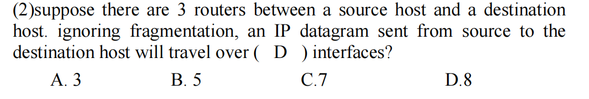


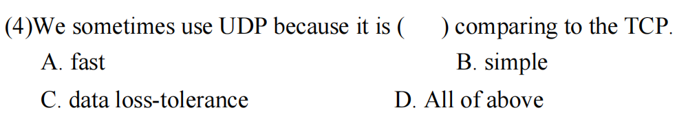

D

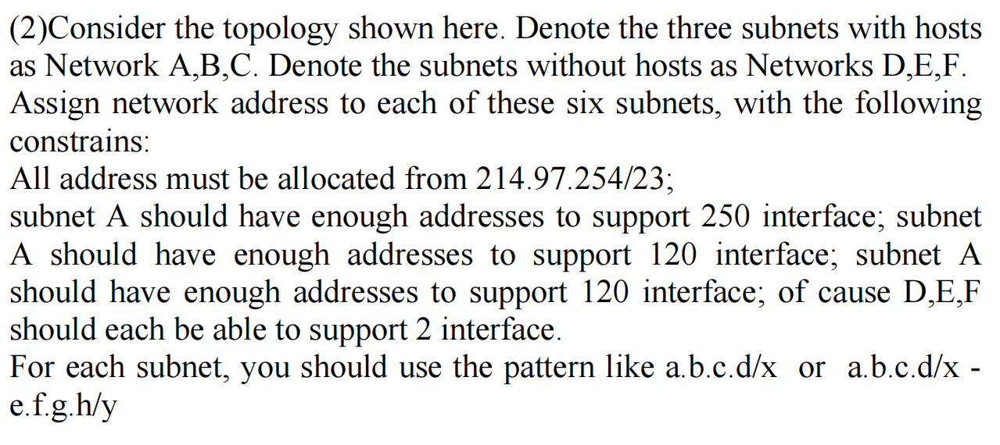

这张图片（题号为 2）是一道非常经典的综合性 VLSM（可变长子网掩码，Variable Length Subnet Masking） 大题。这种题目通常是期末考试的压轴计算题。

🔥 高能预警（Exam Alert）：这道原题存在两处明显的错误（其中一处是致命的数学错误）！

在考试中遇到这种题，如果你能指出题目本身的错误，说明你已经完全吃透了知识点。下面我为你详细拆解这道题的陷阱，并教你如何用标准的流程来解答它。

### 第一部分：揪出原题的错误 (Identifying the Errors)

当你仔细阅读原题干时，你会发现两个问题：

1. 笔误 (Typo)：

题干连续写了三次 "subnet A should have..."。结合上下文“Network A, B, C 有主机”，这显然是老师出题时的复制粘贴错误。正确的理解应该是：

- Subnet A 需求: 250 个接口
- Subnet B 需求: 120 个接口
- Subnet C 需求: 120 个接口

2. 致命的数学溢出错误 (Fatal Mathematical Error)：

我们要从 `214.97.254.0/23` 这个大网段中分配地址。

- 总容量： 一个 `/23` 的网段拥有 $32 - 23 = 9$ 个主机位。总 IP 数量是 $2^9 = \mathbf{512}$ 个。
- 需求计算（根据公式 $2^n - 2 \ge \text{需求}$）：
	- Subnet A (250): 需要 $2^8 = 256$ 个地址（掩码 /24）
	- Subnet B (120): 需要 $2^7 = 128$ 个地址（掩码 /25）
	- Subnet C (120): 需要 $2^7 = 128$ 个地址（掩码 /25）
	- D, E, F (各 2): 路由器间的点对点链路，各需要 $2^2 = 4$ 个地址（掩码 /30），共 $3 \times 4 = 12$ 个地址。
- 矛盾点： 仅仅分配 A、B、C 三个子网，就已经消耗了 $256 + 128 + 128 = \mathbf{512}$ 个地址。整个 `/23` 的地址池已经完全耗尽，根本没有空间留给 D、E、F！总需求 (524) > 总容量 (512)。

### 第二部分：标准的 VLSM 解题流程 (Standard Solution Process)

为了让你掌握解题方法，我们假设 Subnet C 的需求是 60 个接口（这是考试中非常常见的数字，这样就能完美分得下）。

修正后的需求： A(250), B(120), C(60), D(2), E(2), F(2)。

基础网段： `214.97.254.0/23` (范围是 214.97.254.0 到 214.97.255.255)

黄金法则：永远按需求从大到小分配 (Largest First)!

Step 1: 分配 Subnet A (需求 250)

- 需要 $n=8$ 个主机位 ($2^8 - 2 = 254 \ge 250$)。
- 占用大小：256。新掩码：$32 - 8 = \mathbf{/24}$。
- 分配网段：`214.97.254.0/24` （范围：.254.0 到 .254.255）

Step 2: 分配 Subnet B (需求 120)

- 紧接着上一个网段，起始地址为 `214.97.255.0`。
- 需要 $n=7$ 个主机位 ($2^7 - 2 = 126 \ge 120$)。
- 占用大小：128。新掩码：$32 - 7 = \mathbf{/25}$。
- 分配网段：`214.97.255.0/25` （范围：.255.0 到 .255.127）

Step 3: 分配 Subnet C (假设需求 60)

- 起始地址为 `214.97.255.128`。
- 需要 $n=6$ 个主机位 ($2^6 - 2 = 62 \ge 60$)。
- 占用大小：64。新掩码：$32 - 6 = \mathbf{/26}$。
- 分配网段：`214.97.255.128/26` （范围：.255.128 到 .255.191）

Step 4: 分配 D, E, F (需求各为 2 - 路由器点对点链路)

- 需要 $n=2$ 个主机位 ($2^2 - 2 = 2 \ge 2$)。
- 占用大小：4。新掩码：$32 - 2 = \mathbf{/30}$。（/30 是点对点链路的标准答案）
- 分配 Subnet D：`214.97.255.192/30` (范围：.192 到 .195)
- 分配 Subnet E：`214.97.255.196/30` (范围：.196 到 .199)
- 分配 Subnet F：`214.97.255.200/30` (范围：.200 到 .203)

*(注：如果在真实考场上遇到这种无解的错题，建议在试卷上写明推导过程，指出 524 > 512 的矛盾，然后仅完成 A、B、C 的分配以展示你的计算能力。)*

### 辅导测试题（Exam-Style Practice）

针对 VLSM 的核心套路，请遮挡答案尝试解答以下两道题：

#### Question 1 (Short Answer - 核心原理)

Question: In the context of connecting two routers directly together (like subnets D, E, and F in the problem), why is a `/30` subnet mask universally used instead of a `/31` or `/24`?

(在将两台路由器直接连接在一起的场景中（如题目中的子网 D、E、F），为什么普遍使用 `/30` 子网掩码而不是 `/31` 或 `/24`？)

Answer:

A `/30` mask leaves exactly 2 host bits, providing $2^2 = 4$ total IP addresses. Since 1 is reserved for the Network Address and 1 for the Broadcast Address, it leaves exactly 2 usable IP addresses ($4 - 2 = 2$). This perfectly matches the requirement of a point-to-point link between two routers, ensuring zero wasted IP addresses. A `/24` would waste 252 addresses, and a traditional `/31` leaves $2^1 - 2 = 0$ usable addresses (though modern RFCs allow /31 for P2P, /30 remains the standard textbook answer).

*(解析：/30 刚好提供 4 个地址，减去网络号和广播号，剩下刚好 2 个可用地址，完美匹配两台路由器直连的需求，一点都不浪费。)*

#### Question 2 (Calculation - 边界值计算)

Question: Given the IP address `214.97.255.0/25` (Subnet B from our corrected calculation), what is the specific Broadcast Address for this subnet?

(给定 IP 地址 `214.97.255.0/25`（我们修正计算中的子网 B），该子网具体的广播地址是什么？)

A. 214.97.255.255

B. 214.97.255.128

C. 214.97.255.127

D. 214.97.254.255

Answer:

C.

*解析：* The subnet mask is `/25`, meaning the block size is $2^{32-25} = 2^7 = 128$. The network starts at `214.97.255.0`. The 128 addresses span from `.0` to `.127`. The last address in this range is the broadcast address, which is `214.97.255.127`. (子网大小是 128。从 0 开始算 128 个数字，范围是 0 到 127。最后一个数字 127 就是广播地址。)

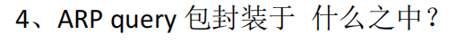

这道题考察的是网络协议栈中极其核心的数据封装（Encapsulation）细节，也是考试中最容易踩坑的“陷阱题”。

直接给出标准答案：ARP query 包封装于链路层帧（通常是以太网帧 / Ethernet Frame）的数据部分之中。

下面我为你详细拆解这个考点，告诉你为什么它是这样设计的，以及考试通常会怎么变着法子考。

### 核心知识点讲解：为什么 ARP 直接封装在二层帧里？

这是一个很容易让人迷惑的地方：ARP（地址解析协议）通常被划分为网络层（Layer 3）或介质访问控制子层之上的协议，它的主要工作是为 IP 协议服务的（把 IP 地址解析为 MAC 地址）。那为什么它不封装在 IP 数据报里呢？

1. 破解“死循环”悖论

想象一下你要发快递给小明，但你只知道小明的身份证号（IP 地址），不知道他的物理门牌号（MAC 地址）。

- 寄快递（发送 IP 数据报）的前提是，你必须在包裹最外层写上物理门牌号（封装成以太网帧）。
- ARP 的任务就是去局域网里大喊：“谁的身份证号是 xxx，请把门牌号告诉我！”
- 如果你把这句大喊（ARP Query）塞进一个标准的 IP 快递包裹里，这个包裹因为没有门牌号，根本寄不出你的家门！
- 因此，ARP 报文不能封装在 IP 数据报中，它必须直接封装在底层的以太网帧里。

2. ARP Query 的帧长什么样？ (The Broadcast Frame)

当 ARP 查询包被封装进以太网帧时，它的头部非常有特点，这也是必考点：

- 源 MAC 地址 (Source MAC)： 发送方自己的物理 MAC 地址。
- 目的 MAC 地址 (Destination MAC)： `FF:FF:FF:FF:FF:FF`（全 1 的广播地址）。因为不知道目标是谁，所以要在整个局域网内广播（Broadcast）。
- 帧类型 (EtherType)： `0x0806`。这个特殊标记告诉接收方的网卡：“这不是一个普通的 IP 数据包，这是一个 ARP 报文，请交给 ARP 进程处理。”

### 辅导测试题（Exam-Style Practice）

关于 ARP 的封装和广播机制，试卷上经常会出以下变体题。请遮挡答案自行测验：

#### Question 1 (Multiple Choice - 封装细节)

Question: An ARP protocol data unit (PDU) is encapsulated directly into a:

(ARP 协议数据单元（PDU）直接封装在：)

A. TCP segment (TCP 报文段)

B. UDP datagram (UDP 数据报)

C. IP datagram (IP 数据报)

D. Data link layer frame (数据链路层帧)

Answer:

D.

*解析：* 就像我们刚刚分析的，ARP 直接封装在数据链路层帧（如以太网帧）的有效载荷（Payload）中，它不使用 IP 协议进行封装。

#### Question 2 (True/False - Query 与 Reply 的区别)

Question: Is the following statement True or False?

"Both the ARP query message and the ARP reply message are sent to the Ethernet broadcast address (FF:FF:FF:FF:FF:FF)."

(判断正误：ARP 查询报文和 ARP 响应报文都被发送到以太网广播地址 `FF:FF:FF:FF:FF:FF`。)

Answer:

False (错误).

*解析：* 这是 ARP 最爱考的第二大陷阱。ARP 查询 (Query) 因为不知道对方在哪里，所以必须是广播 (Broadcast)。但是，当目标主机收到查询并准备回复 (Reply) 时，它已经从查询报文里知道了发送方的 MAC 地址。因此，ARP 响应 (Reply) 是直接以单播 (Unicast) 形式发送给请求者的，不需要再广播。

#### Question 3 (Short Answer - 场景分析)

Question: When a router receives an ARP query broadcast frame that is asking for the MAC address of a host located on a *different* subnet, what action does the router typically take regarding this ARP query?

(当路由器收到一个 ARP 查询广播帧，该查询正在询问位于不同子网上的主机的 MAC 地址时，路由器通常会对这个 ARP 查询采取什么行动？)

Answer:

The router will drop/ignore the ARP query and will not forward it.

*(解析：路由器默认会丢弃该 ARP 查询，并且绝对不会转发它。因为 ARP 依靠的是以太网广播，而路由器的核心特性之一就是隔离广播域 (Isolate Broadcast Domains)。ARP 广播帧无法穿透路由器去往另一个子网。发送方如果想跟外网通信，它应该去查询默认网关（路由器）的 MAC 地址，而不是直接查询外网主机的 MAC 地址。)*

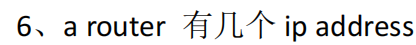

直接回答这个问题：一个路由器（Router）通常有多个 IP 地址，具体数量等于它所拥有的处于激活状态的三层接口（Layer 3 Interfaces）的数量。（最少为 2 个）。

下面我为你详细拆解这个概念，纠正一个初学者常犯的直觉错误。

### 核心知识点讲解：IP 地址属于谁？

很多人会有一种直觉：既然我有一台电脑，它有一个 IP 地址；那我有一台路由器，它是不是也应该只有一个“属于自己”的主 IP 地址？

这个直觉是完全错误的！

1. IP 地址是绑定在“接口”上的，而不是“设备”上。

在网络层的严格定义中，IP 地址永远是分配给网络接口 (Network Interfaces) 的，而不是分配给机器这个“铁盒子”本身的。

2. 路由器的本质工作决定了它必须有多个 IP。

- 路由器的天职是连接不同的网络（子网 Subnets）。
- 既然要连接不同的子网，路由器就必须在每一个子网上都有一只“脚”踩进去。
- 为了能和某个子网内的其他设备正常通信，这只“脚”（接口）就必须拥有一个属于该子网的合法 IP 地址，充当该子网的默认网关 (Default Gateway)。

3. 具体数量举例：

- 家用路由器 (Home Router)： 最典型的有两个 IP 地址。一个是面向你家内部局域网的 LAN 口 IP（通常是私有地址，如 `192.168.1.1`）；另一个是面向运营商的 WAN 口 IP（通常是公网 IP）。
- 企业级骨干路由器 (Enterprise/Core Router)： 如果一台企业路由器插了 8 根网线，分别连接了 8 个不同的部门子网，那么这台路由器就有 8 个不同的 IP 地址。

### 辅导测试题（Exam-Style Practice）

这种概念题最容易变成判断正误或选择题的陷阱。请遮挡答案进行自测：

#### Question 1 (True/False - 概念纠偏)

Question: Is the following statement True or False?

"An IP address is primarily used to identify a specific hardware device (like a router or a laptop) as a whole entity on the Internet."

(判断正误：IP 地址主要用于将特定硬件设备（如路由器或笔记本电脑）作为一个整体实体在互联网上进行标识。)

Answer:

False (错误).

*解析：* An IP address identifies a specific connection/interface to a network, not the device itself. A single device like a router, or even a laptop with both Wi-Fi and Ethernet active simultaneously, will have multiple IP addresses because it has multiple active interfaces. (IP 地址标识的是与网络的连接/接口，而不是设备本身。同时插网线和连 Wi-Fi 的电脑也有两个 IP，因为有两个激活的接口。)

#### Question 2 (Short Answer - 场景应用)

Question: You are looking at a network diagram where Router A connects exactly three distinct subnets: Subnet 1, Subnet 2, and Subnet 3. How many IP addresses must Router A have configured to route traffic successfully between these three networks, and where are they logically located?

(你正在看一张网络拓扑图，其中路由器 A 正好连接了三个不同的子网：子网 1、子网 2 和子网 3。为了成功在这三个网络之间路由流量，路由器 A 必须配置多少个 IP 地址？它们在逻辑上位于哪里？)

Answer:

Router A must have exactly three IP addresses configured.

Logically, these three IP addresses are located on the three individual router interfaces that connect to Subnet 1, Subnet 2, and Subnet 3, respectively. Each IP acts as the default gateway for its corresponding subnet.

*(解析：必须配置 3 个 IP 地址。它们在逻辑上位于路由器连接这三个子网的 3 个独立接口上，每个接口的 IP 作为对应子网的默认网关。)*

## inter-AS与intra-AS的主导因素分别是什么

区分 Intra-AS（自治系统内部路由） 和 Inter-AS（自治系统间路由） 的设计哲学是理解整个互联网架构的钥匙。

这两者的主导因素截然不同，可以用两个词来概括：Intra-AS 主导“性能（Performance）”，而 Inter-AS 主导“策略（Policy）”。

下面为你详细拆解这两者的底层逻辑：

### 1. Intra-AS（自治系统内）：主导因素是“性能与效率”

- 代表协议： OSPF, IS-IS, RIP
- 应用场景： 单一机构内部的网络（例如某所大学的校园网、某家互联网公司的企业网、或者中国电信自己内部的骨干网）。
- 为什么主导性能？
	- 统一的管理者： 在同一个 AS 内部，所有的路由器都属于同一个老板（或同一个网络管理员团队）。设备之间彼此绝对信任。
	- 唯一目标： 既然都是自家设备，网络管理员的唯一目标就是“让数据跑得越快越好、越通畅越好”。
	- 选路标准： 路由器在计算路径时，只看物理指标。哪条路带宽高（Cost 低）、哪条路跳数少、哪条路延迟低，数据就走哪条路。这纯粹是一个技术和数学优化问题（如 Dijkstra 算法求最短路径）。

### 2. Inter-AS（自治系统间）：主导因素是“策略与商业利益”

- 代表协议： BGP (Border Gateway Protocol)
- 应用场景： 连接全球不同机构的网络（例如中国电信连接谷歌、清华大学连接全球骨干网）。
- 为什么主导策略？
	- 互不信任与商业属性： 互联网是由无数个利益不同的 AS 拼凑而成的。跨 AS 传输数据，本质上是两家不同公司在“做生意”。
	- 选路标准（钱与政治）： 在跨 AS 通信时，物理上的“最短路径”往往毫无意义。路由器选路首要考虑的是商业协议（如谁给谁交了过路费）、安全策略甚至地缘政治。
- 经典的策略选路场景：
	- 金钱驱动： 假设从 AS1 到 AS3 有两条路。走 AS2 物理距离极短，但 AS2 是一家贪婪的运营商，要收高昂的流量费；走 AS4 物理距离绕了地球大半圈，但 AS4 是免费对等互联的（Peering）。此时，BGP 策略会强制数据绕远路走 AS4。
	- 安全防范： 某个国家的 AS 可能会配置策略，强制本国的所有涉密流量，无论多绕路，都绝对不允许经过某个敌对国家的 AS 节点。

### 总结对比

| 比较维度     | Intra-AS (内部路由)       | Inter-AS (外部路由)            |
| ---------------- | ----------------------------- | ---------------------------------- |
| 主导因素     | 性能 (Performance)        | 策略 (Policy)                  |
| 管理者性质   | 单一管理机构，完全信任        | 多个独立机构，存在利益冲突         |
| 选路核心指标 | 带宽、跳数、延迟 (找最短路径) | 商业协议、成本、安全限制           |
| 可扩展性     | 规模较小，关注网络拓扑细节    | 规模庞大（全球），隐藏内部拓扑细节 |

## 数据包在网络传输中，有几种封包头？说出他们的名字

数据封装 (Data Encapsulation) 过程，即数据在网络协议栈（TCP/IP 或 OSI 模型）中自上而下传递时，各层是如何给数据“穿衣服”（添加封包头）的。

### 🌟 原题解答

题目：数据包在网络传输中，有几种封包头？说出他们的名字。

参考答案： 在一个典型的网络传输过程中（以 TCP/IP 5层模型为例），数据包通常会经历 4 种主要的封包头（Headers）。从上到下依次为：

1. 应用层报头 (Application Header)：例如 HTTP 头、FTP 头等。
2. 传输层报头 (Transport Header)：主要是 TCP 头 或 UDP 头。
3. 网络层报头 (Network Header)：主要是 IP 头。
4. 数据链路层帧头 (Data Link Header/Frame Header)：主要是以太网 MAC 帧头（注意：这一层通常还会加一个帧尾 Trailer）。

*(注：不同教材的侧重点可能不同，有些标准答案如果只算网络通信核心的三层，可能会省略应用层，只答 TCP/UDP、IP、MAC 三种。建议你根据你们老师的课件稍作调整，但给出 4 种是最严谨的完整过程。)*

### 📚 核心知识点详解 (中英文对照)

数据发送的过程，就像是寄快递。你（应用程序）写了一封信（Data），每经过一个部门（协议层），他们就会把信装进一个更大的新信封里，并在信封表面贴上他们这个部门需要的专属标签（Header / 封包头）。这个过程叫做 封装 (Encapsulation)。

当接收方收到时，再一层一层地拆开信封，这叫 解封装 (Decapsulation)。

以下是每一层“封包头”的详细拆解：

#### 1. 应用层 (Application Layer)

- 添加的封包头：应用层报头 (Application Header)
- 作用： 携带应用程序需要交换的控制信息。例如，如果是浏览网页，就会加上 HTTP 报头（包含状态码、数据类型等）。
- 数据单元名称： 报文 (Message)

#### 2. 传输层 (Transport Layer)

- 添加的封包头：传输层报头 (Transport Header) - 通常是 TCP 报头 或 UDP 报头。
- 核心内容： 源端口号 (Source Port) 和 目的端口号 (Destination Port)。
- 作用： 决定这封信最终要交给目标电脑上的哪个具体软件（进程）。TCP 还会加上序号和确认号以保证可靠性。
- 数据单元名称： 报文段 (Segment) 或 用户数据报 (Datagram)

#### 3. 网络层 (Network Layer)

- 添加的封包头：网络层报头 (Network Header) - 通常是 IP 报头 (IPv4/IPv6)。
- 核心内容： 源 IP 地址 (Source IP) 和 目的 IP 地址 (Destination IP)。
- 作用： 负责在极其复杂的全球互联网中，通过路由器将数据包跨网络导航到正确的目标主机。
- 数据单元名称： 数据报 / 分组 (Datagram / Packet)

#### 4. 数据链路层 (Data Link Layer)

- 添加的封包头：帧头 (Frame Header) - 通常是 以太网首部 (Ethernet Header)。
- 核心内容： 源 MAC 地址 (Source MAC) 和 目的 MAC 地址 (Destination MAC)。
- 特殊点： 除了加“头”，这一层还会在数据末尾加一个 帧尾 (Trailer/FCS) 用于差错检测。
- 作用： 负责在同一局域网（或相邻的两个节点）内，通过物理地址把数据送到下一个网卡。
- 数据单元名称： 帧 (Frame)

### 📝 考试风格模拟题 (含答案与解析)

*(请先遮挡下方“答案与解析”部分进行自测)*

Question 1: During the data encapsulation process, which layer adds a header that contains the logical addresses (Source and Destination IP addresses)? (在数据封装过程中，哪一层添加了包含逻辑地址（源IP和目的IP地址）的报头？) A. Application Layer (应用层) B. Transport Layer (传输层) C. Network Layer (网络层) D. Data Link Layer (数据链路层)

Question 2: When a TCP segment is passed down to the Network layer, it is encapsulated into a(n): (当一个 TCP 报文段向下传递给网络层时，它被封装成一个：) A. IP Datagram / Packet (IP 数据报/分组) B. Ethernet Frame (以太网帧) C. Application Message (应用报文) D. Bit stream (比特流)

Question 3: Which of the following headers is primarily responsible for identifying the specific application process (using Port Numbers) that should receive the data on the destination host? (以下哪个封包头主要负责标识目标主机上应该接收数据的特定应用程序进程（使用端口号）？) A. MAC Header (MAC 帧头) B. IP Header (IP 报头) C. TCP Header (TCP 报头) D. HTTP Header (HTTP 报头)

👇 答案与解析 (请作答后查看) 👇

Q1 答案：C

- 解析： 包含 IP 地址的报头是 IP 报头，而 IP 协议工作在网络层 (Network Layer)。传输层管端口，数据链路层管 MAC 地址。

Q2 答案：A

- 解析： 考查协议栈的上下层关系。传输层的产物叫 TCP 报文段 (Segment)。当它交往下层（网络层）时，网络层会给它加上 IP 报头，此时这整个包裹就被称为 IP 数据报 (IP Datagram) 或分组 (Packet)。如果再往下传给数据链路层，就会变成帧 (Frame)。

Q3 答案：C

- 解析： 考查各个封包头内部的核心标识符。负责多路复用和分用、通过端口号 (Port Numbers) 来区分不同应用程序（如浏览器、微信）的是传输层协议（TCP 或 UDP）。

## If window size is equal 1, SR is the same as GBN

T

## DNS 服务器做成分布式的原因？如果 local DNS 没有缓存到，说一下 DNS 的过程

这是一个非常经典的计算机网络面试和考试题。DNS 的设计是互联网架构中最成功的分布式系统之一。

下面我为你详细梳理这两个问题，带你彻底搞懂 DNS 的精妙之处。

### 一、 为什么 DNS 要做成分布式的？(Why Distributed?)

如果把全球所有的域名和 IP 映射关系都放在一台集中的（单一的）DNS 服务器上，会面临四个致命的问题：

1. 单点故障 (Single Point of Failure): 这是最可怕的。如果这台全球唯一的 DNS 服务器宕机、断电或者遭遇黑客 DDoS 攻击，整个全球互联网就会瞬间瘫痪，所有人都无法通过域名访问网站（因为没人能解析出 IP 地址）。
2. 流量过载 (Traffic Volume): 全球有几十亿台设备，每秒钟产生海量的网页点击、邮件发送和 App 请求。如果所有的 DNS 查询请求都涌向一台服务器，没有任何单台机器的网络带宽和处理能力能够承受得住。
3. 地理距离造成的延迟 (Distant Centralized Database): 假设这台服务器放在美国纽约，那么远在澳大利亚或中国的用户每次打开网页，DNS 查询请求都要跨越半个地球，产生极高的网络延迟（卡顿感）。分布式架构允许我们在全球各地部署 DNS 服务器（就近接入）。
4. 维护极其困难 (Maintenance): 互联网上的域名每分每秒都在新增、删除和修改。如果只有一个庞大的集中式数据库，为其进行高频的更新和维护几乎是不可能完成的任务。

总结： DNS 采用分布式架构，根本原因是为了实现高可用性 (Reliability) 和 高可扩展性 (Scalability)。

### 二、 Local DNS 没有缓存时的解析全过程

假设你要访问 `www.example.com`，并且你的电脑和你的 Local DNS（本地 DNS 服务器，通常由你的宽带运营商提供）都没有缓存，整个解析过程如同“接力跑腿”，分为以下 5 个标准步骤：

#### 前置知识：两种查询方式

- 递归查询 (Recursive Query): “我把任务交给你，你必须给我最终结果。”（通常是客户端对 Local DNS 提要求）。
- 迭代查询 (Iterative Query): “我不知道最终答案，但我告诉你下一步该去问谁，你自己去问。”（通常是根、TLD 服务器对 Local DNS 的回应）。

#### 完整解析步骤：

1. 第 1 步：客户端 ➔ Local DNS (递归查询) 你的电脑向 Local DNS 发送请求：“请告诉我 `www.example.com` 的 IP 地址。我只等你的最终答案。” Local DNS 接下这个苦差事，开始帮你去全网跑腿。
2. 第 2 步：Local DNS ➔ 根域名服务器 (Root DNS Server) Local DNS 也不知道答案，于是它首先去问全球最高级别的根域名服务器。
	- *根服务器回答（迭代）：* “我不知道 `example.com` 的 IP，但是这个域名是以 `.com` 结尾的。我把负责管理 `.com` 的 顶级域名服务器 (TLD) 的地址给你，你去找它。”
3. 第 3 步：Local DNS ➔ 顶级域名服务器 (TLD DNS Server) Local DNS 顺藤摸瓜，去问负责 `.com` 的 TLD 服务器。
	- *TLD 服务器回答（迭代）：* “我也不知道里面具体的 `www` 是多少，但我知道 `example.com` 这个地盘是归谁管的。我把 `example.com` 的 权威域名服务器 (Authoritative DNS) 的地址给你，你去找它。”
4. 第 4 步：Local DNS ➔ 权威域名服务器 (Authoritative DNS Server) Local DNS 终于找到了最终负责人——权威 DNS（通常是由购买该域名的公司自己维护或托管在阿里云/腾讯云的服务器）。
	- *权威服务器回答：* “这就是我的地盘！`www.example.com` 对应的 IP 地址是 `93.184.216.34`，拿去吧。”
5. 第 5 步：Local DNS ➔ 客户端 Local DNS 终于拿到了最终 IP。它会做两件事：第一，把这个结果缓存在自己肚子里（这样下次别人再问就不用跑腿了）；第二，把 IP 地址返回给你的电脑。你的电脑拿到 IP 后，就可以正式发起 HTTP 请求加载网页了。

## TCP/UDP报文段中不会包含IP信息吗

从严格的数据结构定义上来说，TCP 和 UDP 报文段（Segment）的头部中，绝对不包含任何 IP 地址信息。

但是，这里面有一个计算机网络中非常著名的“隐藏机制（伪首部）”，这也是高级考试和面试中最爱考的陷阱。

我为你分两层来彻底拆解这个问题：

### 第一层：严守分层原则（为什么结构里没有？）

计算机网络的核心思想是“分层架构，各司其职”，数据传输就像是套俄罗斯套娃（封装 Encapsulation）：

1. 传输层（TCP/UDP）： 只负责“进程到进程”的通信。所以 TCP/UDP 的头部（Header）里只有源端口号 (Source Port) 和目的端口号 (Destination Port)。它们根本不关心这台机器在世界上的哪个物理位置。
2. 网络层（IP）： 负责“主机到主机”的通信。IP 协议在拿到 TCP/UDP 报文段后，会把它当作自己的“货物（有效载荷）”，然后在外面套上一个 IP 头部（IP Header），这个 IP 头部里才写着源 IP 地址和目的 IP 地址。

结论： TCP/UDP 报文段本身是没有 IP 信息的，它必须依赖下一层（网络层）给它套上 IP 头部，才能在网络中寻址。

### 第二层：高能反转 —— 伪首部（Pseudo-Header）

虽然 TCP/UDP 报文段在网线上飞奔时，头部里绝对没有 IP 地址，但在它们被打包（计算校验和）的那一瞬间，其实“偷偷看了一眼” IP 地址！

这个机制叫做 伪首部 (Pseudo-Header)。

1. 什么是伪首部？ 当 TCP 或 UDP 在计算校验和 (Checksum) 以检查数据是否损坏时，它们不仅计算自己头部和数据部分，还会向网络层“借”几个字段（包括源 IP 地址、目的 IP 地址、协议号等）拼凑出一个虚拟的头部，加在一起算出一个校验和。

2. 为什么非要这么做？ (Why?) 这是一种双保险机制。 想象一下，如果 IP 层出了错，把原本发给 IP-A 的包，错送给了 IP-B。如果 TCP 只校验端口和数据，它一看端口是对的，数据也没损坏，就会错误地把包收下。 为了防止这种“送错家门”的乌龙，TCP/UDP 在算校验和时把 IP 地址也算进去。这样接收方在重新计算校验和时，也会把自己的 IP 加上去算。如果发现算出来的结果对不上，立马就知道：“这包虽然没破，但这根本不是寄给我的！”从而果断丢弃。

3. 为什么叫“伪（Pseudo）”？ 最核心的考点：这个包含了 IP 地址的伪首部，只存在于发送方和接收方电脑的内存里，为了做一次数学计算而临时拼凑出来的。它绝对不会被实际发送到网络链路上！ 算完校验和，这个伪首部就被直接销毁了。

### 解惑：既然报文里没有，那服务器怎么做 4 元组“多路分解”？

我们前面讲过，TCP 接收端需要用四元组（源 IP, 源端口, 目的 IP, 目的端口）来区分不同的连接（多路分解）。既然 TCP 报文里没有 IP，它怎么知道源 IP 是啥？

答案在操作系统（OS）身上： 当网卡收到一个数据包，操作系统是一层一层剥开它的：

1. OS 先剥开 IP 头部，看到了源 IP 和 目的 IP，OS 把它记在内存里。
2. OS 把剩下的 TCP 报文段交给传输层，传输层看到了源端口和目的端口。
3. OS 的网络协议栈逻辑，会将刚才记下的 IP 和现在的端口结合起来，凑齐完整的四元组，然后准确地把数据扔给对应的 Socket。

总结： TCP/UDP 报文段内部不包含 IP 结构，但在实际运行中，传输层与网络层在操作系统的协议栈里是紧密合作的，它们共享了这些信息来保证数据交付的安全与准确。

## 计算机网络中,应用层报文的分片是在什么位置进行的

在标准的计算机网络术语中，对于“大块数据被切分为小块数据”这个动作，其实有两种不同的称呼，它们分别发生在不同的层次。

为了给你讲透，我们需要严格区分传输层使用的协议（TCP 还是 UDP）：

### 🌟 核心结论

应用层报文的“切割”主要发生在两个位置，取决于你用的是什么传输层协议：

1. 如果使用 TCP： 在传输层 (Transport Layer) 进行，术语叫做 “分段” (Segmentation)。
2. 如果使用 UDP： 传输层不管，交由网络层 (Network Layer) 进行，术语叫做 “分片” (Fragmentation)。

### 📚 详细机制拆解 (高频考点)

考试或面试中，考官最喜欢考察的就是这两个概念的辨析。

#### 1. 走 TCP 通道：传输层的“分段” (Segmentation)

- 发生位置： 传输层 (Transport Layer)。
- 工作机制： 当应用层把一个巨大的报文（比如一个大文件）交给 TCP 时，TCP 会主动把这个长长的数据流切分成一个个小块。切分大小的依据是 MSS (Maximum Segment Size，最大报文段长度)。
- 结果： 这些被切分好的小块，加上 TCP 头部后，被称为 TCP 报文段 (TCP Segments)。
- 好处： 因为 TCP 已经在传输层把数据切得足够小了，所以当这些报文段到达网络层（IP层）时，通常不需要再进行网络层的 IP 分片。

#### 2. 走 UDP 通道：网络层的“分片” (Fragmentation)

- 发生位置： 网络层 (Network Layer)。
- 工作机制： UDP 是一个非常“死脑筋”的协议，它绝不切分数据。应用层交给他多大的报文，它就直接加上个 8 字节的 UDP 头部，打包成一个巨大的 UDP 用户数据报 (UDP Datagram)，然后原封不动地扔给下面的网络层。
- 问题与解决： 到了网络层（IP 层），IP 协议发现这个包裹太大了，超过了底层链路允许的最大尺寸——MTU (Maximum Transmission Unit，最大传输单元，以太网通常是 1500 字节)。为了能发出去，IP 协议只能被迫把这个巨大的包裹切开。这个动作就叫 IP 分片 (IP Fragmentation)。
- 结果： 切开后加上 IP 头部，被称为 IP 分片 (IP Fragments)。

### 💡 考试易错点总结

- “分段 (Segmentation)” 是 TCP 的专利，发生在传输层，为了适应 MSS。
- “分片 (Fragmentation)” 是 IP 的无奈之举，发生在网络层，为了适应 MTU。
- 虽然中文口语里我们常混着用，但在严谨的考试中：TCP 叫分段，IP 叫分片。

为了让你更直观地看懂这两种“切割”方式在协议栈中发生的位置差异，我为你生成了一个交互式的动画演示。你可以分别点击“走 TCP”和“走 UDP”，观察一把“剪刀”是在哪一层落下的。

## 详细描述一下封装过程

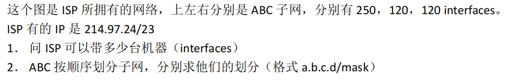

## 如果需要在此基础上再分三个子网出来呢

不能,每个子网只能给2次幂的

主要由 路由器的寻址逻辑 和 子网掩码的“一刀切”特性 决定的：

### 1. 掩码的“一刀切”效应（容量只能减半，不能微调）

子网的大小是由子网掩码（Subnet Mask）决定的，而掩码的移动只能按“2的幂次方”来进行。

如果您想把子网 A (`214.97.24.0/24`，总容量 256) 最后空闲的几个 IP 独立出来，您就必须改变子网 A 的掩码。

- 但是，掩码一旦向右移动一位（变成 `/25`），子网 A 的容量就会瞬间从 256 直接减半变成 128。
- 这样一来，子网 A 就只剩下 126 个可用 IP，根本无法满足题目要求的 250 台机器了。

在 IP 划分里，不存在“把掩码稍微调一点，让子网刚好容纳 250 个，剩下的 6 个分出去”的操作。掩码切下去，就是 128、256、512 这样生硬的切分。

### 2. 路由器的“广播域”认知障碍（ARP 与寻址）

假设您强行把子网 A 的最后 4 个 IP（`214.97.24.252` 到 `214.97.24.255`）分配给了别的网络。

在子网 A 的计算机和路由器的认知里，因为它们的掩码是 `/24`，它们会坚定地认为：`214.97.24.0` 到 `214.97.24.255` 这 256 个地址，全都在同一个物理房间（广播域）里。

- 通信故障： 如果子网 A 中的某台电脑（假设 IP 是 `.10`）想要访问 `.253` 这个被您“抠”出去的 IP，它不会把数据包交给路由器去跨网转发。相反，它会在本地局域网里大喊（发送 ARP 广播）：“谁是 `.253`？”
- 因为真正的 `.253` 已经被您分配到别的子网（别的路由器接口）去了，根本听不到这个广播。这就会导致网络彻底不通。

### 3. 每个新子网自带“公摊面积”（网络号和广播地址）

即便您能神奇地把最后几个 IP 拿出来组建一个新子网，您还需要面对“公摊”问题。 任何一个独立的子网，无论多小（比如一个包含 4 个 IP 的 `/30` 子网），都必须强制消耗两个 IP：

- 第一个 IP 用于网络地址（代表这个网段本身）。
- 最后一个 IP 用于广播地址（用于全网广播）。

在子网 A (`/24`) 中，`.255` 已经是被规定死用来做 A 的广播地址了，您不能把它拿去给别的子网用。如果您把最后的一小撮 IP 拿出来，它们内部又需要重新定义自己的网络地址和广播地址，这在数学上与原来 `/24` 的结构是完全冲突的。

## 详细描述一下封装过程

在计算机网络中，封装（Encapsulation）是最核心、最基础的概念之一。你可以把它想象成在现实生活中“寄送俄罗斯套娃”或“套信封”的过程。

数据从你的应用程序发出，在到达网线之前，必须经过操作系统的协议栈，一层一层地穿上自己的“专属工作服（头部 Header）”。

下面我为你以经典的 TCP/IP 五层模型 为例，详细拆解从顶层到底层的完整封装全过程。

### 📦 封装全过程详解（自顶向下）

假设你在浏览器中输入网址，准备发送一个 HTTP 请求。

#### 1. 应用层 (Application Layer)

- 动作： 浏览器（应用程序）生成实际要发送的业务数据，例如一段 HTTP GET 请求。
- 术语： 此时的数据被称为 报文 (Message)。
- 移交： 应用层将报文推入套接字（Socket），交给传输层。

#### 2. 传输层 (Transport Layer)

- 动作： 传输层（通常是 TCP 或 UDP 协议）收到报文后，在它的最前面加上一个 传输层首部 (Transport Header)。
	- *首部内容：* 最核心的是源端口号和目的端口号（负责区分不同的应用程序进程），以及序号、确认号等控制信息。
- 术语： 加上首部后的整个数据块被称为 报文段 (Segment)（对于 UDP 叫数据报）。
- 移交： 传输层将报文段向下交给网络层。

#### 3. 网络层 (Network Layer)

- 动作： 网络层（IP 协议）收到传输层的报文段后，将其视为自己的“有效载荷”，并在其前面加上一个 网络层首部 (IP Header)。
	- *首部内容：* 最核心的是源 IP 地址和目的 IP 地址（负责在庞大的互联网中找到最终的收件人主机），以及 TTL 等路由信息。
- 术语： 加上 IP 首部后的数据块被称为 数据报 (Datagram)。
- 移交： 网络层将数据报向下交给数据链路层。

#### 4. 数据链路层 (Data Link Layer)

- 动作： 链路层（如以太网、Wi-Fi）收到 IP 数据报后，除了在前面加上 链路层首部 (MAC Header) 外，通常还会在尾部加上一个 尾部校验和 (FCS/Trailer)。
	- *首部内容：* 最核心的是源 MAC 地址和目的 MAC 地址（负责在当前的局域网/相邻节点之间精确送达）。
- 术语： 这种“头尾双全”的数据块被称为 帧 (Frame)。
- 移交： 链路层将帧交给物理层。

#### 5. 物理层 (Physical Layer)

- 动作： 物理层不加任何头部，它的任务是将帧中的一个个比特（0 和 1）转换为物理信号（电信号、光信号或无线电磁波），发送到传输介质（网线、光纤、空气）中。
- 术语： 比特流 (Bits)。

### ✂️ 解封装过程 (Decapsulation)

当数据到达目标主机时，就会发生与上述完全相反的自底向上的过程，称为解封装 (Decapsulation)：

1. 物理层将电信号还原为比特流，交给链路层。
2. 链路层检查 MAC 地址对不对，校验 FCS 有没有出错。如果正确，剥离 MAC 头部和尾部，把里面的 IP 数据报交给网络层。
3. 网络层检查 IP 地址，剥离 IP 头部，把里面的 TCP 报文段交给传输层。
4. 传输层检查端口号，剥离 TCP 头部，把纯净的 HTTP 报文交给对应端口的浏览器进程。

## 如果报文很大呢

因为底层的物理网络设备（网卡、交换机、路由器）的内存和处理能力有限，它们对每次能传输的“最大包裹”有严格的尺寸限制。

如果报文太大，网络协议栈就会像切蛋糕一样，把它“切碎”。这个“切碎”的动作主要发生在两层，并且有两个非常著名的专业术语：传输层的“分段 (Segmentation)” 和 网络层的“分片 (Fragmentation)”。

### 1. 物理极限：MTU (最大传输单元)

在讲怎么切之前，必须先认识底层的“硬性规定”：MTU (Maximum Transmission Unit)。

- 它是数据链路层（比如以太网）规定的一个物理帧的数据载荷最大限制。
- 在标准的以太网中，MTU 通常是 1500 字节。
- 这意味着，网络层（IP 层）交给链路层的那个 IP 数据报，总大小绝对不能超过 1500 字节。如果超过了，网卡就会拒收或者报错。

### 2. 第一道防线：传输层的 TCP 分段 (Segmentation)

现代网络传输大文件绝大多数使用的是 TCP 协议。TCP 是一个非常聪明的协议，它会主动为了适应底层的 MTU 而把大块数据提前切好，这叫分段 (Segmentation)。

- MSS (Maximum Segment Size，最大报文段长度)： TCP 在建立连接时，会根据底层的 MTU 算出自己每次最多能切多大。
	- 公式：`MSS = MTU - IP头部(通常20字节) - TCP头部(通常20字节)`。
	- 所以标准以太网下，MSS = 1460 字节。
- 过程： 如果应用层扔给 TCP 一个 4000 字节的大报文。TCP 会在传输层主动把它切成 3 块：1460 字节、1460 字节、1080 字节。
- 结果： 每一块分别套上 TCP 头部，交给下层。这样到了 IP 层，每个数据报的大小都完美控制在 1500 字节以内，顺利通过网卡。

### 3. 第二道防线：网络层的 IP 分片 (Fragmentation)

如果传输层用的是 UDP 协议呢？UDP 比较“一根筋”，它不会去管底层的限制，无论应用层给它多大的数据（比如 4000 字节），它只套上一个 8 字节的 UDP 头部，就直接扔给网络层（IP 层）。

此时，IP 层接到了一个 4008 字节的巨大“烫手山芋”。为了能把它塞进 MTU 为 1500 的链路，IP 协议只能自己动手把它切开，这叫分片 (Fragmentation)。

- 过程： IP 层会把这个巨大的载荷切成几个小片，并且给每一片都单独套上一个新的 IP 头部。
- 危险的代价： IP 分片在网络中是非常不受欢迎的。因为一旦在传输途中某一个“小片”丢失了，接收端就无法拼凑出原始的巨大 UDP 数据报，会导致整个 4008 字节的数据报全部作废，必须重传。
- （注：IPv6 为了提高路由器效率，已经严禁路由器在半路进行分片，分片任务全部推给了发送端主机。）

## ipv6 报文格式

IPv6（互联网协议第六版）的报文格式相比 IPv4 进行了大幅度的简化和优化。它的设计核心是提高路由器的处理效率，并提供极大的寻址空间和更好的扩展性。

一个完整的 IPv6 报文主要由三个部分组成：IPv6 基本报头（Base Header）、扩展报头（Extension Headers，可选）和上层有效载荷（Payload）。

### 一、 IPv6 基本报头结构

IPv6 的基本报头是一个固定长度为 40 字节（320 比特）的结构。由于长度固定且取消了校验和，路由器在处理 IPv6 报文时速度更快。

以下是 IPv6 基本报头的结构示意图（每一行代表 32 比特 / 4 字节）：

```
 0                   1                   2                   3
 0 1 2 3 4 5 6 7 8 9 0 1 2 3 4 5 6 7 8 9 0 1 2 3 4 5 6 7 8 9 0 1
+-+-+-+-+-+-+-+-+-+-+-+-+-+-+-+-+-+-+-+-+-+-+-+-+-+-+-+-+-+-+-+-+
|Version| Traffic Class |           Flow Label                  |
+-+-+-+-+-+-+-+-+-+-+-+-+-+-+-+-+-+-+-+-+-+-+-+-+-+-+-+-+-+-+-+-+
|         Payload Length        |  Next Header  |   Hop Limit   |
+-+-+-+-+-+-+-+-+-+-+-+-+-+-+-+-+-+-+-+-+-+-+-+-+-+-+-+-+-+-+-+-+
|                                                               |
+                                                               +
|                                                               |
+                         Source Address                        +
|                           (128 bits)                          |
+                                                               +
|                                                               |
+-+-+-+-+-+-+-+-+-+-+-+-+-+-+-+-+-+-+-+-+-+-+-+-+-+-+-+-+-+-+-+-+
|                                                               |
+                                                               +
|                                                               |
+                      Destination Address                      +
|                           (128 bits)                          |
+                                                               +
|                                                               |
+-+-+-+-+-+-+-+-+-+-+-+-+-+-+-+-+-+-+-+-+-+-+-+-+-+-+-+-+-+-+-+-+
```

#### 基本报头字段详解：

1. Version（版本号） - 4 bits
	- 表示 IP 协议的版本。对于 IPv6，该字段的值始终为 `6`（二进制 `0110`）。
2. Traffic Class（通信分类） - 8 bits
	- 类似于 IPv4 中的 ToS（服务类型）字段。它用于区分不同类型的报文，以便在网络拥塞时提供 QoS（服务质量）支持，比如优先处理语音或视频流。
3. Flow Label（流标签） - 20 bits
	- 这是 IPv6 新增的字段。它用于标识属于同一业务流的一系列报文。路由器可以根据这个标签将同一流的报文转发到相同的路径，从而提高处理特定数据流（如实时视频或音频）的效率，而无需深入检查报文内部内容。
4. Payload Length（有效载荷长度） - 16 bits
	- 表示 IPv6 报头之后的字节数。这包括所有的扩展报头以及上层协议（如 TCP/UDP 数据）的长度。最大值为 65535 字节。如果需要发送更大的数据包（Jumbogram），可以通过扩展报头来实现。
5. Next Header（下一个报头） - 8 bits
	- 类似于 IPv4 中的 Protocol 字段。它指明了紧跟在 IPv6 基本报头后面的报头类型。如果存在扩展报头，它会指向第一个扩展报头的类型；如果没有扩展报头，它会指向高层协议（如 TCP 的值为 6，UDP 的值为 17）。
6. Hop Limit（跳数限制） - 8 bits
	- 完全等同于 IPv4 中的 TTL（生存时间）字段。报文每经过一个路由器，该值减 1。当值减为 0 时，报文将被丢弃，并向源地址发送 ICMPv6 超时消息。用于防止路由环路。
7. Source Address（源地址） - 128 bits
	- 发送该报文的源主机的 IPv6 地址。
8. Destination Address（目的地址） - 128 bits
	- 该报文的最终目的主机的 IPv6 地址。

### 二、 扩展报头 (Extension Headers)

IPv4 将许多可选功能直接塞进基本报头中，导致报头长度可变，影响了路由器的处理效率。IPv6 将所有可选功能移到了扩展报头中。

- 工作原理： 扩展报头位于 IPv6 基本报头和上层有效载荷之间。它们像链条一样串联起来，前一个报头的 `Next Header` 字段指出下一个报头的类型。
- 按需使用： 只有当需要特定功能时，才会添加相应的扩展报头。路由器通常不需要处理大多数扩展报头，直接跳过即可，大大提高了转发速度。

常见的扩展报头及处理顺序（如果同时存在多个）：

1. 逐跳选项报头 (Hop-by-Hop Options)： 路径上每个路由器都必须处理的选项（如巨型报文支持）。
2. 路由报头 (Routing)： 用于强制报文经过特定的路由节点。
3. 分片报头 (Fragment)： IPv6 中，只有源主机可以对报文进行分片（路由器不再负责分片）。如果报文过大，源主机会使用此报头进行分片。
4. 封装安全有效载荷报头 (ESP) / 认证报头 (AH)： 用于 IPsec，提供数据的加密和完整性验证。
5. 目的选项报头 (Destination Options)： 只有最终目的节点（或路由报头指定的节点）才需要处理的信息。

### 三、 总结：IPv6 报文设计的优势

- 定长报头更高效： 砍掉了 IPv4 中不常用的首部长度、标识、标志、片偏移等字段，将基本报头固定为 40 字节，硬件路由器可以飞速解析。
- 去除校验和： IPv6 基本报头去掉了 Header Checksum 字段。因为第二层（如以太网 FCS）和第四层（TCP/UDP 都有校验和）已经做了错误检查，网络层再做属于冗余计算。
- 灵活的扩展机制： 扩展报头的菊花链（Daisy-chain）设计既保证了核心路由的高效，又提供了无限的功能扩展可能。

## 哪一层提供流量控制和拥塞控制服务？

提供流量控制和拥塞控制服务的最主要层次是传输层（Transport Layer）。

在现代计算机网络（特别是 TCP/IP 模型）中，这两种机制主要由传输层的 TCP（传输控制协议） 来实现。

以下是具体的区分和工作原理：

### 1. 传输层（Transport Layer）—— 核心提供者

TCP 协议在端到端（End-to-End）的通信中同时提供了这两种关键服务：

- 流量控制（Flow Control）： * 目的： 保护接收方。防止发送方发送数据过快，导致接收方的缓冲区溢出而丢失数据。
	- 实现机制： TCP 使用滑动窗口机制（Sliding Window）。接收方会在返回的 ACK 报文中告诉发送方自己目前还有多少剩余的接收空间（接收窗口大小），发送方会根据这个大小来调整自己的发送速度。
- 拥塞控制（Congestion Control）：
	- 目的： 保护整个网络。防止过多的数据注入到网络中，导致路由器或链路过载，从而引起网络拥堵、丢包和延迟剧增。
	- 实现机制： TCP 通过维护一个“拥塞窗口（Congestion Window）”来实现。它包含了四大核心算法：慢启动（Slow Start）、拥塞避免（Congestion Avoidance）、快重传（Fast Retransmit） 和 快恢复（Fast Recovery）。它是一个全局性的过程，涉及到所有的主机、路由器以及网络状况。

### 补充说明：数据链路层（Data Link Layer）

值得一提的是，数据链路层也提供流量控制服务，但它的作用范围和目的与传输层有所不同：

- 局部范围（Hop-by-Hop）： 数据链路层的流量控制主要发生在相邻的两个节点之间（比如你的电脑和家里的路由器之间），而不是像传输层那样在最终的发送端和接收端之间。
- 机制： 常用的协议包括停止-等待协议（Stop-and-Wait）或局部的滑动窗口协议。
- 注意： 数据链路层通常不负责广域的拥塞控制。

总结： 当我们在网络协议的语境下讨论同时提供“流量控制”和“网络拥塞控制”时，标准答案是传输层（具体指 TCP 协议）。

## TCP 检测到拥塞的两种事件

TCP 主要通过检测以下两种丢包事件来判断网络发生了拥塞，并根据这两种事件的严重程度采取不同的应对措施：

### 1. 重传超时 (Retransmission Timeout, RTO)

这是最严重的一种拥塞信号，代表网络可能出现了严重的阻塞。

- 发生机制： TCP 发送方在发送一个数据报文后，会启动一个重传定时器。如果在这个定时器超时（RTO 耗尽）之前，仍然没有收到接收方针对该报文的确认应答（ACK），就会触发超时事件。
- 网络状态推断： 发生超时意味着不仅这个数据包丢失了，而且后续的数据包可能也没有到达接收方（因为如果后续数据包到达了，接收方会发送重复的 ACK）。这通常说明网络路径上的某个路由器队列已满，开始大面积丢弃数据包，网络处于“严重拥塞”状态。
- TCP 的应对策略（保守策略）：
	1. 把慢启动阈值 (ssthresh) 降低为当前拥塞窗口 (cwnd) 的一半。
	2. 将拥塞窗口 (cwnd) 直接重置为 1 个最大报文段长度 (MSS)。
	3. 重新进入慢启动 (Slow Start) 阶段，从头开始缓慢试探网络的承载能力。

### 2. 收到三个重复的 ACK (3 Duplicate ACKs)

这是一种相对轻微的拥塞信号，代表网络虽然出现了丢包，但仍然具备一定的数据传输能力。

- 发生机制： 当接收方收到一个乱序的数据包时（比如期望收到包 2，却收到了包 3），它不会发送对包 3 的确认，而是会立刻回传一个针对包 1 的重复 ACK，催促发送方赶紧发送包 2。如果发送方连续收到了 3 个相同的重复 ACK，它就会立刻知道相应的那个数据包（包 2）已经在网络中丢失了。
- 网络状态推断： 既然接收方还能连续发送 3 个重复的 ACK，说明丢失数据包之后的那些包（如包 3、4、5）已经成功到达了接收方。这表明网络只是发生了偶尔的丢包（可能是某个路由器短暂拥塞丢掉了一个包），但整体网络依然是畅通的，没有严重到彻底阻塞的程度。
- TCP 的应对策略（激进策略）：
	1. 触发快重传 (Fast Retransmit)：不等超时定时器到期，立刻重传丢失的那个数据包。
	2. 触发快恢复 (Fast Recovery)：把慢启动阈值 (ssthresh) 降低为当前拥塞窗口的一半。
	3. 将拥塞窗口 (cwnd) 的值设置为新的 ssthresh，而不是降到 1。然后直接进入拥塞避免阶段（线性增长），而不是慢启动。

### 总结对比

| 拥塞事件       | 触发条件             | 严重程度 | TCP 状态推断         | TCP 应对措施    | 拥塞窗口 (cwnd) 变化 |
| ------------------ | ------------------------ | ------------ | ------------------------ | ------------------- | ------------------------ |
| 超时 (Timeout) | RTO 定时器到期未收到 ACK | 严重         | 交通完全瘫痪             | 慢启动              | 直接降为 1 MSS           |
| 三个重复 ACK   | 收到 3 次相同的重复应答  | 轻微     | 路上有个坑，但车流还在动 | 快重传 + 快恢复 | 减半 (降为 ssthresh) |

## 比较 hub、switch、router 的不同

理解 集线器 (Hub)、交换机 (Switch) 和 路由器 (Router) 之间的区别，核心在于弄懂它们分别工作在 OSI 模型的哪一层，以及它们是如何处理冲突域 (Collision Domain) 和 广播域 (Broadcast Domain) 的。

下面我为你详细梳理它们的对比，并提供生动的比喻和考试技巧。

### 🌟 核心对比速查表 (Core Comparison Table)

这是你在考试中最需要记住的表格：

| 特性 (Feature)            | 集线器 (Hub)                              | 二层交换机 (Layer 2 Switch)                  | 路由器 (Router)                        |
| ----------------------------- | --------------------------------------------- | ------------------------------------------------ | ------------------------------------------ |
| OSI 工作层次              | 物理层 (Layer 1 - Physical)               | 数据链路层 (Layer 2 - Data Link)             | 网络层 (Layer 3 - Network)             |
| 处理的数据单元            | 比特流 (Bits)                             | 数据帧 (Frames)                              | 数据报/分组 (Packets/Datagrams)        |
| 寻址依据                  | 无 (盲目转发)                             | MAC 地址 (MAC Address)                       | IP 地址 (IP Address)                   |
| 转发机制                  | 泛洪/广播 (Broadcast) 给所有其他端口  | 单播 (Unicast)，基于 MAC 地址表定向转发  | 路由 (Routing)，基于路由表转发到下一跳 |
| 冲突域 (Collision Domain) | 整个 Hub 只有 1 个 (所有端口共享带宽) | 每个端口 1 个 (端口间互不干扰，独占带宽) | 每个端口 1 个                          |
| 广播域 (Broadcast Domain) | 整个 Hub 只有 1 个                        | 整个 Switch 只有 1 个 (除非划分 VLAN)        | 每个端口 1 个 (路由器隔离广播域)   |

### 📚 详细原理解析与通俗比喻

#### 1. 集线器 (Hub) —— “无脑的大喇叭”

- 工作原理： 它就是一个多端口的中继器。当它从端口 A 收到电信号时，它不管这是发给谁的，直接把信号复制并放大 (amplify)，然后从除了 A 之外的所有端口广播出去。
- 致命缺点： 冲突 (Collisions)。因为大家都在同一个信道里喊话，只要有两个人同时发数据，信号就会撞在一起变成乱码（CSMA/CD 机制就是为它设计的）。此外，由于带宽是共享的（比如 100M 的 Hub 接了 10 台电脑，每台实际只有 10M），并且极其不安全（别人能用抓包工具轻易看到你的数据），Hub 目前已被完全淘汰。
- 比喻： 一个黑暗的会议室，一个人在前面拿大喇叭喊话，所有人（不管是不是找他的）都得被迫听着。

#### 2. 二层交换机 (Switch) —— “聪明的接线员”

- 工作原理： 内部有一张MAC 地址表 (MAC Address Table)。当电脑 A 给电脑 B 发数据时，交换机会查看数据帧头部的“目标 MAC 地址”。然后查表，发现电脑 B 接在端口 3 上，它就在端口 A 和端口 3 之间建立一条独占的高速通道，把数据精准地送过去。
- 核心优势： 隔离了冲突域。电脑 A 和 B 通信的同时，电脑 C 和 D 也可以全速通信，互不干扰（全双工模式）。但请注意，如果有人发了一个目标地址是 `FF:FF:FF:FF:FF:FF` 的广播包（比如 ARP 查询），交换机还是会把它发给所有人。所以交换机不能隔离广播域。
- 比喻： 带有内线电话的办公大楼接线员。你告诉接线员你要找“张三（MAC地址）”，接线员直接把线切到张三的桌子上，别人听不到你们的对话。

#### 3. 路由器 (Router) —— “跨城快递的导航仪”

- 工作原理： 交换机只能在同一个局域网（同一个子网）内送货，如果电脑 A 要访问外网（比如百度的服务器），交换机就无能为力了。这就需要路由器。路由器连接着不同的网络（子网），内部有一张路由表 (Routing Table)。它根据“目标 IP 地址”的网段，决定包裹该走哪条出口链路。
- 核心优势： 隔离了广播域。路由器有一条铁律：“绝对不转发链路层广播包”。如果局域网里有人疯狂发广播包，到了路由器这里就会被直接丢弃，从而保护了外部网络不受内网广播风暴的影响。
- 比喻： 城市的跨城快递集散中心。它不关心你在小区里（局域网）具体住哪栋楼（MAC地址），它只看包裹上的城市和街道邮编（IP地址），决定把包裹装上哪辆去往外地的高速货车。

### 📝 考试风格模拟题 (含答案与解析)

*(请先遮挡下方“答案与解析”部分进行自测，题干主要为英文以贴合你的考试需求)*

Question 1:

A company installs a 24-port Layer 2 Ethernet switch and connects 24 computers to it. How many collision domains and broadcast domains exist in this network topology?

(一家公司安装了一台 24 端口的二层以太网交换机，并连接了 24 台计算机。这种网络拓扑中存在多少个冲突域和广播域？)

A. 1 collision domain, 1 broadcast domain

B. 24 collision domains, 1 broadcast domain

C. 1 collision domain, 24 broadcast domains

D. 24 collision domains, 24 broadcast domains

Question 2:

Which of the following devices operates at the Network Layer (Layer 3) of the OSI model and is primarily responsible for forwarding packets between different IP subnets?

(以下哪种设备在 OSI 模型的网络层（第 3 层）运行，主要负责在不同 IP 子网之间转发数据包？)

A. Hub

B. Switch

C. Router

D. Repeater

Question 3:

Why is a Switch generally considered more secure and efficient than a Hub in a Local Area Network (LAN)?

(为什么在局域网中，交换机通常被认为比集线器更安全、更高效？)

A. Because a Switch encrypts all data packets. (因为交换机加密所有数据包。)

B. Because a Switch learns MAC addresses and forwards frames only to the intended recipient, whereas a Hub broadcasts every frame to all ports. (因为交换机学习 MAC 地址并且仅将帧转发给预期接收者，而集线器将每个帧广播到所有端口。)

C. Because a Switch assigns dynamic IP addresses to hosts. (因为交换机为主机分配动态 IP 地址。)

D. Because a Switch operates at the Transport Layer. (因为交换机在传输层运行。)

👇 答案与解析 (请作答后查看) 👇

Q1 答案：B

- 解析： 必考的高频考点！交换机的每个端口都是一个独立的冲突域 (Collision Domain)，所以 24 个端口就是 24 个冲突域，电脑之间发数据不会互撞。但是，二层交换机无法隔离广播域 (Broadcast Domain)，整个交换机上的所有设备都属于同一个广播域（除非配置了 VLAN，题目没说默认没有）。

Q2 答案：C

- 解析： 只要看到关键词 "Network Layer (Layer 3)"，以及负责在 "different subnets (不同子网)" 之间转发，直接锁定 Router (路由器)。Hub 是 1 层，Switch 是 2 层。

Q3 答案：B

- 解析： 这是交换机取代集线器的根本原因。交换机依靠 MAC 地址表进行单播 (Unicast)，别人收不到你的数据，所以安全且高效（不浪费带宽）。集线器采用泛洪/广播机制，所有人都能收到，既不安全又容易引发冲突。

## 中国本地没有根域名服务器，如果美国禁止我们访问，会怎么样？我们应该如何解决这个问题？

虽然全球 13 个原始的 IPv4 根域名服务器确实没有一个位于中国，但这并不意味着中国境内没有根服务器的“存在”，也不意味着美国可以通过 DNS 轻易让中国“断网”。

让我们剥丝抽茧，详细看看如果发生极端情况会怎样，以及中国实际上已经做出了哪些技术布局。

### 一、 澄清误区：中国真的没有根域名服务器吗？

全球确实只有 13 个 IPv4 根域名服务器（标号从 A 到 M），其中 10 个在美国，2 个在欧洲，1 个在日本。

但是，互联网采用了一项名为 任播（Anycast） 的技术。通过这项技术，这 13 个原始根服务器在全球部署了数以千计的镜像服务器（Mirror Servers）。

- 事实是： 中国境内（包括北京、上海、杭州等地）部署了大量的根服务器镜像。当你在这座城市输入一个网址时，你的 DNS 请求通常只会到达离你最近的国内镜像服务器，而不需要跨越大洋去向美国的原始服务器询问。

### 二、 如果美国在极端情况下“切断”访问，会怎么样？

假设最极端的剧本发生：美国不仅封锁了原始根服务器的 IP，甚至试图通过某种方式使中国的镜像服务器与全球同步断开。情况会如下：

#### 1. 国内互联网（内网）几乎不受影响

- `.cn` 域名绝对安全： 中国国家顶级域名 `.cn` 和中文域名是由中国互联网络信息中心（CNNIC）完全自主管理的。所有访问以 `.cn` 结尾的网站（如大多数政府、企业网站）的请求，解析都在国内完成，美国无权也无法干涉。
- 运营商的强大缓存： 中国的三大运营商（电信、联通、移动）以及阿里、腾讯等大厂的 DNS 服务器上，保存着极其庞大的 DNS 缓存记录。即使与外界断开，常见的 `.com` 或 `.net` 网站（如 `baidu.com`、`taobao.com`）的解析记录在缓存过期前（通常可以人为延长）依然有效。

#### 2. 国际互联网访问会受到局部干扰，但不会“断网”

- 如果是访问从未访问过的罕见国外 `.com` 网站，且国内缓存中没有记录，解析可能会失败。
- 底层网络依然畅通： DNS 只是“通讯录”，互联网的本质是 IP 地址的路由（BGP 协议）。即使你不知道对方的名字（域名），只要你知道对方的电话号码（IP 地址），网络依然是通的。

### 三、 我们如何解决和防范这个问题？（中国已经做的布局）

为了彻底摆脱受制于人的风险，中国在技术和基础设施上已经完成了多重“备胎”计划和底层架构升级：

#### 1. 推动并主导 IPv6 根服务器（雪人计划）

这是最根本的破局之法。IPv4 时代 13 个根服务器的限制是由于早期技术标准的局限性（UDP 报文大小限制为 512 字节）造成的。而在下一代互联网协议 IPv6 时代，这个限制被打破了。

- 2015 年，由中国主导发起了 “雪人计划”（Yeti DNS Project）。
- 该计划在全球完成了 25 台 IPv6 根服务器的架设，其中 1 台主根服务器和 3 台辅根服务器部署在中国。这打破了中国过去没有“主根服务器”的历史。

#### 2. 建设国家级 DNS 基础设施

中国大力发展了自主可控的域名解析体系。国内的公共 DNS（如 114.114.114.114、阿里 DNS 223.5.5.5 等）不仅解析速度快，而且在紧急情况下，国内主管部门完全有能力通过行政和技术手段，在境内的骨干网节点上接管并下发重要的域名记录，形成一个独立的、能够自我循环的“中国区 DNS 根”。

#### 3. 根区数据本地副本

工信部早已出台相关规定和技术指导，要求境内的大型解析服务商必须具备同步和保存全球根区数据（Root Zone File）副本的能力。这意味着，即使物理网络被切断，国内依然有一份完整的“全球互联网通讯录”备份可以使用。

总结来说： 互联网的去中心化设计本身就极具韧性。美国无法通过简单的“拔网线”或“屏蔽 DNS”来让中国互联网瘫痪。中国不仅通过镜像和缓存做好了短期防御，更通过主导 IPv6 “雪人计划”掌握了下一代互联网的话语权。

你对这部分内容中提到的 “雪人计划”如何改变全球互联网格局 更感兴趣，还是想了解 DNS 的任播（Anycast）技术具体是如何工作的 呢？

## 为什么 IPv4 地址要被 IP v6 替换？为什么还没有被替换完？

### 第一部分：为什么 IPv4 注定要被 IPv6 替换？(The Crisis)

IPv4 被替换的根本原因只有一个：它的地址池太小了，被人类用光了 (Address Exhaustion)。

1. IPv4 的地址空间枯竭：
	- IPv4 地址是由 32 位二进制组成的（例如 `192.168.1.1`）。算下来，$2^{32}$ 大约只有 43 亿个地址。
	- 在互联网刚发明时，43亿看起来是个天文数字。但随着个人电脑的普及，特别是智能手机 (Smartphones) 和 物联网 (IoT) 设备的爆发，地球上几十亿人每人手里都有好几个需要连网的设备，43亿个地址根本不够分。IANA（互联网号码分配局）在 2011 年就把最后一批 IPv4 地址分配完毕了。
2. IPv6 的绝对优势 (The IPv6 Advantage)：
	- 海量的地址空间： IPv6 使用 128 位地址。$2^{128}$ 是一个极其恐怖的数字（大约 $3.4 \times 10^{38}$）。夸张点说，它能够给地球上的每一粒沙子都分配一个独立的 IP 地址，彻底解决了地址荒。
	- 恢复端到端通信 (End-to-End Connectivity)： 在纯 IPv6 网络中，每个设备都有全球唯一的公网地址，设备之间可以直接通信，极大地方便了 P2P 应用、网络电话和物联网的部署。
	- 更高效的路由首部 (Simplified Header)： IPv6 砍掉了 IPv4 头部中一些不常用的字段，让路由器处理数据包的速度更快。

### 第二部分：为什么到现在还没有替换完？(The Delay)

按理说，地址都用光十几年了，早该全面切换到 IPv6 了。为什么今天我们依然满眼都是 IPv4 呢？这就不得不提当年为了给 IPv4 续命而发明的“速效救心丸”和迁移的现实阻力。

#### 1. 头号功臣：NAT (网络地址转换) 的出现 🌟

我们在之前的题目中讲过 NAT (Network Address Translation)。这就是 IPv4 至今没死的最大原因。

- 续命机制： NAT 允许一个局域网内（比如你家、你的学校、一个拥有上万员工的公司）的所有设备，使用私有 IP 地址（如 `192.168.x.x`），然后共享唯一 1 个公网 IPv4 地址去上网。
- 结果： 这相当于把地址消耗速度放慢了几千、几万倍。虽然 IPv4 的总数只有 43 亿，但通过 NAT 的“复用”，它硬生生撑起了今天几百亿台设备的互联网。因为 NAT 太好用了，很多企业觉得“既然能凑合用，我干嘛要花大钱升级？”

#### 2. CIDR (无类别域间路由) 的优化

就像我们前面题目做过的，CIDR 打破了以前 A类、B类、C类地址的死板划分，实现了 IP 地址的“按需分配”、“量体裁衣”，极大地减少了分配过程中的浪费，也给 IPv4 续了一波命。

#### 3. 致命弱点：IPv4 与 IPv6 互不兼容 (No Backward Compatibility)

这是推广缓慢的硬伤。IPv4 和 IPv6 就像是两种完全不同的语言，说 IPv4 的设备听不懂 IPv6，反之亦然。

- 既然不能直接对话，运营商和企业要想支持 IPv6，就必须搞 双栈 (Dual-Stack)（也就是设备上同时跑 IPv4 和 IPv6 两套系统），或者搞复杂的隧道/翻译技术。这极大地增加了网络维护的复杂度和成本。

#### 4. 商业动力不足 (Lack of Financial Incentive)

对于普通用户和许多互联网公司来说，只要 NAT 还能工作，用 IPv4 还是 IPv6 在网页浏览速度上并没有明显的感知差异。既然“没坏 (It ain't broke)”，资本就缺乏动力去全面替换底层老旧的路由器和交换机设备。

总结一下目前的现状：

目前全球正处于一个漫长的过渡期 (Transition Period)。旧的 IPv4 靠着 NAT 苟延残喘，而 IPv6 正在各大运营商的核心网和 5G 移动网络中快速普及（你的手机 5G 网络大概率已经在使用原生的 IPv6 了）。两者将在未来很长一段时间内共存。

子网 1 中的主机 A 是 web server 端口 80 时能否由子网 2 中的主机 C（也是
web server、端口 80）发送 HTTP 请求连接

主机 C 向主机 A 发送 HTTP 请求没有任何问题。这个问题的核心在于打破一个常见的思维误区：“一台机器既然是 Web 服务器（占用了 80 端口），它就不能再作为客户端去访问别人的 80 端口了。” 这个想法是错误的。

为了让你彻底弄懂，我们从以下三个核心机制来拆解：

### 1. 角色是独立的：服务器也可以是客户端

一台计算机并不是单一身份的。主机 C 虽然运行着 Web 服务（对外提供服务），但这并不妨碍它同时运行其他的客户端程序（比如浏览器、爬虫脚本、或者是后端的 API 请求代码）。

- 当外部用户访问主机 C 时，主机 C 是服务器 (Server)。
- 当主机 C 主动去请求主机 A 时，主机 C 就是客户端 (Client)。

### 2. 核心解惑：源端口与目的端口的区别

这是计算机网络传输层（TCP）最巧妙的设计。每一次网络通信都需要四个要素来唯一确定（即“四元组”）：`源 IP`、`源端口`、`目的 IP`、`目的端口`。

- 主机 C 作为服务器时： 它的 Web 服务进程一直处于监听状态，死死“绑定”并监听在它自己的 80 端口上，等待别人来访问。
- 主机 C 作为客户端发请求时： 当主机 C 要去访问主机 A 的 80 端口时，操作系统绝对不会使用它自己的 80 端口作为发送端口。相反，操作系统会在本地随机分配一个空闲的高位端口（叫做临时端口 Ephemeral Port，通常在 49152 到 65535 之间）。

这笔网络账单看起来是这样的：

- 源 (主机 C): `IP 2` : `端口 54321 (操作系统随机分配)`
- 目的 (主机 A): `IP 1` : `端口 80 (主机 A 的 Web 服务)`

所以，主机 C 自己的 80 端口根本没有参与这次主动发送的请求，也就没有任何冲突。

### 3. 跨子网通信

只要子网 1 和子网 2 之间有路由器连通，且没有防火墙策略拦截，网络层（IP层）自然会把主机 C 的数据包路由到主机 A，这与两端是不是 Web 服务器毫无关系。

### 💡 现实生活中的典型场景

这种“Web 服务器互相调用”的场景在企业开发中极其常见：

- 反向代理 / 负载均衡： 主机 C 是一个 Nginx 服务器（监听 80），用户访问 C，C 再把请求转发给后端的真正处理业务的主机 A（也是监听 80 或其他端口）。
- 微服务架构 / API 调用： 主机 C 的后台代码在处理用户请求时，需要去主机 A 获取天气数据，于是 C 的代码向 A 发起了一个 HTTP GET 请求。

## 如何设计一个可信数据传输协议？

设计可信数据传输协议（Reliable Data Transfer, 简称 rdt）是计算机网络中最核心、也是最经典的挑战之一。TCP 协议正是为了解决这个问题而诞生的。

想象一下，底层物理网络（比如 IP 层）是一个不可靠的信道：数据包可能会损坏、乱序、甚至凭空消失。要在这个“糟糕”的信道上搭建一层绝对可靠的传输机制，我们需要像“打怪升级”一样，逐一解决信道带来的各种不确定性。

以下是设计一个可信数据传输协议必须包含的四大核心机制：

### 1. 应对数据损坏：校验和与反馈机制

- 面临问题： 电磁干扰或硬件故障可能导致数据在传输过程中发生比特翻转（0 变成 1，或 1 变成 0）。
- 解决方案：
	- 校验和（Checksum）： 发送方在数据包头部附加一段基于内容计算出的简短校验码。接收方收到数据后，用同样的算法重新计算并进行比对。如果不一致，说明数据在路上坏掉了。
	- 确认反馈（ACK / NAK）： 接收方需要明确告知发送方接收状态。如果数据完好，回复 ACK（Acknowledge）；如果数据损坏，回复 NAK（Negative Acknowledge），要求发送方重新发送。

### 2. 应对反馈信号损坏：引入序号

- 面临问题： 如果接收方发回的 ACK 或 NAK 自身在路上损坏了，发送方就无法确定对方的接收状态。为了确保安全，发送方只能选择盲目重传。但这会导致接收方收到重复的数据包，且无法分辨这是新数据还是重传的旧数据。
- 解决方案：
	- 序号（Sequence Number）： 给每一个发送的数据包贴上一个递增的编号。如果接收方连续收到两个具有相同序号的包，它立刻就能识破这是一个重复的冗余副本，直接将其丢弃，并再次补发一个 ACK。对于基础的“停等协议”，序号只需要 1 个比特（0 和 1 交替）就足够了。

### 3. 应对数据包彻底丢失：定时器

- 面临问题： 如果数据包或者 ACK 报文在半路遇到路由器拥塞，被直接丢弃了，发送方会永远等下去，双方陷入死锁。
- 解决方案：
	- 超时重传定时器（Timer）： 发送方每发出一个数据包，就立刻启动一个倒计时。如果在规定的时间内没有收到对应的 ACK，发送方就“悲观地”假定数据包（或回传的 ACK）已经丢失，并主动触发重传机制。

*(注：结合以上三点，我们已经构建出了一个完美运转的基础协议，通常被称为停等协议 Stop-and-Wait。但在实际应用中，由于每次只能发送一个包，网络的信道利用率会极其低下。)*

### 4. 提升传输效率：流水线与滑动窗口

- 面临问题： 停等协议太慢了。发一个包，等一个 ACK，网络大部分时间都在闲置。
- 解决方案：
	- 流水线技术（Pipelining）： 允许发送方在没有收到 ACK 的情况下，连续发送多个数据包。这就像快递公司不用等客户签收第一个包裹，就可以接着发出后续的包裹。
	- 滑动窗口（Sliding Window）： 为了防止发送方无节制地发送，导致接收方缓冲区溢出或网络崩溃，协议需要维护一个“窗口”，来严格限制允许连续发送且未被确认的最大数据包数量。最典型的算法实现包括 回退 N 步（Go-Back-N） 和 选择重传（Selective Repeat）。


## 使用 CSMD/CD 时，碰到 4 次碰撞后会怎么做？（2 进制回退算法）

在使用 CSMA/CD（带有碰撞检测的载波侦听多路访问）协议时，如果发送方碰到了第 4 次碰撞，它会使用截断二进制指数退避算法（Truncated Binary Exponential Backoff）来计算下一次尝试发送前需要等待的时间。

具体来说，在第 4 次碰撞后，发送方会从 0 到 15 这 16 个整数中随机抽取一个数字 $r$，然后等待 $r$ 倍的“争用期”时间后，再次尝试发送。

下面是该算法在第 4 次碰撞时的详细计算过程和后续动作：

### 1. 计算随机数范围 (确定 $k$)

算法使用一个变量 $k$ 来控制随机数的上限。$k$ 的取值规则是碰撞次数 $n$ 和 10 之间的较小值：

$$
k = \min(n, 10)
$$

- 因为这是第 4 次碰撞，所以 $n = 4$。
- 计算得出：$k = \min(4, 10) = 4$。

### 2. 选取随机数 $r$

发送方会在 $\{0, 1, 2, \dots, 2^k - 1\}$ 这个离散的整数集合中随机抽取一个数 $r$。

- 因为 $k = 4$，所以集合的上限是 $2^4 - 1 = 15$。
- 发送方会从 $[0, 15]$ （即 0, 1, 2... 14, 15 共 16 个数字）中随机选择一个 $r$。

### 3. 计算实际退避时间

退避时间 = $r \times \text{争用期 (Slot Time)}$。

- 争用期通常规定为 512 个比特时间（在 10 Mbps 以太网中，这大约是 51.2 微秒）。
- 假设发送方随机抽到了 $r = 7$，那么它就会老老实实等待 $7 \times 51.2 = 358.4$ 微秒。

### 4. 等待结束后的动作

- 侦听信道： 退避时间结束后，发送方会再次侦听信道。
- 空闲则发送： 如果信道空闲，则立即发送数据。
- 继续碰撞则累加： 如果非常倒霉，发送后又发生了第 5 次碰撞，那么 $n$ 变成 5，$k$ 变成 5，下一次的随机数范围就会呈指数级扩大到 $[0, 31]$。

> 极限情况说明：
>
> - 退避上限： 当碰撞次数 $n$ 达到 10 次以后（比如 11、12 次），$k$ 将保持在 10 不变，随机范围最大固定在 $[0, 1023]$，这就是“截断”一词的由来。
> - 丢弃报文： 当碰撞次数达到 16 次时，协议会认为网络拥塞严重或发生故障，直接丢弃该数据帧，并向上层报错。

为了让你更直观地感受这个窗口随着碰撞次数增加而“指数级爆炸”然后被“截断”的过程，我为你生成了一个截断二进制指数退避算法模拟器。你可以不断点击“发生碰撞”来观察 $k$ 值和随机数 $r$ 的变化。

## 各种转发表要怎么列出来

绝大多数情况下指的是路由器的转发表（网络层），少数情况下会考交换机的 MAC 地址表（链路层）。

不同的教材（比如谢希仁的《计算机网络》或 Kurose 的《计算机网络：自顶向下方法》）要求书写的格式会有一点微小的区别，但我为你总结了最标准、绝对能拿满分的书写格式。

### 一、 必考重点：路由器的转发表 (Routing/Forwarding Table)

在做路由器的题目时，一个标准的转发表必须包含以下 3 到 4 个核心列。

#### 格式 1：经典四列格式（国内教材如谢希仁版最常见）

如果题目给定了具体的 IP 网段和网络拓扑，你应该画出这样的表格：

| 目的网络 (Destination Network) | 子网掩码 (Subnet Mask) | 下一跳 (Next Hop) | 出接口 (Interface) |
| ---------------------------------- | -------------------------- | --------------------- | ---------------------- |
| 192.168.1.0                        | 255.255.255.0              | 直接交付 / -          | 接口 0 (或 eth0, f0/0) |
| 10.0.0.0                           | 255.0.0.0                  | 192.168.1.2           | 接口 1 (或 eth1, f0/1) |
| 0.0.0.0 (或写“默认路由”)           | 0.0.0.0                    | 192.168.2.254         | 接口 2                 |

📝 考试得分要点（必看）：

1. 目的网络： 注意，这里填的绝对不是主机的 IP（比如不要填 192.168.1.5），而是网络号（主机位全为 0，即 192.168.1.0）。
2. 掩码： 必须写，因为路由器依靠“目的 IP 与掩码做与运算”来匹配。
3. 下一跳： * 如果该网络是直接连在这个路由器上的，下一跳写 “直接交付”、“无” 或画个横杠 “-”。
	- 如果不是直连的，必须写下一个路由器的接收接口的 IP 地址。
4. 出接口： 数据包从当前路由器的哪个网卡/端口发出去。

#### 格式 2：CIDR / 最长前缀匹配格式（国外教材如自顶向下版常见）

如果题目给的是二进制前缀或者 CIDR 格式（如 `/24`），通常只需要两到三列：

| 目的网络前缀 (Prefix Match) | 出接口 (Link Interface) |
| ------------------------------- | --------------------------- |
| 11001000 00010111 00010*        | 0                           |
| 11001000 00010111 00011000*     | 1                           |
| 否则 (Otherwise / Default)      | 2                           |

*或者写成十进制格式：*

| 网络前缀   | 下一跳  | 接口 |
| -------------- | ----------- | -------- |
| 192.168.1.0/24 | -           | 0        |
| 10.0.0.0/8     | 192.168.1.2 | 1        |

### 二、 链路层考点：交换机的转发表 (MAC 表)

如果题目里画了几个电脑连着一个交换机 (Switch)，让你写转发表，那它要考的就是 MAC 地址表。这个非常简单，通常只需要两列。

| MAC 地址 (MAC Address)  | 接口 / 端口 (Port) |
| --------------------------- | ---------------------- |
| 00-11-22-33-44-55 (或主机A) | 1                      |
| AA-BB-CC-DD-EE-FF (或主机B) | 2                      |

📝 考试得分要点：

题目通常会描述一个过程（比如“主机 A 发送数据给主机 B”），问你交换机转发表的变化。你要记住交换机是“学习源地址，转发目的地址”。只要数据包从某个端口进来，立刻把它的源 MAC 地址和这个端口号登记在表格里。

### 总结与实战建议

在考卷上答题时：

1. 先看设备： 看清题目问的是路由器（画网络号/掩码/下一跳）还是交换机（画 MAC/端口）。
2. 找准直连： 路由表里一定要先把直接连在路由器上的网段写出来，下一跳填“直接交付”。
3. 别忘默认： 如果题目里有通向外网（Internet）的线，一定要在最后一行加上默认路由（0.0.0.0）。


 IPv6 地址的简写/压缩规则 (IPv6 Address Abbreviation / Compression Rules)。

针对图片中的具体问题：“IPv6怎么省略中间全为0的若干个段？”

最直接的答案是：使用双冒号 (`::`) 来替换连续的全 0 段。 这种技术在标准中被称为零压缩 (Zero Compression)。

下面我为你详细拆解 IPv6 地址简写的所有核心规则，这也是网络基础考试中的必考送分题，但非常容易掉进陷阱。

### 📚 核心知识点详解 (中英文对照)

标准的 IPv6 地址长度为 128位 (128 bits)，通常被分为 8 个段，每段 16 位，用 4 个十六进制数字表示，段与段之间用冒号 (`:`) 隔开。

例如：`2001:0db8:0000:0000:0000:ff00:0042:8329`

因为这种写法太长了，协议规定了两条严格的简写规则：

#### 规则 1：省略前导零 (Omitting Leading Zeros)

- 概念： 在任意一个 16 位的段内，开头的一个或多个 `0` 可以被省略。
- 注意： 只能省略前导 (leading) 的 0，不能省略尾随的 0。如果一个段全是 0（即 `0000`），可以简写为单个 `0`，但不能完全留空。
- 示例演练：
	- `0db8` $\rightarrow$ `db8`
	- `0042` $\rightarrow$ `42`
	- `ff00` $\rightarrow$ `ff00` (尾部的 0 绝对不能省，否则值就变了！)
	- `0000` $\rightarrow$ `0`

#### 规则 2：零压缩 / 双冒号压缩 (Zero Compression / Double Colon) —— 本题核心

- 概念： 如果地址中存在连续的 (contiguous) 包含全 0 的段，可以使用双冒号 `::` 来替换这些连续的 0 段。
- ⚠️ 致命陷阱 (The Golden Rule)： 双冒号 `::` 在一个 IPv6 地址中只能出现一次！(Can only be used ONCE per address)。
- 为什么只能用一次？ 为了避免歧义 (Ambiguity)。如果你写成 `2001::ff00::8329`，计算机（解析器）就无法确定第一个 `::` 代表几个 0 段，第二个 `::` 又代表几个 0 段。只要限定只出现一次，计算机就可以通过计算“128位减去已知段的长度”，精确推算出 `::` 到底代表了多少个 0。
- 示例演练：
	- 完整地址：`2001:0db8:0000:0000:0000:ff00:0042:8329`
	- 应用规则 1 后：`2001:db8:0:0:0:ff00:42:8329`
	- 应用规则 2 后：`2001:db8::ff00:42:8329`

补充考点：如果有两处独立的连续全 0 段怎么办？

如果一个地址是 `2001:0000:0000:abcd:0000:0000:0000:1234`

你只能选择其中最长的一串 0 进行 `::` 压缩。如果长度一样，通常压缩前面那一串。

- 正确压缩：`2001:0:0:abcd::1234` (推荐，压缩了后面的 3 段)
- 错误示范：`2001::abcd::1234` (绝对错误，出现两次 `::`)

### 📝 考试风格模拟题 (含答案与解析)

*(请先遮挡下方“答案与解析”部分进行自测，题干主要为英文以贴合你的考试需求)*

Question 1:

Which of the following is a valid abbreviation for the IPv6 address `FE80:0000:0000:0000:0202:B3FF:FE1E:8329`?

(以下哪项是 IPv6 地址 `FE80:0000:0000:0000:0202:B3FF:FE1E:8329` 的有效简写？)

A. `FE80::0202:B3FF:FE1E:8329`

B. `FE80::202:B3FF:FE1E:8329`

C. `FE80:0:0:0:202:B3FF:FE1E:8329`

D. Both B and C are valid abbreviations.

Question 2:

Identify the INCORRECT statement regarding IPv6 zero compression.

(指出关于 IPv6 零压缩的错误陈述。)

A. Leading zeros within a 16-bit field can be omitted. (16位字段内的前导零可以省略。)

B. The double colon `::` can be used to replace any single block of `0000`. (双冒号 `::` 可用于替换任何单个 `0000` 块。)

C. The double colon `::` can appear multiple times in an address as long as the total length is 128 bits. (只要总长度为128位，双冒号 `::` 可以在地址中出现多次。)

D. Trailing zeros within a 16-bit field must NOT be omitted. (绝不能省略 16 位字段内的尾随零。)

Question 3:

Expand the compressed IPv6 address `2001:db8::1428:57ab` into its full, uncompressed 128-bit format.

(将压缩的 IPv6 地址 `2001:db8::1428:57ab` 扩展为其完整的、未压缩的 128 位格式。)

👇 答案与解析 (请作答后查看) 👇

Q1 答案：D

- 解析：
	- 选项 C 是只应用了“前导零省略”规则，这是合法的。
	- 选项 B 在 C 的基础上，进一步把连续的三个 `0` 替换成了 `::`，并且 `0202` 变成了 `202`，这也是完全正确且最简的写法。
	- 选项 A 错在 `0202` 没有省略前导零（虽然语法上不报错，但通常标准简写要求去掉前导零）。因此 B 和 C 都是对的。

Q2 答案：C

- 解析： 考查绝对死穴！双冒号 `::` 在任何情况下都只能出现一次。如果出现多次，解析器将面临“歧义 (Ambiguity)”，无法得知每个 `::` 应该还原出多少个 0。

Q3 答案：`2001:0db8:0000:0000:0000:0000:1428:57ab`

- 解析逆向推导思路：
	1. 观察当前地址有多少段：`2001`, `db8`, `1428`, `57ab`，一共 4 段。
	2. IPv6 总共需要 8 段，说明 `::` 隐藏了 $8 - 4 = 4$ 段全 0。
	3. 补齐隐藏的段：`2001:db8:0:0:0:0:1428:57ab`。
	4. 补齐每个段的前导零（补满4个字符）：`2001:0db8:0000:0000:0000:0000:1428:57ab`。


将 192.168.0.0 和 192.168.1.0 进行 CIDR 合并（路由聚合/构造超网）。

这道题的最终答案是：192.168.0.0/23。

下面我为你详细拆解计算步骤，这不仅是得出这道题答案的方法，也是解决所有此类“路由聚合”题目的标准解法。

### CIDR 合并四步法

这种题目的核心思想叫做“寻找最长公共前缀”。假设这两个网段原本都是标准的 /24（即 C 类网络掩码 255.255.255.0）。

第一步：找出不同，转换为二进制 我们观察这两个 IP 地址，前两个字节（192.168）和最后一个字节（0）都是一样的，唯一的区别在第三个字节（0 和 1）。 我们将这第三个字节展开为 8 位二进制数：

- 0 的二进制：`00000000`
- 1 的二进制：`00000001`

第二步：对齐对比，寻找最长公共前缀 将两个二进制数上下对齐，从左向右逐位对比，直到遇到不一样的数字为止。

`192 . 168 . ``0000000`` 0 . 0`  (192.168.0.0) `192 . 168 . ``0000000`` 1 . 0`  (192.168.1.0)

我们可以看到，前两段（192.168.）完全相同（占 16 位）。第三段中，前 7 位（0000000）是相同的，到了第 8 位才出现了分歧（一个是 0，一个是 1）。

第三步：计算新的子网掩码 (前缀长度) 把所有相同部分的位数加起来：

- 第一段 192 占 8 位
- 第二段 168 占 8 位
- 第三段相同的共有 7 位
- 总计：8 + 8 + 7 = 23 位。 这就是合并后的新子网掩码长度，即 /23。

第四步：得出合并后的网络地址 将最长公共前缀保留，后面的所有位（主机位）全部清零。 前 23 位保留，剩下的 9 位全部写 0： `11000000 . 10101000 . 00000000 . 00000000` 把这个二进制数转换回十进制，就是 192.168.0.0。

结合第三步的掩码，最终的聚合路由就是：192.168.0.0/23。

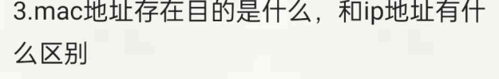


### 🌟 第 4 题解析：Switch 和 Router 如何工作及区别

题目： switch (交换机) 和 router (路由器) 分别如何工作，有什么区别？

解答与核心知识点：

虽然我们之前对比过 Hub，但针对这道题，你需要将重点完全放在 Switch (二层交换机) 和 Router (路由器) 的精准对比上。

#### 1. 交换机 (Switch) 如何工作？

- 工作层次： 数据链路层 (Data Link Layer, Layer 2)。
- 核心依据： MAC 地址 (MAC Address)。
- 工作原理： 交换机内部维护着一张 MAC 地址表 (MAC Address Table)。当它收到一个数据帧时，它会读取帧头部的目标 MAC 地址，然后在表中查找对应的物理端口。如果找到，就单播 (Unicast) 转发到该端口；如果找不到（或者是广播包），它就会向除了接收端口之外的所有端口泛洪 (Flood)。同时，它会通过读取源 MAC 地址来“自学习”更新地址表。
- 主要职责： 在同一个局域网 / 子网 (Same LAN/Subnet) 内部连接各个主机，并隔离冲突域 (Collision Domain)。

#### 2. 路由器 (Router) 如何工作？

- 工作层次： 网络层 (Network Layer, Layer 3)。
- 核心依据： IP 地址 (IP Address)。
- 工作原理： 路由器内部维护着一张 路由表 (Routing Table)。当它收到一个数据包时，它会读取头部的目标 IP 地址，然后使用最长前缀匹配算法在路由表中寻找最佳路径。找到后，将数据包转发到对应的下一跳 (Next Hop) 接口。
- 主要职责： 在不同的网络 / 子网 (Different Networks/Subnets) 之间转发数据，实现跨网通信，并且隔离广播域 (Broadcast Domain)。

#### 3. 核心区别总结表 (考试速记)

| 对比维度   | 交换机 (Switch)                   | 路由器 (Router)                       |
| -------------- | ------------------------------------- | ----------------------------------------- |
| 工作层次   | 数据链路层 (Layer 2)                  | 网络层 (Layer 3)                          |
| 寻址标识   | 物理地址 (MAC Address)                | 逻辑地址 (IP Address)                     |
| 数据单元   | 帧 (Frame)                            | 数据报/分组 (Datagram/Packet)             |
| 应用场景   | 组建局域网 (Intranet)，同网段通信 | 连接外网 (Internet)，跨网段通信       |
| 广播域控制 | 不隔离 (所有端口在同一广播域) | 隔离 (每个接口是一个独立的广播域) |

### 🌟 第 5 题解析：即时通讯软件 (如 QQ) 的架构

题目： 即时通讯软件如 QQ 用什么结构 C/S 还是 P2P 还是 Hybrid，为什么？

解答与核心知识点：

正确答案： 现代即时通讯软件（如 QQ、微信、Skype）采用的是 混合架构 (Hybrid Architecture)。

为什么 (Why)？

纯粹的 C/S 架构会导致服务器压力过大且传输大文件极慢；纯粹的 P2P 架构在用户离线时无法留言，且难以进行集中式的账号管理。因此，QQ 结合了双方的优点：

1. 使用 C/S (Client-Server 客户-服务器) 架构处理“控制流”和“轻量数据”：
	- 用户登录与鉴权 (Authentication): 必须由中心服务器验证账号密码。
	- 好友状态同步 (Status update): 你上线了，服务器负责广播给你的好友。
	- 离线消息 (Offline messages): 如果好友不在线，你发的消息会暂存在服务器上，等好友上线再拉取。
	- 普通文本聊天 (Text messages): 文本数据量极小，通常通过服务器中转，以保证消息的可靠性和漫游同步。
2. 使用 P2P (Peer-to-Peer 对等) 架构处理“海量数据流”：
	- 大文件传输 (Large file transfer): 如果双方都在线，QQ 会尝试打通 P2P 直连通道。文件直接从你的电脑传到好友电脑，不经过中心服务器。这极大节省了腾讯服务器的带宽，且速度达到双方物理带宽的上限。
	- 实时音视频通话 (Real-time Voice/Video calls): 音视频极其消耗带宽且对延迟敏感，通过 P2P 直连可以做到最低延迟。*(注：如果 P2P 打洞失败，才会退化为 C/S 架构由服务器中转转发)*。

### 📝 考试风格模拟题 (含答案与解析)

*(请先遮挡下方“答案与解析”部分进行自测)*

Question 1:

Which of the following scenarios absolutely requires a Router rather than just a Layer 2 Switch?

(以下哪种场景绝对需要路由器而不仅仅是二层交换机？)

A. Connecting 50 computers in the same office to share a local printer. (连接同一办公室的 50 台电脑以共享本地打印机。)

B. Forwarding a packet from a host in subnet `192.168.1.0/24` to a host in subnet `10.0.0.0/8`. (将数据包从子网 `192.168.1.0/24` 中的主机转发到子网 `10.0.0.0/8` 中的主机。)

C. Filtering out collisions on a heavily utilized Ethernet segment. (过滤高负载以太网段上的冲突。)

D. Using MAC addresses to ensure data only goes to the intended recipient. (使用 MAC 地址确保数据仅发送给预期接收者。)

Question 2:

In a Hybrid P2P architecture like modern instant messaging (e.g., QQ or Skype), which of the following tasks is typically handled by the centralized Server (C/S mode) rather than directly between peers (P2P mode)?

(在现代即时通讯（如 QQ 或 Skype）等混合 P2P 架构中，以下哪项任务通常由集中式服务器（C/S 模式）处理，而不是在对等方之间直接处理（P2P 模式）？)

A. Streaming high-definition video during a 1-on-1 call. (在 1 对 1 通话期间流式传输高清视频。)

B. Transferring a 2GB zip file between two online friends. (在两个在线好友之间传输 2GB 的 zip 文件。)

C. Storing and delivering a message sent to a user who is currently offline. (存储并向当前离线的用户传递消息。)

D. Establishing a direct UDP connection path between two NAT-translated hosts. (在两个经过 NAT 转换的主机之间建立直接 UDP 连接路径。)

👇 答案与解析 (请作答后查看) 👇

Q1 答案：B

- 解析： 考查路由器与交换机的核心区别。只要涉及跨网段/跨子网 (across different subnets) 的通信，二层交换机就无能为力了，必须依靠网络层的路由器来进行路由选择。A、C、D 都是二层交换机可以且擅长完成的任务。

Q2 答案：C

- 解析： 考查混合架构的分工。P2P 最大的弱点就是“双方必须同时在线”，如果一方离线，P2P 就无从谈起。因此，处理离线消息 (Offline message)、用户登录、寻找在线好友等控制类功能，必须依赖永远在线的中心化服务器 (C/S 架构)。A 和 B 是典型的高带宽消耗任务，优先使用 P2P。


IP 地址负责“跨网寻址”（告诉你最终要去哪），而 MAC 地址负责“局域网内的接力传递”（告诉你下一步该把数据交给谁）。

如果没有 MAC 地址，互联网上的数据根本无法在物理链路（网线、光纤、WiFi）中迈出哪怕一步。

以下是详细的解答和通俗的类比：

### 一、 MAC 地址存在的目的是什么？

1. 唯一物理标识： MAC 地址（物理地址）被烧录在设备的网卡硬件中，全球唯一。它的存在是为了在同一个局域网（同一条物理链路）中，唯一地识别一台设备。
2. 实现“局域网内”的物理交付： 当数据包到达你家路由器，或者你所在的局域网交换机时，IP 地址的使命就暂告一段落了。局域网内的设备（比如交换机）其实“看不懂”也不关心 IP 地址，它们是依靠 MAC 地址表，精准地把电信号发送到你的那根网线或那个 WiFi 频道上的。

### 二、 核心区别：一个通俗的类比

你可以把网络传输想象成寄快递：

- IP 地址 = 你的收货地址（逻辑地址）
	- 比如“北京市朝阳区某某街道XX小区X栋X室”。
	- 它是可以改变的（你搬家了，地址就变了；你抱着笔记本从公司回家，IP 就变了）。
	- 它指导整个大网（全国物流系统）如何跨越省市（跨越路由器）找到你的大致位置。
- MAC 地址 = 你的身份证号（物理地址）
	- 比如“1101051999...”。
	- 它是固定的（无论你走到天涯海角，身份证号都不变；你的网卡也是如此）。
	- 快递员到了你的小区楼下（到达最终局域网），他不能对着大楼喊“朝阳区某某街道的包裹”，他必须核对你的身份证（MAC 地址），确认是你本人，才能把包裹交给你。

### 三、 MAC 地址与 IP 地址的详细对比

| 特性       | MAC 地址 (物理地址)                                      | IP 地址 (逻辑地址)                                       |
| -------------- | ------------------------------------------------------------ | ------------------------------------------------------------ |
| 工作层次   | OSI 第 2 层（数据链路层）                                    | OSI 第 3 层（网络层）                                        |
| 主要作用   | 实现相邻节点（一跳）之间的数据传递。                 | 实现端到端（起点到终点）的跨网数据路由。                 |
| 格式与长度 | 48 位（6 个字节），通常用十六进制表示，如 `00:1A:2B:3C:4D:5E` | IPv4 为 32 位（点分十进制如 `192.168.1.1`）；IPv6 为 128 位。 |
| 分配方式   | 硬件厂商出厂时烧录，全球唯一，不可更改（虽然可以用软件伪装）。 | 网络管理员或 DHCP 服务器动态分配，基于网络拓扑变化。     |
| 可见范围   | 仅在当前的局域网（同一广播域）内有效，一旦跨越路由器，源 MAC 地址就会被替换。 | 全局有效（公网 IP），或者在整个私有网络中有效。          |

### 详细讲解一下转发和路由的区别

“转发”（Forwarding）和“路由”（Routing）是两个经常被混用，但在概念上截然不同的核心动作。

最直接的区别是：“转发”是单个路由器内部的局部动作，而“路由”是整个网络层面的全局动作。

为了让你彻底搞懂，我们可以把它们分别对应到现代网络架构的两个平面：数据平面（Data Plane）和控制平面（Control Plane）。

### 🌟 核心差异对比

#### 1. 转发 (Forwarding) —— “路口指挥交通”

- 定义： 当一个数据包到达路由器的某一个输入端口时，路由器将其移动到合适的输出端口的过程。
- 发生位置： 单个路由器内部（通常由硬件加速完成）。
- 时间尺度： 极快，通常在纳秒（nanoseconds）级别。
- 依赖工具： 转发表 (Forwarding Table / FIB)。这就像是路口的一块指示牌，上面写着“去往北京走左边，去往上海走右边”。路由器只需做个简单的查表匹配。
- 所属平面： 数据平面 (Data Plane)。

#### 2. 路由 (Routing) —— “绘制全国地图并规划路线”

- 定义： 决定数据包从源主机流向目的主机时，所应该经过的完整路径。
- 发生位置： 整个网络范围内，所有路由器协同工作。
- 时间尺度： 相对较慢，通常在秒（seconds）级别。
- 依赖工具： 路由选择算法和协议 (如 OSPF, BGP)。这就像是高德地图的后台服务器，需要收集全国各地的路况信息（哪里堵车、哪里修路），然后经过复杂的数学计算（如图论中的 Dijkstra 算法），为你生成一条最优路线，并把最终的指令下发给各个路口的指示牌（更新转发表）。
- 所属平面： 控制平面 (Control Plane)。

### 🚗 通俗的生活比喻

假设你要从洛杉矶自驾去纽约：

- 路由 (Routing) 就像是出发前你看 Google Maps： 系统根据全国的高速公路网络、拥堵情况、收费站信息，为你计算出一条完整的路线（比如走 I-15 转 I-70）。这个过程是全局的、需要宏观视野的。
- 转发 (Forwarding) 就像是你开车到了某个具体的高速公路立交桥枢纽： 你不需要知道全国地图长什么样，你只需要看一眼头顶的指示牌，发现“I-70 East”指向右边的匝道，你就把方向盘往右打。这个动作是局部的、瞬间的。

### 📊 对比总结表

| 对比维度     | 转发 (Forwarding)                  | 路由 (Routing)                     |
| ---------------- | -------------------------------------- | -------------------------------------- |
| 动作范围     | 局部动作（单个路由器内部）             | 全局动作（整个网络节点协同）           |
| 主要功能     | 把数据包从输入端口移到输出端口 | 计算出从源头到目的地的最佳路径 |
| 执行速度     | 硬件级，纳秒级（极快）                 | 软件级，秒级（较慢）                   |
| 使用的数据表 | 转发表 (Forwarding Information Base)   | 路由表 (Routing Information Base)      |
| 网络平面     | 数据平面 (Data Plane)                  | 控制平面 (Control Plane)               |


把子网划分、路由表构建以及数据包传输过程中的报头变化全考进去了。

虽然题目说明里“给了一些 ABCD 和 R 接口的 IP/MAC”，但具体数值被截掉了。不过没关系，这道题考的是核心逻辑。我为你详细拆解每一小问的标准解题思路和答题模板。只要掌握了这个模板，考试时直接把具体数字套进去就能拿满分。

### (1) 问 Subnet 1 的子网地址

- 核心考点： 如何通过主机 IP 提取网络号（网络前缀）。
- 解题思路：
	1. 在题目给定的表格中，找到属于 Subnet 1 的任意一个设备的 IP 地址和它的子网掩码。你可以找主机 A、主机 B，或者路由器 R1 连着 Subnet 1 的那个接口的 IP。
	2. 将这个 IP 地址与它的子网掩码（Subnet Mask）进行按位与（AND）运算。
- 答题示例：
	- 假设题目给的主机 A IP 是 `192.168.10.5`，掩码是 `255.255.255.0`。
	- 你需要在卷面上写出运算过程（或者直接说明主机位清零）：`192.168.10.5 AND 255.255.255.0 = 192.168.10.0`。
	- 最终答案写为： `192.168.10.0`（或者带上 CIDR 后缀 `192.168.10.0/24`）。

### (2) 给定格式问 R1 和 R4 的路由表

- 核心考点： 路由器是如何指路的。路由表主要分为“直连路由”和“非直连路由（静态/动态学习到的）”。

- 解题思路（以 R1 为例）： 一个标准的路由表通常包含三列：目的网络、下一跳 IP、出接口。你需要把图里所有的网段都盘点一遍，告诉 R1 怎么走。

	1. 找直连网段（一步到达）：
		- R1 直接连着三个地方：Subnet 1、R1-R2 之间的网段、R1-R3 之间的网段。
		- 在路由表中，这三个网段的“下一跳”填 “直接交付”（或画 `-`），出接口填 R1 上对应的端口号（如 eth0, eth1）。
	2. 找非直连网段（需要别人中转）：
		- 去 Subnet 3： 必须经过 R2。目的网络填 Subnet 3 的网络号，下一跳填 R2 面向 R1 那个接口的 IP 地址。
		- 去 Subnet 2： 必须经过 R3。目的网络填 Subnet 2 的网络号，下一跳填 R3 面向 R1 那个接口的 IP 地址。
		- 去 Subnet 4： 这里有两条路（R1->R2->R4 或 R1->R3->R4）。如果题目没有特别说明链路开销（Cost），这两条路径距离相等。你可以任选一条写，或者按照格式要求写成负载均衡（两条都写上）。

	*(注：解答 R4 的路由表时，逻辑完全反过来，直连的是 Subnet 4 等，非直连的是 Subnet 1/2/3。)*

### (3) 问从 A 到 D 的 Frame 的源/目标 IP 和 MAC

- 核心考点： 这句话必须死死记住——“IP 地址端到端不变（决定起点和终点），MAC 地址逐跳改变（决定这一步交给谁）”。

- 解题思路： 主机 A 要发数据给主机 D，发现 D 不在自己的局域网（Subnet 1）里，所以 A 会把数据包打包好，先发给它的“默认网关”，也就是路由器 R1。

	第一问：在 A 处（即 A 刚刚把包发给交换机 S1，准备去往 R1 的路上）

	- 源 IP (Source IP)： 主机 A 的 IP
	- 目标 IP (Dest IP)： 主机 D 的 IP（绝对不能变）
	- 源 MAC (Source MAC)： 主机 A 的 MAC
	- 目标 MAC (Dest MAC)： 路由器 R1 面向 Subnet 1 接口的 MAC。（易错点：这里千万别填 D 的 MAC！因为 A 现在的物理目标是把包交给 R1 让它代为转发）。

	第二问：在 R4 到 Subnet 4 出口处（即数据包历经千辛万苦到了 R4，R4 发现终点 D 就在自己脚下，准备做最后一步物理投递）

	- 源 IP (Source IP)： 主机 A 的 IP（依然没变）
	- 目标 IP (Dest IP)： 主机 D 的 IP
	- 源 MAC (Source MAC)： 路由器 R4 面向 Subnet 4 接口的 MAC（R4 把包拆了重新封装，填上自己的 MAC 作为发件人）。
	- 目标 MAC (Dest MAC)： 主机 D 的 MAC。


“TCP如何保证稳定，有顺序的传输”。

TCP（传输控制协议）之所以被称为“可靠的”协议，正是因为它在底层不可靠的 IP 网络（数据包可能会丢失、损坏或绕路导致乱序）之上，建立了一整套严密的机制。

我们可以把这套机制拆分为“保证有顺序”和“保证稳定（可靠）”两个方面来理解：

### 一、 如何保证“有顺序”的传输？

底层网络就像是邮政系统，你寄出三封信，它们可能通过不同的路线（路由）寄送，导致第三封信比第一封信先到。TCP 解决这个问题的核心武器是：序列号（Sequence Number）。

1. 切块与编号： 发送方会将应用层传来的大数据切分成多个较小的 TCP 报文段（Segment），并为每一个字节的数据分配一个唯一的、递增的序列号。
2. 接收端缓存与重组： 接收方主机的操作系统里有一个“接收缓冲区”。当乱序的数据包到达时（比如先收到了包 3，后收到包 1），TCP 不会立刻把它交给上层应用。它会根据报头中的序列号，在缓冲区里把它们重新排序，拼装成完整、有序的数据后，再上报给应用程序。
3. 去重： 如果网络原因导致发送方重发了数据，接收方依靠序列号也能立刻识别出这是重复的包，并直接丢弃。

### 二、 如何保证“稳定（可靠）”的传输？

保证数据不丢失、不撑爆网络，TCP 主要依靠以下四大机制：

1. 确认应答机制（ACK）： 这是最基础的保障。接收方每收到一个有效的数据包，都必须向发送方回传一个带有确认号（ACK Number）的报文，意思是：“你的第 N 号包我收到了，接下来请发第 N+1 号包”。
2. 超时重传机制： 发送方在发出数据后会启动一个定时器。如果因为网络拥堵或丢包，在规定时间内没有收到接收方的 ACK，发送方就会认为数据丢失，并重新发送该数据包。
3. 流量控制（滑动窗口）： 如果发送方发得太快，接收方处理不过来，缓冲区满了就会开始丢包。TCP 接收方会在 ACK 报文中带上自己当前的“窗口大小（Window Size）”，告诉发送方自己还能接收多少数据，发送方据此调整发送速度。
4. 拥塞控制： 流量控制是考虑“接收方”的承受能力，而拥塞控制是考虑“整个网络”的承受能力。如果网络本身已经极度拥堵，TCP 会通过慢启动、拥塞避免等算法，主动降低发送速度，防止网络彻底瘫痪。
5. 校验和（Checksum）： TCP 报头中带有校验和字段，用于检测数据在传输过程中是否发生了比特级别的损坏（比如 0 变成了 1）。如果校验失败，直接丢弃，等待超时重传。

## 我的意思是多个请求需要消耗多少个RTT怎么算

计算多个请求消耗的 RTT 数量，并不是简单地做乘法。这就像你往返多次搬运快递，你是每次跑一趟只拿一件（HTTP/1.0），还是借一辆推车一趟全拉回来（HTTP/2），消耗的时间完全不同。

要准确计算总 RTT，你必须弄清楚三个核心变量：HTTP 版本、是否开启了 HTTPS (TLS)，以及请求的文件大小（为了简化计算，在典型的网络考题和性能估算中，我们通常假设请求包很小，发送和接收数据本身只消耗 1 个 RTT，且 DNS 已经解析完毕）。

以下是不同场景下的 RTT 计算公式和详细推导：

### 场景一：HTTP/1.0（无连接复用）

在最古老的 HTTP/1.0 时代，每次请求都必须建立一个全新的 TCP 连接。请求结束后，连接立刻断开。

- 动作拆解（单次请求）： TCP 三次握手耗时 1 RTT + 发送请求并收到响应耗时 1 RTT = 2 RTTs。
- 计算公式： `总 RTT = N × 2` （N 为请求数量）
- 示例： 发送 3 个请求，需要 $3 \times 2 = 6$ 个 RTT。

### 场景二：HTTP/1.1（Keep-Alive 长连接，串行发送）

HTTP/1.1 默认开启了 `Connection: Keep-Alive`。这意味着 TCP 连接建立后不会立刻断开，后续的请求可以复用这条连接。但是，HTTP/1.1 默认是串行的，必须等前一个请求的响应完全收到了，才能发送下一个请求（存在队头阻塞问题）。

- 动作拆解： 只有第 1 个请求需要 TCP 握手（1 RTT）。后续 N 个请求都在这条通道上排队，每个耗时 1 RTT。
- 计算公式： `总 RTT = 1 (首次 TCP 握手) + N`
- 示例： 发送 3 个请求，需要 $1 + 3 = 4$ 个 RTT。
- *(注：虽然 HTTP/1.1 有 Pipelining 管道化技术，允许连续发包，但由于各种兼容性问题，现代浏览器大多默认禁用它，所以计算时按串行计算)*。

### 场景三：HTTP/2.0（多路复用 Multiplexing）

HTTP/2 是真正的革命。它在一条 TCP 连接上，不仅复用通道，还允许并行（并发）发送所有的请求和响应。它们被切分成小帧在网线里交织传输，谁先处理完谁先回来。

- 动作拆解： 首次 TCP 握手（1 RTT）。然后 N 个请求同时发出去，同时收回来（总共只耗费 1 RTT 的网络往返时间）。
- 计算公式： `总 RTT = 1 (TCP 握手) + 1 (所有请求并发)` = 2 个 RTT（理论最优）
- 示例： 发送 3 个请求，只需要 2 个 RTT。发送 100 个请求，理论上依然只需要 2 个 RTT（假设带宽足够且没有严重的拥塞控制限制）。

### 进阶：如果加上 HTTPS（TLS 握手）怎么办？

现代 Web 几乎全是 HTTPS，这意味着在 TCP 握手之后，还要进行 TLS 密码协议的握手。计算时只需在新建连接的地方加上 TLS 的耗时即可：

- TLS 1.2： 需要额外 2 个 RTT 来交换证书和生成密钥。
- TLS 1.3： 优化了握手过程，只需要额外 1 个 RTT。

综合大考题：在 HTTP/1.1 + TLS 1.2 的环境下，发送 3 个请求需要多少 RTT？

- 计算过程：`1 (TCP) + 2 (TLS 1.2) + 3 (串行的三个 HTTP 请求) = 6 个 RTT`。


# 词

access network接入网

packet switching分组交换

circuit switching电路交换

protocol layers协议分层

throughput吞吐量

service model服务模型

communication link通信链路

presentation layer表示层

session layer会话层

encapsulation封装

peer-to-peer (P2P) paradigm对等网络范式

CDN (Content Distribution Network)内容分发网络

IMAP (Internet Mail Access Protocol)互联网邮件访问协议

data integrity数据完整性

elastic application弹性应用

URL (Uniform Resource Locator)统一资源定位符

out of band带外

Telnet远程终端访问协议

ACK (Acknowledgement)确认

NAK (Negative Acknowledgement)否定确认

fast retransmit快速重传

ssthresh (slow start threshold)慢启动阈值

bandwidth probing带宽探测

RTP (Real-time Transport Protocol)实时传输协议

fragment offset片偏移

fragmentation分片

reassembly重组

CIDR (Classless InterDomain Routing)无类域间路由

route aggregation路由聚合

ICANN互联网名称与数字地址分配机构

NAT (Network Address Translation)网络地址转换

PAT (Port Address Translation)端口地址转换

hierarchical routing分层路由

intra-AS routing自治系统内部路由

inter-AS routing自治系统间路由

MAC (Medium Access Control)介质访问控制

LAN (Local Area Network)局域网

error detection差错检测

error correction差错纠正

half-duplex半双工

full-duplex全双工

adaptor适配器

EDC (Error Detection and Correction)差错检测与纠正码

CRC (Cyclic Redundancy Check)循环冗余校验

binary exponential backoff二进制指数退避

unicast单播

preamble前导码

repeater中继器

HOL (Head-of-the-Line) blocking队头阻塞

VLAN (Virtual Local Area Network)虚拟局域网

## TCP拥塞控制到底是什么

这部分是高频综合题：考纲明确把 TCP congestion-control algorithm，包括 TCP Tahoe / Reno、slow start、congestion avoidance、fast recovery 放在综合题里；review 里也要求会根据描述画 round-cwnd-ssthresh 图，并解释 AIMD / bandwidth probing。

下面我按“能做题”的方式讲。

------

## 1. 先抓住一句话：TCP 拥塞控制到底在控制什么？

TCP congestion control 控制的是：

> 发送方 sender 一次最多能往网络中塞多少还没被确认的数据。

这个“最多在路上的数据量”叫：

cwnd = congestion window，拥塞窗口

单位通常是 MSS。
MSS = Maximum Segment Size，最大报文段数据长度。

图下面写的：

$$
swnd = min(cwnd, rwnd)
$$

意思是：

真实发送窗口 sending window = min(拥塞窗口 cwnd，接收窗口 rwnd)

其中：

- cwnd：由网络拥塞程度决定，属于 congestion control 拥塞控制
- rwnd：由接收方缓存大小决定，属于 flow control 流量控制
- swnd：发送方真正能发出去的窗口大小

例如：

如果 `cwnd = 20 MSS`，但接收方只允许 `rwnd = 8 MSS`，那发送方最多只能发 `8 MSS`。
如果 `rwnd = 50 MSS`，但网络拥塞，`cwnd = 10 MSS`，那最多只能发 `10 MSS`。

所以考试判断题常考：

> TCP flow control and congestion control have the same goal.
> 错。Flow control 防止压垮接收方；congestion control 防止压垮网络。

------

## 2. TCP 怎么知道网络拥塞了？

TCP 一般没有路由器直接告诉它“网络拥塞”。它靠发送端观察到的现象推断拥塞。课件里说 TCP 是 end-end congestion control，也就是端到端地通过丢包、延迟等现象推断拥塞；拥塞表现为 router buffer overflow 导致丢包，或者 queueing delay 变长。

考试里只记这两个 loss event：

### 事件 1：timeout 超时

说明很严重。
TCP 认为网络可能已经很拥塞。

处理：

$$
ssthresh = **cwnd / 2** (慢启动阈值)
**cwnd = 1 MSS**
$$

然后重新进入 Slow Start 慢启动。

### 事件 2：3 duplicate ACKs 三个重复 ACK

说明某个 segment 丢了，但后面的 segment 还能到达，所以网络不是完全崩了。
这比 timeout 轻。

TCP Reno 的处理是：

$$
ssthresh = cwnd / 2
cwnd = **ssthresh + 3 MSS**
$$

进入 Fast Recovery 快速恢复，并立刻重传丢失的 segment。图里的 FSM 就是这个规则。

------

## 3. 三个状态分别是什么意思？

你图里有三个状态：

1. Slow Start 慢启动
2. Congestion Avoidance 拥塞避免
3. Fast Recovery 快速恢复

------

## 4. Slow Start 慢启动

名字叫“慢启动”，但增长其实很快。

初始：

[
cwnd = 1 MSS
]

每收到一个新的 ACK：

$$
cwnd = **cwnd + 1 MSS**
$$

因为一个 RTT 里大概能收到 cwnd 个 ACK，所以每过一个 RTT，cwnd 大约翻倍。

所以画图时通常是：

$$
1,\ 2,\ 4,\ 8,\ 16,\ 32,\ ...
$$

这叫 exponential growth 指数增长。

什么时候停止 slow start？

当：

$$
cwnd >= ssthresh
$$

就进入 Congestion Avoidance 拥塞避免。

ssthresh = slow start threshold，慢启动阈值。

它的作用就是告诉 TCP：

> 你增长到这里就别再翻倍了，开始慢慢试探。

------

## 5. Congestion Avoidance 拥塞避免

进入 congestion avoidance 后，TCP 仍然会增加 cwnd，但不再翻倍，而是线性增加。

课件里的公式是：

$$
cwnd = cwnd + MSS \times \frac{MSS}{cwnd}
$$

这个公式看起来怪，但考试可以理解成：

> 每收到一个 ACK 加一点点；一个 RTT 加起来大约只增加 1 MSS。

所以画图时通常是：

$$
8,\ 9,\ 10,\ 11,\ 12,\ ...
$$

这叫 additive increase 加性增大。

它的含义是：

> TCP 慢慢增加发送速率，试探网络还有没有更多带宽。

这就是 bandwidth probing 带宽探测。

------

## 6. Timeout 之后发生什么？

假设现在：

$$
cwnd = 16
$$

突然 timeout。

那么：

$$
**ssthresh = 16 / 2 = 8**
**cwnd = 1**
$$

然后重新 slow start：

$$
1,\ 2,\ 4,\ 8
$$

到达 ssthresh 后，进入 congestion avoidance：

$$
9,\ 10,\ 11,\ ...
$$

所以 timeout 对图像的影响是：

> 垂直掉到 1，然后重新指数增长，再线性增长。

这就是严重拥塞时 TCP 的保守反应。

------

## 7. 3 duplicate ACKs 之后发生什么？

假设现在：

$$
cwnd = 16
$$

收到 3 duplicate ACKs。

对于 TCP Reno：

$$
**ssthresh = 16 / 2 = 8**
**cwnd = ssthresh + 3 = 11**
$$

进入 Fast Recovery。

为什么是 `+3`？

因为已经收到 3 个 duplicate ACK，说明有 3 个后续 segment 已经离开网络并到达接收端，所以 TCP 允许窗口“虚增”3 个 MSS，以保持管道里还有数据流动。

之后如果收到新的 ACK，也就是丢失的 segment 被确认了：

$$
**cwnd = ssthresh = 8**
$$

然后进入 congestion avoidance，继续线性增长：

$$
8,\ 9,\ 10,\ 11,\ ...
$$

考试画简化图时，经常不画 `ssthresh + 3` 这个短暂过程，而是直接画：

$$
16 \rightarrow 8 \rightarrow 9 \rightarrow 10
$$

但如果题目给的是你图里这种 FSM，就要知道精确规则是：

[
cwnd = ssthresh + 3 MSS
]

然后收到 new ACK 后：

[
cwnd = ssthresh
]

------

## 8. TCP Tahoe 和 TCP Reno 的区别

这是考试特别爱问的版本判断。

### TCP Tahoe

无论是 timeout 还是 3 duplicate ACKs，都：

$$
**ssthresh = cwnd/2**
**cwnd = 1**
$$

然后进入 slow start。

也就是说 Tahoe 没有 fast recovery。

### TCP Reno

timeout 时：

$$
cwnd = 1
$$

3 duplicate ACKs 时：

[
cwnd \approx cwnd/2
]

然后进入 fast recovery / congestion avoidance。

所以看图判断：

- 如果 loss 后 cwnd 掉到 1：可能是 timeout，也可能是 Tahoe 的 3 duplicate ACK
- 如果 3 duplicate ACK 后 cwnd 掉到一半并继续线性增长：是 TCP Reno

往年题确实考过“根据拥塞窗口图判断是 Reno 还是 Tahoe”，答案里就通过 triple duplicate ACK 后窗口是否降到一半来判断 Reno。

------

## 9. 做拥塞控制画图题的固定步骤

你以后看到题目说：

> initial ssthresh = 8, cwnd = 1. Round 1-6 normal, after round 6 receives triple duplicate ACK, round 8 timeout...

就按下面步骤做。

### Step 1：先写初始值

通常：

$$
cwnd = 1 MSS
ssthresh = 题目给的值
$$

如果题目没说，一般看图或默认初始较大。

------

### Step 2：正常 ACK 时判断当前状态

如果：

$$
cwnd < ssthresh
$$

则 slow start：

$$
cwnd \times 2
$$

如果：

$$
cwnd \ge ssthresh
$$

则 congestion avoidance：

$$
cwnd + 1
$$

------

### Step 3：遇到 timeout

直接：

$$
ssthresh = cwnd/2
cwnd = 1
$$

状态回到 slow start。

------

### Step 4：遇到 3 duplicate ACKs

如果按 TCP Reno 精确 FSM：

$$
ssthresh = cwnd/2
cwnd = ssthresh + 3
$$

进入 fast recovery。

收到 new ACK 后：

$$
cwnd = ssthresh
$$

进入 congestion avoidance。

如果题目只是让画大致 cwnd graph，常常简化成：

$$
cwnd = cwnd/2
$$

然后线性增长。

------

## 10. 用你们回忆卷那种题现场演示

22 级回忆卷提到综合题考拥塞控制图：给 FSM，根据条件画折线图，说明 slow start、congestion avoidance、fast recovery，并解释 additive increase / multiplicative decrease / bandwidth probing；条件类似“起始 ssthresh=8，1-6 正常，6 后收到 3 个重复 ACK，7 正常，8 超时，9-11 正常”。

我们按常见画图法来做。

初始：

$$
cwnd = 1,\ ssthresh = 8
$$

Round 1 正常：

$$
1 \rightarrow 2
$$

Round 2 正常：

$$
2 \rightarrow 4
$$

Round 3 正常：

$$
4 \rightarrow 8
$$

到达 ssthresh，之后进入 congestion avoidance。

Round 4 正常：

$$
8 \rightarrow 9
$$

Round 5 正常：

$$
9 \rightarrow 10
$$

Round 6 正常后收到 3 duplicate ACKs，假设此时：

[
cwnd = 10
]

则：

$$
ssthresh = 10/2 = 5
$$

Reno 精确 FSM 中：

[
cwnd = 5 + 3 = 8
]

进入 fast recovery。

Round 7 收到 new ACK 后：

[
cwnd = ssthresh = 5
]

进入 congestion avoidance。

Round 8 timeout：

$$
ssthresh = 5/2 = **2.5**
cwnd = 1
$$

Round 9 正常：

$$
1 \rightarrow 2
$$

Round 10 正常：

$$
2 \rightarrow 4
$$

因为超过 ssthresh，后面进入 congestion avoidance。

Round 11 正常：

$$
4 \rightarrow 5
$$

如果考试不喜欢小数，通常会把 ssthresh 取整数，题目一般也会给偶数避免争议。

------

## 11. 必背英文答题模板

### 问：What is TCP congestion control?

TCP congestion control limits the sender’s sending rate by adjusting the congestion window, cwnd, according to perceived network congestion.

中文：TCP 拥塞控制通过调整拥塞窗口 cwnd 来限制发送速率，以避免网络过载。

------

### 问：What is slow start?

In slow start, cwnd starts from 1 MSS and increases exponentially, roughly doubling every RTT, until it reaches ssthresh or a loss event occurs.

中文：慢启动中，cwnd 从 1 MSS 开始指数增长，每个 RTT 大约翻倍，直到达到 ssthresh 或发生丢包。

------

### 问：What is congestion avoidance?

In congestion avoidance, cwnd increases linearly, about 1 MSS per RTT. This is additive increase.

中文：拥塞避免中，cwnd 线性增长，每个 RTT 大约增加 1 MSS，这叫加性增大。

------

### 问：How does TCP react to timeout?

When timeout occurs, TCP sets ssthresh to half of the current cwnd, sets cwnd to 1 MSS, retransmits the missing segment, and enters slow start.

中文：超时时，TCP 把 ssthresh 设为当前 cwnd 的一半，把 cwnd 设为 1 MSS，重传丢失段，并进入慢启动。

------

### 问：How does TCP Reno react to triple duplicate ACKs?

TCP Reno sets ssthresh to half of cwnd, enters fast recovery, retransmits the missing segment, and later continues with congestion avoidance.

中文：TCP Reno 收到三个重复 ACK 后，将 ssthresh 设为 cwnd 的一半，进入快速恢复，重传丢失段，之后进入拥塞避免。

------

## 12. 自测题，答案在后面

### 题 1：概念判断

TCP flow control and TCP congestion control are the same because both control the sender’s sending rate. True or False?

答案：False。
二者都限制 sender，但 flow control 取决于 receiver buffer，防止压垮接收方；congestion control 取决于 network congestion，防止压垮网络。

------

### 题 2：画 cwnd

初始：

$$
cwnd=1,\ ssthresh=16
$$

每轮都正常 ACK，直到第 7 轮结束发生 timeout。写出前 9 轮开始时的 cwnd。

答案：

前面 slow start：

$$
1,\ 2,\ 4,\ 8,\ 16
$$

到 16 后进入 congestion avoidance：

$$
17,\ 18
$$

第 7 轮结束 timeout：

$$
ssthresh = 18/2 = 9,\ cwnd=1
$$

所以第 8、9 轮开始：

$$
1,\ 2
$$

完整序列：

$$
1,\ 2,\ 4,\ 8,\ 16,\ 17,\ 18,\ 1,\ 2
$$

------

### 题 3：Reno 判断

某 TCP 图中，cwnd 从 16 掉到 8，然后继续 9、10、11 线性增长。这个 loss 更可能是 timeout 还是 triple duplicate ACK？是 Tahoe 还是 Reno？

答案：
更可能是 triple duplicate ACK。
因为 timeout 通常会让 cwnd 掉到 1。
3 duplicate ACK 后掉到一半并继续线性增长，是 TCP Reno 的表现。

------

### 题 4：计算 ssthresh

当前：

$$
cwnd=24 MSS
$$

发生 timeout。问新的 cwnd 和 ssthresh。

答案：

$$
ssthresh = 24/2 = 12 MSS
cwnd = 1 MSS
$$

状态进入 slow start。

------

### 题 5：解释 AIMD

Explain AIMD in TCP congestion control.

答案：

AIMD means Additive Increase and Multiplicative Decrease. In congestion avoidance, TCP increases cwnd additively, about 1 MSS per RTT. When loss is detected, TCP decreases cwnd multiplicatively, usually cutting it in half.

中文：AIMD 是加性增大、乘性减小。拥塞避免阶段每个 RTT 大约加 1 MSS；检测到丢包后，窗口按比例减小，通常减半。

# QA

## 主机别名与规范主机名之间是什么区别

这是 DNS 里的 host aliasing（主机别名） 问题。课件里 DNS services 明确包括 host aliasing: canonical, alias names，并且 DNS 的 CNAME 记录表示：`name` 是 alias name，`value` 是 canonical name。

## 1. 规范主机名 canonical hostname

Canonical hostname = 真实的、正式的主机名。

它通常比较长，反映服务器真实位置、用途或内部命名，例如：

```
servereast.backup2.ibm.com
```

它可以理解为：
这台主机真正登记在 DNS 里的正式名字。

------

## 2. 主机别名 host alias / alias hostname

Host alias = 别名，给用户看的、更好记的名字。

例如：

```
www.ibm.com
```

它可能并不是服务器真正的名字，而只是一个方便用户访问的别名。

DNS 会通过 CNAME record 告诉你：

```
www.ibm.com` is really `servereast.backup2.ibm.com
```

也就是：

`www.ibm.com` 是别名；
`servereast.backup2.ibm.com` 是规范主机名。

------

## 3. DNS 中怎么体现？

用 CNAME record：

```
(alias name, canonical name, CNAME, TTL)
```

例如：

```
(www.ibm.com, servereast.backup2.ibm.com, CNAME)
```

意思是：

`www.ibm.com` 只是别名，真正的主机名是 `servereast.backup2.ibm.com`。

然后 DNS 还需要通过 A record 找到 canonical hostname 的 IP：

```
(servereast.backup2.ibm.com, 1.2.3.4, A)
```

------

## 4. 考场答法

Host alias is an easier-to-remember name for a host, while canonical hostname is the real official name of the host. DNS uses CNAME records to map an alias name to its canonical name.

中文可答：

主机别名是为了方便用户记忆和访问的名字；规范主机名是该主机真实、正式的名字。DNS 通过 CNAME 记录把别名映射到规范主机名，再通过 A 记录把规范主机名映射到 IP 地址。

------

## 5. 小题自检

Question: In DNS, what does a CNAME record do?
答案： CNAME 记录把一个 alias hostname 映射到 canonical hostname，即把别名映射到规范主机名。


## 端到端是指什么意思

要彻底搞懂“端到端”（End-to-End），我们首先要把这个词拆开看：“端”（End）到底指的是什么？

在网络术语中，“端”指的就是“端系统”（End System），也就是网络边缘的设备——比如你手里的智能手机、你桌上的电脑、或者是远在机房里的微信服务器。

相对应的，那些位于网络中间、负责传话的设备（比如路由器、交换机、基站），我们称之为“中间节点”（Intermediate Nodes）。

理解了这一点，我们就可以通过一个极其直观的对比，把“端到端”的概念讲透：

### 1. 核心对比：端到端 vs. 点到点（逐跳）

计算机网络通信有两种截然不同的视角：

- 端到端 (End-to-End)： 关注的是发件人和收件人之间的逻辑关系。我不管中间经过了多少座大山、多少个快递分拣中心，我只在乎我的包裹是不是完好无损地交到了你的手上。
- 点到点 / 逐跳 (Point-to-Point / Hop-by-Hop)： 关注的是相邻两个节点之间的物理连接。也就是快递员把包裹从“北京朝阳营业点”送到“河北转运中心”的这一个具体路段。

### 2. 现实生活中的绝佳比喻：寄碎玻璃杯

假设你要从北京给上海的朋友寄一个极其易碎的玻璃杯。

端到端的视角（你在乎的事）： 你知道玻璃杯容易碎，所以你在箱子里塞满了防震气泡膜。如果朋友收到后发现杯子碎了，朋友会直接打电话给你：“喂，杯子碎了，你再给我重发一个！” 发现了吗？包装防震、确认收货、损坏重发，这些动作都是在你（源端）和朋友（目的端）之间发生的。中间的快递小哥完全不知道箱子里装的是什么，也不负责检查杯子碎没碎，这叫“端到端”。

点到点的视角（快递公司在乎的事）： 快递员只负责把你家门口的包裹扔进卡车（第一跳），卡车开到分拣中心（第二跳），分拣中心装上飞机（第三跳）。他们关心的是“如何找到下一站的路（路由）”以及“如何把包裹安全送到下一站（链路）”。这叫“逐跳”或“点到点”。

### 3. 在网络协议中的具体体现

在 OSI 七层模型或 TCP/IP 模型中，“端到端”和“点到点”有着极其严格的分工：

- 传输层（TCP/UDP）是纯粹的“端到端”协议。
	- TCP 协议提供的数据校验、流量控制、拥塞控制、丢包重传，全部都是在两台电脑（端系统）之间协商和执行的。中间的路由器通常根本不看你的 TCP 报头，它们只负责埋头运包裹。
- 网络层（IP）和数据链路层（MAC）是“点到点”协议。
	- 它们负责把数据包从你的网卡传到家里的路由器，再从家里路由器传到小区的交换机……一跳一跳地接力，直到把数据送到目的地。

### 4. 为什么网络要设计成“端到端”？（端到端原则）

这其实是互联网架构中最伟大的哲学之一：“傻瓜网络，智能终端”（Dumb Network, Smart Terminals）。

早期设计互联网时，专家们面临一个选择：是把纠错、安全验证等复杂功能做在中间的路由器里，还是做在两端的电脑里？

最终他们确立了端到端原则 (End-to-End Principle)： 把中间的网络做得尽量简单、纯粹，只负责尽力而为地传输数据（不保证一定能送到，也不保证顺序）。把所有复杂的逻辑（确保不丢包、数据不乱序、数据加密）全部推给两端的电脑去处理。

好处是什么？ 路由器因为不用处理复杂的逻辑，速度可以快到飞起，造价也更便宜，这就是为什么互联网能迅速扩张到全球的原因。


## 求解DV题目


DV 题目的核心就一句话：

> 我到目的地的最短距离 = min(我到某个邻居的距离 + 这个邻居到目的地的距离)

英文叫：

Distance Vector Algorithm 距离向量算法，本质公式是 Bellman-Ford equation 贝尔曼-福特方程：

$$
D_x(y)=\min_v {c(x,v)+D_v(y)}
$$

其中：

- $D_x(y)$：节点 $x$ 估计自己到目的地 $y$ 的最小代价
- $v$：$x$ 的某个邻居 neighbor
- $c(x,v)$：$x$ 到邻居 $v$ 的链路代价 link cost
- $D_v(y)$：邻居 $v$ 告诉 $x$：它自己到 $y$ 的最小代价
- 取最小值的那个邻居 $v$，就是 $x$ 到 $y$ 的 next hop 下一跳

课件里也明确说，DV 节点会维护自己的距离向量 $D_x$，并保存每个邻居发来的距离向量；收到邻居的新 DV 后，用 $D_x(y)\leftarrow \min_v{c(x,v)+D_v(y)}$ 更新。

------

# 1. DV 和 Dijkstra 最大区别

这个要先分清，因为考试容易混。

## Dijkstra / Link State

Dijkstra 是 Link State Algorithm 链路状态算法。

特点：

> 每个节点知道整个网络拓扑 complete topology，然后自己算最短路径。

所以它像是：

```text
我拿到了整张地图，然后自己算从我出发到所有点的最短路。
```

------

## DV / Distance Vector

DV 是 Distance Vector Algorithm 距离向量算法。

特点：

> 每个节点只知道自己到邻居的代价，以及邻居告诉自己的距离向量。

所以它像是：

```text
我不知道全图。
我只问邻居：你到各个目的地要多少代价？
然后我用：我到邻居的代价 + 邻居到目的地的代价。
```

因此判断题：

> Distance vector algorithm must know the complete network topology.

答案是 False。
往年题型里也专门出现过这个判断点。

------

# 2. DV 表格怎么读？

DV 题里常见表格长这样：

```text
        destination
        A   B   C   D
from B  1   0   3   5
from C  2   4   0   1
from D  7   2   1   0
```

你可以理解为：

> 这些都是邻居告诉我的信息。

比如我是节点 $A$，我的邻居有 $B,C,D$。

`from B` 那一行表示：

```text
邻居 B 告诉我：
B 到 A 的距离是 1
B 到 B 的距离是 0
B 到 C 的距离是 3
B 到 D 的距离是 5
```

而我自己还知道：

```text
c(A,B)
c(A,C)
c(A,D)
```

然后我要求：

```text
A 到每个 destination 的最短距离，以及下一跳 next hop
```

------

# 3. 做 DV 题的固定步骤

考试做题时，不要想太多，直接套这个流程。

## Step 1：确定当前节点 $x$

题目通常会说：

```text
At node x, update its distance vector.
```

或者：

```text
Calculate the forwarding table at node A.
```

那么当前节点就是 $x$ 或 $A$。

------

## Step 2：列出 $x$ 的所有邻居

只看和 $x$ 直接相连的点。

例如：

```text
A 的邻居是 B, C, D
```

那么公式里的 $v$ 只枚举：

$$
v \in {B,C,D}
$$

不是枚举所有节点。

这是很多人错的地方。

------

## Step 3：对每个目的地 $y$，分别算候选值

核心公式：

$$
D_x(y)=\min_v {c(x,v)+D_v(y)}
$$

翻译成人话：

```text
x 想去 y，可以先走到邻居 B，再让 B 去 y；
也可以先走到邻居 C，再让 C 去 y；
也可以先走到邻居 D，再让 D 去 y；
谁总代价最小，就选谁。
```

------

## Step 4：最小值是 distance，产生最小值的邻居是 next hop

例如算出来：

$$
D_A(E)=\min{2+5,\ 4+2,\ 7+1}
=\min{7,\ 6,\ 8}=6
$$

最小值来自邻居 $C$，所以：

```text
Destination: E
Cost: 6
Next hop: C
```

------

## Step 5：如果 $D_x$ 发生变化，就通知邻居

DV 算法是 distributed 分布式的。
节点只在自己的 DV 改变时，把新的 distance vector 发给 neighbors。课件里写的是：如果某个目的地的 DV 发生变化，就通知邻居。

------

# 4. 用一个经典例子讲透

假设有三个节点：

```text
x ---2--- y
 \       /
  7     1
   \   /
     z
```

链路代价：

$$
c(x,y)=2
c(y,z)=1
c(x,z)=7
$$

现在站在节点 $x$，它的邻居是：

$$
y,z
$$

邻居 $y$ 告诉 $x$：

$$
D_y(x)=2,\quad D_y(y)=0,\quad D_y(z)=1
$$

邻居 $z$ 告诉 $x$：

$$
D_z(x)=7,\quad D_z(y)=1,\quad D_z(z)=0
$$

现在求 $x$ 到所有目的地的最短距离。

------

## 求 $D_x(x)$

自己到自己：

$$
D_x(x)=0
$$

------

## 求 $D_x(y)$

$x$ 去 $y$ 有两种候选走法：

### 走邻居 $y$

$$
c(x,y)+D_y(y)=2+0=2
$$

意思是：

```text
x 先到 y，代价 2；y 到自己，代价 0；总共 2。
```

### 走邻居 $z$

$$
c(x,z)+D_z(y)=7+1=8
$$

意思是：

```text
x 先到 z，代价 7；z 再到 y，代价 1；总共 8。
```

取最小：

$$
D_x(y)=\min{2,8}=2
$$

下一跳是 $y$。

所以：

```text
Destination y: cost = 2, next hop = y
```

------

## 求 $D_x(z)$

$x$ 去 $z$ 有两种候选走法。

### 走邻居 $y$

$$
c(x,y)+D_y(z)=2+1=3
$$

### 走邻居 $z$

$$
c(x,z)+D_z(z)=7+0=7
$$

取最小：

$$
D_x(z)=\min{3,7}=3
$$

虽然 $x$ 到 $z$ 有直连边，代价是 7，但走 $x \rightarrow y \rightarrow z$ 更便宜，总代价是 3。

所以：

```text
Destination z: cost = 3, next hop = y
```

这和课件例子一致：节点 $x$ 通过比较 $2+1$ 和 $7+0$，得到 $D_x(z)=3$。

------

# 5. 最终 forwarding table 怎么写？

对于节点 $x$：

| Destination | Cost | Next hop |
| ----------- | ---- | -------- |
| x           | 0    | -        |
| y           | 2    | y        |
| z           | 3    | y        |

注意最后一行：

```text
x 到 z 的 next hop 是 y，不是 z。
```

因为虽然 $z$ 是邻居，但直连代价 7，不如先到 $y$ 再到 $z$ 的代价 3。

------

# 6. 考试里最常见的 DV 计算表模板

你可以每次都画这个表：

```text
Current node: x

Destination y:

via neighbor A: c(x,A) + D_A(y) = ...
via neighbor B: c(x,B) + D_B(y) = ...
via neighbor C: c(x,C) + D_C(y) = ...

Choose minimum:
D_x(y) = ...
Next hop = ...
```

如果目的地很多，就做成表格：

| Destination | via A | via B | via C | Best cost | Next hop |
| ----------- | ----- | ----- | ----- | --------- | -------- |
| A           | ...   | ...   | ...   | ...       | ...      |
| B           | ...   | ...   | ...   | ...       | ...      |
| C           | ...   | ...   | ...   | ...       | ...      |
| D           | ...   | ...   | ...   | ...       | ...      |

这个表非常适合考试综合题，清晰、不容易漏。

------

# 7. 如果题目说“收到邻居的新 DV，更新转发表”怎么办？

这种就是最标准的 DV 更新题。

例如：

```text
At node x:
c(x,y)=2, c(x,z)=7

x receives:
D_y = [2,0,1]
D_z = [7,1,0]

Update D_x and forwarding table.
```

做法：

```text
对每个目的地分别算：
D_x(dest)=min{c(x,y)+D_y(dest), c(x,z)+D_z(dest)}
```

不要重新跑 Dijkstra。

------

# 8. 如果题目说“link cost changes”怎么办？

比如原来：

$$
c(x,z)=7
$$

现在变成：

$$
c(x,z)=1
$$

这时节点 $x$ 先更新自己到邻居 $z$ 的直接代价，然后重新对所有目的地算：

$$
D_x(y)=\min_v{c(x,v)+D_v(y)}
$$

如果 $D_x$ 变了，就把新的 $D_x$ 发给所有邻居。

这就是图中伪代码里的：

```text
wait until link cost change or receive DV from neighbor
recompute estimates
if D_x changed, send D_x to all neighbors
```

DV 是 iterative 异步迭代 的，不要求所有节点同时更新。课件里也强调，每次本地迭代由链路代价变化或收到邻居 DV 消息触发。

------

# 9. DV 题最容易错的点

## 错误 1：把所有节点都当成 next hop

不对。
next hop 只能是当前节点的直接邻居。

------

## 错误 2：直接拿邻居的 $D_v(y)$ 当答案

不对。
你还要加上自己到这个邻居的代价：

$$
c(x,v)+D_v(y)
$$

邻居说“我到目的地要 5”，但你先到邻居也要成本。

------

## 错误 3：以为 DV 知道完整拓扑

不对。
DV 不知道完整拓扑，只知道邻居信息和邻居发来的向量。

------

## 错误 4：最短路径和下一跳混淆

DV 最终转发表 forwarding table 只需要写：

```text
目的地 destination
下一跳 next hop
总代价 cost
```

它不一定要求你写完整路径。

比如：

```text
x 到 z 的完整路径是 x-y-z
```

但 forwarding table 只写：

```text
destination z, next hop y, cost 3
```

------

# 10. DV 和 RIP 的关系

RIP 是 Internet 中一种 intra-AS routing protocol，它基于 Distance Vector algorithm。
OSPF 基于 Link State algorithm。考纲和往年题都反复考这个配对。

常考填空：

```text
RIP is based on Distance Vector algorithm.
OSPF is based on Link State algorithm.
```

中文：

```text
RIP 基于距离向量算法。
OSPF 基于链路状态算法。
```

RIP 的 metric 通常是：

```text
hop count 跳数
```

也就是每条链路代价近似为 1。

------

# 11. 和 LS / Dijkstra 的对比，简答题可这样写

英文模板：

```text
In a distance vector algorithm, each node only knows the cost to its directly connected neighbors and the distance vectors received from those neighbors. It updates its own distance vector using the Bellman-Ford equation. In contrast, a link state algorithm requires each node to know the complete network topology and compute shortest paths using Dijkstra's algorithm.
```

中文解释：

```text
距离向量算法中，每个节点只知道到直接邻居的代价，以及邻居发来的距离向量，并用 Bellman-Ford 方程更新自己的距离向量。相比之下，链路状态算法要求节点知道完整网络拓扑，并用 Dijkstra 算法计算最短路径。
```

------

# 12. 自测题

## 题 1：基础 DV 更新

网络如下：

```text
A ---1--- B
|         |
4         2
|         |
C ---1--- D
```

当前节点是 $A$，邻居是 $B,C$。

已知邻居发来的距离向量：

$$
D_B(A)=1,\quad D_B(B)=0,\quad D_B(C)=3,\quad D_B(D)=2
D_C(A)=4,\quad D_C(B)=3,\quad D_C(C)=0,\quad D_C(D)=1
$$

并且：

$$
c(A,B)=1,\quad c(A,C)=4
$$

求 $A$ 到 $D$ 的最小代价和 next hop。

### 答案

经 $B$：

$$
c(A,B)+D_B(D)=1+2=3
$$

经 $C$：

$$
c(A,C)+D_C(D)=4+1=5
$$

所以：

$$
D_A(D)=3
$$

next hop 是：

```text
B
```

------

## 题 2：求完整 forwarding table

沿用题 1，求节点 $A$ 的 forwarding table。

### 答案

到 $A$：

$$
D_A(A)=0
$$

到 $B$：

$$
\min{c(A,B)+D_B(B), c(A,C)+D_C(B)}
=\min{1+0,\ 4+3}=1
$$

next hop = B。

到 $C$：

$$
\min{1+3,\ 4+0}=4
$$

两个都等于 4：

```text
via B: 1+3=4
via C: 4+0=4
```

如果题目没特殊要求，tie 可以任选。一般选直接邻居 C 更自然。

到 $D$：

$$
\min{1+2,\ 4+1}=3
$$

next hop = B。

最终：

| Destination | Cost | Next hop |
| ----------- | ---- | -------- |
| A           | 0    | -        |
| B           | 1    | B        |
| C           | 4    | C 或 B   |
| D           | 3    | B        |

------

## 题 3：判断题

Distance vector algorithm requires each router to know the complete network topology.

### 答案

False。

DV 只需要知道：

```text
cost to directly connected neighbors
distance vectors received from neighbors
```

不需要完整拓扑。

------

## 题 4：概念题

RIP and OSPF are based on which routing algorithms?

### 答案

```text
RIP is based on Distance Vector algorithm.
OSPF is based on Link State algorithm.
```

中文：

```text
RIP 基于距离向量算法。
OSPF 基于链路状态算法。
```

------

# 13. 你考试时的最短做题口诀

```text
DV 不看全图，只看邻居。
目的地逐个算。
每个目的地：我到邻居 + 邻居到目的地。
取最小值。
最小值 = cost，产生最小值的邻居 = next hop。
```

对应公式：

$$
D_x(y)=\min_v{c(x,v)+D_v(y)}
$$

这个公式会用，DV 题基本就会做。

# QA

## 这个题目中的序列号码和确认号码是怎么得出来的


这题考的是 TCP segment header 里的 sequence number（序列号）和 acknowledgment number（确认号）。考纲里也明确把 TCP segment format、Seq number/ACK of TCP、Connection management、SYN/FIN/RST 列为重点。

核心记住一句话：

SEQ number = 我这次发出的第一个字节编号。
ACK number = 我下一次期望收到对方的字节编号。
所以 ACK 不是“我收到了哪个包”，而是 “我希望对方下一个发什么序号”。

------

## 1. 三次握手为什么这么填？

题目给出：

H 的 ISN = 200，port = 3000
S 的 ISN = 500，port = 80

这里 ISN 是 Initial Sequence Number，初始序列号。

### 第一次：H → S，发送 SYN

H 主动建立连接，所以发：

源端口：3000
目的端口：80
SEQ = 200
SYN = 1
ACK = 0

关键点：第一次 H 还没有收到 S 的任何数据，所以它不能确认 S 的序号。

所以这里如果要填 ACK number，严格来说应该是 无效 / ignored / 0 / blank，不是 500。

你图里第一次写“确认号码：500”是不严谨的。因为 H 此时还不知道 S 的 ISN 是 500。

------

### 第二次：S → H，发送 SYN + ACK

S 收到了 H 的 SYN，H 的 SYN 占用 1 个序列号。

虽然 SYN 不携带应用数据，但在 TCP 里：

SYN consumes one sequence number.
即 SYN 会消耗一个序列号。

所以 H 发了 `SEQ = 200` 的 SYN 后，S 期望 H 下次发：

$200+1=201$

因此第二次：

源端口：80
目的端口：3000
SEQ = 500
ACK = 201
SYN = 1，ACK = 1

解释：

SEQ = 500：S 自己的初始序列号。
ACK = 201：表示“我已经收到了 H 的 200 号 SYN，下次希望 H 从 201 开始发”。

------

### 第三次：H → S，发送 ACK

H 收到了 S 的 SYN，S 的 SYN 也占用 1 个序列号。

所以 H 期望 S 下次发：

$500+1=501$

因此第三次：

源端口：3000
目的端口：80
SEQ = 201
ACK = 501
ACK = 1

解释：

SEQ = 201：H 之前的 SYN 用掉了 200，所以 H 自己下一个可用序号是 201。
ACK = 501：H 已收到 S 的 500 号 SYN，希望 S 下次从 501 开始发。

------

## 2. 一定要记住：SYN / FIN 会占序号，普通 ACK 不占序号

这句话特别重要：

SYN 和 FIN 各消耗 1 个 sequence number。
纯 ACK 不消耗 sequence number。

所以三次握手后：

H 的下一个序号仍然是 201。
S 的下一个序号是 501。

为什么 H 第三次 ACK 的 SEQ 是 201，但之后还是 201？
因为第三次只是一个 pure ACK segment（纯确认报文段），没有数据，也没有 SYN/FIN，所以不消耗序号。

------

## 3. 四次挥手时，为什么你图里的 202 可能有问题？

图里说“假设建立连接后就断开”，也就是没有传应用数据。

那么三次握手结束后：

H next SEQ = 201
S next SEQ = 501

如果 H 立刻主动断开连接，第一次挥手应该是：

H → S：

源端口：3000
目的端口：80
SEQ = 201
ACK = 501
FIN = 1，ACK = 1

不是 SEQ = 202。

只有一种情况下 SEQ = 202 才合理：
H 在建立连接后已经发送了 1 byte 数据。

如果没有数据，H 的 FIN 应该用 201。因为第三次握手的纯 ACK 不消耗序列号。

------

## 4. 四次挥手完整正确版本：无数据，H 主动关闭

### 第一次：H → S，FIN + ACK

SEQ = 201
ACK = 501
FIN = 1，ACK = 1

FIN 消耗 1 个序列号，所以 H 发完后下一个序号变成：

$201+1=202$

------

### 第二次：S → H，ACK

SEQ = 501
ACK = 202
ACK = 1

解释：S 收到了 H 的 FIN，因此期望 H 下次发 202。

这个 ACK 是纯 ACK，不消耗 S 的序号，所以 S 的 SEQ 仍然是 501。

------

### 第三次：S → H，FIN + ACK

SEQ = 501
ACK = 202
FIN = 1，ACK = 1

S 的 FIN 消耗 1 个序列号，所以 S 发完后下一个序号变成：

$501+1=502$

------

### 第四次：H → S，ACK

SEQ = 202
ACK = 502
ACK = 1

解释：H 收到了 S 的 FIN，所以确认号写 502。

------

## 5. 做题公式

遇到这种题直接用：

$ACK = received\ SEQ + data\ length + SYN + FIN$

其中：

SYN 如果为 1，加 1。
FIN 如果为 1，加 1。
普通 ACK 不加。
没有数据时 data length = 0。

例如 H 发 SYN：

received SEQ = 200
data length = 0
SYN = 1
FIN = 0

所以 S 回：

$ACK = 200 + 0 + 1 + 0 = 201$

------

## 6. 考场速记版

三次握手：

1. Client → Server：`SYN, seq = x`
2. Server → Client：`SYN+ACK, seq = y, ack = x+1`
3. Client → Server：`ACK, seq = x+1, ack = y+1`

四次挥手，若 Client 主动关闭且没有数据：

1. Client → Server：`FIN+ACK, seq = x+1, ack = y+1`
2. Server → Client：`ACK, seq = y+1, ack = x+2`
3. Server → Client：`FIN+ACK, seq = y+1, ack = x+2`
4. Client → Server：`ACK, seq = x+2, ack = y+2`

本题中 $x=200, y=500$，所以三次握手是：

1. H → S：SEQ 200，ACK 无效/0，SYN=1
2. S → H：SEQ 500，ACK 201，SYN=1，ACK=1
3. H → S：SEQ 201，ACK 501，ACK=1

四次挥手无数据时是：

1. H → S：SEQ 201，ACK 501，FIN=1，ACK=1
2. S → H：SEQ 501，ACK 202，ACK=1
3. S → H：SEQ 501，ACK 202，FIN=1，ACK=1
4. H → S：SEQ 202，ACK 502，ACK=1

小结：你图里的三次握手第二、三次基本对；第一次 ACK=500 不严谨，应为无效/0；四次挥手第一步如果没有发数据，SEQ 应该是 201，不是 202。

# 取值为0或1的SYN和ACK分别是什么意思

它们是 TCP header 里的 control flags（控制位 / 标志位），每个只占 1 bit，所以只能取 0 或 1。

## 1. SYN 是什么意思？

SYN = synchronize，同步序列号。

它的作用是：建立 TCP 连接时，用来告诉对方“我要开始建立连接，并且我的初始序列号是这个”。

| SYN取值 | 含义                                                      |
| ------- | --------------------------------------------------------- |
| SYN = 1 | 这个 TCP segment 用于建立连接，要同步 sequence number |
| SYN = 0 | 这个 TCP segment 不是用来发起/响应连接建立的          |

例如第一次握手：

H → S：`SYN = 1, SEQ = 200`

意思是：

我 H 想和你 S 建立连接，并且我的初始序列号 initial sequence number 是 200。

注意：SYN 本身会消耗 1 个序列号。
所以对方确认它时，ACK number 要写：

$200+1=201$

------

## 2. ACK 是什么意思？

ACK = acknowledgment，确认。

它的作用是：告诉对方“我已经收到了你之前发来的内容，我下一次希望收到的序列号是 ACK number”。

| ACK取值 | 含义                                    |
| ------- | --------------------------------------- |
| ACK = 1 | acknowledgment number 字段有效          |
| ACK = 0 | acknowledgment number 字段无效 / 不使用 |

注意：这里有两个很容易混的东西：

ACK flag（确认控制位）：只能是 0 或 1，表示确认号字段是否有效。
ACK number（确认号）：比如 201、501，表示“下一个期望收到的字节序号”。

所以：

```
ACK = 1, ACK number = 201
```

意思是：

确认号字段有效，我下一次希望收到对方的 201 号字节。

------

## 3. 三次握手里 SYN 和 ACK 的变化

假设 H 的 ISN 是 200，S 的 ISN 是 500。

### 第一次握手：H → S

```
SYN = 1, ACK = 0`
`SEQ = 200
```

意思是：

H 发起连接，请求同步序列号。
因为 H 还没收到 S 的任何东西，所以 ACK 不生效。

------

### 第二次握手：S → H

```
SYN = 1, ACK = 1`
`SEQ = 500, ACK number = 201
```

意思是：

S 也要同步自己的序列号 500；
同时确认 H 的 SYN 已收到，下一次希望 H 从 201 开始发。

------

### 第三次握手：H → S

```
SYN = 0, ACK = 1`
`SEQ = 201, ACK number = 501
```

意思是：

H 不再同步序列号，只是确认 S 的 SYN 已收到；
下一次希望 S 从 501 开始发。

------

## 4. 考场速记

| 标志位 | 英文           | 含义                 |
| ------ | -------------- | -------------------- |
| SYN    | synchronize    | 建立连接时同步序列号 |
| ACK    | acknowledgment | 确认号字段是否有效   |

三次握手固定模板：

1. 第一次：`SYN=1, ACK=0`
2. 第二次：`SYN=1, ACK=1`
3. 第三次：`SYN=0, ACK=1`

再记一句：

SYN=1 表示“我要建立连接 / 同步序列号”；ACK=1 表示“我的确认号字段有效”。

# 这里偏移量什么意思


这个是在讲 IPv4 fragmentation（IP 分片）。

题意可以理解为：

原来有一个 999 bytes 的 IP datagram（IP 数据报），现在要经过一条链路，这条链路的 MTU = 500 bytes。
MTU 表示：一个链路层帧里最多能装下的 IP 数据报大小，包括 IP header + IP payload。

------

## 1. 为什么 999 要减 20？

因为这个 999 bytes 是原始 IP 数据报总长度：

$999 = IP首部 + IP数据部分$

IPv4 header 通常是 20 bytes，所以真正要被切开的数据部分是：

$999 - 20 = 979$ bytes

注意：IP 首部本身不当作数据去分片，每个分片会重新带一个自己的 IP header。

------

## 2. 为什么 500 也要减 20？

因为每一个分片仍然是一个新的 IP datagram，也必须有自己的 IP header。

MTU = 500 表示每个分片总长度最多 500 bytes：

$500 = 新IP首部 + 分片数据$

所以每个分片最多能装的数据是：

$500 - 20 = 480$ bytes

也就是说，每个分片最多带 480 bytes 原始数据。

------

## 3. 怎么分成 3 片？

原始数据部分一共 979 bytes，每片最多装 480 bytes：

第一片：480 bytes
第二片：480 bytes
第三片：$979 - 480 - 480 = 19$ bytes

所以分成 3 个 fragments：

| 分片  | IP首部 | 数据部分 | 分片总长度 |
| ----- | ------ | -------- | ---------- |
| 第1片 | 20     | 480      | 500        |
| 第2片 | 20     | 480      | 500        |
| 第3片 | 20     | 19       | 39         |

------

## 4. offset 为什么是 0、60、120？

这里最容易错。

Fragment offset（片偏移）字段的单位不是 byte，而是 8 bytes。

所以 offset 要用：

$offset = \frac{该分片数据在原始数据中的起始字节位置}{8}$

第一片从原始数据第 0 byte 开始：

$0 / 8 = 0$

第二片从原始数据第 480 byte 开始：

$480 / 8 = 60$

第三片从原始数据第 960 byte 开始：

$960 / 8 = 120$

所以 offset 分别是：

0，60，120

------

## 5. 考场速记公式

遇到 IP 分片题：

1. 原始数据长度：$原IP数据报总长 - 20$
2. 每片最大数据长度：$MTU - 20$
3. offset 单位是 8 bytes，所以：$offset = 数据起始位置 / 8$
4. 除最后一片外，每片数据长度最好是 8 的倍数

本题答案：

3 个分片，offset 分别为 0、60、120。

不要写成 0、480、960，因为那是字节位置，不是 IP header 里的 offset 字段值。

## 为我详细地讲述一下ipv4和ipv6是如何共用的

IPv4 和 IPv6 在设计之初是互相不兼容的。这就好比一个说纯正汉语，一个说纯正英语，两者无法直接沟通。然而，全球互联网不可能在一天之内全部从 IPv4 切换到 IPv6，这是一个需要持续数十年平滑过渡的过程。

为了让这两种协议在漫长的过渡期内能够和平共处、互相通信，网络工程师们发明了“过渡技术”。目前，IPv4 和 IPv6 共用/共存的核心机制主要分为三大类：双栈技术（Dual Stack）、隧道技术（Tunneling） 和 网络地址转换技术（NAT64/DNS64）。

下面为你详细拆解这三种技术是如何工作的：

### 1. 双栈技术 (Dual Stack) —— 最基础、最原生的方案

核心思想： 给网络节点（电脑、手机、路由器）同时配备 IPv4 和 IPv6 两个大脑，让它既懂汉语又懂英语。

- 工作原理：
	- 你的手机或电脑的网络接口上，同时配置了一个 IPv4 地址和一个 IPv6 地址。
	- 当你在浏览器输入网址时，系统会向 DNS 服务器发起查询。如果 DNS 返回了 IPv6 地址（AAAA 记录），系统就优先用 IPv6 协议栈发送数据；如果只返回了 IPv4 地址（A 记录），系统就退而求其次用 IPv4 协议栈。
- 优点： 兼容性最好，不破坏端到端的网络通信，性能最高。
- 缺点： 它并没有解决 IPv4 地址枯竭的问题！因为每个双栈设备依然需要占用一个宝贵的 IPv4 地址。

### 2. 隧道技术 (Tunneling) —— 跨越异构网络的“快递打包”

核心思想： 将一种协议的数据包，伪装（封装）成另一种协议的数据包进行传输。

- 工作场景： 假设你有两个纯 IPv6 的局域网（比如北京分公司和上海分公司），但它们之间隔着一片广阔的、只支持 IPv4 的骨干互联网（“IPv4 海洋”）。
- 工作原理：
	1. 当北京的 IPv6 数据包到达边界路由器时，路由器不会直接把它扔进 IPv4 骨干网（因为会被直接丢弃）。
	2. 路由器会像打包快递一样，在 IPv6 数据包的外面，再套上一层 IPv4 的报头。
	3. 这个“伪装”成 IPv4 的数据包顺利穿过 IPv4 骨干网。
	4. 到达上海的边界路由器后，路由器把外层的 IPv4 包装拆掉，露出里面的 IPv6 数据包，再发送给目标主机。
- 常见的隧道协议： 6to4, ISATAP, GRE 等。

### 3. 协议转换技术 (NAT64 / DNS64) —— 终极的“同声传译”

核心思想： 随着 IPv4 地址彻底耗尽，现在新建的移动网络（如 5G 手机网络）往往是纯 IPv6 (IPv6-only) 的。但世界上还有大量老旧网站只支持 IPv4。让纯 IPv6 终端访问纯 IPv4 服务器，就必须用到转换技术。

- 工作原理（配合 DNS64）：
	1. 你的纯 IPv6 手机想访问一个纯 IPv4 网站。
	2. 手机去问 DNS64 服务器：“这个网站的 IPv6 地址是多少？”
	3. DNS64 发现该网站只有 IPv4 地址，于是它耍了个花招：它把那个 IPv4 地址按照特定规则合成（伪造）成一个 IPv6 地址，返回给你的手机。
	4. 手机向这个合成的 IPv6 地址发送数据包。
	5. 数据包在路上会遇到一个 NAT64 网关（翻译官）。NAT64 看到这个特殊合成的地址，就知道需要翻译。它扒掉 IPv6 报头，换成自己的 IPv4 报头，然后发给目标服务器。
	6. 服务器回包时，NAT64 再把 IPv4 换回 IPv6 交给你的手机。
- 优点： 真正释放了 IPv4 地址压力，是当前移动互联网向纯 IPv6 演进的主力技术。
- 缺点： “翻译”过程极其消耗路由器 CPU 和内存性能，且破坏了 IP 协议端到端的透明性。

## 为什么距离向量算法中坏消息传得慢,怎么解决的

产生这个问题的根本原因在于，DV 算法的核心机制是“道听途说”：路由器只知道邻居告诉它的距离，却不知道这个距离的具体路径是怎样的。

下面我们通过一个生动的例子来拆解这个问题，并看看网络工程师们是如何解决它的。

### 一、 为什么坏消息传得慢？（计数到无穷大）

假设有三个路由器连成一条线：A — B — C。

- 正常情况下：B 知道自己到 C 的距离是 1。A 知道自己通过 B 到 C 的距离是 2。
- 灾难发生： B 到 C 的网线突然断了（C 宕机了）。

此时，B 知道 C 不可达了（距离为无穷大）。B 准备在下一次周期性更新时告诉 A 这个“坏消息”。

但是，就在 B 告诉 A 之前，A 先发来了它的例行更新表！

1. A 告诉 B：“嘿，我有一条去往 C 的路，距离是 2 哦！”
2. B 听到后如同抓住了救命稻草，它完全不知道 A 的这条路其实是原路返回要经过自己的。B 想：“既然 A 到 C 的距离是 2，那我走到 A 再去 C，距离就是 2 + 1 = 3。” 于是 B 把自己到 C 的距离更新为 3，下一跳指向 A。
3. 接着，B 的更新周期到了，B 告诉 A：“我现在到 C 的距离是 3。”
4. A 收到后想：“我是通过 B 去 C 的，既然 B 变远了，那我也得跟着变。” 于是 A 把自己到 C 的距离更新为 3 + 1 = 4。
5. A 再告诉 B 距离变成了 4，B 又更新为 5……

就这样，A 和 B 互相认为对方有一条去 C 的路，互相欺骗，导致距离数值无限递增，直到达到协议规定的“无穷大”上限（比如 RIP 协议中规定 16 就是无穷大），它们才终于醒悟：哦，原来 C 真的死了。

这就是“坏消息传得慢”的完整过程。

### 二、 如何解决这个问题？

为了打破这种“死循环”，现代距离向量路由协议（如 RIP）引入了一系列防环机制：

#### 1. 定义最大跳数 (Defining Infinity)

这是最后的底线。协议硬性规定一个最大跳数（如 RIP 的 16 跳）。当数值递增到 16 时，直接判定目标网络不可达。这虽然没有阻止循环，但限制了循环的时间。

#### 2. 水平分割 (Split Horizon)

- 核心规则： “不要把从邻居那里学到的路由，再反向告诉给那个邻居。”
- 效果： 在上面的例子中，A 去往 C 的路由是从 B 那里学来的。有了水平分割，A 在向 B 发送路由更新时，会故意隐瞒去往 C 的路由。这样一来，B 发现 C 断开后，就不会再被 A 发来的旧信息误导，立刻知道 C 不可达了。

#### 3. 毒性逆转 (Poison Reverse)

- 核心规则： “把从邻居那里学到的路由反向告诉邻居，但要把距离标记为无限大（比如 16）。”
- 效果： A 去往 C 的路由是从 B 学来的。A 在给 B 发送更新时，会明确告诉 B：“我到 C 的距离是 16（不可达）”。这样 B 在链路断开时，看到 A 给的距离是 16，立刻就知道 A 也是条死路，直接放弃挣扎。
- *（注意：毒性逆转和水平分割通常只选其一使用，毒性逆转虽然更安全，但会增加路由表的传输体积）。*

#### 4. 触发更新 (Triggered Updates)

- 核心规则： 当链路发生故障时，不等待 30 秒的周期更新时间，立刻广播网络不可达的消息。
- 效果： B 发现 C 断开后，立刻向 A 冲过去大喊“C 挂了”，抢在 A 发送例行错误更新之前把坏消息传递出去。

#### 5. 抑制计时器 (Hold-down Timers)

- 核心规则： 当路由器得知某个网络不可达后，会启动一个计时器。在这段时间内，它会拒绝接受任何关于该网络的、且比原来距离更差的更新信息。
- 效果： B 告诉 A 目标 C 断开了，A 启动抑制计时器。就算网络里还有其他路由器发来关于 C 的旧路由，A 也会捂住耳朵说：“我不听，我刚知道 C 挂了，等过了这段冷静期再说。”

### 1. 什么是“好消息” (Good News)？

在网络路由中，“好消息”通常指网络状况变好的情况：

- 发现新网络： 接入了一个以前不知道的全新目的网段。
- 路径变优： 到达某个目的网络的距离（Cost / Metric）变小了。比如原本需要经过 5 个路由器，现在发现了一条只需经过 2 个路由器的新捷径。
- 链路恢复： 原本断开的网线/节点重新连通了。

为什么说“好消息传得快”？ 因为距离向量算法的核心逻辑是“择优录取”。当路由器从邻居那里听到一个更短、更优的路径时，它会立刻、毫不犹豫地更新自己的路由表，并在下一次更新时（或触发更新）将这个好消息广播给其他邻居。网络中的设备一传十、十传百，全网很快就能同步并使用这条更优的路径。

### 2. 什么是“坏消息” (Bad News)？

相反，“坏消息”指的是网络状况恶化的情况：

- 链路断开/节点宕机： 路由器和某个邻居之间的网线断了，或者目标路由器死机了（如上一个例子中 C 掉线了）。
- 路径变差： 到达某个目的网络的距离（Cost / Metric）增加了，或者直接变成了“不可达”（距离变为无穷大）。

为什么说“坏消息传得慢”？ 这正是距离向量算法基于“道听途说”机制的致命弱点——盲目轻信且缺乏全局视野。

当路由器 B 发现直连的 C 断开（坏消息）时，它本来应该把 C 标记为不可达，并准备告诉全网。但如果在这时，它的邻居 A 发来一份过时的旧路由表，宣称“我能到达 C，距离是 2”（A 其实是打算经过 B 去 C），B 就会像抓住救命稻草一样，误以为 A 那边有另一条绕路去 C 的通道。

于是，B 放弃了传播真正的“坏消息”，反而接受了这个由于时间差导致的“假好消息”。这就导致了 A 和 B 开始互相欺骗，距离数值一路狂飙（也就是计数到无穷大），直到数值达到协议规定的上限（比如 16 跳），它们才终于承认 C 真的不可达了。

### 总结归纳

- 好消息传得快： 遇到更短的路，路由器立刻采纳并迅速扩散。
- 坏消息传得慢： 遇到路断了，路由器不愿轻易放弃，总是试图听信邻居的过时情报来寻找“备胎路径”，结果陷入路由环路，极大地延误了将断路信息通知全网的时机。


